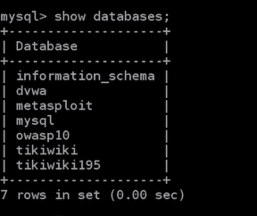
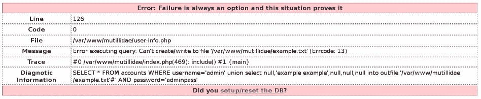
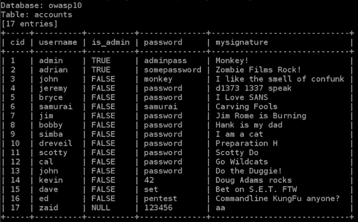

# 第二十章：SQL 注入漏洞

在本章中，我们将研究**SQL 注入**（**SQLi**）漏洞。为了深入了解这些漏洞，我们将首先学习 SQL，了解为什么我们要学习 SQL，以及如何

危险的 SQLi 究竟是什么。接下来，我们将学习一些发现 SQL 注入的技巧。然后，我们将学习如何绕过 SQLi 授权以及如何使用`GET`方法发现 SQLi。我们还将看到如何绕过 SQL 命令，并使用命令发现表格。在`loadfile`部分，我们将看到如何在服务器文件上实现 SQLi。接下来，我们将学习如何使用一个名为`sqlmap`的工具。最后，我们将探讨一些防止危险 SQL 注入的技术。

在本章中，我们将讨论以下主题：

+   什么是 SQL？

+   SQLi 的危险

+   发现 SQLi

+   SQLi 授权绕过

+   使用`GET`方法发现 SQL

+   基本的`SELECT`语句

+   发现表格

+   读取列及其数据

+   服务器上的文件读写

+   `sqlmap`工具

+   防止 SQLi

# 什么是 SQL？

我们将学习一种叫做 SQLi 的常见漏洞类型。在讨论它是如何发生以及如何利用它之前，首先让我们了解一下 SQL 是什么。例如，如果我们在某个网站进行渗透测试，网站的规模可能比其他网站大一些，因此很可能使用了数据库。除了一些非常简单的网站，大多数网站都使用数据库来存储数据，比如用户名、密码、新闻文章、博客文章、图片，以及网站上的任何动态数据。Web 应用程序读取数据库并将数据展示给我们或用户。当用户在网站上执行某个操作时，应用程序将更新、删除或修改数据库中已有的数据。这种 Web 应用程序与数据库之间的互动是通过一种叫做 SQL 的语言实现的。

让我们来看一下数据库的含义。这只是一个数据库的示例；我们将登录到安装在我们的 Metasploitable 机器上的数据库，看看它存储了什么。我们不会进行任何黑客攻击或复杂的操作；我们只是登录到 MySQL，然后输入用户名`root`—Metasploitable 没有为`root`设置密码，这非常不安全，但显然这是一个易受攻击的系统。我们只是登录，不是进行任何黑客攻击，也不是进行 SQL 注入，只是在 MySQL 的终端上操作，Web 应用程序会用这个终端与数据库进行交互。以下是命令：

```
mysql -u root -h 10.20.14.204 
```

以下是命令的输出：


在这个示例中，我们只是想看看我们所说的数据库是什么，以及它们存储了什么。现在，输入`show databases`，这将显示我们目标服务器上存在的数据库。在下图中，我们可以看到有一个`information_schema`数据库，它是一个默认数据库，包含关于所有其他数据库的默认信息：



它在安装 MySQL 时默认安装，其他数据库则是为每个网络应用程序单独安装的。我们可以看到有一个` tikiwiki`，一个`owasp10`，还有一个`mysql`，另一个叫`metasploit`，以及一个`dvwa`，这就是我们用于网络应用程序的数据库。我们可以看到，对于每个网络应用程序，都有一个数据库，其中包含该应用程序使用的信息。

让我们来看一下数据库的内容。我们将使用`owasp10`数据库。我们将在终端输入`Use owasp10`命令，从这个表中读取信息。每个数据库都有一个表，其中包含信息，因此我们启动`show tables`命令来查看我们拥有的表：


我们有一个`accounts`表，所以我们可以推测这个表包含关于用户名、密码和用户的信息。我们有一个名为`blogs_table`的表，可能包含博客输入信息，比如帖子和评论。我们还看到了`captured_data`和`credit_cards`，所以有一个表包含信用卡详情。对于购物网站来说，这一点非常重要，实际上他们会有一个`credit_cards`表，信用卡信息会存储在那里。基本上，数据库会存储所有的东西，网站上使用的所有数据，因为它们不会存储在文件中，这样效率更高。

让我们看看`accounts`表；如果我们只输入`select`，这就是网络应用程序如何从数据库中检索信息的方式。应用程序可以选择、更新或删除；我们在这个示例中使用的是`select`语句。同样，这不是黑客攻击——我们只是执行一个`select`语句，从`accounts`表中选择所有内容，命令为`select * from accounts`：


我们有账号 ID、用户名、密码、用户签名和是否为管理员的列。现在，列的设置取决于表，因此设计数据库的人会设计表和列，然后数据由网络应用程序插入。我们可以在前面的截图中看到，有一个名为`admin`的用户，密码是`adminpass`。我们还可以看到有一个名为`adrian`的用户，密码是`somepassword`。

这个例子只是为了让我们了解数据库长什么样，并感受一下它们；在后面的章节中，我们将尝试利用这些数据库，获取类似的访问权限。因此，在这里，我们只是用用户名和密码登录了。通常情况下，我们是无法访问的，只有网络管理员才能访问。在接下来的章节中，我们将尝试进行一些攻击，以获得访问权限，从而完全控制数据库，读取和写入（或修改）数据。

# SQL 注入的危险

在本章的这一部分，我们将重点讨论为什么 SQL 注入如此重要和危险。原因在于它们无处不在；很多大型网站都有这种漏洞，例如 Yahoo 和 Google。它们非常难以防护，而且很容易犯错，导致这些漏洞被滥用。它们之所以危险的另一个原因是，因为它们让黑客获得数据库的访问权限。在许多场景中，如果我们发现了 SQL 注入漏洞，我们就不需要上传`PHP` shell 或建立反向连接。其实没有必要上传任何东西，也不需要增加被抓住的风险，因为只要我们能够访问数据库，我们几乎就能得到我们需要的一切。我们可以获得用户名和密码，并可以使用普通的用户名和密码登录，作为普通用户；如果我们在寻找敏感数据，我们可以访问信用卡信息。我们几乎可以做任何想做的事情，所以实际上没有必要进一步利用系统。

如果我们发现了 SQL 注入漏洞，那太好了！这就是我们所需要的。在很多场景下，我们使用 PHP shell 来访问数据库，看看是否能够读取数据。假设我们成功地在 Metasploitable 服务器上上传了一个 PHP shell，但随后却无法访问数据库；这时我们就无法看到什么。我们无法看到信用卡、用户名和密码；虽然我们已经控制了服务器，但却无法读取信息，所以有时候在上传 PHP shell 之后，下一步就是访问数据库。SQL 注入可以做很多事情，因此如果我们在一个不是目标网站，但在同一服务器上的网站中找到了 SQL 注入漏洞，我们可以利用它读取`/www/root`目录之外的文件。类似于文件包含漏洞，我们可以利用管理员账户及其用户名和密码，看看是否能够上传一些信息。通常管理员可以上传很多东西，因此我们可以从这里上传一个 PHP shell 或后门，然后导航到目标网站，或者在某些情况下，我们可以使用 SQL 注入上传 PHP shell。所以，SQL 注入既可以作为文件包含漏洞和文件上传漏洞，也可以让我们访问整个数据库。这就是它们非常危险且有用的原因，如果我们能够找到一个 SQL 注入漏洞的话。

# 发现 SQL 注入

现在，让我们尝试发现一些 SQL 注入漏洞。我们需要浏览目标网站，尝试突破每个页面。每当我们看到一个文本框或表单中的参数，比如 `page.php`，然后是 something = something；就尝试在那里注入内容，尝试使用单引号，尝试使用 AND，或者使用 `orderby` 语句来破坏页面，使其显示不同的内容。例如，我们将使用 Metasploit 的 Mutillidae 漏洞网站。我们首先进入登录/注册页面，如下图所示，它会要求我们登录。现在，网站已经注册了你的名字，所以你可以点击“请在这里注册”并完成注册：


注册后，进入登录页面。目前，我们正在使用向文本框注入的例子，所以我们可以尝试在 Name 和 Password 文本框中注入内容。例如，假设我们将 Name 设置为 `zaid`，然后在 Password 中输入一个单引号 (`'`)，然后点击登录。如以下截图所示，出现了一个错误信息，它看起来不像普通的错误。它看起来像是一个数据库错误，通常你很幸运才能遇到这样的错误：


通常，错误信息不会像这样那么详细；有时我们只会看到页面没有按预期工作，或者页面看起来不对。例如，如果是新闻页面，可能会缺少文章；如果是博客，可能会有一篇帖子消失，或者不同类型的帖子消失，所以我们需要留意哪些部分发生了变化。在这个例子中，我们实际上得到了一个非常不错的错误；它告诉我们出现错误的文件，错误出现在我们添加的引号附近，执行的语句是什么。这对学习非常有帮助，因为现在我们可以看到系统正在尝试执行的语句，系统尝试执行 `SELECT *`，所以它正在尝试选择所有内容：`FROM accounts WHERE username='zaid' AND password='''`。注意，系统，即网页应用程序，已经在名称周围添加了引号。当我们输入 `zaid` 时，它在两个引号之间添加了 `zaid`，并且它将我们添加的单引号 (`'`) 放在另外两个引号之间，这就是为什么我们有三个引号。从这个错误中，我们可以推测目标网站有 70% 可能存在 SQL 注入漏洞。

我们仍然不确定它是否能执行我们想要的内容，所以我们是否可以实际注入代码并让其执行？让我们看看是否可以做到；`username` 再次将是 `zaid`，我们将将 `password` 设置为 `123456`。完成后，只需关闭网站。我们关闭了网站，因为系统中的当前语句是 `Select * from accounts where username = 'zaid' and password ='$PASSWORD'`，它将自动打开一个单引号，接着是 `$PASSWORD`，我们将提供它。因此，我们正在处理 `password` 作为一个变量；它接受我们放入密码文本框的任何内容，并将其放置在两个单引号之间，然后在系统上执行。因此，我们将输入 `123456'`。我们将手动添加一个引号，代码如下所示：

```
select * from accounts where username = 'zaid' and password ='123456''
```

应用程序将从 `accounts` 中 `select`，其中 `password` 等于 `123456`，并且我们在末尾有两个引号。然后，我们将加入 `and 1=1`。我们只是想看它是否会执行我们想要的内容。我们的语句将如下所示：

```
Select * from accounts where username = 'zaid' and password='123456' and 1=1'
```

我们将手动插入 `123456' and 1=1`。系统会抱怨我们多了一个引号，因为我们手动将密码插入到文本框中；它会说有一个未闭合的引号。现在，我们将添加一条注释，在我们这样做之后，注释之后的所有内容都不会被执行。我们将使用井号 (`#`) 作为注释，因此系统将忽略井号之后的任何内容；它将忽略命令插入的最后一个引号。因此，我们的代码将如下所示：

```
Select * from accounts where username='zaid' and password ='123456' and 1=1#'
```

我们需要将密码 `123456 and 1=1#` 粘贴到密码文本框中，并且应该能够作为 `zaid` 登录，如下面的屏幕截图所示：


让我们尝试一些不同的东西：让我们尝试添加一个错误的语句。我们做了 `1=1`，那是正确的，它执行了我们想要的内容。让我们尝试 `1=2`，这是错误的，所以我们有正确的密码和正确的用户名，并且我们将添加 `1=2#` —— 这应该会有问题，因为它是 `false`，`1` 不等于 `2`，并且我们使用 `and`，所以一切都必须是真实的。即使我们输入正确的用户名和密码，它也应该给我们一个错误。因此，我们将 `Password` 输入为 `123456 and 1=2#`，它应该给我们一个错误：


该网站给出了身份验证错误：用户名或密码错误，尽管我们使用了正确的密码和用户名。这证实了该网站实际上在密码中注入了我们想要的任何内容，因此我们可以使用 `password` 字段来注入 SQL 代码。

# SQLi 授权绕过

现在我们知道，我们可以输入任何代码，并且它会在系统上执行。那么，咱们再看看这个语句，它写的是`select * from accounts where username = username`，并且`password = password`，这些我们是放在密码文本框里的。接下来我们将看看，能不能在不使用密码的情况下登录，我们将用管理员账号进行测试。因此，`username`将是`admin`，而我们不知道`admin`的密码，所以我们输入一个随机密码，比如`aaa`。在我们之前运行的代码中，我们写了`and 1=1`，现在我们把`and`换成`or 1=1`。所以，一旦我们注入这个命令，它就能让我们在不知道`admin`密码的情况下登录。我们的代码如下所示：

```
select * from accounts where username = 'admin' and password='aaa' or 1=1'
```

当我们使用`admin`作为用户名，并在密码文本框中粘贴`aaa' or 1=1`时，我们可以看到成功登录了，管理员的签名是“Monkey!”：


所以，只要我们有一个`or`条件，如果`or`条件为真，那么一切都为真——这就是`or`语句的工作原理。

绕过登录可以通过多种方式实现，具体取决于页面上编写的代码以及我们如何设想这段代码。在很多情况下，当我们输入单引号时，我们不会看到错误信息。

接下来，我们展示另一个绕过的例子。除了注入代码外，`admin`参数也是可以注入的，正如我们在输入单引号时看到的，它和`password`参数一样，因此我们也可以在`username`中注入代码。

尝试在`username`中注入一些东西；我们将`username`设置为`admin`，然后关闭引号并添加一个注释。所以，当我们运行`select * from accounts where username = 'admin'#' and password='aaa'`这个语句时，它将注入到`username`中。

它将允许我在密码字段中什么也不输入的情况下登录。因此，我们将用户名设置为`admin'#`，然后可以输入任何我们想用的密码。我们只输入`1`，然后登录；我们可以看到我们成功以`admin`身份登录：


再次说明，这是黑箱测试，所以我们并不真正看到代码。在许多情况下，我们希望进行尝试并观察它是如何工作的，但我们主要要测试的是 SQL 注入是否存在，我们使用前一节中的方法进行测试。所以，尝试单引号，尝试`and`语句，尝试一个真实的`and`语句，比如`1=1`，然后尝试一个假的`and`语句，比如`1=0`或者`2=0`，如果它们按预期工作，那么你的目标就有 SQL 注入漏洞，你可以开始玩弄它。

# 发现使用 GET 方法的 SQL 注入（SQLi）

现在我们将在不同的文件中研究一个 SQLi，在不同的页面上看到一些不同的东西，我们可以利用这个漏洞。首先，转到登录页面，该页面位于 OWASP 十大 | A1-注入 | SQL-提取数据 | 用户信息：


在上一节中，我们通过单击页面上的登录/注册选项进入了登录页面；这次我们将通过用户信息页面，因此页面将向我们显示有关用户的信息，只要我们提供姓名和密码。输入所有凭据，如`username`和`password`，页面将向我们显示所有`username`和`password`详细信息以及我们的签名，如下所示：


在这里执行的语句类似于我们登录时执行的语句。正如我们在以下代码中看到的那样，`select * from accounts where $USERNAME`是我们放入`username`字段中的内容，`$PASSWORD`是我们放入`password`字段中的内容：

```
select * from accounts where username = '$USERNAME' and password='$PASSWORD'
```

现在我们将看到一种利用这种漏洞的不同方式。在上一节中，我们是使用`POST`文本框来执行的，因此无论您在文本框中放入什么都将使用`POST`方法将其发布到 Web 应用程序。现在，这些漏洞也可能存在于`GET`方法中，我们所说的`GET`是指，当使用`GET`发送某些内容时，我们将在 URL 中看到它。因此，如果我们查看以下 URL，我们将看到它被发送为`username=zaid&password=123456`：


复制 URL，我们将从 URL 开始进行操作，而不是在网页上进行操作。我们只是想展示一个不同的例子，因为在许多地方甚至可能没有文本框。它可能是诸如`news.php`之类的东西。在我们的示例中，它是`index.php`，在我们的渗透测试中，您可能会看到诸如`news.php`和`id=2`之类的东西，然后我们可以尝试在其中注入。因此，我们将向`username`字段注入内容，并在 URL 中输入信息。当我们进行渗透测试时，每当看到诸如`username`和`password`之类的参数时，我们应该尝试注入它们；每当看到`something.php`然后我们有一个等于 something 的参数时，总是尝试在其中注入并查看是否适用于我们。

我们还看到了使用引号和`and`语句发现注入的方法。因此，我们先进行一个错误的`and`，然后是一个正确的`and`，`and 1=1`，接着是`and 1=2`，如果服务器执行了我们想要的操作，我们就知道有 SQL 注入漏洞。我们还将看到另一种发现这些漏洞的方法，那就是使用`order by`语句。`order by`语句用于限制屏幕上将显示的记录数量。我们的注入将执行`order by 1`。如果注入存在，这应该会成功，因为`order by 1`。页面应该至少选择一条记录，因为我们知道该页面正在与数据库通信。所以，`order by 1`应该始终有效并返回我们预期的结果。我们还需要添加注释并执行代码，和之前完全一样。基本上，数据库中执行的代码将如下所示：

```
select * from accounts where username = 'zaid' order by 1#' password='$PASSWORD'
```

URL 的命令将如下所示：

```
index.php?page=user-info.php&username=zaid' order by 1#&password=123456&user-info-php-submit-button=View+Account+Details
```

对于这个例子，查询将是`select * from accounts where username = 'zaid'`，注意单引号（`'`）结束了语句；我们将执行`order by 1`。评论将告诉 SQL 解释器忽略其后的所有内容，这些内容都是井号（`#`）后的命令。复制前面的代码并将其粘贴到登录页面的姓名文本框中。这是可行的，但我们只是通过浏览器注入它，查看另一种做法。另一个需要注意的点是，当我们将内容注入浏览器时，代码应该进行编码，因此，例如，井号（`#`）应该写成`%23`。空格将转换为`%20`，而`%23`是我们用作注释的符号，所以我们将复制它并在 URL 空间中替换掉我们的注释符号。于是，URL 变更为以下内容：

```
index.php?page=user-info.php&username=zaid' order by 1%23&password=123456&user-info-php-submit-button=View+Account+Details
```

将网址粘贴到地址栏并按下*回车*，然后我们会看到一个可接受的结果。接着它会显示关于 zaid、123456 和签名的信息，因此它忽略了密码，注入成功——它按`1`排序，因此没有显示任何错误：


让我们尝试将`1`设置为一个非常大的数字，例如，我们可以在 URL 部分放入`10000`或`100000`。它将显示`1000000`条记录在登录页面上。可能页面不会显示`1000000`条记录，并且数据库中也没有`1000000`条记录，所以当我们执行时，会看到一个错误。错误发生在`order`子句中，`1000000`是一个未知的列：


所以，数据库中没有 `1000000` 列，这非常好，因为现在我们知道数据库正在执行我们想要的操作。当我们告诉它显示 `1` 条记录时，它确实显示了一条记录，当我们告诉它显示大量记录时，它对此进行了抱怨，因此它显然对 SQL 注入存在漏洞。

# 基本的 SELECT 语句

让我们尝试确定在前面的截图中有多少列被选入页面。我们在前一部分执行查询时，在登录页面上选择并显示了多少信息？为了做到这一点，我们将使用 `order by` 语句。在前一部分中，我们使用了 `order by 1`，这返回了一个可接受的结果，而 `order by 1000000` 给出了错误，所以我们尝试使用 `order by 10`；我们将看到，依然会出现错误。

尝试 `order by 5`，我们将看看它是否有效。通过执行这个操作，我们知道有五列是从某个表中被选中的，且这个表是 `accounts` 表，然后它显示在登录页面上。现在，让我们构建我们自己的 `select` 语句，并在目标计算机上执行。此时，语句是 `Select * from accounts where username = 'zaid'`，并且我们正在使用 `order by 1`。让我们看看是否可以修复它，并使它选择我们喜欢的内容。由于我们正在尝试进行多个 `select` 语句，并且我们打算从 URL 中进行操作，我们需要使用 union，然后我们将说 `select`。在这个 web 应用中，我们知道有五条记录被选中，所以有五列被选中，因此我们正在执行 `1,2,3,4,5`；让我们在 URL 中运行这个命令，看看会发生什么：

```
index.php?page=user-info.php&username=zaid' union select 1,2,3,4,5%23&password=123456&user-info-php-submit-button=View+Account+Details
```

我们可以看到选择是正确的，我们得到了第一次选择的结果：


这一行完成了第一次选择，然后执行了 `union`，所以它将这个选择与另一个选择合并，并显示了其他内容。正如我们在前面的截图中看到的，我们只看到了 2、3 和 4，这意味着无论我们在 `2`、`3` 或 `4` 位置输入什么值，或者我们想要 `select` 的内容，只要我们将其放入 URL 中，它就会显示在页面上，并且我们可以看到 `2` 的结果，所以无论你在 `2` 中放入什么，都会显示在页面上。

所以，让我们尝试查看我们的数据库。我们将 `2` 改为 `database`，将 `3` 改为 `username` 或 `user`，将 `4` 改为 `version`；这将 `select` 当前的数据库、我们当前拥有的用户权限和数据库的版本。于是，让我们执行以下命令：

```
union select 1,database(),user(),version(),5
```

URL 命令的变化如下：

```
index.php?page=user-info.php&username=zaid' union select 1,database(),user(),version(),5%23&password=123456&user-info-php-submit-button=View+Account+Details
```

命令的输出如下截图所示：


用户名显示为 owasp10 和`2`，所以`owasp`是我们正在查找的数据库。我们当前以 root@localhost 身份登录，所以我们是`root`用户。我们注入了版本信息，并且可以看到这是 MySQL 的版本，版本号是 5.0.51。我们知道我们连接的数据库是`owasp10`。在大多数实际场景中，每个数据库都会分配给某个特定用户，因此你通常只能`select`当前数据库中的详细信息、表格、列和数据。然而，我们以`root`身份登录，且 Web 应用程序已连接到数据库并使用`root`，所以我们可以访问其他数据库，但这在现实场景中并不常见。通常，每个用户都有自己的数据库，因此当他们将 Web 应用程序连接到数据库时，他们只会连接到一个数据库，因此你无法访问其他数据库。所以，我们假设我们仅能访问`owasp10`，这是当前网站的数据库，且密码为`root@localhost`。

在接下来的章节中，我们将看到如何进一步利用 SQL 注入并执行更强大的`select`语句。

# 发现表格

现在我们知道目标数据库叫做`owasp10`，让我们尝试发现该数据库中存在的表格。所以，我们的`select`语句是`union select 1, database(),user(),version(),5`。删除`user()`和`version()`，或者将它们改为`null`，因为我们现在只想`select`一项，并且在`2`中，我们将从`information_schema`数据库中`select table_name`。我们知道`information_schema`是 MySQL 创建的默认数据库，包含有关其他所有数据库的信息。我们从`information_schema`中选择`table_name`，点后跟`tables`。基本上，我们是在从名为`information_schema`的数据库中选择名为`tables`的表格，并且我们选择的列叫做`table_name`，所以我们是从`information_schema`数据库的`tables`表中选择`table_name`。命令如下：

```
union select 1,table_name,null,null,5 from information_schema.tables
```

URL 命令更改如下：

```
index.php?page=user-info.php&username=zaid' union select 1,table_name,null,null,5 from information_schema.tables%23&password=123456&user-info-php-submit-button=View+Account+Details
```

执行命令以查看我们是否能够获取`owasp10`数据库中所有现有的表格。我们可以看到我们得到了 237 条记录；以下是我们可以访问的所有表格：


我们以`root`身份登录，因此我们可以看到其他 Web 应用程序的表格，例如 tikiwiki，但在现实场景中，我们通常只能看到与当前数据库（即 Mutillidae）相关的表格。

现在我们要使用`where`子句并且说`where table_schema = 'owasp10'`。我们在执行命令时得到了`owasp10`数据库，所以我们得到了`owasp10`，这是 Mutillidae 正在使用的当前数据库。我们使用相同的语句：我们从`information_schema`表中选择`table_name`，其中`table_schema`为`owasp10`。命令如下：

```
union select 1,table_name,null,null,5 from information_schema where table_schema = 'owasp10'
```

URL 命令更改如下：

```
index.php?page=user-info.php&username=zaid' union select 1,table_name,null,null,5 from information_schema where table_schema='owasp10'%23&password=123456&user-info-php-submit-button=View+Account+Details
```

执行它后，如下截图所示，我们只看到了我们感兴趣的表：


我们有`accounts`、`blogs_table`、`captured_data`、`credit_cards`、`hitlog`和`pen_test_tools`等表。现在，在*什么是 SQL？*部分，我们看到了`owasp10`表的内容，前面的截图也展示了`owasp`数据库中的相同表。

# 读取列及其数据

在本节中，让我们看看是否可以`select`并查看`accounts`表中的所有详细信息。让我们检查一下是否能够查询数据库并读取`accounts`表中存储的信息。为此，我们需要知道`accounts`表中存在的列名，因为根据我们使用的语句，我们正在执行`union select table_name from information_schema.tables`，所以我们还不知道`accounts`表中有哪些列。我们可以猜测它有一个用户名和一个密码，但有时它们可能有不同的名称，所以我们将看看如何`select`某个表的列。

该命令将与我们在前一节中使用的`tables`命令非常相似，唯一的区别是我们将`table_name`替换为`column_name`，并且不是从`information_schema.tables`中选择，而是从`information_schema.columns`中选择。我们将输入`where table_name = 'accounts'`，因为我们只对`accounts`表感兴趣。如果我们想获取其他表的列，只需将`accounts`替换为所需的表或列名即可。所以，我们的命令如下所示：

```
union select 1,column_name from information_schema.columns where table_name = 'accounts'
```

URL 命令变为以下内容：

```
index.php?page=user-info.php&username=zaid' union select 1,column_name from information_schema.columns where table_name = 'accounts'%23&password=123456&user-info-php-submit-button=View+Account+Details
```

该命令应该显示`accounts`表中存在的所有列。运行命令后，当我们在地址栏中执行它时，我们将看到与本章开始时看到的`accounts`数据库结构相同的列，以及其`cid`、`username`、`password`、`mysignature`和`is_admin`列，如下图所示：


让我们更进一步，`select`出`accounts`表中的`usernames`和`passwords`列。因此，命令将与我们当前执行的非常相似：

```
union select 1,usernames,passwords,is_admin,5 from accounts
```

现在，请记住，我们不能在命令中选择除`1`和`5`之外的任何其他数字，因为它们从未在屏幕上显示给我们。唯一显示的数字是`2`、`3`和`4`，所以我们只需替换`2`、`3`和`4`的值。我们的 URL 命令变为以下内容：

```
index.php?page=user-info.php&username=zaid' union select 1,usernames,passwords,is_admin,5 from accounts%23&password=123456&user-info-php-submit-button=View+Account+Details
```

我们正在从`accounts`数据库中选择`username`、`password`和`is_admin`列，它应该返回`accounts`表中所有的用户名和密码。如以下截图所示，我们获得了所有的用户名和密码：


我们有`admin`用户名，密码是`adminpass`；我们还有其他用户名和密码。这非常有用，因为在大多数网站上，当我们以`admin`身份登录时，我们拥有比普通用户更多的权限，然后我们就可以上传 PHP shell、后门、病毒，或者任何我们想要的东西，进而进一步利用系统。所以，此时我们实际上可以用`admin`用户名和`adminpass`密码登录，系统会接受这个登录，因为密码是正确的。不论密码多复杂，我们都会成功登录，因为我们直接从数据库中读取了密码。

# 在服务器上读取和写入文件

在这一部分，我们将探讨如何使用 SQLi 来读取服务器中的任何文件。所以，即使文件位于`/www`目录之外，我们也能像文件泄露漏洞一样精确地读取它，我们还将看到如何利用这一点写入文件并将其上传到系统，就像文件上传漏洞一样。

首先，让我们看看如何读取文件；我们将把所有设置为`null`。所以，我们的语句如下：

```
union select null,load_file('/etc/passwd'),null,null,null
```

我们不选择列或表，而是希望运行一个名为`load_file()`的函数，然后我们将设置要加载的文件。我们将使用之前在文件包含漏洞中查看的相同文件，即`/etc/passwd`。URL 命令如下：

```
index.php?page=user-info.php&username=zaid' union select null,load_file('/etc/passwd'),null,null,null%23&password=123456&user-info-php-submit-button=View+Account+Details
```

运行上面的 URL 后，我们可以从以下截图中看到，我们成功读取了`/etc/passwd`文件的所有信息和内容，尽管它不在网站根目录中：


它存储在`/etc/passwd`中，因此我们可以通过在`load_file()`函数中指定该文件的完整路径，从其他网站或其他文件中读取服务器中的任何内容。

现在，我们将开始写入服务器。这非常有用，因为我们将能够写入任何我们想要的代码。我们可以写入 PHP 脚本代码，甚至可以写入 shell、病毒或 PHP 代码来获取反向连接——这些代码基本上就像是文件上传漏洞。为了做到这一点，我们将把我们想要的代码写在这里，并将其命名为`example example`。我们将使用一个名为`into outfile`的函数，然后指定我们想要将该文件存储的位置。在最佳情况下，我们将能够写入 web 根目录，这意味着我们可以通过浏览器访问该文件并执行它，然后上传 Weevely 文件并连接到它。我们将把文件保存在`/var/www/`目录中（那是我们的 web 根目录），这样我们就可以通过它访问内容，或者你也可以把它放在`/var/www/mutillidae`目录中。确保将所有内容设置为`null`，这样除了你在`2`中输入的`example example`文本外，文件中不会写入任何其他内容，并且它将被存储在`/var/www/mutillidae/example.txt`文件中。以下是命令：

```
union select null,'example example',null,null,null into outfile '/var/www/mutillidae/example.txt'
```

让我们尝试运行该语句。URL 命令如下：

```
index.php?page=user-info.php&username=zaid' union select null,'example example',null,null,null into outfile '/var/www/multillidae/example.txt'%23&password=123456&user-info-php-submit-button=View+Account+Details
```

如果我们看到下面的截图，就会知道命令没有成功，因为 SQL 或 MySQL 不允许创建或写入`/mutillidae`目录。问题在于我们没有足够的权限来写入`/mutillidae`位置：



为了测试这个漏洞，我们将把位置更改为`/tmp`并运行代码，我们会看到实际上我们可以写入`/tmp`目录：


在上面的截图中显示了错误信息，但如果我们使用`ls /tmp/`命令列出文件，我们可以在下面的截图中看到一个名为`example.txt`的文件。如果我们尝试读取该文件，我们将看到它包含我们的`select`命令的内容以及文件中写入的`example example`文本：


我们可以通过输入错误的用户名来摆脱`admin`和`adminpass`，这时不会显示任何内容。我们唯一会看到的是输出，即`example example`。再次强调，这只有在我们能够写入我们的 web 服务器并访问它时才有用，然后我们可以使用我们的 shell 或 payload 进一步利用该系统。

# sqlmap 工具

在本节中，我们将学习一个称为`sqlmap`的工具，它允许我们做到我们到目前为止学到的一切，甚至更多。这个工具可以针对 MySQL 数据库进行操作，这是我们示例中使用的数据库之一。它还可以针对 Microsoft SQL、Oracle 和其他数据库进行操作。这个工具非常有用；有时候注入并不像我们看到的那么好，有时我们每条记录只能得到一个输出，我们必须循环遍历所有输出。这个工具可以自动化这一过程，为我们做所有的事情，这样更容易更简单。

这是我们用于注入的 URL：`http://10.20.14.204/mutillidae/index.php?page=user-info.php&password=aaa&user-info-php-submit-button=View+Account+Details`。因此，URL 正在使用`user-info.php`页面，用户名为`admin`，密码为`adminpass`。我们实际上不需要使用用户名和密码，所以我们可以在那里放任何东西，只是假设我们不知道密码，我们只是在注入 SQL 注入。复制该 URL 并将其插入以下`sqlmap`命令中：

```
sqlmap -u "http://10.20.14.204/mutillidae/index.php?page=user-info.php&password=aaa&user-info-php-submit-button=View+Account+Details"
```

我们正在使用`-u`选项来指定 URL；确保将 URL 放在两个引号之间，以免忽略它们之间的任何内容。我们在中间有一些标志和字符，希望它们被视为一个 URL。

按*Enter*，工具将自动查看所有参数：


它将查看`user-info.php`中的用户名和密码，看看它们是否可注入；一旦完成，它将存储在内存中。因此，它将知道是否有什么可注入的，然后我们将能够进一步利用目标。

正如我们在下面的图片中看到的那样，它认为我们的目标可能是 MySQL 或 PostgreSQL，询问我们是否应该跳过其他测试，我们将会说*是*，因为我们知道它是 MySQL。稍后它会问我们是否应该对这两个数据库做所有的测试，我们会说是，假设我们不确定到底是哪一个，如下面的截图所示：


我们知道它是 MySQL，但我们只是让它自行处理，我们将看看它是否能正确地执行。它检查是否为 PostgreSQL，我们假设它会这么做，然后它会知道这是 MySQL，它刚刚发现`username`似乎是可注入的，确实在这里告诉我们`username`参数是有漏洞的，我们可以进行注入：


所以，它在问我们是否要检查其他参数，我们可以说是并让它执行，但我们将会说*否*，因为如果只是使用`username`进行注入，我们并不介意。


现在，`sqlmap`知道目标是可注入的，它将使用`username`参数进行注入。正如我们在前面的截图中看到的，它已经确定正在运行`Linux Ubuntu`，正在使用`PHP 5.2.4`，带有`Apache 2.2.8`，并且作为数据库服务器使用`MySQL 5.0`服务器。

`sqlmap`是一个非常强大的工具，在本节中，我们只是快速看看它可以做些什么。我建议您花更多时间来研究它，看看它还能做什么。

所以，让我们运行`sqlmap --help`：


现在让我们尝试获取`current-user`和`current-db`，所以我们将使用之前使用过的相同命令。我们将在命令后添加`-- dbs`以获取当前数据库：

```
sqlmap -u "http://10.20.14.204/mutillidae/index.php?page=user-info.php&password=aaa&user-info-php-submit-button=View+Account+Details" --dbs
```

正如我们在下面的截图中看到的，我们获得了所有需要的数据库。有`dvwa`、`information_schema`、`metasploit`、`mysql`、`owasp10`和`tikiwiki`：


现在，如果我们运行相同的命令，将`--dbs`替换为`--current-user`，我们可以看到我们是`root`：


如果我们用`--current-user`替换为`--current-db`，我们将看到`owasp10`是我们当前的数据库：


现在，让我们尝试获取`owasp10`的表格。我们还将使用`--tables`和`D`选项来指定数据库，我们的数据库将被称为`owasp10`，因此命令将如下所示：

```
sqlmap -u "http://10.20.14.204/mutillidae/index.php?page=user-info.php&password=aaa&user-info-php-submit-button=View+Account+Details" --tables -D owasp10
```

正如我们在下面的截图中所见，该命令为我们获取了存在于`owasp10`数据库中的所有表，如`accounts`、`blogs_table`和`credit_cards`表：


现在，如果我们想要获取列，我们可以再次使用相同的命令，我们将从`-T accounts -D owasp10`获取`--columns`。以下是命令：

```
sqlmap -u "http://10.20.14.204/mutillidae/index.php?page=user-info.php&password=aaa&user-info-php-submit-button=View+Account+Details" --columns -T accounts -D owasp10
```

以下是命令的输出：


所以，我们有`is_admin`、`password`和`username`，我们可以使用`--dump`选项获取它们的数据。这是我们之前使用的相同命令，因此我们从`accounts`表和`owasp10`数据库获取它们。以下是命令：

```
sqlmap -u "http://10.20.14.204/mutillidae/index.php?page=user-info.php&password=aaa&user-info-php-submit-button=View+Account+Details" -T accounts -D owasp10 --dump
```

以下是前述命令的输出：



在上述截图中，我们有`admin`，其`adminpass`密码，还有`adrian`，他的密码是`somepassword`。所以，正如我们所说，这个工具非常有用。它可以让我们的生活变得更加轻松，而且一切都是自动的。

# 防止 SQL 注入

到目前为止，我们已经看到 SQL 注入是非常危险的；它们也非常容易发生，而且很容易被发现。我们会在任何地方发现它们，甚至在一些非常著名的网站中。人们尝试通过使用过滤器来防止这些漏洞。过滤器可以让它看起来好像没有漏洞，但如果我们实际加大力度，使用不同类型的编码，或者通过代理，我们将能够绕过大多数这些过滤器。一些程序员使用黑名单，例如，防止使用`union`和`insert`语句。但这并不是百分之百安全的，也可以被绕过。使用白名单也存在与黑名单完全相同的问题。

防止 SQL 注入的最佳方法是编写我们的 Web 应用程序，使其不允许代码被注入并执行。所以，最佳的做法是使用参数化语句，在这种语句中，数据和代码是分开的。让我们来看一个例子，我们在这个例子中尽量保持最少的编程部分。我们不希望它成为一个编程示例（实际上，编程中存在错误），但我们试图更多地关注概念，而非如何编写代码。以下是示例代码：

```
$textbox1 = admin' union select #
Select @ from accounts where username='admin' union select #'
```

这个脆弱的代码使用了`Select * from accounts`，其中`username`等于我们在`textbox1`中输入的内容，然后我们在`textbox1`中输入例如`admin`，并且关闭引号。接着，我们能够执行`union select`并执行其他操作；一旦完成，我们添加注释（`#`），这基本上会忽略注释之后的所有内容。代码看起来是这样的：

```
Select * from accounts where username ='admin' union select #'
```

这非常糟糕，且非常难以防范。使用过滤器只会隐藏问题，并不能解决它。解决漏洞的最佳方法是使用参数化语句，以下是一个示例：

```
prepare("Select * from accounts where username = ?")
execute(array('textbox1'))
```

这是安全的做法。首先，我们`prepare`语句。大多数语言，比如 PHP，实际上都有一个可以`prepare ("Select * from accounts where username = ?")`的函数，然后我们发送值。所以，PHP 现在知道 SQL 语句是`Select * from accounts where username`等于某个值，然后它会使用`textbox1`的值。即使我们使用非常狡猾的语句`'$admin' union select #'`并粘贴到`execute`函数中，Web 应用程序也会知道`textbox1`的值是`admin union select`。它实际上会尝试使用`Select * from accounts where`的`username`，然后它会添加自己的引号，并尝试用插入的`username`查找`username`。所以，它会变成`select * from accounts where username ="'$admin' union select#`。因此，无论我们在`textbox`中输入什么内容，它都会被当作一个值发送，Web 应用程序会知道这应该是一个值而不是代码，它将永远不会执行它。这将保护我们免受 SQL 注入攻击。

我们可以将过滤器作为第二道防线。建议我们使用最小权限原则。因此，对于每个数据库，使用一个权限最小的用户；不要允许用户做任何他们想做的事；除非是一个只做选择的简单网站，那么只允许用户`select`。如果他们只需要`select`和`insert`，那么只允许他们`select`和`insert`；这是我们应该遵循的规则，甚至对于 Linux 系统也是如此。确保权限始终保持最小化，确保每个用户没有任何他们不需要的额外权限。

# 总结

在这一章中，我们讨论了一个可以被利用的漏洞，那就是 SQL 注入。SQLi 可以用于对机器和服务器的数据库执行一系列非常危险的攻击。首先，我们看到如何发现这些注入漏洞。我们还学会了如何通过 URL 登录系统——我们只需要启动几行代码，代码中只需要提到密码和用户名。接着，我们看到了如何在不使用登录凭证的情况下绕过 SQLi。我们甚至使用`GET`方法来发现 SQLi。之后，我们学会了如何在数据库上执行基本的`select`语句。我们还学会了如何使用`sqlmap`工具，该工具能够执行很多操作，但我们在这一章中只介绍了基础部分。最后，我们讨论了防止 SQLi 的方法。在下一章中，我们将利用跨站脚本漏洞。
