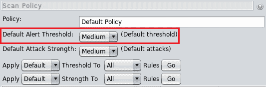
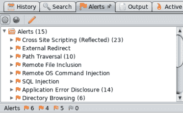

# 第二十二章：使用 OWASP ZAP 自动发现漏洞

在上一章中，我们讨论了渗透测试的另一个重要部分，关于利用跨站脚本漏洞。

现在，在这一章中，我们将学习一款名为 ZAP 的工具，它将帮助我们检测 Web 应用程序的风险和漏洞。然后我们将探索我们可以执行的各种扫描，并学习如何解读扫描结果。我们将通过一些示例来展示这些内容。

本章将涵盖以下 Web 渗透测试主题：

+   OWASP ZAP 启动

+   OWASP ZAP 结果

# OWASP ZAP 启动

到目前为止，我们已经学习了如何手动发现一些非常危险的漏洞。我们了解了它们是如何工作的以及如何利用它们。在本节中，我们将学习一款工具，它将帮助我们自动发现 Web 应用程序中的漏洞。它将帮助我们发现我们已经学习的漏洞，以及更多其他漏洞。之所以在开始时没有学习这款工具，是因为我想先教你们如何手动发现漏洞。同时，我希望你们了解这些漏洞是如何产生的，以便理解它们背后的原因。所以这个程序只是一个工具，它可能会出错，也可能会显示误报。在某些情况下，它也可能遗漏漏洞。

因此，我希望你们了解如何手动完成这些操作，这样如果程序没有正常工作或遗漏了什么，你们就能够找到它们。使用这些程序的最佳方式是作为备份工具，或者仅仅作为帮助我们进行渗透测试的工具。

使用这个工具非常简单。我们将进入“应用程序”并输入`ZAP`。它会询问我们是否要保存当前会话，当我们搜索某些内容时，我们选择“不，我现在不想保存此会话”，然后点击“开始”：

在以下截图中是工具的主视图。左侧是我们将要攻击的网站，右侧我们可以进行攻击并设置网站 URL，底部则显示我们的攻击或扫描结果：

如果我们点击左侧的齿轮图标，它会弹出一个窗口，如下图所示，这个窗口允许我们修改程序的选项。我们可以修改某些方面的设置，包括 Fuzzer 的工作方式、AJAX Spider 的工作方式，以及扫描的工作方式：

我们不会修改任何内容。我们可以修改的另一项内容是扫描中使用的策略；类似于我们之前在 Nmap 中使用的扫描，例如强力扫描等。所以，我们将点击屏幕底部的加号按钮，然后点击“主动扫描”：

点击下图中突出的“扫描策略管理器”按钮：

选择默认策略，现在我们可以通过使用添加按钮来创建自己的策略。我们将点击“默认策略”并点击“修改”按钮：

点击“修改”按钮将显示我们可以修改的内容：

在前面的截图中，我们可以看到可以修改全局策略的策略、默认警报阈值和默认攻击强度。点击每个类别将允许我们修改要执行的特定扫描。例如，在以下截图中，在注入标签中，我们可以看到程序将尝试的所有注入扫描，例如跨站脚本：在“阈值”列中，当我们点击阈值类型时，我们可以将其设置为默认、低、中或高：

将其设置为默认将默认选择所选值，在以下截图中是中等：

或者，例如，如果我们正在寻找 SQL 注入，想要访问数据库，我们可以将阈值设置为高，以便它尝试所有可能的方式，并尽力在更困难的地方找到漏洞：

只需保持所有默认设置。现在，我们将开始针对 Mutillidae 脚本发起攻击。我们在 Metasploitable 机器上的`10.0.2.4`运行它，URL 是`http://10.0.2.4/mutillidae/`。将 URL 粘贴到 OWASP 工具中的“URL to attack”文本框中，然后点击“攻击”按钮：

该工具首先会尝试查找所有 URL，然后根据我们使用的扫描策略攻击这些 URL。扫描的输出如下所示：

# OWASP ZAP 结果

扫描完成后，我们可以在左侧看到我们的网站，点击它将显示蜘蛛在查找文件时的一些结果：

非常有趣的部分是下面截图中的警报。我们可以看到所有已发现的漏洞：

在前述截图的左下角，我们可以看到有 6 个红色标志，表示高优先级警报，还有 4 个橙色标志，5 个黄色标志，0 个蓝色标志。这些按严重性顺序排列。

点击任何类别将展开并显示找到的威胁，例如，点击路径遍历（10），我们将看到所有可以利用的 URL，以从服务器读取文件：

单击任何站点，我们将看到发送的 HTTP 请求以便发现这个：

以下截图显示了响应以及工具为什么认为这是一个漏洞，我们可以看到在响应中工具能够获取`/etc/passwd`的内容：

在以下截图中，我们可以看到工具用于利用漏洞的 URL，我们可以看到当前漏洞的描述以及如何利用它：

我们还可以看到风险，这是高风险。我们可以看到置信度——工具对这个漏洞存在的信心有多大。我们还可以看到它已经被注入到一个页面中，攻击正在尝试获取`/etc/passwd`。因此，在页面上右键单击，然后单击在浏览器中打开 URL：

正如我们在以下截图中所看到的，该工具已经为我们利用了该站点。它向我们展示了漏洞的输出，我们可以阅读`/etc/passwd`的内容：

让我们看另一个例子，例如跨站脚本攻击。同样，该工具还会检查`POST`和`GET`参数。有时，当注入发送到文本框中，甚至在没有文本框的情况下发送时，如果它发送到`POST`参数中，我们在 URL 中看不到它，因此它实际上会检查`POST`和`GET`。您可以在以下截图中看到，它在注册页面的`POST`请求中发现了一个漏洞，并且还在`GET`请求中发现了一个漏洞：

再次右键单击并在浏览器中打开将为我们执行它，我们可以看到代码已经执行：

再次，我们可以从浏览器的地址栏中找到执行的 URL。如果我们想要将其用于其他工具，我们也可以在工具中看到它，即用于利用漏洞的 URL。

让我们再举一个 SQL 注入的例子。再次，单击链接：

它会向我们显示 URL，并显示它所使用的攻击，`ZAP' AND '1'='1'`，这在参数密码中，如果您记得，我们实际上是手动利用了这个参数：

用于利用的参数。

在浏览器中打开链接，我们可以看到注入正在工作，并且正在使用一个名为 ZAP 的用户名和密码：

因此，该工具非常简单、功能强大且非常有用。我们可以尝试使用它，可以尝试使用代理和选项，看看如何增强结果并获得更好的结果。

# 总结

在本章中，我们研究了渗透测试的最后部分，学习了使用名为 OWASP ZAP 的工具，它帮助我们理解 Web 应用程序中的漏洞。我们将这部分内容作为 Web 渗透测试的最后一部分进行学习，因为我希望你们首先学习如何手动进行渗透测试。 本章的第一部分，我们探索了该工具的图形用户界面（GUI）以及我们可以使用它执行的所有操作。接下来的部分介绍了我们如何执行扫描，并且我们还解释了扫描结果。
