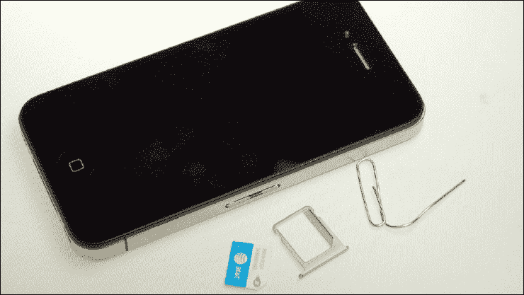
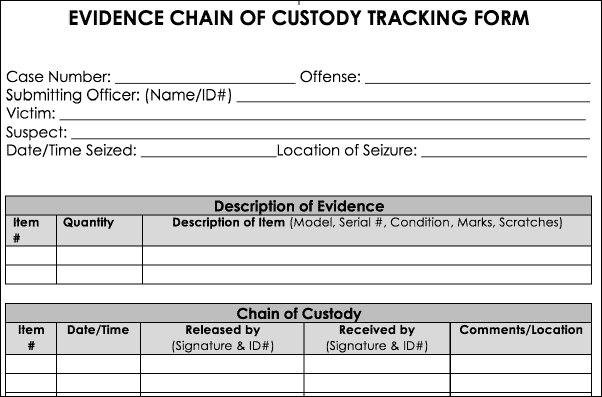
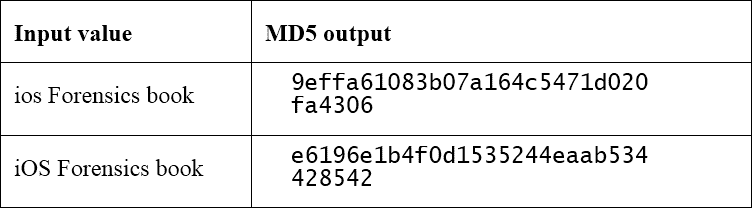
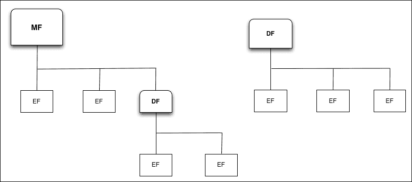
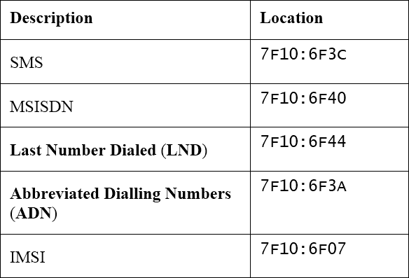
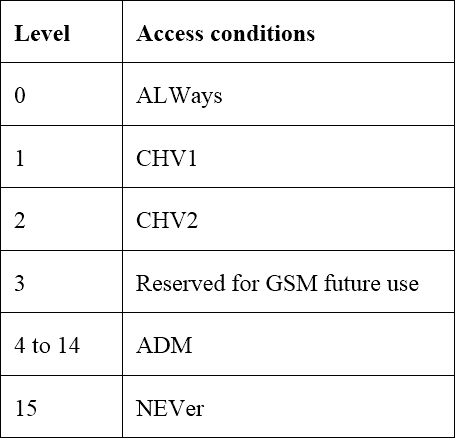

# 第一章：数字与移动取证

不久之后，我们将主要（如果不是唯一的话）讨论计算机取证和计算机犯罪，例如攻击者突破计算机网络系统并窃取数据。这将涉及两种类型的犯罪：非法/未经授权访问和数据盗窃。随着手机的普及，移动取证这一新领域也随之发展起来。

如今，随着技术的不断发展，情况发生了根本性的变化，并且仍在以相当快的速度变化。数字取证涵盖了所有与电子证据相关的学科，并且也被应用于常见犯罪，即那些至少按定义来说并非严格意义上的信息技术犯罪。今天，我们生活在一个完全数字化的社会，人人都配备各种设备，这些设备具有不同的能力，但它们都能处理、存储并传输信息（主要通过互联网）。这意味着取证调查员必须能够处理所有这些设备。

在 2001 年首次**数字取证研究研讨会**（**DFRWS**）上定义，数字取证是：

> *“采用科学衍生和验证的方法，保存、收集、验证、识别、分析、解释、记录和展示来自数字源的数字证据，以便促进或推进被发现为犯罪的事件重建，或帮助预测那些被证明会破坏计划操作的未授权行为。”*

正如凯西所言（**Casey, 2011**）：

> *“在这个现代时代，很难想象没有数字维度的犯罪。”*

各种犯罪分子利用技术来促进他们的犯罪行为，和同伙进行沟通，招募其他犯罪分子，洗钱，进行信用卡欺诈，收集受害者信息等等。这显然为所有相关人员，如律师、法官、执法人员和取证检查员，带来了新的挑战。

在近年来解决的案件中，曾有绑架案件，绑架者因通过手机发送勒索邮件而被捕。也有许多工业间谍案件，不忠实的员工将项目隐藏在智能手机的存储卡中，解决了许多通过手机备份存储在电脑中的毒品交易案件，以及其他许多类似案件。即便是我们时代最大规模的抢劫案件，也是在计算机网络上进行的。

本章内容包括以下几点：

+   移动取证的定义和原则

+   如何正确处理数字证据

+   移动证据识别和保存的方法

# 移动取证

移动取证是数字取证领域的一项研究，专注于移动设备。在不同的数字取证领域中，毫无疑问，移动取证是发展最快、演变最迅速的研究领域，涉及许多不同的情境，从企业到刑事调查以及不断增加的情报收集。此外，随着移动市场的快速增长，移动取证的重要性也在呈指数级增长。移动取证最有趣的特点之一是，移动设备，特别是手机，通常属于单个个体，而这在电脑上并不总是如此，电脑可能是公司员工或家庭成员共享的。正因如此，手机分析能访问大量个人信息。

另一个与移动取证相关的重要且有趣的方面，对分析师来说既具有挑战性也令人沮丧，就是市场上各种设备型号和操作系统的定制版本。这使得很难找到一种统一的解决方案（无论是工具还是过程）来应对所有这些情况。

想想人们在智能手机上安装的所有应用程序：即时通讯客户端、网页浏览器、社交网络客户端、密码管理器、导航系统等等，除了经典的默认应用，比如通讯录，它可以提供更多的信息，不仅仅是每个保存的联系人的电话号码。此外，将此类设备与计算机同步已经变得非常简单流畅，所有的用户活动、日程安排、待办事项等都存储在智能手机中。难道这些信息不足以对一个人进行画像并重建他们所有的近期活动吗？除了建立联系人网络外，还有更多可以挖掘的内容。

最后，除了各种智能手机和操作系统，如苹果 iOS、谷歌 Android、微软 Windows Phone 和 Blackberry OS，还有大量所谓的功能手机，这些手机使用较旧的移动操作系统。

因此，很明显，当谈论移动/智能手机取证时，远不止是电话记录的打印输出。事实上，通过全面的检查，我们可以恢复短信/MMS、照片、视频、已安装的应用程序、电子邮件、地理位置数据等等——包括现有信息和已删除的信息。

# 数字证据

如前所述，一方面，移动设备在数字取证案件中的日益参与带来了一系列全新的挑战和复杂性。然而，另一方面，这也导致了来自犯罪分子的更多证据，这些证据现在被用来以更全面的细节重建他们的活动。此外，虽然传统的物理证据可能会被摧毁，但数字证据大多数情况下会留下痕迹。

多年来，关于数字证据究竟是什么，出现了几种定义，其中一些特别关注可在法庭上作为证据使用的证明方面，比如**数字证据标准工作组**（**SWGDE**）提出的定义：

> *“数字证据是任何具有证明价值的信息，它以数字形式存储或传输。”*

**国际计算机证据组织**（**IOCE**）提出的定义为：

> *“数字证据是以二进制形式存储或传输的信息，可以在法庭上作为证据使用。”*

E. Casey（**Casey, 2000**）给出的定义将数字证据定义为：

> *“可以证明犯罪已发生、可以在犯罪与受害者之间建立联系，或者可以在犯罪与犯罪者之间建立联系的实物。”*

虽然所有这些定义都是正确的，但如前所述，这些定义主要关注证据，往往忽视了对调查极为有用的数据。

因此，本书将采用 Carrier（**Carrier, 2006**）给出的定义，定义数字证据为：

> *“支持或反驳关于数字事件或数字数据状态的假设的数字数据。”*

这个定义较为普遍，但更符合当前数字证据的状态及其在整个调查过程中的价值。

从标准化角度来看，过去和现在已经有许多尝试定义数字取证的指南和最佳实践，以指导如何处理数字证据。除了 NIST 发布的若干指南和专门出版物外，还有一项来自 ISO/IEC 的标准，该标准于 2012 年发布，ISO 27037 数字证据识别、收集和/或获取以及保存的指南，该标准并非专门针对移动取证，而是与数字取证一般相关，旨在建立一套标准程序，用于收集和处理数字证据，确保其在不同国家的法庭上得到法律认可和接受。如果考虑到互联网时代缺乏国界的事实，尤其是在数字犯罪领域，这是一个非常重要的目标，因为非法行为可能由全球任何地方的攻击者实施。有关标准和最佳实践的详细列表，请参阅附录 A，*参考文献*。

## 移动证据的处理

为了在法庭上和整个调查阶段都能有用，数字证据必须以取证可靠的方式进行收集、保存和分析。这意味着，从识别到报告的每一步都必须严格、仔细地执行。历史上，我们习惯将一种方法称为取证可靠的，前提是该方法意味着证据的原始来源保持未修改和未改变。在谈论传统的计算机取证时，这通常是对的，尤其是在取证人员发现计算机关机或需要处理外部硬盘的情况下，尽管即便在这些情况下也不完全正确。然而，随着实时取证的兴起，这一概念变得越来越不准确。事实上，获取实时系统内存的方法和工具必然会改变目标系统，哪怕只是稍微改变。移动取证的出现更加突出了这一概念，因为移动设备，尤其是智能手机，是网络设备，通过多种通信协议（如 GSM/CDMA、Wi-Fi、蓝牙等）不断交换数据。此外，为了获取移动设备，取证人员需要与设备进行一定程度的互动。根据设备类型，智能手机可能需要更多或更少的互动，从而改变设备的原始状态。

所有这些并不意味着源证据的保存毫无用处，而是在移动设备领域几乎不可能实现。因此，在收集、保存和获取阶段，彻底记录每一步骤变得极为重要。通过这种方式，取证人员能够证明他们尽可能地减少了干扰。正如**Casey（2011）**所说：

> *“取证的关键之一就是文档化。一个坚实的案件是建立在支持性文档上的，这些文档报告了证据的来源以及如何处理这些证据。从取证的角度来看，获取过程应该尽可能少地改变原始证据，任何变化都应该在最终分析结果的背景下进行记录和评估。”*

当需要收集移动设备时，取证人员应考虑以下几个要点：

+   记录设备发现的当前位置。

+   报告设备状态（开机或关机，屏幕损坏等）。

+   如果设备开机，请报告屏幕上可见的日期、时间和其他信息，例如通过拍摄屏幕照片。

+   仔细检查是否存在内存卡。尽管 iOS 设备不涉及此问题，但通常许多手机都有外部存储卡插槽，照片、聊天数据库以及许多其他类型的用户数据通常存储在这里。

+   仔细检查与正在收集的手机相关的所有电缆，特别是如果你的实验室没有完整的电缆套件。许多手机有自己的电缆用于连接计算机和充电。

+   查找原始的**用户身份模块**（**SIM**）包装，因为上面写有 PIN 码和**PIN 解锁码**（**PUK**）。

+   在收集之前拍摄每一项物品的照片。

移动设备的修改不仅可能是由于法医专家的交互，还可能是由于与网络的交互，无论是自愿还是非自愿的。事实上，移动设备中的数字证据可能会完全丢失，因为它们容易被新数据覆盖，例如在收集过程中，智能手机接收到短信，可能会覆盖先前存储在相同内存区域的证据，或者通过无线网络接收到远程擦除指令。现在大多数智能手机和 iOS 设备都可以配置为完全远程擦除。

### 注：

**来自真实案例：**

在搜查被调查人的住所时，执法人员发现并扣押了包括计算机和智能手机在内的多个物品。对所有物品进行登记和记录后，他们将所有物品放入箱子里，带回实验室。一旦回到实验室，在获取智能手机以进行法医分析时，他们发现手机是*空的*，看起来像是*全新*的。原主人已经远程擦除了手机数据。

因此，将移动设备与所有无线网络隔离是保存证据过程中的基本步骤。有几种方法可以实现这一目标，每种方法都有其优缺点，具体如下：

+   **飞行模式**：在设备上启用飞行模式需要某种交互，这可能会带来法医专家修改的风险。这是最好的选择之一，因为它意味着所有的无线通信芯片都被关闭。在这种情况下，记录采取的行动并附上图片和/或视频是很有帮助的。通常，只有当手机没有密码保护或密码已知时，这才是可能的。然而，对于 iOS 7 或更高版本的设备，还可以通过从底部向上滑动调出控制中心，在其中找到一个飞机形状的按钮来启用飞行模式。前提是**设置** | **控制中心**中的**锁屏时访问**选项已启用。

+   **法拉第包**：这是一种由导电材料制成的信封式物品，能够完全屏蔽静电场和电磁辐射，将设备与外部网络隔离开来。顾名思义，它基于法拉第定律。这是最常见的解决方案，特别是在设备从犯罪现场被带到实验室后进行扣押时非常有用。然而，使用法拉第包会导致手机持续搜索网络，从而导致电池快速耗尽。不幸的是，将手机连接到外部电缆（进入包内）也存在风险，因为这可能充当天线。此外，值得注意的是，当你从包中取出手机（到达实验室后）时，它将再次暴露在网络中。因此，你需要一个有屏蔽的实验室环境，或者使用一种法拉第解决方案，能够让你在设备仍处于屏蔽容器内时访问手机，无需外部电缆。

+   **干扰**：干扰器用于通过发送与设备相同频率的无线电波来阻止无线设备与外部通信。在我们的案例中，它将干扰手机使用的 GSM/UMTS/LTE 频段，从而阻止手机与基站连接，进行数据的发送/接收。需要注意的是，这种做法在某些国家可能被视为非法，因为它也会干扰到干扰器范围内的其他任何移动设备，打断它们的通信。

+   **关闭设备**：这是一个非常危险的做法，因为它可能会激活身份验证机制，如 PIN 码或密码，而这些身份验证信息是法医无法获取的，或者可能会触发其他加密机制，从而延迟甚至阻止对手机设备的提取。

+   **移除 SIM 卡**：在大多数移动设备中，这项操作意味着移除电池，因此会引发我们刚刚提到的关于关闭设备的所有风险和后果；然而，在 iOS 设备中，这项任务相对简单且容易，而且不需要移除电池（在 iOS 设备中是无法做到的）。此外，SIM 卡可以启用 PIN 保护；将其从手机中移除可能会锁定 SIM 卡，阻止其内容显示。然而，请记住，移除 SIM 卡只会将设备与蜂窝网络隔离，其他网络，如 Wi-Fi 或蓝牙，可能仍然处于活动状态，因此也需要加以处理。

+   以下图像展示了用夹子从 iPhone 中提取的 SIM 卡；图片来源：[`www.maclife.com/`](http://www.maclife.com/)：

### 证据保存

讨论数字证据的文档记录与保存时，其中最重要的步骤之一就是正确且全面地编制**证据链**。该文档的目的有两方面：一方面，记录每个处理过证据的人的信息，以便在任何时刻识别潜在数字证据的访问和移动；另一方面，保持文档记录，证明自从证据收集后，它在经过文档中列出的多位分析人员手中时未被篡改。

因此，证据链应包含以下一些信息：

+   一个独特的证据标识符

+   谁访问了证据，发生的时间和地点

+   谁在什么时候将证据检查进出证据保存设施

+   证据被检查的原因

+   证据的哈希值，以证明自从上次由证据链中列出的前一位人员处理后，证据未被篡改

+   尽管取证调查绝不应直接在原始设备/文件上进行，但证据链应提及如果必须对潜在数字证据进行任何不可避免的更改，应说明这些更改的理由以及负责引入这些更改的个人姓名

+   以下图像展示了 NIST 提出的证据链样本：

### 证据的获取

尤其在移动取证中，信息可能更为易变，而在传统计算机取证中，有时可能会有紧急需求来获取可用数据。在这种情况下，信息可能会在有机会隔离或妥善处理设备之前消失。在此类情况下，现场有效的分类处理流程和工具可以保存原本可能丢失的证据。这些流程可能包括在进行其他操作之前，立即拍摄设备屏幕的照片或视频记录。

话虽如此，一旦移动设备得到了正确处理，取证人员就可以开始从设备中获取证据。在移动取证中，尤其是对于 iOS 设备，可能有以下三种不同类型的获取方式：

+   **物理**：这是最佳和最理想的选择。它涉及通过对设备进行精确的*比特到比特*复制来进行物理获取。这是最全面的选项，因为它还允许恢复潜在已删除的文件。

+   **文件系统**：当因任何原因无法进行物理获取时，这是第二好的选择。这种获取方式允许取证人员提取所有在文件系统级别可见的文件。通过这种方式，可以分析所有活跃的文件，这些文件可以通过浏览文件系统进行查看，但无法恢复可能已删除的文件。

+   **逻辑性**：通过这种类型的获取，可以提取部分文件系统数据。它通过执行设备的备份来恢复可用数据，iOS 设备的情况是通过 iTunes 进行备份。不幸的是，在 iOS 设备上，逻辑/备份获取无法提取重要文件，例如电子邮件、地理位置数据库、应用程序缓存文件夹等。尽管它是三种方法中最不全面的一种，但有时这可能是唯一可用的选项。

前述三种获取方法是获取 iOS 设备的主要方法；我们将在后续章节中详细讨论。接下来的章节将深入探讨每种不同的方法论，解释在每种可能的情况下应该如何操作，我们还将介绍可用于执行获取和进一步分析物理文件系统以及逻辑获取的各种工具。

然而，移动设备取证可能还需要采用一些进攻性安全技术。根据设备型号和 iOS 版本，为了进行物理获取，我们可能需要越狱设备，最好使用有线技术，这样修改不会在设备上持续存在，并且设备重启后会恢复。即使我们只能进行非永久越狱，这些修改也仅会影响 iOS 设备的系统分区，而不会改变用户分区，因此证据得以保留。

我们可能需要使用的另一种进攻性技术是密码破解。正如我们稍后将看到的，许多情况下，我们可能会遇到一个需要密码保护的设备。根据设备型号和 iOS 版本，可能可以对用户设置的密码进行暴力破解攻击。

这些更具侵入性的技术需要在最终报告中完整记录，详细说明所使用的方法、技术和工具。特别因为它们的侵入性，了解所使用的工具和技术非常重要，以便能够解释哪些修改发生在何处，以及为什么这些修改没有改变证据的完整性。良好的报告是关键。

### 证据完整性

已经多次提到，在处理移动设备时，基本上不可能不与设备交互，因此在一定程度上会改变其当前状态。然而，这并不意味着在移动取证中不需要或没有理由实施证据完整性的机制。事实上，一旦获取操作完成，就必须为从移动设备提取的数据建立某种完整性验证机制，无论是 iTunes 备份、完全物理获取还是单个文件。在数字取证中，通过比较获取时的数字指纹（也称为哈希值或消息摘要）与当前状态的数字指纹来完成对数字证据完整性的验证。哈希函数是特定的单向数学函数，给定任意长度的输入，将产生固定长度的输出。相同的输入总是会产生相同的输出。这意味着即使只改变一个比特位，新的哈希值也会完全不同。下表显示了只修改同一句子中两个字符的大小写时，结果的哈希值是完全不同的：

用于计算哈希值的两种最常见算法是 MD5 和 SHA-1。MD5 算法生成 128 位输出，而 SHA-1 算法生成 160 位输出。这类算法的另一个重要特征在于，理论上计算生成两个不同输入的哈希值应该是不可行的，同样也不可能生成一个特定消息与给定哈希值匹配。这个问题被称为**碰撞**。已经有多项研究表明，在 MD5 和 SHA-1 算法中，可以创建出具有相同哈希值的两个不同文件。然而需要指出的是，这种情况仅在特定的受控条件下成立，而这些条件在现实中发生的可能性很小。无论如何，这种碰撞并不影响这些哈希算法在完整性验证中的应用。由于基本上不可能生成两个具有相同的 MD5 和 SHA-1 哈希值（或者一般来说是由两个不同独立算法生成的两个哈希值），因此，对于每个产生或收集的数字证据，生成 MD5 和 SHA-1 哈希值是一个良好的实践。

## SIM 卡

在进行移动设备的法医检查时，获取并分析相关 SIM 卡的内容也非常重要。SIM 卡是一种智能卡，允许移动设备通过 SIM 卡本身嵌入的加密密钥连接到蜂窝网络。SIM 卡主要具有以下两种不同的代码，可以被提取：

+   **集成电路卡标识符**（**ICCID**）：该代码是一个 20 位数字，国际上唯一标识每张 SIM 卡。

+   **国际移动用户身份**（**IMSI**）：这是一个独特的 15 位数字（在一些地方，如南非，是 14 位），它在移动网络中唯一标识一个用户。

尽管 iOS 设备不这样，但一个人可能会在同一设备上使用多张 SIM 卡用于不同的目的，因为一些移动设备支持双 SIM 卡功能。

此外，SIM 卡的存储容量和利用率大大提高，可能包含大量相关信息。为了让你大致了解可以存储（或隐藏）在 SIM 卡中的数据量，考虑到 128 KB 标准 SIM 卡内可以写入最多 17 KB 的数据，整个**美国独立宣言**仅需 11 KB。

从 SIM 卡中恢复的一些有用信息可能包括来电/去电记录、联系人信息、短信内容，甚至是已经删除的短信内容，以及设备最后连接的基站位置。

通过查看 SIM 卡的细节（Gubian，2007），可以看到文件系统的层次化 n 元结构，其中有三种不同的文件类型，每个文件的内容在以下 GSM 技术规范（GSM 11.11）中定义：

+   **3F = 主文件（MF）**：其结构仅由一个头部组成，是 SIM 卡中文件系统的根目录。其地址，即每个其他文件的偏移量，是`3F00`。

+   **7F/5F = 7F 是一个专用文件（DF）**：与 MF 类似，其结构仅由一个头部和 EF 组成。DF 可以类比为我们计算机中的普通文件夹。

+   **2F = 主文件下的基本文件（EF），6F/4F = 4F 是专用文件下的基本文件（EF）**：基本文件的结构由一个头部和一个主体组成，主体代表文件内容本身（例如，短信）。

以下示意图展示了这种层次结构（SIM 卡的文件系统结构）：

GSM 技术规范已经提供了一些具有常见名称的文件。在标准文件夹中，一些最有趣的文件夹可能是`3F00:7F10`（`DF_TELECOM`），其中包含与服务相关的信息和一些用户数据，例如 SMS，和`3F00:7F20`（`DF_GSM`），其中存储与 GSM 网络相关的信息。之前提到的 ICCID 和 IMSI 可以在`3F00:2FE2`（名为`EF_ICCID`）和`3F00:7F20:6F07`（名为`EF_IMSI`）中找到。以下表格展示了可以在 SIM 卡内找到的一些知名信息源及其各自的位置：

在 SIM 卡中，**每个文件**（**EF**）的访问受到一定数量权限级别的控制，这些权限级别根据用户所拥有的角色（由权限级别确定）来允许或拒绝某些操作。 一些有用的权限包括`ALWays`、`CHV1`和`CHV2`。这些权限允许 SIM 卡的所有者（或者说是知道密码的用户）访问和修改此类文件的内容。例如，任何与`UPDATE`命令相关的文件，只要拥有这些权限（`CHV1`/`CHV2`），就允许知道这些密码的人修改文件中的信息。

以下表格总结了 SIM 卡的访问条件：

### SIM 安全

除了 ICCID 和 IMSI，这两个主要与 SIM 卡本身相关的代码外，在进行分析时，另有两个重要代码（实际上几乎是必不可少的）是 PIN 码和 PUK 码。PIN 码用于将用户认证到系统中，而 PUK 码则在输入三次错误的 PIN 码后用于解锁 SIM 卡。因此，暴力破解 PIN 码通常无效，因为三次失败的 PIN 尝试将导致 SIM 卡被锁定。

幸运的是，SIM 卡有一个 PUK，并且许多**网络服务提供商**（**NSP**）可以在合法授权的情况下将其提供给执法部门，以绕过 PIN 码或访问被锁定的 SIM 卡。

如果输入错误的 PUK 代码 10 次，SIM 卡将永久锁定，导致其内容完全无法访问。在对这两个代码进行暴力破解攻击之前，必须记住这一点。

# 总结

在本章中，我们为那些对数字取证相对较新的读者提供了一个概述，同时也为已经从事此领域的读者进行了很好的回顾，尤其是关注移动取证领域。我们介绍了什么是数字证据以及如何处理它，展示了几种将移动设备与网络隔离的技术。你应该始终记住记录所采取的任何操作的重要性（证据链、最终报告等），并建立机制来验证证据的完整性（哈希值）。我们还讨论了 iOS 设备的不同获取技术，提前介绍了一些将在本书后续章节中详细讲解的术语和技术，从 A 到 Z。最后但同样重要的是，我们讨论了 SIM 卡，它是如何结构化的，以及我们可以期望在其中找到哪些有用的信息。

在下一章，我们将开始专注于 Apple 设备的移动取证，特别是你将会了解 iOS 设备、操作系统和文件系统。

# 自测题

Q1\. 在获取前，隔离移动设备的最佳方式是什么？

1.  干扰器

1.  法拉第袋

1.  飞行模式

1.  关闭设备

Q2\. 最全面的获取方法是什么？

1.  逻辑

1.  高级逻辑

1.  文件系统

1.  物理

Q3\. 被国际上唯一识别每张 SIM 卡的代码叫什么？

1.  IMSI

1.  ICCID

1.  PUK

1.  GSM

Q4\. 在 SIM 卡完全无法访问之前，我们可以进行多少次 PUK 尝试？

1.  3

1.  5

1.  10

1.  15
