# 第二章：iOS 设备简介

苹果公司与移动设备的历史始于 1993 年，推出了 Newton 项目，并生产了首款 PDA——Message Pad。这些 PDA 配备了 ARM 处理器、触摸屏和手写识别，并基于名为 Newton OS 的操作系统。该项目于 1997 年关闭，史蒂夫·乔布斯回到苹果掌门人岗位。

iPhone 和 iPad 当前成功的真正革命性起点是 iPod 设备和 iTunes 软件的创造。这些设备彻底改变了我们每个人享受音乐或多媒体内容的方式。iPod 于 2001 年发布，采用了不同的形状、尺寸和容量，首款型号于 2001 年 10 月 23 日推出，基于 ARM 处理器和 5GB 容量（史蒂夫·乔布斯将其描述为*把 1000 首歌曲放进口袋里*）。传统的 iPod（iPod Classic、iPod Mini、iPod Nano 和 iPod Shuffle）已经是前期出版物中关于其法医获取和分析内容的主题。我们在这里仅回顾一下，从获取的角度来看，iPod 可以被当作外部硬盘，并使用传统的磁盘映像技术进行获取。至于其使用的文件系统，它可以是 HFS+或 FAT32，这取决于它是首次连接到 Mac 还是 PC。音频文件存储在一个隐藏的文件夹中（通常在`\\iPod_Control\\Music\\`），并在一个数据库中进行组织。此类设备中还可以找到的其他信息包括联系人、日历以及用户决定复制到设备上的任何其他数字格式文件，完全类似于外部设备（U 盘、硬盘等）。通过传统技术，可以进行文件雕刻，恢复已删除的文件并创建设备使用的时间线。

苹果公司于 2005 年通过与摩托罗拉的合资企业以及生产世界上首款集成 iTunes 的手机 Rokr，进入了移动通信系统。该设备并未取得成功，以至于该项目仅在一年后就被关闭。然而，这款设备为 iPhone 的诞生奠定了基础。

本章的目的是介绍 iOS 设备法医分析的基本方面。在第一部分中，讨论了苹果设备的不同类型和型号，并指出了准确识别你需要获取的型号的方法和技巧。第二部分分析了操作系统的基本原理（如类型、版本等）以及这些设备使用的文件系统的类型和结构。特别地，本章将重点关注以下内容：

+   iOS 设备类型

+   iOS 设备连接器

+   iOS 操作系统

+   iDevice 识别

+   iOS 文件系统

# iOS 设备类型

根据常用定义，iOS 设备是指使用 iOS 操作系统的设备。目前，我们有四种类型的设备：iPhone、iPad、iPad mini 和 iPod touch。此外，Apple TV 使用 Apple TV 软件和 tvOS，Apple Watch 使用 watchOS：这两种操作系统基于 iOS，因此它们是一种混合型的 iOS 设备。

## iPhone 版本

最著名的 iDevice 无疑是 iPhone，它彻底颠覆了手机的概念，基于多点触控屏幕、虚拟键盘和少量物理按钮（如 Home 键、音量键、电源开关键、铃声/振动键）。

### iPhone（第一代）

第一代 iPhone，简单地称为**iPhone**，由史蒂夫·乔布斯于 2007 年 1 月 9 日发布，并从同年 6 月 29 日起销售。

它配备了一个 S5L8900 ARM 处理器，主频为 620 MHz（降频至 412 MHz），128 MB 的 RAM，并使用四频段 GSM/GPRS/EDGE（850/900/1800/1900 MHz）蜂窝连接类型，还支持 Wi-Fi 连接 802.11 b/g 和蓝牙 2.0 + EDR（有关蓝牙实现的详细信息，请参见[`support.apple.com/kb/HT3647`](http://support.apple.com/kb/HT3647)）。

它配备了一个 30 针底座连接器（参考[`en.wikipedia.org/wiki/Dock_connector`](https://en.wikipedia.org/wiki/Dock_connector)）。

该手机通过型号 A1203 和硬件字符串 iPhone1,1 进行识别。

它最初配备了 4 GB 的内部存储，后来增加了两个不同版本：8 GB 和 16 GB。

关于软件，它最初使用的是 iOS 操作系统的祖先，称为 iPhone OS 1.0。最新支持的版本是 iPhone OS 3.1.3。除了传统的通信手段（内部电话簿、通话、短信、彩信等），它还集成了网页浏览、电子邮件、相机、iTunes 和 YouTube。在 iPhone 2G 发布时，App Store 还不存在，这就是为什么苹果推出了 Web 应用程序，并将其分为不同类别（例如，计算器、娱乐、游戏等）。这些应用程序不会在设备中保存信息，而是仅创建一个快捷方式图标，应用程序直接从互联网运行。这些设备的生产在 2007 年 9 月（4 GB 型号）和 2008 年 6 月（8 GB 和 16 GB 型号）停止。

### iPhone 3G

苹果公司生产的第二款型号，于 2008 年 7 月 11 日发布，名为**iPhone 3G**，因为它新增了对 3G 蜂窝网络的支持。与前代类似，iPhone 3G 配备了 S5L8900 ARM 处理器和 128 MB 的内存。除了支持 3G 网络（UMTS/HSDPA，最高 3.6 Mbit/s，频段为 850、1900 和 2100 MHz），硬件上的主要创新是新增了 GPS 芯片，用于地理定位服务。该手机的型号编号为 A1241（或中国销售的设备为 A1324），以及字符串 iPhone1,2。设备有 8 或 16 GB 存储版本。关于软件，它最初使用的是 iPhone OS 2.0，最新支持的版本为 iOS 4.2.1。随着 iPhone 3G 的基本版本推出，App Store 首次亮相：它允许用户从集中式应用商店下载和安装应用程序。该设备的生产于 2010 年 6 月停止。

### iPhone 3GS

苹果公司生产的第三款型号，于 2009 年 6 月 19 日发布，名为**iPhone 3GS**。虽然外观与其前代产品非常相似，但 iPhone 3GS 配备了 S5L8920 833 MHz ARM 处理器（降频至 600 MHz）和 256 MB 的内存，性能较前版本有所提升。主要变化包括使用更精确的 GPS 芯片，支持额外的数据网络（HSDPA 7.2 Mbit/s），配备了 3 MP 的摄像头，支持以 VGA 格式（480p）拍摄视频，数字指南针以及语音控制功能。从法医分析的角度来看，值得一提的是，从这一型号开始，手机支持地理标记图片，使得调查员可以识别照片拍摄地点。该手机的型号编号为 A1303（或中国销售的设备为 A1325），以及字符串 iPhone2,1。设备有 8、16 或 32 GB 存储版本。关于软件，它最初使用的是 iPhone OS 3.0，最新支持的版本为 iOS 6.1.6。该设备的生产于 2012 年 9 月停止。

### iPhone 4

苹果公司生产的第四款手机，于 2010 年 6 月 21 日起销售，名为**iPhone 4**。与之前的 iPhone 型号相比，它在外观和功能上都有了全面的革新。该设备的外形更为方正，并且在硬件上进行了多个改进，例如苹果 A4 S5L8930 1 GHz 处理器（降频至 800 MHz），512 MB 内存，配备 500 万像素的摄像头，支持拍摄 720p 高清画质的视频，并内置三轴陀螺仪。该手机的型号有两个：A1332（GSM 型号）和 A1349（CDMA 型号），并有三个字符串：iPhone3,1；iPhone3,2；iPhone3,3。设备提供 8 GB、16 GB 或 32 GB 的存储容量。关于其软件，最初使用 iOS 4.0，这是第一个采用新名称的版本。其最新支持的版本是 iOS 7.1.2。该设备的生产已于 2013 年 9 月停止。

### iPhone 4s

苹果公司生产的第五款手机，于 2011 年 10 月 4 日起销售，名为**iPhone 4s**。其外观与 iPhone 4 非常相似，唯一不同的是两侧上部有两个切口。新硬件包括苹果 A5 S5L8940 1 GHz 处理器（降频至 800 MHz），512 MB 内存，支持最高 14.4 Mbit/s 的 HSPA+网络，并配备一颗 800 万像素的后置摄像头，支持拍摄 1080p 高清画质的视频。该手机的型号为 A1387（或中国地区为 A1431），以及字符串 iPhone4,1。设备提供 8 GB、16 GB、32 GB 或 64 GB 的存储容量。关于其软件，最初使用 iOS 5.0，目前支持最新版本（iOS 9.3.4），但不再支持 iOS 10。该设备的生产已于 2014 年 9 月停止。

### iPhone 5

苹果公司生产的第六款手机，于 2012 年 9 月 21 日起销售，名为**iPhone 5**。它使用了苹果 A6 S5L8950 处理器，主频为 1.3 GHz，配备 1 GB 内存，支持 HSPA+和 LTE 蜂窝网络。它还配备了一颗 1.2 MP 的前置摄像头，可以拍摄 720p 高清画质的视频。它是该系列首款拥有 4 英寸屏幕的设备，也是首款配备 8 针 Lightning 连接器的机型（参见[`en.wikipedia.org/wiki/Lightning_%28connector%29`](https://en.wikipedia.org/wiki/Lightning_%28connector%29)）。该手机的型号有三个：A1428（GSM 型号），A1429（GSM 和 CDMA 型号）和 A1442（中国的 CDMA 型号），并有两个字符串：iPhone5,1（支持 LTE 的美国版）和 iPhone5,2（其他国家版）。该设备提供 16 GB、32 GB 或 64 GB 的存储容量。关于其软件，最初使用 iOS 6.0，现已支持最新版本（iOS 9.3.4），并将继续支持 iOS 10。该设备的生产已于 2013 年 9 月停止。

### iPhone 5c

苹果公司生产的第七款手机，于 2013 年 9 月 20 日上市，称为**iPhone 5c**。它采用了与 iPhone 5 相同的处理器和相同容量的内存，主要区别在于它支持全球范围的 LTE 网络，并配备了更强大的电池。该手机有六个型号：A1516（中国）、A1526（中国）、A1532（北美版）、A1456（美国和日本版）、A1507（欧洲）和 A1529（亚洲和大洋洲），以及两个字符串：iPhone5,3 和 iPhone5,4。该设备的存储容量为 8、16 或 32 GB。关于软件，它最初使用的是 iOS 7.0。目前，iPhone 5c 仍受支持，支持的最新版本为 iOS 9.3.4，并将支持 iOS 10。该设备的生产已于 2015 年 9 月停产。

### iPhone 5s

苹果公司生产的第八款手机，于 2013 年 9 月 20 日上市，称为**iPhone 5s**。它采用了 1.3 GHz 的苹果 A7 S5L8960 处理器、1 GB 的内存、相较于之前版本有所改进的 8 MP 相机，以及基于指纹的生物识别认证系统，名为 Touch ID。它还配备了运动协处理器 Apple M7。该手机有六个型号：A1518（中国）、A1528（中国）、A1533（北美版）、A1453（美国和日本版）、A1457（欧洲）和 A1530（亚洲和大洋洲），以及两个字符串：iPhone6,1 和 iPhone6,2。该设备的存储容量为 16、32 或 64 GB。关于软件，它最初使用的是 iOS 7.0。目前，iPhone 5s 仍受支持，支持的最新版本为 iOS 9.3.4，并将支持 iOS 10。该设备的生产已于 2016 年 3 月停产。

### iPhone 6

苹果公司生产的第九款手机，于 2014 年 9 月 19 日上市，称为**iPhone 6**。它采用了 1.38 GHz 的苹果 A8 T7000 处理器，并配备了 1 GB 的内存。它是首款支持 NFC 通信的机型。它还配备了运动协处理器 Apple M8。该手机有三个型号：A1549（北美）、A1586（全球版）和 A1589（中国版），以及字符串 iPhone7,2。该设备的存储容量为 16、64 或 128 GB。关于软件，它最初使用的是 iOS 8.0。目前，iPhone 6 仍受支持，支持的最新版本为 iOS 9.3.4，并将支持 iOS 10。该设备的生产仍在进行中，至本书出版时依然在生产中。

### iPhone 6 Plus

苹果公司生产的第十款型号，从 2014 年 9 月 19 日起上市，名为**iPhone 6 Plus**。它采用了苹果 A8 T7000 处理器，主频 1.38 GHz，并配备 1 GB 内存。它还配备了苹果 M8 运动协处理器。该手机有三个型号标识：A1522（北美）、A1524（全球）和 A193（中国），以及字符串 iPhone7,1。该设备的存储容量为 16 GB、64 GB 或 128 GB。关于其软件，它最初使用的是 iOS 8.0。目前，iPhone 6 Plus 支持最新版本（iOS 9.3.4），并将支持 iOS 10。该设备的生产在本书发布时仍然处于活跃状态。

### iPhone 6s

苹果公司生产的第十一款型号，从 2015 年 9 月 25 日起上市，名为**iPhone 6s**。它采用了苹果 A9 S8000（三星）或 S8003（台积电）处理器，主频 1.85 GHz，并配备 2 GB 内存。它还配备了苹果 M9 运动协处理器。该手机有三个型号标识：A1633（北美）、A1688（全球）和 A1699（中国），以及字符串 iPhone8,1。该设备的存储容量为 16 GB、64 GB 或 128 GB。关于其软件，它最初使用的是 iOS 9.0。目前，iPhone 6s 支持最新版本（iOS 9.3.4），并将支持 iOS 10。该设备的生产在本书发布时仍然处于活跃状态。

### iPhone 6s Plus

苹果公司生产的第十二款型号，从 2015 年 9 月 25 日起上市，名为**iPhone 6s Plus**。它采用了苹果 A9 S8000（三星）或 S8003（台积电）处理器，主频 1.85 GHz，并配备 2 GB 内存。它还配备了苹果 M9 运动协处理器。该手机有三个型号标识：A1634（北美）、A1687（全球）和 A1699（中国），以及字符串 iPhone8,2。该设备的存储容量为 16 GB、64 GB 或 128 GB。关于其软件，它最初使用的是 iOS 9.0。目前，iPhone 6s Plus 支持最新版本（iOS 9.3.4），并将支持 iOS 10。该设备的生产在本书发布时仍然处于活跃状态。

### iPhone SE

苹果公司生产的第十三款型号，从 2016 年 3 月 31 日起上市，名为**iPhone SE**。它采用了苹果 A9 S8000（三星）或 S8003（台积电）处理器，主频 1.85 GHz，并配备 2 GB 内存。它还配备了苹果 M9 运动协处理器。该手机有三个型号标识：A1662（北美）、A1723（全球）和 A1724（中国），以及字符串 iPhone8,4。该设备的存储容量为 16 GB 或 64 GB。关于其软件，它最初使用的是 iOS 9.3。目前，iPhone SE 支持最新版本（iOS 9.3.4），并将支持 iOS 10。该设备的生产在本书发布时仍然处于活跃状态。

### iPad

在 iPhone 取得成功后，苹果公司进行了设计和生产更大版本的项目，首次实现了史蒂夫·乔布斯在 1983 年的构想：

> *“苹果的战略非常简单。我们想做的事情是将一台极其出色的电脑放进一本你可以随身携带的书里。”*

在首款 iPad 发布后，乔布斯表示，苹果公司早在 iPhone 之前就开始开发 iPad 平板电脑，但随后决定将精力集中于 iPhone 的开发。

### iPad（第一代）

第一代 iPad，简单称为**iPad**（或**iPad 第一代**），由史蒂夫·乔布斯于 2010 年 1 月 27 日发布，并于同年 4 月 3 日开始销售。它配备了 1 GHz S5L8930 ARM 处理器（也称为 Apple A4）和 256 MB 的 RAM。与所有 iPad 设备系列一样，它有两个不同的版本：第一个版本仅配备 Wi-Fi 802.11 a/b/g/n 连接，而第二个版本还配备了 3G UMTS/HSDPA/EDGE 和 GPS。两个型号的识别串分别为 A1219（仅 Wi-Fi）和 A1337（Wi-Fi 和 3G），两者都标识为 iPad1,1。从软件角度来看，它最初使用的是 iPhone OS 3.2。最新支持的版本是 iOS 5.1.1。这些设备的生产于 2011 年 3 月停产。

### iPad 2

第二代 iPad，俗称**iPad 2**，自 2011 年 3 月 11 日起上市。它配备了 1 GHz S5L8940 ARM 处理器（也称为 Apple A5）和 512 MB 的 RAM。与上一代相比，苹果引入了前置和后置 0.75 MP 的摄像头。它生产了三种型号：仅 Wi-Fi 版（型号 A1395）、Wi-Fi 和 GSM 版（型号 A1396），以及 Wi-Fi 和 CDMA 版（型号 A1397）。有四个硬件识别串：iPad2,1（仅 Wi-Fi）；iPad2,2（Wi-Fi 和 GSM）；iPad2,3（CDMA 和 Wi-Fi）；iPad2,4（仅 Wi-Fi，配备 S5L8942 处理器，也称为 A5 Rev. A）。所有版本的存储容量为 16、32 或 64 GB。关于软件，它最初使用的是 iOS 4.3。当前，iPad 2 支持最新版本（iOS 9.3.4），但不再支持 iOS 10。这些设备的生产于 2014 年 3 月停产。

### iPad 3（新 iPad）

第三代 iPad，俗称**iPad 3**（或**iPad 第三代**），自 2012 年 3 月 16 日起上市。它配备了 1 GHz S5L8945 ARM 处理器（也称为 Apple A5X）和 1 GB 的 RAM 内存。它生产了三种型号：仅 Wi-Fi 版（型号 A1416）、Wi-Fi 和蜂窝版（VZ）（型号 A1403），以及蜂窝和 Wi-Fi 版（型号 A1430）。有三个硬件识别串：iPad3,1（仅 Wi-Fi）；iPad3,2（Wi-Fi、GSM 和 CDMA）；iPad3,3（Wi-Fi 和 GSM）。所有版本的存储容量为 16、32 或 64 GB。关于软件，它最初使用的是 iOS 5.1。当前，iPad 3 支持最新版本（iOS 9.3.4），但不再支持 iOS 10。这些设备的生产于 2012 年 10 月停产。

### iPad 4（配备视网膜显示屏）

第四代 iPad，称为**iPad 4**（或**iPad 第四代**），自 2012 年 11 月 2 日起上市。它配备了 1.4 GHz 的 S5L8955 ARM 处理器（即 Apple A6X）和 1 GB 的 RAM。该型号生产了三种版本：仅 Wi-Fi 版（型号 A1458）、Wi-Fi 和蜂窝版（MM）（型号 A1460）、蜂窝和 Wi-Fi 版（型号 A1459）。有三个硬件识别字符串：iPad3,4（仅 Wi-Fi）；iPad3,5（Wi-Fi 和 GSM）；iPad3,6（Wi-Fi、GSM 和 CDMA）。所有版本的内存为 16、32、64 或 128 GB。关于软件，它最初使用的是 iOS 6.0.1。目前，iPad 4 支持最新版本（iOS 9.3.4），并将支持 iOS 10。此设备的生产于 2014 年 10 月停止。

### iPad Air

第五代 iPad，称为**iPad Air**，自 2013 年 11 月起上市。它配备了 64 位 1.4 GHz S5L8965 ARM 处理器（即 Apple A7）和 1 GB 的 RAM 内存。它还配备了运动协处理器 Apple M7。它生产了三种版本：仅 Wi-Fi 版（型号 A1474）、Wi-Fi 和蜂窝版（型号 A1475）、Wi-Fi 和蜂窝版中国（型号 A1476）。有三个硬件识别字符串：iPad4,1（仅 Wi-Fi），iPad4,2（Wi-Fi 和蜂窝），iPad4,3（Wi-Fi 和蜂窝中国）。所有版本的内存为 16、32、64 或 128 GB。关于软件，它最初使用的是 iOS 7.0.3。目前，iPad Air 支持最新版本（iOS 9.3.4），并将支持 iOS 10。此设备的生产于 2016 年 3 月停止。

### iPad Air 2

第六代 iPad，称为**iPad Air 2**，自 2014 年 10 月起上市。它配备了 64 位 1.5 GHz T7001 ARM 处理器（即 Apple A8X）和 2 GB 的 RAM 内存。它还配备了运动协处理器 Apple M8。它生产了两种版本：仅 Wi-Fi 版（型号 A1566）和蜂窝与 Wi-Fi 版（型号 A1567）。有两个硬件识别字符串：iPad5,3（仅 Wi-Fi）和 iPad5,4（Wi-Fi 和蜂窝）。所有版本的内存为 16、64 或 128 GB。关于软件，它最初使用的是 iOS 8.1。目前，iPad Air 2 支持最新版本（iOS 9.3.4），并将支持 iOS 10。此设备的生产在本书出版时仍在继续。

### iPad Pro（12.9 英寸）

iPad Pro 的第一款型号，即 iPad 的更大版本，被称为**iPad Pro 12.9 英寸**，自 2015 年 11 月起开始销售。它配备了一颗 64 位 2.26 GHz 的 S8001 ARM 处理器（即苹果 A9X）和 4GB 的 RAM。它还配有运动协处理器 Apple M9。该设备生产了两个型号：仅 Wi-Fi 版（型号 A1584）和 Wi-Fi 与蜂窝网络版（型号 A1652）。有两种硬件识别串号：iPad6,7（仅 Wi-Fi）和 iPad6,8（Wi-Fi 与蜂窝网络）。所有版本均提供 32GB、128GB 或 256GB 的存储。就软件而言，它最初使用 iOS 9.1 版本。目前仍然支持最新的可用版本（iOS 9.3.4），并将继续支持 iOS 10。该设备的生产至本书发布时仍在继续。

### iPad Pro（9.7 英寸）

iPad Pro 的第二款型号被称为**iPad Pro 9.7 英寸**，自 2016 年 3 月起开始销售。它配备了一颗 64 位 2.16 GHz 的 S8001 ARM 处理器（即苹果 A9X）和 2GB 的 RAM。它还配有运动协处理器 Apple M9。该设备生产了两个型号：仅 Wi-Fi 版（型号 A1673）和 Wi-Fi 与蜂窝网络版（型号 A1674）。有两种硬件识别串号：iPad6,3（仅 Wi-Fi）和 iPad6,4（Wi-Fi 与蜂窝网络）。所有版本均提供 32GB、128GB 或 256GB 的存储。就软件而言，它最初使用 iOS 9.3 版本。目前仍然支持最新的可用版本（iOS 9.3.4），并将继续支持 iOS 10。该设备的生产至本书发布时仍在继续。

### iPad mini

iPad mini 的第一款型号，即 iPad 的更小版本，被简单地称为**iPad mini**，自 2012 年 10 月起开始销售。它配备了 1 GHz 的 S5L8942 ARM 处理器（即苹果 A5 Rev. A）和 512MB 的 RAM。它生产了三种型号：仅 Wi-Fi 版（型号 A1432）；Wi-Fi 和 GSM 版（型号 A1454）；以及 Wi-Fi、GSM 和 CDMA 版（型号 A1455）。有三种硬件识别串号：iPad2,5（仅 Wi-Fi）；iPad2,6（Wi-Fi 与 GSM）；和 iPad2,7（Wi-Fi、GSM 和 CDMA）。所有版本均提供 16GB、32GB 或 64GB 的存储。就软件而言，它最初使用 iOS 6.0.1 版本。它目前仍然支持本书写作时最新的可用版本（iOS 9.3.4），但将不再支持 iOS 10。该设备的生产已于 2015 年 6 月停产。

### iPad mini 第二代

第二代 iPad mini，即**iPad mini 第二代**（或**配备 Retina 显示屏的 iPad mini**），自 2013 年 11 月起上市。它配备了 64 位 1.3 GHz S5L8960 ARM 处理器（即 Apple A7）和 1 GB 内存。与其前代产品相比，它采用了 Retina 屏幕，并配备了 Apple M7 运动协处理器。该设备有三种版本：仅 Wi-Fi 版（型号 A1489）、Wi-Fi 及蜂窝版（型号 A1490）和 Wi-Fi 及蜂窝中国版（型号 A1491）。有三种硬件标识：iPad4,4（仅 Wi-Fi）；iPad4,5（Wi-Fi 和蜂窝）；iPad4,6（Wi-Fi 和蜂窝中国）。所有版本的存储容量有 16、32、64 或 128 GB 可选。在软件方面，最初使用的是 iOS 7.0.3。目前仍然支持最新版本（iOS 9.3.4），并且将继续支持 iOS 10。该设备的生产在本书出版时仍在进行中。

### iPad mini 第三代

第三代 iPad mini，即**iPad mini 第三代**，自 2014 年 10 月起上市。它配备了 64 位 1.3 GHz S5L8960 ARM 处理器（即 Apple A7）和 1 GB 内存。还配有运动协处理器 Apple M7。该设备有三种版本：仅 Wi-Fi 版（型号 A1599）、Wi-Fi 及蜂窝版（型号 A1600）和 Wi-Fi 及蜂窝中国版（型号 A1601）。有三种硬件标识：iPad4,7（仅 Wi-Fi）；iPad4,8（Wi-Fi 和蜂窝）；iPad4,9（Wi-Fi 和蜂窝中国）。所有版本的存储容量有 16、64 或 128 GB 可选。在软件方面，最初使用的是 iOS 8.0。目前仍然支持最新版本（iOS 9.3.4），并且将继续支持 iOS 10。这些设备的生产已于 2015 年 9 月停止。

### iPad mini 第四代

第四代 iPad mini，即**iPad mini 第四代**，自 2015 年 9 月起上市。它配备了 64 位 1.5 GHz T7000 ARM 处理器（即 Apple A8）和 2 GB 内存。还配有运动协处理器 Apple M8。该设备有两个版本：仅 Wi-Fi 版（型号 A1538）和 Wi-Fi 及蜂窝版（型号 A1550）。有两种硬件标识：iPad5,1（仅 Wi-Fi）和 iPad5,2（Wi-Fi 和蜂窝）。所有版本的存储容量有 16、64 或 128 GB 可选。在软件方面，最初使用的是 iOS 9.0。目前仍然支持最新版本（iOS 9.3.4），并且将继续支持 iOS 10。该设备的生产在本书出版时仍在进行中。

## iPod touch

iPod touch 设备是一款外观类似于 iPhone 的媒体播放器，运行 iOS 操作系统。它可以播放媒体和视频游戏。它包括 Wi-Fi 连接，可以通过 Safari 移动版访问互联网，在 iTunes Store 在线购买歌曲，并从 App Store 下载应用。

### iPod touch（第一代）

第一款 iPod touch，简单称为**iPod touch**，自 2007 年 9 月起开始销售。它配备了 620 MHz 的 S5L8900 ARM 处理器和 128 MB 的 RAM 内存。其型号为 A1213，硬件标识为 iPod1,1。该设备提供 8 GB、16 GB 或 32 GB 的内存。关于其软件，最初使用的是 iPhone OS 1.1，最新支持的版本是 iPhone OS 3.1.3。该设备的生产于 2008 年 9 月停产。

### iPod touch（第二代）

第二款 iPod touch，称为**iPod touch**（**第二代**），自 2008 年 9 月起开始销售。它配备了 620 MHz 的 S5L8720 ARM 处理器和 128 MB 的 RAM 内存。其型号为 A1288，硬件标识为 iPod2,1。该设备提供 8 GB、16 GB 或 32 GB 的内存。关于其软件，最初使用的是 iPhone OS 2.1.1，最新支持的版本是 iOS 4.2.1。该设备的生产于 2010 年 9 月停产。

### iPod touch（第三代）

第三款 iPod touch，称为**iPod touch**（**第三代**），自 2009 年 9 月起开始销售。它配备了 833 MHz 的 S5L8922 ARM 处理器和 256 MB 的 RAM 内存。其型号为 A1318，硬件标识为 iPod3,1。该设备提供 32 GB 或 64 GB 的内存。关于其软件，最初使用的是 iPhone OS 3.1，最新支持的版本是 iOS 5.1.1。该设备的生产于 2010 年 9 月停产。

### iPod touch（第四代）

第四款 iPod touch，称为**iPod touch（第四代）**，自 2010 年 9 月起开始销售。它配备了 1 GHz 的 S5L8930 ARM 处理器（即苹果 A4 芯片）和 256 MB 的 RAM 内存。其型号为 A1367，硬件标识为 iPod4,1。该设备提供 8 GB、16 GB、32 GB 或 64 GB 的内存。关于其软件，最初使用的是 iOS 4.1，最新支持的版本是 iOS 6.1.6。该设备的生产于 2013 年 5 月停产。

### iPod touch（第五代）

第五款 iPod touch，称为**iPod touch（第五代）**，自 2012 年 10 月起开始销售。它配备了 1 GHz 的 S5L8942 ARM 处理器（即苹果 A5 芯片）和 512 MB 的 RAM 内存。其型号为 A1421 或 A1509，硬件标识为 iPod5,1。该设备提供 16 GB、32 GB 或 64 GB 的内存。关于其软件，最初使用的是 iOS 6.0，当前仍支持最新的版本（iOS 9.3.4），但将不再支持 iOS 10。该设备的生产于 2015 年 7 月停产。

### iPod touch（第六代）

第六代 iPod touch，称为**iPod touch**（**第六代**），自 2015 年 7 月起开始销售。它配备了 64 位 1.4 GHz T7000 ARM 处理器（即 Apple A8）和 1 GB 的 RAM 内存。它还拥有运动协处理器 Apple M8。其型号为 A1574，硬件字符串为 iPod7,1。它提供了 16、32、64 或 128 GB 存储容量。关于其软件，最初使用的是 iOS 8.4。现在仍然支持最新版本（iOS 9.3.4），并且将支持 iOS 10。该设备的生产在本书出版时仍在进行中。  

## Apple TV  

Apple TV 设备是一款数字媒体播放器，可以接收来自各种来源的数字数据，并将其播放在电视屏幕上。它使用一种 iOS 操作系统的变种，称为**Apple TV 软件**。它包括 Wi-Fi 连接，因此可以访问互联网，并从 iTunes Store 在线购买歌曲和电影。  

### Apple TV（一代）  

第一代 Apple TV，简称**Apple TV**，自 2007 年 1 月起开始销售。它配备了 1 GHz 的 Intel Pentium M 处理器和 256 MB 的 RAM 内存。其型号为 A1218，硬件字符串为 AppleTV1,1。它提供了 40 或 160 GB 存储容量。关于其软件，最初使用的是 Apple TV 软件 1.0。最新支持的版本是 Apple TV 软件 3.0.2。该设备的生产于 2010 年 9 月停止。  

### Apple TV（二代）  

第二代 Apple TV，简称**Apple TV 2G** 或 **第二代**，自 2010 年 9 月起开始销售。它配备了 Apple A4 S5L8930 处理器和 256 MB 的 RAM 内存。其型号为 A1378，硬件字符串为 AppleTV2,1。它具有 8 GB 用于缓存的存储空间。关于其软件，最初使用的是 Apple TV 软件 4.0。最新支持的版本是 Apple TV 软件 6.2.1。该设备的生产于 2012 年 3 月停止。  

### Apple TV（三代）  

第三代 Apple TV，简称**Apple TV 3G** 或 **第三代**，自 2012 年 3 月起开始销售。它配备了 Apple A5 Rev. A S5L8942 处理器和 512 MB 的 RAM 内存。其型号为 A1427，硬件字符串为 AppleTV3,1。它具有 8 GB 用于缓存的存储空间。关于其软件，最初使用的是 Apple TV 软件 5.0。最新支持的版本是 Apple TV 软件 7.2.1。该设备的生产于 2013 年 3 月停止。  

### Apple TV（三代 Rev. A）

Apple TV 3G 的修订版，亦称为 **Apple TV 3G Rev. A** 或 **第三代 Rev. A**，自 2013 年 1 月起上市。它配备了苹果 A5 Rev. 8 S5L8947 处理器和 512 MB 内存。它的型号为 A1469，硬件字符串为 AppleTV3,2。此设备有 8 GB 内存用于缓存。关于其软件，最初使用的是 Apple TV 软件 5.2，最新支持的版本是 Apple TV 软件 7.2.1。该设备的生产在本书出版时仍在进行。

### Apple TV（第四代）

苹果 TV 第四代触控版，亦称为 **Apple TV 4G** 或 **第四代**，自 2015 年 10 月起上市。它配备了苹果 A8 T7000 处理器和 2 GB 内存。它的型号为 A1625，硬件字符串为 AppleTV5,3。此设备有 32 GB 或 64 GB 内存版本。关于其软件，最初使用的是 tvOS 9.0（重新设计版的 Apple TV 软件）。目前仍支持最新版本（tvOS 9.2.2）。该设备的生产在本书出版时仍在进行。

## Apple Watch

Apple Watch 是一款智能手表，自 2015 年以来由苹果公司开发和生产。它使用基于 iOS 的 watchOS 操作系统。Apple Watch 需要通过 Wi-Fi 或蓝牙连接 iPhone 才能执行大部分功能，如打电话或发送短信。本书出版时，已有两种版本可供选择：38 毫米（A1553 型号，Watch1,1 字符串）和 42 毫米（A1554 型号，Watch1,2 字符串）。两种版本均有四种不同的变体（常规版、运动版、金色版和 Hermes 版），并且使用苹果 S1 S7002 处理器，配备 512 MB 内存和 8 GB 设备存储。

# iOS 设备连接器

iOS 设备（iPhone、iPad 和 iPod Touch）使用两种不同类型的连接器：

+   **30 引脚底座连接器** ([`en.wikipedia.org/wiki/Dock_connector`](https://en.wikipedia.org/wiki/Dock_connector)): 这是苹果公司在 2003 年设计的专有 30 引脚连接器，直到 2014 年才停止生产。它曾被用于 iPhone、iPhone 3G、iPhone 3GS、iPhone 4、iPhone 4s、iPad、iPad 2、iPad 3、iPod touch 第一代、iPod touch 第二代、iPod touch 第三代和 iPod touch 第四代。

+   **Lightning 连接器** ([`en.wikipedia.org/wiki/Lightning_(connector)`](https://en.wikipedia.org/wiki/Lightning_(connector))): 这是苹果公司在 2012 年设计的专有 8 引脚连接器，至今仍在使用。它曾被用于 iPhone 5、iPhone 5c、iPhone 5s、iPhone 6、iPhone 6 Plus、iPhone 6s、iPhone 6s Plus、iPad 4、iPad Air、iPad Air 2、iPad Mini 第一代、iPad Mini 第二代、iPad Mini 第三代、iPad Mini 第四代、iPad Mini 第五代以及 iPod touch 第五代。

# iOS 设备矩阵

在以下表格中，我们提供了一个实用的矩阵，便于轻松识别 iOS 设备的连接器：

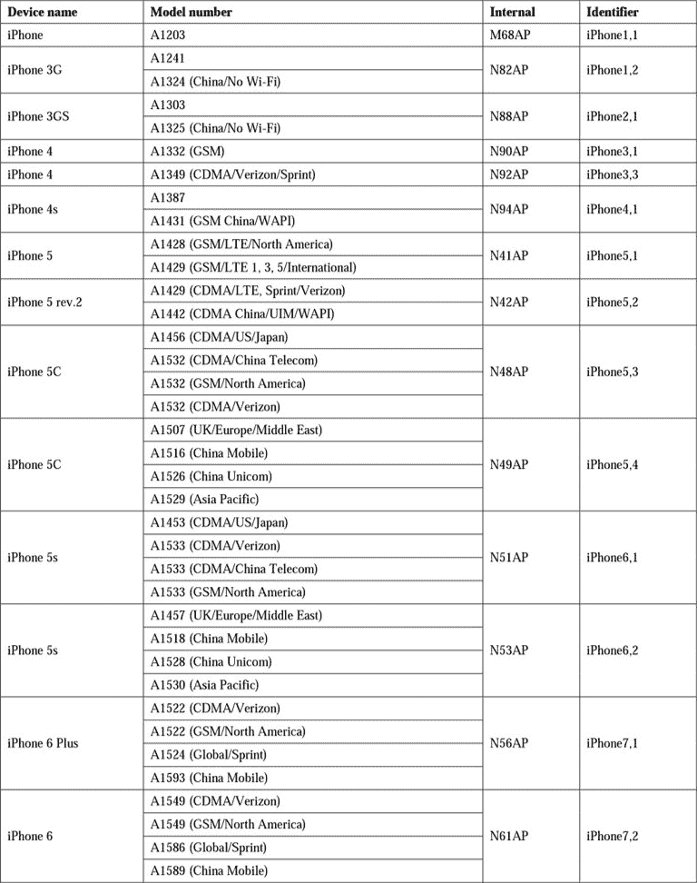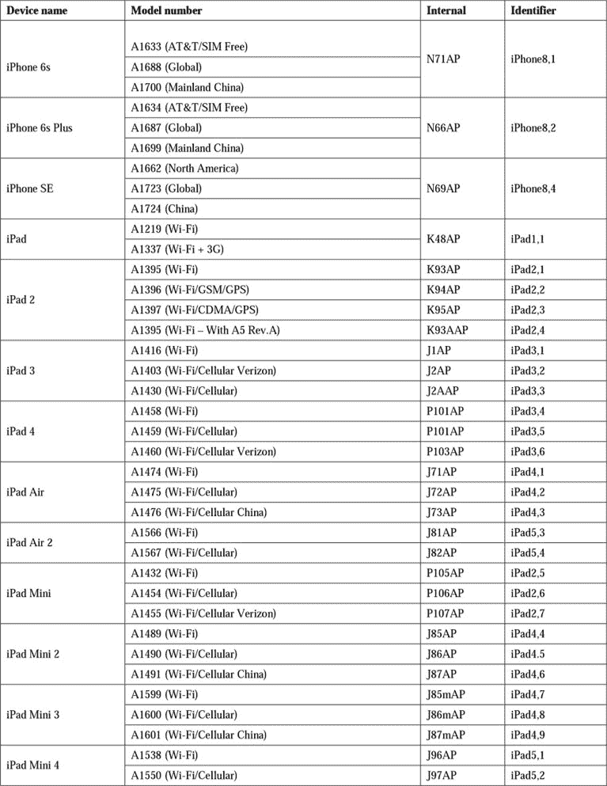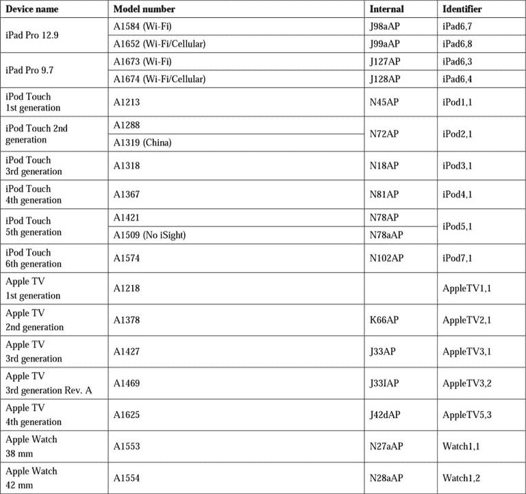

+   **iOS 型号** ([`theiphonewiki.com/wiki/Models`](http://theiphonewiki.com/wiki/Models)): 该页面包含设备名称、设备型号、FCC-ID、内部名称和硬件标识符的详细表格。有关 iOS 设备的其他有用信息，请参见以下链接：

    +   **应用处理器** ([`theiphonewiki.com/wiki/Application_Processor`](http://theiphonewiki.com/wiki/Application_Processor)): 该页面包含安装在 iOS 设备上的处理器的详细列表

    +   **识别您的 iPhone 型号** ([`support.apple.com/en-us/HT201296`](https://support.apple.com/en-us/HT201296)): 这是 Apple 官方页面，包含识别 iPhone 型号的信息

    +   **iPhone** ([`theiphonewiki.com/wiki/IPhone`](http://theiphonewiki.com/wiki/IPhone)): 该页面包含每个 iPhone 型号的所有特性和特点的详细表格

    +   **识别您的 iPad 型号** ([`support.apple.com/en-us/HT201471`](https://support.apple.com/en-us/HT201471)): 这是 Apple 官方页面，包含识别 iPad 型号的信息

    +   **iPad** ([`theiphonewiki.com/wiki/IPad`](http://theiphonewiki.com/wiki/IPad)): 该页面包含每个 iPad 型号的所有特性和特点的详细表格

    +   **识别您的 iPod 型号** ([`support.apple.com/en-us/HT204217`](https://support.apple.com/en-us/HT204217)): 这是 Apple 官方页面，包含识别 iPod 型号的信息

    +   **iPod touch** ([`theiphonewiki.com/wiki/IPod_touch`](http://theiphonewiki.com/wiki/IPod_touch)): 该页面包含每个 iPod touch 型号的所有特性和特点的详细表格

    +   **识别您的 Apple TV 型号** ([`support.apple.com/en-us/HT200008`](https://support.apple.com/en-us/HT200008)): 这是 Apple 官方页面，包含识别 Apple TV 型号的信息

    +   **Apple TV** ([`www.theiphonewiki.com/wiki/Apple_TV`](https://www.theiphonewiki.com/wiki/Apple_TV)): 该页面包含每个 Apple TV 型号的所有特性和特点的详细表格

    +   **识别您的 Apple Watch** ([`support.apple.com/en-us/HT204507`](https://support.apple.com/en-us/HT204507)): 这是 Apple 官方页面，包含识别 Apple Watch 型号的信息

    +   **iOS 支持矩阵** ([`iossupportmatrix.com/`](http://iossupportmatrix.com/)): 该页面包含所有 iDevice 型号的硬件和软件特性及支持的可视化表示

    +   **iPhone IMEI** ([`iphoneimei.info/`](http://iphoneimei.info/)): 该页面包含一个搜索引擎，可以根据 IMEI 号码查找特定的 iPhone 型号

    +   **IMEI.info** ([`www.imei.info/`](http://www.imei.info/)): 这个链接与前述链接类似

    +   **iPhoneox** ([`www.iphoneox.com/`](http://www.iphoneox.com/))：此链接与前述链接类似。

# iOS 操作系统

本章中描述的所有设备都共同使用 iOS 操作系统，该系统最初称为 iPhone OS，直到版本 3。它由 Apple 专为 iPhone、iPad 和 iPod touch 开发。首次发布于 2007 年 1 月，并于同年 6 月与首款 iPhone 一起推出。

iOS 是一种基于旧版 Mac OS X 的操作系统，Mac OS X 是 BSD Unix 的衍生版本，具有基于 Darwin OS 的 Mach 内核 XNU。它使用以下四个抽象层级：

+   **Core OS**：此层包括文件系统、内存管理、安全性、电源管理、TCP/IP、套接字和加密。

+   **Core services**：此层包括网络、SQLite、地理位置和线程。

+   **Media**：此层包括 OpenAL、音频、图像、视频和 OpenGL。

+   **Cocoa touch**：此层包括核心动画、多任务处理和手势识别器。

主页屏幕，称为 SpringBoard，分为以下三部分：

+   顶部的条形区域显示电话信号、任何 3G/Wi-Fi/Bluetooth 活跃连接以及电池状态。

+   中央部分包含设备中应用程序的图标。

+   底部的条形区域包含最常用的应用程序，例如以下这些：

    +   iPhone：电话、邮件、Safari 和音乐。

    +   iPad/iPod touch：消息、邮件、Safari 和音乐。

当用户解锁设备或在另一个应用程序中按下主页按钮时，主页屏幕会显示。

所有由 Apple 发布的操作系统版本的完整列表已发布，并在[`theiphonewiki.com/wiki/Firmware`](http://theiphonewiki.com/wiki/Firmware)上定期更新，所有具体版本及其子版本的详细说明可以在[`en.wikipedia.org/wiki/IOS_version_history`](https://en.wikipedia.org/wiki/IOS_version_history)找到。此外，您可以在[`www.ipswdownloader.com/`](http://www.ipswdownloader.com/)下载所有型号的固件。

以下表格提供了包含的应用程序的详细列表，并标明应用程序最初引入的具体版本。此表格来自并已从网址[`en.wikipedia.org/wiki/IOS`](https://en.wikipedia.org/wiki/IOS)中提取和编辑。

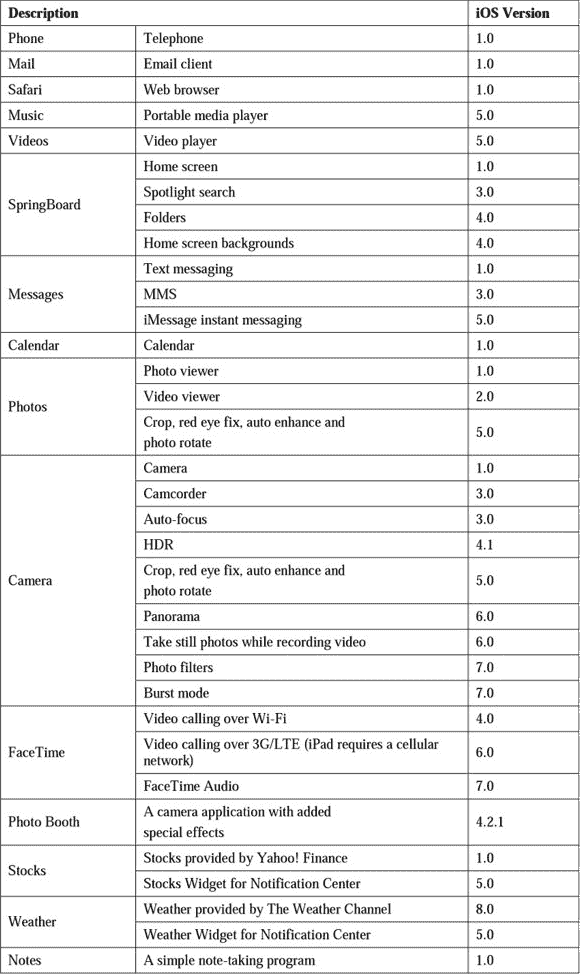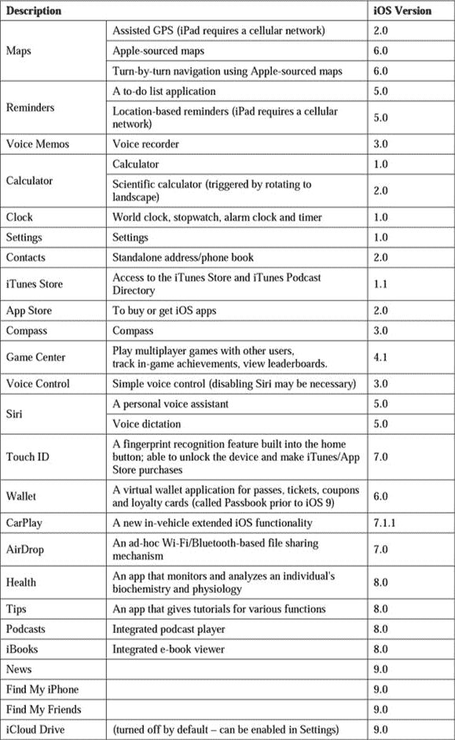

# iDevice 识别

对于法医调查员来说，能够在进行搜索和扣押或进行数据获取活动之前识别出特定的 iOS 设备型号是非常有用的。

识别阶段可以通过以下四种方式进行：

+   识别设备的形状和所使用的连接器。

+   检查设备背面的型号编号。

+   将设备连接到笔记本电脑并直接与之通信。

+   通过操作系统直接导航到**设置** | **通用** | **关于本机**

第一种方法可以通过实践识别每个型号的独特特征来使用。在某些情况下，这可能是一个复杂的评估，因此建议通过其他三种方法中的任何一种来确认第一次评估。

第二种方法需要从设备背面识别型号编号。如前面表格所示，通过型号编号可以轻松识别设备类型。在以下截图中，可以识别出该设备是 A1303 型号，或者是一部内存为 16 GB 的 iPhone 3GS：

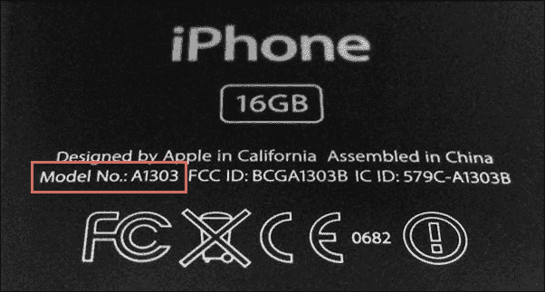

第三种方法是直接获取设备信息，通过与连接到计算机的设备交互。如我们稍后将探讨的，一旦启动 iDevice，它可能会被密码保护，并显示一个输入锁定密码的界面。无论是否知道密码或能否突破或绕过它，设备在连接到计算机时仍然可以传输一些信息。

在此背景下，非常有用的工具和库集成在[`www.libimobiledevice.org/`](http://www.libimobiledevice.org/)中，并预安装在 Linux 发行版 Santoku（[`santoku-linux.com/`](https://santoku-linux.com/)）和 DEFT 8.1（[`www.deftlinux.net`](http://www.deftlinux.net)）中。

使用`ideviceinfo`命令，可以从设备中提取一些信息，无需解锁设备。

可提取的信息如下：

+   设备名称

+   设备类别

+   硬件型号

+   iOS 版本

+   通话功能

+   唯一设备 ID

+   蓝牙 MAC 地址

+   Wi-Fi MAC 地址

在以下截图中，可以识别出连接的设备是仅支持 Wi-Fi 的 iPad mini 1（硬件型号 P105AP），搭载 iOS 6.1.2（构建版本 10B146），设备名为`iPad di Mattia`：

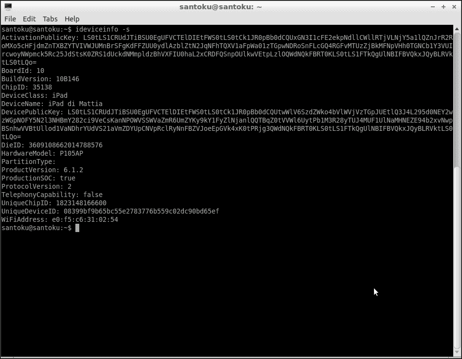

另一个有用的工具是 iFunBox（[`www.i-funbox.com/`](http://www.i-funbox.com/)），用于提取设备信息。只需右键单击**文件浏览器**窗口中的设备名称，然后选择**属性**：

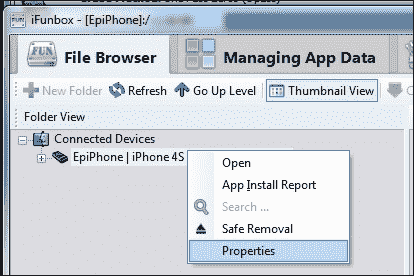

在这个例子中，可以识别出连接的设备是**iPhone 4s**（硬件型号**MD235-IP/A**），搭载 iOS **9.2 (13C75)**，设备名为 EpiPhone：

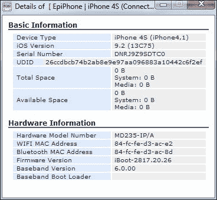

# iOS 文件系统

所有 iDevices 都使用 HFSX 作为文件系统，这是 HFS+的一种变体。它允许在同一文件夹中存储多个同名文件，只是每个文件名的字符大小写不同（例如，`iOS.jpg`和`ios.jpg`）。

## HFS+ 文件系统

HFS Plus（或 HFS+）是由苹果公司开发的文件系统，从 Mac OS 8.1 开始，HFS 成为 Mac 计算机的默认文件系统。根据苹果的官方文档，它被称为**Mac OS Extended**。

HFS+是 HFS 的改进版，它允许用户支持更大的文件（得益于 32 位块地址，而不是 16 位）并使用 Unicode 作为文件系统对象（文件和文件夹）的名称，从而允许每个文件名最多 255 个字符。在 Mac OS X Tiger 之前，HFS+仅支持使用 Unix 文件系统权限来访问文件。Tiger 版本引入了基于**访问控制列表**（**ACL**）的安全检查，这在 Microsoft 环境中很常见。

HFS+卷是分配块，可能包含一个或多个扇区（通常是硬盘中的 512 字节）。分配块的数量取决于卷的总大小。HFS+文件系统使用 32 位来寻址分配块，从而允许访问 232 个块（4,294,967,296）。

一个典型的 HFS+卷由以下六个主要数据结构定义，这些结构包含管理数据卷所需的信息：

+   `卷头`文件：此文件定义了卷的基本结构，包括每个分配块的大小、已使用和空闲块的数量，以及其他特殊文件的大小和位置。

+   `分配`文件：此文件包括一个位图，显示卷内已使用和未使用的块。

+   `目录`文件：此文件定义了文件系统中文件夹的结构，并用于识别特定文件或文件夹的位置。

+   `扩展溢出`文件：此文件包含指向需要超过八个连续分配块的文件的附加扩展的指针。

+   `属性`文件：此文件包含文件的可自定义属性。

+   `启动`文件：此文件包含系统启动所需的信息。

数据结构可以通过以下图示表示：

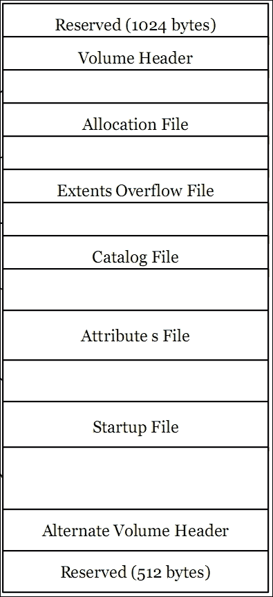

特殊文件和用户文件都存储在**分支**中，或存储在一组分配块中。空间通常以**块组**的形式分配，其中一个块组的大小是块大小的倍数。给定文件的连续分配块被分组成**扩展**。每个扩展由一个起始分配块和块的数量来描述，表示有多少个块包含该特定文件的数据。

在`引导`块和`启动`文件中，卷的前 1,024 字节被保留为引导块，可能包含在系统启动时请求的信息。或者，引导信息可以在`启动`文件中找到，允许存储更多的信息。

`volume header` 文件是一个 512 字节的数据结构，包含卷信息，包括其他数据结构的位置。它总是位于第 2 块的开始或卷开始后 1,024 字节的位置。`volume header` 文件的副本，称为**备用卷头**，位于卷末前 1,024 字节的位置。卷的前 1,024 字节和最后 512 字节是保留的。

卷头文件中包含的信息如下：

| **字段名称** | **大小** | **描述** |
| --- | --- | --- |
| `signature` | 2 字节 | 该字段表示卷标志，如果卷是 HSF Plus，则必须为 `'H+'`，如果卷是 HFSX，则为 `'HX'` |
| `version` | 2 字节 | 该字段表示格式版本，`'4'` 代表 HFS Plus，`'5'` 代表 HFSX |
| `attributes` | 4 字节 | 该字段表示卷属性（例如，启用了日志记录） |
| `lastMountedVersion` | 4 字节 | 该字段描述安装的操作系统 |
| `journalInfoBlock` | 4 字节 | 该字段是管理日志记录的分配块 |
| `createDate` | 4 字节 | 该字段表示卷的创建日期 |
| `modifyDate` | 4 字节 | 该字段表示卷最后修改的日期 |
| `backupDate` | 4 字节 | 该字段表示卷最后备份的日期 |
| `checkedDate` | 4 字节 | 该字段表示卷最后一致性检查的日期 |
| `fileCount` | 4 字节 | 该字段表示卷中文件的数量，不包括特殊文件 |
| `folderCount` | 4 字节 | 该字段表示卷中文件夹的数量，不包括根文件夹 |
| `blockSize` | 4 字节 | 该字段表示分配块大小（字节） |
| `totalBlocks` | 4 字节 | 该字段表示分配块的总数 |
| `freeBlocks` | 4 字节 | 该字段表示可用的分配块数 |
| `nextAllocation` | 4 字节 | 该字段表示下一个可用分配块的地址 |
| `rsrcClumpSize` | 4 字节 | 该字段表示资源分支的默认块大小 |
| `dataClumpSize` | 4 字节 | 该字段表示数据分支的默认块大小 |
| `nextCatalogID` | 4 字节 | 该字段表示第一个可用的 CatalogID |
| `writeCount` | 4 字节 | 该字段表示卷挂载的次数 |
| `encondingsBitmap` | 8 字节 | 该位图描述了文件和文件夹名称使用的编码 |
| `finderInfo` | 32 字节 | 该字段表示 Mac OS Finder 和系统软件引导过程使用的信息 |
| `allocationFile` | 80 字节 | 该字段表示文件分配的位置和大小 |
| `extentsFile` | 80 字节 | 该字段表示范围文件的位置和大小 |
| `catalogFile` | 80 字节 | 该字段表示目录文件的位置和大小 |
| `attributesFile` | 80 字节 | 该字段表示属性文件的位置和大小 |
| `startupFile` | 80 字节 | 该字段表示启动文件的位置和大小 |

`allocation`（位图）文件用于跟踪卷上哪些分配块当前已分配给某个结构（文件或文件夹）。它是一个位图，包含卷中每个分配块的一个位。如果一个位是 1，则对应的分配块正在使用中。如果该位是 0，则对应的分配块当前未使用，因此可以分配给文件或文件夹。

`catalog` 文件用于保存 HFS+ 上文件和文件夹的层次结构信息。`catalog` 文件组织为二叉树（B 树类型），因此由头节点、索引节点和叶子节点组成。`catalog` 文件的第一个数据块位置（即文件的 `head` 节点）存储在 `volume header` 文件中。`catalog` 文件包含卷上所有文件和文件夹的元数据，包括创建、修改和访问日期、权限、文件标识符以及创建文件的用户信息。

`catalog` 文件中每个文件的数据结构如下：

```
struct HFSPlusCatalogFile { 
    SInt16              recordType; 
    UInt16              flags; 
    UInt32              reserved1; 
    HFSCatalogNodeID    fileID; 
    UInt32              createDate; 
    UInt32              contentModDate; 
    UInt32              attributeModDate; 
    UInt32              accessDate; 
    UInt32              backupDate; 
    HFSPlusBSDInfo      permissions; 
    FileInfo            userInfo; 
    ExtendedFileInfo    finderInfo; 
    UInt32              textEncoding; 
    UInt32              reserved2; 
    HFSPlusForkData     dataFork; 
    HFSPlusForkData     resourceFork; 
}; 

```

确定文件位置时最感兴趣的两个区域是 `dataFork` 和 `resourceFork`（均为 `HFSPlusForkData` 类型）。

`dataFork` 字段包含有关文件位置和大小的信息，或文件当前内容的信息，而 `resourceFork` 字段包含文件的应用程序元数据。

`HFSPlusForkData` 数据结构由以下四个字段定义：

```
struct HFSPlusForkData { 
    UInt64                  logicalSize; 
    UInt32                  clumpSize; 
    UInt32                  totalBlocks; 
    HFSPlusExtentRecord     extents; 
}; 

```

`logicalSize` 字段定义数据的字节大小，`totalBlocks` 字段定义分配的块数量，`extents` 字段存储文件描述符的前八个扩展（扩展是文件的连续段）。如果文件需要更多描述符扩展，这些扩展存储在 `extents overflow` 文件中。构成文件的每个扩展都在 `HFSPlusExtentDescriptor` 数据结构中描述，并由以下两个字段定义：

```
struct HFSPlusExtentDescriptor { 
    UInt32                  startBlock; 
    UInt32                  blockCount; 
}; 

```

`startBlock` 字段标识扩展中的第一个分配块，`blockCount` 字段标识扩展的长度（按分配块数量计算）。文件的起始偏移量可以通过找到第一个扩展并将对应的 `startBlock` 字段与分配块的大小相乘来确定，分配块的大小在 `volume header` 文件中定义。由于文件不总是可以完全存储在磁盘上连续的块中，且可能会被碎片化，`HFS+ dataFork` 定义了一种结构，可以容纳最多八个扩展。当文件需要超过八个扩展时，它会使用 `extents overflow` 文件，将文件与额外的扩展结合起来。

对于`extents overflow`文件，如果一个 HFS+卷中的文件由超过八个扩展（或在卷的连续位置上被分割为超过八个部分）组成，超出部分将存储在`extents overflow`文件中。该文件的结构类似于`content`文件（二叉树，B 树）；然而，由于只有一个数据结构（`HFSPlusExtentKey`）存在，其结构大大简化。

`attributes`文件允许通过文件系统直接管理文件的附加属性。这些属性被定义为键/值对。

与 HFS+相关的一个有趣概念是文件系统日志记录，用于在卷没有安全卸载时的恢复过程。此文件存储文件事务（`create`、`delete`、`modify`等），并可能包含存储在属性文件或`catalog`文件中的相同元数据。它在 iOS 设备上默认启用，并可用于恢复删除的内容。

## 设备分区

i 设备使用 NAND 类型内存，分为两个分区：系统分区或固件分区以及数据分区。

系统分区包含 iOS 操作系统和所有预装的应用程序，标识为`/dev/disk0s1`或`/dev/disk0s1s1`。此分区通常无法由用户在写入模式下访问，只有操作系统更新时才能修改。由于它不能包含用户安装的应用程序和数据，因此其大小较小，具体大小取决于设备型号。

数据分区占据了 NAND 内存大部分空间，标识为`/dev/disk0s2`或`/dev/disk0s2s2`。该分区包含用户数据和用户安装的应用程序，操作系统会在运行时将其挂载在`/private/var`目录下。

## 系统分区

如果设备处于正常状态，所有与调查相关的信息都位于包含用户数据的分区。因此，系统分区通常不涉及调查内容。有关文件夹内容的完整描述可以在[`theiphonewiki.com/wiki/`](http://theiphonewiki.com/wiki/)找到，且该分区看起来与下面的截图相似：

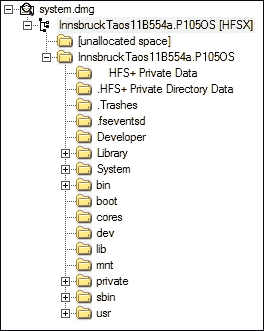

需要注意的是，`/private/etc/passwd`（如以下截图所示）包含设备上配置的用户的密码（`mobile`和`root`）：

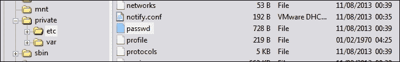

对于所有 i 设备，`mobile`和`root`用户的默认密码是**alpine**。除非执行越狱操作，否则用户无法修改该密码，具体操作如下面的截图所示：

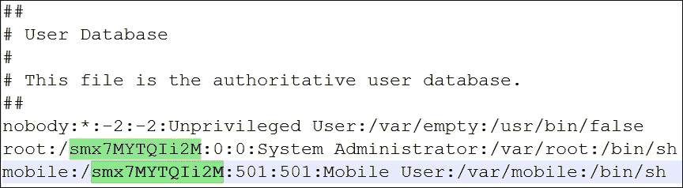

## 数据分区

数据分区的结构在不同版本的操作系统中发生了变化。以下截图展示了从越狱后的 iPad mini 1G（运行 iOS 9.0.2）提取的文件夹结构示例：

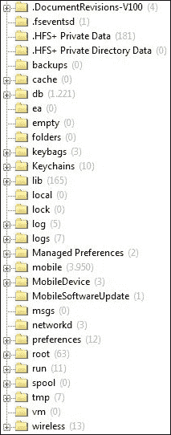

对于 iDevice 的分析，将在第六章，*分析 iOS 设备*中讨论有用的元素。然而，在这里，我们想要回顾 *数据分区* 部分中各文件夹的一般内容，主要参考资料为 *iPhone Wiki*：

+   `backups`：通常为空且未被 iOS 使用。

+   `cache`：通常为空且未被 iOS 使用。

+   `db`：保存系统组件使用的数据库，例如设备获得的时区信息和 DHCP 租约。如果存在 `stash` 子文件夹，则设备已越狱。

+   `ea`：通常为空且未被 iOS 使用。

+   `empty`：通常为空且未被 iOS 使用。

+   `folder`：通常为空且未被 iOS 使用。

+   `keychains`：存储 iOS 中使用的密码。

+   `keybags`：包含 keybags，类似于 keychains，但不同之处在于 keybags 会在重启时清除，而 keychains 会在重启后保留。它只包含一个文件（`systembag.kb`），例如，存储 iTunes 使用的托管密钥包。自 iOS 4.0 起存在。

+   `lib`：保存已安装应用程序的状态信息。如果存在 `cydia` 子文件夹，则设备已越狱。

+   `local`：通常为空且未被 iOS 使用。

+   `lock`：通常为空且未被 iOS 使用。

+   `log`：存储一些系统日志（例如；`asl`，`revision`，`ecc`）。

+   `logs`：存储其他系统日志（例如，CrashReporter）。

+   `Managed Preferences`：存储通过 ActiveSync 与 Microsoft Exchange 相关的文件。

+   `mobile`：包含移动用户的主文件夹，并保存从取证角度来看最有用的信息。

+   `MobileDevice`：包含配置文件，通常用于开发阶段。

+   `MobileSoftwareUpdate`：用于无线更新，自 iOS 5.0 起存在。

+   `msgs`：通常为空且未被 iOS 使用。

+   `networkd`：包含由 networkd 使用的文件，networkd 是与网络服务相关的守护进程。

+   `preferences`：保存一些系统配置。

+   `root`：包含移动用户的 `home` 文件夹。

+   `run`：包含仅在运行时使用的文件，通常由 lockdownd 使用。

+   `spool`：通常为空且未被 iOS 使用。

+   `tmp`：包含临时文件，其内容通常不会在设备重启后保留。

+   `vm`：为空且未被 iOS 使用，并且不支持交换文件和休眠。

+   `wireless`：包含与设备运营商提供的电话服务相关的数据。

最后，需要指出的是，iDevices 使用属性列表和 SQLite 数据库作为数据和配置容器。

## 属性列表文件

`property list` 文件（也称为 `plist` 文件）由 Apple 用于管理操作系统和关键应用程序的配置。通常，这些是格式为 XML 的简单文本文件。在大多数情况下，`plist` 文件包含文本字符串和布尔值；在某些情况下，它可能包含以二进制格式编码的数据，如下图所示。尽管它们可以通过简单的文本编辑器轻松分析，但通过专用阅读器浏览层次结构会更加方便。关于 plist 格式的完整描述超出了本书的范围，但可以在线找到完整的参考资料，链接为 [`developer.apple.com/legacy/library/documentation/Darwin/Reference/ManPages/man5/plist.5.html`](https://developer.apple.com/legacy/library/documentation/Darwin/Reference/ManPages/man5/plist.5.html)。

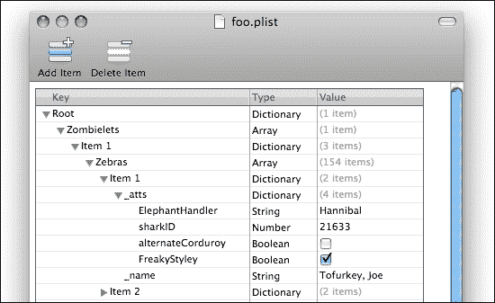

在 Mac 环境中，可以安装由 Apple 开发的免费工具 **Property List Editor**。它可以从 XCode 开发平台的官方网站下载 ([`developer.apple.com/xcode/`](https://developer.apple.com/xcode/))。

在 Windows 环境中，我们可以使用 **plist Editor for Windows** ([`www.icopybot.com/plist-editor.htm`](http://www.icopybot.com/plist-editor.htm))。

## SQLite 数据库

iOS 设备使用 SQLite 数据库来存储信息和用户数据。关于 plist 格式的完整描述超出了本书的范围，但可以在线找到完整的参考资料，链接为 [`www.sqlite.org/`](https://www.sqlite.org/)。分析这些文件需要最低限度的 SQL 命令知识来选择数据；然而，有多种免费的软件选项可以解读并轻松显示数据库中的数据。一款跨平台的软件是 **SQLite Database Browser** ([`sqlitebrowser.org/`](http://sqlitebrowser.org/))，它可以让我们可视化数据库结构并在数据中进行导航，如下图所示：

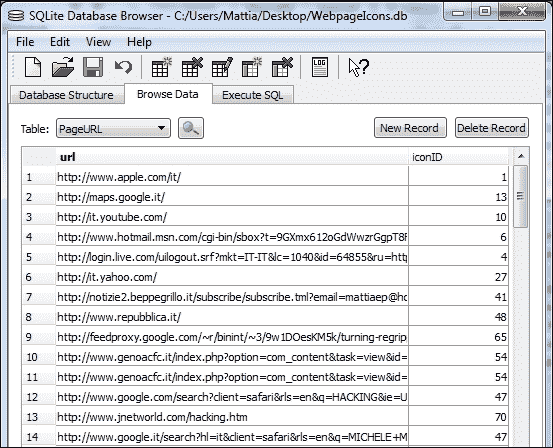

在 Windows 环境中，建议使用软件 **SQLite Expert**（个人和商业许可证均可通过 [`www.sqliteexpert.com/`](http://www.sqliteexpert.com/) 获得）。

# 概述

本章介绍了在移动取证活动中与 iOS 设备相关的特性。特别是，它介绍了不同的机型，并提供了基于型号或硬件型号的识别技术指导。还包含了 iOS 操作系统的介绍，特别是文件系统（HFSX）、分区（系统和数据）以及主要的数据结构（`property list` 文件和 SQLite 数据库）。这些内容是对 iDevice 进行取证活动的基础，并且对于理解下一章的内容非常有用，在那一章中你将学习各种工具和技巧，帮助你在处理数据获取和分析时使用。

# 自测题

Q1\. iPhone 4 支持的最新 iOS 版本是什么？

1.  iOS 5.1.1

1.  iOS 6.1.2

1.  iOS 7.1.2

1.  iOS 8.1.2

1.  iOS 9.0.2

Q2\. 哪些是与 iPhone 6s 相关的型号？

1.  A1522 和 A1524

1.  A1549 和 A1586

1.  A1633 和 A1688

1.  A1428 和 A1429

Q3\. iOS 使用的文件系统是什么？

1.  NTFS

1.  EXT3

1.  HFS+

1.  HFSX

Q4\. iOS 文件系统中用于保存文件和文件夹信息的元文件是什么？

1.  卷头

1.  分配

1.  目录

1.  范围

Q5\. 默认的 root 用户密码是什么？

1.  apple

1.  iphone

1.  leopard

1.  alpine

Q6\. 哪种文件类型主要用于保存 iOS 配置？

1.  文本

1.  Json

1.  Plist

1.  HTML
