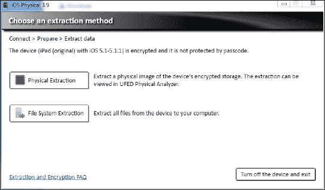

# 第三章：从 iDevices 获取证据

本章的目的是介绍用于从 iDevice 获取数据的技术和工具。在本章的第一部分，我们将讲解启动过程、数据安全特性和 Apple 使用的加密技术。第二部分则涉及不同的获取方法，包括 **Apple 文件通道**（**AFC**）协议、iTunes 备份、Apple 文件中继协议和物理获取等，并提供了破解或绕过锁定代码的先进技术的描述。最后，在最后一部分，我们将介绍越狱的概念，这对于最新设备的物理数据获取非常有用。

# iOS 启动过程和操作模式

iOS 设备的启动过程由三个步骤组成：**低级引导加载程序**（**LLB**）、**iBoot** 和 **iOS 内核**。为了保证不同组件的完整性，启动过程中涉及的所有步骤都会进行签名。LLB 的签名通过包含在 Boot ROM 代码中的 Apple 根证书公钥进行验证。然后，LLB 验证并执行 iBoot，iBoot 接着验证并执行 iOS 内核。因此，所有组件都由 Apple 签名。关于 iOS 启动过程以及如何绕过 Apple 实施的保护措施，已经有许多研究、论文和书籍（所有细节可以在 *附录 A* 和 *参考文献* 中找到）。我们建议您阅读 Apple 的最新论文 *iOS 安全性*，*Apple*，*2016 年 5 月*。

从取证分析师的角度来看，了解 iDevice 可以在以下三种不同模式下运行是很重要的：

+   **正常模式**：这是传统的 iOS 用户界面模式。

+   **恢复模式**：此模式用于在 iDevice 上执行激活和升级。通过在设备关闭时按住 Home 键并通过 USB 电缆将其连接到计算机来激活此模式。

+   **设备固件升级模式**（**DFU**）：此模式在 iOS 升级过程中或当验证启动链中的某个过程失败时，iDevice 会进入该模式。通过同时按住 Home 键和 Power 键 10 秒钟（无论设备是开机还是关机），然后松开 Power 键并继续按住 Home 键 10 秒钟，即可激活此模式。

恢复模式和 DFU 模式对于 iDevices 的物理数据获取非常有用，正如我们稍后在专门部分中展示的那样。

# iOS 数据安全

本书并不涵盖 iOS 数据安全的完整描述，但我们希望为您提供一个概览（摘自 Apple 的 *iOS 安全性* 论文和 Christian D'Orazio 的论文；请参阅 *附录 A*，*参考文献*）有关硬件和软件安全特性。

## 硬件安全特性

从 iPhone 3GS 开始，每台 iDevice 设备都内置了一个专用的 AES 256 位加密引擎，该引擎位于闪存存储和主系统内存之间。这个处理器的目的是加速加密和解密操作，并保护用户数据，使其在设备的闪存上保持加密状态。每个设备都与一个**唯一 ID**（**UID**）相关联，允许将数据加密地绑定到特定设备。UID 无法直接读取，并且它被用作 AES 256 位密钥来生成保护用户数据的加密密钥。这些加密密钥被称为**EMF**和**Dkey**（**Class D Key**），存储在闪存的特定区域，称为**PLOG 块**（或**可删除存储**）。当设备删除此区域时，整个卷会变得无法读取，内容完全加密且无法恢复。

## 文件数据保护

如苹果在文档 *iOS Security* 中所描述（参考 *附录 A*, *参考资料*）：

> *“除了 iOS 设备内建的硬件加密功能外，苹果还使用一种叫做数据保护的技术来进一步保护设备上闪存存储的数据。”*

苹果实现了加密的 HFS+卷，其中每个文件会根据数据类型和所需的安全级别分配一个类别。文中还指出：

> *“每当数据分区上的文件被创建时，数据保护会生成一个新的 256 位密钥（每个文件的密钥），并将其交给硬件 AES 引擎，后者使用该密钥在使用 AES CBC 模式写入闪存时对文件进行加密。”*

然后，每个文件的密钥会被该文件所属类别的密钥加密。加密后的文件密钥会存储在`cprotect`属性中，该属性是文件元数据的一部分，包含在`Attributes`文件中。文中进一步指出：

> *“当一个文件被打开时，它的元数据会使用文件系统密钥解密，从而揭示出加密的每个文件密钥以及标明保护它的类别的注释。每个文件的密钥通过类别密钥解密，然后提供给硬件 AES 引擎，后者在从闪存读取文件时进行解密。”*

需要注意的是，文件系统密钥可以被擦除，在这种情况下，每个文件的内容将变得完全无法读取。有四个基本类别使用不同的策略来确定文件内容何时可访问，以及类别密钥存储的位置。除了 Dkey 外，所有类别密钥都存储在`Keybag`系统中，这是一个包含每个类别主密钥的文件，如下图所示：

D 类提供最低的安全级别，因为 Dkey 不是从密码派生的，而是被包装在 `PLOG` 区域中，且有一个可以通过与内核通信来检索的值（`Key0x835`）。从取证的角度来看，重要的是要注意，除了电子邮件消息及其附件外，所有由原生 iOS 应用程序创建的文件都属于 D 类。这意味着，解密文件所需的所有加密密钥都可以在无需知道或破解密码的情况下被检索。

# 唯一设备标识符

每一台生产的 iDevice 都有一个 **唯一设备 ID** (**UDID**)，如 [The iPhone Wiki](http://theiphonewiki.com/wiki/UDID) 所解释的那样。它可以通过以下方法计算得到：对特定的 60 或 59 个字符长的字符串进行 **SHA-1** 哈希运算，且该字符串可以通过以下方式获得：

+   一个 11 或 12 个字符长的序列号（在较新的设备上），与 **设置** 应用中显示的一致。

+   一个没有空格的 15 个字符的 IMEI 号码（在较老的设备上），对于 iPod touch 和 Wi-Fi 型 iPad 设备为空字符串，或者一个没有前导零的 13 个字符的十进制 ECID（在较新的设备上）

    ### 注意事项

    ECID 是电子芯片 ID。欲了解更多信息，请参阅 [`theiphonewiki.com/wiki/ECID`](https://theiphonewiki.com/wiki/ECID)。

+   一个 17 个字符长的 Wi-Fi MAC 地址（字母为小写，包括冒号）。对于第一代 iPod touch，使用 `00:00:00:00:00:00`

+   一个 17 个字符长的蓝牙 MAC 地址（字母为小写，包括冒号）

## 案例研究 - iPhone 6s 上的 UDID 计算

在 iPhone 6s 上，UDID 的计算方法如下：

如果设备已解锁，序列号、Wi-Fi MAC 地址和蓝牙地址可以通过点击设备主屏幕上的 **设置** | **通用** 中的 **关于** 来获取，如下截图所示：

ECID 可以通过以下步骤获得：

1.  将设备置于恢复模式。

1.  打开 Windows **设备管理器**，导航到 **通用串行总线控制器** | **Apple Mobile Device USB 驱动程序**，右键点击它，并选择 **属性**。

1.  点击 **详细信息**，在下拉菜单中搜索并选择 **设备实例路径**，并将文本复制到文本文件中。

1.  在 Mac OS X 上，导航到 **系统信息** | **系统报告**，并在 **硬件** 下的 USB 条目中查看。

在此示例中，我们有以下条目：

+   **序列号**: `F17QT811GRY9`

+   **ECID**: `0016611E28BB0226`

+   **Wi-Fi MAC 地址**: `1C:5C:F2:7F:7A:20`

+   **蓝牙 MAC 地址**: `1C:5C:F2:7F:7A:21`

在计算 UDID 之前，我们需要将 ECID 的十六进制值转换为十进制数字，因此 `16611E28BB0226` 对应 `6299231647892006`。此外，Wi-Fi MAC 地址和蓝牙 MAC 地址中的字母必须转换为小写字母。

UDID 可以按以下方式计算：

`SHA1(F17QT811GRY962992316478920061c:5c:f2:7f:7a:201c:5c:f2:7f:7a:21) = 3bf682ebc55c5673d586e0273af0dfb72d1994a2`

计算得到的值可以通过 iTunes 进行验证，方法是将设备连接到计算机，如下图所示：

否则，也可以使用`ideviceinfo`工具来验证 UDID，该工具在第二章《iOS 设备简介》中介绍，如下图所示：

# 锁定证书

第一次将解锁的 iDevice 连接到计算机并运行 iTunes 软件时，会在计算机硬盘上创建一个配对/同步证书，称为**锁定**证书。根据 iTunes 安装的操作系统，锁定证书会存储在以下文件夹中：

+   **Windows 7/8/10**：`C:\Program Data\Apple\Lockdown`

+   **Windows Vista**：`C:\Users\[用户名]\AppData\roaming\Apple Computer\Lockdown`

+   **Windows XP**：`C:\Documents and Settings\[用户名]\Application Data\Apple Computer\Lockdown`

+   **Mac OS X**：`/var/db/lockdown`

在旧版本的 Mac OS X 中，锁定证书存储在`/Users/[用户名]/Library/Lockdown/`目录下。

在这些路径下，每个曾经连接到计算机的设备都有一个锁定证书。该证书是一个`plist`文件，名为`<UDID>.plist`，其中`UDID`对应 iDevice 的唯一标识符，如下图所示：

一旦为特定设备生成证书，它将一直有效，直到用户将设备重置为出厂设置。如果设备已经开启且在过去 48 小时内至少解锁过一次（从 iOS 8 开始），该证书可以绕过密码，既可以获取备份，又可以通过 AFC 服务提取文件。对于数据取证来说，至关重要的一点是，证书可以被复制到另一台机器上。

从 iOS 7.0 开始，当你连接设备时，会显示两个弹出授权窗口。第一个弹出窗口出现在计算机上的 iTunes 中，要求用户点击**继续**。

第二个弹出窗口会在 iDevice 解锁后出现在屏幕上，用户需要点击**信任**按钮以允许与计算机配对。

# 搜查和扣押

如果你需要处理 iDevice 的搜查和扣押，执行一些步骤非常重要。我们有三种情况：设备关闭、设备在搜查和扣押时已经开启且解锁、设备在搜查和扣押时已开启但锁定：

1.  如果设备已开启并且已锁定，请执行以下操作：

    如果已设置密码，请尽快从设备采集内容，或者保持设备开机并充电。

    如果未设置密码，关闭该选项。

1.  如果设备关闭，请保持其关闭。

1.  在**设置** | **通用** | **自动锁定**中，将**自动锁定**设置为**永不**。

1.  检查是否设置了密码，路径为**设置** | **密码**。

1.  如果设备已开机且解锁，请在**设置**中打开**飞行模式**：

    检查设备是否显示**iPhone 重启后需要输入密码**的消息，如以下截图所示：

    

1.  使用苹果**控制中心**打开**飞行模式**，通过简单滑动即可激活，即使设备已锁定，只要用户未禁用此访问权限。

1.  保持手机开机并充电。

1.  扣押任何可能曾用于同步或简单授权 iDevice 的计算机，因为在这些设备上，你可能找到一个锁定证书，允许访问数据。

1.  尽快采集数据，因为锁定证书仅在设备保持开机状态且最长不超过 48 小时有效。

# iOS 设备采集

一旦确定了需要采集的具体型号，了解使用最佳技术变得至关重要。采集类型基本上取决于以下七个参数：

+   设备型号

+   iOS 版本

+   密码（未设置、简单密码或复杂密码）

+   设备状态（开机或关机）

+   是否有配对证书

+   是否设置了备份密码

+   设备是否越狱

目前，在法医界，以下四种技术被用来访问存储在 iDevices 上的数据：

+   **Apple 文件通道**：此技术通过与已开机设备的直接交互，通常通过非法医软件，允许获取文件系统的简化版本。

+   **iTunes 备份**：此技术通过 iTunes 备份功能或使用通过 iTunes 库进行的法医采集工具，进行部分文件系统的采集。

+   **高级逻辑**：此技术基于 Apple File Relay，由研究人员 Jonathan Zdziarski 首次引入。

+   **物理**：此技术生成一个传统的法医镜像，涵盖系统和数据分区。

## Apple 文件通道采集

通过 AFC 服务进行的获取可以在所有 iDevices 上进行，无论操作系统版本如何。要求设备没有设置密码，或者密码已知，或者分析员拥有有效的锁定证书。通过不同版本的 iOS，这种获取方式及可获取的数据类型发生了很大变化。

从 iOS 9 开始，如果设备解锁或具有有效的锁定证书，则只能提取多媒体信息（照片、视频、音乐等）及相关配置文件（例如，iTunes 库、照片应用的数据库等）。此外，在 iOS 8.3 及更早版本中，只要设备解锁或具有有效的锁定证书，也可以访问第三方应用程序的数据文件夹。值得注意的是，这种方法还允许我们从设备中提取 `Crash Reports` 文件夹，其中包含操作系统和已安装应用程序生成的错误日志以及实时系统日志。通过 iTunes 备份获取的数据中将不包含这些文件，正如在第六章，*分析 iOS 设备*中将解释的那样，某些情况下，这些文件可能包含非常重要的信息。因此，在选择获取方法时，建议考虑这一点。

要进行这种类型的获取，可以使用各种被称为 iDevice 浏览器的软件。

### 注意

该操作使用的是非取证工具，且该工具也允许写入操作，因此分析人员必须非常小心操作，以避免意外擦除数据。

在 Windows 和 Mac 上，最常用的工具有 **iFunBox**、**iTools**、**iBackup Bot**、**iMazing**、**iExplorer** 和 **WonderShare Dr.Fone**。这些工具需要安装更新版本的 iTunes，因为它们使用 iTunes 的库与设备进行通信。在将设备连接到计算机之前，应确保在 **iTunes** | **偏好设置** | **设备** 中启用了 **防止 iPods、iPhones 和 iPads 自动同步** 选项，如下图所示：

### 案例研究 - 使用 iBackupBot 进行 AFC 获取

**iBackupBot** 是一款用于 Windows 的商业工具，可以访问连接的 iOS 设备，通过 AFC 协议直接提取数据并生成 iTunes 格式的备份。试用版允许从设备加载和提取信息。

下载、安装并运行软件后，只需连接设备以开始获取，等待相关信息加载。在以下截图中，您可以看到与运行 iOS 8.3 的 **iPad 2 (GSM)** 相关的示例，显示设备的主要特征（**序列号**、**唯一标识符**、**蓝牙地址**、**Wi-Fi 地址**等）以及备份加密配置状态（即是否启用）。

点击 **用户应用程序** 可以查看用户安装的所有应用程序列表，报告应用程序及其数据的大小，以及当前安装的版本：

**应用文件共享**选项提供了对应用程序数据的访问，这些数据是由开发者决定共享的。这个功能通常通过 iTunes 来允许设备和电脑之间的文件交换。所有从应用程序共享的文件都可以直接从设备中提取。这项功能通常用于需要创建和/或修改内容的应用程序（例如 Office 套件应用）或管理文件的应用程序（例如压缩应用）。

以下截图展示了 WinZip 应用程序中的一个示例。通过右键点击一个或多个文件，你可以将它们导出到电脑上的文件夹。请注意，这种访问方式是读写权限，图形界面还提供了一个**新建文件夹**按钮，允许在设备上创建内容。

**原始文件系统**选项允许你在通过 AFC 协议提供的设备文件系统部分内导航。如前所述，它主要包括媒体数据（`DCIM` 文件夹）、加载到 iBooks 应用中的书籍（`Books` 文件夹）、iTunes 库（`iTunes_Control` 文件夹）以及用户或应用程序下载的文件（`Downloads` 文件夹）。与之前的选项类似，文件和文件夹可以从设备提取到电脑。

最后，**工具**选项允许提取 `系统日志` 和 `崩溃报告` 文件夹中的文件。

`系统日志`可以导出为文本格式，包含设备活动的最新信息。如果在即时性情况下提取，它非常有用，通常也可以支持附加到采集报告中的信息，并至少部分证明在提取过程中对系统所做的不可避免的更改。

`崩溃报告`文件夹可以通过与前述选项相似的方式提取。通常，它包含设备过去 24-48 小时使用的信息，但信息的具体数量无法预先确定，因为它会受到多个参数的影响。正如在第六章《分析 iOS 设备》中详细描述的那样，*分析 iOS 设备*，这些日志可能包含无法通过其他方法提取的信息。

## iTunes 备份

**iTunes 备份** 获取使分析员能够恢复比 AFC 获取更多的信息，并且以更为取证的方式进行，因为它为设备创建备份而不更改任何数据。关于密码条件，类似于直接获取：分析员必须知道密码或拥有有效的锁定证书才能执行此类获取。在连接设备之前，还需要在 iTunes 软件中禁用自动同步功能。此获取可以通过两种方式执行，*使用 iTunes* 或 *使用取证软件*。

### 使用 iTunes 进行数据获取

通过 iTunes 进行的获取可以通过设备的备份功能非常简单地完成。一旦启动 iTunes，需要点击设备的名称以访问详细信息。此时，需要检查设备与备份操作的配置情况。可能会有以下三种情况：

+   设备已配置为执行不受密码保护的本地备份

+   设备已配置为执行带有设备所有者先前设置的密码的本地备份

+   该设备已配置为备份到 iCloud

在前两种情况下，只需点击 **立即备份** 按钮即可在计算机上开始备份，如下图所示：

如果用户没有选择密码，则创建的备份可以使用各种工具进行分析。否则，分析员在开始分析之前需要破解备份密码。密码破解和备份结构将在第四章，*来自 iTunes 备份的证据获取与分析*中讨论。

在第三种情况下，在开始备份之前，分析员必须将选项从 **iCloud** 更改为 **此计算机**。这样，备份将在本地执行，并且不会覆盖 iCloud 上先前备份中的任何现有数据。来自 iCloud 的数据获取将在第五章，*来自 iCloud 备份的证据获取与分析*中解释。

### 使用取证工具进行数据获取

市场上有多种取证工具可以执行备份获取，例如 Cellebrite UFED 4PC/UFED Touch/UFED Physical Analyzer、Oxygen Forensic® Starter/Analyst/Detective、Mobile Phone Examiner、MobilEdit!、Lantern 和 XRY。

### 注意

有关详细的参考列表，请参阅附录 B，*iOS 取证工具*。

### 案例研究 - 使用 Oxygen Forensic Analyst 进行 iTunes 备份获取

**Oxygen Forensic** 软件是一个商业产品，允许取证分析员执行 iOS 设备的 iTunes 备份获取。它提供三种许可模式，**Starter**、**Analyst** 和 **Detective**。

要开始提取，必须点击主屏幕上的**连接设备**按钮，如下图所示：

软件将开始提取过程，您可以选择开始连接的方式。您可以选择**自动设备连接**或**手动选择设备**，如下图所示。对于 iDevice，通常选择第一个选项即可。

软件开始搜索连接的 iDevice。如果设备设置了密码，软件会要求分析员输入密码或提供锁定证书。软件提供 iDevice 的 UDID，这样分析员可以更容易地在之前与该设备同步过的计算机上搜索该设备。如果分析员知道密码，需将其输入设备，授权计算机，并点击**我输入了密码，点击连接**。否则，他/她可以选择**选择锁定 plist**选项并提供有效的锁定证书。

如果证书正确，软件会显示一个确认界面，提供一个按钮以开始连接设备，如下图所示：

此时，软件会显示与连接设备相关的信息（如型号、IMEI 号码、iOS 版本和引导加载程序），如下图所示：

调查员可以输入案件的相关信息，如果已知，可以输入设备的备份密码。

然后，分析员可以通过选择此方法支持的数据来选择他们希望提取的数据，如下图所示：

点击**下一步**按钮后，获取过程将开始并显示进度条。需要注意的是，在提取过程中，软件还会解析所有找到的数据，包括在手机中存储的数据库内搜索已删除记录（例如，通话记录、短信、聊天记录等）。因此，获取过程可能需要较长时间，但在此之后，分析员就可以在软件中解析数据，如下图所示：

如果设备之前设置了备份密码，Oxygen 可以与**Passware Kit Forensic**（如果安装在用来获取数据的计算机上）协同工作，尝试对备份密码进行攻击。如果检查员知道密码，他/她有机会完成攻击并手动输入密码。在破解过程结束时，如果密码被找到，软件将按照之前描述的方式提取所有数据。如果密码未找到，软件仅提取多媒体内容（如图片、视频、书籍等），并且不会提供有关预装或用户安装的应用程序的信息：

## 高级逻辑获取

高级逻辑获取方法最早是由 iOS 安全研究员 Jonathan Zdziarski 在 2013 年 6 月发布的工具**Waterboard**中引入的。作者在其文章中的描述如下：

> *"Waterboard 是一个开源的 iOS 取证成像工具，能够通过利用 Apple 内建的锁定服务中的扩展服务和后门，执行 iOS 设备的高级逻辑获取。这些服务可以绕过 Apple 的移动备份加密和其他加密，提供大部分文件系统的明文副本到任何能够或曾经与设备配对的机器。"*

详细说明可参见*Jonathan Zdziarski*的论文《识别 iOS 设备中的后门、攻击点和监控机制》(*Identifying Back Doors*, *Attack Points*, *and Surveillance Mechanisms in iOS Devices*)（参见附录 A，*参考文献*）。目前，Waterboard 工具已不再由 Zdziarski 提供和支持，但仍有少数取证工具提供相同功能，如 UFED Physical Analyzer、Oxygen Forensics Toolkit 和 AccessData MPE。

从 iOS 8 开始，由于 Zdziarski 的发现，这种方法已不再可用。在尚未更新、仍运行 iOS 7 的设备上，这种方法仍然可用；但即便如此，设备必须解锁或有有效的锁定证书才行。

### 案例研究 - 使用 UFED Physical Analyzer 进行高级逻辑获取

UFED Physical Analyzer 是 Cellebrite UFED 的一个软件产品，并与 UFED Touch 或 UFED 4PC 的购买一起提供。UFED Physical Analyzer 中的高级逻辑获取可以通过软件主界面的**提取**菜单项下的**iOS 设备提取**启动，如下图所示：

分析师现在可以选择**高级逻辑提取**。

软件要求您使用正确的电缆（30 针连接器或 Lightning 8 针连接器）连接已开启的设备，如下所示：

设备必须处于开机状态并且解锁，否则，软件将显示一条消息，声明**iOS 设备已锁定或不受信任**。为了继续操作，分析员必须通过密码解锁设备或提供正确的锁定证书。

软件会检查备份设备是否设置了密码，并显示两种获取方法：**方法 1**对应于设备备份，而**方法 2**允许分析员使用 AFC 协议和锁定服务（高级逻辑获取）提取数据。如果设备已越狱，则会显示**方法 3**，以允许完整的文件系统转储。

如果设备有备份密码，并且使用**方法 1**，分析员必须知道密码或者破解密码（如第四章中所述，*来自 iTunes 备份的证据获取与分析*），而使用**方法 2**时，即使没有破解备份密码，也可以提取部分数据。因此，当需要获取带有备份密码的设备时，建议进行两种方式的获取。通过这种方式，您可以通过**方法 2**确保获取某些信息，并尝试通过破解**方法 1**进行的加密获取来恢复更多细节。

如果设备没有备份密码，则 Physical Analyzer 会提出使用已知密码加密备份的选项。因为某些文件（如钥匙串）在这种情况下是用选择的备份密码加密的，因此可以恢复更多信息（即用户存储的密码）。

一旦选择了提取方法，软件将启动程序，要求用户设置目标文件夹。扫描时间根据选择的方法不同而有所变化（**方法 1**在一步中完成，比需要三步的**方法 2**更快），还取决于设备的内存大小和文件占用空间（尤其是媒体文件，如图片、视频、音乐等）。

获取完成后，软件会显示一个报告，显示提取的数据量和所花费的时间，如以下截图所示。在此窗口中，分析员可以选择是否返回主屏幕，或者打开在 UFED Physical Analyzer 中进行的获取操作以进行分析活动。

## 使用取证工具进行物理获取

**物理采集**允许从 iOS 设备中提取大部分内容。与 AFC、备份和高级逻辑方法不同，分析员可以获取设备内部 NAND 存储的法医副本，并访问存储在那里所有的文件。通过物理采集唯一能够检索到的一些重要信息包括设备的电子邮件消息和日志文件。物理采集基于引导过程中的硬件漏洞。因此，这一操作不会对 iDevice 上存储的数据造成侵入性影响，因为它通过直接将替代操作系统上传到 RAM，从而可以启动采集命令。目前，支持的设备包括第一代 iPhone 3G/3GS/4，iPad 1，以及 iPod touch 1/2/3/4。

如果设备没有受到密码保护，可以通过创建系统和数据分区的镜像来顺利进行物理采集。

如果 iDevice 受密码保护，需要特别注意以下两种情况：

+   如果密码较简单（4 位数字），可以在 20 到 30 分钟内破解，具体时间取决于设备类型。

+   如果密码复杂（多位数字或字母数字组合），分析员有以下两种选择：

+   尝试对密码进行暴力破解或字典攻击。

+   在不破解密码的情况下执行物理采集。在这种情况下，物理采集将解码所有不依赖密码加密的数据，而其他数据（例如电子邮件、存储的密码等）则无法解密。

许多法医工具可以执行物理采集，例如 iPhone 数据保护工具、UFED Physical Analyzer、Elcomsoft iOS Forensic Toolkit、Lantern、AccessData MPE+、iXAM 和 XRY。

### 注意

欲了解更多关于物理采集的工具、书籍和论文的全面详细列表，请参考附录 A，*参考文献*，以及附录 B，*iOS 法医工具*。

### 案例研究 - 使用 UFED Physical Analyzer 进行物理采集

可以通过软件的主界面中的菜单项**iOS 设备提取**，在**提取**下启动 UFED Physical Analyzer 进行物理采集，操作步骤如下：

设备必须关闭，然后分析员可以将正确的电缆连接到计算机（但尚未连接到 iDevice）。

现在，调查员必须将设备连接到**恢复模式**。这意味着他们需要按住 Home 按钮并连接设备，操作方法如下图所示：

软件会显示与设备相关的信息（如**iOS 版本**、**序列号**、**板卡**、**IBoot 固件版本**、**芯片 ID**等），如以下截图所示：

现在，必须通过同时按住**电源**和**主屏**按钮，将设备设置为 DFU 模式，并在设备屏幕变黑后 3 秒钟释放电源按钮。

软件将启动加载程序到内存，并为分析员提供两种选项：**物理提取**和**文件系统提取**，如以下截图所示。第一个选项提取加密数据分区的物理镜像，提取的内容可以在 UFED Physical Analyzer 和其他分析工具中查看。UFED 还提供有关密码保护的信息。如果设备没有密码保护，可以立即开始获取并解密所有文件。

否则，取决于密码类型。如果设备设置了简单的密码（四位数字），可以通过选择**密码恢复**选项在 20 到 30 分钟内破解（具体时间取决于 iDevice 类型）。

在破解阶段结束时，软件会显示密码并提供开始获取的机会，如下所示：

如果设备有复杂密码，分析员有两个选择：要么在不破解密码的情况下获取物理镜像（这意味着某些数据无法获取，例如电子邮件和存储的密码），要么尝试使用字典攻击破解密码。

# 处理已锁定的 iDevice

如前所述，在各种获取方法的描述中，主要问题是用户设置的锁定密码。

对于 iPhone 4、iPad 1 和 iPod touch 4 及以下版本的设备，可以通过加载与原始 iOS 不同的操作系统来绕过锁定码。如果密码简单（四位数字），暴力破解时间最多为 30 分钟，随着密码复杂度的增加，破解时间会增加几个数量级（数月或数年）。无论如何，对于这些类型的设备，数据加密仅限于某些文件类型（主要是电子邮件和第三方应用数据），而对于系统数据，加密与密码无关：因此，物理获取可以访问这些数据。

对于更新的设备，也就是所有兼容 iOS 9 的设备，提供了三种技术来破解或绕过密码锁：

+   使用有效的锁定证书

+   使用一款工具，通过 USB 端口而不是触摸屏提交密码到设备

+   寻求开发了专有技术并能暴力破解密码的公司提供支持

第一种技术适用于所有版本的 iOS，包括 iOS 9。在这种情况下，需要满足两个条件：设备即使被锁定，也必须处于开机状态并保持此状态，而且该设备必须在过去 48 小时内至少解锁过一次。因此，可以看出，这种方法应当在设备被查获或发现后立即使用，立刻寻找可能拥有有效证书的计算机，并尽可能快速地进行数据获取。使用有效证书可以对所有设备进行数据获取，包括 iOS 9 版本的设备，支持通过 AFC 协议和备份获取数据。对于 iOS 7 设备，它还允许进行高级逻辑数据获取。

第二种方法可以用于所有设备，但仅限于 iOS 8.1 及以下版本。市面上已有多款硬件设备，基本上都是基于通过 USB 提交密码而非通过触摸屏的原理。最著名且最常用的取证软件是 Cellebrite 的 UFED 用户锁定代码恢复工具，随 UFED 4PC 和 UFED Touch 软件许可提供。它支持 iOS 7 版本。其他一些虽然不是专门为取证设计，但在社区中广泛使用的设备有 IP-BOX、MFC dongle、SecureView 的 svStrike 和 HDB Box。

这些设备，通过额外的适配器，也可以用于 iOS 8.1 及以下版本的操作系统。值得注意的是，这些工具都无法克服用户可能启用的安全擦除功能，该功能会在输入密码错误 10 次后激活：即使通过 USB 端口将密码提交到手机，这个限制也会依然存在。因此，只有在确定设备没有激活擦除功能的情况下，才能应用这些技术。

替代方案是从一些专业公司获得支持，这些公司已经开发出专有技术来恢复尚未在市场上的软件和硬件中实现的密码。撰写本书这一版时，唯一提供此服务的公司是 Cellebrite，通过**Cellebrite 高级调查服务**（**CAIS**）中心。如公司网站所报道的 ([`www.cellebrite.com/Pages/cellebrite-unlocking-services-now-available-for-apple-ios-9-and-samsung-galaxy-s6-and-s7-devices`](http://www.cellebrite.com/Pages/cellebrite-unlocking-services-now-available-for-apple-ios-9-and-samsung-galaxy-s6-and-s7-devices))，该服务适用于所有配备 32 位处理器的设备（即 iPhone 4s/5/5c，iPad 2/3G/4G，iPad mini 1G，iPod touch 5G），并且支持任何版本的 iOS 8 操作系统（即 8 - 8.0/8.0.1/8.0.2/8.1/8.1.1/8.1.2/8.1.3/8.2/8.3/8.4/8.4.1）或 iOS 9 操作系统（即 9.0/9.0.1/9.0.2/9.1/9.2/9.2.1/9.3/9.3.1/9.3.2）。该公司确保设备不会遭受物理侵入（即无需任何硬件干预），且在 10 次错误尝试后不会激活擦除功能。

### 注意

**来自一个真实案例**

在 2016 年初，本书的作者之一被米兰法院任命为专家证人，参与对亚历山大·博特彻（Alexander Boettcher）的刑事诉讼，该案指控博特彻与女友马尔蒂娜·莱瓦托（Martina Levato）一起，实施了四起针对其前男友的酸性攻击。当时，这对情侣于 2014 年 12 月被逮捕，博特彻的 iPhone 5（运行 iOS 8.0）被扣押，设备锁定了一个四位数字的密码，他表示自己不记得密码了。当时，没有已知的技术可以绕过密码而不激活苹果的保护系统（例如，10 次错误输入后擦除加密密钥），因此检察官和司法警察决定分析其他设备，发现嫌疑人计算机上有一份 2014 年 9 月的备份。在 2016 年 1 月的听证会上，法官们认为评估新的数据访问方式是有用的。随后，他们委托其中一位作者提供技术咨询，以评估在这方面的新方法。于是，顾问决定联系 Cellebrite 公司提供的 CAIS 服务，并于 2016 年 2 月将手机送到该公司位于德国慕尼黑的欧盟总部，经过两天的工作，成功破解了密码，这样通过备份模式和 AFC 协议就可以获取设备数据。由于案件的知名度，此消息引起了意大利国家媒体和国际媒体的关注，尤其是在与苹果与 FBI 案件的时间接近的背景下（例如，参见*Apple-FBI 案件：这就是如何解锁米兰酸攻击案件中的 iPhone* - [`www.lastampa.it/2016/03/01/tecnologia/news/come-stato-sbloccato-liphone-nel-caso-delle-aggressioni-con-lacido-a-milano-3hmkkOwVQsiCFtkjjJbt5O/pagina.html`](http://www.lastampa.it/2016/03/01/tecnologia/news/come-stato-sbloccato-liphone-nel-caso-delle-aggressioni-con-lacido-a-milano-3hmkkOwVQsiCFtkjjJbt5O/pagina.html)，以及*可能仅需 1500 美元就能进入恐怖分子 iPhone*：[`www.forbes.com/sites/thomasbrewster/2016/03/23/cellebrite-apple-iphone-fbi-syed-farook-alexander-boettcher/`](http://www.forbes.com/sites/thomasbrewster/2016/03/23/cellebrite-apple-iphone-fbi-syed-farook-alexander-boettcher/))。

除了这些技术方法外，实践中还使用了其他方法来绕过锁屏密码。最著名的方法包括利用操作系统特定版本的漏洞，允许访问设备屏幕（通常与 Siri 应用程序有关），或强制生成备份到 iCloud，并将设备带入已知的 Wi-Fi 网络附近。

# iOS 设备越狱

**iOS 越狱**是通过利用软件和硬件漏洞去除 iOS 设备限制的过程。它使得可以访问 iOS 文件系统的 root 权限，并允许下载 Apple 官方 App Store 中不可用的额外应用程序。已经开发了各种越狱工具；一个始终更新的工具列表可以在 [`theiphonewiki.com/wiki/Jailbreak`](http://theiphonewiki.com/wiki/Jailbreak) 找到。目前，最新可用的工具有 **Evasi0n** ([`evasi0n.com/`](http://evasi0n.com/)) 用于 iOS 7，**Taig** ([`www.taig.com/en/`](http://www.taig.com/en/)) 用于 iOS 8，以及 **Pangu** ([`en.pangu.io/`](http://en.pangu.io/)) 用于 iOS 7、8 和 9。

越狱是对设备系统分区的侵入性操作，因此不能视为取证操作。然而，值得注意的是，对于 iPhone 4 之后的设备，它是进行物理采集的唯一方式。因此，设备必须已经越狱，或者调查员能够越狱设备。对于较新的设备，越狱设备需要分析人员知道密码，因为这需要直接在解锁的设备上执行操作。

## 案例研究 - 使用 Elcomsoft iOS Forensic Toolkit 进行物理采集

在写作时，Pangu 越狱支持到 iOS 9.3.3，**Elcomsoft iOS Forensic Toolkit**（**EIFT**）软件是唯一支持对越狱设备进行物理采集的商业工具。它目前支持 32 位和 64 位设备，但在 32 位设备上，它可以提取物理镜像，而在 64 位设备上，它可以恢复设备的完整文件系统转储。值得提到的是，虽然物理镜像与文件系统镜像不同，但在目前的技术水平下，从可用内容的角度来看，设备的文件系统镜像和物理镜像实际上没有区别，因为物理镜像中的未分配空间是加密的，目前还没有已知的技术可以从未分配空间中恢复并解密。因此，你实际上是在获取文件系统镜像的内容，因为你无法读取未分配区域。此外，Cellebrite 和 MPE+ 都支持获取越狱设备的完整文件系统转储。

如果被扣押的设备已经越狱且用户没有更改 root 密码（请参阅 第一章，*数字与移动取证*，默认的 root 密码是 *alpine*），也可以尝试破解密码。

该商业工具可在 Windows 或 Mac 上使用。以下屏幕截图展示了使用 EIFT 2.0 版本在一台越狱的第一代 iPad mini 上进行物理采集的过程，该设备有密码且运行 iOS 9.0.2。

向导非常简单，基本上包括以下步骤：

1.  获取密码（选项`3`）

1.  提取加密密钥（选项`4`）

1.  系统分区（明文）和数据分区（加密）的物理获取（选项`6`）

1.  使用提取的密钥解密数据分区（选项`7`）

第一步在设备上加载一个工具来破解密码，然后，在这种情况下，使用一个简单的密码开始破解活动。最后，它会在屏幕上打印出密码，并将其保存在`.txt`文件中。

第二步从设备中提取加密密钥；这些密钥是解密物理获取所必需的。它将解密密钥保存在`plist`文件中（默认名称为`keys.plist`），并在屏幕上打印备份密码（如果存在）以及设备的 AppleID。

第三步创建系统和数据分区的法医镜像。第一个分区没有加密，而第二个分区是加密的。此步骤输出两个 DD 文件；第二个文件需要解密。

第四步将加密的数据分区和`keys.plist`文件作为输入，输出未加密的 DD 镜像版本。这个镜像可以导入并在各种工具中进行分析，既可以是专门用于移动设备的工具（例如，UFED Physical Analyzer、Oxygen Forensic 和 Internet Evidence Finder），也可以是传统的法医工具包（例如，Encase、FTK 和 X-Ways）。

# 苹果公司对执法机构的支持

苹果公司定期在其网站上发布一份名为*美国执法机构法律流程指南*的文件。这些指南包含如何请求苹果公司支持从 iCloud 或 iDevice 恢复信息的相关信息，并指定在某些情况下，苹果公司可以从受密码保护的设备中提取的数据。苹果公司最新版本的文档（[`www.apple.com/privacy/docs/legal-process-guidelines-us.pdf`](https://www.apple.com/privacy/docs/legal-process-guidelines-us.pdf)）指出：

“对于所有运行 iOS 8.0 及以上版本的设备，Apple 将不会进行 iOS 数据提取，因为数据提取工具已不再有效。待提取的文件受到加密密钥的保护，该密钥与用户的密码相关联，而 Apple 并不拥有该密码。对于运行 iOS 8.0 之前版本的 iOS 设备，在收到有效的搜查令并且显示出合理的理由后，Apple 可以从密码锁定的 iOS 设备中提取某些类别的活动数据。具体来说，iOS 设备中由用户生成并存储在 Apple 原生应用中的活动文件，这些文件的数据未通过密码加密（“用户生成的活动文件”），可以被提取并通过外部媒体提供给执法部门。Apple 可以在运行 iOS 4 至 iOS 7 版本的 iOS 设备上执行此数据提取过程。请注意，依据有效的搜查令，Apple 只能提供以下类别的用户生成的活动文件：SMS、iMessage、MMS、照片、视频、联系人、音频录音和通话记录。Apple 无法提供：电子邮件、日历条目或任何第三方应用数据。”

这种方法被南非警方使用，他们向 Apple 请求帮助，以便访问存储在奥斯卡·皮斯托瑞乌斯（Oscar Pistorius）iPhone 上的数据。

## Apple 与 FBI 的对决 - 圣伯纳迪诺枪击案

2015 年 12 月，在圣伯纳迪诺恐怖袭击事件中，14 名无辜的生命丧生。枪手在袭击前被警方击毙，他们设法摧毁了除一部设备外的所有设备，那部设备是赛义德·里兹万·法鲁克（Syed Rizwan Farook）的工作手机。

法鲁克的手机是 iPhone 5s，运行 iOS 8，并且有一个四位数的 PIN 码保护，且在被发现时处于关闭状态（尽管在这一点上有一些混淆，因为在最初阶段该设备似乎是开机的）。正如你在本章中所学到的，在这种情况下，目前没有已知的技术能够绕过并解锁该设备。FBI 唯一的机会就是在设备因连续 10 次密码错误后自动擦除之前，尝试在前 9 次尝试内猜测或暴力破解正确的 PIN 码。因此，在 2016 年 2 月，FBI 向 Apple 提出了一个强制命令（[`assets.documentcloud.org/documents/2714005/SB-Shooter-Order-Compelling-Apple-Asst-iPhone.pdf`](https://assets.documentcloud.org/documents/2714005/SB-Shooter-Order-Compelling-Apple-Asst-iPhone.pdf)），请求提供帮助以完成以下任务：

1.  它将绕过或禁用自动擦除功能，无论该功能是否已启用。

1.  它将使 FBI 能够通过物理设备端口、蓝牙、Wi-Fi 或其他可用协议，将密码提交给受试设备进行电子测试。

1.  它将确保在 FBI 提交密码到受试设备时，设备上运行的软件不会故意引入任何额外的延迟，超出 Apple 硬件所产生的延迟。

此外，法院命令中还明确指出，苹果的协助可能包括为 FBI 提供软件，该软件将由苹果使用唯一的手机标识符进行编码，以便该软件仅在**目标设备**上加载和执行。所有这些意味着，FBI 要求苹果为 iOS 设备开发后门。

苹果拒绝遵守这一命令，并在其首席执行官蒂姆·库克的公开信中声明 ([`www.apple.com/customer-letter/`](http://www.apple.com/customer-letter/))，称：

> *“美国政府要求苹果采取前所未有的措施，这一措施威胁到我们客户的安全。我们反对这一命令，它的影响远超当前的法律案件。这一时刻需要公开讨论，我们希望我们的客户以及全国人民能理解所面临的风险。”*

3 月 28 日，FBI 宣布在第三方的帮助下成功解锁了嫌疑人的 iPhone，但未透露更多关于*谁*以及*如何*解锁的细节。巧合的是，就在同一天，FBI 向 Cellebrite 公司发出了*218,004.85 美元*的订单 ([`www.fpds.gov/ezsearch/fpdsportal?q=cellebrite+CONTRACTING_AGENCY_NAME%3A%22FEDERAL+BUREAU+OF+INVESTIGATION%22+PIID%3A%22DJF161200G0004569%22&s=FPDSNG.COM&templateName=1.4.4&indexName=awardfull&x=0&y=0&sortBy=SIGNED_DATE&desc=Y`](https://www.fpds.gov/ezsearch/fpdsportal?q=cellebrite+CONTRACTING_AGENCY_NAME%3A%22FEDERAL+BUREAU+OF+INVESTIGATION%22+PIID%3A%22DJF161200G0004569%22&s=FPDSNG.COM&templateName=1.4.4&indexName=awardfull&x=0&y=0&sortBy=SIGNED_DATE&desc=Y))，这引发了关于能够解锁 iPhone 的第三方身份的猜测。然而，在 4 月 7 日，FBI 局长詹姆斯·科米表示，该工具的费用超过了 130 万美元，《华盛顿邮报》从一个匿名消息源获悉，FBI 支付了专业黑客费用，这些黑客利用零日漏洞绕过了 10 次 PIN 码输入限制，使 FBI 能够暴力破解四位数的 PIN 码，而无需担心清除设备数据的风险 ([`www.washingtonpost.com/world/national-security/fbi-paid-professional-hackers-one-time-fee-to-crack-san-bernardino-iphone/2016/04/12/5397814a-00de-11e6-9d36-33d198ea26c5_story.html`](https://www.washingtonpost.com/world/national-security/fbi-paid-professional-hackers-one-time-fee-to-crack-san-bernardino-iphone/2016/04/12/5397814a-00de-11e6-9d36-33d198ea26c5_story.html))。

除去法律和伦理方面的问题，仍然有一些值得考虑的因素。首先，技术上讲，显然苹果是能够遵守法院命令的，但正如解决方案的最后一点所证明的那样，还有其他方法可以达到同样的结果。另一个值得注意的点是，FBI 能够提出这种请求的唯一原因是因为用户选择了一个简单的四位数字密码。如果他选择了一个复杂的密码，甚至没有 10 次尝试限制，由于苹果使用的密码衍生函数（`PBKDF2`），暴力破解也是不可行的。在这个函数中，加密程序会实施 80 毫秒的延迟来计算密钥，这样即便是破解一个六位数字母数字密码，也需要六年的时间，显而易见，破解更长密码的时间将是成倍增加的。

最后但同样重要的是，从取证角度来看，FBI 犯了一个大错。iPhone 恢复后，FBI 让圣贝纳迪诺县（手机的合法所有者）重置了 iCloud 密码。如果 iPhone 真的是关机找到的，这并不会造成影响，因为在连接 Wi-Fi 网络之前，至少需要输入一次有效的访问代码来启动设备。然而，如果手机是开机状态被发现的（从矛盾的陈述和证词来看可能是这种情况），重置密码会导致 iCloud 的自动备份无法进行，因为手机上的 iCloud 密码仍然是旧的（此时已经无效）。

最后，这无疑是一起因不同原因而备受争议的案例，但仍然是一个有趣的案例研究，值得学习。

# iOS 获取 - 选择最佳方法

如你从本章中可能已经理解的那样，能够选择正确的技术来获取 iOS 设备并非易事，它取决于许多不同的参数。在本节中，我们尝试列出每个不同设备系列的最佳获取方法，这些方法依赖于操作系统的不同版本以及是否设置了密码。

## iPhone 3G/3GS/4、iPad 1

对于这些设备，始终建议使用支持物理获取的法医软件进行获取。如果设置了简单的密码（四位数字），通常可以在短时间内破解，从而获得设备内部存储器的法医镜像（包括数据和系统分区）。如果设置了复杂密码，虽然可以进行物理获取，但其中的并非所有文件都会被解密。

## iPhone 4s、5、5c、iPad 2/3/4、iPad Mini 1

对于这些设备，我们必须根据是否设置了密码以及操作系统版本来区分。

对于没有密码的设备，始终可以通过 AFC 协议进行获取（根据操作系统版本的不同结果有所不同，但始终可以提取 Crash Logs），并且可以通过 iTunes 备份获取数据。

### 注释

用户可能为备份设置了密码，该密码可以离线破解，详细说明请参考第四章，*从 iTunes 备份获取证据与分析*。

对于 iOS 7 设备，也可以通过高级逻辑进行数据获取。

对于受密码保护的设备，我们有多种技术可以根据操作系统版本来选择。直到 iOS 7，您可以执行以下操作：使用锁定证书直接进行数据获取（通过 AFC、高级逻辑或备份），使用 Apple 服务支持执法部门，使用 Cellebrite 提供的 CAIS 服务，使用硬件工具解锁设备（例如 IP-BOX）或检测 iCloud 备份的存在（详细信息请参考第五章，*从 iCloud 获取证据与分析*）。从 iOS 8 开始，不再可以从 Apple 获得支持，但在某些限制下，仍然可以使用锁定证书（仅限于备份和 AFC 获取，并且前提是设备在过去 48 小时内至少有一次处于开机并解锁状态）和硬件设备解锁（最多支持到 iOS 8.1）。Cellebrite 的 CAIS 服务和 iCloud 备份仍然是可行的选项。

## iPhone 5s、6、6Plus、6s、6s Plus、iPad Air 1/2、iPad Mini 2/3/4、iPad Pro

与前一部分类似，解锁的设备始终可以通过 AFC 协议和 iTunes 备份进行获取。对于 iPhone 5s、iPad Air 和 iPad Mini 2 等运行 iOS 7 的设备，也可以通过高级逻辑进行获取。

在设备锁定的情况下，我们必须根据设备和操作系统版本进行区分。

对于 iPhone 5s、iPad Air 和 iPad Mini 2 等运行 iOS 7 的设备，可以使用锁定证书、请求 Apple 支持或使用解锁硬件设备。

对于所有 iOS 8 或 9 版本的设备，唯一可行的方式是使用有效的锁定证书或获取 iCloud 备份。

## Apple TV

从 Apple TV 设备获取数据尤其复杂，因为没有可用的本地备份程序。作者在 Apple TV 3 版上进行的测试表明，AFC 协议在设备上是激活的。由于设备无法设置密码保护，因此这种方法始终适用。

以下截图展示了使用 iTools 软件从 Apple TV 3 版提取的基本信息：

实时日志让我们能够识别设备最近的活动（即最近几天的活动、Wi-Fi 连接等）。

使用 iTools，还可以提取崩溃日志，这有助于重建设备使用的时间线。

最后，还可以提取文件系统中的一部分，包含例如 iTunes 库，您可以从中找到使用的账户信息和已购买的内容。

## Apple Watch

Apple Watch 数据的获取仍然是一个相对较少探索和测试的领域。特别值得关注的是 Sarah Edwards 和 Heather Mahalik 于 2015 年发表的演讲 *Times a' Ticking... to Forensicate the Apple Watch*。该演讲展示了分析与 Apple Watch 同步的 iPhone 备份设备的测试结果，并识别了不同的关键信息（如设备信息、已安装的应用、通讯录、电子邮件、语音邮件、钱包等）。

# 总结

本章介绍了四种最常用的 iDevice 数据获取方法——AFC、iTunes 备份、先进的逻辑获取和物理获取。备份获取可以在任何设备上执行，但设备需要解锁，分析员需要知道密码，或者分析员必须拥有从以前与设备同步过的计算机提取的有效锁定证书。如果用户为备份设置了密码，生成的获取结果会被加密，因此分析员需要尝试破解备份密码（这一话题将在第四章 *从 iTunes 备份获取证据和分析* 中详细讲解）。如果设备被锁定且分析员不知道密码，或者分析员没有有效的锁定证书，则可以使用其他方法，如请求苹果支持（最多支持到 iOS 7）、使用硬件解锁工具（最多支持到 iOS 8.1）、使用第三方服务（最多支持到 iOS 9.3.2，且仅限于 32 位设备），或在 iCloud 中查找备份。

先进的逻辑获取可以在与备份获取相同的条件下执行，但它可以绕过备份密码所施加的限制，并提取明文内容，无需破解备份密码。从 iOS 8.0 开始，苹果停止了这种方法的使用。

物理获取取决于设备和安装的操作系统，如下所示：

+   iPhone 2G/3G/3GS 和 iPod touch 1/2 在运行 iOS 3 时不实现加密，因此始终可以进行物理获取，并且锁屏密码可以瞬间破解。生成的镜像没有加密。因此，可以恢复已删除的记录。

+   在 iPhone 3GS/4、iPad 1 和 iPod touch 3/4 上，使用 iOS 4/5/6/7 系统时，始终可以执行物理获取。如果锁屏密码是四位数字的，可以在不到 20 分钟内破解。因此，所有文件都可以恢复。如果使用了复杂的密码，分析员可以尝试通过暴力破解或字典攻击来破解它。如果无法破解密码，仍然可以执行物理获取，并解码文件系统（使用提取的文件系统密钥）以及所有加密不依赖于密码的文件。

+   在 iPhone 4s/5/5c、iPad2/3/4、iPad mini 1 和 iPod touch 5 上，只有设备已经越狱或可以越狱时才能进行物理获取（这意味着分析员必须知道密码）。

+   在 iPhone 5s/6/6 Plus/6s/6s Plus、iPad Air 1/2、iPad mini 2/3/4 和 iPad Pro 上，虽然目前有相关研究，但尚无法执行物理获取。如果设备已越狱，则可以提取完整的文件系统转储。

在第四章中，*来自 iTunes 备份的证据获取与分析*，我们将学习如何获取和分析 iTunes 备份中的取证证据。

# 自测题

Q1. iOS 设备在升级操作系统时所处的模式叫什么？

1.  正常

1.  恢复

1.  设备固件升级

1.  更新

Q2. 在 Windows 7/8 上，锁定证书存储在哪里？

1.  `C:\Program Data\Apple\Lockdown`

1.  `C:\Users\[username]\AppData\Roaming\Apple Computer\Lockdown`

1.  `C:\Users\[username]\AppData\Local\Apple Computer\Lockdown`

1.  `C:\Windows\Apple Computer\Lockdown`

Q3. 以下哪种工具可以用来对越狱的 iPhone 4s 执行物理获取？

1.  iOS 取证工具包

1.  Oxygen Forensics Suite

1.  Cellebrite UFED Touch

1.  手机检查员

Q4. 什么是即使没有越狱也可以物理获取的最新 iPhone 型号？

1.  iPhone 3GS

1.  iPhone 4

1.  iPhone 5

1.  iPhone 6

Q5. iOS 设备的设备标识符叫什么？

1.  ECID

1.  UDID

1.  序列号

1.  MAC 地址
