# 第四章：来自 iTunes 备份的证据获取与分析

本章的目标是向您介绍不同类型的本地备份（加密或未加密）、备份的结构、从中提取有意义数据的技术和软件，并展示如何在提取备份中的密码时破解加密备份。这些概念非常有用，因为有时分析人员可能没有 iOS 设备或无法访问它，但可能可以访问包含 iTunes 备份的计算机。

# iTunes 备份

苹果的 iTunes 软件允许用户创建两种不同类型的本地备份（即存储在本地计算机上）——加密和未加密。未加密的备份完全可以访问，而加密的备份则通过设备所有者选择的密码保护。用户第一次设置备份密码时，它会被保存在 iDevice 内，随后的每次备份都会使用相同的密码进行加密（直到用户决定更改或移除密码）。因此，如果在进行取证采集时密码已设置，我们将得到一个加密的备份（参见第三章，*来自 iDevices 的证据获取*，了解用于获取设置了备份密码的设备的不同技术）。

## iTunes 备份文件夹

备份数据存储的文件夹取决于计算机的操作系统。iTunes 会将备份文件保存在以下文件夹中：

+   **Mac**: `~/Library/Application Support/MobileSync/Backup/`

+   **Windows XP**: `\Documents and Settings\(用户名)\Application Data\Apple Computer\MobileSync\Backup\`

+   **Windows Vista, Windows 7, Windows 8, 和 Windows 10**: `\Users\(用户名)\AppData\Roaming\Apple Computer\MobileSync\Backup\`

在这些文件夹内，每个已备份的 iDevice 都会有一个子文件夹。子文件夹的名称相当于设备的 UDID，它是一个 40 个字符长的十六进制字符串。这意味着 iTunes 为每个设备仅保留一个备份，并且仅复制自上次备份以来被修改过的文件。当设备更新到新的操作系统版本并恢复时，更新之前创建的最后一个备份不会在第一次创建新备份时被覆盖。特别地，旧备份文件夹会被重命名，在文件夹名的末尾附加备份的时间戳。

## iTunes 备份内容

根据苹果的规格说明（参见[`support.apple.com/kb/ht4946`](http://support.apple.com/kb/ht4946)，如附录 A，*参考文献*所述），iTunes 备份包括设备几乎所有的数据和设置，但不包含以下内容：

+   来自 iTunes 和 App Store 的内容，或直接下载到 iBooks 的 PDF 文件

+   从 iTunes 同步的内容，如导入的 MP3 文件、视频、书籍和照片

+   已经存储在云端的照片，例如我的照片流和 iCloud 照片库

+   Touch ID 设置

+   Apple Pay 信息和设置

+   活动、健康、网站和钥匙串数据（尽管这些元素在加密备份中也可用）

未加密备份和加密备份之间的主要区别之一与`钥匙串`文件有关。在未加密备份中，该文件被使用设备的 UID 生成的密钥加密，因此无法离线破解或在不同于生成备份的设备上重新激活。而在加密备份中，`钥匙串`文件是用备份密码加密的。技术上可以这样解释：

+   如果设备没有由用户设置备份密码，在执行获取操作时，可以选择一个已知密码创建加密备份，之后可以访问存储在钥匙串中的密码，无需破解任何内容

+   如果设备由用户设置了备份密码，在执行获取操作时，可以创建加密备份，然后尝试破解密码以提取存储在钥匙串中的数据

特别地，`钥匙串`文件包含以下类型的密码：

+   设备已连接的 Wi-Fi 网络的密码和设置

+   在 Apple Mail 中配置的电子邮件账户的密码

+   VPN 凭证

+   所有使用钥匙串作为密码容器的第三方应用程序的凭证（密码或令牌）

# iTunes 备份结构

在备份文件夹中，有一些标准文件，它们的名称和内容是固定的，并且有数百个文件，文件名由 40 个十六进制字符组成的长哈希值。文件名像一个唯一标识符，标识每个从 iDevice 复制的文件。事实上，每个文件的命名是对原始完整文件名计算 SHA-1 哈希后的结果，格式如下：

`域-[子域-]完整路径/文件名.ext`

考虑以下示例：

`AppDomain-com.skype.skype-Library/Preferences/com.skype.skype.plist`

在这里，`AppDomain`是域名，`Com.skype.skype`是子域名，`Library/Preferences/com.skype.skype.plist`是路径和文件名。

对`AppDomain-com.skype.skype-Library/Preferences/com.skype.skype.plist`计算 SHA-1 哈希得到`bc0e135b1c68521fa4710e3edadd6e74364fc50a`。

实际上，这就是我们在此上下文中提到的 40 个字符长的字符串。

域和子域中命名的元素的含义将在本章后面解释。

## 标准备份文件

这些文件由备份服务创建，并存储有关备份本身的信息。最有用的文件如下：

+   `Info.plist`: 这是一个纯文本格式的`plist`文件，存储有关备份设备的数据（如备份创建日期、电话号码、设备名称、GUID、ICCID、IMEI、产品类型、iOS 版本、序列号、同步设置、UDID 等）以及用于创建备份的 iTunes 软件（iTunes 版本号和 iTunes 设置）：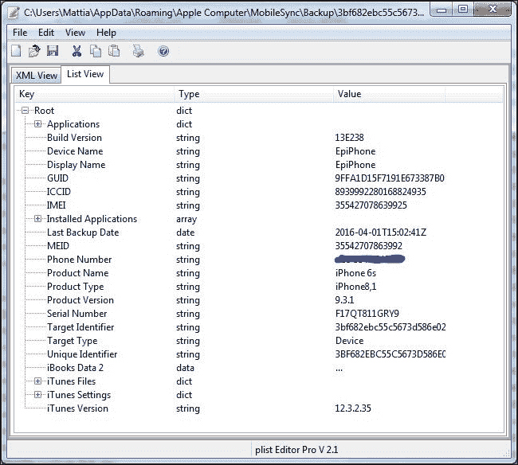

+   `Manifest.plist`: 这是一个`plist`文件，它描述了备份的内容。该文件中列出了备份设备上安装的所有应用程序。每个应用程序都有其名称和特定版本。文件中还包括备份创建日期、备份类型（加密与否）以及有关 iDevice 的一些信息（例如，在备份时设备是否设置了密码）和所用的 iTunes 软件：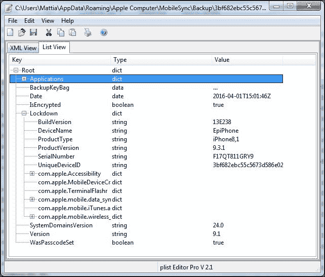

+   `Status.plist`: 这是一个二进制格式的`plist`文件，它存储了备份完成状态的信息，指示备份是否成功：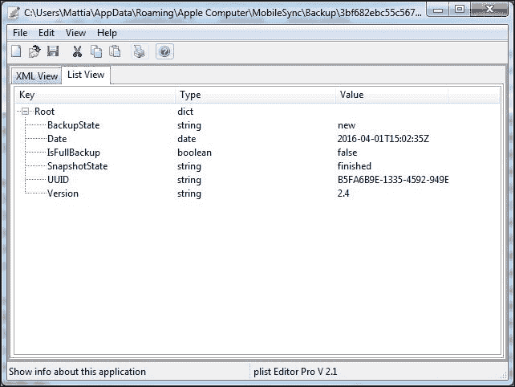

+   `Manifest.mbdb`: 这是一个二进制文件，存储备份文件夹中所有其他文件的描述。它为备份中的每个元素（包括符号链接和文件夹，虽然文件夹在备份文件中没有相应的元素）存储一个记录。每个记录包含以下参数：

    +   **域**: 这显示了元素所属的域。域是设备备份中用来功能性分类元素的一种方式。

    +   **路径**: 这显示了元素的完整路径。

    +   **链接目标**: 这显示了元素的目标，如果该元素本身是符号链接。

    +   **数据哈希**: 这包含了文件内容的 SHA-1 哈希值。

    +   **用户 ID 和组 ID**: 这些包含了所有者和组的 ID。

    +   **m. 时间**: 这显示了文件实际内容最后修改的时间（Unix 时间格式）。

    +   **a. 时间**: 这显示文件最后访问的时间。

    +   **c. 时间**: 这显示的是文件或文件夹节点最后修改的时间。

    +   **大小**: 这显示文件的大小，以字节为单位（对于链接或文件夹，大小为 0）。

    +   **模式和 inode**: 这些包含了 Unix 文件权限和 inode 号。从取证角度看，一个非常有趣的点是，即使备份是使用密码加密的，这四个文件也以未加密的形式存储。这意味着其中包含的信息在不破解密码的情况下也能访问。

关于加密备份分析的详细解释，我们建议您阅读 Hal Pomeranz 的研究（参见附录 A, *参考文献*）。前面的参数在下图中有详细说明：

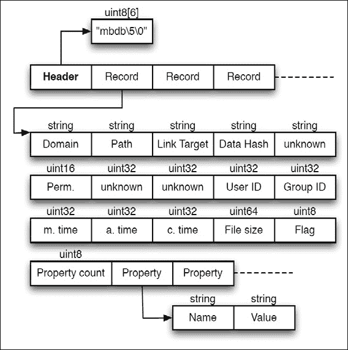

备份文件的层级结构的第一层是它们的域。每个文件的域名记录在其对应的`Manifest.mbdb`文件中的记录中。每个文件都有一个域名，从以下列表中选择：

+   **应用域**：此域包含与已安装应用相关的数据。

+   **应用组域**：此域从 iOS 9 开始出现，包含第三方应用的特定数据。

+   **应用插件域**：此域从 iOS 9 开始出现，包含第三方应用的插件。

+   **相机胶卷域**：此域包含与相机应用相关的多媒体元素，如图片、视频、视频预览和图片缩略图。

+   **健康域**：此域从 iOS 9 开始出现，包含个人健康数据。此域仅在加密备份中可用。

+   **主屏域**：此域包含与 iOS 预装的标准应用相关的数据。

+   **钥匙串域**：此域包含与钥匙串相关的加密数据。

+   **管理偏好设置域**：此域通常不包含数据。

+   **媒体域**：此域包含与相机应用无关的多媒体元素，如多媒体信息和音频录音。

+   **移动设备域**：此域包含配置文件。

+   **根域**：此域包含与设备的地理位置功能相关的缓存数据。

+   **系统偏好设置域**：此域包含 iOS 核心组件的配置文件。

+   **无线域**：此域包含设备的移动电话组件数据。

应用域中的元素进一步按它们所属的应用划分为子域，而其他域中的元素则不使用此功能。当使用子域时，域字符串写作`<domain>-<subdomain>`。关于备份结构的详细信息可以参考[`theiphonewiki.com/wiki/ITunes_Backup`](https://theiphonewiki.com/wiki/ITunes_Backup)。

## 案例研究 - 使用 Mbdbls Python 脚本解析 Manifest.mbdb

Mbdbls 是由 Hal Pomeranz 编写的开源 Python 脚本，可以在他的 GitHub 账户上找到（参考附录 B，*iOS 取证工具*）。它解析`Manifest.mbdb`文件，对于每个文件，它提取域、路径和文件名、创建日期、最后访问日期、最后修改日期和大小。以下截图显示了在 SANS SIFT 工作站虚拟机上执行 Mbdbls 解析`Manifest.mbdb`文件：

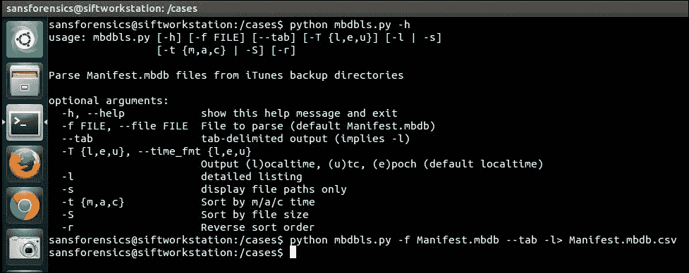

该工具提供多种输出选项：例如，它可以按创建日期、最后修改日期或最后访问日期，或按文件大小排序。请注意考虑适当的时区设置。

# iTunes 备份相关文件

本节提供了备份中最相关的文件和文件夹的完整概述。对于每个文件或文件夹，提供了完整路径（`domain-subdomain`）和描述。仅列出了系统和预装的应用程序。这些文件的更详细分析请参见第六章，*分析 iOS 设备*：

+   域: `SystemPreferencesDomain/SystemConfiguration/`

+   文件名: `com.apple.accounts.exists.plist`

+   描述: 设备中配置的帐户信息，并按类型进行分组（例如，Apple、Google、Facebook、电子邮件等）。

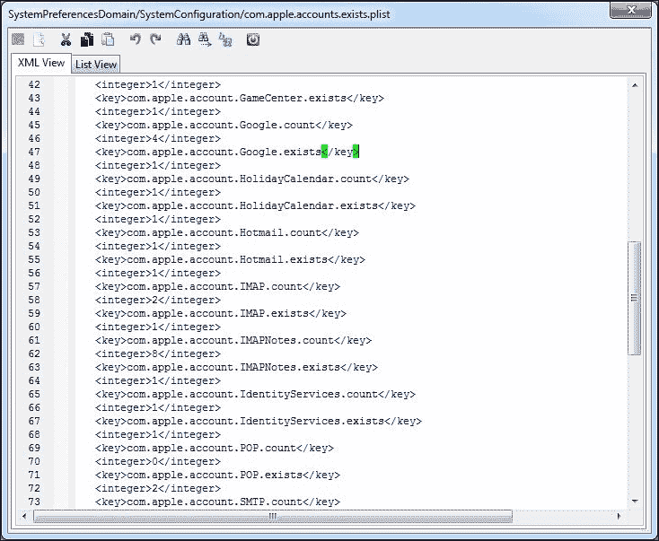

+   域: `HomeDomain/Library/Accounts/`

+   文件名: `Account3.sqlite`

+   描述: 设备中配置的帐户详细信息（例如，用户名和存储凭据类型，如密码、OAuth 等）。

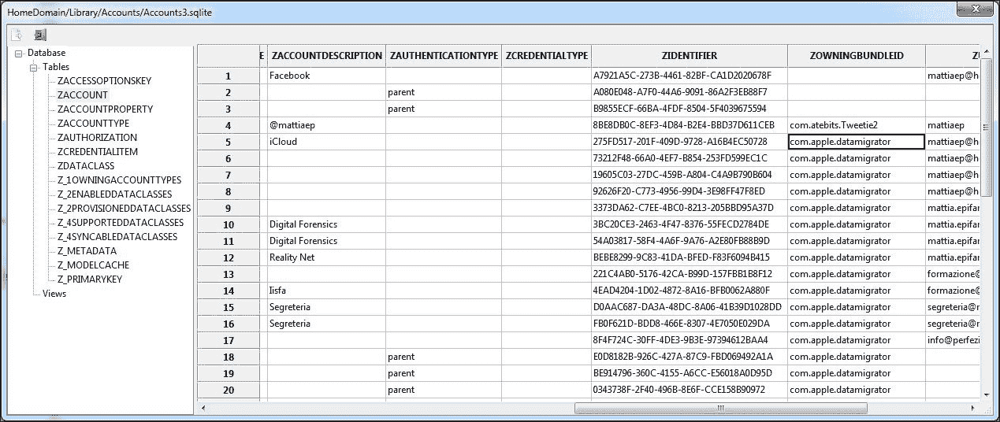

+   域: `DatabaseDomain/lsd/`

+   文件名: `com.apple.lsdidentifiers.plist`

+   描述: 启动服务守护进程标识符信息，以及应用程序名称与 GUID 之间的关联。

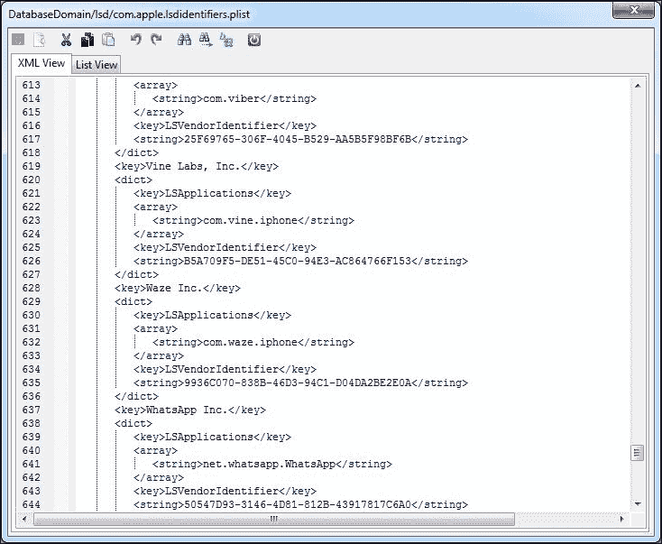

+   域: `HealthDomain/Health`

+   文件名: `healthdb.sqlite`

+   描述: 从`healthdb_secure.sqlite`访问/更新用户健康信息的设备和应用程序的列表，以及事件的相关时间戳。

+   域: `RootDomain/Library/Preferences`

+   文件名: `com.apple.preferences.network.plist`

+   描述: 备份时飞行模式的启用或禁用状态。

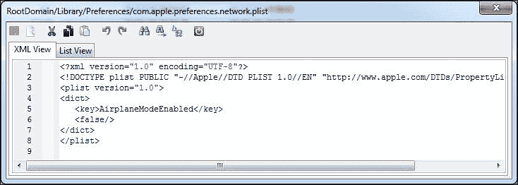

+   域: `RootDomain/Library/Preferences`

+   文件名: `com.apple.MobileBackup.plist`

+   描述: 关于最后一次设备重置的信息。特别地，它包含了恢复时设备上安装的 iOS 版本、备份版本、恢复日期，以及备份是否来自 iCloud。

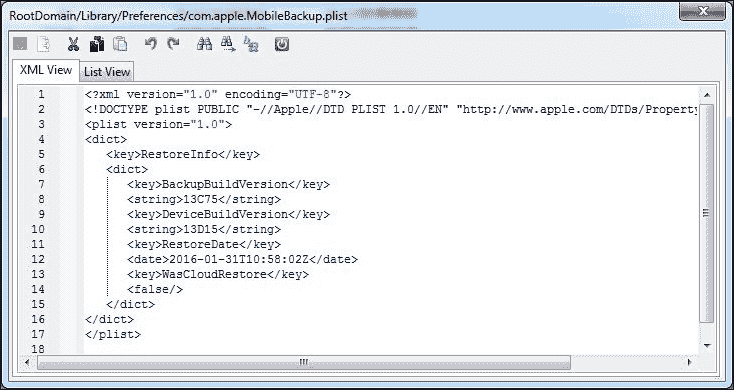

+   域: `RootDomain/Library/Preferences`

+   文件名: `GlobalPreferences`

+   描述: 语言设置。

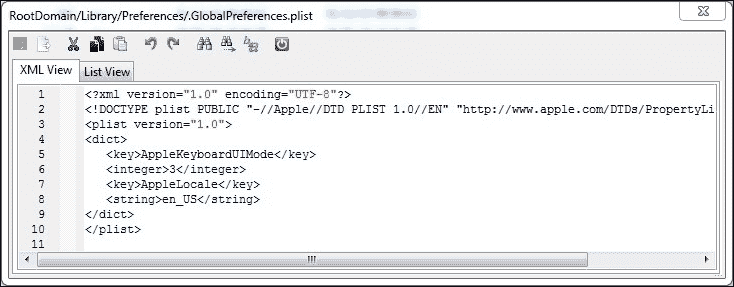

+   域: `SystemPreferencesDomain/SystemConfiguration/`

+   文件名: `com.apple.wifi.plist - preferences.plist`

+   描述: 设备中配置的 Wi-Fi 网络信息。

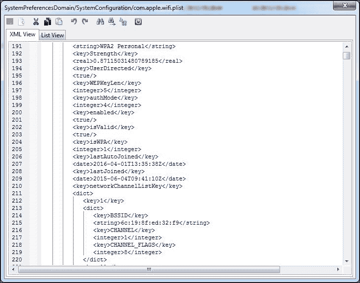

+   域: `SystemPreferencesDomain/SystemConfiguration/`

+   文件名: `com.apple.network.identification.plist`

+   描述: 最新连接的 TCP/IP 设置（包括 Wi-Fi 和蜂窝网络）。

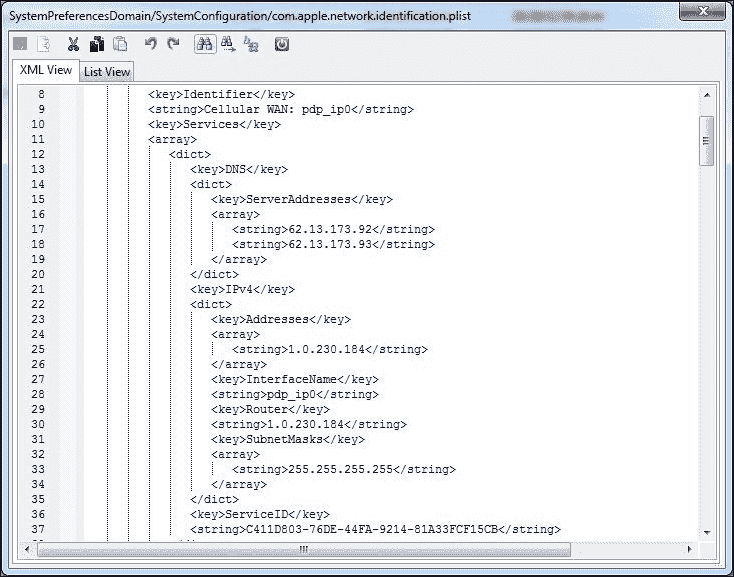

+   域: `SystemPreferencesDomain/SystemConfiguration/`

+   文件名: `com.apple.radios.plist`

+   描述: 备份时飞行模式的启用或禁用状态。

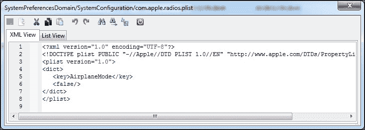

+   域: `SystemPreferencesDomain/SystemConfiguration/`

+   文件名: `com.apple.mobilegestalt.plist`

+   描述: 设备名称。

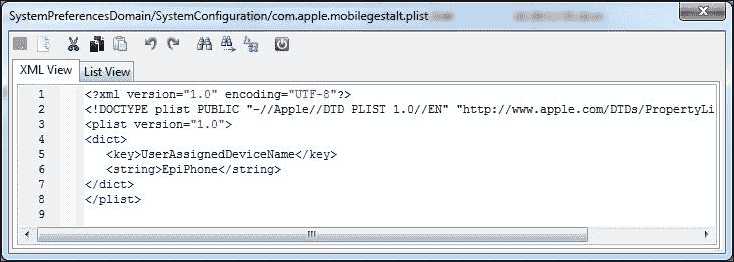

+   域：`WirelessDomain/Library/Preferences/`

+   文件名：`com.apple.commcenter.plist`

+   描述：正在使用的电信提供商及 SIM 卡信息。

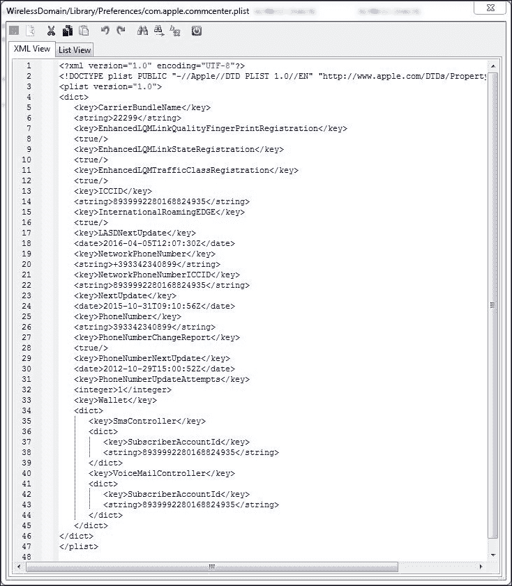

+   域：`WirelessDomain/Library/Preferences/`

+   文件名：`com.apple.commcenter.counts.plist`

+   描述：关于数据和蜂窝网络使用情况的统计信息（例如，接收/发送的字节数，接收/发送的短信数等）。

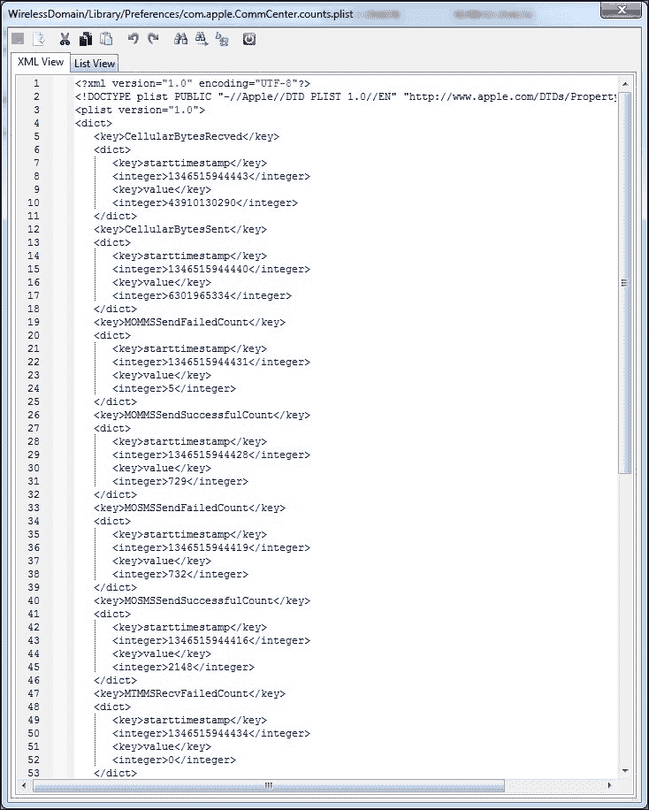

+   域：`WirelessDomain/Library/Preferences/`

+   文件名：`com.apple.commcenter.callservices.plist`

+   描述：iCloud 账户的电子邮件地址。

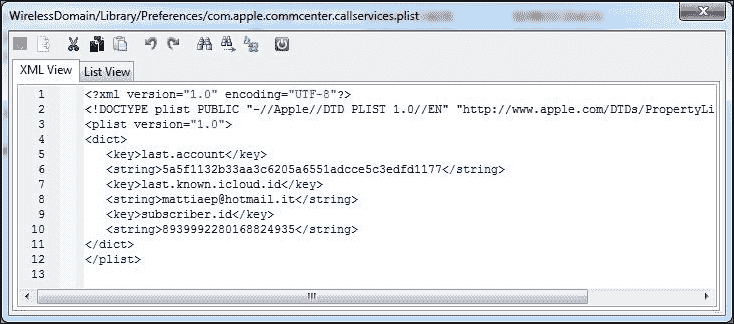

+   域：`WirelessDomain/Library/Preferences/`

+   文件名：`csidata`

+   描述：设备的蜂窝网络设置（例如，启用/禁用蜂窝数据）。

+   域：`HomeDomain/Library/MobileBluetooth/`

+   文件名：`com.apple.MobileBluetooth.ledevices.plist`

+   描述：关于 iOS 设备所看到的蓝牙设备的信息。

+   域：`HomeDomain/Library/TCC`

+   文件名：`TCC.db`

+   描述：分配给应用程序的访问权限（例如，地址簿、照片、Facebook、麦克风、相机等）。

+   域：`HomeDomain/Library/SpringBoard`

+   文件名：`IconState.plist`

+   描述：SpringBoard 中图标的排列方式，按窗口划分。

+   域：`HomeDomain/Library/AddressBook/`

+   文件名：`AddressBook.sqlitedb`

+   描述：用户个人联系信息，例如姓名、电话号码、电子邮件地址等。

+   域：`HomeDomain/Library/AddressBook/`

+   文件名：`AddressBookImage.sqlitedb`

+   描述：与地址簿中联系人相关的图片。

+   域：`HomeDomain/Library/Calendar/`

+   文件名：`Calendar.sqlitedb`

+   描述：所有用户的日历及相关事件。

+   域：`HomeDomain/Library/CallHistoryDB/`

+   文件名：`CallHistory.storedata`

+   描述：通过蜂窝网络进行的外呼、来电和未接来电列表，以及 FaceTime 通话。

+   域：`WirelessDomain/Library/CallHistory/`

+   文件名：`Call_history.db`

+   描述：在 iOS 7 之前，作为通话历史数据库使用的文件。如果手机已经升级或恢复，你可以找到旧通话的信息。

+   域：`HomeDomain/Library/Voicemail/`

+   文件名：`Voicemail.db`

+   描述：语音邮件数据库。

+   域：`HomeDomain/Library/SMS/`

+   文件名：`sms.db`

+   描述：发送和接收的短信和 iMessages，包括接收、阅读和投递的日期（对于 iMessage），文本内容以及类型（发送/接收）。

+   域：`HomeDomain/Library/SMS/`

+   文件夹名称：`Drafts`

+   描述：SMS 和 iMessage 的草稿。

+   域：`MediaDomain/Library/SMS/`

+   文件夹名称：`Attachments`

+   描述：通过 MMS 接收到的附件。

+   域：`HomeDomain/Library/`

+   文件夹名称：`DataAccess`

+   描述: 包含每个在 Mail 应用程序中配置的邮箱的子文件夹。每个子文件夹内都有一个名为 `mboxCache.plist` 的文件，包含邮箱文件夹的结构。

+   域名: `HomeDomain/Library/Mail`

+   文件名: `Recents`

+   描述: 最近发送的电子邮件的收件人信息和发送日期。

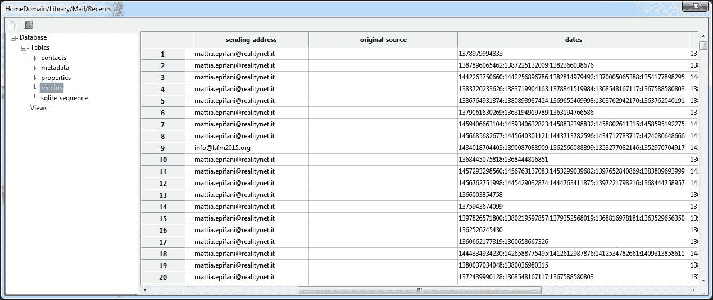

+   域名: `AppDomain/com.apple.mobilemail/Preferences/`

+   文件名: `com.apple.mobilemail.plist`

+   `com.apple.MailAccount-ExtProperties.plist`

+   描述: Apple Mail 应用程序配置及已配置帐户的设置。

+   域名: `HomeDomain/Library/Notes`

+   文件名: `Notes.sqlite`

+   描述: 按帐户分组的保存的便签。从 iOS 9.3 开始，用户可以选择为每个便签设置密码进行加密。

+   域名: `HomeDomain/Library/Safari/`

+   文件名: `bookmarks.db`

+   描述: Safari 收藏夹。

+   域名: `AppDomain/com.apple.mobilesafari/Library/Preferences/`

+   文件名: `com.apple.mobilesafari.it`

+   描述: Safari 配置文件。

+   域名: `AppDomain/com.apple.mobilesafari/Library/Safari/`

+   文件名: `History.db`

+   描述: Safari 导航历史记录。

+   域名: `AppDomain/com.apple.mobilesafari/Library/Safari/`

+   文件名: `SuspendedState.plist`

+   描述: 包含 Safari 当前所有活动标签页的状态。

+   域名: `AppDomain/com.apple.mobilesafari/Library/Safari/`

+   文件夹名称: `Thumbnails`

+   描述: 包含当前活动的 Safari 页面缩略图（PNG 格式）。

+   域名: `AppDomain/com.apple.mobilesafari/Library/WebKit/WebSiteData`

+   文件夹名称: `LocalStorage`

+   描述: 网站存储的 `LocalStorage` 数据库。可能包含网站存储的特定信息，有助于确定访问的 URL，即使该 URL 已不再出现在历史记录中。

+   域名: `AppDomain/com.apple.Maps/Library/Preferences`

+   文件名: `com.apple.Maps.plist`

+   描述: Apple Maps 应用程序配置文件，包含最近搜索的地址列表。

+   域名: `AppDomain/com.apple.Maps/Library/`

+   文件夹名称: `Maps`

+   描述: 包含与 Apple Maps 应用程序使用相关的多个文件。文件为二进制类型，并具有 `.mapsdata` 扩展名（例如，`History.mapsdata`），但可以提取包含地址的字符串。

+   域名: `CameraRollDomain/Media/`

+   文件夹名称: `DCIM`

+   描述: 包含通过设备相机拍摄或从其他第三方应用程序（例如 WhatsApp、Facebook 等）保存的图片和视频。通过设备相机拍摄的图片以 JPG 格式存储，视频以 MOV 格式存储。此外，它还包含多个子文件夹，实际存储文件的这些文件夹名称包含递增数字（如 100APPLE、101APPLE、102APPLE 等），每个文件夹可能包含最多 1000 个文件。

+   域名: `CameraRollDomain/Media/DCIM`

+   文件夹名称: `.THMB`

+   描述: 包含 JPG 格式的图片缩略图。

+   域名：`CameraRollDomain/Media/PhotoData/MISC/`

+   文件名：`DCIM_APPLE.plist`

+   描述：有关活动文件夹的信息及文件数量。

+   域名：`CameraRollDomain/Media/PhotoData/`

+   文件夹名称：`Thumbnails`

+   描述：四个专有 ITHMB 格式的文件，每个文件对应一个可能的缩略图大小。

+   域名：`CameraRollDomain/Media/PhotoData/Thumbnails/V2/`

+   文件夹名称：`DCIM`

+   描述：包含每个图片的子文件夹，缩略图为 JPG 格式。

# iTunes 备份数据提取

有多种工具可用于从 iTunes 备份中提取数据—一些是开源软件，还有一些是商业产品。这些工具允许在未加密的备份中完全访问数据，而在加密备份中则只能部分访问数据（特别是文件内容不可见，除非您知道备份密码或已经破解密码）。在访问和提取备份数据的最有趣和强大的工具中，有法医软件（UFED Physical Analyzer、Oxygen Forensic® Suite、AccessData MPE+、EnCase、Elcomsoft Phone Viewer 等）、商业数据提取软件（iBackup Bot、iPhone Backup Extractor、DiskAid、Wondershare Dr. Fone 等）以及免费的/开源的数据提取软件（iPhone Backup Analyzer 和 iPhone Analyzer）。在附录 B 中提供了详细的工具列表，*iOS 法医工具*。另一种选择是通过十六进制编辑器自行恢复备份内容。在这种情况下，我们建议您阅读 [`resources.infosecinstitute.com/ios-5-backups-part-1/`](http://resources.infosecinstitute.com/ios-5-backups-part-1/) 上的文章。

## 案例研究 - 使用 iBackupBot 解析 iTunes 备份

iBackupBot 是一款适用于 Windows 的商业工具，可以访问存储在本地计算机上的 iTunes 备份。试用版允许加载并提取备份中的信息。

软件执行后，它会自动加载存储在预定义的 iTunes 备份文件夹中的所有备份，但也可以通过**文件**菜单打开其他备份。在左侧窗格中，列出了所有加载的备份，所有域可以浏览；在中央窗格中，显示了设备的基本信息（设备名称、iOS 版本、电话号码、序列号、UDID、IMEI 等）。

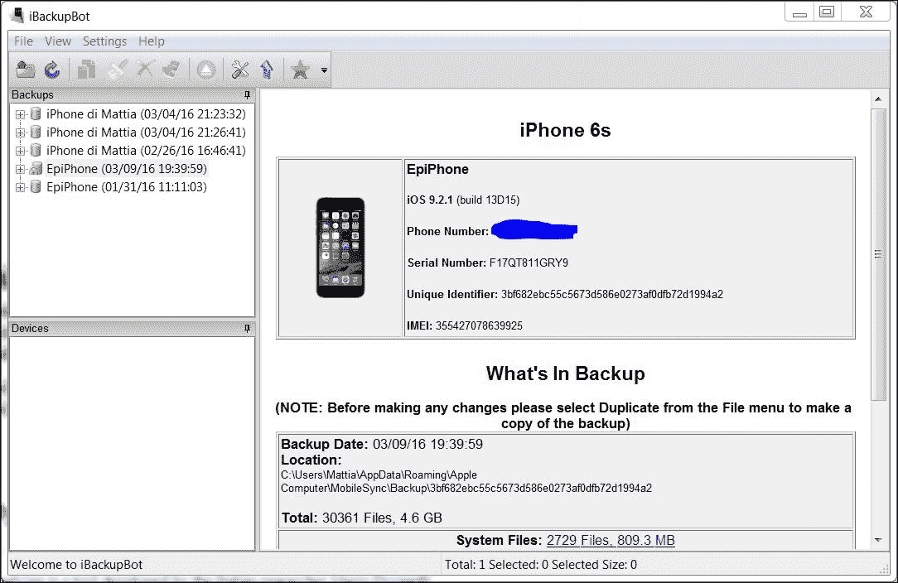

浏览备份会显示按特定域分组的文件。**系统文件**包含所有与 iOS 设置和数据相关的域。第三方应用程序数据位于**用户应用程序文件**、**应用程序组文件**和**应用程序插件文件**中。用户只需双击文件即可打开，因为该软件包含集成的 `plist` 和 SQLite 查看器：

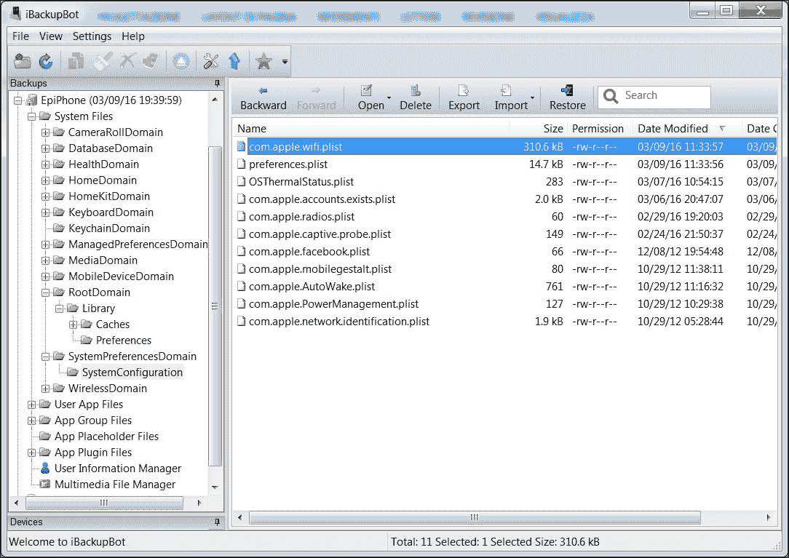

**用户信息管理器** 选项解析了备份中存储的一些最常见数据，具体包括：**联系人**、短信/MMS **消息**、**通话记录**、**日历**、**备忘录**、**最近电子邮件**（仅包含收件人电子邮件地址、日期和时间）、**Safari 书签**和 **Safari 历史**：

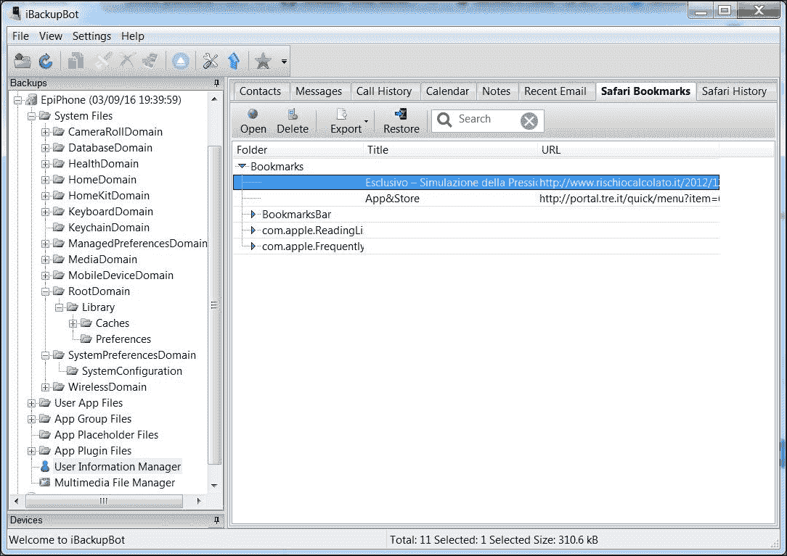

**多媒体文件管理器** 提供了对备份中存储的媒体文件的查看，具体包括 **相机胶卷** 域文件、**语音邮件**、**语音备忘录** 和 **其他多媒体文件**（例如，短信/MMS 附件、WhatsApp 媒体文件等）。

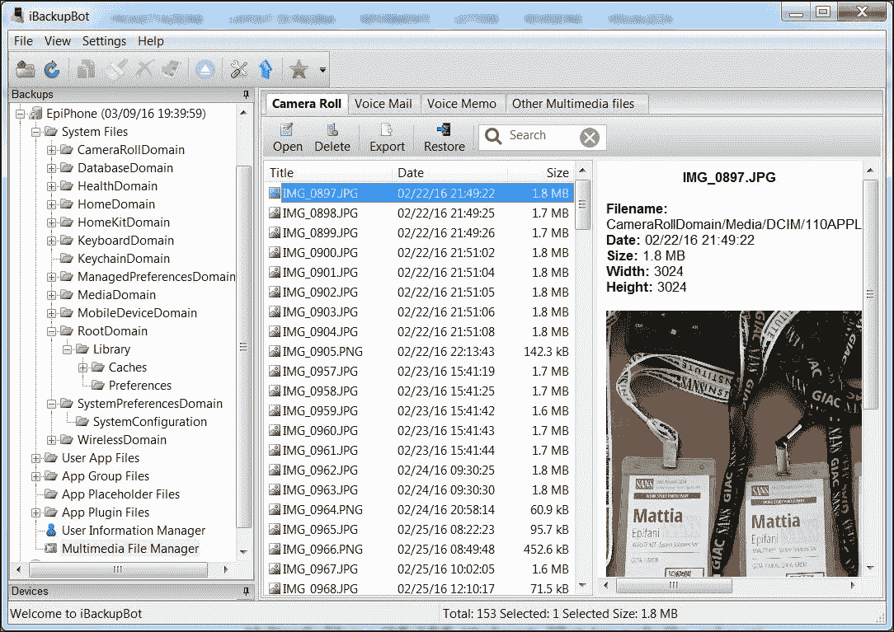

## 案例研究 - 使用 iPBA 分析 iTunes 备份

iPhone 备份分析器是由意大利研究员 Mario Piccinelli 开发的工具，提供了一种简单的方式来浏览备份文件夹并对 iDevice 备份进行法医分析。该工具作为开源软件在 MIT 许可证下发布，由于它是用 Python 编写的，因此应该是跨平台的（Mac、Linux 和 Windows）。

开发的主要目标是提供一种分析 iPhone 备份内容的方法。它旨在供任何想要轻松研究备份内容的人使用，无论是法医专家、iOS 开发者，还是仅仅对 iPhone 感兴趣的用户。该软件还内置了实用工具，方便浏览以可用格式呈现的内容，如信息、联系人、Safari 书签等。其完整功能集可以通过以下图示进行总结：

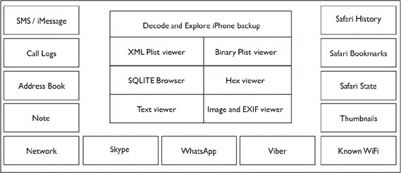

在 Windows 环境中，下载工具后，您需要将其解压到一个文件夹并启动可执行的 `iPBA2.exe` 文件。通过导航到 **文件** | **打开归档**，您可以选择包含备份的文件夹。该软件解析并分析备份，并提供一种图形化的方式来浏览备份内容：

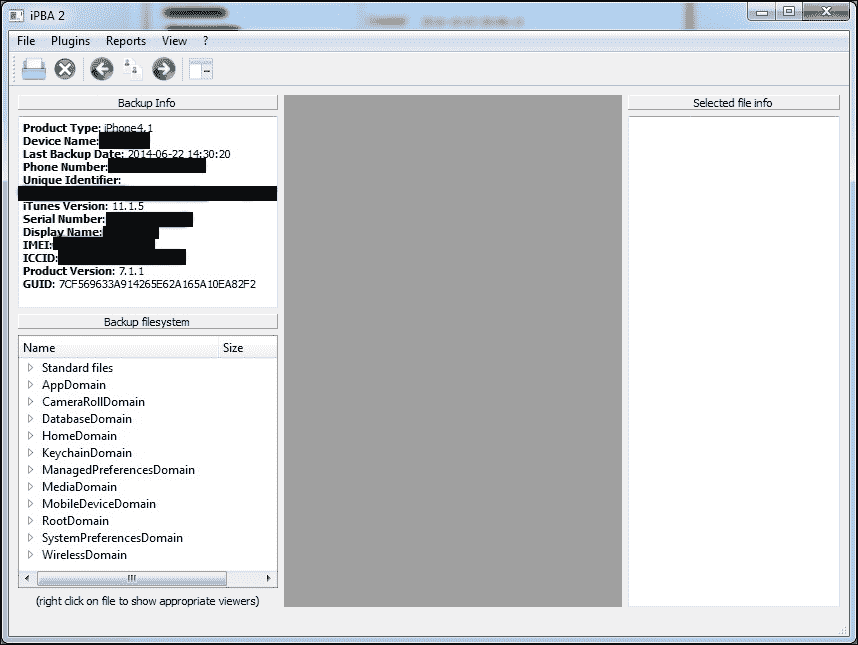

通过右键点击 `plist` 或 SQLite 文件，分析人员可以查看文件内容。例如，在以下截图中，您可以看到 `Manifest.plist` 文件的内容：

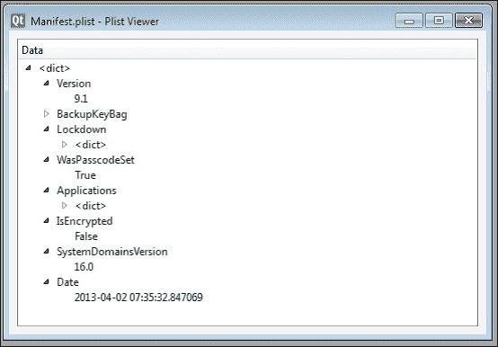

在以下截图中，您可以看到一个通话记录 SQLite 数据库的内容：

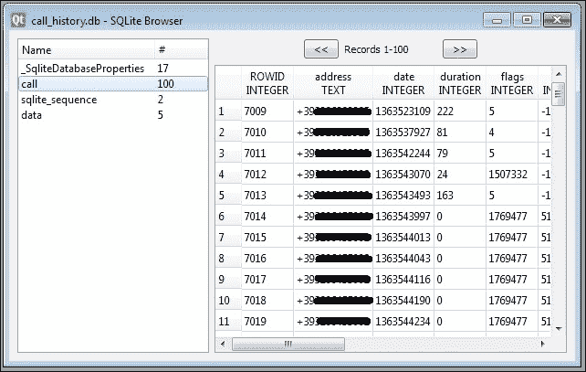

通过从**插件**菜单选择一项，你还可以分析备份中的有用信息。目前，软件提供了 14 个插件：**地址簿浏览器**、**通话记录**、**手机信息浏览器**、**已知网络**、**网络识别**、**笔记浏览器**、**Safari 历史记录浏览器**、**Safari 状态浏览器**、**Safari 书签**、**Skype 浏览器**、**消息浏览器**、**缩略图浏览器**、**Viber 浏览器**和**WhatsApp 浏览器**。在下面的截图中，你可以看到例如已知 Wi-Fi 网络插件：

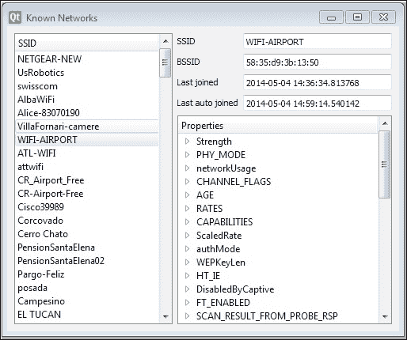

## 案例研究 - 使用 Oxygen Forensic Analyst 分析 iTunes 备份

Oxygen Forensic Analyst 是一款商业工具，已经在第三章，*从 iDevices 获取证据*中介绍过。该工具使你能够从 iDevice 中获取数据，也可以导入之前创建的 iTunes 备份。

为了导入备份，只需在主窗口点击**导入文件**，然后选择**导入 Apple 备份/镜像** | **导入 iTunes 备份...**：

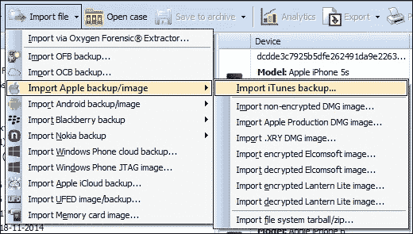

在选择一个包含备份的文件夹时，工具会显示`Manifest.plist`文件，必须选择该文件：

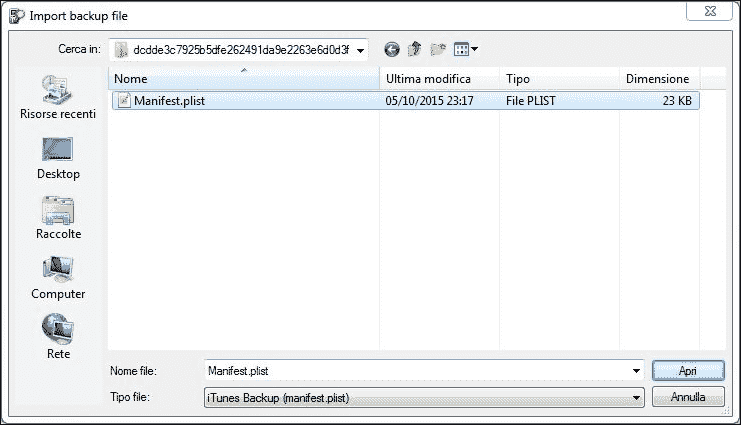

软件会识别备份结构，并展示一个选项界面，调查员可以在此界面选择是仅进行备份转换，还是希望应用程序还能够解析应用程序的数据库。同样，也可以要求软件恢复数据库中的已删除记录：

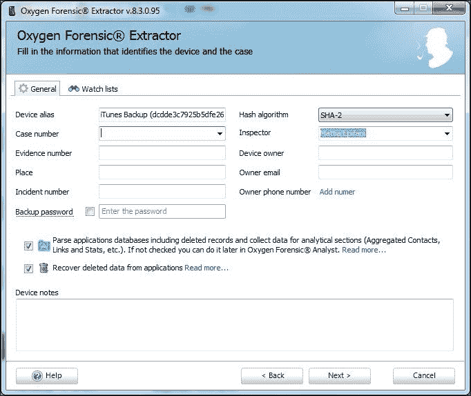

软件接着启动分析过程，允许用户分析备份内容。在第六章，*分析 iOS 设备*中，我们将看到使用 Oxygen Forensic Analyst 进行分析的进一步示例：

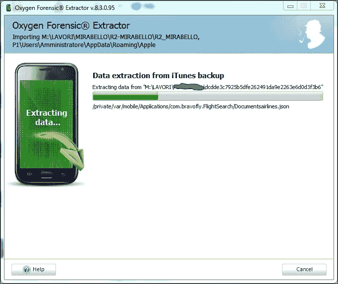

# 加密的 iTunes 备份破解

正如我们在第三章，*从 iDevices 获取证据*中解释的，以及本章第一部分所讲的，iTunes 备份可以使用 iDevice 用户选择的密码进行加密。当你查获一个已经设置备份密码的 iDevice，或你拥有一台带有之前创建的加密备份的计算机时，你可以尝试使用专用工具破解备份。目前，我们只能找到三个可用于破解加密备份的软件包：EPB、Passware Forensic 和 iPhone Backup Unlocker。

## 案例研究 - 使用 EPB 破解 iTunes 加密备份

如产品网站所述，Elcomsoft Phone Breaker 可以为基于 Apple iOS 平台的智能手机和便携设备提供密码保护备份的法医访问。该密码恢复工具支持运行 iOS 的 Apple 设备，包括至今发布的所有代 iPhone、iPad 和 iPod touch 设备。

启动工具后，第一步是通过点击主窗口中的**解密备份**选项（**工具**）并选择**解密备份**来加载加密备份，如下图所示：

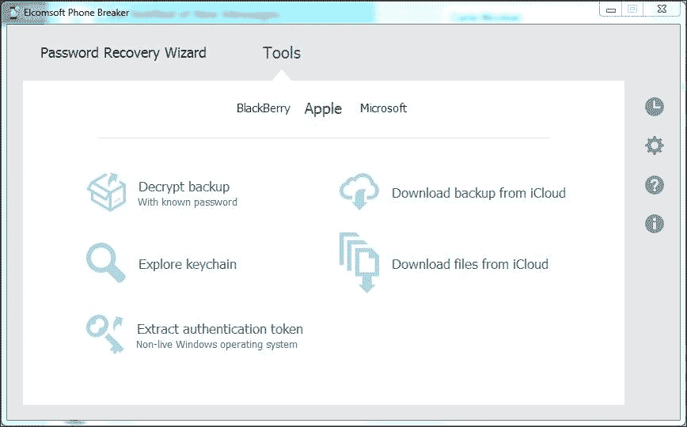

软件会自动提供加密备份的列表，这些备份保存在执行该工具的用户的默认备份文件夹中：

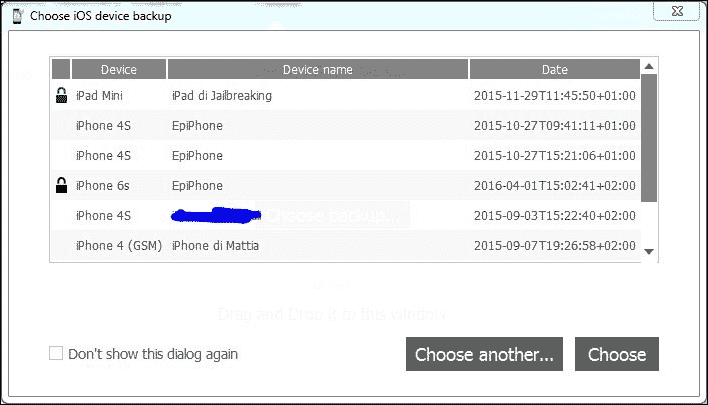

分析员可以选择提议的加密备份之一，或选择包含其他加密备份的文件夹。选择备份后，工具会询问分析员希望将解密后的备份保存到哪里，并在知道的情况下提供备份密码：

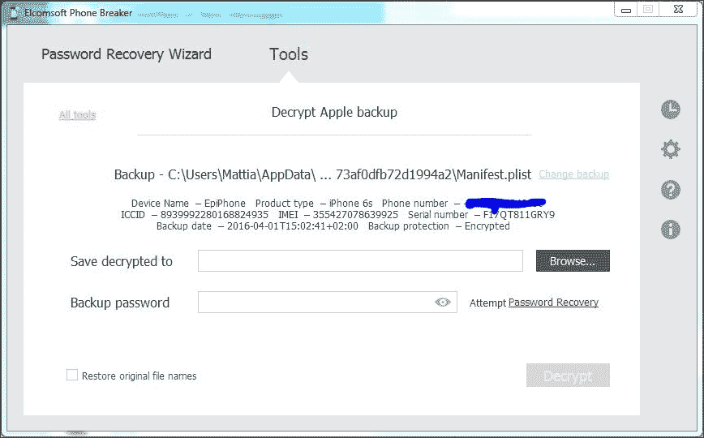

通过点击**尝试密码恢复**，用户可以选择想要执行的破解类型。可以选择两种选项之一：**字典攻击**或**暴力破解攻击**，如下图所示：

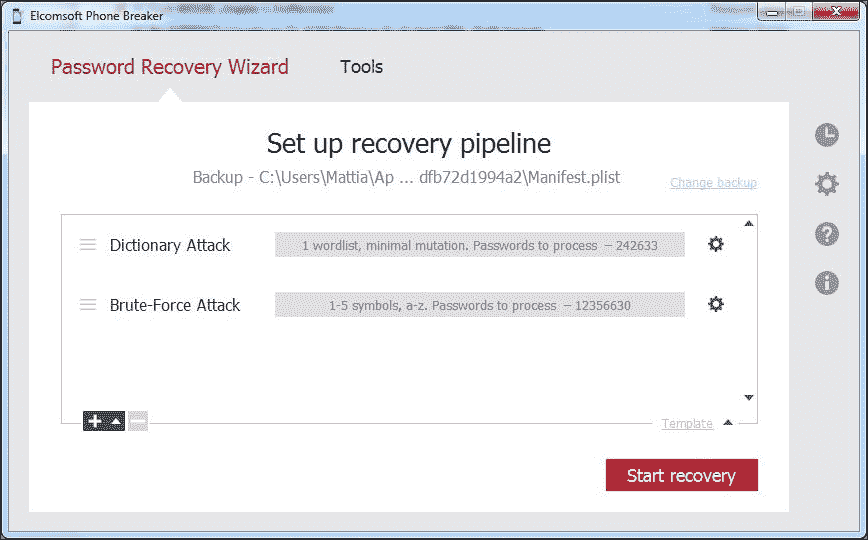

在第一种情况下，分析员可以提供自定义字典文件，如下图所示：

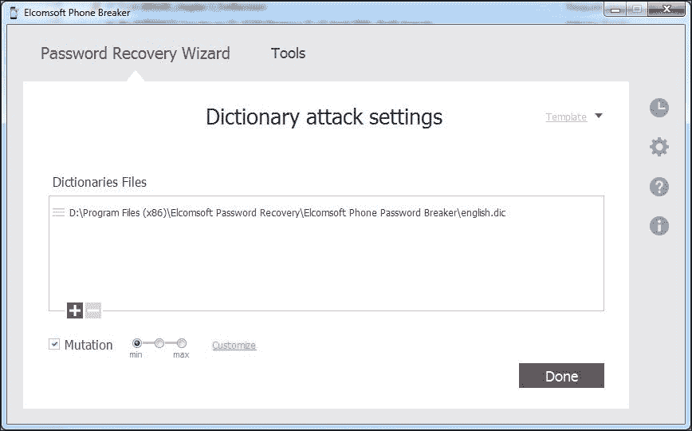

在第二种情况下，分析员可以决定暴力破解攻击的参数，如下所示：

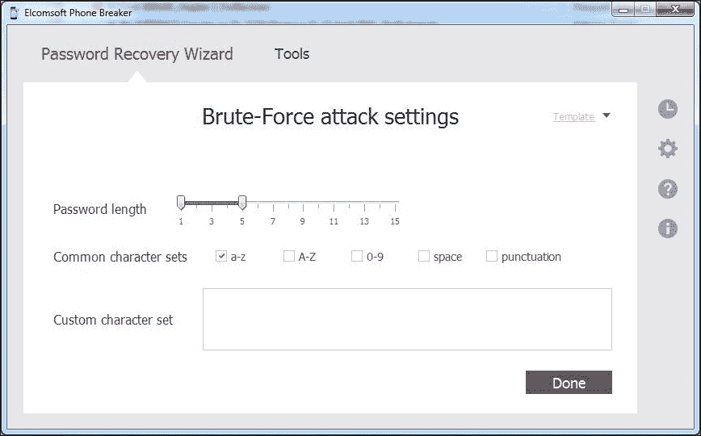

如果破解过程成功，工具将向分析员提供密码，并提供解密备份的选项（以便使用前述工具之一进行分析）：

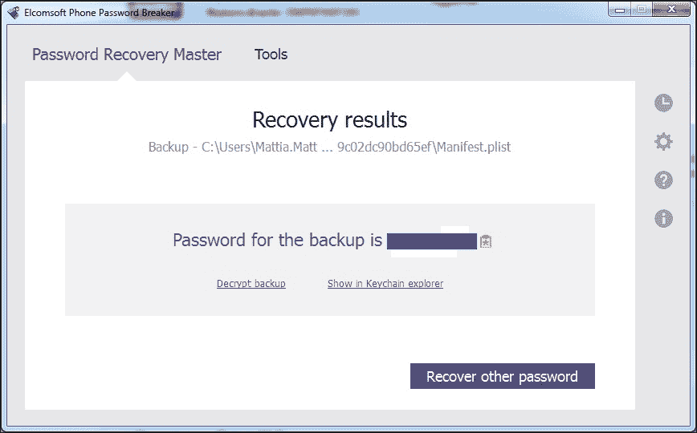

否则，可以显示钥匙串内容，其中包括 Wi-Fi 网络连接的用户名和密码、在邮件应用中配置的电子邮件帐户、存储的互联网密码和来自其他应用程序的存储密码：

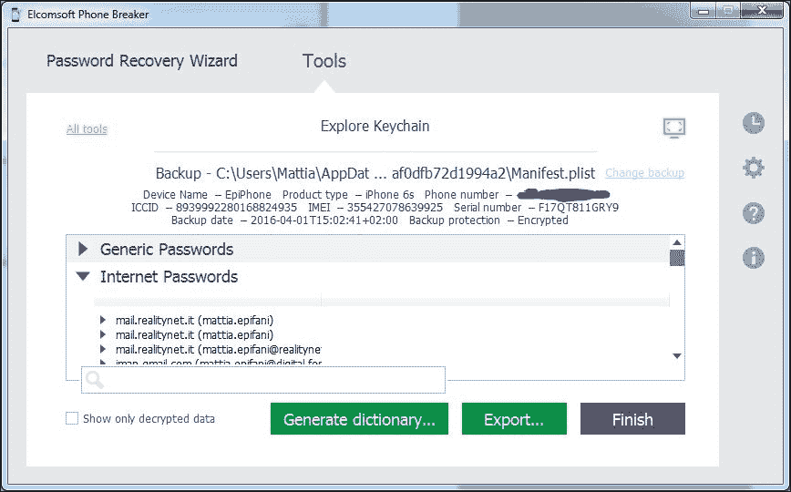

# 总结

在本章中，我们解释了有关 iTunes 备份中最有用的信息，特别是与 iOS 设备的法医分析相关的信息。我们详细说明了备份的结构以及如何使用商业工具和开源工具解析备份。我们还解释了未加密和加密备份之间的差异，并建议了一些尝试破解备份密码的方法。关于 iTunes 备份的一个非常有趣的点是，如果设备的所有者没有设置备份密码，在执行获取操作时，你可以创建一个加密备份，选择一个已知的密码，以便能够访问保存在`钥匙串`文件中的密码，而无需进行破解。相反，如果你恰好有一个无法破解密码的加密备份，仍然可以分析`plist`文件和`Manifest.mbdb`文件的内容，从而恢复该备份中所有文件的列表。在下一章中，将解释如何通过用户的 iCloud 帐户凭证或身份验证令牌恢复数据。

# 自测问题

Q1. 在 Windows 7 中，iOS 设备的备份存储在哪个文件夹中？

1.  `C:\Users\[username]\AppData\Roaming\Apple Computer\MobileSync\Backup`

1.  `C:\Users\[username]\AppData\Local\Apple Computer\MobileSync\Backup`

1.  `C:\Users\[username]\AppData\Apple Computer\MobileSync\Backup`

1.  `C:\Program Data\Apple Computer\MobileSync\Backup`

Q2. 哪个文件包含有关备份的信息（例如备份日期、设备名称等）？

1.  `Manifest.plist`

1.  `Info.plist`

1.  `Status.plist`

1.  `Manifest.mbdb`

Q3. 哪个文件包含备份文件夹中所有文件的描述？

1.  `Manifest.plist`

1.  `Info.plist`

1.  `Status.plist`

1.  `Manifest.mbdb`

Q4. 哪个备份域包含与相机相关的多媒体元素？

1.  应用域

1.  相机胶卷域

1.  媒体域

1.  钥匙串域
