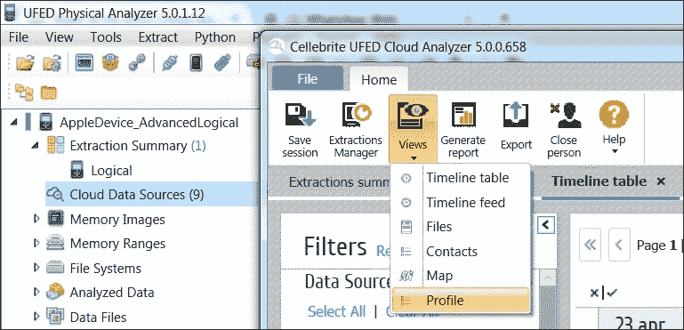

# 第五章. 来自 iCloud 的证据获取与分析

本章的目标是介绍苹果公司为所有用户提供的云系统，通过该系统，用户可以将其设备和其他文件的备份保存在远程服务器上。在本章的第一部分，我们将展示该服务的主要特点，然后介绍如何创建和恢复备份以及从 iCloud 恢复其他文件的技术。

# iCloud 服务

iCloud 是由苹果公司设计的云存储和云计算服务，自 iOS 5 起提供给 iOS 用户。iCloud 服务于 2011 年 6 月 6 日在苹果全球开发者大会上宣布，并于 2011 年 10 月 12 日向公众开放。到 2016 年 2 月，iCloud 拥有超过 7.8 亿用户。该服务允许用户将数据存储在 iCloud Drive 上，在不同设备和用户之间共享照片和视频，通过“查找我的 iPhone”进行设备定位，并通过 iCloud 钥匙串在远程服务器上保存个人密码。iCloud Drive 存储空间还可以被单个应用程序用来存储信息和特定的备份数据；例如，WhatsApp 在首次配置或版本升级后，会询问用户是否希望使用 iCloud 来存储聊天记录和 WhatsApp 媒体文件的备份，如果是的话，备份频率选择（每天、每周或每月）。iCloud 还允许用户在设备之间同步数据（例如电子邮件、联系人、日历、书签、备忘录、提醒事项、iWork 文档等）或将 iOS 设备（iPhone、iPad 或 iPod touch）备份到远程服务器，而不是使用 iTunes 和本地计算机。上传到 iCloud 的数据也可以与运行 Mac OS X 的苹果计算机（本地支持）或运行 Windows Vista 及更高版本的个人计算机共享，通过安装 iCloud 控制面板软件，该软件可以从苹果官网免费下载。

每个 iCloud 账户有 5 GB 的免费存储空间。通过 iTunes 购买的内容（如音乐、应用、视频、电影等）不计算在占用空间内，可以存储在 iCloud 中并在所有与用户 Apple ID 关联的设备上下载。此外，用户还可以选择购买额外存储，存储选项包括 50 GB（每月 $0.99）、200 GB（每月 $2.99）或 1,000 GB（每月 $9.99）。

# iDevice 在 iCloud 上的备份

iCloud 允许用户在线备份 iDevice，这样即使更换设备（例如替换设备），也能恢复数据。用户可以直接在设备的设置中选择使用哪种备份模式，或者通过 iTunes 在设备连接到 PC 或 Mac 时进行选择，具体操作如以下截图所示：

一旦用户激活了该服务，设备会自动进行备份，至少每天一次，并且每次备份时都会满足以下所有条件：

+   设备连接了电源线

+   它连接到一个 Wi-Fi 网络

+   屏幕已锁定

+   iCloud 上有足够的空间可用

iCloud 在线备份通过后续快照是增量的，每个快照是其创建时设备的当前状态。存储在 iCloud 上的备份结构与使用 iTunes 制作的备份完全类似。

# iDevice 备份获取

在线制作的备份在实质上是没有加密的。技术上说，它们是加密的，但加密密钥与加密文件一起存储。苹果之所以做出这样的选择，是为了让用户能够在不同设备上恢复备份。目前，iCloud 备份的获取受各种商业软件（**Elcomsoft Phone Breaker**（**EPPB**）、Passware、Oxygen Forensics Detective、Cellebrite Cloud Analyzer、iPhone Backup Extractor 和 Wondershare Dr.Fone）以及两款开源工具（iLoot，可在 [`github.com/hackappcom/iloot`](https://github.com/hackappcom/iloot) 获取，适用于 iOS 8 及以下版本；InflatableDonkey，可在 [`github.com/horrorho/InflatableDonkey`](https://github.com/horrorho/InflatableDonkey) 获取，适用于 iOS 9）的支持。有趣的是，这种技术曾在 2014 年的 iCloud 黑客攻击中使用过，从而导致个人照片和视频被黑客从 iCloud 服务中获取并发布到互联网上（更多信息请参见 [`en.wikipedia.org/wiki/2014_celebrity_photo_hack`](http://en.wikipedia.org/wiki/2014_celebrity_photo_hack)）。尽管目前没有强有力的证据描述这次黑客攻击是如何进行的，但人们普遍认为苹果的 *查找我的 iPhone* 服务对此负有责任，并且苹果并未在一定次数的错误登录尝试后实施任何安全措施，直接增加了利用（在这种情况下为暴力破解）的可能性。用于暴力破解 iCloud 密码的工具，名为 iBrute，仍可在 [`github.com/hackappcom/ibrute`](https://github.com/hackappcom/ibrute) 获取，但自 2015 年 1 月以来已无法使用。一个名为 iBrutr 的新工具 [`github.com/Pr0x13/iBrutr`](https://github.com/Pr0x13/iBrutr)，利用了不同的 iCloud 服务漏洞，于 2015 年 9 月发布。

## 案例研究 - iDevice 备份获取和带有用户名和密码的 EPPB

据软件制造商网站报道，EPPB 允许获取存储在在线备份中的数据。此外，即使没有原始 iOS 设备在手，也可以获取在线备份。要访问存储在云服务中的在线备份，只需使用原始用户的凭据，包括他们的 Apple ID，以及从计算机中提取的相应密码或认证令牌（本章后面详细描述）。

iCloud 登录凭据可以按以下步骤检索：

+   使用社会工程技术

+   从存储它们的 PC（或 Mac）中获取

+   使用 iTunes 密码解密工具 ([`securityxploded.com/`](http://securityxploded.com/))

+   使用 WebBrowserPassView ([`www.nirsoft.net/`](http://www.nirsoft.net/))

+   直接从设备（iPhone/iPad/iPod touch）中提取存储在钥匙串中的凭证，如第四章，*iTunes 备份中的证据获取与分析*中所述

一旦凭证提取完成，下载备份变得非常简单。按照程序提供的逐步说明，在**从 iCloud 下载备份**对话框中输入用户名和密码，进入**工具** | **Apple** | **从 iCloud 下载备份** | **密码**，然后点击**登录**，如以下截图所示：

此时，软件会显示一个界面，展示用户账户中所有的备份，并允许你下载数据，如下所示：

需要注意以下两种选项的使用可能性：

+   **恢复原始文件名**：启用时，该选项会解析`Manifest.mbdb`文件的内容，并以相同的树结构将备份重建为域和子域，如第四章，*iTunes 备份中的证据获取与分析*中所描述。如果调查员打算使用传统的软件从备份中提取数据进行分析，建议禁用此选项，因为启用后，该软件将无法解析备份。

+   **仅下载特定数据**：当调查员只需要下载某些特定信息时，此选项非常有用。目前，软件支持**通话记录**、**消息**、**附件**、**联系人**、**Safari 数据**、**Google 数据**、**日历**、**笔记**、**信息与设置**、**相机胶卷**、**社交与通讯**等数据。在此情况下，**恢复原始文件名**选项会自动启用，且无法禁用：

选择下载目标文件夹后，备份开始下载。下载所需的时间取决于用户可用存储空间的大小以及该空间内存储的快照数量：

## 案例研究 - iDevice 备份获取和 EPPB，包含身份验证令牌

Elcomsoft 的 Phone Breaker 取证版是一款工具，能够让数字取证检查员在没有原始 Apple ID 和密码的情况下获取 iCloud 数据。这种访问是通过提取用户计算机中的身份验证令牌来实现的。这些令牌可以从任何安装了 iCloud 控制面板的嫌疑人计算机中提取。令牌可以在计算机运行时提取，也可以在计算机关闭后，从其硬盘中提取，通过提取特定的文件和文件夹。

在第一个案例中，在活跃的系统上，分析员需要在机器上使用一个名为`atex.exe`的小型可执行文件。该可执行文件可以在现场取证活动中通过外部 U 盘启动。

打开命令提示符，运行`atex -l`命令以列出所有本地 iCloud 用户，如下所示：

然后，再次启动`atex.exe`并添加`--getToken`参数，输入特定本地 Windows 用户的用户名（`-n username`）和该用户的 Windows 账户密码（`-p password`）：

一个名为`icloud_token_<timestamp>.txt`的文件将会在`atex.exe`启动的文件夹中创建。此文件包含当前 iCloud 控制面板用户的 Apple ID 及其身份验证令牌：

现在，分析员已获得身份验证令牌，他们可以启动 EPPB 软件，导航到**工具** | **Apple** | **从 iCloud 下载备份** | **令牌**，复制并粘贴令牌（小心复制`atex.exe`工具创建的`.txt`文件中的第二行全部内容）到软件中，然后点击**登录**，如下图所示。此时，软件会显示下载存储在用户 iCloud 空间中的 iCloud 备份的界面，类似于你输入用户名和密码的方式：

Mac OS X 版本的程序与此完全相同。只需从 shell 启动`atex` Mac 版本，并按照之前在 Windows 环境中展示的步骤操作：

+   `sudo atex -l`：此命令用于获取所有 iCloud 用户的列表。

+   `sudo atex --getTokenOnline -u <username>`：此命令用于获取特定用户的身份验证令牌。当提示时，你需要输入该用户的系统密码。

令牌也可以从关闭的计算机中提取，无论是运行 Mac OS X 还是 MS Windows，并且安装和配置了 iCloud 控制面板。

在 MS Windows 环境中，为了获取令牌，你需要从计算机中提取以下文件和文件夹（或其取证镜像）：

+   `com.apple.AOSKit.plist` 文件，通常位于 `\Users\<username>\AppData\Roaming\Apple Computer\Preferences\`

+   `\Users\<username>\AppData\Roaming\Microsoft\Protect\<SID>\` 文件夹

还需要知道目标计算机上本地用户的账户密码。

一旦这些文件被提取，你可以启动 EPPB 软件并导航至 **工具** | **苹果** | **提取身份验证令牌**。软件会提示你提供 `com.apple.AOSKit.plist` 文件和本地用户密码：

下一步，你需要提供包含用户主密钥的文件夹路径：

如果提供的信息正确，软件将显示身份验证令牌，从而直接访问 iCloud 备份下载功能和 iCloud Drive 中的文件：

在 Mac OS X 环境下，为了获取令牌，你需要从计算机中提取以下文件和文件夹（或其法医镜像）：

+   `login.keychain` 文件，默认存储在 `/Users/<username>/Library/Keychains/` 中

+   存储身份验证令牌的文件夹，默认存放在 `/Users/<username>/Library/Application Support/iCloud/Accounts/` 中

还需要知道目标计算机上本地用户的账户密码。

一旦这些文件被提取，你可以启动 EPPB 软件并导航至 **工具** | **苹果** | **提取身份验证令牌**。软件会提示你提供 `login.keychain` 文件和本地用户密码：

下一步，你需要提供包含身份验证令牌的文件夹路径：

点击 **提取** 后，令牌将被提取为一个 `plist` 文件，可以用于访问和备份存储在 iCloud 中的文件。

## 案例研究 - 使用 iLoot 获取 iDevice 备份

也可以使用名为 iLoot 的开源工具执行相同的操作（可在 [`github.com/hackappcom/iloot`](https://github.com/hackappcom/iloot) 获取），它支持到 iOS 8。该工具需要 Python 和一些依赖项。我们建议你查看该网站以获取最新版本和需求。

通过访问帮助（`iloot.py -h`），我们可以看到各种可用选项。我们可以选择输出文件夹，如果我们只想下载特定的快照，选择是否希望以原始 iTunes 格式下载备份或使用域名风格的文件夹，或者只下载特定的信息（例如，通话记录、短信、照片等）或仅下载特定的域，如下所示：

要下载备份，你只需要输入帐户凭证，如下图所示：

处理完成后，你将在输出文件夹中找到备份（默认文件夹名称为`/output`）。

## 案例研究 - 使用 InflatableDonkey 获取 iDevice 备份

在 iOS 9 上执行相同的操作，可以使用一个名为 InflatableDonkey 的开源工具（可在[`github.com/horrorho/InflatableDonkey`](https://github.com/horrorho/InflatableDonkey)获取）。该工具需要 Java SDK 和 Maven。我们建议你查看该网站以获取最新版本和要求。

### 注意

本书写作时，该工具仍然是一个概念验证工具（PoC），因此在实际调查中使用前请先进行测试。

通过访问帮助（`java -jar InflatableDonkey.jar --help`），我们可以看到各种可用选项。我们可以选择要访问的设备和要下载的特定备份快照，应用文件扩展名或基于域的过滤器，获取可用设备和快照的列表，并定义输出文件夹，如下所示：

我们可以通过提供有效的 iCloud 用户名和密码以及`--snapshots`选项来列出可用的设备和快照：

要下载备份，你需要输入帐户凭证并选择特定的设备和快照。在以下截图中，已经请求了来自可用设备的第二个快照：

处理完成后，你将在输出文件夹中找到备份（默认文件夹名称为`/testoutput`）。需要特别指出的是，无法以原始的 iTunes 格式下载备份，只能以域名风格的文件夹格式下载。

## 案例研究 - 使用 Elcomsoft Explorer for WhatsApp 获取 WhatsApp 备份

如前所述，你的 iOS 设备上安装的应用程序有机会将其数据备份到 iCloud Drive。其中一款支持此功能的应用程序是 WhatsApp（在应用菜单中导航至 **设置** | **聊天** | **聊天备份**）。你可以手动进行备份（**立即备份**），或者可以设置 **自动备份** 功能，备份频率为 **每日**、**每周** 或 **每月**：

Elcomsoft Explorer for WhatsApp 允许你提取存储在 iCloud 或 iCloud Drive 备份中的 WhatsApp 备份数据。与 EPPB 软件类似，它可以通过认证凭证（用户名和密码）或认证令牌访问 iCloud 上的数据：

下载后，可以直接在软件中查看数据，按类型分类：**通话记录**、**联系人**、**媒体**和**消息：**

# 计算机上的 iCloud 控制面板遗留物

安装 iCloud 控制面板，除了允许恢复用户的认证令牌（如前所示），还会在计算机硬盘中留下有用的日志文件。

在 Windows Vista/7/8 系统上，连接到 iCloud 服务的日志存储在 `C:\Users\<用户名>\AppData\Roaming\Apple Computer\Logs` 中。要查找相关日志，需要在文本文件中搜索与可执行文件 `iCloud.exe` 相关的日志。这些文件按标准格式命名，其中包括服务启动的日期和时间（例如，`asl.113048_18Apr16.log`），从而帮助分析人员创建 iCloud 使用时间线。

在 iCloud 控制面板软件中配置的用户信息存储在 `C:\Users\<用户名>\AppData\Roaming\Apple Computer\Preferences\mobilemeaccounts.plist` 文件中。

特别地，以下用户信息存储在该文件中：

+   `AccountDSID`：该键表示用户标识

+   `AccountID`：该键表示 iCloud 账户的用户名

+   `DisplayName`：该键表示账户所有者设置的显示名称

+   `IsPaidAccount`：如果用户购买了 Apple 的额外服务（如更多的 iCloud 存储空间），该键的值会被设置为 `True`

+   `LoggedIn`：该键表示用户是否已自动登录该服务

在 Mac OS X 系统上，用户信息存储在 `/Users/<用户名>/Library/Preferences/MobileMeAccounts.plist` 文件中。

你还会找到大量的 `asl` 日志（Apple 系统日志），因此，为了检查用户的 iCloud 活动，你需要解析以下日志文件：

+   `/private/var/log/asl/YYYY.MM.DD.UID.asl`

+   `/private/var/log/system.log`

对于 Mac OS X 计算机上 iCloud 遗留物的详细分析，我们建议阅读 *Ubiquity Forensics - Your iCloud and You* 演示文稿，您可以在[`www.mac4n6.com/resources/`](http://www.mac4n6.com/resources/)查看。

# 使用存储的令牌从云端获取数据

在 *第四章*，*从 iTunes 备份中获取和分析证据* 中，我们看到加密备份中包含存储在钥匙串中的应用程序登录凭证。根据应用程序的不同，有可能直接找到密码，例如原生邮件应用，或者是身份验证令牌，例如许多第三方应用，如 Facebook 和 Twitter。

因此，知道备份的密码（无论是特意设置以提取凭证，还是通过破解获得）后，您可以提取应用程序的凭证，并利用这些凭证直接访问用户的云服务门户。这样，对于存储令牌的应用程序，就不需要知道用户的特定服务密码，访问将由相同的令牌保证。

一些商业移动取证解决方案将此功能集成到它们的软件中，或者作为附加软件与其取证工具结合使用。在最著名的解决方案中，值得一提的是 UFED Cloud Analyzer、Oxygen Forensic Detective 和 Paraben Device Seizure。

应强调的是，这种类型的软件可以远程访问不同的服务器，且数据并非物理存储在被分析的设备中。因此，我们需要考虑至少两个方面：首先，确保拥有进行此活动的合法权限；其次，要牢记这种类型的采集会留下痕迹，可能会产生通知给设备的所有者。基于这些原因，我们在使用时必须特别小心。

## 案例研究 - 使用 UFED Cloud Analyzer 进行云数据采集

UFED Cloud Analyzer 是由 Cellebrite 开发的商业软件，是移动设备获取和分析取证套件的补充。此软件允许您在不同平台上访问数据：Google（Gmail、联系人、Drive、位置历史和搜索历史）、Dropbox、Facebook、Twitter、Instagram、Kik 和 Vk。

软件可以通过手动输入（用户名和密码）或通过导入使用 UFED Physical Analyzer 软件导出的账户包来获取登录凭证。以下截图展示了导出过程：

软件的起始屏幕允许您查看已存在的人物或创建新的人物。它将其称为人物，因为我们在谈论用户的个人账户：

插入新人员时，可以指定他们的身份信息和参考时区，如下所示：

然后可以继续进行数据提取，甚至提供相关的法律信息（例如，搜查令）：

然后需要选择你想要采集的账户，在账户包中选择可用账户。在以下示例中，Dropbox、Twitter 和 Google 的凭证可用：

用户的凭证会被认证，以验证其正确性和有效性：

最后，还可以为每个要采集的账户指定参数，如内容类型（例如，**消息**、**联系人**、**图片**、**视频**等）以及感兴趣的时间范围。一旦选择了这些选项，就可以开始提取数据：

一旦提取完成，软件会显示已采集数据的摘要，按每个账户进行分类：

软件还允许通过提供不同类型的可视化方式来筛选和搜索数据，如 **时间轴表**、**时间轴动态**、**文件**、**联系人**、**地图** 和 **个人资料**：

以下截图显示了一个 **Google Drive** 账户的文件可视化示例：

## 案例研究 - 使用 Oxygen Forensic Detective 进行云数据采集

Oxygen Forensic Detective 是由 Oxygen Forensic 开发的商业软件，是该厂商提供的最完整版本。特别是，除了 Analyst 版本中具备的提取和分析功能外，这个版本还包括了特定的功能，能够访问存储在云中的数据。该软件允许你访问不同平台上的数据：Google（日历、书签、历史记录、联系人、Drive、位置历史、邮件、照片、任务和 WhatsApp 备份）、iCloud（日历、联系人和 iOS 备份）、Live（日历、联系人和 OneDrive）、Box、Dropbox、Facebook、Twitter、Instagram 和 Swarm（Foursquare）。

软件可以手动输入登录凭证（用户名和密码）或通过导入使用 Oxygen Forensic Detective 软件导出的 Oxygen 凭证包。以下截图显示了获取**Apple iPhone 6S**（iOS **9.3.1**）数据的示例。重要的是要记住，提取凭证时需要加密备份：

可以通过访问特定帐户部分来查看认证凭证。对于每个帐户，都提供密码或认证令牌以及凭证的输入文件。在这里的具体示例中，凭证与 Facebook 帐户相关：

使用**保存帐户数据**选项，您可以将凭证导出为 Oxygen 凭证包格式，并将文件保存到计算机：

当您从软件的主屏幕获取到凭证包后，只需点击右上角的**云**按钮，即可访问设置向导：

为了继续，您必须选择**导入凭证包**选项并选择上一步导出的文件。然后，它会显示用户视图，通常包含姓名、姓氏、个人资料照片、电子邮件地址和电话号码，如下所示：

然后，可以选择要访问的帐户，验证凭证的正确性，并设置每个提取参数。在 Facebook 的具体案例中，您可以指定要提取的内容（**图片**、**视频**、**音频**、**消息**、**联系人**、**文件**等）以及感兴趣的时间范围：

一旦启动提取，软件会提供一个详细的实时视图，显示提取数据和任务完成百分比：

提取完成后，软件会显示提取数据的详细摘要，按帐户和类型进行划分：

提取的数据可以在 Oxygen Forensic Detective 中查看，也可以保存在归档的**Oxygen 云备份**（**OCB**）中以供以后分析：

在软件中打开备份后，您可以轻松浏览提取的数据：

在当前示例的具体情况下，你将能够访问**社交网络**部分，并以结构化的方式查看所有提取的数据：

# 总结

在本章中，我们介绍了 Apple 提供的 iCloud 服务，用于将文件存储在远程服务器上并备份其设备。特别地，我们展示了当你知道用户凭证（Apple ID 和密码）并且可以访问安装了 iCloud 控制面板的计算机（无论是 Windows 还是 Mac OS X，开机或关机）时，如何下载存储在 iCloud 上的备份。在下一章中，我们将介绍你可以在 iDevices 上找到的最有趣和最有用的证据。

# 自测题目

Q1. 当何时 iCloud 会自动创建一个新的备份？

1.  每 5 分钟

1.  这取决于 iOS 版本

1.  当设备连接到电源线、Wi-Fi 网络并且被锁定时

1.  当设备被锁定时

Q2. 以下哪些工具可以用来从 iCloud 下载备份？

1.  iPhone 备份分析器

1.  InflatableDonkey

1.  UFED 物理分析器

1.  iOS 法医工具包

Q3. 哪个工具可以用来从安装了 iCloud 控制面板的 PC 恢复认证令牌？

1.  `Oauth.exe`

1.  `Iloot.exe`

1.  `Token.exe`

1.  `Atex.exe`

Q4. 在 Windows 7 中，与 iCloud 控制面板相关的日志文件存储在哪里？

1.  `C:\Users\[用户名]\AppData\Local\Apple Computer\Logs`

1.  `C:\Users\[用户名]\AppData\Local\Apple\Logs`

1.  `C:\Users\[用户名]\AppData\Roaming\Apple Computer\Logs`

1.  `C:\Users\[用户名]\AppData\Roaming\Apple\Logs`
