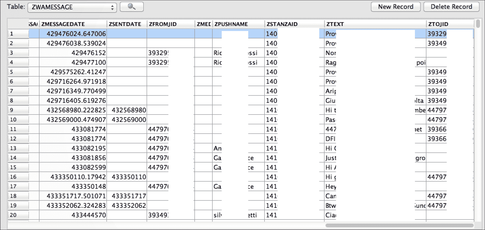
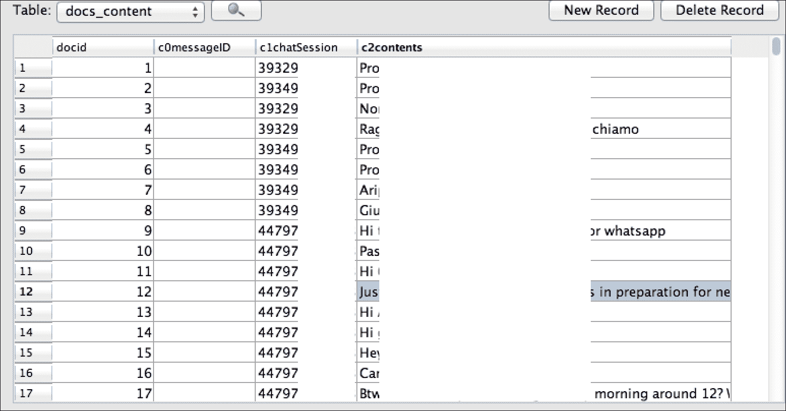

# 第六章：分析 iOS 设备

本章的目标是引导你分析 iDevice 中存在的重要数据。第一部分将重点分析由系统功能或用户与系统交互产生的数据，主要涉及 iOS 配置文件和 iOS 原生应用程序。第二部分，我们将手动分析一些最常见的第三方应用程序，目的是为你提供一个通用的方法，你可以将其应用到遇到的所有不同应用程序中。关于这个主题，也有一些已发布的文献，其中一些也在附录 A 中提到，*参考文献*。我们将以案例研究结束，为你提供一个专有分析软件的示例。所有这些内容都聚焦于两种主要的存储数据格式：**SQLite** 数据库和属性列表（`plist`）文件。

# 数据如何存储

在真正开始分析 iDevice 内部的文件之前，让我们先看一下数据是如何结构化的，以及它是以何种格式存储的。在 Apple 文件系统中，大多数用户数据存储在 `/private/var/mobile/` 下，或者简单地说是 `/User/`，这是指向前者的符号链接。在本章的测试中，我们使用的是运行 iOS 9.0.2 的 iPhone 4s：

```
# tree -d -L 2 /private/var/mobile/

|-- Applications
|-- Containers
|   |-- Bundle
|   |-- Data
|   `-- Shared
|-- Documents
|   `-- com.apple.springboard.settings
|-- Library
|   |-- Accounts
|   |-- AddressBook
|   |-- AggregateDictionary
...
|   |-- Keyboard
|   |-- Logs
|   |-- Mail
...
|   |-- Preferences
|   |-- SMS
|   |-- Safari
...
|   |-- SoftwareUpdate
|   |-- Spotlight
|   |-- SpringBoard
...
|-- Media
|   |-- AirFair
|   |-- Books
|   |-- DCIM
|   |-- Downloads
...
`-- MobileSoftwareUpdate

```

在 iOS 8 之前，应用程序及其数据都存储在 `/private/var/mobile/Applications/` 下，而从 iOS 8 开始，文件系统布局发生了变化，应用程序的数据与其包分开存储。当前的文件夹结构如下：

+   `/private/var/mobile/Containers/Bundle/Application/<UUID>/`：这个路径是实际存储应用程序包的路径。

+   `/private/var/mobile/Containers/Data/Application/<UUID>/`：该路径是实际存储大部分应用程序数据的路径。

+   `/private/var/mobile/Containers/Shared/AppGroup/<UUID>/`：顾名思义，这个路径是应用程序存储数据的路径，目的是与其他应用程序或扩展共享数据。这个文件夹也非常重要，因为你会在其中找到一些非常流行应用程序的关键数据，例如 WhatsApp、Chat db 等等。

虽然你可以通过前面的 `tree` 命令输出轻松猜测大部分文件夹的含义，但你可能会好奇 `Application` 文件夹内那些名字代表什么。这些是应用程序的名称，通过其**全局唯一标识符**（**UUID**）表示。在每个应用程序文件夹内，你通常会看到与以下类似的结构：

```
# tree -L 1 FAA3360F-18A5-4EA2-A331-53F2A49C5A8E/
FAA3360F-18A5-4EA2-A331-53F2A49C5A8E/
|-- Documents
|-- Library
|-- StoreKit
`-- tmp

```

以下结构特别重要：

+   `<Application_Bundle_Home>/AppName.app`：该文件是应用程序包，不会被备份。

+   `<Application_Data_Home>/Documents/`：该路径包含特定于应用程序的数据文件。

+   `<Application_Data_Home>/Library/`：该路径包含应用程序特定的文件

+   `<Application_Data_Home>/Library/Preferences/`：该路径包含应用程序偏好设置文件

+   `<Application_Data_Home>/Library/Caches/`：该路径包含应用程序特定的支持文件，这些文件不会被备份

+   `<Application_Data_Home>/tmp/`：该路径包含应用程序启动之间不会持久保存的临时文件，这些文件不会被备份

在应用程序包文件夹内，`iTunesMetadata.plist` 文件包含与产品、Apple 账户名和购买日期相关的信息，这些信息在某些情况下可能会非常有用。你可以在每个应用程序包文件夹中找到这个文件。

在每个数据应用文件夹内，都有一个名为 `.com.apple.mobile_container_manager.metadata.plist` 的隐藏文件。该文件包含与 UUID 对应的名称标识符。如果你在 shell 上进行分析，并且需要快速识别存在哪些应用程序，这个文件会非常有用：

```
iLab1:/private/var/mobile/Containers/Data/Application root# find . - type f -name ".com.apple.mobile_container_manager.metadata.plist" - exec plutil {} \; | grep "MCMMetadataIdentifier"
 ...
 MCMMetadataIdentifier = "com.facebook.Messenger";
 MCMMetadataIdentifier = "com.apple.Maps";
 MCMMetadataIdentifier = "com.apple.mobilenotes";
 MCMMetadataIdentifier = "org.mozilla.ios.Firefox";
 MCMMetadataIdentifier = "com.facebook.Facebook";
 MCMMetadataIdentifier = "com.apple.mobilemail";
 MCMMetadataIdentifier = "net.whatsapp.WhatsApp";
 MCMMetadataIdentifier = "com.google.chrome.ios";
 MCMMetadataIdentifier = "com.skype.skype";
 MCMMetadataIdentifier = "com.getdropbox.Dropbox";
 MCMMetadataIdentifier = "com.apple.ServerDocuments";
 MCMMetadataIdentifier = "com.apple.SafariViewService";
 MCMMetadataIdentifier = "com.google.Gmail";
 MCMMetadataIdentifier = "com.toyopagroup.picaboo";
 MCMMetadataIdentifier = "com.apple.mobilesafari";
 MCMMetadataIdentifier = "ph.telegra.Telegraph";
 MCMMetadataIdentifier = "com.apple.iCloudDriveApp";
 MCMMetadataIdentifier = "com.google.Drive";
 ...

```

同样，特别有用的是通过匹配 UUID 与你正在寻找的应用程序名称，来确定你的目标文件夹：

```
iLab1:/private/var/mobile/Containers/Data/Application root# find . - type f -name ".com.apple.mobile_container_manager.metadata.plist" - exec grep -iF "Skype" {} \;
Binary file ./86212B35-B575-4E69-89F1- 81F0CD8886A2/.com.apple.mobile_container_manager.metadata.plist  matches

```

最后但同样重要的是，关于 Apple 用来存储文件的格式，你将遇到两种主要格式，`plist`，主要用于配置文件，和 `SQLite 数据库`。我们将在下一节详细讨论这两种格式。

## 时间戳

分析师必须特别注意的一个重要方面是使用的时间戳约定。这一点尤其重要，尤其是当你在没有专门商业工具的情况下手动分析数据时。与经典的 **UNIX 纪元时间**（表示自 1970 年 1 月 1 日 00:00:00 以来经过的秒数）不同，iOS 设备采用 **MAC 绝对时间**，它表示自 2001 年 1 月 1 日 00:00:00 以来经过的秒数。这两者之间的差异为 978,307,200 秒。网上有很多资源可以用来计算这个差值，或者你可以通过在 Mac 上将前述值加到 MAC 绝对时间值来计算，如以下示例所示：

```
$ date -u -r `echo '314335349 + 978307200' | bc`
Sat Dec 18 03:22:29 UTC 2010

```

### 注

记得插入 `-u` 开关，以便以 UTC 时间显示，否则系统会以你的本地时间（或者你机器上设置的本地时间）输出。

## 数据库

在 iOS 设备上（与其他移动平台类似）最常见的数据存储方式是使用 SQLite 数据库。无论是原生应用还是第三方应用，都大量使用 SQLite 数据库文件来存储数据，稍后我们将详细讨论。

有几种工具可供使用，包括免费/开源和商业工具，例如 *SQLite Database Browser*，它提供了图形界面，以及来自官方 SQLite 网站的 SQLite 命令行工具，[`www.sqlite.org/`](http://www.sqlite.org/)。如果你使用的是 Mac OS X 进行分析，它会预装 `sqlite3` 工具。

## 属性列表文件

属性列表文件（`plist`）是 iOS 设备（以及 Mac OS X）中使用的另一种常见数据格式。`plist` 文件主要用于存储配置信息、偏好设置和设置。其格式可以与 XML 格式相比，通常表示为二进制或纯文本文件。

在 Windows 下解析 `plist` 文件的常用工具是 *plist Editor Pro*，而如果你使用的是 Mac OS X，你可以使用 XCode 查看 `plist` 文件，或者使用命令行工具 `plutil`。

# iOS 配置文件

iOS 有许多偏好设置和配置文件，其中存储了大量在调查过程中可能变得有价值的数据。本节为你提供了一些有用的文件清单（尽管并不详尽），供你在调查时参考：

+   **账户和设备信息**：查看`/private/var/root/Library/Lockdown/data_ark.plist`。此文件包含有关设备和其账户持有者的各种信息。

+   **账户信息**：查看`/private/var/mobile/Library/Accounts/Accounts3.sqlite`。此文件包含账户信息。

+   **账户信息**：前往`/private/var/mobile/Library/DataAccess/AccountInformation.plist`。在这里你可以找到用于设置应用程序的账户信息。

+   **飞行模式**：检查`/private/var/root/Library/Preferences/com.apple.preferences.network.plist`。此文件指定设备当前是否启用了飞行模式。

+   **配置信息和设置**：前往`/private/var/mobile/Library/Preferences/`。此文件包含系统配置和 Apple 应用程序的设置 `plist` 文件。

+   **锁定证书信息**：导航至`/private/var/root/Library/Lockdown/pair_records/`。此文件包含关于锁定/配对证书的信息，以及 iOS 设备曾经配对过的计算机信息。

+   **网络信息**：前往`/private/var/preferences/SystemConfiguration/com.apple.network.identification.plist`。此文件包含 IP 网络信息的缓存，如先前使用的网络地址、路由器地址和名称服务器。每个网络的时间戳也被提供。此文件在 iOS 9 上已经不再存在，但如果设备是从较旧的 iOS 版本恢复过来的，你仍然可能找到它。

+   **密码**：前往`/private/var/Keychains/`。此文件包含设备上保存的密码。

+   **SIM 卡信息**：现在查看`/private/var/wireless/Library/Preferences/com.apple.commcenter.plist`。此文件包含设备上最后使用的 SIM 卡的 ICCID 和 IMSI。

+   **Springboard**：前往`/private/var/mobile/Library/Preferences/com.apple.springboard.plist`。此文件包含每个屏幕上应用程序的排列顺序。

+   **Wi-Fi 网络**：现在查看`/private/var/preferences/SystemConfiguration/com.apple.wifi.plist`。此文件包含已知 Wi-Fi 网络的列表、上次连接的时间戳以及其他有用的信息。如需了解更多信息及深入分析，您可以查看此文章：[`articles.forensicfocus.com/2013/09/03/from-iphone-to-access-point/`](http://articles.forensicfocus.com/2013/09/03/from-iphone-to-access-point/)。

# 原生 iOS 应用

iDevices 配备了一些由 Apple 预安装的原生应用程序，如 Safari 浏览器、电子邮件客户端、日历，以及与一些基本电话功能相关的实用工具，如相机、通话历史记录或 SMS/iMessage。由这些原生应用程序和功能生成的大部分证据位于除了应用程序文件夹本身外的`Library`文件夹中：

+   `/private/var/mobile/Library/`：在物理提取或设备内部

+   `Backup Service/mobile/Library/`：在文件系统提取的情况下

+   `Library`：在逻辑提取的情况下

在这里，我们可以找到与通信、偏好设置、互联网历史和缓存、键盘输入以及更多内容相关的数据。除了`Library`文件夹外，另一个非常重要的位置是`Media`文件夹，`/private/var/mobile/Media/`，其中通常存储用户创建的图片和音频文件等内容。

## 地址簿

如你所料，`Library`下的`AddressBook`文件夹指的是与联系人应用程序相关的个人联系人信息，并以 SQLite 数据库格式存储。有两个主要的数据库：`AddressBook.sqlitedb`和`AddressBookImages.sqlitedb`。

`AddressBook.sqlitedb`包含每个联系人保存的实际信息，如姓名、姓氏、电话号码、电子邮件地址等。在这个数据库中，主要包含相关信息的表是`ABPerson`和`ABMultiValue`。

`AddressBookImages.sqlitedb`是包含用户可能为联系人关联的图片的数据库，基本上就是每次与该联系人通话时显示的图片。该数据库中主要感兴趣的表是`ABFullSizeImage`。

## 音频录音

预装在 iDevices 上的语音备忘录应用程序允许用户录制语音备忘录。这些备忘录存储在`/private/var/mobile/Media/Recordings/`文件夹中。在此文件夹中，有一个名为`Recordings.db`的数据库，包含每个语音备忘录的相关信息，如日期、时长、备忘录名称以及实际音频文件的文件名，音频文件存储在同一文件夹中。

## 日历

日历应用程序允许用户手动创建事件，并将其与其他应用程序同步，如相关的 Mac OS X 版本应用程序或其他第三方应用程序和服务。这些信息存储在以下两个数据库中：

+   `/private/var/mobile/Library/Calendar/Calendar.sqlitedb`

+   `/private/var/mobile/Library/Calendar/Extras.db`

`Calendar.sqlitedb`数据库是主要数据库，包含与日历中所有事件相关的基本信息，而`Extras.db`则包含其他信息，如日历设置。

## 通话记录

当我们按下电话应用程序图标时，我们会看到很多信息，这些信息几乎都来自同一个数据库`/private/var/wireless/Library/CallHistoryDB/CallHistory.storedata`。在这里，我们可以找到关于来电、去电和未接来电的记录，包括发生的时间、日期和通话时长。该数据库既包含标准电话记录，也包含 FaceTime 通话记录。如以下示例所示，感兴趣的表是`call`：

```
# ls -l
-rw-r--r-- 1 mobile mobile  36864 Oct 22  2015 CallHistory.storedata
# sqlite3 CallHistory.storedata 
SQLite version 3.8.10.2
Enter ".help" for instructions
sqlite> .mode line
sqlite> .tables
ZCALLDBPROPERTIES  Z_METADATA         Z_PRIMARYKEY 
ZCALLRECORD        Z_MODELCACHE 
sqlite> select * from ZCALLRECORD;
...
 ZANSWERED = 0
 ZCALLTYPE = 1
 ZDISCONNECTED_CAUSE = 
 ZFACE_TIME_DATA = 
ZNUMBER_AVAILABILITY = 0
 ZORIGINATED = 1
 ZREAD = 1
 ZDATE = 490357911.066614
 ZDURATION = 0.0
 ZDEVICE_ID = 
 ZISO_COUNTRY_CODE = ch
 ZLOCATION = Switzerland
 ZNAME = 
 ZUNIQUE_ID = E49FF4D0-8AF7-4A74-9D8D-43E2B5D7A574
 ZADDRESS = +4179******4
...

```

最有趣的字段如下：

+   `ZANSWERED`：表示通话是否被接听（`1`）或拒绝（0）。

+   `ZCALLTYPE`：表示通话类型，是标准电话（`1`）、仅 FaceTime 语音通话（`16`）还是完整的 FaceTime 音视频通话（`8`）。

+   `ZORIGINATED`：表示通话是外拨（`1`）还是接入（0）。

+   `ZDATE`：表示通话发生的日期和时间。请注意，这个值是以 Mac 绝对时间表示的，Mac 绝对时间表示的是自 2001 年 1 月 1 日 00:00:00 GMT 以来的秒数。因此，如果没有转换时间的应用程序，您只需加上 978307200，然后使用`date`命令，如下所示（来自 Mac 的示例）：

    ```
    $ echo '490357911.066614+978307200' | bc  1468665111.066614
    $ date -ur 1468665111
    Sat Jul 16 10:31:51 UTC 2016

    ```

+   `ZISO_COUNTRY_CODE`：如其名称所示，表示根据`ZADDRESS`字段中电话号段的前缀对应的两位 ISO 国家代码。

+   `ZLOCATION`：表示根据前述字段，国家的全名。

+   `ZADDRESS`：最后但同样重要的，这个字段表示通话的电话号码，无论是来电还是去电。

从 iOS 8 开始，路径略有变化，从`/private/var/wireless/Library/CallHistory/call_history.db`更改为`/private/var/wireless/Library/CallHistoryDB/CallHistory.storedata`。如果设备是从 iOS 7 升级到 iOS 8，您会同时找到旧数据库和新数据库，其中包含升级前的通话记录数据。

还有另外两个与电话应用相关的重要文件需要分析。plist 文件 `/private/var/mobile/Library/Preferences/com.apple.mobile phone.plist` 中有 `DialerSavedNumber` 值，它表示最后一次手动输入并实际拨打的电话号码。这里需要注意的重要事项是，即使用户从通话历史记录中删除了最后一次拨出的电话，这个值仍会保留，当然，通话历史记录中的该条目也会从我们刚刚分析过的 `CallHistory.storedata` 数据库中删除。另一个在调查过程中可能感兴趣的文件是 `/private/var/mobile/Library/Preferences/com.apple.mobilephone.speeddial.plist`，它包含添加到电话快捷拨号列表中的电话号码。

## 电子邮件

与 Apple Mail 客户端相关的数据存储在 `/private/var/mobile/Library/Mail/` 中，该目录包含存储在设备上的发送、接收和草拟的电子邮件消息数据库，以及每个在 Mail 应用中配置的单独帐户（POP/IMAP）文件夹。所以，你可能想查看其中的所有内容。举个例子，文件夹内容可能如下所示：

```
# ls -l 
drwxr-xr-x 2 mobile mobile     68 Oct 26  2015  AttachmentPlaceholders/
-rw-r--r-- 1 mobile mobile     42 Jul 17 19:24 AutoFetchEnabled
-rw-r--r-- 1 mobile mobile 196608 Jul 17 19:24 Envelope\ Index
-rw-r--r-- 1 mobile mobile  32768 Jul 17 19:24 Envelope\ Index-shm
-rw-r--r-- 1 mobile mobile      0 Jul 17 19:24 Envelope\ Index-wal
drwx------ 3 mobile mobile    136 Jul 17 19:24 IMAP-   demo.room.004\@gmail.com\@imap.gmail.com/
-rw-r--r-- 1 mobile mobile    468 Jul 17 19:24 MailboxCollections.plist
drwx------ 2 mobile mobile    102 Jul 17 19:24 Mailboxes/
-rw-r--r-- 1 mobile mobile  86016 Jul 17 19:24 Protected\ Index
-rw-r--r-- 1 mobile mobile  32768 Jul 17 19:24 Protected\ Index-shm
-rw-r--r-- 1 mobile mobile      0 Jul 17 19:24 Protected\ Index-wal
-rw-r--r-- 1 mobile mobile   4096 Jul 13 21:18 Recents
-rw-r--r-- 1 mobile mobile  32768 Jul 17 19:11 Recents-shm
-rw-r--r-- 1 mobile mobile 366712 Jul 17 19:24 Recents-wal
drwxr-xr-x 2 mobile mobile     68 Jul 17 19:24 SceneThumbnailCache/
drwx------ 2 mobile mobile     68 Oct 20  2015 Vault/
-rw-r--r-- 1 mobile mobile    462 Jul 17 19:24 metadata.plist

```

虽然没有任何扩展名，但这些文件大多数都是 SQLite 数据库（你可以从存在的 `-shm` 和 `-wal` 文件中猜到）。例如，Envelope Index 数据库包含邮箱列表和元数据，而 Protected Index 数据库包含收件箱中邮件的列表，其中最后一封邮件是最新的：

```
# sqlite3 Protected\ Index
SQLite version 3.8.10.2
Enter ".help" for instructions
sqlite> .mode line
sqlite> .tables
message_data  messages 
sqlite> SELECT * FROM messages;
message_id = 9
 sender = "Facebook" <update@facebookmail.com>
 subject = You have more friends on Facebook than you think
 _to = Demo < <account_username>@gmail.com>
...
message_id = 130
 sender = "PayPal" <paypal@e.paypal.it>
 subject = Accordi legali PayPal
 _to = <account_username>@gmail.com
...

```

## 图片和照片

用户在 iDevice 中的照片存储在 `/private/var/mobile/Media/`，该目录下有两个主要文件夹如下：

+   `DCIM`：此文件夹包含通过内置相机用户创建的照片（通常是 `.jpg` 格式）以及用户通过同时按下电源键和主页键截取的屏幕截图（通常是 `.png` 格式）

+   `PhotoData`：此文件夹包含其他数据，其中包括与计算机或云同步的相册

此外，非常重要的是不要忘记 *缩略图*。事实上，对于每张照片，iOS 会生成一个缩略图，存储在 `/private/var/mobile/Media/PhotoData/Thumbnails/` 中，并将关于原始图片的任何信息保存在 `PhotoData` 文件夹内的 `Photos.sqlite` 数据库中。这一点很重要，因为即使原始图片不再可用，缩略图和与原始图片相关的信息仍可能可用或可以从 SQLite 删除的条目中恢复（稍后在本章中将涉及相关部分）。

在分析照片时，重要的是要记得检查 Exif 元数据，它可能包含其他宝贵的信息，例如拍摄照片的地理坐标。

### 注意

对于该主题的深入分析，我们建议读者查看以下文章：[`linuxsleuthing.blogspot.it/2013/05/ios6-photo-streams-recover-deleted.html`](http://linuxsleuthing.blogspot.it/2013/05/ios6-photo-streams-recover-deleted.html)

## 地图

自 2012 年 iOS 6 发布以来，苹果自带了地图应用。相关文件和位置位于主文件夹 `/private/var/mobile/Containers/Data/Application/2EA1D4AC-1C04-4CA5-8A77-349D47468457/` 中，其中包含用户搜索历史以及已收藏的地点列表，还包括 `Library/Preferences/com.apple.Maps.plist` 文件，该文件包含与用户最近搜索相关的信息，例如经纬度坐标和搜索查询内容。


## 便签

Notes 应用程序将用户创建的便签信息存储在 `/private/var/mobile/Library/Notes/notes.sqlite` 中。主要关注的表是 `ZNOTE` 和 `ZNOTEBODY`，它们包含便签标题、内容、创建和修改日期等信息。

```
# sqlite3 notes.sqlite 
SQLite version 3.8.10.2
Enter ".help" for instructions
sqlite> .mode line
sqlite> .tables
ZACCOUNT         ZNOTEATTACHMENT  ZPROPERTY        Z_MODELCACHE 
ZNEXTID          ZNOTEBODY        ZSTORE           Z_PRIMARYKEY 
ZNOTE            ZNOTECHANGE      Z_METADATA 

```

### 注意

从 iOS 9.3 开始，苹果引入了通过密码保护/锁定便签的功能。由于用户必须选择每个需要密码保护的便签（这不是一个 *全有或全无* 的模式），因此你可能无法直接访问这些便签。

## Safari

Safari 是苹果设备中预装的浏览器。它允许用户浏览网页、保存书签等。所有这些活动都会存储在两个位置：`/private/var/mobile/Library/Safari/` 和 Safari 主应用文件夹 `/private/var/mobile/Containers/Data/Application/C6254D15-92CE-4989-9427-26A589DFA8B7/` 中。具体文件夹详情如下：

+   **Safari 书签**：这些信息存储在 `/private/var/mobile/Library/Safari/Bookmarks.db` 中。它包含保存的书签数据库。

+   **Safari Cookies**：这些信息存储在 `/private/var/mobile/Library/Cookies/Cookies.binarycookies` 中。网站的 Cookies 存储在这里。要解析这个二进制文件，你可以使用 GitHub 上的 `BinaryCookieReader.py` Python 脚本（[`gist.github.com/sh1n0b1/4bb8b737370bfe5f5ab8`](https://gist.github.com/sh1n0b1/4bb8b737370bfe5f5ab8)）。

+   **Safari 临时文件**：这些信息存储在 `<app_folder>/Library/Caches/WebKit/NetworkCache/Version 4/` 中。该文件夹包含两个子文件夹，`Blob` 和 `Record`，它们存储着访问页面的临时文件和代码。这一点很重要，因为这样就可以查看/重建用户曾经访问过的页面。另一个需要记住的重要点是，当用户删除浏览器缓存时，这些文件夹将被清空。

+   **Safari 搜索历史**：这些信息存储在`<app_folder>/Library/Preferences/com.apple.mobilesafari.plist`中。它包含了通过 Safari 进行的最近搜索记录。一个重要的要点是，当用户删除浏览器缓存或历史记录时，这个文件不会被删除，但在 iOS 9 中，文件内容会被清除。

+   **Safari 暂停状态**：这些信息存储在`<app_folder>/Library/Safari/SuspendState.plist`中。它包含了用户按下 Home 按钮、iPhone 关机或浏览器崩溃时 Safari 的最后状态。为了在浏览器恢复时能够恢复此状态，该文件包含了在上述事件发生并关闭浏览器时打开的窗口和网站的列表。

+   **Safari 缩略图**：这些信息存储在`<app_folder>/Library/Caches/Safari/Thumbnails/`中。这个文件夹包含了通过 WebKit 浏览器查看的最后一个活跃网页的截图，例如通过第三方应用程序。

+   **Safari 网页缓存**：这些信息存储在`Library/Caches/com.apple.mobilesafari/Cache.db`中。它包含了最近下载并缓存的 Safari 浏览器对象。

+   **Safari 历史记录**：这些信息存储在`<app_folder>/Library/Safari/History.db`中。它包含了 Safari 浏览器的历史记录。当然，如果用户已清除历史记录，则此文件将不包含清除前的历史。

## 短信/iMessage

类似于通话历史，有一个数据库存储用户发送或接收的短信、彩信和 iMessage。该数据库位于`/private/var/mobile/Library/SMS/sms.db`，还包含与彩信或 iMessage 附件相关的信息。在这些情况下，彩信或 iMessage 中的文件存储在子文件夹`Library/SMS/Attachments/`中。最后，关于短信的另一个有趣文件夹是`Library/SMS/Drafts`，其中每个草稿都有自己的文件夹，存储`plist`文件，并且带有时间戳，标识消息何时被输入并被放弃。

### 语音邮件

`/private/var/mobile/Library/`中的`Voicemail`文件夹包含了每个语音邮件录音的音频文件，这些文件存储为 AMR 编解码音频文件，同时还有`voicemail.db`数据库，保存了与每个语音邮件音频文件相关的信息，例如发送者、日期、时长等。

# 其他 iOS 法医痕迹

在本节中，我们将列出一些其他有趣的文件位置。这里列出的内容并不严格与特定应用相关，而是由用户与系统的交互所产生的设备使用数据。

## 剪贴板

`/private/var/mobile/Library/Caches/com.apple.UIKit.pboard` 下的 `pasteboardDB` 文件是一个二进制文件，包含了设备剪贴板上数据的缓存副本，这意味着用户剪切/复制并粘贴的数据（例如密码或其他可能相关的文本部分）也会出现在其中。

## 键盘

iOS 的两个功能是自动修正和自动完成用户输入的文本。为此，每当用户输入时，iOS 会将文本缓存到 `dynamic-text.dat` 文件中：


这个文件位于 `/private/var/mobile/Library/Keyboard`。这是默认文件，但当然，iOS 会为每个配置并使用的语言创建一个文件，并将其存储在同一文件夹中。在以下示例中，第二个文件与意大利语键盘配置相关：

```
 # ls -l
 drwxr-xr-x 4 mobile mobile 136 Oct 26  2015 CoreDataUbiquitySupport/
    drwxr-xr-x 2 mobile mobile 102 Oct 22  2015 de-dynamic.lm/
    -rw------- 1 mobile wheel  307 Jul 17 18:35 dynamic-text.dat
    drwxr-xr-x 2 mobile mobile 272 Jul 17 20:00 en-dynamic.lm/
    drwxr-xr-x 2 mobile mobile 272 Jul 17 20:00 it-dynamic.lm/
    -rw------- 1 mobile wheel   65 Jul 17 19:57 it_IT-dynamic-text.dat 

```

## 位置

在 iOS 4 中，曾有 **合并的 GPS 缓存**，这是一个包含与设备接触过的每个 Wi-Fi 热点和基站塔相关位置信息的数据库。这个数据库位于 `/private/var/root/Library/Caches/locationd/consolidated.db`，其中的 `WifiLocation` 和 `CellLocation` 表包含了设备本地缓存的信息，包括当时在设备范围内的 Wi-Fi 接入点和基站塔，并且包含了一个水平精度（单位：米），被认为是设备与这些位置之间的估计距离。这些数据除了永远保存在该数据库中外， reportedly 还会定期发送给苹果。所谓的 **位置门** 丑闻，就是在发现这个数据库后爆发的，苹果最终基本上放弃了该数据库。

然而，取代 `consolidated.db` 的新数据库是 `cache_encryptedA.db`、`lockCache_encryptedA.db` 和 `cache_encryptedB.db`，这些文件存储在 `/private/var/root/Library/Caches/locationd/` 文件夹下。与其前身一样，这些数据库包含频繁和最近位置的地理坐标、Wi-Fi 接入点，以及显然是设备范围内的基站塔。这些数据的唯一区别在于，它们仅保存 8 天后会被清除。为了导出这些数据库，你还可以使用 Sarah Edwards（她的 Twitter 账号是 `@iamevltwin`）提供的 Python 脚本 **iOS Location Scraper**，可以从 GitHub 仓库下载：[`github.com/mac4n6/iOS-Locations-Scraper`](https://github.com/mac4n6/iOS-Locations-Scraper)。

另一个非常重要的需要记住的关于地理位置信息的要点是，许多其他应用程序，尤其是第三方应用程序（如人们用来追踪跑步路径的健身应用程序）可能也会存储地理坐标和相关时间戳，且通常以明文存储。

## 快照

每当用户按下 Home 按钮从应用屏幕返回桌面时，iOS 会使用**渐变消失**效果在两个屏幕之间进行过渡。为此，iOS 会截取当前屏幕的截图，并将渐变消失效果应用到该截图上。这些截图存储在以下位置：

+   `/private/var/mobile/Library/Caches/Snapshots/`

+   `/private/var/mobile/Containers/Data/Applications/<UUID>/Library/Caches/Snapshots/`

第一个路径指的是预装的 Apple 应用，而第二个路径则是每个应用的快照存放位置。显然，这个特性可能是一个信息宝库。例如，其中可能包含已经被删除的短信或电子邮件的截图，这些信息现在已经无法恢复。

### 注意

重要的是要记住，每个应用只会截取最后一张快照。因此，分析人员应尽量减少与设备的交互和浏览，以免覆盖和丢失可能至关重要的证据。

## 壁纸

当前用作壁纸的图片存储在`/private/var/mobile/Library/SpringBoard/`中。有两张不同的图片：`HomeBackgroundThumbnail.jpg`，表示设备解锁时的壁纸；以及`LockBackgroundThumbnail.jpg`，表示设备锁定时的壁纸。

## iOS 崩溃报告

iOS 操作系统使用崩溃报告来跟踪原生应用和第三方应用的错误和崩溃。崩溃日志通常包含应用生成错误或终止时的系统状态描述。崩溃报告由一个服务管理，该服务负责收集和汇总日志。有关崩溃报告服务的运行和崩溃日志结构的分析，请参阅以下网页：

+   理解和分析 iOS 应用崩溃报告：[`developer.apple.com/library/ios/technotes/tn2151/_index.html`](https://developer.apple.com/library/ios/technotes/tn2151/_index.html)

+   理解 iPhone OS 上的崩溃报告：[`developer.apple.com/videos/play/wwdc2010/317/`](https://developer.apple.com/videos/play/wwdc2010/317/)

+   分析崩溃报告：[`developer.apple.com/library/ios/documentation/IDEs/Conceptual/AppDistributionGuide/AnalyzingCrashReports/AnalyzingCrashReports.html`](https://developer.apple.com/library/ios/documentation/IDEs/Conceptual/AppDistributionGuide/AnalyzingCrashReports/AnalyzingCrashReports.html)

+   解密 iOS 应用崩溃日志：[`www.raywenderlich.com/23704/demystifying-ios-application-crash-logs`](https://www.raywenderlich.com/23704/demystifying-ios-application-crash-logs)

通常，设备配置为每次连接并运行 iTunes 时，自动同步崩溃日志到 PC/Mac。因此，建议在计算机中检查，确保所有已连接设备的崩溃日志都已同步到一起。根据操作系统的不同，崩溃日志存储在不同位置：

+   **Windows XP**：`C:\Documents and Settings\<USERNAME>\Application Data\Apple Computer\Logs\CrashReporter\MobileDevice\<DEVICE_NAME>`

+   **Windows Vista/7/8/10**：`C:\Users\<USERNAME>\AppData\Roaming\Apple Computer\Logs\CrashReporter\MobileDevice\<DEVICE_NAME>`

+   **Mac OS X**：`~/Library/Logs/CrashReporter/MobileDevice/<DEVICE_NAME>`

崩溃报告也可以直接从 iOS 设备中提取，通过与崩溃报告服务（是的，它的名字就是这个）进行对话，通过 PC 或 Mac 上的 iTunes，或者 Mac 上的 XCode。如 第三章 *来自 iDevice 的证据采集* 中所解释的那样，一些第三方软件提供了移除日志并保存以供后续分析的功能；在这些软件中，我们记得有 iBackupBot 和 iTools。它们可以从解锁的设备中提取，或者从开启且已锁定的设备中提取，只要该设备有有效的配对证书，并且如果用户设置了备份密码。以下截图展示了从 iPhone 6s 使用 iBackupBot 提取崩溃报告的示例：


从法医角度来看，通过分析崩溃日志可以识别出各种有价值的信息，例如：

+   从各种日志（如 PowerLog、安全性和 OnDemand）中提取的已安装应用程序列表及使用情况

+   来自 `itunesstored.2.log` 的 iTunes 用户名

+   来自 MobileMail 日志的电子邮件附件文件名

+   Wi-Fi 网络列表和最新连接历史来自 Wi-Fi 日志

## 跟踪设备使用情况

Sarah Edwards 对追踪设备使用情况的文物做了广泛的研究。通过关联应用程序、数据和网络使用情况、健康信息（例如，锻炼）、时间戳和地理位置数据，确实可以了解在某一时刻被调查用户的行为及其所在位置。特别是，她研究了以下文物：

+   **CoreDuet**：`/private/var/mobile/Library/CoreDuet/`

    `coreduetd.db`（31 个表）

    `coreduetdClassA.db`（31 个表）

    `coreduetdClassD.db`（31 个表）

    `Knowledge/knowledgeC.db`（5 个表）

    `People/interactionC.db`（9 个表）

+   **电池寿命（PowerLog）**：`/private/var/mobile/Library/BatteryLife/`

    `CurrentPowerlog.PLSQL`（257 个表）

    `Archives/powerlog_YYYY-MM-DD_XXXXXXXX.PLQSQL.gz`（前 ~5 天）

+   **健康**：`/private/var/mobile/Library/Health/`

    `healthdb.sqlite`（11 个表）

    `healthdb_secure.sqlite`（16 个表）

+   **Aggregate Dictionary**: `/private/var/mobile/Library/AggregateDictionary/`

    `ADDataStore.sqlitedb`（4 个表）

+   **networkd**: `/private/var/networkd/`

    `netusage.sqlite`（13 个表）

+   **routined**: `/private/var/mobile/Library/Caches/com.apple.routined/`

    `cache_encryptedB.db`（5 个表）

    `StateModel1.archive`

    `StateModel2.archive`

+   **locationd**: `/private/var/root/Library/Caches/locationd/`

    `cache_encryptedA.db`（79 个表）

    `lockCache_encryptedA.db`（51 个表）

    `cache_encryptedB.db`（167 个表）

    `cache_encryptedC.db`（9 个表）

    这里提到的 Sarah 工作的详细信息可以在她的网站上找到，具体来说是*《Sauron 的 iOS：iOS 如何跟踪你所做的一切》*的演讲（[`www.mac4n6.com/resources/`](https://www.mac4n6.com/resources/)）。

# 第三方应用程序分析

在前面的段落中，你已经看到了与 iOS 系统设置和偏好、原生 iOS 应用程序以及设备功能相关的重要工件的位置。这些位置需要注意，并且了解如何分析它们非常重要，因为它们是所有 iDevice 共享的。接下来，我们将展示一些最常用的第三方应用程序的实际分析。

## 社交网络和即时通讯应用程序

社交网络和即时通讯应用程序可能是最广泛使用的类别，对于分析人员来说，它们可以代表一个宝藏，因为现在它们已成为主要的通讯工具。在本节中，我们将为你概述在一些最流行的应用程序中可能找到的主要工件，以及在分析过程中需要特别注意的地方。

### Skype

Skype 可能是最为知名和广泛使用的 VoIP 和聊天软件：

```
# tree -L 3 86212B35-B575-4E69-89F1-81F0CD8886A2/ 
|-- Documents 
|   |-- Skype.htrace0 
|   |-- Skype.htrace0.bak 
|   `-- _MediaStackETW.etl 
|-- Library 
|   |-- Application\ Support 
|   |   |-- RootTools 
|   |   `-- Skype 
|   |-- Caches 
|   |   |-- Snapshots 
|   |   |-- com.plausiblelabs.crashreporter.data 
|   |   |-- com.skype.skype 
|   |   |-- net.hockeyapp.sdk.ios 
|   |   |-- offline-storage-ecs.data 
|   |   |-- offline-storage.data 
|   |   |-- <skype_name> 
|   |   |-- skype-cache-501.<skype_name>.ContactsListAdapter-Contacts-SingleSelect.plist 
|   |   |-- skype-cache-501.<skype_name>.ContactsListAdapter-Favorites-SingleSelect.plist 
... 
|   |   |-- skype-cache-501.<skype_name>.chathistory-viewmodels
<contact_name>.plist 
... 
|   |   |-- skype-cache-501.<skype_name>.chatinput-saved-<contact_name>.plist 
|   |   `-- skype-cache-501.<skype_name>.conversations.plist 
 |   |-- Cookies 
|   |   `-- Cookies.binarycookies 
|   `-- Preferences 
|       `-- com.skype.skype.plist 
|-- StoreKit 
|   `-- receipt 
`-- tmp

```

从`Library/Preferences`文件夹开始，我们可以在`com.skype.skype.plist`文件中找到第一个重要信息——用户名，如下截图所示：


然而，前面的截图只显示了最后一次登录的用户名。如果我们想要了解所有曾在此设备上登录的个人资料，必须查看`Library/Application Support/Skype/`下的其他文件夹，在这些文件夹中，每个文件夹都代表一个曾使用该设备登录的账户：


在每个用户的文件夹内，我们可以找到所有存储信息的数据库，如联系人列表、聊天记录等。这里的结构与 PC/桌面版本几乎相同。实际上，你可以打开`main.db`文件，在那里你可以清晰地看到所有信息，正如以下表格名称的有趣之处所展示：

```
# sqlite3 main.db 
SQLite version 3.8.10.2 
Enter ".help" for instructions 
sqlite> .mode line 
sqlite> .tables 
Accounts            Chats               MediaDocuments      Translators 
Alerts              ContactGroups       MessageAnnotations  VideoMessages 
AppSchemaVersion    Contacts            Messages            Videos 
CallMembers         Conversations       Participants        Voicemails 
Calls               DbMeta              SMSes               tracker_journal 
ChatMembers         LegacyMessages      Transfers        

```

请参阅以下截图：


这意味着你可以使用任何你喜欢的 Skype 分析工具来解析这些文件，比如**Nirsoft**的**SkypeLogView**等等。最后，在应用程序文件夹内，你还可能找到语音邮件消息和截图，正如我们在*快照*部分所讨论的，除此之外还包括通过 Skype 传输的文件、日志等。

### WhatsApp

尽管它在技术上是一个即时消息应用程序，WhatsApp 几乎完全取代了传统的短信。因此，在进行移动取证分析时，你很可能会遇到它。让我们来看看它的内部文件夹结构，正如你可能已经意识到的，它与不同应用程序之间的差异非常小：

```
# tree -L 3 6E3B21B5-9E07-4F65-B7FD-57E12CEF9E2C/
|-- Documents |   |-- StatusMessages.plist
|   |-- SyncHistory.plist
|   |-- blockedcontacts.dat
|   |-- calls.backup.log
|   `-- calls.log
|-- Library
|   |-- Caches
|   |   |-- ProfilePictures
|   |   |-- Snapshots
|   |   `-- mmap-images
|   |-- FieldStats
|   |   `-- fieldstats.active
|   |-- Logs
|   |   |-- Handoff
|   |   |-- whatsapp-2016-07-29-20-58-09.227.7.log
|   |   `-- whatsapp-2016-07-30-18-50-21.581.8.log
|   `-- Preferences
|       `-- net.whatsapp.WhatsApp.plist
|-- StoreKit
|   `-- receipt
`-- tmp

```

我们现在已经理解了，要获得一些有用的初步信息以便开始分析一个应用程序，我们可以从`Library/Preferences/`下的`plist`配置文件开始查看。在这个案例中，我们要寻找的是`net.whatsapp.WhatsApp.plist`。在这里，你将再次找到一些基本信息，如用户名、WhatsApp 账户关联的电话号码等。

然而，我们可能会发现一个问题，那就是我们没有找到聊天数据库——著名的`ChatStorage.sqlite`文件。这是因为 WhatsApp 是那些将数据存储在`/private/var/mobile/Containers/Shared/AppGroup/`文件夹中的应用之一：

```
iLab1:/private/var/mobile/Containers/Shared/AppGroup root# tree 332A098D-368C-4378-A503-91BF33284D4B 
 |-- Axolotl.sqlite 
|-- ChatSearch.sqlite 
|-- ChatStorage.sqlite 
|-- Contacts.sqlite 
|-- Jobs.sqlite 
|-- Jobs.sqlite-shm 
|-- Jobs.sqlite-wal 
|-- Library 
|   |-- Caches 
|   `-- Preferences 
|       `-- group.net.whatsapp.WhatsApp.shared.plist 
|-- Media 
|   `-- Profile 
|       |-- 393205573087-1420495528.thumb 
|       |-- 393205573087-1456251558-1456251649.thumb 
|       |-- 393497320069-1432382263.thumb 
|       |-- 393930831043-1402697710.thumb 
|       |-- 41788236232-1467887746-1467901783.thumb 
|       `-- 41788236232-1468256570.jpg 
|-- cck.dat 
`-- connection.lock

```

关于交换消息的实际内容，主要的数据库是`Documents/ChatStorage.sqlite`，其结构如下：

```
# sqlite3 ChatStorage.sqlite
SQLite version 3.8.10.2
Enter ".help" for instructions
sqlite> .mode line
sqlite> .tables
ZWABLACKLISTITEM       ZWAGROUPMEMBER         ZWAMESSAGEINFO 
ZWACHATPROPERTIES      ZWAGROUPMEMBERSCHANGE  ZWAPROFILEPICTUREITEM
ZWACHATPUSHCONFIG      ZWAMEDIAITEM           Z_METADATA 
ZWACHATSESSION         ZWAMESSAGE             Z_MODELCACHE 
ZWAGROUPINFO           ZWAMESSAGEDATAITEM     Z_PRIMARYKEY 

```

`ZWAMESSAGE`表包含了交换的消息，它们的时间戳，用户与谁聊天的名字等信息，如下图所示：



`ZWACHATSESSION`表存储关于打开的聊天信息，包括单人聊天和群聊，你可以将这些数据与`ZWAGROUPMEMBER`和`ZWAGROUPINFO`表中的数据进行关联，从而找出哪些用户属于哪个群聊。最后，`ZWAMEDIAITEM`表存储着交换的多媒体文件（图片、语音消息和视频）的引用，包含参与用户、时间戳以及多媒体文件在 iDevice 中存储的位置。



然而，你也可以在`Documents/ChatSearch.sqlite`文件的`docs_content`表中找到聊天内容，如前面的截图所示。

### Facebook 和 Messenger

Facebook 是最著名和广泛使用的社交网络。因此，除了它现在与 iOS 集成之外，您在几乎所有调查中都很可能需要分析 Facebook 应用。正如您所想，Facebook 存储的信息量非常大，特别涉及三个方面：用户个人信息、与个人资料和访问页面相关的图像缓存，以及通过帖子上的链接在 Facebook 应用内访问的外部网站信息。由于 Facebook 应用可以检索的大量信息以及书籍的页面限制，本节的目标是让您对可能的证据和它们的存储位置有所了解。

账户信息保存在`Library/Preferences/com.facebook.Facebook.plist`中。除了其他信息外，您可以找到配置在应用中的个人资料的电子邮件地址和 Facebook ID，以及应用最后一次使用的日期。

与联系人相关的信息保存在`Library/Caches/_store_<ID>/messender_contacts_v1/fbsyncstore.db`中的`people`表格内。

在`Library/Caches/_store_<ID>/image_cache_v7/`中存储了在浏览社交网络页面时查看的图像（例如，其他用户的帖子等），而在`Library/WebKit/WebsiteData/LocalStorage/StorageTracker.db`数据库和`Library/Caches/WebKit/NetworkCache/`文件夹中，存储了通过应用内部浏览器访问的其他网站内容，包括相关的 URL 和对应的文件（例如 JPG 图像、HTML 页面、CSS 样式表等）。

从 2014 年 4 月起，即时通讯功能已完全从 Facebook 应用转移到 Facebook Messenger 应用，该应用由 Facebook 于 2009 年 8 月推出。因此，所有 Facebook 用户都被迫下载并使用 Messenger 进行相互通讯。

同样，在这种情况下，相关的有趣数据存储在`.../Containers/Data/...`和`.../Containers/Shared/...`应用文件夹中。特别是，您会在`/private/var/mobile/Containers/Shared/AppGroup/<UUID>/_store_<ID>/messenger_messages_v1/orca2.db`中找到聊天内容数据库。在这个数据库中，聊天记录作为 blob 数据字段保存在表格中。

### Telegram

Telegram 可能是仅次于 Whatsapp 的第二大即时通讯应用，因此在分析过程中需要处理它的可能性也相当高。像往常一样，账户信息可以在`<App_folder>/Library/Preferences/`中找到，文件名为`ph.telegra.Teleraph.plist`。

类似于 WhatsApp、Facebook 和 Messenger，Telegram 将其许多数据存储在`.../Container/Shared/AppGroup/`文件夹中，以下是该文件夹结构的示例：

```
-- 9C8C5F63-4EF3-4D6C-9F7F-6C71B9A0970A 
|   |-- Caches 
|   |   |-- com.plausiblelabs.crashreporter.data 
|   |   |   `-- ph.telegra.Telegraph 
|   |   |       `-- queued_reports 
|   |   |-- net.hockeyapp.sdk.ios 
|   |   `-- ph.telegra.Telegraph 
|   |       `-- com.apple.opengl 
|   |           |-- compileCache.data 
|   |           |-- compileCache.maps 
|   |           |-- linkCache.data 
|   |           |-- linkCache.maps 
|   |           |-- shaders.data 
|   |           `-- shaders.maps 
|   |-- Documents 
|   |   |-- mtkeychain 
|   |   |   |-- Telegram_meta.bin 
|   |   |   |-- Telegram_persistent.bin 
|   |   |   |-- Telegram_primes.bin 
|   |   |   `-- Telegram_temp.bin 
|   |   |-- tgdata.db 
|   |   |-- tgdata.db-journal 
|   |   |-- tgdata_index.db 
|   |   |-- tgdata_index.db-journal 
|   |   `-- wallpaper-data 
|   |       `-- _currentWallpaper.jpg 
|   |-- Library 
|   |   `-- Caches 
|   `-- shared-auth-info

```

更具体来说，在`Documents`文件夹下，我们可以找到`tgdata.db`数据库，它包含所有关于联系人、对话、交换的文件等信息。

一些特别有趣的表如下：

+   `users_v29`：这包含联系人列表和相关的 Telegram 用户 ID（uid）。

+   `contacts_v29`：这是所有 uid 的列表。

+   `messages_v29`：这包含所有交换的消息列表，包含发送方和接收方字段来识别消息源和目标，并有一个对话 ID（cid），以便更容易将属于同一对话的消息分组。秘密聊天中的消息也清楚地存储在这里。

+   `convesations_v29`：它包含应用程序**聊天**屏幕中显示的所有活动对话列表，并且还包含最后交换的消息。表的名称并不是我们写错的，而是确实缺少了*r*！

+   `encrypted_cids_v29`：这包含秘密聊天的对话 ID。所有与秘密聊天相关的 cid 都以`-`（减号）符号开头。

这里列出的只是一些有趣的表，旨在给你展示你可以找到的一些内容，但正如从前面的`sqlite3`命令输出中可以看到的，还有更多：


### Signal

最后但同样重要的是，我们不能将**Signal**排除在这份分析的即时通讯应用列表之外。不幸的是，对于取证分析员来说，幸运的是对于终端用户来说，Signal 确实做到了它承诺的，所有消息都在设备内安全加密（静态数据），仅在通过网络发送/接收时才会是加密的（传输中的数据）。文件夹结构如下：

```
iLab1:/private/var/mobile/Containers/Data/Application/6B6D8B22-F0D1-47A2-8818-134AE95B2DEC root# tree 
|-- Documents 
|   |-- Attachments 
|   |   `-- 4034125268946418778.jpeg 
|   |-- Signal.sqlite 
|   |-- Signal.sqlite-shm 
|   `-- Signal.sqlite-wal 
|-- Library 
|   |-- Caches 
|   |   |-- Logs 
|   |   |   `-- org.whispersystems.signal\ 2016-07-31\ 15-59.log 
|   |   |-- Snapshots 
|   |   |   `-- org.whispersystems.signal 
|   |   |       |-- 52A21AE5-A070-40AF-B91B-711C86867100@2x.png 
|   |   |       |-- A8B33136-73B0-4FBB-9AA4-436A0557C595@2x.png 
|   |   |       `-- downscaled 
|   |   |           `-- 90479DEB-F853-4097-9C31-5F1B58617EBA@2x.png 
|   |   `-- org.whispersystems.signal 
|   |       |-- Cache.db 
|   |       |-- Cache.db-shm 
|   |       |-- Cache.db-wal 
|   |       `-- fsCachedData 
|   |           `-- 691B3FAC-2F2A-435D-9A23-B14DCB253298 
|   `-- Preferences 
|       `-- org.whispersystems.signal.plist 
|-- StoreKit 
`-- tmp

```

Signal 的所有数据（即聊天消息、联系人列表等）都存储在`Document/Signal.sqlite`数据库中，如我们之前所说，它是加密的。然而，有两件事情是没有加密的，它们如下：

+   **附件**：奇怪的是，交换的附件被清楚地存储，并可以从`Document/Attachments/`文件夹中提取。

+   **快照**：Signal 有一个**启用屏幕安全**的选项，可以防止这种情况发生，但由于某些原因，默认情况下并未设置。因此，有可能会在`Library/Caches/Snapshots/`文件夹中找到屏幕快照（我们在本章前面的部分中已经讨论过快照）。

正如我们所说，信息并不多，但请记住附件和快照，因为它们可能会揭示对你调查非常重要的线索。

## 云存储应用

云存储应用在移动设备上非常流行，因为云存储在某种程度上扩展了设备的存储能力，并允许用户随时随地访问数据。因此，在分析过程中，你很可能会遇到至少一种此类应用。在本节中，我们仅想给你展示一下在两个最流行的云存储服务中可以找到的一些文物。

### Dropbox

Dropbox iOS 应用存储在 `/private/var/mobile/Containers/Data/Applications/9238CCE2-5C38-4843-9F76-D73B7C0CAB23/`。在 `Documents/Users/<user_id>/` 文件夹中有若干个有趣的数据库，特别是以下几个：

+   `Dropbox.sqlite`：此数据库位于 `ZCACHEDFILE` 表中，包含用户与所有文件交互的信息，例如打开、保存或仅浏览过的文件。

+   `Uploads.sqlite`：此数据库位于 `ZQUEUEDUPLOAD` 表中，包含上传文件的名称/路径、文件的 MIME 类型和上传时间戳。

`Library/Caches/` 文件夹包含了已打开文件的本地副本，但只有在我们能够进行物理采集时（而非逻辑/备份采集）才能访问。

最后，另一个有趣的文件夹是 `Library/Application Support/Dropbox/<hex_ID>/Account/contact_cache/`，其中包含两个非常有趣的 JSON 文件，此外还有其他文件：

+   `me`：此项包含账户持有者的相关信息，如姓名、姓氏和注册在当前账户上的电子邮件地址。

+   `all_searchable`：此项包含用户曾与其共享文件的每个账户的账户信息，如姓名、姓氏和电子邮件地址。此列表还包含历史记录，指的是用户当前已不再共享文件的账户，但在过去曾与之共享过文件。

### Google Drive

Google Drive iOS 应用存储在 `/private/var/mobile/Containers/Data/Application/F86EB4B3-5DB1-4C72-B576-546694440A5D/`。文件夹结构与常规结构相同，`Documents` 和 `Library` 是你可以找到有趣文物的主要文件夹。更具体地说，在 `Documents/drivekit/users/<user_ID>/cello/cello.db` 中，你将找到包含关于 Drive 文件夹结构、访问的文件、移入垃圾桶的文件（包含时间戳）或已彻底删除的文件（没有删除时间戳）等信息的数据库，以及保存至 **我的云盘** 或标记为 **离线可用** 的文件副本。

`Library/Caches/com.google.commmon.SSO/<user_ID>/` 文件夹中包含多个文件，其中包括 `Profile.plist` 文件，顾名思义，它显示了用于存储用户信息的位置，如姓名、姓氏、用户名和电子邮件地址。

# 删除数据恢复

在本节中，我们将简要介绍在 iOS 设备上执行文件雕刻操作的难点，并帮助你理解为什么以及有哪些可能性。我们还将看到恢复 SQLite 删除记录的特殊情况。

## 文件雕刻 - 这是否可行？

苹果使用一种名为**数据保护**的技术，进一步保护 iDevice 上闪存存储的数据。每当创建一个文件时，都会生成一个新的 256 位*每文件密钥*，并使用 AES 加密算法加密文件内容。*每文件密钥*随后被包装在其中一个数据保护类密钥中，并存储在文件的元数据中，这些元数据反过来又被文件系统密钥（**EMF 密钥**）加密，而 EMF 密钥是通过唯一的硬件 UID 生成的。下图直接取自苹果 iOS 安全官方文档（最后更新于 2016 年 5 月，参见附录 A，*参考文献*），总结了整个过程：


在这一前提下，很明显经典的文件雕刻方法将不起作用，因为未分配空间中将只有加密的内容。D'Orazio 等人发布了一种有趣的关于如何从 iOS 设备中雕刻已删除图像的方法（参见附录 A，*参考文献*）。他们建议利用 iOS 文件系统 HFS+的日志功能。事实上，通过分析和比较 HFS+文件系统的目录文件和日志文件，有可能识别出有关已删除文件的信息，如文件和元数据的位置、时间戳等。基于来自日志的信息，分析员应该能够搜索并恢复已删除的文件，找到加密密钥，然后解密图像文件。Heather Mahalik（她的 Twitter 用户名是`@HeatherMahalik`）在她的书《*Practical Mobile Forensics*》中也描述了类似的方法，该书由*Packt Publishing*出版。当然，这些方法需要目标设备进行物理获取才可实现。

然而，这种方法可能仅在设备未被恢复、擦除或升级到新操作系统版本的情况下有效，因为在这些情况下，文件系统密钥（EMF）将被擦除，并且会重新创建一个新密钥。因此，若没有原始的 EMF 密钥，所有指向恢复/擦除/升级之前的未分配空间的内容将永远丢失。

## SQLite 已删除记录的雕刻

我们不会深入讨论 SQLite 结构的细节（更多信息请参见附录 A，*参考文献*），因为它超出了本书的范围。然而，了解除了已删除的文件外，还可以恢复 SQLite 数据库中的已删除记录是很重要的。Mari DeGrazia（她的 Twitter 用户名是`@maridegrazia`）开发了一个有用的 Python 脚本，它解析数据库文件并雕刻出已删除的条目。它的使用方法非常简单，只需要运行如下的单行命令：

```
$ python sqlparse.py -f mmssms.db -r -o report.txt

```

你可以在她的网站和 GitHub 库中找到它；她还提供了该工具的 GUI 版本（请参考附录 A，*参考资料*，以及附录 B，*iOS 取证工具*）。此外，运行`strings`命令对数据库文件进行分析也是非常有用的。你可能能够恢复一些被工具遗漏的已删除条目内容。

# 案例研究 - 使用 Oxygen Forensics 进行 iOS 分析

使用 Oxygen Forensics 获取的 iPhone 数据可以直接在同一工具中进行分析。事实上，在获取数据的过程中，所有文件都会被软件解析，软件为用户提供了一个完整的图形用户界面（GUI），可以访问和搜索数据中的信息。以下截图展示了软件的不同功能，显示了一个从运行 iOS 9.3 的 iPhone 6s 进行的逻辑经典类型的获取。Oxygen Forensics Suite 的一些功能描述直接来自供应商网站[`www.oxygen-forensic.com`](http://www.oxygen-forensic.com)。

以下截图总结了与已获取设备型号、操作系统版本、序列号、获取类型、提取日期、调查员姓名、案件编号和证据编号相关的主要信息：


此外，还存在两个单独的区域，第一个区域涉及**常见部分**，即与本地应用程序相关的信息以及软件提供的分组功能；第二个区域则涉及用户在设备上安装的主要应用程序的活动。


对本地应用程序的分析可以让分析员恢复大量信息，如带有分配照片的电话簿、日历事件和备忘录、通话记录（FaceTime、拨打、接听和未接来电）、短信（SMS/MMS 和 iMessages）以及语音邮件。以下截图展示了通话历史的示例：


此外，使用 Oxygen Forensics Suite，可以恢复与 Wi-Fi 接入点、IP 连接和位置相关的信息。以下截图展示了设备中存储的 Wi-Fi 网络的详细信息。对于每个网络，列出了 SSID、路由器/接入点的 MAC 地址以及连接的时间戳（最后连接时间和最后自动连接时间）。通过网站如[`www.wigle.net/`](https://www.wigle.net/)，可以追踪 MAC 地址并找到设备所在的物理位置。


关于用户安装应用程序的分析，软件会提取并解读数据库和配置文件（通常是 `plist` 格式）来分析 Apple Store 上常见的应用程序。这些应用程序被分为以下几类：

+   **消息应用**：Facebook、Skype、WhatsApp、Viber、Telegram、Facebook Messenger、ChatON、Fring、Kakao Talk、Tango、WeChat、Yahoo、Google Hangouts、KiK Messenger、QQ、testPlus、Line 等等

+   **导航**：Google Maps、Apple Maps、Waze 等等

+   **浏览器**：Safari、Google Chrome、Mercury、Dolphin、Yandex 等等

+   **社交网络**：Facebook、LinkedIn、Twitter、Instagram、Google+、Tinder、Grindr、Foursquare、Snapchat、Vkontakte、Pokemon Go 等等

+   **旅行**：Booking、SkyScanner、TripAdvisor 等等

+   **生产力业务**：Google Drive、Dropbox、Google Mail、OneDrive、Yahoo Mail、iBooks 等等

以下截图展示了 Kik Messenger 分析的一个示例：


最后，软件提供了以下的高级功能，用于数据的交叉搜索：

+   **汇总联系人**：本节分析了来自多个来源的联系人，如通讯录、短信、事件日志、Skype、聊天和消息应用中的联系人。在**汇总联系人**中，本节自动识别不同来源中相同的人，并将其分组为一个元联系人。

+   **字典**：本节显示了设备中所有曾输入过的单词，包括消息、备忘录和日历中的内容。

+   **链接与统计**：本节揭示了正在调查的移动设备用户与其联系人之间的社交关系。**链接与统计**部分提供了一个工具，通过分析电话、短信、多媒体和电子邮件信息以及 Skype 活动，探索设备用户之间的社交关系。

+   **时间线**：本节将所有通话、短信、日历事件、地理数据和其他活动按时间顺序组织，以便分析师可以在不需要切换不同部分的情况下跟踪对话历史。

+   **社交图谱**：本节是一个工作区，允许分析师查看移动设备所有者与其联系人之间的连接，确定多个设备所有者之间的连接，并检测他们的共同联系人。

除了自动分析，Oxygen Forensics Suite 还提供了在文件系统中导航的功能，可以查看所有不同类型的文件（文档、图片、视频和音频）。此外，还有两个嵌入式工具，用于查看 SQLite 数据库和 `plist` 文件。第一个工具还提供了从数据库中恢复已删除记录的功能，因此可以检索通话记录、短信、照片缩略图、联系人照片、应用程序数据库等。

使用此软件也使得没有高技术技能的用户变得非常容易操作。它允许以非常直观的方式进行关键字搜索，还可以在每个分析过的应用程序字段上应用过滤器。最后，它还允许导出结果，并自动生成多种格式的报告（Word、Excel、PDF、HTML 等）。

iOS 设备的详细功能列表可以在[`www.oxygen-forensic.com/en/compare/devices/software-for-iphone`](http://www.oxygen-forensic.com/en/compare/devices/software-for-iphone)找到。

# 总结

本章展示了如何分析 iOS 设备上自带的原生应用程序以及第三方应用程序。我们探讨了一些最常见的应用程序，但方法适用于任何其他应用程序。解析`plist`文件和 SQLite 数据库的重要性也变得显而易见，因为这是分析师在每次分析中必须处理的两个主要数据结构，同时还需从后者中恢复已删除的记录。最后，本章为您提供了有关有趣取证数据的丰富位置，并附带了分析这些数据的工具。请记住，深入分析、参考资料和工具可以在附录 A、*参考资料*，以及附录 B、*iOS 取证工具*中找到。

下一章将专门分析移动应用程序，无论它们是否具有恶意或可疑性。我们将讲解分析环境的搭建，然后学习应用程序分析原理，这将使您能够分析移动应用程序的完整行为。

# 自我测试问题

Q1. 用户的大部分关键信息保存在 iOS 的哪个文件夹中？

1.  `/private/var/mobile/`

1.  `/Users/mobile/`

1.  `/private/var/user/mobile/`

1.  `/private/user/mobile/`

Q2. iOS 中使用的时间戳格式是什么？

1.  UNIX 纪元时间

1.  Apple 时间

1.  Windows 时间

1.  MAC 绝对时间

Q3. 文件`/private/var/root/Library/Lockdown/data_ark.plist`包含什么内容？

1.  最近的商店搜索

1.  关于设备及其账户持有人的信息

1.  安装的应用程序列表

1.  密码保存在 iDevice 中

Q4. 哪个文件中存储了 iDevice 中与 SIM 卡相关的信息？

1.  `ClearedSections.plist`

1.  `com.apple.network.identification.plist`

1.  `com.apple.commcenter.plist`

1.  `com.apple.springboard.plist`

Q5. 包含用户地址簿的数据库名称是什么？

1.  `AddressBook.db`

1.  `AddressBook.sqlited`b

1.  `AddressBook.sqlite`

1.  `AB.db`

Q6. 通话历史记录保存在哪个文件夹中？

1.  `/private/var/CallHistory`

1.  `/private/var/wireless/Library/CallHistory/`

1.  `/private/var/wireless/Library/CallHistoryDB/`

1.  `/private/var/Library/CallHistory/`

Q7. 哪种文件用于存储 Safari 浏览历史？

1.  SQLite

1.  Txt

1.  Plist

1.  HTML

Q8\. 包含键盘缓存用于自动校正和自动完成的文件叫什么？

1.  `UserDictionary.txt`

1.  `Dict.dat`

1.  `Dynamic-Text.dat`

1.  `Text.dat`
