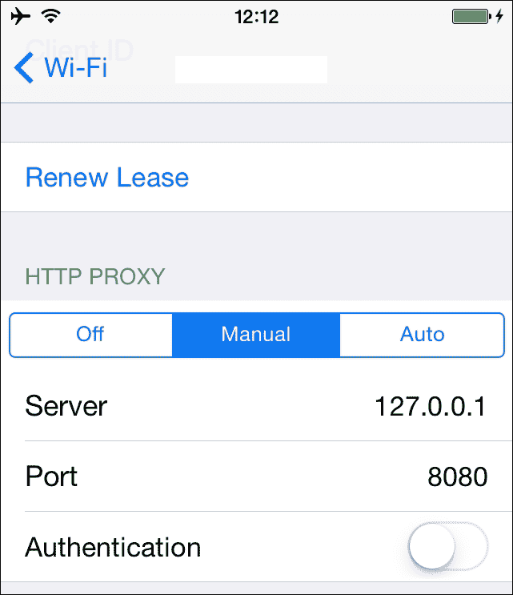
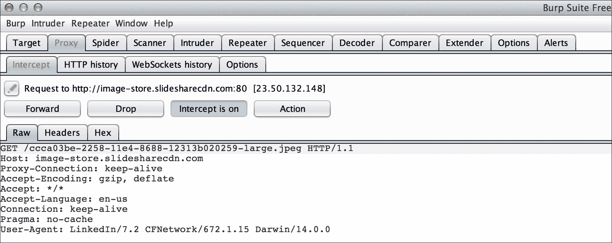
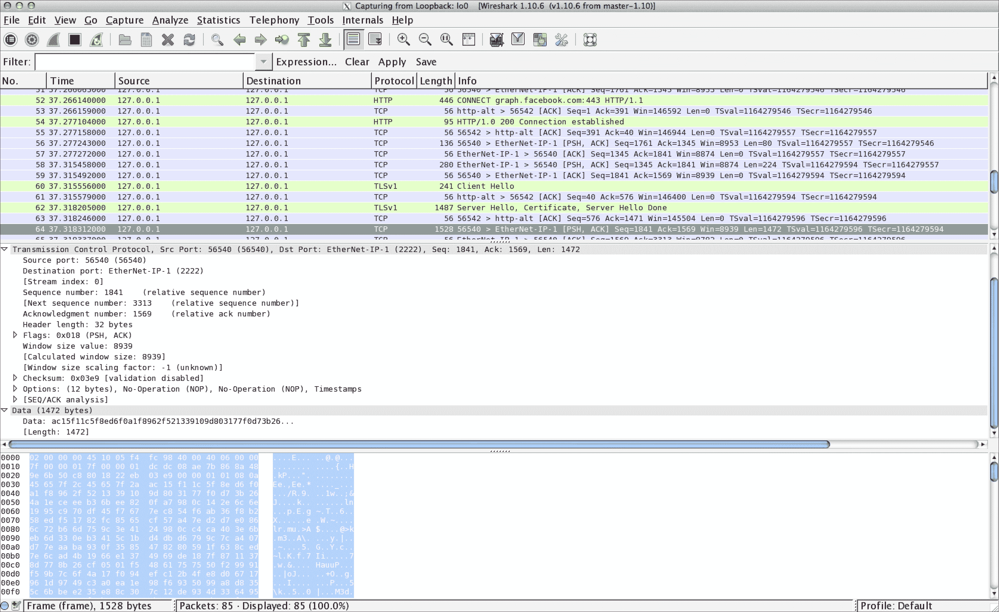
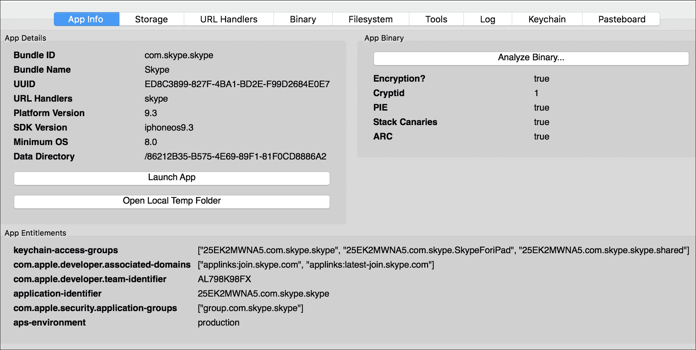
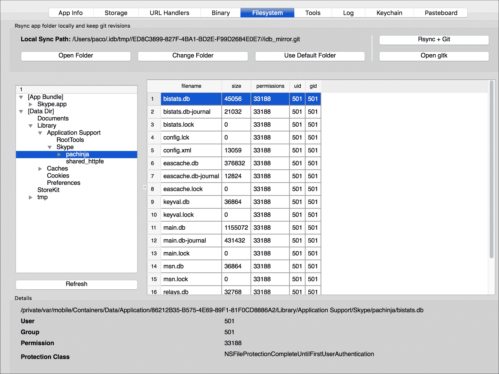
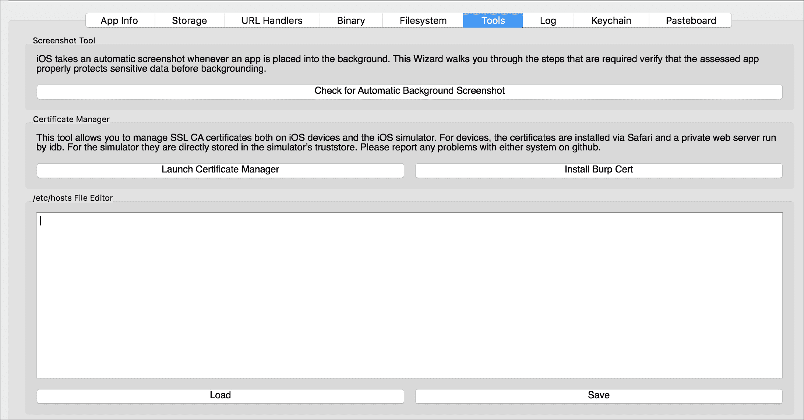
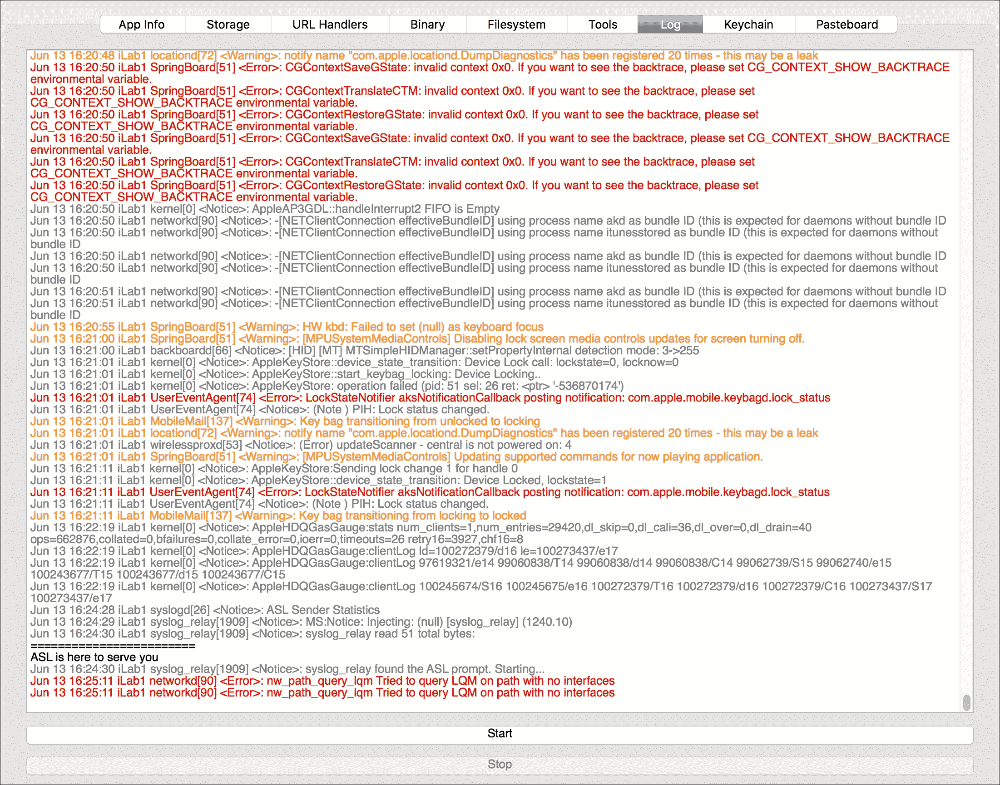

# 第七章：应用程序与恶意软件分析

尽管 iOS 设备的恶意软件并不常见，但在越狱设备中却更为常见。作为法医分析师，你可能需要分析一个恶意应用程序，或者更一般地说，分析一个你以前从未见过的可疑应用程序的行为。虽然我们并不打算编写一个全面的 iOS 应用程序静态逆向工程指南，但本章将概述如何分析一个应用程序，无论它是否恶意。在本章中，你将首先学习如何设置工作环境，并安装和配置 iOS 应用分析所需的基本工具。然后，我们将进入应用分析原则，学习数据可能存在的状态及其查找位置。最后，我们将看到一些工具的实际应用，这些工具有助于加速分析并自动化某些任务。

# 设置环境

为了正确设置 iOS 应用分析的测试环境，第一步是越狱你的测试设备。作为分析师，你需要完全控制设备上发生的事情，能够访问所有类型的信息，无论它们是存储在内存中还是通过网络传输的。

如何越狱 iPhone 并不在本书的讨论范围之内，因此我们不会详细讲解如何操作。这也非常简单。只需下载一个可用的软件选项，如 Evasi0n（适用于 iOS 7）、Redsn0w（适用于 iOS 8）、PanGu（适用于 iOS 8 或 9）和 TaiG9（适用于 iOS 9），并按照说明操作即可。

一旦设备已越狱并安装了 Cydia，你还需要安装以下工具：

+   **OpenSSH**：此工具允许你通过 Wi-Fi 或 USB 登录到越狱设备，并获得 root shell 访问权限

+   **MTerminal**：此工具允许你直接在设备上运行终端命令，而不是通过 SSH 从其他系统登录

+   **BigBoss 推荐工具**：此包包含一系列有用的命令行工具，如 `apt`、`make`、`wget`、`sqlite3` 等

分析恶意应用程序时，你总是需要通过 shell 与 iPhone 进行交互，无论是安装新工具还是从 shell 启动特定命令；这就是我们安装 OpenSSH 的原因。你需要做的第一件事是更改默认的 root 密码，默认密码是 `alpine`，以防止其他人通过远程登录到你的设备（并获取 root 权限）。为此，启动你刚安装的 MTerminal 应用并运行以下命令：

```
# su root
Password:
# passwd
Changing password for root.
New password:
Retype new password:
# 

```

现在，有一种更加方便舒适的方式可以通过 USB 连接到你的 iPhone，而无需强制使用 Wi-Fi。在你的电脑上，通过编辑 `~/.ssh/config` 文件并添加以下条目：

```
Host usb
HostName 127.0.0.1
Port 2222
User root
RemoteForward 8080 127.0.0.1:8080

```

这将把`usb`主机名映射到具有所需参数的`ssh`连接。此外，最后一行设置了端口转发，使得对 iPhone 端口`8080`的任何连接都会被转发到本地笔记本的端口`8080`。当你需要设置代理来拦截网络通信时，这将非常有用，正如你在本章后面会看到的那样。现在，你需要某个程序监听端口`2222`：`usbmuxd`。这个守护进程负责通过 USB 复用到 iDevice 的连接。要在 OS X 上完成此过程，你只需使用以下命令：

```
$ brew install usbmuxd
$ iproxy 2222 22
$ ssh usb

```

完成！现在，你可以通过 USB 在 iPhone 上使用 Shell 了。

在安装其他工具之前，最好确保基准系统是最新的。为此，只需在你的根 Shell 中执行以下命令：

```
# apt-get update
# apt-get upgrade

```

`update`命令从默认仓库获取最新的包列表，而`upgrade`命令将根据之前运行的`update`命令获得的信息，提取设备上已安装但没有最新版本的包的更新版本。

以下部分将快速介绍三个重要的工具，这些工具对从内存中提取加密内容（例如代码）以及 Keychain 密码容器非常有用。

## class-dump

**class-dump**是一个命令行工具，用于提取（解密后的）iOS 应用程序中的**Objective-C**类信息，它与 Cydia 包一起安装。请注意，它仅适用于 Objective-C 应用程序，而不适用于 Swift 应用程序。

最后，请注意，旧版的`class-dump-z`与 64 位架构不兼容，这意味着从 iPhone 5s 开始就无法使用。

## Keychain Dumper

一个非常有趣且实用的工具是 Keychain Dumper，顾名思义，它可以让你从 Keychain 中提取内容。通常，应用程序访问 Keychain 的方式在其权限中指定，这些权限定义了应用程序可以访问的信息。这个工具的工作方式是，二进制文件使用带有通配符权限的自签名证书进行签名。因此，它能够访问所有 Keychain 项。要安装`keychain_dumper`，只需从 GitHub 仓库[`github.com/ptoomey3/Keychain-Dumper`](https://github.com/ptoomey3/Keychain-Dumper)下载`zip`压缩包并解压。然后，只需将`keychain_dumper`二进制文件复制到手机中，方法如下：

```
$ scp keychain_dumper root@usb:/tmp/

```

然后，确保`keychain_dumper`是可执行文件，并验证`/private/var/Keychains/keychain-2.db`是否对所有用户可读。如果不是，你可以按如下方式设置：

```
# chmod u+x keychain_dumper
# chmod +r /private/var/Keychains/keychain-2.db

```

你现在应该能够顺利运行该工具：

```
# ./keychain_dumper
Generic Password
----------------
Service: AirPort
Account: ******** Work
Entitlement Group: apple
Label: (null)
Generic Field: (null)
Keychain Data: s***iami**********
...
...

```

如前面的输出所示，默认情况下，`keychain_dumper`仅提取通用密码和互联网密码。然而，你也可以指定可选标志，以提取 Keychain 中的更多信息，如下所示（通过`-h`命令获取帮助）：

```
# ./keychain_dumper -h
Usage: keychain_dumper [-e]|[-h]|[-agnick]
<no flags>: Dump Password Keychain Items (Generic Password, Internet
Passwords)
-a: Dump All Keychain Items (Generic Passwords, Internet Passwords,
Identities, Certificates, and Keys)
-e: Dump Entitlements
-g: Dump Generic Passwords
-n: Dump Internet Passwords
-i: Dump Identities
-c: Dump Certificates
-k: Dump Keys

```

## dumpDecrypted

从 App Store 下载的应用程序的可执行文件在下载时已加密。由 Stefan Esser 开发的`dumpDecrypted`工具（他的 Twitter 用户名为`@i0n1c`），运行目标应用程序并将其从内存解密并转储到磁盘。要安装`dumpDecrypted`，请在 Mac 上从其 GitHub 页面（[`github.com/stefanesser/dumpdecrypted`](https://github.com/stefanesser/dumpdecrypted)）下载`zip`存档，解压缩并首先在 Mac 上进行编译。或者，可以通过 idb 安装`dumpDecrypted`作为工具。

# 应用程序分析

在分析应用程序时，需要通过分析系统运行时和运行后留在系统上的所有迹象和工件来查看其所有活动和与系统的交互，以及与系统之间的数据收发来了解应用程序如何以及与谁通信。因此，需要查看数据可能存在的三种状态。以下是数据可能存在的三种状态：

## 数据静止

数据静止时，我们指的是存储介质上记录的所有数据；在我们的案例中，是指移动设备的内部存储器。这些包括`plist`文件、`sqlite`数据库、日志以及我们可以直接从介质本身检索的任何其他信息。我们在这里不会详细介绍，因为这个过程与通过分析应用程序目录树结构来检查其文件并分析系统日志的特定应用程序的取证分析相同。有关更多详细信息，请参阅第六章，《分析 iOS 设备》。

## 数据使用

数据在使用中，顾名思义，指的是应用程序当前正在使用的所有数据。这些数据存储在设备的内存（RAM）中。在计算机恶意软件的标准恶意软件分析中，内存分析尽可能是游戏的一部分。不幸的是，对于 iOS，但一般而言，对整个移动景观来说，内存获取和分析尚未得到良好的发展，尽管已经实现了一些用于转储内存的实用程序/概念验证。然而，内存分析和运行时操纵/滥用超出了本书的范围，但您可以自行探索并参考**memscan**（[`hexplo.it/introducing-memscan/`](https://hexplo.it/introducing-memscan/)）或**heapdump-ios**（[`blog.netspi.com/ios-tutorial-dumping-the-application-heap-from-memory/`](https://blog.netspi.com/ios-tutorial-dumping-the-application-heap-from-memory/)）了解内存分析，以及*Hacking and Securing iOS Applications*，*Jonathan Zdziarski*，*O'Reilly Media*，了解运行时操纵/滥用。

另一个你可能希望保留在工具箱中的有趣工具是**Frida**（[`www.frida.re/`](http://www.frida.re/)），它是一个动态插桩框架，允许你将自己的脚本注入到进程中以执行自定义调试逻辑。Frida 采用客户端/服务器模型，这意味着你需要在计算机和 iDevice 上都安装它。

在 Mac 上，只需键入以下内容：

```
sudo pip install frida

```

在你的越狱 iDevice 上，启动 Cydia 并通过导航到**管理** | **源** | **编辑** | **添加**，输入[`build.frida.re`](https://build.frida.re)来添加 Frida 的仓库。现在，你应该能够找到并安装 Frida 包。你可以在 Frida 的官方网站上找到更多文档细节。关于内存，基于 Frida 构建的一个非常有用的工具是 Fridump（[`github.com/Nightbringer21/fridump`](https://github.com/Nightbringer21/fridump)），一个开源内存转储工具。如果 Frida 在你的计算机和 iDevice 上都正确安装（请记住，最好在两者上安装相同版本），那么接下来的步骤是通过 Frida 使用以下命令获取进程名称：

```
$ frida-ps -U
 PID  Name
----  ----------------
1744  Cydia
 137  Mail
1738  Settings
1808  Skype
 78  BTServer
1792  CacheDeleteAppCo
...

```

### 注意

`-U`参数表示你正在针对通过 USB 连接的设备。

一旦你得到进程名称，就可以像下面的示例一样将它传递给`fridump`：

```
$ python fridump.py -u -s --max-size 1048576 Skype
 ______    _     _
 |  ___|  (_)   | |
 | |_ _ __ _  __| |_   _ _ __ ___  _ __
 |  _| '__| |/ _` | | | | '_ ` _ \| '_ \
 | | | |  | | (_| | |_| | | | | | | |_) |
 \_| |_|  |_|\__,_|\__,_|_| |_| |_| .__/
 | |
 |_|
Current Directory: /Projects/iosmem/fridump
Output directory is set to: /Projects/iosmem/dump
Creating directory...
Starting Memory dump...
Progress: [########################################----]88.42% 

```

上述示例将从通过 USB 连接的设备中转储 Skype 进程（`-u`），以 1MB 为块读取数据（`--max-size`），并且还会提取所有转储文件中的字符串（`-s`）。

Fridump 已经在 iOS 8 上成功测试过，但在 iOS 9 上偶尔会在接近结束时卡住。即使在这种情况下，大部分内容也会被转储，你将能够从任何经典计算机环境中的内存转储中检索到你期望的信息：配置文件、密码、执行的代码，一切都以明文呈现。更多信息以及一些案例示例，可以从作者的网站获取（[`pentestcorner.com/introduction-to-fridump/`](http://pentestcorner.com/introduction-to-fridump/)）。

## 传输中的数据

传输中的数据指的是在网络中的两个节点之间传输的任何信息，在我们的案例中，就是目标应用程序发送和接收的所有数据。能够观察和操控应用程序通过网络发送的数据，对于在分析可疑应用程序时的行为/动态分析是非常有趣和有用的。

### 注意

在开始之前，记得将设备与网络（所有网络）隔离，特别是当你正在分析恶意应用程序时。因此，创建一个与外部网络隔离的无线网络（不连接到互联网或你的内部网络），然后将你的 iPhone 设置为飞行模式，并且仅在之后打开 Wi-Fi，这样其他网络接口就保持关闭。

首先，你需要通过计算机将手机的流量路由过来，从而充当中间人角色。为了在`ssh`配置中使用这个技巧，正如我们之前所做的，首先启动`iproxy`并建立一个到手机的`ssh`连接，具体如下：

```
$ iproxy 2222 22
$ ssh usb

```

然后，从设备的网络配置中，设置 HTTP 代理为手动，指向本地主机`127.0.0.1`端口`8080`。它会被重定向到你的 Mac 的`8080`端口：



现在 iPhone 已经设置好，你需要在本地主机端口`8080`上设置一个代理监听。**Burp Proxy**可能是最受欢迎的代理工具（[`portswigger.net/burp/`](http://portswigger.net/burp/)）；它是跨平台的，而且有一个免费的版本，足以满足我们的需求。然而，市面上还有很多其他的代理工具，你可以选择你喜欢的一个。一旦 HTTP 请求被拦截，使用 Burp 你可以执行多种操作，如修改请求参数、拦截并修改响应等等：



然而，尽管 Burp 在拦截 HTTP/HTTPS 协议时表现非常出色，你可能希望查看所有流量，因为有些应用可能不会使用标准的 HTTP 协议进行通信，并且可能会记录这些流量以便后续分析。为此，你需要安装 Wireshark，这是一款标准的事实上的数据包分析工具，配合`tcpdump`使用，并在你的环回接口`127.0.0.1`上运行数据捕获：



当然，在越狱的 iPhone 上，你拥有完全控制权，可以选择直接在设备上安装并使用`tcpdump`。

# 自动化分析

本节将简要介绍一些工具，它们能在分析过程中帮助你，无论是加速最常见的任务，还是提供一些额外且非常有用的功能。

## idb

idb 是由 Daniel Mayer（他的 Twitter 账号是`@DanlAMayer`）开发和维护的一个工具，它简化了与 iOS 应用分析相关的一些常见任务。最初是以渗透测试员/研究员为重点构建的，但由于它集成了许多工具并提供了丰富的功能，它对于任何类型的应用分析都非常有价值。idb 是用 Ruby 编写的，安装过程非常简单；你只需要运行以下命令：

```
$ rvm install 2.1 --enable-shared
$ gem install bundler
$ brew install qt cmake usbmuxd libimobiledevice
$ gem install idb
$ idb

```

这是 Mac OS X 的操作流程。关于在其他系统上构建和运行的更多信息，你可以参考官方网站[`www.idbtool.com/`](http://www.idbtool.com/)。

完成配置步骤并安装设备所需的附加工具后，启动 idb 后，你需要将 idb 连接到 USB 设备，选择一个应用并开始分析。请注意，尽管它将运行一个漂亮的图形界面（GUI），但你仍然会在启动 idb 的 shell 中被提示输入 iDevice 的 root 密码。

点击**分析二进制文件...**，如下面的截图所示，将提供关于二进制文件的初步信息，验证包括**PIE**、堆栈溢出保护和**ARC**是否启用，这些都能降低发现并利用内存损坏漏洞的可能性。此外，如果二进制应用被加密，`idb`将运行`dumpdecrypted`来解密它，再进行分析：



你还可以从**二进制**标签中提取与二进制应用相关的其他信息。正如你将看到的，idb 会提取解密后的二进制文件中的所有字符串。这是分析标准计算机恶意软件时会执行的标准步骤。这个功能非常有用，因为你可以在这里找到 API 密钥、凭证、加密密钥、URL 和其他有用的线索。从静态分析的角度来看，idb 的二进制分析允许你提取所有类的信息。

说到静态数据，在**存储**标签下，你可以分析所有与目标应用相关的文件，例如`plist`、`sqlite`数据库和`Cache.db`，其中包含缓存的 HTTP 请求/响应以及 Web 应用缓存的离线数据，如图片、HTML、JavaScript、样式表等。idb 工具还允许你从**文件系统**标签中浏览应用的树状结构，并拍摄和存储不同的快照，以便后续在不同阶段进行导航和比较：



另外两个有趣的功能是**URL 处理程序**，它显示 URL 处理程序的列表，并包括一个基础的模糊测试工具，可以通过 URL 方案模糊输入数据，以及**Keychain**转储工具，它允许你使用`keychain_dump`转储 Keychain。

**工具**标签包含几个非常实用的工具，具体如下：

+   **后台截图**：尽管该工具更适用于取证/安全目的，但它会寻找系统在将应用置于后台（通过按下 Home 按钮）时拍摄的最终截图。

+   **证书管理器**：此工具可以加速 CA 证书的管理和安装。例如，在使用 Burp 进行 HTTPS 流量分析时，它非常有用，尤其是当应用程序检查 SSL 是否正常时。

+   **/etc/hosts 文件编辑器**：正如我们之前所看到的，应用程序并不总是使用 HTTP/S 协议，因此 Burp 无法拦截。使用此编辑器，你可以快速访问并修改 iPhone 的`/etc/hosts`文件，以便将流量重定向到你为分析启动的自定义服务。



最后但同样重要的是，`idb` 通过 **日志** 和 **粘贴板** 标签分别提供实时日志（`syslog`）和粘贴板查看器（参考以下截图）。虽然在你自己测试应用时监控粘贴板可能看起来并不是特别有用，但你可能会惊讶地发现，应用程序也使用粘贴板进行 **进程间通信** (**IPC**)。默认情况下，idb 只监控主（默认）粘贴板，但你可以在右侧列表中添加其他粘贴板名称，这样你也可以监控私人粘贴板。

关于日志面板，idb 包含了系统消息和应用程序通过 `NSLog` 产生的任何日志信息，这些日志通常会暴露敏感数据：



# 总结

在本章中，我们介绍了一些分析 iOS 应用程序的工具，无论它们是否可疑，主要从行为/动态角度出发。你学习了如何快速分析二进制文件，审查目标应用程序产生的数据和日志，拦截、操作和分析通过网络发送和接收的数据，并使用临时工具包（如 idb）自动化大多数任务。

# 自测题

Q1\. 哪个工具可以用来提取 iOS 应用程序中的 Objective-C 类信息？

1.  OpenSSH

1.  MTerminal

1.  class-dump

1.  Keychain Dumper

Q2\. 哪个工具可以用来从内存中转储未加密的应用程序？

1.  usbmuxd

1.  Keychain Dumper

1.  dumpDecrypted

1.  OpenSSH

Q3\. 哪个工具可以用来验证粘贴板内容？

1.  dumpDecrypted

1.  iRet

1.  iLoot

1.  idb

Q4\. 你会使用哪些工具来分析传输中的数据？

1.  Burp Proxy + Wireshark

1.  iproxy + Wireshark

1.  dumpDecrypted + tcpdump

1.  tcpdump + iproxy

Q5\. 哪一组工具可以实现任务自动化，以便分析和逆向工程 iOS 应用程序？

1.  iLoot

1.  idb

1.  class-dump

1.  dumpDecrypted
