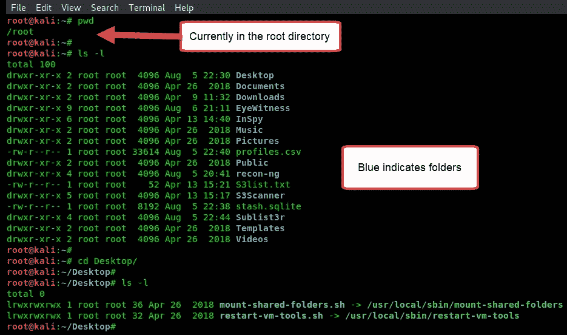
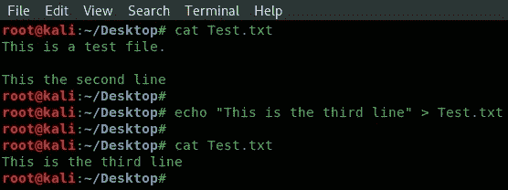
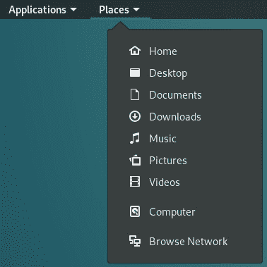
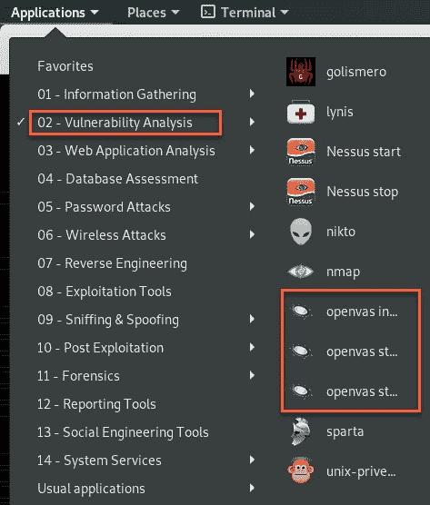
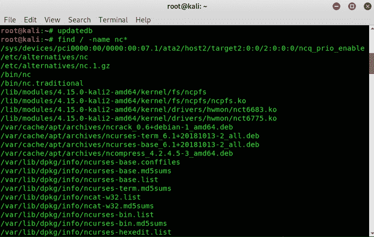
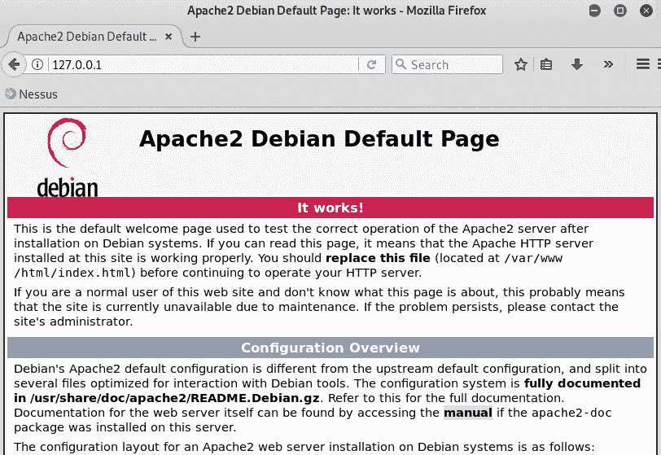

# 第四章：熟悉 Kali Linux 2019

如果您刚开始涉足网络安全领域，尤其是在攻击性安全测试（渗透测试）方面，很可能会遇到 Kali Linux 操作系统。Kali Linux 具有许多功能和工具，使渗透测试人员或安全工程师在现场或工作时的工作变得更加轻松。有许多工具、脚本和框架可用于完成各种任务，如收集目标信息、执行网络扫描，甚至利用等。我们作为初学者面临的挑战是学习和适应新环境。

在本章中，我们将学习如何更有效地使用 Kali Linux 作为用户和渗透测试人员。此外，您将学习如何使用 Linux 操作系统执行各种任务，并对其更加熟悉。如果不了解 Kali Linux 的工作原理，您可能会在后面更高级的渗透测试章节中面临挑战。

在本章中，我们将涵盖以下主题：

+   了解 Kali Linux

+   Kali Linux 2019 有什么新功能？

+   Kali Linux 的基础知识

# 技术要求

Kali Linux 是本章的唯一技术要求。

# 了解 Kali Linux

让我们简要回顾一下 BackTrack 的历史（[`www.backtrack-linux.org/`](https://www.backtrack-linux.org/)）。BackTrack 操作系统是由 Auditor Security Collection 和 Whax 组织在 2006 年开发和维护的。当时，BackTrack 基于 Linux 操作系统 Ubuntu。基于 Linux 意味着 BackTrack 为渗透测试人员提供了许多机会，其中之一是能够从光盘和 USB 启动介质中启动。然而，BackTrack 操作系统的最新版本是 BackTrack 5，于 2011 年发布后项目被存档。2012 年，宣布了下一代操作系统，现在是 BackTrack 的继任者，称为 Kali Linux，是从头开始构建的。2013 年 3 月，Kali Linux 正式向公众发布。

在网络安全领域，特别是在渗透测试领域，大多数最棒的工具都是为 Linux 操作系统而不是 Microsoft Windows 创建的。因此，在大多数网络安全培训项目中，您会注意到 Linux 是进行安全测试的首选操作系统。

使用 Kali Linux 的一些好处如下：

+   它支持开源渗透测试工具。

+   默认情况下包含 300 多个工具。

+   基于 Linux 的特性使其可以安装在硬盘驱动器上或通过光盘或 USB 启动介质使用。

+   它支持在 OnePlus 智能手机和 Raspberry Pi 等移动设备上安装。

+   它不需要太多的资源，如 RAM 或 CPU。

+   Kali Linux 可以安装为虚拟机、本地硬盘驱动器、可启动的 USB 闪存驱动器、Raspberry Pi 和其他各种设备。

Kali Linux 操作系统基于 Debian 构建，包含 300 多个预安装工具，功能从侦察到利用甚至取证。Kali Linux 操作系统不仅为安全专业人员设计，也适用于 IT 管理员和 IT 领域的网络安全专业人员。作为免费的安全操作系统，它包含进行安全测试所需的工具。

在 Kali Linux 操作系统中，有许多目前在行业中广泛使用的流行工具，如网络映射器（Nmap）、aircrack-ng 和 Metasploit 框架。操作系统的部署和利用非常灵活，仅受想象力的限制。

Kali Linux 是一个预先打包的多合一操作系统，其中包含了用于渗透测试、数字取证、逆向工程等工具，绝对是渗透测试人员的首选。在接下来的部分中，我们将深入了解 Kali Linux 2019 中的新功能。

# Kali Linux 2019 有什么新功能？

Kali Linux 2019 配备了升级后的 4.19.13 内核和操作系统中的许多更新软件包和错误修复。其中一个主要升级是 Metasploit Framework。Metasploit 的上一个版本是 2011 年发布的 4.0 版本，但在 Kali Linux 2019 中，它升级到了 5.0 版本。

新的 Metasploit 5.0 版本带来了新的规避技术，更新了其数据库，并自动化了 API。Kali Linux 2019 还包含以下工具的升级：

+   theHarvester

+   dbeaver

+   Metasploit

+   exe2hex

+   msfpc

+   SecLists

有关 Metasploit 5.0 中新的规避技术的更多信息，请访问[`www.rapid7.com/info/encapsulating-antivirus-av-evasion-techniques-in-metasploit-framework/`](https://www.rapid7.com/info/encapsulating-antivirus-av-evasion-techniques-in-metasploit-framework/)。

Kali Linux 操作系统的开发人员和用户社区不断增长，因为它是目前最受欢迎的渗透测试 Linux 发行版之一。未来将会有更多更新和改进。

现在您已经了解了 Kali Linux 2019 中的更改，我们将学习如何使用 Kali Linux。

# Kali Linux 的基础知识

在数字生活的大部分时间里习惯于一个操作系统有时是好事，有时是坏事。您很可能是 Windows 或 macOS 用户，并且对功能和功能非常熟悉，知道如何在您当前选择的操作系统中找到自己的方式。然而，学习一个新的平台甚至一个新的用户界面对一些人来说可能会很具有挑战性。这就像是一个安卓用户切换到苹果 iOS 或反之。一开始可能会有点困难，但通过不断练习，您将成为绝地大师。

在接下来的几节中，我们将深入学习作为渗透测试人员导航 Linux 操作系统的基础知识。

# 终端和 Linux 命令

Linux 终端基本上是 Linux 操作系统中最强大的接口，因为这是所有魔术发生的地方。大多数 Linux 工具都是基于命令行的。大多数渗透测试工具也是基于命令行的，这有时可能会让新用户和刚开始从事网络安全或渗透测试领域的人感到害怕。

以下练习将帮助您更熟悉使用 Linux 终端和命令：

+   要更改当前用户帐户的密码，请执行`passwd`命令。每当您在 Linux 终端/ shell 上输入密码时，密码本身是不可见的。

+   要在终端中查看当前工作目录，请使用`pwd`命令。

+   要查看当前目录中的文件和文件夹列表，请使用`ls`命令。此外，可以使用`ls –la`命令列出所有文件（包括隐藏文件）及其权限。

+   要更改目录或导航文件系统，请使用`cd`命令，后跟目录。

以下是演示使用这些命令的屏幕截图。我们可以看到执行`pwd`命令后的当前工作目录，使用`ls -l`命令列出的文件和文件夹列表，以及使用`cd`命令更改工作目录的选项：

此外，如果我们的目录中有一个文本文件，我们可以使用`cat`命令查看其内容。此外，我们可以使用`echo "text" >> filename.txt`语法直接从终端向现有文件添加额外的文本行，如下面的屏幕截图所示。仔细看，我们可以看到`ls`命令用于显示桌面上的文件，`cat`命令用于在终端上打印`Test.txt`文件的内容，`echo`用于添加文本：

使用`>>`开关将向现有文本文件添加另一行（换句话说，插入新行）。但是，使用单个`>`将用新字符串覆盖所有内容，如我们在这里所见：

`Test.txt`文件现在具有最新的文本字符串。

如果您有兴趣了解更多关于 Linux 的信息，请查看思科网络学院的*Linux Unhatched*和*Linux Essentials*课程：[`www.netacad.com/courses/os-it`](https://www.netacad.com/courses/os-it)。

永远记住，您练习使用 Linux 操作系统的次数越多，执行任务就越容易。

接下来，我们将演示如何使用各种实用程序在 Kali Linux 中找到自己的路。

# 在 Kali Linux 中导航

在本节中，我们将指导您了解操纵 Kali Linux 操作系统的基础知识。正如我们之前提到的，Kali Linux 是基于 Debian Linux 的。这意味着所有其他基于 Debian 的操作系统都将具有类似的用户界面。

Kali Linux 启动后，您将看到登录屏幕；登录到 Kali Linux 的默认用户名和密码是`root`/`toor`。登录后，您将看到一个非常漂亮，干净，精致的用户界面。您将在左上角的应用程序下拉菜单中注意到的第一件事是。这是存放所有渗透测试和取证工具的菜单。应用程序菜单如下面的屏幕截图所示，按照不同的类别进行组织，如信息收集，漏洞分析和 Web 应用程序分析：

此外，将鼠标悬停在类别上将显示该部分的热门工具。但是，单击类别将展开更多的子类别，每个子类别都包含更多的工具。让我们单击应用程序|02-漏洞分析|思科工具。您将看到右侧打开一个附加菜单，显示所有与思科设备相关的漏洞工具，如下面的屏幕截图所示：

当您成为 Linux 用户时，您很快就会意识到操作系统上最强大的应用程序之一是 Linux 终端。终端相当于 Windows 操作系统中的命令提示符。许多任务和工具通常是通过终端窗口初始化的。您可能会想：Kali Linux 有图形用户界面（GUI），那么它所有内置工具都有 GUI 吗？简短的答案是否定的。

Kali Linux 大部分强大的工具只能通过命令行界面（CLI）来控制；然而，有些工具可以选择使用图形用户界面（GUI）。使用 CLI 的好处是，与 GUI 相比，工具的输出在终端上更加详细。我们将在本书的后面看到这个概念。要打开终端，请选择应用程序|收藏夹|终端：

Kali Linux 具有任何其他操作系统具有的所有常规功能和功能。这意味着有用户目录，如`Home`，`Desktop`，`Documents`，`Downloads`，`Music`和`Pictures`。要快速访问 Kali 的任何位置，只需单击“位置”下拉菜单：

现在，普通的 Windows 用户在没有类似控制面板的东西之前，他们的体验不会完整。要访问 Kali Linux 中的控制面板等效物，只需单击右上角的电源按钮图标。这将创建一个下拉菜单，在那里您将看到一个扳手和螺丝刀图标，如下面的屏幕截图所示。

单击此图标将打开操作系统的设置菜单：

在左侧列中，您将找到主要类别。右侧显示了每个类别的扩展：

在对 Kali Linux 进行任何配置更改之前，请确保记录您的默认设置。这是为了确保在您进行更改后出现任何问题时，您可以恢复到先前的状态。此外，在进行任何重大更改之前，请创建虚拟机的快照。

现在您对热门目录和设置的位置有了更好的了解，我们可以继续学习在 Kali Linux 上更新和安装程序。

# 更新源并安装程序

有时，工具可能无法按预期工作，甚至在渗透测试或安全审计期间意外崩溃。开发人员经常发布他们应用程序的更新。这些更新旨在修复错误并为用户体验添加新功能。

要更新我们的 Kali Linux 操作系统上的软件包，我们必须首先将软件包索引文件与它们的源重新同步。让我们开始吧：

1.  打开终端，并执行`apt-get update`命令：

索引位于`/etc/apt/sources.list`文件中。

这个过程通常需要一两分钟才能完成，前提是有稳定的互联网连接。

1.  如果要将 Kali Linux 机器上的当前软件包（应用程序）升级到其最新版本，请使用`apt-get upgrade`命令：

在进行升级时，请确保在进行渗透测试之前，所有工具和脚本都能完美运行。

如果在 Kali Linux 上升级软件包时遇到错误，请使用`apt-get update --fix-missing`命令解决任何依赖关系，然后再次执行`apt-get upgrade`命令。

1.  在输出的末尾，交互式菜单将要求您选择是（`y`）或否（`n`）以继续升级过程。选择是后，操作系统将下载每个软件包的最新版本并逐个安装它们。这个过程需要一些时间才能完成。

如果您想将 Kali Linux 的当前版本升级到最新的发行版，请使用`apt-get dist-upgrade`命令。在撰写本文时，我们使用的是 Kali Linux 2019.2。

此外，执行`apt autoremove`命令将通过删除任何旧的或不再需要的软件包文件来执行 Kali Linux 操作系统的清理操作：

现在我们清楚了如何更新和升级我们的操作系统，让我们看看如何在 Kali Linux 2019 中安装新应用程序（软件包）。一个非常著名的漏洞扫描器是**Open Vulnerability Assessment System**（**OpenVAS**）。但是，默认情况下，Kali Linux 2019 中不包括 OpenVAS。在这个练习中，我们将在我们的 Kali 机器上安装 OpenVAS 应用程序。要开始，请确保您的 Kali 机器上有互联网连接。

使用`apt-get install openvas`命令搜索存储库并下载安装带有所有依赖项的软件包：

这个过程应该需要几分钟来完成。确保在 Kali Linux 上安装任何软件包之前执行`apt-get update`命令。一旦安装了软件包（应用程序），它将出现在应用程序菜单中指定的类别中，如下面的屏幕截图所示：

请务必查看您的 Kali Linux 版本的发布说明，网址为[`www.kali.org/category/releases/`](https://www.kali.org/category/releases/)。

有时，更新您的源文件将有助于在 Kali Linux 上更新、升级和检索软件包。`sources.list`文件的最新更新可以在[`docs.kali.org/general-use/kali-linux-sources-list-repositories`](https://docs.kali.org/general-use/kali-linux-sources-list-repositories)找到。

在下一节中，我们将深入了解 Kali Linux 操作系统中三个最基本的工具。 

# find、locate 和 which 命令

在 Kali Linux 操作系统中，用户可以使用许多方法来定位文件和目录。在本节中，我将向您介绍`find`、`locate`和`which`实用程序。这些实用程序中的每一个都执行类似的任务，但从不同的角度返回所请求的信息。

在使用这些命令之前，我们必须首先执行`updatedb`命令，在 Kali Linux 当前文件系统中为每个文件构建一个本地数据库。这个过程通常需要几秒钟来完成。

在接下来的部分，我们将深入了解 Linux 实用程序的每一个以及它们的使用方法。

# locate 命令

数据库完全构建后，我们可以使用`locate`实用程序查询本地文件的数据库。在这个例子中，我们尝试使用`locate nc.exe`命令来定位 Netcat Windows 可执行文件的目录：

正如我们所看到的，`locate`实用程序能够为我们检索出`nc.exe`文件在文件系统中的位置。

# which 命令

接下来，我们将使用`which`实用程序来帮助我们搜索目录。与之前的例子不同，我们不需要指定文件扩展名；`which`实用程序用于定位可执行文件的文件路径。简而言之，`which`实用程序只会提供文件路径：

前面的屏幕截图显示了在 Kali Linux 中使用`which nc`命令检索 Netcat 路径的位置。

# find 命令

`find`实用程序比`locate`和`which`更具侵略性。`find`实用程序将返回所有包含我们指定的关键字或字符串的结果。在我们的例子中，我们使用`find`命令来提供一个包含以`nc`开头的所有文件（包括它们的目录）的列表：

`man`命令可以帮助我们理解工具或实用程序的工作原理。`man`命令用于为工具提供手册页。我们可以使用`man find`命令查看`find`实用程序的`man`页面：

当您想要了解 Linux 上的新工具或现有工具时，`man`命令可能非常有用。

在下一节中，我们将讨论如何在 Kali Linux 中管理服务，并看一些实际的例子。

# 管理 Kali Linux 服务

Kali Linux 操作系统可以作为各种类型服务的服务器，例如**安全外壳**（**SSH**）、**超文本传输协议**（**HTTP**）等。在本节中，我将演示如何启用和禁用各种服务。一旦系统上运行了一个服务，就会打开一个相关的网络端口。例如，如果在一台机器上启用了 HTTP，则默认的逻辑端口是`80`；对于 SSH，端口是`22`。

有关服务和端口号分配的更多信息可以在**互联网编号分配机构**（**IANA**）网站上找到，网址为[`www.iana.org/assignments/service-names-port-numbers/service-names-port-numbers.xhtml`](https://www.iana.org/assignments/service-names-port-numbers/service-names-port-numbers.xhtml)。

要在 Kali Linux 中启用服务，我们可以使用`service <service-name>`命令语法。在我们的示例中，我们将启用 Apache Web 服务器，并使用`netstat –antp | grep <service-name>`命令来验证相关服务是否正在运行并且网络端口是否打开，如下面的屏幕截图所示：

最后一列包含服务名称；在我们的练习中，我们可以看到列出了`apache2`。这表明 Web 服务正在运行—具体来说，Apache2 Web 服务在 Kali Linux 上是活动的。

要启用 SSH，我们可以使用`service ssh start`命令。

此外，由于它是一个 Web 服务器，我们可以打开我们的 Web 浏览器并输入环回 IP 地址`127.0.0.1`，以验证默认的 Apache 网页是否在我们的屏幕上加载：

然而，如果我们的 Kali Linux 机器被关闭或重新启动，我们之前启用的服务将恢复到它们的默认启动设置。如果我们想要确保某些服务始终在 Kali Linux 的引导过程中启动，可以在终端窗口中使用`update-rc.d <service-name> enable`命令来实现：

在我们的示例中，我们已启用 SSH 服务，这将允许我们通过网络安全地远程访问我们的 Kali Linux 机器。HTTP 服务器将允许我们访问 Web 服务器页面。

最后但同样重要的是，我们可以禁用单个服务并禁用服务在引导过程中自动启动，如下面的屏幕截图所示：

在成龙历险记中，由叔叔的声音说：“*还有一件事!*”，我建议更改 Kali Linux 根帐户的默认密码。要更改密码，请打开终端窗口并执行`passwd`命令。交互提示将要求您输入新密码并进行验证。

请注意，在 Linux 操作系统的终端界面上输入密码时，您输入的字符不会显示在屏幕/终端上。

在本节中，您已经学会了使用 Kali Linux 操作系统的基本技能。这些技能包括导航文件系统、更新和安装软件包以及启用和禁用服务。

# 摘要

在本章的过程中，我们讨论了使用 Kali Linux 操作系统作为首选的渗透测试发行版的好处。我们介绍了在操作系统中操纵和找到我们的方法的基础知识，就像您在任何其他操作系统中一样。然后，我们看了看如何更新我们的源文件和升级我们现有的软件包，并演示了如何安装新应用程序和删除过时的软件包。最后，我们介绍了如何使用`find`、`locate`和`which`实用程序快速找到 Kali Linux 操作系统中的文件和目录。

学习 Kali Linux 的基本知识将对您未来的旅程产生丰硕的成果。本章教授的技能将帮助您了解在使用 Kali Linux 时经常被忽视的简单事物。知道如何在目标上收集信息，但不知道如何在 Kali Linux 操作系统中找到或定位文件和目录将是毫无意义的，因此学习基础知识将使您走得更远。

在下一章中，我们将介绍**被动信息收集**，这是渗透测试中侦察阶段的开始。

# 问题

1.  Kali Linux 的前身是什么？

1.  你如何在 Kali Linux 上更新存储库？

1.  你如何在 Linux 上升级当前软件包？

1.  哪个命令从官方在线存储库安装新应用程序？

1.  你如何快速在文件系统中找到一个文件？

# 进一步阅读

+   **Kali Linux 2019.2 发布信息**：[`www.kali.org/news/kali-linux-2019-2-release/`](https://www.kali.org/news/kali-linux-2019-2-release/)

+   **官方 Kali Linux 文档**：[`www.kali.org/kali-linux-documentation/`](https://www.kali.org/kali-linux-documentation/)
