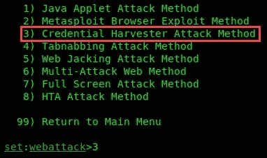
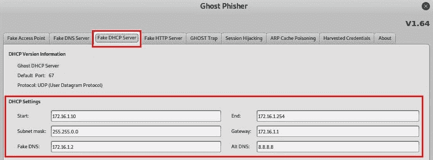

# 第十三章：客户端攻击-社会工程

许多组织倾向于相信，在其网络边界上拥有单一的保护系统足以保护其资产。拥有单一网络防火墙只是单层防御；攻击可以绕过公司网络内的安全系统和控制的方式有很多。一种常用的技术是操纵一个人做某事或向攻击者透露机密信息。这就是所谓的**社会工程**。

作为渗透测试人员，了解这个主题的基本概念、技术和实际方面是很重要的，因为这将帮助你在公司网络中获取用户凭证、系统和网络访问权限，以及有关员工和目标网络的其他敏感信息。在本章的过程中，您将比较和对比不同形式的社会工程攻击，同时使用各种工具和技术创建钓鱼网站，以收集受害者的凭证。

在本章中，我们将涵盖以下主题：

+   社会工程的基础知识

+   社会工程的类型

+   防御社会工程

+   社会工程学（doxing）的侦察

+   为每种类型的社会工程攻击做计划

+   社会工程工具

# 技术要求

以下是本章的技术要求：

+   Kali Linux

# 社会工程的基础知识

社会工程是攻击者或渗透测试人员用来说服某人透露敏感（机密）信息的技术。社会工程可以针对公司帮助台、行政团队、IT 人员、高管团队等进行。任何能够访问有价值的公司信息的员工绝对是主要目标；挑战在于操纵受害者相信你所说的一切并获得他们的信任。一旦获得受害者的信任，下一阶段就是利用它。

以下是社会工程可能对组织产生重大影响的各种方式：

+   由于机密信息的泄露导致收入损失，这将导致客户对公司失去信任。

+   由于公司数据被窃取并可能在网上泄露，隐私丧失。

+   由于违反公司政策可能会发生诉讼和仲裁。

社会工程建立在以下支柱上：

+   人类信任是所有社会工程攻击的重要组成部分。

+   攻击者（社会工程师）通常会请求某种形式的帮助或协助，受害者往往会因为一种善意或道义义务而遵从。

+   员工缺乏安全意识培训，使公司成为更容易的目标。

实施安全政策绝对是确保所有公司资产和员工安全的良好做法。然而，安全政策并不总是有效地防止社会工程攻击。让我们想象一下，一个渗透测试人员打电话给一个组织的帮助台，假装是高级经理之一，要求更改他们的公司用户帐户的密码。帮助台工作人员可能不会要求呼叫者提供有关其身份的进一步验证，而只是执行任务并通过电话提供新的用户帐户密码。攻击者现在可以使用这些用户凭证来访问电子邮件帐户和公司网络的其余部分。

通常没有办法确保完全免受社会工程攻击的安全，因为没有安全软件或硬件能够完全抵御此类攻击。

在接下来的部分，我们将讨论不同类型的社会工程攻击。

# 社会工程的类型

社会工程有许多形式；以下是不同类型的社会工程：

+   **基于人的社会工程**: 这种社会工程通过与他人互动从另一个人那里收集机密信息，换句话说，通过与个人交谈。

+   **基于计算机的社会工程**: 这种社会工程是使用计算机等数字技术执行的。

+   **基于移动设备的社会工程**: 在基于移动设备的社会工程中，攻击者使用移动应用程序对受害者进行攻击。

+   **基于电话的社会工程**: 这种技术涉及对受害者进行语音呼叫，冒充受害者可能信任的人。

+   **通过社交媒体进行社会工程**: 这涉及使用社交媒体平台欺骗人们提供敏感信息。

让我们更详细地看看每个工程过程。

# 基于人的社会工程

在基于人的社会工程中，攻击者假装成有权威的人。攻击者有时会冒充合法的最终用户，提供虚假身份并要求机密信息。此外，攻击者可以假装是组织中的重要用户，如董事或高级工作人员，并要求更改受害者用户帐户的密码。通常，伪装成技术支持的简单形式通常会让用户迅速信任你。想象一下，当你假装是 IT 技术人员并要求用户提供其用户帐户详细信息时，给员工打电话。通常，最终用户并不总是意识到网络安全中的基于人的威胁，并会迅速信任假装是技术支持的人。

在接下来的章节中，我们将深入探讨各种类型的基于人的社会工程技术，包括以下内容:

+   窃听

+   窥视

+   垃圾箱潜水

让我们从窃听开始。

# 窃听

窃听涉及在未经授权的情况下听取人们之间的对话和阅读他们的消息。这种攻击形式包括拦截用户之间的任何传输，如音频、视频或甚至书面通信。

接下来，我们将讨论窥视的概念。

# 窥视

我们中的许多人都有窥视的罪过。你有没有曾经走过一位同事身边，当时他们正在网站上输入数据或执行任务，希望你能看到他们在做什么？

窥视是在某人使用计算机时从其肩膀上窥视。这种技术用于收集诸如 PIN 码、用户 ID 和密码等敏感信息。此外，窥视可以使用数字相机等设备从较远的距离进行。

在下一节中，我们将介绍垃圾箱潜水。

# 垃圾箱潜水

垃圾箱潜水是一种基于人的社会工程形式，攻击者通过查看他人的垃圾，寻找敏感/机密数据。不安全地处理机密物品，如公司文件、过期信用卡、水电费账单和财务记录等，被认为对攻击者有价值。

接下来，我们将介绍基于计算机的社会工程攻击。

# 基于计算机的社会工程

我们大多数人过去都遇到过某种形式的基于计算机的社会工程。在基于计算机的社会工程中，攻击者使用计算设备来帮助他们欺骗受害者透露敏感/机密信息。

在这个类别中有两种主要的攻击形式:

+   网络钓鱼

+   鱼叉式网络钓鱼

以下是一些其他形式的基于计算机的社会工程:

+   弹出窗口要求用户提供信息

+   垃圾邮件

+   连锁信件

+   恶作剧信件

在本章中，我们只会讨论网络钓鱼和鱼叉式网络钓鱼；但是，你可以在空闲时间研究其他内容。

让我们从网络钓鱼开始。

# 网络钓鱼

攻击者通常发送一封包含虚假信息的非法电子邮件，同时掩盖成来自可信任人或来源的合法电子邮件。这种技术用于欺骗用户提供个人信息或其他敏感细节。

想象一下收到一封电子邮件：发件人的名字是你银行的名字，邮件正文中有指示让你点击提供的链接来重置你的网上银行凭证。电子邮件通常以富文本格式呈现给我们，这提供了非常清晰和易于阅读的文本。这种格式隐藏了实际消息的 HTML 代码，并显示纯文本。因此，攻击者可以轻易地掩盖 URL，将用户发送到恶意网站。钓鱼邮件的收件人可能无法识别误导或篡改的细节并点击链接。

接下来，我们将讨论矛头钓鱼。

# 矛头钓鱼

在常规的钓鱼攻击中，攻击者向互联网上的随机电子邮件地址发送数百封通用电子邮件。而在矛头钓鱼中，攻击者向公司内特定群体发送精心制作的消息。与普通的钓鱼攻击相比，矛头钓鱼攻击的响应率更高。

在接下来的部分，我们将介绍基于移动设备的社会工程攻击。

# 基于移动设备的社会工程

基于移动设备的社会工程可能包括为智能手机和平板电脑创建一个恶意应用程序，该应用程序具有非常吸引人的功能，将诱使用户下载并安装该应用程序到他们的设备上。为了掩盖恶意应用程序的真实性质，攻击者使用与官方应用商店上流行应用程序名称相似的名称。一旦恶意应用程序安装到受害者的设备上，该应用程序可以检索并将受害者的用户凭据发送给攻击者。

另一种基于移动设备的社会工程攻击被称为**smishing**。这种类型的攻击涉及攻击者向随机人发送非法短信，其中包含一个恶意 URL，要求潜在受害者通过提供敏感信息来回应。

攻击者有时会向随机人发送短信，声称自己是他们银行的代表。消息中包含一个看起来非常类似于合法银行官方域名的 URL。一个毫无戒心的人可能会点击导致他们进入一个虚假登录门户的恶意链接，该门户将捕获受害者的用户名和密码，甚至在受害者的移动设备上下载恶意负载。

在接下来的部分，我们将介绍通过社交网络进行社会工程。

# 通过社交网络进行社会工程

攻击者通常试图创建一个虚假档案并与人们建立沟通。他们假装成别人，同时试图诱使受害者透露有关自己的敏感细节。此外，还有许多情况下，一个人的帐户被攻击者使用，攻击者使用被攻击帐户与受害者的朋友/联系人列表中的人进行沟通。

攻击通常使用受损的社交网络用户帐户来创建一个非常庞大的朋友/联系人网络，以收集信息和敏感细节。

以下是一些用来诱使目标组织员工的方法：

+   创建一个虚假用户组

+   使用虚假身份，使用目标组织员工的姓名

+   让用户加入一个假用户组，然后要求他们提供凭据，如出生日期和配偶姓名

诸如 Facebook 和 LinkedIn 之类的社交网络网站是许多人可以访问的大型信息库。用户始终要注意他们所透露的信息，因为存在信息被利用的风险。通过使用在社交网络网站上找到的信息，如组织员工发布的帖子，攻击者可以对目标组织进行有针对性的社会工程攻击。

在下一节中，我们将介绍基于电话的社会工程攻击。

# 基于电话的社会工程学（vishing）

**Vishing**是用来描述通过电话进行的社会工程攻击的术语。有许多案例表明，人们接到攻击者的电话，声称他们来自有线电视公司或当地银行，并要求受害者透露敏感信息，如出生日期、驾驶执照号码、银行详细信息，甚至用户帐户凭据。

通常，攻击者在假扮来自合法或授权组织的人时致电目标，要求提供敏感细节。如果第一次尝试不奏效，攻击者可能会再次致电，假扮更重要的人物或技术支持代理，试图诱骗用户提供敏感信息。

此外，当攻击者在 vishing 攻击期间提供虚假身份时，他们通常会提供一个他们所打电话的合法组织的参考，以建立与潜在受害者的信任。当目标不受攻击时，有时会使用威胁，比如“*如果您无法向我们提供您的用户名和密码，您的帐户将被禁用*”。目标有时会相信并提供所请求的信息。

完成了本节，您现在了解了各种类型社会工程攻击的特征。在下一节中，我们将介绍防范社会工程攻击的基本知识。

# 防范社会工程

以下是一些可以用来防御常见社会工程攻击的一般策略：

+   保护您的周界安全

+   保护帮助台和一般员工

+   检测钓鱼邮件

+   额外的对策

在接下来的几节中，我们将更详细地讨论这些话题。

# 保护您的周界安全

攻击者使用冒充和尾随（跟随他人进入安全区域）等方法进入组织的围墙。为了防止此类攻击，组织应为所有员工实施 ID 徽章，基于令牌或生物识别系统进行身份验证，并持续对员工和保安进行安全意识培训。

# 保护帮助台和一般员工

攻击者实施窃听、肩窥和冒充来获取组织帮助台和一般员工的敏感信息。有时，攻击可能会很微妙和有说服力；其他时候，它们可能会有点威胁和侵略性，以对员工施加压力，希望他们透露机密信息。为了保护员工免受此类攻击，组织应确保经常对员工进行培训，提高对这些危险的认识，并让他们知道永远不要透露任何敏感信息。

# 额外的对策

以下是可以减少组织受社会工程攻击威胁的额外措施：

+   实施密码策略，确保用户定期更改他们的密码，同时避免重复使用以前的密码。这将确保如果员工的密码通过社会工程攻击泄露，密码在攻击者手中可能会被密码策略废弃。

+   确保保安人员在围墙内护送所有客人和访客。

+   实施适当的物理安全访问控制系统。这包括监控摄像头、门锁、适当的围栏、生物识别安全措施等，以防止未经授权的人员进入受限区域。

+   实施信息分类。信息分类只允许具有所需安全许可的人员查看某些数据并访问某些系统。

+   对新员工进行背景调查，并实施适当的终止流程。

+   从知名供应商实施端点安全保护。端点保护可用于监视和防止针对员工计算机和笔记本电脑的网络攻击，如社交工程攻击、钓鱼邮件和恶意下载。

+   尽可能实施双因素身份验证。

在接下来的部分，我们将学习如何检测钓鱼邮件。

# 检测钓鱼邮件

电子邮件提供商始终在实施新措施以打击垃圾邮件和防止钓鱼邮件进入用户的邮箱。然而，有时一些钓鱼邮件会进入您的邮箱。以下是一些识别钓鱼诈骗的方法：

+   如果电子邮件来自银行、组织，甚至是社交网络网站，并带有通用的问候消息。

+   钓鱼邮件可能包含恶意附件。

+   钓鱼邮件有时会包含语法错误和拼写错误。

+   发件人的电子邮件地址看起来不合法。

+   它包含指向伪造网站或恶意域的链接。

以下是我几年前收到的一封电子邮件。发件人的姓名和电子邮件是合法的，因为那是我认识的人。然而，这条消息似乎与我之前收到的所有其他电子邮件都不同：

最后一行包含一个超链接，上面写着**点击这里查看**。不了解互联网安全的人可能会点击该链接，然后被引导到一个恶意网站，并下载并执行一个有效负载，导致计算机受到威胁。

让我们更仔细地查看电子邮件的来源细节：

消息的来源向我们展示了消息的所有 HTML 代码。仔细观察，我们会发现攻击者使用较短的 URL 创建了一个超链接，以掩盖真实的 URL。

在本节中，我们讨论了如何识别钓鱼邮件以及攻击者在钓鱼时如何使用 URL 混淆来防止目标看到真实的网址。在下一节中，我们将介绍 doxing 的基本知识。

# 社交工程侦察（doxing）

Doxing 是指攻击者使用在线和公开可用的资源，如搜索引擎和社交网络网站，收集有关特定人或组织的私人详细信息。然后，攻击者可以利用这些信息对目标进行攻击。

在 doxing 攻击期间，攻击者可以通过搜索目标发布的信息来收集有关某人的个人信息。通常，在社交网络网站上，人们会发布大量关于自己、家人和工作的个人信息。当被问及是否担心有人窃取他们的信息时，最常见的回答是“*我没有什么可隐藏的*”或“*我发布照片或评论不会有任何损失*”。

许多人没有意识到，恶意人士可以截取他们的帖子的截图，然后对其进行篡改以进行恶意用途。

在接下来的部分，我们将学习如何规划社交工程攻击。

# 为每种类型的社交工程攻击制定计划。

社会工程攻击的主要目标是要么从受害者那里获取机密信息，要么操纵他们执行某种行动，以帮助他们破坏目标系统或组织。然而，要开始任何类型的攻击，必须进行大量的研究，以了解目标的运作方式；攻击者需要找到答案来回答以下问题：

+   目标组织是否外包他们的 IT 服务？

+   目标是否有帮助台？

除了进行这项研究外，在进行社会工程时，你必须能够迅速制定策略，并读懂受害者对你的反应。

作为社会工程师，发展以下技能很重要：

+   在对话中保持创造性

+   具有良好的沟通技巧，无论是面对面还是通过电话

+   良好的人际交往能力

+   具有健谈和友好的性格

这些技能将帮助你成为一个“人际交往能手”，也就是说，一个友好并与他人交往的人。这种特点是有益的，因为它将帮助你更好地在实时交流中评估受害者的情绪和反应，无论是在电话通话中还是在面对面的对话中。这是一种心理技能，它使你能够读懂某人并操纵他们的行为，让他们以某种方式做出反应或透露机密信息。

接下来，我们将演示如何使用各种社会工程工具。

# 社会工程工具

在这一部分，我们将介绍用于进行社会工程攻击的一些工具。

+   社会工程工具包（SET）

+   Ghost Phisher

让我们更详细地看看这两者。

# 社会工程工具包

SET 是一个设计用于执行各种类型的社会工程攻击的开源框架，并具有创建自定义攻击功能。让我们使用 SET 创建一个假的 Facebook 页面来捕获用户凭据。

要开始，在 Kali Linux 上，点击应用程序|社会工程工具|社会工程工具包：

1.  当 SET 打开时，你将看到一些选项。选择选项`1`来访问 SET 中的社会工程攻击：

1.  现在将提供不同类型的攻击列表。由于我们试图欺骗用户提供他们的登录凭据，选择 2）网站攻击向量：

1.  由于我们的主要重点是捕获用户凭据，选择 3）凭证收割者攻击方法：

1.  SET 提供了预安装的社交网络站点模板，并允许你创建一个网站的克隆。在这个练习中，选择 2）网站克隆器：

当一个网站被克隆时，SET 会向用户名和密码字段注入特殊代码，这使得它能够实时捕获和显示任何登录尝试。

1.  向攻击者机器提供 IP 地址。如果你在公共网络上，设置一个公共 IP 地址。记住，这个地址将被给予受害者。接下来，指定要被 SET 克隆的网站 URL：

1.  一旦克隆过程成功完成，使用攻击者的 IP 地址创建一个 URL，并将其发送给你的受害者。URL 应该采用以下格式：[`10.10.10.16/`](https://10.10.10.16/)。你可以使用其他技术来掩盖实际的 IP 地址，并使其看起来合法：

一旦受害者输入了他们的用户凭据，SET 将在 SET 界面上填充用户名和密码，如前面的截图所示。

在下一节中，我们将演示如何使用 Ghost Phisher。

# Ghost Phisher

另一个令人惊奇的社会工程工具是**Ghost Phisher**。它通过其**图形用户界面**（**GUI**）提供了许多易于使用的实用程序，可以非常快速地创建社会工程攻击。

要开始使用 Ghost Phisher，请按照以下步骤操作：

1.  在 Kali Linux 上，单击**应用程序** | **社会工程工具** | **Ghost Phisher**。

1.  一旦工具打开，您将看到主选项卡的选项，即**虚假接入点**：

一旦您的无线网络适配器连接到 Kali Linux 机器上，转到菜单中的无线接口，并根据您的喜好自定义虚假接入点设置。

Ghost Phisher 允许您创建假 DNS 服务器和假 HTTP 服务器。

1.  要创建一个虚假的 DHCP 服务器，只需选择**虚假 DHCP 服务器**选项卡，并添加必要的信息，如下面的屏幕截图所示：

1.  **会话劫持**选项卡允许您执行中间人攻击并捕获实时会话：

在启动 Ghost Phisher 的会话劫持攻击之前，请确保设置网络的默认网关。

1.  与 arpspoof 类似，有一个内置的 ARP 欺骗工具，可以快速启用中间人攻击：

Ghost Phisher 通过简单易用的界面为渗透测试人员提供了许多功能；甚至还有一个名为**Harvested Credentials**的额外选项卡，显示了在发动的任何攻击中捕获的所有用户名和密码。

# 总结

在本章中，我们讨论了各种形式的社会工程技术和保护个人和组织免受这些攻击的方法。我们看了一下钓鱼邮件的识别特征，以及 Kali Linux 预装的一些社会工程工具。现在您已经完成了这一章，您将能够描述各种形式的社会工程攻击，实施对策以减少成为此类攻击受害者的风险，并执行基于计算机的攻击，通过模仿社交网络网站来捕获受害者的用户凭据。

我希望这一章对你的学习和职业发展有所帮助。

在第十四章中，*执行网站渗透测试*，您将了解网站应用程序渗透测试的基础知识。

# 问题

以下是基于本章内容的一些问题：

1.  当未经授权的人在两方之间的对话中监听时，这被称为什么？

1.  用户收到了一封看起来来自他们当地银行的电子邮件。打开邮件后，用户发现一个 URL，上面写着他们应该点击链接重置密码。这是什么类型的攻击？

1.  用户收到了一条短信，上面有一个 URL，据说来自一个合法的银行。当用户点击链接时，会出现一个网站，要求用户登录。当用户使用他们的凭据登录时，他们被重定向到他们官方银行的网站。这是什么类型的攻击？

1.  Kali Linux 中有哪些社会工程学工具？

# 进一步阅读

+   可以在[`www.imperva.com/learn/application-security/social-engineering-attack/`](https://www.imperva.com/learn/application-security/social-engineering-attack/)找到其他社会工程技术。
