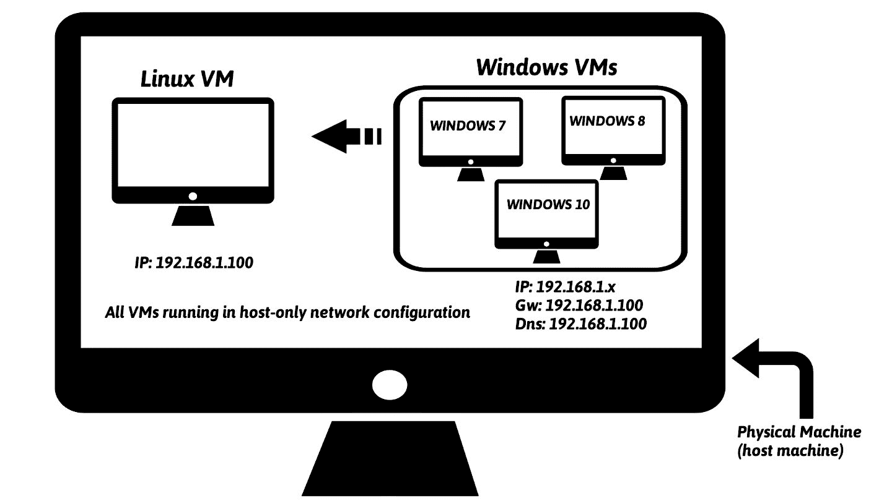
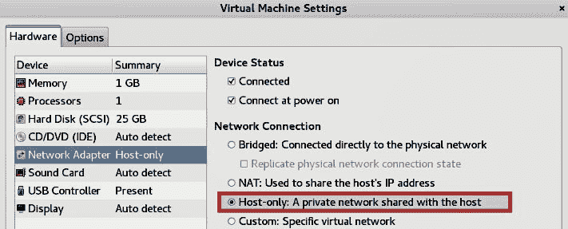
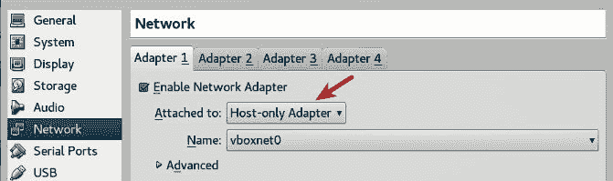
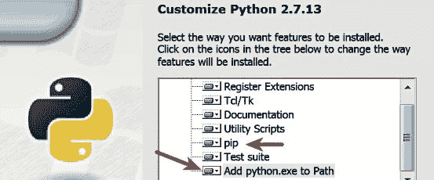
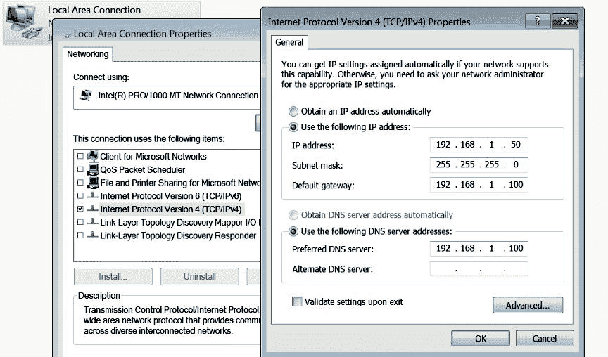
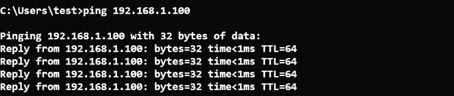
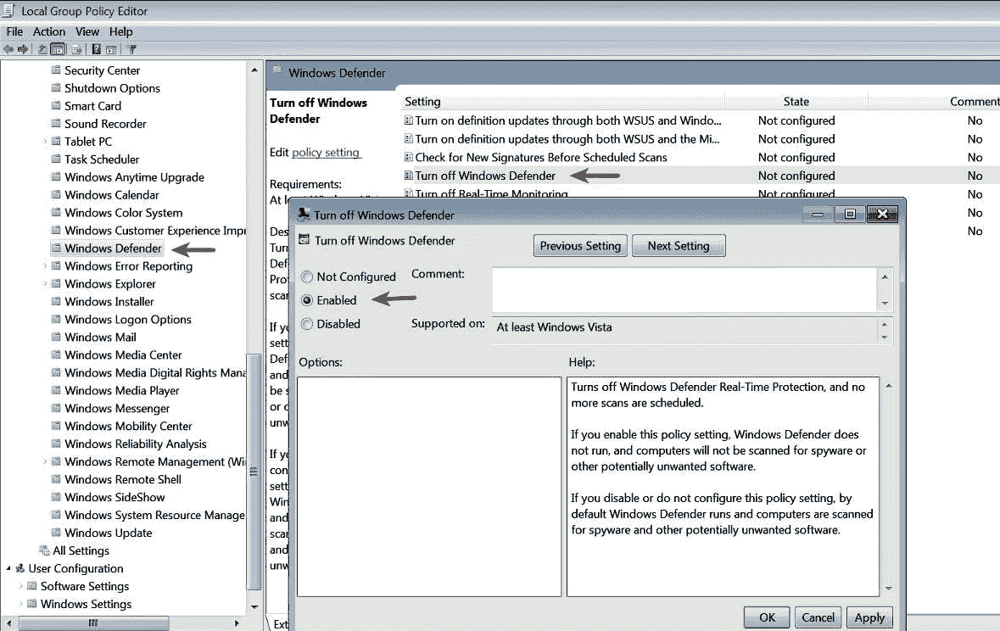

# 第一章：恶意软件分析简介

网络攻击数量无疑在增加，攻击目标包括政府、军事、公共和私营部门。这些网络攻击集中在攻击个人或组织，企图窃取有价值的信息。有时，这些网络攻击被认为与网络犯罪或国家支持的团体有关，但也可能是由个人团体为实现目标而实施的。这些网络攻击大多数使用恶意软件（也称为恶意程序）来感染目标。分析恶意软件所需的知识、技能和工具对于检测、调查和防御此类攻击至关重要。

在本章中，你将学习以下内容：

+   恶意软件的含义及其在网络攻击中的作用

+   恶意软件分析及其在数字取证中的重要性

+   不同类型的恶意软件分析

+   设置实验室环境

+   获取恶意软件样本的各种来源

# 1\. 什么是恶意软件？

恶意软件是执行恶意操作的代码；它可以是可执行文件、脚本、代码或任何其他软件。攻击者使用恶意软件来窃取敏感信息、监视感染的系统或控制该系统。它通常未经你同意便进入你的系统，可以通过多种通信渠道传播，如电子邮件、网页或 USB 驱动器。

以下是恶意软件执行的一些恶意操作：

+   干扰计算机操作

+   窃取敏感信息，包括个人、商业和财务数据

+   未经授权访问受害者的系统

+   监视受害者

+   发送垃圾邮件

+   参与分布式拒绝服务攻击（DDOS）

+   锁定计算机上的文件并勒索赎金

*恶意软件*是一个广泛的术语，指的是不同类型的恶意程序，如特洛伊木马、病毒、蠕虫和 Rootkit。在进行恶意软件分析时，你经常会遇到各种类型的恶意程序；这些恶意程序通常根据其功能和攻击方式进行分类，如下所示：

+   **病毒或蠕虫**：能够自我复制并传播到其他计算机的恶意软件。病毒需要用户干预，而蠕虫可以在没有用户干预的情况下传播。

+   **特洛伊木马**：一种伪装成普通程序的恶意软件，诱使用户将其安装到系统中。安装后，它可以执行恶意操作，如窃取敏感数据、将文件上传到攻击者的服务器或监控摄像头。

+   **后门 / 远程访问木马（RAT）**：这是一种*特洛伊木马*，它允许攻击者访问并执行被攻击系统上的命令。

+   **广告软件**：一种向用户展示不需要的广告（广告）的恶意软件。通常通过免费下载传播，并可以强制在你的系统上安装软件。

+   **僵尸网络**：这是一个由感染了相同恶意软件（称为*僵尸*）的计算机组成的群体，等待从攻击者控制的指挥与控制服务器接收指令。攻击者可以向这些僵尸发送命令，执行恶意活动，如分布式拒绝服务（DDOS）攻击或发送垃圾邮件。

+   **信息窃取器**：旨在窃取敏感数据（如银行凭证或键盘输入）从被感染系统的恶意软件。这些恶意程序的示例包括键盘记录器、间谍软件、嗅探器和表单抓取器。

+   **勒索软件**：通过将用户锁定在计算机外或加密文件来控制系统的恶意软件。

+   **Rootkit（根套件）**：恶意软件，能够为攻击者提供对被感染系统的特权访问，并隐藏其自身或其他软件的存在。

+   **下载器或投放器**：旨在下载或安装额外恶意软件组件的恶意软件。

有一个便捷的资源可以帮助了解恶意软件术语和定义，访问链接：[`blog.malwarebytes.com/glossary/`](https://blog.malwarebytes.com/glossary/)。

基于功能对恶意软件进行分类可能并不总是可行的，因为单一恶意软件可能包含多个功能，而这些功能可能属于刚才提到的多个类别。例如，恶意软件可能包括一个蠕虫组件，扫描网络寻找易受攻击的系统，并在成功利用后投放另一个恶意软件组件，如*后门*或*勒索软件*。

恶意软件分类也可以根据攻击者的动机进行。例如，如果恶意软件用于窃取个人、商业或专有信息以获取利润，则可以将其分类为**犯罪软件**或**商品恶意软件**。如果恶意软件用于针对特定组织或行业，窃取信息/收集情报以进行间谍活动，则可以将其分类为**定向恶意软件**或**间谍恶意软件**。

# 2. 什么是恶意软件分析？

恶意软件分析是研究恶意软件行为的过程。恶意软件分析的目的是了解恶意软件的工作原理，以及如何检测和消除它。它包括在安全环境中分析可疑的二进制文件，识别其特征和功能，从而构建更好的防御措施以保护组织的网络。

# 3. 为什么进行恶意软件分析？

执行恶意软件分析的主要动机是从恶意软件样本中提取信息，帮助应对恶意软件事件。恶意软件分析的目标是确定恶意软件的能力，检测它并将其隔离。它还帮助确定可识别的模式，这些模式可以用于治愈和防止未来的感染。以下是你进行恶意软件分析的一些原因：

+   确定恶意软件的性质和目的。例如，它可以帮助你判断恶意软件是否是信息窃取者、HTTP 机器人、垃圾邮件机器人、Rootkit、键盘记录器或 RAT 等。

+   了解系统是如何被攻破的及其影响。

+   识别与恶意软件相关的网络指标，这些指标可以用于通过网络监控检测类似的感染。例如，在你的分析过程中，如果你确定恶意软件与某个特定的*域名/IP 地址*进行通信，那么你可以使用这个域名/IP 地址创建一个签名，并监控网络流量，以识别所有与该域名/IP 地址通信的主机。

+   提取基于主机的指标，如文件名和注册表键，这些可以用于通过主机监控确定类似的感染。例如，如果你发现某个恶意软件创建了一个注册表键，你可以将这个注册表键作为一个指标，创建一个签名，或者扫描你的网络以识别具有相同注册表键的主机。

+   确定攻击者的意图和动机。例如，在你的分析过程中，如果发现恶意软件窃取银行凭证，那么你可以推断出攻击者的动机是为了经济利益。

威胁情报团队通常使用通过恶意软件分析确定的指标来分类攻击，并将其归类为已知的威胁。恶意软件分析可以帮助你获取关于谁可能是攻击背后的人（竞争对手、国家支持的攻击组织等）的信息。

# 4\. 恶意软件分析类型

要理解恶意软件的工作原理和特征，并评估其对系统的影响，通常需要使用不同的分析技术。以下是这些分析技术的分类：

+   **静态分析**：这是在不执行二进制文件的情况下分析其过程。它是最容易执行的，允许你提取与可疑二进制文件相关的元数据。静态分析可能不会揭示所有所需的信息，但有时能提供有趣的信息，帮助你确定接下来分析的重点。第二章，*静态分析*，涵盖了使用静态分析从恶意软件二进制文件中提取有用信息的工具和技术。

+   **动态分析（行为分析）**：这是在隔离环境中执行可疑二进制文件并监控其行为的过程。此分析技术容易执行，并且可以提供二进制文件执行过程中的活动的有价值的洞察。该分析技术有用，但不能揭示恶意程序的所有功能。第三章，*动态分析*，涵盖了使用动态分析确定恶意软件行为的工具和技术。

+   **代码分析**：这是一种高级技术，专注于分析代码以理解二进制文件的内部工作原理。这项技术揭示了仅通过静态和动态分析无法得出的信息。代码分析进一步分为*静态代码分析*和*动态代码分析*。*静态代码分析*包括反汇编可疑的二进制文件，并查看代码以理解程序的行为，而*动态代码分析*则是在受控环境中调试可疑的二进制文件，以理解其功能。代码分析需要了解编程语言和操作系统的概念。接下来的章节（*第 4 到第九章*）将介绍执行代码分析所需的知识、工具和技术。

+   **内存分析（内存取证）**：这是分析计算机 RAM 中的取证痕迹的技术。通常这是一种取证技术，但将其整合到恶意软件分析中将有助于了解恶意软件感染后的行为。内存分析对于确定恶意软件的隐蔽性和回避能力特别有用。在随后的章节中（*第 10 和第十一章*），你将学习如何进行内存分析。

在进行恶意软件分析时，整合不同的分析技术可以揭示大量的上下文信息，这对你的恶意软件调查将非常有价值。

# 5. 设置实验室环境

恶意程序的分析需要一个安全的实验室环境，因为你不希望感染你的系统或生产系统。恶意软件实验室可以根据可用资源（硬件、虚拟化软件、Windows 许可证等）来设立得很简单或很复杂。本节将指导你在单一物理系统上设置一个简单的个人实验室，实验室由*虚拟机（VMs）*组成。如果你希望设置一个类似的实验室环境，可以随时跟着操作，或者跳到下一节（*第六部分：恶意软件来源*）。

# 5.1 实验室需求

在开始搭建实验室之前，你需要一些组件：一个运行基础操作系统*Linux*、*Windows*或*macOS X*的*物理系统*，并安装虚拟化软件（如*VMware*或*VirtualBox*）。在分析恶意软件时，你将会在基于 Windows 的虚拟机（Windows VM）上执行恶意软件。使用虚拟机的好处是，在完成恶意软件分析后，你可以将其恢复到干净的状态。

*VMware Workstation*（适用于 Windows 和 Linux）可从 [`www.vmware.com/products/workstation/workstation-evaluation.html`](https://www.vmware.com/products/workstation/workstation-evaluation.html) 下载，*VMware Fusion*（适用于 macOS X）可从 [`www.vmware.com/products/fusion/fusion-evaluation.html`](https://www.vmware.com/products/fusion/fusion-evaluation.html) 下载，适用于不同操作系统版本的 VirtualBox 可从 [`www.virtualbox.org/wiki/Downloads`](https://www.virtualbox.org/wiki/Downloads) 下载。

为了创建一个安全的实验室环境，你应该采取必要的预防措施，避免恶意软件从虚拟化环境中逃逸并感染你的物理（主机）系统。以下是设置虚拟化实验室时需要记住的几点：

+   保持你的虚拟化软件更新。这是必要的，因为恶意软件可能会利用虚拟化软件中的漏洞，从虚拟环境逃逸并感染主机系统。

+   在虚拟机（VM）内安装一个全新的操作系统副本，并且不要在虚拟机中存放任何敏感信息。

+   在分析恶意软件时，如果你不希望恶意软件连接到互联网，那么你应该考虑使用 *仅主机* 网络配置模式，或通过使用模拟服务将你的网络流量限制在实验室环境内。

+   不要连接任何可能后来用于物理机器的可移动媒体，如 USB 驱动器。

+   由于你将分析 Windows 恶意软件（通常是可执行文件或 DLL），建议为主机机器选择一个基础操作系统，如 Linux 或 macOS X，而不是 Windows。这是因为即使 Windows 恶意软件从虚拟机逃逸，它仍然无法感染你的主机机器。

# 5.2 实验室架构概述

本书中将使用的实验室架构包括一台运行 *Ubuntu Linux* 的 *物理机器（称为主机机器）*，以及多个 *Linux 虚拟机（Ubuntu Linux 虚拟机）* 和 *Windows 虚拟机（Windows 虚拟机）* 实例。这些虚拟机会配置在同一网络中，并使用 *仅主机* 网络配置模式，以确保恶意软件无法连接互联网，且网络流量被隔离在实验室环境内。

*Windows 虚拟机* 是分析过程中执行恶意软件的地方，而 *Linux 虚拟机* 用于监控网络流量，并将配置为模拟互联网服务（如 DNS、HTTP 等），以便在恶意软件请求这些服务时提供适当的响应。例如，Linux 虚拟机会被配置为当恶意软件请求 DNS 服务时，提供正确的 DNS 响应。第三章，*动态分析*，详细介绍了这一概念。

以下图显示了一个简单的实验室架构示例，我将在本书中使用。在此设置中，*Linux 虚拟机* 将预配置为 IP 地址 `192.168.1.100`，而 *Windows 虚拟机* 的 IP 地址将设置为 `192.168.1.x`（其中 x 为 `1` 到 `254` 之间的任何数字，除了 `100`）。Windows 虚拟机的默认网关和 DNS 将设置为 Linux 虚拟机的 IP 地址（即 `192.168.1.100`），以便所有 Windows 网络流量都通过 Linux 虚拟机路由。接下来的部分将指导您设置 Linux 虚拟机和 Windows 虚拟机以匹配此设置。

您不必局限于前面图示的实验室架构；可以有不同的实验室配置，无法为每种可能的配置提供说明。在本书中，我将向您展示如何设置并使用前述图中的实验室架构。

也可以设置一个包含多个运行不同版本 Windows 的虚拟机的实验室；这样可以在不同版本的 Windows 操作系统上分析恶意软件样本。包含多个 Windows 虚拟机的示例配置类似于以下图所示：



# 5.3 设置和配置 Linux 虚拟机

要设置 Linux 虚拟机，我将使用 *Ubuntu 16.04.2 LTS* Linux 发行版 ([`releases.ubuntu.com/16.04/`](http://releases.ubuntu.com/16.04/))。我选择 Ubuntu 的原因是，本书中涉及的大多数工具要么已经预安装，要么可以通过 *apt-get* 包管理器获得。以下是配置 *Ubuntu 16.04.2 LTS* 在 *VMware* 和 *VirtualBox* 上的逐步流程。根据您系统上安装的虚拟化软件（*VMware* 或 *VirtualBox*），可以自由遵循此处提供的说明：

如果您不熟悉安装和配置虚拟机，请参考 VMware 的指南：[`pubs.vmware.com/workstation-12/topic/com.vmware.ICbase/PDF/workstation-pro-12-user-guide.pdf`](http://pubs.vmware.com/workstation-12/topic/com.vmware.ICbase/PDF/workstation-pro-12-user-guide.pdf) 或 VirtualBox 用户手册 ([`www.virtualbox.org/manual/UserManual.html`](https://www.virtualbox.org/manual/UserManual.html))。

1.  从 [`releases.ubuntu.com/16.04/`](http://releases.ubuntu.com/16.04/) 下载 Ubuntu 16.04.2 LTS，并将其安装到 VMware Workstation/Fusion 或 VirtualBox 中。如果您希望安装其他版本的 Ubuntu Linux，只要您能够安装包并解决依赖问题，您可以自由选择。

1.  在 Ubuntu 上安装 *虚拟化工具*；这将允许 Ubuntu 的屏幕分辨率自动调整以匹配你的显示器几何形状，并提供额外的增强功能，例如能够共享剪贴板内容，以及在主机和 *Linux 虚拟机* 之间进行复制/粘贴或拖放文件。要在 VMware Workstation 或 VMware Fusion 上安装虚拟化工具，你可以按照[此链接](https://kb.vmware.com/selfservice/microsites/search.do?language=en_US&cmd=displayKC&externalId=1022525)中的步骤，或观看[此视频](https://youtu.be/ueM1dCk3o58)。安装完成后，重启系统。

1.  如果你使用的是 *VirtualBox*，你必须安装 *Guest Additions 软件*。为此，在 VirtualBox 菜单中选择 设备 | 插入客户机附加 CD 镜像。这将打开 Guest Additions 对话框。然后点击运行以从虚拟 CD 调用安装程序。提示时输入密码并重启系统。

1.  一旦 Ubuntu 操作系统和虚拟化工具安装完成，启动 Ubuntu 虚拟机并安装以下工具和包。

1.  安装 *pip*；pip 是一个包管理系统，用于安装和管理用 Python 编写的包。在本书中，我将运行一些 Python 脚本，其中一些依赖于第三方库。为了自动化安装第三方包，你需要安装 *pip*。在终端运行以下命令来安装并升级 *pip*：

```
$ sudo apt-get update
$ sudo apt-get install python-pip
$ pip install --upgrade pip
```

以下是本书中将使用的一些工具和 Python 包。要安装这些工具和 Python 包，请在终端中运行以下命令：

```
$ sudo apt-get install python-magic
$ sudo apt-get install upx
$ sudo pip install pefile
$ sudo apt-get install yara
$ sudo pip install yara-python
$ sudo apt-get install ssdeep
$ sudo apt-get install build-essential libffi-dev python python-dev \ libfuzzy-dev
$ sudo pip install ssdeep
$ sudo apt-get install wireshark
$ sudo apt-get install tshark
```

1.  *INetSim* ([`www.inetsim.org/index.html`](http://www.inetsim.org/index.html)) 是一个强大的工具，可以模拟恶意软件常常需要与之交互的各种互联网服务（例如 DNS 和 HTTP）。稍后，你将了解如何配置 *INetSim* 来模拟这些服务。要安装 INetSim，请使用以下命令。INetSim 的使用将在第三章中详细介绍，标题为 *动态分析*。如果你在安装 INetSim 时遇到困难，请参考文档 ([`www.inetsim.org/packages.html`](http://www.inetsim.org/packages.html))：

```
$ sudo su 
# echo "deb http://www.inetsim.org/debian/ binary/" > \ /etc/apt/sources.list.d/inetsim.list
# wget -O - http://www.inetsim.org/inetsim-archive-signing-key.asc | \ 
apt-key add -
# apt update
# apt-get install inetsim
```

1.  现在，你可以通过配置虚拟设备使用 *Host-only* 网络模式来隔离 Ubuntu 虚拟机。在 *VMware* 中，打开网络适配器设置并选择 Host-only 模式，如下图所示。保存设置并重启虚拟机。



在 VirtualBox 中，关闭 *Ubuntu 虚拟机*，然后打开设置。选择网络并将适配器设置更改为 Host-only Adapter，如下图所示；点击确定。

在 VirtualBox 中，有时选择 Host-only 适配器选项时，接口名称可能显示为*未选择*。在这种情况下，你需要首先通过导航到文件|首选项|网络|Host-only 网络|添加 Host-only 网络来创建至少一个 Host-only 接口。点击确定，然后**b**ring 上设置。选择网络并将适配器设置更改为 Host-only 适配器，如下图所示。点击确定。

1.  现在我们将为 Ubuntu Linux 虚拟机分配一个静态 IP 地址`192.168.1.100`。为此，启动 Linux 虚拟机，打开终端窗口，输入命令`ifconfig`，并记录下接口名称。在我的情况下，接口名称是`ens33`。在你的情况下，接口名称可能会有所不同。如果不同，你需要根据以下步骤做出相应的更改**。** 使用以下命令打开`/etc/network/interfaces`文件：

```
$ sudo gedit /etc/network/interfaces
```

在文件末尾添加以下条目（确保将`ens33`替换为系统中的接口名称），并保存文件：

```
auto ens33
iface ens33 inet static
address 192.168.1.100
netmask 255.255.255.0
```

`/etc/network/interfaces`文件现在应如下所示。新增的条目已在此高亮显示：

```
# interfaces(5) file used by ifup(8) and ifdown(8)
auto lo
iface lo inet loopback

auto ens33
iface ens33 inet static
address 192.168.1.100
netmask 255.255.255.0
```

然后重新启动 Ubuntu Linux 虚拟机。此时，Ubuntu 虚拟机的 IP 地址应已设置为`192.168.1.100`。你可以通过运行以下命令来验证：

```
$ ifconfig
ens33 Link encap:Ethernet HWaddr 00:0c:29:a8:28:0d 
inet addr:192.168.1.100 Bcast:192.168.1.255 Mask:255.255.255.0
inet6 addr: fe80::20c:29ff:fea8:280d/64 Scope:Link
UP BROADCAST RUNNING MULTICAST MTU:1500 Metric:1
RX packets:21 errors:0 dropped:0 overruns:0 frame:0
TX packets:49 errors:0 dropped:0 overruns:0 carrier:0
collisions:0 txqueuelen:1000 
RX bytes:5187 (5.1 KB) TX bytes:5590 (5.5 KB)
```

1.  下一步是配置*INetSim*，使其能够在配置的 IP 地址`192.168.1.100`上监听并模拟所有服务。默认情况下，它监听本地接口（`127.0.0.1`），需要将其更改为`192.168.1.100`。为此，使用以下命令打开位于`/etc/inetsim/inetsim.conf`的配置文件：

```
$ sudo gedit /etc/inetsim/inetsim.conf
```

转到配置文件中的`service_bind_address`部分，并添加以下条目：

```
service_bind_address   192.168.1.100
```

配置文件中添加的条目（高亮显示）应如下所示：

```
# service_bind_address
#
# IP address to bind services to
#
# Syntax: service_bind_address <IP address>
#
# Default: 127.0.0.1
#
#service_bind_address 10.10.10.1
service_bind_address 192.168.1.100
```

默认情况下，INetSim 的 DNS 服务器会将所有域名解析到`127.0.0.1`。我们希望将域名解析到`192.168.1.100`（Linux 虚拟机的 IP 地址）。为此，转到配置文件中的`dns_default_ip`部分，并添加如下所示的条目：

```
dns_default_ip  192.168.1.100
```

配置文件中添加的条目（在以下代码中高亮显示）应如下所示：

```
# dns_default_ip
#
# Default IP address to return with DNS replies
#
# Syntax: dns_default_ip <IP address>
#
# Default: 127.0.0.1
#
#dns_default_ip 10.10.10.1
dns_default_ip 192.168.1.100
```

配置更改完成后，保存配置文件并启动 INetSim 主程序。验证所有服务是否正常运行，并检查`inetsim`是否在`192.168.1.100`上监听，如以下代码中高亮显示的那样。你可以通过按*CTRL+C*停止服务：

```
$ sudo inetsim
INetSim 1.2.6 (2016-08-29) by Matthias Eckert & Thomas Hungenberg
Using log directory: /var/log/inetsim/
Using data directory: /var/lib/inetsim/
Using report directory: /var/log/inetsim/report/
Using configuration file: /etc/inetsim/inetsim.conf
=== INetSim main process started (PID 2640) ===
Session ID: 2640
Listening on: 192.168.1.100
Real Date/Time: 2017-07-08 07:26:02
Fake Date/Time: 2017-07-08 07:26:02 (Delta: 0 seconds)
 Forking services...
 * irc_6667_tcp - started (PID 2652)
 * ntp_123_udp - started (PID 2653)
 * ident_113_tcp - started (PID 2655)
 * time_37_tcp - started (PID 2657)
 * daytime_13_tcp - started (PID 2659)
 * discard_9_tcp - started (PID 2663)
 * echo_7_tcp - started (PID 2661)
 * dns_53_tcp_udp - started (PID 2642)
 [..........REMOVED.............]
 * http_80_tcp - started (PID 2643)
 * https_443_tcp - started (PID 2644)
 done.
Simulation running.
```

1.  有时，你需要在主机和虚拟机之间传输文件。要在*VMware*上启用此功能，请关闭虚拟机并打开设置。选择选项|访客隔离，然后勾选启用拖放和启用复制粘贴。保存设置。

在 *Virtualbox* 中，当虚拟机处于关闭状态时，进入设置 | 常规 | 高级，确保共享剪贴板和拖放功能都设置为双向。点击 OK 保存设置。

1.  此时，Linux 虚拟机已配置为使用 Host-only 模式，并且 INetSim 已设置为模拟所有服务。最后一步是创建一个快照（干净快照），并给它取一个你选择的名称，这样你在需要时可以将其恢复到干净的状态。在 VMware Workstation 中，点击 VM | Snapshot | Take Snapshot 来创建快照。在 VirtualBox 中，同样可以通过点击 Machine | Take Snapshot 来完成。

除了 *拖放* 功能外，还可以通过共享文件夹将文件从宿主机传输到虚拟机；有关 VirtualBox 的说明，请参考以下链接（[`www.virtualbox.org/manual/ch04.html#sharedfolders`](https://www.virtualbox.org/manual/ch04.html#sharedfolders)），有关 VMware 的说明，请参考以下链接（[`docs.vmware.com/en/VMware-Workstation-Pro/14.0/com.vmware.ws.using.doc/GUID-AACE0935-4B43-43BA-A935-FC71ABA17803.html`](https://docs.vmware.com/en/VMware-Workstation-Pro/14.0/com.vmware.ws.using.doc/GUID-AACE0935-4B43-43BA-A935-FC71ABA17803.html)）。

# 5.4 设置和配置 Windows 虚拟机

在设置 Windows 虚拟机之前，首先需要在虚拟化软件（如 VMware 或 VirtualBox）中安装你选择的 Windows 操作系统（例如 Windows 7、Windows 8 等）。安装 Windows 后，按照以下步骤操作：

1.  从 [`www.python.org/downloads/`](https://www.python.org/downloads/) 下载 Python。确保下载 *Python 2.7.x* 版本（例如 2.7.13）；本书中使用的大多数脚本是为 Python 2.7 版本编写的，可能无法在 Python 3 中正确运行。下载文件后，运行安装程序。确保勾选安装 pip 以及将 python.exe 添加到路径中的选项，如下截图所示。安装 pip 可以方便地安装任何第三方 Python 库，添加 Python 到路径中则可以在任何位置运行 Python。



1.  将 Windows 虚拟机配置为使用 Host-only 网络配置模式。要在 VMware 或 VirtualBox 中做到这一点，请打开网络设置并选择 Host-only 模式；保存设置后重启虚拟机 **（此步骤类似于 *设置和配置 Linux 虚拟机* 部分的内容）**。

1.  将 Windows 虚拟机的 IP 地址配置为 `192.168.1.x`（选择任何 IP 地址，但不能是 `192.168.1.100`，因为该 IP 已配置给 Linux 虚拟机使用），并将默认网关和 DNS 服务器设置为 Linux 虚拟机的 IP 地址（即 `192.168.1.100`），如下面的截图所示*。* 这样配置是为了在我们执行 Windows 虚拟机上的恶意程序时，所有的网络流量都会通过 Linux 虚拟机进行转发。



1.  启动 Linux 虚拟机和 Windows 虚拟机，并确保它们可以相互通信。您可以通过运行 ping 命令来检查连接性，如此屏幕截图所示：



1.  Windows Defender 服务需要在您的 Windows 虚拟机上禁用，因为在执行恶意软件样本时可能会产生干扰。要做到这一点，请按下*Windows 键 + R*打开运行菜单，输入*gpedit.msc*，然后按*Enter*启动本地组策略编辑器。在本地组策略编辑器的左侧窗格中，导航至计算机配置 | 管理模板 | Windows 组件 | Windows Defender。在右侧窗格中，双击“关闭 Windows Defender 策略”进行编辑；然后选择启用并点击确定：



1.  为了能够在主机机器和 Windows 虚拟机之间传输文件（拖放）和复制剪贴板内容，请按照*Linux 虚拟机设置和配置*部分的*第 7 步*中提到的说明进行操作。

1.  创建一个干净的快照，以便在每次分析后恢复到原始/干净状态。拍摄快照的步骤在*Linux 虚拟机设置和配置*部分的*第 10 步*中已经介绍过。

此时，您的实验环境应该已经准备就绪。您的干净快照中的 Linux 和 Windows 虚拟机应该处于仅主机网络模式，并且应该能够彼此通信。在本书中，我将介绍各种恶意软件分析工具；如果您希望使用这些工具，您可以将它们复制到虚拟机上的干净快照中。为了保持您的干净快照最新，只需将这些工具传输/安装到虚拟机上，并创建一个新的干净快照。

# 6\. 恶意软件来源

一旦您建立了实验室，您将需要恶意软件样本进行分析。在本书中，我在示例中使用了各种恶意软件样本，由于这些样本来自真实攻击，我决定不随书分发它们，因为分发此类样本可能存在法律问题。您可以通过搜索各种恶意软件存储库来找到它们（或类似样本）。以下是一些可以获取用于分析的恶意软件样本的来源。其中一些来源允许您免费下载恶意软件样本（或免费注册后），而一些则要求您联系所有者建立账户，之后您将能够获取样本：

+   *Hybrid Analysis*: [`www.hybrid-analysis.com/`](https://www.hybrid-analysis.com/)

+   *KernelMode.info*: [`www.kernelmode.info/forum/viewforum.php?f=16`](http://www.kernelmode.info/forum/viewforum.php?f=16)

+   *VirusBay*: [`beta.virusbay.io/`](https://beta.virusbay.io/)

+   *Contagio malware dump*: [`contagiodump.blogspot.com/`](http://contagiodump.blogspot.com/)

+   *AVCaesar*: [`avcaesar.malware.lu/`](https://avcaesar.malware.lu/)

+   *Malwr*: [`malwr.com/`](https://malwr.com/)

+   *VirusShare*: [`virusshare.com/`](https://virusshare.com/)

+   *theZoo*: [`thezoo.morirt.com/`](http://thezoo.morirt.com/)

你可以在 Lenny Zeltser 的博客文章中找到指向其他各种恶意软件来源的链接，网址为[`zeltser.com/malware-sample-sources/`](https://zeltser.com/malware-sample-sources/)。

如果上述方法都不适用，并且你希望获取本书中使用的恶意软件样本，请随时联系作者。

# 概述

在分析恶意程序之前，建立一个隔离的实验室环境至关重要。在进行恶意软件分析时，你通常会运行敌对代码以观察其行为，因此，拥有一个隔离的实验室环境将防止恶意代码意外传播到你的系统或网络中的生产系统。在下一章中，你将学习如何使用*静态分析*提取恶意软件样本中的有价值信息。
