# 第二章：静态分析

静态分析是分析可疑文件的一种技术，无需执行它。这是一种初步的分析方法，涉及从可疑二进制文件中提取有用的信息，以便做出明智的决策，决定如何分类或分析它，以及接下来分析工作的重点。本章将介绍多种工具和技术，用于从可疑二进制文件中提取有价值的信息。

本章将学习以下内容：

+   识别恶意软件的目标架构

+   病毒指纹识别

+   使用杀毒引擎扫描可疑二进制文件

+   提取与文件相关的字符串、函数和元数据

+   识别用来阻碍分析的混淆技术

+   分类和比较恶意软件样本

这些技术可以揭示关于文件的不同信息。并不要求必须遵循所有这些技术，也不需要按呈现的顺序来执行。使用哪些技术取决于你的目标和可疑文件周围的上下文。

# 1. 确定文件类型

在分析过程中，确定可疑二进制文件的文件类型将帮助你识别恶意软件的目标操作系统（如 Windows、Linux 等）和架构（32 位或 64 位平台）。例如，如果可疑的二进制文件是*Portable Executable*（*PE*）文件类型，这是 Windows 可执行文件（`.exe`、`.dll`、`.sys`、`.drv`、`.com`、`.ocx`等）的文件格式，那么你可以推测该文件是为 Windows 操作系统设计的。

大多数基于 Windows 的恶意软件都是以`.exe`、`.dll`、`.sys`等扩展名结尾的可执行文件。但仅仅依靠文件扩展名是不推荐的。文件扩展名并不是文件类型的唯一指标。攻击者通过修改文件扩展名和改变文件外观，利用各种技巧隐藏其文件，诱使用户执行它。与其依赖文件扩展名，不如使用*文件签名*来确定文件类型。

*文件签名*是写入文件头部的唯一字节序列。不同的文件具有不同的签名，可以用来识别文件的类型。Windows 可执行文件，也叫做*PE 文件*（例如以`.exe`、`.dll`、`.com`、`.drv`、`.sys`等结尾的文件），其文件签名是`MZ`或十六进制字符`4D 5A`，位于文件的前两个字节。

一个方便的资源可以帮助确定不同文件类型的文件签名，基于它们的扩展名，网址为[`www.filesignatures.net/`](http://www.filesignatures.net/)。

# 1.1 使用手动方法识别文件类型

确定文件类型的手动方法是通过在十六进制编辑器中打开文件查找 *文件签名*。*十六进制编辑器* 是一种工具，它允许检查人员检查文件的每个字节；大多数十六进制编辑器提供许多功能，帮助分析文件。以下截图展示了使用 *HxD 十六进制编辑器*（[`mh-nexus.de/en/hxd/`](https://mh-nexus.de/en/hxd/)）打开可执行文件时，前两个字节中的文件签名 `MZ`：

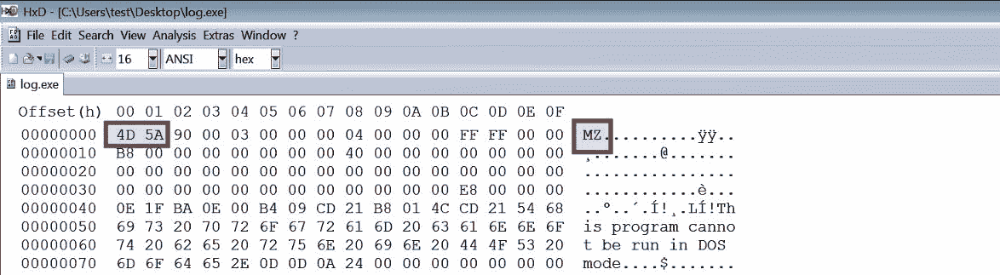在选择 Windows 的十六进制编辑器时，你有很多选项；这些十六进制编辑器提供不同的功能。有关各种十六进制编辑器的列表和比较，请参阅此链接：[`en.wikipedia.org/wiki/Comparison_of_hex_editors`](https://en.wikipedia.org/wiki/Comparison_of_hex_editors)。

在 Linux 系统中，要查找文件签名，可以使用 `xxd` 命令，它会生成文件的十六进制转储，如下所示：

```
$ xxd -g 1 log.exe | more
0000000: 4d 5a 90 00 03 00 00 00 04 00 00 00 ff ff 00 00  MZ..............
0000010: b8 00 00 00 00 00 00 00 40 00 00 00 00 00 00 00  ........@.......
0000020: 00 00 00 00 00 00 00 00 00 00 00 00 00 00 00 00  ................
0000030: 00 00 00 00 00 00 00 00 00 00 00 00 e8 00 00 00  ................
```

# 1.2 使用工具识别文件类型

另一种便捷的确定文件类型的方法是使用文件识别工具。在 Linux 系统中，可以使用 *file* 实用程序来实现。以下示例中，`file` 命令被应用于两个不同的文件。从输出结果可以看出，尽管第一个文件没有任何扩展名，但它被识别为一个 32 位可执行文件（`PE32`），而第二个文件则是一个 64 位（`PE32+`）可执行文件：

```
$ file mini
mini: PE32 executable (GUI) Intel 80386, for MS Windows

$ file notepad.exe
notepad.exe: PE32+ executable (GUI) x86-64, for MS Windows
```

在 Windows 上，*CFF Explorer*（属于 *Explorer Suite*）([`www.ntcore.com/exsuite.php`](http://www.ntcore.com/exsuite.php)) 可以用来确定文件类型；它不仅限于确定文件类型，还可以作为一个出色的工具来检查可执行文件（包括 32 位和 64 位），并允许你检查 PE 内部结构、修改字段和提取资源。

# 1.3 使用 Python 确定文件类型

在 Python 中，`python-magic` 模块可以用来确定文件类型。在 Ubuntu Linux 虚拟机上安装此模块的过程在第一章，*恶意软件分析介绍*中已有介绍。在 Windows 上，要安装 `python-magic` 模块，可以按照[`github.com/ahupp/python-magic`](https://github.com/ahupp/python-magic)中提到的步骤进行操作。

安装 `python-magic` 后，可以在脚本中使用以下命令来确定文件类型：

```
$ python Python 2.7.12 (default, Nov 19 2016, 06:48:10) >>> import magic
>>> m = magic.open(magic.MAGIC_NONE)
>>> m.load()
>>> ftype = m.file(r'log.exe')
>>> print ftype
PE32 executable (GUI) Intel 80386, for MS Windows
```

为了演示如何检测文件类型，我们以一个文件为例，该文件通过将扩展名从 `.exe` 改为 `.doc.exe`，被伪装成一个 *Word 文档*。在这种情况下，攻击者利用了默认情况下 *“隐藏已知文件类型的扩展名”* 在 *“Windows 文件夹选项”* 中启用的事实；该选项会阻止文件扩展名显示给用户。以下截图展示了启用 *“隐藏已知文件类型的扩展名”* 后文件的外观：

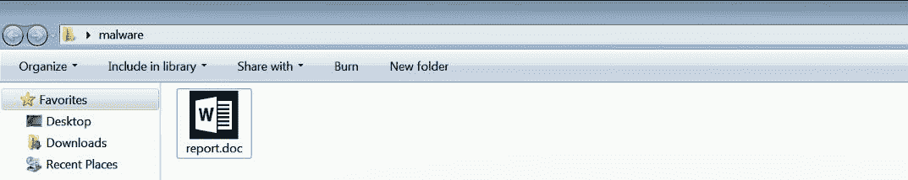

打开 *CFF Explorer* 文件后，可以发现它是一个 32 位的可执行文件，而不是一个 Word 文档，如下所示：

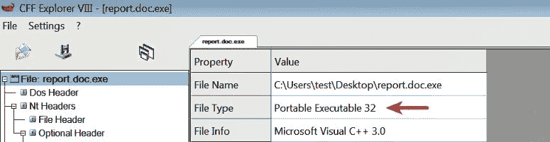

# 2. 指纹识别恶意软件

指纹识别涉及基于文件内容生成可疑二进制文件的加密哈希值。加密哈希算法，如 *MD5*、*SHA1* 或 *SHA256*，被认为是生成恶意软件样本文件哈希的事实标准。以下列表概述了加密哈希值的用途：

+   仅根据文件名识别恶意软件样本是无效的，因为同一恶意软件样本可能会使用不同的文件名，但基于文件内容计算的加密哈希值始终保持不变。因此，针对可疑文件的加密哈希值在整个分析过程中充当独特的标识符。

+   在动态分析过程中，当恶意软件被执行时，它可能会将自身复制到另一个位置，或释放另一个恶意软件。拥有样本的加密哈希值可以帮助确定新释放/复制的样本是否与原始样本相同，或是否是不同的样本。这些信息有助于你决定分析是只针对一个样本进行，还是需要分析多个样本。

+   文件哈希值常常作为与其他安全研究人员共享的指标，帮助他们识别样本。

+   文件哈希值可以用来确定该样本是否曾经被在线搜索或在多个反病毒扫描服务的数据库中检测到，如 *VirusTotal*。

# 2.1 使用工具生成加密哈希值

在 Linux 系统中，可以使用 `md5sum`、`sha256sum` 和 `sha1sum` 工具生成文件哈希值：

```
$ md5sum log.exe
6e4e030fbd2ee786e1b6b758d5897316  log.exe

$ sha256sum log.exe
01636faaae739655bf88b39d21834b7dac923386d2b52efb4142cb278061f97f  log.exe

$ sha1sum log.exe
625644bacf83a889038e4a283d29204edc0e9b65  log.exe
```

对于 Windows，许多生成文件哈希值的工具可以在网上找到。*HashMyFiles* ([`www.nirsoft.net/utils/hash_my_files.html`](http://www.nirsoft.net/utils/hash_my_files.html)) 就是其中一个工具，可以生成单个或多个文件的哈希值，并且它还会用相同的颜色高亮显示相同的哈希值。在下图中，可以看到 `log.exe` 和 `bunny.exe` 根据其哈希值是相同的样本：

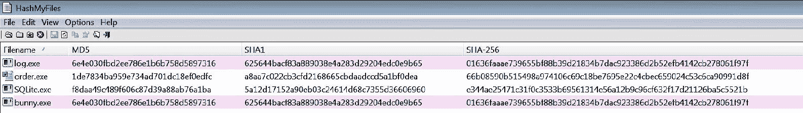 你可以在这里查看各种哈希工具的列表及对比：[`en.wikipedia.org/wiki/Comparison_of_file_verification_software`](https://en.wikipedia.org/wiki/Comparison_of_file_verification_software#Program_hash_function_support)。在仔细审查后，选择最适合你需求的工具。

# 2.2 使用 Python 确定加密哈希值

在 Python 中，可以使用 `hashlib` 模块生成文件哈希值，如下所示：

```
$ python
Python 2.7.12 (default, Nov 19 2016, 06:48:10)
>>> import hashlib
>>> content = open(r"log.exe","rb").read()
>>> print hashlib.md5(content).hexdigest()
6e4e030fbd2ee786e1b6b758d5897316
>>> print hashlib.sha256(content).hexdigest()
01636faaae739655bf88b39d21834b7dac923386d2b52efb4142cb278061f97f
>>> print hashlib.sha1(content).hexdigest()
625644bacf83a889038e4a283d29204edc0e9b65
```

# 3. 多重反病毒扫描

使用多个杀毒软件扫描可疑的二进制文件有助于确定该文件是否含有恶意代码签名。特定文件的签名名称可以提供有关该文件及其功能的更多信息。通过访问相应的杀毒软件供应商网站或在搜索引擎中搜索该签名，你可以获得关于可疑文件的更多细节。这些信息可以帮助你后续的调查，并缩短分析时间。

# 3.1 使用 VirusTotal 扫描可疑二进制文件

*VirusTotal* ([`www.virustotal.com`](http://www.virustotal.com)) 是一个流行的基于 Web 的恶意软件扫描服务。它允许你上传文件，然后使用各种杀毒软件扫描该文件，扫描结果会实时显示在网页上。除了上传文件进行扫描外，VirusTotal 的网页界面还提供了通过 *哈希值*、*URL*、*域名* 或 *IP 地址* 搜索其数据库的功能。VirusTotal 还提供了一个名为 *VirusTotal Graph* 的有用功能，它建立在 VirusTotal 数据集之上。使用 VirusTotal Graph，你可以可视化你提交的文件与其相关指标（如 *域名*、*IP 地址* 和 *URL*）之间的关系。它还允许你在每个指标之间进行切换和浏览；如果你想快速确定与恶意二进制文件相关的指标，这个功能非常有用。有关 *VirusTotal Graph* 的更多信息，请参考文档：[`support.virustotal.com/hc/en-us/articles/115005002585-VirusTotal-Graph`](https://support.virustotal.com/hc/en-us/articles/115005002585-VirusTotal-Graph)。

以下截图显示了恶意二进制文件的检测名称，可以看到该二进制文件已通过 67 个杀毒引擎进行扫描，其中 60 个引擎检测到该二进制文件为恶意文件。如果你希望在二进制文件上使用*VirusTotal Graph*来可视化指标关系，只需点击 VirusTotal Graph 图标并使用你的 VirusTotal（社区）账户登录：

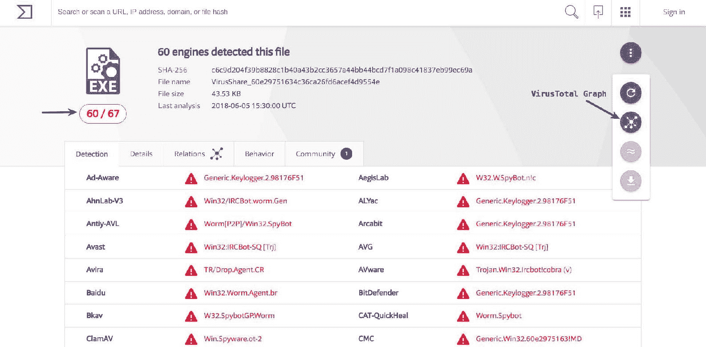VirusTotal 提供不同的私人（付费）服务 ([`support.virustotal.com/hc/en-us/articles/115003886005-Private-Services`](https://support.virustotal.com/hc/en-us/articles/115003886005-Private-Services))，这些服务允许你进行威胁狩猎并下载提交给它的样本。

# 3.2 使用 VirusTotal 公共 API 查询哈希值

VirusTotal 还通过其公共 API 提供脚本功能 ([`www.virustotal.com/en/documentation/public-api/`](https://www.virustotal.com/en/documentation/public-api/))；它允许你自动提交文件，检索文件/URL 扫描报告，以及检索域名/IP 报告。

以下是一个展示如何使用 VirusTotal 公共 API 的 Python 脚本。该脚本以哈希值（*MD5/SHA1/SHA256*）作为输入，并查询 VirusTotal 数据库。要使用以下脚本，你需要使用*Python 2.7.x*版本；必须连接到互联网，并且必须有一个 VirusTotal 公共 API 密钥（可以通过注册*VirusTotal*帐户获得）。一旦你获得了 API 密钥，只需更新`api_key`变量中的 API 密钥：

以下脚本和本书中大多数脚本用于演示概念；它们没有执行输入验证或错误处理。如果你希望将它们用于生产环境，应该考虑修改脚本，遵循这里提到的最佳实践：[`www.python.org/dev/peps/pep-0008/`](https://www.python.org/dev/peps/pep-0008/)。

```
import urllib
import urllib2
import json
import sys

hash_value = sys.argv[1]
vt_url = "https://www.virustotal.com/vtapi/v2/file/report"
api_key = "<update your api key here>"
parameters = {'apikey': api_key, 'resource': hash_value}
encoded_parameters = urllib.urlencode(parameters)
request = urllib2.Request(vt_url, encoded_parameters)
response = urllib2.urlopen(request)
json_response = json.loads(response.read())
if json_response['response_code']:
    detections = json_response['positives']
    total = json_response['total']
    scan_results = json_response['scans']
    print "Detections: %s/%s" % (detections, total)
    print "VirusTotal Results:"
    for av_name, av_data in scan_results.items():
        print "\t%s ==> %s" % (av_name, av_data['result'])
else:
    print "No AV Detections For: %s" % hash_value
```

通过给定二进制文件的 MD5 哈希值运行前面的脚本，可以显示该二进制文件的防病毒检测结果和签名名称。

```
$ md5sum 5340.exe
5340fcfb3d2fa263c280e9659d13ba93 5340.exe
```

```
$ python vt_hash_query.py 5340fcfb3d2fa263c280e9659d13ba93
Detections: 44/56
VirusTotal Results:
  Bkav ==> None
  MicroWorld-eScan ==> Trojan.Generic.11318045
  nProtect ==> Trojan/W32.Agent.105472.SJ
  CMC ==> None
  CAT-QuickHeal ==> Trojan.Agen.r4
  ALYac ==> Trojan.Generic.11318045
  Malwarebytes ==> None
  Zillya ==> None
  SUPERAntiSpyware ==> None
  TheHacker ==> None
  K7GW ==> Trojan ( 001d37dc1 )
  K7AntiVirus ==> Trojan ( 001d37dc1 )
  NANO-Antivirus ==> Trojan.Win32.Agent.cxbxiy
  F-Prot ==> W32/Etumbot.K
  Symantec ==> Trojan.Zbot
  [.........Removed..............]
```

另一种选择是使用 PE 分析工具，如*pestudio*（[`www.winitor.com/`](https://www.winitor.com/)）或*PPEE*（[`www.mzrst.com/`](https://www.mzrst.com/)）。加载二进制文件后，二进制文件的哈希值会自动从 VirusTotal 数据库中查询，并显示结果，如下图所示：

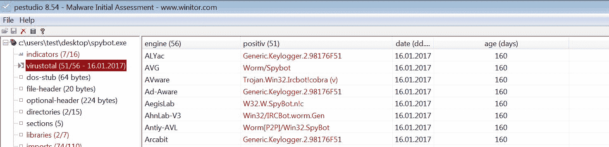在线扫描工具如*VirSCAN*（[`www.virscan.org/`](http://www.virscan.org/)）、*Jotti Malware Scan*（[`virusscan.jotti.org/`](https://virusscan.jotti.org/)）和*OPSWAT 的 Metadefender*（[`www.metadefender.com/#!/scan-file`](https://www.metadefender.com/#!/scan-file)）允许你使用多个反病毒扫描引擎扫描可疑文件，其中一些还允许你进行哈希值查询。

在使用反病毒扫描器扫描二进制文件或将二进制文件提交给在线反病毒扫描服务时，有几个因素/风险需要考虑：

+   如果可疑的二进制文件未被反病毒扫描引擎检测到，并不一定意味着该二进制文件是安全的。这些反病毒引擎依赖签名和启发式方法来检测恶意文件。恶意软件作者可以轻松修改其代码并使用混淆技术来绕过这些检测，因此某些反病毒引擎可能未能将该二进制文件识别为恶意。

+   当你将二进制文件上传到公共网站时，提交的二进制文件可能会与第三方和供应商共享。可疑的二进制文件可能包含敏感的、个人的或属于你组织的专有信息，因此不建议将作为机密调查一部分的二进制文件提交给公共反病毒扫描服务。大多数基于网页的反病毒扫描服务允许你使用加密哈希值（MD5、SHA1 或 SHA256）搜索它们已有的扫描文件数据库；因此，提交二进制文件的替代方法是根据二进制文件的加密哈希进行搜索。

+   当你将一个二进制文件提交到在线的病毒扫描引擎时，扫描结果会存储在它们的数据库中，且大多数扫描数据是公开的，可以稍后查询。攻击者可以使用搜索功能查询他们样本的哈希值，检查他们的二进制文件是否已被检测到。如果他们的样本被检测到，攻击者可能会改变战术以避免被检测。

# 4. 提取字符串

字符串是嵌入在文件中的 ASCII 和 Unicode 可打印字符序列。提取字符串可以为可疑二进制文件提供程序功能线索和相关指示。例如，如果恶意软件创建了一个文件，*文件名* 会作为字符串存储在二进制文件中。或者，如果恶意软件解析了由攻击者控制的 *域名*，则该域名会作为字符串存储。通过二进制文件提取的字符串可能包含对文件名、URL、域名、IP 地址、攻击命令、注册表键等的引用。虽然字符串无法清楚地展示文件的目的和功能，但它们可以提供恶意软件可能执行的操作的提示。

# 4.1 使用工具提取字符串

要从可疑的二进制文件中提取字符串，可以在 Linux 系统上使用 `strings` 工具。默认情况下，`strings` 命令提取至少四个字符长的 ASCII 字符串。通过使用 `-a` 选项，可以从整个文件中提取字符串。以下从恶意二进制文件中提取的 ASCII 字符串显示了对*IP 地址*的引用。这表明，当这个恶意软件被执行时，它可能会与该 IP 地址建立连接：

```
$ strings -a log.exe
!This program cannot be run in DOS mode.
Rich
.text
`.rdata
@.data
L$"%
h4z@
128.91.34.188
%04d-%02d-%02d %02d:%02d:%02d %s
```

在以下示例中，从名为 *Spybot* 的恶意软件提取的 *ASCII* 字符串表明了它的 *DOS* 和 *键盘记录* 功能：

```
$ strings -a spybot.exe
!This program cannot be run in DOS mode.
.text
`.bss
.data
.idata
.rsrc
]_^[
keylog.txt
%s (Changed window
Keylogger Started
HH:mm:ss]
[dd:MMM:yyyy,
SynFlooding: %s port: %i delay: %i times:%i.
bla bla blaaaasdasd
Portscanner startip: %s port: %i delay: %ssec.
Portscanner startip: %s port: %i delay: %ssec. logging to: %s
kuang
sub7
%i.%i.%i.0
scan
redirect %s:%i > %s:%i)
Keylogger logging to %s
Keylogger active output to: DCC chat
Keylogger active output to: %s
error already logging keys to %s use "stopkeylogger" to stop
startkeylogger
passwords
```

恶意软件样本还使用 *Unicode*（每个字符 2 字节）字符串。为了从二进制文件中获取有用信息，有时你需要同时提取 *ASCII* 和 *Unicode* 字符串。要使用 `strings` 命令提取 Unicode 字符串，可以使用 `-el` 选项。

在以下示例中，恶意软件样本并未揭示出异常的 *ASCII* 字符串，但提取的 *Unicode* 字符串显示了对 *域名* 和 *Run 注册表键*（恶意软件常用来在重启后保持存活）的引用；它还突出了恶意软件可能具有将程序添加到防火墙白名单的能力：

```
$ strings -a -el multi.exe
AppData
44859ba2c98feb83b5aab46a9af5fefc
haixxdrekt.dyndns.hu
True
Software\Microsoft\Windows\CurrentVersion\Run
Software\
.exe
SEE_MASK_NOZONECHECKS
netsh firewall add allowedprogram "
```

在 Windows 上，*pestudio* ([`www.winitor.com`](https://www.winitor.com)) 是一款方便的工具，能够显示 ASCII 和 Unicode 字符串。pestudio 是一款出色的 PE 分析工具，用于执行对可疑二进制文件的初步恶意软件评估，旨在从 PE 可执行文件中提取各种有用信息。此工具的其他多种功能将在后续章节中详细介绍。

以下截图显示了 pestudio 列出的一些*ASCII*和*Unicode*字符串，它通过在黑名单列中突出显示一些显著的字符串，帮助你专注于二进制文件中的有趣字符串：

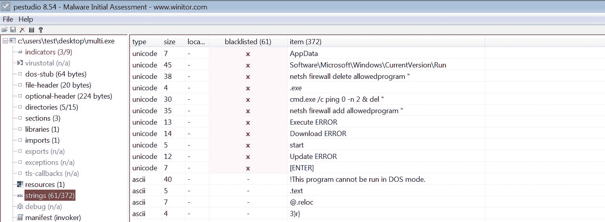由 Mark Russinovich 移植到 Windows 的*strings*工具（[`technet.microsoft.com/en-us/sysinternals/strings.aspx`](https://technet.microsoft.com/en-us/sysinternals/strings.aspx)）和*PPEE*（[`www.mzrst.com/`](https://www.mzrst.com/)）是其他可以用来提取 ASCII 和 Unicode 字符串的工具。

# 4.2 使用 FLOSS 解码混淆字符串

大多数情况下，恶意软件作者使用简单的字符串混淆技术来避免被检测到。在这种情况下，那些混淆过的字符串不会出现在`strings`工具和其他字符串提取工具中。*FireEye 实验室混淆字符串解码器*（*FLOSS*）是一款旨在自动识别和提取恶意软件中混淆字符串的工具。它可以帮助你识别恶意软件作者想要隐藏的字符串，避免被字符串提取工具提取。*FLOSS*也可以像`strings`工具一样，用于提取人类可读的字符串（ASCII 和 Unicode）。你可以从[`github.com/fireeye/flare-floss`](https://github.com/fireeye/flare-floss)下载适用于 Windows 或 Linux 的*FLOSS*。

在下面的示例中，运行一个*FLOSS*独立的*二进制文件*在恶意软件样本上，不仅提取了人类可读的字符串，还解码了混淆过的字符串，并提取了*栈字符串*，这些是`strings`工具和其他字符串提取工具遗漏的。以下输出显示了对*可执行文件*、*Excel 文件*和*运行注册表项*的引用：

```
$ chmod +x floss
$ ./floss 5340.exe
FLOSS static ASCII strings
!This program cannot be run in DOS mode.
Rich
.text
`.rdata
@.data
[..removed..]

FLOSS decoded 15 strings
kb71271.log
R6002
- floating point not loaded
\Microsoft
winlogdate.exe
~tasyd3.xls
[....REMOVED....]

FLOSS extracted 13 stack strings
BINARY
ka4a8213.log
afjlfjsskjfslkfjsdlkf
'Clt
~tasyd3.xls
"%s"="%s"
regedit /s %s
[HKEY_CURRENT_USER\Software\Microsoft\Windows\CurrentVersion\Run]
[.....REMOVED......]
```

如果你只对*解码/栈字符串*感兴趣，并且想要从 FLOSS 输出中排除静态字符串（ASCII 和 Unicode），那么可以使用`--no-static-strings`开关。关于 FLOSS 工作原理及其各种使用选项的详细信息，请访问[`www.fireeye.com/blog/threat-research/2016/06/automatically-extracting-obfuscated-strings.html`](https://www.fireeye.com/blog/threat-research/2016/06/automatically-extracting-obfuscated-strings.html)。

# 5. 确定文件混淆

尽管字符串提取是一种出色的技术，可以获取有价值的信息，但恶意软件作者常常对其恶意软件二进制文件进行混淆或加固。恶意软件作者使用混淆技术来保护恶意软件的内部工作原理，防止安全研究人员、恶意软件分析师和逆向工程师的分析。这些混淆技术使得检测/分析二进制文件变得困难；从这样的二进制文件中提取字符串的结果是字符串数量非常少，而且大多数字符串都是模糊不清的。恶意软件作者通常使用诸如*打包器*和*加密器*之类的程序对文件进行混淆，以避免安全产品如反病毒软件的检测，并破坏分析过程。

# 5.1 打包器和加密器

*打包器*（*Packer*）是一个程序，它将可执行文件作为输入，并使用压缩来混淆可执行文件的内容。这个混淆后的内容会存储在新可执行文件的结构中；最终结果是一个带有混淆内容的新可执行文件（打包程序），并存储在磁盘上。在执行这个打包程序时，它会执行一个解压例程，在运行时将原始二进制文件提取到内存中并触发执行。

*加密器*（*Cryptor*）类似于*打包器*（*Packer*），但它使用加密而非压缩来混淆可执行文件的内容，加密后的内容存储在新的可执行文件中。在执行加密程序时，它会运行解密例程，从内存中提取原始二进制文件，并触发执行。

为了展示文件混淆的概念，我们以一个名为*Spybot*的恶意软件样本（未打包）为例；从*Spybot*中提取字符串后，显示出可疑的可执行文件名和 IP 地址，如下所示：

```
$ strings -a spybot.exe
[....removed....]
EDU_Hack.exe
Sitebot.exe
Winamp_Installer.exe
PlanetSide.exe
DreamweaverMX_Crack.exe
FlashFXP_Crack.exe
Postal_2_Crack.exe
Red_Faction_2_No-CD_Crack.exe
Renegade_No-CD_Crack.exe
Generals_No-CD_Crack.exe
Norton_Anti-Virus_2002_Crack.exe
Porn.exe
AVP_Crack.exe
zoneallarm_pro_crack.exe
[...REMOVED...]
209.126.201.22
209.126.201.20
```

然后，*Spybot*样本通过一个流行的打包工具*UPX*（[`upx.github.io/`](https://upx.github.io/)）进行了打包，结果是生成了一个新的打包可执行文件（`spybot_packed.exe`）。以下命令输出显示了原始文件与打包文件之间的大小差异。UPX 使用压缩，因此打包后的二进制文件比原始二进制文件小：

```
$ upx -o spybot_packed.exe spybot.exe
                       Ultimate Packer for eXecutables
                          Copyright (C) 1996 - 2013
UPX 3.91 Markus Oberhumer, Laszlo Molnar & John Reiser Sep 30th 2013
File size Ratio Format Name
-------------------- ------ ----------- -----------
44576 -> 21536 48.31% win32/pe spybot_packed.exe
Packed 1 file.

$ ls -al
total 76
drwxrwxr-x 2 ubuntu ubuntu 4096 Jul 9 09:04 .
drwxr-xr-x 6 ubuntu ubuntu 4096 Jul 9 09:04 ..
-rw-r--r-- 1 ubuntu ubuntu 44576 Oct 22 2014 spybot.exe
-rw-r--r-- 1 ubuntu ubuntu 21536 Oct 22 2014 spybot_packed.exe
```

对打包二进制文件运行 strings 命令会显示被混淆的字符串，且没有透露出太多有价值的信息；这也是攻击者混淆文件的原因之一：

```
$ strings -a spybot_packed.exe
!This program cannot be run in DOS mode.
UPX0
UPX1
.rsrc
3.91
UPX!
t ;t
/t:VU
]^M 
9-lh
:A$m
hAgo .
C@@f.
Q*vPCi
%_I;9
PVh29A
[...REMOVED...]
```

UPX 是一个常见的打包工具，你经常会遇到用 UPX 打包的恶意软件样本。在大多数情况下，你可以使用`-d`选项来解包样本。*一个示例命令是`upx -d -o spybot_unpacked.exe spybot_packed.exe`*。

# 5.2 使用 Exeinfo PE 检测文件混淆

大多数合法的可执行文件不会混淆内容，但一些可执行文件可能会这样做，以防止他人检查其代码。当你遇到一个被打包的样本时，它很可能是恶意的。为了检测 Windows 上的打包工具，你可以使用像*Exeinfo PE*这样的免费工具（[`exeinfo.atwebpages.com/`](http://exeinfo.atwebpages.com/)）；它具有易于使用的图形界面。写这本书时，它使用超过 4,500 个签名（存储在`userdb.txt`文件中）来检测构建程序时使用的各种编译器、打包工具或加密工具。除了检测打包工具，*Exeinfo PE*的另一个有趣功能是，它会提供如何解包样本的信息或参考。

将打包的*Spybot*恶意软件样本加载到*Exeinfo PE*中显示它是用 UPX 打包的，并且还给出了使用哪个命令来解压混淆文件的提示；这可以让你的分析变得更加轻松：

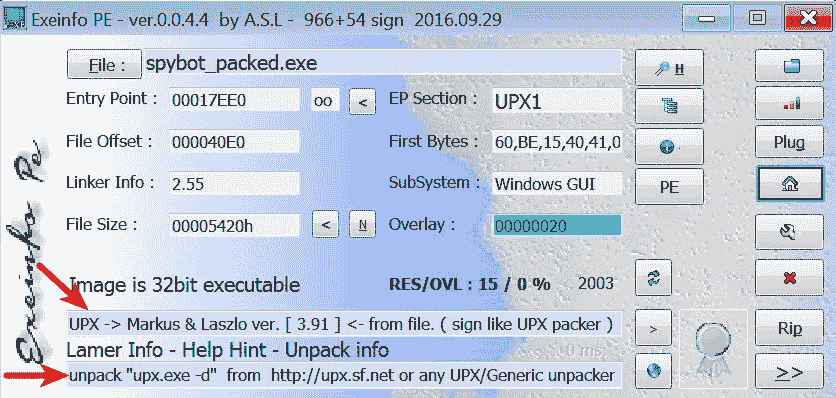其他可以帮助你进行打包检测的 CLI 和 GUI 工具包括 *TrID* ([`mark0.net/soft-trid-e.html`](http://mark0.net/soft-trid-e.html))，*TRIDNet* ([`mark0.net/soft-tridnet-e.html`](http://mark0.net/soft-tridnet-e.html))，*Detect It Easy* ([`ntinfo.biz/`](http://ntinfo.biz/))，*RDG Packer Detector* ([`www.rdgsoft.net/`](http://www.rdgsoft.net/))，*packerid.py* ([`github.com/sooshie/packerid`](https://github.com/sooshie/packerid))，和 *PEiD* ([`www.softpedia.com/get/Programming/Packers-Crypters-Protectors/PEiD-updated.shtml`](http://www.softpedia.com/get/Programming/Packers-Crypters-Protectors/PEiD-updated.shtml))。

# 6\. 检查 PE 头部信息

Windows 可执行文件必须符合 *PE/COFF（可移植可执行/通用对象文件格式）*。PE 文件格式被 Windows 可执行文件（如 `.exe`、`.dll`、`.sys`、`.ocx` 和 `.drv`）使用，这些文件通常被称为 *可移植可执行（PE）* 文件。PE 文件是由一系列结构和子组件组成，包含了操作系统加载到内存所需的信息。

当一个可执行文件被编译时，它包含一个头部（PE 头部），该头部描述了其结构。当二进制文件被执行时，操作系统加载器从 PE 头部读取信息，然后将二进制内容从文件加载到内存中。PE 头部包含的信息有：可执行文件需要加载到内存中的位置、执行开始的地址、应用程序所依赖的库/函数列表以及二进制文件使用的资源。检查 PE 头部可以获得关于二进制文件及其功能的丰富信息。

本书并不涵盖 PE 文件结构的基础知识。然而，与恶意软件分析相关的概念将在以下小节中进行讨论；有各种资源可以帮助理解 PE 文件结构。以下是一些理解 PE 文件结构的优秀资源：

+   *深入了解 Win32 可移植可执行文件格式 - 第一部分：*

    [`www.delphibasics.info/home/delphibasicsarticles/anin-depthlookintothewin32portableexecutablefileformat-part1`](http://www.delphibasics.info/home/delphibasicsarticles/anin-depthlookintothewin32portableexecutablefileformat-part1)

+   *深入了解 Win32 可移植可执行文件格式 - 第二部分：*

    [`www.delphibasics.info/home/delphibasicsarticles/anin-depthlookintothewin32portableexecutablefileformat-part2`](http://www.delphibasics.info/home/delphibasicsarticles/anin-depthlookintothewin32portableexecutablefileformat-part2)

+   *PE 头部和结构：*

    [`www.openrce.org/reference_library/files/reference/PE%20Format.pdf`](http://www.openrce.org/reference_library/files/reference/PE%20Format.pdf)

+   *PE101 - Windows 可执行文件解析：*

    [`github.com/corkami/pics/blob/master/binary/pe101/pe101.pdf`](https://github.com/corkami/pics/blob/master/binary/pe101/pe101.pdf)

通过将可疑文件加载到 PE 分析工具中，你可以清楚地了解 PE 文件格式。以下是一些允许你检查和修改 PE 结构及其子组件的工具：

+   *CFF Explorer:* [`www.ntcore.com/exsuite.php`](http://www.ntcore.com/exsuite.php)

+   *PE 内部结构:* [`www.andreybazhan.com/pe-internals.html`](http://www.andreybazhan.com/pe-internals.html)

+   *PPEE(puppy):* [`www.mzrst.com/`](https://www.mzrst.com/)

+   *PEBrowse Professional:* [`www.smidgeonsoft.prohosting.com/pebrowse-pro-file-viewer.html`](http://www.smidgeonsoft.prohosting.com/pebrowse-pro-file-viewer.html)

后续部分将介绍一些对恶意软件分析有用的重要 PE 文件属性。诸如 *pestudio* ([`www.winitor.com`](https://www.winitor.com)) 或 *PPEE (puppy)*: **[`www.mzrst.com/`](https://www.mzrst.com/)** 等工具，可以帮助你探索 PE 文件中的有趣信息。

# 6.1 检查文件依赖关系和导入

通常，恶意软件与文件、注册表、网络等进行交互。为了执行这些交互，恶意软件通常依赖于操作系统暴露的功能。Windows 导出大部分执行这些交互所需的功能，这些功能被称为*应用程序编程接口（API）*，并存储在*动态链接库（DLL）*文件中。可执行文件通常从提供不同功能的各种 DLL 文件中导入并调用这些函数。可执行文件从其他文件（主要是 DLL）导入的函数称为*导入函数*（或*imports*）。

例如，如果恶意软件可执行文件想要在磁盘上创建一个文件，它可以使用 Windows 中的 `CreateFile()` API，该 API 存储在 `kernel32.dll` 中。为了调用该 API，恶意软件首先必须将 `kernel32.dll` 加载到其内存中，然后调用 `CreateFile()` 函数。

检查恶意软件依赖的 DLL 以及它从这些 DLL 导入的 API 函数，可以帮助了解恶意软件的功能和能力，并预测其执行过程中可能发生的情况。Windows 可执行文件中的文件依赖关系存储在 PE 文件结构的导入表中。

在以下示例中，*spybot* 样本被加载到 pestudio 中。点击 pestudio 中的库按钮，显示出可执行文件依赖的所有 DLL 文件，以及从每个 DLL 导入的函数数量。这些是程序执行时会加载到内存中的 DLL 文件：

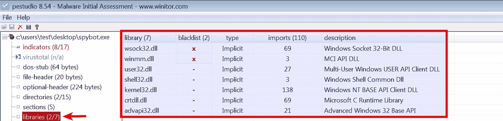

点击 pestudio 中的导入按钮会显示从这些 DLL 导入的 API 函数。在以下截图中，恶意软件从 `wsock32.dll` 导入与网络相关的 API 函数（如 `connect`、`socket`、`listen`、`send` 等），这表明恶意软件在执行时很可能会连接到互联网或执行某些网络活动。 pestudio 会在黑名单栏中突出显示恶意软件常用的 API 函数。在后续章节中，将更详细地介绍如何检查 API 函数的技巧：

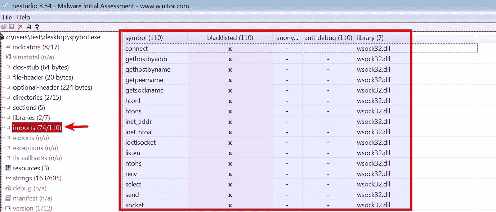

有时，恶意软件可以在运行时显式加载 DLL，使用 `LoadLibrary()` 或 `LdrLoadDLL()` 等 API 调用，并且可以通过 `GetProcessAdress()` API 来解析函数地址。在运行时加载的 DLL 信息不会出现在 PE 文件的导入表中，因此工具不会显示这些信息。

有关 API 函数及其功能的信息可以从 *MSDN（Microsoft Developer Network）* 获得。输入 API 名称在搜索框中（[`msdn.microsoft.com/en-us/default.aspx`](https://msdn.microsoft.com/en-us/default.aspx)），以获取有关该 API 的详细信息。

除了确定恶意软件功能外，导入项还可以帮助你检测恶意软件样本是否被混淆。如果你遇到一个导入项非常少的恶意软件，那么这强烈表明它是一个打包的二进制文件。

为了证明这一点，让我们比较 *未打包的 spybot 样本* 和 *打包的 spybot 样本* 之间的导入项。以下截图显示了未打包的 spybot 样本中有 110 个导入项：

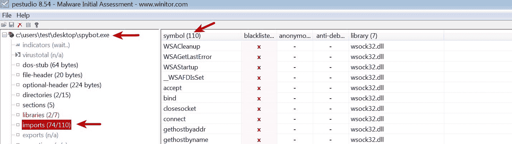

另一方面，spybot 的 *打包样本* 仅显示了 12 个导入：

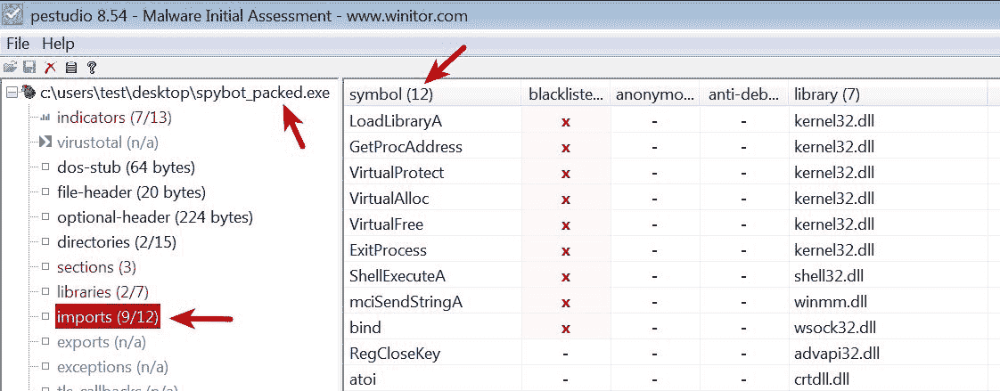

有时你可能需要使用 Python 来列举 DLL 文件和导入的函数（可能是为了处理大量文件）；这可以使用 Ero Carerra 的 *pefile* 模块完成（[`github.com/erocarrera/pefile`](https://github.com/erocarrera/pefile)）。在 第一章，*恶意软件分析简介* 中已介绍如何在 Ubuntu Linux 虚拟机上安装 *pefile* 模块。如果你使用的是其他操作系统，可以通过 pip 安装（`pip install pefile`）。以下 Python 脚本演示了如何使用 *pefile* 模块列举 DLL 文件和导入的 API 函数：

```
import pefile
import sys

mal_file = sys.argv[1]
pe = pefile.PE(mal_file)
if hasattr(pe, 'DIRECTORY_ENTRY_IMPORT'):
    for entry in pe.DIRECTORY_ENTRY_IMPORT:
        print "%s" % entry.dll
        for imp in entry.imports:
            if imp.name != None:
                print "\t%s" % (imp.name)
            else:
                print "\tord(%s)" % (str(imp.ordinal))
        print "\n"
```

以下是运行上述脚本对 `spybot_packed.exe` 样本进行分析后的结果；从输出中可以看到 DLL 文件和导入函数的列表：

```
$ python enum_imports.py spybot_packed.exe
KERNEL32.DLL
  LoadLibraryA
  GetProcAddress
  VirtualProtect
  VirtualAlloc
  VirtualFree
  ExitProcess

ADVAPI32.DLL
  RegCloseKey

CRTDLL.DLL
  atoi
[...REMOVED....]
```

# 6.2  检查导出

可执行文件和 DLL 可以导出函数，供其他程序使用。通常，DLL 导出由可执行文件导入的函数 (*exports*)。DLL 本身无法独立运行，依赖于主进程来执行其代码。攻击者通常会创建一个导出包含恶意功能的函数的 DLL。为了执行 DLL 中的恶意函数，必须通过某种方式使其被加载到一个进程中，并调用这些恶意函数。DLL 还可以从其他库（DLL）导入函数以执行系统操作。

检查导出的函数可以快速了解 DLL 的功能。在以下示例中，加载一个与恶意软件 *Ramnit* 相关的 DLL 到 pestudio 中，查看其导出函数，从而推测其功能。当一个进程加载这个 DLL 时，某个时刻，这些函数会被调用来执行恶意活动：

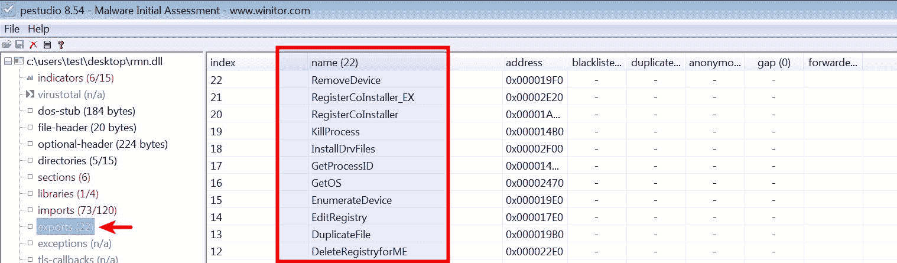导出函数的名称可能无法完全反映恶意软件的功能。攻击者可能使用随机或伪造的导出名称来误导你的分析，或者将你引入误区。

在 Python 中，可以使用 *pefile 模块* 枚举导出函数，如下所示：

```
$ python
Python 2.7.12 (default, Nov 19 2016, 06:48:10)
>>> import pefile
>>> pe = pefile.PE("rmn.dll")
>>> if hasattr(pe, 'DIRECTORY_ENTRY_EXPORT'):
...     for exp in pe.DIRECTORY_ENTRY_EXPORT.symbols:
...         print "%s" % exp.name
... 
AddDriverPath
AddRegistryforME
CleanupDevice
CleanupDevice_EX
CreateBridgeRegistryfor2K
CreateFolder
CreateKey
CreateRegistry
DeleteDriverPath
DeleteOemFile
DeleteOemInfFile
DeleteRegistryforME
DuplicateFile
EditRegistry
EnumerateDevice
GetOS
[.....REMOVED....]
```

# 6.3  检查 PE 段表和段

PE 文件的实际内容被划分为多个段（sections）。这些段紧接在 PE 头之后。这些段代表的是 *代码* 或 *数据*，并具有如读/写等内存属性。代表代码的段包含将由处理器执行的指令，而包含数据的段可以代表不同类型的数据，如读/写程序数据（全局变量）、导入/导出表、资源等。每个段都有一个独特的名称，用来表示该段的目的。例如，名为 `.text` 的段表示代码，并具有 `read-execute` 属性；名为 `.data` 的段表示全局数据，并具有 `read-write` 属性。

在可执行文件的编译过程中，编译器会添加一致的段名。下表列出了 PE 文件中一些常见的段：

| **段名** | **描述** |
| --- | --- |
| `.text` 或 `CODE` | 包含可执行代码。 |
| `.data` 或 `DATA` | 通常包含读/写数据和全局变量。 |
| `.rdata` | 包含只读数据。有时它还包含导入和导出信息。 |
| `.idata` | 如果存在，包含导入表。如果不存在，则导入信息存储在 `.rdata` 段中。 |
| `.edata` | 如果存在，包含导出信息。如果不存在，则导出信息位于 `.rdata` 段中。 |
| `.rsrc` | 此段包含可执行文件使用的资源，如图标、对话框、菜单、字符串等。 |

这些节名称主要供人类使用，操作系统并不使用它们，这意味着攻击者或混淆软件可能会创建具有不同名称的节。如果你遇到不常见的节名称，应当对此保持怀疑，并且需要进一步分析以确认其是否具有恶意。

这些节的信息（如节名称、节的位置以及其特征）存在于 PE 头中的*节表*中。检查节表将提供关于节及其特征的信息。

当你在*pestudio*中加载一个可执行文件并点击节时，它会显示从节表提取的节信息及其属性（如读/写等）。以下是来自 pestudio 的可执行文件的节信息截图，截图中一些相关字段在此进行解释：

| **字段** | **描述** |
| --- | --- |
| 名称 | 显示节名称。在这种情况下，可执行文件包含四个节（`.text`、`.data`、`.rdata`和`.rsrc`）。 |
| 虚拟大小 | 指示加载到内存时节的大小。 |
| 虚拟地址 | 这是节在内存中的相对虚拟地址（即，从可执行文件的基地址开始的偏移）。 |
| 原始大小 | 指示节在磁盘上的大小。 |
| 原始数据 | 指示文件中节所在的偏移位置。 |
| 入口点 | 这是代码开始执行的 RVA（相对虚拟地址）。在这种情况下，入口点位于`.text`节中，这是正常的。 |

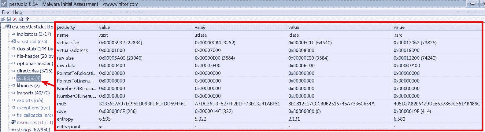

检查节表也有助于识别 PE 文件中的任何异常。以下截图显示了一个使用 UPX 打包的恶意软件的节名称；该恶意软件样本包含以下差异：

+   节名称不包含编译器添加的常见节（如`.text`、`.data`等），而是包含`UPX0`和`UPX1`节名称。

+   入口点位于`UPX1`节中，这表明执行将从此节开始（解压缩例程）。

+   通常，`原始大小`和`虚拟大小`应该几乎相等，但由于节对齐的原因，存在小的差异是正常的。在这种情况下，`原始大小`为`0`，表示该节不会占用磁盘空间，但`虚拟大小`指定该节在内存中占用更多空间（大约`127 KB`）。这强烈表明这是一个打包的二进制文件。造成这种差异的原因是，当一个打包的二进制文件执行时，打包程序的解压例程会在运行时将解压后的数据或指令复制到内存中。

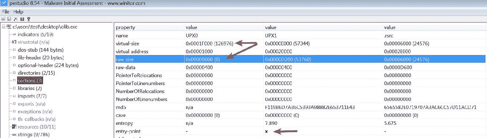

以下 Python 脚本演示了如何使用*pefile*模块来显示节及其特征：

```
import pefile
import sys

pe = pefile.PE(sys.argv[1])
for section in pe.sections:
    print "%s %s %s %s" % (section.Name,
                           hex(section.VirtualAddress),
                           hex(section.Misc_VirtualSize),
                           section.SizeOfRawData)
print "\n"
```

以下是运行前面 Python 脚本后的输出：

```
$ python display_sections.py olib.exe
UPX0 0x1000 0x1f000 0
UPX1 0x20000 0xe000 53760
.rsrc 0x2e000 0x6000 24576
```

Michael Ligh 和 Glenn P. Edwards 开发的 *pescanner* 是一个出色的工具，可以根据 PE 文件属性检测可疑的 PE 文件；它使用启发式方法而不是签名，并且即使没有签名，也能帮助你识别被打包的二进制文件。你可以从 [`github.com/hiddenillusion/AnalyzePE/blob/master/pescanner.py`](https://github.com/hiddenillusion/AnalyzePE/blob/master/pescanner.py) 下载脚本副本。

# 6.4 检查编译时间戳

PE 头部包含指定二进制文件编译时间的信息；检查这个字段可以帮助你了解恶意软件首次创建的时间。这些信息对于构建攻击活动的时间线非常有用。攻击者也可能修改时间戳，防止分析人员了解实际的时间戳。有时候，编译时间戳可以用来分类可疑样本。以下示例显示了一个恶意软件二进制文件，其时间戳被修改为 2020 年的未来日期。在这种情况下，尽管无法检测到实际的编译时间戳，但这些特征可以帮助你识别异常行为：

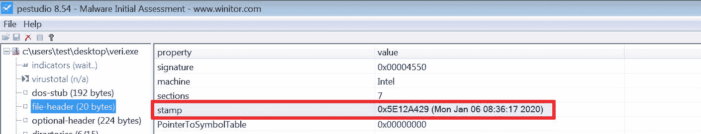

在 Python 中，你可以使用以下 Python 命令来确定编译时间戳：

```
>>> import pefile
>>> import time
>>> pe = pefile.PE("veri.exe")
>>> timestamp = pe.FILE_HEADER.TimeDateStamp
>>> print time.strftime("%Y-%m-%d %H:%M:%S",time.localtime(timestamp))
2020-01-06 08:36:17
```

所有 Delphi 二进制文件的编译时间戳都设置为 1992 年 6 月 19 日，这使得很难检测到实际的编译时间戳。如果你正在调查一个时间戳设置为这个日期的恶意软件二进制文件，很可能你正在查看 Delphi 二进制文件。以下博客文章 [`www.hexacorn.com/blog/2014/12/05/the-not-so-boring-land-of-borland-executables-part-1/`](http://www.hexacorn.com/blog/2014/12/05/the-not-so-boring-land-of-borland-executables-part-1/) 提供了有关如何从 Delphi 二进制文件获取编译时间戳的信息。

# 6.5 检查 PE 资源

可执行文件所需的资源，如图标、菜单、对话框和字符串，都存储在可执行文件的资源部分（`.rsrc`）中。攻击者通常将附加的二进制文件、诱饵文档、配置数据等信息存储在资源部分，因此检查资源部分可以揭示二进制文件的有价值信息。资源部分还包含版本信息，可以揭示有关来源、公司名称、程序作者细节和版权信息。

*Resource Hacker* ([`www.angusj.com/resourcehacker/`](http://www.angusj.com/resourcehacker/)) 是一个非常好的工具，可以用来检查、查看和提取可疑二进制文件中的资源。我们以一个看起来像 Excel 文件的二进制文件为例（注意文件扩展名被更改为 `.xls.exe`），如下所示：

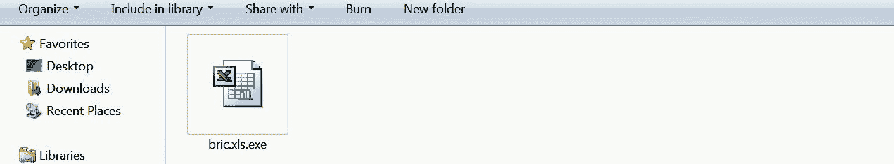

将恶意二进制文件加载到 Resource Hacker 中，显示三个资源（*图标*，*二进制* 和 *图标组*）。该恶意软件样本使用了 Microsoft Excel 的图标（以给人一种 Excel 表格的假象）：

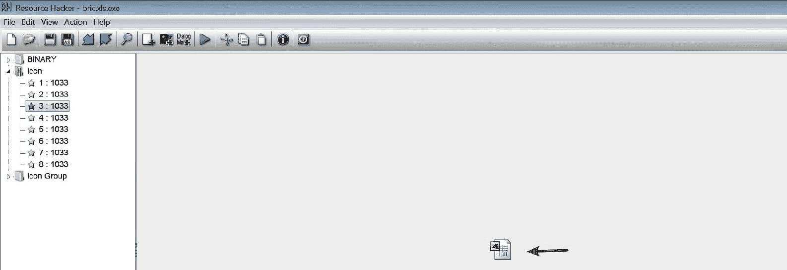

可执行文件还包含二进制数据；其中一个具有文件签名`D0 CF 11 E0 A1 B1 1A E1`。这组字节表示 Microsoft Office 文档文件的文件签名。在这种情况下，攻击者在资源部分存储了一个诱饵 Excel 表。在执行时，恶意软件在后台执行，并且这个诱饵 Excel 表显示给用户作为一种转移：

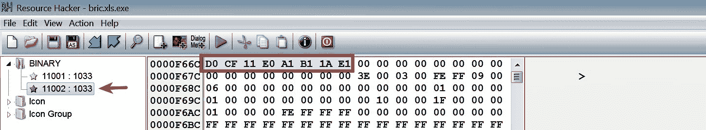

要将二进制文件保存到磁盘上，请右键单击要提取的资源，然后单击“保存资源”到*.bin 文件，如下面的屏幕截图所示。在这种情况下，资源被保存为`sample.xls`。下面的屏幕截图显示了将显示给用户的诱饵 Excel 表：

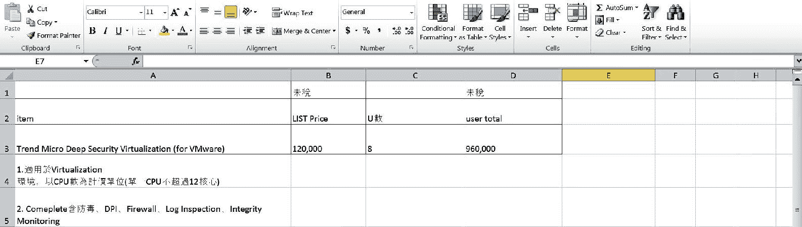

通过探索资源部分的内容，可以了解很多关于恶意软件特征的信息。

# 7. 比较和分类恶意软件

在进行恶意软件调查时，当您遇到一个恶意软件样本时，您可能想知道该恶意软件样本是否属于特定的恶意软件家族，或者它是否具有与先前分析的样本相匹配的特征。将可疑二进制文件与先前分析的样本或存储在公共或私人存储库中的样本进行比较，可以了解恶意软件家族、其特征以及与先前分析的样本的相似性。

虽然加密哈希（*MD5/SHA1/SHA256*）是一种检测相同样本的好方法，但它并不能帮助识别相似的样本。恶意软件作者经常改变恶意软件的微小方面，这会完全改变哈希值。以下部分描述了一些可以帮助比较和分类可疑二进制文件的技术：

# 7.1 使用模糊哈希分类恶意软件

*模糊哈希*是一种比较文件相似性的好方法。*ssdeep* ([`ssdeep.sourceforge.net`](http://ssdeep.sourceforge.net))是一个有用的工具，用于为样本生成模糊哈希，还有助于确定样本之间的相似度百分比。这种技术在比较可疑二进制文件与存储库中的样本时非常有用，以识别相似的样本；这有助于识别属于相同恶意软件家族或相同行动者组的样本。

您可以使用*ssdeep*来计算和比较模糊哈希。在 Ubuntu Linux 虚拟机上安装*ssdeep*已在第一章中介绍过。要确定样本的模糊哈希，请运行以下命令：

```
$ ssdeep veri.exe
ssdeep,1.1--blocksize:hash:hash,filename
49152:op398U/qCazcQ3iEZgcwwGF0iWC28pUtu6On2spPHlDB:op98USfcy8cwF2bC28pUtsRptDB,"/home/ubuntu/Desktop/veri.exe"
```

为了演示模糊哈希的使用，让我们以一个包含三个恶意软件样本的目录为例。在下面的输出中，您可以看到所有三个文件具有完全不同的 MD5 哈希值：

```
$ ls
aiggs.exe jnas.exe veri.exe

$ md5sum *
48c1d7c541b27757c16b9c2c8477182b aiggs.exe
92b91106c108ad2cc78a606a5970c0b0 jnas.exe
ce9ce9fc733792ec676164fc5b2622f2 veri.exe
```

ssdeep 中的美观匹配模式（`-p`选项）可以用来确定相似度百分比。从以下输出可以看出，在三个样本中，有两个样本的相似度为 99%，这表明这两个样本可能属于同一恶意软件家族：

```
$ ssdeep -pb *
aiggs.exe matches jnas.exe (99)
jnas.exe matches aiggs.exe (99)
```

如前面的示例所示，加密哈希在确定样本之间的关系时并没有提供帮助，而模糊哈希技术则识别了样本之间的相似性。

你可能有一个包含多个恶意软件样本的目录。在这种情况下，可以使用递归模式（`-r`）在包含恶意软件样本的目录及其子目录上运行`ssdeep`，如这里所示：

```
$ ssdeep -lrpa samples/
samples//aiggs.exe matches samples//crop.exe (0)
samples//aiggs.exe matches samples//jnas.exe (99)

samples//crop.exe matches samples//aiggs.exe (0)
samples//crop.exe matches samples//jnas.exe (0)

samples//jnas.exe matches samples//aiggs.exe (99)
samples//jnas.exe matches samples//crop.exe (0)

```

你还可以将可疑的二进制文件与文件哈希列表进行匹配。在以下示例中，所有二进制文件的 ssdeep 哈希被重定向到一个文本文件（`all_hashes.txt`），然后将可疑二进制文件（`blab.exe`）与文件中的所有哈希进行匹配。从以下输出可以看出，可疑二进制文件（`blab.exe`）与`jnas.exe`完全相同（100% 匹配），并且与`aiggs.exe`的相似度为 99%。你可以使用这种技术将任何新文件与先前分析过的样本哈希进行比较：

```
$ ssdeep * > all_hashes.txt
$ ssdeep -m all_hashes.txt blab.exe
/home/ubuntu/blab.exe matches all_hashes.txt:/home/ubuntu/aiggs.exe (99)
/home/ubuntu/blab.exe matches all_hashes.txt:/home/ubuntu/jnas.exe (100)
```

在 Python 中，模糊哈希可以使用*python-ssdeep*（[`pypi.python.org/pypi/ssdeep/3.2`](https://pypi.python.org/pypi/ssdeep/3.2)）计算。在第一章，*恶意软件分析入门*中介绍了如何在 Ubuntu Linux 虚拟机上安装*python-ssdeep*模块。要计算和比较模糊哈希，可以在脚本中使用以下命令：

```
$ python
Python 2.7.12 (default, Nov 19 2016, 06:48:10) 
>>> import ssdeep
>>> hash1 = ssdeep.hash_from_file('jnas.exe')
>>> print hash1
384:l3gexUw/L+JrgUon5b9uSDMwE9Pfg6NgrWoBYi51mRvR6JZlbw8hqIusZzZXe:pIAKG91Dw1hPRpcnud
>>> hash2 = ssdeep.hash_from_file('aiggs.exe')
>>> print hash2
384:l3gexUw/L+JrgUon5b9uSDMwE9Pfg6NgrWoBYi51mRvR6JZlbw8hqIusZzZWe:pIAKG91Dw1hPRpcnu+
>>> ssdeep.compare(hash1, hash2)
99
>>> 
```

# 7.2 使用导入哈希分类恶意软件

*导入哈希*是另一种可以用来识别相关样本和同一威胁行为者组使用的样本的技术。*导入哈希*（或*imphash*）是一种通过计算基于库/导入函数（API）名称及其在可执行文件中特定顺序的哈希值的技术。如果文件是从相同的源代码编译的，并且采用相同的方式，那么这些文件的*imphash*值通常会相同。在你的恶意软件调查中，如果你遇到具有相同 imphash 值的样本，说明它们具有相同的导入地址表，很可能是相关的。

有关导入哈希的详细信息，以及如何使用它来追踪威胁行为者组，请阅读[`www.fireeye.com/blog/threat-research/2014/01/tracking-malware-import-hashing.html`](https://www.fireeye.com/blog/threat-research/2014/01/tracking-malware-import-hashing.html)。

当你将一个可执行文件加载到*pestudio*时，它会计算出 imphash，如此处所示：

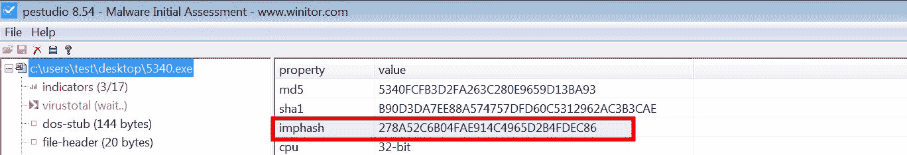

在 Python 中，可以使用*pefile*模块生成 imphash。以下 Python 脚本以样本为输入并计算其 imphash：

```
import pefile
import sys

pe = pefile.PE(sys.argv[1])
print pe.get_imphash()
```

运行前面的脚本对恶意软件样本进行处理后，输出结果如下：

```
$ python get_imphash.py 5340.exe
278a52c6b04fae914c4965d2b4fdec86
```

你还应该查看[`blog.jpcert.or.jp/2016/05/classifying-mal-a988.html`](http://blog.jpcert.or.jp/2016/05/classifying-mal-a988.html)，该页面详细介绍了使用导入 API 和模糊哈希技术（impfuzzy）来分类恶意软件样本的内容。

为了演示导入哈希的使用，我们以来自同一威胁团体的两个样本为例。在以下输出中，样本具有不同的加密哈希值（MD5），但这些样本的 impash 是相同的；这表明它们可能是从相同的源编译的，并且以相同的方式进行编译：

```
$ md5sum *
3e69945e5865ccc861f69b24bc1166b6 maxe.exe
1f92ff8711716ca795fbd81c477e45f5 sent.exe

$ python get_imphash.py samples/maxe.exe
b722c33458882a1ab65a13e99efe357e
$ python get_imphash.py samples/sent.exe
b722c33458882a1ab65a13e99efe357e
```

拥有相同 *imphash* 的文件不一定来自同一威胁组；你可能需要从各种来源关联信息来分类你的恶意软件。例如，恶意软件样本可能是使用一个在不同团体之间共享的通用构建工具生成的；在这种情况下，样本可能会有相同的 *imphash*。

# 7.3 使用部分哈希分类恶意软件

类似于导入哈希，部分哈希也可以帮助识别相关的样本。当可执行文件在 *pestudio* 中加载时，它会计算每个部分的 *MD5*（`.text`、`.data`、`.rdata` 等）。要查看部分哈希，请点击部分，如下所示：

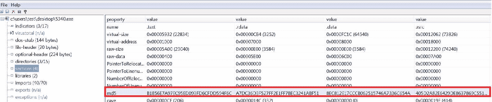

在 Python 中，可以使用 pefile 模块来确定各个部分的哈希值，如下所示：

```
>>> import pefile
>>> pe = pefile.PE("5340.exe")
>>> for section in pe.sections:
...     print "%s\t%s" % (section.Name, section.get_hash_md5())
... 
.text b1b56e7a97ec95ed093fd6cfdd594f6c
.rdata a7dc36d3f527ff2e1ff7bec3241abf51
.data 8ec812e17cccb062515746a7336c654a
.rsrc 405d2a82e6429de8637869c5514b489c
```

在分析恶意软件样本时，你应该考虑为恶意二进制文件生成模糊哈希、imphash 和部分哈希，并将它们存储在一个存储库中；这样，当你遇到一个新的样本时，可以将其与这些哈希进行比较，以确定相似性。

# 7.4 使用 YARA 分类恶意软件

恶意软件样本可以包含许多字符串或二进制指示符；识别对恶意软件样本或恶意软件家族独特的字符串或二进制数据有助于恶意软件的分类。安全研究人员根据二进制文件中包含的独特字符串和二进制指示符来分类恶意软件。有时，恶意软件也可以根据一般特征进行分类。

*YARA* ([`virustotal.github.io/yara/`](http://virustotal.github.io/yara/)) 是一款强大的恶意软件识别和分类工具。恶意软件研究人员可以根据恶意软件样本中包含的文本或二进制信息创建 YARA 规则。这些 YARA 规则由一组字符串和一个布尔表达式组成，布尔表达式决定其逻辑。一旦编写了规则，你可以使用这些规则通过 YARA 工具扫描文件，或者使用 `yara-python` 将其与其他工具集成。本书不会涵盖编写 YARA 规则的所有细节，但包含了足够的信息，帮助你入门。有关编写 YARA 规则的详细信息，请阅读 YARA 文档（[`yara.readthedocs.io/en/v3.7.0/writingrules.html`](http://yara.readthedocs.io/en/v3.7.0/writingrules.html)）。

# 7.4.1 安装 YARA

你可以从([`virustotal.github.io/yara/`](http://virustotal.github.io/yara/))下载并安装*YARA*。在第一章中介绍了在 Ubuntu Linux 虚拟机上安装 YARA 的过程，*恶意软件分析入门*。如果你希望在其他操作系统上安装 YARA，请参阅安装文档：[`yara.readthedocs.io/en/v3.3.0/gettingstarted.html`](http://yara.readthedocs.io/en/v3.3.0/gettingstarted.html)

# 7.4.2 YARA 规则基础

安装完成后，下一步是创建 YARA 规则；这些规则可以是通用的或非常具体的，可以使用任何文本编辑器创建。为了理解 YARA 规则的语法，我们来看一个简单的 YARA 规则示例，它查找任何文件中的可疑字符串，如下所示：

```
rule suspicious_strings
{ 
strings:
    $a = "Synflooding"
    $b = "Portscanner"
    $c = "Keylogger"

condition:
    ($a or $b or $c)
}
```

YARA 规则由以下组件组成：

+   *规则标识符：* 这是描述规则的名称（在前面的示例中为`suspicious_strings`）。规则标识符可以包含任何字母数字字符和下划线字符，但第一个字符不能是数字。规则标识符是区分大小写的，且不能超过 128 个字符。

+   *字符串定义：* 这是定义将成为规则一部分的字符串（文本、十六进制或正则表达式）所在的部分。如果规则不依赖于任何字符串，可以省略此部分。每个字符串都有一个标识符，由一个`$`字符后跟一串字母数字字符和下划线组成。在前面的规则中，`$a`、`$b`和`$c`可以看作是包含值的变量。这些变量随后将在条件部分中使用。

+   *条件部分：* 这不是一个可选部分，逻辑部分就在这里。此部分必须包含一个布尔表达式，指定规则匹配或不匹配的条件。

# 7.4.3 运行 YARA

一旦准备好规则，下一步是使用 yara 工具根据 YARA 规则扫描文件。在前面的示例中，规则查找了三个可疑字符串（分别定义在`$a`、`$b`和`$c`中），并且根据条件，如果文件中存在任何一个字符串，规则就会匹配。该规则保存为`suspicious.yara`，并且对包含恶意软件样本的目录运行 yara 时，返回了两个符合该规则的恶意软件样本：

```
$ yara -r suspicious.yara samples/
suspicious_strings samples//spybot.exe
suspicious_strings samples//wuamqr.exe
```

默认情况下，前面的 YARA 规则将匹配 ASCII 字符串，并执行区分大小写的匹配。如果你希望规则同时检测 ASCII 和 Unicode（宽字符）字符串，那么可以在字符串旁边指定`ascii`和`wide`修饰符。`nocase`修饰符将执行不区分大小写的匹配（即，它会匹配 Synflooding、synflooding、sYnflooding 等）。修改后的规则以实现不区分大小写的匹配，并查找 ASCII 和 Unicode 字符串，如下所示：

```
rule suspicious_strings
{
strings:
    $a = "Synflooding" ascii wide nocase
    $b = "Portscanner" ascii wide nocase
    $c = "Keylogger"   ascii wide nocase
condition:
    ($a or $b or $c)
}
```

运行上述规则检测到包含 ASCII 字符串的两个可执行文件，它还识别了一个包含 Unicode 字符串的文档（`test.doc`）：

```
$ yara suspicious.yara samples/
suspicious_strings samples//test.doc
suspicious_strings samples//spybot.exe
suspicious_strings samples//wuamqr.exe
```

上述规则匹配任何包含这些 ASCII 和 Unicode 字符串的文件。它检测到的文档（`test.doc`）是一个合法文档，且其内容包含了这些字符串。

如果你打算在可执行文件中查找字符串，可以像下面这样创建规则。在以下规则中，条件中的`$mz`*在*`0`处指定 YARA 在文件开头查找签名`4D 5A`（PE 文件的前两个字节）；这确保只有 PE 可执行文件会触发该签名。文本字符串用双引号括起来，而十六进制字符串则用大括号括起来，如`$mz`变量中的情况：

```
rule suspicious_strings
{
strings:
    $mz = {4D 5A}
    $a = "Synflooding" ascii wide nocase
    $b = "Portscanner" ascii wide nocase
    $c = "Keylogger" ascii wide nocase
condition:
    ($mz at 0) and ($a or $b or $c)
}
```

现在，运行上述规则只检测到可执行文件：

```
$ yara -r suspicious.yara samples/
suspicious_strings samples//spybot.exe
suspicious_strings samples//wuamqr.exe
```

# 7.4.4 YARA 的应用

让我们再看一个例子，使用的是*第 6.5 节*中曾经使用过的样本，*检查 PE 资源*。该样本（`5340.exe`）将一个诱饵 Excel 文档存储在它的资源区段；一些恶意软件程序会存储诱饵文档，以便在执行时向用户展示。以下 YARA 规则检测包含嵌入的 Microsoft Office 文档的可执行文件。如果在文件中偏移量大于`1024`字节处找到十六进制字符串（跳过 PE 头），并且`filesize`指定文件末尾，则触发规则：

```
rule embedded_office_document
{
meta:
description = "Detects embedded office document"

strings:
    $mz = { 4D 5A }
    $a = { D0 CF 11 E0 A1 B1 1A E1 }
condition:
    ($mz at 0) and $a in (1024..filesize)
}
```

运行上述 YARA 规则只检测到包含嵌入 Excel 文档的样本：

```
$ yara -r embedded_doc.yara samples/
embedded_office_document samples//5340.exe
```

以下示例通过数字证书的序列号来检测名为*9002 RAT*的恶意软件样本。RAT 9002 使用了序列号为`45 6E 96 7A 81 5A A5 CB B9 9F B8 6A CA 8F 7F 69`的数字证书（[`blog.cylance.com/another-9002-trojan-variant`](https://blog.cylance.com/another-9002-trojan-variant)）。这个序列号可以作为签名，用来检测拥有相同数字证书的样本：

```
rule mal_digital_cert_9002_rat
{
meta:
    description = "Detects malicious digital certificates used by RAT 9002"
    ref = "http://blog.cylance.com/another-9002-trojan-variant"

strings:
    $mz = { 4D 5A }
    $a = { 45 6e 96 7a 81 5a a5 cb b9 9f b8 6a ca 8f 7f 69 }

condition:
    ($mz at 0) and ($a in (1024..filesize))
}
```

运行该规则检测到所有具有相同数字证书的样本，所有这些样本最终都被确定为*RAT 9002*样本：

```
$ yara -r digi_cert_9002.yara samples/
mal_digital_cert_9002_rat samples//ry.dll
mal_digital_cert_9002_rat samples//rat9002/Mshype.dll
mal_digital_cert_9002_rat samples//rat9002/bmp1f.exe
```

YARA 规则也可以用来检测打包器。在*第五部分*，*确定文件混淆*中，我们讨论了如何使用*Exeinfo PE*工具来检测打包器。*Exeinfo PE*使用存储在名为`userdb.txt`的纯文本文件中的签名。以下是*Exeinfo PE*用于检测*UPX*打包器的示例签名格式：

```
[UPX 2.90 (LZMA)]
signature = 60 BE ?? ?? ?? ?? 8D BE ?? ?? ?? ?? 57 83 CD FF EB 10 90 90 90 90 90 90 8A 06 46 88 07 47 01 DB 75 07 8B 1E 83 EE FC 11 DB 72 ED B8 01 00 00 00 01 DB 75 07 8B 1E 83 EE FC 11 DB 11 C0 01 DB
ep_only = true
```

上述签名中的`ep_only=true`意味着*Exeinfo PE*只应在程序入口点的地址处检查签名（即代码开始执行的地方）。上述签名可以转换为 YARA 规则。YARA 的新版本支持*PE*模块，它允许你使用 PE 文件格式的属性和特征来创建针对 PE 文件的规则。如果你使用的是 YARA 的新版本，Exeinfo PE 签名可以转化为如下所示的 YARA 规则：

```
import "pe"
rule UPX_290_LZMA
{
meta:
    description = "Detects UPX packer 2.90"
    ref = "userdb.txt file from the Exeinfo PE"

strings:
    $a = { 60 BE ?? ?? ?? ?? 8D BE ?? ?? ?? ?? 57 83 CD FF EB 10 90 90 90 90 90 90 8A 06 46 88 07 47 01 DB 75 07 8B 1E 83 EE FC 11 DB 72 ED B8 01 00 00 00 01 DB 75 07 8B 1E 83 EE FC 11 DB 11 C0 01 DB }

condition:
    $a at pe.entry_point
} 
```

如果您使用不支持 PE 模块的旧版本的 YARA，则使用以下规则：

```
rule UPX_290_LZMA
{
meta:
    description = "Detects UPX packer 2.90"
    ref = "userdb.txt file from the Exeinfo PE"

strings:
    $a = { 60 BE ?? ?? ?? ?? 8D BE ?? ?? ?? ?? 57 83 CD FF EB 10 90 90 90 90 90 90 8A 06 46 88 07 47 01 DB 75 07 8B 1E 83 EE FC 11 DB 72 ED B8 01 00 00 00 01 DB 75 07 8B 1E 83 EE FC 11 DB 11 C0 01 DB }

condition:
    $a at entrypoint
} 
```

现在，在样本目录上运行一个 yara 规则，检测到使用 UPX 打包的样本：

```
$ yara upx_test_new.yara samples/
UPX_290_LZMA samples//olib.exe
UPX_290_LZMA samples//spybot_packed.exe
```

使用上述方法，Exeinfo PE 的`userdb.txt`中的所有打包器签名都可以转换为 YARA 规则。

*PEiD* 是另一个检测打包器的工具（此工具不再受支持）；它将签名存储在文本文件`UserDB.txt`中。由 Matthew Richard 编写的 Python 脚本*peid_to_yara.py*（Malware Analyst's Cookbook 的一部分）和 Didier Steven 的*peid-userdb-to-yara-rules.py*（[`github.com/DidierStevens/DidierStevensSuite/blob/master/peid-userdb-to-yara-rules.py`](https://github.com/DidierStevens/DidierStevensSuite/blob/master/peid-userdb-to-yara-rules.py)）将`UserDB.txt`签名转换为 YARA 规则。

YARA 可用于检测任何文件中的模式。以下 YARA 规则可检测不同变种的*Gh0stRAT*恶意软件的通信：

```
rule Gh0stRat_communications
{
meta:
Description = "Detects the Gh0stRat communication in Packet Captures"

strings:
$gst1 = {47 68 30 73 74 ?? ?? 00 00 ?? ?? 00 00 78 9c}
$gst2 = {63 62 31 73 74 ?? ?? 00 00 ?? ?? 00 00 78 9c}
$gst3 = {30 30 30 30 30 30 30 30 ?? ?? 00 00 ?? ?? 00 00 78 9c}
$gst4 = {45 79 65 73 32 ?? ?? 00 00 ?? ?? 00 00 78 9c}
$gst5 = {48 45 41 52 54 ?? ?? 00 00 ?? ?? 00 00 78 9c}
$any_variant = /.{5,16}\x00\x00..\x00\x00\x78\x9c/

condition:
any of ($gst*) or ($any_variant)
}
```

在包含网络数据包捕获（pcaps）的目录上运行上述规则，检测到一些 pcaps 中的 GhostRAT 模式，如下所示：

```
$ yara ghost_communications.yara pcaps/
Gh0stRat_communications pcaps//Gh0st.pcap
Gh0stRat_communications pcaps//cb1st.pcap
Gh0stRat_communications pcaps//HEART.pcap
```

分析恶意软件后，您可以创建签名以识别其组件；以下代码显示了一个检测*Darkmegi Rootkit*驱动程序和 DLL 组件的示例 YARA 规则：

```
rule Darkmegi_Rootkit
{
meta:
Description = "Detects the kernel mode Driver and Dll component of Darkmegi/waltrodock rootkit"

strings:
$drv_str1 = "com32.dll"
$drv_str2 = /H:\\RKTDOW~1\\RKTDRI~1\\RKTDRI~1\\objfre\\i386\\RktDriver.pdb/
$dll_str1 = "RktLibrary.dll"
$dll_str2 = /\\\\.\\NpcDark/
$dll_str3 = "RktDownload"
$dll_str4 = "VersionKey.ini"

condition:
(all of them) or (any of ($drv_str*)) or (any of ($dll_str*))
}
```

在分析单个*Darkmegi*样本后创建了上述规则；然而，在包含恶意软件样本的目录上运行上述规则，检测到所有与模式匹配的*Darkmegi* rootkit 样本：

```
$ yara darkmegi.yara samples/
Darkmegi_Rootkit samples//63713B0ED6E9153571EB5AEAC1FBB7A2
Darkmegi_Rootkit samples//E7AB13A24081BFFA21272F69FFD32DBF-
Darkmegi_Rootkit samples//0FC4C5E7CD4D6F76327D2F67E82107B2
Darkmegi_Rootkit samples//B9632E610F9C91031F227821544775FA
Darkmegi_Rootkit samples//802D47E7C656A6E8F4EA72A6FECD95CF
Darkmegi_Rootkit samples//E7AB13A24081BFFA21272F69FFD32DBF
[......................REMOVED..............................]
```

YARA 是一个强大的工具；创建 YARA 规则以扫描已知样本库可以识别和分类具有相同特征的样本。

在规则中使用的字符串可能会产生误报。测试您的签名与已知良好文件，并考虑可能触发误报的情况是个好主意。要编写健壮的 YARA 规则，请阅读[`www.bsk-consulting.de/2015/02/16/write-simple-sound-yara-rules/`](https://www.bsk-consulting.de/2015/02/16/write-simple-sound-yara-rules/)。要生成 YARA 规则，您可以考虑使用 Florian Roth 的*yarGen*（[`github.com/Neo23x0/yarGen`](https://github.com/Neo23x0/yarGen)）或 Joe Security 的 YARA 规则生成器（[`www.yara-generator.net/`](https://www.yara-generator.net/)）。

# 摘要

静态分析是恶意软件分析的第一步；它允许您从二进制文件中提取有价值的信息，并有助于比较和分类恶意软件样本。本章向您介绍了各种工具和技术，使用这些工具和技术可以确定恶意软件二进制的不同方面，而无需执行它。在下一章节*动态分析*中，您将学习如何通过在隔离环境中执行来确定恶意软件的行为。
