# 第三章：动态分析

动态分析（行为分析）涉及通过在隔离环境中执行样本并监控其活动、交互和对系统的影响来分析样本。在上一章中，你学习了不执行嫌疑二进制文件的情况下检查其不同方面的工具、概念和技术。在本章中，我们将基于这些信息，通过动态分析进一步探索嫌疑二进制文件的性质、目的和功能。

你将学习以下主题：

+   动态分析工具及其功能

+   模拟互联网服务

+   动态分析所涉及的步骤

+   监控恶意软件活动并理解其行为

# 1\. 实验环境概述

在进行动态分析时，你将执行恶意软件样本，因此你需要有一个安全的实验环境，以防止生产系统受到感染。为了演示这些概念，我将使用在第一章中配置的隔离实验环境，*恶意软件分析简介*。下图展示了用于执行动态分析的实验环境，且本书中整个实验过程都使用相同的实验架构：

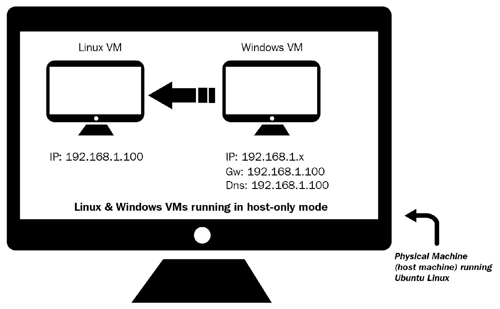

在此设置中，Linux 和 Windows 虚拟机都被配置为使用仅主机网络配置模式。Linux 虚拟机的 IP 地址预配置为`192.168.1.100`，而 Windows 虚拟机的 IP 地址设置为`192.168.1.50`。Windows 虚拟机的默认网关和 DNS 设置为 Linux 虚拟机的 IP 地址（`192.168.1.100`），因此所有 Windows 网络流量都通过 Linux 虚拟机路由。

Windows 虚拟机将在分析过程中用于执行恶意软件样本，Linux 虚拟机将用于监控网络流量，并配置为模拟互联网服务（如 DNS、HTTP 等），以便在恶意软件请求这些服务时提供适当的响应。

# 2\. 系统和网络监控

当恶意软件被执行时，它可以以多种方式与系统交互并执行不同的活动。例如，执行时，恶意软件可能会生成子进程，在文件系统中丢弃附加文件，为其持久性创建注册表键值，下载其他组件或从命令和控制服务器获取命令。监控恶意软件与系统和网络的交互有助于更好地了解恶意软件的性质和目的。

在动态分析过程中，当恶意软件被执行时，你将进行各种监控活动。其目标是收集与恶意软件行为及其对系统影响相关的实时数据。以下列表概述了动态分析过程中进行的不同类型的监控活动：

+   **进程监控**：在恶意软件执行过程中，监控进程活动并检查结果进程的属性。

+   **文件系统监控**：包括监控恶意软件执行期间的实时文件系统活动。

+   **注册表监控**：涉及监控恶意二进制文件访问/修改的注册表键以及正在读取/写入的注册表数据。

+   **网络监控**：涉及监控恶意软件执行期间系统进出流量的实时情况。

前述监控活动有助于收集与恶意软件行为相关的主机和网络信息。接下来的章节将介绍这些活动的实际应用。在下一节中，您将了解可以用于执行这些监控活动的各种工具。

# 3\. 动态分析（监控）工具

在执行动态分析之前，了解您将使用的工具来监控恶意软件行为是至关重要的。本章及整本书将涵盖各种恶意软件分析工具。如果您按照第一章中的说明设置了实验环境，您可以将这些工具下载到您的*主机机器*上，然后将这些工具传输/安装到虚拟机中，并拍摄一个全新的、干净的快照。

本节介绍了各种动态分析工具及其一些功能。稍后在本章中，您将了解如何使用这些工具来监控恶意软件执行过程中的行为。您需要以管理员权限运行这些工具；可以通过右键单击可执行文件并选择“以管理员身份运行”来实现。在阅读过程中，建议您运行这些工具，并熟悉它们的功能。

# 3.1 使用 Process Hacker 检查进程

*Process Hacker*（[`processhacker.sourceforge.net/`](http://processhacker.sourceforge.net/)）是一个开源的多功能工具，帮助监控系统资源。它是检查系统上正在运行的进程并检查进程属性的绝佳工具。它还可以用于探索服务、网络连接、磁盘活动等。

一旦恶意软件样本执行，该工具可以帮助您识别新创建的恶意软件进程（其进程名称和进程 ID），通过右键单击进程名称并选择“属性”，您可以检查各种进程属性。您还可以右键单击进程并终止它。

以下截图展示了 Process Hacker 列出系统上所有正在运行的进程，以及`wininit.exe`的属性：

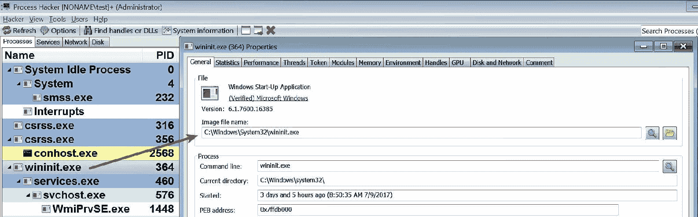

# 3.2 使用 Process Monitor 确定系统与恶意软件的交互

*Process Monitor*（[`technet.microsoft.com/en-us/sysinternals/processmonitor.aspx`](https://technet.microsoft.com/en-us/sysinternals/processmonitor.aspx)）是一个高级监控工具，展示了进程与文件系统、注册表及进程/线程活动的实时交互。

当你运行这个工具（以管理员身份运行）时，你会立刻注意到它会捕获所有系统事件，如下图所示。要停止捕获事件，可以按 Ctrl + E，要清除所有事件，可以按 Ctrl + X。下图展示了在干净系统上由进程监视器捕获的活动：

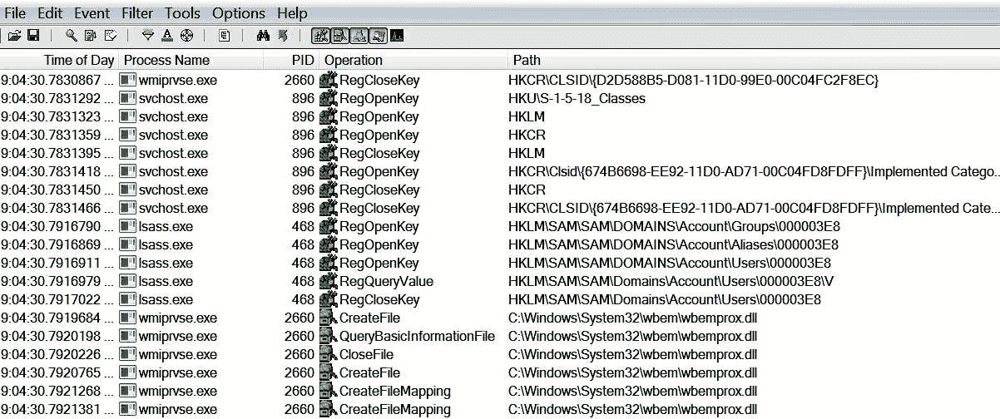

从进程监视器捕获的事件中，你可以看到即使是干净系统也会产生大量活动。在进行恶意软件分析时，你只会对恶意软件产生的活动感兴趣。为了减少噪音，你可以使用过滤功能来隐藏不需要的条目，并根据特定属性进行过滤。要访问此功能，选择过滤器菜单，然后点击过滤（或按 Ctrl + L）。在下面的截图中，过滤器被配置为仅显示与进程`svchost.exe`相关的事件：

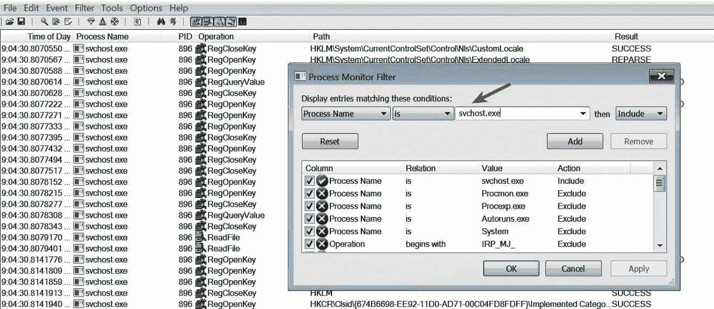

# 3.3 使用 Noriben 记录系统活动

虽然进程监视器是一个监控恶意软件与系统交互的好工具，但它可能会产生大量噪音，需要手动努力去过滤这些噪音。*Noriben*（[`github.com/Rurik/Noriben`](https://github.com/Rurik/Noriben)）是一个与进程监视器配合使用的 Python 脚本，帮助收集、分析和报告恶意软件的运行时指标。使用 Noriben 的优点是它提供了预定义的过滤器，帮助减少噪音，让你可以专注于与恶意软件相关的事件。

要使用 Noriben，首先下载它到你的 Windows 虚拟机中，将其解压到一个文件夹，然后将进程监视器（`Procmon.exe`）复制到同一个文件夹中，最后运行 `Noriben.py` Python 脚本，如下图所示：

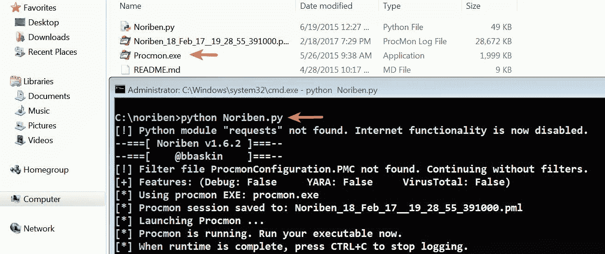

当你运行*Noriben*时，它会启动*进程监视器*。一旦监控完成，你可以通过按 Ctrl + C 停止 Noriben，这将终止进程监视器。终止后，Noriben 会将结果存储在同一目录中的*文本文件*（`.txt`）和*CSV 文件*（`.csv`）中。*文本文件*将根据类别（如进程、文件、注册表和网络活动）将事件分隔成不同部分，如下图所示。还需注意，事件数量大大减少，因为它应用了预定义的过滤器，减少了大部分不必要的噪音：

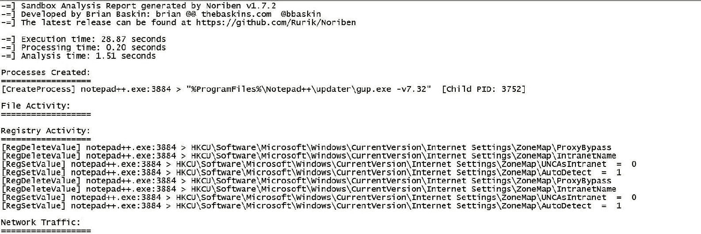

*CSV 文件*包含按时间轴排序的所有事件（进程、文件、注册表和网络活动），如下面的截图所示：

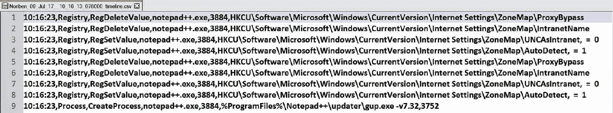

*文本文件*和*CSV*文件可以提供不同的视角。如果你对基于类别的事件摘要感兴趣，可以查看文本文件；如果你对事件发生的顺序感兴趣，可以查看*CSV*文件。

# 3.4 使用 Wireshark 捕获网络流量

当恶意软件执行时，你将希望捕获由恶意软件运行所产生的网络流量；这将帮助你了解恶意软件使用的通信通道，并帮助确定基于网络的指示器。*Wireshark*（[`www.wireshark.org/`](https://www.wireshark.org/)）是一款数据包嗅探器，可以捕获网络流量。在第一章，*恶意软件分析简介*中介绍了如何在*Linux 虚拟机*上安装 Wireshark。要在 Linux 上启动 Wireshark，请运行以下命令：

```
$ sudo wireshark
```

要开始在网络接口上捕获流量，点击捕获 | **选项**（或按*Ctrl + K*），选择网络接口，然后点击开始：

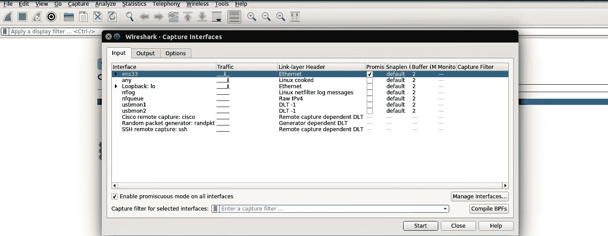

# 3.5 使用 INetSim 模拟服务

大多数恶意软件在执行时会连接到互联网（命令与控制服务器），而允许恶意软件连接到其 C2 服务器并不是一个好主意，而且有时这些服务器可能不可用。在恶意软件分析过程中，你需要在不允许恶意软件与实际的*命令与控制（C2）*服务器联系的情况下，确定恶意软件的行为，但同时，你需要提供恶意软件所需的所有服务，以便它能继续操作。

*INetSim* 是一个免费的基于 Linux 的软件套件，用于模拟标准的互联网服务（如 DNS、HTTP/HTTPS 等）。在第一章，*恶意软件分析简介*中介绍了如何在*Linux 虚拟机*上安装和配置*INetSim*。启动*INetSim*后，它会模拟各种服务，如下所示的输出所示，并且它还运行一个处理定向到非标准端口的虚拟服务：

```
$ sudo inetsim
INetSim 1.2.6 (2016-08-29) by Matthias Eckert & Thomas Hungenberg
Using log directory: /var/log/inetsim/
Using data directory: /var/lib/inetsim/
Using report directory: /var/log/inetsim/report/
Using configuration file: /etc/inetsim/inetsim.conf
Parsing configuration file.
Configuration file parsed successfully.
=== INetSim main process started (PID 2758) ===
Session ID: 2758
Listening on: 192.168.1.100
Real Date/Time: 2017-07-09 20:56:44
Fake Date/Time: 2017-07-09 20:56:44 (Delta: 0 seconds)
 Forking services...
  * irc_6667_tcp - started (PID 2770)
  * dns_53_tcp_udp - started (PID 2760)
  * time_37_udp - started (PID 2776)
  * time_37_tcp - started (PID 2775)
  * dummy_1_udp - started (PID 2788)
  * smtps_465_tcp - started (PID 2764)
  * dummy_1_tcp - started (PID 2787)
  * pop3s_995_tcp - started (PID 2766)
  * ftp_21_tcp - started (PID 2767)
  * smtp_25_tcp - started (PID 2763)
  * ftps_990_tcp - started (PID 2768)
  * pop3_110_tcp - started (PID 2765)
  [...............REMOVED.
..............]
  * http_80_tcp - started (PID 2761)
  * https_443_tcp - started (PID 2762)
 done.
Simulation running.
```

除了模拟服务，*INetSim*还可以记录通信，并且可以配置为响应 HTTP/HTTPS 请求，并根据扩展名返回任何文件。例如，如果恶意软件从 C2 服务器请求一个可执行文件（`.exe`），*INetSim*可以向恶意软件返回一个虚拟的可执行文件。通过这种方式，你可以了解恶意软件在从 C2 服务器下载可执行文件后会做什么。

以下示例演示了*INetSim*的使用。在这个例子中，一个恶意软件样本在*Windows 虚拟机*上执行，并且在*Linux 虚拟机*上使用*Wireshark*捕获网络流量，未启用*INetSim*。以下截图显示了 Wireshark 捕获的流量。它显示了被感染的 Windows 系统（`192.168.1.50`）首先尝试通过解析 C2 域名与 C2 服务器通信，但由于我们的 Linux 虚拟机没有运行 DNS 服务器，该域名无法解析（如端口不可达消息所示）：

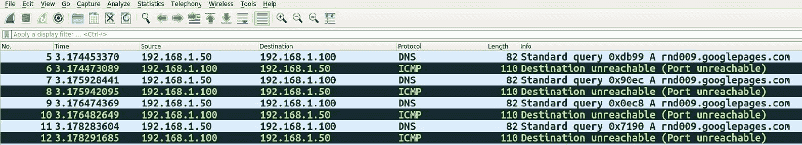

这次，恶意软件被执行，网络流量通过运行 INetSim（模拟服务）的 Linux 虚拟机捕获。从下图可以看到，恶意软件首先解析 C2 域名，解析结果为 Linux 虚拟机的 IP 地址`192.168.1.100`。解析完成后，恶意软件通过 HTTP 通信下载文件（`settings.ini`）：

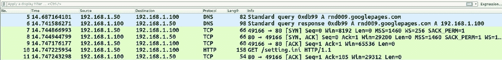

从下图可以看到，HTTP 响应是由 INetSim 模拟的 HTTP 服务器提供的。在这种情况下，HTTP 请求中的`User-Agent`字段表明标准浏览器并未发起该通信，这样的指示可以用于创建网络签名：

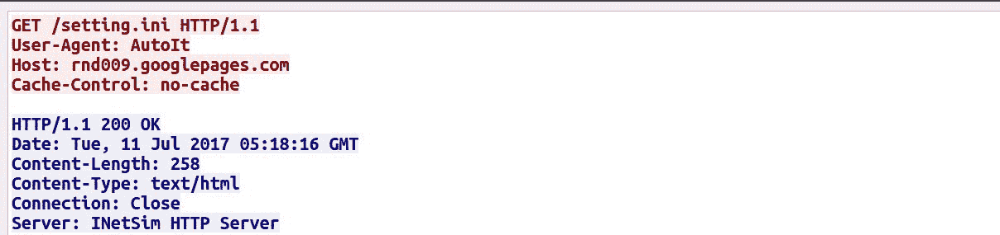

通过模拟服务，成功确定恶意软件在执行后会从 C2 服务器下载文件。像 INetSim 这样的工具可以让安全分析师快速确定恶意软件的行为，并捕获其网络流量，而无需手动配置所有服务（如 DNS、HTTP 等）。

另一个替代*INetSim*的工具是*FakeNet-NG*（[`github.com/fireeye/flare-fakenet-ng`](https://github.com/fireeye/flare-fakenet-ng)），它可以通过模拟网络服务来拦截并重定向所有或特定的网络流量。

# 4. 动态分析步骤

在动态分析（行为分析）*过程中*，你将遵循一系列步骤来确定恶意软件的功能。以下是动态分析过程中涉及的步骤：

+   **恢复到干净的快照**：这包括将虚拟机恢复到干净的状态。

+   **运行监控/动态分析工具**：在此步骤中，你将在执行恶意软件样本之前运行监控工具。为了充分利用前一部分所介绍的监控工具，你需要以管理员权限运行它们。

+   **执行恶意软件样本**：在此步骤中，你将以管理员权限运行恶意软件样本。

+   **停止监控工具**：这包括在恶意软件二进制文件执行指定时间后终止监控工具。

+   **分析结果**：这包括收集监控工具的数据/报告并对其进行分析，以确定恶意软件的行为和功能。

# 5. 将一切整合起来：分析恶意软件可执行文件

一旦你了解了动态分析工具和动态分析过程中涉及的步骤，这些工具可以结合使用，以从恶意软件样本中提取最大的信息。在本节中，我们将执行静态和动态分析，以确定恶意软件样本（`sales.exe`）的特征和行为。

# 5.1 样本的静态分析

我们将从静态分析开始检查恶意软件样本。在静态分析中，由于恶意软件样本没有执行，因此可以在 *Linux 虚拟机* 或 *Windows 虚拟机* 上执行，使用在 第二章 *静态分析* 中讨论的工具和技术。我们将从确定 *文件类型* 和 *加密哈希* 开始。根据以下输出，恶意软件二进制文件是一个 32 位的可执行文件：

```
$ file sales.exe 
sales.exe: PE32 executable (GUI) Intel 80386, for MS Windows
```

```
$ md5sum sales.exe
51d9e2993d203bd43a502a2b1e1193da sales.exe
```

使用 *strings* 工具从二进制文件中提取的 ASCII 字符串包含一组批处理命令的引用，看起来像是删除文件的命令。这些字符串还显示了对批处理文件（`_melt.bat`）的引用，这表明在执行时，恶意软件可能会创建一个批处理（`.bat`）文件并执行这些批处理命令。这些字符串还引用了 `RUN` 注册表键；这很有趣，因为大多数恶意软件会在 `RUN` 注册表键中添加一个条目，以便在重启后仍能保持在系统中：

```
!This program cannot be run in DOS mode.
Rich
.text
`.rdata
@.data
.rsrc
[....REMOVED....]
:over2
If not exist "
" GoTo over1
del "
GoTo over2
:over1
del "
_melt.bat
[....REMOVED....]
Software\Microsoft\Windows\CurrentVersion\Run 
```

检查导入显示出对 *文件系统* 和 *注册表* 相关 API 调用的引用，表明恶意软件能够执行文件系统和注册表操作，如以下输出所示。`WinExec` 和 `ShellExecuteA` API 调用的存在，表明恶意软件有能力调用其他程序（创建新进程）：

```
kernel32.dll
  [.....REMOVED......]
  SetFilePointer
  SizeofResource
  WinExec
  WriteFile
  lstrcatA
  lstrcmpiA
  lstrlenA
  CreateFileA
  CopyFileA
  LockResource
  CloseHandle

shell32.dll
  SHGetSpecialFolderLocation
  SHGetPathFromIDListA
  ShellExecuteA

advapi32.dll
 RegCreateKeyA
 RegSetValueExA
 RegCloseKey
```

从 *VirusTotal* 数据库查询哈希值显示 58 个杀毒软件的检测，签名名称表明我们可能正在处理一个名为 *PoisonIvy* 的恶意软件样本。要从 VirusTotal 执行哈希搜索，你需要互联网访问权限，如果要使用 VirusTotal 的公共 API，则需要一个 API 密钥，您可以通过注册 VirusTotal 账户来获取该密钥：

```
$ python vt_hash_query.py 51d9e2993d203bd43a502a2b1e1193da
Detections: 58/64
VirusTotal Results:
  Bkav ==> None
  MicroWorld-eScan ==> Backdoor.Generic.474970
  nProtect ==> Backdoor/W32.Poison.11776.CM
  CMC ==> Backdoor.Win32.Generic!O
  CAT-QuickHeal ==> Backdoor.Poisonivy.EX4
  ALYac ==> Backdoor.Generic.474970
  Malwarebytes ==> None
  Zillya ==> Dropper.Agent.Win32.242906
  AegisLab ==> Backdoor.W32.Poison.deut!c
  TheHacker ==> Backdoor/Poison.ddpk
  K7GW ==> Backdoor ( 04c53c5b1 )
  K7AntiVirus ==> Backdoor ( 04c53c5b1 )
  Invincea ==> heuristic
  Baidu ==> Win32.Trojan.WisdomEyes.16070401.9500.9998
  Symantec ==> Trojan.Gen
  TotalDefense ==> Win32/Poison.ZR!genus
  TrendMicro-HouseCall ==> TROJ_GEN.R047C0PG617
  Paloalto ==> generic.ml
  ClamAV ==> Win.Trojan.Poison-1487
  Kaspersky ==> Trojan.Win32.Agentb.jan
  NANO-Antivirus ==> Trojan.Win32.Poison.dstuj
  ViRobot ==> Backdoor.Win32.A.Poison.11776
  [..................REMOVED...........................]
```

# 5.2 样本的动态分析

为了了解恶意软件的行为，本章讨论了动态分析工具，并遵循以下动态分析步骤：

1.  Windows 虚拟机和 Linux 虚拟机都已恢复到干净的快照。

1.  在 Windows 虚拟机上，*Process Hacker* 以管理员权限启动，用于确定进程属性，随后执行了 *Noriben* Python 脚本（该脚本又启动了 *Process Monitor*），以检查恶意软件与系统的交互。

1.  在 Linux 虚拟机上，启动了 *INetSim* 模拟网络服务，执行了 *Wireshark* 并配置为捕获网络接口上的网络流量。

1.  在所有监控工具运行时，恶意软件以管理员权限（右键 | 以管理员身份运行）执行了大约 40 秒。

1.  40 秒后，Windows 虚拟机上的 Noriben 被停止，Linux 虚拟机上的 INetSim 和 Wireshark 被停止。

1.  收集并检查了来自监控工具的结果，以了解恶意软件的行为。

在执行动态分析后，通过不同的监控工具确定了以下关于恶意软件的信息：

1.  执行恶意样本 (`sales.exe`) 后，创建了一个名为 `iexplorer.exe` 的新进程，进程 ID 是 `1272`。进程可执行文件位于 `%Appdata%` 目录中。以下截图是 *Process Hacker* 显示的新创建进程的输出：

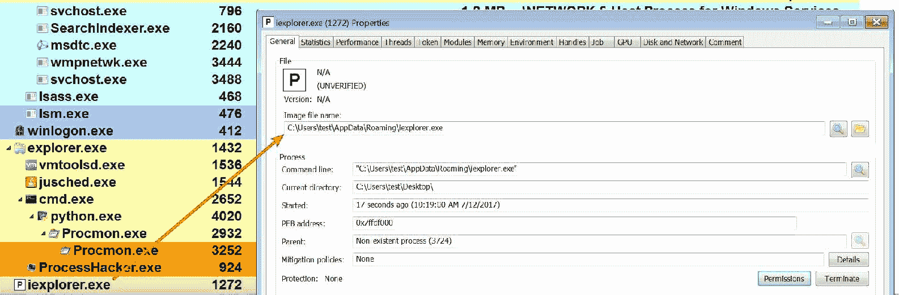

1.  通过检查 Noriben 日志，可以确定恶意软件在 `%AppData%` 目录中放置了一个名为 `iexplorer.exe` 的文件。文件名 (`iexplorer.exe`) 与 Internet Explorer (`iexplore.exe`) 浏览器的文件名相似。这种技术是攻击者有意使恶意二进制看起来像合法可执行文件的一种尝试：

```
[CreateFile] sales.exe:3724 > %AppData%\iexplorer.exe
```

放置文件后，恶意软件执行了该文件。由此产生的新进程 `iexplorer.exe` 就是 *Process Hacker* 显示的进程：

```
[CreateProcess] sales.exe:3724 > "%AppData%\iexplorer.exe"
```

然后，恶意软件放置了另一个名为 `MDMF5A5.tmp_melt.bat` 的文件，如下输出所示。此时可以推断出我们在静态分析期间找到的 `_melt.bat` 字符串与另一个名为 `MDMF5A5.tmp` 的字符串连接在一起，用于生成文件名 `MDMF5A5.tmp_melt.bat`。生成文件名后，恶意软件将此文件名保存到磁盘上：

```
[CreateFile] sales.exe:3724 > %LocalAppData%\Temp\MDMF5A5.tmp_melt.bat
```

然后通过调用 cmd.exe 执行放置的批处理 (`.bat`) 脚本：

```
[CreateProcess] sales.exe:3724 > "%WinDir%\system32\cmd.exe /c %LocalAppData%\Temp\MDMF5A5.tmp_melt.bat"
```

由于 `cmd.exe` 执行了批处理脚本，原始文件 (`sales.exe`) 和批处理脚本 (`MDMF5A5.tmp_melt.bat`) 都被删除，如下代码片段所示。此行为确认了批处理 (`.bat`) 文件的删除功能（回想一下，在字符串提取过程中发现了删除文件的批处理命令）：

```
[DeleteFile] cmd.exe:3800 > %UserProfile%\Desktop\sales.exe
[DeleteFile] cmd.exe:3800 > %LocalAppData%\Temp\MDMF5A5.tmp_melt.bat
```

恶意二进制然后将删除文件的路径添加到 `RUN` 注册表键中以保持持久性，这使得恶意软件能够在系统重新启动后继续运行：

```
[RegSetValue] iexplorer.exe:1272 > HKLM\SOFTWARE\Microsoft\Windows\CurrentVersion\Run\HKLM Key = C:\Users\test\AppData\Roaming\iexplorer.exe
```

1.  从 *Wireshark* 捕获的网络流量中可以看到，恶意软件解析了 C2 域并在端口 `80` 上建立了连接：

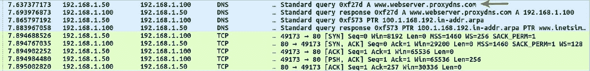

端口 80 通信的 TCP 流，如下截图所示，不是标准的 HTTP 流量；这表明恶意软件可能使用了自定义协议或加密通信。在大多数情况下，恶意软件使用自定义协议或加密其网络流量以避开基于网络的签名。您需要对恶意二进制进行代码分析，以确定网络流量的性质。在接下来的章节中，您将学习执行代码分析的技术，以深入了解恶意软件二进制的内部工作原理：

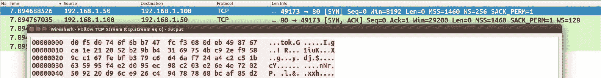

比较放置样本 (`iexplorer.exe`) 的加密哈希和原始二进制 (`sales.exe`) 的哈希显示它们是相同的：

```
$ md5sum sales.exe iexplorer.exe
51d9e2993d203bd43a502a2b1e1193da sales.exe
51d9e2993d203bd43a502a2b1e1193da iexplorer.exe
```

总结来说，当恶意软件被执行时，它会将自身复制到 `%AppData%` 目录下，并命名为 `iexplorer.exe`，然后丢弃一个批处理脚本，该脚本的作用是删除原始二进制文件及其自身。恶意软件接着会在注册表中添加一个条目，以便每次系统启动时都能启动它。该恶意二进制文件可能会加密其网络流量，并使用非标准协议通过端口 80 与 *命令与控制（C2）* 服务器进行通信。

通过结合静态分析和动态分析，成功地确定了恶意二进制文件的特征和行为。这些分析技术还帮助识别了与恶意软件样本相关的网络和主机基础的指标。

事件响应团队利用从恶意软件分析中确定的指标，创建网络和主机基础的签名，以检测网络上的其他感染。当进行恶意软件分析时，记录下那些能够帮助你或你的事件响应团队检测网络上感染主机的指标。

# 6\. 动态链接库（DLL）分析

*动态链接库（DLL）* 是一个包含函数（称为 *导出函数* 或 *exports*）的模块，这些函数可以被其他程序（如可执行文件或 DLL）使用。可执行文件可以通过从 DLL 导入来使用 DLL 中实现的函数。

Windows 操作系统包含许多导出各种函数的 DLL，这些函数被称为 *应用程序编程接口（APIs）*。这些 DLL 中包含的函数供进程用于与文件系统、进程、注册表、网络和图形用户界面（GUI）进行交互。

要在 *CFF Explorer* 工具中显示导出的函数，加载导出函数的 PE 文件并点击 Export Directory。下方的截图展示了 `Kernel32.dll` 导出的一些函数（它是一个操作系统 DLL，位于 `C:\Windows\System32` 目录）。`Kernel32.dll` 导出的一项函数是 `CreateFile`；该 API 函数用于创建或打开文件：

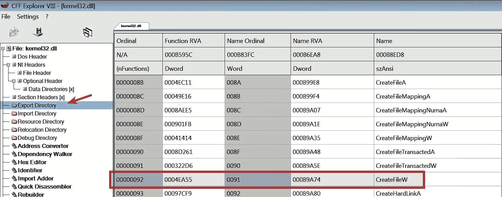

在下方的截图中，可以看到 `notepad.exe` 导入了 `kernel32.dll` 导出的部分函数，包括 `CreateFile` 函数。当你用记事本打开或创建文件时，它会调用在 `Kernel32.dll` 中实现的 `CreateFile` API：

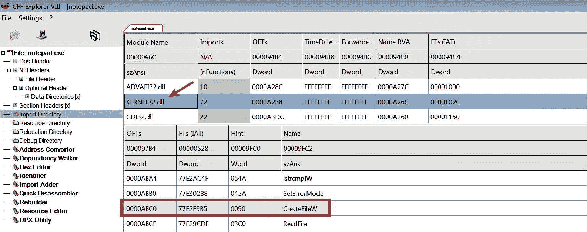

在前面的示例中，`notepad.exe` 并不需要在其代码中实现创建或打开文件的功能。为了实现这一点，它只需导入并调用在 `Kernel32.dll` 中实现的 `CreateFile` API。实现 DLL 的优势在于，其代码可以被多个应用程序共享。如果一个应用程序想要调用 API 函数，它必须先加载导出该 API 的 DLL 副本到其内存空间中。

如果你想了解更多关于动态链接库的知识，请阅读以下文档：[`support.microsoft.com/en-us/help/815065/what-is-a-dll`](https://support.microsoft.com/en-us/help/815065/what-is-a-dll) 和 [`msdn.microsoft.com/en-us/library/windows/desktop/ms681914(v=vs.85).aspx`](https://msdn.microsoft.com/en-us/library/windows/desktop/ms681914(v=vs.85).aspx)。

# 6.1 攻击者为什么使用 DLL

你经常会看到恶意软件作者将他们的恶意代码以 DLL 而非可执行文件的形式分发。以下列出了一些攻击者将其恶意代码实现为 DLL 的原因：

+   双击无法执行 DLL；DLL 需要一个主机进程来运行。通过将恶意代码分发为 DLL，恶意软件作者可以将他/她的 DLL 加载到任何进程中，包括合法进程如 `Explorer.exe`、`winlogon.exe` 等。这种技术使攻击者能够隐藏恶意软件的行为，所有恶意活动看起来都是源自主机进程。

+   将 DLL 注入到已运行的进程中使攻击者能够在系统上持久存在。

+   当 DLL 被一个进程加载到其内存空间时，DLL 将访问整个进程的内存空间，从而使其能够操纵进程的功能。例如，攻击者可以将 DLL 注入到浏览器进程中，并通过重定向其 API 函数来窃取凭据。

+   分析 DLL 不像分析可执行文件那样直接，可能更加棘手。

大多数恶意软件样本会释放或下载一个 DLL，然后将该 DLL 加载到另一个进程的内存空间中。加载完 DLL 后，传播者/加载器组件会自行删除。因此，在进行恶意软件调查时，你可能只会找到 DLL。接下来的部分介绍了分析 DLL 的技术。

# 6.2 使用 rundll32.exe 分析 DLL

要确定恶意软件的行为并通过动态分析监控其活动，理解如何执行 DLL 是至关重要的。如前所述，DLL 需要一个进程来运行。在 Windows 上，可以使用 `rundll32.exe` 来启动 DLL 并调用 DLL 中导出的函数。以下是使用 `rundll32.exe` 启动 DLL 并调用导出函数的语法：*：*

```
rundll32.exe <full path to dll>,<export function> <optional arguments>
```

与 `rundll32.exe` 相关的参数解释如下：

+   **DLL 的完整路径：** 指定 DLL 的完整路径，该路径不能包含空格或特殊字符。

+   **导出函数：** 这是 DLL 中加载后将调用的函数。

+   **可选参数：** 参数是可选的，如果提供，则在调用导出函数时将传递这些参数。

+   **逗号：** 这是放置在 DLL 的完整路径和导出函数之间的符号。导出函数对于语法的正确性是必需的。

# 6.2.1 rundll32.exe 的工作方式

理解`rundll32.exe`的工作原理对于避免在运行 DLL 时发生错误非常重要。当你使用前述命令行参数启动`rundll32.exe`时，`rundll32.exe`将执行以下步骤：

1.  传递给`rundll32.exe`的命令行参数首先会经过验证；如果语法不正确，`rundll32.exe`会终止。

1.  如果语法正确，它会加载提供的 DLL。加载 DLL 后，DLL 的入口点函数将被执行（该函数会进一步调用`DLLMain`函数）。大多数恶意软件会在`DLLMain`函数中实现其恶意代码。

1.  加载 DLL 后，`rundll32.exe`会获取导出函数的地址并调用该函数。如果无法确定该函数的地址，`rundll32.exe`将终止。

1.  如果提供了可选参数，那么在调用导出函数时，这些可选参数将作为参数传递给该函数。

关于 rundll32 接口及其工作原理的详细信息，请参见本文：[`support.microsoft.com/en-in/help/164787/info-windows-rundll-and-rundll32-interface`](https://support.microsoft.com/en-in/help/164787/info-windows-rundll-and-rundll32-interface)。

# 6.2.2 使用 rundll32.exe 启动 DLL

在恶意软件调查中，你会遇到不同版本的 DLL。了解如何识别和分析它们对于确定其恶意行为至关重要。以下示例涵盖了涉及 DLL 的不同场景。

# 示例 1 – 分析一个没有导出的 DLL

每当加载 DLL 时，它的入口点函数都会被调用（该函数会进一步调用其`DLLMain`函数）。攻击者可以在`DLLMain`函数中实现恶意功能（如键盘记录、信息窃取等），而无需导出任何函数。

在以下示例中，恶意 DLL（`aa.dll`）不包含任何导出，这说明所有恶意功能可能都实现于其`DLLmain`函数中，只有当 DLL 被加载时（从`DLL 入口点`调用），该函数才会被执行。从以下截图可以看出，恶意软件从`wininet.dll`导入函数（该库导出了与 HTTP 或 FTP 相关的函数）。这表明恶意软件可能在`DLLMain`函数内调用这些网络函数，通过 HTTP 或 FTP 协议与 C2 服务器进行交互：

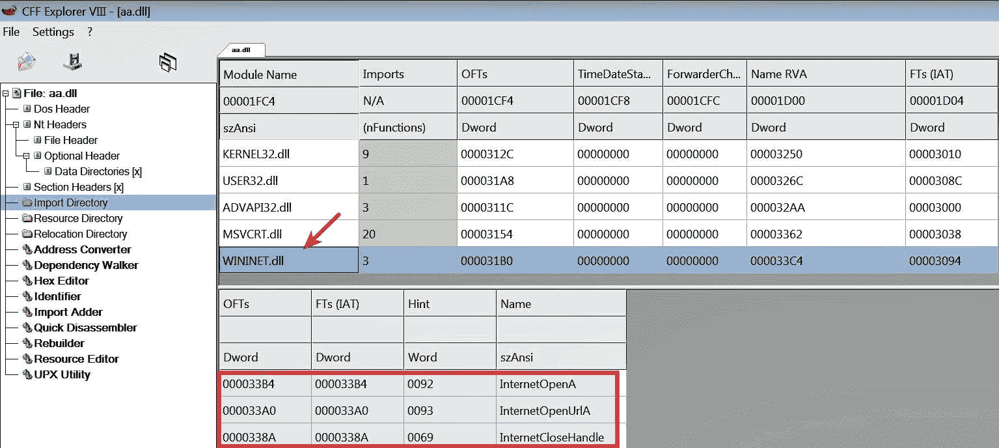

你可能会认为，由于没有导出函数，可以使用以下语法执行一个 DLL：

```
C:\>rundll32.exe C:\samples\aa.dll
```

当你使用前述语法运行 DLL 时，DLL 不会成功执行；同时，你也不会收到任何错误提示。原因是，当`rundll32.exe`验证命令行语法时（*第 1 步*，详见*第 6.2.1 节 rundll32.exe 的工作原理*），语法检查未通过。因此，`rundll32.exe`会在未加载 DLL 的情况下退出。

你需要确保命令行语法正确，才能成功加载 DLL。以下输出中显示的命令应该能够成功运行 DLL。在以下命令中，`test` 是一个虚拟名称，并没有这样一个导出函数，它只是用来确保命令行语法是正确的。在运行以下命令之前，我们在本章中提到的各种监控工具（Process Hacker、Noriben、Wireshark、Inetsim）已启动：

```
C:\>rundll32.exe C:\samples\aa.dll,test
```

运行命令后，收到以下错误信息，但 DLL 已成功执行。在这种情况下，由于语法正确，`rundll32.exe` 加载了 DLL（*步骤 2,* 在 *第 6.2.1 节* *rundll32.exe 的工作原理* 中提到）。因此，调用了它的 `DLL 入口点` 函数（进而调用了 `DLLMain`，其中包含恶意代码）。然后，`rundll32.exe` 尝试查找导出函数 `test` 的地址（这就是 *步骤 3,* 在 *第 6.2.1 节* *rundll32.exe 的工作原理* 中提到）。由于找不到 `test` 的地址，显示了以下错误信息。尽管显示了错误信息，DLL 还是成功加载了（这正是我们希望监控其活动的原因）：

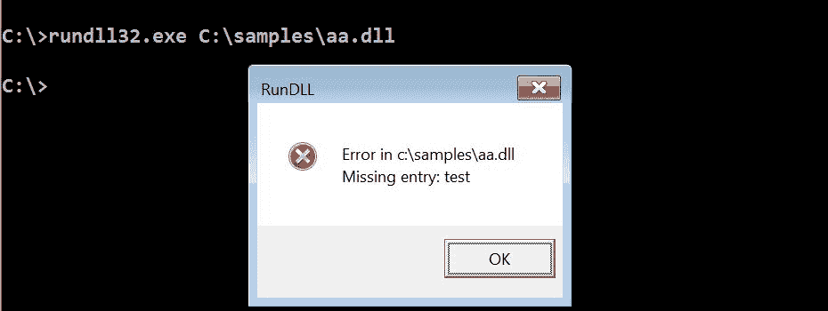

执行后，恶意软件与 C2 域建立了 HTTP 连接，并下载了一个文件（`Thanksgiving.jpg`），如下所示的 *Wireshark* 输出所示：

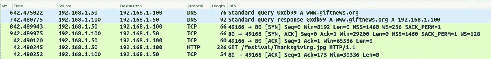

# 示例 2 – 分析包含导出函数的 DLL

在这个示例中，我们将查看另一个恶意 DLL（`obe.dll`）。以下截图显示了该 DLL 导出的两个函数（`DllRegisterServer` 和 `DllUnRegisterServer`）：

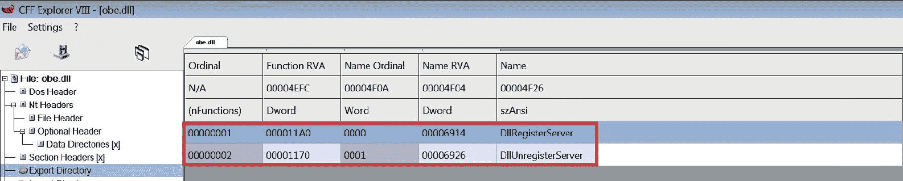

该 DLL 示例通过以下命令运行。尽管 `obe.dll` 已加载到 `rundll32.exe` 的内存中，但没有触发任何行为。这是因为 DLL 的入口点函数没有实现任何功能：

```
C:\>rundll32.exe c:\samples\obe.dll,test
```

另一方面，通过运行以下带有 `DllRegisterServer` 函数的示例，触发了与 C2 服务器的 HTTPS 通信。由此可以推断出 `DLLRegisterServer` 实现了网络功能：

```
C:\>rundll32.exe c:\samples\obe.dll,DllRegisterServer
```

以下截图显示了 Wireshark 捕获的网络流量：

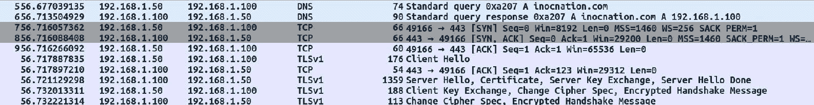你可以编写一个脚本来确定 DLL 中的所有导出函数（如在 第二章 *静态分析* 中所述），并在运行监控工具时按顺序调用它们。这种技术有助于理解每个导出函数的功能。DLLRunner（[`github.com/Neo23x0/DLLRunner`](https://github.com/Neo23x0/DLLRunner)）是一个执行 DLL 中所有导出函数的 Python 脚本。

# 示例 3 – 分析接受导出参数的 DLL

以下示例展示了如何分析一个接受导出参数的 DLL。此示例中使用的 DLL 是通过 PowerPoint 传送的，具体描述见此链接：[`securingtomorrow.mcafee.com/mcafee-labs/threat-actors-use-encrypted-office-binary-format-evade-detection/`](https://securingtomorrow.mcafee.com/mcafee-labs/threat-actors-use-encrypted-office-binary-format-evade-detection/)。

DLL（`SearchCache.dll`）包含一个导出函数`_flushfile@16`，其功能是删除文件。该导出函数接受一个参数，即要删除的文件：

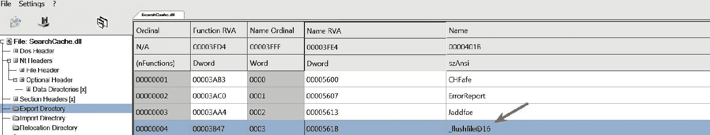

为了演示删除功能，创建了一个测试文件（`file_to_delete.txt`），并启动了监控工具。测试文件通过以下命令被传递给导出函数`_flushfile@16`。运行以下命令后，测试文件被从磁盘中删除：

```
rundll32.exe c:\samples\SearchCache.dll,_flushfile@16 C:\samples\file_to_delete.txt
```

以下是 Noriben 日志的输出，显示`rundll32.exe`删除文件`(file_to_delete.txt)`：

```
Processes Created:[CreateProcess] cmd.exe:1100 > "rundll32.exe  c:\samples\SearchCache.dll,_flushfile@16 C:\samples\file_to_delete.txt" [Child PID: 3348]

File Activity: [DeleteFile] rundll32.exe:3348 > C:\samples\file_to_delete.txt
```

为了确定导出函数接受的参数及其类型，您需要执行代码分析。您将在接下来的章节中学习代码分析技巧。

# 6.3 分析带有进程检查的 DLL

大多数情况下，使用`rundll32.exe`启动 DLL 时会正常工作，但某些 DLL 会检查它们是否在特定进程下运行（例如`explorer.exe`或`iexplore.exe`），并且如果它们在其他进程下运行（包括`rundll32.exe`），可能会改变行为或终止自己。在这种情况下，您需要将 DLL 注入到特定进程中以触发其行为。

使用*RemoteDLL*（[`securityxploded.com/remotedll.php`](http://securityxploded.com/remotedll.php)）这样的工具，可以将 DLL 注入到系统中的任何正在运行的进程。它允许通过三种不同的方法注入 DLL；这很有用，因为如果一种方法失败，可以尝试另一种方法。

以下示例中使用的 DLL（`tdl.dll`）是*TDSS Rootkit*的一部分。该 DLL 不包含任何导出项；所有的恶意行为都在 DLL 的`入口点`函数中实现。使用以下命令运行 DLL 时，出现了一个错误，提示 DLL 初始化例程失败，这表明`DLL 入口点`函数未能成功执行：

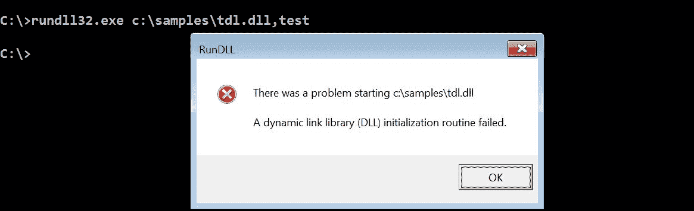

为了理解触发错误的条件，进行了静态代码分析（逆向工程）。分析代码后发现，DLL 在其入口点函数中进行了检查，判断它是否在`spoolsv.exe`（打印机后台处理程序服务）下运行。如果它在任何其他进程下运行，则 DLL 初始化失败：

目前，暂时不用担心如何执行代码分析。您将在接下来的章节中学习如何执行代码分析的技巧。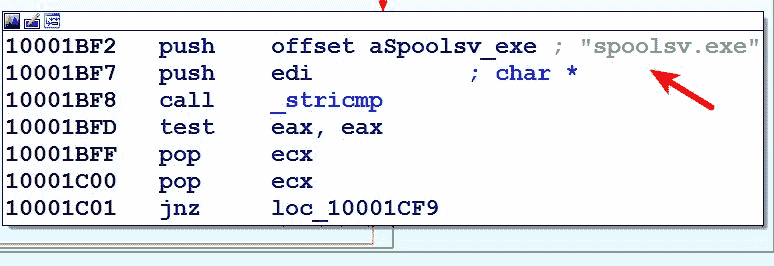

为触发该行为，恶意 DLL 必须通过 *RemoteDLL* 工具注入到 `spoolsv.exe` 进程中。注入 DLL 到 `spoolsv.exe` 后，监控工具捕获到了以下活动。恶意软件在 `C:\` 盘上创建了一个文件夹（`resycled`）和一个文件 `autorun.inf`。然后，它将一个文件 `boot.com` 投放到新创建的文件夹 `C:\resycled` 中：

```
[CreateFile] spoolsv.exe:1340 > C:\autorun.inf
[CreateFolder] spoolsv.exe:1340 > C:\resycled
[CreateFile] spoolsv.exe:1340 > C:\resycled\boot.com
```

恶意软件添加了以下注册表项；从这些添加的项中可以看出，恶意软件在注册表中存储了一些加密数据或配置信息：

```
[RegSetValue] spoolsv.exe:1340 > HKCR\extravideo\CLSID\(Default) = {6BF52A52-394A-11D3-B153-00C04F79FAA6}
[RegSetValue] spoolsv.exe:1340 > HKCR\msqpdxvx\msqpdxpff = 8379
[RegSetValue] spoolsv.exe:1340 > HKCR\msqpdxvx\msqpdxaff = 3368
[RegSetValue] spoolsv.exe:1340 > HKCR\msqpdxvx\msqpdxinfo =}gx~yc~dedomcyjloumllqYPbc
[RegSetValue] spoolsv.exe:1340 > HKCR\msqpdxvx\msqpdxid = qfx|uagbhkmohgn""YQVSVW_,(+
[RegSetValue] spoolsv.exe:1340 > HKCR\msqpdxvx\msqpdxsrv = 1745024793
```

以下截图显示了恶意软件在 `80` 端口上的 C2 通信：

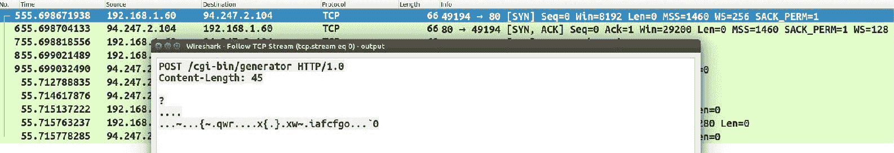在恶意软件调查过程中，你将遇到仅在被加载为服务时才会运行的 DLL。这类 DLL 被称为 *服务 DLL*。要完全理解服务 DLL 的工作原理，需要掌握代码分析和 Windows API 知识，这将在后续章节中介绍。

# 总结

动态分析是一种很好的技术，可以帮助理解恶意软件的行为，并确定其网络和主机相关的指标。你可以使用动态分析来验证在静态分析过程中获得的发现。将静态分析和动态分析相结合，有助于你更好地理解恶意软件的二进制文件。基本的动态分析有其局限性，若要深入了解恶意软件二进制文件的工作原理，就需要进行代码分析（逆向工程）。

例如，本章中使用的大部分恶意软件样本通过加密通信与其 C2 服务器进行通信。通过动态分析，我们仅能确定通信是加密的，但要了解恶意软件如何加密流量以及加密了哪些数据，你需要学习如何进行代码分析。

在接下来的几章中，你将学习执行代码分析的基础知识、工具和技术。
