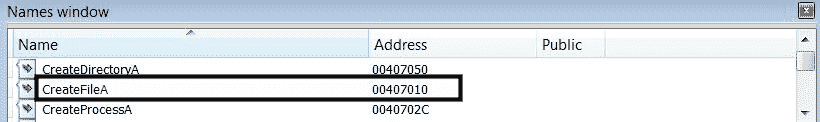

# 第五章：使用 IDA 进行反汇编

*代码分析*通常用于在无法获得源代码的情况下理解恶意二进制文件的内部工作原理。在前一章中，你学习了代码分析的技巧和方法，如何解读汇编代码并理解程序的功能；我们使用的程序是简单的 C 程序，但当你处理恶意软件时，它可能包含数千行代码和数百个函数，这使得跟踪所有变量和函数变得困难。

代码分析工具提供了多种功能来简化代码分析。本章将介绍一个这样的代码分析工具，名为*IDA Pro*（*也称为*IDA*）。你将学习如何利用 IDA Pro 的功能来增强你的反汇编工作。在深入了解 IDA 的功能之前，让我们先了解一下不同的代码分析工具。

# 1. 代码分析工具

代码分析工具可以根据其功能进行分类，具体如下所述。

*反汇编器*是一个将机器码转换回汇编代码的程序；它允许你进行静态代码分析。*静态代码分析*是一种可以用来解读代码以理解程序行为的技术，无需执行二进制文件。

*调试器*是一个也能进行代码反汇编的程序；除此之外，它还允许你以受控的方式执行已编译的二进制文件。使用调试器，你可以执行单条指令或选择的函数，而不是执行整个程序。调试器允许你进行*动态代码分析*，并帮助你在程序运行时检查可疑二进制文件的各个方面。

*反编译器*是一个将机器码转换为高级语言（伪代码）代码的程序。反编译器可以极大地帮助你进行逆向工程，并简化你的工作。

# 2. 使用 IDA 进行静态代码分析（反汇编）

*Hex-Rays IDA Pro* 是最强大且最受欢迎的商业反汇编/调试工具（[`www.hex-rays.com/products/ida/index.shtml`](https://www.hex-rays.com/products/ida/index.shtml)）；它被逆向工程师、恶意软件分析师和漏洞研究人员广泛使用。IDA 可以在多种平台上运行（Windows、Linux 和 macOS），并支持分析多种文件格式，包括 *PE/ELF/Macho-O* 格式。除了商业版本，IDA 还提供了另外两个版本：*IDA 演示版（评估版）* 和 *IDA 免费版；* 这两个版本都有一些限制。你可以从 [`www.hex-rays.com/products/ida/support/download_freeware.shtml`](https://www.hex-rays.com/products/ida/support/download_freeware.shtml) 下载适用于非商业用途的 *免费版*。在写这本书时，分发的免费版是 IDA 7.0；它允许你反汇编 32 位和 64 位 Windows 二进制文件，但你将无法使用免费版进行调试。你可以通过填写表格（[`out7.hex-rays.com/demo/request`](https://out7.hex-rays.com/demo/request)）请求 *演示版（评估版）*；它允许你反汇编 32 位和 64 位 Windows 二进制文件，并且可以调试 32 位二进制文件（但不能调试 64 位二进制文件）。演示版的另一个限制是你无法保存数据库（稍后会在本章中介绍）。演示版和免费版都不支持 *IDAPython*。*商业版* 的 IDA 不会缺少任何功能，并提供全年的免费电子邮件支持和升级服务。

在本节以及后续章节中，我们将探讨 IDA Pro 的各种功能，你将学习如何使用 IDA 进行*静态代码分析（反汇编）*。由于无法涵盖 IDA 的所有功能，本章节仅介绍与恶意软件分析相关的功能。如果你有兴趣深入了解 IDA Pro，建议阅读 Chris Eagle 的书籍，《*The IDA Pro Book (第二版)*》。为了更好地理解 IDA，建议你加载一个二进制文件，并在阅读本节及后续章节时探索 IDA 的各种功能。记住，IDA 不同版本的功能有所限制。如果你使用的是*商业版*，你将能够探索本书中涵盖的所有功能。如果你使用的是*演示版*，你只能探索反汇编和调试功能（仅限 32 位二进制文件），但无法测试*IDAPython* 脚本功能。如果你使用的是*免费版*，你只能试用反汇编功能（无法调试，也无法使用 IDAPython 脚本）。我强烈推荐使用*商业版*或*演示版*的 IDA，使用这些版本你将能够体验本书中涵盖的所有或大部分功能。如果你希望查看其他调试工具以调试 32 位和 64 位二进制文件，可以使用 *x64dbg*（一个开源的 x64/x86 调试器），它将在下一章中介绍。了解了不同版本的 IDA 后，让我们开始探索其功能，你将明白它如何加速你的逆向工程和恶意软件分析工作。

# 2.1 在 IDA 中加载二进制文件

要加载可执行文件，启动 IDA Pro（右键点击并选择“以管理员身份运行”）。当你启动 IDA 时，它会简短地显示一个屏幕，展示你的许可信息；随后，你将看到以下界面。选择“新建”，并选择你希望分析的文件。如果你选择“开始”，IDA 会打开一个空的工作区。要加载文件，你可以直接拖放文件，或者点击“文件 | 打开”并选择文件：


您提供给 IDA 的文件将被加载到内存中（IDA 像 Windows 加载器一样工作）。为了将文件加载到内存中，IDA 会确定最佳加载器，并从文件头部确定在反汇编过程中应使用的处理器类型。选择文件后，IDA 会显示加载对话框（如以下截图所示）。从截图中可以看到，IDA 确定了合适的加载器（`pe.ldw`和`dos.ldw`）以及处理器类型。如果您使用的是 IDA 演示版本，您将看不到“二进制文件”选项。该选项用于 IDA 加载它无法识别的文件。通常在处理 shellcode 时，您会使用此选项。默认情况下，IDA 不会在反汇编中加载*PE 头部*和*资源*部分。通过使用手动加载复选框选项，您可以手动指定可执行文件应加载的基地址，并且 IDA 会提示您是否加载每个部分，包括 PE 头部：


点击“确定”后，IDA 将文件加载到内存中，反汇编引擎开始反汇编机器代码。反汇编后，IDA 会执行初步分析，识别编译器、函数参数、局部变量、库函数及其参数。可执行文件加载后，您将进入 IDA 桌面，显示程序的反汇编输出。

# 2.2 探索 IDA 显示界面

IDA 桌面将许多常见静态分析工具的功能集成到一个界面中。本节将帮助您了解 IDA 桌面及其各种窗口。以下截图显示了加载可执行文件后的 IDA 桌面。IDA 桌面包含多个标签（如 IDA 视图-A、Hex 视图-1 等）；点击每个标签会显示不同的窗口。每个窗口显示从二进制文件提取的不同信息。您还可以通过查看 | 打开子视图菜单添加额外的标签：


# 2.2.1 反汇编窗口

在可执行文件加载后，您将看到反汇编窗口（也称为 IDA 视图窗口）。这是主要窗口，显示反汇编后的代码。您将主要使用这个窗口来分析二进制文件。

IDA 可以通过两种显示模式显示反汇编代码：*图形视图*和*文本视图*。*图形视图*是默认视图，当反汇编视图（IDA 视图）处于活动状态时，您可以通过按空格键在图形视图和文本视图之间切换。

在图形视图模式下，IDA 一次只显示一个函数，以流程图样式展示，且每个函数被分解成基本块。此模式有助于快速识别*分支*和*循环*语句。在图形视图中，箭头的颜色和方向表示根据特定决策将采取的路径。*条件跳转*使用*绿色*和*红色*箭头；*绿色*箭头表示如果条件为真，跳转将会发生，*红色*箭头表示跳转不会发生（正常流程）。*蓝色*箭头表示*无条件*跳转，而循环由向上（向后）的*蓝色*箭头表示。在图形视图中，虚拟地址默认不显示（这是为了最小化每个基本块所需显示的空间）。要显示虚拟地址信息，可以点击选项 | 常规并启用行前缀。

下图展示了`main`函数在图形视图模式下的反汇编。注意在地址`0x0040100B`和`0x0040100F`处的条件检查。如果条件为真，控制会转移到地址`0x0040101A`（由绿色箭头表示），如果条件为假，控制会转移到`0x00401011`（由红色箭头表示）。换句话说，*绿色箭头*表示跳转，*红色箭头*表示正常流程：


在*文本视图*模式下，整个反汇编呈线性展示。下图展示了相同程序的文本视图；虚拟地址默认以`<节名称>:<虚拟地址>`的格式显示。文本视图窗口的左侧部分称为*箭头窗口*，用于表示程序的非线性流程。*虚线箭头*表示`条件跳转`，*实线箭头*表示`无条件跳转`，而*向后箭头*（指向上的箭头）表示循环：


# 2.2.2 函数窗口

*函数窗口*展示了 IDA 识别的所有函数，并显示每个函数的虚拟地址、函数大小以及其他各种属性。你可以双击任何函数跳转到选定的函数。每个函数都与各种标志（如`R`、`F`、`L`等）关联。你可以在帮助文件中获取这些标志的更多信息（按*F1*键）。一个有用的标志是`L`标志，表示该函数是*库函数*。库函数是编译器生成的，并不是恶意软件作者编写的；从代码分析的角度来看，我们关注的是分析恶意软件代码，而不是库代码。

# 2.2.3 输出窗口

*输出窗口* 显示 IDA 和 IDA 插件生成的消息。这些消息可以提供有关二进制分析和你所执行的各种操作的信息。你可以查看输出窗口的内容，以了解当可执行文件被加载时，IDA 执行的各种操作。

# 2.2.4 十六进制视图窗口

你可以点击 Hex View-1 标签来显示 *十六进制窗口*。十六进制窗口显示了一系列字节的十六进制转储和 ASCII 格式。默认情况下，十六进制窗口与反汇编窗口同步；这意味着，当你在反汇编窗口中选择任何项时，相应的字节会在十六进制窗口中高亮显示。十六进制窗口对于检查内存地址的内容非常有用。

# 2.2.5 结构窗口

点击 Structures 标签将打开结构窗口。结构窗口列出了程序中使用的标准数据结构的布局，并且还允许你创建自己的数据结构。

# 2.2.6 导入窗口

*导入窗口* 列出了二进制文件所导入的所有函数。下图显示了导入的函数以及这些函数所在的共享库（DLL）。有关导入的详细信息，请参见 第二章*，静态分析*：


# 2.2.7 导出窗口

*导出窗口* 列出了所有已导出的函数。已导出的函数通常位于 DLL 文件中，因此当你分析恶意 DLL 时，这个窗口会非常有用。

# 2.2.8 字符串窗口

默认情况下，IDA 不显示 *字符串窗口*；你可以通过点击 View | Open Subviews | Strings（或 *Shift* + *F12*）来打开字符串窗口。字符串窗口显示从二进制文件中提取的字符串列表及其地址。默认情况下，字符串窗口仅显示长度至少为五个字符的 *以 null 结尾的 ASCII 字符串*。在 第二章*，静态分析* 中，我们看到恶意二进制文件可能使用 *UNICODE 字符串*。你可以配置 IDA 显示不同类型的字符串；为此，在字符串窗口中，右键点击 Setup（或 *Ctrl* + *U*），勾选 Unicode C-style（16 位），然后点击 OK**。**

# 2.2.9 段窗口

段窗口可以通过 View | Open Subviews | Segments（或 *Shift* + *F7*）打开。段窗口列出了二进制文件中的各个段（`.text`、`.data` 等）。显示的信息包含每个段的 *起始地址*、*结束地址* 和 *内存权限*。起始和结束地址指定了每个段在运行时映射到内存中的虚拟地址。

# 2.3 使用 IDA 改进反汇编

在本节中，我们将探索 IDA 的各种功能，您将学习如何将前一章中获得的知识与 IDA 提供的功能相结合，以增强反汇编过程。考虑以下简单程序，它将一个局部变量的内容复制到另一个局部变量中：

```
int main()
{
  int x = 1;
  int y;
  y = x;
  return 0;
}
```

在编译上述代码并将其加载到 IDA 后，程序反汇编为以下内容：

```
.text:00401000 ; Attributes: bp-based frame ➊
.text:00401000
.text:00401000 ; ➋ int __cdecl main(int argc, const char **argv, const char **envp)
.text:00401000  ➐ _main proc near
.text:00401000
.text:00401000    var_8= dword ptr -8  ➌
.text:00401000    var_4= dword ptr -4  ➌
.text:00401000    argc= dword ptr 8   ➌
.text:00401000    argv= dword ptr 0Ch  ➌
.text:00401000    envp= dword ptr 10h  ➌
.text:00401000
.text:00401000    push ebp  ➏   
.text:00401001    mov ebp, esp  ➏
.text:00401003    sub esp, 8  ➏  .text:00401006    mov ➍ [ebp+var_4], 1
.text:0040100D    mov eax, [ebp+var_4] ➍
.text:00401010    mov ➎ [ebp+var_8], eax
.text:00401013    xor eax, eax 
.text:00401015    mov esp, ebp  ➏
.text:00401017    pop ebp  ➏
.text:00401018    retn
```

当一个可执行文件被加载时，IDA 会对每个反汇编的函数进行分析，以确定*栈帧*的布局。除此之外，IDA 还使用各种签名并运行模式匹配算法，来判断反汇编的函数是否与 IDA 已知的任何签名匹配。在➊处，注意在执行初步分析后，IDA 添加了一条注释（该注释以分号开始），它告诉你使用的是基于`ebp`的栈帧；这意味着`ebp`寄存器被用来引用局部变量和函数参数（关于`ebp`基栈帧的详细内容，我们在前一章讨论函数时已涉及）。在➋处，IDA 利用其强大的检测功能识别该函数为`main`函数，并插入了`function prototype`注释。在分析过程中，这一功能对于确定函数接受的参数数量以及它们的数据类型非常有用。

在➌处，IDA 为你提供了栈视图的概述；IDA 能够识别出*局部变量*和*函数参数*。在`main`函数中，IDA 识别出了两个局部变量，它们分别被自动命名为`var_4`和`var_8`。IDA 还告诉你，`var_4`对应值`-4`，而`var_8`对应值`-8`。`-4`和`-8`表示相对于`ebp`（*帧指针*）的偏移量；这是 IDA 的一种方式，表明它在代码中将`var_4`替换为`-4`，将`var_8`替换为`-8`。注意在➍和➎处的指令，你可以看到 IDA 将内存引用`[ebp-4]`替换为`[ebp+var_4]`，将`[ebp-8]`替换为`[ebp+var_8]`。

如果 IDA 没有替换这些值，那么在➍和➎处的指令将会像这里展示的那样，你将不得不手动标记所有这些地址（正如我们在前一章中讨论过的）。

```
.text:00401006    mov dword ptr [ebp-4], 1
.text:0040100D    mov eax, [ebp-4]
.text:00401010    mov [ebp-8], eax
```

IDA 自动为变量/参数生成了*虚拟名称*并在代码中使用了这些名称；这节省了手动标记地址的工作，并且由于 IDA 添加的`var_xxx`和`arg_xxx`前缀，使得识别局部变量和参数变得更加容易。现在，你可以将➍处的`[ebp+var_4]`当作`[var_4]`来看待，因此指令`mov [ebp+var_4],1`可以被看作`mov [var_4],1`，并且可以理解为将`var_4`的值设为`1`（换句话说，`var_4 = 1`）。类似地，指令`mov [ebp+var_8],eax`可以被看作`mov [var_8],eax`（换句话说，`var_8 = eax`）；IDA 的这个功能使得阅读汇编代码变得更加轻松。

前面的程序可以通过忽略`函数序言`、`函数尾声`和用于为局部变量分配空间的指令简化。根据上一章节介绍的概念，我们知道这些指令只是用于设置函数环境。清理后，我们得到以下代码：

```
.text:00401006    mov [ebp+var_4], 1
.text:0040100D    mov eax, [ebp+var_4]
.text:00401010    mov [ebp+var_8], eax
.text:00401013    xor eax, eax
.text:00401018    retn
```

# 2.3.1 重命名位置

到目前为止，我们已经看到 IDA 如何对我们的程序执行分析以及如何添加*虚拟名称*。虚拟名称很有用，但这些名称并不说明变量的目的。在分析恶意软件时，您应该将变量/函数名称更改为更有意义的名称。要重命名变量或参数，请右键单击变量名或参数，然后选择重命名（或按*N*键）；这将弹出以下对话框。重命名后，IDA 将将新名称传播到引用该项的任何地方。您可以使用重命名功能为函数和变量赋予有意义的名称：


在前述代码中将`var_4`的名称更改为`x`，将`var_8`的名称更改为`y`将导致显示如下的新列表：

```
.text:00401006    mov [ebp+x], 1
.text:0040100D    mov eax, [ebp+x]
.text:00401010    mov [ebp+y], eax
.text:00401013    xor eax, eax
.text:00401018    retn
```

您现在可以将前述指令翻译为伪代码（如前一章节所述）。为此，让我们利用 IDA 中的注释功能。

# 2.3.2 在 IDA 中添加注释

注释对于提醒您程序中的重要事项非常有用。要添加常规注释，请将光标放在反汇编列表中的任何行上，然后按热键*冒号*（*:*），这将弹出注释输入对话框，您可以在其中输入注释。以下列表显示了描述各个指令的注释（以`;`开头）：

```
.text:00401006    mov [ebp+x], 1     ; x = 1
.text:0040100D    mov eax, [ebp+x]   ; eax = x
.text:00401010    mov [ebp+y], eax   ; y = eax
.text:00401013    xor eax, eax       ; return 0
.text:00401018    retn
```

常规注释特别适用于描述单行（即使您可以输入多行），但如果我们能够将前面的注释分组在一起描述`main`函数的功能，那将会很棒。IDA 提供了另一种称为*函数注释*的注释类型，允许您将注释分组并在函数的反汇编列表顶部显示它们。要添加函数注释，请突出显示函数名称，例如在前面的反汇编列表中显示的`_main`，然后按冒号（:）。以下显示了在`_main`函数顶部添加的伪代码，作为使用函数注释的结果，现在伪代码可以提醒您函数的行为：

```
.text:00401000    ; x = 1  ➑
.text:00401000    ; y = x  ➑
.text:00401000    ; return 0 ➑
.text:00401000    ; Attributes: bp-based frame
.text:00401000
.text:00401000    ; int __cdecl main(int argc, const char **argv, const char **envp)
.text:00401000    _main proc near ; CODE XREF: ___tmainCRTStartup+194p
```

现在我们已经使用了 IDA 的一些功能来分析二进制文件，如果有一种方法可以保存变量的名称和我们添加的注释，那不是很好吗？这样，下次当你将相同的二进制文件加载到 IDA 中时，就不必再次按照这些步骤进行了。实际上，之前所做的任何操作（如重命名或添加注释）都是针对数据库而不是可执行文件进行的；在下一节中，您将学习如何轻松保存数据库。

# 2.3.3 IDA 数据库

当可执行文件加载到 IDA 时，它会在工作目录中创建一个由五个文件（扩展名为 `.id0`、`.id1`、`.nam`、`.id2` 和 `.til` 的文件）组成的数据库。每个文件存储着不同的信息，并且具有与所选可执行文件匹配的基本名称。这些文件会被归档并压缩成一个 `.idb`（用于 32 位二进制文件）或 `.i64`（用于 64 位二进制文件）扩展名的数据库文件。在加载可执行文件时，数据库会被创建并填充来自可执行文件的信息。展示给你的各种视图实际上只是数据库的不同展示方式，以便以有助于代码分析的格式呈现信息。你所做的任何修改（如*重命名*、*注释*等）都会反映在视图中，并保存在数据库中，但这些更改并不会修改原始的可执行文件。你可以通过关闭 IDA 来保存数据库；当你关闭 IDA 时，会弹出一个保存数据库的对话框，如下图所示。选择默认的打包数据库选项时，所有文件会被归档为一个单独的 IDB（`.idb`）或 i64（`.i64`）文件。当你重新打开 `.idb` 或 `.i64` 文件时，你应该能够看到已重命名的变量和注释：


让我们看另一个简单的程序，并探索 IDA 的一些其他功能。以下程序包含了全局变量 `a` 和 `b`，这些变量在 `main` 函数中被赋值。变量 `x`、`y` 和 `string` 是局部变量；`x` 保存 `a` 的值，而 `y` 和 `string` 保存地址：

```
int a;
char b;
int main()
{
   a = 41;
   b = 'A';
   int x = a;
   int *y = &a;
   char *string = "test";
   return 0;
}
```

程序会翻译成以下的反汇编列表。IDA 在 ➊ 处识别了三个局部变量，并将这些信息传播到程序中。IDA 还识别了全局变量，并分配了像 `dword_403374` 和 `byte_403370` 这样的名称；注意如何使用固定的内存地址来引用 ➋、➌ 和 ➍ 处的全局变量。原因是，当一个变量在全局数据区中定义时，编译器在编译时就知道了变量的地址和大小。IDA 分配的虚拟全局变量名指定了变量的地址以及它们包含的数据类型。例如，`dword_403374` 告诉你地址 `0x403374` 可以包含一个 `dword` 值（4 字节）；类似地，`byte_403370` 告诉你 `0x403370` 可以保存一个单一的 `byte` 值。

IDA 在 ➎ 和 ➏ 处使用了 `offset` 关键字，表示使用了变量的地址（而不是变量的内容），并且由于在 ➎ 和 ➏ 处为局部变量 `var_8` 和 `var_C` 分配了地址，你可以看出 `var_8` 和 `var_C` 保存的是地址（即“指针”变量）。在 ➏ 处，IDA 为包含字符串的地址分配了虚拟名称 `aTest`（字符串变量）。这个虚拟名称是通过字符串中的字符生成的，字符串 `"test"` 本身被作为一个 `comment` 添加，以指示该地址包含该字符串：

```
.text:00401000    var_C= dword ptr -0Ch  ➊ 
.text:00401000    var_8= dword ptr -8  ➊ 
.text:00401000    var_4= dword ptr -4  ➊ 
.text:00401000    argc= dword ptr 8
.text:00401000    argv= dword ptr 0Ch
.text:00401000    envp= dword ptr 10h
.text:00401000
.text:00401000    push ebp
.text:00401001    mov ebp, esp
.text:00401003    sub esp, 0Ch
.text:00401006    mov ➋ dword_403374, 29h  
.text:00401010    mov ➌ byte_403370, 41h  
.text:00401017    mov eax, dword_403374  ➍ 
.text:0040101C    mov [ebp+var_4], eax
.text:0040101F    mov [ebp+var_8], offset dword_403374  ➎ 
.text:00401026    mov [ebp+var_C], offset aTest ; "test"  ➏
.text:0040102D    xor eax, eax
.text:0040102F    mov esp, ebp
.text:00401031    pop ebp
.text:00401032    retn
```

到目前为止，在这个程序中，我们已经看到 IDA 通过执行其分析并为地址分配虚拟名称（您可以使用之前介绍的重命名选项将这些地址重命名为更有意义的名称）来帮助。 在接下来的几节中，我们将看到 IDA 的其他功能，以进一步改进反汇编。

# 2.3.4 格式化操作数

在前述清单中的➋和➌处，操作数（`29h`和`41h`）表示为十六进制常量值，而在源代码中，我们使用了十进制值`41`和字符`'A'`。 IDA 允许您将常量值重新格式化为`十进制`、`八进制`或`二进制`值。 如果常量落在 ASCII 可打印范围内，则还可以将常量值格式化为`字符`。 例如，要更改`41h`的格式，请右键单击常量值`(41h)`，之后将呈现不同的选项，如下图所示。 选择适合您需求的选项：


# 2.3.5 导航位置

IDA 的另一个重要功能是使得在程序中的任何位置导航变得更加容易。 当程序被反汇编时，IDA 为程序中的每个位置都标记了标签，双击这些位置将会跳转到所选位置。 在前面的示例中，您可以通过双击任何命名位置（如`dword_403374`、`byte_403370`和`aTest`）来导航到其中任何一个。 例如，双击➏处的`aTest`将会跳转到`.data`部分中的虚拟地址，如下所示。 请注意 IDA 如何将包含字符串`"test"`的地址`0x00403000`标记为`aTest`：

```
.data:00403000    aTest db 'test',0  ➐; DATA XREF: _main+26o
```

类似地，双击地址`dword_403374`将重新定位到此处显示的虚拟地址：

```
.data:00403374     dword_403374 dd ?    ➑; DATA XREF: _main+6w 
.data:00403374                       ➒; _main+17r ... 
```

IDA 会跟踪您的导航历史记录； 每当您导航到新位置并希望返回到原始位置时，您可以使用导航按钮。 在前面的示例中，要返回到反汇编窗口，只需使用后退导航按钮，如下图所示：


有时，您可能知道要导航到的确切地址。 要跳转到特定地址，请单击跳转 | 跳转到地址（或按*G*键）； 这将弹出跳转到地址对话框。 只需指定地址并单击确定。

# 2.3.6 交叉引用

另一种导航方式是使用*交叉引用*（也称为*Xrefs*）。 交叉引用链接相关地址。 交叉引用可以是*数据交叉引用*或*代码交叉引用*。

*数据交叉引用*指定了数据在二进制文件中的访问方式。在前面的列表中，➐、➑和➒处展示了数据交叉引用的示例。例如，➑处的数据交叉引用告诉我们，这个数据是由偏移量为`0x6`的指令访问的，即`_main`函数的指令（换句话说，就是➋处的指令）。字符`w`表示*写入交叉引用*；这表明该指令将内容写入此内存位置（请注意，`29h`被写入了➋处的内存位置）。➒处的字符`r`表示*读取交叉引用*，这告诉我们，指令`_main+17`（换句话说，就是➍处的指令）从该内存位置读取内容。➒处的省略号（`...`）表示还有更多的交叉引用，但由于显示限制，未能展示。另一种类型的数据交叉引用是*偏移交叉引用*（由字符`o`表示），它表明使用的是某个位置的地址，而不是内容。数组和字符串（字符数组）通过其起始地址进行访问，因此➐处的字符串数据标记为偏移交叉引用。

*代码交叉引用*表示控制流从一个指令跳转到另一个指令（例如*跳转*或*函数调用*）。以下展示了一个简单的 C 语言`if`语句：

```
int x = 0;
if (x == 0)
{
    x = 5;
}
x = 2;
```

程序反汇编后的列表如下。在➊处，注意到 C 代码中的`equal to`（`==`）条件被反转为`jnz`（即`jne`或`jump, if not equal`的别名）；这样做是为了实现从➊跳转到➋的分支。你可以理解为`if var_4 不等于 0`，然后跳转到`loc_401018`（即跳转到`if`块之外）。*跳转交叉引用*的注释显示在跳转目标➌处，表示控制流从一个指令（即偏移量为`0xF`的指令）转移到另一个位置（换句话说，就是➊处的指令）。注释末尾的字符`j`表示控制流因跳转而发生了转移。你可以双击交叉引用注释`(_Main+Fj)`，以将显示切换到➊处的引用指令：

```
.text:00401004    mov [ebp+var_4], 0
.text:0040100B    cmp [ebp+var_4], 0
.text:0040100F    jnz short loc_401018 ➊
.text:00401011    mov [ebp+var_4], 5
.text:00401018
.text:00401018    loc_401018:  ➌; CODE XREF: _main+Fj
.text:00401018    ➋ mov [ebp+var_4], 2
```

通过按下*空格键*，前面的列表可以在图形视图模式下查看。图形视图特别有助于可视化*分支/循环*语句。如前所述，*绿色箭头*表示跳转已发生（条件已满足），*红色箭头*表示跳转未发生，*蓝色箭头*表示正常路径：


现在，为了理解*函数交叉引用*，请参考以下 C 代码，它在`main()`函数内调用了`test()`函数：

```
void test() { }
void main() {
    test();
}
```

以下是 `main` 函数的反汇编清单。➊ 处的 `sub_401000` 代表 `test` 函数。IDA 自动使用 `sub_` 前缀为函数地址命名，以表示 *子程序（或函数）*。例如，当你看到 `sub_401000` 时，你可以理解为这是位于地址 `0x401000` 的子程序（你也可以将其重命名为更有意义的名称）。如果你愿意，可以通过双击函数名跳转到该函数：

```
.text:00401010    push ebp
.text:00401011    mov ebp, esp
.text:00401013    call sub_401000 ➊
.text:00401018    xor eax, eax
```

在 `sub_401000`（`test` 函数）开始处，IDA 添加了一个代码交叉引用注释 ➋，表示该函数 `sub_401000` 是由 `_main` 函数起始位置偏移 `3` 处的指令调用的（也就是从 ➊ 调用）。你可以通过双击 `_main+3p` 来跳转到 `_main` 函数。`p` 后缀表示控制流因 *函数（过程）* 调用而转移到地址 `0x401000`：

```
.text:00401000    sub_401000    proc near ➋; CODE XREF: _main+3p
.text:00401000                  push ebp
.text:00401001                  mov ebp, esp
.text:00401003                  pop ebp
.text:00401004                  retn
.text:00401004    sub_401000    endp
```

# 2.3.7 列出所有交叉引用

*交叉引用* 在分析恶意二进制文件时非常有用。在分析过程中，如果你遇到一个 *字符串* 或 *有用的函数*，并且想了解它们在代码中的使用方式，那么你可以使用交叉引用快速跳转到引用该字符串或函数的位置。IDA 添加的交叉引用注释是定位地址之间的一种很好的方法，但它有显示限制（最多显示两项）；因此，你将无法看到所有的交叉引用。请参考以下的数据交叉引用 ➊；省略号（`...`）表示还有更多交叉引用：

```
.data:00403374 dword_403374      dd ?          ; DATA XREF: _main+6w 
.data:00403374                                 ; _main+17r ... ➊
```

假设你想列出所有的交叉引用，只需点击命名位置（如`dword_403374`），然后按 *X* 键。这将弹出一个窗口，列出所有引用该命名位置的地方，如下所示。你可以双击这些条目中的任何一个，跳转到程序中使用该数据的位置。你可以使用这种方法查找所有指向 *字符串* 或 *函数* 的交叉引用：


一个程序通常包含许多函数。单个函数可以被一个或多个函数调用，或者它本身可以调用一个或多个函数。在进行恶意软件分析时，你可能希望快速了解一个函数。在这种情况下，你可以高亮显示函数名，并选择视图 | 打开子视图 | 函数调用，以查看函数的交叉引用。以下截图显示了`sub_4013CD`（来自恶意软件样本）函数的*Xrefs*。窗口的上半部分告诉你`sub_401466`函数调用了`sub_4013CD`，而窗口的下半部分显示了所有`sub_4013CD`将调用的函数；注意，下半部分显示了`sub_4013CD`将调用的 API 函数（`CreateFile`和`WriteFile`）；根据这些信息，你可以推断出`sub_4013CD`函数与文件系统进行了交互：


# 2.3.8 邻近视图和图形

IDA 的图形选项是可视化交叉引用的好方法。除了前面展示的图形视图外，你还可以使用 IDA 集成的图形功能，称为*邻近视图*，来显示程序的调用图。要查看之前示例中`sub_4013CD`函数的调用图，在函数内的任意位置放置光标后，点击视图 | 打开子视图 | 邻近浏览器；这将把反汇编窗口的视图切换到邻近视图，具体如下所示。在邻近视图中，函数和数据引用以节点的形式表示，它们之间的交叉引用以边（连接节点的线）表示。以下图显示了`sub_4013CD`的*Xrefs to*和*Xrefs from*。`sub_4013CD`的父节点（即`sub_401466`）表示它的调用函数，而`sub_4013CD`调用的函数则表示为子节点。你可以通过双击*加号*图标或右键点击*加号*图标并选择展开节点来进一步深入查看父子关系（*Xrefs to 和 Xrefs from*）。你还可以右键点击节点，使用展开父节点/子节点或折叠父节点/子节点的选项来展开或折叠节点的父节点或子节点。你还可以通过使用*Ctrl* + *鼠标滚轮*来进行缩放。要从邻近视图返回到反汇编视图，只需右键点击背景并选择图形视图或文本视图：


除了集成图形，IDA 还可以使用第三方图形应用程序显示图形。要使用这些图形选项，右键点击工具栏区域并选择图形，这将在工具栏区域显示五个按钮：


你可以通过点击任意一个按钮来生成不同类型的图表，但这些图表并非交互式的（与集成的基于图形的反汇编视图和邻近视图不同）。以下概述了这些按钮的功能：

| **** | 它显示当前函数的外部流程图。这类似于 IDA 反汇编窗口中的交互式图形视图模式。 |
| --- | --- |
| **** | 它显示了整个程序的调用图；这可以用来快速了解程序内部函数调用的层级关系，但如果二进制文件包含太多函数，图表可能会难以查看，因为它可能变得非常大且杂乱无章。 |
|  | 它显示了对 *（Xrefs to）* 函数的交叉引用；如果您想查看程序到达特定函数的各种路径，这非常有用。以下截图展示了到达 `sub_4013CD` 函数的路径：        |
|  | 它显示从（Xrefs from）一个函数的交叉引用；这对于了解一个特定函数调用的所有函数非常有用。以下示意图将帮助您了解 `sub_4013CD` 将调用的所有函数：    |
|  | 这是 *用户交叉引用（User Xref）* 按钮，允许您生成自定义的交叉引用图。 |

通过了解如何利用 IDA 的功能来增强您的反汇编效果，让我们进入下一个主题，在这个主题中，您将学习恶意软件如何使用 Windows API 与系统进行交互。您将学到如何获取更多关于 API 函数的信息，以及如何区分并解释 32 位和 64 位恶意软件中的 Windows API。

# 3\. 拆解 Windows API

恶意软件通常使用 *Windows API 函数* (*应用程序编程接口*) 来与操作系统交互（执行文件系统、进程、内存和网络操作）。正如在 第二章*静态分析* 和 第三章*动态分析* 中所解释的那样，Windows 在 *动态链接库（DLL）* 文件中导出了执行这些交互所需的大部分函数。可执行文件从这些 DLL 中导入并调用 API 函数，这些 DLL 提供不同的功能。为了调用 API，执行进程将 DLL 加载到其内存中，然后调用 API 函数。检查恶意软件依赖的 DLL 及其导入的 API 函数可以帮助我们了解恶意软件的功能和能力。下表概述了一些常见的 DLL 及其实现的功能：

| **DLL** | **描述** |
| --- | --- |
| `Kernel32.dll` | 该 DLL 导出与进程、内存、硬件和文件系统操作相关的函数。恶意软件从这些 DLL 中导入 API 函数，以执行与文件系统、内存和进程相关的操作。 |
| `Advapi32.dll` | 该 DLL 包含与服务和注册表相关的功能。恶意软件使用这个 DLL 中的 API 函数来执行服务和注册表相关的操作。 |
| `Gdi32.dll` | 它导出与图形相关的函数。 |
| `User32.dll` | 它实现了创建和操作 Windows 用户界面组件的函数，例如桌面、窗口、菜单、消息框、提示框等。一些恶意软件程序使用这个 DLL 中的函数进行 DLL 注入，并监控键盘（键盘记录）和鼠标事件。 |
| `MSVCRT.dll` | 它包含 C 标准库函数的实现。 |
| `WS2_32.dll` 和 `WSock32.dll` | 它们包含用于网络通信的函数。恶意软件从这些 DLL 导入函数以执行与网络相关的任务。 |
| `Wininet.dll` | 它暴露了与 HTTP 和 FTP 协议交互的高级函数。 |
| `Urlmon.dll` | 它是 `WinInet.dll` 的封装，负责 MIME 类型处理和网页内容的下载。恶意软件下载器使用这个 DLL 中的函数来下载额外的恶意软件内容。 |
| `NTDLL.dll` | 它导出 Windows 本地 API 函数，并充当用户模式程序与内核之间的接口。例如，当程序调用 `kernel32.dll`（或 `kernelbase.dll`）中的 API 函数时，API 会调用 `ntdll.dll` 中的短小存根。程序通常不会直接从 `ntdll.dll` 导入函数；`ntdll.dll` 中的函数是通过像 `Kernel32.dll` 这样的 DLL 间接导入的。`ntdll.dll` 中的大部分函数未公开，恶意软件作者有时会直接从这个 DLL 中导入函数。 |

# 3.1 理解 Windows API

为了演示恶意软件如何利用 Windows API，并帮助你了解如何获取更多有关 API 的信息，让我们看看一个恶意软件样本。将恶意软件样本加载到 IDA 中，并检查导入窗口中的导入函数，显示出对 `CreateFile` API 函数的引用，如下截图所示：


在确定此 API 在代码中引用的位置之前，让我们先获取更多关于 API 调用的信息。每当你遇到一个 Windows API 函数（如上面的例子所示），你可以通过简单地在 *Microsoft 开发者网络 (MSDN)* 上搜索它来了解更多关于该 API 函数的信息，网址是 [`msdn.microsoft.com/`](https://msdn.microsoft.com/)，或者通过 *Google 搜索*。MSDN 文档会提供 API 函数的描述、其函数参数（及其数据类型）和返回值。`CreateFile` 的函数原型（如文档中提到的 [`msdn.microsoft.com/en-us/library/windows/desktop/aa363858(v=vs.85).aspx`](https://msdn.microsoft.com/en-us/library/windows/desktop/aa363858(v=vs.85).aspx)）显示在以下代码段中。从文档中，你可以看出这个函数用于 *创建* 或 *打开* 文件。要了解程序创建或打开的是哪个文件，你需要检查第一个参数（`lpFilename`），它指定了文件名。第二个参数（`dwDesiredAccess`）指定了请求的访问权限（如 *读取* 或 *写入* 权限），第五个参数指定了对文件采取的操作（如创建新文件或打开现有文件）：

```
HANDLE WINAPI CreateFile(
_In_ LPCTSTR lpFileName,
_In_ DWORD dwDesiredAccess,
_In_ DWORD dwShareMode,
_In_opt_ LPSECURITY_ATTRIBUTES lpSecurityAttributes,
_In_ DWORD dwCreationDisposition,
_In_ DWORD dwFlagsAndAttributes,
_In_opt_ HANDLE hTemplateFile
);
```

Windows API 使用 *匈牙利命名法* 来命名变量。在这种命名法中，变量前缀是其数据类型的缩写；这使得很容易理解给定变量的数据类型。在上面的例子中，考虑第二个参数 `dwDesiredAccess`；`dw` 前缀指定它是 `DWORD` 数据类型。`Win32` API 支持许多不同的数据类型（[`msdn.microsoft.com/en-us/library/windows/desktop/aa383751(v=vs.85).aspx`](https://msdn.microsoft.com/en-us/library/windows/desktop/aa383751(v=vs.85).aspx)）。下表概述了一些相关的数据类型：

| **数据类型** | **描述** |
| --- | --- |
| `BYTE (b)` | 无符号 8 位值。 |
| `WORD (w)` | 无符号 16 位值。 |
| `DWORD (dw)` | 无符号 32 位值。 |
| `QWORD (qw)` | 无符号 64 位值。 |
| `Char (c)` | 8 位 ANSI 字符。 |
| `WCHAR` | 16 位 Unicode 字符。 |
| `TCHAR` | 通用字符（1 字节 ASCII 字符或 2 字节 Unicode 字符）。 |
| `Long Pointer (LP)` | 这是指向另一数据类型的指针。例如，`LPDWORD` 是指向 `DWORD` 的指针，`LPCSTR` 是常量字符串，`LPCTSTR` 是常量 `TCHAR`（1 字节 ASCII 字符或 2 字节 Unicode 字符）字符串，`LPSTR` 是非常量字符串，`LPTSTR` 是非常量 `TCHAR`（ASCII 或 Unicode）字符串。有时，你会看到 `Pointer (P)` 代替 `Long Pointer (LP)`。 |
| `Handle (H)` | 它代表`handle`数据类型。句柄是对对象的引用。在进程可以访问一个对象（例如文件、注册表、进程、互斥锁等）之前，它必须先打开该对象的句柄。例如，如果一个进程想要*写入*文件，它首先调用 API，如`CreateFile`，该 API 返回文件的*句柄*；然后，进程使用该句柄调用`WriteFile` API 来写入文件。 |

除了数据类型和变量外，前面的函数原型包含了*注解*，例如`_In_`和`_Out_`，这些注解描述了函数如何使用其*参数*和*返回值*。`_In_`指定这是一个输入参数，调用者必须提供有效的参数以确保函数能够正常工作。`_IN_OPT`指定这是一个可选的输入参数（也可以是`NULL`）。`_Out_`指定这是一个输出参数，意味着函数在返回时会填充该参数。了解这一约定非常有用，因为它告诉你，API 调用后是否会在输出参数中存储任何数据。`_Inout_`表示该参数既传递值给函数，又接收函数的输出。

通过了解如何从文档中获取 API 的信息，接下来我们回到恶意软件示例。通过交叉引用`CreateFile`，我们可以确定`CreateFile` API 在两个函数中被引用，分别是`StartAddress`和`start`，如下所示：


双击前面截图中的第一个条目，会跳转到反汇编窗口中的以下代码。以下代码突出了 IDA 的另一个重要特性。反汇编时，IDA 采用了一种叫做*快速库识别与匹配技术（FLIRT）*的技术，该技术包含模式匹配算法，用于识别反汇编的函数是*库函数*还是*导入函数*（从 DLL 导入的函数）。在这个例子中，IDA 成功地将反汇编出的函数➊识别为一个导入函数，并将其命名为`CreateFileA`。IDA 能够识别库函数和导入函数非常有用，因为在分析恶意软件时，你不希望浪费时间逆向工程一个库或导入函数。IDA 还将参数的名称作为注释添加，以指示在每个指令中传递了哪些参数，直到调用`CreateFileA` Windows API 为止：

```
push  0                   ; hTemplateFile
push  80h                 ; dwFlagsAndAttributes
push  2  ➍                ; dwCreationDisposition
push  0                    ; lpSecurityAttributes
push  1                    ; dwShareMode
push  40000000h  ➌         ; dwDesiredAccess
push  offset FileName  ➋   ; "psto.exe"
call  CreateFileA  ➊
```

从前面的反汇编列表中，你可以看出恶意软件要么*创建*，要么*打开*一个作为第一个参数（➋）传递给`CreateFile`的文件（`psto.exe`）。根据文档，你知道第二个参数（➌）指定了请求的访问权限（如*读取*或*写入*）。常量`40000000h`作为第二个参数，表示符号常量`GENERIC_WRITE`。恶意软件作者通常在其源代码中使用符号常量，如`GENERIC_WRITE`；但在编译过程中，这些常量会被其等价值（如`40000000h`）替代，使得很难判断它是一个数值常量还是符号常量。在这种情况下，结合 Windows API 文档，我们知道在➌位置的值`40000000h`是一个符号常量，代表`GENERIC_WRITE`。类似地，作为第五个参数（➍）传递的值`2`，代表符号名称`CREATE_ALWAYS`；这表明恶意软件正在创建文件。

IDA 的另一个特点是它维护了一个 Windows API 或 C 标准库函数的标准*符号常量*列表。要将常量值如`40000000h`在➌位置替换为符号常量，只需右击常量值并选择“使用标准符号常量”选项；这将弹出一个窗口，显示所选值（在此例中是`40000000h`）的所有符号名称，如下图所示。你需要选择适当的符号常量；在此例中，适当的符号常量是`GENERIC_WRITE`。以同样的方式，你也可以将作为第五个参数传递的常量值`2`，替换为它的符号名称`CREATE_ALWAYS`：


在将常量替换为符号名称后，反汇编列表会被转换为如下所示的内容。现在代码更加易读，从代码中你可以看出恶意软件在文件系统上创建了文件`psto.exe`。功能调用之后，文件的*句柄*（可以在`EAX`寄存器中找到）会被返回。该函数返回的文件句柄可以传递给其他 API，如`ReadFile()`或`WriteFile()`，以执行后续操作：

```
push 0                 ; hTemplateFile
push 80h               ; dwFlagsAndAttributes
push CREATE_ALWAYS     ; dwCreationDisposition
push 0                 ; lpSecurityAttributes
push 1                 ; dwShareMode
push GENERIC_WRITE     ; dwDesiredAccess
push offset FileName   ; "psto.exe"
call CreateFileA
```

# 3.1.1 ANSI 和 Unicode API 函数

Windows 支持两组并行的 API：一组用于*ANSI 字符串*，另一组用于*Unicode 字符串*。许多接受字符串作为参数的函数，其名称结尾带有`A`或`W`，例如`CreateFileA`。换句话说，结尾的字符可以帮助你了解传递给函数的字符串类型（ANSI 或 Unicode）。在上述示例中，恶意软件调用`CreateFileA`来创建文件；结尾的字符`A`指定`CreateFile`函数接受 ANSI 字符串作为输入。你也会看到恶意软件使用如`CreateFileW`的 API；结尾的`W`指定该函数接受 Unicode 字符串作为输入。在恶意软件分析中，当你遇到`CreateFileA`或`CreateFileW`等函数时，只需去掉结尾的`A`和`W`字符，使用`CreateFile`在 MSDN 中搜索该函数的文档。

# 3.1.2 扩展 API 函数

你将经常遇到函数名以`Ex`后缀结尾的情况，例如`RegCreateKeyEx`（它是`RegCreateKey`的扩展版本）。当微软更新一个与旧版本不兼容的函数时，更新后的函数名称会添加`Ex`后缀。

# 3.2 Windows API 32 位与 64 位比较

让我们通过一个 32 位恶意软件的例子来理解恶意软件如何使用多个 API 函数与操作系统进行交互，同时也尝试理解如何解读反汇编代码来理解恶意软件执行的操作。在以下的反汇编输出中，32 位恶意软件调用`RegOpenKeyEx` API 来打开一个指向`Run`注册表键的句柄。由于我们处理的是 32 位恶意软件，所有传递给`RegOpenKeyEx` API 的参数都会被压入栈中。根据[`msdn.microsoft.com/en-us/library/windows/desktop/ms724897(v=vs.85).aspx`](https://msdn.microsoft.com/en-us/library/windows/desktop/ms724897(v=vs.85).aspx)中的文档，输出参数`phkResult`是一个指针变量（输出参数由`_Out_`注释表示），在函数调用后接收打开的注册表键的句柄。注意，在➊位置，`phkResult`的地址被复制到`ecx`寄存器中，而在➋位置，这个地址作为第五个参数传递给`RegOpenKeyEx` API：

```
lea  ecx, [esp+7E8h+phkResult] ➊
push ecx ➋                        ; phkResult
push 20006h                       ; samDesired
push 0                            ; ulOptions
push offset aSoftwareMicros ;Software\Microsoft\Windows\CurrentVersion\Run
push HKEY_CURRENT_USER            ; hKey
call ds:RegOpenKeyExW
```

在恶意软件通过调用`RegOpenKeyEx`打开`Run`注册表项的句柄后，返回的句柄（存储在`phkResult`变量中，位置在➌）被移动到`ecx`寄存器中，然后作为第一个参数传递给`RegSetValueExW`，位置在➍。根据该 API 的 MSDN 文档，可以看出恶意软件使用`RegSetValueEx` API 来设置`Run`注册表项中的一个值（用于持久化）。它设置的值作为第二个参数传递，位置在➎，这个值是字符串`System`。它添加到注册表中的数据可以通过检查第五个参数来确定，位置在➏，这个参数是通过`eax`寄存器传递的。从之前的指令➐可以看出，`eax`中保存了`pszPath`变量的地址。`pszPath`变量在运行时会被填充一些内容，因此仅通过查看代码，很难判断恶意软件正在向注册表项中添加哪些数据（你可以通过调试恶意软件来确定，下一章将讨论这一点）。但是，现阶段通过静态代码分析（反汇编），你可以知道恶意软件向注册表项中添加了一个条目以实现持久化：

```
mov   ecx, [esp+7E8h+phkResult] ➌
sub   eax, edx
sar   eax, 1
lea   edx, ds:4[eax*4]
push  edx                     ; cbData
lea   eax, [esp+7ECh+pszPath] ➐
push  eax ➏                  ; lpData
push  REG_SZ                 ; dwType
push  0                      ; Reserved
push  offset ValueName       ; "System" ➎
push  ecx ➍ ; hKey
call  ds:RegSetValueExW
```

在向注册表项中添加条目后，恶意软件通过将之前获取的句柄（存储在`phkResult`变量中）传递给`RegCloseKey` API 函数，从而关闭该注册表项的句柄，如下所示：

```
mov   edx, [esp+7E8h+phkResult]
push  edx                     ; hKey
call  esi                     ; RegCloseKey
```

前面的示例演示了恶意软件如何利用多个 Windows API 函数向注册表项中添加条目，从而在计算机重启时自动运行。你还看到了恶意软件如何获取对象（如注册表项）的句柄，并将该句柄与其他 API 函数共享，以执行后续操作。

当你查看来自 64 位恶意软件的反汇编输出时，由于 x64 架构中参数传递的方式，它看起来可能会有所不同（这一点在前一章中已经讲解过）。以下是一个 64 位恶意软件调用`CreateFile`函数的示例。在前一章中讨论 x64 架构时，你了解到前四个参数是通过寄存器（`rcx`、`rdx`、`r8`和`r9`）传递的，剩余的参数则被放置在堆栈上。在以下的反汇编中，注意第一个参数（`lpfilename`）是通过`rcx`寄存器传递的，位置在➊，第二个参数是通过`edx`寄存器传递的，位置在➋，第三个参数是通过`r8`寄存器传递的，位置在➌，第四个参数是通过`r9`寄存器传递的，位置在➍。额外的参数通过`mov`指令（注意没有使用`push`指令）被放置在堆栈上，位置在➎和➏。注意 IDA 如何能够识别这些参数，并在指令旁边添加注释。该函数的返回值（即文件句柄）从`rax`寄存器移动到`rsi`寄存器，位置在➐：

```
xor  r9d, r9d  ➍                           ; lpSecurityAttributes
lea  rcx, [rsp+3B8h+FileName] ➊             ; lpFileName
lea  r8d, [r9+1] ➌                          ; dwShareMode
mov  edx, 40000000h ➋                       ; dwDesiredAccess
mov  [rsp+3B8h+dwFlagsAndAttributes], 80h ➏  ; dwFlagsAndAttributes
mov  [rsp+3B8h+dwCreationDisposition], 2  ➎  ; lpOverlapped
call cs:CreateFileW
mov  rsi, rax  ➐
```

在下面的`WriteFile` API 反汇编列表中，注意文件句柄在前一个 API 调用中被复制到`rsi`寄存器中，现被移动到`rcx`寄存器中，作为第一个参数传递给`WriteFile`函数，位于➑处。以相同的方式，其他参数也被放置到寄存器和栈上，如下所示：

```
and  qword ptr [rsp+3B8h+dwCreationDisposition], 0
lea  r9,[rsp+3B8h+NumberOfBytesWritten]       ; lpNumberOfBytesWritten
lea  rdx, [rsp+3B8h+Buffer]                   ; lpBuffer
mov  r8d, 146h                                ; nNumberOfBytesToWrite
mov  rcx, rsi ➑                               ; hFile
call cs:WriteFile
```

从上面的示例可以看出，恶意软件创建了一个文件并将一些内容写入该文件，但当你静态查看代码时，并不清楚恶意软件创建了哪个文件或写入了什么内容。例如，要知道程序创建的文件名，你需要检查由变量`lpFileName`指定的地址的内容（该地址作为参数传递给`CreateFile`）；但在这种情况下，`lpFileName`变量并不是硬编码的，只有在程序运行时才会填充。在下一章中，你将学习如何使用调试器以受控方式执行程序，从而查看变量的内容（内存位置）。

# 4. 修补二进制文件使用 IDA

在进行恶意软件分析时，你可能需要修改二进制文件，以改变其内部工作原理或逆向其逻辑以适应你的需求。使用 IDA，可以修改程序的*数据*或*指令*。你可以通过选择编辑 | 修补程序菜单来进行修补，如下图所示。通过子菜单项，你可以修改*字节*、*字*或*汇编指令*。需要记住的一点是，当你在二进制文件上使用这些菜单选项时，你实际上并没有修改二进制文件；修改是应用于 IDA 数据库的。要将修改应用于原始二进制文件，你需要使用应用补丁到输入文件子菜单项：


# 4.1 修补程序字节

考虑下面的 32 位恶意 DLL（*TDSS rootkit*）代码片段，它正在执行检查以确保它是在`spoolsv.exe`下运行的。这个检查通过字符串比较在➊处进行；如果字符串比较失败，代码将跳转到函数的末尾➋并从函数中返回。具体来说，这个 DLL 只有在被`spoolsv.exe`加载时才会生成恶意行为；否则，它只是从函数返回：

```
10001BF2     push offset aSpoolsv_exe  ; "spoolsv.exe"
10001BF7     push edi                  ; char *
10001BF8     call _stricmp  ➊ 
10001BFD     test eax, eax
10001BFF     pop ecx
10001C00     pop ecx
10001C01     jnz loc_10001CF9

[REMOVED]

10001CF9 loc_10001CF9: ➋      ; CODE XREF: DllEntryPoint+10j
10001CF9      xor  eax, eax
10001CFB      pop  edi
10001CFC      pop  esi
10001CFD      pop  ebx
10001CFE      leave
10001CFF      retn 0Ch
```

假设你希望恶意 DLL 在任何其他进程中产生行为，比如`notepad.exe`。你可以将硬编码的字符串从`spoolsv.exe`改为`notepad.exe`。为此，点击`aSpoolsv_exe`，导航到硬编码地址，这将带你进入如图所示的区域：


现在，将鼠标光标放在变量名（`aSpoolsv_exe`）上。这时，十六进制视图窗口应与此地址同步。现在，点击 **Hex View-1** 标签，显示此内存地址的十六进制和 ASCII 转储。要修补字节，选择 **编辑** | **修补程序** | **更改字节**；这将弹出修补字节的对话框，如下图所示。你可以通过在 **值** 字段中输入新的字节值来修改原始字节。**地址** 字段表示光标位置的虚拟地址，**文件偏移量** 字段指定字节在二进制文件中所在位置的偏移量。**原始值** 字段显示当前地址的原始字节，即使你修改了值，这个字段的值也不会改变：


你所做的修改会应用到 IDA 数据库中；要将更改应用到原始可执行文件，可以选择 **编辑** | **修补程序** | **应用补丁到输入文件**。以下屏幕截图显示了 **应用补丁到输入文件** 对话框。当你点击 **确定** 时，更改将应用到原始文件；你可以通过勾选 **创建备份** 选项来保留原始文件的备份；在这种情况下，原始文件将保存为 `.bak` 扩展名：


前面的示例展示了如何修补字节；以相同的方式，你可以通过选择 **编辑** | **修补程序** | **更改字** 来一次修补 *一个字*（2 字节）。你还可以通过右键单击字节并选择 **编辑**（*F2*）来从 *十六进制视图* 窗口修改字节，然后再次右键单击并选择 **应用更改**（*F2*）来应用更改。

# 4.2 修补指令

在前面的示例中，*TDSS **rootkit* DLL 进行了检查，看它是否在 `spoolsv.exe` 下运行。我们修改了程序中的字节，使 DLL 可以在 `notepad.exe` 下运行，而不是 `spoolsv.exe`。如果你想反转逻辑，使 DLL 可以在任何进程下运行（而不是 `spoolsv.exe`）怎么办？为此，我们可以通过选择 **编辑** | **修补程序** | **汇编**，如下面的屏幕截图所示，将 `jnz` 指令改为 `jz`。这样将反转逻辑，并导致程序在 DLL 在 `spoolsv.exe` 下运行时不表现任何行为，而在 DLL 在任何其他进程下运行时则表现恶意行为。更改指令后，当你点击 **确定** 时，指令将被汇编，但对话框仍然保持打开状态，提示你在下一个地址汇编另一个指令。如果你没有更多指令要汇编，可以点击 **取消** 按钮。要将更改应用到原始文件，请选择 **编辑** | **修补程序** | **应用补丁到输入文件**，并按照之前提到的步骤操作：


在修补指令时，需要确保指令对齐正确；否则，修补后的程序可能会表现出意想不到的行为。如果新的指令比你替换的指令短，可以插入`nop`指令来保持对齐不变。如果你正在组装的指令比被替换的指令长，IDA 将覆盖后续指令的字节，这可能不是你想要的行为：

# 5. IDA 脚本和插件

IDA 提供了脚本功能，可以访问 IDA 数据库的内容。通过脚本功能，你可以自动化一些常见任务和复杂的分析操作。IDA 支持两种脚本语言：*IDC*，这是一种内建的原生语言（语法类似于 C），以及通过*IDAPython*的 Python 脚本功能。2017 年 9 月，Hex-Rays 发布了兼容 IDA 7.0 及更高版本的 IDAPython API 新版本。本节将带你了解使用 IDAPython 的脚本功能；本节展示的 IDAPython 脚本利用了新的 IDAPython API，这意味着如果你使用的是较老版本的 IDA（低于 IDA 7.0），这些脚本将无法运行。在你熟悉 IDA 和逆向工程概念之后，你可能希望自动化任务，以下资源将帮助你开始使用*IDAPython*脚本：

+   *《IDAPython 初学者指南》* by Alexander Hanel：[`leanpub.com/IDAPython-Book`](https://leanpub.com/IDAPython-Book)

+   *Hex-Rays IDAPython 文档*：[`www.hex-rays.com/products/ida/support/idapython_docs/`](https://www.hex-rays.com/products/ida/support/idapython_docs/)

# 5.1 执行 IDA 脚本

脚本可以通过不同的方式执行。你可以通过选择文件 | 脚本文件来执行独立的*IDC*或*IDAPython*脚本。如果你只想执行少量语句而不是创建脚本文件，可以选择文件 | 脚本命令（*Shift* + *F2*），然后从下拉菜单中选择合适的脚本语言（IDC 或 Python），如下所示。运行以下脚本命令后，当前光标位置的虚拟地址和给定地址的反汇编文本将在输出窗口中显示：


执行脚本命令的另一种方式是直接在 IDA 的命令行中输入命令，该命令行位于*输出*窗口下方，如下所示：


# 5.2 IDAPython

*IDAPython* 是一套强大的 Python 绑定工具，适用于 IDA。它将 Python 的强大功能与 IDA 的分析特性结合起来，提供了更强大的脚本编写能力。IDAPython 包含三个模块：`idaapi`，用于访问 IDA API；`idautils`，提供 IDA 的高级实用功能；以及 `idc`，一个 IDC 兼容模块。大多数 IDAPython 函数接受 *地址* 作为参数，而在阅读 IDAPython 文档时，你会发现该地址通常被称为 `ea`。许多 IDAPython 函数会返回地址；一个常见的函数是 `idc.get_screen_ea()`，它获取当前光标位置的地址：

```
Python>ea = idc.get_screen_ea()
Python>print hex(ea)
0x40206a
```

以下代码片段展示了如何将 `idc.get_screen_ea()` 返回的地址传递给 `idc.get_segm_name()` 函数，以确定与该地址相关联的段的名称：

```
Python>ea = idc.get_screen_ea()
Python>idc.get_segm_name(ea)
.text
```

在以下代码片段中，`idc.get_screen_ea()` 返回的地址被传递给 `idc.generate_disasm_line()` 函数，以生成反汇编文本：

```
Python>ea = idc.get_screen_ea()
Python>idc.generate_disasm_line(ea,0)
push ebp
```

在以下代码中，`idc.get_screen_ea()` 函数返回的地址被传递给 `idc.get_func_name()`，以确定与该地址相关联的函数名称。更多示例，请参考 Alexander Hanel 的《*IDAPython 初学者指南*》一书（[`leanpub.com/IDAPython-Book`](https://leanpub.com/IDAPython-Book)）：

```
Python>ea = idc.get_screen_ea()
Python>idc.get_func_name(ea)
_main
```

在恶意软件分析中，通常你会想知道恶意软件是否导入了特定的函数（或函数），例如 `CreateFile`，以及该函数在代码中被调用的位置。你可以通过之前介绍的 *交叉引用* 功能来实现这一点。为了让你更好地理解 IDAPython，以下示例演示了如何使用 IDAPython 检查 `CreateFile` API 的存在，并识别对 `CreateFile` 的交叉引用。

# 5.2.1 检查 CreateFile API 的存在

如果你还记得，在反汇编过程中，IDA 会尝试通过使用模式匹配算法来判断反汇编函数是库函数还是导入函数。它还会从符号表中推导出函数名称列表；这些推导出的名称可以通过使用名称窗口来访问（通过视图 | 打开子视图 | 名称或 *Shift* + *F4*）。名称窗口包含了导入、导出、库函数和命名数据位置的列表。以下截图显示了名称窗口中的 `CreateFileA` API 函数：



你还可以通过编程方式访问命名的项。以下 IDAPython 脚本通过迭代每个命名项来检查 `CreateFile` API 函数的存在：

```
import idautils
for addr, name in idautils.Names():
      if "CreateFile" in name:
             print hex(addr),name
```

上述脚本调用了 `idautils.Names()` 函数，该函数返回一个命名项（元组），其中包含*虚拟地址*和*名称*。对命名项进行迭代，并检查是否存在 `CreateFile`。运行该脚本返回 `CreateFileA` API 的地址，如下所示。在下面的代码片段中，导入函数的代码位于共享库（DLL）中，只有在运行时才会加载，因此以下代码片段中的地址 (`0x407010`) 是关联的导入表项的虚拟地址（而不是 `CreateFileA` 函数代码的地址）。

```
0x407010      CreateFileA
```

确定 `CreateFileA` 函数是否存在的另一种方法是使用以下代码。`idc.get_name_ea_simple()` 函数返回 `CreateFileA` 的虚拟地址。如果 `CreateFileA` 不存在，则返回 `-1`（`idaapi.BADADDR`）：

```
import idc
import idautils

ea = idc.get_name_ea_simple("CreateFileA")
if ea != idaapi.BADADDR:
    print hex(ea), idc.generate_disasm_line(ea,0)
else:
    print "Not Found"
```

# 5.2.2 使用 IDAPython 查找 `CreateFile` 的代码交叉引用

在识别了对 `CreateFileA` 函数的引用后，我们来尝试识别对 `CreateFileA` 函数的*交叉引用*（*Xrefs to*）；这将给出所有调用 `CreateFileA` 的地址。以下脚本在之前的基础上进行了扩展，识别了对 `CreateFileA` 函数的交叉引用：

```
import idc
import idautils

ea = idc.get_name_ea_simple("CreateFileA")
if ea != idaapi.BADADDR:
    for ref in idautils.CodeRefsTo(ea, 1):
        print hex(ref), idc.generate_disasm_line(ref,0)
```

以下是运行前述脚本后的输出结果。输出显示了所有调用 `CreateFileA` API 函数的指令：

```
0x401161   call  ds:CreateFileA
0x4011aa   call  ds:CreateFileA
0x4013fb   call  ds:CreateFileA
0x401c4d   call  ds:CreateFileA
0x401f2d   call  ds:CreateFileA
0x401fb2   call  ds:CreateFileA
```

# 5.3 IDA 插件

IDA 插件大大增强了 IDA 的功能，而且大多数为 IDA 开发的第三方软件都是以插件的形式分发的。对于恶意软件分析师和逆向工程师来说，一个非常有价值的商业插件是 *Hex-Rays Decompiler*（[`www.hex-rays.com/products/decompiler/`](https://www.hex-rays.com/products/decompiler/)）。这个反编译器将处理器代码转化为人类可读的类似 C 的伪代码，使得阅读代码更加容易，并且能够加快分析速度。

查找一些有趣插件的最佳地点是 Hex-Rays 插件竞赛页面：[`www.hex-rays.com/contests/index.shtml`](https://www.hex-rays.com/contests/index.shtml)。你还可以在 [`github.com/onethawt/idaplugins-list`](https://github.com/onethawt/idaplugins-list) 上找到有用的 IDA 插件列表。

# 6. 总结

本章介绍了*IDA Pro*：它的特点以及如何使用它进行静态代码分析（反汇编）。在本章中，我们还介绍了一些与 Windows API 相关的概念。结合你从上一章获得的知识，并利用 IDA 提供的功能，可以大大增强你的逆向工程和恶意软件分析能力。尽管反汇编允许我们理解程序的功能，但大多数变量并不是硬编码的，它们只有在程序执行时才会被填充。在下一章中，你将学习如何借助调试器以受控方式执行恶意软件，并学习如何在程序在调试器下执行时探索二进制文件的各个方面。
