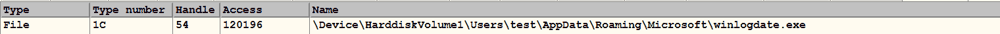
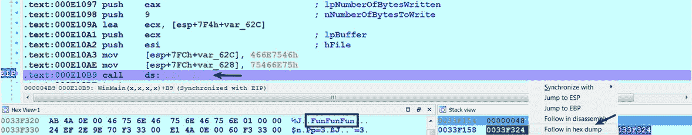
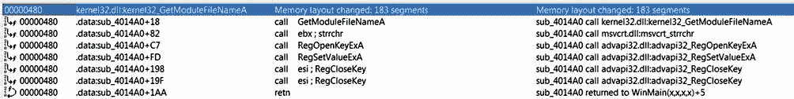

# 第六章：调试恶意二进制文件

调试是一种以受控方式执行恶意代码的技术。调试器是一种程序，它使您能够在更细粒度的层面上检查恶意代码。它提供了对恶意软件运行时行为的完全控制，并允许您执行*单个指令*、*多个指令*或*选择函数*（而不是执行整个程序），同时研究恶意软件的每个动作。

本章中，您将主要学习*IDA Pro（商业反汇编器/调试器）*和*x64dbg（开源 x32/x64 调试器）*提供的调试功能。您将了解这些调试器提供的功能，以及如何使用它们检查程序的运行时行为。根据可用的资源，您可以选择使用其中任何一个调试器或同时使用两者来调试恶意二进制文件。在调试恶意软件时，需要特别小心，因为您将会在系统上运行恶意代码。强烈建议您在隔离的环境中进行任何恶意软件的调试（如第一章《恶意软件分析简介》中所述）。在本章结束时，您还将看到如何使用.NET 反编译器/调试器*dnSpy*（[`github.com/0xd4d/dnSpy`](https://github.com/0xd4d/dnSpy)）调试.NET 应用程序。

其他流行的反汇编器/调试器包括*radare2*（[`rada.re/r/index.html`](http://rada.re/r/index.html)），*WinDbg*（Windows 调试工具的一部分，[`docs.microsoft.com/en-us/windows-hardware/drivers/debugger/`](https://docs.microsoft.com/en-us/windows-hardware/drivers/debugger/)），*Ollydbg*（[`www.ollydbg.de/version2.html`](http://www.ollydbg.de/version2.html)），*Immunity Debugger*（[`www.immunityinc.com/products/debugger/`](https://www.immunityinc.com/products/debugger/)），*Hopper*（[`www.hopperapp.com/`](https://www.hopperapp.com/)），和*Binary Ninja*（[`binary.ninja/`](https://binary.ninja/)）。

# 1. 一般调试概念

在我们深入了解这些调试器（*IDA Pro*、*x64dbg*和*DnSpy*）提供的功能之前，了解大多数调试器提供的一些常见功能是很重要的。在本节中，您将主要看到一般的调试概念；在后续章节中，我们将重点介绍*IDA Pro*、*x64dbg*和*dnSpy*的核心功能。

# 1.1 启动和附加到进程

调试通常从选择要调试的程序开始。有两种方法可以调试程序：*(a) 将调试器附加到正在运行的进程*，以及 *(b) 启动一个新进程*。当你将调试器附加到正在运行的进程时，你将无法控制或监控进程的初始动作，因为在你有机会附加到进程时，它的所有启动和初始化代码已经执行完毕。当你将调试器附加到进程时，调试器会暂停进程，给你机会检查进程的资源或设置断点，然后再恢复进程的执行。

另一方面，启动一个新进程可以让你监控或调试进程的每个动作，你还将能够监控进程的初始操作。当你启动调试器时，原始二进制文件将在运行调试器的用户权限下执行。当进程在调试器下启动时，执行将在 *程序的入口点* 暂停。程序的入口点是将要执行的第一条指令的地址。在后续章节中，你将学习如何使用 *IDA Pro*、*x64dbg* 和 *dnSpy* 来 *启动* 和 *附加* 进程。

程序的入口点不一定是 `main` 或 `WinMain` 函数；在将控制权转交给 `main` 或 `WinMain` 之前，会执行初始化例程（启动例程）。启动例程的目的是在将控制权传递给 `main` 函数之前初始化程序的环境。调试器将此初始化过程指定为程序的入口点。

# 1.2 控制进程执行

调试器使你能够在进程执行时控制/修改其行为。调试器提供的两个重要功能是：*(a) 控制执行的能力*，以及 *(b) 中断执行的能力（使用断点）*。使用调试器时，你可以在将控制权返回给调试器之前执行一条或多条指令（或选择函数）。在分析过程中，你将结合调试器的控制执行和中断（断点）功能来监控恶意软件的行为。在本节中，你将了解调试器提供的常见 *执行控制* 功能；在后续章节中，你将学习如何在 *IDA Pro*、*x64dbg* 和 *dnSpy* 中使用这些功能。

以下是调试器提供的一些常见执行控制选项：

+   **继续（运行）**： 这将执行所有指令，直到到达断点或发生异常。当你将恶意软件加载到调试器中并使用 *继续（运行）* 选项而不设置断点时，它将执行所有指令而不给你任何控制；因此，你通常会将此选项与断点一起使用，在断点位置中断程序。

+   **进入和跳过**：通过使用*进入*和*跳过*，你可以执行一条指令。执行完这条指令后，调试器会暂停，给你一个机会检查进程的资源。*进入*和*跳过*的区别出现在你执行一条调用函数的指令时。例如，在以下代码中，在➊处有对函数`sub_401000`的调用。当你在这条指令上使用*进入*选项时，调试器会在函数的开始处（地址`0x401000`）停下来，而当你使用*跳过*时，整个函数会被执行，调试器会在下一条指令（➋，即地址`0x00401018`）处暂停。通常，当你想深入了解一个函数的内部实现时，使用*进入*；而当你已经知道一个函数的作用（例如一个 API 函数），并且希望跳过它时，使用*跳过*：

```
.text:00401010     push  ebp
.text:00401011     mov   ebp, esp
.text:00401013     call  sub_401000  ➊
.text:00401018     xor   eax,eax  ➋
```

+   **执行直到返回（运行直到返回）**：这个选项允许你执行当前函数中的所有指令，直到它返回。这在你不小心进入了一个函数（或者进入了一个不感兴趣的函数）时很有用，能够让你快速退出。使用这个选项时，调试器会一直执行到函数的结尾（`ret`或`retn`），然后你可以使用*进入*或*跳过*选项返回到调用该函数的地方。

+   **运行到光标（运行直到选择）**：这个选项允许你执行指令，直到*当前光标位置*，或者直到*选择的指令*被到达。

# 1.3 使用断点中断程序

*断点* 是一种调试器功能，允许你在程序中的特定位置中断程序的执行。断点可以用来暂停程序执行在某一特定指令处，或者在程序调用函数/API 函数时，或者在程序从某个内存地址读取、写入或执行时。你可以在程序的各个位置设置多个断点，程序执行将会在到达任何一个断点时被中断。到达断点后，可以监控/修改进程的各个方面。调试器通常允许你设置不同类型的断点：

+   **软件断点**：默认情况下，调试器使用软件断点。软件断点通过将断点地址处的指令替换为软件断点指令（如`int 3`指令，操作码为`0xCC`）来实现。当软件断点指令（如`int 3`）被执行时，控制权会转移到调试器，调试器将调试被中断的进程。使用软件断点的优点是你可以设置无限数量的断点。缺点是恶意软件可以查找断点指令（`int 3`），并修改它，从而改变附加调试器的正常操作。

+   **硬件断点**：像 x86 这样的 CPU 通过使用 CPU 的调试寄存器 `DR0 - DR7` 支持硬件断点。你最多可以使用 `DR0-DR3` 设置四个硬件断点；其他剩余的调试寄存器用于指定每个断点的附加条件。在硬件断点的情况下，没有指令被替换，而是由 CPU 根据调试寄存器中的值来决定是否中断程序。

+   **内存断点**：这些断点允许你在指令访问（*读取*或*写入*）内存时暂停执行，而不是在执行时暂停。这在你想知道何时访问特定内存（*读取*或*写入*）以及知道哪条指令访问它时非常有用。例如，如果你在内存中发现一个有趣的字符串或数据，你可以在该地址设置内存断点，以确定在什么情况下该内存被访问。

+   **条件断点**：使用条件断点，你可以指定必须满足的条件，以触发断点。如果条件断点被触及但条件未满足，调试器会自动恢复程序的执行。条件断点不是指令功能或 CPU 功能；它们是调试器提供的功能。因此，你可以为软件和硬件断点指定条件。设置条件断点时，由调试器负责评估条件表达式，并确定是否需要中断程序。

# 1.4 程序执行跟踪

*跟踪* 是一种调试功能，允许你在进程执行时记录（*日志*）特定事件。跟踪为你提供有关二进制文件的详细执行信息。在后续章节中，你将了解 *IDA* 和 *x64dbg* 提供的不同类型的跟踪功能。

# 2. 调试二进制文件使用 x64dbg

*x64dbg* ([`x64dbg.com`](https://x64dbg.com)) 是一个开源调试器。你可以使用 *x64dbg* 调试 32 位和 64 位应用程序。它具有易于使用的 GUI，并提供各种调试功能 ([`x64dbg.com/#features`](https://x64dbg.com/#features))。

在本节中，你将看到一些 *x64dbg* 提供的调试功能，以及如何使用它来调试恶意二进制文件。

# 2.1 在 x64dbg 中启动新进程

在*x64dbg*中，要加载一个可执行文件，选择文件 | 打开，并浏览到你希望调试的文件；这将启动进程，调试器会根据配置设置在*系统断点*、*TLS 回调*或*程序入口点*函数处暂停。你可以通过选择选项 | 偏好设置 | 事件来访问设置对话框。默认设置对话框如下所示，显示了加载可执行文件时的默认设置。调试器首先会在系统函数处中断（因为选中了*系统断点*选项）。接着，在你运行调试器后，它会在*TLS 回调*函数处暂停（如果存在的话，因为选中了*TLS 回调*选项）。有时这很有用，因为一些反调试技巧包含 TLS 条目，允许恶意软件在主应用程序运行之前执行代码。如果你继续执行程序，执行会在程序的入口点处暂停：


如果你希望执行在*程序入口点*直接暂停，那么取消选中系统断点*和 TLS 回调*选项（此配置对大多数恶意软件程序应该有效，除非恶意软件使用反调试技巧）。要保存配置设置，只需点击保存按钮。通过此配置，当加载可执行文件时，进程开始执行，并在*程序入口点*暂停，如下所示：


# 2.2 使用 x64dbg 附加到现有进程

要附加到现有的进程中，在*x64dbg*中选择文件 | 附加（或*Alt* + *A*）；这将弹出一个对话框，显示正在运行的进程，如下所示。选择你希望调试的进程，并点击附加按钮。当调试器附加后，进程会被挂起，给你时间设置断点并检查进程的资源。当你关闭调试器时，附加的进程将终止。如果你不希望附加的进程终止，可以通过选择文件 | 分离（*Ctrl* + *Alt* + *F2*）来分离进程；这确保在你关闭调试器时，附加的进程不会终止：

有时，当你尝试将调试器附加到进程时，你会发现并非所有进程都列在对话框中。在这种情况下，确保你以*管理员*身份运行调试器；你需要通过选择选项 | 偏好设置，在引擎标签页中勾选启用调试权限选项，来启用*调试权限*设置。

# 2.3 x64dbg 调试器界面

当你在*x64dbg*中加载一个程序时，会出现调试器显示，如下所示。调试器显示包含多个标签页；每个标签页显示不同的窗口。每个窗口包含有关被调试二进制文件的不同信息：


+   **反汇编窗口（CPU 窗口）**：此窗口显示调试程序所有指令的反汇编。反汇编以线性方式呈现，并与当前的指令指针寄存器（`eip` 或 `rip`）的值同步。该窗口的左侧部分显示一个*箭头*，以指示程序的非线性流程（例如*分支*或*循环*）。您可以通过按下*G*热键来显示控制流图。控制流图如下所示；条件跳转使用*绿色*和*红色*箭头。绿色箭头表示当条件为真时会跳转，红色箭头表示跳转不会发生。蓝色箭头用于无条件跳转，向上的（向后的）蓝色箭头表示循环：


+   **寄存器窗口**：此窗口显示 CPU 寄存器的当前状态。可以通过双击寄存器并输入新值来修改寄存器的值（您也可以右键单击寄存器并将其值修改为*零*，或*递增*/*递减*寄存器的值）。您可以通过双击标志位的值来切换标志位的*开启*或*关闭*状态。您不能更改指令指针（`eip` 或 `rip`）的值。在调试程序时，寄存器的值可能会发生变化；调试器通过*红色*高亮寄存器值，表示自上次指令以来的变化。

+   **堆栈窗口**：*堆栈视图*显示进程运行时堆栈的数据内容。在恶意软件分析中，通常会在调用函数之前检查堆栈，以确定传递给函数的参数个数及参数类型（例如*整数*或*字符指针*）。

+   **转储窗口**：此窗口显示内存的标准十六进制转储。您可以使用转储窗口查看调试进程中任何有效内存地址的内容。例如，如果堆栈位置、寄存器或指令包含有效的内存位置，要查看该内存位置，请右键点击地址并选择“在转储中跟踪”选项。

+   **内存映射窗口**：您可以点击“内存映射”标签，显示*内存映射*窗口的内容。此窗口提供进程内存的布局，并显示进程中已分配内存段的详细信息。它是查看可执行文件及其各个部分加载到内存中的位置的好方法。此窗口还包含有关进程 DLL 及其内存部分的信息。您可以双击任何条目，将显示定位到相应的内存位置：


+   **符号窗口**：你可以点击符号标签以显示*符号窗口*的内容。左侧窗格显示已加载模块的列表（可执行文件及其 DLL）；点击某个模块条目将在右侧窗格显示该模块的*导入*和*导出*函数，如下所示。此窗口有助于确定导入和导出函数在内存中的位置：


+   **引用窗口**：此窗口显示 API 调用的引用。默认情况下，点击引用标签不会显示 API 的引用。要填充此窗口，请右键单击*反汇编（CPU）*窗口中的任何位置（确保已加载可执行文件），然后选择 搜索 | 当前模块 | 模块间调用；这将把所有程序中 API 调用的引用填充到*引用窗口*中。以下截图显示了多个 API 函数的引用；第一项告诉你，在地址`0x00401C4D`，该指令调用了`CreateFileA` API（由`Kernel32.dll`导出）。双击该条目将带你到相应的地址（在此例中为`0x00401C4D`）。你还可以在该地址设置断点；一旦命中断点，你可以检查传递给`CreateFileA`函数的参数：


+   **句柄窗口**：你可以点击句柄标签打开*句柄窗口*；要显示内容，右键点击句柄窗口内部并选择刷新（或按*F5*）。这将显示所有打开的句柄的详细信息。在前一章中，当我们讨论 Windows API 时，你了解到进程可以打开指向某个对象（如*文件*、*注册表*等）的句柄，这些句柄可以传递给函数，例如`WriteFile`，以执行后续操作。当你检查 API 时，句柄会非常有用，像`WriteFile`这样的 API 会告诉你与句柄相关联的对象。例如，在调试恶意软件样本时，发现`WriteFile` API 调用接受句柄值`0x50`。检查句柄窗口显示句柄值`0x50`与文件`ka4a8213.log`关联，如下所示：


+   **线程窗口**：此窗口显示当前进程中的线程列表。你可以右键点击此窗口并*挂起*一个或多个线程，或*恢复*已挂起的线程。

# 2.4 使用 x64dbg 控制进程执行

在第*1.2 节*，*控制进程执行*中，我们讨论了调试器提供的不同执行控制功能。以下表格概述了常见的执行选项及如何在*x64dbg*中访问这些选项：

| 功能 | 快捷键 | 菜单 |
| --- | --- | --- |
| 运行 | *F9* | 调试器 &#124; 运行 |
| 单步进入 | *F7* | 调试器 &#124; 单步进入 |
| 单步跳过 | *F8* | 调试器 &#124; 单步跳过 |
| 运行直到选择 | *F4* | 调试器 &#124; 运行直到选择 |

# 2.5 在 x64dbg 中设置断点

在*x64dbg*中，你可以通过导航到你希望程序暂停的地址并按 *F2* 键（或者右键点击并选择 断点 | 切换）来设置软件断点。要设置硬件断点，右键点击你希望设置断点的位置，并选择 断点 | 设置硬件执行断点。

你还可以使用硬件断点来在*写入*时或者在内存位置的*读/写*（访问）时进行断点。要在内存访问上设置硬件断点，在转储面板中，右键点击所需的地址，选择 断点 | 硬件，访问，然后选择适当的数据类型（例如字节、字、双字或四字），如下面的截图所示。同样，你也可以通过选择 断点 | 硬件，写入 选项来设置硬件断点，以进行内存写入：


除了硬件内存断点外，你还可以以相同的方式设置内存断点。为此，在转储面板中，右键点击所需的地址，选择 断点 | 内存，访问（用于内存访问）或 断点 | 内存，写入（用于内存写入）。

要查看所有活动的断点，只需点击“断点”标签；这会列出“断点”窗口中所有的软件、硬件和内存断点。你也可以在“断点”窗口中的任何指令上右键点击，移除单个断点，或者移除所有断点。

有关* x64dbg *中可用选项的更多信息，请参考*x64dbg*的在线文档：[`x64dbg.readthedocs.io/en/latest/index.html`](http://x64dbg.readthedocs.io/en/latest/index.html)。你也可以通过在*x64dbg*界面中按 *F1* 来访问*x64dbg*帮助手册。

# 2.6 调试 32 位恶意软件

了解了调试功能后，接下来我们来看调试如何帮助我们理解恶意软件的行为。考虑到一个恶意软件样本的代码片段，其中恶意软件调用`CreateFileA`函数创建文件。为了确定它创建的文件名，你可以在调用`CreateFileA`函数的地方设置断点，并执行程序直到到达断点。当执行到达断点时（也就是在调用`CreateFileA`之前），所有的函数参数都会被压入栈中；然后我们可以检查栈中的*第一个参数*以确定文件名。在下图中，当执行在断点处暂停时，*x64dbg*会在指令旁边和栈中的参数旁边添加一个注释（如果是字符串的话），以指示传递给函数的参数是什么。从截图中可以看出，恶意软件在`%Appdata%\Microsoft`目录下创建了一个可执行文件`winlogdate.exe`。你也可以通过右键点击栈窗口中的第一个参数，选择“在转储中查看 DWORD”选项，来显示十六进制窗口中的内容，获取这些信息：


创建可执行文件后，恶意软件将`CreateFile`返回的句柄值（`0x54`）作为第一个参数传递给`WriteFile`，并写入可执行内容（作为第二个参数传递），如下所示：


假设你不知道哪个对象与句柄`0x54`相关联，可能是因为你直接在`WriteFile`上设置了断点，而没有最初在`CreateFile`上设置断点。要确定与句柄值相关联的对象，可以在句柄窗口中查找。在此案例中，作为第一个参数传递给`WriteFile`的句柄值`0x54`，与`winlogdate.exe`相关联，如下所示：



# 2.7 调试 64 位恶意软件

你将使用相同的技巧来调试 64 位恶意软件；区别在于，你将处理*扩展寄存器*、*64 位内存地址/指针*和略有不同的*调用约定*。如果你还记得（来自第四章，*汇编语言与反汇编入门*），64 位代码使用`FASTCALL`调用约定，并将前四个参数传递给函数的寄存器（`rcx`、`rdx`、`r8`和`r9`），其余的参数则放在栈上。在调试调用函数/API 时，依据你检查的参数，你需要检查*寄存器*或*栈*。前面提到的调用约定适用于编译器生成的代码。攻击者编写的汇编语言代码不必遵循这些规则；因此，代码可能表现出不寻常的行为。当你遇到非编译器生成的代码时，可能需要进一步调查该代码。

在我们调试 64 位恶意软件之前，让我们先通过下面这个简单的 C 程序来了解 64 位二进制文件的行为，该程序是使用*Microsoft Visual C/C++* 编译器为 64 位平台编译的：

```
int main()
{
  printf("%d%d%d%d%s%s%s", 1, 2, 3, 4, "this", "is", "test");
  return 0;
}
```

在上面的程序中，`printf`函数接受八个参数；该程序在*x64dbg*中编译并打开，并且在`printf`函数处设置了断点。以下截图显示了程序，在调用`printf`函数之前暂停。在寄存器窗口中，你可以看到前四个参数已放置在`rcx`、`rdx`、`r8`和`r9`寄存器中。当程序调用一个函数时，该函数会在栈上保留`0x20`（`32` 字节）的空间（为四个项目保留每个`8` 字节的空间）；这是为了确保调用的函数在需要保存寄存器参数（`rcx`、`rdx`、`r8`和`r9`）时有足够的空间。这就是为什么接下来的四个参数（第 5、6、7、8 个参数）会放置在栈上，从第五个项目（`rsp+0x20`）开始。我们给你展示这个例子是为了让你了解如何在栈上找到参数：


对于 32 位函数，堆栈在参数被 *压入* 时增长，在项被 *弹出* 时收缩。对于 64 位函数，堆栈空间在函数开始时分配，并且直到函数结束之前不会改变。分配的堆栈空间用于存储局部变量和函数参数。在前面的截图中，注意第一条指令 `sub rsp,48` 如何在堆栈上分配了 `0x48`（`72`）字节的空间，在函数中间之后没有再分配堆栈空间；此外，`push` 和 `pop` 指令没有使用，改为使用 `mov` 指令将第 5、6、7、8 个参数放入堆栈（在前面的截图中已突出显示）。没有 `push` 和 `pop` 指令使得确定函数接受的参数数量变得困难，而且也很难判断内存地址是作为局部变量还是作为函数的参数使用。另一个挑战是，如果在函数调用之前，值已经移入了寄存器 `rcx` 和 `rdx`，那么很难判断它们是作为参数传递给函数的，还是被移入寄存器用于其他目的。

即使在反向工程一个 64 位二进制文件时遇到一些挑战，你也不应该遇到太多困难来分析 API 调用，因为 API 文档告诉你 *函数参数的数量*、*参数的数据类型* 以及它们返回的 *数据类型*。一旦你知道在哪里找到函数参数和返回值，你可以在 API 调用处设置断点，检查其参数，以了解恶意软件的功能。

让我们看一个 64 位恶意软件示例，它调用 `RegSetValueEx` 来设置注册表中的某些值。在下图中，断点在调用 `RegSetValueEx` 之前被触发。你需要查看寄存器和堆栈窗口中的值（如前所述），以检查传递给函数的参数；这将帮助你确定恶意软件设置了哪个注册表值。在 *x64dbg* 中，获取函数参数的最快方法是查看默认窗口（在寄存器窗口下方），该窗口在以下截图中被突出显示。你可以在默认窗口中设置一个值来显示参数的数量。在下图中，值设置为 `6`，因为从 API 文档中（[`msdn.microsoft.com/en-us/library/windows/desktop/ms724923(v=vs.85).aspx`](https://msdn.microsoft.com/en-us/library/windows/desktop/ms724923(v=vs.85).aspx)）可以看出，`RegSetValueEx` API 有 `6` 个参数：


第一个参数值`0x2c`是打开注册表键的句柄。恶意软件可以通过调用`RegCreateKey`或`RegOpenKey`API 打开注册表键的句柄。从句柄窗口中，您可以看到句柄值`0x2c`与以下截图中显示的注册表键相关联。通过句柄信息，并检查第 1、2 和 5 个参数，您可以知道恶意软件修改了注册表键`HKEY_LOCAL_MACHINE\SOFTWARE\Microsoft\WindowsNT\CurrentVersion\Winlogon\shell`，并添加了一个条目`"explorer.exe,logoninit.exe"`。在干净的系统上，此注册表键指向`explorer.exe`（默认的 Windows shell）。当系统启动时，`Userinit.exe`进程使用此值启动 Windows shell（`explorer.exe`）。通过添加`logoninit.exe`，以及`explorer.exe`，恶意软件确保`Userinit.exe`也启动了`logoninit.exe`；这是恶意软件使用的另一种持久性机制：


此时，您应该已经了解如何调试恶意可执行文件以了解其功能。在下一节中，您将学习如何调试恶意 DLL 以确定其行为。

# 2.8 使用 x64dbg 调试恶意 DLL

在第三章，*动态分析*中，您学习了执行 DLL 以执行动态分析的技术。在本节中，您将使用在[第三章](https://cdp.packtpub.com/learning_malware_analysis/wp-admin/post.php?post=885&action=edit#post_522)，*动态分析*中学到的一些概念来使用*x64dbg*调试 DLL。如果您还不熟悉 DLL 的动态分析，强烈建议在继续之前阅读[第三章](https://cdp.packtpub.com/learning_malware_analysis/wp-admin/post.php?post=885&action=edit#post_522)，*动态分析*中的*第六部分*，*动态链接库（DLL）分析*。

要调试 DLL，请启动*x64dbg*（最好具有管理员权限）并加载 DLL（通过文件 | 打开）。当您加载 DLL 时，*x64dbg*会在与 DLL 位于同一目录的地方放置一个可执行文件（名为`DLLLoader32_xxxx.exe`，其中`xxxx`是随机的十六进制字符），此可执行文件充当通用主机进程，将用于执行您的 DLL（与`rundll32.exe`相同的方式）。加载 DLL 后，调试器可能会在`系统断点`，`TLS 回调`或`DLL 入口点`函数处暂停，具体取决于配置设置（在*在 x64dbg 中启动新进程*部分中提到）。如果未选中`系统断点`和`TLS 回调`选项，则在加载 DLL 时会在*DLL 的入口点*处暂停执行，如下截图所示。现在，您可以像调试其他程序一样调试 DLL：


# 2.8.1 使用 rundll32.exe 在 x64dbg 中调试 DLL

另一种有效的方法是使用`rundll32.exe`来调试 DLL（假设你想要调试一个名为`rasaut.dll`的恶意软件 DLL）。为此，首先从系统 32 目录（通过文件 | 打开）加载`rundll32.exe`到调试器中，这将在`系统断点`或`rundll32.exe`的`入口点`（取决于之前提到的设置）处暂停调试器。然后，选择调试 | 更改命令行，并指定`rundll32.exe`的命令行参数（指定 DLL 的完整路径和导出函数），如下所示，并单击确定：


接下来，选择断点选项卡，在断点窗口内右键单击，并选择添加 DLL 断点选项，这将弹出一个对话框窗口提示您输入模块名称。输入 DLL 名称（在本例中为`rasaut.dll`），如下所示。这将告诉调试器在加载 DLL（`rasaut.dll`）时中断。配置这些设置后，关闭调试器：


接下来，重新打开调试器并再次加载`rundll32.exe`；当您再次加载时，之前的命令行设置仍将保持不变。现在，选择调试 | 运行（*F9*），直到您在 DLL 的入口点中断（您可能需要多次选择运行（*F9*），直到达到 DLL 入口点）。您可以通过查看*断点地址旁的注释*，每次运行（*F9*）时跟踪执行暂停的位置。您还可以在`eip`寄存器旁找到相同的注释。在下面的屏幕截图中，您可以看到执行已在`rasaut.dll`的入口点处暂停。在这一点上，您可以像调试任何其他程序一样调试 DLL。您还可以在 DLL 导出的任何函数上设置断点。您可以使用符号窗口找到导出函数；在找到所需的*导出*函数后，双击它（这将带您到反汇编窗口中导出函数的代码）。然后，在所需地址处设置断点：


# 2.8.2 在特定进程中调试 DLL

有时，您可能希望调试仅在特定进程（如`explorer.exe`）中运行的 DLL。该过程类似于前一节中介绍的过程。首先，使用 x64dbg*启动进程*或*附加*到所需的主机进程；这将暂停调试器。通过选择 Debug | Run (*F9*)允许进程运行。接下来，选择 Breakpoints 选项卡，在 Breakpoints 窗口内右键单击，并选择 Add DLL breakpoint 选项，这将弹出一个对话框提示您输入模块名称。输入 DLL 名称（如前一节中介绍的），这将告诉调试器在加载 DLL 时中断。现在，您需要将 DLL 注入到主机进程中。可以使用类似*RemoteDLL*（[`securityxploded.com/remotedll.php`](https://securityxploded.com/remotedll.php)）的工具来完成此操作。当 DLL 加载时，调试器将在`ntdll.dll`中的某处暂停；只需连续运行（*F9*）直到达到注入的 DLL 的入口点（可能需要多次运行才能到达入口点）。您可以通过查看断点地址旁边或前一节中提到的`eip`寄存器旁边的注释来跟踪每次运行（*F9*）时暂停的执行位置。

# 2.9 在 x64dbg 中跟踪执行

*跟踪*允许您在进程执行时记录事件。x64dbg 支持*跟踪进入*和*跟踪覆盖*条件跟踪选项。您可以通过 Trace | Trace into (*Ctrl*+*Alt*+*F7*)和**Trace | Trace over** (*Ctrl+Alt+F8*)访问这些选项。在*跟踪进入*中，调试器通过设置*步入*断点内部跟踪程序，直到条件满足或达到最大步数。在*跟踪覆盖*中，调试器通过设置*步过*断点跟踪程序，直到条件满足或达到最大步数。以下屏幕截图显示了跟踪进入对话框（跟踪覆盖对话框中提供相同选项）。要跟踪日志，至少需要指定*log text*和将跟踪事件重定向到的日志文件的完整路径（通过 Log File 按钮）：


以下包括一些字段的简要描述：

+   **断点条件**：您可以在此字段中指定条件。此字段默认为`0`（`false`）。要指定条件，您需要指定任何有效表达式（[`x64dbg.readthedocs.io/en/latest/introduction/Expressions.html`](http://x64dbg.readthedocs.io/en/latest/introduction/Expressions.html)）来评估为非零值（`true`）。评估为非零值的表达式被视为`true`，从而触发断点。调试器通过评估提供的表达式继续跟踪，并在满足指定条件时停止。如果条件不满足，则跟踪将继续直到达到*最大跟踪计数*。

+   **日志文本**：此字段用于指定将用于记录日志文件中跟踪事件的格式。此字段可以使用的有效格式在[`help.x64dbg.com/en/latest/introduction/Formatting.html`](http://help.x64dbg.com/en/latest/introduction/Formatting.html)中列出。

+   **日志条件**：此字段的默认值为`1`。你可以选择性地提供一个日志条件，这样调试器只有在特定条件满足时才会记录事件。日志条件需要是有效的表达式（[`x64dbg.readthedocs.io/en/latest/introduction/Expressions.html`](http://x64dbg.readthedocs.io/en/latest/introduction/Expressions.html)）。

+   **最大跟踪次数**：此字段指定调试器放弃之前可以跟踪的最大步骤数。默认值设置为`50000`，你可以根据需要增加或减少此值。

+   **日志文件按钮**：你可以使用此按钮指定日志文件的完整路径，跟踪日志将保存在此文件中。

x64dbg 没有特定的*指令跟踪*和*函数跟踪*功能，但可以使用*追踪进入*和*追踪跳过*选项来执行指令跟踪和函数跟踪。你可以通过添加断点来控制跟踪。在下面的截图中，`eip` 指向第 1 条指令，并且在第 5 条指令处设置了断点。当跟踪开始时，调试器从第一条指令开始跟踪，并在断点处暂停。如果没有断点，跟踪将继续，直到程序结束，或者直到达到最大跟踪次数。如果你想跟踪函数内部的指令，可以选择*追踪进入*，或者选择*追踪跳过*来跳过该函数并跟踪其余的指令：


# 2.9.1 指令跟踪

要在前面的程序中执行*指令跟踪*（例如，*追踪进入*），你可以在“追踪进入”对话框中使用以下设置。如前所述，为了在日志文件中捕获跟踪事件，你需要指定日志文件的完整路径和日志文本：


上述截图中的日志文本值（`0x{p:cip} {i:cip}`）是字符串格式，指定调试器记录所有跟踪指令的*地址*和*反汇编*。以下是程序的跟踪日志。由于选择了*追踪进入*选项，函数内部的指令（`0xdf1000`）也被捕获（在下面的代码中高亮显示）。指令跟踪有助于快速了解程序的执行流程：

```
0x00DF1011      mov ebp, esp
0x00DF1013      call 0xdf1000
0x00DF1000      push ebp
0x00DF1001      mov ebp, esp
0x00DF1003      pop ebp
0x00DF1004      ret
0x00DF1018      xor eax, eax
0x00DF101A      pop ebp
```

# 2.9.2 函数跟踪

为了演示*函数跟踪*，请看以下截图中的程序。在这个程序中，`eip`指向第一条指令，断点设置在第五条指令（以在此点停止追踪），第三条指令调用了`0x311020`地址的函数。我们可以使用函数跟踪来确定`0x311020`函数调用了哪些其他函数：


为了执行函数跟踪（在此案例中选择了“进入追踪”），使用了以下设置。这类似于*指令跟踪*，不同之处在于在日志条件字段中，指定了一个表达式，指示调试器仅记录函数调用：


以下是通过*函数跟踪*在日志文件中捕获的事件。从这些事件中，你可以看出，函数`0x311020`调用了两个其他函数，分别位于`0x311000`和`0x311010`：

```
0x00311033      call    0x311020
0x00311023      call    0x311000
0x00311028      call    0x311010
```

在前面的例子中，使用了断点来控制追踪。当调试器到达断点时，执行暂停，且*指令/函数*在断点之前会被记录。当你恢复调试器时，剩下的指令会被执行，但不会被记录。

# 2.10 在 x64dbg 中修补

在进行恶意软件分析时，你可能想修改二进制文件以改变其功能或逆向其逻辑，以满足你的需求。x64dbg 允许你修改程序的内存数据或指令。要修改内存中的数据，导航到内存地址，选择你要修改的字节序列，然后右键点击并选择“二进制 | 编辑”（*Ctrl* + *E*），这将弹出一个对话框（如下所示），你可以用它来修改数据为 ASCII、UNICODE 或一系列十六进制字节：


以下截图显示了*TDSS rootkit* DLL 的代码片段（这与前一章中涉及的相同二进制文件，在*使用 IDA 修补二进制文件*的部分有介绍）。如果你记得的话，这个 DLL 使用字符串比较来检查它是否在`spoolsv.exe`进程下运行。如果字符串比较失败（也就是说，DLL 没有在`spoolsv.exe`进程下运行），代码就会跳转到函数的末尾，并在不表现出恶意行为的情况下返回函数。如果你希望这个二进制文件能够在任何进程下运行（而不仅仅是`spoolsv.exe`），你可以用`nop`指令修改*条件跳转*指令（`JNE tdss.10001Cf9`），以去除进程限制。为此，右键点击条件跳转指令并选择“汇编”，这将弹出如下对话框，使用它可以输入指令。请注意，在截图中，已勾选“填充 NOP”的选项，以确保指令对齐正确：


在修改了内存中的数据或指令之后，你可以通过选择 **文件 | 补丁文件** 来将补丁应用到文件中，这将弹出一个补丁对话框，显示对二进制文件所做的所有修改。满意修改后，点击 **补丁文件** 并保存文件：


# 3\. 使用 IDA 调试二进制文件

在上一章中，我们查看了 *IDA Pro* 的反汇编功能。在本章中，你将了解 IDA 的调试能力。IDA 的商业版本可以调试 32 位和 64 位应用程序，而演示版只允许调试 32 位 Windows 二进制文件。在本节中，你将看到 IDA Pro 提供的一些调试功能，并将学习如何使用它调试恶意二进制文件。

# 3.1 在 IDA 中启动新进程

启动新进程有不同的方法；一种方法是直接启动调试器，而不先加载程序。要做到这一点，启动 IDA（不加载可执行文件），然后选择 **调试器 | 运行 | 本地 Windows 调试器**；这将弹出一个对话框，你可以在其中选择要调试的文件。如果可执行文件需要任何参数，你可以在 **参数** 字段中指定它们。此方法将启动一个新进程，调试器将在程序的 *入口点* 暂停执行：


启动进程的第二种方法是先在 IDA 中加载可执行文件（这将执行初步分析并显示反汇编输出）。首先，通过 **调试器 | 选择调试器**（或 *F9*）选择正确的调试器；然后，你可以将光标放在第一个指令上（或你希望执行暂停的指令），并选择 **调试器 | 运行到光标处**（或 *F4*）。这将启动一个新进程，并将执行直到当前光标位置（在这种情况下，断点会自动设置在当前光标位置）。

# 3.2 使用 IDA 附加到现有进程

你附加到进程的方式取决于程序是否已经加载。当程序没有加载时，选择 **调试器 | 附加 | 本地 Windows 调试器**。这将列出所有正在运行的进程。只需选择要附加的进程即可。附加后，进程将立即暂停，给你机会在继续执行之前检查进程的资源并设置断点。在这种方法中，IDA 无法执行其初始的自动分析，因为 IDA 的加载器没有机会加载可执行映像：


另一种*附加到进程*的方法是将与进程关联的可执行文件加载到 IDA 中，然后再附加到该进程。要实现这一点，首先使用 IDA 加载相关的可执行文件，这样 IDA 就可以执行初步分析。然后，选择**调试器** | **选择调试器**，勾选 Local Win32 调试器（或 Local Windows 调试器）选项，并点击确认。接着，再次选择**调试器** | **附加到进程**，并选择要附加调试器的进程。

# 3.3 IDA 的调试器界面

启动程序后，进程会暂停，并会向你展示以下调试器界面：


当进程在调试器控制下时，反汇编工具栏会被调试器工具栏替代。此工具栏包含与调试功能相关的按钮（例如*进程控制*和*断点*）：

+   **反汇编窗口**：此窗口与当前*指令指针*寄存器（`eip`或`rip`）的值同步。反汇编窗口提供了你在前一章节中学到的相同功能。你还可以通过按下*空格键*在*图形视图*和*文本视图*模式之间切换。

+   **寄存器窗口**：此窗口显示 CPU 通用寄存器的当前内容。你可以右键单击寄存器值，点击修改值、清零值、切换值、增值或减值。切换值特别有用，尤其是当你想要更改 CPU 标志位的状态时。如果寄存器的值是一个有效的内存位置，则寄存器值旁边的*右箭头*会变为可用状态；点击该箭头可以将视图移动到对应的内存位置。如果你发现自己导航到了其他位置，并希望返回到*指令指针*指向的位置，只需点击指令指针寄存器（`eip`或`rip`）值旁的*右箭头*。

+   **栈视图**：*栈视图*显示进程运行时栈的数据信息。在调用函数之前检查栈可以获取有关函数参数数量和类型的信息。

+   **十六进制视图**：此视图显示内存的标准十六进制转储。*十六进制视图*在你想要显示有效内存位置的内容时很有用（该位置可能在*寄存器*、*栈*或*指令*中）。

+   **模块视图**：此视图显示加载到进程内存中的模块列表（*可执行文件*及其*共享库*）。双击列表中的任何一个模块，都会显示该模块导出的符号列表。这是一个方便的方式，可以快速跳转到加载库中的函数。

+   **线程视图**：显示当前进程中线程的列表。你可以右键单击此窗口来*挂起线程*或*恢复挂起的线程*。

+   **段窗口**：*段窗口*可以通过 视图 | 打开子视图 | 段（或 *Shift* + *F7*）打开。当你调试一个程序时，段窗口提供有关进程中已分配内存段的信息。此窗口显示可执行文件及其各个部分在内存中的加载位置的信息，还包含所有已加载 DLL 及其段信息。双击任何条目将会将你带到相应的内存位置，进入 *反汇编窗口*或 *十六进制窗口*。你可以控制内存地址的内容应该显示在哪里（在反汇编窗口或十六进制窗口中）；只需将光标放在反汇编或十六进制窗口中的任何位置，然后双击该条目。根据光标的位置，内存地址的内容将显示在相应的窗口中：


+   **导入和导出窗口**：当进程在调试器控制下时，导入和导出窗口默认情况下不会显示。你可以通过 视图 | 打开子视图来显示这些窗口。导入窗口列出了二进制文件导入的所有函数，导出窗口列出了所有导出的函数。导出的函数通常位于 DLL 文件中，因此在调试恶意 DLL 时，这个窗口特别有用。

前一章中解释的其他 IDA 窗口，也可以通过 视图 | 打开子视图进行访问。

# 3.4 使用 IDA 控制进程执行

在 *第 1.2 节*，*控制进程执行* 中，我们讨论了调试器提供的不同执行控制功能。下表概述了在调试程序时，你可以在 IDA 中使用的常见执行控制功能：

| 功能 | 热键 | 菜单选项 |
| --- | --- | --- |
| 继续（运行） | *F9* | 调试器 &#124; 继续进程 |
| 单步进入 | *F7* | 调试器 &#124; 单步进入 |
| 单步跳过 | *F8* | 调试器 &#124; 单步跳过 |
| 跳转到光标 | *F4* | 调试器 &#124; 跳转到光标 |

# 3.5 在 IDA 中设置断点

要在 IDA 中设置软件断点，你可以导航到希望程序暂停的地点，按下 *F2* 键（或右键点击并选择 添加断点）。设置断点后，断点所在的地址会以红色高亮显示。你可以通过按 *F2* 键删除设置的断点。

在下面的截图中，断点被设置在地址 `0x00401013` （`call sub_401000`）处。要在断点地址处暂停执行，首先选择调试器（例如本地 Win32 调试器），然后通过选择 调试器 | 启动进程 （或 *F9* 热键）来运行程序。这样会执行所有指令，直到到达断点，并在断点地址处暂停：


在 IDA 中，你可以通过编辑已经设置的断点来设置硬件断点和条件断点。要设置硬件断点，右键单击一个已有的断点，然后选择编辑断点。在弹出的对话框中，勾选硬件复选框，如下所示。IDA 允许你设置超过四个硬件断点，但只有四个断点会生效；额外的硬件断点将会被忽略：


你可以使用硬件断点来指定是否在*执行时断点*（默认），*写入时断点*，或*读/写时断点*。*写入时断点* 和 *读/写时断点* 选项允许你在任何指令访问指定的内存位置时创建内存断点。如果你想知道程序何时从内存位置读取或写入数据，这个断点非常有用。*执行时断点* 选项允许你在指定的内存位置被执行时设置断点。除了指定模式外，你还必须指定大小。硬件断点的大小与其地址结合，形成一个字节范围，这个范围内的地址可能会触发断点。

你可以通过在条件字段中指定条件来设置条件断点。条件可以是一个实际条件，或者是 IDC 或 IDAPython 表达式。你可以点击条件字段旁边的`...`按钮，这将打开编辑器，在编辑器中你可以使用 IDC 或 IDAPython 脚本语言来评估条件。你可以在 [`www.hex-rays.com/products/ida/support/idadoc/1488.shtml`](https://www.hex-rays.com/products/ida/support/idadoc/1488.shtml) 查找到设置条件断点的一些示例。

你可以通过导航到 调试器 | 断点 | 断点列表 （或按 *Ctrl* + *Alt* + *B*）来查看所有活动断点。你可以右键点击断点条目并*禁用*或*删除*该断点。

# 3.6 恶意软件可执行文件调试

在本节中，我们将介绍如何使用 IDA 调试恶意二进制文件。考虑一个 32 位恶意软件样本的反汇编列表。恶意软件调用`CreateFileW`API 创建文件，但仅从反汇编列表中并不清楚恶意软件创建了哪个文件。通过查看`CreateFile`的 MSDN 文档，你可以了解到`CreateFile`的第一个参数将包含文件名；此外，`CreateFile`中的`W`后缀表示文件名是一个 UNICODE 字符串（有关该 API 的详细信息，请参阅前一章）。为了确定文件名，我们可以在调用`CreateFileW`的位置设置一个断点，然后运行程序（*F9*）直到程序达到断点。当程序达到断点时（即在调用`CreateFileW`之前），所有函数的参数将被推送到栈上，因此我们可以检查栈中的第一个参数来确定文件名。在调用`CreateFileW`之后，文件的句柄将通过`eax`寄存器返回，并在➋处被复制到`esi`寄存器中：

```

.text:00401047     push  0          ; hTemplateFile
.text:00401049     push  80h        ; dwFlagsAndAttributes
.text:0040104E     push  2          ; dwCreationDisposition
.text:00401050     push  0          ; lpSecurityAttributes
.text:00401052     push  0          ; dwShareMode
.text:00401054     push  40000000h  ; dwDesiredAccess
.text:00401059     lea  edx, [esp+800h+Buffer]
.text:00401060     push  edx        ; lpFileName
.text:00401061  ➊ call  ds:CreateFileW 
.text:00401067     mov  esi, eax ➋
```

在下图中，执行在调用`CreateFileW`时已暂停（这是通过设置断点并运行程序实现的）。函数的第一个参数是 UNICODE 字符串（`filename`）的地址（`0x003F538`）。你可以使用 IDA 中的十六进制视图窗口来检查任何有效内存位置的内容。通过右键点击地址`0x003F538`并选择“Follow in hex dump”选项，可以显示文件名的十六进制内容，如下所示。在此情况下，恶意软件正在`C:\Users\test\AppData\Local\Temp`目录中创建一个文件`SHAMple.dat`：


恶意软件在创建文件后，将文件句柄作为第一个参数传递给`WriteFile`函数。这表明恶意软件将某些内容写入文件`SHAmple.dat`。要确定它写入文件的内容，可以检查`WriteFile`函数的第二个参数。在这种情况下，它将字符串`FunFunFun`写入文件，如下图所示。如果恶意软件正在将可执行内容写入文件，你也可以通过这种方法查看：



# 3.7 使用 IDA 调试恶意 DLL

在第三章，*动态分析*中，你学习了执行 DLL 进行动态分析的技巧。在本节中，你将使用在第三章，*动态分析*中学到的一些概念，通过 IDA 调试 DLL。如果你不熟悉 DLL 的动态分析，强烈建议在继续之前阅读[第三章](https://cdp.packtpub.com/learning_malware_analysis/wp-admin/post.php?post=885&action=edit#post_522)，*动态分析*中的*S**ection 6*，*动态链接库（DLL）分析*。

要使用 IDA 调试器调试 DLL，首先需要指定将用于加载 DLL 的可执行文件（如`rundll32.exe`）。要调试 DLL，首先将 DLL 加载到 IDA 中，IDA 可能会显示`DLLMain`函数的反汇编代码。在`DLLMain`函数的第一条指令上设置断点（*F2*），如以下截图所示。这样，当你运行 DLL 时，执行将会在`DLLMain`函数的第一条指令处暂停。你也可以通过 IDA 的导出窗口，导航到 DLL 导出的任何函数上并设置断点。


在你设置了期望的地址断点（即你希望程序暂停执行的地方）之后，通过选择调试器菜单 Debugger | Select debugger | Local Win32 debugger（或者**Debugger** | **Select debugger** | **Local Windows debugger**）并点击 OK，来选择调试器。接下来，选择 Debugger | Process options，打开如下截图所示的对话框。在 Application 字段中，输入用于加载 DLL 的可执行文件的完整路径（`rundll32.exe`）。在 Input file 字段中，输入你想要调试的 DLL 的完整路径，在 Parameters 字段中，输入传递给`rundll32.exe`的命令行参数，然后点击 OK。现在，你可以运行程序，直到程序到达断点，之后你可以像调试任何其他程序一样调试它。你传递给`rundll32.exe`的参数应该具有正确的语法，以成功调试 DLL（参考第三章，*动态分析*中的*Working of rundll32.exe*部分）。需要注意的一点是，`rundll32.exe`同样可以用来执行 64 位 DLL，方法相同：


# 3.7.1 在特定进程中调试 DLL

在 *[第三章](https://cdp.packtpub.com/learning_malware_analysis/wp-admin/post.php?post=885&action=edit#post_522)，动态分析* 中，您学到了如何通过一些 DLL 执行进程检查，以判断它们是否在特定进程下运行，比如 `explorer.exe` 或 `iexplore.exe`。在这种情况下，您可能希望在特定的宿主进程内调试 DLL，而不是 `rundll32.exe`。为了在 DLL 的入口点暂停执行，您可以选择 *启动* 一个新的宿主进程实例，或使用调试器 *附加* 到目标宿主进程，然后选择 调试器 | 调试器选项，并勾选“在库加载/卸载时暂停”选项。该选项会告诉调试器每当加载或卸载一个新模块时暂停执行。在进行这些设置后，您可以通过按 *F9* 快捷键恢复暂停的宿主进程并让它继续运行。现在，您可以使用像 *RemoteDLL* 这样的工具将 DLL 注入到调试的宿主进程中。当 DLL 被宿主进程加载时，调试器会暂停，给您一个机会在加载模块的地址设置断点。您可以通过查看“段”窗口来了解 DLL 已经加载到内存的地址，如下所示：


在前面的截图中，您可以看到被注入的 DLL (`rasaut.dll`) 已加载到内存中的地址 `0x10000000`（基址）。您可以通过将基地址（`0x10000000`）与 `PE 头` 中的 `AddressOfEntryPoint` 字段的值相加来在入口点的地址设置断点。您可以通过将 DLL 加载到如 *pestudio* 或 *CFFexplorer* 等工具中来确定入口点的地址值。例如，如果 `AddressOfEntryPoint` 的值为 `0x1BFB`，那么 DLL 的入口点地址可以通过将基地址（`0x10000000`）与值 `0x1BFB` 相加得到，结果是 `0x10001BFB`。现在，您可以跳转到地址 `0x10001BFB`（或者按 *G* 键跳转到该地址），并在该地址设置断点，然后恢复暂停的进程。

# 3.8 使用 IDA 跟踪执行

*跟踪* 允许你在进程执行时记录（日志）特定的事件。它可以提供二进制文件的详细执行信息。IDA 支持三种类型的跟踪：*指令跟踪*、*函数跟踪*和 *基本块跟踪*。要在 IDA 中启用跟踪，你需要设置一个断点，然后右键点击断点地址并选择“编辑断点”，这会弹出一个断点设置对话框。在对话框中，勾选“启用跟踪”选项，并选择合适的跟踪类型。然后，通过 **调试器** | **选择调试器** 菜单（如前所述）选择调试器，并运行（*F9*）程序。以下截图中的位置字段指定了正在编辑的断点，它将作为起始地址执行跟踪。跟踪会一直持续，直到达到一个断点或程序结束。为了指示哪些指令已被跟踪，IDA 通过颜色编码高亮显示指令。跟踪完成后，你可以通过选择 **调试器** | **跟踪** | **跟踪窗口** 来查看跟踪结果。你可以通过 **调试器** | **跟踪** | **跟踪选项** 控制跟踪选项：


***指令跟踪*** 记录每条指令的执行并显示修改后的寄存器值。指令跟踪较慢，因为调试器会通过单步执行（*single-step*）进程来监控和记录所有寄存器的值。*指令跟踪* 对于确定程序的执行流非常有用，并可以了解在执行每条指令期间哪些寄存器被修改。你可以通过添加断点来控制跟踪。

考虑以下截图中的程序。假设你想跟踪前四条指令（其中第三条指令包含一个函数调用）。为此，首先，在第一条指令处设置一个断点，在第五条指令处设置另一个断点，如下图所示。然后，编辑第一个断点（地址为 `0x00401010`），并启用指令跟踪。现在，当你开始调试时，调试器会跟踪前四条指令（包括函数内的指令），并在第五条指令处暂停。如果没有指定第二个断点，调试器将跟踪所有指令：


以下截图显示了在调试器暂停于第五条指令时，*指令跟踪* 事件在跟踪窗口中的表现。注意执行流是如何从 `main` 流向 `sub_E41000`，然后又返回到 `main`。如果你希望跟踪剩余的指令，可以通过恢复暂停的进程来实现：


**函数跟踪**：这会记录所有的函数调用和返回，但不会记录函数跟踪事件中的寄存器值。*函数跟踪*对于确定程序调用了哪些*函数*和*子函数*非常有用。你可以通过将跟踪类型设置为函数，并按照与*指令跟踪*相同的步骤进行函数跟踪。

在以下示例中，恶意软件样本调用了两个函数。假设我们想快速了解第一个函数调用时调用了哪些其他函数。为了做到这一点，我们可以在*第一条指令*处设置第一个断点，并启用函数跟踪（通过编辑断点），然后可以在*第二条指令*处设置另一个断点。第二个断点将作为停止点（跟踪将一直进行到达第二个断点）。以下截图展示了这两个断点：


以下截图展示了函数跟踪的结果。从跟踪的事件中，你可以看到函数`sub_4014A0`调用了与注册表相关的 API 函数；这表明该函数负责执行注册表操作：



有时，你的跟踪可能需要很长时间，并且似乎永远不会结束；如果函数没有返回到其调用者并且在等待事件发生的循环中运行，就会发生这种情况。在这种情况下，你仍然可以在跟踪窗口中看到跟踪日志。

**块跟踪**：IDA 允许你进行*块跟踪*，这对于了解在运行时哪些代码块被执行非常有用。你可以通过将跟踪类型设置为基本块来启用块跟踪。在块跟踪的情况下，调试器将在每个函数的每个基本块的*最后一条指令*处设置断点，并且还会在跟踪块中间的任何调用指令处设置断点。*基本块跟踪*比正常执行慢，但比*指令*或*函数跟踪*要快。

# 3.9 使用 IDAPython 的调试器脚本

你可以使用调试器脚本来自动化与恶意软件分析相关的常规任务。在上一章中，我们介绍了如何使用 IDAPython 进行静态代码分析。在本节中，你将学习如何使用 IDAPython 执行与调试相关的任务。本节中展示的 IDAPython 脚本使用了新的 IDAPython API，这意味着如果你使用的是旧版本的 IDA（低于 IDA 7.0），这些脚本将无法工作。

以下资源应帮助你开始使用 IDAPython 调试器脚本。这些资源中的大部分（除了 IDAPython 文档）使用旧版 IDAPython API 演示脚本功能，但它们足够帮助你理解。如果你遇到困难，可以参考 IDAPython 文档：

+   **IDAPython API 文档**：[`www.hex-rays.com/products/ida/support/idapython_docs/idc-module.html`](https://www.hex-rays.com/products/ida/support/idapython_docs/idc-module.html)

+   **魔灯 Wiki**：[`magiclantern.wikia.com/wiki/IDAPython`](http://magiclantern.wikia.com/wiki/IDAPython)

+   **IDA 可脚本化调试器**：[`www.hex-rays.com/products/ida/debugger/scriptable.shtml`](https://www.hex-rays.com/products/ida/debugger/scriptable.shtml)

+   **使用 IDAPython 让你的生活更轻松（系列）**：[`researchcenter.paloaltonetworks.com/2015/12/using-idapython-to-make-your-life-easier-part-1/`](https://researchcenter.paloaltonetworks.com/2015/12/using-idapython-to-make-your-life-easier-part-1/)

本节将帮助你了解如何使用 IDAPython 进行调试相关任务。首先，在 IDA 中加载可执行文件，并选择调试器（通过 Debugger | Select debugger）。在测试以下脚本命令时，选择了本地 Windows 调试器。可执行文件加载后，你可以在 IDA 的 Python 控制台中执行以下提到的 Python 代码片段，或者通过选择 File | Script Command (*Shift* + *F2*) 并从下拉菜单中选择 Python 作为脚本语言。如果你希望将其作为独立脚本运行，你可能需要导入适当的模块（例如，`import idc`）。

以下代码片段在当前光标位置设置一个断点，启动调试器，等待 `suspend debugger` 事件发生，然后打印与断点地址相关的 *地址* 和 *反汇编文本*：

```
idc.add_bpt(idc.get_screen_ea())
idc.start_process('', '', '')
evt_code = idc.wait_for_next_event(WFNE_SUSP, -1)
if (evt_code > 0) and (evt_code != idc.PROCESS_EXITED):
    evt_ea = idc.get_event_ea()
    print "Breakpoint Triggered at:", hex(evt_ea),idc.generate_disasm_line(evt_ea, 0)
```

执行上述脚本命令后，生成的输出如下：

```
Breakpoint Triggered at: 0x1171010 push ebp
```

以下代码片段 *单步进入* 下一条指令，并打印 *地址* 和 *反汇编文本*。同样，你可以使用 `idc.step_over()` 来 *单步跳过* 指令：

```
idc.step_into()
evt_code = idc.wait_for_next_event(WFNE_SUSP, -1)
if (evt_code > 0) and (evt_code != idc.PROCESS_EXITED):
    evt_ea = idc.get_event_ea() 
    print "Stepped Into:", hex(evt_ea),idc.generate_disasm_line(evt_ea, 0)
```

执行上述脚本命令后的结果如下所示：

```
Stepped Into: 0x1171011 mov ebp,esp
```

要获取寄存器的值，你可以使用 `idc.get_reg_value()`。以下示例获取 `esp` 寄存器的值，并在 *输出窗口* 中打印它：

```
Python>esp_value = idc.get_reg_value("esp")
Python>print hex(esp_value)
0x1bf950
```

要获取地址 `0x14fb04` 处的 `dword` 值，可以使用以下代码。同样，你可以使用 `idc.read_dbg_byte(ea)`、`idc.read_dbg_word(ea)` 和 `idc.read_dbg_qword(ea)` 来获取特定地址处的 `byte`、`word` 和 `qword` 值：

```
Python>ea = 0x14fb04
print hex(idc.read_dbg_dword(ea))
0x14fb54
```

要获取地址 `0x01373000` 处的 ASCII 字符串，可以使用以下方法。默认情况下，`idc.get_strlit_contents()` 函数会获取给定地址处的 ASCII 字符串：

```
Python>ea = 0x01373000
Python>print idc.get_strlit_contents(ea)
This is a simple program
```

要获取 UNICODE 字符串，你可以通过设置 `strtype` 参数为常量值 `idc.STRTYPE_C_16`，使用 `idc.get_strlit_contents()` 函数，如下所示。你可以在 `idc.idc` 文件中找到已定义的常量值，文件位于你的 IDA 安装目录：

```
Python>ea = 0x00C37860
Python>print idc.get_strlit_contents(ea, strtype=idc.STRTYPE_C_16)
SHAMple.dat
```

以下代码列出所有加载的模块（可执行文件和 DLL）及其基地址：

```
import idautils
for m in idautils.Modules():
    print "0x%08x %s" % (m.base, m.name)
```

执行前面脚本命令的结果如下所示：

```
0x00400000 C:\malware\5340.exe
0x735c0000 C:\Windows\SYSTEM32\wow64cpu.dll
0x735d0000 C:\Windows\SYSTEM32\wow64win.dll
0x73630000 C:\Windows\SYSTEM32\wow64.dll
0x749e0000 C:\Windows\syswow64\cryptbase.dll
[REMOVED]
```

要获取`CreateFileA`函数在`kernel32.dll`中的地址，请使用以下代码：

```
Python>ea = idc.get_name_ea_simple("kernel32_CreateFileA")
Python>print hex(ea)
0x768a53c6
```

要恢复暂停的进程，可以使用以下代码：

```
Python>idc.resume_process()
```

# 3.9.1 示例 – 确定恶意软件访问的文件

在上一章中，我们讨论了 IDAPython，并编写了一个 IDAPython 脚本来确定所有指向`CreateFileA`函数的交叉引用（即`CreateFileA`被调用的地址）。在本节中，让我们增强该脚本，执行调试任务并确定恶意软件创建（或打开）的文件名。

以下脚本会在程序中调用`CreateFileA`的所有地址处设置断点，并运行恶意软件。在运行以下脚本之前，选择适当的调试器（调试器 | 选择调试器 | 本地 Windows 调试器）。当此脚本执行时，它将在每个断点暂停（也就是说，在调用`CreateFileA`之前），并打印第一个参数（`lpFileName`）、第二个参数（`dwDesiredAccess`）和第五个参数（`dwCreationDisposition`）。这些参数将告诉我们文件名、表示对文件执行操作的常量值（如*读取*/*写入*），以及表示将执行的操作的另一个常量值（如*创建*或*打开*）。当断点被触发时，第一个参数可以通过`[esp]`访问，第二个参数通过`[esp+0x4]`访问，第五个参数通过`[esp+0x10]`访问。除了打印一些参数外，脚本还通过获取`EAX`寄存器的值来确定文件的`handle`（*返回值*），该值是在*步进过*`CreateFile`函数后获得的：

```
import idc
import idautils
import idaapi

ea = idc.get_name_ea_simple("CreateFileA")
if ea == idaapi.BADADDR:
   print "Unable to locate CreateFileA"
else:
   for ref in idautils.CodeRefsTo(ea, 1):
       idc.add_bpt(ref)
idc.start_process('', '', '')
while True:
    event_code = idc.wait_for_next_event(idc.WFNE_SUSP, -1)
    if event_code < 1 or event_code == idc.PROCESS_EXITED:
         break
    evt_ea = idc.get_event_ea()
    print "0x%x %s" % (evt_ea, idc.generate_disasm_line(evt_ea,0))
    esp_value = idc.get_reg_value("ESP")
    dword = idc.read_dbg_dword(esp_value) 
    print "\tFilename:", idc.get_strlit_contents(dword)
    print "\tDesiredAccess: 0x%x" % idc.read_dbg_dword(esp_value + 4)
    print "\tCreationDisposition:", hex(idc.read_dbg_dword(esp_value+0x10))
    idc.step_over()
    evt_code = idc.wait_for_next_event(idc.WFNE_SUSP, -1)
    if evt_code == idc.BREAKPOINT:
        print "\tHandle(return value): 0x%x" % idc.get_reg_value("EAX")
    idc.resume_process()
```

以下是执行前面脚本的结果。`DesiredAccess`值`0x40000000`和`0x80000000`分别表示`GENERIC_WRITE`和`GENERIC_READ`操作。`createDisposition`值`0x2`和`0x3`分别表示`CREATE_ALWAYS`（始终创建一个新文件）和`OPEN_EXISTING`（仅在文件存在时打开文件）。如您所见，通过使用调试器脚本，可以快速确定恶意软件创建/访问的文件名：

```
0x4013fb call     ds:CreateFileA
     Filename: ka4a8213.log
     DesiredAccess: 0x40000000
     CreationDisposition: 0x2
     Handle(return value): 0x50
0x401161 call     ds:CreateFileA
     Filename: ka4a8213.log
     DesiredAccess: 0x80000000
     CreationDisposition: 0x3
     Handle(return value): 0x50
0x4011aa call     ds:CreateFileA
     Filename: C:\Users\test\AppData\Roaming\Microsoft\winlogdate.exe
     DesiredAccess: 0x40000000
     CreationDisposition: 0x2
     Handle(return value): 0x54
----------------[Removed]------------------------
```

# 4\. 调试.NET 应用程序

在进行恶意软件分析时，您将需要分析各种不同的代码。您很可能会遇到使用*Microsoft Visual C/C++*、*Delphi*和*.NET 框架*创建的恶意软件。在本节中，我们将简要介绍一个名为*dnSpy*的工具（[`github.com/0xd4d/dnSpy`](https://github.com/0xd4d/dnSpy)），它使得分析 .NET 二进制文件变得更加简单。它在反编译和调试.*NET 应用程序*方面非常有效。要加载 .NET 应用程序，您可以将应用程序拖放到*dnSpy*中，或者启动*dnSpy*并选择“文件 | 打开”，然后提供二进制文件的路径。一旦 .NET 应用程序加载完成，dnSpy 将反编译该应用程序，您可以在左侧窗口（名为“程序集浏览器”）中访问程序的各个方法和类。以下截图显示了反编译后的 .NET 恶意二进制文件（名为`SQLite.exe`）的`main`函数：


一旦二进制文件被反编译，您可以通过阅读代码（*静态代码分析*）来确定恶意软件的功能，或者通过调试代码进行*动态代码分析*。要调试恶意软件，您可以点击工具栏上的“开始”按钮，或者选择“调试 | 调试程序集”(*F5*)；这将弹出如下所示的对话框：


使用“Break at drop-down”选项，您可以指定在调试器启动时*断点*的位置。设置好选项后，您可以点击“确定”按钮，这将启动调试过程并在入口点暂停调试器。现在，您可以通过“调试”菜单访问各种调试器选项（如“步过”、“步入”、“继续”等），如以下截图所示。您还可以通过双击某行或选择**调试 | 切换断点**（*F9*）来设置断点。在调试过程中，您可以使用本地窗口检查一些局部变量或内存位置：

要了解 .NET 二进制分析，并对前面提到的二进制文件（名为`SQLite.exe`）进行详细分析，您可以阅读作者的博客文章：[`cysinfo.com/cyber-attack-targeting-cbi-and-possibly-indian-army-officials/`](https://cysinfo.com/cyber-attack-targeting-cbi-and-possibly-indian-army-officials/)。

# 总结

本章介绍的调试技术是理解恶意二进制文件内部工作原理的有效方法。像 IDA、x64dbg 和 dnSpy 等代码分析工具提供的调试功能，可以大大增强您的逆向工程过程。在恶意软件分析中，您通常会结合反汇编和调试技术来确定恶意软件的功能，并从恶意二进制文件中获取有价值的信息。

在下一章中，我们将运用到目前为止学到的技能，理解各种恶意软件的特征和功能。
