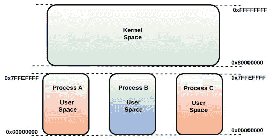
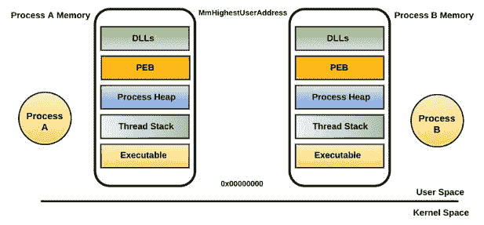

# 第八章：代码注入与挂钩

在上一章中，我们探讨了恶意软件为了在受害者系统中保持存在所使用的不同持久性机制。在本章中，您将学习恶意程序如何将代码注入到另一个进程中（称为*目标进程*或*远程进程*）以执行恶意操作。将恶意代码注入到目标进程的内存并在目标进程的上下文中执行恶意代码的技术被称为*代码注入（或进程注入）*。

攻击者通常选择一个合法进程（如`explorer.exe`或`svchost.exe`）作为目标进程。一旦恶意代码被注入到目标进程中，它就可以在目标进程的上下文中执行恶意操作，如记录击键、窃取密码和外泄数据。在将代码注入到目标进程的内存后，负责注入代码的恶意组件可以选择继续在系统中保持持久性，从而在每次系统重启时都注入代码到目标进程中，或者它可以从文件系统中删除自身，仅将恶意代码保留在内存中。

在深入了解恶意软件代码注入技术之前，理解虚拟内存的概念是至关重要的。

# 1\. 虚拟内存

当您双击一个包含指令序列的程序时，一个进程就会被创建。Windows 操作系统为每个新创建的进程提供自己的私有内存地址空间（称为*进程内存*）。进程内存是*虚拟内存*的一部分；虚拟内存并不是真正的物理内存，而是操作系统内存管理器创造的一种幻觉。正是因为这种幻觉，每个进程都认为它拥有自己的私有内存空间。在运行时，Windows 内存管理器在硬件的帮助下，将虚拟地址转换为实际数据所在的物理地址（在 RAM 中）；为了管理内存，操作系统会将部分内存分页到磁盘。当进程的线程访问已分页到磁盘的虚拟地址时，内存管理器会将其从磁盘加载回内存。下图说明了两个进程 A 和 B，它们的进程内存被映射到物理内存，同时部分内存被分页到磁盘：


由于我们通常处理的是虚拟地址（即你在调试器中看到的地址），因此本章剩余部分将不讨论物理内存。现在，让我们集中讨论虚拟内存。*虚拟内存*分为*进程内存*（进程空间或用户空间）和*内核内存*（内核空间或系统空间）。虚拟内存地址空间的大小取决于硬件平台。例如，在 32 位架构上，默认情况下，总虚拟地址空间（包括进程和内核内存）最大为 4GB。下半部分（下 2GB），地址范围从`0x00000000`到`0x7FFFFFFF`，保留给用户进程（进程内存或用户空间）；上半部分（上 2GB），地址范围从`0x80000000`到`0xFFFFFFFF`，保留给内核内存（内核空间）。

在 32 位系统中，在 4GB 的虚拟地址空间中，每个进程认为它有 2GB 的进程内存，地址范围从`0x00000000`到`0x7FFFFFFF`。由于每个进程认为它拥有自己的私有虚拟地址空间（最终映射到物理内存），因此总虚拟地址空间远大于可用的物理内存（RAM）。Windows 内存管理器通过将部分内存分页到磁盘来解决这个问题；这释放了物理内存，可以用于其他进程或操作系统本身。即使每个 Windows 进程都有自己的私有内存空间，内核内存在大多数情况下是公共的，所有进程共享。以下图表显示了 32 位架构的内存布局。你可能会注意到用户空间和内核空间之间有一个 64KB 的间隙；这一区域不可访问，确保内核不会意外跨越边界并损坏用户空间。你可以通过检查符号`MmHighestUserAddress`来确定进程地址空间的上边界（最后可用地址），并通过使用内核调试器如*Windbg*查询符号`MmSystemRangeStart`来确定内核空间的下边界（第一个可用地址）：



即使每个进程的虚拟地址范围相同（`0x00000000`到`0x7FFFFFFF`），硬件和 Windows 也会确保映射到该范围的物理地址对于每个进程都是不同的。例如，当两个进程访问相同的虚拟地址时，每个进程最终将访问物理内存中的不同地址。通过为每个进程提供私有地址空间，操作系统确保进程不会覆盖彼此的数据。

虚拟内存空间不一定总是被划分为 2GB 的两半；这只是默认的设置。例如，你可以通过使用以下命令启用 3GB 启动开关，这样可以将进程内存增加到 3GB，地址范围从`0x00000000`到`0xBFFFFFFF`；内核内存则获得剩余的 1GB，地址范围从`0xC0000000`到`0xFFFFFFFF`：

```
bcdedit /set increaseuserva 3072
```

x64 架构为进程和内核内存提供了更大的地址空间，如下图所示。在 x64 架构中，用户空间的范围是`0x0000000000000000 - 0x000007ffffffffff`，内核空间从`0xffff080000000000`开始，向上延伸。你可能会注意到用户空间与内核空间之间存在巨大的地址空隙；这个地址范围是不可用的。即使在下图中，内核空间显示从`0xffff080000000000`开始，内核空间中的第一个可用地址是从`ffff800000000000`开始。之所以如此，是因为 x64 代码中使用的所有地址必须是规范的。一个地址被称为规范地址，若其`47-63`位要么全部*设置*，要么全部*清除*。尝试使用非规范地址会导致页面错误异常：


# 1.1 进程内存组件（用户空间）

了解虚拟内存后，让我们将注意力集中在虚拟内存的一部分——*进程内存*。进程内存是*用户应用程序*使用的内存。下图展示了两个进程，并给出了进程内存中组成部分的高层概览。在下图中，内核空间为了简洁起见被故意留空（我们将在下一节填补这个空白）。请记住，进程共享相同的内核空间：



进程内存由以下主要部分组成：

+   **进程可执行文件：** 该区域包含与应用程序相关的可执行文件。当磁盘上的程序被双击时，会创建一个进程，并将与该程序相关的可执行文件加载到进程内存中。

+   **动态链接库（DLLs）：** 当进程创建时，所有与之关联的 DLL 会被加载到进程内存中。该区域表示与进程相关的所有 DLL。

+   **进程环境变量：** 该内存区域存储进程的环境变量，例如临时目录、主目录、AppData 目录等。

+   **进程堆：** 该区域指定进程堆。每个进程有一个堆，并可以根据需要创建额外的堆。该区域指定进程接收的动态输入。

+   **线程栈：** 该区域表示分配给每个线程的专用进程内存范围，称为其*运行时栈*。每个线程都有自己的栈，这里存储函数参数、本地变量和返回地址。

+   **进程环境块（PEB）：** 该区域表示`PEB`结构，包含有关可执行文件加载位置的信息、其在磁盘上的完整路径，以及在内存中查找 DLL 的位置。

您可以使用*Process Hacker*（[`processhacker.sourceforge.io/`](https://processhacker.sourceforge.io/)）工具查看进程内存的内容。操作方法是启动 Process Hacker，右键点击所需进程，选择属性，然后选择内存标签。

# 1.2 内核内存内容（内核空间）

*内核内存*包含操作系统和设备驱动程序。下图显示了用户空间和内核空间的组件。在本节中，我们将主要关注内核空间的组件：


内核内存由以下关键组件组成：

+   `hal.dll`：*硬件抽象层（HAL）*在可加载的内核模块`hal.dll`中实现。HAL 将操作系统与硬件隔离；它实现了支持不同硬件平台（主要是芯片组）的功能。它主要为*Windows 执行体*、*内核*和内核模式的*设备驱动程序*提供服务。内核模式设备驱动程序调用`hal.dll`暴露的函数与硬件进行交互，而不是直接与硬件通信。

+   `ntoskrnl.exe`：该二进制文件是 Windows 操作系统的核心组件，称为内核映像。`ntoskrnl.exe`二进制文件提供两种功能：*执行体*和*内核*。*执行体*实现了称为*系统服务例程*的功能，用户模式应用程序可以通过受控机制调用这些例程。执行体还实现了操作系统的主要组件，如内存管理器、I/O 管理器、对象管理器、进程/线程管理器等。*内核*实现了低级操作系统服务，并暴露出一组例程，执行体依赖这些例程提供更高级的服务。

+   `Win32K.sys`：此内核模式驱动程序实现了*UI*和*图形设备接口（GDI）*服务，这些服务用于在输出设备（如显示器）上渲染图形。它为 GUI 应用程序提供了函数。

# 2\. 用户模式与内核模式

在上一节中，我们看到虚拟内存是如何被划分为用户空间（进程内存）和内核空间（内核内存）的。*用户空间*包含运行时具有受限访问权限的代码（例如可执行文件和 DLL），即*用户模式*。换句话说，运行在用户空间中的可执行文件或 DLL 代码不能访问内核空间中的任何内容，也不能直接与硬件进行交互。*内核空间*包含内核本身（`ntoskrnl.exe`）和*设备驱动程序*。在内核空间中运行的代码具有较高的权限，称为*内核模式*，它可以访问用户空间和内核空间。通过为内核提供较高的权限级别，操作系统确保用户模式的应用程序无法通过访问受保护的内存或 I/O 端口来导致系统不稳定。第三方驱动程序可以通过实现并安装签名驱动程序将其代码运行在内核模式中。

空间（用户空间/内核空间）和模式（用户模式/内核模式）之间的区别在于，*空间*指定内容（数据/代码）存储的位置，而*模式*指的是执行模式，指定应用程序指令如何被允许执行。

如果用户模式的应用程序无法直接与硬件交互，那么问题来了，如何通过调用`WriteFile` API，用户模式下运行的恶意软件二进制文件能够将内容写入磁盘上的文件呢？事实上，大多数用户模式应用程序调用的 API 最终会调用内核执行程序（`ntoskrnl.exe`）中实现的*系统服务例程*（函数），而这些函数又与硬件交互（例如，用于写入磁盘上的文件）。同样，任何调用与 GUI 相关的 API 的用户模式应用程序，最终都会调用内核空间中的`win32k.sys`暴露的函数。以下图示说明了这一概念；为了简化起见，我删除了用户空间的一些组件。`ntdll.dll`（驻留在用户空间中）充当用户空间与内核空间之间的网关。以同样的方式，`user32.dll`充当 GUI 应用程序的网关。在下一节中，我们将主要关注通过`ntdll.dll`将 API 调用过渡到内核执行程序的系统服务例程：


# 2.1 Windows API 调用流程

Windows 操作系统通过暴露实现于 DLL 中的 API 来提供服务。应用程序通过调用实现于 DLL 中的 API 来使用该服务。大多数 API 函数最终都会调用`ntoskrnl.exe`（内核执行程序）中的*系统服务例程*。在本节中，我们将研究应用程序调用 API 时发生了什么，以及 API 如何最终调用`ntoskrnl.exe`（执行程序）中的系统服务例程。具体来说，我们将探讨应用程序调用`WriteFile()` API 时发生的情况。以下图表概述了 API 调用流程的高层次概览：


1.  当通过双击程序启动一个进程时，进程的可执行映像及其所有相关的 DLL 会被 Windows 加载器加载到进程内存中。当进程启动时，会创建主线程，主线程从内存中读取可执行代码并开始执行。需要记住的重要一点是，不是进程执行代码，而是线程执行代码（进程只是线程的容器）。创建的线程在用户模式下开始执行（具有受限访问权限）。进程可以根据需要显式地创建额外的线程。

1.  假设一个应用程序需要调用由`kernel32.dll`导出的`WriteFile()` API。为了将执行控制转移到`WriteFile()`，线程必须知道`WriteFile()`在内存中的地址。如果应用程序导入了`WriteFile()`，那么它可以通过查看一个函数指针表格，称为*导入地址表（IAT）*，来确定其地址，如前面的图所示。该表格位于应用程序的可执行映像中，并且在加载 DLL 时，Windows 加载器会填充该表格，填入函数地址。

应用程序也可以通过调用`LoadLibrary()` API 在运行时加载 DLL，并且可以通过使用`GetProcessAddress()` API 来确定加载的 DLL 中某个函数的地址。如果应用程序在运行时加载了 DLL，那么 IAT 就不会被填充。

1.  一旦线程从 IAT 或运行时中确定了`WriteFile()`的地址，它就会调用`WriteFile()`，该函数在`kernel32.dll`中实现。`WriteFile()`函数中的代码最终会调用一个由网关 DLL `ntdll.dll` 导出的函数`NtWriteFile()`。`ntdll.dll`中的`NtWriteFile()`并不是真正实现的`NtWriteFile()`。具有相同名称的实际函数`NtWriteFile()`（系统服务例程）位于`ntoskrnl.exe`（执行程序）中，包含真正的实现。`ntdll.dll`中的`NtWriteFile()`只是一个桩程序，它执行`SYSENTER`（x86）或`SYSCALL`（x64）指令，这些指令将代码切换到内核模式。

1.  现在，运行在内核模式下的线程（具有无限制访问权限）需要找到实际的`NtWriteFile()`函数的地址，该函数由`ntoskrnl.exe`实现。为此，它查阅了内核空间中的一个表格，称为*系统服务描述符表（SSDT）*，并确定了`NtWriteFile()`的地址。然后它调用 Windows 执行程序中的实际`NtWriteFile()`（系统服务例程）（位于`ntoskrnl.exe`中），该函数将请求引导到*I/O 管理器*中的 I/O 功能。I/O 管理器随后将请求传递给适当的内核模式设备驱动程序。内核模式设备驱动程序使用`HAL`导出的例程与硬件进行交互。

# 3. 代码注入技术

如前所述，代码注入技术的目标是将代码注入到远程进程的内存中，并在远程进程的上下文中执行注入的代码。注入的代码可以是一个模块，如可执行文件、DLL，甚至是 Shellcode。代码注入技术为攻击者提供了许多好处；一旦代码被注入到远程进程中，对手可以执行以下操作：

+   强制远程进程执行注入的代码以执行恶意操作（例如下载附加文件或窃取击键）。

+   注入一个恶意模块（如 DLL），并将远程进程的 API 调用重定向到注入模块中的恶意函数。恶意函数可以拦截 API 调用的输入参数，同时过滤输出参数。例如，*Internet Explorer* 使用 `HttpSendRequest()` 发送一个包含可选 POST 负载的请求到 Web 服务器，并使用 `InternetReadFile()` 从服务器的响应中获取字节，以便在浏览器中显示。攻击者可以将一个模块注入到 Internet Explorer 的进程内存中，并将 `HttpSendRequest()` 重定向到注入模块中的恶意函数，从 POST 负载中提取凭证。以同样的方式，它可以拦截通过 `InternetReadFile()` API 接收到的数据，以读取或修改从 Web 服务器接收到的数据。这使得攻击者可以在数据到达 Web 服务器之前拦截数据（如银行凭证），并且还可以在数据到达受害者浏览器之前，替换或插入额外的数据到服务器响应中（如向 HTML 内容中插入一个额外字段）。

+   将代码注入到已运行的进程中，可以让攻击者实现持久性。

+   将代码注入到受信任的进程中，可以让攻击者绕过安全产品（如白名单软件）并隐藏自己。

在本节中，我们将主要关注用户空间中的代码注入技术。我们将探讨攻击者用来将代码注入远程进程的各种方法。

在以下代码注入技术中，有一个恶意进程（*启动器*或*加载器*）用于注入代码，另一个合法进程（如`explorer.exe`）则是代码将被注入的目标进程。在执行代码注入之前，启动器需要首先识别要注入代码的进程。这通常通过枚举系统中运行的进程来实现；它使用三个 API 调用：`CreateToolhelp32Snapshot()`、`Process32First()` 和 `Process32Next()`。`CreateToolhelp32Snapshot()` 用于获取所有运行中的进程的快照；`Process32First()` 获取快照中第一个进程的信息；`Process32Next()` 在循环中用于遍历所有进程。`Process32First()` 和 `Process32Next()` APIs 获取进程的相关信息，如可执行文件名、进程 ID 和父进程 ID；这些信息可供恶意软件判断是否是目标进程。有时，恶意程序会选择启动一个新进程（如 `notepad.exe`），然后将代码注入到该进程中，而不是注入到已运行的进程。

无论恶意软件是将代码注入到已在运行的进程中，还是启动一个新进程来注入代码，所有代码注入技术（接下来会介绍）的目标都是将恶意代码（可以是 DLL、可执行文件或 Shellcode）注入到目标（合法）进程的地址空间，并迫使合法进程执行注入的代码。根据代码注入技术，待注入的恶意组件可以存储在磁盘上或内存中。以下图示应能为您提供一个关于用户空间代码注入技术的高层次概览：


# 3.1 远程 DLL 注入

在此技术中，目标（远程）进程被强制通过`LoadLibrary()` API 将一个恶意 DLL 加载到其进程内存空间中。`kernel32.dll` 导出 `LoadLibrary()`，此函数接受一个参数，即磁盘上 DLL 的路径，并将该 DLL 加载到调用进程的地址空间中。在这种注入技术中，恶意软件进程在目标进程中创建一个线程，并使该线程调用 `LoadLibrary()`，通过传递恶意 DLL 路径作为参数。由于线程是在目标进程中创建的，目标进程将恶意 DLL 加载到其地址空间中。一旦目标进程加载了恶意 DLL，操作系统会自动调用该 DLL 的 `DllMain()` 函数，从而执行恶意代码。

以下步骤详细描述了如何执行该技术，并以名为`nps.exe`（加载器或启动器）的恶意软件为例，通过`LoadLibrary()`将 DLL 注入到合法的 `explorer.exe` 进程中。在注入恶意 DLL 组件之前，它会被写入磁盘，然后执行以下步骤：

1.  恶意软件进程（`nps.exe`）识别目标进程（在此案例中为`explorer.exe`）并获取其进程 ID（pid）。获取 pid 的目的是打开一个目标进程的句柄，以便恶意软件进程能够与其交互。为了打开句柄，使用`OpenProcess()` API，其中一个接受的参数是进程的 pid。在下面的截图中，恶意软件通过将 `explorer.exe` 的 pid（`0x624`，即`1572`）作为第三个参数来调用`OpenProcess()`。`OpenProcess()`的返回值是指向`explorer.exe`进程的句柄：


1.  恶意软件进程接着使用`VirutualAllocEx()` API 在目标进程中分配内存。在下面的截图中，第一个参数（`0x30`）是`explorer.exe`（目标进程）的句柄，它是从前一步获取的。第三个参数，`0x27 (39)`，表示在目标进程中要分配的字节数，第五个参数（`0x4`）是常量值，表示 `PAGE_READWRITE` 内存保护。`VirtualAllocEx()` 的返回值是 `explorer.exe` 中分配内存的地址：


1.  在目标进程中分配内存的原因是为了复制一个字符串，该字符串标识磁盘上恶意 DLL 的完整路径。恶意软件使用 `WriteProcessMemory()` 将 DLL 路径名复制到目标进程中分配的内存。在下面的截图中，第 2 个参数 `0x01E30000` 是目标进程中分配内存的地址，第 3 个参数是将写入目标内存地址 `0x01E30000` 中的 DLL 完整路径，该路径将写入 `explorer.exe` 中：


1.  将 DLL 路径名复制到目标进程内存中的想法是，稍后，当在目标进程中创建远程线程并通过远程线程调用 `LoadLibrary()` 时，DLL 路径将作为参数传递给 `LoadLibrary()`。在创建远程线程之前，恶意软件必须确定 `LoadLibrary()` 在 `kernel32.dll` 中的地址；为此，它调用 `GetModuleHandleA()` API，并将 `kernel32.dll` 作为参数传递，该函数将返回 `Kernel32.dll` 的基地址。一旦获得 `kernel32.dll` 的基地址，它通过调用 `GetProcessAddress()` 确定 `LoadLibrary()` 的地址。

1.  此时，恶意软件已将 DLL 路径名复制到目标进程的内存中，并且已确定 `LoadLibrary()` 的地址。接下来，恶意软件需要在目标进程（`explorer.exe`）中创建一个线程，并且该线程必须通过传递已复制的 DLL 路径名来执行 `LoadLibrary()`，以便 `explorer.exe` 加载恶意 DLL。为此，恶意软件调用 `CreateRemoteThread()`（或未文档化的 API `NtCreateThreadEx()`），该 API 会在目标进程中创建一个线程。在下面的截图中，`CreateRemoteThread()` 的第 1 个参数 `0x30` 是 `explorer.exe` 进程的句柄，在此进程中将创建该线程。第 4 个参数是目标进程内存中线程将开始执行的地址，即 `LoadLibrary()` 的地址，第 5 个参数是目标进程内存中包含 DLL 完整路径的地址。调用 `CreateRemoteThread()` 后，在 `explorer.exe` 中创建的线程将调用 `LoadLibrary()`，从磁盘加载 DLL 到 `explorer.exe` 的进程内存空间中。由于加载了恶意 DLL，其 `DLLMain()` 函数会自动被调用，从而在 `explorer.exe` 上下文中执行恶意代码：


1.  注入完成后，恶意软件调用 `VirtualFree()` API 释放包含 DLL 路径的内存，并使用 `CloseHandle()` API 关闭对目标进程（`explorer.exe`）的句柄。

恶意进程可以将代码注入到与其具有相同或更低完整性级别的其他进程中。例如，一个具有中等完整性级别的恶意进程可以将代码注入到同样具有中等完整性级别的 `explorer.exe` 进程中。要操控系统级进程，恶意进程需要通过调用 `AdjustTokenPrivileges()` 启用 `SE_DEBUG_PRIVILEGE`（这需要管理员权限）；这样它就可以读取、写入或将代码注入到另一个进程的内存中。

# 3.2 使用 APC 进行 DLL 注入（APC 注入）

在前述技术中，写入 DLL 路径名后，调用 `CreateRemoteThread()` 创建目标进程中的线程，该线程进而调用 `LoadLibrary()` 来加载恶意 DLL。*APC 注入* 技术与远程 DLL 注入类似，但不同的是，恶意软件利用 *异步过程调用（APC）* 来强制目标进程的线程加载恶意 DLL，而不是使用 `CreateRemoteThread()`。

APC 是在特定线程的上下文中异步执行的一个函数。每个线程都有一个 APC 队列，当目标线程进入可警报状态时，队列中的 APC 将会被执行。根据微软文档（[`msdn.microsoft.com/en-us/library/windows/desktop/ms681951(v=vs.85).aspx`](https://msdn.microsoft.com/en-us/library/windows/desktop/ms681951(v=vs.85).aspx)），线程会在调用以下函数之一时进入可警报状态：

```
SleepEx(), 
SignalObjectAndWait()
MsgWaitForMultipleObjectsEx()
WaitForMultipleObjectsEx()
WaitForSingleObjectEx()
```

APC 注入技术的工作原理是，恶意软件进程识别目标进程中处于可警报状态或可能进入可警报状态的线程。然后，它使用 `QueueUserAPC()` 函数将自定义代码放入该线程的 APC 队列中。排队自定义代码的目的是，当线程进入可警报状态时，线程会从 APC 队列中获取并执行该代码。

以下步骤描述了一个恶意软件样本，通过 APC 注入技术将恶意 DLL 加载到 Internet Explorer `（iexplore.exe）` 进程中。这项技术与远程 DLL 注入的四个步骤相同（换句话说，它打开了 `iexplore.exe` 的句柄，在目标进程中分配内存，将恶意 DLL 的路径名复制到分配的内存中，并确定 `Loadlibrary()` 的地址）。接下来，按照以下步骤强制远程线程加载恶意 DLL：

1.  它使用 `OpenThread()` API 打开目标进程线程的句柄。在以下截图中，第三个参数 `0xBEC(3052)` 是 `iexplore.exe` 进程的线程 ID (TID)。`OpenThread()` 的返回值是 `iexplore.exe` 线程的句柄：


1.  恶意程序接着调用 `QueueUserAPC()` 将 APC 函数排入 Internet Explorer 线程的 APC 队列。在下图中，`QueueUserAPC()` 的第 1 个参数是指向恶意程序希望目标线程执行的 APC 函数的指针。在此案例中，APC 函数是之前确定的 `LoadLibrary()` 地址。第 2 个参数 `0x22c` 是 `iexplore.exe` 目标线程的句柄。第 3 个参数 `0x2270000` 是目标进程（`iexplore.exe`）内存中包含恶意 DLL 完整路径的地址；当线程执行该 APC 函数时，这个参数会自动作为参数传递给 APC 函数（`LoadLibrary()`）：


下图显示了 Internet Explorer 进程内存中地址 `0x2270000` 的内容（这是作为第 3 个参数传递给 `QueueUserAPC()` 的地址）；该地址包含恶意软件之前写入的 DLL 的完整路径：


到此为止，注入过程已经完成，当目标进程的线程进入可警报状态时，线程会从 APC 队列中执行 `LoadLibrary()`，并将 DLL 的完整路径作为参数传递给 `LoadLibrary()`。结果，恶意 DLL 被加载到目标进程的地址空间，从而调用包含恶意代码的 `DLLMain()` 函数。

# 3.3 使用 SetWindowsHookEx() 进行 DLL 注入

在上一章中（请参阅 *第 1.3.2 节，使用 SetWindowsHookEx 的键盘记录器*），我们研究了恶意软件如何使用 `SetWindowsHookEx()` API 安装 *钩子过程* 来监控键盘事件。`SetWindowsHookEx()` API 还可以用来将 DLL 加载到目标进程的地址空间并执行恶意代码。为了做到这一点，恶意软件首先将恶意 DLL 加载到自身的地址空间中。接着，它为特定事件（如 *键盘* 或 *鼠标事件*）安装一个 *钩子过程*（由恶意 DLL 导出的函数），并将该事件与目标进程的线程（或当前桌面上的所有线程）关联。其原理是，当某个特定事件被触发时，目标进程的线程会调用安装的钩子过程。为了调用 DLL 中定义的钩子过程，必须将 DLL（包含钩子过程）加载到目标进程的地址空间中。

换句话说，攻击者创建一个包含*导出*函数的 DLL。包含恶意代码的导出函数被设置为特定事件的*钩子程序*。钩子程序与目标进程的一个线程相关联，当事件触发时，攻击者的 DLL 被加载到目标进程的地址空间，钩子程序由目标进程的线程调用，从而执行恶意代码。恶意软件可以为任何类型的事件设置钩子，只要该事件有可能发生。关键点在于，DLL 被加载到目标进程的地址空间并执行恶意行为。

以下描述了恶意软件样本（*Trojan Padador*）加载其 DLL 到远程进程的地址空间并执行恶意代码的步骤：

1.  恶意软件执行文件将一个名为`tckdll.dll`的 DLL 文件放置到磁盘上。该 DLL 包含一个入口点函数和一个名为`TRAINER`的导出函数，如下所示。DLL 入口点函数的作用不大，而`TRAINER`函数包含恶意代码。这意味着每当加载 DLL 时（其入口点函数被调用），恶意代码不会执行；只有当调用`TRAINER`函数时，恶意行为才会被触发：


1.  恶意软件通过`LoadLibrary()` API 将 DLL（`tckdll.dll`）加载到自己的地址空间，但此时并未执行任何恶意代码。`LoadLibrary()`的返回值是已加载模块（`tckdll.dll`）的句柄。接着，它使用`GetProcAddress()`来确定`TRAINER`函数的地址：


1.  恶意软件使用`tckdll.dll`的句柄和`TRAINER`函数的地址来为键盘事件注册一个*钩子程序*。在下面的截图中，第一个参数`WH_KEYBOARD`（常量值`2`）指定了触发钩子程序的事件类型。第二个参数是钩子程序的地址，即前一步确定的`TRAINER`函数的地址。第三个参数是`tckdll.dll`的句柄，它包含钩子程序。第四个参数`0`指定钩子程序必须与当前桌面上的所有线程相关联。恶意软件也可以选择通过提供线程 ID 来将钩子程序与特定线程关联，而不是将其与所有桌面线程关联：


执行上述步骤后，当应用程序内触发键盘事件时，该应用程序将加载恶意 DLL 并调用`TRAINER`函数。例如，当你启动*记事本*并输入一些字符（触发键盘事件）时，`tckdll.dll`将被加载到记事本的地址空间中，并调用`TRAINER`函数，迫使`notepad.exe`进程执行恶意代码。

# 3.4 使用应用程序兼容性补丁的 DLL 注入

微软 Windows *应用程序兼容性框架/基础结构（应用程序补丁）* 是一项功能，允许为旧版本操作系统（如 Windows XP）创建的程序在现代操作系统版本（如 Windows 7 或 Windows 10）上运行。这是通过 *应用程序兼容性修复*（*补丁*）来实现的。补丁由微软提供给开发者，以便他们可以在不重写代码的情况下修复程序。当补丁应用到程序时，并且当被补丁处理的程序执行时，补丁引擎会将补丁程序的 API 调用重定向到补丁代码；这是通过将 IAT 中的指针替换为补丁代码的地址来完成的。应用程序如何使用 IAT 的详细信息在 *2.1** Windows API 调用流程* 小节中已有说明。换句话说，它挂钩 Windows API，将调用重定向到补丁代码，而不是直接在 DLL 中调用 API。由于 API 重定向，补丁代码可以修改传递给 API 的参数、重定向 API，或修改来自 Windows 操作系统的响应。下图应该有助于你理解 Windows 操作系统中普通应用程序与补丁应用程序交互的差异：


为了帮助你理解补丁的功能，我们来看一个例子。假设在几年前（Windows 7 发布之前），你编写了一个应用程序（`xyz.exe`），在执行某些有用操作之前，会检查操作系统版本。假设你的应用程序通过调用 `kernel32.dll` 中的 `GetVersion()` API 来确定操作系统版本。简而言之，只有在操作系统版本为 Windows XP 时，应用程序才会执行某些有用的操作。现在，如果你将这个应用程序（`xyz.exe`）在 Windows 7 上运行，它将不会做任何有用的事情，因为 `GetVersion()` 返回的 Windows 7 操作系统版本与 Windows XP 不匹配。为了使该应用程序在 Windows 7 上正常运行，你可以修复代码并重新编译程序，或者你可以对该应用程序（`xyz.exe`）应用一个名为 `WinXPVersionLie` 的补丁。

在应用补丁后，当补丁应用程序（`xyz.exe`）在 Windows 7 上执行，并尝试通过调用 `GetVersion()` 来确定操作系统版本时，补丁引擎会拦截并返回一个不同版本的 Windows（Windows XP，而非 Windows 7）。具体来说，当补丁应用程序执行时，补丁引擎会修改 IAT（导入地址表），并将 `GetVersion()` API 调用重定向到补丁代码（而非 `kernel32.dll`）。换句话说，`WinXPVersionLie` 补丁通过欺骗应用程序，使其认为自己运行在 Windows XP 上，而无需修改应用程序中的代码。

要了解 shim 引擎的详细信息，请参考 Alex Ionescu 的博客文章，*应用程序兼容性数据库（SDB）的秘密*，网址为 [`www.alex-ionescu.com/?p=39`](http://www.alex-ionescu.com/?p=39)。

微软提供了*数百个 shim*（如 `WinXPVersionLie`），可以应用于应用程序以改变其行为。这些 shim 中有一些被攻击者滥用，用于实现持久化、注入代码以及以提升的权限执行恶意代码。

# 3.4.1 创建一个 Shim

有许多 shim 可以被攻击者滥用以进行恶意操作。在这一部分，我将带你了解创建一个 shim 以注入 DLL 到目标进程的过程；这将帮助你理解攻击者如何轻松地创建一个 shim 并滥用此功能。在这个案例中，我们将为 `notepad.exe` 创建一个 shim，使它加载我们选择的 DLL。为应用程序创建一个 shim 可以分为四个步骤：

+   选择要 shim 的应用程序。

+   为应用程序创建 shim 数据库。

+   保存数据库（`.sdb` 文件）。

+   安装数据库。

要创建和安装一个 shim，你需要具有管理员权限。你可以使用微软提供的工具，*应用程序兼容性工具包（ACT）*，来执行所有上述步骤。对于 Windows 7，可以从 [`www.microsoft.com/en-us/download/details.aspx?id=7352`](https://www.microsoft.com/en-us/download/details.aspx?id=7352) 下载；对于 Windows 10，它与 Windows ADK 捆绑在一起；根据版本，下载地址为 [`developer.microsoft.com/en-us/windows/hardware/windows-assessment-deployment-kit`](https://developer.microsoft.com/en-us/windows/hardware/windows-assessment-deployment-kit)。在 64 位版本的 Windows 上，ACT 会安装两个版本的 *兼容性管理员工具*（32 位和 64 位）。要对 32 位程序进行 shim 操作，必须使用 32 位版本的兼容性管理员工具；要对 64 位程序进行 shim 操作，则使用 64 位版本。

为了演示这一概念，我将使用 32 位版本的 Windows 7，选择的目标进程是 `notepad.exe`。我们将创建一个 `InjectDll` shim，使得 `notepad.exe` 加载一个名为 `abcd.dll` 的 DLL。要创建一个 shim，请从开始菜单启动兼容性管理员工具（32 位），然后右键点击“新建数据库 | 应用程序修复”。


在以下对话框中，输入你想要 shim 的应用程序的详细信息。程序名称和厂商名称可以随意设置，但程序文件的位置必须正确。


在你按下“下一步”按钮后，会出现一个**兼容性模式**对话框；你可以直接按“下一步”按钮。在下一个窗口中，会出现一个兼容性修复（Shim）对话框；在这里，你可以选择各种 shim。在此案例中，我们关注的是`InjectDll` shim。选择`InjectDll` shim 复选框，然后点击“参数”按钮并输入 DLL 的路径（这是我们希望记事本加载的 DLL），如下所示。点击“确定”并按“下一步”按钮。需要注意的一点是，`InjectDll` shim 选项仅在 32 位兼容性管理员工具中可用，这意味着你只能将这个 shim 应用于 32 位进程：


接下来，你将看到一个屏幕，指定哪些属性将用于匹配程序（*记事本*）。当`notepad.exe`运行时，选定的属性将被匹配，当匹配条件满足后，shim 将被应用。为了使匹配标准不那么严格，我取消了所有选项，如下所示：


点击“完成”后，你将看到应用程序及其应用的修复程序的完整摘要，如下所示。此时，包含`notepad.exe`的 shim 信息的 shim 数据库已创建：


下一步是保存数据库；为此，点击“保存”按钮，并在提示时给你的数据库命名并保存文件。在此案例中，数据库文件保存为`notepad.sdb`（你可以选择任何文件名）。

数据库文件保存后，下一步是安装数据库。你可以通过右键单击已保存的 shim 并点击“安装”按钮来安装它，如下所示：


另一种安装数据库的方法是使用内置的命令行工具`sdbinst.exe`；你可以通过以下命令安装数据库：

```
sdbinst.exe notepad.sdb
```

现在，如果你调用`notepad.exe`，`abcd.dll`将从`c:\test`目录加载到记事本的进程地址空间中，如下所示：


# 3.4.2 Shim 工件

此时，你已经了解了如何使用 shim 将 DLL 加载到目标进程的地址空间。在我们讨论攻击者如何使用 shim 之前，首先必须了解安装 shim 数据库时会创建哪些工件（无论是通过右键单击数据库并选择“安装”，还是使用`sdbinst.exe`工具）。当你安装数据库时，安装程序会为数据库创建一个 GUID，并将 `.sdb` 文件复制到`%SystemRoot%\AppPatch\Custom\<GUID>.sdb`（32 位 shim）或`%SystemRoot%\AppPatch\Custom\Custom64\<GUID>.sdb`（64 位 shim）。它还会在以下注册表项中创建两个注册表项：

```
HKLM\SOFTWARE\Microsoft\Windows NT\CurrentVersion\AppCompatFlags\Custom\
HKLM\SOFTWARE\Microsoft\Windows NT\CurrentVersion\AppCompatFlags\InstalledSDB\
```

以下截图显示了在 `HKLM\SOFTWARE\Microsoft\Windows NT\CurrentVersion\AppCompatFlags\Custom\` 中创建的注册表项。此注册表项包含应用 shim 的程序名称以及关联的 shim 数据库文件（`<GUID>.sdb`）：


第二个注册表项，`HKLM\SOFTWARE\Microsoft\Windows NT\CurrentVersion\AppCompatFlags\InstalledSDB\`，包含数据库信息和 shim 数据库文件的安装路径：


这些工件的创建目的是，当应用了 shim 的应用程序执行时，加载器会通过查阅这些注册表项来判断应用是否需要被 shim，并调用 shim 引擎，该引擎将使用位于 `AppPatch\` 目录中的 `.sdb` 文件配置来 shim 应用程序。另一个结果是，安装 shim 数据库时会将条目添加到 *控制面板* 中的 *已安装程序* 列表中。

# 3.4.3 攻击者如何使用 Shim

以下步骤描述了攻击者如何将一个应用程序应用 shim 并将其安装到受害者系统上的方式：

+   攻击者为目标应用程序（如 `notepad.exe` 或受害者常用的任何合法第三方应用程序）创建 *应用程序兼容性数据库（shim 数据库）*。攻击者可以选择一个单独的 shim，例如 `InjectDll`，或多个 shim。

+   攻击者保存为目标应用程序创建的 shim 数据库（`.sdb` 文件）。

+   `.sdb` 文件被传送并丢弃在受害者系统上（通常通过恶意软件），并且它被安装，通常使用 `sdbinst` 工具。

+   攻击者调用目标应用程序或等待用户执行目标应用程序。

+   攻击者还可以删除安装 shim 数据库的恶意软件。在这种情况下，你只剩下 `.sdb` 文件。

攻击者可以通过将 `.sdb` 文件丢到文件系统的某个位置并修改最小的注册表项集合来安装 shim 数据库。这种方法避免了使用 `sdbinst` 工具。`shim_persist` 对象（[`github.com/hasherezade/persistence_demos/tree/master/shim_persist`](https://github.com/hasherezade/persistence_demos/tree/master/shim_persist)）是由安全研究员 Hasherezade（`@hasherezade`）编写的一个 POC，旨在将 DLL 丢入 `programdata` 目录并安装 shim，而无需使用 `sdbinst` 工具，将丢弃的 DLL 注入 `explorer.exe` 进程。

恶意软件作者已将 shim 滥用用于不同的目的，例如实现持久性、代码注入、禁用安全功能、以提升的权限执行代码，以及绕过 *用户帐户控制 (UAC)* 提示。下表概述了部分有趣的 shim 及其描述：

| **Shim 名称** | **描述** |
| --- | --- |
| `RedirectEXE` | 重定向执行 |
| `InjectDll` | 将 DLL 注入应用程序 |
| `DisableNXShowUI` | 禁用*数据执行防护*（*DEP*） |
| `CorrectFilePaths` | 重定向文件系统路径 |
| `VirtualRegistry` | 注册表重定向 |
| `RelaunchElevated` | 以提升的权限重新启动应用程序 |
| `TerminateExe` | 启动时终止可执行文件 |
| `DisableWindowsDefender` | 禁用 Windows Defender 服务以供应用程序使用 |
| `RunAsAdmin` | 标记应用程序以管理员权限运行 |

欲了解有关 shim 如何在攻击中使用的更多信息，请参考安全研究人员在各大会议上发布的演讲，所有这些演讲均可在[`sdb.tools/talks.html`](https://sdb.tools/talks.html)找到。

# 3.4.4 分析 Shim 数据库

要为应用程序安装 shim，攻击者会在受害者的文件系统中某个位置安装 shim 数据库（`.sdb`）。假设你已识别出在恶意活动中使用的 `.sdb` 文件，你可以使用如`sdb-explorer`（[`github.com/evil-e/sdb-explorer`](https://github.com/evil-e/sdb-explorer)）或`python-sdb`（[`github.com/williballenthin/python-sdb`](https://github.com/williballenthin/python-sdb)）等工具来调查该 `.sdb` 文件。

在下面的示例中，使用了`python-sdb`工具来调查我们之前创建的 shim 数据库（`.sdb`）文件。运行`python-sdb`工具查看 shim 数据库时，将显示其元素，如下所示：

```
$ python sdb_dump_database.py notepad.sdb
<DATABASE>
   <TIME type='integer'>0x1d3928964805b25</TIME>
   <COMPILER_VERSION type='stringref'>2.1.0.3</COMPILER_VERSION>
   <NAME type='stringref'>notepad</NAME>
   <OS_PLATFORM type='integer'>0x1</OS_PLATFORM>
   <DATABASE_ID type='guid'>ed41a297-9606-4f22-93f5-b37a9817a735</DATABASE_ID>
   <LIBRARY>
   </LIBRARY>
   <EXE>
     <NAME type='stringref'>notepad.exe</NAME>
     <APP_NAME type='stringref'>notepad</APP_NAME>
     <VENDOR type='stringref'>&lt;Unknown&gt;</VENDOR>
     <EXE_ID type='hex'>a65e89a9-1862-4886-b882-cb9b888b943c</EXE_ID>
     <MATCHING_FILE>
       <NAME type='stringref'>*</NAME>
     </MATCHING_FILE>
     <SHIM_REF>
       <NAME type='stringref'>InjectDll</NAME>
       <COMMAND_LINE type='stringref'>c:\test\abcd.dll</COMMAND_LINE>
     </SHIM_REF>
   </EXE>
</DATABASE>
```

在一次攻击中，*dridex* 恶意软件使用了`RedirectEXE` shim 来绕过 UAC。它安装了 shim 数据库，并在提升权限后立即删除了该数据库。有关详细信息，请参阅博客文章：[`blog.jpcert.or.jp/2015/02/a-new-uac-bypass-method-that-dridex-uses.html`](http://blog.jpcert.or.jp/2015/02/a-new-uac-bypass-method-that-dridex-uses.html)。

# 3.5 远程可执行文件/恶意代码注入

在此技术中，恶意代码直接注入到目标进程内存中，而无需将组件写入磁盘。恶意代码可以是*shellcode*或*可执行文件*，其导入地址表已为目标进程配置。通过使用`CreateRemoteThread()`创建远程线程来强制执行注入的恶意代码，并且线程的起始位置指向注入代码块中的代码/函数。这种方法的优点是恶意软件进程无需将恶意 DLL 写入磁盘；它可以从二进制文件的*资源区*提取代码进行注入，或者通过网络获取代码并直接进行代码注入。

以下步骤描述了如何执行此技术，以一个名为`nsasr.exe`（*W32/Fujack*）的恶意软件样本为例，该恶意软件将可执行文件注入到 Internet Explorer（`iexplorer.exe`）进程中：

1.  恶意软件进程（`nsasr.exe`）使用`OpenProcess()` API 打开 Internet Explorer 进程（`iexplore.exe`）的句柄。

1.  使用`VirutualAllocEx()`在目标进程（`iexplore.exe`）中的特定地址`0x13150000`分配内存，使用`PAGE_EXECUTE_READWRITE`保护，而不是`PAGE_READWRITE`（与*远程 DLL 注入技术*相比，*在第 3.1 节中介绍*）。保护`PAGE_EXECUTE_READWRITE`允许恶意软件进程（`nsasr.exe`）将代码写入目标进程，并且在写入代码后，此保护允许目标进程（`iexplore.exe`）从此内存中读取和执行代码。

1.  然后，使用`WriteProcessMemory()`将恶意可执行内容写入前一步分配的内存中。在下面的截图中，第 1 个参数`0xD4`是指向`iexplore.exe`的句柄。第 2 个参数`0x13150000`是目标进程（`iexplore.exe`）内存中将要写入内容的地址。第 3 个参数`0x13150000`是恶意软件（`nsasr.exe`）进程内存中的缓冲区；该缓冲区包含将要写入目标进程内存的可执行内容：


1.  在恶意可执行内容（在地址`0x13150000`处）写入`iexplore.exe`进程内存后，调用`CreateRemoteThread()` API 创建一个远程线程，并使线程的起始地址指向注入可执行文件的*入口点地址*。在下面的截图中，第 4 个参数`0x13152500`指定了目标进程（`iexplore.exe`）内存中线程将开始执行的地址；这是注入可执行文件的*入口点地址*。此时，注入完成，`iexplore.exe`进程中的线程开始执行恶意代码：

*反射式 DLL 注入*是一种类似于远程可执行代码/ShellCode 注入的技术。在这种方法中，直接注入包含反射式加载器组件的 DLL，并使目标进程调用负责解析导入项、将其重定位到适当内存位置并调用`DllMain()`函数的反射式加载器组件。这种技术的优点在于它不依赖于`LoadLibrary()`函数来加载 DLL。由于`LoadLibrary()`只能从磁盘加载库，因此注入的 DLL 无需驻留在磁盘上。有关此技术的更多信息，请参考 Stephen Fewer 的*反射式 DLL 注入*，网址为[`github.com/stephenfewer/ReflectiveDLLInjection`](https://github.com/stephenfewer/ReflectiveDLLInjection)。

# 3.6 空洞进程注入（进程空洞化）

*进程空壳*，或*空壳进程注入*，是一种代码注入技术，其中内存中合法进程的可执行部分被恶意可执行文件替换。这项技术使攻击者能够将恶意软件伪装成合法进程并执行恶意代码。该技术的优点是，被空壳的进程路径仍然指向合法路径，并且通过在合法进程的上下文中执行，恶意软件可以绕过防火墙和主机入侵防御系统。例如，如果`svchost.exe`进程被空壳，路径仍然指向合法的可执行文件路径（`C:\Windows\system32\svchost.exe`）**，** 但在内存中，`svchost.exe`的可执行部分已被恶意代码替换；这使得攻击者能够避免被实时取证工具检测到。

以下步骤描述了恶意软件样本（*Skeeyah*）执行的空壳进程注入过程。在以下描述中，恶意软件进程会从其*资源区*中提取要注入的恶意可执行文件，然后执行这些步骤：

1.  恶意软件进程以挂起模式启动一个合法进程。结果，合法进程的可执行部分被加载到内存中，内存中的`进程环境块（PEB）`结构标识了合法进程的完整路径。PEB 的`ImageBaseAddress`（`Peb.ImageBaseAddress`）字段包含合法进程可执行文件加载的地址。在以下截图中，恶意软件以挂起模式启动合法的`svchost.exe`进程，在这种情况下，`svchost.exe`被加载到地址`0x01000000`：


1.  恶意软件确定`PEB`结构的地址，以便读取`PEB.ImageBaseAddress`字段来确定进程可执行文件的基址（`svchost.exe`）。为了确定`PEB`结构的地址，恶意软件调用`GetThreadContext()`。`GetThreadContext()`用于检索指定线程的上下文，接受两个参数：第一个参数是线程的句柄，第二个参数是指向名为`CONTEXT`的结构的指针**。** 在此情况下，恶意软件将挂起线程的句柄作为第一个参数传递给`GetThreadContext()`，并将`CONTEXT`结构的指针作为第二个参数传递。此 API 调用后，`CONTEXT`结构会填充挂起线程的上下文。此结构包含挂起线程的寄存器状态。然后，恶意软件读取`CONTEXT._Ebx`字段，该字段包含指向`PEB`数据结构的指针。一旦确定了`PEB`的地址，恶意软件就读取`PEB.ImageBaseAddress`来确定进程可执行文件的基地址（换句话说，`0x01000000`）：


确定 PEB 指针的另一种方法是使用`NtQueryInformationProcess()`函数；有关详细信息，请访问[`msdn.microsoft.com/en-us/library/windows/desktop/ms684280(v=vs.85).aspx`](https://msdn.microsoft.com/en-us/library/windows/desktop/ms684280(v=vs.85).aspx)。

1.  一旦确定了内存中要操作的目标进程可执行文件的地址，就使用`NtUnMapViewofSection()` API 释放合法进程（`svchost.exe`）的可执行部分。在下面的截图中，第一个参数是指向`svchost.exe`进程的句柄（`0x34`），第二个参数是要释放的进程可执行文件的基本地址（`0x01000000`）：


1.  在进程可执行部分被挖空后，在合法进程（`svchost.exe`）中分配一个具有`读取`、`写入`和`执行`权限的新内存段。新的内存段可以分配在相同的地址（在进程被挖空之前的位置）或不同的区域。在下面的截图中，恶意软件使用`VirutalAllocEX()`在不同的区域（在本例中为`0x00400000`）中分配内存：


1.  然后使用`WriteProcessMemory()`将恶意可执行文件及其各个部分复制到新分配的内存地址`0x00400000`：


1.  然后，恶意软件将合法进程的`PEB.ImageBaseAdress`覆盖为新分配的地址。下面的截图显示了恶意软件使用新地址（`0x00400000`）覆盖`svchost.exe`的`PEB.ImageBaseAdress`；这将使`PEB`中`svchost.exe`的基本地址从`0x1000000`更改为`0x00400000`（此地址现在包含注入的可执行文件）：


1.  然后恶意软件将悬停线程的*起始地址*更改为注入可执行文件的*入口点地址*。这是通过设置`CONTEXT._Eax`值并调用`SetThreadContext()`来实现的。此时，悬停进程的线程指向注入代码。然后使用`ResumeThread()`恢复已悬停的线程。之后，恢复的线程开始执行注入的代码：

恶意软件进程可能只使用`NtMapViewSection()`来避免使用`VirtualAllocEX()`和`WriteProcessMemory()`将恶意可执行内容写入目标进程；这样，恶意软件可以将包含恶意可执行文件的内存段从其自身地址空间映射到目标进程的地址空间。除了前面描述的技术，攻击者还被发现使用不同变种的空洞进程注入技术。为了更好理解这一点，可以观看*作者在黑帽大会上的演讲*，链接为[`www.youtube.com/watch?v=9L9I1T5QDg4`](https://www.youtube.com/watch?v=9L9I1T5QDg4)，或者阅读相关博客文章：[`cysinfo.com/detecting-deceptive-hollowing-techniques/`](https://cysinfo.com/detecting-deceptive-hollowing-techniques/)。

# 4\. 钩子技术

到目前为止，我们已经介绍了不同的代码注入技术来执行恶意代码。攻击者将代码（主要是 DLL，但也可以是可执行文件或 Shellcode）注入到合法（目标）进程中的另一个原因是钩取目标进程发出的 API 调用。一旦代码注入到目标进程，它就可以完全访问进程内存，并修改其组件。能够修改进程内存组件使得攻击者可以替换 IAT 中的条目，或者修改 API 函数本身；这种技术被称为*钩子技术*。通过钩取 API，攻击者可以控制程序的执行路径，并将其重定向到他选择的恶意代码。然后，恶意函数可以：

+   阻止合法应用程序（如安全产品）对 API 的调用。

+   监视并拦截传递给 API 的输入参数。

+   过滤 API 返回的输出参数。

在本节中，我们将介绍不同类型的钩子技术。

# 4.1 IAT 钩子

如前所述，IAT（导入地址表）包含应用程序从 DLL 导入的函数地址。在此技术中，DLL 注入到目标（合法）进程后，注入的 DLL 中的代码（`Dllmain()`函数）会钩取目标进程中的 IAT 条目。以下是执行此类型钩子的步骤概述：

+   通过解析内存中的可执行镜像来定位 IAT。

+   确定要钩取的函数入口。

+   用恶意函数的地址替换函数的地址。

为了帮助理解，我们来看一个例子：一个合法程序通过调用`DeleteFileA()` API 删除文件。`DeleteFileA()`对象接受一个参数，即要删除的文件名。以下截图显示了合法进程（钩取之前），正常咨询 IAT 以确定`DeleteFileA()`的地址，然后调用`DeleteFileA()`，它位于`kernel32.dll`中：


当程序的 IAT 被挂钩时，IAT 中 `DeleteFileA()` 的地址被替换为恶意函数的地址，如下所示。现在，当合法程序调用 `DeleteFileA()` 时，调用将被重定向到恶意模块中的恶意函数。然后，恶意函数调用原始的 `DeleteFileA()` 函数，使一切看起来正常。中间的恶意函数可以阻止合法程序删除文件，或者监视参数（正在被删除的文件），然后采取一些行动：


除了阻止和监视之外，通常在调用原始函数之前发生，恶意函数还可以过滤输出参数，这发生在重新调用之后。这样，恶意软件可以挂钩显示进程、文件、驱动程序、网络端口等列表的 API，并过滤输出以隐藏不希望被使用这些 API 函数的工具发现。

使用这种技术的攻击者的劣势在于，如果程序使用*运行时链接*，或者攻击者希望挂钩的函数已被导入为*序数*，则此技术无法使用。攻击者的另一个劣势是，IAT hooking 可以很容易被检测到。在正常情况下，IAT 中的条目应该位于其对应模块的地址范围内。例如，`DeleteFile()` 的地址应该在 `kernel32.dll` 的地址范围内。为了检测这种挂钩技术，安全产品可以识别在超出模块地址范围之外的 IAT 中的条目。在 64 位 Windows 上，一种名为*PatchGuard*的技术防止对调用表进行打补丁，包括 IAT。由于这些问题，恶意软件作者使用了略有不同的挂钩技术，下面将讨论。

# 4.2 内联挂钩（内联打补丁）

IAT hooking 依赖于交换函数指针，而*内联挂钩*中，API 函数本身被修改（打补丁）以将 API 重定向到恶意代码。与 IAT hooking 类似，这种技术允许攻击者拦截、监视和阻止特定应用程序发出的调用，并过滤输出参数。在内联挂钩中，目标 API 函数的前几个字节（指令）通常被覆盖为一个*跳转*语句，将程序控制重新路由到恶意代码。然后，恶意代码可以拦截输入参数，过滤输出，并将控制重新定向回原始函数。

为了帮助您理解，假设一个攻击者想要挂钩合法应用程序调用的 `DeleteFileA()` 函数。通常，当合法应用程序的线程遇到对 `DeleteFileA()` 的调用时，线程从 `DeleteFileA()` 函数的开头开始执行，如下所示：


为了用跳转替换函数的前几个指令，恶意软件需要选择要替换的指令。`jmp` 指令至少需要 5 个字节，因此恶意软件需要选择占用 5 个字节或更多的指令。在前面的示意图中，替换前 3 个指令是安全的（使用不同颜色高亮显示），因为它们正好占用 5 个字节，而且这些指令除了设置堆栈帧外没有其他作用。在 `DeleteFileA()` 中要替换的三个指令被复制，然后用某种跳转语句替换，这样可以将控制转移到恶意函数。恶意函数执行所需的操作后，再执行 `DeleteFileA()` 的原始三个指令，并跳转回位于 *修补*（跳转指令下方）之下的地址，如下图所示。被替换的指令以及跳转回目标函数的跳转语句统称为 *跳板（trampoline）*：


这种技术可以通过查看 API 函数开头是否有意外的跳转指令来进行检测，但要注意，恶意软件可以通过将跳转指令插入到 API 函数的更深处来使检测变得更加困难，而不是将跳转指令放在函数的开头。恶意软件可能不会使用 `jmp` 指令，而是使用 `call` 指令，或是 `push` 和 `ret` 指令的组合来重定向控制；这种技术可以绕过只寻找 `jmp` 指令的安全工具。

在了解了内联挂钩（inline hooking）之后，接下来让我们看一个使用此技术的恶意软件示例（*Zeus Bot*）。Zeus Bot 挂钩了多个 API 函数，其中之一是 `HttpSendRequestA()`，位于 Internet Explorer 中（`iexplore.exe`）。通过挂钩此函数，恶意软件可以从 `POST` 载荷中提取凭据。在挂钩之前，恶意可执行文件（包含多个功能）会被注入到 Internet Explorer 的地址空间中。下图显示了注入的地址 `0x33D0000`：


在注入可执行文件后，`HttpSendRequestA()` 被挂钩，程序控制被重定向到注入的可执行文件中的一个恶意函数。在我们查看挂钩函数之前，先来看一下合法的 `HttpSendRequestA()` 函数的前几个字节（如下所示）：


前三个指令（占用 5 个字节，如前面的截图所示）被替换，以重定向控制。下图展示了挂钩后的 `HttpSendRequestA()`，前三个指令被 `jmp` 指令替换（占用 5 个字节）；请注意，*跳转*指令如何将控制重定向到恶意代码，地址 `0x33DEC48` 位于注入的可执行文件的地址范围内：


# 4.3 使用 Shim 进行内存修补

在内联钩取中，我们看到函数中的一系列字节被补丁修改，以重定向控制到恶意代码。可以通过使用*应用兼容性 shim*（shim 的详细信息之前已介绍）来执行*内存中的补丁*。微软使用内存补丁功能来修复其产品中的漏洞。*内存补丁*是一个未文档化的功能，在*兼容性管理员工具*（之前讲解过）中无法使用，但安全研究人员通过逆向工程，已弄清楚内存补丁的功能，并开发了工具来分析它们。Jon Erickson 的`sdb-explorer`（[`github.com/evil-e/sdb-explorer`](https://github.com/evil-e/sdb-explorer)）和 William Ballenthin 的`python-sdb`（[`github.com/williballenthin/python-sdb`](https://github.com/williballenthin/python-sdb)）允许你通过解析 shim 数据库（`.sdb`）文件来检查内存中的补丁。以下是这些研究人员的演示，包含有关内存补丁的详细信息，以及分析它们的工具：

+   *使用和滥用微软 Fix It 补丁进行持久化：* [`www.blackhat.com/docs/asia-14/materials/Erickson/WP-Asia-14-Erickson-Persist-It-Using-And-Abusing-Microsofts-Fix-It-Patches.pdf`](http://www.blackhat.com/docs/asia-14/materials/Erickson/WP-Asia-14-Erickson-Persist-It-Using-And-Abusing-Microsofts-Fix-It-Patches.pdf)

+   *真正的* Shim *Shady:* [`files.brucon.org/2015/Tomczak_and_Ballenthin_Shims_for_the_Win.pdf`](http://files.brucon.org/2015/Tomczak_and_Ballenthin_Shims_for_the_Win.pdf)

恶意软件作者已经使用内存补丁来注入代码并钩取 API 函数。使用内存补丁的恶意软件样本之一是*GootKit*；该恶意软件使用`sdbinst`工具安装多个 shim 数据库（文件）。以下截图显示了为多个应用程序安装的 shim，并且截图显示了与`explorer.exe`相关的`.sdb`文件：


安装的`.sdb`文件包含将直接补丁到目标进程内存中的 shellcode。你可以使用`sdb_dump_database.py`脚本（`python-sdb`工具的一部分）来检查`.sdb`文件，使用如下命令：

```
$ python sdb_dump_database.py {4c895e03-f7a5-4780-b65b-549b3fef0540}.sdb
```

上述命令的输出显示了针对`explorer.exe`的恶意软件，并应用了一个名为`patchdata0`的 shim。shim 名称下的`PATCH_BITS`是包含将被补丁到`explorer.exe`内存中的 shellcode 的原始二进制数据：


要了解 shellcode 在做什么，我们需要能够解析`PATCH_BITS`，这是一个未文档化的结构。要解析这个结构，你可以使用`sdb_dump_patch.py`脚本（`python-sdb`的一部分），通过给出补丁名称`patchdata0`，如下面所示：

```
$ python sdb_dump_patch.py {4c895e03-f7a5-4780-b65b-549b3fef0540\}.sdb patchdata0
```

执行上述命令显示了在 `explorer.exe` 中应用的各种补丁。以下截图显示了第一个补丁，其中它在相对虚拟地址 (RVA) `0x0004f0f2` 匹配两个字节，`8B FF (mov edi,edi)`，并将其替换为 `EB F9 (jmp 0x0004f0ed)`。换句话说，它将控制重定向到 RVA `0x0004f0ed`：


以下输出显示了在 `kernel32.dll` 中，RVA `0x0004f0ed` 位置应用的另一个补丁，恶意软件将一系列 `NOP` 指令替换为 `call 0x000c61a4`，从而将程序控制重定向到 RVA `0x000c61a4` 的函数。通过这种方式，恶意软件在 `kernel32.dll` 中打补丁并执行各种重定向，最终将其引导到实际的 shellcode：


若要理解恶意软件在 `kernel32.dll` 中打的补丁，可以将调试器附加到已补丁的 `explorer.exe` 进程并定位到 `kernel32.dll` 中的这些补丁。例如，要检查位于 RVA `0x0004f0f2` 的第一个补丁，我们需要确定 `kernel32.dll` 加载的基地址。在我的情况下，它被加载到 `0x76730000`，然后加上 RVA `0x0004f0f2`（换句话说，`0x76730000 + 0x0004f0f2 = 0x7677f0f2`）。以下截图显示该地址 `0x7677f0f2` 与 API 函数 `LoadLibraryW()` 关联：


检查 `LoadLibraryW()` 函数显示函数开始处的跳转指令，最终将程序控制重定向到 shellcode：


这项技术很有趣，因为在这种情况下，恶意软件并不直接分配内存或注入代码，而是依赖于微软的 shim 功能来注入 shellcode 并挂钩 `LoadLibraryW()` API。它还通过跳转到 `kernel32.dll` 中的多个位置，增加了检测的难度。

# 5\. 其他资源

除了本章介绍的代码注入技术外，安全研究人员还发现了多种其他代码注入方法。以下是一些新的代码注入技术和进一步阅读的资源：

+   *原子弹攻击：全新的 Windows 代码注入技术：* [`blog.ensilo.com/atombombing-brand-new-code-injection-for-windows`](https://blog.ensilo.com/atombombing-brand-new-code-injection-for-windows)

+   *PROPagate：* [`www.hexacorn.com/blog/2017/10/26/propagate-a-new-code-injection-trick/`](http://www.hexacorn.com/blog/2017/10/26/propagate-a-new-code-injection-trick/)

+   *进程双重化，Tal Liberman 和 Eugene Kogan 编写：* [`www.blackhat.com/docs/eu-17/materials/eu-17-Liberman-Lost-In-Transaction-Process-Doppelganging.pdf`](https://www.blackhat.com/docs/eu-17/materials/eu-17-Liberman-Lost-In-Transaction-Process-Doppelganging.pdf)

+   *Gargoyle:* [`jlospinoso.github.io/security/assembly/c/cpp/developing/software/2017/03/04/gargoyle-memory-analysis-evasion.html`](https://jlospinoso.github.io/security/assembly/c/cpp/developing/software/2017/03/04/gargoyle-memory-analysis-evasion.html)

+   *GHOSTHOOK:* [`www.cyberark.com/threat-research-blog/ghosthook-bypassing-patchguard-processor-trace-based-hooking/`](https://www.cyberark.com/threat-research-blog/ghosthook-bypassing-patchguard-processor-trace-based-hooking/)

本章我们主要集中讨论了用户空间中的代码注入技术；类似的功能也可以在内核空间中实现（我们将在*第十一章*中讨论内核空间的 hooking 技术）。以下书籍将帮助您更深入理解 rootkit 技术和 Windows 内部概念：

+   *Rootkit 武器库：在系统的黑暗角落中逃避与规避（第二版），* 由 Bill Blunden 编著

+   *实用逆向工程：x86、x64、ARM、Windows 内核、逆向工具与混淆技术，* 由 Bruce Dang、Alexandre Gazet 和 Elias Bachaalany 编著

+   *Windows 内部结构（第七版），* 由 Pavel Yosifovich、Alex Ionescu、Mark E. Russinovich 和 David A. Solomon 编著

# 总结

在本章中，我们探讨了恶意程序使用的不同代码注入技术，恶意代码如何在合法进程的上下文中被注入并执行。这些技术使攻击者能够执行恶意操作，并绕过各种安全产品。除了执行恶意代码外，攻击者还可以劫持合法进程调用的 API 函数（通过 hooking），并将控制流重定向到恶意代码，从而监控、阻止甚至过滤 API 的输出，改变程序的行为。在下一章中，您将学习对手使用的各种混淆技术，这些技术可以帮助他们避开安全监控解决方案的检测。
