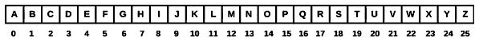
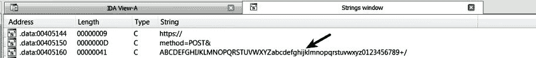
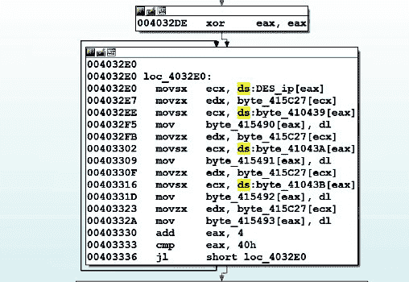

# 第九章：恶意软件混淆技术

*混淆*一词指的是掩盖有意义信息的过程。恶意软件作者通常使用各种混淆技术来隐藏信息，并修改恶意内容，以使安全分析师难以进行检测和分析。对手通常使用*编码/加密*技术来隐藏信息，防止安全产品检测。除了使用编码/加密之外，攻击者还会使用像打包器这样的程序来混淆恶意的二进制内容，这使得分析和逆向工程变得更加困难。在本章中，我们将讨论如何识别这些混淆技术，以及如何解码/解密和解包恶意二进制文件。我们将首先研究编码/加密技术，之后再研究解包技术。

对手通常使用编码和加密的原因如下：

+   为了隐蔽命令与控制通信

+   为了避开基于签名的解决方案，如入侵防御系统

+   为了混淆恶意软件使用的配置文件内容

+   为了加密将从受害系统中泄露的信息

+   为了在恶意二进制文件中混淆字符串，以避开静态分析

在我们深入了解恶意软件如何使用加密算法之前，先让我们了解一些基础概念和本章中会使用的术语。*明文*指的是未加密的消息；这可能是命令与控制（C2）流量或恶意软件想要加密的文件内容。*密文*指的是加密后的消息；这可能是恶意软件从 C2 服务器接收到的加密可执行文件或加密命令。

恶意软件通过将*明文*与*密钥*一起传递给加密函数来加密，生成*密文*。生成的密文通常会被恶意软件用于写入文件或通过网络发送：


以相同的方式，恶意软件可能会从 C2 服务器或文件接收加密内容，然后通过将*加密内容*和*密钥*传递给解密函数来解密，过程如下：


在分析恶意软件时，你可能想了解某一特定内容是如何加密或解密的。为此，你将主要关注识别加密或解密函数，以及用于加密或解密内容的密钥。例如，如果你想确定网络内容是如何加密的，那么你很可能会在网络输出操作之前找到加密函数（如`HttpSendRequest()`）。同样，如果你想了解 C2 的加密内容是如何解密的，那么你很可能会在通过 API（如`InternetReadFile()`）从 C2 获取内容后找到解密函数。

一旦确定了加密/解密功能，检查这些函数将帮助你了解内容是如何被加密/解密的、使用了什么密钥，以及采用了什么算法来混淆数据。

# 1\. 简单编码

大多数时候，攻击者使用非常简单的编码算法，如`Base64 编码`或`异或加密`来混淆数据。攻击者之所以使用简单的算法，是因为它们易于实现，占用的系统资源较少，且足以让安全产品和安全分析人员无法轻易识别内容。

# 1.1 凯撒密码

*凯撒密码*，也称为*移位密码*，是一种传统的密码算法，是最简单的编码技术之一。它通过将明文中的每个字母按一定的固定位置向下移动来加密信息。例如，如果你将字符`'A'`向下移动`3`个位置，那么你将得到`'D'`，`'B'`则变为`'E'`，依此类推，当移位达到`'X'`时会回绕到`'A'`。

# 1.1.1 凯撒密码的工作原理

理解凯撒密码的最佳方式是将字母从`A`到`Z`写下来，并为这些字母分配索引，从`0`到`25`，如下所示。换句话说，`'A'`对应索引`0`，`'B'`对应索引`1`，依此类推。所有字母从`A`到`Z`的集合叫做*字符集*：



现在，假设你想将字母偏移三位，那么`3`就是你的密钥。要加密字母`'A'`，将字母`A`的索引（即`0`）加到密钥`3`上；这就得到`0+3 = 3`。然后，使用结果`3`作为索引来查找对应的字母，即`'D'`，所以`'A'`被加密为`'D'`。要加密`'B'`，你将字母`'B'`的索引（即`1`）加到密钥`3`上，这就得到`4`，索引`4`对应字母`'E'`，因此`'B'`被加密为`'E'`，依此类推。

之前技术的问题出现在当我们到达`'X'`时，它的索引为`23`。当我们将`23+3`时得到`26`，但我们知道索引`26`没有对应的字符，因为最大索引值是`25`。我们也知道索引`26`应该回绕到索引`0`（对应字母`'A'`）。为了解决这个问题，我们使用*取模*操作，取字符集的长度。在这种情况下，字符集`ABCDEFGHIJKLMNOPQRSTUVWXYZ`的长度是`26`。现在，为了加密`'X'`，我们使用`'X'`的索引（`23`）加上密钥（`3`），然后对字符集长度（`26`）进行取模操作，结果为`0`，这个结果作为索引来查找对应的字符，即`'A'`：

```
(23+3)%26 = 0
```

取模操作允许你回到开头。你可以使用相同的逻辑来加密字符集中的所有字符（从`A`到`Z`），并在回绕到起点时继续。在*凯撒密码*中，你可以使用以下公式获取加密（密文）字符的索引：

```
(i + key) % (length of the character set)

where i = index of plaintext character
```

以相同的方式，你可以使用以下方法获取明文（解密后的）字符的索引：

```
(j - key) % (length of the character set)

where j = index of ciphertext character
```

以下图示显示了使用 `3` 作为密钥（移动三个位）的字符集、加密和解密文本 `"ZEUS"` 的过程。加密后，文本 `"ZEUS"` 被转换为 `"CHXV"`，然后解密过程将其还原为 `"ZEUS"`。


# 1.1.2 使用 Python 解密凯撒密码

以下是一个简单的 Python 脚本示例，它将字符串 `"CHXV"` 解密回 `"ZEUS"`：

```
>>> chr_set = "ABCDEFGHIJKLMNOPQRSTUVWXYZ"
>>> key = 3
>>> cipher_text = "CHXV"
>>> plain_text = ""
>>> for ch in cipher_text:
 j = chr_set.find(ch.upper())
 plain_index = (j-key) % len(chr_set)
 plain_text += chr_set[plain_index]
>>> print plain_text
ZEUS
```

一些恶意软件样本可能使用了修改版的凯撒（移位）密码；在这种情况下，你可以修改前面提到的脚本以满足你的需求。APT1 组使用的恶意软件 *WEBC2-GREENCAT* 从 C2 服务器获取内容，并使用修改版的凯撒密码对内容进行解密。它使用了一个包含 66 个字符的字符集 `abcdefghijklmnopqrstuvwxyzABCDEFGHIJKLMNOPQRSTUVWXYZ0123456789._/-`，密钥为 `56`。

# 1.2 Base64 编码

使用凯撒密码，攻击者可以加密字母，但它并不足以加密二进制数据。攻击者使用其他各种编码/加密算法来加密二进制数据。`Base64` 编码允许攻击者将二进制数据编码为 ASCII 字符串格式。因此，你经常会看到攻击者在 HTTP 等明文协议中使用 `Base64` 编码的数据。

# 1.2.1 将数据转换为 Base64

标准的 Base64 编码由以下 64 个字符组成。每 3 个字节（24 位）的二进制数据将被转换为字符集中的四个字符。每个转换后的字符是 6 位大小。除了以下字符外，`=` 字符用于填充：

```
ABCDEFGHIJKLMNOPQRSTUVWXYZabcdefghijklmnopqrstuvwxyz0123456789+/
```

为了理解数据是如何转换为 `Base64` 编码的，首先，通过将 `0` 到 `63` 的索引分配给字符集中的字母，构建 `Base64` 索引表，如下所示。根据下表，索引 `0` 对应字母 `A`，索引 `62` 对应字符 `+`，依此类推：


现在，假设我们要对文本 `"One"` 进行 `Base64` 编码。为此，我们需要将字母转换为相应的位值，如下所示：

```
O -> 0x4f -> 01001111
n -> 0x6e -> 01101110
e -> 0x65 -> 01100101
```

`Base64` 算法一次处理 3 个字节（24 位）；在这种情况下，我们有恰好 `24` 位，它们被按顺序排列，如下所示：

```
010011110110111001100101
```

然后将这 `24` 位数据拆分为四个部分，每部分包含 `6` 位，并转换为相应的十进制值。然后使用这些十进制值作为索引，查找 `Base64` 索引表中对应的值，因此文本 `One` 编码为 `T25l`：

```
010011 -> 19 -> base64 table lookup -> T
110110 -> 54 -> base64 table lookup -> 2
111001 -> 57 -> base64 table lookup -> 5
100101 -> 37 -> base64 table lookup -> l
```

解码 Base64 是一个逆向过程，但理解 `Base64` 编码或解码的工作原理并非必须，因为有 Python 模块和工具可以帮助你解码 `Base64` 编码的数据，而无需理解算法。理解这一点有助于在攻击者使用自定义版本的 `Base64` 编码时应对。

# 1.2.2 编码与解码 Base64

要在 `Python(2.x)` 中使用 `Base64` 编码数据，可以使用以下代码：

```
>>> import base64
>>> plain_text = "One"
>>> encoded = base64.b64encode(plain_text)
>>> print encoded
T25l
```

要在 Python 中解码 `base64` 数据，请使用以下代码：

```
>>> import base64
>>> encoded = "T25l"
>>> decoded = base64.b64decode(encoded)
>>> print decoded
One
```

*CyberChef* 是由 GCHQ 开发的一款优秀的网络应用程序，允许你在浏览器中执行各种编码/解码、加密/解密、压缩/解压缩和数据分析操作。你可以访问 CyberChef 网站 [`gchq.github.io/CyberChef/`](https://gchq.github.io/CyberChef/)，更多信息请参考 [`github.com/gchq/CyberChef`](https://github.com/gchq/CyberChef)。

你还可以使用像 *ConverterNET* 这样的工具 ([`www.kahusecurity.com/tools/`](http://www.kahusecurity.com/tools/)) 来编码/解码 `base64` 数据。*ConvertNET* 提供多种功能，允许你将数据转换为不同格式的输入/输出。要进行编码，输入要编码的文本并点击“Text to Base64”按钮。要进行解码，输入已编码的数据并点击“Base64 to Text”按钮。下图展示了使用 ConverterNET 对字符串 `Hi` 进行 `Base64` 编码的过程：


编码字符串末尾的 `=` 字符是填充字符。回想一下，算法将三字节的输入转换为四个字符，而 `Hi` 只有两个字符，所以它被填充以使其变为三个字符；每当使用填充时，你都会在 `Base64` 编码字符串的末尾看到 `=` 字符。这意味着有效的 `Base64` 编码字符串的长度总是 `4` 的倍数。

# 1.2.3 解码自定义 Base64

攻击者使用不同的 `Base64` 编码变体；目的是防止 `Base64` 解码工具成功解码数据。在本节中，你将了解这些技巧中的一些。

一些恶意软件样本会从末尾去掉填充字符 `(=)`。稍后会展示一个恶意软件样本（*Trojan Qidmorks*）的 C2 通信。以下的 POST 有效负载看起来像是使用 `base64` 编码进行编码的：


当你尝试解码 `POST` 有效负载时，会收到如下的 `Incorrect` 填充错误：


这个错误的原因是编码字符串的长度 `(150)` 不是 `4` 的倍数。换句话说，`Base64` 编码的数据缺少两个字符，这很可能是填充字符（`==`）：

```
>>> encoded = "Q3VycmVudFZlcnNpb246IDYuMQ0KVXNlciBwcml2aWxlZ2llcyBsZXZlbDogMg0KUGFyZW50IHByb2Nlc3M6IFxEZXZpY2VcSGFyZGRpc2tWb2x1bWUxXFdpbmRvd3NcZXhwbG9yZXIuZXhlDQoNCg"
>>> len(encoded)
150
```

向编码字符串添加两个填充字符`(==)`可以成功解码数据，如下所示。从解码后的数据中可以看到，恶意软件将操作系统版本（表示 Windows 7 的`6.1`）、用户的权限级别和父进程发送到 C2 服务器：


有时，恶意软件作者会使用`base64`编码的轻微变种。例如，攻击者可以使用一个字符集，其中字符`-`和`_`代替了`+`和`/`（第 63 和 64 个字符），如图所示：

```
ABCDEFGHIJKLMNOPQRSTUVWXYZabcdefghijklmnopqrstuvwxyz0123456789-_
```

一旦你识别出在原始字符集中被替换的字符来编码数据，那么你可以使用类似如下的代码。这里的思路是将修改过的字符替换回标准字符集中的原始字符，然后进行解码：

```
>>> import base64
>>> encoded = "cGFzc3dvcmQxMjM0IUA_PUB-"
>>> encoded = encoded.replace("-","+").replace("_","/")
>>> decoded = base64.b64decode(encoded)
>>> print decoded
password1234!@?=@~
```

有时候，恶意软件作者会改变字符集中的字符顺序。例如，他们可能会使用以下字符集，而不是标准字符集：

```
0123456789+/ABCDEFGHIJKLMNOPQRSTUVWXYZabcdefghijklmnopqrstuvwxyz
```

当攻击者使用非标准的`Base64`字符集时，你可以使用以下代码解码数据。请注意，在以下代码中，除了`64`个字符外，变量`chr_set`和`non_chr_set`还包括填充字符`=`（第 65 个字符），这是正确解码所必需的：

```
>>> import base64
>>> chr_set = "ABCDEFGHIJKLMNOPQRSTUVWXYZabcdefghijklmnopqrstuvwxyz0123456789+/="
>>> non_chr_set = "0123456789+/ABCDEFGHIJKLMNOPQRSTUVWXYZabcdefghijklmnopqrstuvwxyz="
>>> encoded = "G6JgP6w="
>>> re_encoded = ""
>>> for en_ch in encoded:
 re_encoded += en_ch.replace(en_ch, chr_set[non_chr_set.find(en_ch)])
>>> decoded = base64.b64decode(re_encoded)
>>> print decoded
Hello
```

你还可以通过使用*ConverterNET*工具执行自定义 Base64 解码，选择 Conversions | Convert Custom Base64。只需在 Alphabet 字段中输入自定义的`Base64`字符集，然后在 Input 字段中输入要解码的数据，按下 Decode 按钮，如下所示：


# 1.2.4 识别 Base64

你可以通过查找包含`Base64`字符集（字母数字字符，`+`和`/`）的长字符串来识别使用了 Base64 编码的二进制文件。以下截图显示了恶意二进制文件中的`Base64`字符集，表明恶意软件可能使用了`Base64`编码：



你可以使用字符串*交叉引用*功能（*在第五章中介绍*）来定位`Base64`字符集所在的代码，如下图所示。尽管在解码`Base64`数据时，了解`Base64`字符集在代码中使用的位置并非必须，但有时定位它会很有用，比如当恶意软件作者将`Base64`编码与其他加密算法一起使用时。例如，如果恶意软件使用某种加密算法加密 C2 网络流量，然后使用`Base64`编码；在这种情况下，定位`Base64`字符集可能会让你进入`Base64`函数。然后，你可以分析`Base64`函数或识别调用`Base64`函数的函数（使用*Xrefs to*功能），这可能会引导你到加密函数：

你可以在*x64dbg*中使用字符串交叉引用；为此，确保调试器在模块内的某个地方暂停，然后右键点击反汇编窗口（CPU 窗口），选择搜索 | 当前模块 | 字符串引用。

检测二进制文件中是否存在`Base64`字符集的另一种方法是使用*YARA*规则（YARA 在第二章，*静态分析*中有介绍），如这里所示：

```
rule base64
{
strings:
    $a="ABCDEFGHIJKLMNOPQRSTUVWXYZabcdefghijklmnopqrstuvwxyz0123456789+/"
    $b="ABCDEFGHIJKLMNOPQRSTUVWXYZabcdefghijklmnopqrstuvwxyz0123456789-_"
condition:
    $a or $b
}
```

# 1.3 XOR 编码

除了`Base64`编码之外，恶意软件作者常用的另一种编码算法是`XOR`编码算法。`XOR`是一种按位操作（类似于`AND`、`OR`和`NOT`），它作用于操作数的相应位。下表显示了`XOR`操作的性质。在`XOR`操作中，当两个位相同时，结果为`0`；否则，结果为`1`：

| **A** | **B** | **A^B** |
| --- | --- | --- |
| `0** | **0** | **0` |
| `1** | **0** | **1` |
| `0** | **1** | **1` |
| `1** | **1** | **0` |

例如，当你对`2`和`4`进行`XOR`，即`2 ^ 4`时，结果是`6`。它的工作原理如下：

```
                2: 0000 0010
                4: 0000 0100
---------------------------
Result After XOR : 0000 0110 (6)
```

# 1.3.1 单字节 XOR

在单字节`XOR`中，明文中的每个字节都与加密密钥进行`XOR`操作。例如，如果攻击者想要使用`0x40`作为密钥加密明文`cat`，那么文本中的每个字符（字节）都会与`0x40`进行`XOR`运算，结果是密文`#!4`。下图显示了每个字符的加密过程：


`XOR`的另一个有趣的性质是，当你用相同的密钥对*密文*进行`XOR`操作时，可以恢复*明文*。例如，如果你将之前例子中的密文`#!4`与`0x40`（密钥）进行`XOR`运算，你就会得到`cat`。这意味着如果你知道密钥，那么同一个函数可以用来同时加密和解密数据。以下是一个简单的 Python 脚本，用于执行`XOR`解密（同一个函数也可以用于执行`XOR`加密）：

```
def xor(data, key):
    translated = ""
    for ch in data:
        translated += chr(ord(ch) ^ key)
    return translated

if __name__ == "__main__":
   out = xor("#!4", 0x40)
   print out
```

在了解了`XOR`编码算法之后，让我们看一个键盘记录器的例子，它将所有的按键输入编码到一个文件中。当该示例被执行时，它会记录按键输入，并使用`CreateFileA()` API 打开一个文件（所有按键输入将记录到此文件中），如后面所示。然后，它使用`WriteFile()` API 将记录的按键输入写入文件。请注意恶意软件在调用`CreateFileA()`之后、`WriteFile()`之前调用了一个函数（重命名为`enc_function`）；这个函数在将内容写入文件之前对其进行编码。`enc_function`接受两个参数；第一个参数是包含待加密数据的缓冲区，第二个参数是缓冲区的长度：


检查 `enc_function` 显示恶意软件使用单字节 `XOR`。它从数据缓冲区读取每个字符，并使用 `0x5A` 的密钥进行编码，如下所示。在以下的 XOR 循环中，`edx` 寄存器指向数据缓冲区，`esi` 寄存器包含缓冲区的长度，而 `ecx` 寄存器作为数据缓冲区的索引，在每次循环结束时递增，当索引值 `(ecx)` 小于缓冲区的长度 `(esi)` 时，循环继续：


# 1.3.2 通过暴力破解寻找 XOR 密钥

在单字节 `XOR` 中，密钥的长度为一个字节，因此只有 `255` 个可能的密钥 `(0x0 - 0xff)`，`0` 除外作为 *ke*y，因为任何值与 `0` 做 `XOR` 运算都会得到相同的结果（即无加密）。由于只有 `255` 个密钥，你可以尝试对加密数据进行所有可能的密钥破解。如果你知道在解密后的数据中要查找的内容，这种技术非常有用。例如，当执行一个恶意软件样本时，假设恶意软件获取了计算机的主机名 `mymachine`，并与一些数据连接后，进行单字节 `XOR` 加密，最终加密为密文 `lkwpjeia>i}ieglmja`。假设该密文被在 C2 通信中外泄。现在，要确定用于加密密文的密钥，你可以分析加密函数或进行暴力破解。以下 Python 命令实现了暴力破解技术；因为我们期望解密后的字符串包含 `"mymachine"`，所以脚本会尝试用所有可能的密钥解密加密字符串（密文），并在找到 `"mymachine"` 时显示密钥和解密后的内容。在后面提到的示例中，你可以看到密钥被确定为 `4`，解密后的内容 `hostname:mymachine` 包含了主机名 `mymachine`：

```
>>> def xor_brute_force(content, to_match):
 for key in range(256):
 translated = ""
 for ch in content:
 translated += chr(ord(ch) ^ key)
 if to_match in translated:
 print "Key %s(0x%x): %s" % (key, key, translated)

>>> xor_brute_force("lkwpjeia>i}ieglmja", "mymachine")
Key 4(0x4): hostname:mymachine
```

你也可以使用诸如 *ConverterNET* 之类的工具来暴力破解并确定密钥。操作步骤是，选择工具 | 密钥搜索/转换。在弹出的窗口中，输入加密内容和匹配字符串，点击搜索按钮。如果找到密钥，它会显示在结果字段中，如下所示：

暴力破解技术在确定用于加密 PE 文件（如 EXE 或 DLL）的 `XOR` 密钥时非常有用。只需在解密后的内容中查找匹配的字符串 `MZ` 或 `This program cannot be run in DOS mode`。

# 1.3.3 NULL 忽略 XOR 编码

在 `XOR` 编码中，当一个空字节 `(0x00)` 与密钥 `XOR` 时，会返回该密钥，如下所示：

```
>>> ch = 0x00
>>> key = 4
>>> ch ^ key
4
```

这意味着，每当一个包含大量空字节的缓冲区被编码时，单字节 XOR 密钥会变得非常明显。在以下示例中，`plaintext`变量被分配了一个字符串，其中包含三个空字节，并使用密钥`0x4b`（字符`K`）加密，且加密后的输出以十六进制字符串格式和文本格式同时打印。请注意，`plaintext`变量中的三个`null`字节在加密内容中被转换为`XOR`密钥值`0x4b 0x4b 0x4b`（或`KKK`）。这种`XOR`的特性使得如果没有忽略空字节，容易识别出密钥。

```
>>> plaintext = "hello\x00\x00\x00"
>>> key = 0x4b 
>>> enc_text = ""
>>> for ch in plaintext:
 x = ord(ch) ^ key
 enc_hex += hex(x) + " "
 enc_text += chr(x)

>>> print enc_hex
0x23 0x2e 0x27 0x27 0x24 0x4b 0x4b 0x4b
>>> print enc_text
#.''$KKK
```

以下截图展示了一个恶意软件样本的`XOR`加密通信（*HeartBeat RAT*）。请注意，字节`0x2`出现在整个加密内容中；这是因为恶意软件使用`0x2`的`XOR`密钥对一个包含空字节的较大缓冲区进行了加密。有关该恶意软件的逆向工程更多信息，请参考作者在 Cysinfo 会议上的演讲：[`cysinfo.com/session-10-part-1-reversing-decrypting-communications-of-heartbeat-rat/`](https://cysinfo.com/session-10-part-1-reversing-decrypting-communications-of-heartbeat-rat/)。


为避免空字节问题，恶意软件作者在加密过程中忽略空字节`(0x00)`和*加密密钥*，如这里提到的命令所示。请注意，在下面的代码中，明文字符使用密钥`0x4b`进行加密，除了空字节（`0x00`）和加密密钥字节（`0x4b`）；因此，在加密后的输出中，空字节被保留，而不会泄露加密密钥。如你所见，当攻击者使用此技术时，仅通过查看加密内容很难确定*密钥*。

```
>>> plaintext = "hello\x00\x00\x00"
>>> key = 0x4b
>>> enc_text = ""
>>> for ch in plaintext:
 if ch == "\x00" or ch == chr(key):
 enc_text += ch
 else:
 enc_text += chr(ord(ch) ^ key)

>>> enc_text
"#.''$\x00\x00\x00"
```

# 1.3.4 多字节 XOR 编码

攻击者通常使用多字节`XOR`，因为它能更好地防御暴力破解技术。例如，如果恶意软件作者使用 4 字节`XOR`密钥加密数据，然后进行暴力破解，你将需要尝试`4,294,967,295 (0xFFFFFFFF)`个可能的密钥，而不是`255 (0xFF)`个密钥。以下截图展示了恶意软件（*Taidoor*）的`XOR`解密循环。在这种情况下，*Taidoor*从其资源部分提取了加密的 PE（exe）文件，并使用 4 字节`XOR`密钥`0xEAD4AA34`对其进行了解密。


以下截图展示了*Resource Hacker*工具中的加密资源。可以通过右键点击资源并选择**将资源保存为*.bin 文件**来提取并保存该资源。


以下是一个 Python 脚本，它使用`4 字节 XOR`密钥`0xEAD4AA34`解码编码的资源，并将解码后的内容写入文件（`decrypted.bin`）：

```
import os
import struct
import sys

def four_byte_xor(content, key ):
    translated = ""
    len_content = len(content)
    index = 0
    while (index < len_content):
        data = content[index:index+4]
        p = struct.unpack("I", data)[0]
        translated += struct.pack("I", p ^ key)
        index += 4
    return translated

in_file = open("rsrc.bin", 'rb')
out_file = open("decrypted.bin", 'wb')
xor_key = 0xEAD4AA34
rsrc_content = in_file.read()
decrypted_content = four_byte_xor(rsrc_content,xor_key)
out_file.write(decrypted_content)
```

解密后的内容是一个 PE（可执行文件），如下所示：

```
$ xxd decrypted.bin | more
00000000:  4d5a 9000 0300 0000 0400 0000 ffff 0000  MZ..............
00000010:  b800 0000 0000 0000 4000 0000 0000 0000  ........@.......
00000020:  0000 0000 0000 0000 0000 0000 0000 0000  ................
00000030:  0000 0000 0000 0000 0000 0000 f000 0000  ................
00000040:  0e1f ba0e 00b4 09cd 21b8 014c cd21 5468  ........!..L.!Th
00000050:  6973 2070 726f 6772 616d 2063 616e 6e6f  is program canno
00000060:  7420 6265 2072 756e 2069 6e20 444f 5320  t be run in DOS
```

# 1.3.5 识别 XOR 编码

要识别 XOR 编码，在 IDA 中加载二进制文件并通过选择 搜索 | 文本 来搜索 `XOR` 指令。在弹出的对话框中，输入 `xor` 并选择 查找所有匹配项，如下所示：


当你点击“确定”时，所有 `XOR` 的出现位置会被显示出来。通常可以看到 `XOR` 操作，其中操作数是相同的寄存器，如 `xor eax,eax` 或 `xor ebx,ebx`。这些指令是编译器用来清零寄存器值的，你可以忽略这些指令。要识别 `XOR` 编码，可以查找 *(a)* 具有常量值的寄存器（或内存引用）与 `XOR` 操作，如下所示，或者 *(b)* 查找寄存器（或内存引用）之间的 `XOR` 操作。你可以通过双击条目跳转到代码：


以下是一些可以用来确定 `XOR` 密钥的工具。除了使用 XOR 编码外，攻击者还可能使用 `ROL, ROT 或 SHIFT` 操作来编码数据。这里提到的 *XORSearch* 和 *Balbuzard* 除了支持 `XOR` 外，还支持 `ROL`、`ROT` 和 `Shift` 操作。*CyberChef* 支持几乎所有类型的编码、加密和压缩算法：

+   *CyberChef:* [`gchq.github.io/CyberChef/`](https://gchq.github.io/CyberChef/)

+   *XORSearch* 由 Didier Stevens 开发: [`blog.didierstevens.com/programs/xorsearch/`](https://blog.didierstevens.com/programs/xorsearch/)

+   *Balbuzard:* [`bitbucket.org/decalage/balbuzard/wiki/Home`](https://bitbucket.org/decalage/balbuzard/wiki/Home)

+   *unXOR:* [`github.com/tomchop/unxor/#unxor`](https://github.com/tomchop/unxor/#unxor)

+   *brxor.py:* [`github.com/REMnux/distro/blob/v6/brxor.py`](https://github.com/REMnux/distro/blob/v6/brxor.py)

+   *NoMoreXOR.py:* [`github.com/hiddenillusion/NoMoreXOR`](https://github.com/hiddenillusion/NoMoreXOR)

# 2. 恶意软件加密

恶意软件作者常常使用简单的编码技术，因为仅仅掩盖数据就足够了，但有时，攻击者也会使用加密。要识别二进制文件中加密功能的使用，可以查找加密指示符（签名），例如：

+   引用加密函数的字符串或导入

+   加密常量

+   加密例程使用的独特指令序列

# 2.1 使用 Signsrch 识别加密签名

一个有用的工具是 *Signsrch*，可以用来搜索文件或进程中的加密签名，下载地址是 [`aluigi.altervista.org/mytoolz.htm`](http://aluigi.altervista.org/mytoolz.htm)。该工具依赖加密签名来检测加密算法。加密签名位于文本文件 `signsrch.sig` 中。在以下输出中，当使用 `-e` 选项运行 `signsrch` 时，它会显示在二进制文件中检测到的 `DES` 签名的相对虚拟地址：

```
C:\signsrch>signsrch.exe -e kav.exe

Signsrch 0.2.4
by Luigi Auriemma
e-mail: aluigi@autistici.org
web: aluigi.org
  optimized search function by Andrew http://www.team5150.com/~andrew/
  disassembler engine by Oleh Yuschuk

- open file "kav.exe"
- 91712 bytes allocated
- load signatures
- open file C:\signsrch\signsrch.sig
- 3075 signatures in the database
- start 1 threads
- start signatures scanning:

  offset num description [bits.endian.size]
  --------------------------------------------
00410438 1918 DES initial permutation IP [..64]
00410478 2330 DES_fp [..64]
004104b8 2331 DES_ei [..48]
004104e8 2332 DES_p32i [..32]
00410508 1920 DES permuted choice table (key) [..56]
00410540 1921 DES permuted choice key (table) [..48]
00410580 1922 DES S-boxes [..512]
[Removed]
```

一旦知道了加密指示器所在的地址，你可以使用 IDA 导航到该地址。例如，如果你想导航到地址 `00410438`（`DES 初始置换 IP`），在 IDA 中加载二进制文件，然后选择 Jump | Jump to address（或按 *G* 热键），并输入地址，如下所示：


一旦点击确认（OK），你将到达包含指示器的地址（在此案例中，`DES 初始置换 IP`，标记为`DES_ip`），如下图所示：


现在，要了解此加密指示器在代码中如何使用，你可以使用交叉引用（*Xrefs-to*）功能。使用交叉引用（*Xrefs to*）功能显示 `DES_ip` 在地址 `0x4032E0` 的 `sub_4032B0` 函数中被引用（`loc_4032E0`）：


现在，直接导航到地址 `0x4032E0` 会带你进入 `DES` 加密函数，如下图所示。找到加密函数后，你可以使用交叉引用进一步检查它，以了解加密函数被调用的上下文以及用于加密数据的密钥：



与使用 `-e` 选项定位签名然后手动导航到使用该签名的代码不同，你可以使用 `-F` 选项，它会直接给出加密指示器在代码中使用的第一条指令的地址。在以下输出中，运行 `signsrch` 并加上 `-F` 选项，会直接显示加密指示器 `DES 初始置换 IP`（`DES_ip`）在代码中使用的地址 `0x4032E0`：

```
C:\signsrch>signsrch.exe -F kav.exe

[removed]

  offset num description [bits.endian.size]
  --------------------------------------------
[removed]
004032e0 1918 DES initial permutation IP [..64]
00403490 2330 DES_fp [..64]
```

`-e` 和 `-F` 选项会显示相对于 PE 头中指定的 *首选基地址* 的地址。例如，如果二进制文件的 *首选基地址* 是 `0x00400000`，则 `-e` 和 `-F` 选项返回的地址是通过将相对虚拟地址与首选基地址 `0x00400000` 相加来确定的。当你运行（或调试）二进制文件时，它可能会加载到除首选基地址以外的任何地址（例如 `0x01350000`）。如果你希望定位运行中进程或在调试二进制文件时（在 IDA 或 x64dbg 中）中的加密指示器地址，你可以使用 `signsrch` 命令并加上 **`-P <pid 或进程名称>`** 选项。`-P` 选项会自动确定可执行文件加载的基地址，然后计算加密签名的虚拟地址，如下所示：

```
C:\signsrch>signsrch.exe -P kav.exe

[removed]

- 01350000 0001b000 C:\Users\test\Desktop\kav.exe
- pid 3068
- base address 0x01350000
- offset 01350000 size 0001b000
- 110592 bytes allocated
- load signatures
- open file C:\signsrch\signsrch.sig
- 3075 signatures in the database
- start 1 threads
- start signatures scanning:

  offset num description [bits.endian.size]
  --------------------------------------------
  01360438 1918 DES initial permutation IP [..64]
 01360478 2330 DES_fp [..64]
 013604b8 2331 DES_ei [..48]
```

除了检测加密算法，*Signsrch* 还可以检测压缩算法、一些反调试代码以及 Windows 加密函数，这些函数通常以 `Crypt` 开头，如 `CryptDecrypt()` 和 `CryptImportKey()`。

# 2.2 使用 FindCrypt2 检测加密常量

*Findcrypt2* ([`www.hexblog.com/ida_pro/files/findcrypt2.zip`](http://www.hexblog.com/ida_pro/files/findcrypt2.zip)) 是一个 IDA Pro 插件，用于在内存中搜索由多种不同算法使用的加密常量。要使用该插件，请下载它，并将 `findcrypt.plw` 文件复制到 IDA 插件文件夹中。现在，当你加载二进制文件时，插件会自动运行，或者你可以通过选择 编辑 | 插件 | Find crypt v2 手动调用它。插件的结果会显示在输出窗口中：

 *FindCrypt2* 插件也可以在调试模式下运行。如果你使用的是 IDA 6.x 或更低版本，*FindCrypt2* 能很好地工作；在撰写本书时，它似乎无法与 IDA 7.x 版本兼容（可能是由于 IDA 7.x API 的变化）。

# 2.3 使用 YARA 检测加密签名

另一种识别二进制文件中加密使用的方法是通过扫描二进制文件并使用包含加密签名的 YARA 规则。你可以编写自己的 YARA 规则，也可以下载其他安全研究人员编写的 YARA 规则（例如在 [`github.com/x64dbg/yarasigs/blob/master/crypto_signatures.yara`](https://github.com/x64dbg/yarasigs/blob/master/crypto_signatures.yara)），然后使用这些 YARA 规则扫描二进制文件。

*x64dbg* 集成了 YARA；如果你希望在调试时扫描二进制文件中的加密签名，这非常有用。你可以将二进制文件加载到 *x64dbg* 中（确保执行在二进制文件中的某个位置暂停），然后右键单击 CPU 窗口并选择 YARA（或按 *Ctrl + Y*）；这将弹出显示此处的 YARA 对话框。点击文件并定位包含 *YARA* 规则的文件。你还可以通过点击目录按钮加载包含 YARA 规则的多个文件：


以下截图显示了通过使用包含加密签名的 YARA 规则扫描恶意二进制文件后，检测到的 *加密常量*。现在，你可以右键单击任何条目并选择 “Follow in Dump” 以查看转储窗口中的数据，或者如果签名与加密例程相关联，你可以双击任何条目以跳转到相应的代码：

 像 RC4 这样的加密算法不使用加密常量，因此很难通过加密签名来检测它。攻击者通常使用 RC4 加密数据，因为它易于实现；RC4 中使用的步骤在这篇 Talos 博客文章中有详细解释：[`blog.talosintelligence.com/2014/06/an-introduction-to-recognizing-and.html`](http://blog.talosintelligence.com/2014/06/an-introduction-to-recognizing-and.html)。

# 2.4 使用 Python 解密

在你识别出加密算法和用于加密数据的密钥后，可以使用*PyCrypto*（[`www.dlitz.net/software/pycrypto/`](https://www.dlitz.net/software/pycrypto/)）Python 模块来解密数据。要安装*PyCrypto*，你可以使用`apt-get install python-crypto`或`pip install pycrypto`，或者从源代码编译。PyCrypto 支持多种哈希算法，如`MD2`、`MD4`、`MD5`、`RIPEMD`、`SHA1`和`SHA256`。它还支持加密算法，如`AES`、`ARC2`、`Blowfish`、`CAST`、`DES`、`DES3 (Triple DES)`、`IDEA`、`RC5`和`ARC4`。

以下 Python 命令演示了如何使用*Pycrypto*模块生成`MD5`、`SHA1`和`SHA256`哈希：

```
>>> from Crypto.Hash import MD5,SHA256,SHA1
>>> text = "explorer.exe"
>>> MD5.new(text).hexdigest()
'cde09bcdf5fde1e2eac52c0f93362b79'
>>> SHA256.new(text).hexdigest()
'7592a3326e8f8297547f8c170b96b8aa8f5234027fd76593841a6574f098759c'
>>> SHA1.new(text).hexdigest()
'7a0fd90576e08807bde2cc57bcf9854bbce05fe3'
```

要解密内容，请从`Crypto.Cipher`导入适当的加密模块。以下示例演示了如何在 ECB 模式下使用 DES 进行加密和解密：

```
>>> from Crypto.Cipher import DES
>>> text = "hostname=blank78"
>>> key = "14834567"
>>> des = DES.new(key, DES.MODE_ECB)
>>> cipher_text = des.encrypt(text)
>>> cipher_text
'\xde\xaf\t\xd5)sNj`\xf5\xae\xfd\xb8\xd3f\xf7'
>>> plain_text = des.decrypt(cipher_text)
>>> plain_text
'hostname=blank78'
```

# 3\. 自定义编码/加密

有时，攻击者使用自定义编码/加密方案，这使得识别加密方式（及密钥）变得困难，也使逆向工程更加复杂。自定义编码方法之一是使用编码和加密的组合来混淆数据；例如，*Etumbot*（[`www.arbornetworks.com/blog/asert/illuminating-the-etumbot-apt-backdoor/`](https://www.arbornetworks.com/blog/asert/illuminating-the-etumbot-apt-backdoor/)）就是这样的恶意软件。当执行*Etumbot*恶意软件样本时，它会从 C2 服务器获取`RC4`密钥；然后，它使用获取的`RC4`密钥对系统信息（如主机名、用户名和 IP 地址）进行加密，接着使用自定义`Base64`对加密内容进行进一步编码，并将其外泄到 C2。包含混淆内容的 C2 通信稍后会展示。有关此样本的逆向工程细节，请参考作者的演讲和视频演示（[`cysinfo.com/12th-meetup-reversing-decrypting-malware-communications/`](https://cysinfo.com/12th-meetup-reversing-decrypting-malware-communications/)）：


要解混淆内容，首先需要使用自定义`Base64`解码，然后再使用`RC4`解密；这些步骤可以通过以下 Python 命令完成。输出将显示解密后的系统信息：

```
>>> import base64
>>> from Crypto.Cipher import ARC4
>>> rc4_key = "e65wb24n5"
>>> cipher_text = "kRp6OKW9r90_2_KvkKcQ_j5oA1D2aIxt6xPeFiJYlEHvM8QMql38CtWfWuYlgiXMDFlsoFoH"
>>> content = cipher_text.replace('_','/').replace('-','=')
>>> b64_decode = base64.b64decode(content)
>>> rc4 = ARC4.new(rc4_key)
>>> plain_text = rc4.decrypt(b64_decode)
>>> print plain_text
MYHOSTNAME|Administrator|192.168.1.100|No Proxy|04182|
```

一些恶意软件作者并没有使用标准的编码/加密算法的组合，而是实现了全新的编码/加密方案。一个这样的恶意软件例子是*APT1*组使用的恶意软件。这个恶意软件将一个字符串解密为网址；为此，恶意软件调用了一个用户定义的函数（在后面提到的截图中将其重命名为`Decrypt_Func`），该函数实现了自定义的加密算法。`Decrypt_Func`接受三个参数；第 1 个参数是包含加密内容的缓冲区，第 2 个参数是存储解密内容的缓冲区，第 3 个参数是缓冲区的长度。在下面的截图中，执行在调用`Decrypt_Func`之前暂停，显示了第 1 个参数（包含加密内容的缓冲区）：


根据你的目标，你可以分析`Decrypt_Func`来理解算法的工作原理，然后按照作者的演示中所讲的内容编写解密器（[`cysinfo.com/8th-meetup-understanding-apt1-malware-techniques-using-malware-analysis-reverse-engineering/`](https://cysinfo.com/8th-meetup-understanding-apt1-malware-techniques-using-malware-analysis-reverse-engineering/)），或者你也可以让恶意软件为你解密内容。要让恶意软件解密内容，只需*跳过*`Decrypt_Func`（它会执行完解密功能），然后检查第 2 个参数（存储解密内容的缓冲区）。下图显示了解密后的缓冲区（第 2 个参数），其中包含恶意网址：


前面提到的让恶意软件解码数据的技术，如果解密函数被调用的次数不多，还是比较有用的。如果解密函数在程序中被调用了多次，使用调试器脚本自动化解码过程会更高效（*详见* 第六章，*恶意二进制调试*），而不是手动操作。为了演示这一点，请看下面这段 64 位恶意软件的代码片段（在下面的截图中）。注意恶意软件多次调用了一个函数（在稍后的截图中将其重命名为`dec_function`）；如果你查看代码，会发现一个加密的字符串作为第 1 个参数（存放在`rcx`寄存器中）传递给了这个函数，执行该函数后，`eax`中的返回值包含了存储解密内容的缓冲区地址：


下图显示了对`dec_function`的*交叉引用*；如你所见，程序中多次调用了这个函数：


每次调用`dec_function`时，它都会解密一个字符串。为了解密传递给这个函数的所有字符串，我们可以编写一个*IDAPython*脚本（例如下面显示的脚本）：

```
import idautils
import idaapi
import idc

for name in idautils.Names():
    if name[1] == "dec_function":
        ea= idc.get_name_ea_simple("dec_function")
        for ref in idautils.CodeRefsTo(ea, 1):
            idc.add_bpt(ref)
idc.start_process('', '', '')
while True:
    event_code = idc.wait_for_next_event(idc.WFNE_SUSP, -1)
    if event_code < 1 or event_code == idc.PROCESS_EXITED:
        break
    rcx_value = idc.get_reg_value("RCX")
    encoded_string = idc.get_strlit_contents(rcx_value)
    idc.step_over()
    evt_code = idc.wait_for_next_event(idc.WFNE_SUSP, -1)
    if evt_code == idc.BREAKPOINT:
        rax_value = idc.get_reg_value("RAX")
    decoded_string = idc.get_strlit_contents(rax_value)
    print "{0} {1:>25}".format(encoded_string, decoded_string)
    idc.resume_process()
```

由于我们已经将解密函数重命名为`dec_function`，它可以从 IDA 中的名称窗口访问。之前的脚本会遍历名称窗口来识别`dec_function`并执行以下步骤：

1.  如果`dec_function`存在，它会确定`dec_function`的地址。

1.  它使用`dec_function`的地址来确定`dec_function`的交叉引用（`Xrefs to`），从而列出所有调用`dec_function`的地址。

1.  它在`dec_function`被调用的所有地址上设置断点。

1.  它会自动启动调试器，当在`dec_function`处命中断点时，它会从`rcx`寄存器指向的地址读取加密字符串。需要注意的是，为了让 IDA 调试器自动启动，请确保选择调试器（例如，本地 Windows 调试器），可以通过工具栏区域选择，或者选择**Debugger | Select debugger**。

1.  然后，它会*跳过*该函数，执行解密函数（`dec_function`），并读取返回值`(rax)`，该返回值包含解密后字符串的地址。接着，它会打印出解密后的字符串。

1.  它重复之前的步骤，解密每个传递给`dec_function`的字符串。

运行完之前的脚本后，加密字符串及其对应的解密字符串会显示在输出窗口中，如下所示。从输出中可以看到，恶意软件在运行时解密文件名、注册表名称和 API 函数名称，以避免引起怀疑。换句话说，这些是攻击者希望从静态分析中隐藏的字符串：


# 4. 恶意软件解包

攻击者会尽力保护其二进制文件免受防病毒检测，并使恶意软件分析师很难进行静态分析和逆向工程。恶意软件作者通常使用*压缩器*和*加密器*（*参见* 第二章，静态分析，了解压缩器及其检测方法），来混淆可执行内容。*压缩器*是一种程序，它将普通的可执行文件压缩其内容，并生成一个新的混淆可执行文件。*加密器*与压缩器类似，不是压缩二进制文件，而是加密它。换句话说，压缩器或加密器将可执行文件转换为一种难以分析的形式。当一个二进制文件被压缩时，它显示的信息非常少；你不会找到任何包含有价值信息的字符串，导入的函数数量会较少，程序指令也会被模糊化。要理解一个被压缩的二进制文件，你需要去除应用于程序的混淆层（解包）；为此，首先了解压缩器的工作原理非常重要。

当一个普通的可执行文件经过打包器处理时，可执行内容会被压缩，并添加一个*解包存根*（*解压例程*）。打包器随后修改可执行文件的入口点，将其指向存根的位置，并生成一个新的打包可执行文件。当打包的二进制文件被执行时，解包存根会在运行时提取原始二进制文件，并通过将控制权转移到*原始入口点（OEP）*来触发原始二进制文件的执行，以下图所示：


解包一个打包的二进制文件时，可以使用自动化工具或手动操作。自动化方法节省时间，但并非完全可靠（有时有效，有时无效），而手动方法虽然耗时，但一旦掌握技能，它是最可靠的方法。

# 4.1 手动解包

要解包被打包器打包的二进制文件，通常需要执行以下一般步骤：

1.  第一步是确定*OEP*；如前所述，当一个打包的二进制文件被执行时，它会提取原始二进制文件，并在某个时刻将控制权转移到*OEP*。原始入口点（OEP）是恶意软件的第一条指令的地址（恶意代码的起始位置），即在打包之前的位置。在此步骤中，我们需要识别打包二进制文件中的指令，这条指令会跳转（引导我们）到 OEP。

1.  下一步是执行程序，直到到达 OEP；其目的是让恶意软件的存根在内存中自解包并暂停在 OEP 处（在执行恶意代码之前）。

1.  第三步是将解包后的进程从内存转储到磁盘。

1.  最后一步是修复*导入地址表（IAT）*，即转储文件的导入地址表。

在接下来的几节中，我们将详细探讨这些步骤。为了演示之前的概念，我们将使用一个被*UPX 打包器*打包的恶意软件（[`upx.github.io/`](https://upx.github.io/)）。接下来几节中介绍的工具和技术将帮助你了解手动解包过程。

# 4.1.1 确定 OEP

本节将帮助您理解识别打包二进制文件中 OEP 的技巧。在以下截图中，使用 *pestudio*（[`www.winitor.com/`](https://www.winitor.com/)）检查打包二进制文件显示了许多提示，表明该文件被打包。打包二进制文件包含三个部分，`UPX0`、`UPX1` 和 `.rsrc`。从截图中可以看出，打包二进制文件的入口点在 `UPX1` 部分，因此执行从这里开始，这一部分包含将在运行时解压原始可执行文件的解压存根。另一个指示是，`UPX0` 部分的原始大小为 `0`，但虚拟大小为 `0x1f000`；这表明 `UPX0` 部分在磁盘上不占用任何空间，但在内存中占用空间；具体来说，它在内存中占用了 `0x1f000` 字节的大小（这是因为恶意软件在内存中解压可执行文件，并在运行时将其存储在 `UPX0` 部分）。此外，`UPX0` 部分具有 `读`、`写`、`执行` 权限，很可能是因为解压原始二进制文件后，恶意代码将在 `UPX0` 中开始执行：


另一个指示是，打包二进制文件包含了混淆的字符串，当您在 IDA 中加载二进制文件时，IDA 识别出导入地址表（*IAT*）位于非标准位置，并显示以下警告；这是由于 `UPX` 打包了所有部分和 *IAT*：


该二进制文件仅包含一个内建函数和 5 个导入函数；所有这些指示都表明该二进制文件已被打包：


要找到 OEP，您需要定位程序中将控制转移到 OEP 的指令。根据打包器的不同，这可能简单也可能具有挑战性；通常，您需要关注那些将控制转移到不明确目的地的指令。检查打包二进制文件中函数的流程图会看到跳转到一个位置，该位置在 IDA 中被标红：


红色是 IDA 无法分析的标志，因为跳转目的地不明确。以下截图显示了跳转指令：


双击 *跳转目的地* `(byte_40259B)` 显示跳转将到达 `UPX0`（从 `UPX1`）。换句话说，执行时，恶意软件将在 `UPX1` 执行解压缩存根，这将解压原始二进制文件，将解压后的代码复制到 `UPX0`，并且跳转指令很可能将控制转移到 `UPX0` 中解压后的代码（从 `UPX1`）。


到这个阶段，我们已经找到了我们认为会跳转到`OEP`的指令。下一步是将二进制文件加载到调试器中，并在执行跳转的指令处设置*断点*，然后执行直到到达该指令。为此，二进制文件已加载到*x64dbg*中（你也可以使用 IDA 调试器并按照相同的步骤操作），并在跳转指令处设置了*断点*，执行直到跳转指令。如下面的截图所示，执行在该跳转指令处暂停。


现在你可以假设恶意软件已经完成解压；接下来，你可以按一次*F7*（进入），这将带你到原始入口点地址`0x0040259B`。此时，我们来到了恶意软件的第一条指令（解压后）：


# 4.1.2 使用 Scylla 转储进程内存

现在我们已经找到了 OEP，下一步是将进程内存转储到磁盘。为了转储进程，我们将使用名为*Scylla*的工具（[`github.com/NtQuery/Scylla`](https://github.com/NtQuery/Scylla)）；这是一个很棒的工具，可以用来转储进程内存并重建导入地址表。*x64dbg*的一个优点是它集成了*Scylla*，你可以通过点击插件 | Scylla 来启动它（或者按*Ctrl* + *I*）。要转储进程内存，当执行在 OEP 处暂停时，启动 Scylla，确保 OEP 字段设置为正确的地址，如下所示；如果没有，你需要手动设置它，然后点击 Dump 按钮并将转储的可执行文件保存到磁盘（在这种情况下，它被保存为`packed_dump.exe`）：


现在，当你将转储的可执行文件加载到 IDA 时，你将看到所有内置函数的完整列表（这在打包程序中是不可见的），并且函数代码不再被混淆，但*导入*仍然不可见，API 调用显示的是地址而不是名称。为了克服这个问题，你需要重建打包二进制文件的导入表：


# 4.1.3 修复导入表

要修复导入，返回到*Scylla*，点击 IAT Autosearch 按钮，它将扫描进程内存以定位导入表；如果找到了，它将填充 VA 和大小字段并显示适当的值。要获取导入列表，点击 Get Imports 按钮。使用这种方法确定的导入函数列表如下所示。有时，你可能会在结果中看到无效条目（没有勾选标记的条目）；在这种情况下，右键点击这些条目并选择 Cut Thunk 来删除它们：


在使用前一步确定了导入函数后，您需要将补丁应用到已转储的可执行文件（`packed_dump.exe`）。为此，请点击“Fix Dump”按钮，启动文件浏览器，您可以选择之前转储的文件。*Scylla* 会使用已确定的导入函数对二进制文件进行补丁处理，并创建一个新的文件，文件名末尾会包含 `_SCY`（例如 `packed_dumped_SCY.exe`）。现在，当您在 IDA 中加载已修补的文件时，您将看到导入函数的引用，如下所示：

当您处理某些打包工具时，Scylla 中的 IAT 自动搜索按钮可能无法找到模块的导入表；在这种情况下，您可能需要额外的努力来手动确定导入表的起始位置和大小，并将它们输入到 VA 和大小字段中。

# 4.2 自动解包

有各种工具可以解包使用常见打包工具如 *UPX*、*FSG* 和 *AsPack* 打包的恶意软件。自动化工具对于已知的打包工具非常有效，可以节省时间，但请记住，它并不总是有效；这时，手动解包技巧将派上用场。ReversingLabs 的 *TitanMist* ([`www.reversinglabs.com/open-source/titanmist.html`](https://www.reversinglabs.com/open-source/titanmist.html)) 是一个很棒的工具，包含各种 *打包工具签名* 和 *解包脚本*。下载并解压后，您可以使用如下命令运行它来对打包的二进制文件进行解包；使用 `-i` 来指定输入文件（打包文件），`-o` 指定输出文件名，`-t` 指定解包器的类型。在后面提到的命令中，*TitanMist* 被用来处理一个使用 *UPX* 打包的二进制文件；请注意它是如何自动识别打包工具并执行解包过程的。该工具自动识别了 OEP 和导入表，转储了进程，修复了导入项，并将补丁应用到转储的进程中：

```
C:\TitanMist>TitanMist.exe -i packed.exe -o unpacked.exe -t python

Match found!
│ Name: UPX
│ Version: 0.8x - 3.x
│ Author: Markus and Laszlo
│ Wiki url: http://kbase.reversinglabs.com/index.php/UPX
│ Description:

Unpacker for UPX 1.x - 3.x packed files
ReversingLabs Corporation / www.reversinglabs.com
[x] Debugger initialized.
[x] Hardware breakpoint set.
[x] Import at 00407000.
[x] Import at 00407004.
[x] Import at 00407008.[Removed]
[x] Import at 00407118.
[x] OEP found: 0x0040259B.
[x] Process dumped.
[x] IAT begin at 0x00407000, size 00000118.
[X] Imports fixed.
[x] No overlay found.
[x] File has been realigned.
[x] File has been unpacked to unpacked.exe.
[x] Exit Code: 0.
█ Unpacking succeeded! 
```

另一个选择是使用 IDA Pro 的*Universal PE Unpacker 插件*。这个插件依赖于调试恶意软件，以确定代码何时跳转到 OEP。有关此插件的详细信息，请参考这篇文章（[`www.hex-rays.com/products/ida/support/tutorials/unpack_pe/unpacking.pdf`](https://www.hex-rays.com/products/ida/support/tutorials/unpack_pe/unpacking.pdf)）。要调用此插件，将二进制文件加载到 IDA 中，选择编辑 | 插件 | Universal PE unpacker。运行插件后，程序将在调试器中启动，并尝试在打包程序解包完成时暂停。将*UPX-*打包的恶意软件（与手动解包中使用的示例相同）加载到 IDA 中并启动插件后，将显示以下对话框。在以下截图中，IDA 将起始地址和结束地址设置为`UPX0`段的范围；这个范围被视为`OEP`范围。换句话说，当执行到达此段时（从包含解压缩存根的`UPX1`段），IDA 将暂停程序执行，给你机会采取进一步的行动：


在以下截图中，注意 IDA 如何自动确定 OEP 地址，并显示出以下对话框：


如果点击“Yes”按钮，执行将停止，进程将退出，但在此之前，IDA 会自动确定导入地址表（IAT），并创建一个新段来重建程序的导入部分。此时，你可以分析已解包的代码。以下截图展示了新重建的导入地址表：


如果不点击“YES”按钮，而是点击“No”按钮，IDA 将会在 OEP 处暂停调试器的执行，接下来你可以选择调试已解包的代码，或者手动导出可执行文件，使用像*Scylla*这样的工具修复导入项，通过输入正确的 OEP（如在*第 4.1 节手动解包*中讲解的那样）。

在*x64dbg*中，你可以使用解包脚本进行自动化解包，这些脚本可以从[`github.com/x64dbg/Scripts`](https://github.com/x64dbg/Scripts)下载。要进行解包，确保二进制文件已加载并暂停在入口点。根据你使用的打包工具，你需要通过右键点击脚本面板然后选择加载脚本 | 打开（或 *Ctrl + O*）来加载相应的解包脚本。以下截图展示了 UPX 解包脚本的内容：


加载脚本后，右键点击脚本窗格并选择“运行”以运行脚本。如果脚本成功解包，将弹出一个消息框，显示“脚本完成”，并且执行会暂停在 OEP 处。以下截图显示了在运行 UPX 解包脚本后，自动在 OEP 处设置的断点（在 CPU 窗格中）。现在，你可以开始调试解包后的代码，或者使用*Scylla*来转储进程并修复导入（如*第 4.1 节手动解包*所述）：

除了前面提到的工具外，还有其他各种资源可以帮助你进行自动解包。请参见*Ether Unpack Service*：[`ether.gtisc.gatech.edu/web_unpack/`](http://ether.gtisc.gatech.edu/web_unpack/)，*FUU (Faster Universal Unpacker)*：[`github.com/crackinglandia/fuu.`](https://github.com/crackinglandia/fuu)

# 总结

恶意软件作者使用混淆技术来隐藏数据并避开安全分析员的检测。在本章中，我们介绍了恶意软件作者常用的各种编码、加密和打包技术，并探讨了不同的去混淆策略。在下一章，你将接触到内存取证的概念，并了解如何利用内存取证来调查恶意软件的能力。
