# 第十章：使用内存取证进行恶意软件猎杀

到目前为止，我们已经涵盖了使用静态分析、动态分析和代码分析来分析恶意软件的概念、工具和技术。在本章中，您将了解另一种技术，称为*内存取证（或内存分析）*。

内存取证（或内存分析）是一种调查技术，涉及从计算机的物理内存（RAM）中查找和提取取证工件。计算机的内存存储着关于系统运行时状态的宝贵信息。获取并分析内存将揭示用于取证调查的必要信息，例如系统上正在运行的应用程序、这些应用程序正在访问的对象（文件、注册表等）、活动的网络连接、加载的模块、加载的内核驱动程序等。因此，内存取证在事件响应和恶意软件分析中被广泛使用。

在事件响应过程中，大多数情况下，您将无法访问恶意软件样本，但可能只有嫌疑系统的内存映像。例如，安全产品可能会警告某个系统存在可能的恶意行为，在这种情况下，您可以获取嫌疑系统的内存映像，以确认感染并查找恶意工件的内存取证。

除了在事件响应中使用内存取证外，您还可以将其作为恶意软件分析的一部分（拥有恶意软件样本时）使用，以获取有关感染后恶意软件行为的额外信息。例如，当您拥有恶意软件样本时，除了执行静态、动态和代码分析外，还可以在隔离环境中执行样本，然后获取感染计算机的内存并检查内存映像，以了解感染后恶意软件的行为。

另一个使用内存取证的原因是，某些恶意软件样本可能不会将恶意组件写入磁盘（仅存在于内存中）。因此，磁盘取证或文件系统分析可能会失败。在这种情况下，内存取证可以极大地帮助查找恶意组件。

一些恶意软件样本通过挂钩或修改操作系统结构来欺骗操作系统和实时取证工具。在这种情况下，内存取证非常有用，因为它可以绕过恶意软件用来隐藏自身的技巧。本章介绍了内存取证的概念，并涵盖了用于获取和分析内存映像的工具。

# 1\. 内存取证步骤

无论是作为事件响应的一部分还是用于恶意软件分析，内存取证的一般步骤如下：

+   **内存获取**：这涉及将目标机器的内存（或转储）到磁盘。根据您是调查受感染系统还是将内存取证作为恶意软件分析的一部分，目标机器可以是您怀疑受感染的系统（在您的网络上），也可以是您实验室环境中执行恶意软件样本的分析机器。

+   **内存分析**：将内存转储到磁盘后，这一步涉及分析转储的内存以查找和提取取证物件。

# 2\. 内存获取

内存获取是将易失性内存（RAM）获取到非易失性存储（磁盘文件）的过程。有各种工具可让您获取物理机器的内存。以下是一些允许您将物理内存（转储）到 Windows 的工具。其中一些工具是商业软件，许多工具可以在注册后免费下载。以下工具适用于 x86（32 位）和 x64（64 位）机器：

+   *Comae Memory Toolkit (DumpIt)*由 Comae Technologies 提供（需要注册才能免费下载）：[`my.comae.io/`](https://my.comae.io/)

+   *Belkasoft RAM Capturer*（需要注册才能免费下载）：[`belkasoft.com/ram-capturer`](https://belkasoft.com/ram-capturer)

+   *FTK Imager*由 AccessData 提供（需要注册才能免费下载）：[`accessdata.com/product-download`](https://accessdata.com/product-download)

+   *Memoryze*由 FireEye 提供（需要注册才能免费下载）：[`www.fireeye.com/services/freeware/memoryze.html`](https://www.fireeye.com/services/freeware/memoryze.html)

+   *Surge Collect*由 Volexity 提供（商业软件）：[`www.volexity.com/products-overview/surge/`](https://www.volexity.com/products-overview/surge/)

+   *OSForensics*由 PassMark Software 提供（商业软件）：[`www.osforensics.com/osforensics.html`](https://www.osforensics.com/osforensics.html)

+   *WinPmem*（开源），属于 Rekall 内存取证框架的一部分：[`blog.rekall-forensic.com/search?q=winpmem`](http://blog.rekall-forensic.com/search?q=winpmem)

# 2.1 使用 DumpIt 进行内存获取

*DumpIt*是一款出色的内存获取工具，可让您在 Windows 上转储物理内存。它支持获取 32 位（x86）和 64 位（x64）机器的内存。DumpIt 是*Comae memory toolkit*的一部分，该工具包含各种独立工具，可帮助进行内存获取和在不同文件格式之间进行转换。要下载最新版本的*Comae memory toolkit*，您需要在[`my.comae.io`](https://my.comae.io)上注册账户。创建账户后，您可以登录并下载最新版本的*Comae memory toolkit*。

下载 Comae 工具包后，解压缩存档文件，并根据你希望转储 32 位或 64 位机器的内存，进入相应的 32 位或 64 位目录。该目录包含多个文件，其中包括*DumpIt.exe*。本节主要介绍如何使用 DumpIt 进行内存转储。如果你有兴趣了解该目录中其他工具的功能，请阅读*readme.txt*文件。

使用*DumpIt*获取内存的最简单方法是右键点击*DumptIt.exe*文件，并选择*以管理员身份运行*。默认情况下，DumpIt 将内存转储到一个文件中，该文件是*Microsoft 崩溃转储（.dmp 扩展名）*，然后可以使用内存分析工具，如*Volatility*（接下来将介绍），或者使用 Microsoft 调试器，如*WinDbg*，对其进行分析。

你也可以从命令行运行*DumpIt*；这样你将拥有多个选项。要显示不同的选项，请以管理员身份运行*cmd.exe*，进入包含*DumpIt.exe*的目录，并输入以下命令：

```
C:\Comae-Toolkit-3.0.20180307.1\x64>DumpIt.exe /?
  DumpIt 3.0.20180307.1
  Copyright (C) 2007 - 2017, Matthieu Suiche <http://www.msuiche.net>
  Copyright (C) 2012 - 2014, MoonSols Limited <http://www.moonsols.com>
  Copyright (C) 2015 - 2017, Comae Technologies FZE <http://www.comae.io>

Usage: DumpIt [Options] /OUTPUT <FILENAME>

Description:
  Enables users to create a snapshot of the physical memory as a local file.

Options:
   /TYPE, /T Select type of memory dump (e.g. RAW or DMP) [default: DMP]
   /OUTPUT, /O Output file to be created. (optional)
   /QUIET, /Q Do not ask any questions. Proceed directly.
   /NOLYTICS, /N Do not send any usage analytics information to Comae Technologies. This is used to  
    improve our services.
   /NOJSON, /J Do not save a .json file containing metadata. Metadata are the basic information you will 
    need for the analysis.
   /LIVEKD, /L Enables live kernel debugging session.
   /COMPRESS, /R Compresses memory dump file.
   /APP, /A Specifies filename or complete path of debugger image to execute.
   /CMDLINE, /C Specifies debugger command-line options.
   /DRIVERNAME, /D Specifies the name of the installed device driver image.
```

要从命令行获取 Microsoft 崩溃转储的内存，并将输出保存到你选择的文件名中，可以使用`/o`或`/OUTPUT`选项，如下所示：

```
C:\Comae-Toolkit-3.0.20180307.1\x64>DumpIt.exe /o memory.dmp

  DumpIt 3.0.20180307.1
  Copyright (C) 2007 - 2017, Matthieu Suiche <http://www.msuiche.net>
  Copyright (C) 2012 - 2014, MoonSols Limited <http://www.moonsols.com>
  Copyright (C) 2015 - 2017, Comae Technologies FZE <http://www.comae.io>

    Destination path: \??\C:\Comae-Toolkit-3.0.20180307.1\x64\memory.dmp

    Computer name:             PC

    --> Proceed with the acquisition ? [y/n] y

    [+] Information:
    Dump Type:                  Microsoft Crash Dump

    [+] Machine Information:
    Windows version: 6.1.7601
    MachineId: A98B4D56-9677-C6E4-03F5-902A1D102EED
    TimeStamp: 131666114153429014
    Cr3: 0x187000
    KdDebuggerData: 0xfffff80002c460a0
    Current date/time: [2018-03-27 (YYYY-MM-DD) 8:03:35 (UTC)]
    + Processing... Done.
    Acquisition finished at: [2018-03-27 (YYYY-MM-DD) 8:04:57 (UTC)]
    Time elapsed: 1:21 minutes:seconds (81 secs)
    Created file size: 8589410304 bytes (8191 Mb)
    Total physical memory size: 8191 Mb
    NtStatus (troubleshooting): 0x00000000
    Total of written pages: 2097022
    Total of inacessible pages: 0
    Total of accessible pages: 2097022
    SHA-256: 3F5753EBBA522EF88752453ACA1A7ECB4E06AEA403CD5A4034BCF037CA83C224
    JSON path: C:\Comae-Toolkit-3.0.20180307.1\x64\memory.json
```

要将内存作为原始内存转储而非默认的 Microsoft 崩溃转储，你可以使用`/t`或`/TYPE`选项进行指定，如下所示：

```
C:\Comae-Toolkit-3.0.20180307.1\x64>DumpIt.exe /t RAW

  DumpIt 3.0.20180307.1
  Copyright (C) 2007 - 2017, Matthieu Suiche <http://www.msuiche.net>
  Copyright (C) 2012 - 2014, MoonSols Limited <http://www.moonsols.com>
  Copyright (C) 2015 - 2017, Comae Technologies FZE <http://www.comae.io>

  WARNING: RAW memory snapshot files are considered obsolete and as a legacy format.

  Destination path:  \??\C:\Comae-Toolkit-3.0.20180307.1\x64\memory.bin
  Computer name:             PC

  --> Proceed with the acquisition? [y/n] y

  [+] Information:
  Dump Type:                  Raw Memory Dump

  [+] Machine Information:
  Windows version:            6.1.7601
  MachineId:                  A98B4D56-9677-C6E4-03F5-902A1D102EED
  TimeStamp:                  131666117379826680
  Cr3:                        0x187000
  KdDebuggerData:             0xfffff80002c460a0
  Current date/time:          [2018-03-27 (YYYY-MM-DD) 8:08:57 (UTC)]

[.......REMOVED.........]
```

如果你希望从包含大量内存的服务器中获取内存，可以使用*DumpIt*中的`/R`或`/COMPRESS`选项，这将创建一个`.zdmp`（*Comae 压缩崩溃转储*）文件，从而减少文件大小，并加快获取速度。然后可以使用 Comae Stardust 企业平台分析该转储文件（`.zdmp`）：[`my.comae.io`](https://my.comae.io)。更多细节，请参阅以下博客文章：[`blog.comae.io/rethinking-logging-for-critical-assets-685c65423dc0`](https://blog.comae.io/rethinking-logging-for-critical-assets-685c65423dc0)。

在大多数情况下，你可以通过暂停虚拟机（*Virtual Machine (VM)*）来获取内存。例如，在 VMware Workstation/VMware Fusion 上执行恶意软件样本后，你可以暂停虚拟机，这将把客户机的内存（RAM）写入主机磁盘上的一个`.vmem`扩展名的文件中。对于那些无法通过暂停获取内存的应用程序（如 VirtualBox），你可以在客户机内使用 DumpIt。

# 3\. Volatility 概述

一旦获取了被感染系统的内存，下一步就是分析获取的内存镜像。*Volatility* ([`www.volatilityfoundation.org/releases`](http://www.volatilityfoundation.org/releases)) 是一个用 *Python* 编写的开源高级内存取证框架，允许你从内存镜像中分析和提取数字证据。Volatility 可以在各种平台上运行（Windows、macOS 和 Linux），并支持分析来自 32 位和 64 位版本的 Windows、macOS 和 Linux 操作系统的内存。

# 3.1 安装 Volatility

Volatility 以多种格式分发，并可从 [`www.volatilityfoundation.org/releases`](http://www.volatilityfoundation.org/releases) 下载。在撰写本书时，Volatility 的最新版本是 2.6。根据你打算在其上运行 Volatility 的操作系统，按照适当操作系统的安装过程进行安装。

# 3.1.1 Volatility 独立可执行文件

快速开始使用 Volatility 的方法是使用*独立可执行文件*。独立可执行文件适用于 Windows、macOS 和 Linux 操作系统。独立可执行文件的优点在于你无需安装 Python 解释器或 Volatility 依赖项，因为它已经打包了 Python 2.7 解释器和所有必需的依赖项。

在 Windows 上，一旦下载了独立可执行文件，你可以通过在命令行中执行带有 `-h (--help)` 选项的独立可执行文件来检查 Volatility 是否准备就绪，如下所示。帮助选项会显示 Volatility 中可用的各种选项和插件：

```
C:\volatility_2.6_win64_standalone>volatility_2.6_win64_standalone.exe -h
Volatility Foundation Volatility Framework 2.6
Usage: Volatility - A memory forensics analysis platform.

Options:
  -h, --help            list all available options and their default values.
                        Default values may be set in the configuration file
                        (/etc/volatilityrc)
  --conf-file=.volatilityrc
                        User based configuration file
  -d, --debug           Debug volatility
[.....REMOVED....]
```

同样地，你可以下载 Linux 或 macOS 的独立可执行文件，并通过在命令行中执行带有 `-h`（或 `--help`）选项的独立可执行文件来检查 Volatility 是否准备就绪，如下所示：

```
$ ./volatility_2.6_lin64_standalone -h
# ./volatility_2.6_mac64_standalone -h
```

# 3.1.2 Volatility 源码包

Volatility 也以源码包的形式分发；你可以在 Windows、macOS 或 Linux 操作系统上运行它。Volatility 依赖于各种插件来执行任务，其中一些插件依赖于第三方 Python 包。要运行 Volatility，你需要安装 Python 2.7 解释器及其依赖项。网页：[`github.com/volatilityfoundation/volatility/wiki/Installation#recommended-packages`](https://github.com/volatilityfoundation/volatility/wiki/Installation#recommended-packages) 包含了一些 Volatility 插件所需的第三方 Python 包的列表。你可以通过阅读文档来安装这些依赖项。一旦安装了所有依赖项，下载 Volatility 源代码包，解压缩并运行 *Volatility*，如下所示：

```
$ python vol.py -h
Volatility Foundation Volatility Framework 2.6
Usage: Volatility - A memory forensics analysis platform.

Options:
  -h, --help             list all available options and their default values.
                         Default values may be set in the configuration file
                         (/etc/volatilityrc)
  --conf-file=/root/.volatilityrc
                         User based configuration file
  -d, --debug            Debug volatility
[...REMOVED...]
```

本书中提到的所有示例都使用 Volatility Python 脚本（`python vol.py`）来自源代码包。你可以自由选择独立可执行文件，但请记住将 `python vol.py` 替换为独立可执行文件的名称。

# 3.2 使用 Volatility

Volatility 由多个插件组成，这些插件可以从内存镜像中提取不同的信息。`python vol.py -h` 选项显示支持的插件。例如，如果你希望列出内存镜像中的正在运行的进程，可以使用 `pslist` 插件，或者如果你希望列出网络连接，可以使用另一个插件。无论你使用哪个插件，都将使用以下命令语法。使用 `-f`，你可以指定内存镜像文件的路径，`--profile` 告诉 Volatility 内存镜像来自哪个系统和架构。根据你想从内存镜像中提取的信息类型，插件可能会有所不同：

```
$ python vol.py -f <memory image file> --profile=<PROFILE> <PLUGIN> [ARGS]
```

以下命令使用 `pslist` 插件列出从运行 Windows 7（32 位）服务包 1 获取的内存镜像中的正在运行的进程：

```
$ python vol.py -f mem_image.raw --profile=Win7SP1x86 pslist
Volatility Foundation Volatility Framework 2.6
Offset(V)  Name        PID PPID Thds Hnds  Sess Wow64  Start
---------- ---------- ---- ---- ---- ----  ---- ----- ---------------------
0x84f4a958 System         4    0  86  448  ----    0  2016-08-13 05:54:20
0x864284e0 smss.exe     272    4   2   29  ----    0  2016-08-13 05:54:20
0x86266030 csrss.exe    356  340   9  504     0    0  2016-08-13 05:54:22
0x86e0a1a0 wininit.exe  396  340   3   75     0    0  2016-08-13 05:54:22
0x86260bd0 csrss.exe    404  388  10  213     1    0  2016-08-13 05:54:22
0x86e78030 winlogon.exe 460  388   3  108     1    0  2016-08-13 05:54:22

[....REMOVED....]
```

有时，你可能不知道该为 Volatility 提供哪个配置文件。在这种情况下，你可以使用 `imageinfo` 插件，它会确定正确的配置文件。以下命令显示了 `imageinfo` 插件建议的多个配置文件；你可以使用任何一个建议的配置文件：

```
$ python vol.py -f mem_image.raw imageinfo
Volatility Foundation Volatility Framework 2.6
INFO    : volatility.debug    : Determining profile based on KDBG search...
          Suggested Profile(s): Win7SP1x86_23418, Win7SP0x86, Win7SP1x86
                    AS Layer1 : IA32PagedMemoryPae (Kernel AS)
                    AS Layer2 : FileAddressSpace (Users/Test/Desktop/mem_image.raw)
                     PAE type : PAE
                          DTB : 0x185000L
                         KDBG : 0x82974be8L
         Number of Processors : 1
    Image Type (Service Pack) : 0
               KPCR for CPU 0 : 0x82975c00L
            KUSER_SHARED_DATA : 0xffdf0000L
          Image date and time : 2016-08-13 06:00:43 UTC+0000
    Image local date and time : 2016-08-13 11:30:43 +0530
```

大多数 Volatility 插件，如 `pslist`，依赖于从 Windows 操作系统结构中提取信息。这些结构在不同版本的 Windows 中有所不同；配置文件（`--profile`）告诉 Volatility 使用哪些数据结构、符号和算法。

前面提到的帮助选项 `-h (--help)` 显示适用于所有 Volatility 插件的帮助。你也可以使用相同的 `-h (--help)` 选项来确定插件支持的各种选项和参数。要做到这一点，只需在插件名称旁输入 `-h (--help)`。以下命令显示 `pslist` 插件的帮助选项：

```
$ python vol.py -f mem_image.raw --profile=Win7SP1x86 pslist -h
```

到此，你应该已经了解如何在获取的内存镜像上运行 *Volatility* 插件，以及如何确定插件支持的各种选项。在接下来的章节中，你将学习不同插件的使用方法，以及如何使用它们从内存镜像中提取取证数据。

# 4. 列举进程

当你在调查内存镜像时，你主要关注的是识别系统中是否有可疑的进程正在运行。Volatility 提供了多种插件，允许你枚举进程。Volatility 的 `pslist` 插件列出了来自内存镜像的进程，类似于 *任务管理器* 在实时系统上列出进程的方式。在以下输出中，运行 `pslist` 插件对一个被恶意软件（*Perseus*）感染的内存镜像进行分析，显示了两个可疑的进程：`svchost..exe` (*`pid 3832`*) 和 `suchost..exe` (`pid 3924`)。这两个进程之所以可疑，是因为它们的进程名称在 `.exe` 扩展名之前多了一个 *点* 字符（这不正常）。在一个干净的系统中，你会发现多个 `svchost.exe` 进程正在运行。通过创建 `svchost..exe` 和 `suchost..exe` 这样的进程，攻击者试图通过让这些进程看起来与合法的 `svchost.exe` 进程相似来掩盖其身份：

```
$ python vol.py -f perseus.vmem --profile=Win7SP1x86 pslist
Volatility Foundation Volatility Framework 2.6
Offset(V)  Name        PID  PPID  Thds Hnds Sess Wow64   Start 
---------- ----------- ---- ----- ---- ---- ---- ----- -------------------
0x84f4a8e8 System          4    0   88  475 ----   0   2016-09-23 09:21:47
0x8637b020 smss.exe      272    4    2   29 ----   0   2016-09-23 09:21:47
0x86c19310 csrss.exe     356  340    8  637    0   0   2016-09-23 09:21:49
0x86c13458 wininit.exe   396  340    3   75    0   0   2016-09-23 09:21:49
0x86e84a08 csrss.exe     404  388    9  191    1   0   2016-09-23 09:21:49
0x87684030 winlogon.exe  452  388    4  108    1   0   2016-09-23 09:21:49
0x86284228 services.exe  496  396   11  242    0   0   2016-09-23 09:21:49
0x876ab030 lsass.exe     504  396    9  737    0   0   2016-09-23 09:21:49
0x876d1a70 svchost.exe   620  496   12  353    0   0   2016-09-23 09:21:49
0x864d36a8 svchost.exe   708  496    6  302    0   0   2016-09-23 09:21:50
0x86b777c8 svchost.exe   760  496   24  570    0   0   2016-09-23 09:21:50
0x8772a030 svchost.exe   852  496   28  513    0   0   2016-09-23 09:21:50
0x87741030 svchost.exe   920  496   46 1054    0   0   2016-09-23 09:21:50
0x877ce3c0 spoolsv.exe  1272  496   15  338    0   0   2016-09-23 09:21:50
0x95a06a58 svchost.exe  1304  496   19  306    0   0   2016-09-23 09:21:50
0x8503f0e8 svchost..exe 3832 3712   11  303    0   0   2016-09-23 09:24:55
0x8508bb20 suchost..exe 3924 3832   11  252    0   0   2016-09-23 09:24:55
0x861d1030 svchost.exe  3120  496   12  311    0   0   2016-09-23 09:25:39

[......REMOVED..............]
```

运行 Volatility 插件很容易；你可以在不理解其工作原理的情况下运行插件。理解插件的工作原理将帮助你评估结果的准确性，也将帮助你在攻击者使用隐蔽技术时选择正确的插件。那么问题是，`pslist` 是如何工作的呢？要理解这一点，首先需要了解什么是进程，以及 *Windows 内核* 是如何跟踪进程的。

# 4.1 过程概述

*进程* 是一个对象。Windows 操作系统是基于对象的（不要与面向对象语言中使用的对象一词混淆）。对象指的是系统资源，例如进程、文件、设备、目录、突变体等，它们由内核中的一个组件——*对象管理器* 管理。为了了解 Windows 上所有的对象类型，你可以使用 *WinObj 工具*（[`docs.microsoft.com/en-us/sysinternals/downloads/winobj`](https://docs.microsoft.com/en-us/sysinternals/downloads/winobj)）。要查看 *WinObj* 中的对象类型，作为管理员启动 *WinObj*，然后在左侧窗格中点击 *ObjectTypes*，这将显示所有 Windows 对象。

对象（如进程、文件、线程等）在 C 中表示为结构。 这意味着进程对象有一个与之关联的结构，该结构称为`_EPROCESS`结构。 `_EPROCESS`结构位于内核内存中，Windows 内核使用`EPROCESS`结构来内部表示一个进程。 `_EPROCESS`结构包含与进程相关的各种信息，例如*进程的名称*、*进程 ID*、*父进程 ID*、*与进程关联的线程数*、*进程的创建时间*等。 现在，返回到`pslist`输出，并注意为特定进程显示了什么类型的信息。 例如，如果查看`pslist`输出的第二个条目，它显示了`smss.exe`进程的名称，其进程 ID 为`(272)`，父进程 ID 为`4`，等等。 正如您可能已经猜到的那样，与进程相关的信息来自其`_EPROCESS`结构。

# 4.1.1 检查 _EPROCESS 结构

要检查`_EPROCESS`结构及其包含的信息类型，您可以使用诸如*WinDbg*之类的内核调试器。 *WinDbg*有助于探索和理解操作系统数据结构，这通常是*内存取证*的重要方面。 要安装*WinDbg*，您需要安装<q class="calibre256">"Windows 调试工具"</q>包，该包作为*Microsoft SDK*的一部分（有关不同的安装类型，请参考[`docs.microsoft.com/en-us/windows-hardware/drivers/debugger/index`](https://docs.microsoft.com/en-us/windows-hardware/drivers/debugger/index)）。 安装完成后，您可以在安装目录中找到*WinDbg.exe*（在我的情况下，它位于*C:\Program Files (x86)\Windows Kits\8.1\Debuggers\x64*）。 接下来，从*Sysinternals*（[`docs.microsoft.com/en-us/sysinternals/downloads/livekd`](https://docs.microsoft.com/en-us/sysinternals/downloads/livekd)）下载*LiveKD*实用程序，解压缩并将*livekd.exe*复制到*WinDbg*的安装目录中。 *LiveKD*使您能够在实时系统上执行本地内核调试。 要通过*livekd*启动*WinDbg*，打开命令提示符（作为*管理员*），导航到*WinDbg 安装目录*，并运行`livekd`与`-w`开关，如下所示。 您还可以将*Windbg*安装目录添加到路径环境变量中，以便您可以从任何路径启动*LiveKD*：

```
C:\Program Files (x86)\Windows Kits\8.1\Debuggers\x64>livekd -w
```

`livekd -w`命令会自动启动`Windbg`，加载符号，并为您提供一个准备接受命令的`kd>`提示符，如下面的屏幕截图所示。 要探索数据结构（如`_EPROCESS`），您将在命令提示符旁边键入适当的命令：

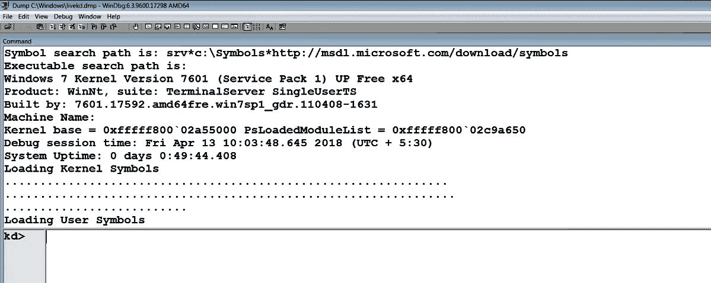

现在，回到我们对`_EPROCESS`结构的讨论，为了探索`_EPROCESS`结构，我们将使用`Display Type`命令`(dt)`。`dt`命令可用于探索表示变量、结构或联合体的符号。在以下输出中，`dt`命令用于显示在`nt`模块（内核执行文件的名称）中定义的`_EPROCESS`结构。`EPROCESS`结构包含多个字段，存储进程的各种元数据。以下是 64 位 Windows 7 系统的示例（为了保持简洁，已删除部分字段）：

```
kd> dt nt!_EPROCESS
   +0x000 Pcb : _KPROCESS
   +0x160 ProcessLock : _EX_PUSH_LOCK
   +0x168 CreateTime : _LARGE_INTEGER
   +0x170 ExitTime : _LARGE_INTEGER
   +0x178 RundownProtect : _EX_RUNDOWN_REF
   +0x180 UniqueProcessId : Ptr64 Void
   +0x188 ActiveProcessLinks : _LIST_ENTRY
   +0x198 ProcessQuotaUsage : [2] Uint8B
   +0x1a8 ProcessQuotaPeak : [2] Uint8B
   [REMOVED]
   +0x200 ObjectTable : Ptr64 _HANDLE_TABLE
   +0x208 Token : _EX_FAST_REF
   +0x210 WorkingSetPage : Uint8B
   +0x218 AddressCreationLock : _EX_PUSH_LOCK
   [REMOVED]
   +0x290 InheritedFromUniqueProcessId : Ptr64 Void
   +0x298 LdtInformation : Ptr64 Void
   +0x2a0 Spare : Ptr64 Void
   [REMOVED]
   +0x2d8 Session : Ptr64 Void
   +0x2e0 ImageFileName : [15] UChar
   +0x2ef PriorityClass : UChar
   [REMOVED]
```

以下是我们将在本讨论中使用的`_EPROCESS`结构中一些有趣的字段：

+   `CreateTime`: 时间戳，指示进程首次启动的时间

+   `ExitTime`: 时间戳，指示进程退出的时间

+   `UniqueProcessID`: 一个整数，引用*进程 ID（PID）*的进程

+   `ActiveProcessLinks`: 一个双向链表，链接系统上所有正在运行的活动进程

+   `InheritedFromUniqueProcessId`: 一个整数，指定父进程的 PID

+   `ImageFileName`: 一个包含 16 个 ASCII 字符的数组，存储进程可执行文件的名称

了解如何检查`_EPROCESS`结构后，现在让我们来看看特定进程的`_EPROCESS`结构。为此，让我们首先使用*WinDbg*列出所有活动进程。您可以使用`!process`扩展命令打印特定进程或所有进程的元数据。在以下命令中，第一个参数`0`列出所有进程的元数据。您还可以通过指定`_EPROCESS`结构的地址来显示单个进程的信息。第二个参数表示详细程度：

```
kd> !process 0 0
**** NT ACTIVE PROCESS DUMP ****
PROCESS fffffa806106cb30
    SessionId: none Cid: 0004 Peb: 00000000 ParentCid: 0000
    DirBase: 00187000 ObjectTable: fffff8a0000016d0 HandleCount: 539.
    Image: System

PROCESS fffffa8061d35700
    SessionId: none Cid: 00fc Peb: 7fffffdb000 ParentCid: 0004
    DirBase: 1faf16000 ObjectTable: fffff8a0002d26b0 HandleCount: 29.
    Image: smss.exe

PROCESS fffffa8062583b30
    SessionId: 0 Cid: 014c Peb: 7fffffdf000 ParentCid: 0144
    DirBase: 1efb70000 ObjectTable: fffff8a00af33ef0 HandleCount: 453.
    Image: csrss.exe

[REMOVED]
```

有关 WinDbg 命令的详细信息，请参考位于 WinDbg 安装文件夹中的 Debugger.chm 帮助。您还可以参考以下在线资源：[`windbg.info/doc/1-common-cmds.html`](http://windbg.info/doc/1-common-cmds.html) 和 [`windbg.info/doc/2-windbg-a-z.html`](http://windbg.info/doc/2-windbg-a-z.html)。

从前面的输出中，让我们来看第二项，描述的是 `smss.exe`。在 `PROCESS` 旁边的地址 `fffffa8061d35700` 是与此 `smss.exe` 实例关联的 `_EPROCESS` 结构的地址。`Cid` 字段的值为 `00fc`（十进制为 `252`），即进程 ID，`ParentCid` 字段的值为 `0004`，表示父进程的进程 ID。你可以通过检查 `smss.exe` 的 `_EPROCESS` 结构中的字段值来验证这一点。你可以在 `Display Type (dt)` 命令的后面加上 `_EPROCESS` 结构的地址，如下代码所示。在以下输出中，注意字段 `UniqueProcessId`（进程 ID）、`InheritedFromUniqueProcessId`（父进程 ID）和 `ImageFileName`（进程可执行文件名）的值。这些值与之前从 `!process 0 0` 命令中获得的结果相匹配：

```
kd> dt nt!_EPROCESS fffffa8061d35700
   +0x000 Pcb : _KPROCESS
   +0x160 ProcessLock : _EX_PUSH_LOCK
   +0x168 CreateTime : _LARGE_INTEGER 0x01d32dde`223f3e88
   +0x170 ExitTime : _LARGE_INTEGER 0x0
   +0x178 RundownProtect : _EX_RUNDOWN_REF
   +0x180 UniqueProcessId : 0x00000000`000000fc Void
   +0x188 ActiveProcessLinks : _LIST_ENTRY [ 0xfffffa80`62583cb8 - 0xfffffa80`6106ccb8 ]
   +0x198 ProcessQuotaUsage : [2] 0x658
   [REMOVED]
   +0x290 InheritedFromUniqueProcessId : 0x00000000`00000004 Void
   +0x298 LdtInformation : (null) 
   [REMOVED]
   +0x2d8 Session : (null) 
   +0x2e0 ImageFileName : [15] "smss.exe"
   +0x2ef PriorityClass : 0x2 ''
   [REMOVED]
```

到目前为止，我们知道操作系统将所有关于进程的元数据保存在 `_EPROCESS` 结构中，该结构存在于内核内存中。这意味着，如果你能找到某个特定进程的 `_EPROCESS` 结构的地址，就能获取到关于该进程的所有信息。那么，问题是，如何获取系统中所有正在运行的进程的信息呢？为此，我们需要了解 Windows 操作系统是如何追踪活动进程的。

# 4.1.2 理解 ActiveProcessLinks

Windows 使用一个圆形双向链表来追踪所有活动的进程，每个节点都是一个 `_EPROCESS` 结构。`_EPROCESS` 结构中包含一个名为 `ActiveProcessLinks` 的字段，类型是 `LIST_ENTRY`。`_LIST_ENTRY` 是另一种结构，包含两个成员，如下代码所示。`Flink`（正向链接）指向下一个 `_EPROCESS` 结构的 `_LIST_ENTRY`，而 `Blink`（反向链接）指向前一个 `_EPROCESS` 结构的 `_LIST_ENTRY`：

```
kd> dt nt!_LIST_ENTRY
   +0x000 Flink : Ptr64 _LIST_ENTRY
   +0x008 Blink : Ptr64 _LIST_ENTRY
```

`Flink` 和 `Blink` 一起构成了一个进程对象链表，可以像下面这样可视化：

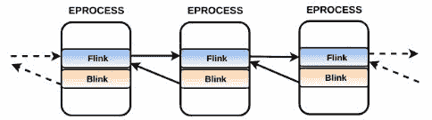

一个需要注意的点是，`Flink` 和 `Blink` 并不指向 `_EPROCESS` 结构的开始位置。`Flink` 指向下一个 `_EPROCESS` 结构的 `_LIST_ENTRY` 结构的起始位置（第一个字节），而 `Blink` 指向前一个 `_EPROCESS` 结构的 `_LIST_ENTRY` 结构的第一个字节。之所以重要，是因为一旦你找到了某个进程的 `_EPROCESS` 结构，你可以通过 `Flink` 向前（正向）遍历双向链表，或者通过 `Blink` 向后（反向）遍历链表，然后减去偏移量来获取下一个或上一个进程的 `_EPROCESS` 结构的开始位置。为了帮助你理解这意味着什么，我们来看一下 `smss.exe` 的 `_EPROCESS` 结构中 `Flink` 和 `Blink` 字段的值：

```
kd> dt -b -v nt!_EPROCESS fffffa8061d35700
struct _EPROCESS, 135 elements, 0x4d0 bytes
.....
   +0x180 UniqueProcessId : 0x00000000`000000fc 
   +0x188 ActiveProcessLinks : struct _LIST_ENTRY, 2 elements, 0x10 bytes
 [ 0xfffffa80`62583cb8 - 0xfffffa80`6106ccb8 ]
      +0x000 Flink : 0xfffffa80`62583cb8 
      +0x008 Blink : 0xfffffa80`6106ccb8
```

`Flink`的值为`0xfffffa8062583cb8`；这是下一个`_EPROCESS`结构的`ActiveProcessLinks`（`Flink`）的起始地址。由于在我们的示例中，`ActiveProcessLinks`位于`_EPROCESS`结构起始处的偏移量`0x188`，你可以通过从`Flink`值中减去`0x188`来到达下一个进程的`_EPROCESS`结构的起始位置。在以下输出中，注意通过减去`0x188`我们到达了下一个进程的`_EPROCESS`结构，即`csrss.exe`：

```
kd> dt nt!_EPROCESS (0xfffffa8062583cb8-0x188)
   +0x000 Pcb : _KPROCESS
   +0x160 ProcessLock : _EX_PUSH_LOCK
   [REMOVED]
   +0x180 UniqueProcessId : 0x00000000`0000014c Void
   +0x188 ActiveProcessLinks : _LIST_ENTRY [ 0xfffffa80`625acb68 - 0xfffffa80`61d35888 ]
   +0x198 ProcessQuotaUsage : [2] 0x2c18
   [REMOVED]
   +0x288 Win32WindowStation : (null) 
   +0x290 InheritedFromUniqueProcessId : 0x00000000`00000144 Void
   [REMOVED]
   +0x2d8 Session : 0xfffff880`042ae000 Void
   +0x2e0 ImageFileName : [15] "csrss.exe"
   +0x2ef PriorityClass : 0x2 ''
```

如你所见，通过遍历双向链表，可以列出系统上所有正在运行的活动进程的信息。在实时系统中，像*任务管理器*或*Process Explorer*这样的工具使用 API 函数，这些函数最终依赖于找到并遍历存在于内核内存中的同一个`_EPROCESS`结构的双向链表。`pslist`插件也包含了查找和遍历来自内存镜像的相同`_EPROCESS`结构双向链表的逻辑。为此，`pslist`插件找到一个名为`_PsActiveProcessHead`的符号，该符号定义在`ntoskrnl.exe`（或`ntkrnlpa.exe`）中。该符号指向`_EPROCESS`结构双向链表的起始位置；然后，`pslist`遍历`_EPROCESS`结构的双向链表来列出所有正在运行的进程。

有关本书中所涉及的 Volatility 插件的详细工作原理和逻辑，请参阅 Michael Hale Ligh、Andrew Case、Jamie Levy 和 Aaron Walters 的《内存取证艺术：检测 Windows、Linux 和 Mac 内存中的恶意软件和威胁》（The Art of Memory Forensics: Detecting Malware and Threats in Windows, Linux, and Mac Memory）。

如前所述，像`pslist`这样的插件支持多种选项和参数；通过在插件名称后输入`-h (--help)`可以显示这些选项。`pslist`的一个选项是`--output-file`。你可以使用此选项将`pslist`的输出重定向到文件，如下所示：

```
$ python vol.py -f perseus.vmem --profile=Win7SP1x86 pslist --output-file=pslist.txt
```

另一个选项是`-p (--pid)`。使用此选项，如果你知道某个进程的**进程 ID**（**PID**），你可以获取该进程的信息：

```
$ python vol.py -f perseus.vmem --profile=Win7SP1x86 pslist -p 3832
Volatility Foundation Volatility Framework 2.6
Offset(V) Name          PID  PPID Thds Hnds Wow64 Start
---------- ------------ ---- ---- ---- ---- ----- -------------------
0x8503f0e8 svchost..exe 3832 3712  11   303   0   2016-09-23 09:24:55
```

# 4.2 使用 psscan 列出进程

`psscan`是另一个列出系统上运行进程的 Volatility 插件。与`pslist`不同，`psscan`并不遍历`_EPROCESS`对象的双向链表。相反，它扫描物理内存以查找进程对象的特征码。换句话说，`psscan`使用与`pslist`插件不同的方法来列出进程。你可能会想，当`pslist`插件也能做同样的事情时，为什么还需要`psscan`插件？答案就在于`psscan`使用的技术。由于它采用的方式，它可以检测已终止的进程和隐藏的进程。攻击者可以隐藏进程，从而防止取证分析师在实时取证过程中发现恶意进程。那么，问题是，攻击者如何隐藏一个进程呢？要理解这一点，你需要了解一种攻击技术，称为*DKOM（直接内核对象操控）*。

# 4.2.1 直接内核对象操控（DKOM）

*DKOM*是一种涉及修改内核数据结构的技术。通过使用 DKOM，可以隐藏一个进程或驱动程序。为了隐藏一个进程，攻击者找到他/她想要隐藏的恶意进程的`_EPROCESS`结构，并修改`ActiveProcessLinks`字段。具体来说，前一个`_EPROCESS`块的`Flink`被指向下一个`_EPROCESS`块的`Flink`，而下一个`_EPROCESS`块的`Blink`则指向前一个`_EPROCESS`块的`Flink`。由于这一操作，恶意进程相关的`_EPROCESS`块被从双向链表中解除链接（如图所示）：

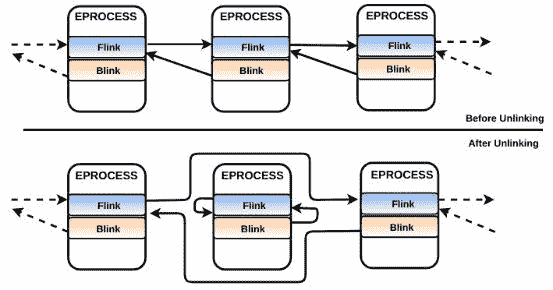

通过解除链接一个进程，攻击者可以使恶意进程对依赖遍历双向链表来枚举活动进程的实时取证工具隐藏。如你所猜测的，这种技术同样会使恶意进程对`pslist`插件隐藏（该插件也依赖遍历双向链表）。以下是一个被*prolaco* rootkit 感染的系统的`pslist`和`psscan`输出，*prolaco* rootkit 通过执行*DKOM*来隐藏一个进程。为了简洁起见，以下输出中的一些条目已被截断。当你对比`pslist`和`psscan`的输出时，会注意到`psscan`输出中有一个额外的进程`nvid.exe`（`pid 1700`），但在`pslist`中并未出现：

```
$ python vol.py -f infected.vmem --profile=WinXPSP3x86 pslist
Volatility Foundation Volatility Framework 2.6
Offset(V)  Name         PID  PPID Thds Hnds Sess Wow64  Start
--------- ------------- ---- ---- ---- ---- ---- ----- -------------------
0x819cc830 System          4    0 56   256  ----    0
0x814d8380 smss.exe      380    4  3    19  ----    0  2014-06-11 14:49:36
0x818a1868 csrss.exe     632  380 11   423     0    0  2014-06-11 14:49:36
0x813dc1a8 winlogon.exe  656  380 24   524     0    0  2014-06-11 14:49:37
0x81659020 services.exe  700  656 15   267     0    0  2014-06-11 14:49:37
0x81657910 lsass.exe     712  656 24   355     0    0  2014-06-11 14:49:37
0x813d7688 svchost.exe   884  700 21   199     0    0  2014-06-11 14:49:37
0x818f5d10 svchost.exe   964  700 10   235     0    0  2014-06-11 14:49:38
0x813cf5a0 svchost.exe  1052  700 84  1467     0    0  2014-06-11 14:49:38
0x8150b020 svchost.exe  1184  700 16   211     0    0  2014-06-11 14:49:40
0x81506c68 spoolsv.exe  1388  700 15   131     0    0  2014-06-11 14:49:40
0x81387710 explorer.exe 1456 1252 16   459     0    0  2014-06-11 14:49:55
```

```
$ python vol.py -f infected.vmem --profile=WinXPSP3x86 psscan
 Volatility Foundation Volatility Framework 2.6
 Offset(P)          Name         PID  PPID  PDB       Time created
 ------------------ ------------ ---- ---- ---------- -------------------
 0x0000000001587710 explorer.exe 1456 1252 0x08440260 2014-06-11 14:49:55
 0x00000000015cf5a0 svchost.exe  1052  700 0x08440120 2014-06-11 14:49:38
 0x00000000015d7688 svchost.exe   884  700 0x084400e0 2014-06-11 14:49:37
 0x00000000015dc1a8 winlogon.exe  656  380 0x08440060 2014-06-11 14:49:37
 0x00000000016ba360 nvid.exe     1700 1660 0x08440320 2014-10-17 09:16:10
 0x00000000016d8380 smss.exe      380    4 0x08440020 2014-06-11 14:49:36
 0x0000000001706c68 spoolsv.exe  1388  700 0x084401a0 2014-06-11 14:49:40
 0x000000000170b020 svchost.exe  1184  700 0x08440160 2014-06-11 14:49:40
 0x0000000001857910 lsass.exe     712  656 0x084400a0 2014-06-11 14:49:37
 0x0000000001859020 services.exe  700  656 0x08440080 2014-06-11 14:49:37
 0x0000000001aa1868 csrss.exe     632  380 0x08440040 2014-06-11 14:49:36
 0x0000000001af5d10 svchost.exe   964  700 0x08440100 2014-06-11 14:49:38
 0x0000000001bcc830 System          4    0 0x00319000
```

如前所述，`psscan`能够检测隐藏进程的原因在于它使用了不同的技术来列出进程，即*池标签扫描*。

# 4.2.2 理解池标签扫描

如果你还记得，我之前提到过将进程、文件、线程等系统资源称为对象（或执行对象）。这些执行对象由内核中的一个组件——*对象管理器*来管理。每个执行对象都有一个与之相关的结构（如进程对象的`_EPROCESS`）。执行对象结构前面有一个`_OBJECT_HEADER`结构，包含有关对象类型的信息以及一些引用计数。`_OBJECT_HEADER`结构前面可能会有零个或多个可选头结构。换句话说，你可以将对象视为执行对象结构、对象头和可选头的组合，如下图所示：

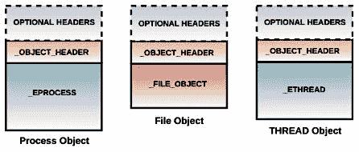

存储对象需要内存，而这些内存由 Windows 内存管理器从内核池中分配。内核池是一个可以被分割成更小块的内存范围，用于存储诸如对象之类的数据。内核池被划分为*分页池*（其内容可以被交换到磁盘）和*非分页池*（其内容永久驻留在内存中）。对象（如进程和线程）被保存在内核的非分页池中，这意味着它们将始终驻留在物理内存中。

当 Windows 内核接收到创建对象的请求时（可能是由于进程调用了如`CreateProcess`或`CreateFile`的 API），内存将被分配给该对象，可能来自分页池或非分页池（具体取决于对象类型）。这个分配通过在对象前面加上一个`_POOL_HEADER`结构来标记，以便在内存中，每个对象都会有一个可预测的结构，类似于下面的截图所示。`_POOL_HEADER`结构包含一个名为`PoolTag`的字段，存储一个四字节的标签（称为*池标签*）。这个*池标签*可以用来识别对象。对于*进程对象*，标签是`Proc`，对于*文件对象*，标签是`File`，依此类推。`_POOL_HEADER`结构还包含一些字段，告诉内存分配的*大小*以及它所描述的内存类型（*分页池*或*非分页池*）：

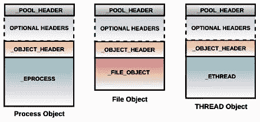

你可以将所有驻留在内核内存的非分页池中的进程对象（最终映射到物理内存）视为带有`Proc`标签的对象。正是这个标签，Volatility 的`psscan`使用它作为起点来识别进程对象。具体来说，它扫描物理内存中的`Proc`标签，以识别与*进程对象*相关联的池标签分配，并通过使用更强大的签名和启发式方法进一步确认。一旦`psscan`找到进程对象，它会从其`_EPROCESS`结构中提取必要的信息。`psscan`会重复这一过程，直到找到所有的进程对象。事实上，许多 Volatility 插件依赖于*池标签扫描*来识别并提取内存镜像中的信息。

`psscan` 插件不仅可以检测隐藏的进程，还能通过其使用的方法检测已终止的进程。当一个对象被销毁（例如当进程被终止时），包含该对象的内存分配会被释放回内核池，但内存中的内容不会立即被覆盖，这意味着进程对象仍然可能保留在内存中，除非该内存被分配用于其他用途。如果包含已终止进程对象的内存没有被覆盖，那么 `psscan` 可以检测到已终止的进程。

有关池标签扫描的详细信息，请参阅 Andreas Schuster 的论文《*在 Microsoft Windows 内存转储中搜索进程和线程*》或阅读书籍《*记忆取证的艺术*》。

此时，你应该已经了解了 Volatility 插件是如何工作的；大多数插件使用类似的逻辑。总的来说，关键信息存在于由内核维护的数据结构中。插件依赖于从这些数据结构中查找并提取信息。查找和提取取证信息的方法有所不同；有些插件依赖于遍历双向链表（例如 `pslist`），有些则使用池标签扫描技术（例如 `psscan`）来提取相关信息。

# 4.3 确定进程关系

在检查进程时，确定进程之间的父子关系是很有用的。在恶意软件调查过程中，这有助于你了解哪些其他进程与恶意进程相关联。`pstree` 插件通过使用 `pslist` 的输出并以树状视图格式化，显示父子进程关系。在以下示例中，运行 `pstree` 插件对感染的内存镜像进行分析，显示了进程关系；子进程向右缩进并以点号表示。通过输出，你可以看到 `OUTLOOK.EXE` 是由 `explorer.exe` 进程启动的。这是正常的，因为每当你通过双击启动一个应用程序时，启动该应用程序的正是资源管理器。`OUTLOOK.EXE` `(pid 4068)` 启动了 `EXCEL.EXE (pid 1124)`，而后者又调用了 `cmd.exe (pid 4056)` 来执行恶意进程 `doc6.exe (pid 2308)`。通过查看这些事件，你可以推测用户打开了通过电子邮件发送的恶意 Excel 文档，该文档可能利用了一个漏洞或执行了宏代码，从而下载并通过 `cmd.exe` 执行了恶意软件。

```
$ python vol.py -f infected.raw --profile=Win7SP1x86 pstree
Volatility Foundation Volatility Framework 2.6
Name                      Pid  PPid Thds Hnds Time
------------------------ ---- ----- ---- ---- -------------------
[REMOVED]
0x86eb4780:explorer.exe   1608 1572  35   936 2016-05-11 12:15:10
. 0x86eef030:vmtoolsd.exe 1708 1608   5   160 2016-05-11 12:15:10
. 0x851ee2b8:OUTLOOK.EXE  4068 1608  17  1433 2018-04-15 02:14:23
.. 0x8580a3f0:EXCEL.EXE   1124 4068  11   377 2018-04-15 02:14:35
... 0x869d1030:cmd.exe    4056 1124   5   117 2018-04-15 02:14:41
.... 0x85b02d40:doc6.exe  2308 4056   1    50 2018-04-15 02:14:59
```

由于 `pstree` 插件依赖于 `pslist` 插件，因此无法列出隐藏或已终止的进程。另一种确定进程关系的方法是使用 `psscan` 插件生成父子关系的可视化表示。以下 `psscan` 命令以 *dot* 格式打印输出，然后可以使用图形可视化软件（如 *Graphviz* [`www.graphviz.org/`](https://www.graphviz.org/) 或 *XDot*）打开（可以通过在 Linux 系统上运行 `sudo apt install xdot` 来安装 XDot）：

```
$ python vol.py -f infected.vmem --profile=Win7SP1x86 psscan --output=dot --output-file=infected.dot
```

使用 XDot 打开 *infected.dot* 文件，显示之前讨论的进程之间的关系：

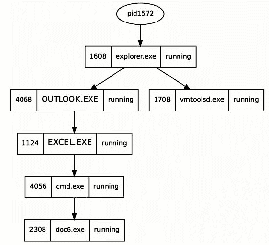

# 4.4 使用 psxview 列出进程

之前，你已经看到如何操控进程列表来隐藏进程；你还理解了 `psscan` 如何通过池标签扫描来检测隐藏的进程。事实证明，`_POOL_HEADER`（`psscan` 依赖的字段）仅用于调试目的，并不会影响操作系统的稳定性。这意味着攻击者可以安装一个内核驱动程序，运行在内核空间，并修改池标签或 `_POOL_HEADER` 中的任何其他字段。通过修改池标签，攻击者可以防止依赖 *池标签扫描* 的插件正常工作。换句话说，通过修改池标签，攻击者可以将进程从 `psscan` 中隐藏。为了解决这个问题，`psxview` 插件依赖于从不同来源提取进程信息。它通过七种不同的方式列举进程。通过比较来自不同来源的输出，可以检测到恶意软件引起的差异。在下面的截图中，`psxview` 使用七种不同的技术列出了进程。每个进程的信息以单独的行显示，使用的技术显示为包含 `True` 或 `False` 的列。某一列下的 `False` 值表示该进程未通过相应方法找到。在以下输出中，`psxview` 使用所有方法检测到隐藏的进程 `nvid.exe`（`pid 1700`），除了 `pslist` 方法：

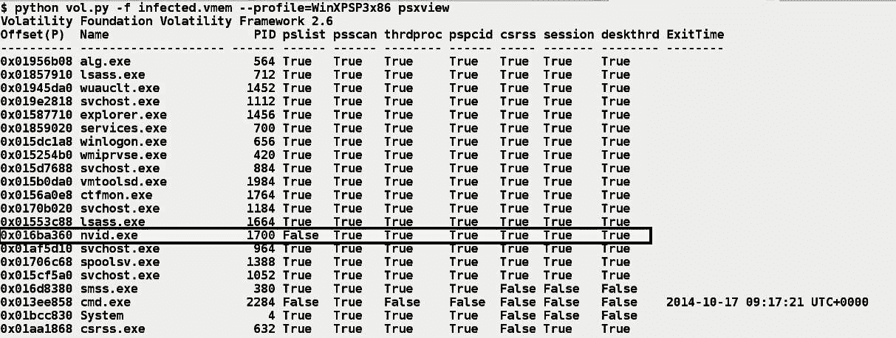

在前面的截图中，你会注意到一些进程显示为“假”值。例如，`cmd.exe` 进程除 `psscan` 方法外，在其他任何方法中都不存在。你可能会认为 `cmd.exe` 被隐藏了，但事实并非如此；你看到 `False` 的原因是 `cmd.exe` 已经终止（你可以从 `ExitTime` 列看出这一点）。因此，所有其他技术都未能找到它，而 `psscan` 方法能找到它，因为池标签扫描能够检测已终止的进程。换句话说，某一列中的 `False` 值并不一定意味着该进程对该方法是隐藏的；它也可能意味着这种情况是预期中的（取决于该方法如何以及从哪里获取进程信息）。要知道这是否是预期的，你可以使用 `-R (--apply-rules)` 选项，如下所示。在下面的截图中，注意 `False` 值是如何被替换为 `Okay` 的**。** `Okay` 表示 `False`，但这是预期的行为。在使用 `-R`（`--apply-rules`）运行 `psxview` 插件后，如果你仍然看到 `False` 值（例如以下截图中的 `nvid.exe`，`pid 1700`），那么这强烈表明该进程对该方法是隐藏的：

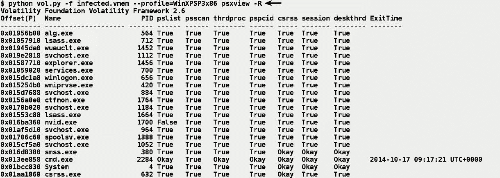

# 5\. 列出进程句柄

在调查过程中，一旦锁定了一个恶意进程，你可能希望了解该进程正在访问哪些对象（如进程、文件、注册表项等）。这将帮助你了解与恶意软件相关的组件以及它们的操作方式。例如，一个键盘记录器可能正在访问一个日志文件以记录捕获的按键，或者恶意软件可能已经打开了一个配置文件的句柄。

要访问一个对象，进程首先需要通过调用 `CreateFile` 或 `CreateMutex` 等 API 来打开该对象的句柄。一旦打开了对象的句柄，它就可以使用该句柄执行后续操作，如写入文件或读取文件。句柄是对象的间接引用；可以把句柄看作是代表一个对象的东西（句柄不是对象本身）。这些对象存在于内核内存中，而进程运行在用户空间中，因此进程无法直接访问对象，它通过使用句柄来代表该对象。

每个进程都有一个私有的句柄表，存储在内核内存中。这个表包含与进程相关联的所有内核对象，例如文件、进程和网络套接字。问题是，这个表是如何填充的？当内核接收到来自进程的请求以创建对象（通过如 `CreateFile` 等 API），该对象将在 *内核内存* 中创建。指向该对象的指针会放入进程句柄表中的第一个可用槽中，并将相应的索引值返回给进程。该索引值就是表示该对象的句柄，进程会使用该句柄执行后续操作。

在一个实时系统中，你可以使用 *Process Hacker* 工具检查特定进程访问的内核对象。为此，启动 Process Hacker 并以 *管理员* 身份运行，右键单击任意进程，然后选择 *Handles* 标签。以下截图显示了 *csrss.exe* 进程的进程句柄。*csrss.exe* 是一个合法的操作系统进程，参与每个进程和线程的创建。因此，你会看到 *csrss.exe* 打开了大多数进程（除了它自己和它的父进程）的句柄。以下截图中，第三列是 *句柄值*，第四列显示了 *对象的地址* 在内核内存中的位置。例如，第一个进程 *wininit.exe* 位于内核内存地址 `0x8705c410`（它的 `_EPROCESS` 结构的地址），表示该对象的句柄值是 `0x60`：

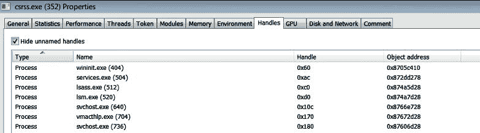 `psxview` 插件使用的方法之一依赖于遍历 *csrss.exe* 进程的句柄表来识别进程对象。如果存在多个 *csrss.exe* 实例，`psxview` 将解析所有 *csrss.exe* 实例的句柄表，以列出正在运行的进程，除了 *csrss.exe* 进程及其父进程（*smss.exe* 和 *system* 进程）。

从内存镜像中，你可以通过 `handles` 插件获取所有被进程访问的内核对象的列表。以下截图展示了 `pid 356` 进程的句柄。如果你在没有 `-p` 选项的情况下运行 `handles` 插件，它将显示所有进程的句柄信息：

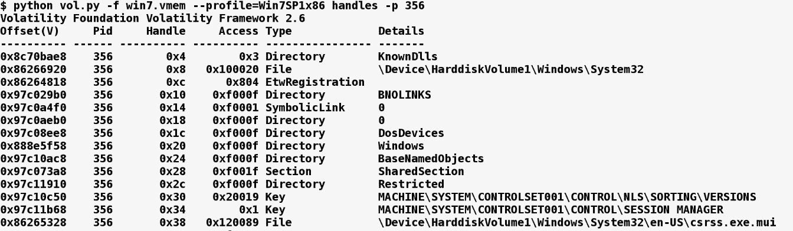

你还可以使用 `-t` 选项来过滤特定对象类型（如 `File`、`Key`、`Process`、`Mutant` 等）的结果。在以下示例中，`handles` 插件被运行在一个感染了 *Xtreme RAT* 的内存镜像上。`handles` 插件被用来列出恶意进程（`pid 1772`）打开的互斥体。从以下输出中，你可以看到 *Xtreme RAT* 创建了一个名为 `oZ694XMhk6yxgbTA0` 的互斥体，以标记其在系统中的存在。像 *Xtreme RAT* 创建的这样的互斥体可以作为一个很好的主机基础指示器，用于主机基础监控：

```
$ python vol.py -f xrat.vmem --profile=Win7SP1x86 handles -p 1772 -t Mutant
Volatility Foundation Volatility Framework 2.6
Offset(V)  Pid  Handle Access   Type    Details
---------- ---- ------ -------- ------ -----------------------------  
0x86f0a450 1772 0x104  0x1f0001 Mutant oZ694XMhk6yxgbTA0
0x86f3ca58 1772 0x208  0x1f0001 Mutant _!MSFTHISTORY!_
0x863ef410 1772 0x280  0x1f0001 Mutant WininetStartupMutex
0x86d50ca8 1772 0x29c  0x1f0001 Mutant WininetConnectionMutex
0x8510b8f0 1772 0x2a0  0x1f0001 Mutant WininetProxyRegistryMutex
0x861e1720 1772 0x2a8  0x100000 Mutant RasPbFile
0x86eec520 1772 0x364  0x1f0001 Mutant ZonesCounterMutex
0x86eedb18 1772 0x374  0x1f0001 Mutant ZoneAttributeCacheCounterMutex
```

在以下的内存镜像示例中，感染了*TDL3 rootkit*，`svchost.exe`进程（`pid 880`）打开了恶意 DLL 文件和与 rootkit 相关的内核驱动程序的文件句柄：

```
$ python vol.py -f tdl3.vmem handles -p 880 -t File
Volatility Foundation Volatility Framework 2.6
Offset(V)  Pid Handle Access   Type  Details
---------- --- ------ -------- ---- ----------------------------
0x89406028 880 0x50   0x100001 File  \Device\KsecDD
0x895fdd18 880 0x100  0x100000 File  \Device\Dfs
[REMOVED]
0x8927b9b8 880 0x344  0x120089 File [REMOVED]\system32\TDSSoiqh.dll
0x89285ef8 880 0x34c  0x120089 File [REMOVED]\system32\drivers\TDSSpqxt.sys
```

# 6\. 列出 DLL 文件

在本书中，你已经看到了恶意软件使用 DLL 实现恶意功能的例子。因此，除了调查进程外，你可能还需要检查加载的库列表。要列出已加载的模块（可执行文件和 DLL），你可以使用 Volatility 的 `dlllist` 插件。`dlllist` 插件还显示与进程相关联的完整路径。让我们以名为*Ghost RAT*的恶意软件为例。它将恶意功能实现为*Service DLL*，因此，恶意 DLL 被 `svchost.exe` 进程加载（有关 Service DLL 的更多信息，请参阅第七章，*恶意软件功能和持久性*）。以下是 `dlllist` 的输出，其中可以看到由 `svchost.exe` 进程（`pid 800`）加载的一个具有非标准扩展名 `(.ddf)` 的可疑模块。第一列，`Base`，指定了基地址，即模块加载在内存中的地址：

```
$ python vol.py -f ghost.vmem --profile=Win7SP1x86 dlllist -p 880
Volatility Foundation Volatility Framework 2.6
******************************************************************
svchost.exe pid: 880
Command line : C:\Windows\system32\svchost.exe -k netsvcs

Base       Size     LoadCount Path
---------- -------- --------- --------------------------------
0x00f30000 0x8000   0xffff    C:\Windows\system32\svchost.exe
0x76f60000 0x13c000 0xffff    C:\Windows\SYSTEM32\ntdll.dll
0x75530000 0xd4000  0xffff    C:\Windows\system32\kernel32.dll
0x75160000 0x4a000  0xffff    C:\Windows\system32\KERNELBASE.dll
0x75480000 0xac000  0xffff    C:\Windows\system32\msvcrt.dll
0x77170000 0x19000  0xffff    C:\Windows\SYSTEM32\sechost.dll
0x76700000 0x15c000 0x62      C:\Windows\system32\ole32.dll
0x76c30000 0x4e000  0x19c     C:\Windows\system32\GDI32.dll
0x770a0000 0xc9000  0x1cd     C:\Windows\system32\USER32.dll
[REMOVED]
0x74fe0000 0x4b000  0xffff    C:\Windows\system32\apphelp.dll
0x6bbb0000 0xf000   0x1       c:\windows\system32\appinfo.dll
0x10000000 0x26000  0x1       c:\users\test\application data\acdsystems\acdsee\imageik.ddf
0x71200000 0x32000  0x3       C:\Windows\system32\WINMM.dll
```

`dlllist` 插件从名为*进程环境块（PEB）*的结构中获取有关加载模块的信息。如果你回想一下第八章，*代码注入与钩子*，在讲解进程内存组件时，我提到过*PEB* 结构位于进程内存中（用户空间）。PEB 包含关于进程可执行文件加载位置、磁盘上的完整路径以及已加载模块（可执行文件和 DLL）的元数据。`dlllist` 插件查找每个进程的*PEB* 结构并获取上述信息。那么，问题是，如何找到 PEB 结构呢？`_EPROCESS` 结构有一个名为 `Peb` 的字段，里面包含指向*PEB*的指针。这意味着，一旦插件找到了 `_EPROCESS` 结构，它就可以找到*PEB*。需要记住的一点是，`_EPROCESS` 位于内核内存（内核空间），而 `PEB` 位于进程内存（用户空间）。

要在调试器中获取*PEB*的地址，你可以使用 `!process` 扩展命令，该命令显示 `_EPROCESS` 结构的地址。它还指定了*PEB*的地址。从以下输出中可以看到，`explorer.exe` 进程的 PEB 位于其进程内存中的地址 `7ffd3000`，而其 `_EPROCESS` 结构位于 `0x877ced28`（在其内核内存中）：

```
kd> !process 0 0
**** NT ACTIVE PROCESS DUMP ****
.........
PROCESS 877cb4a8 SessionId: 1 Cid: 05f0 Peb: 7ffdd000 ParentCid: 0360
    DirBase: beb47300 ObjectTable: 99e54a08 HandleCount: 70.
    Image: dwm.exe
PROCESS 877ced28 SessionId: 1 Cid: 0600 Peb: 7ffd3000 ParentCid: 05e8
    DirBase: beb47320 ObjectTable: 99ee5890 HandleCount: 766.
    Image: explorer.exe
```

另一种确定 PEB 地址的方法是使用 `display type (dt)` 命令。你可以通过检查 `explorer.exe` 进程的 `EPROCESS` 结构中的 `Peb` 字段来找到其*PEB*的地址，如下所示：

```
kd> dt nt!_EPROCESS 877ced28
   [REMOVED]
   +0x168 Session : 0x8f44e000 Void
   +0x16c ImageFileName : [15] "explorer.exe"
   [REMOVED]
   +0x1a8 Peb : 0x7ffd3000 _PEB
   +0x1ac PrefetchTrace : _EX_FAST_REF
```

你现在知道如何找到*PEB*，接下来，我们来了解一下*PEB*包含什么样的信息。要获取给定进程的*PEB*的人类可读摘要，首先，你需要切换到你想要检查其*PEB*的进程上下文。这可以通过使用`.process`扩展命令来完成。该命令接受`_EPROCESS`结构的地址。以下命令将当前进程上下文设置为`explorer.exe`进程：

```
kd> .process 877ced28
Implicit process is now 877ced28
```

然后，你可以使用`!peb`扩展命令，后跟*PEB*的地址。在以下输出中，为了简洁起见，部分信息被省略。`ImageBaseAddress`字段指定了进程可执行文件（`explorer.exe`）在内存中加载的地址。*PEB*还包含另一个结构，称为 Ldr 结构（类型为`_PEB_LDR_DATA`），它维护三个双向链表，分别是`InLoadOrderModuleList`、`InMemoryOrderModuleList`和`InInitializationOrderModuleList`。这三种双向链表中的每一项都包含关于模块的信息（包括进程可执行文件和 DLL）。通过遍历这些双向链表中的任何一个，你都可以获取有关模块的信息。`InLoadOrderModuleList`按照模块加载的顺序组织模块，`InMemoryOrderModuleList`按照模块在进程内存中驻留的顺序组织模块，`InInitializationOrderModuleList`按照其`DllMain`函数执行的顺序组织模块：

```
kd> !peb 0x7ffd3000
PEB at 7ffd3000
    InheritedAddressSpace: No
    ReadImageFileExecOptions: No
    BeingDebugged: No
    ImageBaseAddress: 000b0000
    Ldr 77dc8880
    Ldr.Initialized: Yes
    Ldr.InInitializationOrderModuleList: 00531f98 . 03d3b558
    Ldr.InLoadOrderModuleList: 00531f08 . 03d3b548
    Ldr.InMemoryOrderModuleList: 00531f10 . 03d3b550
    [REMOVED]
```

换句话说，这三种 PEB 链表都包含关于已加载模块的信息，例如基地址、大小、与模块相关的完整路径等。需要记住的一个重要点是，`InInitializationOrderModuleList`不包含进程可执行文件的信息，因为可执行文件与 DLL 的初始化方式不同。

为了帮助你更好地理解，以下图示使用`Explorer.exe`作为示例（这一概念也适用于其他进程）。当`Explorer.exe`执行时，它的进程可执行文件会以某个地址（假设是`0xb0000`）加载到进程内存中，并具有`PAGE_EXECUTE_WRITECOPY`（`WCX`）保护。相关的 DLL 也会被加载到进程内存中。进程内存还包括 PEB 结构，其中包含有关`explorer.exe`在内存中加载位置（基地址）的元数据。PEB 中的`Ldr`结构维护三个双向链表；每个元素是一个结构（类型为`_LDR_DATA_TABLE_ENTRY`），它包含有关已加载模块的信息（基地址、完整路径等）。`dlllist`插件依赖于遍历`InLoadOrderModuleList`来获取模块的信息：

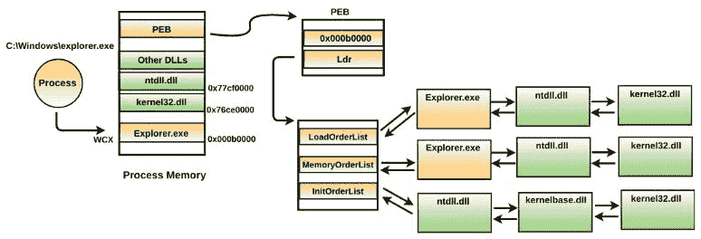

从这三个 PEB 列表中获取模块信息的问题在于，它们容易受到 *DKOM* 攻击。这三个 PEB 列表都位于用户空间，这意味着攻击者可以将恶意 DLL 加载到进程的地址空间中，并将恶意 DLL 从一个或所有 PEB 列表中解绑，从而隐藏起来，避开依赖于遍历这些列表的工具。为了解决这个问题，我们可以使用另一个插件，名为 `ldrmodules`。

# 6.1 使用 ldrmodules 检测隐藏的 DLL

`ldrmodules` 插件将进程内存中的三个 PEB 列表中的模块信息与存在于内核内存中的一种数据结构——*VADs*（*虚拟地址描述符*）的信息进行比较。内存管理器使用 VADs 跟踪进程内存中哪些虚拟地址已被保留（或空闲）。VAD 是一种二叉树结构，存储有关进程内存中虚拟连续内存区域的信息。对于每个进程，内存管理器维护一组 VADs，每个 VAD 节点描述一个虚拟连续的内存区域。如果进程内存区域包含内存映射文件（例如可执行文件、DLL），则 VAD 节点存储其基地址、文件路径和内存保护信息。以下示例应能帮助你理解这个概念。在以下截图中，内核空间中的一个 VAD 节点描述了进程可执行文件（*explorer.exe*）的加载位置、其完整路径和内存保护。类似地，其他 VAD 节点将描述进程内存范围，包括包含映射的可执行映像（如 DLL）的范围：

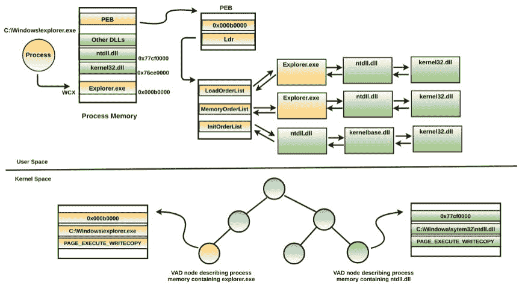

为了获取模块的信息，`ldrmodules` 插件枚举所有包含映射可执行映像的 VAD 节点，并将结果与三个 PEB 列表进行比较，以识别任何不一致之处。以下是来自一个被 *TDSS rootkit*（我们之前看到的）感染的内存镜像中进程的模块列表。你可以看到，`ldrmodules` 插件成功识别出一个名为 `TDSSoiqh.dll` 的恶意 DLL，该 DLL 在所有三个 PEB 列表（`InLoad`、`InInit` 和 `InMem`）中都隐藏了。`InInit` 值对于 `svchost.exe` 被设置为 `False`，这对于可执行文件来说是预期的，正如前面所提到的：

```
$ python vol.py -f tdl3.vmem --profile=WinXPSP3x86 ldrmodules -p 880
Volatility Foundation Volatility Framework 2.6
Pid Process     Base     InLoad InInit InMem MappedPath
--- ----------- --------  ----- ------- ----- ----------------------------
880 svchost.exe 0x10000000 False False False \WINDOWS\system32\TDSSoiqh.dll
880 svchost.exe 0x01000000 True  False True  \WINDOWS\system32\svchost.exe
880 svchost.exe 0x76d30000 True  True  True  \WINDOWS\system32\wmi.dll
880 svchost.exe 0x76f60000 True  True  True  \WINDOWS\system32\wldap32.dll
[REMOVED]
```

# 7. 转储可执行文件和 DLL

在识别了恶意进程或 DLL 后，您可能希望转储它以便进一步调查（例如提取字符串、运行 YARA 规则、反汇编或使用杀毒软件扫描）。要将进程可执行文件从内存转储到磁盘，可以使用`procdump`插件。要转储进程可执行文件，您需要知道其进程 ID 或物理偏移量。在下面的示例中，内存镜像被*Perseus 恶意软件*感染（之前在讨论`pslist`插件时有提到），`procdump`插件用于转储其恶意进程可执行文件`svchost..exe`（`pid 3832`）。使用`-D`（`--dump-dir`）选项，您可以指定要转储可执行文件的目录名称。转储的文件名基于进程的 pid，例如`executable.PID.exe`：

```
$ python vol.py -f perseus.vmem --profile=Win7SP1x86 procdump -p 3832 -D dump/
Volatility Foundation Volatility Framework 2.6
Process(V) ImageBase  Name         Result
---------- ---------- ------------ -----------------------
0x8503f0e8 0x00b90000 svchost..exe OK: executable.3832.exe

$ cd dump
$ file executable.3832.exe
executable.3832.exe: PE32 executable (GUI) Intel 80386 Mono/.Net assembly, for MS Windows
```

要转储带有物理偏移量的进程，可以使用`-o (--offset)`选项。如果您想从内存中转储隐藏进程，这个选项非常有用。在下面的示例中，内存镜像被`prolaco`恶意软件感染（之前在讨论`psscan`插件时有提到），通过物理偏移量转储了隐藏进程。物理偏移量是通过`psscan`插件确定的。您也可以通过`psxview`插件获取物理偏移量。使用`procdump`插件时，如果没有指定`-p (--pid)`或`-o (--offset)`选项，则会转储系统上所有正在运行的活动进程的可执行文件：

```
$ python vol.py -f infected.vmem --profile=WinXPSP3x86 psscan
Volatility Foundation Volatility Framework 2.6
Offset(P)          Name    PID  PPID PDB        Time created 
------------------ ------- ---- ---- ---------- -------------------- 
[REMOVED]
0x00000000016ba360 nvid.exe 1700 1660 0x08440320 2014-10-17 09:16:10
```

```
$ python vol.py -f infected.vmem --profile=WinXPSP3x86 procdump -o 0x00000000016ba360 -D dump/ 
Volatility Foundation Volatility Framework 2.6
Process(V) ImageBase  Name     Result
---------- ---------- -------- -----------------------
0x814ba360 0x00400000 nvid.exe OK: executable.1700.exe
```

与进程可执行文件类似，您可以使用`dlldump`插件将恶意 DLL 转储到磁盘。要转储 DLL，您需要指定加载该 DLL 的进程 ID（`-p`选项）和 DLL 的基址，使用`-b (--base)`选项。您可以从`dlllist`或`ldrmodules`输出中获取 DLL 的基址。在下面的示例中，内存镜像被*Ghost RAT*恶意软件感染（我们在讨论`dlllist`插件时有提到），`svchost.exe`（`pid 880`）进程加载的恶意 DLL 被`dlldump`插件转储：

```
$ python vol.py -f ghost.vmem --profile=Win7SP1x86 dlllist -p 880 
Volatility Foundation Volatility Framework 2.6
************************************************************************
svchost.exe pid: 880
Command line : C:\Windows\system32\svchost.exe -k netsvcs

Base        Size  LoadCount  Path
---------- ------ --------   ------
[REMOVED]
0x10000000 0x26000 0x1 c:\users\test\application data\acd systems\acdsee\imageik.ddf
```

```
$ python vol.py -f ghost.vmem --profile=Win7SP1x86 dlldump -p 880 -b 0x10000000 -D dump/
Volatility Foundation Volatility Framework 2.6
Name       Module Base    Module Name       Result
---------- ------------ ---------------- --------------------------
svchost.exe 0x010000000  imageik.ddf      module.880.ea13030.10000000.dll
```

# 8\. 列出网络连接和套接字

大多数恶意程序会执行一些网络活动，要么是下载附加组件，要么是接收攻击者的命令，要么是窃取数据，或是在系统上创建远程后门。检查网络活动将帮助你确定恶意软件在感染系统上的网络操作。在许多情况下，将运行在感染系统上的进程与网络上检测到的活动关联起来非常有用。为了确定在 Vista 之前的系统（如 Windows XP 和 2003）上的活动网络连接，你可以使用 `connections` 插件。以下命令显示了使用 `connections` 插件从感染了 *BlackEnergy* 恶意软件的内存转储中打印活动连接的示例。从以下输出中，你可以看到进程 ID 为 `756` 的进程负责了端口 `443` 上的 C2 通信。在运行 `pslist` 插件之后，你可以得知 `756` 的 pid 与 `svchost.exe` 进程相关联：

```
$ python vol.py -f be3.vmem --profile=WinXPSP3x86 connections
Volatility Foundation Volatility Framework 2.6
Offset(V)  Local Address         Remote Address   Pid
---------- ------------------   --------------  -------
0x81549748 192.168.1.100:1037   X.X.32.230:443   756
```

```
$ python vol.py -f be3.vmem --profile=WinXPSP3x86 pslist -p 756
Volatility Foundation Volatility Framework 2.6
Offset(V)  Name        PID PPID Thds Hnds Sess Wow64  Start               
---------- ----------- --- ---- ---- ---- ---- ------ --------------------
0x8185a808 svchost.exe 756 580  22   442  0    0      2016-01-13 18:38:10
```

另一个你可以在 Vista 之前的系统上使用来列出网络连接的插件是 `connscan`。它使用池标签扫描方法来确定连接。因此，它也可以检测到已终止的连接。在以下的内存镜像感染 *TDL3* rootkit 的示例中，`connections` 插件没有返回任何结果，而 `connscan` 插件则显示了网络连接。这并不一定意味着连接被隐藏，只是意味着在获取内存镜像时，网络连接并未处于活动状态（或已被终止）：

```
$ python vol.py -f tdl3.vmem --profile=WinXPSP3x86 connections
Volatility Foundation Volatility Framework 2.6
Offset(V)  Local Address Remote Address Pid
---------- ------------- -------------- ----
```

```
$ python vol.py -f tdl3.vmem --profile=WinXPSP3x86 connscan
Volatility Foundation Volatility Framework 2.6
Offset(P)  Local Address         Remote Address    Pid
---------- ------------------   ---------------   -----
0x093812b0 192.168.1.100:1032   XX.XXX.92.121:80   880
```

有时，你可能想要获取关于打开的套接字及其关联进程的信息。在 Vista 之前的系统上，你可以使用 `sockets` 和 `sockscan` 插件来获取打开端口的信息。`sockets` 插件打印出打开套接字的列表，而 `sockscan` 插件使用池标签扫描方法。因此，它可以检测到已关闭的端口。

在 Vista 及更高版本的系统（如 Windows 7）上，你可以使用 `netscan` 插件来显示网络连接和套接字。`netscan` 插件使用池标签扫描方法，类似于 `sockscan` 和 `connscan` 插件。在以下的内存镜像被 *Darkcomet RAT* 感染的示例中，`netscan` 插件显示了在端口 `81` 上的 C2 通信，这是由恶意进程 `dmt.exe (pid 3768)` 发起的：

```
$ python vol.py -f darkcomet.vmem --profile=Win7SP1x86 netscan
Volatility Foundation Volatility Framework 2.6
Proto Local Address   Foreign Address     State       Pid Owner
TCPv4 192.168.1.60:139    0.0.0.0:0       LISTENING      4 System 
UDPv4 192.168.1.60:137    *:*                            4 System
UDPv4 0.0.0.0:0           *:*                           1144 svchost.exe
TCPv4 0.0.0.0:49155       0.0.0.0:0       LISTENING     496 services.exe 
UDPv4 0.0.0.0:64471       *:*                           1064 svchost.exe
[REMOVED]
UDPv4 0.0.0.0:64470       *:*                           1064 svchost.exe
TCPv4 192.168.1.60:49162  XX.XXX.228.199:81 ESTABLISHED 3768 dmt.exe
```

# 9. 检查注册表

从取证角度来看，注册表可以提供有关恶意软件上下文的宝贵信息。在讨论第七章《恶意软件功能与持久性》中的持久性方法时，您已经看到恶意程序如何通过向注册表中添加条目来实现重启后的生存。除了持久性，恶意软件还使用注册表来存储配置数据、加密密钥等。要打印注册表键、子键及其值，您可以使用`printkey`插件，并通过`-K`（`--key`）参数提供所需的注册表键路径。在以下受*Xtreme Rat*感染的内存镜像示例中，它将恶意可执行文件`C:\Windows\InstallDir\system.exe`添加到“运行”注册表键中。因此，每次系统启动时，恶意可执行文件都会被执行：

```
$ python vol.py -f xrat.vmem --profile=Win7SP1x86 printkey -K "Microsoft\Windows\CurrentVersion\Run"
Volatility Foundation Volatility Framework 2.6
Legend: (S) = Stable (V) = Volatile

----------------------------
Registry: \SystemRoot\System32\Config\SOFTWARE
Key name: Run (S)
Last updated: 2018-04-22 06:36:43 UTC+0000

Subkeys:

Values:
REG_SZ VMware User Process : (S) "C:\Program Files\VMware\VMware Tools\vmtoolsd.exe" -n vmusr
REG_EXPAND_SZ HKLM : (S) C:\Windows\InstallDir\system.exe
```

在以下示例中，*Darkcomet RAT*在注册表中添加了一条条目，通过`rundll32.exe`加载其恶意的`DLL (mph.dll)`：

```
$ python vol.py -f darkcomet.vmem --profile=Win7SP1x86 printkey -K "Software\Microsoft\Windows\CurrentVersion\Run"
Volatility Foundation Volatility Framework 2.6
Legend: (S) = Stable (V) = Volatile

----------------------------
Registry: \??\C:\Users\Administrator\ntuser.dat
Key name: Run (S)
Last updated: 2016-09-23 10:01:53 UTC+0000

Subkeys:

Values:
REG_SZ Adobe cleanup : (S) rundll32.exe "C:\Users\Administrator\Local Settings\Application Data\Adobe updater\mph.dll", StartProt
----------------------------
```

还有其他注册表键存储着以二进制形式存在的宝贵信息，对于取证调查员来说，这些信息极具价值。Volatility 插件，如`userassist`、`shellbags`和`shimcache`，可以解析这些包含二进制数据的注册表键，并以更易读的格式显示信息。

`Userassist`注册表键包含了用户在系统上执行的程序列表以及程序执行的时间。要打印`userassist`注册表信息，您可以使用 Volatility 的`userassist`插件，如下所示。在以下示例中，一个名为(info.doc.exe)的可疑可执行文件在`2018-04-30 06:42:37`从**E:\**驱动器（可能是 USB 驱动器）执行：

```
$ python vol.py -f inf.vmem --profile=Win7SP1x86 userassist
Volatility Foundation Volatility Framework 2.6
----------------------------
Registry: \??\C:\Users\test\ntuser.dat 

[REMOVED]

REG_BINARY E:\info.doc.exe : 
Count: 1
Focus Count: 0
Time Focused: 0:00:00.500000
Last updated: 2018-04-30 06:42:37 UTC+0000
Raw Data:
0x00000000 00 00 00 00 01 00 00 00 00 00 00 00 00 00 00 00
0x00000010 00 00 80 bf 00 00 80 bf 00 00 80 bf 00 00 80 bf
```

在调查恶意软件事件时，`shimcache`和`shellbags`插件非常有用。`shimcache`插件有助于证明恶意软件在系统上的存在及其运行时间。`shellbags`插件则可以提供有关对文件、文件夹、外部存储设备和网络资源访问的信息。

# 10\. 服务调查

在第七章《恶意软件功能与持久性》中，我们探讨了攻击者如何通过安装或修改现有服务来在系统上保持持久性。在本节中，我们将重点讨论如何从内存镜像中调查服务。要列出服务及其信息，例如*显示名称*、*服务类型*和*启动类型*，您可以使用`svcscan`插件。在以下示例中，恶意软件创建了一个类型为`WIN32_OWN_PROCESS`的服务，显示名称和服务名称均为`svchost`。从二进制路径中可以看出，`svchost.exe`是恶意的，因为它是从非标准路径*C:\Windows*而不是*C:\Windows\System32*运行的：

```
$ python vol.py -f svc.vmem --profile=Win7SP1x86 svcscan
Volatility Foundation Volatility Framework 2.6
[REMOVED]
Offset: 0x58e660
Order: 396
Start: SERVICE_AUTO_START
Process ID: 4080
Service Name: svchost
Display Name: svchost
Service Type: SERVICE_WIN32_OWN_PROCESS
Service State: SERVICE_RUNNING
Binary Path: C:\Windows\svchost.exe
```

对于作为 DLL 实现的服务（即服务 DLL），你可以通过向`svcscan`插件传递`-v (--verbose)`选项来显示服务 DLL（或内核驱动程序）的完整路径。`-v`选项会打印与服务相关的详细信息。以下是一个示例，展示了作为 DLL 运行的恶意软件服务。服务状态被设置为`SERVICE_START_PENDING`，启动类型设置为`SERVICE_AUTO_START`，这告诉你该服务尚未启动，并将在系统启动时自动启动：

```
$ python vol.py -f svc.vmem --profile=Win7SP1x86 svcscan
[REMOVED]
Offset: 0x5903a8
Order: 396
Start: SERVICE_AUTO_START
Process ID: -
Service Name: FastUserSwitchingCompatibility
Display Name: FastUserSwitchingCompatibility
Service Type: SERVICE_WIN32_SHARE_PROCESS
Service State: SERVICE_START_PENDING
Binary Path: -
ServiceDll: C:\Windows\system32\FastUserSwitchingCompatibilityex.dll
ImagePath: %SystemRoot%\System32\svchost.exe -k netsvcs
```

一些恶意程序劫持现有的未使用或已禁用的服务以保持在系统上的持久性。*BlackEnergy*就是这种恶意软件的一个例子，它替换了磁盘上名为`aliide.sys`的合法内核驱动程序。该内核驱动程序与一个名为`aliide`的服务相关联。替换驱动程序后，它修改了与`aliide`服务相关的注册表项并设置为自动启动（即系统启动时自动启动该服务）。此类攻击很难被检测到。检测此类修改的一种方法是保持一个干净内存镜像中所有服务的列表，并将其与可疑镜像中的服务列表进行比较，以寻找任何修改。以下是来自干净内存镜像中的 aliide 服务配置。合法的 aliide 服务被设置为按需启动（即需要手动启动该服务），且服务处于停止状态：

```
$ python vol.py -f win7_clean.vmem --profile=Win7SP1x64 svcscan
Offset: 0x871c30
Order: 11
Start: SERVICE_DEMAND_START
Process ID: -
Service Name: aliide
Display Name: aliide
Service Type: SERVICE_KERNEL_DRIVER
Service State: SERVICE_STOPPED
Binary Path: -
```

以下是受*BlackEnergy**感染的内存镜像中的`svcscan`输出。***经过修改后，`aliide`服务被设置为自动启动（即系统启动时自动启动该服务），但仍处于停止状态。这意味着在系统重启后，服务将自动启动并加载恶意的`aliide.sys`驱动程序。有关此*BlackEnergy*劫持程序的详细分析，请参阅作者的博客文章：[`cysinfo.com/blackout-memory-analysis-of-blackenergy-big-dropper/`](https://cysinfo.com/blackout-memory-analysis-of-blackenergy-big-dropper/)：

```
$ python vol.py -f be3_big.vmem --profile=Win7SP1x64 svcscan
Offset: 0x881d30
Order: 12
Start: SERVICE_AUTO_START
Process ID: -
Service Name: aliide
Display Name: aliide
Service Type: SERVICE_KERNEL_DRIVER
Service State: SERVICE_STOPPED
Binary Path: -
```

# 11\. 提取命令历史

在攻陷系统后，攻击者可能会在命令行中执行各种命令，以枚举网络上的用户、组和共享，或者攻击者可能会将像 *Mimikatz* 这样的工具（[`github.com/gentilkiwi/mimikatz`](https://github.com/gentilkiwi/mimikatz)）传输到被攻陷的系统并执行，以提取 Windows 凭据。Mimikatz 是一款开源工具，由 Benjamin Delpy 于 2011 年编写。它是收集 Windows 系统凭据最流行的工具之一。Mimikatz 有多种版本，例如编译版（[`github.com/gentilkiwi/mimikatz`](https://github.com/gentilkiwi/mimikatz)），并且它是 PowerShell 模块的一部分，比如 *PowerSploit*（[`github.com/PowerShellMafia/PowerSploit`](https://github.com/PowerShellMafia/PowerSploit)）和 *PowerShell Empire*（[`github.com/EmpireProject/Empire`](https://github.com/EmpireProject/Empire)）。

命令历史记录能够提供关于攻击者在被攻陷系统上活动的宝贵信息。通过检查命令历史记录，你可以确定执行过的命令、调用的程序，以及攻击者访问的文件和文件夹。两个 Volatility 插件，`cmdscan` 和 `consoles` 可以从内存镜像中提取命令历史记录。这些插件从 `csrss.exe`（Windows 7 之前）或 `conhost.exe`（Windows 7 及以后版本）进程中提取命令历史记录。

要了解这些插件的详细工作原理，可以阅读书籍《<q class="calibre259">内存取证的艺术</q>》或阅读 Richard Stevens 和 Eoghan Casey 的研究论文《<q class="calibre259">从物理内存提取 Windows 命令行细节</q>》([`www.dfrws.org/2010/proceedings/2010-307.pdf`](http://www.dfrws.org/2010/proceedings/2010-307.pdf))。

`cmdscan` 插件列出了 `cmd.exe` 执行的命令。以下示例展示了系统上窃取凭据的活动。从 `cmdscan` 输出中，你可以看到一个名为 `net.exe` 的应用程序是通过命令行 `cmd.exe` 调用的。从 `net.exe` 提取的命令可以看出，命令 `privilege::debug` 和 `sekurlsa::logonpasswords` 与 Mimikatz 相关。在这种情况下，Mimikatz 应用程序被重命名为 `net.exe`：

```
$ python vol.py -f mim.vmem --profile=Win7SP1x64 cmdscan
[REMOVED]
CommandProcess: conhost.exe Pid: 2772
CommandHistory: 0x29ea40 Application: cmd.exe Flags: Allocated, Reset
CommandCount: 2 LastAdded: 1 LastDisplayed: 1
FirstCommand: 0 CommandCountMax: 50
ProcessHandle: 0x5c
Cmd #0 @ 0x29d610: cd \
Cmd #1 @ 0x27b920: cmd.exe /c %temp%\net.exe
Cmd #15 @ 0x260158: )
Cmd #16 @ 0x29d3b0: )
[REMOVED]
**************************************************
CommandProcess: conhost.exe Pid: 2772
CommandHistory: 0x29f080 Application: net.exe Flags: Allocated, Reset
CommandCount: 2 LastAdded: 1 LastDisplayed: 1
FirstCommand: 0 CommandCountMax: 50
ProcessHandle: 0xd4
Cmd #0 @ 0x27ea70: privilege::debug
Cmd #1 @ 0x29b320: sekurlsa::logonpasswords
Cmd #23 @ 0x260158: )
Cmd #24 @ 0x29ec20: '
```

`cmdscan` 插件显示攻击者执行的命令。为了判断命令是否成功执行，你可以使用 `consoles` 插件。运行 `consoles` 插件后，你可以看到 `net.exe` 确实是一个 Mimikatz 应用程序，并且为了提取凭据，Mimikatz 命令通过 Mimikatz shell 执行。从输出中你可以看出，凭据已成功提取，并且密码以明文形式被获取：

```
$ python vol.py -f mim.vmem --profile=Win7SP1x64 consoles
----
CommandHistory: 0x29ea40 Application: cmd.exe Flags: Allocated, Reset
CommandCount: 2 LastAdded: 1 LastDisplayed: 1
FirstCommand: 0 CommandCountMax: 50
ProcessHandle: 0x5c
Cmd #0 at 0x29d610: cd \
Cmd #1 at 0x27b920: cmd.exe /c %temp%\net.exe
----
Screen 0x280ef0 X:80 Y:300
Dump:
Microsoft Windows [Version 6.1.7600] 
Copyright (c) 2009 Microsoft Corporation. All rights reserved. 

C:\Windows\system32>cd \ 

C:\>cmd.exe /c %temp%\net.exe

[REMOVED] 

mimikatz # privilege::debug 
Privilege '20' OK 

mimikatz # sekurlsa::logonpasswords                                                                             
Authentication Id : 0 ; 269689 (00000000:00041d79) 
Session : Interactive from 1 
User Name : test 
Domain : PC 
Logon Server : PC 
Logon Time : 5/4/2018 10:00:59 AM 
SID : S-1-5-21-1752268255-3385687637-2219068913-1000 
        msv : 
         [00000003] Primary 
         * Username : test 
         * Domain : PC 
         * LM : 0b5e35e143b092c3e02e0f3aaa0f5959 
         * NTLM : 2f87e7dcda37749436f914ae8e4cfe5f 
         * SHA1 : 7696c82d16a0c107a3aba1478df60e543d9742f1 
        tspkg : 
         * Username : test 
         * Domain : PC 
         * Password : cleartext 
        wdigest : 
         * Username : test 
         * Domain : PC 
         * Password : cleartext 
        kerberos : 
         * Username : test 
         * Domain : PC 
         * Password : cleartext 
```

在 Windows 8.1 及更高版本上，你可能无法使用 Mimikatz 以明文形式转储密码，但 Mimikatz 为攻击者提供了多种功能。攻击者可能使用提取的 NTLM 哈希值来冒充账户。有关 Mimikatz 的详细信息及如何使用它提取 Windows 凭证，请阅读[`adsecurity.org/?page_id=1821`](https://adsecurity.org/?page_id=1821)。

# 总结

内存取证是一种出色的技术，可以从计算机内存中查找和提取取证证据。除了在恶意软件调查中使用内存取证外，你还可以将其作为恶意软件分析的一部分，以获取有关恶意软件行为和特征的更多信息。本章介绍了不同的 Volatility 插件，帮助你了解在受感染系统上发生的事件，并提供对恶意软件活动的洞察。在下一章，我们将使用更多 Volatility 插件来确定高级恶意软件的功能，你将学会如何使用这些插件提取取证证据。
