# 第十一章：检测使用内存取证技术的高级恶意软件

在前一章中，我们查看了不同的 Volatility 插件，这些插件有助于从内存镜像中提取有价值的信息。在本章中，我们将继续探讨内存取证，并将介绍几个插件，这些插件将帮助您从感染了使用隐蔽和隐藏技术的高级恶意软件的内存镜像中提取取证物证。在接下来的部分中，我们将专注于使用内存取证检测代码注入技术。下一部分讨论了在第八章*代码注入与挂钩*中已经涵盖的一些概念，因此强烈建议在阅读下一部分之前先阅读该章节。

# 1\. 检测代码注入

如果你还记得第八章中的*代码注入与挂钩*，代码注入是一种用于将恶意代码（如 EXE、DLL 或 shellcode）注入到合法进程内存并在合法进程上下文中执行的技术。为了将代码注入到远程进程中，恶意软件通常会分配一个带有`读`、`写`和`执行`权限的内存（`PAGE_EXECUTE_READWRITE`），然后将代码注入到远程进程的已分配内存中。要检测注入到远程进程中的代码，可以根据内存保护和内存内容查找可疑内存范围。一个引人注目的问题是，什么是可疑的内存范围，如何获取关于进程内存范围的信息？如果你还记得上一章（在*检测隐藏的 DLL 使用 ldrmodules* 部分），Windows 在内核空间维护了一个名为*虚拟地址描述符（VADs）*的二叉树结构，每个 VAD 节点描述了进程内存中的一个虚拟连续内存区域。如果进程内存区域包含内存映射文件（如可执行文件、DLL 等），则其中一个 VAD 节点存储有关其基地址、文件路径和内存保护的信息。以下描绘并非 VAD 的精确表示，但应有助于理解该概念。在以下屏幕截图中，内核空间中的一个 VAD 节点描述了关于进程可执行文件（`explorer.exe`）加载位置、完整路径及内存保护的信息。类似地，其他 VAD 节点将描述进程内存范围，包括包含映射的可执行映像（如 DLL）的范围。这意味着 VAD 可用于确定每个连续进程内存范围的内存保护，并且还可以提供关于包含内存映像文件（如可执行文件或 DLL）的内存区域的信息：

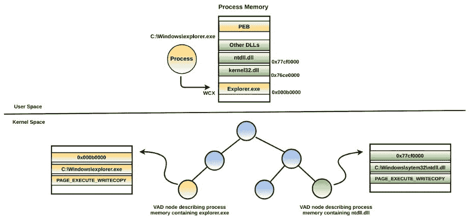

# 1.1 获取 VAD 信息

要从内存映像中获取 VAD 信息，可以使用`vadinfo` Volatility 插件。在以下示例中，`vadinfo`用于显示`explorer.exe`进程的内存区域，通过其进程 ID`(pid 2180)`。在以下输出中，位于内核内存中地址`0x8724d718`的第一个 VAD 节点描述了进程内存中`0x00db0000-0x0102ffff`的内存范围及其内存保护`PAGE_EXECUTE_WRITECOPY`。由于第一个节点描述的是包含内存映射可执行镜像（`explorer.exe`）的内存范围，因此它还给出了其在磁盘上的完整路径。第二个节点`0x8723fb50`描述了`0x004b0000-0x004effff`的内存范围，该范围不包含任何内存映射文件。类似地，位于地址`0x8723fb78`的第三个节点显示了`0x77690000-0x777cbfff`的进程内存范围的信息，其中包含`ntdll.dll`及其内存保护：

```
$ python vol.py -f win7.vmem --profile=Win7SP1x86 vadinfo -p 2180
Volatility Foundation Volatility Framework 2.6

VAD node @ 0x8724d718 Start 0x00db0000 End 0x0102ffff Tag Vadm
Flags: CommitCharge: 4, Protection: 7, VadType: 2
Protection: PAGE_EXECUTE_WRITECOPY
Vad Type: VadImageMap
ControlArea @87240008 Segment 82135000
NumberOfSectionReferences: 1 NumberOfPfnReferences: 215
NumberOfMappedViews: 1 NumberOfUserReferences: 2
Control Flags: Accessed: 1, File: 1, Image: 1
FileObject @8723f8c0, Name: \Device\HarddiskVolume1\Windows\explorer.exe
First prototype PTE: 82135030 Last contiguous PTE: fffffffc
Flags2: Inherit: 1, LongVad: 1

VAD node @ 0x8723fb50 Start 0x004b0000 End 0x004effff Tag VadS
Flags: CommitCharge: 43, PrivateMemory: 1, Protection: 4
Protection: PAGE_READWRITE
Vad Type: VadNone

VAD node @ 0x8723fb78 Start 0x77690000 End 0x777cbfff Tag Vad 
Flags: CommitCharge: 9, Protection: 7, VadType: 2
Protection: PAGE_EXECUTE_WRITECOPY
Vad Type: VadImageMap
ControlArea @8634b790 Segment 899fc008
NumberOfSectionReferences: 2 NumberOfPfnReferences: 223
NumberOfMappedViews: 40 NumberOfUserReferences: 42
Control Flags: Accessed: 1, File: 1, Image: 1
FileObject @8634bc38, Name: \Device\HarddiskVolume1\Windows\System32\ntdll.dll
First prototype PTE: 899fc038 Last contiguous PTE: fffffffc
Flags2: Inherit: 1
[REMOVED]
```

要使用 Windbg 内核调试器获取进程的 VAD 信息，首先需要使用`.process`命令切换到所需的进程上下文，并跟随`_EPROCESS`结构的地址。切换上下文后，使用`!vad`扩展命令显示进程的内存区域。

# 1.2 使用 VAD 检测注入的代码

一个重要的点是，当可执行镜像（如 EXE 或 DLL）正常加载到内存时，操作系统会为该内存区域分配`PAGE_EXECUTE_WRITECOPY(WCX)`的内存保护。应用程序通常不允许使用像`VirtualAllocEx`这样的 API 调用来分配具有`PAGE_EXECUTE_WRITECOPY`保护的内存。换句话说，如果攻击者想要注入 PE 文件（如 EXE 或 DLL）或 shellcode，那么需要分配具有`PAGE_EXECUTE_READWRITE(RWX)`保护的内存。通常，你会发现很少有内存范围具有`PAGE_EXECUTE_READWRITE`的内存保护。具有`PAGE_EXECUTE_READWRITE`保护的内存范围不一定是恶意的，因为程序可能会出于合法目的分配具有该保护的内存。为了检测代码注入，我们可以查找包含`PAGE_EXECUTE_READWRITE`内存保护的内存范围，并检查和验证其内容以确认是否存在恶意代码。为了帮助你理解这一点，我们来看一个被*SpyEye*感染的内存映像的例子。该恶意软件将代码注入到合法的`explorer.exe`进程（`pid 1608`）中。`vadinfo`插件显示了在`explorer.exe`进程中两个具有可疑`PAGE_EXECUTE_READWRITE`内存保护的内存范围：

```
$ python vol.py -f spyeye.vmem --profile=Win7SP1x86 vadinfo -p 1608
[REMOVED]
VAD node @ 0x86fd9ca8 Start 0x03120000 End 0x03124fff Tag VadS
Flags: CommitCharge: 5, MemCommit: 1, PrivateMemory: 1, Protection: 6
Protection: PAGE_EXECUTE_READWRITE
Vad Type: VadNone

VAD node @ 0x86fd0d00 Start 0x03110000 End 0x03110fff Tag VadS
Flags: CommitCharge: 1, MemCommit: 1, PrivateMemory: 1, Protection: 6
Protection: PAGE_EXECUTE_READWRITE
Vad Type: VadNone
```

仅通过内存保护，难以得出前述内存区域是否包含恶意代码的结论。为了确定是否有恶意代码，我们可以转储这些内存区域的内容。要显示内存区域的内容，可以使用`volshell`插件。以下命令在`explorer.exe`进程（`pid 1608`）的上下文中调用`volshell`（交互式 Python shell）。`db`命令将转储给定内存地址的内容。要获取帮助信息并显示支持的`volshell`命令，只需在`volshell`中输入`hh()`。使用`db`命令转储内存地址`0x03120000`（前面`vadinfo`输出中的第一个条目）的内容，显示出`PE`文件的存在。`PAGE_EXECUTE_READWRITE`的内存保护和 PE 文件的存在明显表明可执行文件并非正常加载，而是被注入到`explorer.exe`进程的地址空间中：

```
$ python vol.py -f spyeye.vmem --profile=Win7SP1x86 volshell -p 1608
Volatility Foundation Volatility Framework 2.6
Current context: explorer.exe @ 0x86eb4780, pid=1608, ppid=1572 DTB=0x1eb1a340
Python 2.7.13 (default, Jan 19 2017, 14:48:08)

>>> db(0x03120000)
0x03120000 4d 5a 90 00 03 00 00 00 04 00 00 00 ff ff 00 00 MZ..............
0x03120010 b8 00 00 00 00 00 00 00 40 00 00 00 00 00 00 00 ........@.......
0x03120020 00 00 00 00 00 00 00 00 00 00 00 00 00 00 00 00 ................
0x03120030 00 00 00 00 00 00 00 00 00 00 00 00 d8 00 00 00 ................
0x03120040 0e 1f ba 0e 00 b4 09 cd 21 b8 01 4c cd 21 54 68 ........!..L.!Th
0x03120050 69 73 20 70 72 6f 67 72 61 6d 20 63 61 6e 6e 6f is.program.canno
0x03120060 74 20 62 65 20 72 75 6e 20 69 6e 20 44 4f 53 20 t.be.run.in.DOS.
0x03120070 6d 6f 64 65 2e 0d 0d 0a 24 00 00 00 00 00 00 00 mode....$.......
```

有时候，仅显示内存区域的内容不足以识别恶意代码。尤其是当 shellcode 被注入时，这种情况尤为常见。在这种情况下，你需要对内容进行反汇编。例如，如果你使用`db`命令转储地址`0x03110000`的内容（这是前面`vadinfo`输出中的第二个条目），你将看到以下的十六进制转储。从输出来看，很难判断这是否是恶意代码：

```
>>> db(0x03110000)
0x03110000 64 a1 18 00 00 00 c3 55 8b ec 83 ec 54 83 65 fc d......U....T.e.
0x03110010 00 64 a1 30 00 00 00 8b 40 0c 8b 40 1c 8b 40 08 .d.0....@..@..@.
0x03110020 68 34 05 74 78 50 e8 83 00 00 00 59 59 89 45 f0 h4.txP.....YY.E.
0x03110030 85 c0 74 75 8d 45 ac 89 45 f4 8b 55 f4 c7 02 6b ..tu.E..E..U...k
0x03110040 00 65 00 83 c2 04 c7 02 72 00 6e 00 83 c2 04 c7 .e......r.n.....
```

如果你怀疑内存区域包含 shellcode，可以在`volshell`中使用`dis`命令对给定地址的代码进行反汇编。从以下代码显示的反汇编输出来看，你可能会发现 shellcode 已经被注入到此内存区域，因为它包含有效的 CPU 指令。为了验证内存区域是否包含恶意代码，你需要进一步分析，以确定其上下文。因为注入的代码也可能与合法代码相似：

```
>>> dis(0x03110000)
0x3110000 64a118000000 MOV EAX, [FS:0x18]
0x3110006 c3           RET
0x3110007 55           PUSH EBP
0x3110008 8bec         MOV EBP, ESP
0x311000a 83ec54       SUB ESP, 0x54
0x311000d 8365fc00     AND DWORD [EBP-0x4], 0x0
0x3110011 64a130000000 MOV EAX, [FS:0x30]
0x3110017 8b400c       MOV EAX, [EAX+0xc]
0x311001a 8b401c       MOV EAX, [EAX+0x1c]
0x311001d 8b4008       MOV EAX, [EAX+0x8]
0x3110020 6834057478   PUSH DWORD 0x78740534
0x3110025 50           PUSH EAX
0x3110026 e883000000   CALL 0x31100ae
[REMOVED]
```

# 1.3 转储进程内存区域

在识别到进程内存中的注入代码（PE 文件或 shellcode）后，你可能希望将其转储到磁盘以便进一步分析（例如提取字符串、进行 YARA 扫描或反汇编）。要转储由 VAD 节点描述的内存区域，可以使用`vaddump`插件。例如，如果你想转储位于地址`0x03110000`的包含 shellcode 的内存区域，可以提供`-b (--base)`选项，并跟上基地址，如下所示。如果不指定`-b (--base)`选项，插件将把所有内存区域转储到单独的文件中：

```
$ python vol.py -f spyeye.vmem --profile=Win7SP1x86 vaddump -p 1608 -b 0x03110000 -D dump/
Volatility Foundation Volatility Framework 2.6
Pid  Process      Start      End        Result
---- -----------  ---------- ---------- ---------------------------
1608 explorer.exe 0x03110000 0x03110fff dump/explorer.exe.1deb4780.0x03110000-0x03110fff.dmp
```

一些恶意软件程序使用隐蔽技术来绕过检测。例如，某个恶意软件可能会注入一个 PE 文件，并在加载到内存后擦除 PE 头。在这种情况下，如果你查看十六进制转储，它不会显示 PE 文件的任何迹象；可能需要某些手动分析来验证代码。有关此类恶意软件样本的示例，可以参考一篇名为 *"用 Volatility 恢复 CoreFlood 二进制文件"* 的博客文章 ([`mnin.blogspot.in/2008/11/recovering-coreflood-binaries-with.html`](http://mnin.blogspot.in/2008/11/recovering-coreflood-binaries-with.html))。

# 1.4 使用 malfind 检测注入的代码

到目前为止，我们已经了解了如何使用 `vadinfo` 手动识别可疑的内存区域。你也已经理解了如何使用 `vaddump` 转储内存区域。还有另一个 Volatility 插件叫做 `malfind`，它基于之前讲解的内存内容和 VAD 特征自动化了识别可疑内存区域的过程。在以下示例中，当 `malfind` 在被 *SpyEye* 感染的内存镜像上运行时，它会自动识别出可疑的内存区域（包含 PE 文件和 shellcode）。除此之外，它还显示了从基地址开始的十六进制转储和反汇编。如果你没有指定 `-p (--pid)` 选项，`malfind` 会识别系统上所有正在运行的进程的可疑内存区域：

```
$ python vol.py -f spyeye.vmem --profile=Win7SP1x86 malfind -p 1608
Volatility Foundation Volatility Framework 2.6

Process: explorer.exe Pid: 1608 Address: 0x3120000
Vad Tag: VadS Protection: PAGE_EXECUTE_READWRITE
Flags: CommitCharge: 5, MemCommit: 1, PrivateMemory: 1, Protection: 6

0x03120000 4d 5a 90 00 03 00 00 00 04 00 00 00 ff ff 00 00 MZ..............
0x03120010 b8 00 00 00 00 00 00 00 40 00 00 00 00 00 00 00 ........@.......
0x03120020 00 00 00 00 00 00 00 00 00 00 00 00 00 00 00 00 ................
0x03120030 00 00 00 00 00 00 00 00 00 00 00 00 d8 00 00 00 ................

0x03120000 4d DEC EBP
0x03120001 5a POP EDX
0x03120002 90 NOP
0x03120003 0003 ADD [EBX], AL
0x03120005 0000 ADD [EAX], AL

Process: explorer.exe Pid: 1608 Address: 0x3110000
Vad Tag: VadS Protection: PAGE_EXECUTE_READWRITE
Flags: CommitCharge: 1, MemCommit: 1, PrivateMemory: 1, Protection: 6

0x03110000 64 a1 18 00 00 00 c3 55 8b ec 83 ec 54 83 65 fc d......U....T.e.
0x03110010 00 64 a1 30 00 00 00 8b 40 0c 8b 40 1c 8b 40 08 .d.0....@..@..@.
0x03110020 68 34 05 74 78 50 e8 83 00 00 00 59 59 89 45 f0 h4.txP.....YY.E.
0x03110030 85 c0 74 75 8d 45 ac 89 45 f4 8b 55 f4 c7 02 6b ..tu.E..E..U...k

0x03110000 64a118000000 MOV EAX, [FS:0x18]
0x03110006 c3 RET
0x03110007 55 PUSH EBP
0x03110008 8bec MOV EBP, ESP
0x0311000a 83ec54 SUB ESP, 0x54
0x0311000d 8365fc00 AND DWORD [EBP-0x4], 0x0
0x03110011 64a130000000 MOV EAX, [FS:0x30]
```

# 2\. 调查空洞进程注入

在前面章节中讲解的代码注入技术中，恶意代码被注入到合法进程的进程地址空间中。*空洞进程注入*（或称 *进程空洞化*）也是一种代码注入技术，但不同之处在于，在这种技术中，合法进程的进程可执行文件会被恶意可执行文件替换。在进入空洞进程注入的检测之前，先让我们了解一下它是如何工作的。在下一节中将详细介绍空洞进程注入的工作原理。空洞进程注入的详细信息已在 *第八章，代码注入与钩子（章节）* 中讲解。你还可以查看作者关于空洞进程注入的演示和视频演示 ([`cysinfo.com/7th-meetup-reversing-and-investigating-malware-evasive-tactics-hollow-process-injection/`](https://cysinfo.com/7th-meetup-reversing-and-investigating-malware-evasive-tactics-hollow-process-injection/))，以便更好地理解这个主题。

# 2.1 空洞进程注入步骤

以下步骤描述了恶意软件通常如何执行进程空洞化。假设有两个进程，A 和 B。在这种情况下，进程 A 是恶意进程，进程 B 是合法进程（也称为远程进程），例如 `explorer.exe`：

+   进程 A 启动合法进程 B，并使其处于挂起模式。结果，进程 B 的可执行区段被加载到内存中，`PEB`（进程环境块）标识了合法进程的完整路径。PEB 结构中的 `ImageBaseAddress` 字段指向合法进程可执行文件加载的基地址。

+   进程 A 获取将要注入远程进程的恶意可执行文件。这个可执行文件可以来自恶意软件进程的资源区段，也可以来自磁盘上的文件。

+   进程 A 确定合法进程 B 的基址，以便它可以取消映射合法进程的可执行区段。恶意软件可以通过读取 `PEB`（在我们的例子中是 `PEB.ImageBaseAddress`）来确定基址。

+   进程 A 然后解除分配合法进程的可执行区段。

+   进程 A 然后在合法进程 B 中分配内存，并赋予`读`、`写`和`执行`权限。这个内存分配通常是在可执行文件先前加载的相同地址上进行的。

+   进程 A 然后将恶意可执行文件的 PE 头和 PE 区段写入分配的内存中。

+   进程 A 然后将挂起线程的起始地址更改为注入的可执行文件入口点的地址，并恢复合法进程的挂起线程。结果，合法进程现在开始执行恶意代码。

*Stuxnet* 就是一个执行空洞进程注入的恶意软件，它使用上述步骤。具体来说，Stuxnet 在挂起模式下创建了合法的 `lsass.exe` 进程。结果，`lsass.exe` 以 `PAGE_EXECUTE_WRITECOPY(WCX)` 保护加载到内存中。此时（空洞前），`PEB` 和 `VAD` 都包含有关 lsass.exe 内存保护、基址和完整路径的相同元数据。接着，Stuxnet 将合法进程可执行文件（`lsass.exe`）空洞化，并在与 `lsass.exe` 先前加载的相同区域中分配一个具有 `PAGE_EXECUTE_READWRITE (RWX)` 保护的新内存，随后将恶意可执行文件注入已分配的内存中并恢复挂起的线程。由于空洞化进程可执行文件，它在 `VAD` 和 `PEB` 之间创建了进程路径信息的不一致，即 `PEB` 中的进程路径仍然包含 `lsass.exe` 的完整路径，而 `VAD` 中则不显示完整路径。此外，空洞前后的内存保护存在不一致：空洞前是 `(WCX)`，空洞后是 `(RWX)`。下面的图示将帮助你理解空洞前发生的情况，以及空洞化进程后在 `PEB` 和 `VAD` 中创建的不一致。

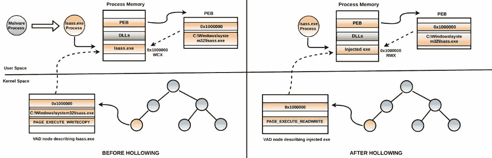对 Stuxnet 的完整分析，使用内存取证技术，由 Michael Hale Ligh 在以下博客文章中介绍：[`mnin.blogspot.in/2011/06/examining-stuxnets-footprint-in-memory.html`](http://mnin.blogspot.in/2011/06/examining-stuxnets-footprint-in-memory.html)。

# 2.2 检测空洞进程注入

要检测空洞进程注入，可以查看`PEB`和`VAD`之间的差异，以及内存保护的差异。还可以检查父子进程关系的差异。在下面的*Stuxnet*示例中，您可以看到系统上有两个`lsass.exe`进程正在运行。第一个`lsass.exe`进程（`pid 708`）的父进程是`winlogon.exe`（`pid 652`），而第二个`lsass.exe`进程（`pid 1732`）的父进程（`pid 1736`）已经终止。根据进程信息，您可以判断`pid 1732`的`lsass.exe`是可疑进程，因为在干净的系统中，`lsass.exe`的父进程在 Vista 之前的系统上是`winlogon.exe`，而在 Vista 及以后的系统上是`wininit.exe`：

```
$ python vol.py -f stux.vmem --profile=WinXPSP3x86 pslist | grep -i lsass
Volatility Foundation Volatility Framework 2.6
0x818c1558 lsass.exe 708 652 24 343 0 0 2016-05-10 06:47:24+0000 
0x81759da0 lsass.exe 1732 1736 5 86 0 0 2018-05-12 06:39:42

$ python vol.py -f stux.vmem --profile=WinXPSP3x86 pslist -p 652
Volatility Foundation Volatility Framework 2.6
Offset(V) Name          PID PPID Thds Hnds Sess Wow64  Start                
---------- ------------ ---- ---- ---- ---- --- ------ ------------------
0x818321c0 winlogon.exe 652  332  23  521    0      0  2016-05-10 06:47:24

$ python vol.py -f stux.vmem --profile=WinXPSP3x86 pslist -p 1736
Volatility Foundation Volatility Framework 2.6
ERROR : volatility.debug : Cannot find PID 1736\. If its terminated or unlinked, use psscan and then supply --offset=OFFSET
```

如前所述，通过比较`PEB`和`VAD`结构，您可以检测到空洞进程注入。`dlllist`插件从`PEB`中获取模块信息，显示了`lsass.exe`（`pid 1732`）的完整路径和其加载的基地址`(0x01000000)`：

```
lsass.exe pid: 1732
Command line : "C:\WINDOWS\\system32\\lsass.exe"
Service Pack 3

Base Size  Load    Count  Path
---------- ------- ------ -------------------------------
0x01000000 0x6000  0xffff C:\WINDOWS\system32\lsass.exe
0x7c900000 0xaf000 0xffff C:\WINDOWS\system32\ntdll.dll
0x7c800000 0xf6000 0xffff C:\WINDOWS\system32\kernel32.dll
0x77dd0000 0x9b000 0xffff C:\WINDOWS\system32\ADVAPI32.dll
[REMOVED]
```

`ldrmodules`插件依赖于内核中的 VAD，但没有显示`lsass.exe`的完整路径名称。由于恶意软件解除映射了`lsass.exe`进程的可执行部分，完整路径名称不再与地址`0x01000000`关联：

```
$ python vol.py -f stux.vmem --profile=WinXPSP3x86 ldrmodules -p 1732
Volatility Foundation Volatility Framework 2.6
Pid  Process   Base       InLoad InInit InMem    MappedPath
---- --------- ---------- ------ ------ ------ ----------------------------
[REMOVED]
1732 lsass.exe 0x7c900000 True  True   True   \WINDOWS\system32\ntdll.dll
1732 lsass.exe 0x71ad0000 True  True   True   \WINDOWS\system32\wsock32.dll
1732 lsass.exe 0x77f60000 True  True   True   \WINDOWS\system32\shlwapi.dll
1732 lsass.exe 0x01000000 True  False  True 
1732 lsass.exe 0x76b40000 True  True   True   \WINDOWS\system32\winmm.dll
[REMOVED]
```

由于恶意软件通常会在空洞化并注入可执行文件之前，分配具有`PAGE_EXECUTE_READWRITE`权限的内存，因此可以查找该内存保护。`malfind`插件在同一地址`(0x01000000)`识别到可疑的内存保护，这正是可执行文件`lsass.exe`被加载的地方：

```
Process: lsass.exe Pid: 1732 Address: 0x1000000
Vad Tag: Vad Protection: PAGE_EXECUTE_READWRITE
Flags: CommitCharge: 2, Protection: 6

0x01000000 4d 5a 90 00 03 00 00 00 04 00 00 00 ff ff 00 00 MZ..............
0x01000010 b8 00 00 00 00 00 00 00 40 00 00 00 00 00 00 00 ........@.......
0x01000020 00 00 00 00 00 00 00 00 00 00 00 00 00 00 00 00 ................
0x01000030 00 00 00 00 00 00 00 00 00 00 00 00 d0 00 00 00 ................

0x01000000 4d DEC EBP
0x01000001 5a POP EDX
0x01000002 90 NOP
```

如果您希望将`malfind`检测到的可疑内存区域转储到磁盘，您可以指定`-D`，后跟目录名，将所有可疑的内存区域转储到该目录。

# 2.3 空洞进程注入变种

在以下示例中，我们将介绍一个名为*Skeeyah*的恶意软件，它以略微不同的方式执行空洞进程注入。这是与第八章中介绍的相同样本，*代码注入和钩子（第 3.6 节 空洞进程注入）*。以下是*Skeeyah*执行的步骤：

+   它以挂起模式启动`svchost.exe`进程。结果，`svchost.exe`被加载到内存中（在此案例中，加载到地址`0x1000000`）。

+   它通过读取`PEB.ImageBaseAddress`确定`svchost.exe`的基地址，然后释放`svchost.exe`的可执行部分。

+   它并没有在`svchost.exe`之前加载的相同区域（`0x1000000`）分配内存，而是分配了一个不同的地址`0x00400000`，并且具有`read`、`write`和`execute`权限。

+   它随后用新分配的地址`0x00400000`覆盖了`svchost.exe`进程的`PEB.ImageBaseAdress`。这将`svchost.exe`在`PEB`中的基地址从`0x1000000`更改为`0x00400000`（该地址包含注入的可执行文件）。

+   然后，它将挂起线程的起始地址更改为注入的可执行文件入口点的地址，并恢复该线程。

下图显示了进程空洞化前后的差异。具体来说，空洞化后的 PEB 认为`svchost.exe`被加载到`0x00400000`。之前表示`svchost.exe`（加载地址为`0x1000000`）的`VAD`节点不再存在，因为当恶意软件将`svchost.exe`进程可执行文件空洞化时，相关的条目已从`VAD`树中移除：

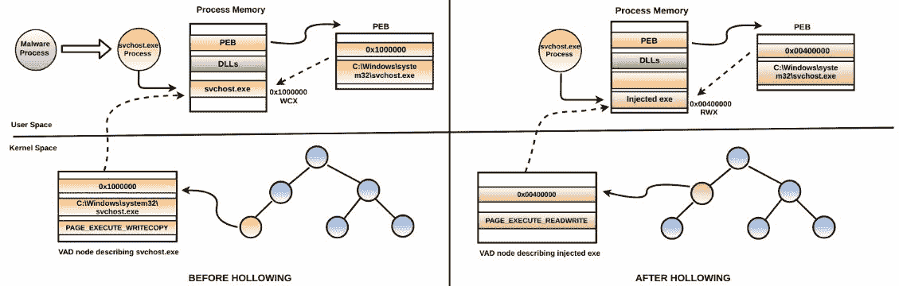

要检测这种空洞进程注入变种，可以遵循相同的方法论。根据空洞进程注入的执行方式，结果会有所不同。进程列表显示了多个`svchost.exe`进程实例，这是正常的。除了最后一个`svchost.exe (pid 1824)`，所有`svchost.exe`进程的父进程都是`services.exe`（`pid 696`）。在干净的系统上，所有`svchost.exe`进程都是由`services.exe`启动的。当你查看`svchost.exe`（`pid 1824`）的父进程时，你会发现其父进程已终止。根据进程信息，你可以判断最后一个`svchost.exe (pid 1824)`是可疑的：

```
$ python vol.py -f skeeyah.vmem --profile=WinXPSP3x86 pslist | grep -i svchost
Volatility Foundation Volatility Framework 2.6
0x815cfaa0 svchost.exe  876  696  20  202  0 0 2016-05-10 06:47:25
0x818c5a78 svchost.exe  960  696   9  227  0 0 2016-05-10 06:47:25
0x8181e558 svchost.exe 1044  696  68  1227 0 0 2016-05-10 06:47:25
0x818c7230 svchost.exe 1104  696   5  59   0 0 2016-05-10 06:47:25
0x81743da0 svchost.exe 1144  696  15  210  0 0 2016-05-10 06:47:25
0x817ba390 svchost.exe 1824 1768   1  26   0 0 2016-05-12 14:43:43

$ python vol.py -f skeeyah.vmem --profile=WinXPSP3x86 pslist -p 696
Volatility Foundation Volatility Framework 2.6
Offset(V)  Name         PID PPID Thds Hnds Sess Wow64  Start  
---------- ------------ --- ---- ---- ---- ---- ------ --------------------
0x8186c980 services.exe 696 652   16  264   0    0     2016-05-10 06:47:24

$ python vol.py -f skeeyah.vmem --profile=WinXPSP3x86 pslist -p 1768
Volatility Foundation Volatility Framework 2.6
ERROR : volatility.debug : Cannot find PID 1768\. If its terminated or unlinked, use psscan and then supply --offset=OFFSET
```

依赖于`PEB`的`dlllist`插件显示了`svchost.exe`（`pid 1824`）的完整路径，并报告基地址为`0x00400000`。

```
$ python vol.py -f skeeyah.vmem --profile=WinXPSP3x86 dlllist -p 1824
Volatility Foundation Volatility Framework 2.6
************************************************************************
svchost.exe pid: 1824
Command line : "C:\WINDOWS\system32\svchost.exe"
Service Pack 3

Base       Size    LoadCount  Path
---------- ------- ---------- ----------------------------------
0x00400000 0x7000   0xffff     C:\WINDOWS\system32\svchost.exe
0x7c900000 0xaf000  0xffff     C:\WINDOWS\system32\ntdll.dll
0x7c800000 0xf6000  0xffff     C:\WINDOWS\system32\kernel32.dll
[REMOVED]
```

另一方面，依赖于内核中的`VAD`的`ldrmodules`插件并未显示`svchost.exe`的任何条目，如下图所示：

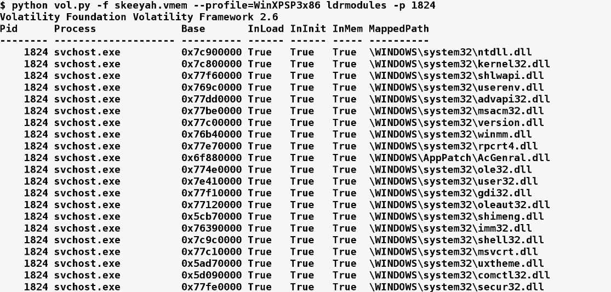

`malfind`显示在地址`0x00400000`存在一个 PE 文件，并且具有可疑的内存保护`PAGE_EXECUTE_READWRITE`，这表明该可执行文件是被注入的，而不是正常加载的：

```
$ python vol.py -f skeeyah.vmem --profile=WinXPSP3x86 malfind -p 1824
Volatility Foundation Volatility Framework 2.6
Process: svchost.exe Pid: 1824 Address: 0x400000
Vad Tag: VadS Protection: PAGE_EXECUTE_READWRITE
Flags: CommitCharge: 7, MemCommit: 1, PrivateMemory: 1, Protection: 6

0x00400000 4d 5a 90 00 03 00 00 00 04 00 00 00 ff ff 00 00 MZ..............
0x00400010 b8 00 00 00 00 00 00 00 40 00 00 00 00 00 00 00 ........@.......
0x00400020 00 00 00 00 00 00 00 00 00 00 00 00 00 00 00 00 ................
0x00400030 00 00 00 00 00 00 00 00 00 00 00 00 e0 00 00 00 ................

0x00400000 4d DEC EBP
0x00400001 5a POP EDX
[REMOVED]
```

攻击者使用不同变种的空洞进程注入来绕过、偏转和转移取证分析。有关这些规避技术的详细信息，以及如何使用自定义 Volatility 插件来检测它们，请观看作者在 Black Hat 上的演讲：*“恶意软件作者不希望你知道的——空洞进程注入的规避技巧”*（[`youtu.be/9L9I1T5QDg4`](https://youtu.be/9L9I1T5QDg4)）。另外，你也可以阅读作者的博客文章，链接如下：[`cysinfo.com/detecting-deceptive-hollowing-techniques/`](https://cysinfo.com/detecting-deceptive-hollowing-techniques/)

# 3. 检测 API 钩子

在将恶意代码注入目标进程后，恶意软件可以挂钩目标进程的 API 调用，以控制其执行路径并将其重定向到恶意代码。挂钩技术的详细内容在第八章中讨论，*代码注入与挂钩*（在*挂钩技术*部分）。在本节中，我们将主要关注如何使用内存取证技术检测此类挂钩技术。为了识别进程和内核内存中的 API 挂钩，可以使用 `apihooks` Volatility 插件。在以下*Zeus bot*的示例中，一个可执行文件被注入到 `explorer.exe` 进程的内存中，地址为 `0x2c70000`，这一点通过 `malfind` 插件检测到：

```
$ python vol.py -f zeus.vmem --profile=Win7SP1x86 malfind

Process: explorer.exe Pid: 1608 Address: 0x2c70000
Vad Tag: Vad Protection: PAGE_EXECUTE_READWRITE
Flags: Protection: 6

0x02c70000 4d 5a 00 00 00 00 00 00 00 00 00 00 00 00 00 00 MZ..............
0x02c70010 00 00 00 00 00 00 00 00 00 00 00 00 00 00 00 00 ................
0x02c70020 00 00 00 00 00 00 00 00 00 00 00 00 00 00 00 00 ................
0x02c70030 00 00 00 00 00 00 00 00 00 00 00 00 d8 00 00 00 ................
```

在以下输出中，`apihooks` 插件检测到用户模式 API `HttpSendRequestA`（在 `wininet.dll` 中）的挂钩。被挂钩的 API 随后被重定向到地址 `0x2c7ec48`（挂钩地址）。挂钩地址位于注入的可执行文件（挂钩模块）的地址范围内。挂钩模块的名称未知，因为它通常不是从磁盘加载的（而是被注入的）。具体来说，在 API 函数 `HttpSendRequestA` 的起始地址（`0x753600fc`）处，有一条跳转指令，将 `HttpSendRequestA` 的执行流重定向到注入可执行文件中的地址 `0x2c7ec48`：

```
$ python vol.py -f zeus.vmem --profile=Win7SP1x86 apihooks -p 1608

Hook mode: Usermode
Hook type: Inline/Trampoline
Process: 1608 (explorer.exe)
Victim module: wininet.dll (0x752d0000 - 0x753c4000)
Function: wininet.dll!HttpSendRequestA at 0x753600fc
Hook address: 0x2c7ec48
Hooking module: <unknown>

Disassembly(0):
0x753600fc e947eb918d   JMP 0x2c7ec48
0x75360101 83ec38       SUB ESP, 0x38
0x75360104 56           PUSH ESI
0x75360105 6a38         PUSH 0x38
0x75360107 8d45c8       LEA EAX, [EBP-0x38]
```

# 4\. 内核模式根套件

像根套件这样的恶意程序可以加载一个内核驱动程序，在内核模式下运行代码。一旦它在内核空间中运行，就可以访问操作系统的内部代码，监控系统事件，通过修改内部数据结构、挂钩函数和修改调用表来规避检测。内核模式驱动程序通常具有 `.sys` 扩展名，并驻留在 `%windir%\system32\drivers` 目录下。内核驱动程序通常通过创建一个*内核驱动程序服务*（如第七章中描述的，恶意软件功能与持久性，*在*服务*部分）来加载。

Windows 实施了各种安全机制，旨在防止内核空间中未经授权的代码执行。这使得 rootkit 难以安装内核驱动程序。在 64 位 Windows 上，微软实施了*内核模式代码签名（KMCS）*，要求内核模式驱动程序在加载到内存中时必须经过数字签名。另一个安全机制是*内核补丁保护（KPP）*，也称为*PatchGuard*，它防止对核心系统组件、数据结构和调用表（如 SSDT、IDT 等）的修改。这些安全机制对大多数 rootkit 有效，但同时迫使攻击者提出先进技术，使他们能够安装未签名驱动程序并绕过这些安全机制。一种方法是安装*Bootkit*。Bootkit 感染系统启动过程的早期阶段，甚至在操作系统完全加载之前。另一种方法是利用内核或第三方驱动程序的漏洞来安装未签名驱动程序。在本章的其余部分，我们将假设攻击者已经成功安装了内核模式驱动程序（使用*Bootkit*或利用内核级漏洞），并且我们将专注于内核内存取证，这涉及识别恶意驱动程序。

在一个干净的 Windows 系统上，你会发现数百个内核模块，因此找到恶意内核模块需要一些工作。在接下来的章节中，我们将看一些常见的定位和提取恶意内核模块的技术。我们将从列出内核模块开始。

# 5\. 列出内核模块

要列出内核模块，你可以使用`modules`插件。该插件依赖于遍历由`PsLoadedModuleList`指向的元数据结构（`KLDR_DATA_TABLE_ENTRY`）的双向链表（这种技术类似于遍历`_EPROCESS`结构的双向链表，如第十章*，使用内存取证猎杀恶意软件*，在*理解 ActiveProcessLinks*部分中描述）。列出内核模块可能并不总是帮助你从加载的数百个内核模块中识别出恶意内核驱动程序，但它可以用于发现可疑指标，例如内核驱动程序具有奇怪的名称，或者内核模块从非标准路径或临时路径加载。`modules`插件按照加载顺序列出内核模块，这意味着如果最近安装了 rootkit 驱动程序，你很可能会在列表的末尾找到该模块，前提是该模块没有被隐藏并且在获取内存镜像之前系统没有重新启动。

在下面的受*Laqma* rootkit 感染的内存映像示例中，模块列表显示了位于列表末尾的恶意驱动程序*Laqma*的`lanmandrv.sys`，该驱动程序来自`C:\Windows\System32`目录，而大多数其他内核驱动程序则加载自`*S*ystemRoot\System32\DRIVERS\`*。从列表中还可以看到，核心操作系统组件，如 NT 内核模块（`ntkrnlpa.exe`或`ntoskrnl.exe`）和硬件抽象层（`hal.dll`）最先加载，然后是启动驱动程序（如`kdcom.dll`），它们会在启动时自动启动，接着是其他驱动程序：

```
$ python vol.py -f laqma.vmem --profile=Win7SP1x86 modules
Volatility Foundation Volatility Framework 2.6
Offset(V)  Name          Base       Size     File
---------- ------------  ---------- -------- ---------------------------------
0x84f41c98 ntoskrnl.exe 0x8283d000 0x410000 \SystemRoot\system32\ntkrnlpa.exe
0x84f41c20 hal.dll      0x82806000 0x37000  \SystemRoot\system32\halmacpi.dll
0x84f41ba0 kdcom.dll    0x80bc5000 0x8000   \SystemRoot\system32\kdcom.dll
[REMOVED]
0x86e36388 srv2.sys     0xa46e1000 0x4f000  \SystemRoot\System32\DRIVERS\srv2.sys
0x86ed6d68 srv.sys      0xa4730000 0x51000  \SystemRoot\System32\DRIVERS\srv.sys
0x86fe8f90 spsys.sys    0xa4781000 0x6a000  \SystemRoot\system32\drivers\spsys.sys
0x861ca0d0 lanmandrv.sys 0xa47eb000 0x2000  \??\C:\Windows\System32\lanmandrv.sys
```

由于遍历双向链表容易受到 DKOM 攻击（详见第十章*，《使用内存取证狩猎恶意软件》第 4.2.1 节 直接内核对象操作（DKOM）*），因此可以通过解除链接来隐藏内核驱动程序。为了解决这个问题，可以使用另一个名为`modscan`的插件。`modscan`插件依赖于池标签扫描方法（详见[第十章](https://cdp.packtpub.com/learning_malware_analysis/wp-admin/post.php?post=1250&action=edit#post_1143)*，《使用内存取证狩猎恶意软件》**第 4.2.2 节 理解池标签扫描*）。换句话说，它扫描物理地址空间，寻找与内核模块相关的池标签（`MmLd`）。通过池标签扫描，它可以检测到未链接的模块和先前加载的模块。`modscan`插件按照在物理地址空间中找到的顺序显示内核模块，而不是按加载顺序显示。在下面的*Necurs* rootkit 示例中，`modscan`插件显示了恶意内核驱动程序（`2683608180e436a1.sys`），其名称完全由十六进制字符组成：

```
$ python vol.py -f necurs.vmem --profile=Win7SP1x86 modscan
Volatility Foundation Volatility Framework 2.6
Offset(P)          Name                 Base       Size   File
------------------ -------------------- ---------- ------ --------
0x0000000010145130 Beep.SYS             0x880f2000 0x7000 \SystemRoot\System32\Drivers\Beep.SYS
0x000000001061bad0 secdrv.SYS           0xa46a9000 0xa000 \SystemRoot\System32\Drivers\secdrv.SYS
0x00000000108b9120 rdprefmp.sys         0x88150000 0x8000 \SystemRoot\system32\drivers\rdprefmp.sys
0x00000000108b9b10 USBPORT.SYS          0x9711e000 0x4b000 \SystemRoot\system32\DRIVERS\USBPORT.SYS
0x0000000010b3b4a0 rdbss.sys            0x96ef6000 0x41000 \SystemRoot\system32\DRIVERS\rdbss.sys
[REMOVED]
0x000000001e089170 2683608180e436a1.sys 0x851ab000 0xd000 \SystemRoot\System32\Drivers\2683608180e436a1.sys
0x000000001e0da478 usbccgp.sys          0x9700b000 0x17000 \SystemRoot\system32\DRIVERS\usbccgp.sys
```

当你运行`modules`插件来检查受*Necurs* rootkit 感染的内存映像时，它不会显示那个恶意驱动程序（`2683608180e436a1.sys`）：

```
$ python vol.py -f necurs.vmem --profile=Win7SP1x86 modules | grep 2683608180e436a1
```

由于`modscan`使用池标签扫描方法，可以检测已卸载的模块（前提是内存没有被覆盖），因此恶意驱动程序`2683608180e436a1.sys`可能已经被快速加载和卸载，或者它被隐藏了。为了确认驱动程序是否已卸载或隐藏，你可以使用`unloadedmodules`插件，它会显示已卸载模块的列表以及每个模块被卸载的时间。在以下输出中，恶意驱动程序`2683608180e436a1.sys`的缺失表明该驱动程序未被卸载，它被隐藏了。从以下输出中，你可以看到另一个恶意驱动程序`2b9fb.sys`，它曾被快速加载和卸载（在`modules`和`modscan`列出的模块中没有显示，如以下代码所示）。`unloadedmodules`插件在调查过程中可以证明有用，帮助检测 rootkit 快速加载和卸载驱动程序的尝试，以使其不出现在模块列表中：

```
$ python vol.py -f necurs.vmem --profile=Win7SP1x86 unloadedmodules
Volatility Foundation Volatility Framework 2.6
Name              StartAddress EndAddress Time
----------------- ------------ ---------- -------------------
dump_dumpfve.sys  0x00880bb000 0x880cc000 2016-05-11 12:15:08 
dump_LSI_SAS.sys  0x00880a3000 0x880bb000 2016-05-11 12:15:08 
dump_storport.sys 0x0088099000 0x880a3000 2016-05-11 12:15:08 
parport.sys       0x0094151000 0x94169000 2016-05-11 12:15:09 
2b9fb.sys         0x00a47eb000 0xa47fe000 2018-05-21 10:57:52 

$ python vol.py -f necurs.vmem --profile=Win7SP1x86 modules | grep -i 2b9fb.sys
$ python vol.py -f necurs.vmem --profile=Win7SP1x86 modscan | grep -i 2b9fb.sys
```

# 5.1 使用 driverscan 列出内核模块

列出内核模块的另一种方法是使用`driverscan`插件，如以下代码所示。`driverscan`插件从名为`DRIVER_OBJECT`的结构中获取与内核模块相关的信息。具体来说，`driverscan`插件通过池标签扫描来查找物理地址空间中的驱动程序对象。第一列`Offset(P)`指定了找到`DRIVER_OBJECT`结构的物理地址，第二列`Start`包含模块的基地址，`Driver Name`列显示驱动程序的名称。例如，驱动程序名称`\Driver\Beep`与`Beep.sys`相同，最后一行显示与*Necurs* rootkit 相关的恶意驱动程序`\Driver\2683608180e436a1`。`driverscan`插件是列出内核模块的另一种方法，当 rootkit 试图隐藏在`modules`和`modscan`插件下时，这种方法非常有用：

```
$ python vol.py -f necurs.vmem --profile=Win7SP1x86 driverscan
Volatility Foundation Volatility Framework 2.6
Offset(P)           Start     Size   Service Key  Name   Driver Name
------------------ --------  ------- ----------- ------ -----------
0x00000000108b9030 0x88148000 0x8000  RDPENCDD  RDPENCDD \Driver\RDPENCDD
0x00000000108b9478 0x97023000 0xb7000 DXGKrnl   DXGKrnl  \Driver\DXGKrnl
0x00000000108b9870 0x88150000 0x8000  RDPREFMP  RDPREFMP \Driver\RDPREFMP
0x0000000010b3b1d0 0x96ef6000 0x41000 rdbss     rdbss    \FileSystem\rdbss
0x0000000011781188 0x88171000 0x17000 tdx       tdx      \Driver\tdx
0x0000000011ff6a00 0x881ed000 0xd000  kbdclass  kbdclass \Driver\kbdclass
0x0000000011ff6ba0 0x880f2000 0x7000  Beep      Beep     \Driver\Beep
[REMOVED]
0x000000001e155668 0x851ab000 0xd000 2683608180e436a1 26836...36a1 \Driver\2683608180e436a1
```

要使用内核调试器（Windbg）列出内核模块，使用`lm k`命令，如下所示。要获取详细输出，可以使用`lm kv`命令：

```
kd> lm k
start end module name
80bb4000 80bbc000 kdcom (deferred) 
82a03000 82a3a000 hal (deferred) 
82a3a000 82e56000 nt (pdb symbols)
8b200000 8b20e000 WDFLDR (deferred) 
8b20e000 8b22a800 vmhgfs (deferred) 
8b22b000 8b2b0000 mcupdate_GenuineIntel (deferred) 
8b2b0000 8b2c1000 PSHED (deferred) 
8b2c1000 8b2c9000 BOOTVID (deferred) 
8b2c9000 8b30b000 CLFS (deferred) 
[REMOVED]
```

一旦你识别出恶意内核模块，你可以使用`moddump`插件将其从内存转储到磁盘。要将模块转储到磁盘，你需要指定模块的基地址，可以通过`modules`、`modscan`或`driverscan`插件获取。以下示例中，*Necurs rootkit*的恶意驱动程序通过其基地址转储到磁盘，如下所示：

```
$ python vol.py -f necurs.vmem --profile=Win7SP1x86 moddump -b 0x851ab000 -D dump/
Volatility Foundation Volatility Framework 2.6
Module Base   Module Name      Result
-----------  --------------    ------
0x0851ab000    UNKNOWN         OK: driver.851ab000.sys
```

# 6. I/O 处理

在讨论`driverscan`插件时，我曾提到`driverscan`从`DRIVER_OBJECT`结构中获取模块信息。你是不是在想`DRIVER_OBJECT`结构是什么？这个问题很快就会清楚。在本节中，你将理解用户模式与内核模式组件之间的交互、设备驱动程序的作用以及它与 I/O 管理器的交互。通常，rootkit 包括一个用户模式组件（EXE 或 DLL）和一个内核模式组件（设备驱动程序）。rootkit 的用户模式组件通过特定机制与内核模式组件进行通信。从取证角度来看，理解这些通信是如何工作的以及涉及的组件非常重要。本节将帮助你理解这种通信机制，并为接下来的主题打下基础。

让我们尝试理解当用户模式应用程序执行输入/输出（I/O）操作时发生了什么，以及它在高层次上是如何处理的。在讨论第八章中的 API 调用流程时，*代码注入与钩取*（在*Windows API 调用流程*部分），我用一个用户模式应用程序通过`WriteFile()` API 执行写操作的例子，这最终会调用内核执行中的`NtWriteFile()`系统服务例程`(ntoskrnl.exe)`，然后将请求指引给 I/O 管理器，接着 I/O 管理器请求设备驱动程序执行 I/O 操作。在这里，我将再次回顾这个话题，提供更多细节，并重点强调内核空间组件（主要是设备驱动程序和 I/O 管理器）。以下图示说明了写请求的流程（其他类型的 I/O 请求，如读取，也类似；它们只使用不同的 API）：

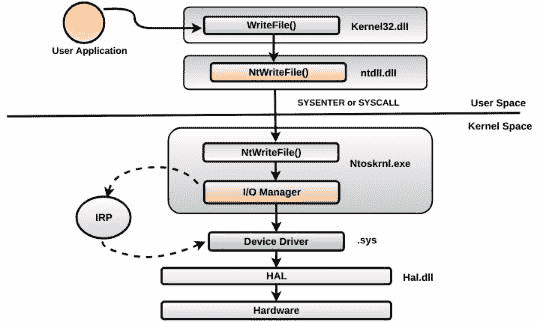

以下几点讨论了设备驱动程序和 I/O 管理器在高层次的作用：

1.  设备驱动程序通常会创建一个或多个设备，并指定它可以处理的操作类型（打开、读取和写入）。它还指定了处理这些操作的例程地址。这些例程被称为分发例程或 IRP 处理程序。

1.  创建设备后，驱动程序会发布该设备，以便用户模式应用程序可以访问。

1.  用户模式的应用程序可以使用 API 调用，如`CreateFile`，打开已公开的设备句柄，并使用`ReadFile`和`WriteFile` API 在设备上执行 I/O 操作，如读取和写入。用于执行文件 I/O 操作的 API，如`CreateFile`、`ReadWrite`和`WriteFile`，也适用于设备。这是因为设备被视为虚拟文件。

1.  当用户模式应用程序在广告设备上执行 I/O 操作时，请求将被路由到 I/O 管理器。 I/O 管理器确定处理设备的驱动程序，并请求驱动程序通过传递 IRP（I/O 请求数据包）来完成操作。 IRP 是一个包含执行操作和 I/O 操作所需缓冲区信息的数据结构。

驱动程序读取 IRP，验证它，并在通知 I/O 管理器有关操作状态之前完成请求的操作。 然后，I/O 管理器将状态和数据返回给用户应用程序。

在这个阶段，前面的内容可能对您来说很陌生，但不要让它让您灰心：当您完成本节时，一切将变得清晰。 接下来，我们将看一下设备驱动程序的作用，然后是 I/O 管理器的作用。

# 6.1 设备驱动程序的作用

当驱动程序加载到系统中时，I/O 管理器会创建一个驱动程序对象（`DRIVER_OBJECT`结构）。 然后，I/O 管理器通过将指向`DRIVER_OBJECT`结构的指针作为参数调用驱动程序的初始化例程`DriverEntry`（类似于`main()`或`WinMain()`函数）。 驱动程序对象（`DRIVER_OBJECT`结构）代表系统上的一个驱动程序。 `DriverEntry`例程将使用`DRIVER_OBJECT`来填充具有处理特定 I/O 请求的驱动程序各种入口点的结构。 通常，在`DriverEntry`例程中，驱动程序会使用一个名为`IoCreateDevice`或`IoCreateDevice-Secure`的 API 创建代表逻辑或物理设备的设备对象（`DEVICE_OBJECT`结构）。 当驱动程序创建设备对象时，可以选择为设备分配名称，也可以创建多个设备。 创建设备后，将更新指向第一个创建的设备的指针在驱动程序对象中。 为了帮助您更好地理解这一点，让我们列出加载的内核模块，并查看一个简单内核模块的驱动程序对象。 作为示例，我们将检查`null.sys`内核驱动程序。 根据微软文档，Null 设备驱动程序提供了 Unix 环境中`\dev\null`的功能等效物。 当系统在内核初始化阶段启动时，`null.sys`被加载到系统中。 在内核模块列表中，您可以看到`null.sys`加载在基地址`8bcde000`处：

```
kd> lm k
start end module name
80ba2000 80baa000 kdcom (deferred) 
81e29000 81e44000 luafv (deferred) 
[REMOVED]
8bcde000 8bce5000 Null (deferred)
```

由于`null.sys`已经加载，在驱动程序初始化过程中，它的驱动对象（`DRIVER_OBJECT`结构）将会填充元数据。在驱动程序对象中查看它包含什么信息。你可以使用`!drvobj`扩展命令显示驱动程序对象信息。从以下输出可以看到，表示`null.sys`的驱动对象位于地址`86a33180`。`Device Object list`下的`86aa2750`是指向由`null.sys`创建的设备对象的指针。如果驱动程序创建了多个设备，你将会在`Device Object list`下看到多个条目：

```
kd> !drvobj Null
Driver object (86a33180) is for:
 \Driver\Null
Driver Extension List: (id , addr)

Device Object list:
86aa2750
```

你可以使用驱动程序对象地址`86a33180`来通过`dt (display type)`命令检查`null.sys`的`_DRIVER_OBJECT`结构。从以下输出可以看到，`DriverStart`字段包含驱动程序的基地址（`0x8bcde000`），`DriverSize`字段包含`driver(0x7000)`的大小，`Drivername`是驱动对象的名称（`\Driver\Null`）。`DriverInit`字段保存指向*驱动初始化例程*（`DriverEntry`）的指针。`DriverUnload`字段包含指向驱动程序卸载例程的指针，该例程通常会在卸载过程中释放驱动程序创建的资源。`MajorFunction`字段是最重要的字段之一，它指向一个包含 28 个主要功能指针的表。这个表将会填充调度例程的地址，我们将在本节稍后查看`MajorFunction`表。前面讲到的`driverscan`插件会对驱动程序对象执行池标签扫描，并通过读取这些字段中的某些信息获取与内核模块相关的信息，如基地址、大小和驱动程序名称：

```
kd> dt nt!_DRIVER_OBJECT 86a33180
   +0x000 Type : 0n4
   +0x002 Size : 0n168
   +0x004 DeviceObject : 0x86aa2750 _DEVICE_OBJECT
   +0x008 Flags : 0x12
   +0x00c DriverStart : 0x8bcde000 Void
   +0x010 DriverSize : 0x7000
   +0x014 DriverSection : 0x86aa2608 Void
   +0x018 DriverExtension : 0x86a33228 _DRIVER_EXTENSION
   +0x01c DriverName : _UNICODE_STRING "\Driver\Null"
   +0x024 HardwareDatabase : 0x82d86270 _UNICODE_STRING "\REGISTRY\MACHINE\HARDWARE\DESCRIPTION\SYSTEM"
   +0x028 FastIoDispatch : 0x8bce0000 _FAST_IO_DISPATCH
   +0x02c DriverInit : 0x8bce20bc long Null!GsDriverEntry+0
   +0x030 DriverStartIo : (null) 
   +0x034 DriverUnload : 0x8bce1040 void Null!NlsUnload+0
   +0x038 MajorFunction : [28] 0x8bce107c
```

`DRIVER_OBJECT`结构中的`DeviceObject`字段包含指向驱动程序（`null.sys`）创建的设备对象的指针。你可以使用设备对象地址`0x86aa2750`来确定驱动程序创建的设备的名称。在本例中，`Null`是由驱动程序`null.sys`创建的设备名称：

```
kd> !devobj 86aa2750
Device object (86aa2750) is for:
 Null \Driver\Null DriverObject 86a33180
Current Irp 00000000 RefCount 0 Type 00000015 Flags 00000040
Dacl 8c667558 DevExt 00000000 DevObjExt 86aa2808 
ExtensionFlags (0x00000800) DOE_DEFAULT_SD_PRESENT
Characteristics (0x00000100) FILE_DEVICE_SECURE_OPEN
Device queue is not busy.
```

你也可以通过在`display type (dt)`命令后面指定设备对象地址来查看实际的`DEVICE_OBJECT`结构，如下所示的代码。如果驱动程序创建了多个设备，那么`DEVICE_OBJECT`结构中的`NextDevice`字段将指向下一个设备对象。由于`null.sys`驱动程序只创建了一个设备，`NextDevice`字段被设置为`null`：

```
kd> dt nt!_DEVICE_OBJECT 86aa2750
   +0x000 Type : 0n3
   +0x002 Size : 0xb8
   +0x004 ReferenceCount : 0n0
   +0x008 DriverObject : 0x86a33180 _DRIVER_OBJECT
   +0x00c NextDevice : (null) 
   +0x010 AttachedDevice : (null) 
   +0x014 CurrentIrp : (null) 
   +0x018 Timer : (null) 
   +0x01c Flags : 0x40
   +0x020 Characteristics : 0x100
   +0x024 Vpb : (null) 
   +0x028 DeviceExtension : (null) 
   +0x02c DeviceType : 0x15
   +0x030 StackSize : 1 ''
   [REMOVED]
```

从上面的输出可以看到，`DEVICE_OBJECT`包含一个`DriverObject`字段，它指向回驱动程序对象。换句话说，可以通过设备对象确定相关联的驱动程序。这就是 I/O 管理器如何在收到特定设备的 I/O 请求时，确定关联的驱动程序的方式。这个概念可以通过以下图示来可视化：

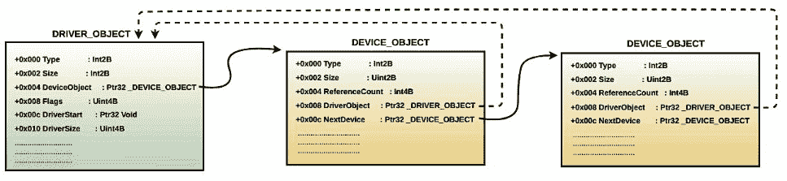

你可以使用像 *DeviceTree* ([`www.osronline.com/article.cfm?article=97`](http://www.osronline.com/article.cfm?article=97)) 这样的图形界面工具来查看驱动程序创建的设备。以下是该工具显示 `null.sys` 驱动程序创建的 `Null` 设备的截图：

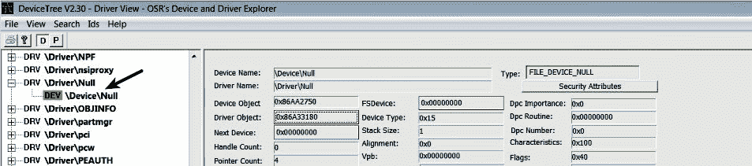

当驱动程序创建一个设备时，设备对象会被放置在 Windows 对象管理器的命名空间中的 `\Device` 目录下。要查看对象管理器的命名空间信息，可以使用 *WinObj* 工具 ([`docs.microsoft.com/en-us/sysinternals/downloads/winobj`](https://docs.microsoft.com/en-us/sysinternals/downloads/winobj))。以下截图显示了由 `null.sys` 在 `\Device` 目录下创建的设备（`Null`）。你还可以看到其他驱动程序创建的设备：

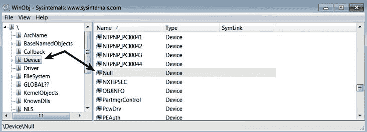

创建在 `\Device` 目录下的设备对于用户模式下运行的应用程序是不可访问的。换句话说，如果一个用户模式应用程序想要对设备执行 I/O 操作，它不能通过将设备名称（如 `\Device\Null`）作为参数传递给 `CreateFile` 函数来直接打开设备句柄。`CreateFile` 函数不仅用于创建或打开文件，还可以用于打开设备句柄。如果用户模式应用程序无法访问设备，那它如何执行 I/O 操作呢？为了使设备对用户模式应用程序可访问，驱动程序需要宣传该设备。这可以通过为设备创建一个符号链接来实现。驱动程序可以使用内核 API `IoCreateSymbolicLink` 来创建符号链接。当为设备（如 `\Device\Null`）创建符号链接时，你可以在对象管理器命名空间中的 `\GLOBAL??` 目录下找到它，也可以使用 *WinObj* 工具查看。以下截图中，你可以看到 `NUL` 是由 `null.sys` 驱动程序为 `\Device\Null` 设备创建的符号链接名称：

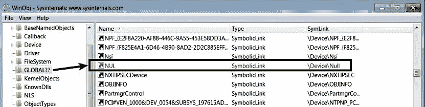

符号链接也被称为 MS-DOS 设备名称。用户模式应用程序可以直接使用符号链接的名称（MS-DOS 设备名称）来通过约定 `\\.\<symboliclink name>` 打开设备的句柄。例如，要打开 `\Device\Null` 的句柄，用户模式应用程序只需将 `\\.\NUL` 作为第一个参数（`lpFilename`）传递给 `CreateFile` 函数，该函数会返回设备的文件句柄。具体来说，在对象管理器的 `GLOBAL??` 目录下的任何符号链接都可以通过 `CreateFile` 函数打开。如下面的截图所示，`C:` 盘符仅仅是 `\Device\HarddiskVolume1` 的符号链接。在 Windows 中，I/O 操作是在虚拟文件上执行的。换句话说，设备、目录、管道和文件都被视为虚拟文件（可以通过 `CreateFile` 函数打开）：

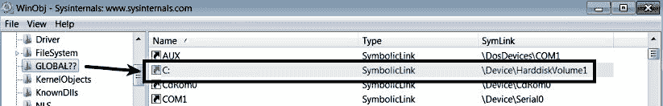

此时，你已经知道驱动程序在初始化过程中会创建设备，并通过符号链接向用户应用程序宣传它。现在，问题是，驱动程序如何告诉 I/O 管理器它支持哪些类型的操作（如打开、读取、写入等）？在初始化过程中，驱动程序通常会做的另一件事是更新`Major function table（分派例程数组）`，并将分派例程的地址填充到`DRIVER_OBJECT`结构中。检查主要功能表将帮助你了解驱动程序支持哪些操作（如打开、读取、写入等）以及与特定操作相关的分派例程地址。主要功能表是一个包含`28`个函数指针的数组；索引值`0`到`27`表示特定操作。例如，索引值`0`对应于主要功能代码`IRP_MJ_CREATE`，索引值`3`对应于主要功能代码`IRP_MJ_READ`，依此类推。换句话说，如果应用程序想要打开文件或设备对象的句柄，请求将被发送给 I/O 管理器，然后 I/O 管理器使用`IRP_MJ_CREATE`主要功能代码作为索引查找主要功能表中的分派例程地址，来处理该请求。对于读取操作，也是同样的方式，使用`IRP_MJ_READ`作为索引来确定分派例程的地址。

以下`!drvobj`命令显示由`null.sys`驱动程序填充的分派例程数组。对于驱动程序不支持的操作，会指向`ntoskrnl.exe`（`nt`）中的`IopInvalidDeviceRequest`。根据这些信息，你可以知道`null.sys`仅支持`IRP_MJ_CREATE`（打开）、`IRP_MJ_CLOSE`（关闭）、`IRP_MJ_READ`（读取）、`IRP_MJ_WRITE`（写入）、`IRP_MJ_QUERY_INFORMATION`（查询信息）和`IRP_MJ_LOCK_CONTROL`（锁控制）操作。任何请求执行这些支持的操作将会被分派到适当的分派例程。例如，当用户应用程序执行`write`操作时，写入设备的请求会被分派到`null.sys`驱动程序卸载例程中的`MajorFunction[IRP_MJ_WRITE]`函数，该函数位于地址`8bce107c`。在`null.sys`的情况下，所有支持的操作都被分派到相同的地址`8bce107c`。通常情况下，情况并非如此；你会看到处理不同操作的不同例程地址：

```
kd> !drvobj Null 2
Driver object (86a33180) is for:
 \Driver\Null
DriverEntry: 8bce20bc Null!GsDriverEntry
DriverStartIo: 00000000 
DriverUnload: 8bce1040 Null!NlsUnload
AddDevice: 00000000 

Dispatch routines:
[00] IRP_MJ_CREATE                   8bce107c Null!NlsUnload+0x3c
[01] IRP_MJ_CREATE_NAMED_PIPE        82ac5fbe nt!IopInvalidDeviceRequest
[02] IRP_MJ_CLOSE                    8bce107c Null!NlsUnload+0x3c
[03] IRP_MJ_READ                     8bce107c Null!NlsUnload+0x3c
[04] IRP_MJ_WRITE                    8bce107c Null!NlsUnload+0x3c
[05] IRP_MJ_QUERY_INFORMATION        8bce107c Null!NlsUnload+0x3c
[06] IRP_MJ_SET_INFORMATION          82ac5fbe nt!IopInvalidDeviceRequest
[07] IRP_MJ_QUERY_EA                 82ac5fbe nt!IopInvalidDeviceRequest
[08] IRP_MJ_SET_EA                   82ac5fbe nt!IopInvalidDeviceRequest
[09] IRP_MJ_FLUSH_BUFFERS            82ac5fbe nt!IopInvalidDeviceRequest
[0a] IRP_MJ_QUERY_VOLUME_INFORMATION 82ac5fbe nt!IopInvalidDeviceRequest
[0b] IRP_MJ_SET_VOLUME_INFORMATION   82ac5fbe nt!IopInvalidDeviceRequest
[0c] IRP_MJ_DIRECTORY_CONTROL        82ac5fbe nt!IopInvalidDeviceRequest
[0d] IRP_MJ_FILE_SYSTEM_CONTROL      82ac5fbe nt!IopInvalidDeviceRequest
[0e] IRP_MJ_DEVICE_CONTROL           82ac5fbe nt!IopInvalidDeviceRequest
[0f] IRP_MJ_INTERNAL_DEVICE_CONTROL  82ac5fbe nt!IopInvalidDeviceRequest
[10] IRP_MJ_SHUTDOWN                 82ac5fbe nt!IopInvalidDeviceRequest
[11] IRP_MJ_LOCK_CONTROL             8bce107c Null!NlsUnload+0x3c
[12] IRP_MJ_CLEANUP                  82ac5fbe nt!IopInvalidDeviceRequest
[13] IRP_MJ_CREATE_MAILSLOT          82ac5fbe nt!IopInvalidDeviceRequest
[14] IRP_MJ_QUERY_SECURITY           82ac5fbe nt!IopInvalidDeviceRequest
[15] IRP_MJ_SET_SECURITY             82ac5fbe nt!IopInvalidDeviceRequest
[16] IRP_MJ_POWER                    82ac5fbe nt!IopInvalidDeviceRequest
[17] IRP_MJ_SYSTEM_CONTROL           82ac5fbe nt!IopInvalidDeviceRequest
[18] IRP_MJ_DEVICE_CHANGE            82ac5fbe nt!IopInvalidDeviceRequest
[19] IRP_MJ_QUERY_QUOTA              82ac5fbe nt!IopInvalidDeviceRequest
[1a] IRP_MJ_SET_QUOTA                82ac5fbe nt!IopInvalidDeviceRequest
[1b] IRP_MJ_PNP                      82ac5fbe nt!IopInvalidDeviceRequest 
```

你也可以在*DeviceTree*工具中查看支持的操作，如以下截图所示：

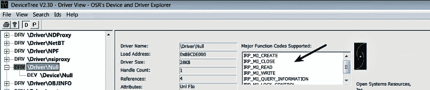

到此为止，你已经知道驱动程序创建设备，将其广告宣传以供用户应用程序使用，并且还更新了调度例程数组（主要功能表），告知 I/O 管理器它支持的操作。现在，让我们来看一下 I/O 管理器的作用，并了解从用户应用程序接收到的 I/O 请求是如何调度到驱动程序的。

# 6.2 I/O 管理器的作用

当 I/O 请求到达 I/O 管理器时，I/O 管理器定位驱动程序并创建一个 `IRP（I/O 请求包）`，它是一个包含描述 I/O 请求信息的数据结构。对于读取、写入等操作，I/O 管理器创建的 IRP 还包含一个内核内存中的缓冲区，用于驱动程序存储从设备读取的数据或写入设备的数据。I/O 管理器创建的 IRP 随后传递给正确的驱动程序调度例程。驱动程序接收 IRP，IRP 中包含描述要执行的操作（如打开、读取或写入）的主要功能代码（`IRP_MJ_XXX`）。在启动 I/O 操作之前，驱动程序会进行检查，以确保一切正常（例如，提供的读取或写入操作的缓冲区足够大），然后启动 I/O 操作。如果需要对硬件设备执行 I/O 操作，驱动程序通常会经过 HAL 例程。工作完成后，驱动程序将 IRP 返回给 I/O 管理器，告诉它请求的 I/O 操作已完成，或者因为 IRP 必须传递给驱动程序堆栈中的另一个驱动程序进行进一步处理。I/O 管理器在任务完成时释放 IRP，或者将 IRP 传递给设备堆栈中的下一个驱动程序以完成 IRP。任务完成后，I/O 管理器将状态和数据返回给用户模式应用程序。

到此为止，你应该已经理解了 I/O 管理器的作用。有关 I/O 系统和设备驱动程序的详细信息，请参考 Pavel Yosifovich、Alex Ionescu、Mark E. Russinovich 和 David A. Solomon 所著的《*Windows Internals, Part 1: 第七版*》一书。

# 6.3 与设备驱动程序的通信

现在，让我们重新审视用户模式组件和内核模式组件之间的交互。我们将回到 `null.sys` 驱动程序的例子，并从用户模式触发一个写入操作到它的设备（`\Device\Null`），并监控发送到 `null.sys` 驱动程序的 IRP。为了监控发送到驱动程序的 IRP 包，我们可以使用 `IrpTracker` 工具（[`www.osronline.com/article.cfm?article=199`](https://www.osronline.com/article.cfm?article=199)）。要启动 `IrpTracker`，请以管理员身份启动，点击文件 | 选择驱动程序，输入驱动程序的名称（在此例中为 `null`），如以下截图所示，然后点击确认按钮：

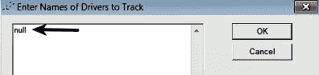

现在，要触发 I/O 操作，你可以打开命令提示符并输入以下命令。这将把字符串 `"hello"` 写入空设备。正如之前提到的，符号链接名称是用户模式应用程序（如 `cmd.exe`）可以使用的；这就是我指定设备符号链接名称（NUL）来写入内容的原因：

```
C:\>echo "hello" > NUL
```

设备被视为虚拟文件，在写入设备之前，会通过 `CreateFile()` 打开设备的句柄（`CreateFile()` 是一个用于创建/打开文件或设备的 API）。`CreateFile()` API 最终会调用 `ntoskrnl.exe` 中的 `NtCreateFile()`，该函数将请求发送给 I/O 管理器。I/O 管理器根据符号链接名称查找与设备关联的驱动程序，并调用其与 `IRP_MJ_CREATE` 主功能代码对应的分派例程。在设备的句柄被打开后，写入操作将使用 `WriteFile()` 执行，该操作将调用 `NtWriteFile`。该请求将被 I/O 管理器分派到与 `IRP_MJ_WRITE` 主功能代码对应的驱动程序例程。以下截图显示了与 `IRP_MJ_CREATE` 和 `IRP_MJ_WRITE` 对应的驱动程序分派例程调用及其完成状态：

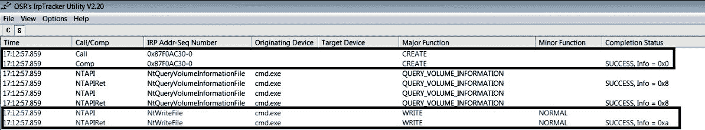

在这一点上，你应该已经理解了执行 I/O 操作的用户模式代码如何与内核模式驱动程序进行通信。Windows 还支持另一种机制，允许用户模式代码直接与内核模式设备驱动程序通信。这是通过使用通用 API `DeviceIoControl`（由`kernel32.dll`导出）来完成的。该 API 接受设备的句柄作为其中一个参数。它接受的另一个参数是控制代码，称为`IOCTL`（I/O 控制）代码，它是一个 32 位的整数值。每个控制代码标识一个要执行的特定操作以及在哪个设备上执行该操作。用户模式应用程序可以打开设备句柄（使用`CreateFile`），调用`DeviceIoControl`，并传递 Windows 操作系统提供的标准控制代码来直接对设备执行输入输出操作，例如硬盘驱动器、磁带驱动器或 CD-ROM 驱动器。此外，设备驱动程序（例如 rootkit 驱动程序）可以定义自己的设备特定控制代码，用户模式的 rootkit 组件可以通过`DeviceIoControl` API 与驱动程序进行通信。当用户模式组件通过传递`IOCTL`代码调用`DeviceIoControl`时，它会调用`ntdll.dll`中的`NtDeviceIoControlFile`，该函数将线程切换到内核模式，并调用 Windows 执行系统`ntoskrnl.exe`中的系统服务例程`NtDeviceIoControlFile`。Windows 执行系统调用 I/O 管理器，I/O 管理器构建包含 IOCTL 代码的 IRP 数据包，然后将其路由到由`IRP_MJ_DEVICE_CONTROL`标识的内核调度例程。以下图示展示了用户模式代码与内核模式驱动程序之间的通信概念：

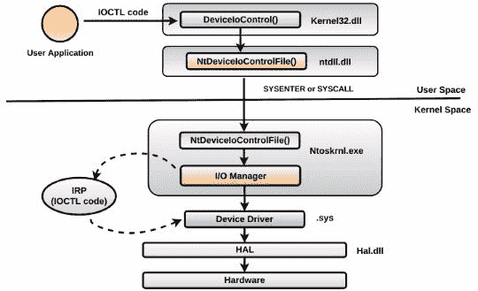

# 6.4 I/O 请求到分层驱动程序

到目前为止，你已经理解了如何通过一个由单一驱动程序控制的简单设备来处理 I/O 请求；I/O 请求可以经过多个驱动程序层次；这些层次的 I/O 处理方式基本相同。以下截图展示了 I/O 请求如何在达到硬件设备之前通过多个驱动程序层的一个例子：

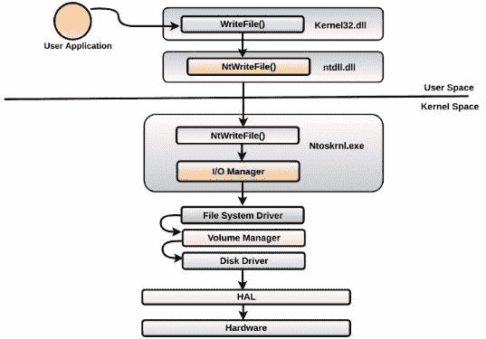

这个概念通过一个例子来更好地理解，因此我们通过以下命令触发对`c:\abc.txt`的写操作。当该命令执行时，`netstat`将打开`abc.txt`的句柄并写入其中：

```
C:\Windows\system32>netstat -an -t 60 > C:\abc.txt
```

这里需要注意的一点是，文件名*（*`C:\abc.txt`*）*也包含了文件所在设备的名称，即，`C:`驱动器是设备`\Device\HarddiskVolume1`的符号链接名称（你可以使用之前提到的`WinObj`工具进行验证）。这意味着写操作将被路由到与设备`\Device\HarddiskVolume1`相关联的驱动程序。当`netstat.exe`打开`abc.txt`时，I/O 管理器创建一个文件对象（`FILE_OBJECT`结构）并在文件对象中存储指向设备对象的指针，然后将句柄返回给`netstat.exe.`。以下是来自`ProcessHacker`工具的截图，显示了已由`netstat.exe.`打开的`C:\abc.txt`句柄。对象地址`0x85f78ce8`代表文件对象：

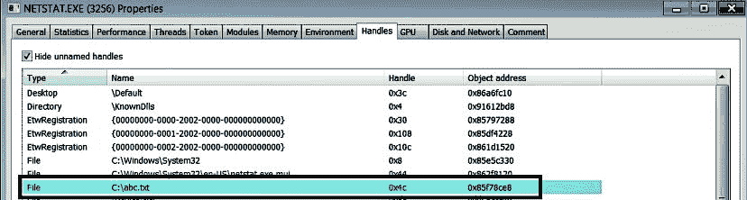

你可以通过以下方式使用对象地址检查文件对象（`FILE_OBJECT`）。从输出中，你可以看到`FileName`字段包含了文件的名称，而`DeviceObject`字段包含了指向设备对象（`DEVICE_OBJECT`）的指针：

```
kd> dt nt!_FILE_OBJECT 0x85f78ce8
   +0x000 Type : 0n5
   +0x002 Size : 0n128
   +0x004 DeviceObject : 0x868e7e20 _DEVICE_OBJECT
   +0x008 Vpb : 0x8688b658 _VPB
   +0x00c FsContext : 0xa74fecf0 Void
   [REMOVED]
   +0x030 FileName : _UNICODE_STRING "\abc.txt"
   +0x038 CurrentByteOffset : _LARGE_INTEGER 0xe000
```

如前所述，通过设备对象，可以确定设备的名称和相关的驱动程序。这是 I/O 管理器决定将 I/O 请求传递给哪个驱动程序的方式。以下输出显示了设备的名称`HarddiskVolume1`及其相关的驱动程序`volmgr.sys.`。`AttachedDevice`字段告诉你，`fvevol.sys`驱动程序下有一个没有命名的设备对象（`868e7b28`），它位于设备对象`HarddiskVolume1`之上，在设备栈中：

```
kd> !devobj 0x868e7e20
Device object (868e7e20) is for:
 HarddiskVolume1 \Driver\volmgr DriverObject 862e0bd8
Current Irp 00000000 RefCount 13540 Type 00000007 Flags 00201150
Vpb 8688b658 Dacl 8c7b3874 DevExt 868e7ed8 DevObjExt 868e7fc0 Dope 86928870 DevNode 86928968 
ExtensionFlags (0x00000800) DOE_DEFAULT_SD_PRESENT
Characteristics (0000000000) 
AttachedDevice (Upper) 868e7b28 \Driver\fvevol
Device queue is not busy.
```

要确定 I/O 请求经过的驱动程序层级，你可以使用`!devstack`内核调试命令并传递设备对象地址，以显示与特定设备对象相关的设备栈（分层设备对象）。以下输出显示了与`\Device\HarddiskVolume1`相关的设备栈，该设备由`volmgr.sys.`拥有。第四列中的`>`字符表示该条目与设备`HarddiskVolume1`相关，且该行之上的条目是位于`volmgr.sys.`之上的驱动程序列表。这意味着 I/O 请求将首先传递给`volsnap.sys`，根据请求的类型，`volsnap.sys`可以处理 IRP 请求并将请求传递给栈中的其他驱动程序，最终到达`volmgr.sys`：

```
kd> !devstack 0x868e7e20
  !DevObj !DrvObj !DevExt ObjectName
  85707658 \Driver\volsnap 85707710 
  868e78c0 \Driver\rdyboost 868e7978 
  868e7b28 \Driver\fvevol 868e7be0 
> 868e7e20 \Driver\volmgr 868e7ed8 HarddiskVolume1
```

要查看设备树，你可以使用我们之前提到的 GUI 工具*DeviceTree*。该工具将驱动程序显示在树的外侧，而它们的设备则缩进一级。附加设备会进一步缩进，如下图所示。你可以将以下截图与之前的`!devstack`输出进行对比，从而了解如何解读这些信息：

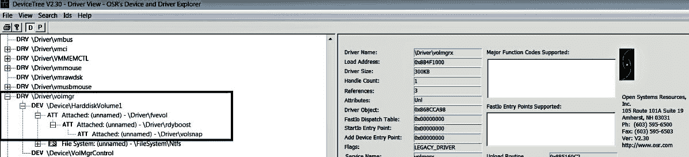

理解这种分层方法很重要，因为有时，rootkit 驱动程序可以插入或附加到目标设备的堆栈上方或下方以接收`IRP`。通过这种技术，rootkit 驱动程序可以在将`IRP`传递给合法驱动程序之前，记录或修改`IRP`。例如，键盘记录器可以通过插入一个恶意驱动程序（该驱动程序位于键盘功能驱动程序上方）来记录按键。

# 7. 显示设备树

你可以使用 Volatility 中的`devicetree`插件，以与*DeviceTree*工具相同的格式显示设备树。以下高亮的条目显示了与`volmgr.sys`相关联的`HarddiskVolume1`设备堆栈：

```
$ python vol.py -f win7_x86.vmem --profile=Win7SP1x86 devicetree

DRV 0x05329db8 \Driver\WMIxWDM
---| DEV 0x85729a38 WMIAdminDevice FILE_DEVICE_UNKNOWN
---| DEV 0x85729b60 WMIDataDevice FILE_DEVICE_UNKNOWN
[REMOVED]

DRV 0xbf2e0bd8 \Driver\volmgr
---| DEV 0x868e7e20 HarddiskVolume1 FILE_DEVICE_DISK
------| ATT 0x868e7b28 - \Driver\fvevol FILE_DEVICE_DISK
---------| ATT 0x868e78c0 - \Driver\rdyboost FILE_DEVICE_DISK
------------| ATT 0x85707658 - \Driver\volsnap FILE_DEVICE_DISK
[REMOVED]
```

为了帮助你理解`devicetree`插件在取证调查中的使用，下面我们来看一个创建自己设备来存储恶意二进制文件的恶意软件。在接下来的 Z*eroAccess* *rootkit* 示例中，我使用了`cmdline`插件，它显示进程的命令行参数。这对于确定进程的完整路径非常有用（你也可以使用`dlllist`插件）。从输出中，你可以看到最后一个`svchost.exe`进程是从一个可疑的命名空间中运行的：

```
svchost.exe pid: 624
Command line : C:\Windows\system32\svchost.exe -k DcomLaunch
svchost.exe pid: 712
Command line : C:\Windows\system32\svchost.exe -k RPCSS
svchost.exe pid: 764
Command line : C:\Windows\System32\svchost.exe -k LocalServiceNetworkRestricted
svchost.exe pid: 876
Command line : C:\Windows\System32\svchost.exe -k LocalSystemNetworkRestricted
[REMOVED]

svchost.exe pid: 1096
Command line : "\\.\globalroot\Device\svchost.exe\svchost.exe"
```

从之前的讨论中，如果你还记得，`\\.\<symbolic link name>` 是从用户模式使用符号链接名称访问设备的约定。当驱动程序为设备创建符号链接时，它会被添加到`\GLOBAL??`目录中，该目录位于对象管理器命名空间中（可以使用*WinObj*工具查看，正如我们之前讨论的）。在这种情况下，`globalroot`是符号链接的名称。那么，问题是，`\\.\globalroot`是什么？事实证明，`\\.\globalroot`指的是`\GLOBAL??`命名空间。换句话说，`\\.\globalroot\Device\svchost.exe\svchost.exe`路径与`\Device\svchost.exe\svchost.exe`路径是相同的。此时，你知道 Z*eroAccess* rootkit 创建了自己的设备（`svchost.exe`）来隐藏其恶意二进制文件`svchost.exe`。要识别创建此设备的驱动程序，你可以使用`devicetree`插件。从以下输出中，你可以看出`svchost.exe`设备是由`00015300.sys`驱动程序创建的：

```
$ python vol.py -f zaccess1.vmem --profile=Win7SP1x86 devicetree
[REMOVED]
DRV 0x1fc84478 \Driver\00015300
---| DEV 0x84ffbf08 svchost.exe FILE_DEVICE_DISK
```

在接下来的*BlackEnergy*恶意软件示例中，它将磁盘上的合法`aliide.sys`驱动程序替换为恶意驱动程序，以劫持现有服务（如在第十章，*使用内存取证猎杀恶意软件*部分中所述）。当服务启动时，恶意驱动程序创建一个设备与恶意用户模式组件（注入到合法`svchost.exe`中的 DLL）进程进行通信。以下`devicetree`输出显示了恶意驱动程序创建的设备：

```
$ python vol.py -f be3_big_restart.vmem --profile=Win7SP1x64 devicetree | grep -i aliide -A1
Volatility Foundation Volatility Framework 2.6
DRV 0x1e45fbe0 \Driver\aliide
---| DEV 0xfffffa8008670e40 {C9059FFF-1C49-4445-83E8-4F16387C3800} FILE_DEVICE_UNKNOWN
```

为了了解恶意驱动程序支持的操作类型，您可以使用 Volatility 的 `driverirp` 插件，因为它可以显示与特定驱动程序或所有驱动程序相关的主要 IRP 函数。从以下输出中，您可以看出恶意 `aliide` 驱动程序支持 `IRP_MJ_CREATE (打开)`、`IRP_MJ_CLOSE (关闭)` 和 `IRP_MJ_DEVICE_CONTROL (DeviceIoControl)` 操作。驱动程序不支持的操作通常指向 `ntoskrnl.exe` 中的 `IopInvalidDeviceRequest`，这也是您看到所有其他不受支持的操作指向 `0xfffff80002a5865c` 在 `ntoskrnl.exe` 中的原因：

```
$ python vol.py -f be3_big_restart.vmem --profile=Win7SP1x64 driverirp -r aliide
Volatility Foundation Volatility Framework 2.6
--------------------------------------------------
DriverName: aliide
DriverStart: 0xfffff88003e1d000
DriverSize: 0x14000
DriverStartIo: 0x0
   0 IRP_MJ_CREATE                  0xfffff88003e1e160 aliide.sys
   1 IRP_MJ_CREATE_NAMED_PIPE       0xfffff80002a5865c ntoskrnl.exe
   2 IRP_MJ_CLOSE                   0xfffff88003e1e160 aliide.sys
   3 IRP_MJ_READ                    0xfffff80002a5865c ntoskrnl.exe
   4 IRP_MJ_WRITE                   0xfffff80002a5865c ntoskrnl.exe
  [REMOVED]
  12 IRP_MJ_DIRECTORY_CONTROL       0xfffff80002a5865c ntoskrnl.exe
  13 IRP_MJ_FILE_SYSTEM_CONTROL     0xfffff80002a5865c ntoskrnl.exe
  14 IRP_MJ_DEVICE_CONTROL          0xfffff88003e1e160 aliide.sys
  15 IRP_MJ_INTERNAL_DEVICE_CONTROL 0xfffff80002a5865c ntoskrnl.exe
  [REMOVED]
```

# 8. 检测内核空间劫持

在讨论劫持技术时（参见第八章，*代码注入与劫持*部分），我们看到一些恶意软件通过修改调用表（*IAT 劫持*）以及一些修改 API 函数（*内联劫持*）来控制程序的执行路径，并将其重定向到恶意代码。其目标是阻止对 API 的调用，监控传递给 API 的输入参数，或过滤从 API 返回的输出参数。[第八章](https://cdp.packtpub.com/learning_malware_analysis/wp-admin/post.php?post=1250&action=edit#post_985)中涉及的*代码注入与劫持*技术主要集中在用户空间的劫持技术。如果攻击者能够安装一个内核驱动程序，类似的功能也可以在内核空间实现。内核空间中的劫持是一种比用户空间更强大的方法，因为内核组件在整个系统的运作中扮演着非常重要的角色。这使得攻击者能够以高权限执行代码，从而具备隐藏恶意组件、绕过安全软件或拦截执行路径的能力。在本节中，我们将了解内核空间中的不同劫持技术，以及如何使用内存取证来检测这些技术。

# 8.1 检测 SSDT 劫持

内核空间中的**系统服务描述符表**（**SSDT**）包含指向由内核执行文件（`ntoskrnl.exe`、`ntkrnlpa.exe`等）导出的系统服务例程（内核函数）的指针。当应用程序调用像 `WriteFile()`、`ReadFile()` 或 `CreateProcess()` 等 API 时，它会调用 `ntdll.dll` 中的存根，从而将线程切换到内核模式。运行在内核模式中的线程会查询*SSDT*以确定要调用的内核函数的地址。下图通过 `WriteFile()` 示例展示了这一概念（对于其他 API，概念类似）：

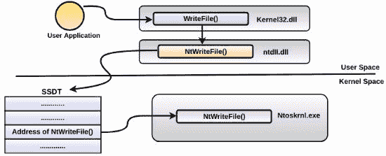

一般来说，`ntoskrnl.exe`导出核心内核 API 函数，如`NtReadFile()`、`NtWriteFile()`等。在 x86 平台中，这些内核函数的指针直接存储在 SSDT 中，而在 x64 平台中，SSDT 不包含指针。相反，它存储一个编码的整数，通过解码该整数来确定内核函数的地址。无论实现方式如何，概念都是相同的，SSDT 被查询以确定特定内核函数的地址。以下是`Windows7 x86`平台上的*WinDbg*命令，用于显示 SSDT 的内容。表格中的条目包含指向`ntoskrnl.exe`（`nt`）实现的函数的指针。条目的顺序和数量会因操作系统版本而异：

```
kd> dps nt!KiServiceTable
82a8f5fc 82c8f06a nt!NtAcceptConnectPort
82a8f600 82ad2739 nt!NtAccessCheck
82a8f604 82c1e065 nt!NtAccessCheckAndAuditAlarm
82a8f608 82a35a1c nt!NtAccessCheckByType
82a8f60c 82c9093d nt!NtAccessCheckByTypeAndAuditAlarm
82a8f610 82b0f7a4 nt!NtAccessCheckByTypeResultList
82a8f614 82d02611 nt!NtAccessCheckByTypeResultListAndAuditAlarm
[REMOVED]
```

还有第二个表格，类似于 SSDT，称为*SSDT shadow*。此表格存储由`win32k.sys`导出的与 GUI 相关的函数指针。要显示这两个表格的条目，可以使用`ssdt` volatility 插件，如下所示。`SSDT[0]`表示原生的*SSDT 表格*，而`SSDT[1]`表示*SSDT shadow*：

```
$ python vol.py -f win7_x86.vmem --profile=Win7SP1x86 ssdt
Volatility Foundation Volatility Framework 2.6
[x86] Gathering all referenced SSDTs from KTHREADs...
Finding appropriate address space for tables...
SSDT[0] at 82a8f5fc with 401 entries
  Entry 0x0000: 0x82c8f06a (NtAcceptConnectPort) owned by ntoskrnl.exe
  Entry 0x0001: 0x82ad2739 (NtAccessCheck) owned by ntoskrnl.exe
  Entry 0x0002: 0x82c1e065 (NtAccessCheckAndAuditAlarm) owned by ntoskrnl.exe
  Entry 0x0003: 0x82a35a1c (NtAccessCheckByType) owned by ntoskrnl.exe
  [REMOVED]
SSDT[1] at 96c37000 with 825 entries
  Entry 0x1000: 0x96bc0e6d (NtGdiAbortDoc) owned by win32k.sys
  Entry 0x1001: 0x96bd9497 (NtGdiAbortPath) owned by win32k.sys
  Entry 0x1002: 0x96a272c1 (NtGdiAddFontResourceW) owned by win32k.sys
  Entry 0x1003: 0x96bcff67 (NtGdiAddRemoteFontToDC) owned by win32k.sys
```

在 SSDT hooking 的情况下，攻击者将特定函数的指针替换为恶意函数的地址。例如，如果攻击者希望拦截写入文件的数据，可以将`NtWriteFile()`的指针更改为指向攻击者选择的恶意函数的地址。如下图所示：

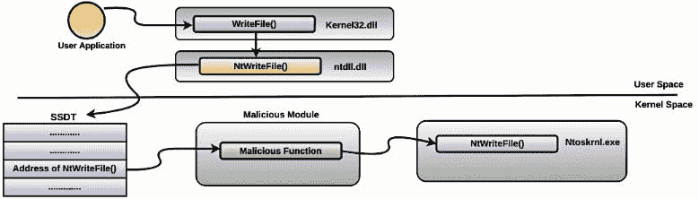

为了检测 SSDT hooking，可以查看 SSDT 表格中不指向`ntoskrnl.exe`或`win32k.sys`地址的条目。以下代码是*Mader* rootkit 的示例，它 hook 了多个与注册表相关的函数，并将它们指向恶意驱动程序`core.sys`。在此阶段，您可以使用`modules`、`modscan`或`driverscan`确定`core.sys`的基址，然后使用`moddump`插件将其转储到磁盘以供进一步分析：

```
$ python vol.py -f mader.vmem --profile=WinXPSP3x86 ssdt | egrep -v "(ntoskrnl|win32k)"
Volatility Foundation Volatility Framework 2.6
[x86] Gathering all referenced SSDTs from KTHREADs...
Finding appropriate address space for tables...
SSDT[0] at 80501b8c with 284 entries
  Entry 0x0019: 0xf66eb74e (NtClose) owned by core.sys
 Entry 0x0029: 0xf66eb604 (NtCreateKey) owned by core.sys
 Entry 0x003f: 0xf66eb6a6 (NtDeleteKey) owned by core.sys
 Entry 0x0041: 0xf66eb6ce (NtDeleteValueKey) owned by core.sys
 Entry 0x0062: 0xf66eb748 (NtLoadKey) owned by core.sys
 Entry 0x0077: 0xf66eb4a7 (NtOpenKey) owned by core.sys
 Entry 0x00c1: 0xf66eb6f8 (NtReplaceKey) owned by core.sys
 Entry 0x00cc: 0xf66eb720 (NtRestoreKey) owned by core.sys
 Entry 0x00f7: 0xf66eb654 (NtSetValueKey) owned by core.sys
```

使用 SSDT hooking 对攻击者的缺点在于它很容易被检测到，而且 Windows 的 64 位版本由于**内核补丁保护**（**KPP**）机制，也被称为*PatchGuard*，会阻止 SSDT hooking（[`en.wikipedia.org/wiki/Kernel_Patch_Protection`](https://en.wikipedia.org/wiki/Kernel_Patch_Protection)）。由于 SSDT 中的条目在不同版本的 Windows 中有所不同，并且在新版本中可能会发生变化，因此恶意软件作者很难编写一个可靠的 rootkit。

# 8.2 检测 IDT Hooking

**中断描述符表**（**IDT**）存储着被称为*ISR（中断服务例程或中断处理程序）*的函数地址。这些函数处理中断和处理器异常。就像挂钩 SSDT 一样，攻击者可能会挂钩 IDT 中的条目，以将控制权重定向到恶意代码。要显示 IDT 条目，可以使用 `idt` Volatility 插件。一个挂钩 IDT 的恶意软件示例是*Uroburos (Turla) rootkit*。该 rootkit 挂钩了位于 `0xc3 (INT C3)` 索引的中断处理程序。在干净的系统中，`0xC3` 处的中断处理程序指向的地址位于 `ntoskrnl.exe` 的内存中。以下输出显示了来自干净系统的条目：

```
$ python vol.py -f win7.vmem --profile=Win7SP1x86 idt
Volatility Foundation Volatility Framework 2.6
   CPU   Index   Selector   Value        Module      Section 
------   ------  ---------- ----------  ---------    ------------
     0    0         0x8     0x82890200  ntoskrnl.exe  .text 
     0    1         0x8     0x82890390  ntoskrnl.exe  .text 
     0    2         0x58    0x00000000  NOT USED 
     0    3         0x8     0x82890800  ntoskrnl.exe  .text 
     [REMOVED]
     0    C1        0x8     0x8282f3f4  hal.dll       _PAGELK 
     0    C2        0x8     0x8288eea4  ntoskrnl.exe  .text 
     0    C3        0x8     0x8288eeae  ntoskrnl.exe  .text
```

以下输出显示了挂钩条目。您可以看到 IDT 中的 `0xC3` 条目指向一个 `UNKNOWN` 模块中的地址。换句话说，挂钩条目位于 `ntoskrnl.exe` 模块的范围之外：

```
$ python vol.py -f turla1.vmem --profile=Win7SP1x86 idt
Volatility Foundation Volatility Framework 2.6
   CPU   Index   Selector   Value        Module      Section 
------   ------  ---------- ----------  ---------    ------------
     0    0         0x8     0x82890200  ntoskrnl.exe  .text 
     0    1         0x8     0x82890390  ntoskrnl.exe  .text 
     0    2         0x58    0x00000000  NOT USED 
     0    3         0x8     0x82890800  ntoskrnl.exe  .text 
     [REMOVED]
     0    C1        0x8     0x8282f3f4  hal.dll       _PAGELK 
     0    C2        0x8     0x8288eea4  ntoskrnl.exe  .text 
     0    C3        0x8     0x85b422b0  UNKNOWN 
```

要详细分析 Uroburos rootkit，并了解 rootkit 用于触发挂钩中断处理程序的技术，请参阅以下博客文章：[`www.gdatasoftware.com/blog/2014/06/23953-analysis-of-uroburos-using-windbg`](https://www.gdatasoftware.com/blog/2014/06/23953-analysis-of-uroburos-using-windbg)。

# 8.3 识别内核空间内联钩取

攻击者可以通过修改内核函数或现有内核驱动程序中的函数，使用 `jmp` 指令将执行流重新路由到恶意代码，而不是替换 SSDT 中的指针，这样更容易被识别。如本章前面所述，您可以使用 `apihooks` 插件来检测内核空间中的内联钩取。通过指定 `-P` 参数，您可以告诉 `apihooks` 插件仅扫描内核空间中的钩取。在以下 *TDL3 rootkit* 的示例中，`apihooks` 检测到了内核函数 `IofCallDriver` 和 `IofCompleteRequest` 中的钩取。被挂钩的 API 函数被重定向到 `0xb878dfb2` 和 `0xb878e6bb` 这些地址，位于一个名称未知的恶意模块中（可能是因为它通过解除链接 `KLDR_DATA_TABLE_ENTRY` 结构来隐藏自己）：

```
$ python vol.py -f tdl3.vmem --profile=WinXPSP3x86 apihooks -P
Volatility Foundation Volatility Framework 2.6
************************************************************************
Hook mode: Kernelmode
Hook type: Inline/Trampoline
Victim module: ntoskrnl.exe (0x804d7000 - 0x806cf580)
Function: ntoskrnl.exe!IofCallDriver at 0x804ee120
Hook address: 0xb878dfb2
Hooking module: <unknown>

Disassembly(0):
0x804ee120 ff2500c25480 JMP DWORD [0x8054c200]
0x804ee126 cc           INT 3
0x804ee127 cc           INT 3
[REMOVED]

************************************************************************
Hook mode: Kernelmode
Hook type: Inline/Trampoline
Victim module: ntoskrnl.exe (0x804d7000 - 0x806cf580)
Function: ntoskrnl.exe!IofCompleteRequest at 0x804ee1b0
Hook address: 0xb878e6bb
Hooking module: <unknown>

Disassembly(0):
0x804ee1b0 ff2504c25480 JMP DWORD [0x8054c204]
0x804ee1b6 cc           INT 3
0x804ee1b7 cc           INT 3
[REMOVED]
```

即使钩子模块的名称未知，仍然可以检测到恶意的内核模块。在这种情况下，我们知道 API 函数被重定向到恶意模块中以`0xb87`开头的地址，这意味着恶意模块一定驻留在以`0xb87`开头的某个地址处。运行`modules`插件并未检测到该地址范围内的任何模块（因为它被隐藏），而`modscan`插件则检测到一个名为`TDSSserv.sys`的内核模块，该模块加载在基地址`0xb878c000`，大小为`0x11000`。换句话说，内核模块`TDSSserv.sys`的起始地址是`0xb878c000`，结束地址是`0xb879d000（0xb878c000+0x11000）`。你可以清楚地看到钩子地址`0xb878dfb2`和`0xb878e6bb`落在`TDSSserv.sys`的地址范围内。此时，我们已经成功识别出恶意驱动程序。你现在可以将驱动程序转储到磁盘以便进一步分析：

```
$ python vol.py -f tdl3.vmem --profile=WinXPSP3x86 modules | grep -i 0xb878
Volatility Foundation Volatility Framework 2.6

$ python vol.py -f tdl3.vmem --profile=WinXPSP3x86 modscan | grep -i 0xb878
Volatility Foundation Volatility Framework 2.6
0x0000000009773c98 TDSSserv.sys 0xb878c000 0x11000 \systemroot\system32\drivers\TDSSserv.sys
```

# 8.4 检测 IRP 函数钩子

rootkit 可以通过修改主功能表（调度例程数组）中的条目，而不是钩住内核 API 函数，将它们指向恶意模块中的某个例程。例如，rootkit 可以通过覆盖驱动程序主功能表中与`IRP_MJ_WRITE`相关的地址，来检查写入磁盘或网络的数据缓冲区。以下图示说明了这一概念：

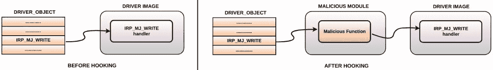

通常，驱动程序的 IRP 处理程序函数会指向它们自己模块中的某个位置。例如，`null.sys`的`IRP_MJ_WRITE`相关例程指向`null.sys`中的一个地址，但有时驱动程序会将处理程序函数转发到另一个驱动程序。以下是磁盘驱动程序将处理程序函数转发到`CLASSPNP.SYS`（存储类设备驱动程序）的示例：

```
$ python vol.py -f win7_clean.vmem --profile=Win7SP1x64 driverirp -r disk
Volatility Foundation Volatility Framework 2.6
--------------------------------------------------
DriverName: Disk
DriverStart: 0xfffff88001962000
DriverSize: 0x16000
DriverStartIo: 0x0
   0 IRP_MJ_CREATE                0xfffff88001979700 CLASSPNP.SYS
   1 IRP_MJ_CREATE_NAMED_PIPE     0xfffff8000286d65c ntoskrnl.exe
   2 IRP_MJ_CLOSE                 0xfffff88001979700 CLASSPNP.SYS
   3 IRP_MJ_READ                  0xfffff88001979700 CLASSPNP.SYS
   4 IRP_MJ_WRITE                 0xfffff88001979700 CLASSPNP.SYS
   5 IRP_MJ_QUERY_INFORMATION     0xfffff8000286d65c ntoskrnl.exe
   [REMOVED] 
```

要检测 IRP 钩子，可以关注指向另一个驱动程序的 IRP 处理程序函数，并且由于驱动程序可以将 IRP 处理程序转发到另一个驱动程序，你需要进一步调查以确认钩子。如果你在实验室环境中分析 rootkit，则可以从干净的内存映像中列出所有驱动程序的 IRP 函数，并将其与受感染的内存映像中的 IRP 函数进行比较，以查找任何修改。在以下示例中，*ZeroAccess rootkit*钩住了磁盘驱动程序的 IRP 函数，并将它们重定向到一个恶意模块中的函数，而该模块的地址未知（因为该模块被隐藏）：

```
DriverName: Disk
DriverStart: 0xba8f8000
DriverSize: 0x8e00
DriverStartIo: 0x0
   0 IRP_MJ_CREATE                0xbabe2bde Unknown
 1 IRP_MJ_CREATE_NAMED_PIPE     0xbabe2bde Unknown
 2 IRP_MJ_CLOSE                 0xbabe2bde Unknown
 3 IRP_MJ_READ                  0xbabe2bde Unknown
 4 IRP_MJ_WRITE                 0xbabe2bde Unknown
 5 IRP_MJ_QUERY_INFORMATION     0xbabe2bde Unknown
   [REMOVED]
```

以下是`modscan`的输出，显示与*ZeroAccess*相关的恶意驱动程序（具有可疑名称）及其在内存中加载的基地址（该地址可用于将驱动程序转储到磁盘）：

```
$ python vol.py -f zaccess_maxplus.vmem --profile=WinXPSP3x86 modscan | grep -i 0xbabe
Volatility Foundation Volatility Framework 2.6
0x0000000009aabf18 * 0xbabe0000 0x8000 \*
```

一些 rootkit 使用间接 IRP 钩子来避免引起怀疑。在以下示例中，*Gapz* Bootkit 钩住了 `null.sys` 的 `IRP_MJ_DEVICE_CONTROL`。乍一看，一切似乎正常，因为对应于 `IRP_MJ_DEVICE_CONTROL` 的 IRP 处理程序地址指向 `null.sys` 内部。然而，仔细观察会发现差异；在一个干净的系统上，`IRP_MJ_DEVICE_CONTROL` 会指向 `ntoskrnl.exe` 中的地址（`nt!IopInvalidDeviceRequest`）。在这种情况下，它指向了 `null.sys` 中的 `0x880ee040`。通过反汇编地址 `0x880ee040`（使用 `volshell` 插件），您可以看到它跳转到 `0x8518cad9`，这个地址位于 `null.sys` 的范围之外：

```
$ python vol.py -f gapz.vmem --profile=Win7SP1x86 driverirp -r null
Volatility Foundation Volatility Framework 2.6
--------------------------------------------------
DriverName: Null
DriverStart: 0x880eb000
DriverSize: 0x7000
DriverStartIo: 0x0
   0 IRP_MJ_CREATE                   0x880ee07c Null.SYS
   1 IRP_MJ_CREATE_NAMED_PIPE        0x828ee437 ntoskrnl.exe
   2 IRP_MJ_CLOSE                    0x880ee07c Null.SYS
   3 IRP_MJ_READ                     0x880ee07c Null.SYS
   4 IRP_MJ_WRITE                    0x880ee07c Null.SYS
   5 IRP_MJ_QUERY_INFORMATION        0x880ee07c Null.SYS
   [REMOVED]
  13 IRP_MJ_FILE_SYSTEM_CONTROL      0x828ee437 ntoskrnl.exe
  14 IRP_MJ_DEVICE_CONTROL           0x880ee040 Null.SYS
  15 IRP_MJ_INTERNAL_DEVICE_CONTROL  0x828ee437 ntoskrnl.exe

$ python vol.py -f gapz.vmem --profile=Win7SP1x86 volshell
[REMOVED]
>>> dis(0x880ee040)
0x880ee040 8bff        MOV EDI, EDI
0x880ee042 e992ea09fd  JMP 0x8518cad9
0x880ee047 6818e10e88  PUSH DWORD 0x880ee118
```

有关 Gapz Bootkit 使用的隐身技术的详细信息，请阅读 Eugene Rodionov 和 Aleksandr Matrosov 所写的白皮书（[`www.welivesecurity.com/wp-content/uploads/2013/04/gapz-bootkit-whitepaper.pdf`](https://www.welivesecurity.com/wp-content/uploads/2013/04/gapz-bootkit-whitepaper.pdf)），标题为“*留意 Gapz：有史以来最复杂的 Bootkit 分析*”。

如前所述，检测标准的钩子技术相对简单。例如，您可以查看一些迹象，如 SSDT 条目未指向`ntoskrnl.exe`/`win32k.sys`，或者 IRP 函数指向其他地方，或者函数开始处存在跳转指令。为了避免这种检测，攻击者可以在保持调用表条目在范围内的同时实现钩子，或者将跳转指令放置在代码深处。为此，他们需要依赖于修补系统模块或第三方驱动程序。修补系统模块的问题在于，*Windows 内核补丁保护（PatchGuard）* 会阻止修补调用表（如 SSDT 或 IDT）以及 64 位系统上的核心系统模块。由于这些原因，攻击者要么使用依赖绕过这些保护机制的技术（如安装*Bootkit*/*利用内核模式漏洞*），要么使用受支持的方式（这些方式同样适用于 64 位系统）执行恶意代码，以便与其他合法驱动程序融合并减少被检测的风险。在接下来的章节中，我们将探讨 rootkit 使用的一些受支持的技术。

# 9\. 内核回调和定时器

Windows 操作系统允许驱动程序注册回调例程，当特定事件发生时，该例程会被调用。例如，如果一个 rootkit 驱动程序希望监控系统上所有进程的执行和终止，它可以通过调用内核函数`PsSetCreateProcessNotifyRoutine`、`PsSetCreateProcessNotifyRoutineEx`或`PsSetCreateProcessNotifyRoutineEx2`来为进程事件注册回调例程。当进程事件发生（启动或退出）时，rootkit 的回调例程将被调用，从而采取必要的措施，例如防止进程启动。以同样的方式，rootkit 驱动程序可以注册回调例程，在映像（EXE 或 DLL）被加载到内存中、文件和注册表操作执行时，或系统即将关闭时接收通知。换句话说，回调功能使 rootkit 驱动程序能够监控系统活动，并根据活动采取必要的行动。你可以通过以下链接获取一些 rootkit 可能用来注册回调例程的已记录和未记录的内核函数列表：[`www.codemachine.com/article_kernel_callback_functions.html`](https://www.codemachine.com/article_kernel_callback_functions.html)。这些内核函数在不同的头文件（`ntddk.h`、`Wdm.h` 等）中定义，位于*Windows 驱动程序工具包 (WDK)* 中。获取已记录内核函数详细信息的最快方法是进行快速的 Google 搜索，这将引导你到 WDK 在线文档中的相应链接。

回调的工作方式是，特定的驱动程序创建一个回调对象，该对象是一个包含函数指针列表的结构。创建的回调对象会被发布，以便其他驱动程序可以使用。其他驱动程序随后可以将它们的回调例程注册到创建回调对象的驱动程序中 ([`docs.microsoft.com/en-us/windows-hardware/drivers/kernel/callback-objects`](https://docs.microsoft.com/en-us/windows-hardware/drivers/kernel/callback-objects))。创建回调的驱动程序可以与注册回调的内核驱动程序相同，也可以不同。要查看系统范围的回调例程，可以使用`callbacks` Volatility 插件。在一个干净的 Windows 系统中，通常可以看到由各种驱动程序安装的许多回调，这意味着并非所有`callbacks`输出中的条目都是恶意的；需要进一步分析以从可疑的内存镜像中识别恶意驱动程序。

在以下示例中，*Mader rootkit* 执行了*SSDT hooking*（在本章的*检测 SSDT hooking* 部分讨论），并安装了一个进程创建回调例程，以监控系统上所有进程的执行或终止。特别地，当进程事件发生时，位于恶意模块 `core.sys` 中地址 `0xf66eb050` 的回调例程将被调用。`Module` 列指定实现回调函数的内核模块的名称。`Details` 列提供安装回调的内核对象的名称或描述。在识别出恶意驱动程序后，您可以进一步调查它，或将其转储到磁盘以进行进一步分析（反汇编、AV 扫描、字符串提取等），如下所示的 `moddump` 命令：

```
$ python vol.py -f mader.vmem --profile=WinXPSP3x86 callbacks
Volatility Foundation Volatility Framework 2.6
Type                             Callback    Module        Details
---------------------------      ----------  ----------   -------
IoRegisterShutdownNotification  0xf9630c6a  VIDEOPRT.SYS  \Driver\VgaSave
IoRegisterShutdownNotification  0xf9630c6a  VIDEOPRT.SYS  \Driver\vmx_svga
IoRegisterShutdownNotification  0xf9630c6a  VIDEOPRT.SYS  \Driver\mnmdd
IoRegisterShutdownNotification  0x805f5d66  ntoskrnl.exe  \Driver\WMIxWDM
IoRegisterFsRegistrationChange  0xf97c0876  sr.sys         -
GenericKernelCallback           0xf66eb050  core.sys       -
PsSetCreateProcessNotifyRoutine 0xf66eb050  core.sys       -
KeBugCheckCallbackListHead      0xf96e85ef  NDIS.sys      Ndis miniport
[REMOVED]
```

```
$ python vol.py -f mader.vmem --profile=WinXPSP3x86 modules | grep -i core Volatility Foundation Volatility Framework 2.6
0x81772bf8  core.sys  0xf66e9000  0x12000   \system32\drivers\core.sys
```

```
$ python vol.py -f mader.vmem --profile=WinXPSP3x86 moddump -b 0xf66e9000 -D dump/
Volatility Foundation Volatility Framework 2.6
Module Base    Module Name      Result
-----------   ----------------- ------
0x0f66e9000    core.sys         OK: driver.f66e9000.sys
```

在以下示例中，*TDL3 rootkit* 安装了进程回调和映像加载回调通知。这使得 rootkit 能够监控进程事件，并在可执行映像（EXE、DLL 或内核模块）映射到内存时收到通知。条目中的模块名称设置为 `UNKNOWN`；这告诉您回调例程存在于一个未知模块中，这种情况发生在 rootkit 驱动程序通过取消链接 `KLDR_DATA_TABLE_ENTRY` 结构或运行一个孤立线程（隐藏或与内核模块分离的线程）来尝试隐藏自己时。在这种情况下，`UNKNOWN` 条目使您更容易发现可疑条目：

```
$ python vol.py -f tdl3.vmem --profile=WinXPSP3x86 callbacks
Volatility Foundation Volatility Framework 2.6
Type                            Callback    Module        Details
------------------------        ----------  --------      -------
[REMOVED]
IoRegisterShutdownNotification  0x805cdef4  ntoskrnl.exe  \FileSystem\RAW
IoRegisterShutdownNotification  0xba8b873a  MountMgr.sys  \Driver\MountMgr
GenericKernelCallback           0xb878f108  UNKNOWN        -
IoRegisterFsRegistrationChange  0xba6e34b8  fltMgr.sys     -
GenericKernelCallback           0xb878e8e9  UNKNOWN        -
PsSetLoadImageNotifyRoutine     0xb878f108  UNKNOWN        -
PsSetCreateProcessNotifyRoutine 0xb878e8e9  UNKNOWN        -
KeBugCheckCallbackListHead      0xba5f45ef  NDIS.sys      Ndis miniport
[REMOVED]
```

即使模块名称为 `UNKNOWN`，通过回调例程地址，我们也可以推断出恶意模块应该位于从地址 `0xb878` 开始的内存区域中。从 `modules` 插件的输出中，您可以看到该模块已经取消链接，但 `modscan` 插件仍然能够检测到加载在 `0xb878c000` 并大小为 `0x11000` 的内核模块。显然，所有回调例程地址都位于该模块的范围内。现在，已知内核模块的基地址，您可以使用 `moddump` 插件将其转储以进行进一步分析：

```
$ python vol.py -f tdl3.vmem --profile=WinXPSP3x86 modules | grep -i 0xb878
Volatility Foundation Volatility Framework 2.6

$ python vol.py -f tdl3.vmem --profile=WinXPSP3x86 modscan | grep -i 0xb878
Volatility Foundation Volatility Framework 2.6
0x9773c98 TDSSserv.sys 0xb878c000 0x11000 \system32\drivers\TDSSserv.sys
```

像回调函数一样，rootkit 驱动程序可能会创建一个定时器，并在指定时间到期时获得通知。rootkit 驱动程序可以利用此功能来调度定期执行的操作。其工作原理是，rootkit 创建一个定时器并提供一个称为*DPC（延迟过程调用）*的回调例程，当定时器过期时，该回调例程会被调用。当回调例程被调用时，rootkit 可以执行恶意操作。换句话说，定时器是 rootkit 执行其恶意代码的另一种方式。有关内核定时器如何工作的详细信息，请参阅以下 Microsoft 文档：[`docs.microsoft.com/en-us/windows-hardware/drivers/kernel/timer-objects-and-dpcs`](https://docs.microsoft.com/en-us/windows-hardware/drivers/kernel/timer-objects-and-dpcs)。

要列出内核定时器，你可以使用`timers` Volatility 插件。需要注意的是，定时器本身并不具有恶意性质，它只是 Windows 的一项功能，因此在干净的系统上，你会看到一些合法的驱动程序安装了定时器。像回调一样，可能需要进一步分析才能识别恶意模块。由于大多数根工具尝试隐藏它们的驱动程序，结果就会生成一些明显的痕迹，帮助你快速识别恶意模块。在以下示例中，*ZeroAccess 根工具*安装了一个 6000 毫秒的定时器。当时间到期时，`UNKNOWN`模块中的`0x814f9db0`地址的例程被调用。`Module`列中的`UNKNOWN`表明该模块可能被隐藏，但例程地址指向了恶意代码所在的内存范围：

```
$ python vol.py -f zaccess1.vmem --profile=WinXPSP3x86 timers
Volatility Foundation Volatility Framework 2.6
Offset(V)  DueTime                Period(ms) Signaled Routine   Module
---------- ---------------------  --------- -------- -------- ------
0x805516d0 0x00000000:0x6b6d9546  60000      Yes    0x804f3eae ntoskrnl.exe
0x818751f8 0x80000000:0x557ed358  0          -      0x80534e48 ntoskrnl.exe
0x81894948 0x00000000:0x64b695cc  10000      -      0xf9cbc6c4 watchdog.sys
0xf6819990 0x00000000:0x78134eb2  60000      Yes    0xf68021f8 HTTP.sys
[REMOVED]
0xf7228d60 0x00000000:0x714477b4  60000      Yes    0xf7220266 ipnat.sys
0x814ff790 0x00000000:0xc4b6c5b4  60000      -      0x814f9db0 UNKNOWN
0x81460728 0x00000000:0x760df068  0          -      0x80534e48 ntoskrnl.exe
[REMOVED]
```

除了定时器，*ZeroAccess*还安装了回调以监控注册表操作。同样，回调例程的地址指向相同的内存范围（以`0x814f`开头）：

```
$ python vol.py -f zaccess1.vmem --profile=WinXPSP3x86 callbacks
Volatility Foundation Volatility Framework 2.6
Type                           Callback    Module         Details
------------------------------ ----------  -----------    -------
IoRegisterShutdownNotification 0xf983e2be  ftdisk.sys    \Driver\Ftdisk
IoRegisterShutdownNotification 0x805cdef4  ntoskrnl.exe  \FileSystem\RAW
IoRegisterShutdownNotification 0x805f5d66  ntoskrnl.exe  \Driver\WMIxWDM
GenericKernelCallback          0x814f2d60  UNKNOWN       -
KeBugCheckCallbackListHead     0xf96e85ef  NDIS.sys      Ndis miniport
CmRegisterCallback             0x814f2d60  UNKNOWN       -
```

尝试使用`modules`、`modscan`和`driverscan`插件查找`UNKNOWN`模块并没有返回任何结果：

```
$ python vol.py -f zaccess1.vmem --profile=WinXPSP3x86 modules | grep -i 0x814f

$ python vol.py -f zaccess1.vmem --profile=WinXPSP3x86 modscan | grep -i 0x814f

$ python vol.py -f zaccess1.vmem --profile=WinXPSP3x86 driverscan | grep -i 0x814f
```

检查`driverscan`列出的内容时，发现了可疑的条目，其中基址和大小被清零（这不正常，可能是一种绕过技巧）。基址清零解释了为什么`modules`、`modscan`和`driverscan`没有返回任何结果。输出还显示，恶意驱动程序的名称仅由数字组成，这进一步引发了怀疑：

```
$ python vol.py -f zaccess1.vmem --profile=WinXPSP3x86 driverscan
Volatility Foundation Volatility Framework 2.6
0x00001abf978  1  0  0x00000000  0x0  \Driver\00009602  \Driver\00009602
0x00001b017e0  1  0  0x00000000  0x0  \Driver\00009602  \Driver\00009602
```

通过将基址清零，根工具使得取证分析师很难确定内核模块的起始地址，这也阻止了我们导出恶意模块。我们仍然知道恶意代码的驻留位置（地址以`0x814f`开头）。一个引人注目的问题是，我们如何利用这些信息来确定基址？一种方法是取一个地址，减去一定字节数（比如倒着减），直到找到`MZ`签名，但这种方法的问题在于很难确定需要减去多少字节。最快的方法是使用`yarascan`插件，因为这个插件允许你在内存中扫描模式（字符串、十六进制字节或正则表达式）。由于我们正在寻找驻留在内核内存中并以`0x814f`开头的模块，可以使用带有`-K`选项的`yarascan`（该选项只扫描内核内存）来查找`MZ`签名。通过输出结果，你可以看到在地址`0x814f1b80`处有一个可执行文件。你可以将这个地址指定为基址，通过`moddump`插件将恶意模块导出到磁盘。导出的模块大小约为 53.2 KB，对应的十六进制为`0xd000`字节。换句话说，模块从地址`0x814f1b80`开始，到`0x814feb80`结束。所有的回调地址都在这个模块的地址范围内：

```
$ python vol.py -f zaccess1.vmem --profile=WinXPSP3x86 yarascan -K -Y "MZ" | grep -i 0x814f
Volatility Foundation Volatility Framework 2.6
0x814f1b80 4d 5a 90 00 03 00 00 00 04 00 00 00 ff ff 00 00 MZ..............
0x814f1b90 b8 00 00 00 00 00 00 00 40 00 00 00 00 00 00 00 ........@.......
0x814f1ba0 00 00 00 00 00 00 00 00 00 00 00 00 00 00 00 00 ................
0x814f1bb0 00 00 00 00 00 00 00 00 00 00 00 00 d0 00 00 00 ................
0x814f1bc0 0e 1f ba 0e 00 b4 09 cd 21 b8 01 4c cd 21 54 68 ........!..L.!Th
0x814f1bd0 69 73 20 70 72 6f 67 72 61 6d 20 63 61 6e 6e 6f is.program.canno
0x814f1be0 74 20 62 65 20 72 75 6e 20 69 6e 20 44 4f 53 20 t.be.run.in.DOS.
0x814f1bf0 6d 6f 64 65 2e 0d 0d 0a 24 00 00 00 00 00 00 00 mode....$.......
```

```
$ python vol.py -f zaccess1.vmem --profile=WinXPSP3x86 moddump -b 0x814f1b80 -D dump/
Module Base  Module Name          Result
-----------  -------------------- ------
0x0814f1b80  UNKNOWN              OK: driver.814f1b80.sys

$ ls -al
[REMOVED]
-rw-r--r-- 1 ubuntu ubuntu 53248 Jun 9 15:25 driver.814f1b80.sys
```

为了确认该转储模块是否为恶意模块，它被提交到*VirusTotal*。来自 AV 厂商的结果确认它是*ZeroAccess Rootkit*（也被称为*Sirefef*）：

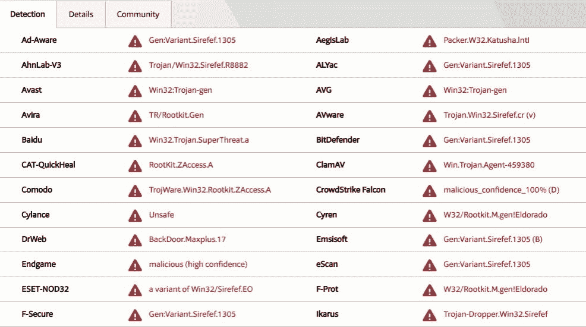

# 概要

恶意软件作者使用各种先进技术来安装其内核驱动程序，并绕过 Windows 安全机制。一旦内核驱动程序安装完成，它可以修改系统组件或第三方驱动程序，从而绕过、偏转并转移你的取证分析。在本章中，你了解了一些最常见的 rootkit 技术，并且我们看到了如何通过内存取证来检测这些技术。内存取证是一项强大的技术，将其作为恶意软件分析的一部分，能极大地帮助你理解对手的战术。恶意软件作者经常想出新的方法来隐藏其恶意组件，因此，仅仅知道如何使用工具是不够的；理解其背后的概念也变得至关重要，以识别攻击者绕过取证工具的努力。
