# 第一章：实验室设置

在本章中，我们将演示为了实际的实验和实践工作经验而需要的完整实验室设置。为了设置实验室，我们需要三样东西：Oracle VM VirtualBox，Microsoft Windows XP SP2 和 BackTrack 5 R2。

Oracle VM VirtualBox 是 Sun Microsystems 的产品。它是一个软件虚拟化应用程序，用于在单台计算机上运行多个操作系统。它支持许多操作系统，包括 Linux，Macintosh，Sun Solaris，BSD 和 OS/2。每个虚拟机可以与主机操作系统并行执行自己的操作系统。它还支持虚拟机内的网络适配器、USB 设备和物理磁盘驱动器。

Microsoft Windows XP 是由微软公司生产的操作系统。它主要用于个人计算机和笔记本电脑。

BackTrack 是一个基于 Linux 的免费操作系统。它被安全专业人员和渗透测试人员广泛使用。它包含许多用于渗透测试和数字取证的开源工具。

现在我们将在 Oracle VM VirtualBox 中安装两个操作系统，并将 BackTrack 用作攻击者机器，Windows XP 用作受害者机器。

# 安装 Oracle VM VirtualBox

安装 Oracle VM VirtualBox 的步骤是：

1.  首先，运行安装文件开始安装过程，然后单击**下一步>**。

1.  现在选择要安装的安装目录，然后单击**下一步>**。

1.  如果要在桌面或启动栏中创建快捷方式图标，请选择快捷方式选项，然后单击**下一步>**。

1.  然后它将重置网络连接并显示警告标志；单击**是**并继续向导的安装。

1.  安装向导已准备好进行安装，请单击**安装**继续。

1.  安装已经开始，并且需要几分钟时间来完成。

1.  现在它将要求安装 USB 设备驱动程序，单击**安装**安装驱动程序软件。

1.  几分钟后，安装向导完成，Oracle VM VirtualBox 已准备就绪。单击**完成**。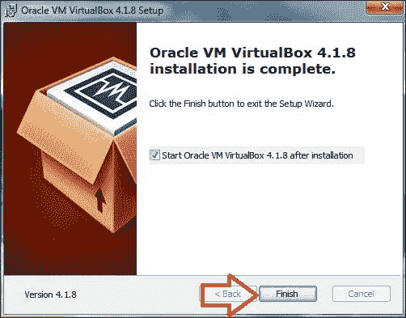

# 在 Oracle VM VirtualBox 上安装 WindowsXP

现在我们将在 VirtualBox 中安装 Windows XP SP2。只需按照以下步骤进行成功安装：

1.  首先，启动您的 VirtualBox，然后单击**新建**。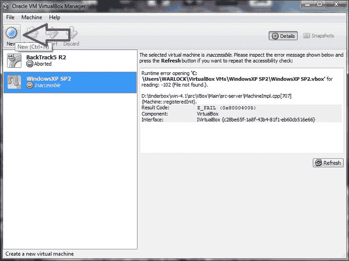

1.  您将获得一个新窗口，其中显示**欢迎使用新虚拟机向导**的消息；单击**下一步**。

1.  您将获得一个新窗口显示内存选项，在这里我们需要指定虚拟机的基本内存（RAM）的数量。选择内存量，然后单击**下一步**。

1.  之后，我们将获得一个新窗口，其中有创建虚拟硬盘的选项。在这里，我们将选择**创建新的硬盘**，然后单击**下一步**。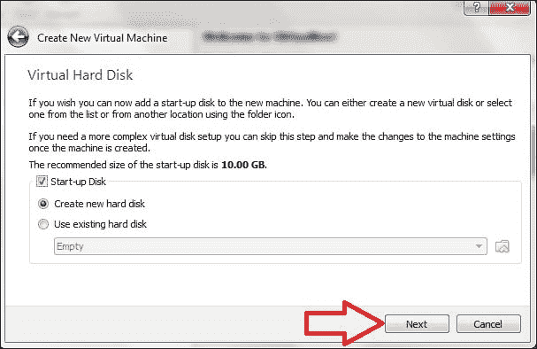

1.  然后我们将获得一个新窗口，其中显示**欢迎使用虚拟磁盘创建向导**的消息。在这里，我们有一些硬盘文件类型的选项；我们选择**VDI（VirtualBox 磁盘映像）**。您可以选择其他类型的文件，但建议选择 VDI 以获得最佳性能。选择文件类型后，单击**下一步**。

1.  然后我们看到一个名为**Virtual disk storage details**的新窗口。在此窗口中，我们可以看到两种存储类型的详细信息：**动态分配**和**固定大小**。这两种存储类型的详细信息在此窗口中提到。因此，这取决于用户可能更喜欢哪种存储。在这种情况下，我们将选择**动态分配**；单击**Next**继续。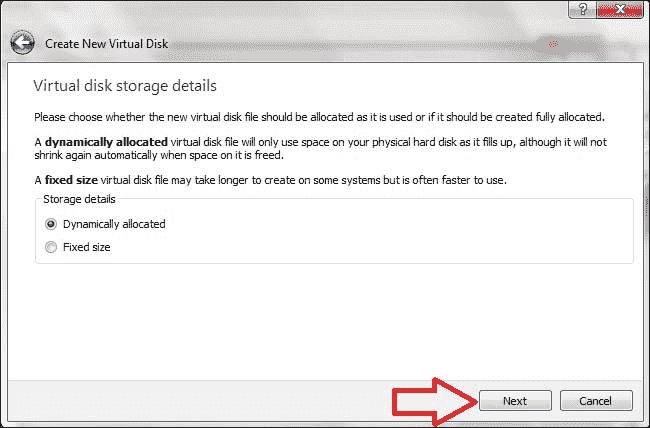

1.  现在我们将得到一个新窗口，其中包含虚拟磁盘文件的**位置**和**大小**选项。我们选择要创建虚拟磁盘文件的位置。之后，选择虚拟磁盘的大小。在这种情况下，我们为虚拟磁盘指定了 10GB 的空间。然后单击**Next**继续。

1.  然后我们得到一个新窗口，其中显示了虚拟机设置的摘要。在此窗口中，我们可以检查先前为虚拟机提供的设置，例如硬盘文件类型，存储详细信息，位置详细信息和硬盘大小。检查设置后，我们然后单击**Create**。

1.  我们得到**Summary**窗口，它将显示将使用以下参数创建虚拟机：虚拟机名称，操作系统类型，基本内存（RAM）和硬盘大小。验证所有设置后，单击**Create**以创建虚拟机。

1.  现在**Oracle VM VirtualBox Manager**将打开，并在右窗格中显示虚拟机。 选择该虚拟机，然后单击**Start**以开始 Windows XP 的安装过程。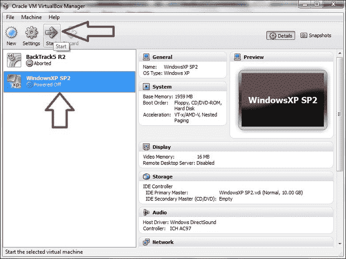

1.  将出现一个带有消息**Welcome to the First Run Wizard!**的新窗口。单击**Next**开始。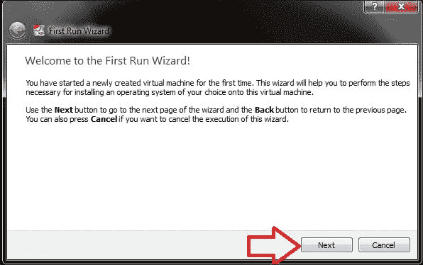

1.  现在将出现一个新窗口，其中包含选择安装媒体源的选项。此选项允许我们选择 Windows XP 的 ISO 映像或 DVD-ROM 驱动器以从 CD / DVD 安装。选择适当的选项，然后单击**Next**。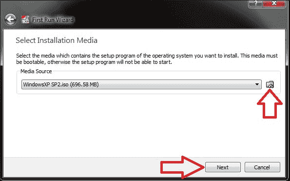

1.  将打开一个新的**Summary**窗口，它将显示所选安装的媒体类型，媒体源和设备类型。单击**Start**。

1.  Windows XP 安装将开始，屏幕上方将出现带有消息**Windows Setup**的蓝屏。

1.  现在我们将得到一个带有消息**Welcome to setup**的新窗口。在这里，我们可以看到三个选项，第一个选项是**现在设置 Windows XP，请按 ENTER**。

1.  然后我们将被提示同意 Windows XP 许可证；按*F8*接受。

1.  接受协议后，我们将看到未分区空间对话框。我们需要从这个未分区空间创建分区。选择第二个选项**在未分区空间中创建分区，请按 C**。

1.  按下*C*后，下一步是设置新分区的大小，然后按**Enter**。

1.  创建新分区后，我们现在可以在这里看到三个选项；选择第一个选项**在所选项目上设置 Windows XP，请按 ENTER**继续。

1.  现在我们必须在继续安装过程之前格式化所选的分区。这里有四个格式化选项，选择第一个选项“使用 NTFS 文件系统（快速）格式化分区”，然后按 Enter。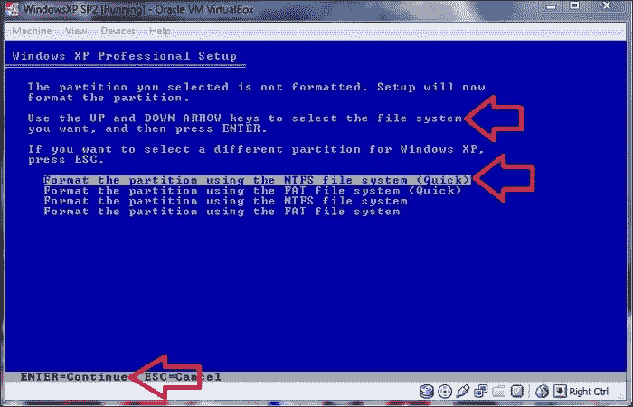

1.  现在设置将格式化分区。

1.  在格式化分区后，设置将复制 Windows 文件。

1.  在复制 Windows 文件后，虚拟机将在 10 秒后重新启动，或者按“回车”立即重新启动。

1.  重新启动虚拟机后，您将看到 Windows XP 启动画面。

1.  Windows 安装过程将开始，并需要大约 40 分钟才能完成。

1.  现在会出现一个新窗口，用于“区域和语言选项”，只需单击“下一步>”。

1.  之后会出现一个新窗口，要求输入“姓名”和“组织”名称；输入这些详细信息，然后单击“下一步>”。

1.  会出现一个新窗口，要求输入“产品密钥”；输入密钥，然后单击“下一步>”。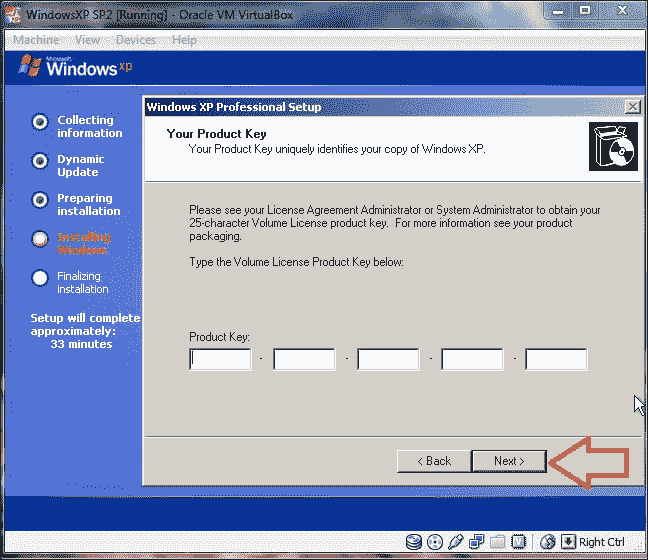

1.  下一个向导将要求输入“计算机名称”和“管理员密码”，输入这些详细信息，然后单击“下一步>”。

1.  接下来会出现一个屏幕，要求输入日期、时间和时区设置。根据您的国家/地区选择时区，输入日期和时间，然后单击“下一步>”。

1.  我们将再次看到安装屏幕，显示“正在安装网络”设置。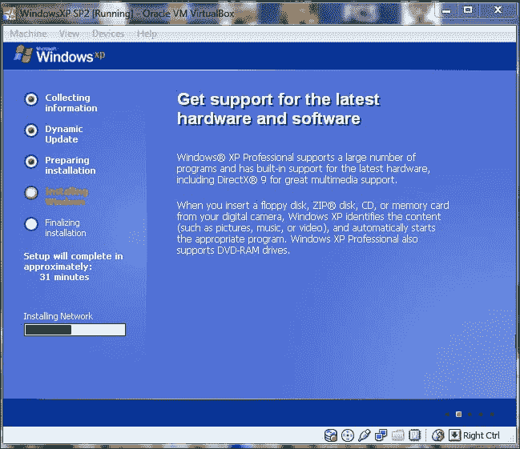

1.  一个新窗口将提示我们选择网络设置。选择“典型设置”。如果我们想手动配置网络设置，可以选择“自定义设置”，然后单击“下一步>”。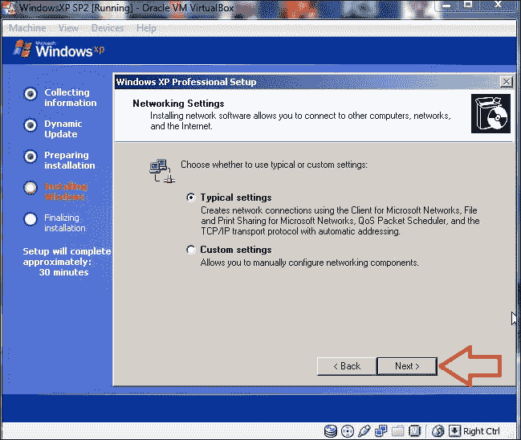

1.  向导将询问我们是否要将计算机加入工作组或域。对于我们的实验室，我们选择“工作组”，然后单击“下一步>”。

1.  然后我们将看到 Windows XP 启动画面。

1.  Windows XP 启动后，我们将看到一条“欢迎使用 Microsoft Windows”的消息。要继续，请单击“下一步”。

1.  向导将询问我们是否要打开自动更新。根据您的偏好进行选择，然后单击“下一步”。

1.  下一个向导将询问有关互联网连接；我们建议您单击“跳过”以跳过。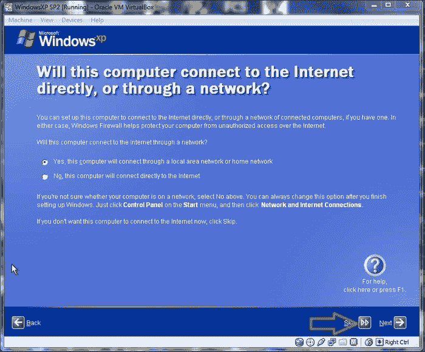

1.  现在向导将询问在线注册的事项；我们不想注册，因此选择第二个选项，然后单击“下一步”。

1.  接下来，向导将要求输入将使用此计算机的人的用户名。输入这些名称，然后单击“下一步”。

1.  您将看到一条“感谢您”的消息；单击“完成”。

1.  现在您的 Windows XP 安装已准备就绪。

# 在 Oracle VM Virtual Box 上安装 BackTrack5 R2

现在我们将在 Virtual Box 上安装 BackTrack 5 R2。执行以下步骤：

1.  首先，启动您的 Oracle VM Virtual Box。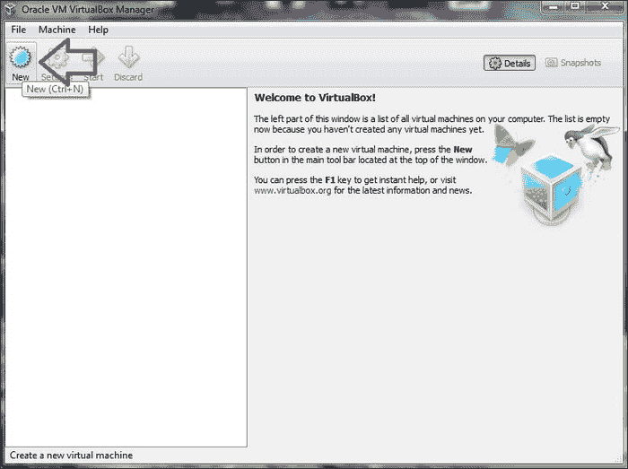

1.  将出现一个新窗口，其中包含消息**Welcome to the New Virtual Machine Wizard**；单击**Next**。

1.  我们遵循了在创建 Windows XP 虚拟机时遵循的相同过程，用于 BackTrack 虚拟机设置。 我们的 BackTrack 机器将被设置，并且摘要将显示如下屏幕截图所示。 单击**Create**：

1.  现在**Oracle VM VirtualBox Manager**将打开，并在右窗格中显示新的虚拟机。 选择该虚拟机，然后单击**Start**以开始安装 BackTrack 5 的过程。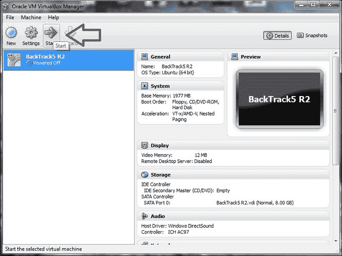

1.  将出现一个新窗口，其中包含消息**Welcome to the First Run Wizard!**；单击**Next**开始。

1.  将出现一个新窗口，其中包含选择安装媒体源的选项。 选择 BackTrack 5 的 ISO 镜像或 DVD 光驱以从 CD / DVD 安装，然后单击**Next**。

1.  将打开一个新的**Summary**窗口，并显示所选安装媒体的类型，媒体源和设备类型；现在单击**Start**。

1.  我们将看到一个黑色的启动屏幕；只需按*Enter*。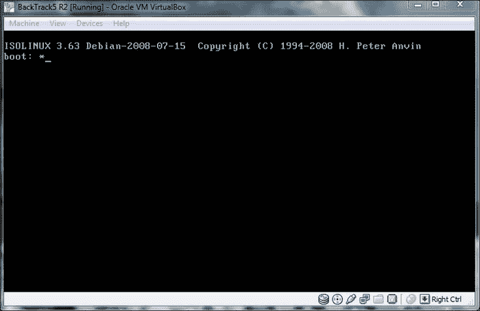

1.  将出现 BackTrack 引导屏幕，显示命令行界面，显示提示：**root@bt:~#**；将`startx`作为此命令的值输入并按*Enter*。

1.  现在 BackTrack GUI 界面将启动，我们将看到一个名为**Install BackTrack**的图标。 我们必须单击该图标以继续安装过程。

1.  之后，安装向导将启动。 选择语言，然后单击**Forward**。

1.  安装向导将自动从网络时间服务器设置时间。

1.  选择**时区**和**地区**，然后单击**Forward**。

1.  下一个向导将要求选择**键盘布局**。 根据您的语言选择适当的布局，然后单击**Forward**。

1.  磁盘分区向导将出现。 只需使用默认设置，然后单击**Forward**。

1.  现在单击**Install**。

1.  设置将开始复制文件。 完成安装大约需要 40 分钟。

1.  安装完成后，只需单击**Restart**，现在 BackTrack 安装已准备就绪。

# 摘要

在这个实验室设置中，我们已经设置了受害者和攻击者机器，我们将在实际会话中使用它们。 下一章将介绍 Metasploit 框架的组织，基础知识，架构以及简要介绍。
