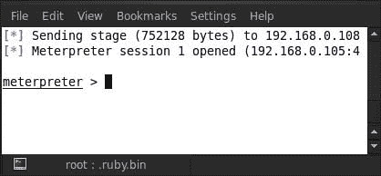
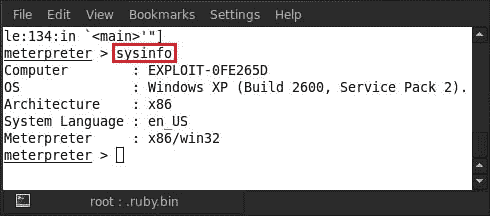
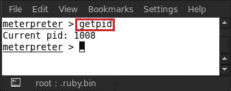
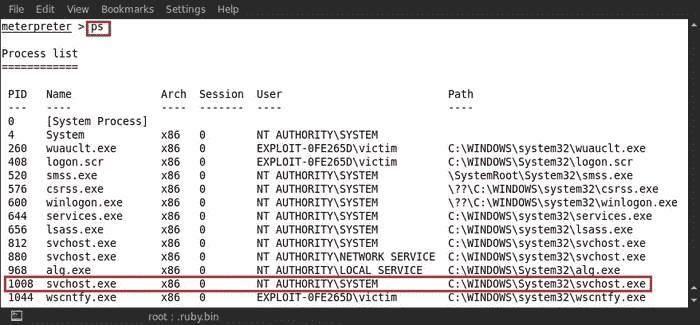
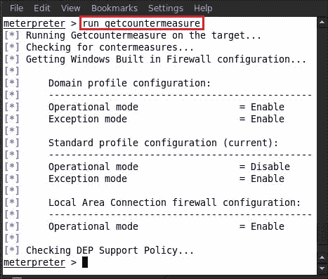
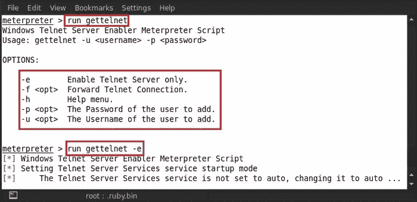

# 第七章：后期利用

在上一章中，我们能够破坏系统并获得对 meterpreter 的访问。现在一旦我们访问了系统，我们的主要重点是尽可能多地从系统中提取信息，同时对用户不可见。这将包括可以在攻击者系统上离线分析的信息，例如 Windows 注册表转储、密码哈希转储、屏幕截图和音频记录。在本章中，我们将详细解释后期利用的概念及其各个阶段。我们还将进一步介绍后期利用的各种技术的教程。

# 什么是后期利用？

正如术语所暗示的，**后期利用**基本上意味着一旦受害系统被攻击者入侵，操作的阶段。受损系统的价值取决于其中存储的实际数据的价值，以及攻击者可能如何利用它进行恶意目的。后期利用的概念正是源自这一事实，即您如何使用受害者受损系统的信息。这个阶段实际上涉及收集敏感信息，记录它，并了解配置设置、网络接口和其他通信渠道。这些可能被用来根据攻击者的需求维持对系统的持久访问。

## 后期利用阶段

后期利用的各个阶段如下：

+   了解受害者

+   权限提升

+   清理痕迹并保持不被发现

+   收集系统信息和数据

+   设置后门和 rootkit

+   转向渗透内部网络

### 教程

到目前为止，我们知道如何利用一个易受攻击的系统。我们可以在以下截图中看到，我们已经有一个 meterpreter 会话正在运行。现在我们将开始后期利用的第一阶段，尽可能收集尽可能多的信息。

1.  首先，我们将通过执行`sysinfo`命令来检查系统信息。输入`sysinfo`：

1.  执行命令后，我们可以看到计算机名称为**EXPLOIT**。运行在受害者系统上的操作系统是带有 x86 架构的 Windows XP 服务包 2。使用的语言是美国英语。让我们检查具有 meterpreter 附加到它的进程。为此，我们使用`getpid`命令，因此输入`getpid`，它将显示 meterpreter 的进程 ID：

1.  `getpid`命令显示的进程 ID 为**1008**。现在我们将检查受害系统进程列表中正在运行的进程，因此输入`ps`命令：

我们可以清楚地看到进程**1008**正在作为`svchost.exe`运行；它位于`windows/system32`目录下。

1.  现在检查受害者的系统是否是虚拟机。为此，输入`run checkvm`命令：

运行后利用脚本后，它检测到操作系统正在 VirtualBox 虚拟机下运行。

1.  现在让我们检查受害者是否活跃。为此，我们输入`idletime`。执行此脚本将显示受害者的最近活动时间：

受害者活跃并且他们最近的活动只有 16 秒。

1.  通过执行`run get_env`命令运行另一个 meterpreter 脚本来检查受害者的系统环境：

我们可以看到系统的环境信息，例如处理器数量、操作系统、Windows 目录路径等。

1.  现在让我们通过输入`ipconfig`命令来检查受害系统的 IP 地址：

1.  在这里，我们可以看到受害者 PC 的 IP 地址；现在如果我们想要查看完整的网络设置，我们将输入`route`命令：

在这里，我们可以看到受害者系统的网络路由设置。

1.  我们运行的另一个重要脚本用于映射受害者系统的安全配置，称为`countermeasure`。输入`run getcountermeasure`：

通过运行此脚本，我们可以看到防火墙配置文件。

1.  现在我们将启用受害者的远程桌面协议服务。输入`run getgui`；它显示可用选项的列表。我们可以在**OPTIONS**中看到`-e`语法用于启用 RDP，因此输入`run getgui -e`命令：

1.  我们期望在 Windows 操作系统上启用的另一个常见服务是`telnet`服务。`gettelnet`脚本用于在受损的机器上启用`telnet`服务。因此，输入`run gettelnet`，它将显示可用选项的列表。我们可以注意到**OPTIONS**部分中使用`-e`来启用`telnet`服务，因此输入`run gettelnet -e`：

1.  让我们通过运行另一个脚本来查看受害者的本地子网。输入`run get_local_subnets`命令：

我们可以在前面的截图中看到受害者系统的本地子网。

1.  另一个有趣的脚本是`hostedit`。它允许攻击者在 Windows 主机文件中添加主机条目。输入`run hostedit`：

1.  运行此脚本后，我们可以看到`hostedit`的使用语法。输入`run hostedit -e 127.0.0.1, www.apple.com`：

在这里，我们可以看到已将主机记录添加到受害者的主机文件中。

1.  为了验证，我们可以打开受害者系统目录`c:\windows\system32\drivers\etc\`。在这里，我们可以找到主机文件，并在记事本中打开此文件，我们可以看到已添加的主机：

1.  现在让我们列举一下目前在受害者系统上已登录的用户数量。为此，我们将输入`run enum_logged_on_users`。使用此命令会显示可用选项的列表，我们可以在**OPTIONS**中看到`-c`用于当前已登录用户。因此，输入`run enum_logged_on_users`：

在前面的截图中，我们可以看到用户/受害者当前已登录到系统中。

1.  在列举用户之后，我们接着列举受害者系统上安装的应用程序。因此，要列举已安装应用程序的列表，我们只需要输入`run get_application_list`，它将显示所有已安装的应用程序：

在前面的截图中，我们可以看到已安装应用程序的列表。

1.  之后，我们继续列举受害者的驱动器信息，以收集物理驱动器信息。输入`run windows/gather/forensics/enum_drives`：

在前面的截图中，我们可以看到驱动器名称和字节大小。

1.  我们还可以看到受害者操作系统的产品密钥。这是一个了不起的脚本，可以通过输入`run windows/gather/enum_ms_product_keys`来使用；它将显示序列号：

使用此命令，在前面的截图中，我们可以看到安装在受害者 PC 上的 Windows 操作系统的产品密钥。

1.  现在让我们通过运行另一个 meterpreter 脚本来检查受害者系统中的 Windows`autologin`功能。输入`run windows/gather/credentials/windows_autologin`：

我们可以看到在前面的截图中，受害者系统的用户名是`victim`，密码为空。他正在使用他的系统而不需要密码。

1.  现在我们要运行的另一个重要脚本是用于枚举系统信息。这将通过运行不同的实用程序和命令从受害者系统中转储一些有价值的信息，如哈希和令牌。键入`run winenum`：

1.  在运行脚本后，我们注意到许多命令在受害者系统上运行，并且所有报告都保存在`/root/.msf4/logs/scripts/winenum/EXPLOIT-0FE265D 20130327.2532`目录中。现在我们可以浏览此目录并查看一些结果：

1.  在这个目录中，我们可以看到一些数据以 TXT 和 CSV 格式保存。现在我们可以根据需要打开任何报告。在这里，我们正在打开`hashdump.txt`，所以键入`cat hashdump.txt`：

在这里我们可以看到不同用户的所有转储哈希。

1.  我们将在此实验中使用的最后一个脚本称为`scraper`。此脚本可用于从受害者系统中转储其他枚举脚本中未包含的附加信息（例如提取整个注册表键）。键入`run scraper`：

我们可以在前面的截图中看到，在运行脚本后，它开始转储哈希、注册表键和基本系统信息，并将报告保存在`.msf4/logs/scripts/scraper/192.168.0.104_20130327.563889503`目录中。

我们可以看到许多结果以 TXT 格式保存在这个目录中。

1.  现在我们将打开一个结果作为示例，所以键入`cat services.txt`：

在前面的截图中，我们可以看到受害者系统上运行的不同 Windows 服务。

# 摘要

在本章中，我们经历了后渗透的第一阶段，试图更好地了解我们的受害者。一旦我们有了 meterpreter 会话运行，我们利用它来收集重要的系统信息、硬件详细信息等。我们使用 meterpreter 脚本来转储 Windows 注册表和密码哈希。攻击者能够获得受害者机器上安装的程序列表。使用后渗透技术，我们能够枚举受害者的硬盘信息，包括物理和逻辑分区。进一步渗透受害者系统，我们可以收集网络信息并对主机记录文件进行更改。在下一章中，我们将继续进行后渗透的下一个阶段：权限提升。

# 参考资料

以下是一些有用的参考资料，可以进一步阐明本章涉及的一些主题：

+   [`www.pentest-standard.org/index.php/Post_Exploitation`](http://www.pentest-standard.org/index.php/Post_Exploitation)

+   [`www.securitytube.net/video/2637`](http://www.securitytube.net/video/2637)

+   [`cyruslab.wordpress.com/2012/03/09/metasploit-post-exploitation-with-meterpreter-2/`](http://cyruslab.wordpress.com/2012/03/09/metasploit-post-exploitation-with-meterpreter-2/)

+   [`em3rgency.com/meterpreter-post-exploitation/`](http://em3rgency.com/meterpreter-post-exploitation/)
