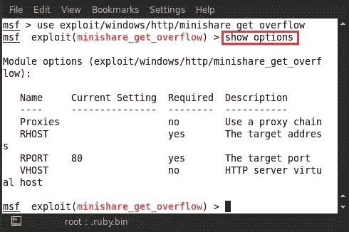
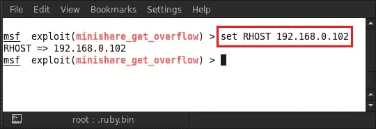
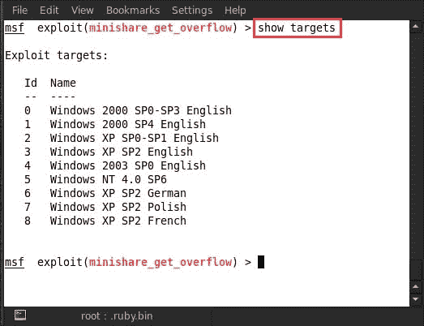
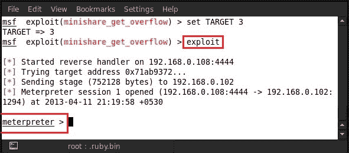
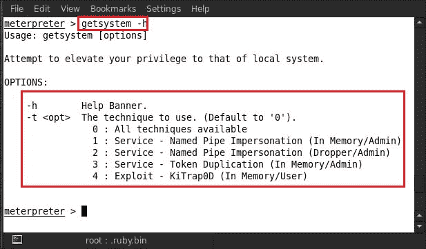
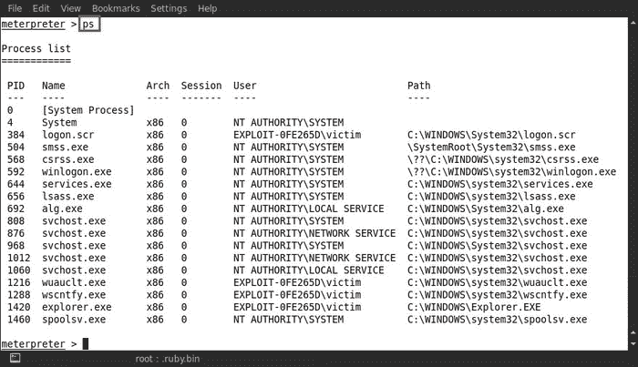
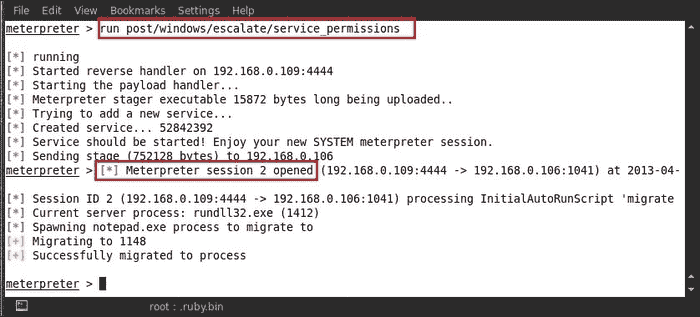
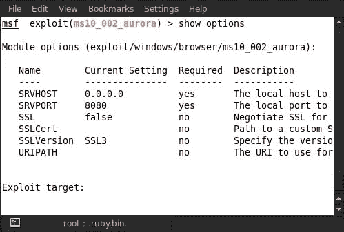
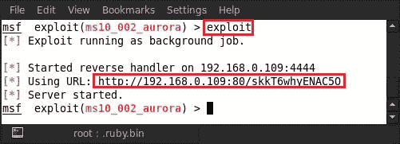

# 第八章：后期利用-特权提升

在上一章中，我们介绍了后期利用技术。后期利用分为五个不同的阶段。本章将深入了解后期利用的第一个阶段，即特权提升。我们将介绍如何在获得对系统访问权限后提升我们的特权的新技术和诀窍。

# 理解特权提升

简而言之，特权提升是获取对通常受保护且拒绝普通或未经授权用户访问的资源的提升特权。通过提升的特权，恶意用户可能执行未经授权的操作，对计算机或整个网络造成损害。特权提升后可以做的一些简单示例包括安装用于不道德用途的恶意软件、删除用户文件、拒绝特定用户的资源访问以及查看私人信息。它通常是通过利用基于漏洞的漏洞来妥协系统而发生的。这种安全配置错误或弱点可能导致安全边界或身份验证被绕过，从而实现特权提升。

特权提升大致分为两种主要形式：

+   **垂直特权提升**：在这种特权提升中，较低特权的用户或应用程序可能访问仅供授权或管理员用户使用的功能。这个功能也被称为特权提升。

+   **水平特权提升**：这种特权提升通常在水平尺度上发生，涉及用户权限。普通用户访问为另一个普通用户保留的资源。这再次是对其他人资源的提升，因为从技术上讲，只有他应该对他的资源拥有特权。

由于多种原因可能存在特权提升的情况-网络入侵、漏洞暴露、未管理的帐户、安全性模糊等。通常采用的方法是登录并尝试获取有关计算机的一些基本信息，类似于信息收集场景。然后攻击者可能会尝试获取私人信息，或者可能与一些重要文件相关联的一些用户凭据。

如果我们谈论 Metasploit，运行客户端漏洞利用只会给我们带来具有有限用户权限的会话。这可能严重限制攻击者妥协受害者机器到他想要的级别；例如，他可能无法转储密码哈希、更改系统设置或安装后门木马。通过 Metasploit 中非常强大的脚本，例如 getsystem，我们可能能够在根系统上获得系统级权限。

## 利用受害者的系统

现在我们将开始特权提升的教程阶段。在这里，我们将通过在一个名为 Mini-share 的小型程序中运行缓冲区溢出利用来利用受害者的系统。Mini-share 是免费的文件共享软件。它是用于 Microsoft Windows 的免费 Web 服务器软件。如果您有 Web 托管，这是一种快速简便的文件共享方式。现在打开`msfconsole`并输入`use exploit/windows/http/minishare_get_overflow`。

之后，输入`show options`以详细查看我们在利用中需要设置的所有选项。

现在设置所有必需的选项；正如我们在前面的截图中所看到的，`RHOST`是必需的。`RHOST`选项是指远程主机地址，即目标 IP 地址。输入`set RHOST <受害者 IP>`；例如，在这里我们使用`set RHOST 192.168.0.102`。

第二个必需的选项是`RPORT`。`RPORT`选项是指远程端口地址，即目标端口号。输入`set RPORT <受害者端口>`；例如，在这里我们使用`set RPORT 80`。

现在选择目标系统类型。输入 `show targets`，它将显示所有易受攻击的目标操作系统。

现在根据受害者的系统选择目标。在这里，我们选择目标 3。所以我们输入 `set TARGET 3`。

现在是利用目标的时候。所以我们输入 `exploit`。

我们可以看到在利用受害者的机器后，我们有一个 `Meterpreter` 会话。让我们偷偷看一下受害者的系统。输入 `getuid` 来获取用户 ID。从下面的截图中我们可以看到用户 ID 是 `NT AUTHORITY\SYSTEM`。

之后，我们运行 `getsystem -h` 来升级受害者系统中的权限。

我们可以在之前的截图中看到运行 `getsystem -h`，给了我们一堆特权升级的选项。第一个选项是 `0：所有可用技术`，它使用默认的所有技术来升级特权。

特权升级选项中使用的术语如下：

+   **命名管道**：它是一种机制，使应用程序能够在本地或远程进行进程间通信。创建管道的应用程序称为管道服务器，连接到管道的应用程序称为管道客户端。

+   **模拟**：它是线程以与拥有该线程的进程不同的安全上下文中执行的能力。模拟使服务器线程能够代表客户端执行操作，但在客户端的安全上下文的限制内。当客户端拥有比服务器更多的权限时，问题就出现了。操作系统的每个用户都提供了一个唯一的令牌 ID。该 ID 用于检查系统中各个用户的权限级别。

+   **令牌复制**：它通过低权限用户复制高权限用户的令牌 ID 来工作。然后低权限用户以与高权限用户类似的方式行事，并获得与高权限用户相同的所有权利和权限。

+   **KiTrap0D**：它于 2010 年初发布，影响了微软此前制作的几乎所有操作系统。当在 32 位平台上启用对 16 位应用程序的访问时，它未正确验证某些 BIOS 调用，这允许本地用户通过在线程环境块（TEB）中制作 VDM_TIB 数据结构来获得特权，从而不正确地处理涉及#GP 陷阱处理程序（nt!KiTrap0D）的异常，也称为 Windows 内核异常处理程序漏洞。

让我们使用第一个选项，通过输入 `getsystem -t 0` 来使用所有可用的技术。

我们可以看到在运行命令 `...got system (via technique 1).` 后的消息。现在我们通过输入 `ps` 命令来检查进程列表。

## 通过后期利用进行特权升级

现在我们将展示另一种特权升级技术 - 使用后期利用模块。该模块使用内置的 `getsystem` 命令将当前会话从管理员用户帐户升级到系统帐户。当我们获得一个 `Meterpreter` 会话时，输入 `run post/windows/escalate/getsystem`。该模块将自动升级管理员权限。

现在我们将使用另一个后期利用脚本进行本地权限提升。该模块利用现有的管理权限来获得一个 SYSTEM 会话。如果第一次失败，该模块会检查现有的服务，并寻找易受攻击的不安全文件权限。之后，它会尝试重新启动替换的易受攻击的服务来运行有效载荷。因此，成功利用后会创建一个新会话。

输入`run post/windows/escalate/service_permissions`；它将打开另一个`Meterpreter`会话。

只需尝试不同的入侵目标系统的方法，然后提升管理员权限。输入`use exploit/windows/browser/ms10_002_aurora`。

现在输入`show options`以详细查看我们需要在入侵中设置的所有选项。

之后，设置所有在前面截图中显示的必需选项。`SRVHOST`选项是指要监听的本地主机地址。输入`set SRVHOST <受害者 IP>`；例如，这里我们使用`set SRVHOST 192.168.0.109`。

最后，我们通过输入`exploit`来利用目标。

我们可以看到 Metasploit 创建了一个 URL。现在我们只需要把这个 URL 给受害者，并引诱他点击它。在 Internet Explorer 中打开这个 URL 后，受害者将获得一个`Meterpreter`会话，之后你可以进行权限提升攻击。

# 摘要

在本章中，我们学习了如何在我们已经入侵的系统中提升我们的权限。我们使用了各种脚本和后期利用模块来完成这项任务。我们的最终目标是获得系统管理员的权限级别，以便根据我们的需求使用受害者的机器。我们成功地完成了这项任务，并获得了对受害者机器的管理员权限。仅仅入侵系统并不能实现最终目标；我们需要能够泄露受害者的私人信息或对他的计算机进行严重更改。通过 Metasploit 进行权限提升的能力解锁了这种力量，并帮助我们实现了我们的目标。在下一章中，我们将继续进行下一个后期利用阶段——清除我们的痕迹，以免在我们入侵系统后被抓住。

# 参考资料

以下是一些有用的参考资料，可以进一步了解本章涉及的一些主题：

+   [`en.wikipedia.org/wiki/Privilege_escalation`](http://en.wikipedia.org/wiki/Privilege_escalation)

+   [`www.offensive-security.com/metasploit-unleashed/Privilege_Escalation`](http://www.offensive-security.com/metasploit-unleashed/Privilege_Escalation)

+   [`vishnuvalentino.com/tips-and-trick/privilege-escalation-in-metasploit-meterpreter-backtrack-5/`](http://vishnuvalentino.com/%E2%80%A8tips-and-trick/privilege-escalation-in-metasploit-meterpreter-backtrack-5/)

+   [`www.redspin.com/blog/2010/02/18/getsystem-privilege-escalation-via-metasploit/`](http://www.redspin.com/blog/2010/02/18/getsystem-privilege-escalation-via-metasploit/)

+   [`www.securitytube.net/video/1188`](http://www.securitytube.net/video/1188)
