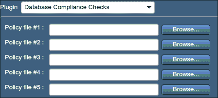
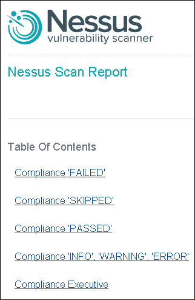

# 第五章：合规性检查

Nessus 以漏洞扫描器而闻名，但它也提供了进行合规性检查的选项。使用这个选项，可以交叉检查基础设施（如服务器、网络设备、数据库和桌面）的安全配置设置是否符合组织正在遵循的定义的政策或最佳实践。

合规性检查审计是一个重要且必要的功能，根据组织当前的安全需求。所有具有安全意识的组织都为其 IT 和网络基础设施定义和实施安全配置设置，以防止它们因任何错误配置而受到安全威胁的威胁。此外，由于监管要求，当公司必须遵守不同的合规性法规时，也会出现对安全加固和实施检查的合规性要求，例如信息安全管理系统的 ISO 27001、医疗行业的 HIPAA 和金融领域的 SOX。

检查服务器、网络设备是否符合这些定义的控制措施或安全配置，需要进行定期的合规性检查活动。手动进行这样的合规性检查，特别是当基础设施规模较大，甚至在每台设备的采样和要检查的控制数量较多时，将是一项繁琐且耗时的工作。这可能还会导致错误的可能性，以及在操作和合规团队之间进行准备、验证和修正工作时所消耗的时间。

Nessus 提供的合规性检查选项将有助于以自动化的方式进行此类检查。Nessus 还提供了修改合规性文件的选项，使其符合组织的设备加固政策。

### 提示

**漏洞扫描**通常会识别系统中存在的众所周知的漏洞，为此插件是可用的，并会识别缺失的补丁。

**审计**将检查基础设施是否符合本地政策中定义的安全配置。

在漏洞扫描期间减少漏洞并不意味着系统已经安全配置。例如，如果一个组织的密码策略要求最少 10 个字符，因为它处理敏感信息，那么一台服务器可能已经更新了补丁，或者在进行 VA 扫描时漏洞相对较少。这是因为服务器不会确保配置了 10 个字符的密码策略。这个功能在 Nessus 专业版中是可用的。

Nessus 的合规性检查适用于主要平台，如服务器操作系统（Windows 和 Unix）、数据库、桌面和网络设备，以及 PCI DSS 等审计标准。

本章将涵盖以下主要领域：

+   审计策略

+   如何配置 Nessus 合规性检查策略

+   Nessus 中的合规性报告

+   不同类型基础设施的合规性检查选项

# 审计策略

要进行这些合规性审计，文件中提供了`.audit`扩展名的策略，适用于不同的基础设施元素，如数据库、Windows 和 Cisco。这些审计文件还包含了 SOX 和 PCI-DSS 等众所周知标准所涵盖的常见检查点。这些文件还包含了来自众所周知的安全治理和咨询机构，如 NIST 和 CERT 的建议。

这些审计文件可以根据本地政策或加固文件进行调整。Tenable 提供了从其支持站点下载这些审计文件的选项，并提供了解这些文件语法的文档，以便根据您的要求进行定制。Tenable 还提供了将具有`.inf`扩展名的 Windows 策略文件转换为具有`.audit`扩展名的文件的工具。

要启用合规性检查选项，最终用户首先需要点击**+添加策略**。合规性检查选项可在**策略** | **插件** **首选项**下找到。

在各种 Nessus 插件中，用于合规性检查的感兴趣的插件系列是**策略合规性**。该插件检查涵盖了不同的基础设施组件，如服务器和网络。

以下屏幕截图显示了**策略合规性**插件系列：

要使用自定义的审计文件，可以在**策略**下使用**首选项**选项。在**首选项**选项卡下，有一个下拉菜单，可以选择不同的合规性检查，如**Cisco IOS 合规性检查**和**数据库合规性检查**。在这里，用户还可以选择并上传多个用于执行合规性检查的审计文件。

以下屏幕截图显示了所选的**数据库合规性检查**选项：

## 凭证

要进行合规性检查，Nessus 需要提供凭证以便登录系统进行本地检查。使用的凭证应该是特权帐户的凭证，即在 Unix 帐户的情况下是超级用户特权，具有读取本地机器策略的管理特权。在进行数据库合规性检查时，将需要数据库凭证。在进行 Cisco IOS 合规性检查时，将需要启用密码进行配置审计。凭证可以在**策略** | **凭证**下添加，就像在进行 VA 扫描时所做的那样。

以下屏幕截图是在进行 Cisco 配置审计时提供凭证的示例：

# 合规性报告

为了获得与目标的合规状态相关的报告，Nessus 在保存报告时提供了**合规性检查**和**合规性检查（执行）**等选项。使用这些选项之一，可以获取系统针对`.audit`文件中的控制的合规状态。报告中会提到合规性是否失败、通过或跳过，以及执行摘要。不确定的测试会在错误和警告下报告。

以下屏幕截图展示了使用**合规性检查**和**合规性检查摘要**选项生成的报告：

# 审计基础设施

合规性插件可在**策略合规性**插件系列下找到。该部分列出了该系列下可用的插件，展示了可以进行合规性审计的基础设施类型。对于每种基础设施元素，如服务器、网络和数据库，需要选择适当的策略文件、凭证和插件，如本章前面提到的部分所述。

## Windows 合规性检查

使用该插件，可以检查 Windows 框架**策略**选项下设置的合规性参数。在 Windows 审计中进行的一些检查的示例包括以下内容：

+   注册表设置

+   文件权限

+   密码策略

+   锁定策略

+   审计策略

+   用户权限策略

+   服务审计

## Windows 文件内容

**Windows 文件内容**选项允许 Nessus 检查 Windows 文件类型（Excel、Adobe 或文本文件），这些文件可能包含个人可识别信息（PII）和信用卡详细信息等敏感数据。

## Unix 合规性检查

Nessus 可以对 Solaris、Red Hat、AIX、HP-UX、SUSE、Gentoo 和 freebsd 等不同版本的 Unix 进行合规性检查。关键检查包括以下内容：

+   密码管理

+   文件权限

+   密码文件管理

+   权限管理

+   根访问管理

+   运行进程

## Cisco IOS 合规性检查

使用此插件，可以检查运行 Cisco IOS 设备配置文件的 Cisco 设备。合规性检查可以针对已保存、运行或启动的配置进行。示例包括以下内容：

+   接口应用的访问列表

+   SNMP 社区字符串受 ACL 保护

+   未被禁用的不必要服务

+   更改了 SNMP 默认社区字符串

## 数据库合规性检查

Nessus 还可以检查不同数据库是否符合安全策略的合规性。支持的数据库包括 MS SQL、Oracle、MySQL PostgreSQL、IBM DB2 和 Informix/DRDA。为了确保报告的完整性，用于登录数据库的帐户应具有 SYSDBA 或 SA 权限。数据库合规性检查插件通常使用`SELECT`查询从数据库中获取安全配置。以下是一些示例：

+   检查是否存在没有到期详细信息的登录

+   检查未经授权的存储过程是否已启用

## PCI DSS 合规性

**支付卡行业数据安全标准**（**PCI-DSS**）是一种用于支付卡的知名标准。Nessus 提供 PCI DSS 合规性插件，以检查配置是否符合该标准的要求。

## VMware vCenter/vSphere 合规性检查

VMware vCenter/vSphere 合规性检查插件使用 VMware SOAP API 来审计 ESX VMware、ESXi 和 vCenter/vSphere 虚拟化软件。进行审计的凭据信息可以添加到策略的**VMware vCenter SOAP API 设置**中的**高级**部分。示例包括以下内容：

+   缺少补丁

+   缺少安全更新

Nessus 合规性检查选项中还包括以下其他平台（请在 Tenable 官方网站[`support.tenable.com/`](https://support.tenable.com)上交叉检查更新的文档）本章的部分内容参考自 Nessus 网站[`www.tenable.com`](http://www.tenable.com)上可用的学习材料：

+   IBM iSeries 合规性检查

+   Juniper Junos 合规性检查

+   NetApp Data ONTAP 合规性检查

+   Palo Alto Network PAN-OS 合规性检查

+   Check Point GAiA 合规性检查

### 提示

合规性插件仅适用于专业订阅客户。

# 摘要

Nessus 提供使用该工具进行自动合规性检查的选项，除了漏洞扫描。使用此选项，可以交叉检查基础设施的安全配置设置（如服务器、网络设备和数据库）是否符合组织正在遵循的定义策略或最佳实践。合规性要求也源自组织遵守的不同合规性标准。此功能仅适用于专业订阅用户。

**策略合规性**插件系列可用于合规性检查扫描。该插件系列包括但不限于服务器、网络设备和 PCI DSS 等标准。Nessus 的**结果**选项卡还提供了一个**合规性**选项，可以在保存输出时专门生成合规性报告。这些合规性检查可以通过使用`.audit`文件进行修改。需要在工具中更新正在执行合规性审计的基础基础设施的适当凭据。
