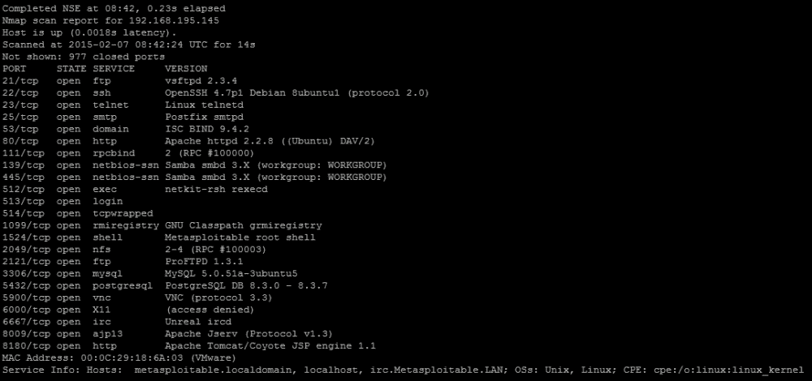
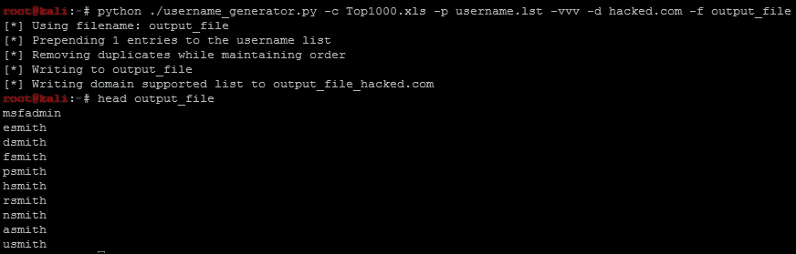
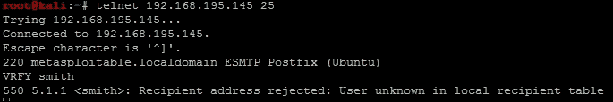
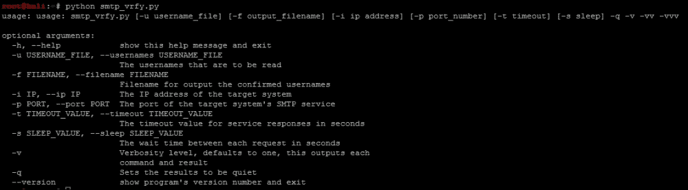
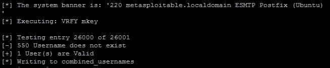

# 第四章。使用 Python 执行凭证攻击

凭证攻击有多种形式，但往往被认为是渗透测试的最后一步，当其他方法都失败时。这是因为大多数新的评估者以错误的方式对待它。在讨论新评估者用于凭证攻击的工具时，最常用的两种攻击是在线字典和暴力攻击。他们通过下载包含密码和大量用户名列表的巨大字典，并针对接口运行它。当攻击失败时，评估者会进行暴力攻击。

这种攻击要么使用相同的用户名列表，要么使用超级用户（root）或本地管理员帐户。大多数情况下，这也会失败，因此字典攻击最终会被认为是不好的，并被移到参与过程的最后。这是非常错误的，因为在大多数参与过程中，特别是在面向互联网的姿态上，如果正确执行凭证攻击，您将获得访问权限。第一章，*理解渗透测试方法论*和第三章，*使用 Nmap、Scapy 和 Python 识别目标*向您介绍了一些基本的字典攻击概念，本章将在此基础上进行深入，并帮助您了解如何以及何时使用它们。在开始执行这些攻击之前，您需要对攻击类型有一个牢固的理解。

# 凭证攻击的类型

在讨论凭证攻击时，人们很容易就会想到密码攻击。请记住，对资源的认证和授权通常需要两个组件，即密码和用户名。如果您不知道密码所属的用户名，即使您拥有全世界最常用的密码也没有用。因此，凭证攻击是我们使用用户名和密码来评估资源的方式。有针对性地获取用户名的方法将在后面介绍，但现在我们必须定义密码攻击的总体类型，即在线和离线。

## 定义在线凭证攻击

在线凭证攻击是指当您针对接口或资源进行强制认证时所做的操作。这意味着您可能不知道用户名、密码，或两者都不知道，并且正在尝试确定正确的信息以获得访问权限。这些攻击是在您未能访问能够提供哈希值、明文密码或其他受保护形式数据的资源时执行的。相反，您正在尝试根据您所做的研究来做出合理的猜测。在线攻击的类型包括字典、暴力和密码喷洒攻击。请记住，资源可以是联合或集中系统的一部分，例如**Active Directory**（**AD**），或者是主机本身的本地帐户。

### 提示

对于那些喊着“混合攻击呢？”的人，大多数评估者认为它是字典攻击的一种形式，因为它只是一个单词列表的排列。如今，你几乎找不到不包含混合词的字典了。在 20 世纪 90 年代，这种情况比较少见，但随着更好的教育和更强大的系统以及经过验证的密码要求，情况已经发生了改变。

## 定义离线凭证攻击

离线凭证攻击是指当您已经破解了一个资源并提取了哈希等数据后，现在正在尝试猜测它们。这可以通过多种方式来完成，取决于哈希的类型和可用的资源，一些例子包括离线字典、基于规则的攻击、暴力攻击或彩虹表攻击。我们之所以称之为离线凭证攻击而不是离线密码攻击，是因为您正在尝试猜测密码的明文版本，而这个系统并非密码的原始来源。

这些密码哈希可能已经用随机信息或已知组件（如用户名）进行了盐化。因此，您可能仍然需要知道用户名才能破解哈希，因为盐是增加随机性的一个组成部分。现在，我已经看到一些实现使用用户名作为哈希算法的盐，这是一个非常糟糕的主意。支持这一观点的论据是，盐和用户名一样都与密码一起存储，那么这有什么关系呢？在系统中广泛使用的已知用户名，如 root、administrator 和 admin，在系统被破坏之前就已知，以及已知的加密方法，这开启了一个重大的漏洞。

这意味着盐是基于用户名的，这意味着在获得对环境的访问权限之前和参与开始之前就已知。因此，您已经有效地打败了为使破解密码更加困难而制定的机制，包括使用彩虹表。在参与开始之前已知盐意味着彩虹表对于盐化密码同样有用，只要您有一个可以处理数据的工具。

### 提示

糟糕的盐方法和自定义加密方法可能会使组织面临妥协。

离线攻击依赖于采用一个单词并使用相同的保护方法以相同格式创建哈希值作为受保护密码的前提。如果受保护的值与新创建的值相同，那么您将获得一个等效的单词并获得访问权限。大多数密码保护方法使用哈希处理来模糊值，这是一个单向函数，或者换句话说，它不能被逆转，因此该方法无法被逆转以产生原始值。

因此，当系统通过其认证方法接受密码时，它会以相同的方法对密码进行哈希处理，并将存储的哈希值与新计算的哈希值进行比较。如果它们相等，您就有了合理的保证，密码是相同的，访问将被授予。合理保证的概念取决于哈希算法的强度。一些哈希算法被认为是薄弱或破碎的，例如**消息摘要 5**（**MD5**）和**安全哈希算法 1**（**SHA-1**）。其原因是它们容易发生碰撞。

碰撞意味着所保护数据的数学可能性不具备足够的熵，以保证不同的哈希值不会等于相同的内容。事实上，由相同破碎算法哈希的两个完全不同的单词可能会创建相同的哈希值。因此，这直接影响了系统的认证方法。

当有人访问系统时，输入的密码以与系统上存储的密码相同的方法进行哈希处理。如果两个值匹配，那意味着理论上密码是相同的，除非哈希算法是薄弱的。因此，在评估系统时，您只需找到一个值，该值将创建与原始值相同的哈希。如果发生这种情况，您将获得对系统的访问权限，这就是已知碰撞的哈希的弱点所在。您不需要知道创建哈希的实际值，只需找到一个等效值，该值将创建相同的哈希。

### 提示

在撰写本文时，MD5 用于验证取证的文件系统和数据的完整性。尽管 MD5 被认为是一个破碎的哈希，但它仍被认为对于取证和文件系统的完整性来说是足够好的。其原因是要欺骗算法以大量数据集（如文件系统）需要付出不可行的工作量。在数据被调整或提取后操纵文件系统以创建相同的完整性标记是不现实的。

现在您已经了解了离线和在线凭据攻击的区别，我们需要开始生成用于它们的数据。首先是生成用户名，然后验证它们是否属于组织的一部分。这似乎是一个小步骤，但它非常重要，因为它可以缩减您的目标列表，减少您产生的噪音，并提高您攻击组织的机会。

# 识别目标

我们将以 Metasploitable 为例，因为它将允许您在安全和合法的环境中测试这些概念。首先，让我们对系统进行一个简单的`nmap`扫描，进行服务检测。以下命令突出了特定的参数和选项，它执行 SYN 扫描，寻找系统上的知名端口。

```py
nmap -sS -vvv -Pn -sV<targetIP>

```

从结果中可以看出，主机被识别为 Metasploitable，并且有许多端口开放，包括端口 25 上的**简单邮件传输协议**（**SMTP**）。



# 创建有针对性的用户名

在针对组织，尤其是在边界方面，最简单的进入方式是攻击一个账户。这意味着您至少获得了该人的基本访问权限，并可以找到提升权限的方法。为此，您需要为组织确定现实的用户名。这可以通过研究在网站上工作的人员来完成，例如[`www.data.com/`](http://www.data.com/)、[`www.facebook.com/`](https://www.facebook.com/)、[`www.linkedin.com/hp/`](https://www.linkedin.com/hp/)和[`vault.com/`](http://vault.com/)。您可以使用`Harvester.py`和`Recon-ng`等工具自动化部分工作，这些工具可以获取互联网暴露和存储库。

这项初步研究很好，但你通常有限的时间来做这件事，不像恶意行为者。所以你可以做的是补充你找到的数据，生成用户名，然后对它们进行验证，例如通过启用了 VRFY 的 SMTP 或 Finger 服务端口。如果你发现这些端口开放，尤其是在互联网上针对目标组织，我首先要做的是验证我的用户名列表。这意味着我可以缩减下一步的攻击列表，我们将在第五章中进行介绍，*利用 Python 进行服务利用*。

## 利用美国人口普查生成和验证用户名

多年来，美国政府和其他国家对国家人口进行调查。这些信息对守法公民和恶意行为者都是可用的。这些细节可以用于社会工程攻击、销售研究，甚至电话推销。有些细节比其他细节更难找到，但我们最喜欢的是姓氏列表。这个 2000 年产生的列表为我们提供了美国人口中前 1000 个姓氏。

如果你曾经看过大多数组织用户名的组成部分，它通常是他们名字的第一个字母和整个姓氏。当这两个部分组合在一起时，就创建了一个用户名。使用美国人口普查的前 1000 名姓氏列表，我们可以通过下载列表提取姓氏，并在每个字母前面添加字母表中的每个字母，为每个姓氏创建 26 个用户名。这个过程将产生一个包括公开信息细节在内的 26,000 个用户名列表。

当您将通过社交媒体搜索创建的用户名列表与用于识别电子邮件地址的工具结合使用时，您可能会得到一个庞大的列表。因此，您需要将其缩减。在这个例子中，我们将向您展示如何使用 Python 从 Excel 电子表格中提取细节，然后验证由其他列表创建和组合的用户名是否与运行 VRFY 的 SMTP 服务匹配。

### 提示

西方政府通常会制作类似的列表，因此请确保您正在尝试评估的地方，并使用与组织所在地相关的信息。此外，美国属地、阿拉斯加和夏威夷等州的姓氏与美国大陆其他地区大不相同。构建您的列表以弥补这些差异。

## 生成用户名

这个过程的第一步是下载 Excel 电子表格，可以在这里找到[`www.census.gov/topics/population/genealogy/data/2000_surnames.html`](http://www.census.gov/topics/population/genealogy/data/2000_surnames.html)。您可以直接使用`wget`从控制台下载特定文件，如下所示。请记住，您应该只下载文件；除非您获得许可，否则不要评估组织或网站。以下命令相当于访问该网站并单击链接下载文件：

```py
wget http://www2.census.gov/topics/genealogy/2000surnames/Top1000.xls

```

现在打开 Excel 文件，看看它的格式，以便我们知道如何开发脚本来提取详细信息。


正如您所看到的，有 11 列定义了电子表格的特征。我们关心的是姓名和排名。姓名是我们将创建用户名列表的姓氏，排名是在美国出现的顺序。在构建解析人口普查文件的函数之前，我们需要开发一种方法将数据传递到脚本中。

`argparser`库允许您快速有效地开发命令行选项和参数。`xlrd`库将用于分析 Excel 电子表格，字符串库将用于开发字母字符列表。`os`库将确认脚本正在运行的**操作系统**（**OS**），因此文件名格式可以在内部处理。最后，collections 库将提供在内存中组织从 Excel 电子表格中提取的数据的方法。唯一不是 Python 实例的库是`xlrd`，可以使用`pip`安装。

```py
#!/usr/bin/env python
import sys, string, arparse, os
from collections import namedtuple
try:
    import xlrd
except:
    sys.exit("[!] Please install the xlrd library: pip install xlrd")
```

现在您已经安装了库，可以开始构建执行工作的函数了。此脚本将包括增加或减少其冗长程度的功能。这是一个相对容易包含的功能，通过将冗长变量设置为整数值来实现；值越高，冗长越多。我们将默认为 1，并支持最多 3 个值。超过这个值将被视为 3。此函数还将接受传递的文件名，因为您永远不知道它可能会在将来更改。

我们将使用一种名为命名元组的元组形式来接受电子表格的每一行。命名元组允许您根据坐标或字段名称引用详细信息，具体取决于其定义方式。正如您所猜测的，这对于电子表格或数据库数据非常适用。为了使这对我们来说更容易，我们将以与电子表格相同的方式定义它。

```py
defcensus_parser(filename, verbose):
    # Create the named tuple
    CensusTuple = namedtuple('Census', 'name, rank, count, prop100k, cum_prop100k, pctwhite, pctblack, pctapi, pctaian, pct2prace, pcthispanic')
```

接下来，开发变量来保存工作簿、电子表格名称、总行数和电子表格的初始行。

```py
    worksheet_name = "top1000"
    #Define work book and work sheet variables
    workbook = xlrd.open_workbook(filename)
    spreadsheet = workbook.sheet_by_name(worksheet_name)
    total_rows = spreadsheet.nrows - 1
    current_row = -1
```

然后，开发初始变量来保存结果值和实际字母表。

```py
    # Define holder for details
    username_dict = {}
    surname_dict = {}
    alphabet = list(string.ascii_lowercase)
```

接下来，将遍历电子表格的每一行。`surname_dict`保存电子表格单元格的原始数据。`username_dict`将保存用户名和转换为字符串的排名。每当在排名值中检测不到点时，这意味着该值不是`float`，因此为空。这意味着该行本身不包含真实数据，应该跳过。

```py
    while current_row<total_rows:
        row = spreadsheet.row(current_row)
        current_row += 1
        entry = CensusTuple(*tuple(row)) #Passing the values of the row as a tuple into the namedtuple
        surname_dict[entry.rank] = entry
        cellname = entry.name
        cellrank = entry.rank
        for letter in alphabet:
            if "." not in str(cellrank.value):
                if verbose > 1:
                    print("[-] Eliminating table headers")
                break
            username = letter + str(cellname.value.lower())
            rank = str(cellrank.value)
            username_dict[username] = rank
```

记住，字典存储由键引用的值，但是无序的。所以我们可以做的是取出字典中存储的值，并按键（值的等级或姓氏）对它们进行排序。为此，我们将使用一个列表，并让它接受函数返回的排序后的详细信息。由于这是一个相对简单的函数，我们可以使用`lambda`创建一个无名函数，它使用可选的排序参数键来调用它，以便在处理代码时调用它。实际上，排序根据字典键为字典中的每个值创建了一个有序列表。最后，这个函数返回`username_list`和两个字典，如果将来需要的话。

```py
    username_list = sorted(username_dict, key=lambda key: username_dict[key])
    return(surname_dict, username_dict, username_list)
```

好消息是，这是整个脚本中最复杂的函数。下一个函数是一个众所周知的设计，它接受一个列表并删除重复项。该函数使用列表推导，它减少了用于创建有序列表的简单循环的大小。函数内的表达式可以写成以下形式：

```py
for item in liste_sort:
    if not noted.count(item):
        noted.append(item)
```

为了减少这个简单执行的大小并提高可读性，我们改为使用列表推导，如下摘录所示：

```py
defunique_list(list_sort, verbose):
    noted = []
    if verbose > 0:
        print("[*] Removing duplicates while maintaining order")
    [noted.append(item) for item in list_sort if not noted.count(item)] # List comprehension
    return noted
```

这个脚本的目标之一是将来自其他来源的研究合并到包含用户名的同一个文件中。用户可以传递一个文件，可以将其添加到人口普查文件输出的详细信息中。当运行这个脚本时，用户可以将文件作为预置值或附加值提供。脚本确定是哪一个，然后读取每一行，剥离每个条目的换行符。然后确定是否需要将其添加到人口普查用户名列表的末尾或开头，并设置`put_where`的变量值。最后，返回列表和`put_where`的值。

```py
defusername_file_parser(prepend_file, append_file, verbose):
    if prepend_file:
        put_where = "begin"
        filename = prepend_file
    elif append_file:
        put_where = "end"
        filename = append_file
    else:
        sys.exit("[!] There was an error in processing the supplemental username list!")
    with open(filename) as file:
        lines = [line.rstrip('\n') for line in file]
    if verbose > 1:
        if "end" in put_where:
            print("[*] Appending %d entries to the username list") % (len(lines))
        else:
            print("[*] Prepending %d entries to the username list") % (len(lines))
    return(lines, put_where)
```

只需要一个将两个用户列表合并的函数。这个函数要么使用简单的分割将新用户列表放在人口普查列表的前面，要么使用 extend 函数将数据附加到人口普查列表后面。然后调用之前创建的函数，将非唯一值减少为唯一值。知道函数的密码锁定限制，然后多次调用相同的用户帐户，锁定帐户是不好的。最终返回的项目是新的合并用户名列表。

```py
defcombine_usernames(supplemental_list, put_where, username_list, verbose):
    if "begin" in put_where:
        username_list[:0] = supplemental_list #Prepend with a slice
    if "end" in put_where:
    username_list.extend(supplemental_list)
    username_list = unique_list(username_list, verbose)
    return(username_list)
```

脚本中的最后一个函数将详细信息写入文件。为了进一步提高脚本的功能，我们可以创建两种不同类型的用户名文件：一个包括类似电子邮件地址的域，另一个是标准用户名列表。带有域的补充用户名列表将被视为可选项。

这个函数根据需要删除文件的内容，并遍历列表。如果列表是域列表，它会简单地将`@`和域名应用到每个用户名上，并将其写入文件。

```py
defwrite_username_file(username_list, filename, domain, verbose):
    open(filename, 'w').close() #Delete contents of file name
    if domain:
        domain_filename = filename + "_" + domain
        email_list = []
        open(domain_filename, 'w').close()
    if verbose > 1:
        print("[*] Writing to %s") % (filename)
    with open(filename, 'w') as file:
         file.write('\n'.join(username_list))
    if domain:
        if verbose > 1:
            print("[*] Writing domain supported list to %s") % (domain_filename)
        for line in username_list:
            email_address = line + "@" + domain
            email_list.append(email_address)
        with open(domain_filename, 'w') as file:
            file.write('\n'.join(email_list))
    return
```

现在函数已经定义好了，我们可以开发脚本的主要部分，并正确引入参数和选项。

### 注意

`argparse`库已经取代了提供类似功能的`optparse`库。值得注意的是，脚本语言中与选项和参数相关的许多弱点在这个库中得到了很好的解决。

`argparse`库提供了设置短选项和长选项的能力，可以接受由`types`定义的多个值。然后将它们呈现到您用`dest`定义的变量中。

每个参数都可以使用动作参数定义特定功能，包括值计数和其他功能。此外，每个参数都可以使用`default`参数设置`default`值。另一个有用的功能是`help`参数，它提供了用法反馈并改进了文档。我们并不是每次都在每次参与或每天都使用我们创建的每个脚本。请参见以下示例，了解如何为`census`文件添加参数。

```py
parser.add_argument("-c", "--census", type=str, help="The census file that will be used to create usernames, this can be retrieved like so:\n wget http://www2.census.gov/topics/genealogy/2000surnames/Top1000.xls", action="store", dest="census_file")
```

了解了这些简单的功能后，我们可以开发要传递给脚本的参数的要求。首先，我们验证这是否是主要函数的一部分，然后我们将`argeparse`实例化为解析器。简单的用法语句显示了执行脚本所需调用的内容。`%(prog)s`在功能上等同于在`argv`中放置`0`，因为它代表脚本名称。

```py
if __name__ == '__main__':
    # If script is executed at the CLI
    usage = '''usage: %(prog)s [-c census.xlsx] [-f output_filename] [-a append_filename] [-p prepend_filename] [-ddomain_name] -q -v -vv -vvv'''
    parser = argparse.ArgumentParser(usage=usage)
```

现在我们已经在解析器中定义了实例，我们需要将每个参数添加到解析器中。然后，我们定义变量`args`，它将保存每个存储参数或选项的公开引用值。

```py
    parser.add_argument("-c", "--census", type=str, help="The census file that will be used to create usernames, this can be retrieved like so:\n wget http://www2.census.gov/topics/genealogy/2000surnames/Top1000.xls", action="store", dest="census_file")
    parser.add_argument("-f", "--filename", type=str, help="Filename for output the usernames", action="store", dest="filename")
    parser.add_argument("-a","--append", type=str, action="store", help="A username list to append to the list generated from the census", dest="append_file")
    parser.add_argument("-p","--prepend", type=str, action="store", help="A username list to prepend to the list generated from the census", dest="prepend_file")
    parser.add_argument("-d","--domain", type=str, action="store", help="The domain to append to usernames", dest="domain_name")
    parser.add_argument("-v", action="count", dest="verbose", default=1, help="Verbosity level, defaults to one, this outputs each command and result")
    parser.add_argument("-q", action="store_const", dest="verbose", const=0, help="Sets the results to be quiet")
    parser.add_argument('--version', action='version', version='%(prog)s 0.42b')
    args = parser.parse_args()
```

定义了参数后，您需要验证用户是否设置了它们，并且它们是否易于通过脚本引用。

```py
    # Set Constructors
    census_file = args.census_file   # Census
    filename = args.filename         # Filename for outputs
    verbose = args.verbose           # Verbosity level
    append_file = args.append_file   # Filename for the appending usernames to the output file
    prepend_file = args.prepend_file # Filename to prepend to the usernames to the output file
    domain_name = args.domain_name   # The name of the domain to be appended to the username list
    dir = os.getcwd()                # Get current working directory
    # Argument Validator
    if len(sys.argv)==1:
        parser.print_help()
        sys.exit(1)
  if append_file and prepend_file:
      sys.exit("[!] Please select either prepend or append for a file not both")
```

与参数验证器类似，您需要确保设置了输出文件。如果没有设置，您可以准备一个默认值以备需要使用。您需要保持操作系统不可知性，因此需要设置为在 Linux/UNIX 系统或 Windows 系统中运行。确定的最简单方法是通过`\`或`/`的方向。请记住，`\`用于转义脚本中的字符，因此请确保输入两个以取消效果。

```py
    if not filename:
        if os.name != "nt":
             filename = dir + "/census_username_list"
        else:
             filename = dir + "\\census_username_list"
    else:
        if filename:
            if "\\" or "/" in filename:
                if verbose > 1:
                    print("[*] Using filename: %s") % (filename)
        else:
            if os.name != "nt":
                filename = dir + "/" + filename
            else:
                filename = dir + "\\" + filename
                if verbose > 1:
                    print("[*] Using filename: %s") % (filename)
```

需要定义的剩余组件是在调用函数时定义的工作变量。

```py
    # Define working variables
    sur_dict = {}
    user_dict = {}
    user_list = []
    sup_username = []
    target = []
    combined_users = []
```

在遵循所有这些细节之后，您最终可以进入脚本的主要部分，即调用活动以创建用户名文件：

```py
    # Process census file
    if not census_file:
        sys.exit("[!] You did not provide a census file!")
    else:
        sur_dict, user_dict, user_list = census_parser(census_file, verbose)
    # Process supplemental username file
    if append_file or prepend_file:
        sup_username, target = username_file_parser(prepend_file, append_file, verbose)
        combined_users = combine_usernames(sup_username, target, user_list, verbose)
    else:
        combined_users = user_list
    write_username_file(combined_users, filename, domain_name, verbose)
```

以下屏幕截图演示了脚本如何输出帮助文件：


可以在此处找到运行脚本和输出的示例，其中在`username.lst`中添加了用户名`msfadmin`。



### 提示

可以从以下网址下载此脚本[`raw.githubusercontent.com/funkandwagnalls/pythonpentest/master/username_generator.py`](https://raw.githubusercontent.com/funkandwagnalls/pythonpentest/master/username_generator.py)。

我们有我们的用户名生成器，并且我们包括名称`msfadmin`，因为我们已经对测试框 Metasploitable 进行了一些初步研究。我们知道这是一个标准默认帐户，我们将要验证它是否实际存在于系统中。当您最初扫描系统并识别开放端口和服务，然后验证您准备攻击的内容时，这是研究的正常部分。该研究应包括寻找默认和已知帐户。

### 提示

在执行这些类型的攻击时，通常会排除已知系统内置帐户，例如 root。在 Windows 系统上，您仍应测试管理员帐户，因为该帐户可能已更名。您还应该避免在双盲或红队演习期间首先测试 root 登录。这通常会引起安全管理人员的警报。

# 使用 SMTP VRFY 测试用户

现在我们有了一个用户名列表，并且我们知道 SMTP 是开放的，我们需要看看`VRFY`是否已启用。这非常简单，你只需 telnet 到 25 号端口，执行`VRFY`命令，后跟一个单词，然后按回车键。通过这种方式检查用户名的好处在于，如果`VRFY`已启用，那么安全部署实践存在问题，如果它是面向互联网的，他们可能没有监控它。减少在线凭证攻击接口的凭证猜测次数将减少被抓到的机会。执行此操作的简单命令如下图所示：



我们没有找到 smith，但也许其他人在这次攻击中会确认。在编写脚本之前，你需要了解大多数 SMTP 系统中可能产生的不同错误或控制消息。这些可能会有所不同，你应该设计你的脚本，使其足够灵活，以便在该环境中进行修改。

| 返回代码 | 含义 |
| --- | --- |
| 252 | 用户名在系统中。 |
| 550 | 用户名不在系统中。 |
| 503 | 服务需要身份验证才能使用。 |
| 500 | 服务不支持 VRFY。 |

现在你知道了基本的代码响应，你可以编写一个利用这个弱点的脚本。

### 注意

也许你会想为什么我们要编写一个利用这一点的脚本，当 Metasploit 和其他工具已经内置了这个模块。在许多系统中，利用这一弱点需要特殊的超时和/或节流要求。大多数其他工具，包括 Metasploit 模块，在你试图绕过这些障碍时会失败，所以 Python 才是你最好的答案。

## 创建 SMTP VRFY 脚本

由于 Metasploit 和其他攻击工具在会话尝试和每次尝试之间的延迟方面没有考虑超时，我们需要考虑通过合并这些任务使脚本更有用。如前所述，工具很棒，它们通常适用于你遇到的 80%的情况，但作为专业人士意味着适应工具可能不适用的情况。

到目前为止使用的库是常见的，但我们从第二章中添加了一个库，*Python 脚本的基础*——用于网络接口控制的 socket 库和用于控制超时的时间。

```py
#/usr/bin/env python
import socket, time, argparse, os, sys
```

下一个函数将文件读入一个列表，该列表将用于测试用户名。

```py
defread_file(filename):
    with open(filename) as file:
        lines = file.read().splitlines()
    return lines
```

接下来，修改`username_generator.py`脚本函数，将数据写入一个组合的用户名文件。这提供了一个确认的用户名列表，以便用于有用的输出格式。

```py
defwrite_username_file(username_list, filename, verbose):
    open(filename, 'w').close() #Delete contents of file name
    if verbose > 1:
        print("[*] Writing to %s") % (filename)
    with open(filename, 'w') as file:
        file.write('\n'.join(username_list))
    return
```

最后一个函数，也是最复杂的一个函数，名为`verify_smtp`，它验证用户名是否存在 SMTP `VRFY`漏洞。首先，它加载了从`read_file`函数返回的用户名，并确认了参数数据。

```py
defverify_smtp(verbose, filename, ip, timeout_value, sleep_value, port=25):
    if port is None:
        port=int(25)
    elif port is "":
        port=int(25)
    else:
        port=int(port)
    if verbose > 0:
        print "[*] Connecting to %s on port %s to execute the test" % (ip, port)
    valid_users=[]
    username_list = read_file(filename)
```

然后脚本从列表中取出每个用户名，并使用条件测试尝试连接到指定 IP 和端口的系统。当连接时，我们捕获横幅，使用用户名构建命令，并发送命令。返回的数据存储在结果变量中，并对先前记录的响应代码进行测试。如果收到 252 响应，则将用户名附加到`valid_users`列表中。

```py
    for user in username_list:
        try:
            sys.stdout.flush()
            s=socket.socket(socket.AF_INET, socket.SOCK_STREAM)
            s.settimeout(timeout_value)
            connect=s.connect((ip,port))
            banner=s.recv(1024)
            if verbose > 0:
                print("[*] The system banner is: '%s'") % (str(banner))
            command='VRFY ' + user + '\n'
            if verbose > 0:
                print("[*] Executing: %s") % (command)
                print("[*] Testing entry %s of %s") % (str(username_list.index(user)),str( len(username_list)))
            s.send(command)
            result=s.recv(1024)
            if "252" in result:
                valid_users.append(user)
                if verbose > 1:
                    print("[+] Username %s is valid") % (user)
            if "550" in result:
                if verbose > 1:
                    print "[-] 550 Username does not exist"
            if "503" in result:
                print("[!] The server requires authentication")
                break
            if "500" in result:
                print("[!] The VRFY command is not supported")
                break
```

特定的中断条件被设置，以便在满足需要结束测试的条件时，脚本可以相对优雅地结束。值得注意的是，每个用户名都有一个单独的连接被建立，以防止连接被保持太久，减少错误，并提高将来将该脚本制作成多线程脚本的机会，如第十章中所述，*向 Python 工具添加永久性*。

这个脚本的最后两个组件是异常错误处理和最终的条件操作，它关闭连接，延迟下一次执行（如果需要）并清除标准输出。

```py
        except IOError as e:
            if verbose > 1:
                print("[!] The following error occured: '%s'") % (str(e))
            if 'Operation now in progress' in e:
                print("[!] The connection to SMTP failed")
                break
        finally:
            if valid_users and verbose > 0:
                print("[+] %d User(s) are Valid" % (len(valid_users)))
            elif verbose > 0 and not valid_users:
                print("[!] No valid users were found")
            s.close()
            if sleep_value is not 0:
                time.sleep(sleep_value)
            sys.stdout.flush()
    return valid_users
```

前面的脚本组件在这里被重复使用，并且它们只是针对新脚本进行了微调。看一下并确定不同的组件。然后了解如何将更改合并到将来的更改中。

```py
if __name__ == '__main__':
    # If script is executed at the CLI
    usage = '''usage: %(prog)s [-u username_file] [-f output_filename] [-iip address] [-p port_number] [-t timeout] [-s sleep] -q -v -vv -vvv'''
    parser = argparse.ArgumentParser(usage=usage)
    parser.add_argument("-u", "--usernames", type=str, help="The usernames that are to be read", action="store", dest="username_file")
    parser.add_argument("-f", "--filename", type=str, help="Filename for output the confirmed usernames", action="store", dest="filename")
    parser.add_argument("-i", "--ip", type=str, help="The IP address of the target system", action="store", dest="ip")
    parser.add_argument("-p","--port", type=int, default=25, action="store", help="The port of the target system's SMTP service", dest="port")
    parser.add_argument("-t","--timeout", type=float, default=1, action="store", help="The timeout value for service responses in seconds", dest="timeout_value")
    parser.add_argument("-s","--sleep", type=float, default=0.0, action="store", help="The wait time between each request in seconds", dest="sleep_value")
    parser.add_argument("-v", action="count", dest="verbose", default=1, help="Verbosity level, defaults to one, this outputs each command and result")
    parser.add_argument("-q", action="store_const", dest="verbose", const=0, help="Sets the results to be quiet")
    parser.add_argument('--version', action='version', version='%(prog)s 0.42b')
args = parser.parse_args()
    # Set Constructors
    username_file = args.username_file   # Usernames to test
    filename = args.filename             # Filename for outputs
    verbose = args.verbose               # Verbosity level
    ip = args.ip                         # IP Address to test
    port = args.port                     # Port for the service to test
    timeout_value = args.timeout_value   # Timeout value for service connections
    sleep_value = args.sleep_value       # Sleep value between requests
    dir = os.getcwd()                    # Get current working directory
    username_list =[]  
    # Argument Validator
    if len(sys.argv)==1:
        parser.print_help()
        sys.exit(1)
    if not filename:
        if os.name != "nt":
            filename = dir + "/confirmed_username_list"
        else:
             filename = dir + "\\confirmed_username_list"
    else:
        if filename:
            if "\\" or "/" in filename:
                if verbose > 1:
                    print(" [*] Using filename: %s") % (filename)
        else:
            if os.name != "nt":
                filename = dir + "/" + filename
            else:
                filename = dir + "\\" + filename
                if verbose > 1:
                    print("[*] Using filename: %s") % (filename)
```

脚本的最后一个组件是调用特定函数来执行脚本。

```py
username_list = verify_smtp(verbose, username_file, ip, timeout_value, sleep_value, port)
if len(username_list) > 0:
    write_username_file(username_list, filename, verbose)
```

脚本具有默认的帮助功能，就像`username_generator.py`脚本一样，如下截图所示：



这个脚本的最终版本将产生如下输出：



执行以下命令后，将用户名平面文件传递给它，目标的 IP 地址，SMTP 服务的端口和输出文件，脚本具有默认的睡眠值为`0.0`和默认超时值为`1`秒。如果在互联网上进行测试，可能需要增加这个值。


我们在系统上验证的一个用户毫不奇怪地是`msfadmin`账户。不过，如果这是一个真实的系统，你已经减少了需要有效测试的账户数量，从而将凭证攻击方程式缩小了一半。现在，你只需要找到一个想要测试的服务。

### 提示

这个脚本可以从[`raw.githubusercontent.com/funkandwagnalls/pythonpentest/master/smtp_vrfy.py`](https://raw.githubusercontent.com/funkandwagnalls/pythonpentest/master/smtp_vrfy.py)下载。

# 摘要

本章涵盖了许多关于从外部来源操作文件到低级连接资源的细节。最终结果是能够识别潜在的用户账户并验证它们。这些活动还突出了`argparse`库的参数和选项的正确使用，以及脚本的使用可以满足开发工具无法满足的需求。所有这些都是为了利用我们将在下一章中介绍的服务而构建的。
