# 第六章：用 Python 评估 Web 应用程序

Web 应用程序评估或 Web 应用程序渗透测试，与基础设施评估相比是一种不同的动物。这也取决于评估的目标。Web 应用程序评估，如移动应用程序评估，往往以错误的方式进行。网络或基础设施渗透测试已经成熟，客户对结果的期望也变得更加明智。但对于 Web 应用程序或移动应用程序评估并非总是如此。有各种工具可用于分析应用程序的漏洞，包括 Metasploit、Nexpose、Nessus、Core Impact、WebInspect、AppScan、Acunetix 等。其中一些工具对于 Web 应用程序漏洞评估要好得多，但它们都有一些共同点。其中之一是它们不能替代渗透测试。

这些工具有它们的用处，但取决于参与范围和试图识别的弱点，它们经常不够。特定产品如 WebInspect、AppScan 和 Acunetix 适用于识别潜在的漏洞，特别是在**系统开发生命周期**（**SDLC**）期间，但它们会报告误报并错过复杂的多阶段利用。每个工具都有其用处，但即使使用这些工具，也可能会忽略相关风险。

现在这个硬币的另一面是，渗透测试不会发现 Web 应用程序中的每个漏洞，但它本来就不是为此而设计的。Web 应用程序渗透测试的重点是识别系统性的开发问题、流程和关键风险。因此，识别出的漏洞可以迅速得到纠正，但具体的弱点指向应该在整个 SDLC 中解决的更大的安全实践。

大多数应用程序渗透测试的重点应该涉及以下至少一些组件，如果不是全部：

+   对当前**开放式 Web 应用安全项目**（**OWASP**）十大漏洞的分析。

+   识别泄露数据或在某些位置留下残留数据痕迹的应用程序领域，其中包括未记录或未链接的页面或目录。这也被称为数据永久性。

+   恶意行为者可以从一个帐户类型横向移动到另一个帐户类型或提升权限的方式。

+   应用程序可能提供攻击者注入或操纵数据的方式的领域。

+   应用程序可能创建**拒绝服务**（**DoS**）情况的方式，但通常是在不利用或明确验证的情况下完成，以防止对业务运营造成任何影响。

+   最后，攻击者如何渗透内部网络。

考虑所有这些组件，你会发现应用程序扫描工具无法识别所有这些组件。此外，渗透测试应该有具体的目标和目标，以识别具有相关概念证明的指示器和问题。否则，如果评估人员试图根据复杂性识别应用程序中的所有漏洞，可能需要很长一段时间。

这些建议和应用程序代码应该由客户进行审查。客户应该纠正评估人员指出的所有指定位置，然后继续并识别评估人员在此期间可能未能识别的其他弱点。完成后，SDLC 应该更新，以便将来的弱点在开发中得到纠正。最后，应用程序越复杂，涉及的开发人员就越多；因此，在测试时，要注意漏洞热图。

就像渗透测试人员一样，开发人员的技能水平可能各不相同，如果组织的 SDLC 不够成熟，应用程序领域的漏洞等级可能会因每个开发团队的不同而有所不同。我们称之为漏洞热图，即应用程序中的某些地方可能比其他地方有更多的漏洞。这通常意味着开发人员或团队没有必要的技能以与其他团队相同的水平交付产品。存在更多漏洞的区域也可能表明存在更多关键漏洞。因此，如果注意到应用程序的特定区域像圣诞树一样闪烁着弱点，就要提高你所关注的攻击向量的类型。

根据参与的范围，开始专注于可能破解安全围栏的漏洞，例如**结构化查询语言注入**（**SQLi**）、**远程**或**本地文件包含**（**RFI**/**LFI**）、未经验证的重定向和转发、不受限制的文件上传，最后是不安全的直接对象引用。这些漏洞都与应用程序的请求-响应模型的操纵有关。

应用程序通常采用请求-响应模型工作，使用 cookie 跟踪特定用户会话数据。因此，当编写脚本时，必须以一种处理发送数据、接收数据并解析结果的方法构建它们，以确定是否符合预期。然后，可以创建后续请求以进一步推进。

# 识别活动应用程序与开放端口

在评估包括**内容交付网络**（**CDN**）在内的大型环境时，您会发现会识别出数百个开放的 Web 端口。这些 Web 端口中大多数没有部署活动的 Web 应用程序，因此您需要访问每个页面或请求 Web 页面头。这可以通过对站点的`http://`和`https://`版本执行`HEAD`请求来简单地完成。使用`urllib2`的 Python 脚本可以轻松执行此操作。该脚本只需一个主机**互联网协议**（**IP**）地址文件，然后构建创建相关**统一资源定位器**（**URL**）的字符串。当请求每个站点时，如果收到成功的请求，数据将被写入文件：

```py
#!/usr/bin/env python
import urllib2, argparse, sys
defhost_test(filename):
    file = "headrequests.log"
    bufsize = 0
    e = open(file, 'a', bufsize)
    print("[*] Reading file %s") % (file)
    with open(filename) as f:
        hostlist = f.readlines()
    for host in hostlist:
        print("[*] Testing %s") % (str(host))
        target = "http://" + host
        target_secure = "https://" + host
        try:
            request = urllib2.Request(target)
            request.get_method = lambda : 'HEAD'
            response = urllib2.urlopen(request)
        except:
            print("[-] No web server at %s") % (str(target))
            response = None
        if response != None:
            print("[*] Response from %s") % (str(target))
            print(response.info())
            details = response.info()
            e.write(str(details))
        try:
            response_secure = urllib2.urlopen(request_secure)
            request_secure.get_method = lambda : 'HEAD'
            response_secure = urllib2.urlopen(request_secure)
        except:
            print("[-] No web server at %s") % (str(target_secure))
            response_secure = None
        if response_secure != None:
            print("[*] Response from %s") % (str(target_secure))
            print(response_secure.info())
            details = response_secure.info()
            e.write(str(details))
    e.close()
```

以下屏幕截图显示了脚本在屏幕上运行时的输出：

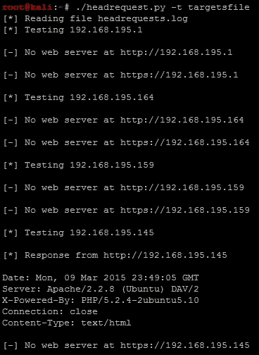

### 注意

完整版本的脚本可以在[`raw.githubusercontent.com/funkandwagnalls/pythonpentest/master/headrequest.py`](https://raw.githubusercontent.com/funkandwagnalls/pythonpentest/master/headrequest.py)找到。如果需要，可以轻松修改此脚本以执行后续任务。已经有工具如`PeppingTom`和`EyeWitness`可用，比这个脚本更好地完成这项活动，但是了解如何构建这个基本脚本将使您能够根据需要包含额外的分析。

# 使用 Python 识别隐藏文件和目录

当我们访问已识别的 IP 地址的网站时，我们发现它是**可恶的易受攻击的 Web 应用程序**（**DVWA**）。我们还看到它已将默认登陆页面的详细信息附加到我们的初始请求中。这意味着我们从`http://192.168.195.145/dvwa/login.php`网站开始，如下面的屏幕截图所示：

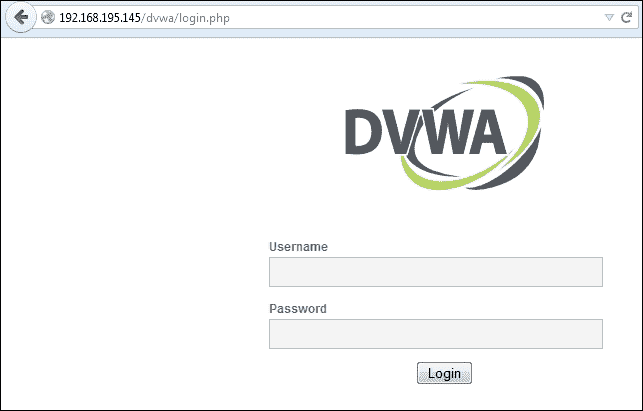

现在我们有了一个起点进行测试，并且使用这些详细信息，我们可以寻找隐藏的目录和文件。让我们修改我们的最后一个脚本，自动查找隐藏的文件或目录。

这样做的最佳方式是从我们所在的站点的基本目录开始。您可以向上级跳转，但在多个网站托管的环境中，您可能会跳出范围。因此，在进行攻击之前，请了解您的环境。如您在下面的截图中所见，该脚本运行文件夹和文件名的文件，并将它们附加到目标站点。然后我们会报告它们是否有效：

```py
#!/usr/bin/env python
import urllib2, argparse, sys
defhost_test(filename, host):
    file = "headrequests.log"
    bufsize = 0
    e = open(file, 'a', bufsize)
    print("[*] Reading file %s") % (file)
    with open(filename) as f:
        locations = f.readlines()
    for item in locations:
        target = host + "/" + item
        try:
            request = urllib2.Request(target)
            request.get_method = lambda : 'GET'
            response = urllib2.urlopen(request)
        except:
            print("[-] %s is invalid") % (str(target.rstrip('\n')))
            response = None
        if response != None:
            print("[+] %s is valid") % (str(target.rstrip('\n')))
            details = response.info()
            e.write(str(details))
    e.close()
```

知道这一点，我们可以加载四个最常见的隐藏或未链接位置，这些位置是网站的`admin`，`dashboard`，`robots.txt`和`config`。使用这些数据，当我们运行脚本时，我们可以识别出两个可行的位置，如下面的截图所示。`Robots.txt`很好，但`config`通常意味着如果权限不正确或文件未被 Web 服务器使用，我们可以找到用户名和密码。


如您在此处所见，我们得到了目录内容的列表：

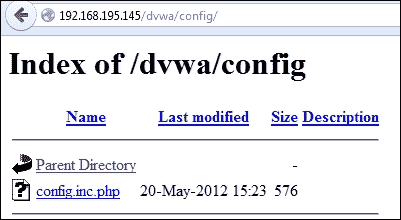

不幸的是，当您打开`config.inc.php`文件时，如此截图所示，没有显示任何内容：


管理员和支持人员并不总是理解他们的一些行为所产生的影响。当从`config`文件创建备份时，如果它们没有被积极使用，或者权限设置不正确，你通常可以通过浏览器读取它们。Linux 系统上的备份文件以`~`结尾。我们知道这是一个 Linux 系统，因为之前的`HEAD`请求显示它是一个 Ubuntu 主机。

### 提示

请记住，管理员和安全工具可以操纵标头，因此不应将其视为信息的权威来源。

如您在下面的截图中所见，该请求打开了一个`config`文件，为我们提供了访问数据库服务器所需的详细信息，从中我们可以提取关键数据：

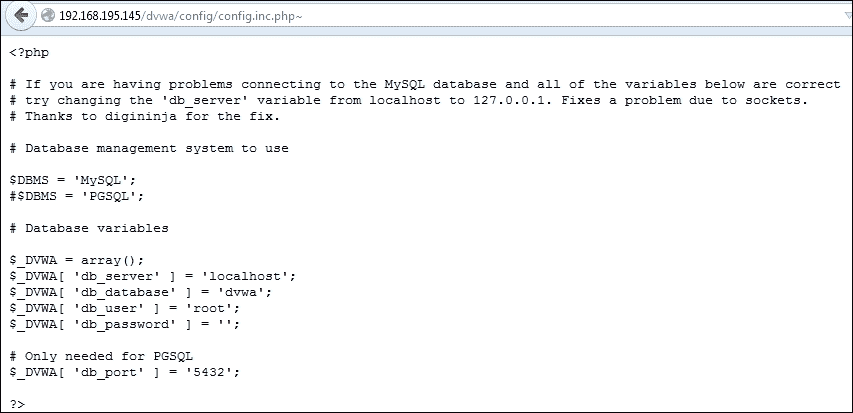

作为渗透测试人员，您必须高效利用时间，正如之前提到的，这是成功渗透测试的障碍之一。这意味着当我们研究数据库的内容时，我们也可以设置一些自动化工具。一个简单的测试是使用 Burp Suite 的 Intruder 功能。

### 注意

完整版本的`dirtester.py`脚本可以在[`raw.githubusercontent.com/funkandwagnalls/pythonpentest/master/dirtester.py`](https://raw.githubusercontent.com/funkandwagnalls/pythonpentest/master/dirtester.py)找到。

# 使用 Burp Suite 进行凭证攻击

从[`portswigger.net/burp/download.html`](http://portswigger.net/burp/download.html)下载 Burp Suite 免费版，然后运行它。确保您使用的浏览器不会干扰您的应用程序测试评估。大多数现代浏览器会自动减轻您的测试工作，而且大多数这些保护措施无法关闭，以完成无阻碍的测试。Firefox 具有这些保护功能，但可以关闭以进行开发和安全分析。此外，Firefox 的插件支持使您能够更好地评估应用程序。许多刚开始的评估人员无法理解为什么他们刚刚执行的一些新的**跨站脚本攻击**（**XSS**）被阻止。通常是 Chrome 或 Internet Explorer 中的一些内置浏览器保护说它是关闭的，但实际上并非如此。

现在，从 Firefox 中，通过在手动代理配置中输入`127.0.0.1`和`端口 8080`来打开本地代理支持，如下所示：

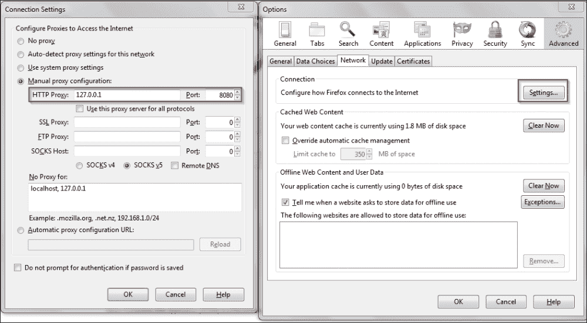

在评估 Web 应用程序时，您希望将范围限制在您想要测试的系统上。确保您设置了这一点，然后过滤所有其他目标以清理输出，并防止自己错误地攻击其他主机。这可以通过右键单击**站点地图**窗口中的主机，或单击**范围**选项卡并手动添加来完成，如此截图所示：


现在 Burp 已经设置好，我们可以开始评估 DVWA 网站，该网站有一个简单的登录页面，需要用户名和密码。加载每个网页时，您必须禁用**拦截**模式，或单击**转发**以转到下一个页面。我们将在几分钟内需要拦截功能，因此我们将保持启用。基本上，Burp Suite——如前所述——是一个透明代理，可以在网站和浏览器之间发送所有指定的流量。这使您可以实时操纵数据和流量，这意味着您可以使应用程序执行与预期不同的操作。

要开始此分析，我们必须查看登录页面如何格式化其请求，因为它被发送到服务器，以便进行操纵。因此，我们在登录提示中提供错误的用户名和密码——对于用户名和密码都使用字母`a`——并在代理中捕获请求。以下图片显示了 Burp Intruder 捕获的错误登录的原始捕获。

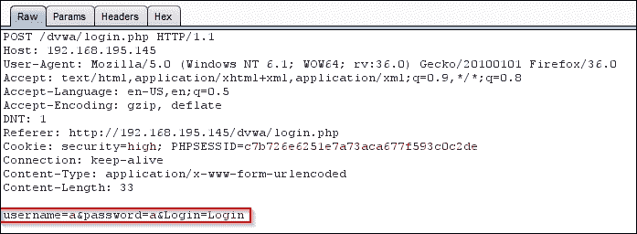

然后，右键单击它，选择发送到入侵者，并在代理中关闭拦截。这样我们就可以重复操纵发送到服务器的请求，看看是否可以获得不同的响应。

按照这种模式，我们可以配置攻击以运行用户名和密码列表，这可能会授予我们访问权限。单击**入侵者**主选项卡和**位置**次要选项卡。选择最初提供的用户名和密码的两个位置，然后从下拉菜单中选择**簇弹**，如下截图所示：

### 注意

入侵者攻击有多种类型，簇弹将是您评估中最常用的类型。有关入侵者攻击的更多详细信息，请访问[`support.portswigger.net/customer/portal/articles/1783129-configuring-a-burp-intruder-attack`](https://support.portswigger.net/customer/portal/articles/1783129-configuring-a-burp-intruder-attack)。

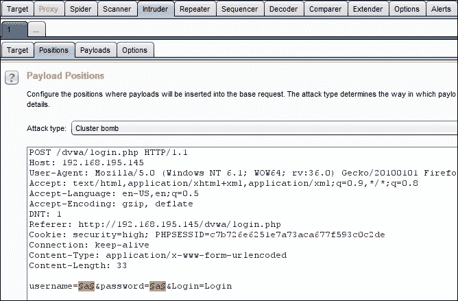

然后创建两个列表；载荷集 1 用于用户名，载荷集 2 用于密码。

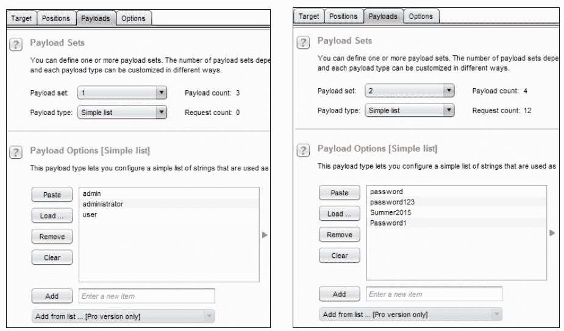

接下来，选择**始终**以跟随重定向，因为登录通常会创建网站转换。

### 提示

为整个评估设置一个严格的范围，然后使用入侵者忽略范围的好处是，您知道在整个过程中不会擅自进入意外的领域。

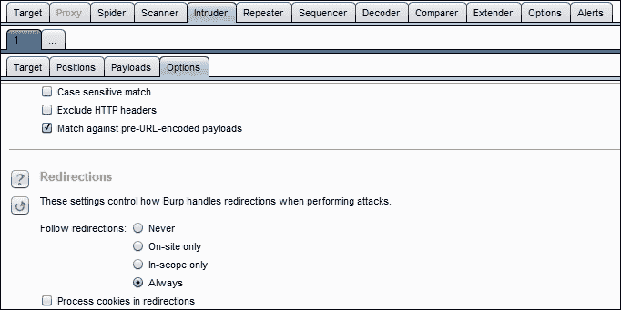

然后单击**入侵者**菜单项，并选择**开始**，将显示一个新的弹出窗口。您可以通过与其他结果相比的大小变化来识别可行的帐户。

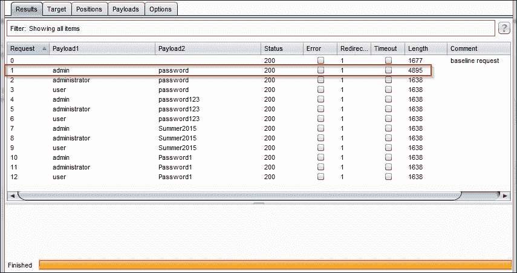

现在您可以直接访问 Web 应用程序，这使您可以浏览应用程序。

# 使用 twill 浏览源代码

Python 有一个库，允许您在源级别浏览和与 Web 应用程序交互。安装库后，您可以导入库，或使用`twill` shell，称为`twill-sh`。

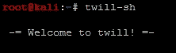

然后加载目标网站，并使用以下命令查看页面的源代码：

```py
go http://192.168.195.159/dvwa/index.php
show

```

这只是显示了网站的源代码，这使您可以进一步与网站交互。

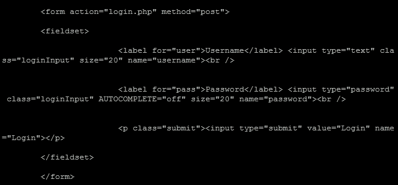

这允许你直接与网站的组件进行交互，并确定需要提交的内容。`twill-sh`库在交互模式下运行时提供了帮助支持，但它是一个有限的工具。twill 擅长的是与源代码进行交互，并识别网站可能感兴趣的区域。它不适用于具有重要动态内容或广泛页面的网站。例如，我运行了`info`命令，试图识别网站的特定内容，就像这样：

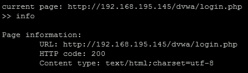

在这个基本水平上，你可以了解应用程序中可以操纵的内容类型、数据格式和其他细节，但在 Python 中有更好的库可以实现与下面描述的相同的结果：

# 了解何时使用 Python 进行 Web 评估

Python 有几个非常有用的库，用于执行 Web 应用程序评估，但也有一些限制。Python 最适用于无法通过透明代理手动模拟的 Web 应用程序的小型自动化组件，例如 Burp。这意味着你在应用程序中找到的特定工作流可能是临时生成的，无法通过透明代理轻松复制。特别是在涉及时间的问题时。因此，如果你需要使用多个请求和响应机制与后端服务器进行交互，那么 Python 可能是合适的选择。

## 了解何时使用特定的库

在处理 Web 应用程序时，主要会使用五个库。在历史上，我最常使用的是`urllib2`库，这是因为它具有很多出色的功能和易于原型代码的方法，但这个库已经过时了。你会发现它缺少一些重要的功能，并且与新时代的 Web 应用程序交互的更高级方法被认为是不可用的，这与下面描述的新库相比。`httplib2` Python 库在与网站交互时提供了强大的功能，但与`urllib2`、`mechanize`、`request`和`twill`相比，它要难得多。也就是说，如果你需要处理与代理相关的复杂检测功能，这可能是你最好的选择，因为发送的头部数据可以完全操纵，以完美模拟标准浏览器流量。在使用于真实应用程序之前，应该在模拟环境中进行充分测试。通常，这个库会因为客户端请求的方式而提供错误的响应。

如果你来自 Perl 世界，你可能会立即倾向于将`mechanize`作为你的首选库，但它在处理动态网站时效果不佳，在某些情况下甚至根本无法使用。那么今天的答案是什么？`request`库。它非常干净，并提供了满足当今复杂 Web 交互挑战的必要功能。为了突出这两者之间的差异和原型代码，我使用`httplib2`和`request`创建了应用凭证攻击脚本。这些脚本的目的是识别活动凭证集并捕获相关的 cookie。完成后，可以向任一脚本添加其他功能。此外，这两个脚本突出了库集之间的差异。

第一个例子是`httplib2`版本，如下所示：

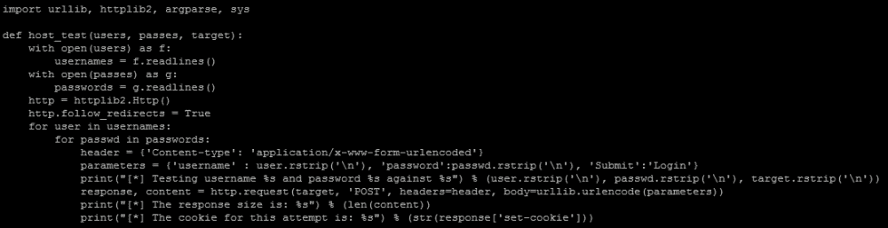

第二个是`request`库的版本，可以在下面的截图中看到：

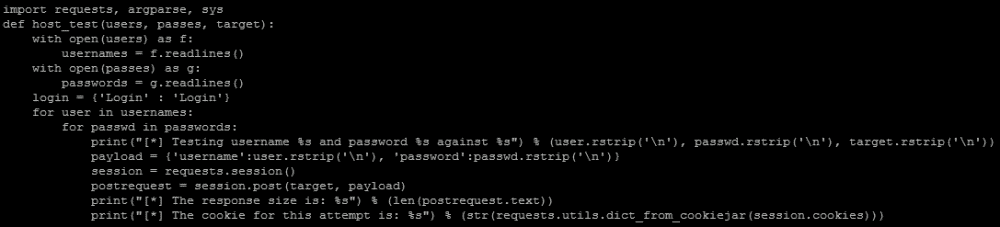

### 注意

基于请求的脚本可以在[`raw.githubusercontent.com/funkandwagnalls/pythonpentest/master/request_brute.py`](https://raw.githubusercontent.com/funkandwagnalls/pythonpentest/master/request_brute.py)找到，`httplib2`脚本可以在[`raw.githubusercontent.com/funkandwagnalls/pythonpentest/master/httplib2_brute.py`](https://raw.githubusercontent.com/funkandwagnalls/pythonpentest/master/httplib2_brute.py)找到。

正如您所看到的，它们的长度几乎相同，但请求中的陈述制作了 Web 流量模拟变得更简单。

## 在 Web 评估期间保持高效

使用这样的脚本或 Burp 之类的脚本的好处在于分析可以被操纵、注入或暴力破解的参数。具体来说，您可以与通过 Web 浏览器无法直接看到的代码功能进行交互，速度超出了人类的交互速度。其中的例子包括构建常见 SQLi 或 XSS 攻击的利用列表。构建常见的 SQLi 攻击或 XSS 攻击列表。然后将它们加载到网站上的相关参数中，以识别漏洞。您将不得不修改上述脚本以命中目标参数，但这将大大加快识别潜在漏洞的过程。

### 注意

每个数据库实例的常见注入类型的最佳 SQLi 列表可以在[`pentestmonkey.net/category/cheat-sheet/sql-injection`](http://pentestmonkey.net/category/cheat-sheet/sql-injection)找到。同样好的 XSS 列表可以在[`www.owasp.org/index.php/XSS_Filter_Evasion_Cheat_Sheet`](https://www.owasp.org/index.php/XSS_Filter_Evasion_Cheat_Sheet)找到。其中一些细节也内置在 Burp Suite 中，如[`support.portswigger.net/customer/portal/articles/1783128-Intruder_Common%20Uses.html`](https://support.portswigger.net/customer/portal/articles/1783128-Intruder_Common%20Uses.html)中所强调的。

今天，我们必须应对**Web 应用程序防火墙**（**WAFs**）和可以被绕过的保护工具，但您需要了解这些保护是如何设置的，以及什么样的字符编码可以绕过它们。请记住，如果存在白名单或黑名单，它们是基于特定字符集和/或编码的，这可能会阻止您的利用尝试。通过自动化测试，我们可以识别那些基于捕获的项目，防止利用 Web 应用程序，并且我们可以根据此定制我们的注入以绕过已经设置的保护。

### 提示

Web 应用程序评估的字符编码与生成有效载荷完全不同。因此，您应该了解这些陈述并不矛盾。大多数 WAF 并不会在将数据与其白名单和/或黑名单进行比较之前智能地检测和解码数据。因此，您可以通过将字符格式更改为应用程序可以理解但 WAF 无法理解的内容来绕过这些保护机制。

这对于诸如`sqlmap`之类的工具非常重要，它非常适用于验证 SQLi，但它的请求应该定制。只有在确认存在可疑的注入漏洞后才应使用它。然后应该用它来构建概念验证，提取数据或者妥协系统。加载`sqlmap`来命中每个参数以寻找 SQLi 是一个非常耗时的过程。它可能会提供潜在的误报并破坏系统。

### 提示

请记住，如果您不自定义参数和传递给`sqlmap`的请求，它可能会将非盲注入攻击转变为盲注入攻击，这将显著影响完成任务所需的时间。该工具可能是市场上最好的工具，但没有聪明的用户，它有时会迷失方向。

# 总结

在本章中，我们讨论了 Web 应用程序评估和普通网络评估之间的区别。强调了识别活动网页与开放端口的方法，并演示了如何使用 Burp 识别未链接或隐藏的内容并执行凭据攻击。此外，本章还演示了如何使用 twill 浏览网站，提取数据，然后创建脚本，以便使用不同的库构建请求-响应链。本章的总结强调了如何通过使用脚本和开源工具来检查特定漏洞的站点以提高效率。

在下一章中，我们将看到如何利用这些技术和其他弱点来攻破组织的边界。
