# 第九章。使用 Python 自动化报告和任务

在前几章中，我们涵盖了大量信息，突出了 Python 在优化技术领域工作中的作用。我们甚至展示了 Python 可以用于自动化从一个过程到另一个过程的后续任务的方法。这些方法将帮助您更好地花费时间在优先任务上。这很重要，因为有三件事可能限制渗透测试的成功完成：评估员完成评估的时间，渗透测试范围的限制，以及评估员的技能。在本章中，我们将向您展示如何自动化诸如解析**可扩展标记语言**（**XML**）以从工具数据生成报告的任务。

# 了解如何解析 XML 文件以生成报告

我们将以`nmap` XML 为例，展示如何将数据解析为可用格式。我们的最终目标是将数据放入一个 Python 字典中，以便使用该数据构建我们发现有用的结构化输出。首先，我们需要一个可以解析和审查的 XML 文件。使用`nmap -oX test 127.0.0.1`命令对本地主机运行`nmap`扫描。

这将生成一个文件，其中使用 XML 标记语言突出显示了两个开放端口，如下所示：

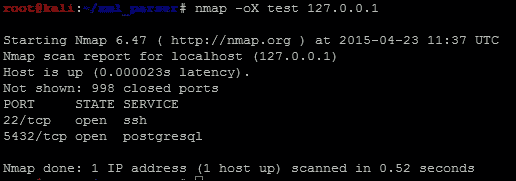

有了实际的 XML 文件，我们可以审查数据结构的组成部分。了解 XML 文件的设计方式将更好地为您准备生成读取它的代码。具体来说，这里的描述是基于`etree`库对 XML 文件组件的分类。`etree`库在概念上处理 XML 数据，就像一棵树，具有相关的分支、子分支，甚至小枝。在计算机科学术语中，我们称之为父子关系。

使用`etree`库，您将把数据加载到变量中。这些变量将保存数据的复合部分。这些被称为**元素**，可以进一步解剖以找到有用的信息。例如，如果将 XML nmap 结构的根加载到一个变量中，然后打印它，您将看到引用和描述元素及其中数据的标记，如下面的屏幕截图所示：


### 注意

有关`etree`库的其他详细信息可以在[`docs.python.org/2/library/xml.etree.elementtree.html`](https://docs.python.org/2/library/xml.etree.elementtree.html)找到。

每个元素都可以与其他节点以及子节点（称为孙节点）存在父子关系。每个节点都保存了我们试图解析的信息。节点通常有一个标记，这是它所持有数据的描述，还有一个属性，这是实际的数据。为了更好地突出这些信息在 XML 中的呈现方式，我们捕获了 nmap XML 的一个元素，主机名节点和一个单一的结果子节点，如下所示：

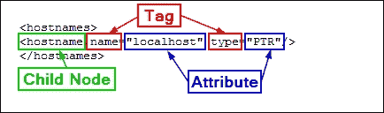

当您查看 XML 文件时，您可能会注意到一个元素中可以有多个节点。例如，由于多个引用，一个主机可能对应同一**Internet Protocol**（**IP**）地址的多个不同主机名。因此，为了迭代元素的所有节点，您需要使用 for 循环来捕获所有可能的数据组件。对这些数据的解析是为了生成输出，这取决于您拥有的数据样本的质量。

这意味着你应该获取多个样本 XML 文件，以获得更好的信息横截面。重点是获得可能的数据组合的大部分。即使使用了应该涵盖你遇到的大部分问题的样本，也会有一些未考虑的例子。因此，如果你的脚本在使用过程中中断，不要灰心。追踪错误并确定需要调整什么。

对于我们的测试，我们将使用多个`nmap`扫描和我们的 Kali 实例，并将详细信息输出到 XML 文件中。

### 提示

Python 有一个名为`libnmap`的奇妙库，可以用来运行和安排扫描，甚至帮助解析输出文件以生成报告。更多详情可以在[`libnmap.readthedocs.org/en/latest/`](https://libnmap.readthedocs.org/en/latest/)找到。我们可以使用这个库来解析输出并生成报告，但这个库只适用于`nmap`。如果你想解析其他工具的 XML 输出以将细节添加到更可管理的格式中，这个库将无法帮助你。

当我们准备编写解析器时，第一阶段是映射我们要解析的文件。因此，我们需要注意我们的脚本与输出交互的可能方式。在映射文件之后，我们在整个文件中放置了几个`print`语句，以显示我们的脚本在哪些元素停止或中断处理。为了更好地理解每个元素，你应该将示例 XML 加载到一个允许正确查看 XML 的工具中。Notepad++非常适用，只要安装了 XML 工具插件。

一旦你把文件加载到 Notepad++中，你应该将 XML 树折叠到其根部。以下截图显示了这棵树的根是`nmaprun`：

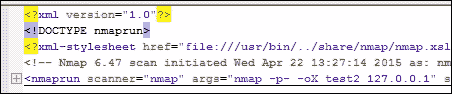

展开一次后，你会得到许多子节点，可以进一步展开和分解。

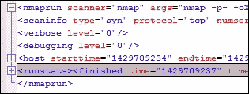

从这些细节中，我们看到我们需要将 XML 文件加载到处理程序中，然后遍历主机元素。然而，我们应该考虑到这是一个单一的主机，所以只会有一个主机元素。因此，我们应该通过`for`循环迭代主机元素，以捕获将来迭代中可能被扫描的其他主机。

当主机元素被展开时，我们可以发现有地址、主机名、端口和时间的节点。我们感兴趣的节点将是地址、主机名和端口。主机名和端口节点都是可展开的，这意味着它们可能也需要被迭代。

### 提示

即使只有一个条目，你也可以用 for 循环迭代任何节点。这样可以确保你捕获所有子节点中的信息，并防止解析器中断。

这个截图突出显示了展开的 XML 树的细节，这些细节是我们关心的：

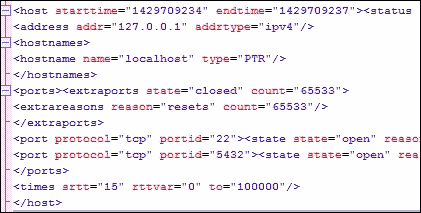

对于地址，我们可以看到有不同的地址类型，如`addrtype`标签所示。在 nmap XML 输出中，你会发现`ipv4`、`ipv6`和`mac`地址。如果你想在输出中获得不同的地址类型，你可以通过简单的`if-then`语句来获取它们，然后将其加载到适当的变量中。如果你只想要一个地址被加载到一个变量中，而不管类型是什么，你将不得不创建一个优先顺序。

`nmap`工具可能会找到每个扫描目标的主机名，也可能找不到。这取决于扫描器尝试检索信息的方式。例如，如果启用了**域名服务**（**DNS**）请求，或者扫描针对本地主机进行，可能已经识别出主机名。其他情况下的扫描可能无法识别实际的主机名。我们必须编写脚本，考虑到可能根据扫描提供的不同输出来提取信息。如下面的截图所示，我们的本地主机扫描确实提供了主机名，因此我们可以在这个例子中提取信息：

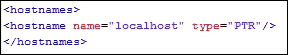

因此，我们决定将主机名和地址加载到变量中。我们将查看`ports`元素，以识别我们将要提取的父节点和子节点数据。树的这个区域的 XML 节点包含大量数据，因为它们必须由许多标签和属性表示，如下面的截图所示：

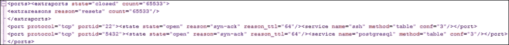

在查看这些节点的细节时，我们应该考虑我们想要提取的组件。我们知道我们将不得不迭代所有端口，并且可以通过`portid`标签唯一标识端口，该标签表示端口号，但我们必须考虑对我们作为评估者有用的数据。端口的协议，如**传输控制协议**（**TCP**）和**用户数据报协议**（**UDP**），是有用的。此外，端口的状态以及它是`打开`、`关闭`、`过滤`还是`打开|过滤`也很重要。最后，可能已经识别的服务名称在报告中也很有用。

### 提示

请记住，服务名称可能不准确，这取决于扫描的类型。如果没有服务检测，nmap 将使用 Linux 的`/etc/services`文件中描述的默认值。因此，如果您正在为客户生成报告作为足迹练习的一部分，请确保启用某种形式的服务检测。否则，您提供的数据可能被视为不准确。

在审查 XML 文件后，我们确定除了地址和主机名之外，还将捕获每个端口号、协议、附加的服务以及状态。有了这些细节，我们可以考虑如何格式化我们的报告。正如之前的图像所显示的，nmap XML 的数据格式不是叙述性的，因此 Microsoft Word 文档可能不如电子表格有用。

因此，我们必须考虑数据在报告中的表示方式：每个主机一行还是每个端口一行。每种表示方式都有利弊。逐行主机表示意味着复合信息易于表示，但如果我们想要过滤数据，只能过滤关于主机或端口组的唯一信息，而不能过滤单个端口。

为了使这更有用，电子表格中的每一行将代表一个端口，这意味着每个端口的详细信息可以在一行上表示。这可以帮助我们的客户过滤我们从 XML 中提取的每个项目，包括主机名、地址、端口、服务名称、协议和端口状态。下面的截图显示了我们将要努力实现的目标：

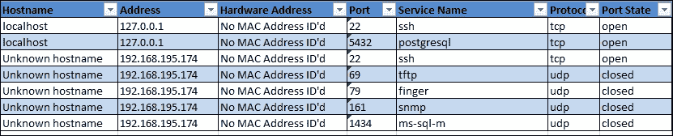

由于我们正在编写解析器和报告生成器，因此最好创建两个单独的类来处理这些信息。增加的好处是可以实例化 XML 解析器，这意味着我们可以使用解析器对多个 XML 文件进行运行，然后将每次迭代组合成整体和独特的结果。这对我们非常有益，因为我们通常在参与过程中运行多个`nmap`扫描，并且合并结果和消除重复项可能是一个相当费力的过程。再次，这是一个理想的例子，脚本化可以让我们的生活更轻松。

# 理解如何创建 Python 类

新的 Python 爱好者之间存在很多关于如何生成 Python 类的误解。Python 处理类和实例变量的方式与许多其他语言略有不同。这并不是一件坏事；事实上，一旦你习惯了语言的工作方式，你就可以开始理解类的定义方式是经过深思熟虑的原因。

如果你在互联网上搜索 Python 和 self 的主题，你会发现关于在 Python 类中非静态函数的开头放置的定义变量的使用的广泛意见。这些意见从认为这是一个使生活更轻松的好概念，到认为这很难应付，使得创建多线程脚本成为一项苦差事。通常，混淆源于从其他语言转移到 Python 的开发人员。无论你站在哪一边，本章提供的示例都是构建 Python 类的一种方式。

### 注意

在下一章中，我们将重点介绍脚本的多线程，这需要对 Python 类的工作方式有基本的理解。

Python 的创始人 Guido van Rossum 在一篇博客文章中回应了一些与 self 有关的批评，该文章可在[`neopythonic.blogspot.com/2008/10/why-explicit-self-has-to-stay.html`](http://neopythonic.blogspot.com/2008/10/why-explicit-self-has-to-stay.html)上找到。为了帮助你专注于本书的这一部分，Python 类、导入和对象的广泛定义将不会重复，因为它们已经被很好地定义了。如果你想了解与 Python 类相关的更多详细信息，你可以在[`learnpythonthehardway.org/book`](http://learnpythonthehardway.org/book)上找到。具体来说，练习 40 到 44 非常好地解释了关于类和面向对象原则的“Pythonic”概念，其中包括继承和组合。

之前，我们描述了如何编写 Pythonic 类的命名约定，因此我们不会在这里重复。相反，我们将专注于我们脚本中需要的一些项目。首先，我们将定义我们的类和我们的第一个函数——`__init__`函数。

`__init__`函数是在类实例化时使用的。这意味着调用类来创建一个可以在运行脚本中作为变量引用的对象。`__init__`函数有助于定义该对象的初始细节，它基本上充当 Python 类的构造函数。为了帮助理解，`__del__`函数则相反，它是 Python 中的析构函数。

如果一个函数要使用实例的细节，那么传递的第一个参数必须是一个一致的变量，通常称为`self`。如果你愿意，你可以给它取别的名字，但这不是 Pythonic 的。如果一个函数没有这个变量，那么实例化的值就不能直接在该函数内部使用。在`__init__`函数中跟随`self`变量的所有值都将直接传递给类。其他语言通过隐藏参数传递这些值；Python 使用`self`来实现这一点。现在你已经了解了 Python 脚本的基础知识，我们可以开始构建我们的解析脚本。

## 创建一个解析 Nmap XML 的 Python 脚本

我们为这个示例定义的类非常简单。它只有三个函数：`__init__`，一个处理传递数据的函数，最后是一个返回处理后数据的函数。我们将设置类来接受 nmap XML 文件和详细级别，如果没有传递，则默认为`0`。以下是实际类和 nmap 解析器的`__init__`函数的定义：

```py
class Nmap_parser:
    def __init__(self, nmap_xml, verbose=0):
        self.nmap_xml = nmap_xml
        self.verbose = verbose
        self.hosts = {}
        try:
            self.run()
        except Exception, e:
            print("[!] There was an error %s") % (str(e))
            sys.exit(1)
```

现在我们要定义这个类的工作函数。正如你会注意到的，我们不需要在函数中传递任何变量，因为它们都包含在`self`中。在更大的脚本中，我个人会在函数开头添加注释来解释正在做什么。这样，当我以后需要在其中添加更多功能时，我就不必花时间解密数百行代码。

### 注意

与前几章一样，完整的脚本可以在 GitHub 页面上找到：[`raw.githubusercontent.com/funkandwagnalls/pythonpentest/master/nmap_parser.py`](https://raw.githubusercontent.com/funkandwagnalls/pythonpentest/master/nmap_parser.py)。

运行函数测试确保它可以打开 XML 文件，然后使用`etree`库的`parse`函数将其加载到变量中。然后，函数定义了初始必要变量并获取了 XML 树的根：

```py
def run(self):
    if not self.nmap_xml:
        sys.exit("[!] Cannot open Nmap XML file: %s \n[-] Ensure that your are passing the correct file and format" % (self.nmap_xml))
    try:
        tree = etree.parse(self.nmap_xml)
    except:
        sys.exit("[!] Cannot open Nmap XML file: %s \n[-] Ensure that your are passing the correct file and format" % (self.nmap_xml))
    hosts={}
    services=[]
    hostname_list=[]
    root = tree.getroot()
    hostname_node = None
    if self.verbose> 0:
        print ("[*] Parsing the Nmap XML file: %s") % (self.nmap_xml)
```

接下来，我们构建一个`for`循环，遍历每个主机，并为每个周期最初将主机名定义为`Unknown hostname`。这样做是为了防止一个主机的主机名被记录为另一个主机的主机名。在尝试检索地址之前，对地址进行了类似的清空处理。你可以在以下代码中看到，嵌套的`for`循环遍历主机地址节点。

每个`addrtype`标签的每个属性都加载到`temp`变量中。然后测试这个值，看看将提取什么类型的地址。接下来，将`addr`标签的属性加载到适用于其地址类型的变量中，比如对于**Internet Protocol version 4 (IPv4)**，加载到`hwaddress`和`address`变量，对于**IP version 6 (IPv6)**，加载到`addressv6`变量中：

```py
for host in root.iter('host'):
    hostname = "Unknown hostname"
    for addresses in host.iter('address'):
        hwaddress = "No MAC Address ID'd"
        ipv4 = "No IPv4 Address ID'd"
        addressv6 = "No IPv6 Address ID'd"
        temp = addresses.get('addrtype')
        if "mac" in temp:
            hwaddress = addresses.get('addr')
            if self.verbose> 2:
                print("[*] The host was on the same broadcast domain")
        if "ipv4" in temp:
            address = addresses.get('addr')
            if self.verbose> 2:
                print("[*] The host had an IPv4 address")
        if "ipv6" in temp:
            addressv6 = addresses.get('addr')
            if self.verbose> 2:
                print("[*] The host had an IPv6 address")
```

对于主机名，我们做了一些略有不同的事情。我们可以创建另一个`for`循环来尝试识别每个主机的所有可用主机名，但大多数扫描只有一个或没有主机名。为了展示从 XML 文件中获取数据的不同方式，你可以看到`hostname`节点首先被加载到适当命名的变量中，首先识别父元素`hostnames`，然后是子元素`hostname`。如果脚本找不到`hostname`，我们再次将变量设置为`Unknown hostname`：

### 注意

这个脚本被设置为一个教学概念，但我们也希望为以后的更改做好准备。牢记这一点，如果我们希望以后改变提取主机名直接节点提取为`for`循环的方式，我们可以。在脚本中通过将识别的主机名加载到主机名列表中来做好准备，以便在下一段代码之前。通常，这对于我们提取主机名的方式是不需要的。在这里为未来的更改准备脚本比在之后的代码中改变加载属性相关的一切要容易得多。

```py
            try:
                hostname_node = host.find('hostnames').find('hostname')
            except:
                if self.verbose > 1:
                    print ("[!] No hostname found")
            if hostname_node is not None:
                hostname = hostname_node.get('name')
            else:
                hostname = "Unknown hostname"
                if self.verbose > 1:
                    print("[*] The hosts hostname is %s") % (str(hostname_node))
            hostname_list.append(hostname)+--
```

现在我们已经捕获了如何识别主机名，我们将尝试捕获每个主机的所有端口。我们通过迭代所有`port`节点并将它们加载到 item 变量中来实现这一点。接下来，我们从节点中提取`state`、`servicename`、`protocol`和`portid`的属性。然后，这些值被加载到`services`列表中：

```py
            for item in host.iter('port'):
                state = item.find('state').get('state')
                #if state.lower() == 'open':
                service = item.find('service').get('name')
                protocol = item.get('protocol')
                port = item.get('portid')
                services.append([hostname_list, address, protocol, port, service, hwaddress, state])
```

现在，有一个包含每个主机所有服务的值列表。我们将其拆分为一个字典以便参考。因此，我们生成一个`for`循环，遍历列表的长度，将每个`services`值重新加载到临时变量中，然后使用迭代的值作为键将其加载到实例的`self.hosts`字典中：

```py
        hostname_list=[]
        for i in range(0, len(services)):
            service = services[i]
            index = len(service) - 1
            hostname = str1 = ''.join(service[0])
            address = service[1]
            protocol = service[2]
            port = service[3]
            serv_name = service[4]
            hwaddress = service[5]
            state = service[6]
            self.hosts[i] = [hostname, address, protocol, port, serv_name, hwaddress, state]
            if self.verbose > 2:
                print ("[+] Adding %s with an IP of %s:%s with the service %s")%(hostname,address,port,serv_name)
```

在这个函数的结尾，我们添加了一个简单的测试用例来验证数据是否被发现，并且如果 verbosity 被打开，它可以被呈现出来：

```py
        if self.hosts:
            if self.verbose > 4:
                print ("[*] Results from NMAP XML import: ")
                for key, entry in self.hosts.iteritems():
                    print("[*] %s") % (str(entry))
            if self.verbose > 0:
                print ("[+] Parsed and imported unique ports %s") % (str(i+1))
        else:
            if self.verbose > 0:
                print ("[-] No ports were discovered in the NMAP XML file")
```

主要处理函数完成后，下一步是创建一个可以返回特定实例`hosts`数据的函数。这个函数在调用时简单地返回`self.hosts`的值：

```py
    def hosts_return(self):
        # A controlled return method
        # Input: None
        # Returned: The processed hosts
        try:
             return self.hosts
        except Exception as e:
            print("[!] There was an error returning the data %s") % (e)
```

我们已经反复展示了通过参数和选项设置基本变量值，为了节省空间，这里不涵盖`nmap_parser.py`脚本中的代码细节；它们可以在线找到。相反，我们将展示如何通过我们的类实例处理多个 XML 文件。

它开始非常简单。我们测试一下我们的 XML 文件是否在变量`xml`中有逗号。如果有，这意味着用户提供了一个用逗号分隔的 XML 文件列表进行处理。因此，我们将按逗号拆分并将值加载到`xml_list`中进行处理。然后，我们将测试每个 XML 文件并验证它是否是一个`nmap` XML 文件，方法是将 XML 文件加载到一个变量中，然后检查`scanner`标签的属性值。

如果我们得到`nmap`，我们知道文件是 nmap XML。如果不是，我们用适当的错误消息退出脚本。如果没有错误，我们调用`Nmap_parser`类并将其实例化为一个具有当前 XML 文件和 verbosity 级别的对象。然后，我们将其附加到列表中。所以基本上，XML 文件被传递给`Nmap_parser`类，对象本身被存储在 hosts 列表中。这使我们能够轻松处理多个 XML 文件并存储对象以供以后操作，如有必要：

```py
    if "," in xml:
        xml_list = xml.split(',')
    else:
        xml_list.append(xml)
    for x in xml_list:
        try:
            tree_temp = etree.parse(x)
        except:
            sys.exit("[!] Cannot open XML file: %s \n[-] Ensure that your are passing the correct file and format" % (x))
        try:
            root = tree_temp.getroot()
            name = root.get("scanner")
            if name is not None and "nmap" in name:
                if verbose > 1:
                    print ("[*] File being processed is an NMAP XML")
                hosts.append(Nmap_parser(x, verbose))
            else:
                print("[!] File % is not an NMAP XML") % (str(x))
                sys.exit(1)
        except Exception, e:
            print("[!] Processing of file %s failed %s") % (str(x), str(e))
            sys.exit(1)
```

加载到字典中的每个实例的数据可能在其中具有重复信息。想象一下在渗透测试期间的情况；当您扫描特定弱点时，您经常会查看相同的 IP 地址。每次运行扫描时，您可能会找到相同的端口和服务以及相关状态。为了使数据规范化，需要将其合并并消除重复项。

当处理典型的内部 IP 地址或**请求评论**（**RFC**）1918 地址时，`10.0.0.1`地址可能在许多不同的内部网络中。因此，如果您使用此脚本来合并来自多个网络的结果，您可能会合并实际上不是重复的结果。在实际执行脚本时，请记住这一点。

现在，我们在`for`循环中用每个数据实例加载一个临时变量。这将创建字典中所有值的`count`，并将其用作每个值集的参考。一个名为`hosts_dict`的新字典用于存储这些数据：

```py
    if not hosts:
        sys.exit("[!] There was an issue processing the data")
    for inst in hosts:
        hosts_temp = inst.hosts_return()
        if hosts_temp is not None:
            for k, v in hosts_temp.iteritems():
                hosts_dict[count] = v
                count+=1
            hosts_temp.clear()
```

现在我们有了一个按简单引用排序的数据字典，我们可以使用它来消除重复项。现在我们要做的是遍历新形成的字典，并在元组中创建键值对。然后将每个元组加载到列表中，这样可以对数据进行排序。

我们再次遍历列表，将元组中存储的两个值分解为新的键值对。从功能上讲，我们正在操纵我们通常在 Python 数据结构中存储数据的方式，以便轻松地去除重复项。

然后，我们对当前值进行直接比较，即端口数据列表与`processed_hosts`字典值的比较。这是包含从所有 XML 文件中发现的经过验证的唯一值的新的最终字典。

### 注意

端口数据列表存储在`temp`列表中嵌套的元组的第二个值中。

如果一个值已经在`processed_hosts`字典中找到，我们将使用`continue`继续循环，而不将详细信息加载到字典中。如果值不在字典中，我们将使用新的计数器`key`将其添加到字典中：

```py
    if verbose > 3:
        for key, value in hosts_dict.iteritems():
            print("[*] Key: %s Value: %s") % (key,value)
    temp = [(k, hosts_dict[k]) for k in hosts_dict]
    temp.sort()
    key = 0
    for k, v in temp:
        compare = lambda x, y: collections.Counter(x) == collections.Counter(y)
        if str(v) in str(processed_hosts.values()):
            continue
        else:
            key+=1
            processed_hosts[key] = v
```

现在我们测试并确保数据在我们的新数据结构中被正确排序和呈现：

```py
    if verbose > 0:
        for key, target in processed_hosts.iteritems():
            print("[*] Hostname: %s IP: %s Protocol: %s Port: %s Service: %s State: %s MAC address: %s" % (target[0],target[1],target[2],target[3],target[4],target[6],target[5]))
```

运行脚本会产生以下结果，显示我们已成功提取数据并将其格式化为有用的结构：

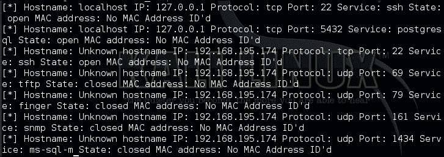

现在我们可以注释掉打印数据的循环，并使用我们的数据结构来创建一个 Excel 电子表格。为此，我们将创建我们自己的本地模块，然后在此脚本中使用它。脚本将被调用来生成 Excel 电子表格。为此，我们需要知道我们将如何调用它的名称以及我们希望如何引用它。然后，在`nmap_parser.py`的顶部创建相关的`import`语句，我们将称之为`nmap_doc_generator.py`的 Python 模块：

```py
try:
    import nmap_doc_generator as gen
except Exception as e:
    print(e)
    sys.exit("[!] Please download the nmap_doc_generator.py script")
```

接下来，我们用以下代码替换`nmap_parser.py`脚本底部的字典打印：

```py
gen.Nmap_doc_generator(verbose, processed_hosts, filename, simple)
```

简单标志被添加到选项列表中，以允许以不同格式输出电子表格，如果需要的话。这个工具在真实的渗透测试和最终报告中都很有用。当涉及到哪种输出更容易阅读以及什么颜色适合他们所工作的组织的品牌报告时，每个人都有自己的偏好。

## 创建一个 Python 脚本来生成 Excel 电子表格

现在我们创建我们的新模块。它可以被导入到`nmap_parser.py`脚本中。这个脚本非常简单，感谢`xlsxwriter`库，我们可以再次使用`pip`安装它。以下代码通过设置必要的库来带来脚本，以便我们可以生成 Excel 电子表格：

```py
import sys
try:
    import xlsxwriter
except:
    sys.exit("[!] Install the xlsx writer library as root or through sudo: pip install xlsxwriter")
```

接下来，我们创建`Nmap_doc_generator`的类和构造函数：

```py
class Nmap_doc_generator():
    def __init__(self, verbose, hosts_dict, filename, simple):
        self.hosts_dict = hosts_dict
        self.filename = filename
        self.verbose = verbose
        self.simple = simple
        try:
            self.run()
        except Exception as e:
            print(e)
```

然后我们创建将在实例中执行的函数。从这个函数中，会执行一个名为`generate_xlsx`的次要函数。这样创建这个函数是为了以后如果需要，我们可以使用这个模块来处理其他报告类型。我们只需要创建额外的函数，并在运行`nmap_parser.py`脚本时提供选项来调用这些函数。然而，这超出了本示例的范围，所以`run`函数的范围如下：

```py
    def run(self):
        # Run the appropriate module
        if self.verbose > 0:
            print ("[*] Building %s.xlsx") % (self.filename)
            self.generate_xlsx()
```

我们定义的下一个函数是`generate_xlsx`，其中包括生成 Excel 电子表格所需的所有功能。我们需要做的第一件事是定义实际的工作簿、工作表和格式。如果没有文件扩展名，我们首先需要设置实际的文件名扩展名：

```py
    def generate_xlsx(self):
        if "xls" or "xlsx" not in self.filename:
            self.filename = self.filename + ".xlsx"
        workbook = xlsxwriter.Workbook(self.filename)
```

然后我们开始创建实际的行格式，从标题行开始。我们将其突出显示为粗体行，具有两种不同的可能颜色，具体取决于是否设置了简单标志：

```py
        # Row one formatting
        format1 = workbook.add_format({'bold': True})
    # Header color
    # Find colors: http://www.w3schools.com/tags/ref_colorpicker.asp
  if self.simple:
            format1.set_bg_color('#538DD5')
  else:
      format1.set_bg_color('#33CC33') # Report Format
```

### 注意

您可以使用类似于微软的颜色选择工具在电子表格中找到您想要的实际颜色编号。它可以在[`www.w3schools.com/tags/ref_colorpicker.asp`](http://www.w3schools.com/tags/ref_colorpicker.asp)找到。

由于我们想将其配置为电子表格，以便它可以具有交替的颜色，我们将设置两个额外的格式配置。与之前的格式配置一样，这将被保存为变量，可以根据行是偶数还是奇数轻松引用。偶数行将是白色，因为标题行有颜色填充，奇数行将有颜色填充。因此，当设置`simple`变量时，我们将改变奇数行的颜色。以下代码突出显示了这种逻辑结构：

```py
        # Even row formatting
        format2 = workbook.add_format({'text_wrap': True})
        format2.set_align('left')
        format2.set_align('top')
        format2.set_border(1)
        # Odd row formatting
        format3 = workbook.add_format({'text_wrap': True})
        format3.set_align('left')
        format3.set_align('top')
    # Row color
  if self.simple:
      format3.set_bg_color('#C5D9F1') 
  else:
      format3.set_bg_color('#99FF33') # Report Format 
        format3.set_border(1)
```

定义了格式后，我们现在必须设置列宽和标题，这些将在整个电子表格中使用。这里有一些试错，因为列宽应该足够宽，可以容纳电子表格中填充的数据，并正确表示标题，而不会不必要地扩展到屏幕外。通过范围、起始列号、结束列号和最后列宽的大小来定义列宽。这三个逗号分隔的值放在`set_column`函数参数中：

```py
        if self.verbose > 0:
            print ("[*] Creating Workbook: %s") % (self.filename)
        # Generate Worksheet 1
        worksheet = workbook.add_worksheet("All Ports")
        # Column width for worksheet 1
        worksheet.set_column(0, 0, 20)
        worksheet.set_column(1, 1, 17)
        worksheet.set_column(2, 2, 22)
        worksheet.set_column(3, 3, 8)
        worksheet.set_column(4, 4, 26)
        worksheet.set_column(5, 5, 13)
        worksheet.set_column(6, 6, 12)
```

定义了列之后，设置行和列的起始位置，填充标题行，并使其中的数据可过滤。想想查找具有开放的 JBoss 端口的主机有多有用，或者客户想要知道已成功被周界防火墙过滤的端口是哪些：

```py
        # Define starting location for Worksheet one
        row = 1
        col = 0
        # Generate Row 1 for worksheet one
        worksheet.write('A1', "Hostname", format1)
        worksheet.write('B1', "Address", format1)
        worksheet.write('C1', "Hardware Address", format1)
        worksheet.write('D1', "Port", format1)
        worksheet.write('E1', "Service Name", format1)
        worksheet.write('F1', "Protocol", format1)
        worksheet.write('G1', "Port State", format1)
        worksheet.autofilter('A1:G1')
```

因此，定义了格式后，我们可以开始填充相关数据到电子表格中。为此，我们创建一个`for`循环来填充`key`和`value`变量。在这个报告生成的实例中，`key`对于电子表格来说并不有用，因为它的数据没有用于生成电子表格。另一方面，`value`变量包含了`nmap_parser.py`脚本的结果列表。因此，我们将六个相关的值表示填充到位置变量中：

```py
        # Populate Worksheet 1
        for key, value in self.hosts_dict.items():
            try:
                hostname = value[0]
                address = value[1]
                protocol = value[2]
                port = value[3]
                service_name = value[4]
                hwaddress = value[5]
                state = value[6]
            except:
                if self.verbose > 3:
                    print("[!] An error occurred parsing host ID: %s for Worksheet 1") % (key)
```

在每次迭代结束时，我们将增加行计数器。否则，如果我们在开始时这样做，我们将在数据行之间写入空白行。要开始处理，我们需要确定行是偶数还是奇数，因为这会改变格式，如前所述。最简单的方法是使用模运算符`%`，它将左操作数除以右操作数并返回余数。

如果没有余数，我们知道它是偶数，因此行也是偶数。否则，行是奇数，我们需要使用相应的格式。我们不再将整个函数行写操作写两次，而是再次使用一个临时变量来保存当前行格式，称为`temp_format`，如下所示：

```py
                    print("[!] An error occurred parsing host ID: %s for Worksheet 1") % (key)
            try:
                if row % 2 != 0:
                    temp_format = format2
                else:
                    temp_format = format3
```

现在，我们可以从左到右写入数据。数据的每个组件都进入下一列，这意味着我们将列值为`0`，并且每次写入数据到行时都加`1`。这样可以让我们轻松地从左到右跨越电子表格，而不必操作多个值：

```py
                worksheet.write(row, col,     hostname, temp_format)
                worksheet.write(row, col + 1, address, temp_format)
                worksheet.write(row, col + 2, hwaddress, temp_format)
                worksheet.write(row, col + 3, port, temp_format)
                worksheet.write(row, col + 4, service_name, temp_format)
                worksheet.write(row, col + 5, protocol, temp_format)
                worksheet.write(row, col + 6, state, temp_format)
                row += 1
            except:
                if self.verbose > 3:
                    print("[!] An error occurred writing data for Worksheet 1")
```

最后，我们关闭写入文件到当前工作目录的工作簿：

```py
        try:
            workbook.close()
        except:
            sys.exit("[!] Permission to write to the file or location provided was denied")
```

所有必要的脚本组件和模块都已创建，这意味着我们可以从`nmap` XML 输出生成我们的 Excel 电子表格。在`nmap_parser.py`脚本的参数中，我们将默认文件名设置为`xml_output`，但根据需要可以传递其他值。以下是`nmap_parser.py`脚本的帮助输出：

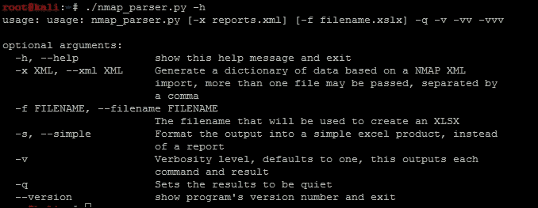

有了这些详细信息，我们现在可以针对我们创建的四个不同的`nmap`扫描 XML 执行脚本，如下截图所示：

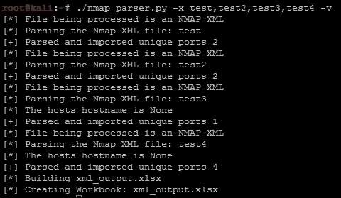

脚本的输出是这个 Excel 电子表格：

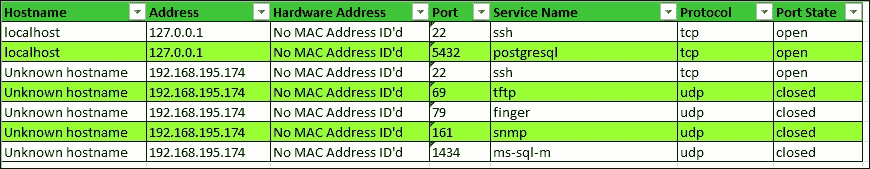

相反，如果我们设置简单标志并创建一个带有不同文件名的新电子表格，我们会得到以下输出：

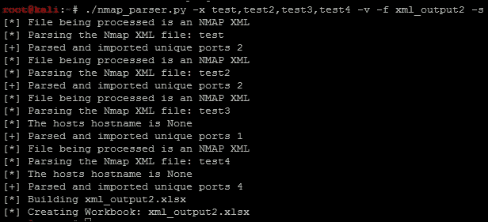

这将创建新的电子表格`xml_output2.xlsx`，采用简单格式，如下所示：

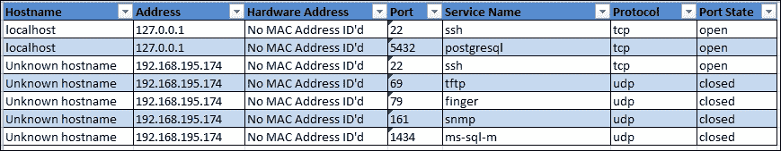

### 注意

该模块的代码可以在[`raw.githubusercontent.com/funkandwagnalls/pythonpentest/master/nmap_doc_generator.py`](https://raw.githubusercontent.com/funkandwagnalls/pythonpentest/master/nmap_doc_generator.py)找到。

# 摘要

解析 nmap XML 非常有用，但请考虑这种能力对于阅读和组织其他安全工具输出的帮助有多大。我们向您展示了如何创建 Python 类，解析 XML 结构并生成独特的数据集。在所有这些之后，我们能够创建一个可以以可过滤格式表示数据的 Excel 电子表格。在下一章中，我们将介绍如何为我们的 Python 脚本添加多线程能力和永久性。
