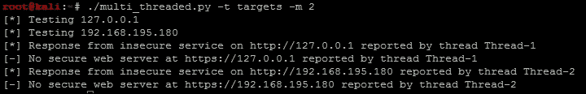
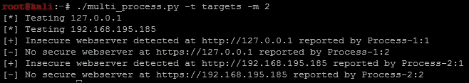
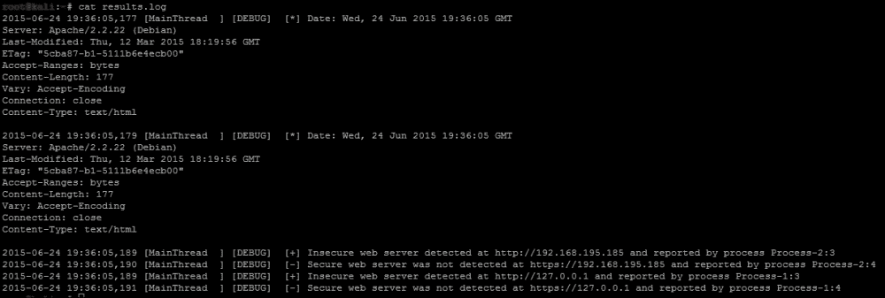

# 第十章：为 Python 工具增加永久性

Python 具有巨大的能力，我们只是挖掘了作为评估者可用的工具和技术的一部分。我们将介绍 Python 语言的一些更高级功能，这些功能对我们很有帮助。具体来说，我们将重点介绍如何将日志记录集成到我们的脚本中，然后开发多线程和多进程工具。添加这些更高级的功能意味着您开发的工具将更加经受时间的考验，并脱颖而出。

# 了解 Python 中的日志记录

当您编写自己的模块时，比如在第九章中突出显示的模块，*使用 Python 自动化报告和任务*，您希望能够轻松跟踪错误、警告和调试消息。日志记录库允许您跟踪事件并将其输出到标准错误（STDERR）、文件和标准输出（STDOUT）。使用日志记录的好处是可以轻松定义格式，并使用特定的消息类型将其发送到相关的输出。这些消息类似于 syslog 消息，并且模仿相同的日志级别。

### 注意

有关日志记录库的更多详细信息，请访问[`docs.python.org/2/library/logging.html`](https://docs.python.org/2/library/logging.html)。

# 理解多线程和多进程之间的区别

在 Python 中有两种不同的方式可以执行同时的请求：多线程和多进程。通常，这两个项目会被混淆在一起，当您阅读有关它们的内容时，您会在博客和新闻组上看到类似的回应。如果您谈论使用多个处理器和处理核心，您正在谈论多进程。如果您留在同一内存块中，但不使用多个核心或进程，那么您正在谈论多线程。多线程又会运行并发代码，但由于 Python 解释器的设计，不会并行执行任务。

### 提示

如果您回顾第八章, *使用 Python、Metasploit 和 Immunity 进行利用开发*，并查看 Windows 内存的定义区域，您将更好地理解线程和进程在 Windows 内存结构中的工作方式。请记住，其他操作系统（OS）处理这些内存位置的方式是不同的。

## 在 Python 中创建多线程脚本

要了解多线程的限制，您必须了解 Python 解释器。Python 解释器使用全局解释器锁（GIL），这意味着当字节码由一个线程执行时，它是一次执行一个线程。

### 注意

要更好地了解 GIL，请查看[`docs.python.org/2/glossary.html#term-global-interpreter-lock`](https://docs.python.org/2/glossary.html#term-global-interpreter-lock)上的文档。

这可以防止由多个线程同时操作数据结构引起的问题。想象一下数据被写入字典，您在并发线程中使用相同的键引用不同的数据片段。您会破坏一些您打算写入字典的数据。

### 注意

对于多线程的 Python 应用程序，您会听到一个称为“线程安全”的术语。这意味着，“某物是否可以被线程修改而不影响数据的完整性或可用性？”即使某些东西被认为不是“线程安全”的，您也可以使用稍后描述的锁来控制数据输入。

我们将使用我们在第六章中之前创建的`head_request.py`脚本，并将其成熟为一个新脚本。此脚本将使用队列来保存需要处理的所有任务，这些任务将在执行期间动态分配。此队列是通过从文件中读取值并将其存储以供以后处理而构建的。我们将整合新的记录器库，将详细信息输出到`results.log`文件中，脚本执行时。以下屏幕截图显示了执行后此新脚本的结果：



此外，以下突出显示的日志文件包含了脚本的详细执行和并发线程的输出：


### 注意

此脚本可以在[`raw.githubusercontent.com/funkandwagnalls/pythonpentest/master/multi_threaded.py`](https://raw.githubusercontent.com/funkandwagnalls/pythonpentest/master/multi_threaded.py)找到。

现在，目标已在视野中，我们开始导入需要的库，并配置两个全局变量。第一个变量保存我们的排队工作量，第二个用于暂时锁定线程，以便可以在屏幕上打印数据：

### 注意

请记住以下内容：并发处理意味着项目正在处理。详细信息将按执行的顺序提供，并且在控制台上显示可能会混乱。为了解决这个问题，我们使用锁来暂停执行，以足够时间返回必要的详细信息。记录器是一个线程安全的库，但打印不是，其他库可能也不是。因此，在适当的地方使用锁。

```py
import urllib2, argparse, sys, threading, logging, Queue, time
queue = Queue.Queue()
lock = threading.Lock()
```

之后，我们需要创建将生成线程的类，唯一的新构造概念是`threading.Thread.__init__(self)`：

```py
class Agent(threading.Thread):
    def __init__(self, queue, logger, verbose):
        threading.Thread.__init__(self)
        self.queue = queue
        self.logger = logger
        self.verbose = verbose
```

然后，我们需要创建一个函数，将在每个线程中处理实际数据。该函数首先通过定义初始值开始，如您所见，这些值是从队列中提取的。它们代表从文件加载到队列中的**Internet Protocol**（**IP**）地址：

```py
    def run(self):
        while True:
            host = self.queue.get()
            print("[*] Testing %s") % (str(host))
            target = "http://" + host
            target_secure = "https://" + host
```

从这里开始，我们将处理主机潜在网站的不安全和安全版本。下面的代码是用于网站不安全部分的，它执行的工作类似于第六章中突出显示的脚本，*使用 Python 评估 Web 应用程序*。唯一的区别是我们添加了新的记录器函数，将详细信息打印到结果日志文件中。如下代码所示，将详细信息写入记录器几乎与编写打印语句相同。您还会注意到，我们使用`with`语句锁定线程进程，以便可以打印详细信息。这对 I**/O**来说并不是必需的，但否则将很难阅读：

```py
            try:
                request = urllib2.Request(target)
                request.get_method = lambda : 'HEAD'
                response = urllib2.urlopen(request)
            except:
                with lock:
                    self.logger.debug("[-] No web server at %s 
                        reported by thread %s" % (str(target), str
                            (threading.current_thread().name)))
                    print("[-] No web server at %s reported by thread %s") % 
                        (str(target), str(threading.current_thread().name))
                response = None
            if response != None:
                with lock:
                    self.logger.debug("[+] Response from %s reported by 
                        thread %s" % (str(target), str(threading.current_thread().
                          name)))
                    print("[*] Response from insecure service on %s reported by 
                        thread %s") % (str(target), str(threading.current_thread().name))
                self.logger.debug(response.info())
```

请求-响应指令的安全部分几乎与代码的非安全部分相同，如下所示：

```py
            try:
                target_secure = urllib2.urlopen(target_secure)
                request_secure.get_method = lambda : 'HEAD'
                response_secure = urllib2.urlopen(request_secure)
            except:
                with lock:
                    self.logger.debug("[-] No secure web server at %s reported by 
                        thread %s" % (str(target_secure), str(threading.current_thread().name)))
                    print("[-] No secure web server at %s reported by 
                        thread %s") % (str(target_secure), str(threading.current_thread().name))
                response_secure = None
            if response_secure != None:
                with lock:
                    self.logger.debug("[+] Secure web server at %s reported by 
                        thread %s" % (str(target_secure), str(threading.current_thread().name)))
                    print("[*] Response from secure service on %s reported by thread %s") 
                        % (str(target_secure), str(threading.current_thread().name))
                self.logger.debug(response_secure.info())
```

最后，此函数列出了提供的任务已完成：

```py
            self.queue.task_done()
```

如前所述，参数和选项的配置与其他脚本非常相似。因此，为了简洁起见，这些已被省略，但可以在上述链接中找到。但是，已更改的是记录器的配置。我们设置了一个可以通过参数传递日志文件名的变量。然后配置记录器，使其处于适当的级别以输出到文件，并且格式将线程的输出包括时间、线程名称、日志级别和实际消息。最后，我们配置将用作所有记录操作的引用的对象：

```py
    log = args.log                                                                                    # Configure the log output file
    if ".log" not in log:
        log = log + ".log"
    level = logging.DEBUG                                                                             # Logging level
    format = logging.Formatter("%(asctime)s [%(threadName)-12.12s] 
      [%(levelname)-5.5s]  %(message)s") 
    logger_obj = logging.getLogger()                                                                  # Getter for logging agent
    file_handler = logging.FileHandler(args.log)                                                                                                         
    targets_list = []
    # Configure logger formats for STDERR and output file
    file_handler.setFormatter(format)
    # Configure logger object
    logger_obj.addHandler(file_handler)
    logger_obj.setLevel(level)
```

日志记录器设置好后，我们实际上可以设置使脚本多线程运行所需的最终代码行。我们从文件中将所有目标加载到列表中，然后将列表解析到队列中。我们本可以做得更紧凑一些，但以下格式更易于阅读。然后我们生成工作线程，并将`setDaemon`设置为`True`，以便在主线程完成后终止脚本，从而防止脚本挂起：

```py
    # Load the targets into a list and remove trailing "\n"
    with open(targets) as f:
        targets_list = [line.rstrip() for line in f.readlines()]
    # Spawn workers to access site
    for thread in range(0, threads):
        worker = Agent(queue, logger_obj, verbose)
        worker.setDaemon(True)
        worker.start()
    # Build queue of work
    for target in targets_list:
        queue.put(target)
    # Wait for the queue to finish processing
    queue.join()
if __name__ == '__main__':
    main()
```

前面的细节创建了一个功能性的多线程 Python 脚本，但存在问题。Python 多线程非常容易出错。即使是编写良好的脚本，每次迭代都可能返回不同的错误。此外，为了完成相对微小的任务，需要大量的代码，如前面的代码所示。最后，根据脚本执行的情况和操作系统，线程可能不会提高处理性能。另一个解决方案是使用多进程而不是多线程，这更容易编码，更少出错，并且（再次）可以使用多个核心或处理器。

### 注意

Python 有许多库可以支持并发，使编码更加简单。例如，可以使用 simple-requests（[`pythonhosted.org/simple-requests/`](http://pythonhosted.org/simple-requests/)）处理 URL，该库已在[`www.gevent.org/`](http://www.gevent.org/)上构建。前面的代码示例是为了展示如何修改并发脚本以包含多线程支持。在成熟脚本时，您应该查看其他库是否可以直接提供更好的功能，以改进您的个人知识并创建保持相关性的脚本。

## 在 Python 中创建多进程脚本

在创建 Python 中的多进程脚本之前，您应该了解大多数人遇到的问题。这将有助于您在未来尝试成熟您的工具集时。在 Python 中，您将遇到四个主要问题：

+   对象的序列化

+   并行写入或读取数据以及处理锁

+   操作系统细微差别与相关并行性**应用程序接口**（**API**）

+   将当前脚本（线程化或非线程化脚本）翻译成利用并行性的脚本

在 Python 中编写多进程脚本时，最大的障碍是处理对象的序列化（称为 pickling）和反序列化（称为 unpickling）。当您编写与多进程相关的自己的代码时，可能会看到对 pickle 库的引用错误。这意味着您遇到了与数据序列化方式相关的问题。

### 注意

Python 中的一些对象无法被序列化，因此您必须找到解决方法。您将看到的最常见的方法是使用`copy_reg`库。该库提供了一种定义函数的方式，以便它们可以被序列化。

正如您可以想象的那样，就像并发代码一样，向单个文件或其他**输入/输出**（**I/O**）资源写入和读取数据会导致问题。这是因为每个核心或处理器同时处理数据，而大多数情况下，其他进程并不知道。因此，如果您正在编写需要输出详细信息的代码，可以锁定进程，以便适当处理详细信息。这种能力通过使用`multiprocessing.Lock()`函数来处理。

除了 I/O 之外，还存在一个共享内存在进程之间使用的额外问题。由于这些进程相对独立运行（取决于实现），在内存中引用的可塑数据可能会有问题。幸运的是，`multiprocessing`库提供了许多工具来帮助我们。基本解决方案是使用`multiprocessing.Values()`和`multiprocessing.Arrays()`，它们可以在进程之间共享。

### 注意

有关共享内存和多进程的其他细节可以在[`docs.python.org/2/library/multiprocessing.html#module-multiprocessing.sharedctypes`](https://docs.python.org/2/library/multiprocessing.html#module-multiprocessing.sharedctypes)找到。

在处理进程和内存管理时，所有操作系统并不相同。了解这些不同操作系统在这些层面上的工作方式对于系统工程师和开发人员来说是必要的。正如之前所强调的，作为评估者，在开发更高级的工具和创建利用时，我们也有同样的需求。

想想你有多少次看到一个新的工具或脚本出现，它只在一个操作系统或发行版上进行了测试；当你使用它时，产品在其他地方无法工作。多进程脚本也不例外，当你编写这些脚本时，要牢记最终目标。如果你没有打算让你的脚本在 Kali 之外的任何地方运行，那么请确保你在那里进行测试。如果你打算在 Windows 上运行它，你需要验证相同的脚本设计方法在那里也能工作。具体来说，多进程代码的入口点需要在`main()`函数内，或者说，在检查`__name__`是否等于`'__main__'`之下。如果不是，你可能会创建一个分叉炸弹，或者一个无限循环的生成进程，最终导致系统崩溃。

### 注意

要更好地了解 Windows 对进程分叉和 Python 多进程的限制，可以参考[`docs.python.org/2/library/multiprocessing.html#windows`](https://docs.python.org/2/library/multiprocessing.html#windows)。

最后要考虑的是将已建立的脚本转换为多进程脚本。尽管互联网上有大量的演示，展示了用户将一个线程化或非线程化的脚本转换为多进程脚本，但它们通常只适用于演示。将功能代码转换为稳定且有用的多进程脚本通常需要重写。这是因为前面提到的要点，突出了你将不得不克服的挑战。

那么你从这一切中学到了什么？

+   将在并行执行的函数必须是可挑选的

+   在处理 I/O 时可能需要加入锁，共享内存需要使用多进程库的特定函数

+   并行进程的主入口点需要受到保护

+   脚本不容易从线程化或非线程化格式转换为多进程格式，因此，一些思考应该放在重新设计它们上

### 注意

为了简洁起见，参数和选项的详细信息已被删除，但完整的细节可以在[`raw.githubusercontent.com/funkandwagnalls/pythonpentest/master/multi_process.py`](https://raw.githubusercontent.com/funkandwagnalls/pythonpentest/master/multi_process.py)找到。

考虑到所有这些，我们现在可以重写`head_request.py`脚本，以适应多进程。`run()`函数的代码在很大程度上被重写，以适应对象，以便它们可以被 pickled。这是因为`host_request`函数是由每个子进程运行的。`urllib2`请求和响应是不可 pickable 的对象，因此在传递之前需要将数据转换为字符串。此外，使用多进程脚本时，必须处理记录器，而不是直接调用。通过这种方式，子进程知道要写入什么，使用通用文件名引用。

这种格式可以防止多个进程同时写入文件。首先，我们创建一个时间戳，这将在抓取日志处理程序时用作参考。以下代码突出了初始值和不安全服务请求和响应指令的配置：

```py
import multiprocessing, urllib2, argparse, sys, logging, datetime, time
def host_request(host):
    print("[*] Testing %s") % (str(host))
    target = "http://" + host
    target_secure = "https://" + host
    timenow = time.time()
    record = datetime.datetime.fromtimestamp(timenow).strftime
      ('%Y-%m-%d %H:%M:%S')
    logger = logging.getLogger(record)
    try:
        request = urllib2.Request(target)
        request.get_method = lambda : 'HEAD'
        response = urllib2.urlopen(request)
        response_data = str(response.info())
        logger.debug("[*] %s" % response_data)
        response.close()
    except:
        response = None
        response_data = None
```

在不安全的请求和响应指令之后是安全服务请求和响应指令，如下所示：

```py
    try:
        request_secure = urllib2.urlopen(target_secure)
        request_secure.get_method = lambda : 'HEAD'
        response_secure = str(urllib2.urlopen(request_secure).read())
        response_secure_data = str(response.info())
        logger.debug("[*] %s" % response_secure_data)
        response_secure.close()
    except:
        response_secure = None
        response_secure_data = None
```

在捕获请求和响应细节之后，将适当地返回和记录这些细节：

```py
    if response_data != None and response_secure_data != None:
        r = "[+] Insecure webserver detected at %s reported by %s" % 
          (target, str(multiprocessing.Process().name))
        rs = "[+] Secure webserver detected at %s reported by %s" % 
          (target_secure, str(multiprocessing.Process().name))
        logger.debug("[+] Insecure web server detected at %s and reported 
          by process %s" % (str(target), str(multiprocessing.Process().name)))
        logger.debug("[+] Secure web server detected at %s and reported by process 
          %s" % (str(target_secure), str(multiprocessing.Process().name)))
        return(r, rs)
    elif response_data == None and response_secure_data == None:
        r = "[-] No insecure webserver at %s reported by %s" % (target, 
          str(multiprocessing.Process().name))
        rs = "[-] No secure webserver at %s reported by %s" % (target_secure, 
          str(multiprocessing.Process().name))
        logger.debug("[-] Insecure web server was not detected at %s and reported 
          by process %s" % (str(target), str(multiprocessing.Process().name)))
        logger.debug("[-] Secure web server was not detected at %s and reported 
          by process %s" % (str(target_secure), str(multiprocessing.Process().name)))
        return(r, rs)
    elif response_data != None and response_secure_data == None:
        r = "[+] Insecure webserver detected at %s reported by %s" % 
          (target, str(multiprocessing.Process().name))
        rs = "[-] No secure webserver at %s reported by %s" % (target_secure, 
          str(multiprocessing.Process().name))
        logger.debug("[+] Insecure web server detected at %s and reported by 
          process %s" % (str(target), str(multiprocessing.Process().name)))
        logger.debug("[-] Secure web server was not detected at %s and reported 
          by process %s" % (str(target_secure), str(multiprocessing.Process().name)))
        return(r, rs)
    elif response_secure_data != None and response_data == None:
        response = "[-] No insecure webserver at %s reported by %s" % 
          (target, str(multiprocessing.Process().name))
        rs = "[+] Secure webserver detected at %s reported by %s" % (target_secure, 
          str(multiprocessing.Process().name))
        logger.debug("[-] Insecure web server was not detected at %s and reported by 
          process %s" % (str(target), str(multiprocessing.Process().name)))
        logger.debug("[+] Secure web server detected at %s and reported by process %s" 
          % (str(target_secure), str(multiprocessing.Process().name)))
        return(r, rs)
    else:
        logger.debug("[-] No results were recorded for %s or %s" % (str(target), str(target_secure)))
```

如前所述，记录器使用处理程序，我们通过创建一个定义记录器设计的函数来实现这一点。然后，该函数将通过`multiprocessing.map`中的`initializer`参数由每个子进程调用。这意味着我们可以在各个进程之间完全控制记录器，并且这可以防止需要传递的不可拾取对象的问题：

```py
def log_init(log):
    level = logging.DEBUG                                                                            
    format = logging.Formatter("%(asctime)s [%(threadName)-12.12s] [%(levelname)-5.5s]  %(message)s") # Log format
    logger_obj = logging.getLogger()                                                                 
    file_handler = logging.FileHandler(log)                                                                                                           
    targets_list = []
    # Configure logger formats for STDERR and output file
    file_handler.setFormatter(format)
    # Configure logger object
    logger_obj.addHandler(file_handler)
    logger_obj.setLevel(level)
```

现在，在`main()`函数中，我们定义了**命令行界面**（**CLI**）以获取参数和选项。然后，我们从目标文件和参数变量生成将被测试的数据：

```py
    # Set Constructors
    targets = args.targets                                                                            
    verbose = args.verbose                                                                            
    processes = args.multiprocess                                                                            
    log = args.log                                                                                    
    if ".log" not in log:
        log = log + ".log"
    # Load the targets into a list and remove trailing "\n"
    with open(targets) as f:
        targets_list = [line.rstrip() for line in f.readlines()]
```

最后，以下代码使用`map`函数，该函数在遍历目标列表时调用`host_request`函数。`map`函数允许多进程脚本以类似于先前多线程脚本的方式排队工作。然后，我们可以使用由 CLI 参数加载的 processes 变量来定义要生成的子进程数量，这允许我们动态控制分叉的进程数量。这是一种非常猜测和检查的进程控制方法。

### 提示

如果您想要更具体一些，另一种方法是确定 CPU 的数量，然后将其加倍以确定进程的数量。可以按照以下方式完成：`processes = multiprocessing.cpu_count() *2`。

```py
    # Establish pool list
    pool = multiprocessing.Pool(processes=threads, 
      initializer=log_init(log))
    # Queue up the targets to assess
    results = pool.map(host_request, targets_list)
    for result in results:
        for value in result:
            print(value)
if __name__ == '__main__':
    main()
```

有了生成的代码，我们可以输出帮助文件，以决定脚本需要如何运行，如下截图所示：


运行脚本时，输出将详细列出请求的成功、失败和相关进程，如下截图所示：



最后，`results.log`文件包含了脚本产生的活动相关细节，如下截图所示：



我们现在已经完成了我们的多进程脚本，可以以受控方式处理记录。这是朝着创建行业标准工具的正确方向迈出的一步。如果有更多时间，我们可以将此脚本附加到上一章中创建的`nmap_parser.py`脚本，并使用`nmap_doc_generator.py`脚本生成详细报告。这些功能的结合将使工具更加有用。

# 构建行业标准工具

Python 是一种很棒的语言，这些高级技术突出了控制线程、进程、I/O 和日志记录，对于为您的脚本添加永久性至关重要。行业中有许多示例可以帮助评估安全性，比如 Sulley。这是一种自动化应用程序模糊测试的工具，旨在帮助识别安全漏洞，其结果后来可以用于编写类似 Metasploit 的框架。其他工具通过改进代码库来加固安全性，比如**开放式 Web 应用安全项目**（**OWASP**）的 Python 安全项目。这些都是开始时为了满足某种需求而获得强大追随者的工具示例。这些工具在这里提到是为了突出你的工具在正确关注下可能会变成什么样。

### 提示

在开发自己的工具时，要牢记自己的目标，从小处着手，增加功能。这将有助于使项目易于管理和成功，并与小成功相关的小奖励将推动您进行更大的创新。最后，不要害怕重新开始。许多时候，一旦意识到自己做某事的方式可能不合适，代码就会引导您朝正确的方向发展。

# 总结

从第二章，“Python 脚本的基础”到第十章，“为 Python 工具添加永久性”，我们强调了改进渗透测试脚本的渐进方式。这种知识的有机增长展示了如何改进代码以满足当今环境的评估需求。它还突出了脚本适用于评估人员需求的特定场所，以及当前已经存在可以执行预期任务的已建立的工具或项目。在本章中，我们见证了之前示例的总结，开发了能够运行并发代码和并行进程，同时有效记录数据的工具。希望您喜欢阅读这篇文章，就像我写作时一样享受。
