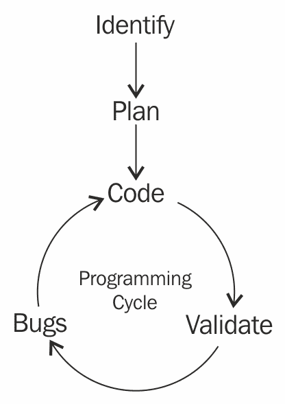
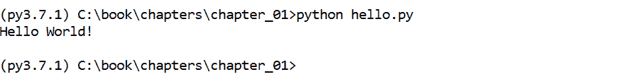
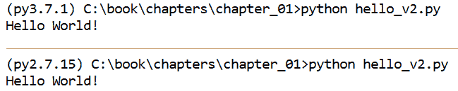
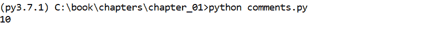

# 第一章：现在，呈现一些完全不同的内容

本书将 Python 作为优化数字取证分析的必要工具——从检查员的角度出发进行编写。在前两章中，我们将介绍 Python 的基础知识，为本书其余部分做准备，在后续章节中，我们将开发脚本以完成取证任务。虽然重点是将该语言作为工具使用，但我们也会探讨 Python 的优势，以及它如何帮助许多领域的从业者为复杂的取证挑战创建解决方案。就像 Python 的名字来源于 Monty Python 一样，接下来的 12 章旨在呈现*一些完全不同*的内容。

在这个快速发展的领域中，脚本语言以自动化的方式提供灵活的问题解决方案，使检查员能够有更多的时间去调查其他由于时间限制可能未能彻底分析的证据。诚然，Python 可能并不总是完成任务的最佳工具，但它是任何人的 DFIR 工具库中不可或缺的工具。如果你决定掌握 Python，它将大大回报你投入的时间，因为你将显著提高分析能力，并大大拓展你的技能。 本章概述了 Python 的基础知识，从`Hello World`到核心脚本概念。

本章将涵盖以下主题：

+   Python 介绍及健康的开发实践

+   基本编程概念

+   在 Python 中操作和存储对象

+   创建简单的条件判断、循环和函数

# 何时使用 Python

Python 是一个强大的取证工具。然而，在决定开发脚本之前，重要的是要考虑所需的分析类型和项目的时间表。在接下来的例子中，我们将概述 Python 在某些情况下如何是不可或缺的工具，反之，在其他情况下它的开发工作可能并不值得。尽管快速开发使得在复杂情况下轻松部署解决方案，Python 并不总是实现任务的最佳工具。如果现有工具已经能够完成任务，并且可以使用，那么它可能是更合适的分析方法。

Python 是取证工作中常用的编程语言，因其易用性、库支持、详细文档以及跨操作系统的互操作性。编程语言主要有两种类型：解释型语言和编译型语言。编译代码可以将编程语言转换为机器语言，这种低级语言计算机更容易解释。解释型语言在运行时的速度不如编译型语言，但不需要编译，这样可以节省一些时间。由于 Python 是解释型语言，我们可以修改代码并立即运行查看结果。而对于编译型语言，我们必须等待代码重新编译后才能看到修改效果。因此，虽然 Python 的运行速度可能不如编译型语言，但它支持快速原型开发。

事件响应案例是一个极好的示例，展示了在实际环境中何时使用 Python。例如，假设客户打来电话，慌张地报告数据泄露，并且不确定过去 24 小时内有多少文件从他们的文件服务器中被外泄。到达现场后，你被指示执行最快的文件访问次数统计，因为这个统计数字和泄露文件的列表将决定下一步的行动。

Python 在这种情况下非常合适。只需要一台笔记本电脑，你就可以打开文本编辑器并开始编写解决方案。Python 可以在没有复杂编辑器或工具集的情况下进行构建和设计。你脚本的构建过程可能是这样的，每一步都建立在前一步的基础上：

1.  让脚本读取单个文件的最后访问时间戳

1.  编写一个循环，逐步遍历目录和子目录

1.  测试每个文件，看看该时间戳是否来自过去 24 小时

1.  如果文件在过去 24 小时内被访问过，则创建一个受影响文件的列表，显示文件路径和访问时间

这里的过程将生成一个脚本，该脚本会遍历整个服务器，并输出在过去 24 小时内最后一次访问时间的文件，以供人工审核。这个脚本可能只有大约 20 行代码，并且一个中级脚本员大约需要 10 分钟或更少的时间来开发和验证——显然，这比手动检查文件系统中的时间戳更高效。

在部署任何已开发的代码之前，必须首先验证其能力。由于 Python 不是编译型语言，我们可以在添加新代码行后轻松运行脚本，以确保没有破坏任何功能。这种方法被称为**先测试后编码**，是脚本开发中常用的方式。任何软件，不管是谁编写的，都应当经过仔细审查和评估，以确保准确性和精确性。验证确保代码正常运行，虽然这需要更多的时间，但它提供了可靠的结果，能够经得起法庭的考验，这是法医领域中的一个重要方面。

在一般案例分析中，Python 可能不是最佳工具。如果你拿到一个硬盘并被要求在没有额外线索的情况下寻找证据，那么使用已有的工具会是更好的解决方案。Python 在针对性解决方案中非常有价值，比如分析特定类型的文件并生成元数据报告。为某一文件系统开发一个定制的全能解决方案所需的时间太长，尤其是考虑到市面上已有的支持这种通用分析的工具，不论是付费还是免费。

Python 在预处理自动化中非常有用。如果你发现自己在处理每一份证据时都在重复相同的任务，那么开发一个自动化这些步骤的系统可能是值得的。一个很好的例子是 ManTech 的分析与分类系统（mantaray：[`github.com/mantarayforensics`](http://github.com/mantarayforensics)），它利用一系列工具生成通用报告，在数据范围不明确的情况下加快分析速度。

在考虑是否投入资源开发 Python 脚本时，无论是临时开发还是针对较大项目开发，都应考虑已经存在的解决方案、可用的开发时间以及通过自动化节省的时间。尽管有着最佳的意图，解决方案的开发可能会比最初设想的时间要长得多，尤其是当没有一个强有力的设计计划时。

# 开发生命周期

开发周期至少包括五个步骤：

+   识别

+   计划

+   编程

+   验证

+   错误

第一步是不言自明的：在开发之前，你必须识别出需要解决的问题。规划可能是开发周期中最关键的一步：



良好的规划将有助于减少所需的代码量和 bug 数量，从而在后期节省时间。规划在学习过程中变得尤为重要。一个取证程序员必须开始回答以下问题：数据将如何被接收，哪些 Python 数据类型最为合适，是否需要第三方库，结果将如何呈现给检查员？刚开始时，就像写学期论文一样，最好先写一个大纲，或者画出程序的框架。随着 Python 熟练度的提高，规划将变成第二天性，但在最初阶段，建议先创建一个大纲或编写伪代码。

伪代码是一种在填充实际代码之前编写代码的非正式方式。伪代码可以表示程序的框架，如定义相关的变量和函数，并描述它们如何在脚本框架中组合在一起。一个函数的伪代码可能是这样的：

```
# open the database
  # read from the database using the sqlite3 library
  # store in variable called records
  for record in records: 
    # process database records here
```

在确定和规划之后，接下来的三个步骤构成了开发周期的最大部分。一旦程序的规划充分完成，就可以开始编写代码了！编写代码后，用尽可能多的测试数据来测试你的新程序。尤其在取证领域，彻底测试代码至关重要，而不是仅仅依赖一个例子的结果。如果没有全面的调试，代码在遇到意外情况时可能会崩溃，或者更糟糕的是，它可能会给检查员提供错误的信息，导致他们走错方向。代码测试完成后，就可以发布，并准备接受错误报告了。我们这里说的可不是昆虫！尽管程序员尽了最大努力，代码中总是会存在 bug。即便你修复了一个 bug，它们也有一种令人讨厌的方式会不断繁殖，导致编程周期不断地重复开始。

# 入门

在我们开始之前，你需要在机器上安装 Python。需要明白的是，在编写本书时，Python 有两个支持的版本：Python 2 和 3。我们将同时使用 Python 2 和 3 来开发我们的解决方案。从历史上看，许多有用的第三方取证库都是为 Python 2 开发的。目前，大部分库都与 Python 3 兼容，而 Python 3 提供了更强大的 Unicode 处理能力，解决了 Python 2 中的一大难题，还做了许多其他改进。本书中的所有代码都已经在最新的 Python 2（v. 2.7.15）或 3（v. 3.7.1）版本中进行过测试。在某些情况下，我们的代码兼容 Python 2 和 3，或者只兼容其中一个版本。每一章将会描述运行代码所需的 Python 版本。

此外，我们建议使用**集成开发环境**，简称**IDE**，例如 JetBrain 的 PyCharm。IDE 能够高亮显示错误并提供建议，帮助简化开发过程并促进编码时的最佳实践。如果无法安装 IDE，简单的文本编辑器也能使用。我们推荐像 Notepad++、Sublime Text 或 Visual Studio Code 这样的应用程序。对于喜欢命令行的用户，像 vim 或 nano 这样的编辑器也能使用。

在安装了 Python 后，让我们通过在命令提示符或终端中输入`python`来打开交互式提示符。我们将从介绍一些内置函数开始，以便用于故障排除。遇到本书中讨论的任何对象或函数，或在实际应用中遇到的函数时，第一步就是使用`type()`、`dir()`和`help()`这些内置函数。我们意识到我们尚未介绍常见的数据类型，因此以下代码可能看起来有些困惑。

然而，这正是本练习的重点。在开发过程中，你会遇到一些你不熟悉的数据类型，或者不确定如何与对象交互。这三个函数有助于解决这些问题。我们将在本章后面介绍基本数据类型。

`type()`函数在传入一个对象时，会返回其`__name__`属性，提供关于对象的类型识别信息。`dir()`函数在传入表示对象名称的字符串时，会返回其属性，显示该对象所属函数和参数的可用选项。`help()`函数可以通过其**文档字符串**展示这些方法的具体信息。文档字符串其实就是对一个函数的描述，详细说明了函数的输入、输出以及如何使用该函数。

让我们以`str`，即字符串对象，作为这三个函数的示例。在以下示例中，将一系列由单引号括起来的字符传递给`type()`函数，返回的类型是`str`，即字符串。

当我们展示示例时，如果输入的内容紧跟在`>>>`符号之后，这表示你应在 Python 交互式提示符中输入这些语句。你可以通过在命令提示符中输入`python`来访问 Python 交互式提示符。

这些基本函数在 Python 2 和 3 中的表现相似。除非另有说明，以下函数调用及其输出都是在 Python 3.7.1 环境下执行的。然而请注意，这些内置函数的用途在不同的 Python 版本中大体相同，输出也非常类似。

这是一个示例：

```
>>> type('what am I?')
<class 'str'> 
```

如果我们将一个对象传递给`dir()`函数，例如`str`，我们可以看到它的方法和属性。假设我们想知道其中一个函数，`title()`，是做什么的。我们可以使用`help()`函数，指定对象和其函数作为输入。

该函数的输出告诉我们不需要输入，输出是一个字符串对象，并且该函数将每个单词的第一个字符大写。让我们在`what am I?`字符串上使用`title`方法：

```
>>> dir(str) 
['__add__', '__class__', '__contains__', '__delattr__',
'__doc__', '__eq__', 
...
'swapcase', 'title', 'translate', 'upper', 'zfill']

>>> help(str.title)
Help on method_descriptor:

title(...)
 S.title() -> str

 Return a titlecased version of S, i.e. words start with title case characters, all remaining cased characters have lower case.

>>> 'what am I?'.title()
'What Am I?' 
```

接下来，输入`number = 5`。现在我们创建了一个名为`number`的变量，它的数值是`5`。使用`type()`函数查看该对象时，显示它是一个`int`（整数）。按照之前的步骤，我们可以看到整数对象的可用属性和函数。通过`help()`函数，我们可以查看`__add__()`函数在我们的`number`对象上执行了什么操作。从以下输出中，我们可以看到，这个函数等同于在两个值之间使用`+`符号：

```
>>> number = 5
>>> type(number)
<class 'int'>

>>> dir(number)
>>> ['__abs__', '__add__', __and__', '__class__', '__cmp__', '__coerce__',
...
'denominator', 'imag', 'numerator', 'real']

>>> help(number.__add__)
__add__(...)
x.__add__(y) <==> x+y
```

让我们比较`__add__()`函数和`+`符号之间的区别，以验证我们的假设。使用这两种方法将`3`加到`number`对象上时，返回的值是`8`，如预期那样。不幸的是，我们在演示这个例子时也违反了最佳实践规则：

```
>>> number.__add__(3)
8
>>> number + 3
8
```

请注意一些方法，例如`__add__()`，前后都有双下划线。这些被称为魔术方法，是 Python 解释器调用的方法，不应由程序员直接调用。这些魔术方法是通过用户间接调用的。例如，当在两个数字之间使用`+`符号时，整数的`__add__()`魔术方法会被调用。遵循前面的例子，你永远不应该运行`number.__add__(3)`来代替`number + 3`。

这个规则在一些情况下被打破，我们将在本书中讲解这些情况，不过除非文档推荐使用魔术方法，否则最好避免使用它们。

Python 和其他编程语言一样，有特定的语法。与其他常见的编程语言相比，Python 更像英语，可以在脚本中相对轻松地阅读。这一特点吸引了许多人，包括法医学社区，使用这种语言。尽管 Python 的语言易于阅读，但它不容小觑，因为它功能强大并支持常见的编程范式。

大多数程序员从一个简单的`Hello World`脚本开始，这是一个测试，证明他们能够执行代码并将著名的消息打印到控制台窗口。在 Python 中，打印这个语句的代码是一行，如下所示，写在文件的第一行：

```
001 print("Hello World!")
```

请注意，当讨论脚本中的代码时，与交互式提示符中的代码不同，行号（从 001 开始）仅用于参考。请不要在您的脚本中包含这些行号。此脚本及所有脚本的代码可以在[`packtpub.com/books/content/support`](https://packtpub.com/books/content/support)下载。

将这一行代码保存在名为`hello.py`的文件中。要运行此脚本，我们调用 Python 和脚本的名称。如果你使用的是 Python 3，`Hello World!`消息应该会显示在你的终端中：



让我们讨论一下为什么这个简单的脚本在某些版本的 Python 2 中无法成功执行。

# 无处不在的 `print()` 函数

在 Python 中打印是一项非常常见的技术，因为它允许开发者在脚本执行时将文本显示到控制台。虽然 Python 2 和 3 之间有许多差异，但打印调用方式是最明显的变化，也是我们之前的示例仅能在 Python 3 中运行的原因。到了 Python 3，`print` 变成了一个函数，而不再是像旧版 Python 2 那样的语句。让我们回顾一下之前的脚本，看看有何微小差异。

注意 Python 3 中的以下内容：

```
001 print("Hello World!")
```

注意 Python 2 中的以下内容：

```
001 print "Hello World!"
```

差异看起来微不足道。在 Python 2 中，`print` 是一个语句，你不需要将要打印的内容括在圆括号中。说这种差异只是语义上的问题并不公平；然而，目前只需理解，`print` 根据所使用的 Python 版本写法不同。这种微小变化的后果是，使用 `print` 作为语句的旧版 Python 2 脚本无法被 Python 3 执行。

在可能的情况下，我们的脚本将兼容 Python 2 和 3 两个版本。虽然由于 `print` 的差异，看似不可能实现这一目标，但可以通过导入一个名为 `__future__` 的特殊 Python 库并将 `print` 语句更改为函数来实现。为此，我们需要从 `__future__` 库中导入 `print` 函数，然后将所有 `print` 命令写为 `function`。

以下脚本在 Python 2 和 3 中都能执行：

```
001 from __future__ import print_function
002 print("Hello World!") 
```



在上一个截图中，您可以看到在 Python 2.7.15 和 Python 3.7.1 中执行此脚本的结果。

# 标准数据类型

完成第一个脚本后，是时候理解 Python 的基本数据类型了。这些数据类型与其他编程语言中的类型类似，但通过简单的语法进行调用，详细描述见下表和相关章节。有关 Python 中可用的所有标准数据类型的完整列表，请访问官方文档：[`docs.python.org/3/library/stdtypes.html`](https://docs.python.org/3/library/stdtypes.html)：

| **数据类型** | **描述** | **示例** |
| --- | --- | --- |
| `Str` | 字符串 | `str()`, `"Hello"`, `'Hello'` |
| `Unicode` | Unicode 字符 | `unicode()`, `u'hello'`, `"world".encode('utf-8')` |
| `Int` | 整数 | `int()`, `1`, `55` |
| `Float` | 小数精度整数 | `float()`, `1.0`, `.032` |
| `Bool` | 布尔值 | `bool()`, `True`, `False` |
| `List` | 元素的列表 | `list()`, `[3, 'asd', True, 3]` |
| `Dictionary` | 键值对集合，用于结构化数据 | `dict()`, `{'element': 'Mn', 'Atomic Number': 25, 'Atomic Mass': 54.938}` |
| `Set` | 唯一元素的集合 | `set()`, `[3, 4, 'hello']` |
| `元组` | 有序元素列表 | `tuple()`, `(2, 'Hello World!', 55.6, ['element1'])` |
| `文件` | 一个文件对象 | `open('write_output.txt', 'w')` |

我们即将深入了解 Python 中数据类型的使用，建议你根据需要反复阅读这一部分以帮助理解。虽然阅读数据类型如何处理很重要，但请确保在你第一次操作时使用可以运行 Python 的计算机。我们鼓励你在解释器中进一步探索数据类型并进行测试，看看它们能做些什么。

你会发现，我们的大多数脚本都可以仅使用 Python 提供的标准数据类型来完成。在我们查看其中一种最常见的数据类型——字符串之前，我们将介绍注释。

总是有人说，而且永远说不够的一点是：注释你的代码。在 Python 中，注释是由任何以井号（也就是现在称为“话题标签”）`#`符号开头的行形成的。当 Python 遇到这个符号时，它会跳过该行的其余部分，继续到下一行。对于跨多行的注释，我们可以使用三个单引号或双引号来标记注释的开始和结束，而不是为每一行都使用单个井号符号。以下是名为 `comments.py` 文件中不同类型注释的示例。运行此脚本时，我们只会看到 `10` 打印到控制台，因为所有的注释都被忽略了：

```
# This is a comment
print(5 + 5) # This is an inline comment.
# Everything to the right of the # symbol
# does not get executed
"""We can use three quotes to create 
multi-line comments."""  
```

输出如下：



当执行此代码时，我们只会看到前面的输出在控制台上显示。

# 字符串与 Unicode

字符串是一种包含任何字符的数据类型，包括字母数字字符、符号、Unicode 和其他编码。由于字符串可以存储大量信息，毫不奇怪它们是最常见的数据类型之一。字符串出现的常见场景包括命令行读取参数、用户输入、文件中的数据以及输出数据。首先，让我们来看一下如何在 Python 中定义一个字符串。

创建字符串有三种方式：使用单引号、双引号或内建的 `str()` 构造方法。请注意，单引号和双引号的字符串没有区别。能够通过多种方式创建字符串是有优势的，因为它允许我们在字符串中区分有意使用的引号。例如，在 `'I hate when people use "air-quotes"!'` 字符串中，我们使用单引号来标记主字符串的开始和结束，字符串中的双引号不会导致 Python 解释器出现问题。让我们通过 `type()` 函数来验证，单引号和双引号创建的是相同类型的对象：

```
>>> type('Hello World!')
<class 'str'>
>>> type("Foo Bar 1234")
<class 'str'> 
```

正如我们在注释中所看到的，可以通过三个单引号或双引号来定义块字符串，从而创建多行字符串。唯一的区别是是否对块引号值进行操作：

```
>>> """This is also a string""" 
This is also a string
>>> '''it 
 can span 
 several lines''' 
it\ncan span\nseveral lines 
```

返回行中的`\n`字符表示换行或新的一行。在解释器中，输出会显示这些换行符为`\n`，但当它被输入到文件或控制台时，会创建一个新行。`\n`字符是 Python 中的常见转义字符之一。转义字符由反斜杠和特定字符组合表示。其他常见的转义字符包括`\t`表示水平制表符，`\r`表示回车符，`\'`、`\"`和`\\`分别表示字面上的单引号、双引号和反斜杠等。字面字符让我们能够使用这些字符，而不会无意中触发它们在 Python 上下文中的特殊含义。

我们还可以使用加法（`+`）或乘法（`*`）运算符对字符串进行操作。加法运算符用于连接字符串，而乘法运算符则会重复提供的字符串值：

```
>>> 'Hello' + ' ' + 'World'
Hello World
>>> "Are we there yet? " * 3
Are we there yet? Are we there yet? Are we there yet?
```

让我们来看一些常见的字符串操作函数。我们可以使用`strip()`函数从字符串的开头或结尾删除字符。`strip()`函数需要我们提供要删除的字符作为输入，否则默认会删除空白字符。类似地，`replace()`函数接受两个输入：要替换的字符和替换后的字符。这两个函数的主要区别在于，`strip()`只处理字符串的开头和结尾：

```
# This will remove colon (`:`) from the beginning and end of the line
>>> ':HelloWorld:'.strip(':')
HelloWorld

# This will remove the colon (`:`) from the line and place a 
# space (` `) in it's place
>>> 'Hello:World'.replace(':', ' ')
Hello World 
```

我们可以使用`in`语句检查某个字符或字符是否存在于字符串中。或者，我们可以更具体地检查字符串是否`startswith()`或`endswith()`某个特定字符（你知道一个语言是否容易理解，就看你能否用函数创造出通顺的句子）。这些方法会返回`True`或`False`布尔值：

```
>>> 'a' in 'Chapter 2'
True
>>> 'Chapter 1'.startswith('Chapter')
True
>>> 'Chapter 1'.endswith('1')
True 
```

我们可以根据某些分隔符快速将一个字符串拆分为一个列表。这对于将以分隔符分隔的数据快速转换为列表非常有帮助。例如，**逗号分隔值**（**CSV**）数据是以逗号分隔的，可以在该值上进行拆分：

```
>>> print("Hello, World!".split(','))
["Hello", " World!"] 
```

格式化参数可以应用于字符串，以根据提供的值操作和转换它们。使用`.format()`函数，我们可以将值插入到字符串中、填充数字并显示简单格式的模式。本章将展示一些`.format()`方法的示例，后续章节会介绍它的更复杂功能。`.format()`方法按照顺序用提供的值替换大括号中的内容：

这是将值动态插入字符串中的最基本操作：

```
>>> "{} {} {} {}".format("Formatted", "strings", "are", "easy!")
'Formatted strings are easy!'
```

我们的第二个示例展示了一些可以用来操作字符串的表达式。在大括号内，我们放置一个冒号，表示我们将为解释指定一个格式。在冒号后，我们指定应该打印至少六个字符。如果提供的输入不足六个字符，我们会在输入的前面添加零。最后，`d`字符表示输入将是一个十进制数：

```
>>> "{:06d}".format(42)
'000042' 
```

我们最后的例子演示了如何通过设置填充字符为等号符号，并加上插入符号（以将符号居中显示），以及重复符号的次数，轻松打印出一串`20`个等号字符。通过提供这个格式化字符串，我们可以快速在输出中创建可视化分隔符：

```
>>> "{:=²⁰}".format('')
'====================' 
```

虽然我们将介绍`.format()`方法的更多高级特性，但[`pyformat.info/`](https://pyformat.info/)网站是学习 Python 字符串格式化能力的一个很好的资源。

# 整数和浮动数

整数是另一种常用的有价值数据类型——整数是任何完整的正数或负数。浮动数数据类型类似，但允许我们使用需要小数精度的数字。通过整数和浮动数，我们可以使用标准的数学运算，如：`+`、`-`、`*`和`/`。这些运算会根据对象的类型（例如，`integer`或`float`）返回稍微不同的结果。

整数使用整数和四舍五入运算，例如，两个整数相除将得到另一个整数。但如果方程式中使用了浮动数，即使它的值与整数相同，结果也会是浮动数；例如，在 Python 中，`3/2=1`和`3/2.0=1.5`。以下是整数和浮动数运算的示例：

```
>>> type(1010)
<class 'int'>
>>> 127*66
8382
>>> 66/10
6
>>> 10 * (10 - 8)
20 
```

我们可以使用`**`将整数提升为某个幂。例如，在接下来的部分中，我们将`11`提高到`2`的幂。在编程中，确定两个整数之间除法的结果（即分子）是有帮助的。为此，我们使用模运算符或百分号（`%`）。在 Python 中，负数是带有负号字符（`-`）的数值。我们可以使用内置的`abs()`函数来获取整数或浮动数值的绝对值：

```
>>> 11**2
121
>>> 11 % 2 # 11 divided by 2 is 5.5 or 5 with a remainder of 1
1
>>> abs(-3)
3
```

浮动类型（float）是由任何带有小数的数字定义的。浮动类型遵循与整数相同的规则和操作，唯一的例外是之前提到的除法行为：

```
>>> type(0.123)
<class 'float'>
>>> 1.23 * 5.23
6.4329
>>> 27/8.0
3.375
```

# 布尔值和空值

整数`0`和`1`也可以在 Python 中表示布尔值。这些值分别是布尔值`False`或`True`对象。要定义布尔值，我们可以使用`bool()`构造函数语句。这些数据类型在程序逻辑中被广泛使用，用于评估条件语句，如本章后面所述。

另一个内置的数据类型是空值类型，它由关键字`None`定义。当使用时，它表示一个空对象，并且当评估时返回`False`。这在初始化一个可能在执行过程中使用多种数据类型的变量时很有用。通过赋予一个空值，变量在重新赋值之前保持清洁：

```
>>> bool(0)
False
>>> bool(1)
True
>>> None
>>> 
```

# 结构化数据类型

有几种更复杂的数据类型，允许我们创建原始数据的结构。这些包括列表、字典、集合和元组。大多数这些结构是由前述的数据类型组成的。这些结构在创建强大的值单元时非常有用，可以以可管理的方式存储原始数据。

# 列表

列表是一个有序的元素集合。列表支持任何数据类型作为元素，并会保持数据在添加到列表时的顺序。元素可以通过位置调用，也可以使用循环逐个访问每个项目。在 Python 中，不像其他语言，打印一个列表只需要一行代码。在像 Java 或 C++ 这样的语言中，打印一个列表可能需要三行或更多的代码。Python 中的列表可以根据需要任意长，并且可以动态扩展或收缩，这是其他语言中不常见的特性。

我们可以通过使用方括号并用逗号分隔元素来创建列表。或者，我们可以使用 `list()` 类构造函数并传入一个可迭代对象。列表元素可以通过索引访问，其中 `0` 是第一个元素。要通过位置访问元素，我们将所需的索引放在方括号内，紧跟在列表对象后面。我们不需要知道列表的长度（可以通过 `len()` 函数获取），可以使用负数索引来根据列表末尾访问元素（即，`-3` 会获取倒数第三个元素）：

```
>>> type(['element1', 2, 6.0, True, None, 234])
<class 'list'>
>>> list((4, 'element 2', None, False, .2))
[4, 'element 2', None, False, 0.2]
>>> len([0,1,2,3,4,5,6])
7
>>> ['hello_world', 'foo bar'][0]
hello_world
>>> ['hello_world', 'foo_bar'][-1]
foo_bar 
```

我们可以使用几种不同的函数来添加、删除或检查一个值是否在列表中。`append()` 方法将数据添加到列表的末尾。或者，`insert()` 方法允许我们在添加数据到列表时指定索引。例如，我们可以将字符串 `fish` 添加到列表的开头，或者 `0` 索引位置：

```
>>> ['cat', 'dog'].append('fish')
# The list becomes: ['cat', 'dog', 'fish']
>>> ['cat', 'dog'].insert(0, 'fish')
# The list becomes: ['fish', 'cat', 'dog']  
```

`pop()` 和 `remove()` 函数可以分别通过索引或特定对象从列表中删除数据。如果在 `pop()` 函数中没有提供索引，则默认弹出列表中的最后一个元素。需要注意的是，`remove()` 函数只会删除列表中第一个匹配的对象：

```
>>> [0, 1, 2].pop()
2
# The list is now [0, 1]

>>> [3, 4, 5].pop(1)
4
# The list is now [3, 5]
>>> [1, 1, 2, 3].remove(1)
# The list becomes: [1, 2, 3] 
```

我们可以使用 `in` 语句来检查某个对象是否在列表中。`count()` 函数告诉我们某个对象在列表中出现了多少次：

```
>>> 'cat' in ['mountain lion', 'ox', 'cat']
True
>>> ['fish', 920.5, 3, 5, 3].count(3)
2 
```

如果我们想访问元素的子集，可以使用列表切片表示法。其他对象，如字符串，也支持这种切片表示法来获取数据的子集。切片表示法具有以下格式，其中 `a` 是我们的列表或字符串对象：

```
a[x:y:z]
```

在上述示例中，`x`表示切片的起始位置，`y`表示切片的结束位置，`z`表示切片的步长。请注意，每个部分由冒号分隔并括在方括号中。负步长是快速反转支持切片表示法的对象内容的方式，并由负数`*z*`触发。每个参数都是可选的。在第一个示例中，我们的切片返回从第二个元素到第五个元素（但不包括第五个元素）的子列表。只使用这些切片元素中的一个，则会返回一个包含从第二个索引开始或到第五个索引为止的所有元素的列表：

```
>>> [0,1,2,3,4,5,6][2:5]
[2, 3, 4]
>>> [0,1,2,3,4,5,6][2:]
[2, 3, 4, 5, 6]
>>> [0,1,2,3,4,5,6][:5]
[0, 1, 2, 3, 4] 
```

使用第三种切片元素，我们可以跳过每个其他元素，或者简单地通过负数反转列表。我们可以通过组合这些切片元素来指定如何从列表中提取数据子集：

```
>>> [0,1,2,3,4,5,6][::2]
[0, 2, 4, 6]
>>> [0,1,2,3,4,5,6][::-1]
[6, 5, 4, 3, 2, 1, 0]  
```

# 字典

字典，也称为`dict`，是另一种常见的 Python 数据容器。与列表不同，这种对象不会按线性方式添加数据。相反，数据以键值对的形式存储，您可以创建和命名唯一的键，以便作为存储值的索引。需要注意的是，在 Python 2 中，字典不会保留添加项的顺序。而从 Python 3.6.5 开始，字典会保持插入顺序，尽管通常我们不应依赖`dict()`对象为我们维持顺序。这些对象在取证脚本中被大量使用，因为它们允许我们通过名称在单一对象中存储数据；否则，我们可能不得不分配许多新变量。通过将数据存储在字典中，我们可以使一个变量包含非常结构化的数据。

我们可以通过使用大括号（`{}`）来定义字典，其中每个键值对由冒号分隔。此外，我们还可以使用`dict()`类构造函数来实例化字典对象。调用字典中的值是通过在字典对象后指定键并放在方括号中完成的。如果我们提供一个不存在的键，则会收到`KeyError`（请注意我们将字典赋值给了一个变量`a`）。虽然我们尚未介绍变量，但需要突出一些特定于字典的函数：

```
>>> type({'Key Lime Pie': 1, 'Blueberry Pie': 2})
<class 'dict'>
>>> dict((['key_1', 'value_1'],['key_2', 'value_2']))
{'key_1': 'value_1', 'key_2': 'value_2'}
>>> a = {'key1': 123, 'key2': 456}
>>> a['key1']
123 
```

我们可以通过指定一个键并将其设置为另一个对象来添加或修改字典中现有键的值。我们可以使用`pop()`函数删除对象，类似于列表的`pop()`函数，通过指定键而不是索引来从字典中删除项：

```
>>> a['key3'] = 789
>>> a
{'key1': 123, 'key2': 456, 'key3': 789}
>>> a.pop('key1')
123
>>> a
{'key2': 456, 'key3': 789} 
```

`keys()`和`values()`函数返回字典中键和值的列表。我们可以使用`items()`函数返回包含每个键值对的元组列表。这三个函数通常用于条件语句和循环：

```
>>> a.keys()
dict_keys(['key2', 'key3'])
>>> a.values()
dict_values([456, 789])
>>> a.items()
dict_items([('key3', 789), ('key2', 456)])
```

# 集合和元组

集合与列表类似，它们包含一组元素，但集合中的元素必须是唯一的。因此，元素必须是不可变的，这意味着其值必须保持恒定。因此，集合最适合用于整数、字符串、布尔值、浮动值和元组作为元素。集合不对元素进行索引，因此我们不能通过它们在`set`中的位置访问元素。相反，我们可以通过使用与列表方法相同的`pop()`方法来访问和移除元素。元组也类似于列表，但它们是不可变的。使用括号而非方括号构建，元素不必是唯一的，可以是任何数据类型：

```
>>> type(set([1, 4, 'asd', True]))
<class 'set'>
>>> g = set(["element1", "element2"])
>>> g
{'element1', 'element2'}
>>> g.pop()
'element2'
>>> g
{'element1'}
>>> tuple('foo')
('f', 'o' , 'o')
>>> ('b', 'a', 'r')
('b', 'a', 'r')
>>> ('Chapter1', 22)[0]
Chapter1
>>> ('Foo', 'Bar')[-1]
Bar 
```

元组和列表的一个重要区别是元组是不可变的。这意味着我们不能改变元组对象。相反，我们必须完全替换该对象，或者将其转换为可变的列表。这个转换过程将在下一节中描述。替换对象非常慢，因为向元组添加值的操作是`tuple = tuple + ('新值',)`，请注意，尾随的逗号是必需的，用于表示这是一个元组的添加操作。

# 数据类型转换

在某些情况下，初始数据类型可能不是所需的数据类型，并且需要在保留其内容的同时进行更改。例如，当用户从命令行输入参数时，这些输入通常会作为字符串捕获，有时这些用户输入需要变成整数。我们需要使用整数类构造函数来转换该字符串对象，然后再处理数据。假设我们有一个简单的脚本，它返回用户提供的整数的平方；我们需要先将用户输入转换为整数，然后再计算平方。最常见的数据类型转换方法之一是使用构造函数方法包装变量或字符串，如下所示，适用于每种数据类型：

```
>>> int('123456') # The string 123456
123456 # Is now the integer 123456
>>> str(45) # The integer 45
'45' # Is now the string 45
>>> float('37.5') # The string 37.5
37.5 # Is now the float 37.5 
```

无效的转换，例如将字母`'a'`转换为整数，将引发`ValueError`。该错误将指出指定的值无法转换为所需的类型。在这种情况下，我们需要使用内建的`ord()`方法，它将字符转换为基于 ASCII 值的整数等效值。在其他情况下，我们可能需要使用其他方法在数据类型之间进行转换。以下是我们可以在大多数场景中使用的常见内建数据类型转换方法的表格：

| **方法** | **描述** |
| --- | --- |
| `str()`、`int()`、`float()`、`dict()`、`list()`、`set()`、`tuple()` | 类构造函数方法 |
| `hex()`、`oct()` | 将整数转换为 16 进制（hex）或 8 进制（octal）表示 |
| `chr()`、`unichr()` | 将整数转换为 ASCII 或 Unicode 字符 |
| `ord()` | 将字符转换为整数 |

我们还可以互换列表、集合和元组类型中的有序集合或类型。由于集合对插入的数据有要求，通常我们不会将任何东西强制转换为集合。相反，更常见的做法是将集合转换为列表，以便按位置访问值：

```
>>> tuple_1 = (0, 1, 2, 3, 3)
>>> tuple_1
(0, 1, 2, 3, 3)
>>> set_1 = set(tuple_1)
>>> set_1
{0, 1, 2, 3}
>>> list_1 = list(tuple_1)
>>> list_1
[0, 1, 2, 3, 3]
>>> list_2 = list(set_1)
>>> list_2
[0, 1, 2, 3]
```

# 文件

我们经常创建文件对象来从文件中读取或写入数据。文件对象可以使用内置的 `open()` 方法创建。`open()` 函数接受两个参数：文件名和模式。这些模式决定了我们如何与文件对象进行交互。模式参数是可选的，如果未指定，则默认为只读模式。以下表格列出了可用的不同文件模式：

| **文件模式** | **描述** |
| --- | --- |
| `r` | 以只读模式打开文件（默认模式）。*这并不提供法医写保护！请始终使用经过认证的过程来保护证据不被修改。* |
| `w` | 如果文件存在，则创建或覆盖该文件进行写入。 |
| `a` | 如果文件不存在，则创建该文件以进行写入。如果文件存在，则将文件指针置于文件末尾以附加写入内容。 |
| `rb`, `wb`, 或 `ab` | 以二进制模式打开文件进行读写。 |
| `r+`, `rb+`, `w+`, `wb+`, `a+`, 或 `ab+` | 以标准模式或二进制模式打开文件进行读写。如果文件不存在，`w` 或 `a` 模式会创建文件。 |

我们最常使用标准模式或二进制模式进行读写。让我们来看几个示例以及可能使用的一些常见函数。在本节中，我们将创建一个名为 `file.txt` 的文本文件，内容如下：

```
This is a simple test for file manipulation.
We will often find ourselves interacting with file objects.
It pays to get comfortable with these objects.
```

在以下示例中，我们打开一个已存在的文件对象 `file.txt`，并将其赋值给变量 `in_file`。由于未提供文件模式，文件默认以只读模式打开。我们可以使用 `read()` 方法将所有行作为一个连续的字符串读取。`readline()` 方法可用于逐行读取字符串。或者，`readlines()` 方法会为每一行创建一个字符串，并将其存储在列表中。这些函数接受一个可选参数，指定要读取的字节数。

`readline()` 和 `readlines()` 函数使用 `\n` 或 `\r` 换行符将文件的行分段。这对于大多数文件来说是有效的，但根据输入数据的不同，可能并不总是适用。例如，包含多行内容在单一单元格中的 CSV 文件，使用此类文件读取接口时可能无法正确显示。

Python 会跟踪我们在文件中的当前位置。为了说明我们描述的例子，我们需要使用`seek()`操作将光标移回文件开头，然后再运行下一个示例。`seek()`操作接受一个数字并将光标移动到该文件中的字符偏移量。例如，如果我们在没有将光标移动回文件开头的情况下使用`read()`方法，接下来的打印函数（展示`readline()`方法）将不会返回任何内容。这是因为光标在使用`read()`方法后已经位于文件的末尾：

```
>>> in_file = open('file.txt')
>>> print(in_file.read())
This is a simple test for file manipulation.
We will often find ourselves interacting with file objects.
It pays to get comfortable with these objects.
>>> in_file.seek(0)
>>> print(in_file.readline())
This is a simple test for file manipulation.
>>> in_file.seek(0)
>>> print(in_file.readlines())
['This is a simple test for file manipulation.\n', 'We will often find ourselves interacting with file objects.\n', 'It pays to get comfortable with these objects.'] 
```

类似地，我们可以使用`w`文件模式来创建、打开并覆盖现有文件。我们可以使用`write()`函数写入单个字符串，或使用`writelines()`方法将任何可迭代对象写入文件。`writelines()`函数本质上是对可迭代对象的每个元素调用`write()`方法。

例如，这相当于对列表的每个元素调用`write()`方法：

```
>>> out_file = open('output.txt', 'w')
>>> out_file.write('Hello output!')
>>> data = ['falken', 124, 'joshua']
>>> out_file.writelines(data) 
```

Python 能够自动很好地关闭文件对象的连接。然而，最佳实践要求我们在写入数据到文件后，应该使用`flush()`和`close()`方法。`flush()`方法将缓冲区中剩余的数据写入文件，而`close()`方法则关闭与文件对象的连接：

```
>>> out_file.flush()
>>> out_file.close() 
```

# 变量

我们可以使用刚才介绍的数据类型为变量赋值。通过给变量赋值，我们可以通过变量名引用该值，无论它是一个包含 100 个元素的大列表。这不仅避免了程序员一遍又一遍地重复输入相同的值，还增强了代码的可读性，并且使得我们能够随着时间的推移更改变量的值。在本章中，我们已经通过`=`符号为变量赋值。技术上讲，变量名可以是任何东西，但我们建议遵循以下准则：

+   变量名应该简短并且描述存储的内容或目的。

+   变量名应以字母或下划线开头。

+   常量变量应由大写字母组成。

+   动态变量应该是由下划线分隔的小写字母单词。

+   变量名永远不要是以下保留字或任何 Python 保留的名称：`input`、`output`、`tmp`、`temp`、`in`、`for`、`next`、`file`、`True`、`False`、`None`、`str`、`int`、`list`。

+   变量名中永远不要包含空格。Python 会认为定义了两个变量，并会抛出语法错误。使用下划线来分隔单词。

通常，程序员使用易记且具有描述性的名称，以表明它们所包含的数据。例如，在一个提示用户输入电话号码的脚本中，变量应为`phone_number`，这清楚地表明了该变量的目的和内容。另一种流行的命名风格是`CamelCase`，其中每个单词的首字母大写。这种命名约定通常与类名一起使用（本书稍后会介绍）。

变量赋值允许在脚本运行时修改值。一般的经验法则是，如果一个变量会再次使用，就将一个值分配给它。让我们通过创建变量并为其分配我们刚学到的数据类型来练习。虽然这很简单，但我们建议在交互式提示中跟着做，以养成分配变量的习惯。在这里的第一个示例中，我们将一个字符串分配给变量，然后打印该变量：

```
>>> print(hello_world)
Hello World! 
```

第二个示例引入了一些新的运算符。首先，我们将整数 `5` 分配给变量 `our_number`。然后，我们使用加法赋值运算符 (`+=`)，作为 `our_number = our_number + 20` 的简写形式。除了加法赋值外，还有减法赋值 (`-=`)、乘法赋值 (`*=`) 和除法赋值 (`/=`)：

```
>>> our_number = 5
>>> our_number += 20
>>> print(our_number)
25 
```

在以下代码块中，我们在打印之前分配了一系列变量。我们为变量使用的数据类型分别是 `string`、`integer`、`float`、`list` 和 `Boolean`：

```
>>> BOOK_TITLE = 'Learning Python for Forensics'
>>> edition = 2
>>> python2_version = 2.7.15
>>> python3_version = 3.7.1
>>> AUTHOR_NAMES = ['Preston Miller', 'Chapin Bryce']
>>> is_written_in_english = True
>>> print(BOOK_TITLE)
'Learning Python for Forensics'
>>> print(AUTHOR_NAMES)
['Preston Miller', 'Chapin Bryce']
>>> print(edition)
1
>>> print(python2_version)
2.7.15
>>> print(is_written_in_english)
True
```

注意 `BOOK_TITLE` 和 `AUTHOR_NAMES` 变量。当一个变量是静态的，比如在脚本执行过程中不发生变化时，它被称为常量变量。与其他编程语言不同，Python 没有内置的保护常量不被覆盖的方法，因此我们使用命名约定来提醒自己不要替换其值。虽然一些变量如书籍的版本、语言或 Python 的版本可能会变化，但标题和作者应该是常量（我们希望如此）。如果在命名和样式约定上存在困惑，可以尝试在解释器中运行以下语句：

```
>>> import this  
```

如我们之前所见，我们可以对字符串使用 `split()` 方法将其转换为列表。我们还可以使用 `join()` 方法将列表转换为字符串。该方法包含一个包含所需公分母的字符串和列表作为唯一参数。在以下示例中，我们取一个包含两个字符串的列表，并将它们合并成一个字符串，元素之间由逗号分隔：

```
>>> print(', '.join(["Hello", "World!"]))
Hello, World!
```

# 理解脚本流程逻辑

流程控制逻辑允许我们通过根据一系列情况指定不同的程序执行路线来创建动态操作。在任何有价值的脚本中，都会有某种形式的流程控制。例如，创建一个根据用户选择的选项返回不同结果的动态脚本时，就需要流程逻辑。在 Python 中，有两种基本的流程逻辑：条件语句和循环语句。

流程运算符通常与流程逻辑一起使用。这些运算符可以串联在一起，创建更复杂的逻辑。下表展示了一个 *真值表*，并说明了基于 *A* 或 *B* 变量布尔状态的各种流程运算符的值：

| **A** | **B** | **A 和 B** | **A 或 B** | **非 A** | **非 B** |
| --- | --- | --- | --- | --- | --- |
| F | F | F | F | T | T |
| T | F | F | T | F | T |
| F | T | F | T | T | F |
| T | T | T | T | F | F |

逻辑 `AND` 和 `OR` 运算符是表格中的第三和第四列。只有当 *A* 和 *B* 都为 `True` 时，`AND` 运算符才会返回 `True`。对于 `OR` 运算符，只需要其中一个变量为 `True`，它就会返回 `True`。`not` 运算符只是将变量的布尔值切换为其相反值（例如，`True` 变为 `False`，反之亦然）。

掌握条件语句和循环将使我们的脚本达到一个新的层次。其核心是，流程逻辑仅依赖于两个值：`True` 或 `False`。如前所述，在 Python 中，这两个值由布尔类型 `True` 和 `False` 表示。

# 条件语句

当脚本遇到条件语句时，就像是站在一条岔路口。根据某些因素，比如更有前景的远方，你可能决定朝东而不是朝西走。计算机逻辑不那么任意，如果某件事为真，脚本就会按一种方式执行，如果为假，则按另一种方式执行。这些分岔口非常关键；如果程序决定偏离我们为它设计的路径，我们就会陷入严重的麻烦。

有三个语句用于构成条件块：`if`、`elif` 和 `else`。条件块指的是条件语句、它们的流程逻辑和代码。一个条件块以 `if` 语句开始，后面跟着流程逻辑、冒号和缩进的代码行。如果流程逻辑计算结果为 `True`，那么 `if` 语句后面缩进的代码将会被执行。如果计算结果不是 `True`，**Python 虚拟机**（**PVM**）将跳过这些代码行并转到与 `if` 语句相同缩进级别的下一行。这通常是相应的 `elif`（else-if）或 `else` 语句。

在 Python 中，缩进非常重要。它用于标识在条件语句或循环中要执行的代码。本书中采用了四个空格的缩进标准，尽管你可能会遇到使用两个空格或使用制表符的代码。虽然这三种做法在 Python 中都被允许，但四个空格的缩进更受推崇，且更容易阅读。

在一个条件块中，一旦某个语句计算结果为 `True`，代码就会被执行，且 PVM 会退出该块，而不再评估其他语句。

```
# Conditional Block Pseudocode
if [logic]:
    # Line(s) of indented code to execute if logic evaluates to True.
elif [logic]:
    # Line(s) of indented code to execute if the 'if' 
    # statement is false and this logic is True.
else:
    # Line(s) of code to catch all other possibilities if
    # the 'if' and 'elif' statements are all False.
```

在我们定义函数之前，我们将坚持使用简单的 `if` 语句示例：

```
>>> a = 5
>>> b = 22
>>> a > 0
True
>>> a > b
False
>>> if a > 0:
...     print(str(a) + ' is greater than zero!')
...
5 is greater than zero!
>>> if a >= b:
...     print(str(a) + ' beats ' + str(b))
...
>>> 
```

注意，当流程逻辑计算结果为 `True` 时，`if` 语句后面缩进的代码会被执行。当其结果为 `False` 时，代码会被跳过。通常，当 `if` 语句为假时，你会有一个辅助语句，比如 `elif` 或 `else`，用于捕捉其他可能性，例如当 `a` 小于或等于 `b` 时。然而，值得注意的是，我们可以只使用 `if` 语句，而不使用任何 `elif` 或 `else` 语句。

`if` 和 `elif` 之间的区别很微妙。只有在我们使用多个 `if` 语句时，才能明显感觉到区别。`elif` 语句允许在第一个条件不成功时评估第二个条件。而第二个 `if` 语句会在第一个 `if` 语句的结果无论如何都被执行。

`else` 语句不需要任何流程逻辑，可以作为一种通用情况处理任何剩余的或未处理的情况。然而，这并不意味着在执行 `else` 语句中的代码时不会发生错误。不要依赖 `else` 语句来处理错误。

可以通过使用逻辑运算符 `and` 或 `or` 来使条件语句更具综合性。这些运算符允许在单个条件语句中实现更复杂的逻辑：

```
>>> a = 5
>>> b = 22
>>> if a > 4 and a < b:
...     print('Both statements must be true to print this')
...
Both statements must be true to print this
>>> if a > 10 or a < b:
...     print('One of these statements must be true to print this')
...
Only one of these statements must be true to print this 
```

以下表格有助于理解常见操作符的工作方式：

| **操作符** | **描述** | **示例** | **结果** |
| --- | --- | --- | --- |
| `<`, `>` | 小于，大于 | `8 < 3` | `False` |
| `<=`, `>=` | 小于等于，大于等于 | `5 =< 5` | `True` |
| `==`, `!=` | 等于，不等于 | `2 != 3` | `True` |
| `not` | 切换布尔值 | `not True` | `False` |

# 循环

循环提供了另一种流程控制的方法，适用于执行迭代任务。循环会重复执行包含的代码，直到提供的条件不再为`True`或出现退出信号。有两种类型的循环：`for` 和 `while`。对于大多数迭代任务，`for` 循环通常是最合适的选择。

# `for` 循环

`for` 循环是最常见的循环方式，在大多数情况下，它是执行重复任务的首选方法。想象一下一个工厂流水线；对于传送带上的每个物品，都可以使用 `for` 循环对其执行某项任务，比如给物品贴上标签。通过这种方式，多个 `for` 循环可以在流水线的形式下协同工作，处理每个物品，直到它们准备好展示给用户。

和 Python 中的其他部分一样，`for` 循环在语法上非常简单，但功能强大。在一些语言中，`for` 循环需要初始化、计数器以及终止条件。而 Python 的 `for` 循环则更加动态，能够自动处理这些任务。这些循环包含缩进的代码，按行执行。如果被迭代的对象仍然有元素（例如，更多需要处理的项目），则 PVM 会将执行指针移回到循环的开头，并重复执行代码。

`for` 循环的语法会指定要迭代的对象，并定义如何调用对象中的每个元素。请注意，迭代对象必须是可迭代的。例如，`lists`、`sets`、`tuples` 和 `strings` 都是可迭代的，但整数不是。在下面的例子中，我们可以看到 `for` 循环如何处理字符串和列表，并帮助我们迭代可迭代对象中的每个元素：

```
>>> for character in 'Python':
...      print(character)
...
P
y
t
h
o
n
>>> cars = ['Volkswagon', 'Audi', 'BMW']
>>> for car in cars:
...      print(car)
...
Volkswagon
Audi
BMW 
```

还有其他更高级的方式来调用 `for` 循环。可以使用 `enumerate()` 函数来开始一个索引。当你需要跟踪当前循环的索引时，这个方法很有用。索引会在循环开始时递增。第一个对象的索引是 `0`，第二个是 `1`，依此类推。`range()` 函数可以执行一定次数的循环，并提供索引：

```
>>> numbers = [5, 25, 35]
>>> for i, x in enumerate(numbers):
...     print('Item', i, 'from the list is:', x)
...
Item 0 from the list is: 5
Item 1 from the list is: 25
Item 2 from the list is: 35
>>> for x in range(0, 100):
...     print(x)
0
1
# continues to print 0 to 100 (omitted in an effort to save trees)
```

# `while` 循环

`while` 循环在 Python 中的出现频率较低。`while` 循环会在某个条件为真时一直执行。最简单的 `while` 循环就是 `while True` 语句。这种循环会永远执行，因为布尔值 `True` 始终为 `True`，所以缩进的代码会不断执行。

如果你不小心，可能会不经意地创建一个无限循环，这会破坏你脚本的预期功能。必须利用条件语句来覆盖所有的情况，如 `if`、`elif` 和 `else` 语句。如果没有做到这一点，脚本可能会进入一个无法预料的情况并崩溃。这并不是说 `while` 循环不值得使用。`while` 循环非常强大，并且在 Python 中有它自己的作用。

```
>>> guess = 0
>>> answer = 42
>>> while True:
...     if guess == answer:
...          print('You've found the answer to this loop: ' + str(answer))
...          break
...     else:
...          print(guess, 'is not the answer.')
...          guess += 1 
```

`break`、`continue` 和 `pass` 语句与 `for` 和 `while` 循环一起使用，可以创建更动态的循环。`break` 用于退出当前循环，而 `continue` 语句会导致 PVM 从循环的开头开始执行代码，跳过 `continue` 语句后的任何缩进代码。`pass` 语句字面上什么都不做，它作为占位符。如果你敢于尝试，或者无聊，或者更糟，二者兼而有之，移除前一个例子中的 `break` 语句，看看会发生什么。

# 函数

函数是创建更复杂 Python 代码的第一步。从高层次来看，它们是可以打包成可调用代码块的 Python 代码容器。一个简单的模型函数需要一个输入，对提供的数据进行操作，并返回一个输出。然而，这很快会变得更复杂，因为函数可以在没有输入或有可选输入的情况下运行，或者根本不需要返回输出。

函数是任何编程语言的一个重要组成部分，并且在本章中已经多次出现。例如，`list.append()` 中的 append 是一个需要输入以添加到列表中的函数。函数一旦创建，你可以通过它的名称调用它，并传递任何需要的输入。

在编写函数时，多一些总是更好的。相比于一个大型函数，处理和排查程序中的 bug 要容易得多，尤其是当程序有许多小型函数时。小函数使得代码更具可读性，也更容易找到问题逻辑。话虽如此，函数应该包含单一目的的代码，例如访问注册表文件中的某个键。没有必要为脚本中的每一行代码都创建函数。可以将函数视为逻辑代码块。有时它可能只有三行，有时则有 50 行；重要的是，函数的目的和操作应当清晰。

函数语法以定义开始，`def`，后面跟着函数名、括号内的输入参数以及冒号。按照这个格式，后面是缩进的代码行，当函数被调用时这些代码会执行。可选地，函数可以有一个返回语句，将信息传递回调用它的实例：

```
>>> def simple_function():
...      print('I am a simple function')
...
>>> simple_function()
I am a simple function 
```

在我们刚才看到的例子中，我们创建了一个名为`simple_function()`的函数，它不接收任何输入。这个函数不会返回任何东西，而是打印一个字符串。接下来，让我们看看更复杂的例子。

我们的第一个函数，`square()`，接收一个输入并对其进行平方。由于这个函数会返回一个值，因此我们在调用该函数时将其赋值给一个变量来捕获返回值。这个变量，`squared_number`，将等于函数返回的值。虽然这是一个非常简洁的函数，但如果给它传入错误的输入，函数会很容易出错。传入一个其他数据类型（如字符串）时，你将会收到一个`TypeError`：

```
>>> def square(x):
...     return x**2
...
>>> squared_number = square(4)
>>> print(squared_number)
16
```

我们的第二个函数，`even_or_odd`，稍微复杂一点。这个函数首先检查传入的参数是否为整数类型。如果不是，它会立即返回并退出。如果是整数，它会执行一些逻辑，向用户显示该整数是偶数还是奇数。注意，当我们尝试给函数传入字符串`'5'`（与整数`5`不同）时，它什么也不返回，而在`square`函数中，由于缺乏输入验证检查，这将导致错误：

```
>>> def even_or_odd(value):
...     if isinstance(value, int):
...         if value % 2 == 0:
...               print('This number is even.')
...         else:
...              print('This number is odd.')
...      else:
...          return
...
>>> values = [1, 3, 4, 6, '5']
>>> for value in values:
...     even_or_odd(value)
...
This number is odd.
This number is odd.
This number is even.
This number is even.
```

渴望成为开发者的人应该养成写函数的习惯。像往常一样，函数应当有良好的注释，以帮助解释其目的。函数将在本书中频繁使用，尤其是在我们开始开发法医脚本时。

# 总结

本章涵盖了广泛的入门内容，为本书的后续章节提供了基础；到最后，你将熟练掌握 Python 开发。这些主题已被精心挑选，作为理解语言的基本内容，供我们向前推进时使用。我们已经涵盖了数据类型，它们是什么以及何时使用，变量命名及其相关规则和准则，逻辑与操作，基于值进行决策并进行处理，以及条件和循环，它们为我们的脚本提供了顺序组织，并构成了我们开发的基线。此项目的代码可以从 GitHub 或 Packt 下载，如*前言*所述。

请考虑重新阅读本章，并多次练习示例以帮助理解。就像任何事情一样，学习一门新语言需要大量的练习。

仅通过这些特性，我们就能创建基本的脚本。Python 是一种非常强大且复杂的语言，尽管其语法看起来简单。接下来的章节，我们将探讨更复杂的基础内容，并在此章节中建立的知识基础上继续扩展，然后再进行现实世界的例子。
