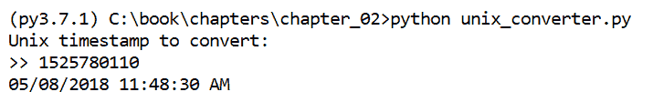
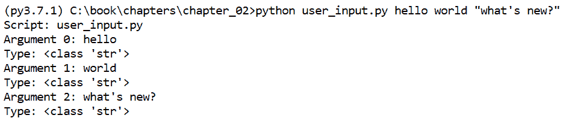
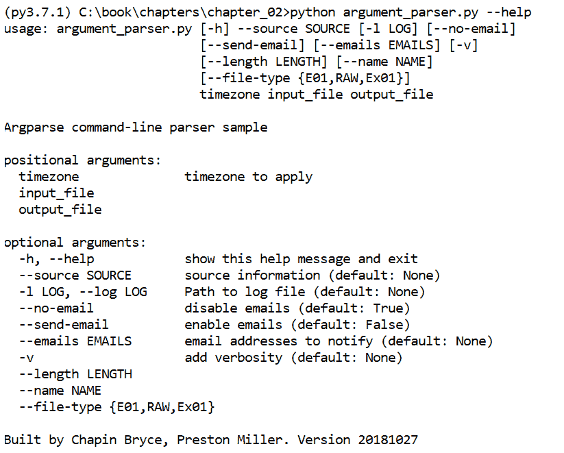
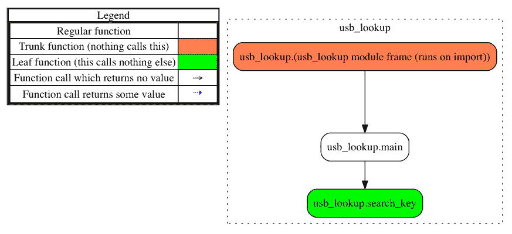
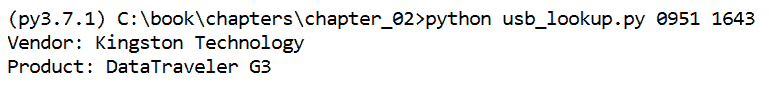

# 第二章：Python 基础知识

我们已经探索了 Python 的基本概念和构建脚本所使用的基本元素。现在，我们将通过本书中的一系列脚本，使用我们在第一章中讨论的数据类型和内置函数。在开始开发脚本之前，让我们基于已有知识，再深入了解 Python 语言的一些其他重要特性。

本章将探索我们在构建取证 Python 脚本时将使用的更多高级特性。这些包括复杂的数据类型和函数、创建我们的第一个脚本、处理错误、使用库、与用户互动以及一些开发的最佳实践。完成本章后，我们将准备好进入实际案例，展示 Python 在取证工作中的应用。

本章将涵盖以下主题：

+   高级特性，包括迭代器和 `datetime` 对象

+   安装和使用模块

+   使用 `try`、`except` 和 `raise` 语句进行错误处理

+   验证和访问用户提供的数据

+   创建取证脚本以查找 USB 厂商和产品信息

# 高级数据类型和函数

本节重点介绍 Python 中的两个常见特性——迭代器和 `datetime` 对象，这些特性在取证脚本中将经常遇到。因此，我们将更详细地介绍这些对象和功能。

# 迭代器

你之前学习过几种可迭代对象，例如 `lists`、`sets` 和 `tuples`。在 Python 中，如果定义了 `__iter__` 方法，或者可以按顺序访问元素，那么一个数据类型就被认为是迭代器。这三种数据类型（即 `lists`、`sets` 和 `tuples`）允许我们以简单且高效的方式遍历其内容。因此，我们在遍历文件中的行或目录列表中的文件条目时，或者在根据一系列文件签名识别文件时，经常使用这些数据类型。

`iter` 数据类型允许我们以不保留初始对象的方式遍历数据。这似乎不太理想；然而，当处理大数据集或在资源有限的机器上工作时，它非常有用。这是因为 `iter` 数据类型的资源分配方式，其中只有活动数据被存储在内存中。在逐行读取一个 3 GB 文件时，通过每次只加载一行来保持内存分配，避免了大量内存消耗，同时仍然按顺序处理每一行。

这里提到的代码块演示了迭代对象的基本用法。我们在一个可迭代对象上使用`next()`函数来获取下一个元素。一旦通过`next()`访问了某个对象，它就不再在`iter()`中可用，因为游标已经移过了该元素。如果我们已经到达了可迭代对象的末尾，对于任何额外的`next()`方法调用，我们将收到`StopIteration`。这个异常允许我们优雅地退出使用迭代器的循环，并提醒我们迭代器中没有更多内容可以读取：

```
>>> y = iter([1, 2, 3])
>>> next(y)
1
>>> next(y)
2
>>> next(y)
3
>>> next(y)
Traceback (most recent call last):
 File "<stdin>", line 1, in <module>
StopIteration 
```

在 Python 2.7 中，你可以使用`obj.next()`方法调用，获得与前面的示例相同的输出，方法是使用`next()`函数。为了简便和一致性，Python 3 将`obj.next()`重命名为`obj.__next__()`，并鼓励使用`next()`函数。因此，推荐使用`next(y)`，如前所示，代替`y.next()`或`y.__next__()`。

`reversed()`内建函数可用于创建一个反向迭代器。在以下示例中，我们反转一个列表，并使用`next()`函数从迭代器中获取下一个对象：

```
>>> j = reversed([7, 8, 9])
>>> next(j)
9
>>> next(j)
8
>>> next(j)
7
>>> next(j)
Traceback (most recent call last):
 File "<stdin>", line 1, in <module>
StopIteration 
```

通过实现生成器，我们可以进一步利用`iter`数据类型。生成器是一种特殊类型的函数，它生成迭代器对象。生成器与函数相似，如在第一章中讨论的内容，*现在开始完全不同的内容——*不过，生成器不是返回对象，而是`yield`迭代器。生成器最适合用于处理大型数据集，这些数据集可能消耗大量内存，这类似于`iter`数据类型的使用场景。

这里提到的代码块展示了生成器的实现。在`file_sigs()`函数中，我们创建了一个包含元组的列表，存储在`sigs`变量中。然后我们遍历`sigs`中的每个元素，并`yield`一个`tuple`数据类型。这创建了一个生成器，使我们可以使用`next()`函数逐个获取每个元组，从而限制生成器对内存的影响。请参见以下代码：

```
>>> def file_sigs():
...     sigs = [('jpeg', 'FF D8 FF E0'),
...             ('png', '89 50 4E 47 0D 0A 1A 0A'),
...             ('gif', '47 49 46 38 37 61')]
...     for s in sigs:
...         yield s

>>> fs = file_sigs()
>>> next(fs)
('jpeg', 'FF D8 FF E0')
>>> next(fs)
('png', '89 50 4E 47 0D 0A 1A 0A')
>>> next(fs)
('gif', '47 49 46 38 37 61')
```

你可以在[`www.garykessler.net/library/file_sigs.html`](http://www.garykessler.net/library/file_sigs.html)找到更多文件签名。

# datetime 对象

调查人员经常被要求确定文件何时被删除、文本消息何时被读取，或者一系列事件的正确顺序。因此，大量分析工作围绕时间戳和其他时间性工件展开。理解时间可以帮助我们拼凑出谜题，并进一步理解工件周围的背景。出于这个原因，以及许多其他原因，让我们通过`datetime`模块来练习处理时间戳。

Python 的 `datetime` 模块支持时间戳的解析和格式化。该模块有许多功能，最显著的包括获取当前时间、确定两个时间戳之间的差异（或增量），以及将常见的时间戳格式转换为人类可读的日期。`datetime.datetime()` 方法创建一个 `datetime` 对象，并接受年份、月份、日期以及可选的小时、分钟、秒、毫秒和时区参数。`timedelta()` 方法通过存储天数、秒数和微秒数的差异，显示两个 `datetime` 对象之间的差异。

首先，我们需要导入 `datetime` 库，这样我们就可以使用该模块中的函数。我们可以使用 `datetime.now()` 方法查看当前日期。这会创建一个 `datetime` 对象，我们可以对其进行操作。例如，假设我们通过减去两个 `datetime` 对象来创建一个 `timedelta` 对象，它们相隔几秒钟。我们可以将 `timedelta` 对象加到或从 `right_now` 变量中减去，以生成另一个 `datetime` 对象：

```
>>> import datetime
>>> right_now = datetime.datetime.now()
>>> right_now
datetime.datetime(2018, 6, 30, 7, 48, 31, 576151)

>>> # Subtract time
>>> delta = datetime.datetime.now() - right_now
>>> delta
datetime.timedelta(0, 16, 303831)

>>> # Add datetime to time delta to produce second time
>>> right_now + delta
datetime.datetime(2018, 6, 30, 7, 48, 47, 879982)
```

输出可能会有所不同，因为你运行这些命令的时间与书中展示时的时间不同。

`datetime` 模块的另一个常用应用是 `strftime()`，它允许将 `datetime` 对象转换为自定义格式的字符串。该函数接受一个格式字符串作为输入。该格式字符串由以百分号开头的特殊字符组成。下表展示了我们可以与 `strftime()` 函数一起使用的格式化器示例：

| **描述** | **格式化器** |
| --- | --- |
| 年 (YYYY) | `%Y` |
| 月份 (MM) | `%m` |
| 日期 (DD) | `%d` |
| 24 小时 (HH) | `%H` |
| 12 小时 (HH) | `%I` |
| 分钟 (MM) | `%M` |
| 秒 (SS) | `%S` |
| 微秒 (SSSSSS) | `%f` |
| 时区 (Z) | `%z` |
| 上午/下午 | `%p` |

你可以在 [`strftime.org/`](http://strftime.org/) 或通过官方文档：[`docs.python.org/3/library/datetime.html#strftime-and-strptime-behavior`](https://docs.python.org/3/library/datetime.html#strftime-and-strptime-behavior) 查找更多时间戳格式化的信息。

此外，`strptime()` 函数（我们在这里没有展示）可以用于反向操作。`strptime()` 函数将接受包含日期和时间的字符串，并使用格式化字符串将其转换为 `datetime` 对象。我们还可以将表示为整数的纪元时间（也叫 Unix 或 POSIX 时间）解释为 UTC `datetime` 对象：

```
>>> epoch_timestamp = 874281600
>>> datetime_timestamp = datetime.datetime.utcfromtimestamp(epoch_timestamp)
```

我们可以打印这个新对象，它会自动转换为表示 `datetime` 对象的字符串。然而，假设我们不喜欢用连字符来分隔日期。相反，我们可以使用 `strftime()` 方法，以斜杠或任何已定义的格式化器来显示日期。最后，`datetime` 库还提供了一些预构建的格式化器，例如 `isoformat()`，我们可以使用它轻松生成标准时间戳格式：

```
>>> from __future__ import print_function
>>> print(datetime_timestamp)
1997-09-15 00:00:00
>>> print(datetime_timestamp.strftime('%m/%d/%Y %H:%M:%S'))
09/15/1997 00:00:00
>>> print(datetime_timestamp.strftime('%A %B %d, %Y at %I:%M:%S %p'))
Monday September 15, 1997 at 12:00:00 AM
>>> print(datetime_timestamp.isoformat())
1997-09-15T00:00:00
```

作为一个备注，我们已经将`print_function`导入到我们的解释器中，以便在 Python 2 和 Python 3 中都能打印这些日期值。

`datetime`库大大减轻了在 Python 中处理日期和时间值时的复杂性。这个模块也非常适合处理在调查过程中常见的时间格式。

# 库

库，或模块，加速了开发过程，使我们能够专注于脚本的预定目标，而不是从头开始开发所有功能。外部库可以节省大量的开发时间，坦率地说，它们通常比我们作为开发人员在调查过程中拼凑出来的代码更准确高效。库分为两类：标准库和第三方库。标准库随 Python 的每次安装而分发，包含了 Python 软件基金会支持的常用代码。标准库的数量和名称在不同版本的 Python 中有所不同，尤其是在 Python 2 和 Python 3 之间切换时。我们将尽力指出在 Python 2 和 3 之间导入或使用库的不同之处。在另一个类别中，第三方库引入了新的代码，增加或改进了标准 Python 安装的功能，并允许社区贡献模块。

# 安装第三方库

我们知道标准模块不需要安装，因为它们随 Python 一起提供，但第三方模块呢？Python 包索引（Python Package Index）是寻找第三方库的好地方。可以在[`pypi.org/`](https://pypi.org/)找到它。该服务允许像`pip`这样的工具自动安装软件包。如果没有互联网连接或在 PyPi 上找不到软件包，通常可以使用`setup.py`文件手动安装模块。稍后将展示使用`pip`和`setup.py`的示例。像`pip`这样的工具非常方便，它们处理依赖项的安装，检查项目是否已安装，并在安装的是旧版本时建议升级。需要互联网连接来检查在线资源，如依赖项和模块的新版本；但是，`pip`也可以用于在离线计算机上安装代码。

这些命令在终端或命令提示符中运行，而不是在 Python 解释器中运行。请注意，在下面提到的示例中，如果你的 Python 可执行文件没有包含在当前环境的`PATH`变量中，可能需要使用完整路径。`pip`可能需要从提升权限的控制台运行，可以使用`sudo`或者提升权限的 Windows 命令提示符。有关`pip`的完整文档，请访问[`pip.pypa.io/en/stable/reference/pip/`](http://pip.pypa.io/en/stable/reference/pip/)：

```
$ pip install python-registry==1.0.4
Collecting python-registry
Collecting enum34 (from python-registry)
 Using cached https://files.pythonhosted.org/packages/af/42/cb9355df32c69b553e72a2e28daee25d1611d2c0d9c272aa1d34204205b2/enum34-1.1.6-py3-none-any.whl
Installing collected packages: enum34, python-registry
Successfully installed enum34-1.1.6 python-registry-1.0.4

$ pip install yarp==1.0.17
https://github.com/msuhanov/yarp/archive/1.0.17.tar.gz
Collecting https://github.com/msuhanov/yarp/archive/1.0.17.tar.gz
 Downloading https://github.com/msuhanov/yarp/archive/1.0.17.tar.gz
 \ 716kB 12.8MB/s
Building wheels for collected packages: yarp
 Running setup.py bdist_wheel for yarp ... done
 Stored in directory: C:\USERS\...\APPDATA\LOCAL\TEMP\pip-ephem-wheel-cache-78qdzfmy\wheels\........
Successfully built yarp
Installing collected packages: yarp
Successfully installed yarp-1.0.17
```

# 本书中的库

在本书中，我们使用了许多可以通过`pip`或`setup.py`方法安装的第三方库。然而，并不是所有第三方模块都能如此轻松地安装，有时需要你搜索互联网。正如你在之前的代码块中可能注意到的，某些第三方模块，如`yarp`模块，托管在像 GitHub 这样的源代码管理系统上。GitHub 和其他 SCM 服务允许我们访问公开的代码，并查看随时间推移所做的更改。或者，Python 代码有时会出现在博客或自托管的网站上。在本书中，我们将提供如何安装我们使用的任何第三方模块的说明。

# Python 包

Python 包是一个包含 Python 模块和`__init__.py`文件的目录。当我们导入一个包时，`__init__.py`文件中的代码会被执行。此文件包含运行包中其他模块所需的导入语句和代码。这些包可以嵌套在子目录中。例如，`__init__.py`文件可以包含`import`语句，将目录中的每个 Python 文件以及所有可用的类或函数导入。当文件夹被导入时，所有内容都会被加载。以下是一个示例目录结构，下面是`__init__.py`文件，它展示了两者在导入时如何交互。以下代码块的最后一行导入了子目录`__init__.py`文件中指定的所有项目。

假设的文件夹结构如下：

```
| -- packageName/
    | -- __init__.py
    | -- script1.py
    | -- script2.py
    | -- subDirectory/
         | -- __init__.py
         | -- script3.py
         | -- script4.py
```

顶级`__init__.py`文件的内容如下：

```
from script1 import *
from script2 import function_name
from subDirectory import *
```

以下代码执行我们之前提到的`__init__`脚本，它将导入`script1.py`中的所有函数，仅导入`script2.py`中的`function_name`，以及从`subDirectory/__init__.py`中导入的任何附加规范：

```
import packageName  
```

# 类和面向对象编程

Python 支持**面向对象编程**（**OOP**），使用内建的类关键字。面向对象编程允许使用高级编程技术，并能编写可持续的代码，以支持更好的软件开发。由于 OOP 在脚本编程中不常用，并且属于高于入门级的概念，本书将在掌握 Python 基本功能后，在后续章节中实现 OOP 及其一些特性。需要记住的是，Python 中的几乎所有东西，包括类、函数和变量，都是对象。类在多种情况下都很有用，允许我们设计自己的对象，以自定义方式与数据进行交互。

让我们看一下`datetime`模块，作为我们如何与类及其方法交互的一个示例。这个库包含几个类，如`datetime`、`timedelta`和`tzinfo`。这些类处理与时间戳相关的不同功能。其中最常用的是`datetime`类，它可能会让人困惑，因为它是`datetime`模块的成员。这个类用于表示日期作为 Python 对象。其他两个提到的类通过`timedelta`类支持`datetime`类，允许对日期进行加减操作，通过`tzinfo`类表示时区。

重点关注`datetime.datetime`类，我们将查看如何使用这个对象创建多个日期实例并从中提取数据。首先，正如以下代码块所示，我们必须导入打印语句并导入此库，以访问`datetime`模块的类和方法。接下来，我们将参数传递给`datetime`类，并将`datetime`对象分配给`date_1`。我们的`date_1`变量包含表示 2018 年愚人节的值。由于我们在初始化类时没有指定时间值，因此该值将反映午夜时分，精确到毫秒。如我们所见，像函数一样，类也可以有参数。此外，类可以包含它们自己的函数，通常称为方法。一个方法的例子是调用`now()`，它允许我们获取本地计算机的当前时间戳，并将该值存储为`date_2`。这些方法让我们能够操作与类的特定实例相关的数据。我们可以通过在交互式提示符中打印它们，查看我们两个日期对象的内容：

```
>>> from __future__ import print_function
>>> import datetime
>>> date_1 = datetime.datetime(2018,04,01)
>>> date_2 = datetime.datetime.now()
>>> print(date_1, " | ", date_2)
2018-04-01 00:00:00.000  |  2018-04-01 15:56:10.012915 
```

我们可以通过调用特定的类属性来访问日期对象的属性。这些属性通常被类内部的代码用于处理数据，虽然我们也可以利用这些属性。例如，小时或年份属性允许我们从日期对象中提取小时或年份。尽管这看起来很简单，但在其他模块中访问从类实例中解析或提取的数据时，它变得更有用：

```
>>> date_2.hour
15
>>> date_1.year
2018
```

如前所述，我们可以随时运行`dir()`和`help()`函数，以了解给定对象可用的方法和属性。如果我们运行以下代码，就可以看到我们能够提取星期几或使用 ISO 格式格式化日期。这些方法提供了关于我们`datetime`对象的额外信息，并让我们能够充分利用类对象提供的功能：

```
>>> dir(date_1)
['__add__', '__class__', '__delattr__', '__doc__', '__eq__', '__format__', '__ge__', '__getattribute__', '__gt__', '__hash__', '__init__', '__le__', '__lt__', '__ne__', '__new__', '__radd__', '__reduce__', '__reduce_ex__', '__repr__', '__rsub__', '__setattr__', '__sizeof__', '__str__', '__sub__', '__subclasshook__', 'astime zone', 'combine', 'ctime', 'date', 'day', 'dst', 'fromordinal', 'fromtimestamp', 'hour', 'isocalendar', 'isoformat', 'isoweekday', 'max', 'microsecond', 'min', 'minute', 'month', 'now', 'replace', 'resolution', 'second', 'strftime', 'strptime', 'time', 'timetuple', 'timetz', 'today', 'toordinal', 'tzinfo', 'tzname', 'utcfromtimestamp', 'utcnow', 'utcoffset', 'utctimetuple', 'weekday', 'year']
>>> date_1.weekday()
4
>>> date_2.isoformat()
2016-04-01T15:56:10.012915
```

# 尝试与异常处理

`try`和`except`语法用于捕获并安全处理运行时遇到的错误。作为新手开发者，你最终会习惯于别人告诉你你的脚本无法正常工作。在 Python 中，我们使用`try`和`except`块来防止可避免的错误使代码崩溃。请适度使用`try`和`except`块。不要把它们当作修补漏洞的创可贴来用——相反，要重新考虑你的原始设计，并思考调整逻辑，以更好地防止错误。一个很好的方法是通过命令行参数、文档或其他方式提供使用说明。正确使用这些将增强程序的稳定性。然而，错误使用将无法增加稳定性，并可能掩盖代码中的潜在问题。一个好的实践是，在`try`和`except`块中尽可能使用较少的代码行；这样，错误处理更为集中和有效。

例如，假设我们有一些代码，执行两个数值变量的数学计算。如果我们预见到用户可能会不小心输入非整数或浮动值，我们可能希望在计算过程中加入`try`和`except`，以捕获可能出现的`TypeError`异常。当我们捕获到错误时，可以尝试通过类构造方法将变量转换为整数，然后再进入`try`和`except`块。如果成功，我们就避免了程序因可预防的崩溃而中断，并且保持了特定性，防止程序接受如字典类型的输入。例如，在接收到字典对象时，我们希望脚本崩溃并向用户呈现调试信息。

任何有可能生成错误的代码行，都应该由独立的`try`和`except`块处理，并针对该特定行提供解决方案，以确保我们正确地处理了特定错误。`try`和`except`块有几种变体。简而言之，分为通用捕获、变量捕获和特定捕获类型的块。以下伪代码展示了这些块的构成示例：

```
# Basic try and except -- catch-all
try:
    # Line(s) of code
except:
    # Line(s) of error-handling code 

# Catch-As-Variable
try:
    # Line(s) of code
except TypeError as e:
    print(e.message)
    # Line(s) of error-handling code

# Catch-Specific
try:
    # Line(s) of code
except ValueError:
    # Line(s) of error-handling code for ValueError exceptions 
```

通用的或裸的`except`将捕获任何错误。**这通常被认为是一种糟糕的编码实践，因为它可能导致程序出现不期望的行为。** 捕获异常并将其作为变量是许多情况下非常有用的做法。通过调用`e.message`，存储在`e`中的异常错误信息可以被打印或写入日志——在大型多模块程序中，尤其有助于调试错误。此外，内建的`isinstance()`函数可以用来判断错误的类型。

为了支持 Python 2 和 Python 3，请使用如前所述的`except Exception as error`语法，而不是 Python 2 支持的`except Exception, error`语法。

在接下来要看的例子中，我们定义了两个函数：`give_error()`和`error_handler()`。`give_error()`函数尝试将`5`添加到`my_list`变量中。这个变量还没有实例化，因此会生成一个`NameError`实例。在`except`子句中，我们捕获了一个基类`Exception`，并将其存储在变量`e`中。然后，我们将这个异常对象传递给稍后定义的`error_handler()`函数。

`error_handler()`函数接收一个异常对象作为输入。它检查该错误是否为`NameError`或`TypeError`的实例，若不是则跳过。根据异常类型，它将打印出异常类型和错误信息：

```
>>> from __future__ import print_function
>>> def give_error():
...     try:
...         my_list.append(5)
...     except Exception as e:
...         error_handler(e)
...
>>> def error_handler(error):
...     if isinstance(error, NameError):
...         print('NameError:', error.message)
...     elif isinstance(error, TypeError):
...         print('TypeError:', error.message)
...     else:
...         pass
...
>>> give_error()
NameError: global name 'my_list' is not defined
```

最后，特定异常捕获的`try`和`except`块可以用于捕获个别异常，并且为该特定错误提供有针对性的错误处理代码。一个可能需要使用特定异常捕获`try`和`except`块的场景是处理对象，比如列表或字典，这些对象可能在程序中某一时刻尚未实例化。

在下面的示例中，当函数中调用结果列表时，它并不存在。幸运的是，我们将追加操作包装在了`try`和`except`中，以捕获`NameError`异常。当我们捕获到此异常时，我们首先将结果列表实例化为空列表，然后再添加适当的数据，最后返回该列表。以下是示例：

```
>>> def double_data(data):
...     for x in data:
...         double_data = x*2
...         try:
...             # The results list does not exist the first time
...             # we try to append to it
...             results.append(double_data)
...         except NameError:
...             results = []
...             results.append(double_data)
...     return results
...
>>> my_results = doubleData(['a', 'b', 'c'])
>>> print my_results
['aa', 'bb', 'cc'] 
```

出于（希望）显而易见的原因，前面的代码示例旨在展示如何处理异常。我们应该始终确保在使用变量之前进行初始化。

# `raise`函数

由于我们的代码在执行过程中可能会生成自己的异常，我们也可以使用内置的`raise()`函数手动触发异常。`raise()`方法通常用于将异常抛给调用它的函数。尽管这看起来似乎不必要，但在大型程序中，这实际上是非常有用的。

假设有一个函数`function_b()`，它接收从`function_a()`传递的解析数据包。我们的`function_b()`函数对数据包进行进一步处理，然后调用`function_c()`继续处理数据包。如果`function_c()`抛出异常返回给`function_b()`，我们可能会设计一些逻辑，提醒用户数据包格式错误，而不是尝试继续处理它，从而产生错误的结果。以下是表示这种场景的一些伪代码：

```
001 import module
002
003 def main():
004     function_a(data)
005
006 def function_a(data_in):
007     try:
008         # parse data into packet
009         function_b(parsed_packet)
010     except Exception as e:
011         if isinstance(e, ErrorA):
012             # Address this type of error
013             function_b(fixed_packet)
014         [etc.]
015 
016 def function_b(packet):
017     # Process packet and store in processed_packet variable
018     try:
019         module.function_c(processed_packet)
020     except SomeError:
021         # Error testing logic
022         if type 1 error:
023             raise ErrorA()
024         elif type 2 error:
025             raise ErrorB()
026         [etc.]
027
028 if __name__ == '__main__':
029     main() 
```

此外，在处理 Python 无法自动识别的异常时，抛出自定义或内置的异常是非常有用的。让我们回顾一下恶性数据包的例子。当第二个函数接收到抛出的错误时，我们可能会设计一些逻辑来测试一些可能的错误来源。根据这些结果，我们可能会抛出不同的异常回到调用函数`function_a()`。

在引发内建异常时，确保使用最接近错误类型的异常。例如，如果错误涉及索引问题，应使用 `IndexError` 异常。在引发异常时，我们应该传入一个包含错误描述的字符串。这个字符串应当具有描述性，帮助开发者识别问题，而不像以下字符串那样简单。格言 *做我们说的，不做我们做的* 在这里适用，因为我们仅仅是在展示功能：

```
>>> def raise_error():
...     raise TypeError('This is a TypeError')
...
>>> raise_error()
Traceback (most recent call last):
 File "<stdin>", line 1, in <module>
 File "<stdin>", line 2, in raise_error
TypeError: This is a TypeError 
```

# 创建我们的第一个脚本 – unix_converter.py

我们的第一个脚本将执行一个常见的时间戳转换，这对于本书的内容非常有用。这个名为`unix_converter.py`的脚本将 Unix 时间戳转换为人类可读的日期和时间值。Unix 时间戳通常格式化为一个整数，表示自 `1970-01-01 00:00:00` 起的秒数。

在第一行，我们为用户提供了脚本的简要描述，使他们能够快速理解脚本的意图和用途。接下来的第二至第四行是导入语句。这些导入可能看起来很熟悉，分别为 Python 2 和 3 中打印信息、解析时间戳数据以及访问 Python 版本信息提供支持。然后，第六到第十二行使用 `sys` 库来检查调用脚本时使用的 Python 版本，以便正确处理用户输入。Python 2 使用 `raw_input` 函数在终端接受用户数据，而 Python 3 实现了 `input` 函数。接下来，这个 `if`/`elif`/`else` 语句在未指定的其他（未来）Python 版本中以 `NotImplementedError` 结束。为了简化起见，我们将这个条件语句设计得可以方便地插入到你的代码中。请参见以下描述的代码：

```
001 """Script to convert Unix timestamps."""
002 from __future__ import print_function
003 import datetime
004 import sys
005
006 if sys.version_info[0] == 3:
007     get_input = input
008 elif sys.version_info[0] == 2:
009     get_input = raw_input
010 else:
011     raise NotImplementedError(
012         "Unsupported version of Python used.")
```

在省略的许可证声明之后（请参阅源代码中的 MIT 许可证信息），我们提供了额外的脚本信息，供用户参考，并且标准化我们的脚本实现。然后，我们进入 `main()` 函数，提示用户输入一个时间戳进行转换，并打印从 `Unix_converter()` 函数转换后的时间戳结果。为了更详细地解析第 49 行，让我们从最内层的部分开始，`get_input()` 函数的调用。该函数接受一个字符串，显示在用户输入框前，允许用户输入数据。`get_input()` 函数返回用户在控制台输入的数据的字符串值，尽管我们需要将这个值转换为整数。我们使用 `int` 类初始化一个整数值，并将其存储在 `unix_ts` 变量中。

应用概念

我们如何重新设计第 49 行，以更好地处理用户输入以及可能出现的异常？

提示

这可能需要多行代码。

```
042 __authors__ = ["Chapin Bryce", "Preston Miller"]
043 __date__ = 20181027
044 __description__ = """Convert Unix formatted timestamps (seconds
045     since Epoch [1970-01-01 00:00:00]) to human readable."""
046
047
048 def main():
049     unix_ts = int(get_input('Unix timestamp to convert:\n>> '))
050     print(unix_converter(unix_ts))
```

在之前的代码块中的第 50 行，我们调用了`unix_converter()`函数，并提供了来自用户的整数输入。然后该函数，如以下代码第 53 行所定义，调用了`datetime`模块，并使用`utcfromtimestamp()`方法将整数读取为`datetime`对象。我们在这里使用`utcfromtimestamp()`方法，而不是名字类似的`fromtimestamp()`方法，因为`utcfromtimestamp()`版本不会对提供的数据应用时区修改，而是保持时间戳在原始时区。返回的`datetime`对象随后使用`strftime()`方法转换为人类可读的字符串，并将结果字符串返回给调用函数，最终将该值打印到控制台：

```
053 def unix_converter(timestamp):
054     date_ts = datetime.datetime.utcfromtimestamp(timestamp)
055     return date_ts.strftime('%m/%d/%Y %I:%M:%S %p')p')
```

我们的脚本以两行代码结束，如下所示，这将在我们脚本的结尾部分非常常见。第一行位于第 57 行，是一个条件语句，用于检查脚本是否作为脚本执行，而不是作为模块导入。这使我们能够根据代码的使用方式来改变其功能。在一个例子中，作为控制台版本的代码通常应该接受命令行参数，而作为库使用的版本则不需要提示用户输入这些细节，因为调用脚本可能只会使用此代码中的一部分功能。这意味着，第 58 行是我们希望在命令行调用此代码时执行的唯一逻辑，它启动了`main()`函数。如果此脚本作为模块导入到另一个脚本中，则不会发生任何操作，因为我们没有在导入时运行的进一步逻辑。如果它被导入，我们仍然可以使用这些函数，而无需担心导入时发生其他调用：

```
057 if __name__ == '__main__':
058     main()
```

我们现在可以通过在命令行调用`unix_converter.py`来执行此脚本。该脚本如以下截图所示运行，直到它需要用户输入。一旦输入值，脚本继续执行并将转换后的时间戳打印到控制台：



# 用户输入

允许用户输入增强了程序的动态性。最好向用户查询文件路径或值，而不是将这些信息显式写入代码文件。因此，如果用户想在另一个文件上使用相同的程序，他们可以简单地提供不同的路径，而无需编辑源代码。在大多数程序中，用户提供输入和输出位置，或者确定在运行时应使用哪些可选功能或模块。

用户输入可以在程序首次调用时或在运行时作为参数提供。对于大多数项目，建议使用命令行参数，因为在运行时要求用户输入会暂停程序执行，直到输入完成。

# 使用原始输入方法和系统模块 – user_input.py

`input()` 和 `sys.argv` 都是获取用户输入的基本方法。请注意，这两种方法返回的都是字符串对象，正如我们之前讨论的 Python 2 中的 `raw_input()` 和 Python 3 中的 `input()` 函数一样。我们可以通过适当的类构造函数将字符串转换为所需的数据类型。

`input()` 函数类似于向某人提问并等待其回复。在此期间，程序的执行线程会暂停，直到收到回复为止。稍后我们将定义一个函数，询问用户一个数字并返回其平方值。如我们在第一个脚本中所见，当转换 Unix 时间戳时，我们必须等待用户提供值，脚本才能继续执行。尽管在那个非常简短的脚本中这不是问题，但较大的代码库或长时间运行的脚本应避免这种延迟。

在命令行提供的参数存储在 `sys.argv` 列表中。像任何列表一样，这些参数可以通过索引访问，索引从零开始。第一个元素是脚本的名称，而之后的每个元素代表一个以空格分隔的用户输入。我们需要导入 `sys` 模块才能访问这个列表。

在第 39 行，我们将 `sys.argv` 列表中的参数复制到一个名为 `args` 的临时列表变量中。这是首选方法，因为在第 41 行，我们打印出第一个元素后将其删除。对于 `args` 列表中的其余项，我们使用 `for` 循环并将列表包装在内建的 `enumerate()` 函数中。这为我们的循环提供了一个计数器 `i`，用来计算循环的迭代次数或本例中使用的参数数目。在第 43 和 44 行，我们打印出每个参数及其位置和数据类型。我们有如下代码：

```
001 """Replicate user input in the console."""
002 from __future__ import print_function
003 import sys
...
033 __authors__ = ["Chapin Bryce", "Preston Miller"]
034 __date__ = 20181027
035 __description__ = "Replicate user input in the console"
036 
037 
038 def main():
039     args = sys.argv
040     print('Script:', args[0])
041     args.pop(0)
042     for i, argument in enumerate(sys.argv):
043         print('Argument {}: {}'.format(i, argument))
044         print('Type: {}'.format(type(argument)))
045 
046 if __name__ == '__main__':
047     main()
```

在将此文件保存为 `user_input.py` 后，我们可以在命令行调用它并传入我们的参数。

如下例所示，参数是以空格分隔的，因此带有空格的参数需要用引号括起来。从以下示例中也可以清楚看出，所有来自 `sys.argv` 的参数值都作为字符串值存储。`input()` 函数也会将所有输入解释为字符串值：



对于没有很多命令行选项的小型程序，`sys.argv` 列表是一个快速简便的方式来获取用户输入，而不会阻塞脚本的执行。

包含空格的文件路径应该使用双引号括起来。例如，`sys.argv` 会将 `C:/Users/LPF/misc/my books` 分割成 `C:/Users/LPF/misc/my` 和 `books`。这会在脚本尝试与该目录交互时导致 `IOError` 异常。此外，注意包含反斜杠字符 `\` 的文件路径；我们需要转义此字符，以防止我们的命令行终端和代码误解输入。这个字符通过使用第二个反斜杠来转义，像这样：`\\`。

# 理解 Argparse – argument_parser.py

`argparse`是标准库中的一个模块，本书中将多次使用它来获取用户输入。`argparse`有助于开发更复杂的命令行接口。默认情况下，`argparse`会创建一个`-h`开关或帮助开关，用于显示脚本的帮助和使用信息。在本节中，我们将构建一个示例的`argparse`实现，包含必需、可选和默认参数。

我们导入`argparse`模块，并按照常规的`print_function`和脚本描述进行设置。接着，我们指定通常的脚本头部信息，如`__author__`、`__date__`和`__description__`，因为我们将在`argparse`实现中使用这三者。在第 38 行，我们定义了一个过于简单的`main()`函数来打印解析后的参数信息，因为除了展示一些简洁的用户参数处理外，我们没有其他计划。为了实现这个目标，我们首先需要初始化`ArgumentParser`类实例，如第 43 到 48 行所示。注意，只有当脚本通过命令行调用时，才会执行这一部分，具体条件在第 42 行给出。

在第 43 行，我们用三个可选参数初始化`ArgumentParser`。第一个是脚本的描述，我们会从之前设置的`__description__`变量中读取。第二个参数是结尾的附加说明，或者说帮助信息部分末尾的细节。这可以是任意文本，和描述字段一样，尽管我们选择用它来提供作者和版本信息。为了开始，使用日期作为版本号对于用户参考很有帮助，也能避免编号方案的复杂性。最后一个可选参数是格式化器规格，它指示我们的参数解析器显示脚本设置的任何默认值，以便用户了解如果不通过参数修改，选项是否会被设置。建议养成习惯，强烈推荐包括这个：

```
001 """Sample argparse example."""
002 from __future__ import print_function
003 import argparse
...
033 __authors__ = ["Chapin Bryce", "Preston Miller"]
034 __date__ = 20181027
035 __description__ = "Argparse command-line parser sample"
036 
037 
038 def main(args):
039     print(args)
040 
041 
042 if __name__ == '__main__':
043     parser = argparse.ArgumentParser(
044         description=__description__, 
045         epilog='Built by {}. Version {}'.format(
046         ", ".join(__authors__), __date__),
047         formatter_class=argparse.ArgumentDefaultsHelpFormatter
048     )
```

我们现在可以利用新实例化的解析器对象来添加参数说明。首先，让我们讨论一些有关必需和可选参数的良好实践。默认情况下，`argparse`会通过参数名前是否有一个或两个破折号来判断该参数是否是可选的。如果参数说明前有破折号，它将被认为既是可选的，又是非位置性的；反之，如果没有破折号，则`argparse`会将该参数视为必需且位置性参数。

请参照以下示例；在这个脚本中，`timezone` 和 `input_file` 参数是必需的，且必须按照这个顺序提供。此外，这两个参数不需要额外的参数说明符；`argparse` 会查找一个没有配对的值并将其分配给 `timezone` 参数，然后再查找另一个没有配对的值并将其分配给 `input_file` 参数。相反，`--source`、`--file-type`、`-h`（或 `--help`）和 `-l`（或 `--log`）等参数是非位置参数，可以按任何顺序提供，只要紧跟其后的值与相应的参数说明符配对即可。

为了让事情变得稍微复杂一点，但也更具可定制性，我们可以要求非位置参数。这样做有一个优势，我们可以允许用户以任意顺序输入参数，尽管其缺点是要求用户为脚本运行所需的字段进行额外的输入。你会注意到，在接下来的代码中，第 2 行的 `--source` 参数周围没有方括号。这是 `argparse` （微妙的）方式来指示这是一个必需的非位置参数。虽然一开始可能会让用户难以理解，但如果缺少此参数，`argparse` 会中止脚本执行并提示用户。你可能想在脚本中使用非位置的必需参数，或者完全避免使用它们——作为开发者，你需要根据用户的需求找到最舒适且合适的界面：

```
$ python argument_parser.py --help
usage: argument_parser.py [-h] --source SOURCE [-l LOG]
 [--file-type {E01,RAW,Ex01}]
 timezone input_file

Argparse command-line parser sample

positional arguments:
 timezone timezone to apply
 input_file

optional arguments:
 -h, --help show this help message and exit
 --source SOURCE source information (default: None)
 -l LOG, --log LOG Path to log file (default: None)
 --file-type {E01,RAW,Ex01}

Built by Chapin Bryce, Preston Miller. Version 20181027
```

稍微离题一下，接下来我们将开始向我们初始化的解析器对象添加参数。我们将从之前讨论过的一个位置参数开始。`timezone` 参数是通过 `add_argument()` 方法定义的，允许我们提供一个表示参数名称的字符串，并可以附加一些可选的参数来增加详细信息。在第 51 行，我们简单地提供了一些有用的信息，用以说明如何使用该参数：

```
050     # Add positional required arguments
051     parser.add_argument('timezone', help='timezone to apply')
```

我们在第 54 行添加的下一个参数是之前讨论过的非位置必需参数。注意，我们使用了 `required=True` 语句来表示，无论前面有没有连字符，这个参数在执行时都是必需的：

```
053     # Add non-positional required argument
054     parser.add_argument('--source', 
055         help='source information', required=True)
```

现在我们添加第一个非位置参数和可选的日志文件参数。在这里，我们提供了两种方式让用户指定该参数，`-l` 或 `--log`。这是针对常见参数的推荐方式，因为它既为经常使用的用户提供了简短的命令，也为新手用户提供了参数使用的上下文：

```
057     # Add optional arguments, allowing shorthand argument
058     parser.add_argument('-l', '--log', help='Path to log file')
```

并非所有的参数都需要接受一个值；在某些情况下，我们只需要从参数中得到一个布尔值的答案。此外，我们可能希望允许多次指定该参数，或者在调用时实现自定义功能。为了支持这一点，`argparse` 库允许使用动作。我们在本书中常用的动作如下所示。

第一个有用的操作是 `store_true`，它是 `store_false` 的反义词。这对于获取脚本中启用或禁用功能的信息非常方便。正如下面代码块中第 61 到第 64 行所示，我们可以看到操作参数用于指定是否应该将 `True` 或 `False` 存储为参数的结果。在这种情况下，这是重复的，两个参数中的一个可以用来决定是否应该发送此示例中的电子邮件。还有其他操作可用，例如 `append`，如第 66 和 67 行所示，其中每个电子邮件地址实例（在这个例子中）将被添加到一个列表中，我们可以遍历该列表并使用它。

以下代码中的最后一个操作示例用于计算某个参数被调用的次数。我们主要在增加冗余或调试信息时看到这种实现，但它也可以在其他地方以相同的方式使用：

```
060     # Using actions
061     parser.add_argument('--no-email', 
062         help='disable emails', action="store_false")
063     parser.add_argument('--send-email', 
064         help='enable emails', action="store_true")
065     # Append values for each argument instance.
066     parser.add_argument('--emails', 
067         help='email addresses to notify', action="append")
068     # Count the number of instances. i.e. -vvv
069     parser.add_argument('-v', help='add verbosity', action='count')
```

`default` 关键字决定了参数的默认值。我们还可以使用 `type` 关键字将我们的参数存储为特定的对象。现在，我们可以直接将输入存储为所需的对象，例如整数，而无需将字符串作为唯一输入，并且不再需要在脚本中进行用户输入转换：

```
071     # Defaults
072     parser.add_argument('--length', default=55, type=int)
073     parser.add_argument('--name', default='Alfred', type=str)
```

Argparse 可以直接用于打开文件进行读取或写入。在第 76 行，我们以读取模式打开所需的参数 `input_file`。通过将这个文件对象传递到主脚本中，我们可以立即开始处理我们感兴趣的数据。下一行会重复执行这个操作，处理文件写入的打开：

```
075     # Handling Files
076     parser.add_argument('input_file', type=argparse.FileType('r'))
077     parser.add_argument('output_file', type=argparse.FileType('w'))
```

我们将要讨论的最后一个关键字是 `choices`，它接受一个大小写敏感的选项列表，用户可以从中选择。当用户调用此参数时，他们必须提供有效选项之一。例如，`--file-type RAW` 将把 `file-type` 参数设置为 RAW 选项，如下所示：

```
079     # Allow only specified choices
080     parser.add_argument('--file-type', 
081         choices=['E01', 'RAW', 'Ex01'])
```

最后，一旦我们将所有所需的参数添加到 `parser` 中，我们可以解析这些参数。在第 84 行，我们调用 `parse_args()` 函数，它创建了一个 `Namespace` 对象。例如，要访问我们在第 72 行创建的 `length` 参数，我们需要像 `arguments.length` 这样调用 `Namespace` 对象。在第 85 行，我们将参数传递到 `main()` 函数中，该函数打印出 `Namespace` 对象中的所有参数。我们有以下代码：

```
083     # Parsing arguments into objects
084     arguments = parser.parse_args()
085     main(arguments)
```

这些 `Namespace` 对象可以重新分配给变量，以便更容易记住。

在掌握了 `argparse` 模块的基础知识后，我们现在可以为我们的脚本构建简单和更高级的命令行参数。因此，这个模块被广泛用于为我们将要构建的大多数代码提供命令行参数。当运行以下代码并使用 `--help` 开关时，我们应该能够看到脚本所需的必需参数和可选参数：



# 法医脚本最佳实践

取证最佳实践在我们的工作中占据着重要地位，传统上，它指的是处理或获取证据。然而，在编程方面，我们自己也定义了一些取证最佳实践，如下所示：

+   不要修改你正在使用的原始数据

+   在原始数据的副本上进行操作

+   注释代码

+   验证程序的结果（以及其他应用程序的结果）

+   维护详细的日志记录

+   以易于分析的格式返回输出（你的用户会感谢你）

取证的黄金法则是：尽量避免修改原始数据。尽可能在经过验证的取证副本上进行操作。然而，这对其他领域可能不可行，例如事故响应人员，因其参数和范围不同。如同往常一样，这要根据具体情况而定，但请记住在运行时系统或原始数据上工作的潜在后果。

在这些情况下，重要的是要考虑代码的作用以及它在运行时如何与系统互动。代码会留下什么样的痕迹？它是否可能无意间破坏了证据或与之相关的引用？程序是否在类似的条件下经过验证，以确保它能正常运行？这些是运行程序时必须考虑的因素，尤其是在实时系统上。

我们之前提到过代码注释，但再强调它的重要性也不会过分。很快，我们将创建第一个取证脚本`usb_lookup.py`，它的代码行数略超过 90 行。试想一下，如果没有任何解释或注释，直接交给你这段代码。即便是经验丰富的开发者，也可能需要几分钟时间才能理解它的具体功能。现在，想象一下一个大型项目的源代码，里面有成千上万行代码——这样你就能明白注释的价值了，这不仅对开发者很重要，也对之后查看代码的人至关重要。

验证本质上就是要了解代码的行为。显然，漏洞会被发现并解决。然而，漏洞有时会反复出现，最终是无法避免的，因为在开发过程中无法测试所有可能的情况。相反，我们可以建立对代码在不同环境和情况下行为的理解。掌握代码的行为非常重要，不仅是为了能确定代码是否能够完成任务，还因为当你被要求在法庭上解释其功能和内部工作时，了解这些也至关重要。

日志记录有助于跟踪运行时可能出现的错误，并充当程序执行过程的审计链。Python 在标准库中提供了一个强大的日志模块，名为`logging`。在本书中，我们将使用这个模块及其各种选项。

我们编写脚本的目的是自动化一些繁琐的重复任务，为分析人员提供可操作的知识。通常来说，后者指的是以易于操作的格式存储数据。在大多数情况下，CSV 文件是实现这一目标的最简单方式，因为它可以用多种不同的文本编辑器或工作簿编辑器打开。我们将在许多程序中使用 `csv` 模块。

# 开发我们的第一个取证脚本 – usb_lookup.py

既然我们已经开始编写第一个 Python 脚本，接下来让我们编写第一个取证脚本。在取证调查中，常常会看到通过 **厂商标识符** (**VID**) 和 **产品标识符** (**PID**) 值来引用外部设备；这些值由四个十六进制字符表示。如果没有标识出厂商和产品名称，检查员必须查找相关信息。一个这样的查找位置是以下网页：[`linux-usb.org/usb.ids`](http://linux-usb.org/usb.ids)。例如，在这个网页上，我们可以看到 Kingston DataTraveler G3 的 VID 是 0951，PID 是 1643。当我们试图通过已定义的标识符来识别厂商和产品名称时，我们将使用这个数据源。

首先，让我们来看一下我们将要解析的数据源。后面会提到一个假设的示例，来说明我们数据源的结构。数据源包含 USB 厂商，并且每个厂商下有一组 USB 产品。每个厂商或产品都有四位十六进制字符和一个名称。区分厂商和产品行的标识符是制表符，因为产品在其父厂商下往往是通过制表符缩进的。作为一名取证开发者，你会开始喜爱模式和数据结构，因为当数据遵循一套严格的规则时，真的是个开心的日子。正因为如此，我们可以简单地保留厂商和产品之间的关系。以下是上述假设的示例：

```
0001 Vendor Name
    0001 Product Name 1
    0002 Product Name 2
    ...
    000N Product Name N
```

这个脚本名为 `usb_lookup.py`，它接收用户提供的 `VID` 和 `PID`，并返回相应的厂商和产品名称。我们的程序使用 `urllib` 模块中的 `urlopen` 方法下载 `usb.ids` 数据库到内存，并创建一个包含 VIDs 及其产品的字典。由于这是 Python 2 和 3 版本之间改变过的库，我们在 `try` 和 `except` 块中引入了一些逻辑，以确保我们能够顺利调用 `urlopen` 方法，代码如下所示。我们还导入了 `argparse` 模块，以便接受用户提供的 `VID` 和 `PID` 信息：

```
001 """Script to lookup USB vendor and product values."""
002 from __future__ import print_function
003 try:
004     from urllib2 import urlopen
005 except ImportError:
006     from urllib.request import urlopen
007 import argparse
```

如果没有找到厂商和产品的组合，错误处理机制将通知用户任何部分结果，并优雅地退出程序。

`main()`函数包含了下载`usb.ids`文件、将其存储到内存中并创建 USB 字典的逻辑。USB 字典的结构有些复杂，它涉及将`VID`映射到一个列表，列表的第一个元素是供应商名称，第二个元素是一个产品字典，后者将 PID 映射到其名称。以下是包含两个供应商`VendorId_1`和`VendorId_2`的 USB 字典示例，每个供应商都映射到一个包含供应商名称的列表，并且每个列表都包含一个用于存储产品 ID 和名称对的字典：

```
usbs = {
    VendorId_1: [
        VendorName_1,
        {ProductId_1: ProductName_1,
         ProductId_2: ProductName_2,
         ProductId_N: ProductName_N}
    ], VendorId_2: [
        VendorName_2,
        {ProductId_1: ProductName_1}
    ], ...
}
```

可能会有一种冲动，只是简单地在代码行中搜索`VID`和`PID`并返回名称，而不是创建一个将供应商与其产品链接的字典。然而，产品在不同的供应商之间可能会共享相同的 ID，这可能导致错误地返回来自其他供应商的产品。通过我们之前的数据结构，我们可以确保产品属于相关的供应商。

一旦 USB 字典被创建，`search_key()`函数就负责查询字典以匹配项。它首先赋值用户提供的两个参数，`VID`和`PID`，然后继续执行脚本。接下来，它在最外层字典中搜索`VID`匹配项。如果找到了`VID`，则会在最内层字典中搜索响应的`PID`。如果两个都找到了，解析出的名称将打印到控制台。最后，从第 81 行开始，我们定义了用户提供`VID`和`PID`值的参数，然后调用`main()`函数：

```
042 def main():
...
065 def search_key():
...
080 if __name__ == '__main__':
081     parser = argparse.ArgumentParser(
082         description=__description__,
083         epilog='Built by {}. Version {}'.format(
084             ", ".join(__authors__), __date__),
085         formatter_class=argparse.ArgumentDefaultsHelpFormatter
086     )
087     parser.add_argument('vid', help="VID value")
088     parser.add_argument('pid', help="PID value")
089     args = parser.parse_args()
090     main(args.vid, args.pid)
```

对于较大的脚本，像这样的脚本，查看一个展示这些函数如何连接在一起的图示是非常有帮助的。幸运的是，有一个名为`code2flow`的库，托管在 GitHub 上（[`github.com/scottrogowski/code2flow.git`](https://github.com/scottrogowski/code2flow.git)），它可以自动化这个过程。下面的示意图展示了从`main()`函数到`search_key()`函数的流程。还有其他库可以创建类似的流程图。然而，这个库在创建简单且易于理解的流程图方面做得非常好：



# 理解`main()`函数

让我们从检查 `main()` 函数开始，该函数在第 90 行被调用，如前面的代码块所示。这个函数在第 42 行需要用户参数提供的 `vid` 和 `pid` 信息，以便在 `usb.ids` 数据库中解析。在第 43 到 46 行，我们创建了初始变量。`url` 变量存储包含 USB 数据源的 URL。我们使用 `urllib` 模块中的 `urlopen()` 函数从在线数据源创建字符串列表。我们将使用许多字符串操作，如 `startswith()`、`isalnum()`、`islower()` 和 `count()`，来解析 `usb.ids` 文件结构，并将解析后的数据存储在 `usbs` 字典中。第 46 行定义的空字符串 `curr_id` 变量将用于跟踪我们当前在脚本中处理的供应商：

```
042 def main(vid, pid):
043     url = 'http://www.linux-usb.org/usb.ids'
044     usbs = {}
045     usb_file = urlopen(url)
046     curr_id = ''
```

在 Python 字符串操作中，一个重要的概念是编码。这是编写兼容 Python 2 和 Python 3 代码时最常见的问题之一。第 48 行的 `for` 循环开始迭代文件中的每一行，逐行进行检查。为了支持 Python 3，我们必须检查该行变量是否是字节类型的实例，这是一种原始数据类型（在此情况下）存储了编码的字符串数据。如果是这种情况，我们必须使用 `decode()` 方法并提供正确的编码——在此例中为 `latin-1`，如第 50 行所示。Python 2 从文件中读取数据时是以字符串形式读取的，因此不会进入这个条件判断，之后我们可以继续解析该行：

```
048     for line in usb_file:
049         if isinstance(line, bytes):
050             line = line.decode('latin-1')
```

我们接下来的条件判断会检查 `usb.ids` 文件中的注释行，跳过任何空行（只包含换行符或制表符）和以井号字符开头的注释行。为了检查注释行，我们可以使用 `startswith()` 字符串方法来判断提供的字符串（一个或多个字符）是否与我们检查的行相同。为了简化代码，我们还利用了 `in` 语句，它允许我们进行类似 `or` 的等式比较。这是一个方便的快捷方式，你将在各种脚本中看到它。如果这两个条件中的任何一个为真，我们将使用 continue 语句（如第 52 行所示）跳入下一次循环迭代：

```
051         if line.startswith('#') or line in ('\n', '\t'):
052             continue
```

我们条件判断的第二部分处理额外的行格式验证。我们希望确认我们正在检查的行是否符合供应商行的格式，这样我们就可以将与供应商相关的解析代码放入其中。为此，我们首先检查该行是否以制表符开头，并且第一个字符是否为字母数字字符，通过调用 `isalnum()` 来进行判断：

```
053         else:
054             if not(line.startswith('\t')) and line[0].isalnum():
```

知道该行通过了检查，确认它是供应商信息行后，我们可以开始提取所需的值，并填充我们的数据结构。在第 55 行，我们通过去除行两侧的空白字符，并使用`split()`方法从该行中提取`uid`和`name`两个值。`split()`方法在这里使用了两个参数，一个是拆分字符，另一个是拆分次数。在这种情况下，我们是基于空格字符进行拆分，并且只在找到第一个空格后进行拆分。

这样做很有用，因为我们的供应商名称中可能包含空格，我们希望将这些详细信息保持在一起。由于我们预计返回两个值，因此可以使用第 55 行看到的赋值语句同时填充`uid`和`name`变量的正确值，尽管如果`split()`方法仅返回一个对象，这可能会导致错误。在这种情况下，我们了解数据源，并已验证这应该始终返回两个值，尽管这是一个很好的位置，在你自己的代码版本中添加一个`try-except`块来处理可能出现的错误。

然后，我们将`uid`变量赋值为`curr_id`的值，以便在解析第 56 行的`PID`详细信息时使用。最后，在第 57 行，我们将这些信息添加到我们的数据结构`usbs`中。由于`usbs`结构是一个字典，我们将 VID 的`uid`值作为键，并将`VID`的通用名称作为第一个元素，产品详细信息的空字典作为第二个元素。在第 57 行，我们通过调用字符串的`strip()`方法来确保供应商名称没有多余的空白字符：

```
055                 uid, name = line.strip().split(' ', 1)
056                 curr_id = uid
057                 usbs[uid] = [name.strip(), {}]
```

现在我们已经处理了供应商数据模式，接下来将注意力转向产品数据模式。首先，我们将使用`elif`条件语句检查该行是否以制表符字符开始，并使用`count()`方法确保该行中只有一个制表符字符。在第 59 行，我们调用熟悉的`strip()`方法并将该行拆分为所需的值。在第 60 行，我们将产品信息添加到我们的数据结构中。作为一个简短的回顾，`usbs`是一个字典，其中的键是 VID。在每个 VID 的值中，是一个列表，列表的第一个元素是供应商名称，第二个元素是一个字典，用于存储 PID 详细信息。正如预期的那样，我们将使用`uid`值作为产品详细信息的键，并将产品名称分配给`PID`键。请注意，我们如何使用前一行供应商中的`curr_id`值来确保我们正确地关联 VID 和 PID：

```
058             elif line.startswith('\t') and line.count('\t') == 1:
059                 uid, name = line.strip().split(' ', 1)
060                 usbs[curr_id][1][uid] = name.strip()
```

然后，前面的行会在一个`for`循环中重复，直到文件结束，解析出供应商和产品的详细信息，并将其添加到`usbs`字典中。

我们快到了——`main()`函数的最后部分是调用`search_key()`函数，它接受用户提供的`vid`和`pid`信息，以及我们新创建的`usbs`字典进行查找。注意，这个调用缩进了四个空格，将其置于`for`循环之外，确保我们只调用一次该方法，前提是`usbs`查找字典已经完成：

```
062     search_key(vid, pid, usbs)
```

这部分完成了`main()`函数中的逻辑。现在，让我们看看`search_key()`函数，了解如何查找我们的 VID 和 PID 值。

# 解释`search_key()`函数

`search_key()`函数最初在`main()`函数的第 62 行被调用，是我们查找用户提供的供应商和产品 ID 并将结果显示给用户的地方。此外，我们的所有错误处理逻辑都包含在这个函数中。

让我们练习访问嵌套的列表或字典。我们在`main()`函数中讨论过这个问题；然而，实际操作比仅仅听我们说更有帮助。访问嵌套结构需要我们使用多个索引，而不仅仅是一个。例如，让我们创建一个列表，并将其映射到字典中的`key_1`。要访问嵌套列表中的元素，我们需要先提供`key_1`来访问该列表，然后再提供一个数字索引来访问列表中的元素：

```
>>> inner_list = ['a', 'b', 'c', 'd']
>>> print(inner_list[0])
a
>>> outer_dict = {'key_1': inner_list}
>>> print(outer_dict['key_1'])
['a', 'b', 'c', 'd']
>>> print(outer_dict['key_1'][3])
d 
```

现在，让我们转回到当前任务，运用我们新学的技能，搜索字典中的供应商和产品 ID。`search_key()`函数在第 65 行定义，它接受用户提供的 VID 和 PID 以及我们解析出的`usb_dict`字典。然后，我们开始查询`usb_dict`中对应的`vendor_key`值，使用字典的`get()`方法来尝试获取请求的键的值，如果找不到该键，则返回`None`，如第 66 行所指定：

请注意，`get()`调用返回的数据（如果成功）是该键的整个值，或者在这个例子中是一个列表，其中元素零是供应商名称，元素一是包含产品详细信息的字典。然后，我们可以在第 67 行检查是否找到了该键；如果没有找到，我们会在第 68 和 69 行输出错误信息并退出，如下所示：

```
065 def search_key(vendor_key, product_key, usb_dict):
066     vendor = usb_dict.get(vendor_key, None)
067     if vendor is None:
068         print('Vendor ID not found')
069         exit()
```

然后，我们可以重复这个查找产品信息的逻辑，尽管我们首先需要导航到产品信息。在第 71 行，我们访问供应商列表的元素一，它包含产品详细信息字典，然后执行相同的`get()`方法调用，查找 PID 的任何名称解析。以相同的方式，我们检查查找是否失败，并提供任何可用的详细信息给用户；如果失败，至少我们可以提供供应商信息：

```
071     product = vendor[1].get(product_key, None)
072     if product is None:
073         print('Vendor: {}\nProduct Id not found.'.format(
074             vendor[0]))
075         exit(0)
```

如果一切顺利，我们可以将输出打印给用户，脚本也就完成了！请注意，在第 77 行的格式化语句中，我们必须调用厂商变量的第一个元素，因为 VID 键查找的值是一个列表，而 PID 键查找的值仅仅是产品名称。虽然这可能会让人有些困惑，但请随时参考之前的示例数据结构，并添加尽可能多的中间打印语句以帮助理解：

```
077     print('Vendor: {}\nProduct: {}'.format(vendor[0], product))
```

# 运行我们的第一个取证脚本

`usb_lookup.py` 脚本需要两个参数——目标 USB 设备的厂商 ID 和产品 ID。我们可以通过查看疑似的 `HKLM\SYSTEM\%CurrentControlSet%\Enum\USB` 注册表键来找到这些信息。例如，提供厂商 ID `0951` 和产品 ID `1643`（来自子键 `VID_0951&PID_1643`），可以让我们的脚本识别该设备为 Kingston DataTraveler G3：



我们的数据源并非一个包含所有数据的完整列表，如果你提供了一个在数据源中不存在的厂商或产品 ID，我们的脚本会打印出该 ID 未找到的消息。此示例和所有其他脚本的完整代码可以从 [`packtpub.com/books/content/support`](https://packtpub.com/books/content/support) 下载。

# 故障排除

在你开发生涯的某个阶段——大概是在你写完第一个脚本之后——你肯定会遇到 Python 错误并收到 **Traceback** 消息。Traceback 提供了错误的上下文，并指出了引起问题的代码行。问题本身被描述为一个异常，通常会提供一个对人类友好的错误信息。

Python 有许多内建的异常，其目的是帮助开发者诊断代码中的错误。完整的内建异常列表可以在 [`docs.python.org/3/library/exceptions.html`](https://docs.python.org/3/library/exceptions.html) 找到。

让我们看看一个简单的异常示例，`AttributeError`，以及在这种情况下 Traceback 的样子：

```
>>> import math
>>> print(math.noattribute(5))
Traceback (most recent call last):
 File "<stdin>", line 1, in <module>
AttributeError: 'module' object has no attribute 'noattribute'
```

Traceback 会指出错误发生的文件，在这个例子中是 `stdin` 或标准输入，因为这段代码是在交互式提示符中编写的。当在更大的项目中工作或只有一个脚本时，文件将是导致错误的脚本的名称，而不是 `stdin`。`in <module>` 部分将是包含错误行代码的函数名，或者如果代码不在任何函数内，则显示 `<module>`。

现在，让我们看看一个稍微复杂一点的问题。为此，我们将使用之前脚本中的数据结构。在下面的代码块中，我们并没有通过 `get()` 方法访问 VID 数据，而是希望它存在。为了示范，请暂时将 `usb_lookup.py` 脚本中的第 66 行替换为以下内容：

```
066     vendor = usb_dict[vendor_key]
```

现在，如果你使用有效的供应商密钥运行更新后的代码，你将得到预期的结果，尽管使用像`ffff`这样的密钥看看会发生什么。检查一下是否看起来像下面这样：

```
$ python usb_lookup.py ffff 1643
Traceback (most recent call last):
    File "usb_lookup.py", line 90, in <module>
        main(args.vid, args.pid)
    File "usb_lookup.py", line 62, in main
        search_key(vid, pid, usbs)
    File "usb_lookup.py", line 66, in search_key
        vendor = usb_dict[vendor_key]
KeyError: 'ffff'
```

这里的追踪信息有三个堆栈追踪。最底部的最后一条追踪就是我们的错误发生的位置。在这种情况下，是在`usb_lookup.py`文件的第 66 行，`search_key()`函数生成了一个`KeyError`异常。在 Python 文档中查找`KeyError`异常的定义会表明，这是由于字典中不存在该键。大多数情况下，我们需要在导致错误的特定行解决此问题。在我们的案例中，我们使用了字典的`get()`方法来安全地访问键元素。请将该行恢复到之前的状态，以防止此错误在未来再次发生！

# 挑战

我们建议通过实验代码来学习它是如何工作的，或者尝试改进它的功能。例如，我们如何进一步验证 VID 和 PID 输入，以确保它们是有效的？我们是否可以对第 55 和第 59 行返回的 UID 值进行相同的检查？

我们第一个脚本的另一个扩展是考虑离线环境。我们如何修改这段代码，以允许某人在隔离环境中运行？可以使用什么参数来根据用户的离线访问需求改变行为？

程序是不断发展的，永远不会是完全完成的产品。这里还有很多可以改进的地方，我们邀请你创建并分享对此脚本以及你所有其他取证 Python 脚本的修改。

# 总结

本章接续了上一章的内容，帮助我们为后续章节打下坚实的 Python 基础。我们涵盖了高级数据类型和面向对象编程，开发了我们的第一个脚本，并深入探讨了追踪信息。到目前为止，你应该已经开始熟悉 Python，尽管如此，还是建议你重复这两章并手动输入代码，帮助自己巩固对 Python 的掌握。我们强烈建议通过在交互式提示符中测试想法或修改我们编写的脚本来进行实践和实验。此项目的代码可以从 GitHub 或 Packt 下载，具体说明见*前言*部分。

随着我们逐步远离理论，进入本书的核心部分，我们将从简单的脚本开始，逐步发展成更为复杂的程序。这应该会自然地发展出编程和技能的理解。在下一章，你将学习如何解析 Windows 系统上的`setupapi.dev.log`文件，以识别 USB 安装时间。
