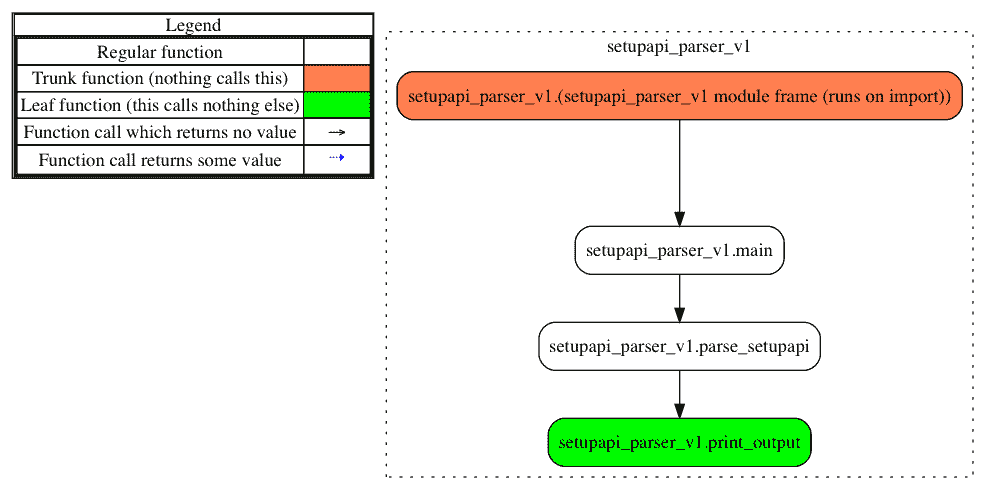
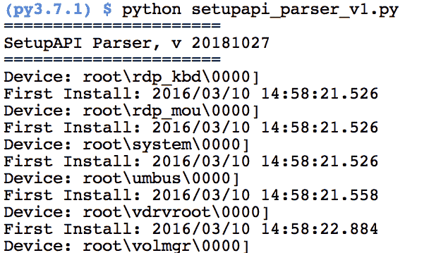
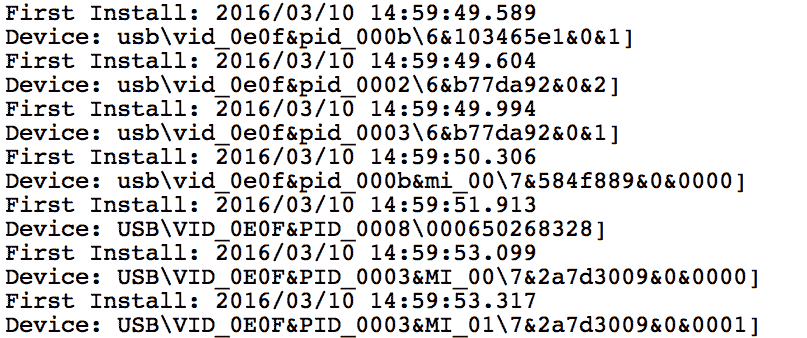
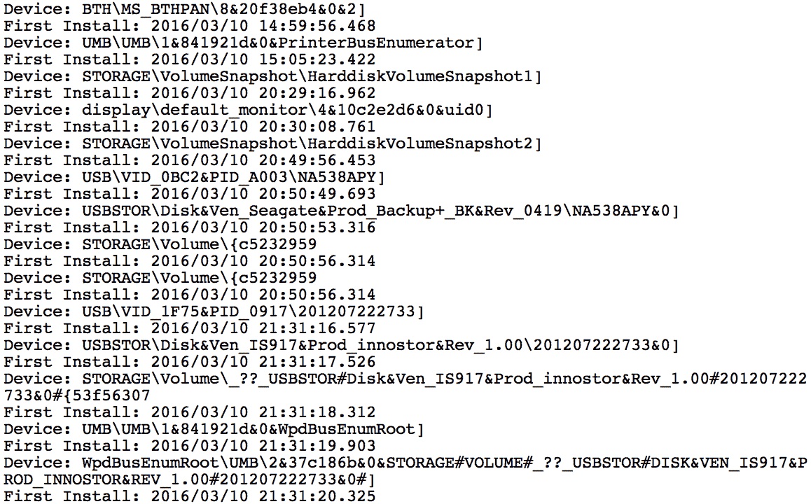
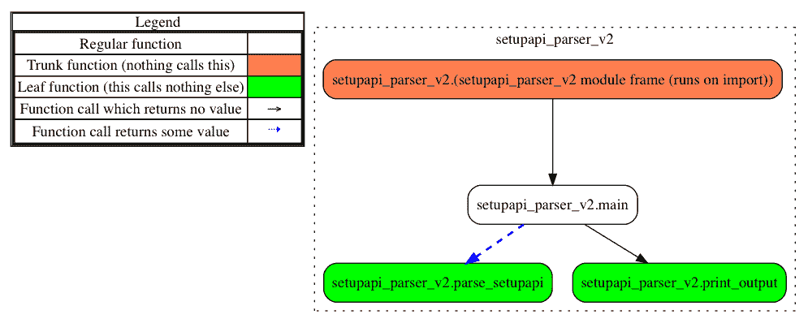
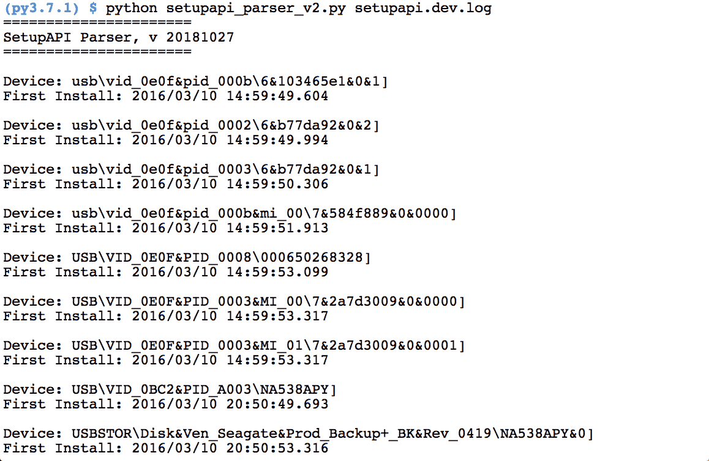
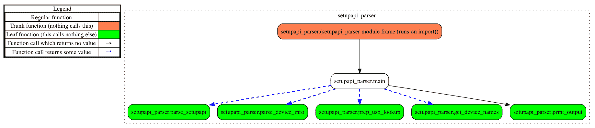
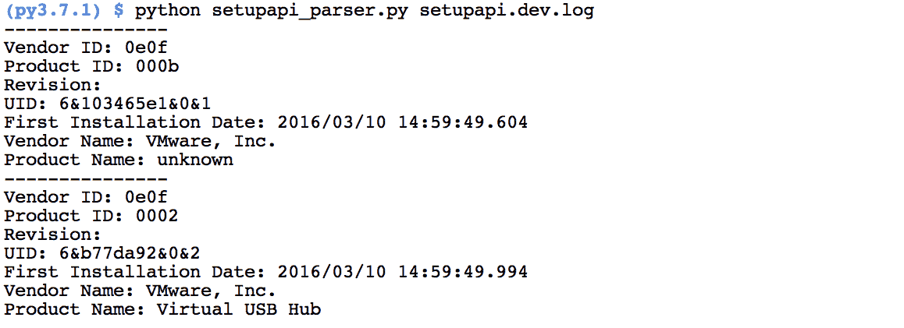
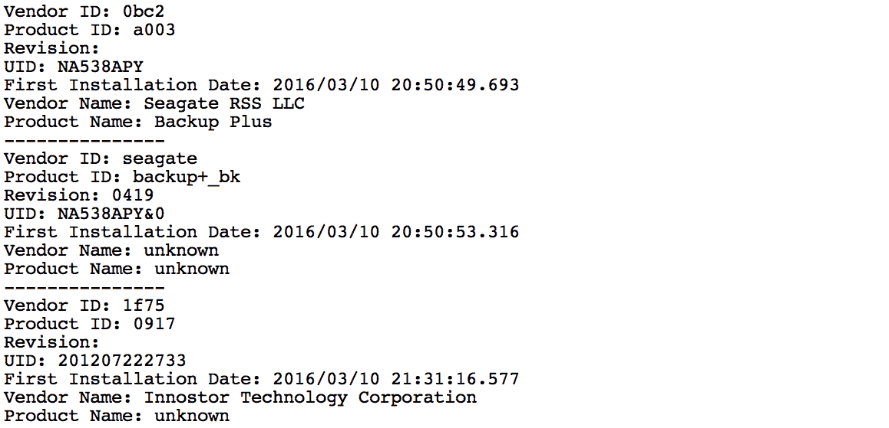

# 第三章：解析文本文件

文本文件，通常来自应用程序或服务日志，是数字调查中常见的证据来源。日志文件可能非常大，或者包含难以人工检查的数据。手动检查可能会变成一系列的 grep 搜索，结果可能会有或没有成效；此外，预构建的工具可能不支持特定的日志文件格式。在这些情况下，我们需要开发自己的解决方案，正确解析并提取相关信息。在本章中，我们将分析 `setupapi.dev.log` 文件，该文件记录了 Windows 机器上的设备信息。由于该日志文件能够提取系统中 USB 设备的首次连接时间，因此它通常会被检查。

在本章中，我们将逐步讲解相同代码的几个迭代版本。尽管可能显得有些冗余，但我们鼓励你为自己编写每个版本的代码。通过重写代码，我们将一起推进学习，找到更合适的解决方案，学习如何处理 bugs，并实现效率提升。请为自己重写代码并测试每个迭代版本，以查看输出和代码处理的变化。

本章将涵盖以下主题：

+   识别日志文件中 USB 设备条目的重复模式

+   从文本文件中提取和处理证据

+   迭代改进我们的脚本设计和功能

+   以去重且易读的方式增强数据展示

本章的代码是在 Python 2.7.15 和 Python 3.7.1 环境下开发和测试的。

# 设置 API

`setupapi.dev.log` 文件是一个 Windows 日志文件，用于跟踪各种设备的连接信息，包括 USB 设备。由于 USB 设备信息在许多调查中通常扮演重要角色，我们的脚本将帮助识别机器上 USB 设备的最早安装时间。这个日志是全系统范围的，而不是用户特定的，因此仅提供 USB 设备首次连接系统的安装时间。除了记录这个时间戳外，日志还包含 **供应商 ID** (**VID**)、**产品 ID** (**PID**) 以及设备的序列号。有了这些信息，我们可以更好地了解可移动存储设备的活动。在 Windows XP 上，这个文件可以在 `C:\Windows\setupapi.log` 找到；在 Windows 7 到 10 上，这个文件可以在 `C:\Windows\inf\setupapi.dev.log` 找到。

# 介绍我们的脚本

在这一部分中，我们将构建 `setupapi_parser.py`，以解析 Windows 7 中的 `setupapi.dev.log` 文件。仅使用标准库中的模块，我们将打开并读取一个 `setupapi.log` 文件，识别并解析相关的 USB 信息，并将其显示在控制台中。正如在介绍中所提到的，我们将使用迭代构建过程来模拟自然的开发周期。每次迭代都会在前一次的基础上进行改进，同时我们探索新的功能和方法。我们鼓励开发额外的迭代，章节结尾处有挑战内容供读者尝试。

# 概述

在开发任何代码之前，让我们先识别出我们的脚本必须具备的需求和功能，以完成预期任务。我们需要执行以下步骤：

1.  打开日志文件并读取所有行

1.  在每一行中，检查是否有 USB 设备条目的指示符

1.  解析响应行中的时间戳和设备信息

1.  将结果输出给用户

现在，让我们检查感兴趣的日志文件，以确定我们可以在脚本中用作切入点的重复结构，以便解析相关数据。在以下示例的 USB 条目中，我们可以看到在文本 `Device Install (Hardware initiated)` 后，第 1 行包含设备信息。该设备信息包含 VID、PID、设备版本以及设备的唯一 ID。每个元素之间由 `&` 或 `_` 字符分隔，并且可能包含一些额外的无关字符。安装时间记录在第 2 行，在 `Section start` 文本后。对于我们的目的，我们只关心这两行。所有其他的周围行将被忽略，因为它们与操作系统驱动程序信息相关：

```
001 >>>  [Setup online Device Install (Hardware initiated) - pciven_15ad&dev_07a0&subsys_07a015ad&rev_013&18d45aa6&0&a9]
002 >>>  Section start 2010/11/10 10:21:12.593
003 ump: Creating Install Process: DrvInst.exe 10:21:12.593
004 ndv: Retrieving device info...
005 ndv: Setting device parameters...
006 ndv: Searching Driver Store and Device Path...
007 dvi: {Build Driver List} 10:21:12.640 
```

# 我们的第一次迭代 – setupapi_parser_v1.py

我们第一次迭代的目标是开发一个功能原型，在后续的迭代中对其进行改进。在所有脚本中，我们将继续看到以下代码块，它提供了有关脚本的基本文档，以及在 Python 2 和 3 版本中打印信息（第 2 行）和打开文件（第 3 行）的支持。以下是所有脚本中可以找到的许可信息和基本脚本描述符：

```
001 """First iteration of the setupapi.dev.log parser."""
002 from __future__ import print_function
003 from io import open
...
033 __authors__ = ["Chapin Bryce", "Preston Miller"]
034 __date__ = 20181027
035 __description__ = """This scripts reads a Windows 7 Setup API
036    log and prints USB Devices to the user"""
```

我们的脚本包含三个功能，具体如下。`main()` 函数通过调用 `parse_setupapi()` 函数启动脚本。此函数读取 `setupapi.dev.log` 文件，并提取 USB 设备和首次安装日期的信息。处理完成后，调用 `print_output()` 函数，将提取的信息打印到控制台上。`print_output()` 函数接收提取的信息，并将其打印给用户。这三个函数共同协作，使我们能够根据操作将代码分段：

```
039 def main():
...
054 def parse_setupapi():
...
071 def print_output(): 
```

要运行这个脚本，我们需要提供一些代码来调用`main()`函数。以下代码块展示了一个 Python 特性，我们将在本书中的几乎每个脚本中使用。随着本章的进行，这部分代码将变得更加复杂，因为我们将添加允许用户控制输入、输出并提供可选参数的功能：

第 82 行只是一个`if`语句，用来检查脚本是否是从命令行调用的。更详细地说，`__name__`属性允许 Python 告诉我们是哪个函数调用了这段代码。当`__name__`等于`__main__`字符串时，表示它是顶级脚本，因此很可能是在命令行执行。这个功能在设计可能被其他脚本调用的代码时尤其重要。其他人可能会将你的函数导入到他们的代码中，如果没有这个条件，脚本在导入时很可能会立即执行。我们有如下代码：

```
082 if __name__ == '__main__':
083     # Run the program
084     main()
```

如下图所示，主函数（我们整个脚本）调用`main()`函数，而`main()`函数又调用`parse_setupapi()`，最后调用`print_output()`函数：



# 设计`main()`函数

在第 39 行定义的`main()`函数在这个场景下相当简单。这个函数在调用`parse_setup()`之前处理初始变量赋值和设置。在接下来的代码块中，我们创建一个文档字符串，使用三个双引号括起来，其中记录了函数的目的以及它返回的数据，如第 40 到 43 行所示。看起来很简洁吧？随着开发的进行，我们会逐步增强文档，因为在开发初期，事情可能会发生剧烈变化：

```
039 def main():
040     """
041     Primary controller for script.
042     :return: None
043     """
```

在文档字符串之后，我们在第 45 行硬编码了`setupapi.dev.log`文件的路径。这意味着我们的脚本只有在与脚本位于同一目录下存在这个名称的日志文件时才能正常工作：

```
045     file_path = 'setupapi.dev.log'
```

在第 48 到 50 行，我们将脚本信息（包括名称和版本）打印到控制台，通知用户脚本正在运行。此外，我们还打印出 22 个等号，用以在设置信息和脚本的其他输出之间提供视觉上的区分：

```
047     # Print version information when the script is run
048     print('='*22)
049     print('SetupAPI Parser, v', __date__)
050     print('='*22)
```

最后，在第 51 行，我们调用下一个函数来解析输入文件。这个函数期望一个`str`对象，表示`setupapi.dev.log`的路径。虽然这似乎与`main()`函数的目的相违背，但我们将大部分功能放在一个单独的函数中。这使得我们能够在其他脚本中重用专门处理主要功能的代码，而`main()`函数则充当一个主要的控制器。这个例子将在代码的最终版本中展示。请参见以下代码行：

```
051     parse_setupapi(file_path) 
```

# 编写`parse_setupapi()`函数

在第 54 行定义的`parse_setupapi()`函数接受一个字符串输入，表示 Windows 7 `setupapi.dev.log`文件的完整路径，具体内容由第 55 至 59 行的文档字符串详细说明。在第 60 行，我们打开`main()`函数提供的文件路径，并将数据读取到名为`in_file`的变量中。此打开语句未指定任何参数，因此使用默认设置以只读模式打开文件。此模式防止我们意外地向文件写入。实际上，尝试向以只读模式打开的文件执行`write()`操作会导致以下错误和信息：

```
IOError: File not open for reading 
```

尽管它不允许向文件写入，但在处理数字证据时，应该使用源证据的副本或使用写入阻止技术。

如果对文件及其模式有任何疑问，请参阅第一章，*现在换个话题*，以获取更多信息。请参见以下代码：

```
054 def parse_setupapi(setup_file):
055     """
056     Interpret the file
057     :param setup_file: path to the setupapi.dev.log
058     :return: None
059     """
060     in_file = open(setup_file)
```

在第 61 行，我们使用文件对象的`readlines()`方法，将`in_file`变量中的每一行读取到一个名为`data`的新变量中。该方法返回一个列表，其中每个元素表示文件中的一行。列表中的每个元素都是文件中的文本字符串，以换行符（`\n` 或 `\r\n`）字符分隔。在此换行符处，数据被拆分为一个新元素，并作为新条目添加到数据列表中：

```
061     data = in_file.readlines() 
```

通过将文件的内容存储在`data`变量中，我们开始一个`for`循环，遍历每一行。这个循环使用`enumerate()`函数，该函数为我们的迭代器添加了一个计数器，记录迭代次数。这是有用的，因为我们希望检查识别 USB 设备条目的模式，然后读取下一行以获取日期值。通过跟踪当前正在处理的元素，我们可以轻松地提取我们需要处理的下一行，即*data [n + 1]*，其中*n*是当前正在处理行的枚举计数。

```
063     for i, line in enumerate(data): 
```

一旦进入循环，在第 64 行，我们评估当前行是否包含字符串`device install (hardware initiated)`。为了确保我们不会遗漏重要数据，我们将当前行设置为不区分大小写，使用`.lower()`方法将字符串中的所有字符转换为小写。如果符合条件，我们执行第 65 至 67 行。在第 65 行，我们使用当前迭代计数变量`i`来访问数据对象中的响应行：

```
064         if 'device install (hardware initiated)' in line.lower():
065             device_name = data[i].split('-')[1].strip()
```

访问到值后，我们在字符串上调用`.split()`方法，通过短横线（`-`）字符拆分值。拆分后，我们访问拆分列表中的第二个值，并将该字符串传递给`strip()`函数。`.strip()`函数在未提供任何值的情况下，将去除字符串两端的空白字符。我们处理响应行，以便它仅包含 USB 标识信息。

以下是处理前的日志条目，位于第 65 行之前：

```
>>> [Device Install (Hardware initiated) - pciven_8086&dev_100f&subsys_075015ad&rev_014&b70f118&0&0888]
```

以下是处理后的日志条目：

```
pciven_8086&dev_100f&subsys_075015ad&rev_014&b70f118&0&0888]
```

在转换`setupapi.dev.log`中的第一行 USB 条目后，我们在第 66 行访问数据变量，获取下一行中的日期信息。由于我们知道日期值位于设备信息数据之后的那一行，我们可以将迭代计数变量`i`加 1，以访问下一行并获取包含日期的行。与设备行解析类似，我们在`start`字符串上调用`.split()`函数，提取分割后的第二个元素，代表日期。在保存该值之前，我们需要调用`.strip()`，以去除字符串两端的空格：

```
066             date = data[i+1].split('start')[1].strip()
```

该过程去除了除了日期以外的其他字符。

以下是处理前的日志条目，位于第 66 行之前：

```
>>>  Section start 2010/11/10 10:21:14.656
```

以下是处理后的日志条目：

```
2010/11/10 10:21:14.656
```

在第 67 行，我们将提取的`device_name`和`date`值传递给`print_output()`函数。该函数会在循环中找到的任何响应行上重复调用。循环完成后，第 68 行的代码会执行，关闭我们最初打开的`setupapi.dev.log`文件，并释放该文件，供 Python 使用：

```
067             print_output(device_name, date)
068     in_file.close()
```

# 开发`print_output()`函数

在第 71 行定义的`print_output()`函数允许我们控制数据如何展示给用户。该函数需要两个字符串作为输入，分别代表 USB 名称和日期，正如文档字符串所定义的那样。在第 78 和 79 行，我们使用`.format()`方法打印 USB 数据。正如在第一章中讨论的，*现在来点完全不同的东西*，该函数将花括号（`{}`）替换为方法调用中提供的数据。像这样简单的例子并未展示`.format()`方法的全部威力。然而，该函数可以让我们轻松地进行复杂的字符串格式化。打印输入后，执行将返回到被调用的函数，脚本继续下一个循环的迭代，具体如下：

```
071 def print_output(usb_name, usb_date):
072     """
073     Print the information discovered
074     :param usb_name: String USB Name to print
075     :param usb_date: String USB Date to print
076     :return: None
077     """
078     print('Device: {}'.format(usb_name))
079     print('First Install: {}'.format(usb_date))
```

# 运行脚本

我们现在有一个脚本，可以处理在 Windows 7 中找到的`setupapi.dev.log`文件，并输出带有相关时间戳的 USB 条目。以下截图展示了如何使用提供的示例`setupapi.dev.log`文件来执行该脚本，您输出的内容可能会根据使用的`setupapi.dev.log`文件有所不同：



由于`setupapi.dev.log`包含大量条目，我们从命令的输出中提取了两个额外的片段，专注于 USB 和 USBSTOR 设备：



我们的第二个代码片段显示了一些 USBSTOR 条目的详细信息：



我们当前的迭代似乎通过提取一些并非仅与 USB 设备相关的响应行，生成了一些误报；我们来看一下如何解决这个问题。

# 我们的第二次迭代 – setupapi_parser_v2.py

在有了一个可行的原型后，我们现在需要进行一些清理工作。第一次迭代只是一个概念验证，用来展示如何解析`setupapi.dev.log`文件中的取证信息。通过第二次修订，我们将清理并重构代码，以便未来更容易使用。此外，我们将集成更强大的命令行接口，验证任何用户提供的输入，提高处理效率，并以更好的格式显示结果。

在第 2 到第 6 行之间，我们导入了为这些改进所需的库，同时也导入了一些熟悉的跨版本支持库。`argparse`是我们在第二章《Python 基础》中详细讨论过的一个库，用于实现和组织来自用户的参数。接下来，我们导入了`os`库，这是我们将在此脚本中使用的，用来在继续执行之前检查输入文件是否存在。这可以防止我们尝试处理不存在的文件。`os`模块用于以操作系统无关的方式访问常见的操作系统功能。也就是说，这些功能在不同操作系统中可能会有所不同，但它们都在同一个模块中处理。我们可以使用`os`模块递归地遍历目录、创建新目录，并修改对象的权限。

最后，我们导入了`sys`，它将在发生错误时用来退出脚本，避免错误或不正确的输出。导入完成后，我们保留了之前的许可和文档变量，并对它们进行了修改，以提供关于第二次迭代的详细信息：

```
001 """Second iteration of the setupapi.dev.log parser."""
002 from __future__ import print_function
003 import argparse
004 from io import open
005 import os
006 import sys
...
036 __authors__ = ["Chapin Bryce", "Preston Miller"]
037 __date__ = 20181027
038 __description__ = """This scripts reads a Windows 7 Setup API
039 log and prints USB Devices to the user"""
```

我们在之前的脚本中定义的函数仍然存在于这里。然而，这些函数包含了新的代码，使得处理方式得到了改进，并以不同的方式实现了逻辑流。以模块化的方式设计代码使我们能够在新的或更新的脚本中重复使用这些函数，从而避免了大规模的重构。这种分段处理也使得在检查函数中抛出的错误时，调试变得更加容易：

```
042 def main()
...
060 def parse_setupapi()
...
093 def print_output() 
```

`if`语句的作用与之前的迭代相同。此条件语句中的附加代码允许用户提供输入，以修改脚本的行为。在第 106 行，我们创建了一个`ArgumentParser`对象，包含描述、默认帮助格式和包含作者、版本及日期信息的`epilog`。结合参数选项，我们可以在运行`-h`开关时，向用户显示关于脚本的有用信息。请参见以下代码：

```
104 if __name__ == '__main__':
105     # Run this code if the script is run from the command line.
106     parser = argparse.ArgumentParser(
107         description=__description__,
108         epilog='Built by {}. Version {}'.format(
109             ", ".join(__authors__), __date__),
110         formatter_class=argparse.ArgumentDefaultsHelpFormatter
111     )
```

在定义`ArgumentParser`对象为`parser`之后，我们在第 113 行添加了`IN_FILE`参数，允许用户指定用于输入的文件。这样一来，我们的脚本在输入文件路径上增加了灵活性，而不是硬编码路径，提升了可用性。在第 115 行，我们解析任何提供的参数，并将它们存储在`args`变量中。最后，在第 118 行调用`main()`函数，传递表示`setupapi.dev.log`文件位置的字符串，如下所示：

```
113     parser.add_argument('IN_FILE',
114         help='Windows 7 SetupAPI file')
115     args = parser.parse_args()
116 
117     # Run main program
118     main(args.IN_FILE)
```

请注意我们的流程图有所不同。我们的脚本不再是线性的。`main()`函数调用并接收来自`parse_setupapi()`方法的返回数据（由虚线箭头指示）。调用`print_output()`方法将解析后的数据打印到控制台：



# 改进`main()`函数

在第 42 行，我们定义了`main()`函数，现在接受一个新的参数，我们称之为`in_file`。根据文档字符串定义，该参数是一个指向`setupapi.dev.log`文件的字符串路径，该文件将被分析：

```
042 def main(in_file):
043     """
044     Main function to handle operation
045     :param in_file: string path to Windows 7 setupapi.dev.log
046     :return: None
047     """
```

在第 48 行，我们使用`os.path.isfile()`函数对输入文件进行验证，确保文件路径和文件存在，如果是脚本可访问的文件，函数将返回`true`。顺便提一下，`os.path.isdir()`函数可以用于对目录进行相同类型的验证。这些函数适用于表示绝对路径或相对路径的字符串输入：

```
048     if os.path.isfile(in_file):
```

如果文件路径有效，我们会打印脚本的版本。这一次，我们使用`.format()`方法来创建我们想要的字符串。让我们看看我们在第 49 行和第 51 行使用的格式化符号，从冒号开始定义我们指定的格式。插入符号（`^`）表示我们希望将提供的对象居中，并使用等号作为填充，使填充字符数最少为 22 个。例如，字符串`Hello World!`会被夹在两侧的五个等号之间。在我们的脚本中，我们提供一个空字符串作为要格式化的对象，因为我们只希望使用 22 个等号来与输出产生视觉上的分隔。

注意，之前版本的`"=" * 22`逻辑更简单，我们已使用`format()`方法演示可用的功能。

在第 50 行，使用`.format()`方法打印脚本名称和版本字符串，如下所示：

```
049         print('{:=²²}'.format(''))
050         print('{} {}'.format('SetupAPI Parser, v', __date__))
051         print('{:=²²} \n'.format(''))
```

在第 52 行，我们调用`parse_setupapi()`函数并传入已知可用的`setupapi.dev.log`文件。该函数返回一个 USB 条目列表，每个条目代表一个被发现的设备。`device_information`中的每个条目由两个元素组成，即设备名称和关联的日期值。在第 53 行，我们使用`for`循环遍历此列表，并将每个条目传递给第 54 行的`print_output()`函数：

```
052         device_information = parse_setupapi(in_file)
053         for device in device_information:
054             print_output(device[0], device[1])
```

在第 55 行，我们处理提供的文件无效的情况。这是处理无效路径所生成错误的常见方式。在此条件中，我们在第 56 行打印出输入的文件无效。

如果我们想使用 Python 内置的`Exception`类，我们可以引发 IOError，并提供一个消息，指出输入文件在指定路径下不可用。

在第 57 行，我们调用`sys.exit()`以错误代码 1 退出程序。你可以在这里放置任何数字；然而，由于我们将其定义为 1，我们将在退出时知道错误发生的地方：

```
055     else:
056         print('Input is not a file.')
057         sys.exit(1)
```

# 调整`parse_setupapi()`函数

`parse_setupapi()`函数接受`setupapi.dev.log`文件的路径作为唯一输入。在打开文件之前，我们必须在第 68 行初始化`device_list`变量，以便将提取的设备记录存储在一个列表中：

```
060 def parse_setupapi(setup_log):
061     """
062     Read data from provided file for Device Install Events for
063         USB Devices
064     :param setup_log: str - Path to valid setup api log
065     :return: list of tuples - Tuples contain device name and date
066     in that order
067     """
068     device_list = list()
```

从第 69 行开始，我们以一种新颖的方式打开输入文件；`with`语句将文件作为`in_file`打开，并允许我们在不需要担心关闭文件的情况下操作文件中的数据。在这个`with`循环内是一个`for`循环，它遍历每一行，提供了更优的内存管理。在之前的迭代中，我们使用`.readlines()`方法按行读取整个文件到一个列表中；虽然在较小的文件上不太显眼，但在较大文件上，`.readlines()`方法会在资源有限的系统上造成性能问题：

```
069     with open(setup_log) as in_file:
070         for line in in_file:
```

在`for`循环内，我们利用类似的逻辑来判断该行是否包含我们的设备安装指示符。如果响应，我们将以之前讨论的方式提取设备信息。

通过在第 74 行定义`lower_line`变量，我们可以通过防止连续调用`.lower()`方法来截断剩余的代码。请注意，第 73 行到第 75 行反映的是一行换行代码：

在第 73 行，反斜杠（`\`）字符告诉 Python 忽略换行符，并继续在下一行读取。然后，在第 74 行末尾，我们可以不使用反斜杠直接返回任何位置，因为我们的条件语句已在括号内。

```
071             lower_line = line.lower()
072             # if 'Device Install (Hardware initiated)' in line:
073             if 'device install (hardware initiated)' in \
074                 lower_line and ('ven' in lower_line or
075                                 'vid' in lower_line):
```

如第一次迭代中所述，我们的输出中出现了相当数量的误报。这是因为该日志包含与许多类型硬件设备相关的信息，包括与 PCI 接口的设备，而不仅仅是 USB 设备。为了去除这些噪音，我们将检查它是何种类型的设备。

我们可以在第 78 和第 79 行使用反斜杠字符进行分割，以访问`device_name`变量的第一个分割元素并查看它是否包含`usb`字符串。如第一章中提到的*Now for Something Completely Different*，我们需要使用另一个反斜杠来转义单个反斜杠，这样 Python 就能将其视为字面量反斜杠字符。这将响应文件中标记为 USB 和 USBSTOR 的设备。由于鼠标、键盘和集线器可能也会显示为 USB 设备，因此会存在一些误报；然而，我们不希望过度过滤而错过相关的文物。如果我们发现条目不包含`usb`字符串，我们执行`continue`语句，告诉 Python 跳过本次迭代，进入`for`循环的下一次迭代：

```
078                 if 'usb' not in device_name.split(
079                         '\\')[0].lower():
080                     continue
```

为了获取日期，我们需要使用不同的程序来获取下一行，因为我们没有调用`enumerate()`函数。为了解决这个问题，我们在第 87 行使用`next()`函数跳到文件中的下一行。然后，我们按照之前讨论的方式处理这行内容：

```
087                 date = next(in_file).split('start')[1].strip()
```

处理完设备的名称和日期后，我们将其作为元组追加到`device_list`中，其中设备的名称是第一个值，日期是第二个值。我们需要使用双层括号，以确保数据正确追加。外层括号由`.append()`函数使用，内层括号允许我们构建一个元组并作为一个值追加。如果没有内层括号，我们将把两个元素作为单独的参数传递给`append()`函数，而不是作为一个元组元素。所有行在`for`循环中处理完毕后，`with`循环将结束并关闭文件。在第 90 行，返回`device_list`并退出函数。

```
088                 device_list.append((device_name, date))
089
090     return device_list 
```

# 修改`print_output()`函数

该函数与之前的版本相同，唯一的区别是在第 101 行添加了换行符`\n`。这有助于在控制台输出中用额外的空格分隔每个条目。在迭代代码时，我们会发现，并非所有函数都需要更新以提高用户体验、准确性或代码效率。只有修改现有函数才能带来某种益处：

```
093 def print_output(usb_name, usb_date):
094     """
095     Print the information discovered
096     :param usb_name: String USB Name to print
097     :param usb_date: String USB Date to print
098     :return: None
099     """
100     print('Device: {}'.format(usb_name))
101     print('First Install: {}\n'.format(usb_date))
```

# 运行脚本

在这一轮迭代中，我们解决了概念验证中的几个问题。这些变化包括以下内容：

+   通过遍历文件而非将整个文件读取到变量中来改进资源管理

+   增加了一个参数，允许用户提供`setupapi.dev.log`文件以进行解析

+   用户输入文件的验证

+   过滤响应性命中的内容以减少输出中的噪声

+   为了便于审核，改进了输出格式

以下截图显示了我们脚本执行后的输出片段：



最后但同样重要的是，我们在之前的设计基础上取得了显著的性能提升。以下截图显示了对机器内存利用率的影响。第一迭代显示在左侧，第二迭代显示在右侧。红色线条标出了我们脚本的开始和结束时间。正如我们所见，通过在文件的每一行上使用 `for` 循环迭代 `readlines()` 方法，我们减少了资源的使用。这是一个小规模的资源管理示例，但更大的输入文件将对系统产生更为显著的影响：


# 我们的最终迭代——setupapi_parser.py

在我们的最终迭代中，我们将继续通过添加去重处理和改进输出内容来优化脚本。尽管第二次迭代引入了过滤非 USB 设备的逻辑，但它并未去重响应的数据。我们将基于设备名称去重，确保每个设备只有一个条目。此外，我们将整合来自第二章 *Python 基础*的 `usb_lookup.py` 脚本，通过显示已知设备的 USB VID 和 PID 来提高脚本的实用性。

我们必须修改 `usb_lookup.py` 脚本中的代码，以便与 `setupapi` 脚本正确集成。两者版本之间的差异是微妙的，重点是减少函数调用次数并提高返回数据的质量。在这一迭代过程中，我们将讨论如何实现我们的自定义 USB VID/PID 查找库，以解决 USB 设备名称的问题。在第 4 行，我们导入了 `usb_lookup` 脚本，如下所示：

```
001 """Third iteration of the setupapi.dev.log parser."""
002 from __future__ import print_function
003 import argparse
004 from io import open
005 import os
006 import sys
007 import usb_lookup
...
037 __authors__ = ["Chapin Bryce", "Preston Miller"]
038 __date__ = 20181027
039 __description__ = """This scripts reads a Windows 7 Setup API
040     log and prints USB Devices to the user"""
```

如下代码块所示，我们添加了三个新函数。我们之前的函数进行了少量修改，以适应新功能。大部分修改都集中在我们的新函数中：

+   `parse_device_info()` 函数负责提取必要的信息，以便在线查找 VID/PID 值，并将原始字符串格式化为标准格式进行比较。

+   接下来的函数 `prep_usb_lookup()` 准备并解析数据库，将其转换为支持查询的格式。

+   `get_device_names()` 函数将匹配的设备信息与数据库相关联。

借助这些新函数，我们为调查人员提供了更多的背景信息：

```
042 def main():
...
068 def parse_setupapi():
...
092 def parse_device_info():
...
137 def prep_usb_lookup():
...
151 def get_device_names():
...
171 def print_output():  
```

在调用 `main()` 函数之前，我们将为解析器添加一个参数。198 行和 199 行定义的 `--local` 参数允许我们指定一个本地的 `usb.ids` 文件，以便在离线环境中进行解析。以下代码块展示了我们如何实现这些参数，并分成几行以便于阅读：

```
187 if __name__ == '__main__':
188     # Run this code if the script is run from the command line.
189     parser = argparse.ArgumentParser(
190         description=__description__,
191         epilog='Built by {}. Version {}'.format(
192             ", ".join(__authors__), __date__),
193         formatter_class=argparse.ArgumentDefaultsHelpFormatter
194     )
195 
196     parser.add_argument('IN_FILE',
197         help='Windows 7 SetupAPI file')
198     parser.add_argument('--local',
199         help='Path to local usb.ids file')
200 
201     args = parser.parse_args()
202 
203     # Run main program
204     main(args.IN_FILE, args.local)
```

和之前的迭代一样，我们生成了一个流程图来映射脚本的逻辑流程。请注意，它使用与其他流程图相同的图例，尽管由于图形的宽度，我们省略了图例。我们的`main()`函数执行并直接调用了其他五个函数。这个布局是在第二次迭代中非线性设计的基础上构建的。在每次迭代中，我们继续在`main()`函数内增加更多控制逻辑。这个函数依赖其他函数来执行任务并返回数据，而不是自己完成工作。这为我们的脚本提供了一种高层次的组织方式，并通过线性执行一个函数接一个函数，帮助保持简洁：



# 扩展 main()函数

`main()`函数基本保持不变，只增加了查找 USB VID 和 PID 信息的功能，并为最终用户提供了更优的输出。我们简化了这个查找过程，其中一种方式是通过提供一个文件路径作为`local_usb_ids`参数，这使得我们可以使用离线文件作为 VID/PID 查找数据库。为了减少输出的杂乱，我们选择移除了脚本名称和版本的打印。在第 51 行，我们新增了一个函数调用`prep_usb_info()`，用于初始化 VID/PID 查找设置。第 52 行的循环已经重新配置，将每个处理过的设备条目交给第 53 行的`parse_device_info()`函数。这个新函数负责从日志文件中读取原始字符串，并尝试拆分 VID 和 PID 值以进行查找：

```
042 def main(in_file, local_usb_ids=None):
043     """
044     Main function to handle operation
045     :param in_file: Str - Path to setupapi log to analyze
046     :return: None
047     """
048 
049     if os.path.isfile(in_file):
050         device_information = parse_setupapi(in_file)
051         usb_ids = prep_usb_lookup(local_usb_ids)
052         for device in device_information:
053             parsed_info = parse_device_info(device)
```

第 54 行的`if`语句检查`parsed_info`变量的值，确保其已经正确解析，并可以与已知值进行比较。如果未准备好进行比较，则不查询或打印信息。请参阅以下代码：

```
054             if isinstance(parsed_info, dict):
055                 parsed_info = get_device_names(usb_ids,
056                     parsed_info)
```

第 57 行的附加逻辑检查`parsed_info`值是否不等于`None`。如果`parse_device_info()`函数发现设备没有记录为 USB 设备，`parsed_info`值将被赋为`None`，从而消除误报：

```
057             if parsed_info is not None:
058                 print_output(parsed_info)
```

最后，在第 59 行，我们向控制台打印日志文件解析完成的信息。在第 62 行到第 65 行，我们处理`setupapi.dev.log`文件无效或无法通过脚本访问的情况，并在退出前通知用户该情况。退出脚本前打印的消息比之前的版本更为详细。我们提供给用户的细节越多，特别是关于潜在错误的详细信息，用户就越能自行判断并纠正错误：

```
059         print('\n\n{} parsed and printed successfully.'.format(
060             in_file))
061
062     else:
063         print("Input: {} was not found. Please check your path "
064             "and permissions.".format(in_file))
065         sys.exit(1)
```

# 添加到 parse_setup_api()函数

该函数做了少许修改，重点是从日志文件中存储唯一条目。我们在第 76 行创建了一个名为`unique_list`的新变量，它是一个`set`数据类型。回想一下，`set`必须由可哈希且唯一的元素组成，这使其非常适合此解决方案。虽然拥有一个列表和一个集合存储相似数据似乎有些重复，但为了方便比较和演示，我们创建了第二个变量：

```
068 def parse_setupapi(setup_log):
069     """
070     Read data from provided file for Device Install Events for
071         USB Devices
072     :param setup_log: str - Path to valid setup api log
073     :return: tuple of str - Device name and date
074     """
075     device_list = list()
076     unique_list = set()
077     with open(setup_log) as in_file:
078         for line in in_file:
```

在第 79 行，我们将行转换为小写，以确保比较时不区分大小写。此时，我们在第 83 到 84 行使用相同的逻辑来处理`device_name`和`date`值。我们已将第二次迭代中验证设备类型的代码移至新的`parse_device_info()`函数中：

```
079         lower_line = line.lower()
080         if 'device install (hardware initiated)' in \
081                 lower_line and ('vid' in lower_line or
082                                 'ven' in lower_line):
083             device_name = line.split('-')[1].strip()
084             date = next(in_file).split('start')[1].strip()
```

在我们将`device_name`和`date`信息存储到`device_list`之前，我们检查`device_name`是否已经存在于`unique_list`中。如果不存在，我们会在第 86 行添加包含`device_name`和`date`的元组。然后，我们通过将该条目添加到`unique_list`，防止相同的设备再次被处理。在第 89 行，我们返回构建好的元组列表，供下一阶段的处理使用：

```
085             if device_name not in unique_list:
086                 device_list.append((device_name, date))
087                 unique_list.add(device_name)
088 
089     return device_list
```

# 创建`parse_device_info()`函数

该函数解释来自`setupapi.dev.log`的原始字符串，并将其转换为一个包含 VID、PID、修订版、唯一 ID 和日期值的字典。此过程在第 94 到 98 行的文档字符串中有描述。文档之后，我们在第 101 到 104 行初始化将在此函数中使用的变量。这些初始化提供了默认的占位符值，以防在无法为这些变量赋值的情况下，字典出现问题：

```
092 def parse_device_info(device_info):
093     """
094     Parses Vendor, Product, Revision and UID from a Setup API
095         entry
096     :param device_info: string of device information to parse
097     :return: dictionary of parsed information or original string
098         if error
099     """
100     # Initialize variables
101     vid = ''
102     pid = ''
103     rev = ''
104     uid = ''
```

初始化后，我们将从`parse_setup_api()`函数传递的`device_info`值按单个反斜杠进行分割，作为分隔符。为了将其作为字面意义的反斜杠字符进行解释，我们需要使用另一个反斜杠来转义它。第 107 行的分割将设备类型段与包含 VID 和 PID 信息的字符串分开。在此分割之后，我们检查设备类型条目是否反映了 USB 设备。如果设备不是 USB 设备，我们返回`None`，以确保该设备不被此函数进一步处理，也避免我们为该设备解析 VID 或 PID。通过添加此逻辑，我们避免了花费额外时间和资源处理不相关的条目：

```
106     # Split string into segments on \
107     segments = device_info[0].split('\\')
108 
109     if 'usb' not in segments[0].lower():
110         return None
```

接下来，我们访问 `segments` 列表的第二个元素，该元素包含由 & 符号分隔的 VID、PID 和修订数据。通过 `.split()`，我们可以在第 114 行的 `for` 循环中独立访问这些值。我们将该行转为小写，允许我们以不区分大小写的方式，通过一系列条件判断来确定每个项的含义。在第 116 行，我们检查每一项，看看它是否包含 `ven` 或 `vid` 关键字。如果行中包含这些指示符之一，我们只在第一个下划线字符处进行分割（由整数 `1` 指定为第二个参数）。这使我们能够从原始字符串中提取 VID。注意我们使用 `lower_item` 进行比较，而使用 `item` 变量来存储值，从而保持数据的原始大小写。这个过程对于 `pid` 变量也是如此，使用 `dev`、`prod` 和 `pid` 指示符，以及 `rev` 变量，使用 `rev` 或 `mi` 指示符，在第 118 至 122 行，如下所示：

```
114     for item in segments[1].split('&'):
115         lower_item = item.lower()
116         if 'ven' in lower_item or 'vid' in lower_item:
117             vid = item.split('_', 1)[-1]
118         elif 'dev' in lower_item or 'pid' in lower_item or \
119                 'prod' in lower_item:
120             pid = item.split('_', 1)[-1]
121         elif 'rev' in lower_item or 'mi' in lower_item:
122             rev = item.split('_', 1)[-1]
```

在解析 VID、PID 和修订信息后，我们尝试从 segments 变量中提取唯一 ID，通常这是字符串中的最后一个元素。由于整行内容被括号包裹，我们在第 125 行从 segment 的最右边条目中去掉了右括号。这样就去除了括号，确保它不会包含在我们的唯一 ID 字符串中：

```
124     if len(segments) >= 3:
125         uid = segments[2].strip(']')
```

在第 127 行，我们使用 `if` 语句来判断 `vid` 或 `pid` 是否在初始化后获得了值，并在第 128 至 132 行构建一个字典，若这些值未填写，我们返回原始字符串，以允许输出没有额外格式化的条目，如第 134 行所示，确保我们没有因格式化错误而遗漏任何数据：

```
127     if vid != '' or pid != '':
128         return {'Vendor ID': vid.lower(),
129             'Product ID': pid.lower(),
130             'Revision': rev,
131             'UID': uid,
132             'First Installation Date': device_info[1]}
133     # Unable to parse data, returning whole string
134     return device_info
```

# 构建 prep_usb_lookup() 函数

在这个函数中，我们调用了 `usb_lookup.py` 脚本的 `.get_usb_file()` 函数。利用提供的 `local_usb_ids` 参数，我们可以确认是否有已知的 `usb.ids` 文件路径需要用于此次查询，或者我们是否需要访问在线资源 [`linux-usb.org/usb.ids`](http://linux-usb.org/usb.ids)，将已知的 USB 信息读取到第 147 行的 `usb_file` 变量中。这个数据库是一个开源项目，托管了 VID/PID 查找数据库，允许用户参考并扩展该数据库：

```
137 def prep_usb_lookup(local_usb_ids=None):
138     """
139     Prepare the lookup of USB devices through accessing the most
140     recent copy of the database at http://linux-usb.org/usb.ids
141     or using the provided file and parsing it into a queriable
142     dictionary format.
143     """
144     if local_usb_ids:
145         usb_file = open(local_usb_ids, encoding='latin1')
146     else:
147         usb_file = usb_lookup.get_usb_file()
```

下载或使用本地副本后，我们将文件对象传递给 `.parse_file()` 函数进行处理，然后返回 USB VID/PID 数据，作为一个 Python 字典。为了实现这一功能，我们无需创建新的变量，只需在函数调用前加上 `return` 关键字即可立即返回值，如第 148 行所示：

```
148     return usb_lookup.parse_file(usb_file) 
```

# 构建 get_device_names() 函数

该函数的目的是将 VID 和 PID 信息传入`usb_lookup`库，并返回解析后的 USB 名称。如后文所述的文档字符串所定义，此函数接受两个字典——第一个包含`prep_usb_lookup()`中的已知设备数据库，第二个包含`parse_device_info()`中提取的设备条目。提供这些数据后，我们将返回一个字典，更新为解析后的供应商和产品名称：

```
151 def get_device_names(usb_dict, device_info):
152     """
153     Query `usb_lookup.py` for device information based on VID/PID.
154     :param usb_dict: Dictionary from usb_lookup.py of known
155         devices.
156     :param device_info: Dictionary containing 'Vendor ID' and
157         'Product ID' keys and values.
158     :return: original dictionary with 'Vendor Name' and
159         'Product Name' keys and values
160     """
```

该函数调用`usb_lookup.search_key()`函数，传入处理过的在线 USB 字典以及一个包含设备 VID 和 PID 的两元素列表，分别作为第一个和第二个元素。`.search_key()`函数返回一个响应匹配项，如果没有匹配项，则返回`Unknown`字符串。这些数据以元组形式返回，并分配给第 161 行的`device_name`变量。接着，我们将在第 165 和 166 行将这两个解析后的值拆分为`device_info`字典的新键。一旦我们扩展了`device_info`，就可以将其返回，以便打印到控制台。请参见以下行：

```
161     device_name = usb_lookup.search_key(
162         usb_dict, [device_info['Vendor ID'],
163         device_info['Product ID']])
164 
165     device_info['Vendor Name'] = device_name[0]
166     device_info['Product Name'] = device_name[1]
167 
168     return device_info
```

# 增强了`print_output()`函数

在这个函数中，我们做了一些调整，以改善输出到控制台的效果。通过在第 178 行添加分隔符，我们现在可以在每个条目之间插入 15 个短横线，从而可视化地分隔输出。如我们所见，我们借用了第一次迭代中的相同格式字符串来添加这个分隔符：

```
171 def print_output(usb_information):
172     """
173     Print formatted information about USB Device
174     :param usb_information: dictionary containing key/value
175         data about each device or tuple of device information
176     :return: None
177     """
178     print('{:-¹⁵}'.format(''))
```

我们还修改了代码，允许输出更多灵活的字段。在此函数中，我们需要处理两种不同的数据类型：元组和字典，因为有些条目没有解析出的供应商或产品名称。为了处理这些不同的格式，我们必须在第 180 行使用`isinstance()`函数测试`usb_information`变量的数据类型。如果值是字典类型，我们将在第 182 行逐行打印字典中的每一个键值对。这是通过第 181 行的`for`循环与字典的`items()`方法结合实现的。此方法返回一个包含元组的列表，其中第一个元素是键，第二个元素是值。通过这种方法，我们可以快速提取键值对，如第 181 和 182 行所示：

```
180     if isinstance(usb_information, dict):
181         for key_name, value_name in usb_information.items():
182             print('{}: {}'.format(key_name, value_name))
```

如果我们需要打印一个元组，可以使用两个`print`语句，类似于前一次迭代的输出。由于这些数据来自无法解析的设备，它具有与我们先前迭代相同的固定格式。请参见以下行：

```
183     elif isinstance(usb_information, tuple):
184         print('Device: {}'.format(usb_information[0]))
185         print('Date: {}'.format(usb_information[1]))
```

# 运行脚本

自我们编写第一个脚本以来，我们已经取得了长足进展，现在这个版本执行以下操作：

+   提供关于 Windows 7 中设备首次安装时间的 USB 设备信息

+   使用 VID 和 PID 数据解析更多的设备信息

+   将输出以可读且富有信息的格式打印到控制台

以下是脚本执行的示例及输出说明：



下面的屏幕截图已包含以突出显示我们更深入了解的一些存储设备输出：



# 挑战

对于本章，我们建议添加对`setupapi.log`的 Windows XP 格式的支持。用户可以在命令行中提供一个开关来指示将处理哪种类型的日志。对于一个更困难的任务，我们的脚本可以通过指纹识别仅在 Windows XP 与 Windows 7 版本中找到的唯一结构，自动识别日志文件的类型。

改进我们在本章中使用的去重过程将是一个受欢迎的补充。正如我们所发现的，一些条目在设备条目中嵌入了 UID 值。该值通常由制造商分配，并可以用于去重条目。正如您在输出中可能注意到的那样，UID 可能包含额外的和可能不重要的和符号，这些符号建议它们的来源。通过应用一些简单的逻辑，可能是在一个新函数中，我们可以基于 UID 来改进去重功能。

最后，我们可以考虑我们的输出格式。虽然在控制台友好的格式中显示东西很有用，但在处理完本书其余章节之后，我们应考虑添加对 CSV 或其他报告的支持。这可能是一个好功能，重新审视一下。

# 摘要

在本章中，您学习了如何使用 Python 解析普通文本文件。这个过程可以用于其他日志文件，包括防火墙、Web 服务器或其他应用程序和服务的日志文件。按照这些步骤，我们可以识别出适合脚本的重复数据结构，处理它们的数据，并将结果输出给用户。通过我们的迭代构建过程，我们实现了一个测试-然后-编码的方法，其中我们建立了一个工作原型，然后不断改进它成为一个可行且可靠的取证工具。

除了我们在这里探讨的文本格式外，还有一些文件具有更具体的结构，并以序列化格式存储。其他文件，如 HTML、XML 和 JSON，以一种可以轻松转换为一系列 Python 对象的方式存储数据。 该项目的代码可以从 GitHub 或 Packt 下载，如*前言*中所述。

在接下来的章节中，我们将探讨在 Python 中解析、操作和与这些结构化格式交互的方法。
