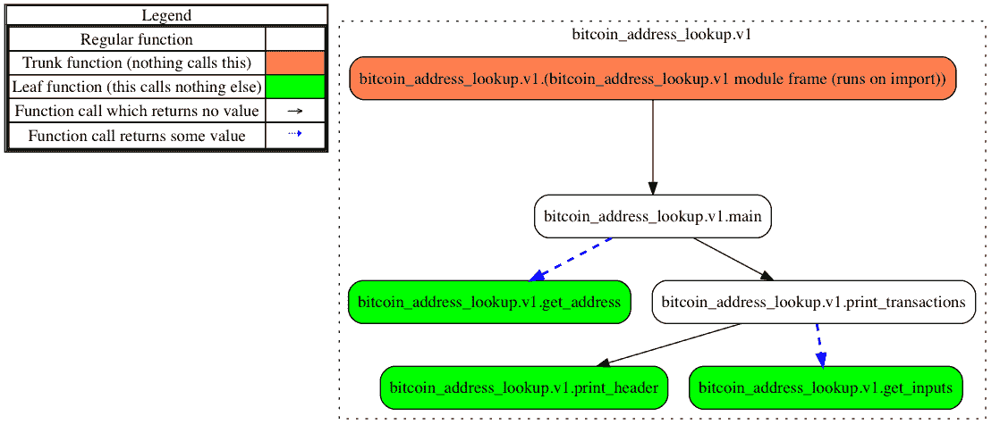
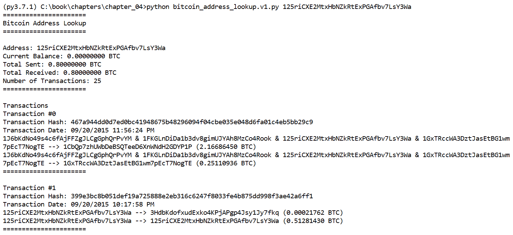
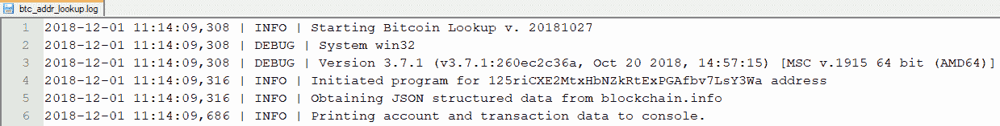
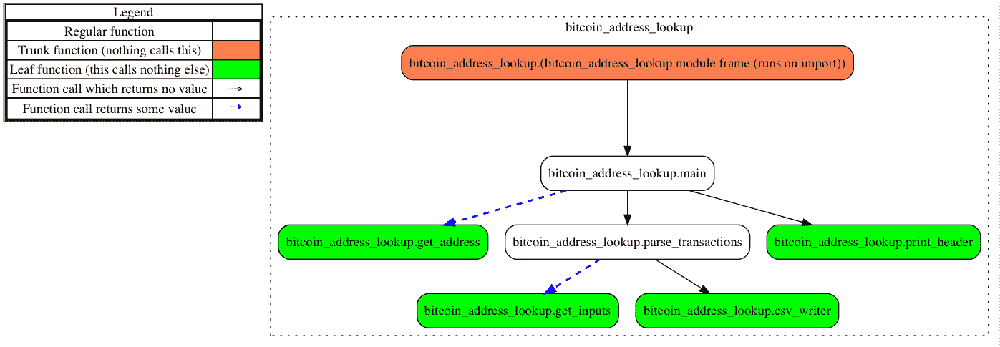
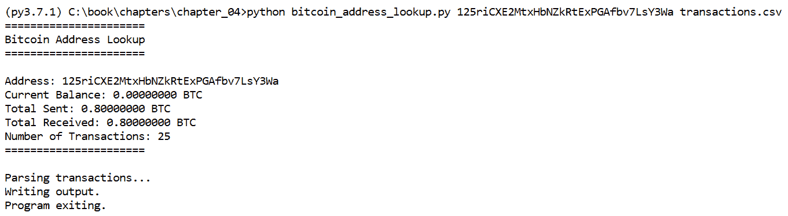
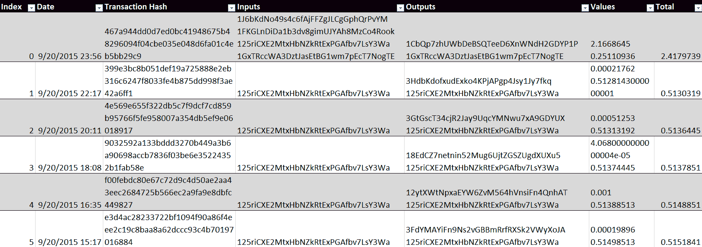

# 第四章：处理序列化数据结构

在本章中，我们将通过操作**JavaScript 对象表示法**（**JSON**）结构化数据，进一步提高处理嵌套列表和字典的技能。我们的研究对象是原始比特币账户数据，其中包含发送和接收的所有交易列表等信息。我们将使用网页**应用程序接口**（**API**）访问此数据集，并以有利于分析的方式进行解析。

API 是为软件产品创建的，允许程序员以定义的方式与软件进行交互。并非所有给定软件的公共 API 都是可用的。当可用时，API 通过提供与软件交互的方法，加速了代码开发，因为 API 将处理低级的实现细节。开发人员实现 API 旨在鼓励他人构建支持程序，并进一步控制其他开发人员的代码如何与他们的软件交互。通过创建 API，开发人员为其他程序员提供了与他们的程序进行受控交互的方式。

在本章中，我们将使用来自[`www.blockchain.info`](https://www.blockchain.info)的网页 API 来查询并接收给定比特币地址的比特币账户信息。该 API 生成的 JSON 数据可以使用标准库中的 JSON 模块转换为 Python 对象。有关其 API 的说明和示例，可以在[`www.blockchain.info/api/blockchain_api`](https://www.blockchain.info/api/blockchain_api)找到。

在本章中，我们将涵盖以下内容：

+   讨论和操作包括**可扩展标记语言**（**XML**）和 JSON 数据在内的序列化结构

+   使用 Python 创建日志

+   以 CSV 输出格式报告结果

本章的代码是使用 Python 2.7.15 和 Python 3.7.1 开发和测试的。`bitcoin_address_lookup.v1.py` 和 `bitcoin_address_lookup.v2.py` 脚本是为了与 Python 3.7.1 而非 Python 2.7.15 一起使用而开发的。

# 序列化数据结构

序列化是一个过程，通过该过程，数据对象在计算机系统的存储过程中被保留。序列化数据保留了对象的原始类型。也就是说，我们可以将字典、列表、整数或字符串序列化到一个文件中。稍后，当我们反序列化这个文件时，这些对象将仍然保持它们的原始数据类型。序列化非常好，因为如果我们将脚本对象存储到文本文件中，我们就无法轻松地将这些对象恢复到适当的数据类型。如我们所知，读取文本文件时，读取的数据是字符串。

XML 和 JSON 是两种常见的纯文本编码序列化格式。你可能已经习惯于在法医调查中分析这些文件。熟悉移动设备取证的分析师可能会识别包含帐户或配置详细信息的特定应用程序 XML 文件。让我们看看如何利用 Python 解析 XML 和 JSON 文件。

我们可以使用`xml`模块解析任何包括 XML 和 HTML 数据的标记语言。以下`book.xml`文件包含关于这本书的详细信息。如果你之前从未见过 XML 数据，第一件你可能会注意到的是它与 HTML 结构相似，HTML 是另一种标记语言，其中内容被打开和关闭标签包围，如下所示：

```
<?xml version="1.0" encoding="UTF-8"?>
<root>
  <authors>Preston Miller &amp; Chapin Bryce</authors>
  <chapters>
   <element>
     <chapterNumber>1</chapterNumber>
     <chapterTitle>Now for Something Completely Different</chapterTitle>
     <pageCount>30</pageCount>
   </element>
   <element>
     <chapterNumber>2</chapterNumber>
     <chapterTitle>Python Fundamentals</chapterTitle>
     <pageCount>25</pageCount>
   </element>
  </chapters>
  <numberOfChapters>13</numberOfChapters>
  <pageCount>500</pageCount>
  <publisher>Packt Publishing</publisher>
  <title>Learning Python for Forensics</title>
</root> 
```

对于分析师来说，XML 和 JSON 文件很容易阅读，因为它们是纯文本格式。然而，当文件包含数千行时，手动审核变得不切实际。幸运的是，这些文件具有高度的结构化，更棒的是，它们是为程序使用而设计的。

要探索 XML，我们需要使用`xml`模块中的`ElementTree`类，它将解析数据并允许我们遍历根节点的子节点。为了解析数据，我们必须指定正在解析的文件。在这个例子中，我们的`book.xml`文件位于与 Python 交互式提示符相同的工作目录中。如果情况不是这样，我们需要在文件名外指定文件路径。如果你使用的是 Python 2，请确保从`__future__`导入`print_function`。我们使用`getroot()`函数访问根级节点，如下所示：

```
>>> import xml.etree.ElementTree as ET
>>> tree = ET.parse('book.xml')
>>> root = tree.getroot() 
```

通过根元素，让我们使用`find()`函数在 XML 文件中搜索第一个`authors`标签实例。每个元素都有不同的属性，如`tag`、`attrib`和`text`。`tag`元素是一个描述数据的字符串，在这个例子中是`authors`。如果存在，属性（`attrib`）会存储在字典中。属性是赋值给标签内的值。例如，我们可以创建一个`chapter`标签：

```
<chapter number=2, title="Python Fundamentals", count=20 /> 
```

该对象的属性将是一个字典，包含键`number`、`title`和`count`及其各自的值。要访问标签之间的内容（例如`chapterNumber`），我们需要使用`text`属性。

我们可以使用`findall()`函数查找指定子标签的所有出现实例。在以下示例中，我们正在查找数据集中所有出现的`chapters/element`。一旦找到，我们可以使用列表索引访问`element`父标签中的特定标签。在这种情况下，我们只想访问`element`中前两个位置的章节号和标题。请看以下示例：

```
>>> print(root.find('authors').text)
Preston Miller & Chapin Bryce
>>> for element in root.findall('chapters/element'):
... print('Chapter #{}'.format(element[0].text))
... print('Chapter Title: {}'.format(element[1].text))
...
Chapter #1
Chapter Title: Now for Something Completely Different
Chapter #2
Chapter Title: Python Fundamentals 
```

我们可以使用许多其他方法来处理标记语言文件，利用 `xml` 模块。完整的文档，请参考 [`docs.python.org/3/library/xml.etree.elementtree.html`](https://docs.python.org/3/library/xml.etree.elementtree.html)[.](https://docs.python.org/3/library/xml.etree.elementtree.html)

在介绍完 XML 后，让我们来看一下将相同示例存储为 JSON 数据，并且更重要的是，我们如何使用 Python 来解释这些数据。稍后，我们将创建一个名为 `book.json` 的 JSON 文件；请注意使用的键，例如 title、authors、publisher，它们的关联值通过冒号分隔。这与 Python 中字典的结构类似。此外，注意 `chapters` 键使用了方括号，然后如何通过逗号分隔嵌套的类似字典的结构。在 Python 中，加载后，这个 `chapters` 结构会被解释为一个包含字典的列表，前提是使用 `json` 模块：

```
{
  "title": "Learning Python Forensics",
  "authors": "Preston Miller & Chapin Bryce",
  "publisher": "Packt Publishing",
  "pageCount": 500,
  "numberOfChapters": 13,
  "chapters":
  [
   {
    "chapterNumber": 1,
    "chapterTitle": "Now for Something Completely Different",
    "pageCount": 30
   },
   {
    "chapterNumber": 2,
    "chapterTitle": "Python Fundamentals",
    "pageCount": 25
   }
  ]
}
```

为了使用 `json` 模块解析该数据结构，我们使用 `loads()` 函数。与 XML 示例不同，我们需要首先打开一个文件对象，然后才能使用 `loads()` 将数据转换。在下一个代码块中，`book.json` 文件被打开，它与交互式提示位于同一工作目录，并将其内容读取到 `loads()` 方法中。顺便说一下，我们可以使用 `dump()` 函数执行反向操作，将 Python 对象转换为 JSON 格式进行存储。与 XML 代码块类似，如果你使用的是 Python 2，请从 `__future__` 导入 `print_function`：

```
>>> import json
>>> jsonfile = open('book.json', 'r')
>>> decoded_data = json.loads(jsonfile.read())
>>> print(type(decoded_data))
<class'dict'>
>>> print(decoded_data.keys())
dict_keys(['title', 'authors', 'publisher', 'pageCount', 'numberOfChapters', 'chapters'])
```

该模块的 `loads()` 方法读取 JSON 文件的字符串内容，并将数据重构为 Python 对象。如前面的代码所示，整个结构被存储在一个包含键值对的字典中。JSON 能够存储对象的原始数据类型。例如，`pageCount` 被反序列化为整数，`title` 被反序列化为字符串对象。

并非所有数据都以字典的形式存储。`chapters` 键被重构为一个列表。我们可以使用 `for` 循环遍历 `chapters` 并打印出任何相关的细节：

```
>>> for chapter in decoded_data['chapters']:
... number = chapter['chapterNumber']
... title = chapter['chapterTitle']
... pages = chapter['pageCount']
... print('Chapter {}, {}, is {} pages.'.format(number, title, pages))
... 
Chapter 1, Now For Something Completely Different, is 30 pages.
Chapter 2, Python Fundamentals, is 25 pages. 
```

为了明确，`chapters` 键在 JSON 文件中被存储为一个列表，并包含每个 `chapter` 元素的嵌套字典。当遍历这些字典列表时，我们存储并打印与字典键相关的值。我们将使用这个技术在更大规模的 Bitcoin JSON 数据解析中。有关 `json` 模块的更多细节，请参阅 [`docs.python.org/3/library/json.html`](https://docs.python.org/3/library/json.html)。本节中使用的 XML 和 JSON 示例文件可以在本章的代码包中找到。还有其他模块，如 `pickle` 和 `shelve`，可以用于数据序列化，但它们不在本书范围内。

# 一个简单的 Bitcoin 网络 API

比特币已经席卷全球，并成为新闻头条；它是最成功、最著名的——或者说是臭名昭著的——去中心化加密货币。比特币被视为一种“匿名”的在线现金替代品。曾经已经关闭的 Tor 网络上的非法市场 SilkRoad 接受比特币作为支付手段，用于非法商品或服务的交易。自从比特币获得广泛关注以来，一些网站和实体商店也开始接受比特币支付。它也因其价值远超预期而获得了广泛的公众关注。

比特币为个人分配地址以存储他们的比特币。这些用户可以通过指定他们想使用的地址来发送或接收比特币。在比特币中，地址由 34 个区分大小写的字母数字字符表示。幸运的是，所有交易都公开存储在区块链上。区块链记录了每笔交易的时间、输入、输出和金额。此外，每笔交易都被分配了一个唯一的交易哈希。

区块链浏览器是允许个人搜索区块链的程序。例如，我们可以搜索特定的地址或交易。一个这样的区块链浏览器位于[`www.blockchain.com/explorer`](https://www.blockchain.com/explorer)，我们将使用它来生成我们的数据集。让我们看看一些需要解析的数据。

我们的脚本将处理 JSON 结构的交易数据，处理后将这些信息以分析准备好的状态输出给审查人员。在用户输入感兴趣的地址后，我们将使用`blockchain.info` API 查询区块链，并拉取相关账户数据，包括所有关联的交易，具体如下：

```
https://blockchain.info/address/%btc_address%?format=json 
```

我们将通过替换`%btc_address%`为实际的感兴趣地址来查询前述 URL。在本次练习中，我们将调查`125riCXE2MtxHbNZkRtExPGAfbv7LsY3Wa`地址。如果你打开浏览器并将`%btc_address%`替换为感兴趣的地址，我们可以看到我们的脚本负责解析的原始 JSON 数据：

```
{
 "hash160":"0be34924c8147535c5d5a077d6f398e2d3f20e2c",
 "address":"125riCXE2MtxHbNZkRtExPGAfbv7LsY3Wa",
 "n_tx":25,
 "total_received":80000000,
 "total_sent":80000000,
 "final_balance":0,
 "txs":
  [
   ...
  ]
} 
```

这是我们之前 JSON 示例的一个更复杂版本；然而，适用的规则相同。从`hash160`开始，包含一般账户信息，如地址、交易数量、余额、已发送和已接收的总额。接下来是交易数组，用方括号表示，包含该地址涉及的每一笔交易。

看一笔单独的交易，有几个键值很突出，比如输入和输出列表中的`addr`值、时间和哈希。当我们遍历`txs`列表时，这些键值将被用来重建每笔交易，并向审查员展示这些信息。我们有如下的交易：

```
"txs":[{
  "lock_time":0,
  "result":0,
  "ver":1,
  "size":225,
  "inputs":[
   {
     "sequence":4294967295,
     "prev_out":{
      "spent":true,
      "tx_index":103263818,
      "type":0,
      "addr":"125riCXE2MtxHbNZkRtExPGAfbv7LsY3Wa",
      "value":51498513,
      "n":1,
        "script":"76a9140be34924c8147535c5d5a077d6f398e2d3f20e2c88ac"
    },
  "script":"4730440220673b8c6485b263fa15c75adc5de55c902cf80451c3c54f8e49df4357ecd1a3ae022047aff8f9fb960f0f5b0313869b8042c7a81356e4cd23c9934ed1490110911ce9012103e92a19202a543d7da710af28c956807c13f31832a18c1893954f905b339034fb"
  }],
  "time":1442766495,
  "tx_index":103276852,
  "vin_sz":1,
    "hash":"f00febdc80e67c72d9c4d50ae2aa43eec2684725b566ec2a9fa9e8dbfc449827",
  "vout_sz":2,
  "relayed_by":"127.0.0.1",
  "out":
   {
     "spent":false,
     "tx_index":103276852,
     "type":0,
     "addr":"12ytXWtNpxaEYW6ZvM564hVnsiFn4QnhAT",
     "value":100000,
     "n":0,
     "script":"76a91415ba6e75f51b0071e33152e5d34c2f6bca7998e888ac"
   }
```

和前一章一样，我们将以模块化的方式进行这项任务，通过迭代构建我们的脚本。除了处理序列化数据结构外，我们还将引入创建日志和将数据写入 CSV 文件的概念。像`argparse`一样，`logging`和`csv`模块将在我们的取证脚本中频繁出现。

# 我们的第一次迭代 – bitcoin_address_lookup.v1.py

我们脚本的第一次迭代将主要集中在适当地获取和处理数据。在这个脚本中，我们将把账户的交易摘要打印到控制台。在后续的迭代中，我们将添加日志记录并输出数据到 CSV 文件。此脚本已专门为 Python 3.7.1 编写和测试。`urllib`库（我们用来发起 HTTP 请求的库）在 Python 2 和 3 中结构不同。在此脚本的最终版本中，我们将展示必要的代码，使该脚本兼容 Python 2 和 3。

在脚本的初始版本中，我们将使用五个模块。`argparse`、`json`、`urllib`和`sys`模块都是标准库的一部分。`unix_converter`模块是我们在[第二章《Python 基础》中编写的几乎未修改的脚本，用于将 Unix 时间戳转换为比特币交易数据。本章提供的代码中包含了该模块的具体版本。`argparse`和`urllib`分别在之前用于用户输入和网页请求。`json`模块负责将我们的交易数据加载到 Python 对象中，以便我们进行处理：

```
001 """First iteration of the Bitcoin JSON transaction parser."""
002 import argparse
003 import json
004 import urllib.request
005 import unix_converter as unix
006 import sys
...
036 __authors__ = ["Chapin Bryce", "Preston Miller"]
037 __date__ = 20181027
038 __description__ = """This scripts downloads address transactions
039     using blockchain.info public APIs"""
```

我们脚本的逻辑由五个函数处理。`main()`函数定义在第 42 行，作为其他四个函数之间的协调者。首先，我们将用户提供的地址传递给`get_address()`函数。该函数负责使用`urllib`调用`blockchain.info` API，并返回包含该地址交易的 JSON 数据。

接下来，调用`print_transactions()`遍历嵌套的字典和列表，打印出交易详情。在`print_transactions()`中，调用了`print_header()`和`get_inputs()`。`print_header()`函数负责打印非交易数据，如交易数量、当前余额、总发送和接收值：

```
042 def main():
...
053 def get_address():
...
070 def print_transactions():
...
098 def print_header():
...
116 def get_inputs():
```

如前所见，我们使用`argparse`创建一个`ArgumentParser`对象，并添加相应的参数。我们唯一的参数`ADDR`是一个位置参数，代表感兴趣的比特币地址。我们在第 145 行调用`main()`函数并传递`ADDR`参数：

```
128 if __name__ == '__main__':
129     # Run this code if the script is run from the command line.
130     parser = argparse.ArgumentParser(
131         description=__description__,
132         epilog='Built by {}. Version {}'.format(
133             ", ".join(__authors__), __date__),
134         formatter_class=argparse.ArgumentDefaultsHelpFormatter
135     )
136     parser.add_argument('ADDR', help='Bitcoin Address')
137     args = parser.parse_args()
138 
139     # Print Script Information
140     print('{:=²²}'.format(''))
141     print('{}'.format('Bitcoin Address Lookup'))
142     print('{:=²²} \n'.format(''))
143 
144     # Run main program
145     main(args.ADDR)
```

我们脚本的流程图如下所示：



# 探索 main()函数

`main()`函数相对简单。首先，在第 48 行，我们调用`get_address()`函数并将结果存储在一个名为`raw_account`的变量中。该变量包含我们的 JSON 格式的交易数据。为了操作这些数据，我们使用`json.loads()`函数将 JSON 数据反序列化并存储在 account 变量中。此时，我们的 account 变量是一个字典和列表的系列，可以开始遍历，正如我们在第 50 行调用的`print_transactions()`函数所做的那样：

```
042 def main(address):
043     """
044     The main function handles coordinating logic
045     :param address: The Bitcoin Address to lookup
046     :return: Nothing
047     """
048     raw_account = get_address(address)
049     account = json.loads(raw_account.read())
050     print_transactions(account)
```

# 理解`get_address()`函数

这是我们脚本中的一个重要组成部分，尽管它可能容易出错，因为它依赖于用户正确提供数据。代码本身只是一个简单的数据请求。然而，在处理用户提供的参数时，我们不能假设用户给了脚本正确的数据。考虑到比特币地址的长度和看似随机的序列，用户可能会提供一个不正确的地址。我们将捕获来自`urllib.error`模块的任何`URLError`实例，以处理格式错误的输入。`URLError`不是我们之前提到的内置异常，而是`urllib`模块定义的自定义异常：

```
053 def get_address(address):
054     """
055     The get_address function uses the blockchain.info Data API
056     to pull pull down account information and transactions for
057     address of interest
058     :param address: The Bitcoin Address to lookup
059     :return: The response of the url request
060     """
```

在第 62 行，我们使用字符串`format()`方法将用户提供的地址插入到`blockchain.info` API 调用中。然后，我们尝试使用`urllib.request.urlopen()`函数返回请求的数据。如果用户提供了无效的地址，或者用户没有互联网连接，则会捕获到`URLError`。一旦捕获到错误，我们会通知用户并退出脚本，在第 67 行调用`sys.exit(1)`：

```
061     url = 'https://blockchain.info/address/{}?format=json'
062     formatted_url = url.format(address)
063     try:
064         return urllib.request.urlopen(formatted_url)
065     except urllib.error.URLError:
066         print('Received URL Error for {}'.format(formatted_url))
067         sys.exit(1)
```

# 使用`print_transactions()`函数

这个函数处理我们代码中大部分的处理逻辑。这个函数遍历从加载的 JSON 数据中嵌入的字典组成的交易列表，或称`txs`列表。

对于每个交易，我们将打印出其相对交易编号、交易哈希和交易时间。哈希和时间键容易访问，因为它们的值存储在最外层的字典中。交易的输入和输出细节存储在一个内嵌字典中，该字典映射到输入和输出键。

如常见情况一样，时间值是以 Unix 时间存储的。幸运的是，在第二章，*Python 基础知识*中，我们编写了一个脚本来处理这种转换，再次我们将通过调用`unix_converter()`方法重用这个脚本。对这个函数做的唯一更改是移除了 UTC 标签，因为这些时间值存储的是本地时间。

因为我们将`unix_converter`模块导入为`unix`，所以我们必须使用`unix`来引用该模块。

让我们快速看一下我们正在处理的数据结构。想象一下，如果我们能够在执行过程中暂停代码并检查变量的内容，例如我们的账户变量。在本书的这一部分，我们将仅展示执行阶段`account`变量的内容。稍后在本书中，我们将更正式地讨论如何使用`pdb`模块进行 Python 调试。

关于 Python 调试器（`pdb`）的更多信息可以在文档中找到：[`docs.python.org/3/library/pdb.html`](https://docs.python.org/3/library/pdb.html)。

在下面的示例中，我们可以看到`account`字典中第一个交易的键映射到`txs`列表中的内容。`hash`和`time`键分别映射到字符串和整数对象，我们可以将它们保留为脚本中的变量：

```
>>> print(account['txs'][0].keys())
dict_keys(['ver', 'inputs', 'weight', 'block_height', 'relayed_by',
 'out', 'lock_time', 'result', 'size', 'time', 'tx_index', 'vin_sz',
 'hash', 'vout_sz'])
```

接下来，我们需要访问交易的输入和输出细节。让我们查看`out`字典。通过查看键，我们可以立即识别出地址`addr`和作为重要信息的`value`。了解了布局和我们希望向用户呈现的数据后，让我们来看一下如何处理`txs`列表中的每一笔交易：

```
>>> print(account['txs'][0]['out'][0].keys())
dict_keys(['spent', 'tx_index', 'type', 'addr', 'value', 'n',
 'script'])
```

在打印每个交易的详细信息之前，我们通过第 77 行的`print_header()`辅助函数调用并打印基本账户信息到控制台。在第 79 行，我们开始遍历`txs`列表中的每一笔交易。我们使用`enumerate()`函数来包装列表，以更新我们的计数器，并在`for`循环中的第一个变量`i`中跟踪我们正在处理的交易：

```
070 def print_transactions(account):
071     """
072     The print_transaction function is responsible for presenting
073     transaction details to end user.
074     :param account: The JSON decoded account and transaction data
075     :return:
076     """
077     print_header(account)
078     print('Transactions')
079     for i, tx in enumerate(account['txs']):
```

对于每个交易，我们打印相对的交易编号、`hash`和`time`。正如我们之前看到的，我们可以通过提供适当的键来访问`hash`或`time`。记住，我们确实需要转换存储在`time`键中的 Unix 时间戳。我们通过将该值传递给`unix_converter()`函数来完成这个任务：

```
080         print('Transaction #{}'.format(i))
081         print('Transaction Hash:', tx['hash'])
082         print('Transaction Date: {}'.format(
083             unix.unix_converter(tx['time'])))
```

在第 84 行，我们开始遍历外部字典中的输出列表。这个列表由多个字典组成，每个字典表示一个给定交易的输出。我们感兴趣的键是这些字典中的`addr`和`value`键：

```
084         for outputs in tx['out']:
```

请注意，`value`值（这不是错别字）以整数而非浮点数形式存储，因此一个 0.025 BTC 的交易会存储为 2,500,000。我们需要将此值乘以 10^(-8)，以准确反映交易的价值。让我们在第 85 行调用我们的辅助函数`get_inputs()`。此函数将单独解析交易的输入，并以列表形式返回数据：

```
085              inputs = get_inputs(tx)
```

在第 86 行，我们检查是否有多个输入地址。这个条件将决定我们打印语句的样子。基本上，如果有多个输入地址，每个地址将通过与号连接，以清楚地表示额外的地址。

第 87 行和 91 行的`print`语句使用字符串格式化方法，在控制台中适当显示我们处理过的数据。在这些字符串中，我们使用花括号来表示三个不同的变量。我们使用`join()`函数通过某个分隔符将列表转换为字符串。第二和第三个变量分别是输出的`addr`和`value`键：

```
086             if len(inputs) > 1:
087                 print('{} --> {} ({:.8f} BTC)'.format(
088                     ' & '.join(inputs), output['addr'],
089                     outputs['value'] * 10**-8))
090             else:
091                 print('{} --> {} ({:.8f} BTC)'.format(
092                     ''.join(inputs), outputs['addr'],
093                     outputs['value'] * 10**-8))
094 
095         print('{:=²²}\n'.format(''))
```

注意值对象的表示方式与其他不同。由于我们的值是浮动的，我们可以使用字符串格式化来正确显示数据的精确度。在格式说明符`{:.8f}`中，`8`表示我们希望允许的十进制位数。如果超过八位小数，则值会四舍五入到最接近的数字。`f`让`format()`方法知道输入的数据类型是浮动类型。这个函数虽然负责将结果打印给用户，但它使用了两个辅助函数来完成其任务。

# `print_header()` 辅助函数

`print_header()` 辅助函数在打印交易信息之前，将账户信息打印到控制台。具体来说，会显示地址、交易数量、当前余额，以及发送和接收的比特币总量。请查看以下代码：

```
098 def print_header(account):
099     """
100     The print_header function prints overall header information
101     containing basic address information.
102     :param account: The JSON decoded account and transaction data
103     :return: Nothing
104     """
```

在第 105 到 113 行之间，我们使用字符串格式化方法打印出我们感兴趣的值。在程序设计过程中，我们选择将其作为一个独立函数，以提高代码的可读性。从功能上讲，这段代码本可以很容易地，且最初确实是在`print_transactions()`函数中实现。它被分离出来是为了将执行的不同阶段进行模块化。第 113 行的打印语句的目的是创建一行 22 个左对齐的等号，用来在控制台中将账户信息与交易信息分开：

```
105     print('Address:', account['address'])
106     print('Current Balance: {:.8f} BTC'.format(
107         account['final_balance'] * 10**-8))
108     print('Total Sent: {:.8f} BTC'.format(
109         account['total_sent'] * 10**-8))
110     print('Total Received: {:.8f} BTC'.format(
111         account['total_received'] * 10**-8))
112     print('Number of Transactions:', account['n_tx'])
113     print('{:=²²}\n'.format(''))
```

# `get_inputs()` 辅助函数

这个辅助函数负责获取发送交易的地址信息。此信息位于多个嵌套字典中。由于可能有多个输入，我们必须遍历输入列表中的一个或多个元素。当我们找到输入地址时，会将其添加到一个在第 123 行实例化的输入列表中，如以下代码所示：

```
116 def get_inputs(tx):
117     """
118     The get_inputs function is a small helper function that returns
119     input addresses for a given transaction
120     :param tx: A single instance of a Bitcoin transaction
121     :return: inputs, a list of inputs
122     """
123     inputs = []
```

对于每个输入，都有一个字典键`prev_out`，它的值是另一个字典。我们需要的信息被映射到该内层字典中的`addr`键。我们将这些地址附加到输入列表中，并在`for`循环执行结束后在第 126 行返回该列表：

```
124     for input_addr in tx['inputs']:
125         inputs.append(input_addr['prev_out']['addr'])
126     return inputs
```

# 运行脚本

现在，让我们运行脚本，看看我们的劳动成果。在后面提到的输出中，我们可以看到首先是打印给用户的头部信息，接着是若干交易。数值对象已正确表示，并具有适当的精度。对于这个特定的例子，有四个输入值。使用`' & '.join(inputs)`语句可以更清晰地将不同的输入值分开：



随着概念验证的完成，我们现在可以遍历并解决当前版本中的一些固有问题。一个问题是我们没有记录任何关于脚本执行的数据。例如，审查员的笔记应包括时间、任何错误或问题以及取证过程的结果。在第二次迭代中，我们将使用日志模块解决这个问题。此模块将存储我们程序执行的日志，以便分析人员记录程序开始、停止的时间，以及与该过程相关的任何其他数据。

# 我们的第二次迭代 – bitcoin_address_lookup.v2.py

这次迭代通过记录执行的详细信息解决了脚本中的一个问题。实际上，我们使用日志来创建脚本的“证据链”。我们的证据链将告诉其他方我们的脚本在不同时间点做了什么，以及遇到的任何错误。我们提到过，传统的日志记录目的是用于调试吗？然而，我们经过取证的日志在任何情况下都适用。这将通过一个实际示例简要介绍日志模块的基本用法。有关更多示例和参考，请参见[`docs.python.org/3/library/logging.html`](https://docs.python.org/3/library/logging.html)文档。

我们已将两个模块添加到导入中：`os`和`logging`。如果用户提供了日志文件目录，我们将使用`os`模块附加该目录并更新日志的路径。为了写入日志，我们将使用`logging`模块。这两个模块都是标准库的一部分。请参阅以下代码：

```
001 """Second iteration of the Bitcoin JSON transaction parser."""
002 import argparse
003 import json
004 import logging
005 import sys
006 import os
007 import urllib.request
008 import unix_converter as unix
...
038 __authors__ = ["Chapin Bryce", "Preston Miller"]
039 __date__ = 20181027
040 __description__ = """This scripts downloads address transactions
041     using blockchain.info public APIs"""
```

由于新增的代码，我们的函数定义在脚本后面。然而，它们的流程和目的与之前相同：

```
044 def main():
...
059 def get_address():
...
081 def print_transactions():
...
116 def print_header():
...
134 def get_inputs():
```

我们在第 155 行添加了一个新的可选参数`-l`。此可选参数可用于指定要将日志写入的目录。如果未提供，则日志将在当前工作目录中创建：

```
146 if __name__ == '__main__':
147     # Run this code if the script is run from the command line.
148     parser = argparse.ArgumentParser(
149     description=__description__,
150     epilog='Built by {}. Version {}'.format(
151         ", ".join(__authors__), __date__),
152     formatter_class=argparse.ArgumentDefaultsHelpFormatter
153     )
154     parser.add_argument('ADDR', help='Bitcoin Address')
155     parser.add_argument('-l', help="""Specify log directory.
156         Defaults to current working directory.""")
157     args = parser.parse_args()
```

在第 159 行，我们检查用户是否提供了可选参数`-l`。如果提供了，我们使用`os.path.join()`函数将所需的日志文件名附加到提供的目录，并将其存储在名为`log_path`的变量中。如果没有提供可选参数，我们的`log_path`变量将只是日志文件的文件名：

```
159     # Set up Log
160     if args.l:
161         if not os.path.exists(args.l):
162             os.makedirs(args.l)
163         log_path = os.path.join(args.l, 'btc_addr_lookup.log')
164     else:
165         log_path = 'btc_addr_lookup.log'
```

日志对象是在第 165 行通过`logging.basicConfig()`方法创建的。该方法接受多种关键字参数。`filename`关键字参数指定了我们的日志文件的路径和名称，该路径存储在`log_path`变量中。`level`关键字设置日志的级别。日志有五个不同的级别，按从最低到最高的紧急程度顺序排列：

+   `DEBUG`

+   `INFO`

+   `WARN`（默认级别）

+   `ERROR`

+   `CRITICAL`

如果没有提供级别，日志默认使用`WARN`级别。日志的级别非常重要。只有当消息的级别与日志级别相同或更高时，日志才会记录该条目。通过将日志设置为`DEBUG`级别，即最低级别，我们可以将任何级别的消息写入日志：

```
165     logging.basicConfig(
166         filename=log_path, level=logging.DEBUG,
167         format='%(asctime)s | %(levelname)s | %(message)s',
168         filemode='w')
```

每个级别都有不同的意义，应该根据情况正确使用。`DEBUG`级别应在记录程序执行的技术细节时使用。`INFO`级别可用于记录程序的启动、停止以及各个执行阶段的成功情况。其余级别可用于检测潜在的异常执行、生成错误时，或在关键失败时使用。

`format` 关键字指定我们希望如何构建日志本身。我们的日志将采用以下格式：

```
time | level | message 
```

例如，这种格式会创建一个日志文件，其中包含添加条目时的本地时间、适当的级别以及任何消息，所有信息之间用管道符号分隔。要在日志中创建条目，我们可以调用日志对象的`debug()`、`info()`、`warn()`、`error()`或`critical()`方法，并将消息作为字符串传入。例如，基于以下代码，我们预计会在日志中生成如下条目：

```
logging.error("Blah Blah function has generated an error from the following input: xyz123.")  
```

以下是日志记录：

```
2015-11-06 19:51:47,446 | ERROR | Blah Blah function has generated an error from the following input: xyz123. 
```

最后，`filemode='w'`参数用于在每次脚本执行时覆盖日志中的先前条目。这意味着日志中只会保存最近一次执行的条目。如果我们希望将每次执行周期追加到日志的末尾，可以省略此关键字参数。省略时，默认的文件模式为`a`，正如你在第一章《*完全不同的东西*》中学到的那样，它允许我们追加到现有文件的底部。

配置完成后，我们可以开始向日志中写入信息。在第 172 行和 173 行，我们记录了程序执行前用户系统的详细信息。由于内容的技术性较低，我们将此信息写入`DEBUG`级别的日志：

```
171     logging.info('Starting Bitcoin Lookup v. {}'.format(__date__))
172     logging.debug('System ' + sys.platform)
173     logging.debug('Version ' + sys.version.replace("\n", " "))
174 
175     # Print Script Information
176     print('{:=²²}'.format(''))
177     print('{}'.format('Bitcoin Address Lookup'))
178     print('{:=²²} \n'.format(''))
179 
180     # Run main program
181     main(args.ADDR)
```

我们的脚本版本基本相同，遵循与之前相同的流程示意图。

# 修改`main()`函数

在第 44 行定义的`main()`函数大体未做更改。我们在第 50 行和第 52 行添加了两个`INFO`级别的日志消息，关于脚本执行的情况。其余部分与第一次迭代中的方法一致：

```
044 def main(address):
045     """
046     The main function handles coordinating logic
047     :param address: The Bitcoin Address to lookup
048     :return: Nothing
049     """
050     logging.info('Initiated program for {} address'.format(
051         address))
052     logging.info(
053         'Obtaining JSON structured data from blockchain.info')
054     raw_account = get_address(address)
055     account = json.loads(raw_account.read())
056     print_transactions(account)
```

# 改进`get_address()`函数

使用`get_address()`方法时，我们继续向脚本中添加日志信息。这次，当捕获到`URLError`时，我们将`Exception`对象存储为`e`，以便提取更多调试信息：

```
059 def get_address(address):
060     """
061     The get_address function uses the blockchain.info Data API
062     to pull pull down account information and transactions for
063     address of interest
064     :param address: The Bitcoin Address to lookup
065     :return: The response of the url request
066     """
```

对于`URLError`，我们希望记录`code`、`headers`和`reason`属性。这些属性包含信息，例如 HTML 错误代码——例如，`404`表示页面未找到——以及错误代码的描述。我们将存储这些数据，以便保留错误发生时的上下文：

```
067     url = 'https://blockchain.info/address/{}?format=json'
068     formatted_url = url.format(address)
069     try:
070         return urllib.request.urlopen(formatted_url)
071     except urllib.error.URLError as e:
072         logging.error('URL Error for {}'.format(formatted_url))
073         if hasattr(e, 'code') and hasattr(e, 'headers'):
074             logging.debug('{}: {}'.format(e.code, e.reason))
075             logging.debug('{}'.format(e.headers))
076         print('Received URL Error for {}'.format(formatted_url))
077         logging.info('Program exiting...')
078         sys.exit(1)
```

# 详细说明 print_transactions()函数

我们在第 81 行定义了`print_transaction()`函数。我们对该函数进行了些许修改，从第 88 行开始，添加了一条记录当前执行阶段的日志。请看以下函数：

```
081 def print_transactions(account):
082     """
083     The print_transaction function is responsible for presenting
084     transaction details to end user.
085     :param account: The JSON decoded account and transaction data
086     :return: Nothing
087     """
088     logging.info(
089         'Printing account and transaction data to console.')
090     print_header(account)
091     print('Transactions')
092     for i, tx in enumerate(account['txs']):
093         print('Transaction #{}'.format(i))
094         print('Transaction Hash:', tx['hash'])
095         print('Transaction Date: {}'.format(
096             unix.unix_converter(tx['time'])))
```

对于第 99 行开始的条件语句，我们使用`if`、`elif`和`else`语句添加了不同的情况来处理输入值大于、等于或其他情况。虽然很少见，但例如第一个比特币交易就没有输入地址。当缺少输入地址时，理想的做法是记录日志，提示没有检测到输入，并将此信息打印给用户，具体如下：

```
097         for output in tx['out']:
098             inputs = get_inputs(tx)
099             if len(inputs) > 1:
100                 print('{} --> {} ({:.8f} BTC)'.format(
101                     ' & '.join(inputs), output['addr'],
102                     output['value'] * 10**-8))
103             elif len(inputs) == 1:
104                 print('{} --> {} ({:.8f} BTC)'.format(
105                     ''.join(inputs), output['addr'],
106                     output['value'] * 10**-8))
107             else:
108                 logging.warn(
109                     'Detected 0 inputs for transaction {}').format(
110                         tx['hash'])
111                 print('Detected 0 inputs for transaction.')
112 
113         print('{:=²²}\n'.format(''))
```

# 运行脚本

剩余的函数`print_header()`和`get_inputs()`与之前的版本没有变化。不同版本之间的整个代码不需要修改。通过构建一个强大的输出模块，我们避免了对报告进行任何调整。

虽然结果仍然显示在控制台中，但我们现在有了程序执行的书面日志。通过指定`-l`选项运行脚本，可以将日志存储在指定目录中。否则，默认使用当前工作目录。以下是脚本完成后日志的内容：



完成日志记录后，我们又找到了代码可以改进的地方。对于这个特定地址，我们有一定数量的交易会打印到控制台。试想一下，如果一个地址有成百上千的交易，浏览这些输出并找到一个特定的感兴趣交易就不那么简单了。

# 掌握我们的最终版本 —— bitcoin_address_lookup.py

在最终版本中，我们将把脚本的输出写入 CSV 文件，而不是打印到控制台。这使得检查人员能够快速筛选和排序数据，便于分析。

在第 4 行，我们导入了标准库中的`csv`模块。与其他输出格式相比，写入 CSV 文件相对简单，而且大多数检查人员非常熟悉操作电子表格。

正如本章前面提到的，在脚本的最终版本中，我们添加了必要的逻辑来检测是使用 Python 2 还是 Python 3 来调用脚本。根据 Python 版本，适当的 `urllib` 或 `urllib2` 函数会被导入到脚本中。请注意，我们直接导入了我们计划在脚本中直接调用的函数 `urlopen()` 和 `URLError`。这样，我们可以避免后续使用额外的条件语句来判断是否调用 `urllib` 或 `urllib2`：

```
001 """Final iteration of the Bitcoin JSON transaction parser."""
002 from __future__ import print_function
003 import argparse
004 import csv
005 import json
006 import logging
007 import sys
008 import os
009 if sys.version_info[0] == 2:
010     from urllib2 import urlopen
011     from urllib2 import URLError
012 elif sys.version_info[0] == 3:
013     from urllib.request import urlopen
014     from urllib.error import URLError
015 else:
016     print("Unsupported Python version. Exiting..")
017     sys.exit(1)
018 import unix_converter as unix
...
048 __authors__ = ["Chapin Bryce", "Preston Miller"]
049 __date__ = 20181027
050 __description__ = """This scripts downloads address transactions
051     using blockchain.info public APIs"""
```

本次迭代的重点是新增的 `csv_writer()` 函数。该函数负责将 `parse_transactions()` 返回的数据写入 CSV 文件。我们需要修改当前版本的 `print_transactions()`，使其返回解析后的数据，而不是将其打印到控制台。虽然这不是 `csv` 模块的深入教程，但我们将讨论在当前上下文中使用该模块的基本内容。在本书的后续章节中，我们将广泛使用 `csv` 模块，并探索其附加功能。有关 `csv` 模块的文档可以在[`docs.python.org/3/library/csv.html`](http://docs.python.org/3/library/csv.html)找到。

首先，我们打开一个交互式提示符来练习创建和写入 CSV 文件。首先，让我们导入 `csv` 模块，它将允许我们创建 CSV 文件。接下来，我们创建一个名为 `headers` 的列表，用于存储 CSV 文件的列头：

```
>>> import csv
>>> headers = ['Date', 'Name', 'Description'] 
```

接下来，我们将使用内置的`open()`方法以适当的文件模式打开一个文件对象。在 Python 2 中，CSV 文件对象应以 `rb` 或 `wb` 模式分别用于读取和写入。在这种情况下，我们将写入 CSV 文件，因此我们将以 `wb` 模式打开文件。`w` 代表写入，`b` 代表二进制模式。

在 Python 3 中，CSV 文件应以 `w` 模式打开，并指定换行符，如下所示：`open('test.csv', 'w', newline='')`。

通过我们与文件对象 `csvfile` 的连接，我们现在需要创建一个写入器或读取器（取决于我们的目标），并将文件对象传入。有两个选项——`csv.writer()` 或 `csv.reader()` 方法；它们都需要文件对象作为输入，并接受各种关键字参数。列表对象与 `csv` 模块非常契合，写入数据到 CSV 文件的代码量非常少。写入字典和其他对象到 CSV 文件并不困难，但超出了本章的范围，将在后续章节中讲解：

```
>>> with open('test.csv', 'wb') as csvfile:
...     writer = csv.writer(csvfile) 
```

`writer.writerow()` 方法将使用提供的列表写入一行。列表中的每个元素将依次放置在同一行的不同列中。例如，如果再次调用 `writerow()` 函数并传入另一个列表输入，那么数据将写入到上一行下面：

```
...     writer.writerow(headers) 
```

在实际操作中，我们发现使用嵌套列表是遍历和写入每一行最简单的方法之一。在最后一次迭代中，我们将交易详细信息存储在一个列表中，并将其追加到另一个列表中。然后，我们可以在遍历每个交易时，将其详细信息逐行写入 CSV 文件。

与任何文件对象一样，务必将缓冲区中的数据刷新到文件中，然后再关闭文件。忘记这些步骤并不会导致灾难，因为 Python 通常会自动处理，但我们强烈建议执行这些步骤。执行完这些代码行后，一个名为`test.csv`的文件将在你的工作目录中创建，文件的第一行将包含`Date`、`Name`和`Description`三个标题。相同的代码也适用于 Python 3 中的`csv`模块，唯一需要修改的是之前展示的`open()`函数：

```
...     csvfile.flush()
...     csvfile.close() 
```

我们将`print_transactions()`函数重命名为`parse_transactions()`，以更准确地反映其功能。此外，在第 159 行，我们添加了一个`csv_writer()`函数，用于将交易结果写入 CSV 文件。其他所有函数与之前的版本类似：

```
053 def main():
...
070 def get_address():
...
091 def parse_transactions():
...
123 def print_header():
...
142 def get_inputs():
...
159 def csv_writer():
```

最后，我们添加了一个名为`OUTPUT`的新位置参数。这个参数表示 CSV 输出的名称和/或路径。在第 230 行，我们将这个输出参数传递给`main()`函数：

```
195 if __name__ == '__main__':
196     # Run this code if the script is run from the command line.
197     parser = argparse.ArgumentParser(
198     description=__description__,
199     epilog='Built by {}. Version {}'.format(
200         ", ".join(__authors__), __date__),
201     formatter_class=argparse.ArgumentDefaultsHelpFormatter
202     )
203 
204     parser.add_argument('ADDR', help='Bitcoin Address')
205     parser.add_argument('OUTPUT', help='Output CSV file')
206     parser.add_argument('-l', help="""Specify log directory.
207         Defaults to current working directory.""")
208 
209     args = parser.parse_args()
210 
211     # Set up Log
212     if args.l:
213         if not os.path.exists(args.l):
214             os.makedirs(args.l) # create log directory path
215         log_path = os.path.join(args.l, 'btc_addr_lookup.log')
216     else:
217         log_path = 'btc_addr_lookup.log'
218     logging.basicConfig(
219         filename=log_path, level=logging.DEBUG,
220         format='%(asctime)s | %(levelname)s | %(message)s',
221         filemode='w')
222 
223     logging.info('Starting Bitcoid Lookup v. {}'.format(__date__))
224     logging.debug('System ' + sys.platform)
225     logging.debug('Version ' + sys.version.replace("\n", " "))
226 
227     # Print Script Information
228     print('{:=²²}'.format(''))
229     print('{}'.format('Bitcoin Address Lookup'))
230     print('{:=²²} \n'.format(''))
231 
232     # Run main program
233     main(args.ADDR, args.OUTPUT)
```

以下流程图展示了前两次迭代与最终版本之间的区别：



# 增强`parse_transactions()`函数

这个之前名为`print_transactions()`的函数用于处理交易数据，以便能被我们的`csv_writer()`函数接收。请注意，`print_header()`函数的调用现在已被移到`main()`函数中。我们现在也将输出参数传递给`parse_transactions()`：

```
091 def parse_transactions(account, output_dir):
092     """
093     The parse_transactions function appends transaction data into a
094     nested list structure so it can be successfully used by the
095     csv_writer function.
096     :param account: The JSON decoded account and transaction data
097     :param output_dir: The output directory to write the CSV
098     results
099     :return: Nothing
100     """
```

正如我们之前所见，我们必须首先遍历`transactions`列表。在遍历数据时，我们将其追加到一个在第 104 行创建的交易列表中。该列表表示一个给定的交易及其数据。完成追加交易数据后，我们将此列表追加到作为所有交易容器的`transactions`列表中：

```
101     msg = 'Parsing transactions...'
102     logging.info(msg)
103     print(msg)
104     transactions = []
105     for i, tx in enumerate(account['txs']):
106         transaction = []
```

为了将输出地址与其值匹配，我们在第 107 行创建了一个`outputs`字典。在第 114 行，我们创建了一个表示地址和其接收值的键。请注意，在第 115 行至第 117 行时，我们使用了换行符`\n`，将多个输出地址及其值合并在一起，以便它们在一个单元格内视觉上分开。我们在`get_inputs()`函数中也进行了相同的操作，以处理多个输入值。这是我们做出的设计选择，因为我们发现可能存在多个输出地址。与其将这些地址放在各自的列中，我们选择将它们全部放在一列中：

```
107         outputs = {}
108         inputs = get_inputs(tx)
109         transaction.append(i)
110         transaction.append(unix.unix_converter(tx['time']))
111         transaction.append(tx['hash'])
112         transaction.append(inputs)
113         for output in tx['out']:
114             outputs[output['addr']] = output['value'] * 10**-8
115         transaction.append('\n'.join(outputs.keys()))
116         transaction.append(
117             '\n'.join(str(v) for v in outputs.values()))
```

在第 118 行，我们使用内置的`sum()`函数创建了一个新值，将输出值加起来。`sum()`函数非常方便，接受一个`int`或`float`类型的列表作为输入并返回总和：

```
118         transaction.append('{:.8f}'.format(sum(outputs.values())))
```

现在，我们在`transaction`列表中有了所有期望的交易详细信息。我们将交易添加到第 119 行的`transactions`列表中。当所有交易都添加到`transactions`列表后，我们调用`csv_writer()`方法，并传入`transactions`列表和`output`目录：

```
119         transactions.append(transaction)
120     csv_writer(transactions, output_dir)
```

再次提醒，我们没有对`print_header()`或`get_address()`函数做任何修改。

# 开发`csv_writer()`函数

在第 159 行，我们定义了`csv_writer()`函数。在将交易数据写入 CSV 文件之前，我们记录当前的执行阶段并创建一个`headers`变量。这个`headers`列表代表了电子表格中的列，将是写入文件的第一行，如下所示：

```
159 def csv_writer(data, output_dir):
160     """
161     The csv_writer function writes transaction data into a CSV file
162     :param data: The parsed transaction data in nested list
163     :param output_dir: The output directory to write the CSV
164     results
165     :return: Nothing
166     """
167     logging.info('Writing output to {}'.format(output_dir))
168     print('Writing output.')
169     headers = ['Index', 'Date', 'Transaction Hash',
170         'Inputs', 'Outputs', 'Values', 'Total']
```

与任何用户提供的数据一样，我们必须考虑到提供的数据可能不正确或会引发异常。例如，用户可能会在输出路径参数中指定一个不存在的目录。在第 173 行和第 175 行，我们根据所使用的 Python 版本以适当的方式打开`csvfile`，并在一个`try`和`except`语句块下写入我们的 CSV 数据。如果用户提供的输出存在问题，我们将收到`IOError`异常。

我们在第 177 行创建了写入对象，并在迭代交易列表之前写入`headers`。交易列表中的每个交易都会单独写入一行。最后，在第 181 行和第 182 行，我们刷新并关闭了 CSV 文件：

```
171     try:
172         if sys.version_info[0] == 2:
173             csvfile = open(output_dir, 'wb')
174         else:
175             csvfile = open(output_dir, 'w', newline='')
176        with csvfile:
177            writer = csv.writer(csvfile)
178            writer.writerow(headers)
179            for transaction in data:
180                writer.writerow(transaction)
181            csvfile.flush()
182            csvfile.close()
```

如果生成了`IOError`，我们会将错误消息和相关信息写入日志，然后以错误（任何非零退出）退出。如果没有错误，我们会记录脚本完成的情况，并在没有错误的情况下退出（也称为零退出），如第 191 至 193 行所示：

```
183     except IOError as e:
184         logging.error("""Error writing output to {}.
185         \nGenerated message: {}.""".format(e.filename,
186         e.strerror))
187         print("""Error writing to CSV file.
188         Please check output argument {}""".format(e.filename))
189         logging.info('Program exiting.')
190         sys.exit(1)
191     logging.info('Program exiting.')
192     print('Program exiting.')
193     sys.exit(0)
```

# 运行脚本

这一版本最终解决了我们识别出的剩余问题，即如何将数据处理到一个准备好供检查的状态。现在，如果一个地址有数百或数千个交易，检查员可以比在控制台中显示时更高效地分析这些数据。

话虽如此，和大多数事情一样，总有改进的空间。例如，我们处理多个输入和输出值的方式意味着一个特定的单元格中会有多个地址。这在试图筛选特定地址时可能会很麻烦。这里的要点是，脚本从来不会真正完成开发，它总是一个不断发展的过程。

要运行脚本，我们现在必须提供两个参数：比特币地址和期望的输出。以下是运行脚本时使用的示例及输出结果：



`transactions.csv` 文件将按照指定的路径写入当前工作目录。以下截图展示了该电子表格可能的样子：



# 挑战

对于额外的挑战，修改脚本，使得每个输出和输入地址都有自己独立的单元格。我们建议通过确定交易列表中输入值或输出地址的最大数量来解决这一问题。了解这些值后，你可以构建一个条件语句来修改表头，使其具有适当的列数。此外，当没有多个输入或输出值时，你还需要编写逻辑跳过这些列，以确保数据的正确间距。

尽管这些例子特定于比特币，但在实际情况中，当两个或多个数据点之间存在动态关系时，可能需要类似的逻辑。解决这一挑战将帮助我们培养一种逻辑且实用的方法论，这种方法可以应用于未来的场景。

# 总结

在这一章中，我们更加熟悉了常见的序列化结构、比特币和 CSV 文件格式，并学习了如何处理嵌套列表和字典。能够操作列表和字典是一个重要的技能，因为数据通常存储在混合的嵌套结构中。记住，始终使用`type()`方法来确定你正在处理的数据类型。

对于这个脚本，我们（作者）在编写脚本之前，先在 Python 交互式提示符中尝试了 JSON 数据结构。这让我们在编写任何逻辑之前，能够正确理解如何遍历数据结构以及最佳的实现方式。Python 交互式提示符是一个非常好的沙盒，用于实现新特性或测试新代码。该项目的代码可以从 GitHub 或 Packt 下载，具体信息请参见*前言*。

在下一章中，我们将讨论存储结构化数据的另一种方法。在学习如何将数据库集成到我们的脚本中时，我们将创建一个活动文件列表脚本，该脚本将所有数据以 SQLite3 格式存储。这样做将帮助我们更熟悉使用两种不同模块从数据库中存储和检索数据。
