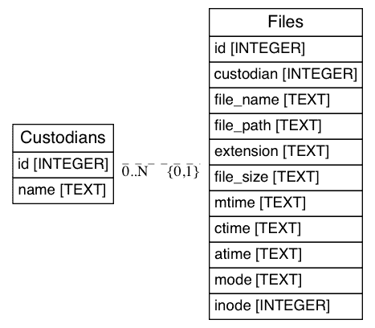
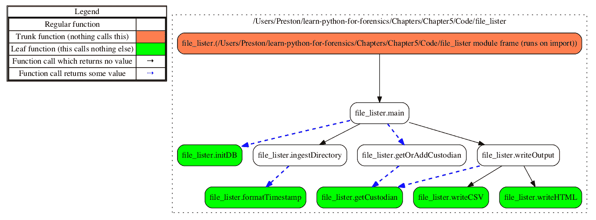
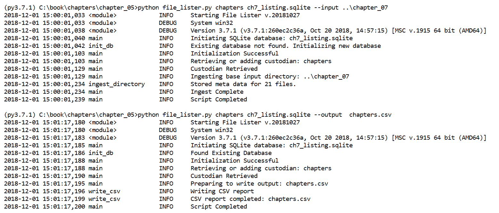
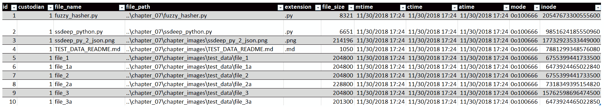
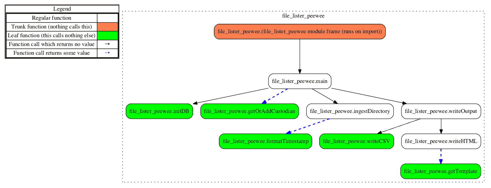
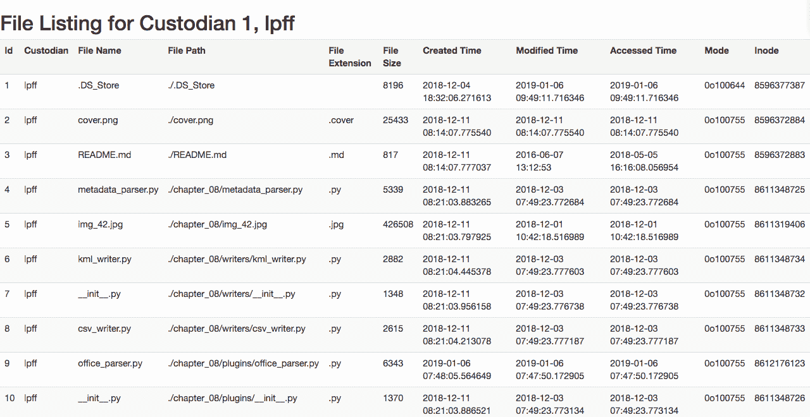

# 第五章：Python 中的数据库

在本章中，我们将在脚本中利用数据库，以便在处理大量数据时能够完成有意义的任务。通过一个简单的例子，我们将展示在 Python 脚本中使用数据库后端的功能和优势。我们将把从给定根目录递归索引的文件元数据存储到数据库中，然后查询该数据以生成报告。虽然这看起来是一个简单的任务，但本章的目的是展示我们如何通过创建一个活跃的文件列表与数据库进行交互。

在本章中，我们将深入探讨以下主题：

+   SQLite3 数据库的基本设计与实现

+   使用 Python 的内置模块和第三方模块处理这些数据库

+   理解如何在 Python 中递归遍历目录

+   理解文件系统元数据以及使用 Python 访问它的方法

+   为了方便最终用户的审阅，制作 CSV 和 HTML 格式的报告

本章的代码是在 Python 2.7.15 和 Python 3.7.1 环境下开发和测试的。`file_lister.py` 脚本是为了支持 Python 3.7.1 开发的。`file_lister_peewee.py` 脚本则在 Python 2.7.15 和 Python 3.7.1 中都进行了开发和测试。

# 数据库概述

数据库提供了一种高效的方式，以结构化的方式存储大量数据。数据库有许多种类型，通常分为两大类：**SQL** 或 **NoSQL**。**SQL**（即 **结构化查询语言**）旨在作为一种简单的语言，使用户能够操作存储在数据库中的大型数据集。这包括常见的数据库，如 MySQL、SQLite 和 PostgreSQL。NoSQL 数据库也非常有用，通常使用 JSON 或 XML 来存储具有不同结构的数据，这两者在上一章中作为常见的序列化数据类型进行了讨论。

# 使用 SQLite3

SQLite3 是 SQLite 的最新版本，是应用开发中最常见的数据库之一。与其他数据库不同，它被存储为一个单一的文件，不需要运行或安装服务器实例。因此，它因其可移植性而广泛应用于移动设备、桌面应用程序和 Web 服务中。SQLite3 使用稍微修改过的 SQL 语法，虽然 SQL 有许多变种，它仍然是其中实现较为简单的一种。自然，这种轻量级数据库也有一些限制。包括一次只能有一个写操作连接到数据库、存储限制为 140 TB，并且它不是基于客户端-服务器模式的。由于我们的应用不会同时执行多个写操作、使用的存储小于 140 TB，且不需要客户端-服务器的分布式配置，因此我们将在本章中使用 SQLite 来进行示例。

# 使用 SQL

在开发我们的代码之前，让我们先看看我们将使用的基本 SQL 语句。这将帮助我们了解如何即使不使用 Python 也能与数据库互动。在 SQL 中，命令通常使用大写字母书写，尽管它们对大小写不敏感。为了提高可读性，本练习中我们将使用大写字母。所有 SQL 语句必须以分号结尾才能执行，因为分号表示语句的结束。

如果你想一起操作，可以安装一个 SQLite 管理工具，比如命令行工具 sqlite3。这个工具可以从 [`www.sqlite.org/download.html`](https://www.sqlite.org/download.html) 下载。本节展示的输出是通过 sqlite3 命令行工具生成的，尽管给出的语句在大多数其他 sqlite3 图形应用程序中也会生成相同的数据库。如果有疑问，使用官方的 sqlite3 命令行工具。

首先，我们将创建一个表，这是任何数据库的基本组成部分。如果我们将数据库比作 Excel 工作簿，那么表就相当于工作表。表包含命名的列，以及与这些列相对应的数据行。就像 Excel 工作簿可以包含多个工作表一样，数据库也可以包含多个表。要创建一个表，我们将使用 `CREATE TABLE` 命令，指定表名，然后在括号中列出列名及其数据类型，并以逗号分隔。最后，我们用分号结束 SQL 语句：

```
>>> CREATE TABLE custodians (id INTEGER PRIMARY KEY, name TEXT);
```

如我们在 `CREATE TABLE` 语句中所见，我们在 `custodians` 表中指定了 `id` 和 `name` 列。`id` 字段是整数且为主键。在 SQLite3 中使用 `INTEGER PRIMARY KEY` 的指定将自动创建一个索引，该索引会对每个添加的行按顺序递增，从而创建唯一的行标识符索引。`name` 列的数据类型为 `TEXT`，允许任何字符作为文本字符串存储。SQLite 支持五种数据类型，其中两种我们已经介绍过：

+   `INTEGER`

+   `TEXT`

+   `REAL`

+   `BLOB`

+   `NULL`

`REAL` 数据类型允许浮动小数（例如小数）。**BLOB**（**二进制大对象**的缩写）数据类型保持任何输入数据的原样，不会将其转换为特定类型。`NULL` 数据类型只是存储一个空值。

在创建表格后，我们可以开始向其中添加数据。如以下代码块所示，我们可以使用 `INSERT INTO` 命令将数据插入到表中。此命令后的语法指定了表名、要插入数据的列，然后是 `VALUES` 命令，指定要插入的值。列和数据必须用括号括起来，如下面的代码所示。使用 `null` 语句作为值时，SQLite 的自动增量功能会介入，并用下一个可用的唯一整数填充此值。记住，只有当我们指定该列为 `INTEGER PRIMARY KEY` 时，这种自动增量才会生效。作为一般规则，表格中只能有一个列被指定为此类型：

```
>>> INSERT INTO custodians (id, name) VALUES (null, 'Chell');
>>> INSERT INTO custodians (id, name) VALUES (null, 'GLaDOS');
```

我们已经插入了两个监护人，`Chell` 和 `GLaDOS`，并让 SQLite 为它们分配了 ID。数据插入后，我们可以使用 `SELECT` 命令选择并查看这些信息。基本语法是调用 `SELECT` 命令，后面跟着要选择的列（或者用星号 `*` 来表示选择所有列）以及 `FROM` 语句，后面跟着表名，最后是一个分号。正如我们在下面的代码中看到的，`SELECT` 将打印出以管道符（`|`）分隔的存储值列表：

```
>>> SELECT * FROM custodians;
1|Chell
2|GLaDOS
```

除了仅显示我们表格中所需的列外，我们还可以基于一个或多个条件来筛选数据。`WHERE` 语句允许我们筛选结果并仅返回符合条件的项。为了本章脚本的目的，我们将坚持使用简单的 `where` 语句，并仅使用等号运算符返回符合条件的值。执行时，`SELECT-WHERE` 语句仅返回 `id` 值为 `1` 的监护人信息。此外，注意列的顺序反映了它们被指定的顺序：

```
>>> SELECT name,id FROM custodians WHERE id = 1;
Chell|1 
```

虽然还有更多操作和语句可以与 SQLite3 数据库进行交互，但前面的操作已经涵盖了我们脚本所需的所有内容。我们邀请你在 SQLite3 文档中探索更多操作，文档可以在 [`sqlite.org`](https://sqlite.org) 找到。

# 设计我们的脚本

我们脚本的第一次迭代专注于以更手动的方式使用标准模块 sqlite3 执行当前任务。这意味着我们需要写出每个 SQL 语句并执行它们，就像你直接与数据库打交道一样。虽然这不是一种非常 Pythonic 的数据库处理方式，但它展示了与 Python 一起操作数据库时所使用的方法。我们的第二次迭代使用了两个第三方库：`peewee` 和 `jinja2`。

Peewee 是一个**对象关系映射器**（**ORM**），这是一个用于描述使用对象处理数据库操作的软件套件的术语。简而言之，这个 ORM 允许开发者在 Python 中调用函数并定义类，这些函数和类会被解释为数据库命令。这个抽象层帮助标准化数据库调用，并且允许轻松地更换多个数据库后端。Peewee 是一个轻量级的 ORM，因为它只是一个支持 PostgreSQL、MySQL 和 SQLite3 数据库连接的 Python 文件。如果我们需要将第二个脚本从 SQLite3 切换到 PostgreSQL，只需要修改几行代码；而第一个脚本则需要更多的注意来处理这个转换。也就是说，我们的第一个版本除了标准的 Python 安装外，不需要任何额外的依赖项来支持 SQLite3，这对于设计为在现场使用的便携且灵活的工具来说是一个非常有吸引力的特点。

我们的 `file_lister.py` 脚本是一个按监护人收集元数据和生成报告的脚本。这在事件响应或调查的发现阶段非常重要，因为它存储有关系统或指定目录中由监护人名称标识的活动文件的信息。监护人分配系统允许通过单个监护人名称索引和分类多个机器、目录路径或网络共享，无论该监护人是用户、机器还是设备。为了实现这个系统，我们需要提示用户输入监护人名称、要使用的数据库路径以及输入或输出的信息。

通过允许检查员将多个监护人或路径添加到同一个数据库中，他们可以将找到的文件添加到单个监护人下，或者随意添加多个监护人。这对于收藏来说非常有用，因为调查人员可以根据需要保留任意数量的路径，我们都知道一旦进入现场，不可预见的设备就会出现。此外，我们可以使用相同的脚本来创建文件列表报告，无论收集的文件或监护人数量如何，只要监护人至少有一个收集的文件。

在我们的设计阶段，我们不仅考虑脚本，还考虑将要使用的数据库和关系模型。在我们的案例中，我们处理两个独立的项目：监护人和文件。它们都是很好的表格，因为它们是独立的条目，并且共享一个共同的关系。在我们的场景中，文件有一个监护人，而监护人可能有一个或多个文件；因此，我们希望创建一个外键，将文件与特定的监护人关联。外键是指向另一个表中主键的引用。主键和外键引用通常是一个唯一值或索引，用于将数据连接在一起。

以下图表示了我们数据库的关系模型。我们有两个表：custodians（管理员）和 files（文件），它们之间存在一对多关系。如前所述，这种一对多关系将允许我们将多个文件分配给单个管理员。通过这种关系，我们可以确保脚本以结构化且易于管理的方式正确地分配信息：



在这个关系模型中，例如，我们可能有一个名为 JPriest 的管理员，他拥有位于`APB/`文件夹中的文件。在这个根文件夹下，有 40,000 个文件分布在 300 个子目录中，我们需要将这 40,000 个文件都分配给 JPriest。由于管理员的名字可能很长或很复杂，我们希望为 JPriest 分配一个标识符，如整数 5，并将其写入存储在`Files`表中的每一行数据中。这样，我们实现了三件事：

+   我们节省了空间，因为我们在每一行的 40,000 个数据行中只存储了一个字符（`5`），而不是七个字符（JPriest）

+   我们维护了 JPriest 用户与其文件之间的关联

+   如果我们以后需要重命名 JPriest，我们只需更改`Custodians`表中的一行，从而更新所有关联行中的管理员名称

# 使用 Python 手动操作数据库 – file_lister.py

作为说明，脚本将仅在 Python 3 中工作，并且已经在 Python 3.7.1 版本中进行了测试。如果您在完成本节后希望查看 Python 2 版本的代码，请访问[`github.com/PacktPublishing/Learning-Python-for-Forensics`](https://github.com/PacktPublishing/Learning-Python-for-Forensics)以查看之前的版本。

在脚本的第一次迭代中，我们使用了几个标准库来完成整个操作所需的所有功能。像之前的脚本一样，我们实现了`argparse`、`csv`和`logging`，用于各自的常规功能，包括参数处理、编写 CSV 报告和记录程序执行。对于日志记录，我们在第 43 行定义了我们的日志处理器`logger`。我们导入了`sqlite3`模块来处理所有数据库操作。与我们下一次迭代不同，这个脚本只支持 SQLite 数据库。`os`模块使我们能够递归地遍历目录及其子目录中的文件。最后，`sys`模块允许我们收集有关系统的日志信息，`datetime`模块用于格式化系统中遇到的时间戳。这个脚本不需要任何第三方库。我们有以下代码：

```
001 """File metadata capture and reporting utility."""
002 import argparse
003 import csv
004 import datetime
005 import logging
006 import os
007 import sqlite3
008 import sys
...
038 __authors__ = ["Chapin Bryce", "Preston Miller"]
039 __date__ = 20181027
040 __description__ = '''This script uses a database to ingest and
041    report meta data information about active entries in
042     directories.'''
043 logger = logging.getLogger(__name__)
```

在导入语句之后，我们有 `main()` 函数，它接受以下用户输入：保管人名称、目标输入目录或输出文件，以及要使用的数据库路径。`main()` 函数处理一些高层操作，如添加和管理保管人、错误处理和日志记录。它首先初始化数据库和表格，然后检查保管人是否在数据库中。如果不在，系统会将该保管人添加到数据库中。该函数允许我们处理两种可能的运行选项：递归地导入基础目录，捕获所有子对象及其元数据，或从数据库中读取捕获的信息并使用我们的写入函数生成报告。

`init_db()` 函数由 `main()` 调用，若数据库及默认表格不存在，它将创建这些表格。`get_or_add_custodian()` 函数以类似的方式检查保管人是否存在。如果存在，它将返回保管人的 ID，否则它会创建保管人表格。为了确保保管人存在于数据库中，在添加新条目后，`get_or_add_custodian()` 函数会再次运行。

在数据库创建并且保管人表格存在之后，代码会检查源是否为输入目录。如果是，它会调用 `ingest_directory()` 函数，遍历指定的目录并扫描所有子目录，以收集与文件相关的元数据。捕获到的元数据将存储在数据库的 `Files` 表中，并通过外键与 `Custodians` 表关联，从而将每个保管人与其文件绑定。在收集元数据的过程中，我们会调用 `format_timestamp()` 函数，将收集到的时间戳转换为标准的字符串格式。

如果源是输出文件，则会调用 `write_output()` 函数，传入打开的数据库游标、输出文件路径和保管人名称作为参数。脚本接着会检查保管人是否在 `Files` 表中有任何相关结果，并根据输出文件路径的扩展名将其传递给 `write_html()` 或 `write_csv()` 函数。如果扩展名为 `.html`，则调用 `write_html()` 函数，使用 Bootstrap CSS 创建一个 HTML 表格，显示该保管人的所有响应结果。否则，如果扩展名为 `.csv`，则调用 `write_csv()` 函数，将数据写入以逗号分隔的文件。如果输出文件路径中没有提供这两种扩展名，则不会生成报告，并且会抛出错误，提示无法解析文件类型：

```
046 def main(custodian, target, db):
...
081 def init_db(db_path):
...
111 def get_or_add_custodian(conn, custodian):
...
132 def get_custodian(conn, custodian):
...
148 def ingest_directory(conn, target, custodian_id):
...
207 def format_timestamp(timestamp):
...
219 def write_output(conn, target, custodian):
...
254 def write_csv(conn, target, custodian_id):
...
280 def write_html(conn, target, custodian_id, custodian_name):
```

现在，让我们来看看这个脚本所需的参数和设置。在第 321 行到第 339 行之间，我们构建了 `argparse` 命令行接口，其中包括必需的位置参数 `CUSTODIAN` 和 `DB_PATH`，以及可选的参数 `--input`、`--output` 和 `-l`：

```
320 if __name__ == '__main__':
321     parser = argparse.ArgumentParser(
322     description=__description__,
323     epilog='Built by {}. Version {}'.format(
324         ", ".join(__authors__), __date__),
325     formatter_class=argparse.ArgumentDefaultsHelpFormatter
326     )
327     parser.add_argument(
328         'CUSTODIAN', help='Name of custodian collection is of.')
329     parser.add_argument(
330         'DB_PATH', help='File path and name of database to '
331                         'create or append metadata to.')
332     parser.add_argument(
333         '--input', help='Base directory to scan.')
334     parser.add_argument(
335         '--output', help='Output file to write to. use `.csv` '
336                          'extension for CSV and `.html` for HTML')
337     parser.add_argument(
338         '-l', help='File path and name of log file.')
339     args = parser.parse_args()
```

在第 341 到 347 行，我们检查用户是否提供了`--input`或`--output`参数。我们创建了一个变量`arg_source`，它是一个元组，包含操作模式和由参数指定的相应路径。如果两个模式参数都没有提供，则会引发`ArgumentError`并提示用户提供输入或输出。这确保了当存在一个或多个选项时，用户提供了所需的参数：

```
341     if args.input:
342         arg_source = ('input', args.input)
343     elif args.output:
344         arg_source = ('output', args.output)
345     else:
346        raise argparse.ArgumentError(
347            'Please specify input or output')
```

在第 349 到 368 行，我们可以看到我们在前几章中使用的日志配置，并检查`-l`参数，根据需要创建日志路径。我们还在第 366 到 368 行记录了脚本版本和操作系统信息：

```
349     if args.l:
350         if not os.path.exists(args.l):
351             os.makedirs(args.l) # create log directory path
352         log_path = os.path.join(args.l, 'file_lister.log')
353     else:
354         log_path = 'file_lister.log'
355 
356     logger.setLevel(logging.DEBUG)
357     msg_fmt = logging.Formatter("%(asctime)-15s %(funcName)-20s"
358         "%(levelname)-8s %(message)s")
359     strhndl = logging.StreamHandler(sys.stdout)
360     strhndl.setFormatter(fmt=msg_fmt)
361     fhndl = logging.FileHandler(log_path, mode='a')
362     fhndl.setFormatter(fmt=msg_fmt)
363     logger.addHandler(strhndl)
364     logger.addHandler(fhndl)
365 
366     logger.info('Starting File Lister v.' + str(__date__))
367     logger.debug('System ' + sys.platform)
368     logger.debug('Version ' + sys.version)
```

完成日志配置后，我们可以创建一个字典，定义通过 kwargs 传递给`main()`函数的参数。Kwargs（关键字参数）提供了一种以字典键值对的形式传递参数的方法，其中键与参数名称匹配，并赋予相应的值。为了将字典作为 kwargs 而不是单一值传递给函数或类，我们必须在字典名称前加上两个星号，如第 373 行所示。如果没有使用 kwargs，我们就必须将`args.custodian`、`arg_source`和`args.db_path`参数作为单独的位置参数传递。kwargs 具有更高级的功能，相关示例可以在[`docs.python.org/3.7/faq/programming.html`](https://docs.python.org/3.7/faq/programming.html#how-can-i-pass-optional-or-keyword-parameters-from-one-function-to-another)找到。我们有以下代码：

```
370     args_dict = {'custodian': args.CUSTODIAN,
371                  'target': arg_source, 'db': args.DB_PATH}
372 
373     main(**args_dict)
```

请参考以下流程图，了解每个功能是如何相互连接的：



# 构建`main()`函数

`main()`函数分为两个阶段：数据库初始化和输入/输出（I/O）处理。数据库初始化（包括文档字符串）发生在第 46 到 57 行，在这部分我们定义并记录了函数的输入。请注意，输入变量与作为关键字参数传递给函数的`args_dict`的键匹配。如果`args_dict`没有定义这些确切的键，我们在调用函数时会收到`TypeError`。参见以下代码：

```
046 def main(custodian, target, db):
047     """
048     The main function creates the database or table, logs
049         execution status, and handles errors
050     :param custodian: The name of the custodian
051     :param target: tuple containing the mode 'input' or 'output'
052         as the first elemnet and a file path as the second
053     :param db: The filepath for the database
054     :return: None
055     """
```

在第 57 行，我们调用`init_db()`函数，传递数据库的路径，并将返回的数据库连接赋值给`conn`变量。数据库连接对象由`sqlite3` Python 库处理。我们使用这个对象与数据库进行通信，将所有的 Python 调用转化为 SQL 语句。通过连接对象，我们可以调用游标对象。游标是用于通过连接发送和接收数据的对象；我们将在需要与数据库交互的函数中定义它，因为我们希望将游标的作用范围限制，而可以在不同函数间共享数据库连接：

```
056     logger.info('Initiating SQLite database: ' + db)
057     conn = init_db(db)
```

在额外的日志记录后，我们调用`get_or_add_custodian()`，将连接对象和托管人名称传递给该函数。通过传递打开的连接，我们允许该函数与数据库交互并定义自己的游标。如果找到`custodian_id`，我们继续执行并跳过第 61 行的`while`循环；否则，我们重新运行`get_or_add_custodian()`函数，直到我们添加托管人并获取托管人 ID：

```
058     logger.info('Initialization Successful')
059     logger.info('Retrieving or adding custodian: ' + custodian)
060     custodian_id = get_or_add_custodian(conn, custodian)
061     while not custodian_id:
062         custodian_id = get_or_add_custodian(conn, custodian)
063     logger.info('Custodian Retrieved')
```

一旦我们有了一个托管人 ID 需要处理，我们需要确定源是指定为输入还是输出。如果在第 64 行源是`input`，则我们运行`ingest_directory()`函数，该函数遍历提供的根目录并收集有关任何子文件的相关元数据。完成后，我们将更改提交（保存）到数据库并记录完成情况：

```
064     if target[0] == 'input':
065         logger.info('Ingesting base input directory: {}'.format(
066             target[1]))
067         ingest_directory(conn, target[1], custodian_id)
068         conn.commit()
069         logger.info('Ingest Complete')
```

如果源是`output`，则调用`write_output()`函数来处理以指定格式写入输出。如果无法确定源类型，我们将引发`argparse.ArgumentError`错误，声明无法解释参数。运行所需模式后，我们通过关闭数据库连接并记录脚本完成情况来结束函数，如下所示：

```
070     elif target[0] == 'output':
071         logger.info('Preparing to write output: ' + target[1])
072         write_output(conn, target[1], custodian)
073     else:
074         raise argparse.ArgumentError(
075             'Could not interpret run time arguments')
076 
077     conn.close()
078     logger.info('Script Completed')
```

# 使用 init_db()函数初始化数据库

`init_db()`函数在`main()`函数的第 87 行被调用，用于执行创建数据库和初始化结构的基本任务。首先，我们需要检查数据库是否已经存在，如果存在，则连接到它并返回连接对象。无论文件是否存在，我们都可以使用`sqlite3`库的`connect()`方法打开或创建一个文件作为数据库。这个连接用于允许 Python 对象与数据库之间的通信。我们还专门使用一个游标对象，在第 94 行分配为`cur`，来跟踪我们在已执行语句中的位置。这个游标是与数据库交互所必需的：

```
081     def init_db(db_path):
082     """
083     The init_db function opens or creates the database
084     :param db_path: The filepath for the database
085     :return: conn, the sqlite3 database connection
086     """
087     if os.path.exists(db_path):
088         logger.info('Found Existing Database')
089         conn = sqlite3.connect(db_path)
090     else:
091         logger.info('Existing database not found. '
092                     'Initializing new database')
093         conn = sqlite3.connect(db_path)
094         cur = conn.cursor()
```

如果数据库不存在，那么我们必须创建一个新的数据库，连接到它，并初始化表格。如本章 SQL 部分所述，我们必须使用`CREATE TABLE`语句创建这些表格，并后跟列名及其数据类型。在`Custodians`表中，我们需要创建一个自动递增的`id`列，用于为`name`列提供标识符，该列将存储托管人的名称。

要做到这一点，我们必须首先在第 96 行的`sql`变量中构建查询。赋值后，我们将这个变量传递给`cur.execute()`方法，通过游标对象执行我们的 SQL 语句。此时，游标与之前的连接对象进行通信，后者再与数据库进行交流。请查看以下代码：

```
096         sql = """CREATE TABLE Custodians (
097                  cust_id INTEGER PRIMARY KEY, name TEXT);"""
098         cur.execute(sql)
```

在第 99 行，我们使用`PRAGMA`创建另一个 SQL 查询，它允许我们修改数据库的配置。默认情况下，在 SQLite3 中，外键是禁用的，这阻止了我们在一个表中引用另一个表中的数据。通过使用`PRAGMA`语句，我们可以通过将`foreign_keys`设置为`1`来启用此功能：

```
099         cur.execute('PRAGMA foreign_keys = 1;')
```

我们重复创建`Files`表的过程，添加更多字段以记录文件的元数据。在第 100 到 105 行，我们列出了字段名称及其关联的数据类型。我们可以通过使用三重引号将该字符串跨越多行，并让 Python 将其解释为一个单一的字符串值。正如我们已经看到的，我们需要列来存储 ID（与`Custodians`表类似），文件名、文件路径、扩展名、大小、修改时间、创建时间、访问时间、模式和 inode 号。

`mode`属性指定文件的权限，基于 UNIX 权限标准，而`inode`属性是 UNIX 系统中唯一标识文件系统对象的编号。这两个元素将在*理解 ingest_directory()函数*部分中进一步描述，在那里它们从文件中提取。在创建了两个表并定义了它们的结构后，我们在第 106 行执行最终的 SQL 语句并返回连接对象：

```
100         sql = """CREATE TABLE Files(id INTEGER PRIMARY KEY,
101             custodian INTEGER NOT NULL, file_name TEXT,
102             file_path TEXT, extension TEXT, file_size INTEGER,
103             mtime TEXT, ctime TEXT, atime TEXT, mode TEXT,
104             inode INTEGER, FOREIGN KEY (custodian)
105             REFERENCES Custodians(cust_id));"""
106         cur.execute(sql)
107         conn.commit()
108     return conn
```

# 使用 get_or_add_custodian()函数检查保管人

此时，数据库已初始化并准备好进行进一步的交互。调用`get_or_add_custodian()`函数来检查保管人是否存在，并在找到时传递其 ID。如果保管人不存在，函数将把保管人添加到`Custodians`表中。在第 120 行，我们调用`get_custodian()`函数来检查保管人是否存在。在第 122 行，我们使用条件语句检查`id`是否为空，如果不是，则将保管人的 ID 赋值给`cust_id`变量。SQLite 库返回的是元组，以确保向后兼容，第一个元素将是我们关心的 ID：

```
111 def get_or_add_custodian(conn, custodian):
112     """
113     The get_or_add_custodian function checks the database for a
114         custodian and returns the ID if present;
115         Or otherwise creates the custodian
116     :param conn: The sqlite3 database connection object
117     :param custodian: The name of the custodian
118     :return: The custodian ID or None
119     """
120     cust_id = get_custodian(conn, custodian)
121     cur = conn.cursor()
122     if cust_id:
123         cust_id = cust_id[0]
```

如果没有找到保管人，我们会将其插入表中以供将来使用。在第 125-126 行，我们编写一个 SQL 语句将保管人插入到`Custodians`表中。注意`VALUES`部分的`null`字符串；它被 SQLite 解释为`NoneType`对象。SQLite 将主键字段中的`NoneType`对象转换为自增整数。紧随其后的`null`值是我们的保管人字符串。SQLite 要求字符串值用引号括起来，类似于 Python。

我们必须使用双引号将包含单引号的查询括起来。这可以防止由于引号错误导致字符串断裂的任何问题。如果在代码的这一部分看到语法错误，请务必检查第 125-126 行中使用的引号。

最后，我们执行此语句并返回空的`cust_id`变量，这样`main()`函数就必须再次检查数据库中的保管员，并重新运行该函数。下一次执行应该能检测到我们插入的值，并允许`main()`函数继续执行。我们有以下代码：

```
124     else:
125         sql = """INSERT INTO Custodians (cust_id, name) VALUES
126             (null, '{}') ;""".format(custodian)
127         cur.execute(sql)
128         conn.commit()
129     return cust_id
```

尽管我们可以在此处调用`get_custodian()`函数（或在插入后获取 ID）进行验证，但我们让`main()`函数再次检查保管员。可以自由实现这些替代解决方案之一，看看它们如何影响代码的性能和稳定性。

# 使用`get_custodian()`函数获取保管员

`get_custodian()`函数被调用以从 SQLite 数据库中检索保管员 ID。使用简单的`SELECT`语句，我们从`Custodian`表中选择`id`列，并根据用户提供的名称与`name`列进行匹配。我们使用字符串的`format()`方法将保管员名称插入到 SQL 语句中。请注意，我们仍然需要将插入的字符串用单引号包裹起来，如下所示：

```
132     def get_custodian(conn, custodian):
133     """
134     The get_custodian function checks the database for a
135         custodian and returns the ID if present
136     :param conn: The sqlite3 database connection object
137     :param custodian: The name of the custodian
138     :return: The custodian ID
139     """
140     cur = conn.cursor()
141     sql = "SELECT cust_id FROM Custodians "\
142         "WHERE name='{}';".format(custodian)
```

执行此语句后，我们在第 144 行使用`fetchone()`方法从语句中返回一个结果。这是我们的脚本首次从数据库请求数据。为了获取数据，我们使用`fetchone()`、`fetchmany()`或`fetchall()`中的任何一个方法，从执行的语句中收集数据。这三个方法仅适用于游标对象。在这里，`fetchone()`方法是更好的选择，因为我们预期该语句返回一个单一的保管员。这个保管员 ID 被捕获并存储在`data`变量中：

```
143     cur.execute(sql)
144     data = cur.fetchone()
145     return data
```

# 理解`ingest_directory()`函数

`ingest_directory()`函数处理我们脚本的输入模式，并递归捕获用户提供的根目录中文件的元数据。在第 158 行，我们在`count`变量之前设置了数据库游标，该变量将记录存储在`Files`表中的文件数量：

```
148     def ingest_directory(conn, target, custodian_id):
149     """
150     The ingest_directory function reads file metadata and stores
151         it in the database
152     :param conn: The sqlite3 database connection object
153     :param target: The path for the root directory to
154         recursively walk
155     :param custodian_id: The custodian ID
156     :return: None
157     """
158     cur = conn.cursor()
159     count = 0
```

该函数最重要的部分是第 160 行的`for`循环。此循环使用`os.walk()`方法将提供的目录路径拆分成一个可迭代数组，供我们逐步遍历。`os.walk()`方法有三个组成部分，它们通常命名为`root`、`folders`和`files`。`root`值是一个字符串，表示我们在特定循环迭代过程中当前遍历的基本目录路径。当我们遍历子文件夹时，它们会被附加到`root`值中。`folders`和`files`变量分别提供当前根目录内文件夹和文件名的列表。尽管可以根据需要重命名这些变量，但这是一个良好的命名约定，有助于避免覆盖 Python 语句，例如`file`或`dir`，这些在 Python 中已经被使用。不过，在此实例中，我们不需要`os.walk()`中的`folders`列表，因此我们将其命名为一个单下划线（`_`）：

```
160     for root, _, files in os.walk(target):
```

这是为未在代码中使用的变量赋值的常见做法。因此，仅使用单个下划线表示未使用的数据。尽可能地，尝试重新设计代码，避免返回不需要的值。

在循环中，我们开始遍历`files`列表，以访问每个文件的信息。在第 162 行，我们创建了一个文件专属的字典`meta_data`，用来存储收集到的信息，具体如下：

```
161         for file_name in files:
162             meta_data = dict()
```

在第 163 行，我们使用 try-except 语句块来捕捉任何异常。我们知道我们曾说过不要这么做，但请先听我们解释。这种通用的异常捕获机制是为了确保在发现的文件中出现的任何错误不会导致脚本崩溃和停止执行。相反，文件名和错误信息将被写入日志，然后跳过该文件并继续执行。这有助于检查人员快速定位和排除特定文件的故障。这一点非常重要，因为某些错误可能在 Windows 系统上由于文件系统标志和命名规则而导致 Python 出现错误。而在 macOS 和 Linux/UNIX 系统上则可能会出现不同的错误，这使得很难预测脚本会在哪些情况下崩溃。这正是日志记录重要性的一个极好例子，因为我们可以回顾脚本生成的错误。

在 try-except 语句块中，我们将文件元数据的不同属性存储到字典的键中。首先，我们在第 163 行和第 164 行记录文件名和完整路径。注意，字典的键与它们在`Files`表中所属列的名称相同。这个格式将使我们在脚本后续的操作中更加方便。文件路径使用`os.path.join()`方法进行存储，该方法将不同的路径合并为一个，使用操作系统特定的路径分隔符。

在第 167 行，我们通过使用`os.path.splitext()`方法来获取文件扩展名，该方法会根据文件名中最后一个`.`之后的部分进行分割。由于第 167 行的函数会创建一个列表，我们选择最后一个元素以确保我们保存扩展名。在某些情况下，文件可能没有扩展名（例如`.DS_Store`文件），在这种情况下，返回列表中的最后一个值是一个空字符串。请注意，这个脚本并没有检查文件签名来确认文件类型是否与扩展名匹配；检查文件签名的过程可以自动化：

```
163             try:
164                 meta_data['file_name'] = file_name
165                 meta_data['file_path'] = os.path.join(root,
166                                                       file_name)
167                 meta_data['extension'] = os.path.splitext(
168                     file_name)[-1]
```

# 探索`os.stat()`方法

在第 170 行，我们使用`os.stat()`来收集文件的元数据。此方法访问系统的`stat`库以收集提供的文件的信息。默认情况下，该方法返回一个对象，包含有关每个文件的所有可用数据。由于这些信息在平台之间有所不同，我们仅选择了脚本中最具跨平台特性的属性，如`os`库文档中所定义的；更多信息可以在[`docs.python.org/3/library/os.html#os.stat_result`](https://docs.python.org/3/library/os.html#os.stat_result)中找到。此列表包括创建时间、修改时间、访问时间、文件模式、文件大小、inode 号和模式。SQLite 将接受字符串格式的数据类型，尽管我们将以正确的数据类型将其存储在脚本中，以防我们需要修改它们或使用特定类型的特殊特性。

文件模式最好以八进制整数形式显示，因此我们必须使用 Python 的`oct()`函数将其转换为可读状态，如第 171 行所示：

```
170                 file_stats = os.stat(meta_data['file_path'])
171                 meta_data['mode'] = str(oct(file_stats.st_mode))
```

文件模式是一个三位数的整数，表示文件对象的读、写和执行权限。权限定义在下表中，使用数字 0-7 来确定分配的权限。每一位数字表示文件所有者、文件所属组以及所有其他用户的权限。例如，数字 777 表示任何人都具有完全权限，而 600 意味着只有所有者可以读取和写入文件。除了每个数字，八进制表示法允许我们通过添加数字来为文件分配额外的权限。例如，值 763 授予所有者完全权限（700），授予组读取和写入权限（040 + 020），并授予其他人写和执行权限（002 + 001）。你可能永远不会看到 763 作为权限设置，尽管它在这里是一个有趣的例子：

| **权限** | **描述** |
| --- | --- |
| 700 | 文件所有者完全权限 |
| 400 | 所有者具有读权限 |
| 200 | 所有者具有写权限 |
| 100 | 所有者具有执行权限 |
| 070 | 完全组权限 |
| 040 | 组具有读权限 |
| 020 | 组具有写权限 |
| 010 | 组具有执行权限 |
| 007 | 其他人（不在该组或所有者之外）具有完全权限 |
| 004 | 其他人具有读权限 |
| 002 | 其他人具有写权限 |
| 001 | 其他人具有执行权限 |

下表显示了由 Python 的`os.stat()`方法提供的额外文件类型信息。表中的三个井号表示我们刚刚讨论的文件权限在数字中的位置。下表的前两行不言自明，符号链接表示指向文件系统中其他位置的引用。例如，在下表中，值 100777 表示一个常规文件，所有者、组和其他用户都具有完全权限。虽然可能需要一些时间来适应，但这个系统对于识别文件权限及其访问权限非常有用：

| **文件类型** | **描述** |
| --- | --- |
| 040### | 目录 |
| 100### | 常规文件 |
| 120### | 符号链接 |

`inode`值是文件系统对象的唯一标识符，这是我们将在第 172 行捕获的下一个值。尽管这是仅在 Linux/UNIX/macOS 系统中找到的特性，但 Python 会将 NTFS 的记录号转换为相同的对象，以保持一致性。在第 173 行，我们为文件大小赋值，文件大小以分配的字节数作为整数表示。在第 174 行到第 179 行，我们按顺序将访问、修改和创建的时间戳赋值给字典。每个时间戳都使用我们的`format_timestamps()`函数将浮动值转换为字符串。我们现在已经收集了完成`Files`表中一行所需的数据：

```
172                 meta_data['inode'] = int(file_stats.st_ino)
173                 meta_data['file_size'] = int(file_stats.st_size)
174                 meta_data['atime'] = format_timestamp(
175                     file_stats.st_atime)
176                 meta_data['mtime'] = format_timestamp(
177                     file_stats.st_mtime)
178                 meta_data['ctime'] = format_timestamp(
179                     file_stats.st_ctime)
```

本节前面提到的异常在第 180 行定义，并记录在收集元数据过程中遇到的任何错误：

```
180             except Exception as e:
181                 logger.error(
182                     'Error processing file: {} {}'.format(
183                         meta_data.get('file_path', None),
184                         e.__str__()))
```

最后，在我们的`try-except`语句块之外，我们将`custodian_id`添加到我们的`meta_data`字典中，这样我们就可以将其与记录一起存储。现在，我们可以构造用于插入新文件元数据记录的 SQL 语句。正如我们之前所看到的，我们将在第 186 行构造一个插入语句，并为列名和值名添加占位符。使用`.format()`方法，我们将插入我们的`meta_data`键和值数据。在第 187 行，我们将`meta_data`的键连接成一个字符串，每个键之间用双引号和逗号分隔。在第 188 行，我们将一个由逗号分隔的列表连接起来，为每个值插入一个问号作为`execute()`调用的占位符。以下是生成的`sql`变量中的字符串示例：

```
INSERT INTO Files
    ("custodian","ctime","mtime","extension","inode",
     "file_size","file_name","mode","atime","file_path")
VALUES 
    (?, ?, ?, ?, ?, ?, ?, ?, ?, ?)
```

这样，我们就可以在第 189-190 行的`try`块中看到我们值的列表，并将其传递给 SQLite3 Python 库，以便为数据库生成正确的插入语句。我们需要将字典值转换为元组，以便 SQLite3 支持，如第 190 行的调用所示：

```
185             meta_data['custodian'] = custodian_id
186             sql = 'INSERT INTO Files ("{}") VALUES ({})'.format(
187                 '","'.join(meta_data.keys()),
188                 ', '.join('?' for x in meta_data.values()))
189             try:
190                 cur.execute(sql, tuple(meta_data.values()))
```

现在，我们可以关闭我们的`except`语句块，并为 SQLite3 库的错误提供错误处理和日志记录，错误发生在第 191 行到第 197 行。在错误处理之后，我们将文件处理计数增加 1，并继续处理下一个文件，该文件可以在我们的两个`for`循环中的任意一个中找到：

```
191             except (sqlite3.OperationalError,
192                     sqlite3.IntegrityError) as e:
193                 logger.error(
194                     "Could not insert statement {}"
195                     " with values: {}".format(
196                         sql, meta_data.values()))
197                 logger.error("Error message: {}".format(e))
198             count += 1
```

一旦我们最内层的`for`循环完成，我们使用`commit()`方法将新记录保存到数据库中。在外层`for`循环完成后，我们再次运行`commit()`方法，然后记录目录处理完成，并向用户提供已处理文件的数量：

```
199         conn.commit()
200     conn.commit()
201     logger.info('Stored meta data for {} files.'.format(count))
```

# 开发`format_timestamp()`辅助函数

这个相对较小的函数将整数时间戳转换为人类可读的字符串。由于 Python 的`os.stat()`模块返回的是自纪元（1970 年 1 月 1 日）以来的秒数，我们需要使用`datetime`库来进行转换。通过使用`datetime.datetime.fromtimestamp()`函数，我们可以将浮动时间戳解析为`datetime`对象，本文中我们将其命名为`ts_datetime`，并在第 211 行进行赋值。将日期作为`datetime`对象后，我们可以在第 212 行使用`strftime()`方法按所需格式`YYYY-MM-DD HH:MM:SS`格式化日期。字符串准备好后，我们将其返回给调用函数，以便插入到数据库中：

```
204 def format_timestamp(timestamp):
205     """
206     The format_timestamp function formats an integer to a string
207     timestamp
208     :param timestamp: An integer timestamp
209     :return: ts_format, a formatted (YYYY-MM-DD HH:MM:SS) string
210     """
211     ts_datetime = datetime.datetime.fromtimestamp(timestamp)
212     ts_format = ts_datetime.strftime('%Y-%m-%d %H:%M:%S')
213     return ts_format
```

这样的小型实用函数在较大的脚本中非常有用。一个优势是，如果我们想更新日期格式，只需在一个地方更改，而不必逐一查找所有`strftime()`的用法。这个小函数还提高了代码的可读性。`ingest_directory()`函数已经相当庞大，如果将这一逻辑重复三次，可能会使下一个审查代码的人感到困惑。这些函数在字符串格式化或常见转换中非常有用，但在设计自己的脚本时，可以考虑创建哪些实用函数来简化工作。

# 配置`write_output()`函数

如果用户指定了输出目标，则会调用`write_output()`函数。调用后，我们使用`get_custodian()`函数从数据库中选择看护人 ID，该函数在第 225 行被调用。如果找到了看护人，我们需要构建一个新的查询来确定与看护人关联的文件数量，使用`COUNT()` SQL 函数。如果未找到看护人，会记录错误，提示用户看护人未响应，具体内容见第 234 到 237 行：

```
216 def write_output(conn, target, custodian):
217     """
218     The write_output function handles writing either the CSV or
219     HTML reports
220     :param conn: The sqlite3 database connection object
221     :param target: The output filepath
222     :param custodian: Name of the custodian
223     :return: None
224     """
225     custodian_id = get_custodian(conn, custodian)
226     cur = conn.cursor()
227     if custodian_id:
228         custodian_id = custodian_id[0]
229         sql = "SELECT COUNT(id) FROM Files "\
230               "where custodian = {}".format(
231                   custodian_id)
232         cur.execute(sql)
233         count = cur.fetchone()
234     else:
235         logger.error(
236             'Could not find custodian in database. Please check '
237             'the input of the custodian name and database path')
```

如果找到了看护人并且存储的文件数量大于零，我们将检查要生成哪种类型的报告。从第 239 行开始的条件语句检查`count`的大小和源文件的扩展名。如果`count`不大于零或没有值，则会在第 240 行记录错误。否则，我们在第 241 行检查 CSV 文件扩展名，在第 243 行检查 HTML 文件扩展名，如果找到匹配项，则调用相应的函数。如果源文件扩展名既不是 CSV 也不是 HTML，则会记录错误，表明无法确定文件类型。最后，如果代码执行到第 247 行的`else`语句，则会记录一个未知错误发生的事实。我们可以在以下代码中看到这一过程：

```
239     if not count or not count[0] > 0:
240         logger.error('Files not found for custodian')
241     elif target.endswith('.csv'):
242         write_csv(conn, target, custodian_id)
243     elif target.endswith('.html'):
244         write_html(conn, target, custodian_id, custodian)
245     elif not (target.endswith('.html')or target.endswith('.csv')):
246         logger.error('Could not determine file type')
247     else:
248         logger.error('Unknown Error Occurred')
```

# 设计 `write_csv()` 函数

如果文件扩展名是 CSV，我们可以开始迭代存储在文件表中的条目。第 261 行的 SQL 语句使用 `WHERE` 语句仅识别与特定保管员相关的文件。返回的 `cur.description` 值是一个元组的元组，每个嵌套元组中有八个元素，表示我们的列名。每个元组中的第一个值是列名，其余七个是空字符串，作为向后兼容的目的保留。通过在第 265 行使用列表推导式，我们遍历这些元组，选择返回元组中每个项的第一个元素，构建列名列表。这条单行语句使我们能够将一个简单的 for 循环压缩成一条生成所需列表的语句：

```
251 def write_csv(conn, target, custodian_id):
252     """
253     The write_csv function generates a CSV report from the
254     Files table
255     :param conn: The Sqlite3 database connection object
256     :param target: The output filepath
257     :param custodian_id: The custodian ID
258     :return: None
259     """
260     cur = conn.cursor()
261     sql = "SELECT * FROM Files where custodian = {}".format(
262         custodian_id)
263     cur.execute(sql)
264 
265     cols = [description[0] for description in cur.description]
```

列表推导式是一种简洁的通过单行 for 循环生成列表的方法。通常用于过滤列表内容或进行某种形式的转换。在第 265 行，我们使用它进行结构转换，从 `cur.description` 列表的每个元素中仅提取第一个项，并将其存储为列名。这是因为 Python 的 SQLite 绑定将列名作为嵌套元组返回，其中每个子元组的第一个元素是列名。

在准备好列名后，我们记录下正在写入 CSV 报告，并在第 267 行以 `wb` 模式打开输出文件。然后，我们通过在第 268 行调用 `csv.writer()` 方法并传递文件对象来初始化写入器。打开文件后，我们通过调用 `csv_writer` 对象的 `writerow()` 方法写入列行，每次写入一行。

此时，我们将通过迭代游标来循环结果，游标将在每次循环迭代时返回一行，直到没有更多的行响应原始查询为止。对于每一行返回的结果，我们需要再次调用 `writerow()` 方法，如第 272 行所示。然后，我们在第 273 行将新数据刷新到文件中，以确保数据写入磁盘。最后，我们记录报告已完成并存储在用户指定的位置。我们有以下代码：

```
266     logger.info('Writing CSV report')
267     with open(target, 'w', newline="") as csv_file:
268         csv_writer = csv.writer(csv_file)
269         csv_writer.writerow(cols)
270 
271         for entry in cur:
272             csv_writer.writerow(entry)
273         csv_file.flush()
274     logger.info('CSV report completed: ' + target)
```

# 编写 `write_html()` 函数

如果用户指定了 HTML 报告，则会调用 `write_html()` 函数从数据库读取数据，生成数据的 HTML 标签，并使用 Bootstrap 样式创建包含文件元数据的表格。由于这是 HTML 格式，我们可以自定义它，创建一个专业外观的报告，该报告可以转换为 PDF 或通过任何具有网页浏览器的用户查看。如果在你的报告版本中额外的 HTML 元素证明是有用的，它们可以轻松地添加到以下字符串中，并通过添加徽标、扩展高亮、响应式表格、图表等进行自定义，只要你使用各种网页样式和脚本，这一切都是可能的。

由于本书专注于 Python 脚本的设计，我们不会详细讲解 HTML、CSS 或其他网页设计语言。在使用这些功能时，我们将描述它们的基本用途和如何实现它们，尽管如果你有兴趣，我们建议你使用相关资源（例如[`www.w3schools.com`](http://www.w3schools.com)）来深入了解这些话题。

这个函数的开始与 `write_csv()` 类似：我们在 287 行的 SQL 语句中选择属于托管人的文件。执行后，我们再次在 291 行使用列表推导式收集 `cols`。通过列名，我们使用 `join()` 函数在 292 行定义 `table_header` HTML 字符串，并通过 `<th></th>` 标签将每个值分隔开。除了第一个和最后一个元素外，其他每个元素都会被 `<th>{{ element }}</th>` 标签包围。现在，我们需要关闭第一个和最后一个元素的标签，以确保它们形成正确的表头。对于字符串的开始部分，我们添加 `<tr><th>` 标签来定义整个行的表格行 `<tr>` 和第一个条目的表头 `<th>`。同样，我们在 293 行字符串的末尾关闭表头和表格行标签，内容如下：

```
277 def write_html(conn, target, custodian_id, custodian_name):
278     """
279     The write_html function generates an HTML report from the
280         Files table
281     :param conn: The sqlite3 database connection object
282     :param target: The output filepath
283     :param custodian_id: The custodian ID
284     :return: None
285     """
286     cur = conn.cursor()
287     sql = "SELECT * FROM Files where custodian = {}".format(
288         custodian_id)
289     cur.execute(sql)
290 
291     cols = [description[0] for description in cur.description]
292     table_header = '</th><th>'.join(cols)
293     table_header = '<tr><th>' + table_header + '</th></tr>'
294 
295     logger.info('Writing HTML report')
```

在 297 行，我们以 `w` 模式打开 HTML 文件，将其赋值给 `html_file` 变量。文件打开后，我们开始构建 HTML 代码，从 298 行的 `<html><body>` 标签开始，这些标签用于初始化 HTML 文档。接着，我们连接到托管在线的自定义样式表，以为表格提供 Bootstrap 样式。我们通过使用 `<link>` 标签来实现这一点，指定样式表的类型和来源，样式表位于 [`www.bootstrapcdn.com/`](https://www.bootstrapcdn.com/)。

现在，让我们定义 HTML 报告的头部，以确保它包含托管人 ID 和姓名。我们将使用`<h1></h1>`或标题 1 标签来实现这一点。对于我们的表格，我们在 302 行使用表格标签，并使用我们想要实现的 Bootstrap 样式（`table`、`table-hover` 和 `table-striped`）。

获取有关 Bootstrap 的更多信息，请访问[`getbootstrap.com`](http://getbootstrap.com)。虽然本脚本使用的是 Bootstrap CSS 版本 3.3.5，但你可以探索 Bootstrap 的最新更新，并查看是否能在你的代码中实现新的功能。

在 HTML 字符串中加入这些头部信息后，我们可以将其写入文件，首先在 304 行写入 HTML 头部和样式表信息，然后在 305 行写入表格的列名，内容如下：

```
297     with open(target, 'w') as html_file:
298         html_string = """<html><body>\n
299             <link rel="stylesheet"
300             href="https://maxcdn.bootstrapcdn.com/bootstrap/3.3.5/css/bootstrap.min.css">
301             <h1>File Listing for Custodian ID: {}, {}</h1>\n
302             <table class='table table-hover table-striped'>\n
303             """.format(custodian_id, custodian_name)
304             html_file.write(html_string)
305             html_file.write(table_header)
```

现在，让我们遍历数据库中的记录，将它们作为单独的行写入表格。我们首先通过连接表格数据标签（`<td></td>`）来指定表格单元格的内容，使用列表推导式在 308 行对数据进行连接，并将其转换为 `join()` 方法所需的字符串值：

```
307         for entry in cur:
308             row_data = "</td><td>".join(
309                 [str(x) for x in entry])
```

在第 310 行，我们添加了一个换行符（`\n`），然后是一个`<tr>`表格行标签和初始的`<td>`标签，用于打开第一个元素的表格数据。换行符减少了某些 HTML 查看器的加载时间，因为它将数据分割成多行。我们还需要在第 310 行的末尾关闭最后一个表格数据标签和整个表格行。行数据会在第 311 行写入文件。最后，在表格行的循环中，我们使用`.flush()`方法将内容刷新到文件。随着表格数据的构建，我们可以在第 313 行关闭表格、主体和 HTML 标签。跳出`for`循环后，我们在第 315 行记录报告的状态和位置：

```
310             html_string = "\n<tr><td>" + row_data + "</td></tr>"
311             html_file.write(html_string)
312             html_file.flush()
313         html_string = "\n</table>\n</body></html>"
314         html_file.write(html_string)
315     logger.info('HTML Report completed: ' + target)
```

# 运行脚本

在这一版本中，我们突出展示了递归读取目录中所有文件元数据、将其存储到数据库、从数据库中提取并基于数据生成报告的过程。本版本使用了基本的库来手动处理必要的 SQL 和 HTML 操作。下一版本将专注于使用 Python 对象执行相同的功能。这两个版本都是脚本的最终版本，并且功能完全可用。不同的版本展示了实现相同任务的不同方法。

要运行我们的脚本，首先需要提供管理员的名称、要创建或读取的数据库位置以及所需的模式。在第一个示例中，我们指定了输入模式并传递了根目录以进行索引。在第二个示例中，我们以输出模式创建了一个 CSV 报告，并提供了适当的文件路径：



前面脚本的输出可以通过以下截图查看。在这里，我们仅仅创建了一个通用的 CSV 报告，包含了本章管理员的索引文件的捕获元数据：



# 进一步自动化数据库 – file_lister_peewee.py

在这一版本中，我们将使用第三方 Python 模块进一步自动化我们的 SQL 和 HTML 设置。这会引入额外的开销；然而，我们的脚本会更简洁，实施起来更加流畅，这使得我们能够轻松地开发更多功能。面向未来的开发可以帮助我们避免为了每个小的功能请求而重写整个脚本。

我们已经导入了前一版本所需的大部分标准库，并添加了第三方`unicodecsv`模块（版本 0.14.1）。这个模块是对内置`csv`模块的封装，自动为 CSV 输出提供 Unicode 支持。为了保持熟悉的使用方式，我们甚至可以通过在第 8 行使用`import...as...`语句将其命名为`csv`。正如本章之前提到的，`peewee`（版本 2.8.0）和`jinja2`（版本 2.8）是处理 SQLite 和 HTML 操作的两个库。由于这最后三个导入是第三方库，它们需要在用户的机器上安装才能让我们的代码正常运行，安装方法可以使用`pip`：

```
001 """File metadata capture and reporting utility."""
002 import argparse
003 import datetime
004 from io import open
005 import logging
006 import os
007 import sys
008 import unicodecsv as csv
009 import peewee
010 import jinja2
```

在导入语句和许可证之后，我们定义了我们的通用脚本元数据和日志处理器。在第 46 行，我们添加了`database_proxy`对象，用于为`Custodian`和`Files`类表创建 Peewee 基本模型。我们还添加了`get_template()`函数，该函数使用`jinja2`构建一个模板 HTML 表格。其他函数在很大程度上与之前版本的对应函数类似，只做了一些小调整。然而，我们已经删除了`get_custodian()`函数，因为 Peewee 已经内建了该功能：

```
040 __authors__ = ["Chapin Bryce", "Preston Miller"]
041 __date__ = 20181027
042 __description__ = '''This script uses a database to ingest and
043     report meta data information about active entries in
044     directories.'''
045 logger = logging.getLogger(__name__)
046 database_proxy = peewee.Proxy()
047 
048 class BaseModel(peewee.Model):
...
052 class Custodians(BaseModel):
...
055 class Files(BaseModel):
...
069 def get_template():
...
106 def main(custodian, target, db):
...
138 def init_db(db):
...
150 def get_or_add_custodian(custodian):
...
167 def ingest_directory(source, custodian_model):
...
216 def format_timestamp(ts):
...
226 def write_output(source, custodian_model):
...
253 def write_csv(source, custodian_model):
...
282 def write_html(source, custodian_model):
```

定义命令行参数并设置日志记录的`if __name__ == '__main__'`条件下的代码块与之前的版本相同。我们在此不再重复这些实现细节，因为我们可以直接从前一版本中复制粘贴该部分，节省了一些纸张。尽管该部分保持不变，但我们脚本的整体流程略有修改，具体变化如以下流程图所示：



# Peewee 设置

Peewee 是本章开头提到的对象关系管理库，它在 Python 中的数据库管理非常出色。它使用 Python 类定义数据库的设置，包括表格配置、数据库位置以及如何处理不同的 Python 数据类型。在第 46 行，我们必须首先使用 Peewee 的`Proxy()`类创建一个匿名的数据库连接，这样我们就可以将信息重定向到之前指定的格式。根据 Peewee 的文档，该变量必须在进行任何 Peewee 操作之前声明（[`docs.peewee-orm.com/en/3.6.0/`](http://docs.peewee-orm.com/en/3.6.0/)）。

在代理初始化之后，我们定义了本书中使用的第一个 Python 类，从而创建了一个`BaseModel`类，该类定义了要使用的数据库。作为 Peewee 规范的一部分，我们必须将`database_proxy`链接到`BaseModel`对象的`Meta`类中的`database`变量。

虽然这一配置可能现在看起来不太明了，但请继续阅读本章其余内容，并在完成并运行脚本后回到这一部分，因为这些模块的目的会变得更加清晰。此外，上述文档在展示 Peewee 的功能和使用方面做得非常出色。

我们必须包括在第 48 行至第 50 行定义的基础模型，作为 Peewee 创建数据库的最小设置：

```
046 database_proxy = peewee.Proxy()
047 
048 class BaseModel(peewee.Model):
049     class Meta:
050         database = database_proxy
```

接下来，我们在第 60 行定义并创建了`Custodians`表。这个表继承了`BaseModel`的属性，因此在其括号内包含了`BaseModel`类。这通常用于定义函数所需的参数，但在类中，它也可以让我们分配一个父类，以便继承数据。在这个脚本中，`BaseModel`类是`peewee.Model`的子类，也是`Custodians`表和（稍后将讨论的）`Files`表的父类。请记住，Peewee 将表描述为类模型，库会为我们创建一个名为`Custodians`的表；稍后会详细说明。

初始化后，我们在第 61 行向`Custodians`表添加了一个文本字段`name`。`unique=True`关键字创建了一个自动递增的索引列，除了我们的`name`列之外。这个表配置将用于稍后创建表、插入数据并从中检索信息：

```
052 class Custodians(BaseModel):
053     name = peewee.TextField(unique=True)
```

`Files`表有更多的字段和几种新的数据类型。正如我们已经知道的，SQLite 只管理文本、整数、空值和 BLOB 数据类型，因此其中一些数据类型可能看起来不太对。以`DateTimeField`为例，Peewee 可以处理任何 Python `date`或`datetime`对象。Peewee 会自动将其存储为数据库中的文本值，甚至可以保留其原始时区。当数据从表中调用时，Peewee 会尝试将这个值转换回`datetime`对象或格式化的字符串。尽管日期仍然以文本值的形式存储在数据库中，Peewee 在数据传输过程中会进行转换，以提供更好的支持和功能。尽管我们可以像在之前的脚本中那样手动复制这一功能，但这是 Peewee 打包的一些有用功能之一。

在第 56 行到第 66 行之间，我们创建了具有类型的列，这些列反映了主键、外键、文本、时间戳和整数。`PrimaryKeyField`指定唯一的主键属性，并分配给`id`列。`ForeignKeyField`以`Custodians`类作为参数，因为 Peewee 使用它将其与我们定义的`Custodians`类中的索引关联起来。紧接着这两个特殊键字段的是一系列我们在本章前面描述的字段：

```
055 class Files(BaseModel):
056     id = peewee.PrimaryKeyField(unique=True, primary_key=True)
057     custodian = peewee.ForeignKeyField(Custodians)
058     file_name = peewee.TextField()
059     file_path = peewee.TextField()
060     extension = peewee.TextField()
061     file_size = peewee.IntegerField()
062     atime = peewee.DateTimeField()
063     mtime = peewee.DateTimeField()
064     ctime = peewee.DateTimeField()
065     mode = peewee.TextField()
066     inode = peewee.IntegerField()
```

这完成了我们之前使用 SQL 查询在第一个脚本中创建的数据库的整个设置。虽然与之前相比它更为冗长，但它确实避免了我们必须编写自己的 SQL 查询，并且在处理更大的数据库时，它显得尤为重要。例如，一个包含多个模块的大型脚本，将通过使用 Peewee 来定义和处理数据库连接受益匪浅。它不仅能为模块提供统一性，还能实现与不同数据库后端的跨兼容性。本章稍后将展示如何在 PostgreSQL、MySQL 和 SQLite 之间更改数据库类型。虽然 Peewee 设置较为冗长，但它提供了许多功能，免去了我们自己编写处理数据库事务函数的麻烦。

# Jinja2 设置

现在，让我们讨论一下其他新模块的配置。Jinja2 允许我们使用 Python 风格的语法来创建强大的文本模板，以实现文本扩展和逻辑评估。模板还使我们能够开发一个可重用的文本块，而不是在 Python 脚本的 `for` 循环中逐行构建表格的行和列。尽管前一个脚本通过从字符串形成 HTML 文件采取了简单的方式，但这个模板更为强大、动态，并且最重要的是，更具可持续性。

这个函数定义了一个变量 `html_string`，它包含我们的 Jinja2 模板。这个字符串捕获了所有的 HTML 标签和数据，将由 Jinja2 处理。尽管我们将这些信息放在一个变量中，但我们也可以将文本放在文件中，以避免在代码中增加额外的行数。在第 76 和 77 行，我们可以看到与之前版本的 `write_html()` 函数相同的信息：

```
069 def get_template():
070     """
071     The get_template function returns a basic template for our
072     HTML report
073     :return: Jinja2 Template
074     """
075     html_string = """
076         <html>\n<head>\n<link rel="stylesheet"
077         href="https://maxcdn.bootstrapcdn.com/bootstrap/3.3.5/
css/bootstrap.min.css">
```

在第 78 至第 80 行，我们打开了`<body>`和`<h1>`标题标签，接着是一个包含两个 Python 对象的字符串，且这两个对象被空格包裹的双花括号（`{{ ... }}`）包含。Jinja2 会查找与花括号内字符串匹配的字典键或对象名称。在第 79 和 80 行的情况下，`custodian` 变量是一个具有 `id` 和 `name` 属性的对象。使用与 Python 中相同的语法，我们可以调用对象的属性，并在模板执行时将它们插入到 HTML 中：

```
078         </head>\n<body>\n<h1>
079         File Listing for Custodian {{ custodian.id }},
080         {{ custodian.name }}</h1>\n
```

第 81 行的 `<table>` 标签指定了我们用来为表格添加样式的 Bootstrap CSS 类。在第 82 行，我们打开了表格行 `<tr>` 标签，后面跟着一个换行符 `\n` 和一个新的模板操作符。围绕百分号的花括号（``）表示 Jinja2 模板包含一个操作，比如循环，需要进行求值。在我们的例子中，在第 83 行我们开始了一个 for 循环，语法类似于 Python 的 for 循环，只是缺少闭合的冒号。跳到第 85 行，我们使用相同的语法将 `endfor` 语句包围起来，通知 Jinja2 循环已结束。我们必须这样做，因为 HTML 不敏感于制表符或空格，不能像 Python 的缩进代码一样自动确定循环的边界。

在 Jinja2 模板语法和我们希望 Jinja2 插入的值之间加入空格是一个好习惯。例如，`{{ Document_Title }}` 比 `{{Document_Title}}` 更易读。

在第 84 行，我们将新定义的 header 变量包裹在表格头 `<th>` 标签中。循环完成后，在第 86 行关闭表格行 `<tr>` 标签。通过这个循环，我们生成了一个包含表头列表 `<th>` 的表格行 `<tr>`，如下所示：

```
081         <table class="table table-hover table-striped">\n
082         <tr>\n
083         
084             <th>{{ header }}</th>
085         
086         </tr>\n
```

接下来，我们打开一个新的循环，遍历每一列数据，为每列创建一个新的表格行 `<tr>`，并将每个元素包裹在表格数据 `<td>` 标签中。由于数据库的每一列都是 Peewee 返回的行对象的属性，我们可以使用以下格式来指定列名：`entry.column_name`。通过这个简单的 for 循环，我们构建了一个易于阅读和扩展的表格格式：

```
087         
088             <tr>
089                 <td>{{ entry.id }}</td>
090                 <td>{{ entry.custodian.name }}</td>
091                 <td>{{ entry.file_name }}</td></td>
092                 <td>{{ entry.file_path }}</td>
093                 <td>{{ entry.extension }}</td>
094                 <td>{{ entry.file_size }}</td>
095                 <td>{{ entry.atime }}</td>
096                 <td>{{ entry.mtime }}</td>
097                 <td>{{ entry.ctime }}</td>
098                 <td>{{ entry.mode }}</td>
099                 <td>{{ entry.inode }}</td>
100             </tr>\n
101         
```

在 `` 语句之后，我们可以通过关闭打开的 HTML 标签并使用三个双引号关闭多行字符串来完成此 HTML 模板。构建好 `html_string` 后，我们调用 Jinja2 模板引擎来解释构建的字符串。为此，我们在第 103 行调用并返回 `jinja2.Template()` 函数的输出。这使我们能够在需要生成 HTML 报告时使用该模板。我们也可以使用相同标记语言的 HTML 文件来加载 Jinja2 模板，这在构建更复杂或多页面的 HTML 内容时特别有用：

```
102         </table>\n</body>\n</html>"""
103     return jinja2.Template(html_string)
```

# 更新 main() 函数

这个函数与我们在上一轮迭代中看到的 `main()` 函数几乎相同，尽管有一些例外。首先，在第 117 行，我们不需要捕获 `init_db()` 的返回值，因为 `peewee` 在初始化后会为我们处理这一点。当调用 `get_or_add_custodian` 时，我们也去除了 `while` 循环，因为该函数的逻辑已经由 Peewee 补充，使得合理性检查变得不再必要。我们将返回的 custodian 表格赋值给一个名为 `custodian_model` 的变量，因为 Peewee 将每个表格称为模型。

在我们的例子中，`Custodians` 和 `Files` 类是 Peewee 中的模型，分别代表 SQLite 中的 `Custodians` 和 `Files` 表。在 Peewee 中，模型返回的数据集被称为模型实例。

第 120 行返回的数据本质上与脚本先前实例中通过 `SELECT` 语句返回的数据相同，尽管它是由 Peewee 处理的模型实例。

```
106 def main(custodian, target, db):
107     """
108     The main function creates the database or table, logs
109         execution status, and handles errors
110     :param custodian: The name of the custodian
111     :param target: tuple containing the mode 'input' or 'output'
112         as the first element and its arguments as the second
113     :param db: The file path for the database
114     :return: None
115     """
116     logger.info('Initializing Database')
117     init_db(db)
118     logger.info('Initialization Successful')
119     logger.info('Retrieving or adding custodian: ' + custodian)
120     custodian_model = get_or_add_custodian(custodian)
```

第三项修改涉及如何处理脚本的不同模式。现在，我们只需要提供 `target` 和 `custodian_model` 变量，因为我们可以通过已经构建的 `peewee` 模型类访问数据库。此行为将在每个函数中展示，以演示如何在表中插入和访问数据。其余函数与之前的版本保持不变：

```
121     if target[0] == 'input':
122         logger.info('Ingesting base input directory: {}'.format(
123             target[1]))
124         ingest_directory(target[1], custodian_model)
125         logger.info('Ingesting Complete')
126     elif target[0] == 'output':
127         logger.info(
128             'Preparing to write output for custodian: {}'.format(
129                 custodian))
130         write_output(target[1], custodian_model)
131         logger.info('Output Complete')
132     else:
133         logger.error('Could not interpret run time arguments')
134 
135     logger.info('Script Complete')
```

# 调整 `init_db()` 函数

`init_db()` 函数是我们定义数据库类型的地方（例如 PostgreSQL、MySQL 或 SQLite）。虽然我们在这个例子中使用 SQLite，但我们可以使用其他数据库类型，在第 144 行调用单独的 `peewee` 函数，如 `PostgresqlDatabase()` 或 `MySQLDatabase()`。在第 144 行，我们必须传递要写入数据库的文件路径。如果我们只希望数据库是临时的，可以传递特殊字符串 `:memory:`，让 Peewee 在内存中托管 SQLite 数据库。内存选项有两个缺点：一是脚本退出后数据库不会持久化，二是数据库的内容必须能适应内存，这在旧机器或大型数据库中可能不可行。在我们的用例中，我们必须将数据库写入磁盘，因为我们可能希望再次运行脚本以便对同一数据库进行其他保存或报告：

```
138 def init_db(db):
139     """
140 The init_db function opens or creates the database
141     :param db_path: The file path for the database
142     :return: conn, the sqlite3 database connection
143     """
144     database = peewee.SqliteDatabase(db)
```

在创建数据库对象后，我们必须初始化第 46 行创建的 `database_proxy`，并更新它以引用新创建的 SQLite 数据库。这个代理连接告诉 Peewee 如何将数据从模型路由到我们的 SQLite 实例。

我们之前必须创建这个代理，以便在启动数据库连接之前指定模型数据。使用这个代理还允许我们询问用户希望将数据库存储在哪里，通过代理，我们可以创建一个占位符，稍后将其分配给 SQLite（或其他）数据库处理器。

有关代理使用的更多信息，请参考 Peewee 文档中的 [`docs.peewee-orm.com/en/3.6.0/peewee/database.html?highlight=proxy#dynamically-defining-a-database`](http://docs.peewee-orm.com/en/3.6.0/peewee/database.html?highlight=proxy#dynamically-defining-a-database)。

一旦连接到代理，我们可以创建所需的表，因此需要调用我们 Peewee 数据库对象上的 `create_tables()` 方法。正如你所看到的，我们必须先创建模型的列表，以便在调用 `create_tables()` 时可以引用这些表（及其模式）进行创建。

`safe=True` 参数在此处是必需的，因为我们希望在数据库中如果已存在该表时忽略它，以免覆盖或丢失数据。如果我们要扩展工具的功能或需要另一个表，我们需要记住在第 146 行将其添加到列表中，以便该表会被创建。如`main()`函数中所提到的，我们不需要在此处返回任何连接或游标对象，因为数据通过我们之前定义的`peewee`模型类流动：

```
145 database_proxy.initialize(database)
146 table_list = [Custodians, Files] # Update with any new tables
147 database.create_tables(table_list, safe=True)
```

# 修改 `get_or_add_custodian()` 函数

这个函数比之前的版本简单得多。我们只需调用 `Custodians` 模型上的 `get_or_create()` 方法，并传入字段标识符 `name` 及其对应的值 `custodian`。通过此调用，我们将获得该模型的实例以及一个布尔值，表示该行是新创建的还是已存在。利用这个 `created` 布尔值，我们可以添加日志语句，提醒用户某个托管人是已添加到数据库中，还是已检索到现有的托管人。在第 164 行，我们将模型实例返回给调用函数，如下所示：

```
150 def get_or_add_custodian(custodian):
151     """
152     The get_or_add_custodian function gets the custodian by name
153         or adds it to the table
154     :param custodian: The name of the custodian
155     :return: custodian_model, custodian peewee model instance
156     """
157     custodian_model, created = Custodians.get_or_create(
158         name=custodian)
159     if created:
160         logger.info('Custodian added')
161     else:
162         logger.info('Custodian retrieved')
163 
164     return custodian_model
```

# 改进 `ingest_directory()` 函数

尽管这是脚本中较为复杂的函数之一，但它与之前的版本几乎完全相同，因为收集这些信息的方法没有变化。此处的新内容包括在第 177 行初始化一个我们将用于收集文件元数据字典的列表，以及将传递的 `custodian_model` 实例赋值给托管人，而不是使用整数值。我们还生成了 `ddate` 值，默认设置为时间戳，用于插入到 `peewee` 中，以防脚本无法获取日期值并需要存储部分记录。默认时间戳值将设置为 Python `datetime` 库的最小值，以确保日期编码和解码仍然正常工作。

在第 207 行，我们将 `meta_data` 字典添加到 `file_data` 列表中。然而，缺少的部分是构建复杂 SQL 插入语句和列名及其值的列表的代码。相反，我们遍历 `file_data` 列表，并以更高效的方式写入数据，正如稍后所描述的；现在，我们有如下代码：

```
167 def ingest_directory(source, custodian_model):
168     """
169     The ingest_directory function reads file metadata and stores
170         it in the database
171     :param source: The path for the root directory to
172         recursively walk
173     :param custodian_model: Peewee model instance for the
174         custodian
175     :return: None
176     """
177     file_data = []
178     for root, _, files in os.walk(source):
179         for file_name in files:
180             ddate = datetime.datetime.min
181             meta_data = {
182                 'file_name': None, 'file_path': None,
183                 'extension': None, 'mode': -1, 'inode': -1,
184                 'file_size': -1, 'atime': ddate, 'mtime': ddate,
185                 'ctime': ddate, 'custodian': custodian_model.id}
186             try:
187                 meta_data['file_name'] = os.path.join(file_name)
188                 meta_data['file_path'] = os.path.join(root,
189                     file_name)
190                 meta_data['extension'] = os.path.splitext(
191                     file_name)[-1]
192 
193                 file_stats = os.stat(meta_data['file_path'])
194                 meta_data['mode'] = str(oct(file_stats.st_mode))
195                 meta_data['inode'] = str(file_stats.st_ino)
196                 meta_data['file_size'] = str(file_stats.st_size)
197                 meta_data['atime'] = format_timestamp(
198                     file_stats.st_atime)
199                 meta_data['mtime'] = format_timestamp(
200                     file_stats.st_mtime)
201                 meta_data['ctime'] = format_timestamp(
202                     file_stats.st_ctime)
203             except Exception as e:
204                 logger.error(
205                     'Error processing file: {} {}'.format(
206                         meta_data['file_path'], e.__str__()))
207             file_data.append(meta_data)
```

在第 209 行，我们开始将文件元数据插入数据库。由于我们的列表中可能有几千行数据，因此我们需要将插入操作批量处理，以防止资源耗尽的问题。第 209 行的循环使用了`range`函数，从`0`开始，按`50`的增量遍历`file_data`列表的长度。这意味着`x`会以`50`为增量，直到达到最后一个元素时，它会包含所有剩余项。

通过这样做，在第 210 行，我们可以使用`.insert_many()`方法将数据插入`Files`。在插入过程中，我们通过`x`到`x+50`来访问条目，每次插入`50`个元素。这种方法与之前逐行插入的做法有很大不同，在这里，我们是通过简化的语句批量插入数据，执行`INSERT`操作。最后，在第 211 行，我们需要执行每个已执行的任务，将条目提交到数据库。函数结束时，我们记录已插入文件的数量，如下所示：

```
209     for x in range(0, len(file_data), 50):
210         task = Files.insert_many(file_data[x:x+50])
211         task.execute()
212     logger.info('Stored meta data for {} files.'.format(
213         len(file_data)))
```

随意调整每次插入时执行的 50 行的单位。根据你的系统调整这个数字可能会提升性能，尽管这个最佳值通常会根据可用资源的不同而有所变化。

你可能还想考虑在`file_data`列表达到一定长度时插入记录，以帮助内存管理。例如，如果`file_data`列表超过 500 条记录，可以暂停数据收集，插入整个列表（即每次插入 50 条记录），清空列表，然后继续收集元数据。对于较大的数据集合，你应该会注意到内存使用显著减少。

# 更详细地查看`format_timestamp()`函数

这个函数与之前的版本作用相同，但它返回一个`datetime`对象，因为 Peewee 使用这个对象来写入`datetime`值。正如我们在之前的迭代中看到的那样，通过使用`fromtimestamp()`方法，我们可以轻松地将整数日期值转换为`datetime`对象。我们可以直接返回`datetime`对象，因为 Peewee 会处理剩余的字符串格式化和转换工作。以下是代码示例：

```
216 def format_timestamp(ts):
217     """
218     The format_timestamp function converts an integer into a
219     datetime object
220     :param ts: An integer timestamp
221     :return: A datetime object
222     """
223     return datetime.datetime.fromtimestamp(ts)
```

# 转换`write_output()`函数

在这个函数中，我们可以看到如何查询`peewee`模型实例。在第 235 行，我们需要选择文件计数，其中监护人等于监护人的`id`。我们首先在模型上调用`select()`来表示我们希望选择数据，接着使用`where()`方法指定列名`Files.custodian`和评估值`custodian_model.id`。接下来是`count()`方法，它返回符合条件的结果的数量（一个整数）。注意，`count`变量是一个整数，而不是像前一次迭代那样的元组：

```
226 def write_output(source, custodian_model):
227     """
228     The write_output function handles writing either the CSV or
229         HTML reports
230     :param source: The output filepath
231     :param custodian_model: Peewee model instance for the
232         custodian
233     :return: None
234     """
235     count = Files.select().where(
236         Files.custodian == custodian_model.id).count()
237 
238     logger.info("{} files found for custodian.".format(count))
```

在第 240 行，我们沿用之前迭代的相同逻辑，检查哪些行是响应的，然后通过语句验证输出扩展，确保调用正确的写入者或提供用户准确的错误信息。注意，这次我们传递的是监护人模型实例，而不是`id`或名称，在第 243 行和 247 行使用了此方法，因为 Peewee 在现有模型实例上执行操作效果最佳：

```
240     if not count:
241         logger.error('Files not found for custodian')
242     elif source.endswith('.csv'):
243         write_csv(source, custodian_model)
244     elif source.endswith('.html'):
245         write_html(source, custodian_model)
246     elif not (source.endswith('.html') or \
247         source.endswith('.csv')):
248         logger.error('Could not determine file type')
249     else:
250         logger.error('Unknown Error Occurred')
```

# 简化 `write_csv()` 函数

`write_csv()` 函数使用了`peewee`库中的新方法，允许我们以字典形式从数据库中检索数据。通过使用熟悉的`Files.select().where()`语句，我们附加了`dicts()`方法，将结果转换为 Python 字典格式。这个字典格式非常适合作为我们的报告输入，因为内置的 CSV 模块有一个名为`DictWriter`的类。顾名思义，该类允许我们将字典信息作为一行数据写入 CSV 文件。现在，查询已经准备好，我们可以向用户日志输出，告知我们开始编写 CSV 报告：

```
253 def write_csv(source, custodian_model):
254     """
255     The write_csv function generates a CSV report from the Files
256         table
257     :param source: The output filepath
258     :param custodian_model: Peewee model instance for the
259         custodian
260     :return: None
261     """
262     query = Files.select().where(
263         Files.custodian == custodian_model.id).dicts()
264     logger.info('Writing CSV report')
```

接下来，我们定义 CSV 写入器的列名，并使用`with...as...`语句打开用户指定的输出文件。为了初始化`csv.DictWriter`类，我们传递打开的文件对象和与表格列名相对应的列头（因此也是字典键名）。初始化后，我们调用`writeheader()`方法，并在电子表格的顶部写入表头。最后，为了写入行内容，我们在查询对象上打开一个`for`循环，遍历各行并使用`.writerow()`方法将其写入文件。通过使用`enumerate`方法，我们可以每 10,000 行向用户提供一次状态更新，让他们知道在处理较大文件报告时，我们的代码正在努力工作。在写入这些状态更新（当然，还有行内容）之后，我们会添加一些额外的日志消息给用户，并退出该函数。虽然我们调用了`csv`库，但请记住，实际上是我们导入了`unicodecsv`。这意味着在生成输出时，我们会遇到比使用标准`csv`库更少的编码错误：

```
266     cols = [u'id', u'custodian', u'file_name', u'file_path',
267         u'extension', u'file_size', u'ctime', u'mtime',
268         u'atime', u'mode', u'inode']
269 
270     with open(source, 'wb') as csv_file:
271         csv_writer = csv.DictWriter(csv_file, cols)
272         csv_writer.writeheader()
273         for counter, row in enumerate(query):
274             csv_writer.writerow(row)
275             if counter % 10000 == 0:
276                 logger.debug('{:,} lines written'.format(counter))
277         logger.debug('{:,} lines written'.format(counter))
278 
279     logger.info('CSV Report completed: ' + source)
```

# 简化 `write_html()` 函数

我们将需要之前设计的`get_template()`函数来生成 HTML 报告。在第 291 行，我们调用了这个预构建的 Jinja2 模板对象，并将其存储在`template`变量中。在引用模板时，我们需要提供一个包含三个键的字典：`table_headers`、`file_listing`和`custodian`。这三个键是必需的，因为它们是我们在模板中选择的占位符。在第 292 行，我们将表头构建为一个字符串列表，按照希望显示的顺序格式化：

```
282 def write_html(source, custodian_model):
283     """
284     The write_html function generates an HTML report from the
285         Files table
286     :param source: The output file path
287     :param custodian_model: Peewee model instance for the
288         custodian
289     :return: None
290     """
291     template = get_template()
292     table_headers = [
293         'Id', 'Custodian', 'File Name', 'File Path',
294         'File Extension', 'File Size', 'Created Time',
295         'Modified Time', 'Accessed Time', 'Mode', 'Inode']
```

随后，我们通过使用与 CSV 函数中类似的 `select` 语句，创建了第 296 行的 `file_data` 列表，该列表为 `file_listing` 键提供数据。这个列表使我们能够在模板中单独访问各个属性，正如之前所指定的那样。我们本可以将这一逻辑也放入模板文件中，但我们认为最好将可变逻辑放在函数中，而不是模板中。看看第 296 和 297 行：

```
296     file_data = Files.select().where(
297         Files.custodian == custodian_model.id)
```

收集了这三项元素后，我们创建了一个字典，其键与第 299 行模板中的数据匹配。在日志语句之后，我们使用 `with...as...` 语句打开源文件。为了写入模板数据，我们在 `template` 对象上调用 `render()` 方法，将我们已构建的字典作为 `kwarg` 传递到第 307 行。`render()` 方法会评估模板中的语句和逻辑，并将提供的数据放置在正确的位置，以生成 HTML 报告。此方法还会将原始 HTML 作为字符串返回，因此我们将其封装在 `write()` 调用中，立即将数据写入文件。写入完成后，我们记录源文件的路径以及其成功完成的信息：

```
299     template_dict = {
300         'custodian': custodian_model,
301         'table_headers': table_headers,
302         'file_listing': file_data}
303 
304     logger.info('Writing HTML report')
305 
306     with open(source, 'w') as html_file:
307         html_file.write(template.render(**template_dict))
308 
309     logger.info('HTML Report completed: ' + source)
```

# 运行我们新的改进版脚本

这一迭代突出了使用额外的 Python 第三方库来处理我们之前以更手动方式执行的许多操作。在这个实例中，我们使用了 Peewee 和 Jinja2 来进一步自动化数据库管理和 HTML 报告生成。这两个库是处理此类数据的流行方法，并且已打包到其他 Python 套件中，或者有移植版本，例如 Flask 和 Django。

此外，这一迭代与第一次迭代非常相似，旨在更清楚地展示两种方法之间的差异。本书的目标之一是尽可能多地介绍 Python 中执行任务的方法。本章的目的不是创建一个更好的迭代版本，而是展示不同的方法来完成相同的任务，并为我们的工具箱添加新技能。这是我们将创建多个脚本迭代的最后一章；接下来的章节将专注于更具扩展性的单一脚本，随着我们开始扩展法医编码能力。

请注意，我们执行脚本的方式没有改变。我们仍然需要指定一个管理员、数据库路径和模式类型。你可能会注意到，这个脚本比我们之前的脚本要慢得多。有时，使用自动化解决方案时，我们的代码可能会受到额外开销或模块实现效率低下的影响。在这里，通过放弃更简洁的手动处理过程，我们失去了一些效率。然而，这个脚本更易于维护，并且不需要开发人员深入了解 SQL。

在这一轮中，我们选择生成基于 Bootstrap 的 HTML 报告。尽管该报告在分析能力方面有所欠缺，但它在可移植性和简洁性上有了提升。得益于 Bootstrap，这是一个专业的页面，可以搜索特定的感兴趣文件，或打印出来供喜欢纸笔方法的人使用：



# 挑战

一如既往，我们鼓励你为这个脚本添加新功能，并利用你掌握的知识和可用资源来扩展它。在本章中，我们首先挑战你使用 MD5 或 SHA1 对索引文件进行哈希处理，并将该信息存储在数据库中。你可以使用内置的`hashlib`库来处理哈希操作；更多关于哈希处理和其他技术的内容，请参考第七章，*模糊哈希*。

此外，考虑为集合添加用户指定的过滤器，针对特定文件扩展名进行筛选。这些功能可以在不对代码进行重大修改的情况下实现，尽管你可能会发现从头开始并结合这些新功能来构建脚本对你理解更为容易且更有益。

我们可以向代码中添加的一个扩展是将文件的模式解析为单独的列，以便于在数据库和报告中查询。尽管我们存储的数字是紧凑的，且格式通常是可以理解的，但将值拆分为单独的列可以帮助非技术人员审查这些文件的属性，并在我们想要识别具有特定权限集的所有文件时，方便地对数据库进行查询。我们可以在集合模块中执行此操作，或保持当前的数据库架构，在生成报告时解释这些模式。

# 总结

本章重点讨论了在脚本开发中使用数据库。我们探索了如何在 Python 中使用和操作 SQLite 数据库，以存储和检索文件列表信息。我们讨论了何时以及如何使用数据库作为存储这些信息的正确解决方案，因为它具有固定的数据结构，并且可能是一个大型数据集。

此外，我们讨论了与数据库交互的多种方法，包括手动过程，展示数据库如何在较低层次上工作，以及一个更加 Pythonic 的示例，其中第三方模块为我们处理这些低级别的交互。我们还探索了一种新的报告类型，使用 HTML 创建一种可以在没有额外软件的情况下查看的不同输出，并根据需要操作它，以添加新的样式和功能。总体而言，本节的内容建立在展示我们如何使用 Python 及其支持库来解决取证挑战的基础目标之上。本项目的代码可以从 GitHub 或 Packt 下载，具体说明请见*前言*。

在下一章中，我们将学习如何使用第三方库解析二进制数据和注册表蜂窝。学习如何解析二进制数据将成为数字取证开发者的一项基础技能，并且将在本书剩余章节中介绍的许多库中得到应用。
