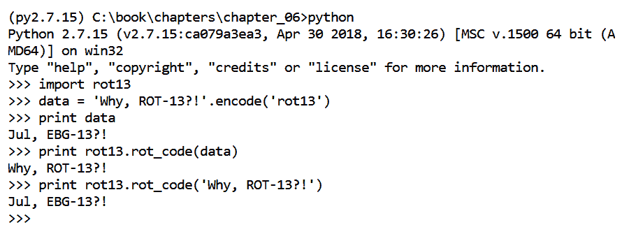
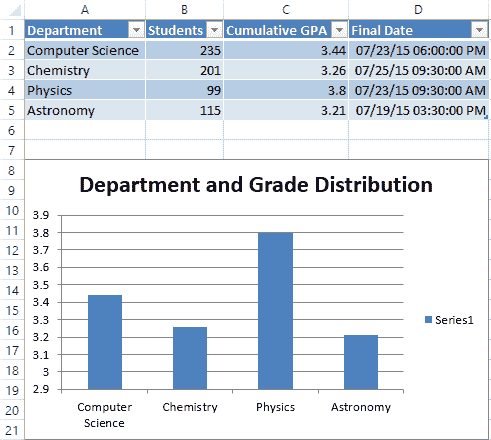

# 第六章：从二进制文件中提取工件

解析二进制数据是一个不可或缺的技能。我们不可避免地会遇到需要分析的不熟悉或未记录的工件。当感兴趣的文件是二进制文件时，这个问题更加复杂。与分析类文本文件不同，我们通常需要使用我们最喜欢的十六进制编辑器来开始逆向工程文件的内部二进制结构。逆向工程二进制文件的底层逻辑超出了本章的讨论范围。相反，我们将使用一个已经熟知结构的二进制对象。这将使我们能够突出展示如何在理解内部结构后，使用 Python 自动解析这些二进制结构。在本章中，我们将检查来自 `NTUSER.DAT` 注册表配置单元的 `UserAssist` 注册表项。

本章展示了如何从二进制数据中提取 Python 对象并生成自动化 Excel 报告。我们将使用三个模块来完成这项任务：`struct`、`yarp` 和 `xlsxwriter`。虽然 `struct` 模块包含在 Python 的标准安装中，但 `yarp` 和 `xlsxwriter` 必须单独安装。我们将在各自的章节中讲解如何安装这些模块。

`struct` 库用于将二进制对象解析为 Python 对象。一旦我们从二进制对象中解析出数据，就可以将我们的发现写入报告中。在过去的章节中，我们已经将结果报告在 CSV 或 HTML 文件中。在本章中，我们将创建一个包含数据表格和汇总图表的 Excel 报告。

本章将涵盖以下主题：

+   理解 `UserAssist` 工件及其二进制结构

+   ROT-13 编码与解码简介

+   使用 `yarp` 模块安装和操作注册表文件

+   使用`struct`从二进制数据中提取 Python 对象

+   使用 `xlsxwriter` 创建工作表、表格和图表

本章的代码是在 Python 2.7.15 和 Python 3.7.1 上开发和测试的

# UserAssist

`UserAssist` 工件标识 **图形用户界面**（**GUI**）应用程序在 Windows 机器上的执行。根据 Windows 操作系统的版本，这个工件存储的信息量不同。为了识别特定应用程序的数据，我们必须解码注册表项名称，因为它是作为 ROT13 编码的路径和应用程序名称存储的。例如，Windows XP 和 Vista 的 `UserAssist` 值数据长度为 16 字节，存储如下信息：

+   最后执行时间的 UTC 信息（以 FILETIME 格式）

+   执行计数

+   会话 ID

最后执行时间信息以 Windows FILETIME 对象的形式存储。这是另一种常见的时间表示方法，区别于我们在之前章节中看到的 UNIX 时间戳。我们将在本章后面展示如何在 Python 中解读这个时间戳并以人类可读的形式显示。执行计数表示应用程序被启动的次数。

Windows 7 及更高版本存储的数据比它们的前身更多。Windows 7 的`UserAssist`值长度为 72 字节，并且除了前述的三个艺术品外，还存储以下内容：

+   焦点计数

+   焦点时间

焦点计数是将应用程序点击以将其带回焦点的次数。例如，当您打开两个应用程序时，只有一个应用程序在给定时间内处于焦点状态。另一个应用程序在再次点击它之前处于非活动状态。焦点时间是给定应用程序处于焦点状态的总时间，以毫秒表示。

此注册表项不存储基于命令行的程序或 Windows 启动程序的 GUI 应用程序的执行。

`UserAssist`注册表键位于每个用户主目录的根文件夹中找到的`NTUSER.DAT`注册表中。在这个注册表中，`UserAssist`键位于`SOFTWARE\Microsoft\Windows\CurrentVersion\Explorer\UserAssist`。`UserAssist`键的子键包括已知的 GUID 及其各自的计数子键。在每个 GUID 的计数子键中，可能有与程序执行相关的多个值。该结构如下所示：

```
SOFTWARE\Microsoft\Windows\CurrentVersion\Explorer\UserAssist 
.{GUID_1} 
..Count 
.{GUID_2} 
..Count 
```

计数子键内的值存储了我们感兴趣的应用程序执行信息。计数子键下每个值的名称表示了 ROT-13 编码的可执行文件的路径和名称。这使得一眼难以识别可执行文件。让我们修复这个问题。

# 理解 ROT-13 替换密码 - rot13.py

ROT-13 是一种简单的替换密码，它转换文本并用后面的十三个字符替换每个字符。例如，字母`a`将被替换为字母`n`，反之亦然。数字、特殊字符和字符的大小写在密码的影响下不变。虽然 Python 确实提供了一种内置的解码 ROT-13 的方式，但我们假装它不存在，并手动解码 ROT-13 数据。我们将在脚本中使用内置的 ROT-13 解码方法。

在我们假装这个功能不存在之前，让我们快速使用它来说明如何使用 Python 2 对 ROT-13 数据进行编码和解码：

```
>>> original_data = 'Why, ROT-13?' 
>>> encoded_data = original_data.encode('rot-13') 
>>> print encoded_data 
Jul, EBG-13? 
>>> print encoded_data.decode('rot-13') 
Why, ROT-13? 
```

在 Python 3 中，使用原生的`codecs`库对 ROT-13 进行解码或编码需要稍微不同的方法：

```
>>> import codecs
>>> enc = codecs.getencoder('rot-13')
>>> enc('Why, ROT-13?')
('Jul, EBG-13?', 12)
>>> enc('Why, ROT-13?')[0]
'Jul, EBG-13?'
```

现在，让我们看看如果没有内置功能，您可能会如何处理这个问题。虽然你不应该重复造轮子，但我们希望借此机会练习列表操作并介绍一个用于审计代码的工具。本章代码包中的`rot13.py`脚本中的代码如下所示。

第 32 行定义的`rot_code()`函数接受一个经过 ROT-13 编码或解码的字符串。在第 39 行，我们有`rot_chars`，一个包含字母表中字符的列表。当我们遍历输入的每个字符时，我们将使用该列表将字符替换为其相隔 13 个元素的对照字符。在执行替换时，我们会将其存储在第 43 行初始化的替换列表中：

```
032 def rot_code(data):
033    """
034     The rot_code function encodes/decodes data using string
035     indexing
036     :param data: A string
037     :return: The rot-13 encoded/decoded string
038     """
039     rot_chars = ['a', 'b', 'c', 'd', 'e', 'f', 'g', 'h', 'i',
040     'j', 'k', 'l', 'm', 'n', 'o', 'p', 'q', 'r', 's', 't',
041     'u', 'v', 'w', 'x', 'y', 'z']
042 
043     substitutions = []
```

在第 46 行，我们开始遍历数据字符串中的每个字符`c`。在第 49 行，我们使用条件语句来判断字符是大写字母还是小写字母。这样做是为了在处理时保留字符的大小写：

```
045     # Walk through each individual character
046     for c in data:
047 
048         # Walk through each individual character
049         if c.isupper():
```

在第 54 行，我们尝试识别字符在列表中的索引。如果字符是非字母字符，我们将收到一个`ValueError`异常。数字或特殊字符等非字母字符将不做任何修改地添加到替换列表中，因为这些类型的值不会被 ROT-13 编码：

```
051             try:
052                 # Find the position of the character in
053                 # rot_chars list
054                 index = rot_chars.index(c.lower())
055             except ValueError:
056                 substitutions.append(c)
057                 continue
```

一旦找到字符的索引，我们就可以通过减去 13 来计算相隔 13 个字符的对应索引。对于小于 13 的值，这将是一个负数。幸运的是，列表索引支持负数，并且在这里表现得非常好。在将对应的字符添加到替换列表之前，我们使用字符串的`upper()`函数将字符恢复为其原始大小写：

```
059             # Calculate the relative index that is 13
060             # characters away from the index
061             substitutions.append(
062             (rot_chars[(index-13)]).upper())
```

条件语句的`else`部分处理小写字符。以下代码块的功能与我们刚刚讨论的基本相同。不同之处在于，我们从不使用小写或大写字母，因为字符已经处于正确的大小写格式，便于处理：

```
064         else:
065 
066             try:
067                 # Find the position of the character in
068                 # rot_chars list
069                 index = rot_chars.index(c)
070             except ValueError:
071                 substitutions.append(c)
072                 continue
073 
074             substitutions.append(rot_chars[((index-13))])
```

最后，在第 76 行，我们使用`join()`方法将替换列表合并为一个字符串。我们在空字符串上进行连接，这样列表中的每个元素都会被附加，而没有任何分隔符。如果从命令行调用此脚本，它将输出处理后的字符串`Jul, EBG-13?`，我们知道它对应的是`ROT-13?`。我们有以下代码：

```

076     return ''.join(substitutions)
077 
078 if __name__ == '__main__':
079     print(rot_code('Jul, EBG-13?'))
```

以下截图展示了我们如何导入`rot13`模块并调用`rot_code()`方法来解码或编码字符串：



确保 Python 交互式提示符与`rot13.py`脚本在同一目录下打开。否则，将会生成`ImportError`错误。

# 使用 timeit 评估代码

现在让我们审视一下我们的模块，看看它是否优于内置方法（剧透：并不是！）我们曾提到，除非绝对必要，否则你不应重新发明轮子。这样做是有充分理由的：大多数内置或第三方解决方案已经过性能和安全性优化。我们的`rot_code()`函数与内置函数相比如何呢？我们可以使用`timeit`模块来计算一个函数或代码行执行所需的时间。

让我们比较两种解码 ROT-13 值的方法之间的差异。通过向 Python 解释器提供`-m`选项，如果其父目录在`sys.path`列表中，则会执行指定的模块。`timeit`模块可以直接从命令行通过`-m`选项调用。

我们可以通过导入`sys`模块并打印`sys.path`来查看哪些目录在作用范围内。为了扩展`sys.path`中可用的项目，我们可以使用列表属性（如 append 或 extend）将新项目追加到其中。

`timeit`模块支持多种开关，并可以用于运行单行代码或整个脚本。`-v`开关打印更详细的输出，且当提供更多的`v`开关时，输出会越来越详细。`-n`开关是执行代码或脚本的次数（例如，每个测量周期内的执行次数）。我们可以使用`-r`开关来指定重复测量的次数（默认为`3`）。增加这个值可以让我们计算出更精确的平均执行速度。最后，`-s`开关是一个在第一次执行时运行的语句，用于让我们导入制作的脚本。有关更多文档，请访问[`docs.python.org/3/library/timeit.html`](http://docs.python.org/3/library/timeit.html)或运行`python -m timeit -h`。

当我们在计算两种方法的执行时间时，计算机生成的输出如以下截图所示。性能可能会因机器不同而有所差异。在我们的第一次测试中，我们测量了运行三次一百万次脚本所需的时间。在第一次循环中，我们先导入了我们的模块`rot13`，然后才调用它。在第二次测试中，我们同样测量了 Python 2 内置`decode()`函数的三次一百万循环：


事实证明，不必重新发明轮子是有充分理由的。我们的自定义`rot_code()`函数在运行一千次时明显比内置方法慢。我们可能不会调用这个函数一千次；对于`UserAssist`键，这个函数可能只会调用几百次。然而，如果我们处理更多数据或脚本特别慢，我们就可以开始对单独的函数或代码行进行计时，找出那些优化不良的代码。

顺便提一句，你还可以在函数调用前后使用`time.time()`函数，通过减去两个时间点来计算经过的时间。这种替代方法实现起来稍微简单一些，但没有那么健壮。

你现在已经了解了`UserAssist`工件、ROT-13 编码以及审计我们代码的机制。让我们转移焦点，看看本章中将要使用的其他模块。其中一个模块`yarp`将用于访问和交互`UserAssist`键和值。

# 使用 yarp 库

**yarp**（即**Yet Another Registry Parser**）库可以用来从注册表 hive 中获取键和值。Python 提供了一个名为`_winreg`的内置注册表模块；然而，这个模块仅在 Windows 机器上工作。`_winreg`模块与运行该模块的系统上的注册表进行交互。它不支持打开外部的注册表 hive。

`yarp`库允许我们与提供的注册表 hive 进行交互，并且可以在非 Windows 机器上运行。`yarp`库可以从[`github.com/msuhanov/yarp`](https://github.com/msuhanov/yarp)下载。在该项目的 GitHub 页面上，点击发布部分，可以看到所有稳定版本的列表，并下载所需的版本。对于本章，我们使用的是 1.0.25 版本。下载并解压缩归档文件后，我们可以运行其中的`setup.py`文件来安装模块。在命令提示符中，在模块的顶级目录执行以下代码：

```
python setup.py install 
```

这应该能够成功地在你的机器上安装`yarp`库。我们可以通过打开 Python 交互式提示符并输入`import yarp`来确认。如果模块没有成功安装，我们将收到一个错误。安装了`yarp`后，接下来我们可以开始学习如何利用这个模块满足我们的需求。

首先，我们需要从`yarp`模块中导入`Registry`类。然后，使用`RegistryHive`函数并将其传递给我们想要查询的注册表对象。在这个例子中，我们已将`NTUSER.DAT`注册表文件复制到当前工作目录，这样我们只需要提供文件名而不需要路径。接下来，我们使用`find_key`方法来导航到我们感兴趣的键。在这个例子中，我们关注的是`RecentDocs`注册表键。这个键包含按扩展名分隔的最近活动文件：

```
>>> from yarp import Registry
>>> reg_file = open('NTUSER.DAT', 'rb')
>>> reg = Registry.RegistryHive(reg_file) 
>>> recent_docs = reg.find_key('SOFTWARE\Microsoft\Windows\CurrentVersion\Explorer\RecentDocs')
```

如果我们打印`recent_docs`变量，我们可以看到它包含 151 个值和 75 个子键，这些子键可能包含附加的值和子键。此外，我们还可以使用`last_written_timestamp()`方法查看注册表键的最后写入时间：

```
>>> print(recent_docs) 
RegistryKey, name: RecentDocs, subkeys: 75, values: 151

>>> print(recent_docs.last_written_timestamp()) # Last Written Time 
datetime.datetime(2018, 11, 20, 3, 14, 40, 286516) 
```

我们可以使用`subkeys()`函数在`recent_docs`键的值上进行迭代，使用 for 循环遍历。对于每个值，我们可以访问`name()`、`value()`和`values_count()`方法等。访问值时（与访问子键不同），我们还可以通过使用`raw_data()`函数访问该值的原始数据。对于我们的目的，当我们想处理底层的二进制数据时，会使用`raw_data()`函数。我们有如下代码：

```
>>> for i, value in enumerate(recent_docs.subkeys()): 
...     print('{}) {}: {}'.format(i, value.name(), value.values_count())) 
...  
0) .001: 2
1) .1: 2
2) .7z: 2
3) .AAE: 2
...  
```

`yarp`模块的另一个有用功能是提供了查询特定子键或值的方式。这可以通过`subkey()`、`value()`或`find_key()`函数来实现。如果使用`subkey()`函数时找不到子键，则会生成`None`值：

```
>>> if recent_docs.subkey('.docx'): 
...     print('Found docx subkey.') 
...  
Found docx subkey. 
>>> if recent_docs.subkey('.1234abcd') is None: 
...     print('Did not find 1234abcd subkey.') 
...  
None
```

`find_key()` 函数接受一个路径，并能够通过多级递归查找子键。`subkey()` 和 `value()` 函数仅搜索子元素。我们可以使用这些函数在尝试导航到键或值之前确认它们是否存在。`yarp` 还提供了其他一些相关功能，本文未涵盖，包括恢复已删除的注册表键和值、提取注册表键和值以及支持事务日志文件。

使用 `yarp` 模块，查找键及其值非常简单。然而，当值不是字符串而是二进制数据时，我们必须依赖另一个模块来理清数据。对于所有二进制相关的需求，`struct` 模块是一个极好的选择。

# 介绍 `struct` 模块

`struct` 模块是 Python 标准库的一部分，非常有用。`struct` 库用于将 C 结构转换为二进制数据，或将二进制数据转换为 C 结构。该模块的完整文档可以在 [`docs.python.org/3/library/struct.html`](http://docs.python.org/3/library/struct.html) 找到。

出于取证目的，`struct` 模块中最重要的函数是 `unpack()` 方法。该方法接受一个格式字符串，表示要从二进制数据中提取的对象。格式字符串指定的大小必须与传递给函数的二进制数据的大小相符。

格式字符串告诉 `unpack()` 函数二进制对象中包含的数据类型及其解释方式。如果我们没有正确识别数据类型或尝试解包的数据比提供的数据多或少，`struct` 模块将抛出异常。以下是构建格式字符串时最常用字符的表格。标准大小列表示二进制对象的预期大小（以字节为单位）：

| **字符** | **Python 对象** | **标准大小（字节）** |
| --- | --- | --- |
| `h` | 整数 | 2 |
| `i` | 整数 | 4 |
| `q` | 整数 | 8 |
| `s` | 字符串 | 1 |
| `x` | 不适用 | 不适用 |

格式字符串中还可以使用其他字符。例如，其他字符可以将二进制数据解释为浮点数、布尔值以及其他各种 C 结构。`x` 字符仅仅是一个填充字符，用于忽略我们不关心的字节。

此外，还可以使用可选的起始字符来定义字节顺序、大小和对齐方式。默认情况下是本地字节顺序、大小和对齐方式。由于我们无法预测脚本可能运行的环境，因此通常不建议使用任何本地选项。相反，我们可以使用 `<` 和 `>` 符号分别指定小端或大端字节顺序和标准大小。让我们通过几个例子来实践。

首先，打开一个交互式提示符并导入`struct`模块。接下来，我们将 0x01000000 赋值给一个变量。在 Python 3 中，十六进制表示法通过转义字符和每两个十六进制字符前的`x`来指定。我们的十六进制数据长度为四个字节，为了将其解释为一个整数，我们使用`i`字符。将十六进制数据解释为小端整数时，返回的值是`1`：

```
>>> import struct 
>>> raw_data = b'\x01\x00\x00\x00' # Integer (1) 
>>> print(struct.unpack('<i', raw_data)) # Little-Endian 
(1,) 
```

`<i`和`>i`表示字符串格式。我们告诉`unpack()`方法将`raw_data`解释为一个四字节整数，按照小端或大端字节顺序。`struct`模块将解包的数据作为元组返回。默认情况下，Python 会将一个单一元素的元组打印在括号中，并带有尾随逗号，如以下输出所示：

```
>>> print(struct.unpack('>i', raw_data)) # Big-Endian 
(16777216,) 
>>> print(type(struct.unpack('>i', raw_data))) 
<class 'tuple'> 
```

让我们看另一个例子。我们可以通过使用三个`i`字符将`rawer_data`解释为三个 4 字节整数。或者，我们可以在格式字符前加上数字，以便按顺序解析多个值。在这两种情况下，当按小端方式解释时，我们得到整数`1`、`5`和`4`。如果我们不关心中间的整数，可以使用`4x`字符跳过它：

```
>>> rawer_data = b'\x01\x00\x00\x00\x05\x00\x00\x00\x04\x00\x00\x00' 
>>> print(struct.unpack('<iii', rawer_data)) 
(1, 5, 4) 
>>> print(struct.unpack('<3i', rawer_data)) 
(1, 5, 4) 
>>> print(struct.unpack('<i4xi', rawer_data)) # "skip" 4 bytes 
(1, 4) 
```

我们在本节早些时候提到了使用`struct`时可能出现的错误。现在，让我们故意制造一些错误，以理解它们的含义。以下两个例子会出现错误，因为我们试图`unpack()`的数据量比`rawer_data`变量中实际存在的值多或少。这在尝试解包大量二进制数据时可能会导致一些初步的挫败感。务必检查数学计算、字节顺序以及大小是否为标准或本地格式：

```
>>> print(struct.unpack('<4i', rawer_data)) 
struct.error: unpack requires a buffer of 16 bytes
>>> print(struct.unpack('<2i', rawer_data)) 
struct.error: unpack requires a buffer of 8 bytes 
```

让我们更进一步，使用`struct`模块解析一个`UserAssist`值。我们将解析一个 Windows XP 的值，这是最简单的情况，因为它仅为 16 个字节。Windows XP UserAssist 值的字节偏移量记录在以下表中：

| **字节偏移量** | **值** | **对象** |
| --- | --- | --- |
| 0-3 | 会话 ID | 整数 |
| 4-7 | 计数 | 整数 |
| 8-15 | FILETIME | 整数 |

以下十六进制转储保存到文件`Neguhe Qrag.bin`中。该文件与代码包一起提供，可以从[`packtpub.com/books/content/support`](https://packtpub.com/books/content/support)下载：

```
0000: 0300 0000 4800 0000  |....H... 
0010: 01D1 07C4 FA03 EA00  |........ 
```

在从文件对象解包数据时，我们需要以`rb`模式打开文件，而不是默认的`r`模式，以确保可以将数据作为字节读取。获取原始数据后，我们可以使用特定的字符格式解析它。我们知道前 8 个字节是两个 4 字节整数（`2i`），然后是一个 8 字节整数（`q`），表示`UserAssist`值的 FILETIME。我们可以对返回的元组进行索引，打印出每个提取的整数：

```
>>> rawest_data = open('Neguhe Qrag.bin', 'rb').read()
>>> parsed_data = struct.unpack('<2iq', rawest_data)
>>> print('Session ID: {}, Count: {}, FILETIME: {}'.format(parsed_data[0], parsed_data[1], parsed_data[2]))
...
Session ID: 3, Count: 72, FILETIME: 6586952011847425 
```

一旦我们在脚本中解析了`UserAssist`值，我们将以报告准备好的格式呈现结果。过去，我们使用了 CSV 和 HTML 格式的输出报告。报告通常会以电子表格格式进行审查，使用像 Microsoft Excel 这样的软件。为了提供充分利用此软件的报告，我们将学习如何将 XSLX 格式的电子表格作为脚本的输出。

# 使用 xlsxwriter 模块创建电子表格

`xlsxwriter`（版本 1.1.2）是一个有用的第三方模块，可以将数据写入 Excel 电子表格。Python 有很多支持 Excel 的模块，但我们选择了这个模块，因为它非常强大且文档齐全。顾名思义，这个模块只能用于写入 Excel 电子表格。`xlsxwriter`模块支持单元格和条件格式、图表、表格、过滤器和宏等功能。这个模块可以通过`pip`安装：

```
pip install xlsxwriter==1.1.2 
```

# 向电子表格中添加数据

让我们快速创建一个名为`simplexlsx.v1.py`的脚本来演示这个例子。在第 2 和第 3 行，我们导入了`xlsxwriter`和`datetime`模块。我们将要绘制的数据，包括列名，存储在`school_data`变量中的嵌套列表中。每个列表是一行信息，我们希望将其存储在 Excel 电子表格中，第一项包含列名：

```
002 import xlsxwriter
003 from datetime import datetime
...  
033 school_data = [['Department', 'Students', 'Cumulative GPA',
034                 'Final Date'],
035                ['Computer Science', 235, 3.44,
036                datetime(2015, 7, 23, 18, 0, 0)],
037                ['Chemistry', 201, 3.26,
038                datetime(2015, 7, 25, 9, 30, 0)],
039                ['Forensics', 99, 3.8,
040                datetime(2015, 7, 23, 9, 30, 0)],
041                ['Astronomy', 115, 3.21,
042                datetime(2015, 7, 19, 15, 30, 0)]]
```

`write_xlsx()`函数定义在第 45 行，负责将数据写入电子表格。首先，我们必须使用`Workbook()`函数创建 Excel 电子表格，并提供所需的文件名作为输入。在第 53 行，我们使用`add_worksheet()`函数创建工作表。此函数可以接受所需的工作表标题，或者使用默认名称`Sheet N`，其中`N`表示一个数字：

```
045 def write_xlsx(data):
046     """
047     The write_xlsx function creates an XLSX spreadsheet from a
048     list of lists
049     :param data: A list of lists to be written in the spreadsheet
050     :return: Nothing
051     """
052     workbook = xlsxwriter.Workbook('MyWorkbook.xlsx')
053     main_sheet = workbo
ok.add_worksheet('MySheet')
```

`date_format`变量存储我们将用来显示`datetime`对象的自定义数字格式，以便以所需的易读格式显示它们。在第 58 行，我们开始遍历数据以进行写入。第 59 行的条件用于处理数据列表中的第一项，即列名。我们使用`write()`函数并提供数值型的行和列。例如，我们也可以使用 Excel 符号表示法，如`A1`，表示数据应写入第一列和第一行，而不是使用数值来表示列和行：

```
055     date_format = workbook.add_format(
056     {'num_format': 'mm/dd/yy hh:mm:ss AM/PM'})
057 
058     for i, entry in enumerate(data):
059         if i == 0:
060             main_sheet.write(i, 0, entry[0])
061             main_sheet.write(i, 1, entry[1])
062             main_sheet.write(i, 2, entry[2])
063             main_sheet.write(i, 3, entry[3])
```

`write()`方法将尝试在检测到数据类型时写入适当的对象数据类型。然而，我们可以使用不同的写入方法来指定正确的格式。这些专用的写入方法会保留数据类型，以便我们可以使用适当的数据类型特定的 Excel 函数处理对象。由于我们知道条目列表中的数据类型，我们可以手动指定何时使用通用的`write()`函数，何时使用`write_number()`函数：

```
064         else:
065             main_sheet.write(i, 0, entry[0])
066             main_sheet.write_number(i, 1, entry[1])
067             main_sheet.write_number(i, 2, entry[2])
```

对于列表中的第四个条目，即 `datetime` 对象，我们向 `write_datetime()` 函数传入第 55 行定义的 `date_format`。数据写入工作簿后，我们使用 `close()` 函数关闭并保存电子表格。在第 73 行，我们调用 `write_xlsx()` 函数，并将之前构建的 `school_data` 列表传入，代码如下：

```
068             main_sheet.write_datetime(i, 3, entry[3], date_format)
069 
070     workbook.close()
071 
072 
073 write_xlsx(school_data)
```

下表列出了 `write` 函数及其保留的对象：

| **函数** | **支持的对象** |
| --- | --- |
| `write_string` | `str` |
| `write_number` | `int`、`float`、`long` |
| `write_datetime` | `datetime` 对象 |
| `write_boolean` | `bool` |
| `write_url` | `str` |

当脚本在命令行中被调用时，会创建一个名为 `MyWorkbook.xlsx` 的电子表格。当我们将其转换为表格时，我们可以按任何值进行排序，并使用我们都熟悉的 Excel 函数和功能。如果我们没有保留数据类型，像日期这样的值可能会显示得与预期不同：


# 构建表格

能够将数据写入 Excel 文件并保留对象类型，已经比 CSV 有所改进，但我们还能做得更好。通常，检查员在处理 Excel 电子表格时首先会做的就是将数据转换为表格，并开始对数据集进行排序和筛选。但我们可以使用 `xlsxwriter` 将数据范围转换为表格。事实上，用 `xlsxwriter` 写入表格可以说比逐行写入要容易。本文讨论的代码体现在 `simplexlsx.v2.py` 文件中。

在这一版本中，我们删除了 `school_data` 变量中包含列名的初始列表。我们新的 `write_xlsx()` 函数单独写入表头，稍后我们将看到这一点：

```
034 school_data = [['Computer Science', 235, 3.44,
035                 datetime(2015, 7, 23, 18, 0, 0)],
036                 ['Chemistry', 201, 3.26,
037                 datetime(2015, 7, 25, 9, 30, 0)],
038                 ['Forensics', 99, 3.8,
039                 datetime(2015, 7, 23, 9, 30, 0)],
040                 ['Astronomy', 115, 3.21,
041                 datetime(2015, 7, 19, 15, 30, 0)]]
```

第 44 到 55 行与函数的前一版本相同。我们将表格写入电子表格的操作在第 58 行完成。请查看以下代码：

```
044 def write_xlsx(data):
045     """
046     The write_xlsx function creates an XLSX spreadsheet from a
047     list of lists
048     :param data: A list of lists to be written in the spreadsheet
049     :return: Nothing
050     """
051     workbook = xlsxwriter.Workbook('MyWorkbook.xlsx')
052     main_sheet = workbook.add_worksheet('MySheet')
053 
054     date_format = workbook.add_format(
055     {'num_format': 'mm/dd/yy hh:mm:ss AM/PM'})
```

`add_table()` 函数接受多个参数。首先，我们传入一个表示表格左上角和右下角单元格的字符串，采用 Excel 表示法。我们使用在第 56 行定义的`length`变量来计算表格所需的长度。第二个参数稍微有些复杂；这是一个字典，包含两个键：data 和 columns。`data` 键对应我们的 `data` 变量的值，在这个例子中，它可能命名得不好。`columns` 键定义了每个列头，并且可以选择性地定义其格式，如第 62 行所示：

```
056     length = str(len(data) + 1)
057 
058     main_sheet.add_table(('A1:D' + length),
059     {'data': data,
060     'columns': [{'header': 'Department'}, {'header': 'Students'},
061                 {'header': 'Cumulative GPA'},
062                 {'header': 'Final Date', 'format': date_format}]})
063 
064     workbook.close()
```

与前一个示例相比，我们用更少的代码行创建了一个更有用的输出，且它是以表格形式构建的。现在，我们的电子表格已经将指定的数据转换成了表格，并准备好进行排序。

在构建表格时，还可以提供更多的键和值。有关高级用法的更多详细信息，请查阅文档（[`xlsxwriter.readthedocs.org`](http://xlsxwriter.readthedocs.org)）。

当我们处理表示工作表每一行的嵌套列表时，这个过程非常简单。对于不符合这种格式的数据结构，我们需要结合我们之前迭代中演示的两种方法，以实现相同的效果。例如，我们可以定义一个跨越特定行和列的表格，然后使用 `write()` 函数写入这些单元格。然而，为了避免不必要的麻烦，我们建议在可能的情况下保持数据为嵌套列表格式。

# 使用 Python 创建图表

最后，让我们使用 `xlsxwriter` 创建一个图表。该模块支持多种不同类型的图表，包括线形图、散点图、条形图、柱状图、饼图和区域图。我们使用图表来以有意义的方式总结数据。这在处理大数据集时特别有用，能够让分析人员在深入分析之前先对数据有个初步的了解。

让我们再次修改上一个版本，以显示图表。我们将把这个修改过的文件保存为 `simplexlsx.v3.py`。在第 65 行，我们将创建一个名为 `department_grades` 的变量。这个变量将是我们通过 `add_chart()` 方法创建的图表对象。对于这个方法，我们传入一个字典，指定键和值。在这种情况下，我们指定图表的类型为柱状图：

```
065     department_grades = workbook.add_chart({'type':'column'})
```

在第 66 行，我们使用 `set_title()` 函数，再次传入一个参数字典。我们将名称键设置为我们想要的标题。此时，我们需要告诉图表要绘制哪些数据。我们通过 `add_series()` 函数来完成这一点。每个类别键都映射到 Excel 表示法，用于指定横轴数据。纵轴由 `values` 键表示。数据指定完成后，我们使用 `insert_chart()` 函数在电子表格中绘制数据。我们给这个函数传递一个字符串，表示将作为锚点的单元格，图表的左上角将绘制在此处：

```
066     department_grades.set_title(
067     {'name':'Department and Grade distribution'})
068     department_grades.add_series(
069     {'categories':'=MySheet!$A$2:$A$5',
070     'values':'=MySheet!$C$2:$C$5'})
071     main_sheet.insert_chart('A8', department_grades)
072     workbook.close()
```

运行此版本的脚本将把我们的数据转换为表格并生成一个柱状图，按部门比较它们的累计成绩。我们可以清楚地看到，不出意料，物理系在学校项目中拥有最高的 GPA 获得者。对于这样一个小型数据集，这些信息足够直观。但在处理更大规模的数据时，创建总结性图表将特别有助于理解全貌：



请注意，`xlsxwriter` 模块中有大量额外的功能，我们在脚本中不会使用到。这个模块非常强大，我们推荐在任何需要写入 Excel 电子表格的操作中使用它。

# UserAssist 框架

我们的`UserAssist`框架由三个脚本组成，分别是`userassist_parser.py`、`csv_writer.py`和`xlsx_writer.py`。`userassist_parser.py`脚本处理大部分的处理逻辑，然后将结果传递给 CSV 或 XLSX 写入器。我们框架的目录结构如下所示。我们的写入器包含在一个名为`Writers`的目录中。请记住，为了让 Python 能够搜索到一个目录，它需要包含`__init__.py`文件。该文件可以为空，包含函数和类，或者包含在导入时执行的代码：

```
  |-- userassist_parser.py 
  |-- Writers 
      |-- __init__.py 
      |-- csv_writer.py 
      |-- xlsx_writer.py 
```

# 开发我们的 UserAssist 逻辑处理器 – userassist_parser.py

`userassist_parser.py`脚本负责处理用户输入、创建日志文件，并解析来自`NTUSER.DAT`文件的`UserAssist`数据。在第 2 到第 9 行，我们导入了熟悉的和新的模块来促进我们的任务。`yarp`和`struct`模块将分别允许我们访问并提取来自`UserAssist`二进制数据的对象。我们导入了位于`Writers`目录中的`xlsx_writer`和`csv_writer`模块。其他使用的模块在之前的章节中已经介绍过：

```
001 """UserAssist parser leveraging the YARP library."""
002 from __future__ import print_function
003 import argparse
004 import struct
005 import sys
006 import logging
007 import os
008 from Writers import xlsx_writer, csv_writer
009 from yarp import Registry
```

在第 45 行定义的`KEYS`变量作为一个空列表，将存储解析后的`UserAssist`值。第 48 行定义的`main()`函数将处理所有协调逻辑。它调用函数解析`UserAssist`键，并随后写入结果。`create_dictionary()`函数使用`Registry`模块查找并将`UserAssist`值名称和原始数据存储在每个 GUID 的字典中。

在第 134 行，我们定义了`parse_values()`函数，该函数使用`struct`处理每个`UserAssist`值的二进制数据。在此方法中，我们根据数据的长度来确定我们正在处理的是 Windows XP 还是 Windows 7 的`UserAssist`数据。`get_name()`函数是一个小函数，用于从完整路径中分离出可执行文件的名称：

```
045 KEYS = [] 
...  
048 def main(): 
... 
085 def create_dictionary(): 
... 
134 def parse_values(): 
...  
176 def get_name(): 
```

在第 202 到 212 行，我们创建了一个参数解析对象，它接受两个位置参数和一个可选参数。我们的`REGISTRY`输入是感兴趣的`NTUSER.DAT`文件。`OUTPUT`参数是所需输出文件的路径和文件名。可选的`-l`开关是日志文件的路径。如果没有提供此路径，日志文件将创建在当前工作目录中：

```
202 if __name__ == '__main__':
203     parser = argparse.ArgumentParser(description=__description__,
204                                      epilog='Developed by ' +
205                                      __author__ + ' on ' +
206                                      __date__)
207     parser.add_argument('REGISTRY', help='NTUSER Registry Hive.')
208     parser.add_argument('OUTPUT',
209     help='Output file (.csv or .xlsx)')
210     parser.add_argument('-l', help='File path of log file.')
211 
212     args = parser.parse_args()
```

如果用户提供了日志路径，我们会在第 215 行检查该路径是否存在。如果路径不存在，我们使用`os.makedirs()`函数创建日志目录。无论哪种情况，我们都会使用提供的目录和日志文件实例化`log_path`变量。在第 220 行，我们创建日志并像之前的章节一样写入启动细节，然后在第 227 行调用`main()`：

```
214     if args.l:
215         if not os.path.exists(args.l):
216             os.makedirs(args.l)
217         log_path = os.path.join(args.l, 'userassist_parser.log')
218     else:
219         log_path = 'userassist_parser.log'
220     logging.basicConfig(filename=log_path, level=logging.DEBUG,
221                         format=('%(asctime)s | %(levelname)s | '
222                         '%(message)s'), filemode='a')
223 
224     logging.info('Starting UserAssist_Parser')
225     logging.debug('System ' + sys.platform)
226     logging.debug('Version ' + sys.version)
227     main(args.REGISTRY, args.OUTPUT)
```

以下流程图描述了我们`UserAssist`框架内相互关联的函数。在此图中，我们可以看到`main()`函数如何调用并接收来自`create_dictionary()`和`parse_values()`函数的数据。`parse_values()`函数分别调用了`get_name()`函数：


# 评估`main()`函数

`main()`函数在调用适当的方法以写入`out_file`之前，先将注册表文件发送进行处理。在第 61 行，我们调用`create_dictionary()`函数，创建一个包含`UserAssist`数据并映射到可执行文件名的字典列表：

```
048 def main(registry, out_file):
049     """
050     The main function handles main logic of script.
051     :param registry: Registry Hive to process
052     :param out_file: The output path and file
053     :return: Nothing.
054     """
055     if os.path.basename(registry).lower() != 'ntuser.dat':
056         print(('[-] {} filename is incorrect (Should be '
057                'ntuser.dat)').format(registry))
058         logging.error('Incorrect file detected based on name')
059         sys.exit(1)
060     # Create dictionary of ROT-13 decoded UA key and its value
061     apps = create_dictionary(registry)
```

接下来，这个字典被传递给`parse_values()`方法，该方法将解析后的数据附加到我们在第 45 行创建的`KEYS`列表中。此函数返回一个整数，表示解析的`UserAssist`数据类型。该函数对于 Windows XP 的`UserAssist`值返回`0`，对于 Windows 7 的返回`1`。我们记录此信息以便进行故障排除：

```
062     ua_type = parse_values(apps)
063 
064     if ua_type == 0:
065         logging.info('Detected XP-based Userassist values.')
066 
067     else:
068         logging.info(('Detected Win7-based Userassist values. '
069                       'Contains Focus values.'))
```

一旦数据处理完成，它可以被发送到我们的写入程序。我们使用`endswith()`方法来识别用户提供的输出文件的扩展名。如果输出以`.xlsx`或`.csv`结尾，我们分别将数据发送到`excel_writer()`或`csv_writer()`函数，具体如下：

```
071     # Use .endswith string function to determine output type
072     if out_file.lower().endswith('.xlsx'):
073         xlsx_writer.excel_writer(KEYS, out_file)
074     elif out_file.lower().endswith('.csv'):
075         csv_writer.csv_writer(KEYS, out_file)
```

如果用户没有在输出文件中包括扩展名，我们会向日志写入警告，并将数据写入当前工作目录中的 CSV 文件。我们选择 CSV 输出，因为它代表了我们支持的输出格式中最简单且最具可移植性的选项。此外，如果用户希望在电子表格应用程序中检查数据，他们可以轻松导入并将 CSV 文档转换为 XLSX 格式：

```
076     else:
077     print(('[-] CSV or XLSX extension not detected in '
078            'output. Writing CSV to current directory.'))
079     logging.warning(('.csv or .xlsx output not detected. '
080                      'Writing CSV file to current '
081                      'directory.'))
082     csv_writer.csv_writer(KEYS, 'Userassist_parser.csv')
```

两个写入程序接受相同的参数：`KEYS`和`out_file`。`KEYS`列表（在第 45 行定义）是一个包含`UserAssist`字典的容器。我们将数据打包成字典列表，以便使用字典键来决定哪些头部是存在的。`out_file`是期望输出的路径和名称。

# 定义`create_dictionary()`函数

`create_dictionary()`函数为处理准备`UserAssist`数据。此函数提取每个`UserAssist` GUID 键中的所有值。它创建一个字典，其中键是经过 ROT-13 解码的可执行文件名，值是相应的二进制数据。现在提取这些二进制数据，以便稍后在其他函数中处理：

```
085 def create_dictionary(registry):
086     """
087     The create_dictionary function creates a list of dictionaries
088     where keys are the ROT-13 decoded app names and values are
089     the raw hex data of said app.
090     :param registry: Registry Hive to process
091     :return: apps_list, A list containing dictionaries for
092     each app
093     """
```

在第 97 行，我们尝试打开用户提供的注册表文件。如果访问输入文件时发生错误，我们会捕获该错误，记录日志，并以错误代码`2`优雅地退出：

```
094     try:
095         # Open the registry file to be parsed
096         registry_file = open(registry, "rb")
097         reg = Registry.RegistryHive(registry_file)
098     except (IOError, UnicodeDecodeError) as e:
099         msg = 'Invalid NTUSER.DAT path or Registry ID.'
100         print('[-]', msg)
101         logging.error(msg)
102         sys.exit(2)
```

如果我们能够打开注册表文件，我们接着尝试导航到`UserAssist`键。我们使用条件语句来捕捉`UserAssist`键未在提供的注册表文件中找到的情形。注意，对于此错误，我们使用整数`3`来区分与先前的退出情形：

```
104     # Navigate to the UserAssist key
105     ua_key = reg.find_key(
106     ('SOFTWARE\\Microsoft\\Windows\\CurrentVersion\\Explorer'
107     '\\UserAssist'))
108     if ua_key is None:
109         msg = 'UserAssist Key not found in Registry file.'
110         print('[-]', msg)
111         logging.error(msg)
112         sys.exit(3)
```

在第 113 行，我们创建了一个名为 `apps_list` 的列表，用于存储 `UserAssist` 字典。如果我们能够找到 `UserAssist` 键，我们就会遍历每个 `ua_subkey`，一个 GUID，并检查它们的计数子键。这是一个重要的步骤；随着 Windows 的发展，`UserAssist` 键中添加了更多的 GUID。为了避免硬编码这些值，可能会遗漏未来 Windows 版本中新添加的 GUID，我们选择了一个更动态的过程，该过程将发现并处理跨多个版本的 Windows 中的新 GUID：

```
113     apps_list = []
114     # Loop through each subkey in the UserAssist key
115     for ua_subkey in ua_key.subkeys():
116         # For each subkey in the UserAssist key, detect a subkey
117         # called Count that has more than 0 values to parse.
```

该过程涉及检查每个具有名为`Count`的子键的 GUID，该子键存储实际的 `UserAssist` 应用程序值。在第 118 行，我们确定该 GUID 是否具有名为 `Count` 的子键，并且该子键具有一个或多个值。这确保我们找到了系统上所有的 `UserAssist` 值：

```
118         if(ua_subkey.subkey('Count') and
119         ua_subkey.subkey('Count').values_count() > 0):
```

我们在第 120 行创建了一个应用程序字典，并开始循环遍历 `Count` 子键下的每个值。对于每个值，我们将解码后的 ROT-13 名称作为键，并将其 `raw_data` 作为值进行关联。一旦 GUID 中的所有值都添加到字典中，它就会被附加到 `apps_list` 中，循环再次开始。一旦所有 GUID 都被处理完，我们的列表会返回到 `main()` 函数：

```
120             apps = {}
121             for v in ua_subkey.subkey('Count').values():
122                 if sys.version_info[0] == 2:
123                     apps[v.name().encode('utf-8').decode(
124                     'rot-13')] = v.data_raw()
125                 elif sys.version_info[0] == 3:
126                     import codecs
127                     enc = codecs.getencoder('rot-13')
128                     apps[enc(str(v.name()))[0]] = v.data_raw()
129 
130                 apps_list.append(apps)
131     return apps_list
```

# 使用 `parse_values()` 函数提取数据

`parse_values()` 函数将 GUID 字典列表作为输入，并使用 `struct` 解析二进制数据。正如我们所讨论的，我们将支持两种类型的 `UserAssist` 键：Windows XP 和 Windows 7。以下两个表格分解了我们将解析的相关数据结构。基于 Windows XP 的键是 16 字节长，包含会话 ID、计数和 FILETIME 时间戳：

| **字节偏移量** | **值** | **对象** |
| --- | --- | --- |
| 0-3 | 会话 ID | 整数 |
| 4-7 | 计数 | 整数 |
| 8-15 | FILETIME | 整数 |

基于 Windows 7 的数据是 72 字节长，包含会话 ID、计数、专注计数/时间和 FILETIME 时间戳：

| **字节偏移量** | **值** | **对象** |
| --- | --- | --- |
| 0-3 | 会话 ID | 整数 |
| 4-7 | 计数 | 整数 |
| 8-11 | 专注计数 | 整数 |
| 12-15 | 专注时间 | 整数 |
| 16-59 | ??? | 不适用 |
| 60-67 | FILETIME | 整数 |
| 68-71 | ??? | 不适用 |

在第 143 行到第 146 行，我们通过实例化 `ua_type` 变量并记录执行状态来设置我们的函数。这个 `ua_type` 变量将用于记录我们正在处理的 `UserAssist` 值的类型。在第 148 行和第 149 行，我们遍历每个字典中的每个值，以识别其类型并进行解析：

```
134 def parse_values(data):
135     """
136     The parse_values function uses struct to unpack the raw value
137     data from the UA key
138     :param data: A list containing dictionaries of UA
139     application data
140     :return: ua_type, based on the size of the raw data from
141     the dictionary values.
142     """
143     ua_type = -1
144     msg = 'Parsing UserAssist values.'
145     print('[+]', msg)
146     logging.info(msg)
147 
148     for dictionary in data:
149         for v in dictionary.keys():
```

在第 151 行和第 159 行，我们使用 `len()` 函数来识别 `UserAssist` 键的类型。对于基于 Windows XP 的数据，我们需要提取两个 4 字节的整数，后跟一个 8 字节的整数。我们还希望使用标准大小以小端字节顺序解释这些数据。在第 152 行，我们通过 `<2iq` 作为 `struct` 格式字符串来实现这一点。传递给 `unpack` 方法的第二个参数是来自 GUID 字典的特定键的原始二进制数据：

```
150             # WinXP based UA keys are 16 bytes
151             if len(dictionary[v]) == 16:
152                 raw = struct.unpack('<2iq', dictionary[v])
153                 ua_type = 0
154                 KEYS.append({'Name': get_name(v), 'Path': v,
155                 'Session ID': raw[0], 'Count': raw[1],
156                 'Last Used Date (UTC)': raw[2],
157                 'Focus Time (ms)': '', 'Focus Count': ''})
```

基于 Windows 7 的数据稍微复杂一些。二进制数据的中间和末尾部分包含我们不感兴趣的字节，但由于结构体的性质，我们必须在格式中考虑到它们。我们为此任务使用的格式字符串是 `<4i44xq4x`，它包含了四个 4 字节整数、44 字节的中间空隙、一个 8 字节整数，以及我们将忽略的剩余 4 字节：

```
158             # Win7 based UA keys are 72 bytes
159             elif len(dictionary[v]) == 72:
160                 raw = struct.unpack('<4i44xq4x', dictionary[v])
161                 ua_type = 1
162                 KEYS.append({'Name': get_name(v), 'Path': v,
163                 'Session ID': raw[0], 'Count': raw[1], 
164                 'Last Used Date (UTC)': raw[4],
165                 'Focus Time (ms)': raw[3],'Focus Count': raw[2]})
```

在解析 `UserAssist` 记录时，我们将它们附加到 `KEYS` 列表中进行存储。当我们附加解析值时，我们用大括号将它们包裹起来，创建我们内部的字典对象。我们还对 `UserAssist` 值名调用 `get_name()` 函数，以分离可执行文件和其路径。请注意，无论 `UserAssist` 键的类型如何，我们都会在字典中创建相同的键。这将确保所有字典具有相同的结构，并有助于简化我们的 CSV 和 XLSX 输出函数。

如果 `UserAssist` 值不是 16 或 72 字节（这种情况是可能发生的），那么该值将被跳过，并且用户会被通知跳过的名称和大小。根据我们的经验，这些值与法医取证无关，因此我们决定跳过它们。在第 173 行，`UserAssist` 类型被返回到 `main()` 函数：

```
166             else:
167                 # If the key is not WinXP or Win7 based -- ignore.
168                 msg = 'Ignoring {} value that is {} bytes'.format(
169                 str(v), str(len(dictionary[v])))
170                 print('[-]', msg)
171                 logging.info(msg)
172                 continue
173     return ua_type
```

# 使用 get_name() 函数处理字符串

`get_name()` 函数使用字符串操作将可执行文件与路径名分离。从测试中我们发现路径中包含冒号、反斜杠或两者兼有。由于这种模式的存在，我们可以尝试使用这些字符来分割路径信息，从中提取出文件名：

```
176 def get_name(full_name):
177     """
178     the get_name function splits the name of the application
179     returning the executable name and ignoring the
180     path details.
181     :param full_name: the path and executable name
182     :return: the executable name
183     """
```

在第 185 行，我们检查 `full_name` 变量中是否同时包含冒号和反斜杠。如果为真，我们使用 `rindex()` 函数获取两个元素的最右侧子字符串的索引。在第 187 行，我们检查冒号的最右侧索引是否出现在反斜杠的后面。使用最大索引的元素作为 `split()` 函数的分隔符。为了获得列表中的最后一个子字符串（即我们的可执行文件名），我们使用 `-1` 索引：

```
184     # Determine if '\\' and ':' are within the full_name
185     if ':' in full_name and '\\' in full_name:
186         # Find if ':' comes before '\\'
187         if full_name.rindex(':') > full_name.rindex('\\'):
188             # Split on ':' and return the last element 
189             # (the executable)
190             return full_name.split(':')[-1]
191         else:
192             # Otherwise split on '\\'
193             return full_name.split('\\')[-1]
```

在第 196 行和第 198 行，我们处理了替代场景，并在冒号或反斜杠处进行分割，然后返回子字符串列表中的最后一个元素：

```
194     # When just ':' or '\\' is in the full_name, split on
195     # that item and return the last element (the executable)
196     elif ':' in full_name:
197         return full_name.split(':')[-1]
198     else:
199         return full_name.split('\\')[-1]
```

这完成了我们在 `userassist_parser.py` 脚本中的逻辑。现在，让我们将注意力转向负责以有用格式写入解析数据的两个写入函数。

# 写入 Excel 电子表格 – xlsx_writer.py

`xlsx_writer.py`脚本包含了创建包含我们处理过的`UserAssist`值的 Excel 文档的逻辑。除此之外，这个脚本还创建了一个包含我们数据摘要图表的额外工作表。`xlsxwriter`在第 1 行导入，是我们用来创建 Excel 文档的第三方模块。第 3 行导入的`itemgetter`函数将在本节后面的排序函数中使用并解释。我们已经在前面的章节中见过`datetime`和`logging`模块：

```
001 from __future__ import print_function
002 import xlsxwriter
003 from operator import itemgetter
004 from datetime import datetime, timedelta
005 import logging
```

`xlsx_writer.py`脚本中有六个函数。协调逻辑由第 36 行定义的`excel_writer()`函数处理。该函数创建我们的 Excel 工作簿对象，然后将其交给`dashboard_writer()`和`userassist_writer()`函数，分别用于创建仪表板和`UserAssist`工作表。

剩下的三个函数，`file_time()`、`sort_by_count()`和`sort_by_date()`，是仪表板和`UserAssist`写入器使用的辅助函数。`file_time()`函数负责将我们从原始`UserAssist`数据中解析出的 FILETIME 对象转换为`datetime`对象。排序函数用于根据计数或日期对数据进行排序。我们使用这些排序函数来回答一些关于数据的基本问题。最常用的应用程序是什么？最不常用的应用程序是什么？在计算机上最后使用的 10 个应用程序是什么（根据`UserAssist`数据）？

```
036 excel_writer(): 
... 
071 dashboard_writer(): 
... 
156 userassist_writer(): 
... 
201 file_time(): 
... 
214 sort_by_count(): 
... 
227 sort_by_date():
```

# 使用`excel_writer()`函数控制输出

`excel_writer()`函数是这个脚本的核心。在第 47 行的 headers 列表中，包含了我们所需的列名。这些列名也方便地与我们将要写入的`UserAssist`字典中的键相对应。在第 49 行，我们创建了将要写入的`Workbook`对象。在下一行，我们创建了`title_format`，它控制了电子表头的颜色、字体、大小和其他样式选项。我们有以下代码：

```
036 def excel_writer(data, out_file):
037     """
038     The excel_writer function handles the main logic of writing
039     the excel output
040     :param data: the list of lists containing parsed UA data
041     :param out_file: the desired output directory and filename
042     for the excel file
043     :return: Nothing
044     """
045     print('[+] Writing XLSX output.')
046     logging.info('Writing XLSX to ' + out_file + '.')
047     headers = ['Name', 'Path', 'Session ID', 'Count',
048     'Last Used Date (UTC)', 'Focus Time (ms)', 'Focus Count']
049     wb = xlsxwriter.Workbook(out_file)
050     title_format = wb.add_format({'bold': True,
051     'font_color': 'white', 'bg_color': 'black', 'font_size': 30,
052     'font_name': 'Calibri', 'align': 'center'})
```

`title_format`与我们之前讨论的`xlsxwriter`模块时创建的`date_format`相似。这个格式是一个包含关键词和值的字典。具体来说，我们将在创建标题和副标题行时使用这个格式，以使其从电子表格中的其他数据中突出显示。

在第 54 到 59 行，我们将字典转换回列表。看起来这可能会让你觉得我们在存储数据时选择了错误的数据类型，也许你有一定的理由。然而，将数据存储在列表中会极大简化生成 XSLX 输出的过程。一旦我们看到 CSV 写入器如何处理数据，为什么最初使用字典会变得更加清晰。此外，使用字典可以让我们轻松理解存储的数据，而无需查看代码或文档：

```
054     # A temporary list that will store dictionary values
055     tmp_list = []
056     for dictionary in data:
057         # Adds dictionary values to a list ordered by the headers
058         # Adds an empty string is the key does not exist
059         tmp_list.append([dictionary.get(x, '') for x in headers])
```

我们使用列表推导将字典中的数据按正确的顺序追加到数据中。让我们逐步分解。在第 59 行，我们迭代每个`UserAssist`字典。正如我们所知，字典不按索引存储数据，而是按键映射存储数据。但是，我们希望按照我们的标题列表指定的顺序写入数据。标题循环中的`x`允许我们迭代该列表。对于每个`x`，我们使用`get()`方法返回字典中`x`对应的值，如果在字典中找到的话，否则返回空字符串。

在第 61 和 62 行，我们为仪表板和`UserAssist`数据调用两个工作表编写器。在这些函数的最后退出后，我们关闭工作簿对象的`close()`方法。关闭工作簿非常重要。如果不这样做，将会抛出异常，可能会阻止我们将 Excel 文档从内存传输到磁盘。请看下面的代码：

```
061     dashboard_writer(wb, tmp_list, title_format)
062     userassist_writer(wb, tmp_list, headers, title_format)
063 
064     wb.close()
065     msg =('Completed writing XLSX file. '
066           'Program exiting successfully.')
067     print('[*]', msg)
068     logging.info(msg)
```

# 使用`dashboard_writer()`函数总结数据

`dashboard_writer()`函数的目的是向分析师或审核人员提供一些汇总我们`UserAssist`数据的图形。我们选择向用户展示前 10、后 10 和最近的 10 个可执行文件。这个函数是我们最长的函数，需要最多的逻辑。

在第 81 行，我们将我们的仪表板工作表对象添加到工作簿中。接下来，我们将从`A`到`Q`列合并第一行，并使用我们在`excelWriter()`函数中创建的标题格式写入我们的公司名称`XYZ Corp`。类似地，在第 83 行，我们创建一个副标题行，以标识这个工作表作为我们的仪表板。

```
071 def dashboard_writer(workbook, data, ua_format):
072     """
073     the dashboard_writer function creates the 'Dashboard'
074     worksheet, table, and graphs
075     :param workbook: the excel workbook object
076     :param data: the list of lists containing parsed UA data
077     :param ua_format: the format object for the title and
078     subtitle row
079     :return: Nothing
080     """
081     dashboard = workbook.add_worksheet('Dashboard')
082     dashboard.merge_range('A1:Q1', 'XYZ Corp', ua_format)
083     dashboard.merge_range('A2:Q2', 'Dashboard', ua_format)
```

在第 87 行，我们创建并向工作簿添加`date_format`以正确格式化我们的日期。在第 92 和 93 行，我们调用两个排序函数。我们使用列表切片来切割排序后的数据，创建我们的子列表：`topten`，`leastten` 和 `lastten`。对于按计数使用的`topten`可执行文件，我们从排序列表中获取最后 10 个元素。对于`leastten`，我们只需执行相反操作。对于`lastten`，我们获取排序日期列表中的前 10 个结果，如下所示：

```
085     # The format to use to convert datetime object into a human
086     # readable value
087     date_format = workbook.add_format({
088     'num_format': 'mm/dd/yy h:mm:ss'})
089 
090     # Sort our original input by count and date to assist with
091     # creating charts.
092     sorted_count = sort_by_count(data)
093     sorted_date = sort_by_date(data)
094 
095     # Use list slicing to obtain the most and least frequently
096     # used UA apps and the most recently used UA apps
097     topten = sorted_count[-10:]
098     leastten = sorted_count[:10]
099     lastten = sorted_date[:10]
```

在第 103 行，我们迭代处理`lastten`列表中的元素。我们必须将每个时间戳转换为`datetime`对象。`datetime`对象存储在我们创建的`UserAssist`列表的第一个索引中，并通过`file_time()`函数进行转换：

```
101     # For the most recently used UA apps, convert the FILETIME
102     # value to datetime format
103     for element in lastten:
104         element[1] = file_time(element[1])
```

在第 108 行到 116 行之间，我们为顶部、底部和最新的数据点创建了三个表格。注意这些表格从第 100 行开始。我们选择将它们放置得离电子表格顶部较远，这样用户会先看到我们将要添加的表格，而不是原始数据。正如我们在`xlsxwriter`部分描述表格时所看到的，`add_table()`函数的第二个参数是一个字典，包含标题名称和格式的关键字。还可以提供其他关键字来实现更多功能。例如，我们使用`format`关键字确保我们的`datetime`对象按照我们指定的`date_format`变量显示。我们有以下代码：

```
106     # Create a table for each of the three categories, specifying
107     # the data, column headers, and formats for specific columns
108     dashboard.add_table('A100:B110',
109     {'data': topten, 'columns': [{'header': 'App'},
110     {'header': 'Count'}]})
111     dashboard.add_table('D100:E110',
112     {'data': leastten, 'columns': [{'header': 'App'},
113     {'header': 'Count'}]})
114     dashboard.add_table('G100:H110',
115     {'data': lastten, 'columns': [{'header': 'App'},
116     {'header': 'Date (UTC)', 'format': date_format}]})
```

在第 118 行到 153 行之间，我们为三个表格创建了图表。在将`top_chart`实例化为饼图后，我们设置了标题以及*X*轴和*Y*轴的刻度。在测试过程中，我们意识到图表的尺寸太小，无法充分展示所有信息，因此我们使用了更大的比例：

```
118     # Create the most used UA apps chart
119     top_chart = workbook.add_chart({'type': 'pie'})
120     top_chart.set_title({'name': 'Top Ten Apps'})
121     # Set the relative size to fit the labels and pie chart within
122     # chart area
123     top_chart.set_size({'x_scale': 1, 'y_scale': 2})
```

在第 127 行，我们为饼图添加了系列；识别类别和值是非常直接的。我们需要做的只是定义我们想要绘制的行和列。`data_labels`键是一个附加选项，可以用来指定绘制数据的值格式。在此情况下，我们选择了`'percentage'`选项，如第 130 行所示，代码如下：

```
125     # Add the data as a series by specifying the categories and
126     # values
127     top_chart.add_series(
128     {'categories': '=Dashboard!$A$101:$A$110',
129     'values': '=Dashboard!$B$101:$B$110',
130     'data_labels': {'percentage': True}})
131     # Add the chart to the 'Dashboard' worksheet
132     dashboard.insert_chart('A4', top_chart)
```

使用此设置，我们的饼图将根据使用次数进行分割，图例将包含可执行文件的名称，百分比将显示与其他九个可执行文件相比的相对执行情况。创建图表后，我们调用`insert_chart()`将其添加到仪表盘工作表中。`least_chart`的创建方式与此相同，如下所示：

```
134     # Create the least used UA apps chart
135     least_chart = workbook.add_chart({'type': 'pie'})
136     least_chart.set_title({'name': 'Least Used Apps'})
137     least_chart.set_size({'x_scale': 1, 'y_scale': 2})
138 
139     least_chart.add_series(
140     {'categories': '=Dashboard!$D$101:$D$110',
141     'values': '=Dashboard!$E$101:$E$110',
142     'data_labels': {'percentage': True}})
143     dashboard.insert_chart('J4', least_chart)
```

最后，我们创建并将`last_chart`添加到电子表格中。为了节省纸张，这一过程与我们之前讨论的方式相同。不过，这次我们的图表是柱状图，并且我们调整了比例，以便适合该类型的图表：

```
145     # Create the most recently used UA apps chart
146     last_chart = workbook.add_chart({'type': 'column'})
147     last_chart.set_title({'name': 'Last Used Apps'})
148     last_chart.set_size({'x_scale': 1.5, 'y_scale': 1})
149 
150     last_chart.add_series(
151     {'categories': '=Dashboard!$G$101:$G$110',
152     'values': '=Dashboard!$H$101:$H$110'})
153     dashboard.insert_chart('D35', last_chart)
```

# 在 userassist_writer()函数中编写的内容

`userassist_writer()`函数与之前的仪表盘函数类似。不同之处在于，这个函数创建了一个包含原始数据的单一表格，没有任何附加的装饰。在第 167 行到 169 行之间，我们创建了`UserAssist`工作表对象，并将标题和副标题添加到电子表格中。在第 173 行，我们再次创建了一个`date_format`，以便正确显示日期，如下所示：

```
156 def userassist_writer(workbook, data, headers, ua_format):
157     """
158     The userassist_writer function creates the 'UserAssist'
159     worksheet and table
160     :param workbook: the excel workbook object
161     :param data: the list of lists containing parsed UA data
162     :param headers: a list of column names for the spreadsheet
163     :param ua_format: the format object for the title and subtitle
164     row
165     :return: Nothing
166     """
167     userassist = workbook.add_worksheet('UserAssist')
168     userassist.merge_range('A1:H1', 'XYZ Corp', ua_format)
169     userassist.merge_range('A2:H2', 'Case ####', ua_format)
170 
171     # The format to use to convert datetime object into a
172     # human readable value
173     date_format = workbook.add_format(
174     {'num_format': 'mm/dd/yy h:mm:ss'})
```

在第 178 行，我们遍历外部列表，并使用我们预先构建的函数将 FILETIME 对象转换为`datetime`对象。我们还在列表的开头添加了一个整数，以便检查人员通过查看索引可以快速确定有多少个`UserAssist`记录：

```
176     # Convert the FILETIME object to datetime and insert the 'ID'
177     # value as the first element in the list
178     for i, element in enumerate(data):
179         element[4] = file_time(element[4])
180         element.insert(0, i + 1)
```

在第 188 行，我们开始创建 `UserAssist` 表。我们使用第 184 行创建的长度变量来确定距离表格右下角的适当位置。注意，长度是列表的长度加三。我们将三加到该长度上，是因为我们需要考虑标题和副标题行，占用了前两列，以及 Python 和 Excel 计数方式的差异。我们有如下代码：

```
182     # Calculate how big the table should be. Add 3 to account for
183     # the title and header rows.
184     length = len(data) + 3
185 
186     # Create the table; depending on the type (WinXP v. Win7) add
187     # additional headers
188     userassist.add_table(('A3:H' + str(length)),
189                          {'data': data,
190                          'columns': [{'header': 'ID'},
191                          {'header': 'Name'},
192                          {'header': 'Path'},
193                          {'header': 'Session ID'},
194                          {'header': 'Count'},
195                          {'header': 'Last Run Time (UTC)',
196                          'format': date_format},
197                          {'header': 'Focus Time (MS)'},
198                          {'header': 'Focus Count'}]})
```

# 定义 `file_time()` 函数

这是一个非常小的帮助函数。我们使用 struct 库解析的 FILETIME 对象是一个 8 字节的整数，表示自 1601 年 1 月 1 日以来 100 纳秒单位的计数。这个日期是大多数微软操作系统和应用程序作为公共时间参考点所使用的。

因此，为了获得它所表示的日期，我们需要将 FILETIME 值加到代表 1601 年 1 月 1 日的 `datetime` 对象上，并使用 `timedelta()` 函数。`timedelta` 函数计算一个整数所代表的天数和小时数。然后，我们可以将 `timedelta()` 函数的输出直接加到 `datetime` 对象中，得到正确的日期。为了得到正确的量级，我们需要将 FILETIME 值除以 `10`，如下所示：

```
201 def file_time(ft):
202     """
203     The file_time function converts the FILETIME objects into
204     datetime objects
205     :param ft: the FILETIME object
206     :return: the datetime object
207     """
208     if ft is not None and ft != 0:
209         return datetime(1601, 1, 1) + timedelta(microseconds=ft / 10)
210     else:
211         return 0
```

# 使用 `sort_by_count()` 函数处理整数

`sort_by_count()` 函数根据执行计数值对内部列表进行排序。这是一个相对复杂的单行代码，让我们一步一步地拆解。首先，先关注 `sorted(data, key=itemgetter(3))` 这一部分。Python 提供了内置的 `sorted()` 方法，用于根据键（通常是整数）对数据进行排序。我们可以为 `sorted()` 函数提供一个键，告诉它按照什么排序，并返回一个新的排序后的列表。

和任何新的代码一样，让我们在交互式提示符下看一个简单的例子：

```
>>> from operator import itemgetter 
>>> test = [['a', 2], ['b', 5], ['c', -2], ['d', 213], ['e', 40], ['f', 1]] 
>>> print(sorted(test, key=itemgetter(1)))
[['c', -2], ['f', 1], ['a', 2], ['b', 5], ['e', 40], ['d', 213]] 
>>> print(sorted(test, key=itemgetter(1), reverse=True)) 
[['d', 213], ['e', 40], ['b', 5], ['a', 2], ['f', 1], ['c', -2]] 
>>> print(sorted(test, key=itemgetter(0))) 
[['a', 2], ['b', 5], ['c', -2], ['d', 213], ['e', 40], ['f', 1]] 
```

在前面的例子中，我们创建了一个外部列表，包含了包含两个元素的内部列表：一个字符和一个数字。接下来，我们对这个列表进行排序，并使用内部列表中第一个索引的数字作为排序的键。默认情况下，`sorted()` 会按升序排序。要按降序排序，你需要提供 `reverse=True` 参数。如果我们想按字母排序，则可以向 `itemgetter()` 提供值 `0`，以指定按该位置的元素排序。

现在，剩下的就是理解 `x[0:5:3]` 的含义了。我们为什么要这么做？我们使用列表切片仅抓取第一个和第三个元素，即可执行文件的名称和计数，供我们用于表格。

记住，切片表示法支持三个可选的组件：*List[x:y:z]*，其中，*x* = 起始索引，*y* = 结束索引，*z* = 步长。

在这个例子中，我们从索引 0 开始，到索引 5 结束，步长为 3。如果这样做，我们将只获取列表中第零和第三个位置的元素，直到到达末尾。

现在，`x[0:5:3]`语句会对`sorted(data, key=itemgetter(3))`中的`x`进行遍历，并仅保留每个列表中的零和第三位置元素。我们然后将整个语句用一对方括号括起来，以便保留`xlsxwriter`所偏好的外部和内部列表结构。

列表对象也有一个`sort()`方法，它在语法上类似于`sorted()`函数。然而，`sort()`函数更节省内存，因为它不会创建新列表，而是就地排序当前列表。由于数据集的内存消耗不是大问题，最多可能包含几百条记录，并且由于我们不想修改原始列表，所以选择使用`sorted()`函数。我们有以下代码：

```
214 def sort_by_count(data):
215     """
216     The sort_by_count function sorts the lists by their count
217     element
218     :param data: the list of lists containing parsed UA data
219     :return: the sorted count list of lists
220     """
221     # Return only the zero and third indexed item (the name and
222     # count values) in the list after it has been sorted by the
223     # count
224     return [x[0:5:3] for x in sorted(data, key=itemgetter(3))]
```

# 使用 sort_by_date()函数处理 datetime 对象

`sort_by_date()`函数与`sort_by_count()`函数非常相似，唯一不同的是它使用了不同的索引。由于`datetime`对象实际上只是一个数字，我们也可以轻松地按此排序。提供`reverse=True`允许我们按降序排序。

再次，我们首先通过位置 4 的 datetime 来创建一个新的排序列表。然后我们只保留每个列表中的零和第四位置元素，并将所有内容包装在另一个列表中，以保留我们的嵌套列表结构：

```
227 def sort_by_date(data):
228     """
229     The sort_by_date function sorts the lists by their datetime
230     object
231     :param data: the list of lists containing parsed UA data
232     :return: the sorted date list of lists
233     """
234     # Supply the reverse option to sort by descending order
235     return [x[0:6:4] for x in sorted(data, key=itemgetter(4),
236     reverse=True)]
```

# 编写通用电子表格 – csv_writer.py

`csv_writer.py`脚本相比我们之前编写的两个脚本要简单得多。这个脚本负责输出`UserAssist`数据的 CSV 格式。`csv_writer.py`脚本有两个函数：`csv_writer()`和辅助函数`file_time()`。我们在`xlsx_writer`部分已解释过`file_time()`函数，由于它的实现相同，这里不再重复。

# 理解 csv_writer()函数

`csv_writer()`函数定义在第 38 行，与我们在前几章中创建 CSV 输出的方式略有不同。我们通常会首先创建标题列表，创建写入对象，并写入标题列表以及数据变量中的每个子列表。这次，我们不再使用`writer()`，而是使用`DictWriter()`方法来帮助我们写入`UserAssist`字典：

```
001 from __future__ import print_function
002 import sys
003 if sys.version_info[0] == 2:
004     import unicodecsv as csv
005 elif sys.version_info[0] == 3:
006     import csv
007 from datetime import datetime, timedelta
008 import logging
...
038 def csv_writer(data, out_file):
039     """
040     The csv_writer function writes the parsed UA data to a csv
041     file
042     :param data: the list of lists containing parsed UA data
043     :param out_file: the desired output directory and filename
044     for the csv file
045     :return: Nothing
046     """
047     print('[+] Writing CSV output.')
048     logging.info('Writing CSV to ' + out_file + '.')
```

在第 49 行，我们仍然像往常一样创建我们的标题列表。然而，这个列表起到了更重要的作用。这个列表包含了每个键的名称，这些键将出现在我们的`UserAssist`字典中，并且是我们希望显示的顺序。`DictWriter()`方法将允许我们根据这个列表来排序字典，以确保数据按适当的顺序展示。根据代码是由 Python 2 还是 3 运行，我们会使用合适的方法来打开`csvfile`。请看下面的代码：

```
049     headers = ['ID', 'Name', 'Path', 'Session ID', 'Count',
050     'Last Used Date (UTC)', 'Focus Time (ms)', 'Focus Count']
051 
052     if sys.version_info[0] == 2:
053         csvfile = open(out_file, "wb")
054     elif sys.version_info[0] == 3:
055         csvfile = open(out_file, "w", newline='',
056         encoding='utf-8')
```

我们首先创建`csvfile`对象和写入器。`DictWriter()`方法需要一个文件对象作为必需的参数，还可以使用可选的关键字参数。`fieldnames`参数将确保字典的键按照适当的顺序写入。`extrasaction`关键字设置为忽略字典中包含但不在`fieldnames`列表中的键。如果没有设置这个选项，如果字典中有额外的未记录键，我们将会遇到异常。在我们的场景中，由于我们已经硬编码了这些键，应该不会遇到这个问题。然而，如果因为某种原因出现了额外的键，我们宁愿让`DictWriter()`忽略它们，而不是崩溃，代码如下：

```
058     with csvfile:
059         writer = csv.DictWriter(csvfile, fieldnames=headers,
060         extrasaction='ignore')
```

使用`DictWriter()`对象，我们可以调用`writeheader()`方法自动写入提供的字段名：

```
061         # Writes the header from list supplied to fieldnames
062         # keyword argument
063         writer.writeheader()
```

请注意，我们在写入每个字典之前会进行一些额外的处理。首先，我们将 ID 键添加到当前的循环计数中。接下来，在第 71 行，我们调用`fileTime()`方法将 FILETIME 对象转换为`datetime`格式。最后，在第 73 行，我们将字典写入 CSV 输出文件：

```
065         for i, dictionary in enumerate(data):
066             # Insert the 'ID' value to each dictionary in the
067             # list. Add 1 to start ID at 1 instead of 0.
068             dictionary['ID'] = i + 1
069             # Convert the FILETIME object in the fourth index to
070             # human readable value
071             dictionary['Last Used Date (UTC)'] = file_time(
072             dictionary['Last Used Date (UTC)'])
073             writer.writerow(dictionary)
```

所有字典写入完成后，我们对`csvfile`对象调用`flush()`并执行`close()`操作。至此，我们记录下 CSV 脚本成功完成的日志。此时，剩下的就是实际运行我们新的框架：

```
075         csvfile.flush()
076         csvfile.close()
077         msg = 'Completed writing CSV file. Program exiting successfully.'
078         print('[*]', msg)
079         logging.info(msg)
```

# 运行 UserAssist 框架

我们的脚本能够解析基于 Windows XP 和 Windows 7 的`UserAssist`注册表项。然而，我们将重点关注 CSV 和 XLSX 输出选项之间的差异。使用`xlsxwriter`模块并查看输出结果应该能清楚地展示直接写入 Excel 文件相对于 CSV 文件的优势。虽然你失去了 CSV 文档的可移植性，但你获得了更多的功能。以下是运行`userassist.py`脚本对 Vista 系统的`NTUSER.DAT`文件进行处理并创建 XLSX 输出的截图：


CSV 输出无法保存 Python 对象或创建可供报告使用的电子表格。CSV 报告的优点，除了其可移植性之外，就是模块的编写非常简单。与超过 100 行代码的 Excel 文档相比，我们能够用仅仅几行代码写出主要逻辑，显然后者开发起来花费了更多时间。

能够编写自定义的 Excel 报告是很棒的，但它需要时间成本。对于法医开发人员来说，这可能并不总是一个可行的附加功能，因为时间限制往往在开发周期中起着重要作用，并决定了你能做什么和不能做什么。然而，如果时间允许，这可以节省检查员手动执行此过程的麻烦，并为分析留出更多时间。

# 挑战

我们已经详细讨论了 Windows 7 对 `UserAssist` 工件所做的新增内容。然而，仍有一些我们在当前 `UserAssist` 框架实现中未考虑到的变化。随着 Windows 7 的发布，一些常见文件夹名称被 GUID 替换。以下是一些文件夹及其对应 GUID 的示例表：

| **文件夹** | **GUID** |
| --- | --- |
| `UserProfiles` | `{0762D272-C50A-4BB0-A382-697DCD729B80}` |
| `Desktop` | `{B4BFCC3A-DB2C-424C-B029-7FE99A87C641}` |
| `Documents` | `{FDD39AD0-238F-46AF-ADB4-6C85480369C7}` |
| `Downloads` | `{374DE290-123F-4565-9164-39C4925E467B}` |

对我们的脚本进行改进，可能涉及到查找这些和其他常见文件夹 GUID，并将其替换为真实路径。微软 MSDN 网站上提供了一些常见 GUID 的列表，网址为 [`msdn.microsoft.com/en-us/library/bb882665.aspx`](http://msdn.microsoft.com/en-us/library/bb882665.aspx)。

或者，我们选择用来绘制最后 10 个可执行文件的图表，可能不是展示日期的最佳方式。创建一个更侧重时间线的图表可能更能有效地展示这些数据。尝试使用一些其他内置图表及其功能，以更好地熟悉 `xlsxwriter` 的图表功能。

# 总结

本章是一个模块为中心的章节，我们向工具包中添加了三个新模块。此外，我们还了解了 `UserAssist` 工件以及如何解析它。虽然这些概念很重要，但我们对 `timeit` 的短暂探讨可能在今后的工作中更具价值。

作为开发者，我们有时会遇到脚本执行效率不足，或者在处理大数据集时花费大量时间的情况。在这些情况下，像 `timeit` 这样的模块可以帮助审计和评估代码，以找出更高效的解决方案。该项目的代码可以从 GitHub 或 Packt 下载，具体说明见 *前言*。

在下一章，我们将介绍如何在 Python 中进行文件哈希。具体来说，我们将重点讲解如何对数据块进行哈希，以识别相同或相似的文件。这被称为“模糊哈希”。当评估共享相似根源的对象时，这种技术非常有用，例如恶意软件。我们可以获取我们怀疑已在系统中使用的已知恶意软件样本，进行模糊哈希，并在系统中搜索匹配项。我们不再寻找完全匹配，而是在一个不显眼的文件上找到了 90%的匹配，进一步检查后，发现这其实是恶意软件的新变种，否则可能会被忽略。我们将介绍实现这一功能的多种方法和背后的逻辑。
