# 第七章：模糊哈希

哈希是 DFIR 中最常见的处理过程之一。这个过程允许我们总结文件内容，并分配一个代表文件内容的独特且可重复的签名。我们通常使用 MD5、SHA1 和 SHA256 等算法对文件和内容进行哈希。这些哈希算法非常有价值，因为我们可以用它们进行完整性验证——即使文件内容只改动了一个字节，生成的哈希值也会完全改变。这些哈希也常用于形成白名单，排除已知或不相关的内容，或者用于警报列表，快速识别已知的感兴趣文件。然而，在某些情况下，我们需要识别近似匹配的文件——而这正是 MD5、SHA1 和 SHA256 无法独立处理的任务。

协助相似性分析的最常见工具之一是 ssdeep，由 Jessie Kornblum 开发。这个工具实现了 spamsum 算法，该算法由 Andrew Tridgell 博士开发，用于生成一个 base64 编码的签名，表示文件内容。无论文件内容如何，这些签名都可以用来帮助确定两个文件的相似度。这使得这两个文件的比较可以在计算上更轻便，并且生成相对较短的签名，便于共享或存储。

本章中，我们将做以下内容：

+   使用 Python 对数据进行 MD5、SHA1 和 SHA256 算法哈希

+   讨论如何对数据流、文件和文件目录进行哈希

+   探索 spamsum 算法的工作原理，并在 Python 中实现一个版本

+   通过 Python 绑定利用已编译的 ssdeep 库，提高性能和功能

本章的代码是在 Python 2.7.15 和 Python 3.7.1 环境下开发和测试的。

# 哈希背景

哈希数据是法医社区中常用的技术之一，用于为文件生成`指纹`。通常，我们会创建整个文件的哈希；然而，在本章稍后的脚本中，我们将对文件的各个片段进行哈希，以评估两个文件之间的相似性。在深入研究模糊哈希的复杂性之前，让我们先了解如何使用 Python 生成加密哈希值，如 MD5 和 SHA1 值。

# 在 Python 中哈希文件

如前所述，DFIR（数字取证与事件响应）社区和工具常用多种算法。在生成文件哈希之前，我们必须决定使用哪种算法。这是一个困难的问题，因为有多个因素需要考虑。**消息摘要算法 5**（**MD5**）生成一个 128 位的哈希值，是法医工具中最常用的加密哈希算法之一。该算法相对轻量，生成的哈希值长度较短，相比其他算法，具有更小的系统资源占用。由于加密哈希有固定的输出长度，选择一个较短长度的算法可以帮助减少对系统资源的影响。

然而，MD5 的主要问题是哈希碰撞的概率。哈希碰撞是指两个不同的输入值产生相同的哈希值，这是因为哈希值的长度是固定的。对于法医领域来说，这是一个问题，因为我们依赖哈希算法作为表示数据完整性的唯一指纹。如果算法存在已知的碰撞问题，那么哈希值可能不再是唯一的，也不能保证数据的完整性。因此，在大多数法医情况下，不推荐将 MD5 作为主要的哈希算法。

除了 MD5 外，还有一些其他常见的加密哈希算法，包括**安全哈希算法**（**SHA**）系列。SHA 系列包括 SHA-1（160 位）、SHA-256（256 位）和 SHA-512（512 位），这些都是在法医领域常用的算法之一。SHA-1 算法通常与 MD5 哈希一起出现在大多数法医工具中。最近，一个研究小组发现了 SHA-1 算法的碰撞问题，并在他们的网站上分享了他们的发现，[`shattered.io/`](https://shattered.io/)。像 MD5 一样，SHA-1 在这个领域的流行度也在下降。

在 Python 中，利用这些哈希算法非常简单。在以下代码块中，我们将在解释器中演示使用 MD5、SHA-1 和 SHA-256 算法进行哈希处理的示例。

为了实现这一点，我们需要导入标准库`hashlib`，并提供数据来生成哈希值。在导入`hashlib`后，我们使用`md5()`方法创建一个哈希对象。定义为`m`后，我们可以使用`.update()`函数向算法中添加数据，使用`hexdigest()`方法生成我们常见的十六进制哈希值。这个过程可以通过以下一行代码完成：

```
>>> import hashlib
>>> m = hashlib.md5()
>>> m.update('This will be hashed!')
>>> m.hexdigest()
'0fc0cfd05cc543be3a2f7e7ed2fe51ea'
>>> hashlib.md5('This will be hashed!').hexdigest()
'0fc0cfd05cc543be3a2f7e7ed2fe51ea'
>>> hashlib.sha1('This will be hashed!').hexdigest()
'5166bd094f3f27762b81a7562d299d887dbd76e3'
>>> hashlib.sha256('This will be hashed!').hexdigest()
'03bb6968581a6d6beb9d1d863b418bfdb9374a6ee23d077ef37df006142fd595' 
```

在前面的示例中，我们对一个字符串对象进行了哈希处理。但文件呢？毕竟，这才是我们真正感兴趣的操作。

要对文件进行哈希处理，我们需要将文件的内容传递给哈希对象。如代码块所示，我们首先打开并写入一个文件，生成一些样本数据供我们进行哈希处理。在设置完成后，我们关闭并重新打开文件以供读取，使用`read()`方法将文件的完整内容读取到`buffer`变量中。此时，我们将`buffer`的值提供为哈希数据，生成我们独特的哈希值。请参见以下代码：

```
>>> output_file = open('output_file.txt', 'w')
>>> output_file.write('TmV2ZXIgR29ubmEgR2l2ZSBZb3UgVXA=')
>>> output_file.close()
>>> input_file = open('output_file.txt', 'r')
>>> buffer = input_file.read()
>>> hashlib.sha1(buffer).hexdigest()
'aa30b352231e2384888e9c78df1af47a9073c8dc'
>>> hashlib.md5(buffer).hexdigest()
'1b49a6fb562870e916ae0c040ea52811'
>>> hashlib.sha256(buffer).hexdigest()
'89446e08f985a9c201fa969163429de3dbc206bd7c7bb93e490631c308c653d7' 
```

这里展示的哈希方法适用于小文件或数据流。如果我们希望更灵活地处理文件，则需要调整方法。

# 哈希大文件 — hashing_example.py

本章中的第一个脚本简短明了；它将允许我们使用指定的加密算法对提供的文件内容进行哈希处理。这段代码可能更适合作为一个大型脚本中的功能，例如我们的文件列出工具；我们将演示一个独立示例，以便了解如何以节省内存的方式处理文件的哈希处理。

首先，我们只需要导入两个库，`argparse`和`hashlib`。通过这两个内置库，我们能够生成哈希，如前面的例子所示。在第 33 行，我们列出了支持的哈希算法。这个列表应该只包含作为模块存在于`hashlib`中的算法，因为我们将从列表中调用（例如）`md5`作为`hashlib.md5()`。第二个常量定义在第 34 行，是`BUFFER_SIZE`，用于控制每次读取多少文件内容。这个值应该较小，在本例中为 1MB，以节省每次读取所需的内存，尽管我们也希望它足够大，以减少对文件的读取次数。你可能会发现这个数字会根据你选择的运行系统进行调整。为此，你可以考虑将其指定为参数，而不是常量：

```
001 """Sample script to hash large files effiently."""
002 import argparse
003 import hashlib
...
033 HASH_LIBS = ['md5', 'sha1', 'sha256', 'sha512']
034 BUFFER_SIZE = 1024**3
```

接下来，我们定义我们的参数。这里非常简洁，因为我们只接受一个文件名和一个可选的算法规格：

```
036 parser = argparse.ArgumentParser()
037 parser.add_argument("FILE", help="File to hash")
038 parser.add_argument("-a", "--algorithm",
039     help="Hash algorithm to use", choices=HASH_LIBS,
040     default="sha512")
041 args = parser.parse_args()
```

一旦我们知道了指定的参数，我们将把选定的算法从参数转换为一个可以调用的函数。为此，我们使用第 43 行中显示的`getattr()`方法。这个内置函数允许我们从对象中检索函数和属性（例如，来自库的方法，如下面的代码所示）。我们在行尾加上`()`，因为我们希望调用指定算法的初始化方法，并创建一个可以用于生成哈希的`alg`对象实例。这一行代码等价于调用`alg = hashlib.md5()`（例如），但是以适应参数的方式执行：

```
043 alg = getattr(hashlib, args.algorithm)()
```

在第 45 行，我们打开文件进行读取，从第 47 行开始将第一个缓冲区长度读取到`buffer_data`变量中。然后我们进入一个`while`循环，在第 49 行更新我们的哈希算法对象，然后在第 50 行获取下一个数据缓冲区。幸运的是，Python 会从`input_file`读取所有数据，即使`BUFFER_SIZE`大于文件中剩余的内容。此外，Python 在读取到文件末尾时会退出循环，并在退出`with`上下文时为我们关闭文件。最后，在第 52 行，我们打印我们计算的哈希值的`.hexdigest()`：

```
045 with open(args.FILE, 'rb') as input_file:
046 
047     buffer_data = input_file.read(BUFFER_SIZE)
048     while buffer_data:
049         alg.update(buffer_data)
050         buffer_data = input_file.read(BUFFER_SIZE)
051 
052 print(alg.hexdigest())
```

# 创建模糊哈希

现在我们已经掌握了如何生成加密哈希，让我们开始生成模糊哈希。我们将讨论一些可以用于相似性分析的技术，并通过一个简单的例子展示 ssdeep 和 spamsum 如何使用滚动哈希来帮助生成更强健的签名。

不言而喻，我们进行相似性分析的最准确方法是将两个文件的字节内容并排比较，查看差异。虽然我们可以使用命令行工具或差异分析工具（如 kdiff3）来完成这一工作，但这仅适用于小规模的比较。当我们从比较两个小文件转向比较多个小文件，或者几个中等大小的文件时，我们需要一种更高效的方法。此时，签名生成就派上了用场。

要生成签名，我们必须弄清楚以下几点：

+   我们希望为签名使用哪个字母表

+   我们希望如何将文件分割成可总结的块

+   将我们的块摘要转换为字母表中字符的技术

虽然字母表是一个可选组件，但它使我们人类能够更好地回顾和理解数据。我们始终可以将其存储为整数，并节省一些计算资源。Base64 是字母表的常见选择，并被 spamsum 和 ssdeep 使用。

对于上述的第二和第三项，让我们讨论一些技术，如何将我们的文件切割并生成哈希值。在这个示例中（为了保持简单），我们将以下字符序列作为文件内容：

```
abcdefghijklmnopqrstuvwxyz01
```

我们的第一种方法是将文件切割成相等大小的块。以下示例中的第一行是我们的文件内容，第二行是每个字符的数字 ASCII 值。为了这个示例，我们决定将文件切割为 4 字节块，并使用竖线和颜色编码的数字 ASCII 值：

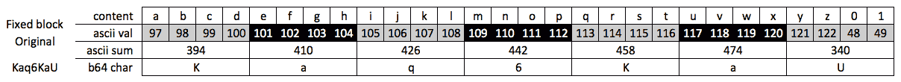

然后，我们通过将四个字符的 ASCII 值相加来总结这些 4 字节的块，如表格的第三行所示。接着，我们通过将 394 对 64 取模（*394 % 64*），得到 10，或者说是 Base64 字母表中的 K。这个 Base64 值，正如你可能猜到的，在第四行显示。

字母 K 成为我们第一个块的总结，字母 a 代表第二个，依此类推，直到我们得到完整的文件签名 Kaq6KaU。

在下图中，有一个略微修改过的版本的原始文件。如图所示，有人将 jklmn 替换为 hello。现在我们可以对这个文件运行我们的哈希算法，看看两个版本之间发生了多少变化：

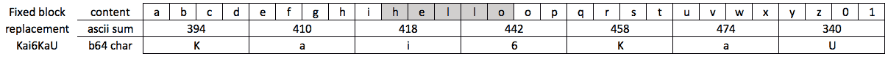

使用相同的技术，我们计算 Kai6KaU 的新哈希值。如果我们想要比较两个文件的相似性，我们应该能够利用我们的签名来促进比较，对吗？所以在这个例子中，我们的签名之间有一个字母的差异，这意味着我们的两个文件流大致相似！

正如你可能已经注意到的，这里存在一个问题：我们在使用算法时发现了哈希冲突。在之前的示例中，每个文件的第四个块不同；第一个是 mnop，第二个是 loop。由于我们正在汇总文件内容来确定签名值，我们注定会得到不健康的哈希冲突。这些冲突可能会让我们误以为文件是相似的，实际上并非如此，而这种情况不幸的是由于在没有使用加密哈希算法的情况下总结文件内容所导致的。因此，我们必须在总结文件内容和遇到哈希冲突之间找到更好的平衡。

我们的下一个示例演示了插入发生时会发生什么。正如您在下面的图表中看到的，字母 h 被插入到 mn 后面，文件增加了一个字节，并且整个内容向右移动了一个位置。在这个例子中，我们的最后一个块只包含数字 1，尽管一些实现可能会有不同的处理方式：

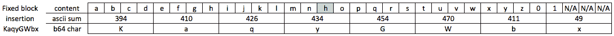

使用相同的公式，我们计算了 KaqyGUbx 的哈希。这个哈希与 Kaq6KaU 完全不同。事实上，一旦我们到达包含变化的块，哈希值完全不同，即使文件后半部分的内容是相似的。

这也是为什么使用固定块大小不是进行相似性分析的最佳方法的主要原因之一。任何内容的移动都会使数据跨越边界，导致我们为相似内容计算完全不同的哈希值。为了解决这个问题，我们需要以另一种方式设置这些边界。

# 上下文触发的分段哈希（CTPH）

正如你可能猜到的，这就是 CTPH 的作用所在。本质上，我们的目标是使用这种技术来计算重置点。在这种情况下，重置点是类似于我们在先前示例中使用的 4 字节边界，因为我们使用这些重置点来确定我们想要总结的文件部分。一个显著的例外是，我们根据文件内容（即我们的上下文触发）而不是固定窗口来选择边界。这意味着我们使用滚动哈希（由 ssdeep 和 spamsum 使用）来计算文件中的值；当找到这个特定值时，会画出边界线，并总结自上一个边界以来的内容（分段哈希）。在以下示例中，我们使用简化的计算来确定是否达到了重置点。

虽然 spamsum 和 ssdeep 都会为每个文件计算重置点数字，但在我们的示例中，我们将使用 *7* 来简化问题。这意味着每当我们的滚动哈希值为 *7* 时，我们将总结此边界和之前之间的内容。额外说明一下，这种技术适用于超过 28 字节的文件，因此我们的哈希值在这里会非常短，因此在我们的示例之外用途不大。

在进入示例之前，让我们先讨论一下什么是滚动哈希。我们将再次使用之前相同的示例文件内容。然后，我们使用所谓的滚动哈希来计算文件中每个字节的值。滚动哈希的工作原理是：在文件的某个窗口内计算所有字符的哈希值。在我们的例子中，窗口的大小为 3。我们文件中的窗口移动如下所示，经过前四次迭代：

+   `['a', '', ''] = [97, 0, 0]`

+   `['a', 'b', ''] = [97, 98, 0]`

+   `['a', 'b', 'c'] = [97, 98, 99]`

+   `['b', 'c', 'd'] = [98, 99, 100]`

如你所见，滚动窗口会继续遍历文件，每次迭代添加一个新的字节，并以 FIFO 的方式删除最旧的字节。为了生成该窗口的哈希值，我们需要对窗口中的值执行一系列进一步的计算。

对于这个例子，如你可能猜到的那样，我们将对 ASCII 值求和以保持简单。这个求和结果显示在下一个示例的第一行。为了使数字更小，我们将对求和后的 ASCII 值（*S*）进行模 8 运算（*S % 8*），并使用这个整数来寻找文件内容中的边界。这个数字可以在下图的第二行找到。如果*S % 8 == 7*，我们已经达到了重置点，可以创建之前块的汇总。

ssdeep 和 spamsum 算法在处理滚动窗口计算时有所不同，尽管计算的结果在使用方式上是相同的。我们简化了计算过程，以便更容易讨论这个过程。

由于我们的重置点是 7，如前所述，我们将在每次滚动哈希计算返回 7 时，定义文件的一个块。下图通过水平线显示了我们在文件中设置的块。

对于每个块，我们将以与之前相同的方式计算签名：将整个块内的 ASCII 整数值求和（如第四行所示），然后应用模 64 运算得到签名的字符（如最后一行所见）。请记住，在这个例子中，第 2 行和第 4 行之间的唯一关系是，第 2 行告诉我们何时设置重置点并计算第 4 行中显示的数字。这两个哈希在算法上是独立的。第 4 行仍然是对*a + b + c + d + e + f*的 ASCII 值求和，而不是滚动哈希输出的和：

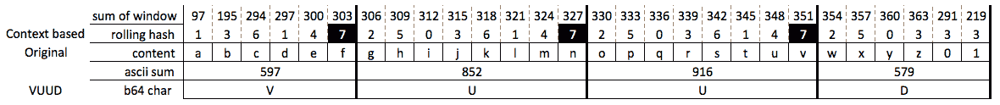

这生成了签名 VUUD。尽管短得多，但我们现在得到了上下文触发的哈希。如前所述，我们通过使用滚动哈希来定义边界（即上下文触发），并通过对块的求和（逐块哈希）来识别文件中的共同块，从而将其与具有相似重置点大小的文件进行比较（或者其他重置点为 7 的文件）。

在我们的最终示例中，让我们回顾一下当我们插入字母 h 时发生了什么。使用我们的滚动哈希来计算基于上下文的块（如第一行所示），我们可以使用相同的算法计算块的摘要，并生成签名 VUH1D：

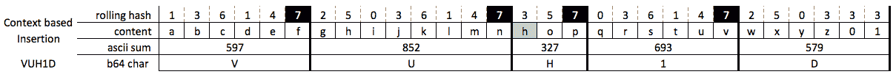

如你所见，这项技术对插入更具韧性，允许我们比使用固定块更准确地比较文件之间的差异。在这种情况下，我们的签名显示两个文件的差异比实际差异更大，尽管这种技术比我们的固定块计算更准确，因为它理解文件的尾部在我们两个版本之间是相同的。

显然，这项技术需要大于 28 字节的文件才能产生准确的结果，尽管希望这个简化过程能够帮助说明这些模糊哈希是如何生成的。理解这一点后，让我们开始编写我们的脚本。

# 实现 fuzzy_hasher.py

该脚本已在 Python 版本 2.7.15 和 3.7.1 上进行了测试，并且没有使用任何第三方库。

在我们深入了解模糊哈希算法之前，让我们像之前一样开始脚本。我们从导入开始，所有这些都是我们之前使用过的标准库，接下来会展示在代码中。我们还定义了一组常量，从第 36 行到第 47 行。第 37 行和第 38 行定义了我们的签名字母表，在这个例子中是所有 base64 字符。下一组常量用于 spamsum 算法生成哈希。`CONTEXT_WINDOW` 定义了我们将读取多少文件内容用于滚动哈希。`FNV_PRIME` 用于计算哈希，而 `HASH_INIT` 为我们的哈希设置初始值。接下来是 `SIGNATURE_LEN`，它定义了我们的模糊哈希签名应该有多长。最后，`OUTPUT_OPTS` 列表用于与我们的参数解析一起显示支持的输出格式——更多内容稍后介绍：

```
001 """Spamsum hash generator."""
002 import argparse
003 import logging
004 import json
005 import os
006 import sys
007
008 """ The original spamsum algorithm carries the following license:
009 Copyright (C) 2002 Andrew Tridgell <tridge@samba.org>
010 
011 This program is free software; you can redistribute it and/or
012 modify it under the terms of the GNU General Public License
013 as published by the Free Software Foundation; either version 2
014 of the License, or (at your option) any later version.
015 
016 This program is distributed in the hope that it will be useful,
017 but WITHOUT ANY WARRANTY; without even the implied warranty of
018 MERCHANTABILITY or FITNESS FOR A PARTICULAR PURPOSE. See the
019 GNU General Public License for more details.
020 
021 You should have received a copy of the GNU General Public License
022 along with this program; if not, write to the Free Software
023 Foundation, Inc.,
024 51 Franklin Street, Fifth Floor, Boston, MA 02110-1301, USA.
025 
026 CHANGELOG:
027 Implemented in Python as shown below by Chapin Bryce &
028 Preston Miller
029 """
030
031 __authors__ = ["Chapin Bryce", "Preston Miller"]
032 __date__ = 20181027
033 __description__ = '''Generate file signatures using
034     the spamsum algorithm.'''
035 
036 # Base64 Alphabet
037 ALPHABET = 'ABCDEFGHIJKLMNOPQRSTUVWXYZ'
038 ALPHABET += 'abcdefghijklmnopqrstuvwxyz0123456789+/'
039 
040 # Constants for use with signature calculation
041 CONTEXT_WINDOW = 7
042 FNV_PRIME = 0x01000193
043 HASH_INIT = 0x28021967
044 SIGNATURE_LEN = 64
045 
046 # Argument handling constants
047 OUTPUT_OPTS = ['txt', 'json', 'csv']
048 logger = logging.getLogger(__file__)
```

这个脚本有三个功能：`main()`、`fuzz_file()` 和 `output()`。`main()` 函数作为我们的主要控制器，处理目录和单个文件的处理，并调用 `output()` 函数来显示哈希结果。`fuzz_file()` 函数接受文件路径并生成一个 spamsum 哈希值。然后，`output()` 函数接受哈希值和文件名，并以指定的格式显示这些值：

```
051 def main(file_path, output_type):
...
087 def fuzz_file(file_path):
...
188 def output(sigval, filename, output_type='txt'):
```

我们脚本的结构相当直接，正如下图所示。由虚线所示，`fuzz_file()` 函数是唯一返回值的函数。这是因为我们的 `output()` 函数将内容显示在控制台上，而不是返回给 `main()`：

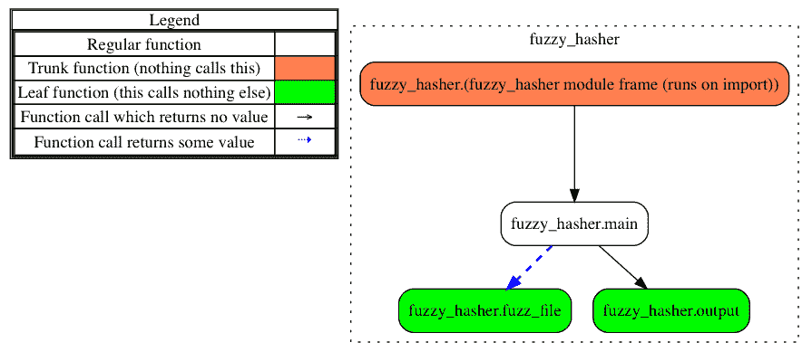

最后，我们的脚本以参数处理和日志初始化结束。对于命令行参数，我们接受一个文件或文件夹的路径以及输出格式。我们的输出将写入控制台，当前支持文本、CSV 和 JSON 输出类型。我们的日志参数是标准的，与我们其他实现非常相似，唯一不同的是我们将日志消息写入`sys.stderr`，以便用户仍然可以与通过`sys.stdout`生成的输出进行交互：

```
204 if __name__ == '__main__':
205     parser = argparse.ArgumentParser(
206         description=__description__,
207         epilog='Built by {}. Version {}'.format(
208             ", ".join(__authors__), __date__),
209         formatter_class=argparse.ArgumentDefaultsHelpFormatter
210     )
211     parser.add_argument('PATH',
212         help='Path to file or folder to generate hashes for. '
213              'Will run recursively.')
214     parser.add_argument('-o', '--output-type',
215         help='Format of output.', choices=OUTPUT_OPTS,
216         default="txt")
217     parser.add_argument('-l', help='specify log file path',
218         default="./")
219 
220     args = parser.parse_args()
221 
222     if args.l:
223         if not os.path.exists(args.l):
224             os.makedirs(args.l) # create log directory path
225             log_path = os.path.join(args.l, 'fuzzy_hasher.log')
226     else:
227         log_path = 'fuzzy_hasher.log'
228 
229     logger.setLevel(logging.DEBUG)
230     msg_fmt = logging.Formatter("%(asctime)-15s %(funcName)-20s"
231         "%(levelname)-8s %(message)s")
232     strhndl = logging.StreamHandler(sys.stderr) # Set to stderr
233     strhndl.setFormatter(fmt=msg_fmt)
234     fhndl = logging.FileHandler(log_path, mode='a')
235     fhndl.setFormatter(fmt=msg_fmt)
236     logger.addHandler(strhndl)
237     logger.addHandler(fhndl)
238 
239     logger.info('Starting Fuzzy Hasher v. {}'.format(__date__))
240     logger.debug('System ' + sys.platform)
241     logger.debug('Version ' + sys.version.replace("\n", " "))
242 
243     logger.info('Script Starting')
244     main(args.PATH, args.output_type)
245     logger.info('Script Completed')
```

有了这个框架，让我们来探讨一下`main()`函数是如何实现的。

# 从`main()`函数开始

我们的主函数接受两个参数：文件路径和输出类型。我们首先检查输出类型，确保它在`OUTPUT_OPTS`列表中，以防函数是从没有验证的其他代码中调用的。如果是一个未知的输出格式，我们将抛出错误并退出脚本：

```
051 def main(file_path, output_type):
052     """
053     The main function handles the main operations of the script
054     :param file_path: path to generate signatures for
055     :param output_type: type of output to provide
056     :return: None
057     """
058 
059     # Check output formats
060     if output_type not in OUTPUT_OPTS:
061         logger.error(
062             "Unsupported output format '{}' selected. Please "
063             "use one of {}".format(
064                 output_type, ", ".join(OUTPUT_OPTS)))
065         sys.exit(2)
```

然后，我们开始处理文件路径，在第 67 行获取其绝对路径，在第 69 行检查它是否是一个目录。如果是，我们就开始遍历目录和子目录，查找并处理其中的所有文件。第 71 到第 73 行的代码应该在第五章，*Python 中的数据库*中见过。第 74 行，我们调用`fuzz_file()`函数生成我们的哈希值`sigval`。然后，这个`sigval`值连同文件名和输出格式一起传递给我们的`output()`函数：

```
067     # Check provided file path
068     file_path = os.path.abspath(file_path)
069     if os.path.isdir(file_path):
070         # Process files in folders
071         for root, _, files in os.walk(file_path):
072             for f in files:
073                 file_entry = os.path.join(root, f)
074                 sigval = fuzz_file(file_entry)
075                 output(sigval, file_entry, output_type)
```

我们的`main()`函数的其余部分处理单个文件的处理和无效路径的错误处理。如第 76 行到第 79 行所示，如果路径是一个文件，我们将按照之前的方式处理它，通过`fuzz_file()`生成哈希值，并将值传递给`output()`函数。最后，在第 80 行到第 84 行，我们处理访问指定文件或文件夹路径时的错误：

```
076     elif os.path.isfile(file_path):
077         # Process a single file
078         sigval = fuzz_file(file_path)
079         output(sigval, file_path, output_type)
080     else:
081         # Handle an error
082         logger.error("Error - path {} not found".format(
083             file_path))
084         sys.exit(1)
```

# 创建我们的模糊哈希

在我们深入讨论`fuzz_file()`函数的代码之前，让我们简要讨论一下其中的工作部分：

+   一个滚动哈希

+   一个从文件大小得出的计算重置点

+   两个传统的哈希，在本例中利用了 FNV 算法

滚动哈希与我们之前的示例相似，用于识别我们将使用传统哈希进行总结的边界。对于 ssdeep 和 spamsum，滚动哈希比较的重置点（在我们之前的示例中设置为`7`）是基于文件的大小来计算的。我们稍后会展示用于确定这个值的确切函数，不过我们想强调的是，这意味着只有具有相同块大小的文件才能进行比较。虽然在概念上还有更多要讨论的，但让我们开始通过代码来实践这些概念。

现在我们进入有趣的部分：`fuzz_file()`函数。这个函数接受一个文件路径，并使用文件开头找到的常量来处理签名的计算：

```
087 def fuzz_file(file_path):
088     """
089     The fuzz_file function creates a fuzzy hash of a file
090     :param file_path (str): file to read.
091     :return (str): spamsum hash
092     """
```

# 生成我们的滚动哈希

以下代码块是我们的滚动哈希函数。现在，函数内部再嵌套一个函数可能看起来有些奇怪，但这种设计有一些优点。首先，它有助于组织代码。这个滚动哈希代码块仅由我们的 `fuzz_file()` 函数使用，通过将其嵌套在这个函数内部，我们可以告知下一个阅读我们代码的人情况就是如此。其次，通过将这个函数放置在 `fuzz_file()` 内部，我们可以确保任何导入我们代码作为模块的人不会误用滚动哈希函数。虽然选择这种设计还有其他多个效率和管理方面的理由，但我们希望在这个脚本中引入这一特性，让你了解这一概念。正如你在我们的其他脚本中看到的，这并不总是用于特殊功能，但它是你可以在脚本中使用的工具，以优化其设计。

这个嵌套函数接受两个参数，分别缩写为 `nb`（代表 `new_byte`）和 `rh`（代表我们的滚动哈希追踪字典）。在我们之前的示例中，为了计算滚动哈希，我们将整个窗口的 ASCII 值相加。在这个函数中，我们将执行一系列计算，帮助我们生成一个更大的 7 字节窗口的滚动哈希：

```
095     def update_rolling_hash(nb, rh):
096         """
097         Update the rolling hash value with the new byte
098         :param nb (int): new_byte as read from file
099         :param rh (dict): rolling hash tracking dictionary
100         :return: computed hash value to compare to reset_point
101         """
```

`rh` 滚动哈希追踪字典用于监控此滚动哈希中的移动部分。这里存储了三个数字，分别是 `r1`、`r2` 和 `r3`。这些数字需要进行额外的计算，如下方代码块所示，三者的和作为整数返回，代表该文件帧的滚动哈希。

字典追踪的其他两个元素是 `rn` 和 `rw`。`rn` 键保存滚动哈希在文件中的偏移位置，用于确定窗口中哪个字符被 `nb`、`new_byte` 值替换。这个窗口，正如你猜到的那样，存储在 `rw` 中。与我们之前的示例不同，在那里每次计算滚动哈希时，窗口中的每个字符都向左移动，这个实现只会替换数组中的最旧字符。这提高了效率，因为它只需进行一次操作，而不是八次：

```
102         # Calculate R2
103         rh['r2'] -= rh['r1']
104         rh['r2'] += (CONTEXT_WINDOW * nb)
105 
106         # Calculate R1
107         rh['r1'] += nb
108         rh['r1'] -= rh['rw'][rh['rn'] % CONTEXT_WINDOW]
109 
110         # Update RW and RN
111         rh['rw'][rh['rn'] % CONTEXT_WINDOW] = nb
112         rh['rn'] += 1
113 
114         # Calculate R3
115         rh['r3'] = (rh['r3'] << 5) & 0xFFFFFFFF
116         rh['r3'] = rh['r3'] ^ nb
117 
118         # Return the sum of R1 + R2 + R3
119         return rh['r1'] + rh['r2'] + rh['r3']
```

这个逻辑在计算上与 ssdeep 和 spamsum 使用的逻辑相同。首先，我们通过减去 `r1` 并加上 `CONTEXT_WINDOW` 与 `new_byte` 的乘积来计算 `r2` 值。然后，我们通过加上 `new_byte` 并减去窗口中最旧的字节来更新 `r1` 值。这意味着 `r1` 存储整个窗口的总和，类似于我们在前一个示例中的整个滚动哈希算法。

在第 111 行，我们开始更新窗口，用 `new_byte` 字符替换最旧的字节。之后，我们递增 `rn` 值，以准确追踪文件中的偏移量。

最后，我们计算`r3`值，它使用了一些我们尚未介绍的操作符。`<<`运算符是一个按位运算符，它将我们的值向左移动，在这个例子中是移动五位。这等同于我们将值乘以 2**5。第 115 行的第二个新的按位运算符是`&`，它在 Python 中是按位的`AND`运算符。这个运算符逐位比较两边的值，如果两个值在某一位上都是`1`，则该位置在输出中为`1`，否则为`0`。需要注意的是，在按位`AND`运算中，两边在同一位置上都是`0`时，结果不会是`1`。第 116 行的第三个新按位运算符是`^`，即排它的`OR`运算符，也称为 XOR 操作。它的工作原理大致与按位`AND`相反，即如果两个值在同一位置的比特不同，则该位置返回`1`；如果相同，则返回`0`。

有关 Python 中按位运算符的更多信息，请访问[`wiki.python.org/moin/BitwiseOperators`](https://wiki.python.org/moin/BitwiseOperators)。

处理完按位运算后，我们返回`r1`、`r2`和`r3`的总和，用于进一步的模糊哈希计算。

# 准备签名生成

回到我们的`fuzz_file()`函数，我们评估提供的文件，看看它是否包含内容，如果有，则打开文件。我们将该文件的大小存储起来，以供后续使用：

```
122     fsize = os.stat(file_path).st_size
123     if fsize == 0:
124         logger.warning("File is 0-bytes. Skipping...")
125         return ""
126     open_file = open(file_path, 'rb')
```

我们现在开始哈希算法中的第一个因素——**重置点**。这个值被标记为签名中的第一个值，因为它用于确定可以进行比较的哈希值。为了计算这个数字，我们从`3`开始，这个值在 spamsum 算法中被选为最小的重置点。然后我们将重置点加倍，如第 130 行所示，直到它大于`filesize / 64`：

```
129     reset_point = 3
130     while reset_point * 64 < fsize:
131         reset_point *= 2
```

一旦我们有了初始的重置点，我们将文件读入内存作为`bytearray`，因为我们希望将每个字符作为字节读取，这样我们可以进行解释。然后我们设置`while`循环，如果需要调整`reset_point`的大小，就在这里进行——稍后会详细讨论：

```
134     complete_file = bytearray(open_file.read())
135     done = False
136     while not done:
```

一旦进入我们的`while`循环，我们将初始化哈希对象。第一个对象是`rolling_hash`，这是一个包含五个键的字典。`r1`、`r2`和`r3`键用于计算哈希值；`rn`键跟踪文件中光标的位置；`rw`键保存一个大小为`CONTEXT_WINDOW`常量的列表。这个字典在我们的`update_rolling_hash()`函数中被大量引用。现在你已经看过`rolling_hash`字典的结构，重新阅读这一部分可能会有所帮助。

紧接着这个字典，我们初始化了`trad_hash1`和`trad_hash2`，并赋予它们`HASH_INIT`常量的值。最后，我们初始化了两个签名：`sig1`和`sig2`。变量`trad_hash1`用于填充`sig1`的值，类似地，`trad_hash2`用于填充`sig2`的值。稍后我们将展示如何计算这些传统哈希并更新签名：

```
138         rolling_hash = {
139             'r1': 0,
140             'r2': 0,
141             'r3': 0,
142             'rn': 0,
143             'rw': [0 for _ in range(CONTEXT_WINDOW)]
144         }
145         trad_hash1 = HASH_INIT
146         trad_hash2 = HASH_INIT
147         sig1 = ""
148         sig2 = ""
```

一旦我们初始化了哈希值，就可以开始按行遍历文件，如第 151 行所示。在第 153 行，我们使用文件中的最新字节和`rolling_hash`字典来计算滚动哈希。记住，字典可以作为参数传递给函数并进行更新，而且更新后的值可以在函数外部保留，而无需返回。这使得与滚动哈希函数的接口更简洁。该函数仅返回计算出的滚动哈希值，之前已经讨论过，它的形式是一个整数。这个滚动哈希使我们能够通过字节流对数据的移动（或滚动）窗口进行哈希，并用于确定在文件中何时应向签名中添加字符：

```
151         for new_byte in complete_file:
152             # Calculate our rolling hash
153             rh = update_rolling_hash(new_byte, rolling_hash)
```

计算滚动哈希值后，我们需要更新传统哈希。这些哈希使用**Fowler–Noll–Vo**（**FNV**）哈希算法，其中我们将哈希的前一个值与固定的素数相乘，这个素数是我们常量之一，然后与新的数据字节进行异或运算（之前讨论过的`^`）。与滚动哈希不同，这些哈希值会随着每个新字节的加入而不断增加，直到我们到达某个边界。

```
156             trad_hash1 = (trad_hash1 * FNV_PRIME) ^ new_byte
157             trad_hash2 = (trad_hash2 * FNV_PRIME) ^ new_byte
```

这些边界通过两个条件语句进行评估，每个哈希/签名对一个条件。第 161 行到 164 行的功能等同于第 165 行到 168 行，唯一不同的是使用了不同的传统哈希和签名。为了简化，我们先来分析第一个。

在第 161 行和 162 行（由于换行），我们有第一个条件语句，它判断我们的滚动哈希与`reset_point`的乘积对`reset_point`取模后，是否等于`reset_point - 1`。我们还确保整体签名长度小于最大签名长度减去 1。如果这些条件满足，就表示我们已到达边界，并会将传统哈希值转换为签名字符，如第 163 行所示。在向签名中添加字符后，我们会将传统哈希值重置为初始值，这意味着下一个数据块的哈希值将从与前一个数据块相同的位置开始。

如前所述，这对于第二个签名是重复的，显著的例外是第二个签名正在修改`reset_point`（将其乘以 2）和最大签名长度（将其除以 2）。第二个重置点的添加是为了满足 spamsum 签名较短的需求——默认 64 个字符。这意味着主签名可能被截断，文件的尾部可能只代表签名的一个字符。为了应对这个问题，spamsum 添加了第二个签名来生成一个代表更多（如果不是全部）文件的值。第二个签名实际上有一个`reset_point`，其值是第一个签名的两倍：

```
159             # Check if our rolling hash reaches a reset point
160             # If so, update sig and reset trad_hash
161            if (rh % reset_point == reset_point - 1
162                     and len(sig1) < SIGNATURE_LEN - 1):
163                 sig1 += ALPHABET[trad_hash1 % 64]
164                 trad_hash1 = HASH_INIT
165             if (rh % (reset_point * 2) == (reset_point * 2) - 1
166                     and len(sig2) < (SIGNATURE_LEN / 2) - 1):
167                 sig2 += ALPHABET[trad_hash2 % 64]
168                 trad_hash2 = HASH_INIT
```

这是我们`for`循环的结束；该逻辑将重复，直到我们到达文件末尾，尽管签名的长度将分别只增长到 63 和 31 个字符。在我们的`for`循环退出后，我们会评估是否应该重新开始`while`循环（从第 136 行开始）。如果我们的第一个签名少于 32 个字符，且我们的`reset_point`不是默认值 3，我们希望这样做。如果签名过短，我们将`reset_point`值减半并重新运行整个计算。这意味着我们在`while`循环中需要每一分效率，因为我们可能会反复处理内容：

```
170         # If sig1 is too short, change block size and recalculate
171         if len(sig1) < SIGNATURE_LEN / 2 and reset_point > 3:
172             reset_point = reset_point // 2
173             logger.debug("Shortening block size to {}".format(
174                 reset_point))
175         else:
176             done = True
```

如果我们的签名长度大于 32 个字符，我们退出`while`循环并生成签名的最后一个字符。如果我们的滚动哈希值的乘积不等于零，我们会将最后一个字符添加到每个签名中，如第 180 行和第 181 行所示：

```
178     # Add any values from the tail to our hash
179     if rh != 0:
180         sig1 += ALPHABET[trad_hash1 % 64]
181         sig2 += ALPHABET[trad_hash2 % 64]
182 
183     # Close the file and return our new signature
184     open_file.close()
185     return "{}:{}:{}".format(reset_point, sig1, sig2)
```

到此为止，我们可以关闭文件并返回完整的 spamsum/ssdeep 签名。这个签名有三个， hopefully 可识别的部分：

+   我们的`reset_point`值

+   主要签名

+   次要签名

# 提供输出

幸运的是，我们的最后一个函数比前一个要简单得多。这个函数提供了以一种支持的格式输出签名和文件名。在过去，我们编写了单独的函数来处理不同的格式，然而在这个情况下，我们选择将它们都放在同一个函数中。这个设计决策的原因是我们希望能够接近实时地提供结果，特别是当用户正在处理多个文件时。由于我们的日志被重定向到`STDERR`，我们可以使用`print()`函数将结果提供到`STDOUT`。这样可以为用户提供灵活性，用户可以将输出通过管道传送到另一个程序（例如 grep），并对结果进行额外处理：

```
188 def output(sigval, filename, output_type='txt'):
189     """Write the output of the script in the specified format
190     :param sigval (str): Calculated hash
191     :param filename (str): name of the file processed
192     :param output_type (str): Formatter to use for output
193     """
194     if output_type == 'txt':
195         print("{} {}".format(sigval, filename))
196     elif output_type == 'json':
197         print(json.dumps({"sig": sigval, "file": filename}))
198     elif output_type == 'csv':
199         print("{},\"{}\"".format(sigval, filename))
200     else:
201         raise NotImplementedError(
202             "Unsupported output type: {}".format(output_type))
```

# 运行 fuzzy_hasher.py

以下截图展示了我们如何在目录中的一组文件上生成模糊哈希并对输出进行后处理。在这种情况下，我们通过将`STDERR`发送到`/dev/null`来隐藏日志消息。然后，我们将输出通过管道传输到`jq`，一个格式化和查询 JSON 数据的工具，来以漂亮的格式呈现输出：

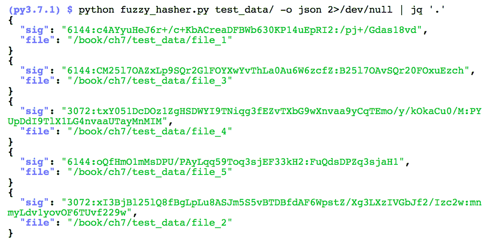

在这个输出中，你可能会注意到一些事情。首先，我们要强调的是文件没有按照字母顺序排列。这是因为我们的`os.walk`函数在遍历路径时默认不会保持字母顺序。第二个问题是，尽管这些文件的大小相同，但它们的块大小不同。这意味着一些文件（包含随机内容）没有足够的块，因此签名太短。这意味着我们需要将块大小减半并重新尝试，这样当我们进入比较部分时，就能比较具有足够相似块的文件。另一方面，具有 3,072 个块的文件（`file_2`和`file_4`）的第二个签名可以部分与其他块大小为 6,144 的文件的第一个签名进行比较。

我们提供了这些测试文件供你使用和比较，以确认我们的实现与你的实现相符，并且与下一个脚本的输出一致。

# 在 Python 中使用 ssdeep – ssdeep_python.py

这个脚本已经在 Python 2.7.15 和 3.7.1 版本中进行了测试，并且需要 ssdeep 版本 3.3 的第三方库。

正如你可能已经注意到的，之前的实现几乎慢得不可忍受。在这种情况下，最好利用像 C 语言这样的语言，它能够更快速地执行这个操作。幸运的是，spamsum 最初是用 C 语言编写的，后来通过 ssdeep 项目进一步扩展，依然是 C 语言实现的。ssdeep 项目提供的扩展之一是 Python 绑定。这些绑定允许我们仍然使用熟悉的 Python 函数调用，同时将繁重的计算任务卸载到已编译的 C 代码中。我们的下一个脚本涵盖了在 Python 模块中实现 ssdeep 库，以产生相同的签名并处理比较操作。

在这个模糊哈希的第二个示例中，我们将使用 ssdeep Python 库实现一个类似的脚本。这使我们能够利用 ssdeep 工具和 spamsum 算法，后者在数字取证和信息安全领域得到了广泛的应用和接受。这段代码将是大多数场景下模糊哈希的首选方法，因为它在资源使用上更高效，且能产生更准确的结果。这个工具在社区中得到了广泛的支持，许多 ssdeep 签名可以在线获取。例如，VirusShare 和 VirusTotal 网站上托管了来自 ssdeep 的哈希值。这些公开的信息可以用来检查已知的恶意文件，它们可能与主机机器上的可执行文件匹配或相似，而无需下载恶意文件。

ssdeep 的一个弱点是它仅提供匹配百分比的信息，并且无法比较具有显著不同块大小的文件。这可能是一个问题，因为 ssdeep 会根据输入文件的大小自动生成块大小。这个过程使得 ssdeep 比我们的脚本运行更高效，并且在扩展性方面表现得更好；然而，它并没有提供手动指定块大小的解决方案。我们可以拿之前的脚本并硬编码块大小，尽管这会引入其他（之前讨论过的）问题。

这个脚本与另一个脚本相同，唯一的不同是新增了 ssdeep 库的导入。要安装此库，请运行 `pip install ssdeep==3.3`，如果失败，可以按照 [`pypi.python.org/pypi/ssdeep`](https://pypi.python.org/pypi/ssdeep) 上的文档运行 `BUILD_LIB=1 pip install ssdeep==3.3`。这个库并不是 ssdeep 的开发者创建的，而是社区的另一位成员创建的，提供了 Python 与 C 基于的库之间需要的绑定。安装完成后，可以像第 7 行所示那样导入：

```
001 """Example script that uses the ssdeep python bindings."""
002 import argparse
003 import logging
004 import os
005 import sys
006 
007 import ssdeep
```

这个版本的结构与我们之前的版本相似，尽管我们将所有计算工作交给了 `ssdeep` 库。虽然我们可能缺少了哈希和比较函数，但我们仍然以非常相似的方式使用我们的 `main` 和 `output` 函数：

```
047 def main():
...
104 def output(): 
```

我们的程序流程与之前的迭代相似，尽管它缺少了我们在上一次迭代中开发的内部哈希函数。如流程图所示，我们仍然在 `main()` 函数中调用 `output()` 函数：

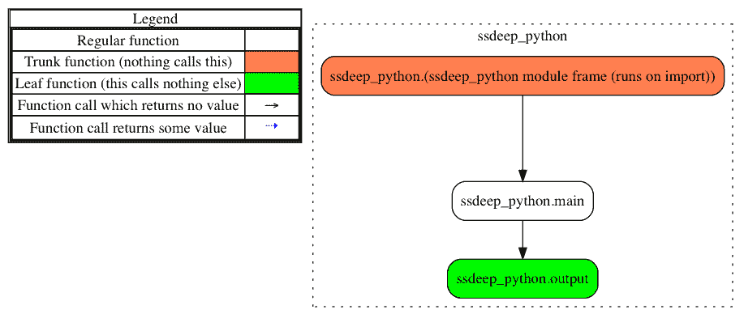

我们的参数解析和日志配置几乎与之前的脚本相同。主要的区别是我们引入了一个新的文件路径参数，并重命名了接受文件或文件夹的参数。在第 134 行，我们再次创建了 `argparse` 对象来处理我们的两个位置参数和两个可选的输出格式及日志标志。该代码块的其余部分与之前的脚本一致，唯一的区别是我们重命名了日志文件：

```
134 if __name__ == '__main__':
135     parser = argparse.ArgumentParser(
136         description=__description__,
137         epilog='Built by {}. Version {}'.format(
138             ", ".join(__authors__), __date__),
139         formatter_class=argparse.ArgumentDefaultsHelpFormatter
140     )
141     parser.add_argument('KNOWN',
142         help='Path to known file to use to compare')
143     parser.add_argument('COMPARISON',
144         help='Path to file or directory to compare to known. '
145         'Will recurse through all sub directories')
```

# 重访 `main()` 函数

这个 `main()` 函数与之前的脚本非常相似，虽然它添加了一些额外的代码行，因为我们增加了一些功能。该脚本从检查输出类型是否为有效格式开始，如第 56 行到第 62 行所示。然后，我们在第 63 行添加了另一个条件，使我们能够打印 CSV 表头行，因为这个输出比上一个版本更复杂：

```
047 def main(known_file, comparison, output_type):
048     """
049     The main function handles the main operations of the script
050     :param known_file: path to known file
051     :param comparison: path to look for similar files
052     :param output_type: type of output to provide
053     :return: None
054     """
055 
056     # Check output formats
057     if output_type not in OUTPUT_OPTS:
058         logger.error(
059             "Unsupported output format '{}' selected. Please "
060             "use one of {}".format(
061                 output_type, ", ".join(OUTPUT_OPTS)))
062         sys.exit(2)
063     elif output_type == 'csv':
064         # Special handling for CSV headers
065         print('"similarity","known_file","known_hash",'
066               '"comp_file","comp_hash"')
```

现在我们已经处理了输出格式的验证，让我们转向文件比较部分。首先，我们会获取已知文件和比较路径的绝对路径，以便与之前的脚本保持一致。然后，在第 73 行，我们检查已知文件是否存在。如果存在，我们会在第 78 行计算 ssdeep 哈希值。这个计算完全由 ssdeep 处理；我们需要做的只是提供一个有效的文件路径给`hash_from_file()`方法。此方法返回一个包含 ssdeep 哈希值的字符串，结果与我们在之前脚本中的`fuzz_file()`函数相同。这里的主要区别是通过使用高效的 C 代码在`ssdeep`模块中运行，从而提升了速度：

```
068     # Check provided file paths
069     known_file = os.path.abspath(known_file)
070     comparison = os.path.abspath(comparison)
071
072     # Generate ssdeep signature for known file
073     if not os.path.exists(known_file):
074         logger.error("Error - path {} not found".format(
075             comparison))
076         sys.exit(1)
077
078     known_hash = ssdeep.hash_from_file(known_file)
```

现在我们有了已知的哈希值，可以评估比较路径。如果该路径是一个目录，如第 81 行所示，我们将遍历该文件夹及其子文件夹，寻找要处理的文件。在第 86 行，我们生成这个比较文件的哈希值，方法与已知文件相同。下一行引入了`compare()`方法，允许我们提供两个哈希值进行评估。该比较方法返回一个介于 0 到 100（包括 0 和 100）之间的整数，表示这两个文件内容相似的可信度。然后，我们将所有部分（包括文件名、哈希值和结果相似度）提供给我们的输出函数，并附上我们的格式化规范。这段逻辑会一直进行，直到我们递归处理完所有文件：

```
080     # Generate and test ssdeep signature for comparison file(s)
081     if os.path.isdir(comparison):
082         # Process files in folders
083         for root, _, files in os.walk(comparison):
084             for f in files:
085                 file_entry = os.path.join(root, f)
086                 comp_hash = ssdeep.hash_from_file(file_entry)
087                 comp_val = ssdeep.compare(known_hash, comp_hash)
088                 output(known_file, known_hash,
089                        file_entry, comp_hash,
090                        comp_val, output_type)
```

我们的下一个条件处理相同的操作，但只针对一个文件。如你所见，它使用与目录操作相同的`hash_from_file()`和`compare()`函数。一旦所有的值都被分配，我们会以相同的方式将它们传递给我们的`output()`函数。我们的最终条件处理输入错误的情况，通知用户并退出：

```

092     elif os.path.isfile(comparison):
093         # Process a single file
094         comp_hash = ssdeep.hash_from_file(comparison)
095         comp_val = ssdeep.compare(known_hash, comp_hash)
096         output(known_file, known_hash, file_entry, comp_hash,
097                comp_val, output_type)
098     else:
099         logger.error("Error - path {} not found".format(
100             comparison))
101         sys.exit(1)
```

# 重新设计我们的`output()`函数

我们的最后一个函数是`output()`；这个函数接收多个值，并将它们整齐地呈现给用户。就像我们之前的脚本一样，我们将支持 TXT、CSV 和 JSON 输出格式。为了展示这种类型的函数的不同设计，我们将使用特定格式的条件来构建一个模板。然后，使用这个模板以格式化的方式打印内容。如果将来我们打算将输出函数（在本例中是`print()`）更换为其他输出函数，这种方法就会非常有用。

```
104 def output(known_file, known_hash, comp_file, comp_hash, comp_val,
105            output_type='txt'):
106     """Write the output of the script in the specified format
107     :param sigval (str): Calculated hash
108     :param filename (str): name of the file processed
109     :param output_type (str): Formatter to use for output
110     """
```

首先，我们需要将我们的整数值`comp_val`转换为字符串，以便与模板兼容。在第 112 行完成此操作后，我们将构建文本格式的模板。文本格式让我们能够自由地以适合视觉审查的方式展示数据。以下是一个选项，但你可以根据需要进行修改。

在第 113 和第 114 行，我们通过使用大括号包围占位符标识符来构建带有命名占位符的模板。跳到第 127 到第 132 行，你可以看到当我们调用 `msg.format()` 时，我们通过与占位符相同的名称提供我们的值作为参数。这告诉 `format()` 方法应该用哪个值填充哪个占位符。命名占位符的主要优势在于，我们在调用 `format()` 方法时，可以按任何顺序安排值，甚至可以让模板格式中的元素在不同位置：

```
111     comp_val = str(comp_val)
112     if output_type == 'txt':
113         msg = "{similarity} - {known_file} {known_hash} | "
114         msg += "{comp_file} {comp_hash}"
```

接下来是我们的 JSON 格式化。`json.dumps()` 方法是输出字典为 JSON 内容的首选方式，尽管在这个例子中我们将探讨如何通过其他方式实现类似的目标。通过使用相同的模板方法，我们构建了一个字典，其中键是固定的字符串，值是占位符。由于模板语法使用单个大括号来表示占位符，我们必须使用第二个大括号来转义单个大括号。这意味着我们的整个 JSON 对象被额外的大括号包裹——别担心，只有两个大括号中的一个会在打印时显示：

```
115     elif output_type == 'json':
116         msg = '{{"similarity": {similarity}, "known_file": '
117         msg += '"{known_file}", "known_hash": "{known_hash}", '
118         msg += '"comparison_file": "{comp_file}", '
119         msg += '"comparison_hash": "{comp_hash}"}}'
```

最后，我们有了我们的 CSV 输出，再次使用了命名占位符模板。正如你可能注意到的，我们将每个值都用双引号包围，以确保值中的任何逗号不会导致格式问题：

```
120     elif output_type == 'csv':
121         msg = '"{similarity}","{known_file}","{known_hash}"'
122         msg += '"{comp_file}","{comp_hash}"'
```

我们的 `msg` 变量在此处出现在多行的唯一原因是为了换行。除此之外，没有任何东西阻止你将整个格式模板放在一行。最后，我们有了 `else` 条件，它会捕捉到任何不支持的输出类型：

```
123     else:
124         raise NotImplementedError(
125             "Unsupported output type: {}".format(output_type))
```

在条件语句后，我们打印出已应用值的模板，以替代占位符。如果我们想支持一种新的或替代的格式，我们可以在上方添加新的条件，并创建所需的模板，而无需重新实现这个 `print()` 函数：

```
127     print(msg.format(
128         similarity=comp_val,
129         known_file=known_file,
130         known_hash=known_hash,
131         comp_file=comp_file,
132         comp_hash=comp_hash))
```

# 运行 ssdeep_python.py

现在我们可以运行脚本，例如，提供 `test_data/file_3` 作为已知文件，并将整个 `test_data/` 文件夹作为比较集。再次使用 JSON 输出，我们可以在接下来的两个截图中看到我们模板化的结果：

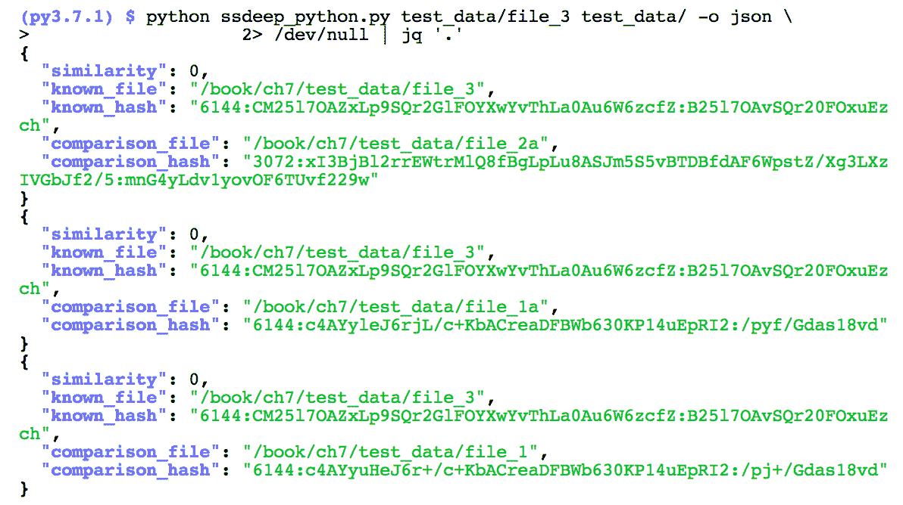

以下是我们继续的输出：

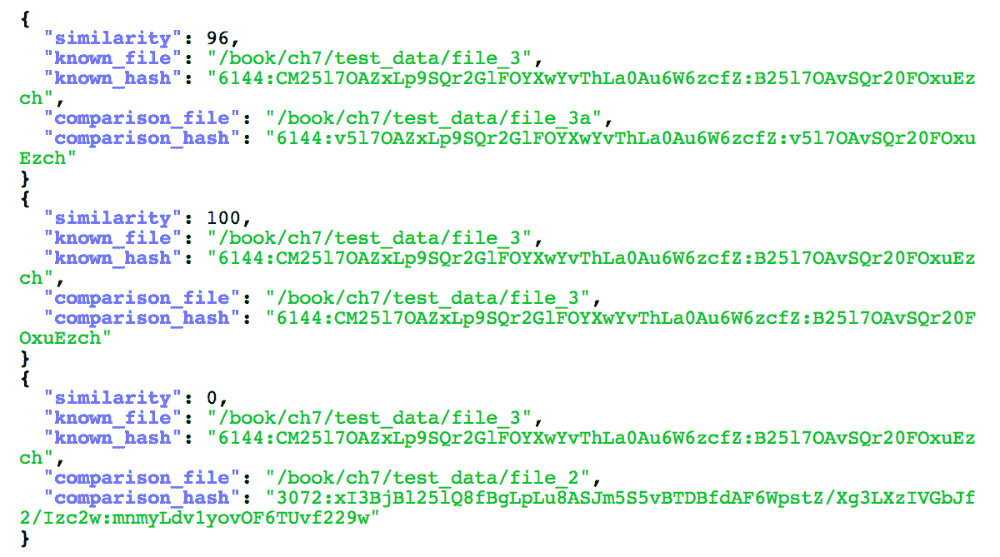

你还会注意到，使用 `ssdeep` 库的这个脚本，产生了与我们之前实现相同的签名！需要注意的一点是这两个脚本之间的速度差异。通过使用工具时间，我们运行了两个脚本，对相同文件夹中的这六个文件进行了处理。正如接下来的截图所示，使用我们导入的 `ssdeep` 模块，性能有了显著提升：

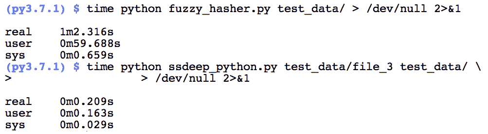

# 额外的挑战

你已经创建了一个实现 spamsum 算法的脚本，用来生成与 ssdeep 兼容的哈希值！接下来，还有一些额外的挑战等着你。

首先，我们提供了六个示例文件，这些文件位于前面提到的`test_data/`目录中。这些文件可用于确认你是否获得了与打印的哈希值相同的值，并且可以让你进行一些额外的测试。`file_1`、`file_2`和`file_3`文件是我们的原始文件，而附加了`a`的文件是原始文件的修改版本。随附的`README.md`文件包含了我们所做的修改说明，简而言之，我们进行了以下操作：

+   `file_1` 将部分文件内容移至文件的后半部分

+   `file_2` 在文件的前半部分插入内容

+   `file_3` 移除文件的开头部分

我们鼓励你进行额外的测试，了解 ssdeep 如何应对不同类型的修改。随意修改原始文件并与社区分享你的发现！

另一个挑战是研究 ssdeep 或 spamsum 代码，了解它如何处理比较组件，目标是将其加入到第一个脚本中。

我们还可以开发代码来展示，例如，Word 文档的内容，并生成该文档内容的 ssdeep 哈希，而不是二进制文件的哈希。这可以应用于其他类型的文件，不仅限于文本内容。例如，如果我们发现某个可执行文件被打包了，我们可能还想生成解包后字节内容的模糊哈希。

最后，市面上还有其他相似度分析工具。举例来说，`sdhash`工具采用了一种不同的方法来识别两个文件之间的相似性。我们建议你花些时间使用这个工具，将其应用于你和我们提供的测试数据，看看它如何应对不同类型的修改和变化。有关`sdhash`的更多信息，请访问网站：[`roussev.net/sdhash/sdhash.html`](http://roussev.net/sdhash/sdhash.html)。

# 参考文献

+   Kornblum, J. (2006). *使用上下文触发分段哈希识别几乎相同的文件*，数字调查，91-97\. 2015 年 10 月 31 日检索自[`dfrws.org/2006/proceedings/12-Kornblum.pdf`](http://dfrws.org/2006/proceedings/12-Kornblum.pdf)

+   Stevens, M. Karpmanm P. Peyrin, T. (2015)，*研究人员呼吁：行业标准 SHA-1 应尽快撤回*，2015 年 10 月 31 日检索自[`ee788fc4-a-62cb3a1a-s-sites.googlegroups.com/site/itstheshappening/shappening_PR.pdf`](https://ee788fc4-a-62cb3a1a-s-sites.googlegroups.com/site/itstheshappening/shappening_PR.pdf)

# 概述

哈希是 DFIR 工作流程中的一个关键组成部分。虽然大多数哈希的应用场景集中在完整性检查上，但相似性分析的使用使我们能够了解更多关于近似匹配和文件关系的信息。这个过程可以为恶意软件检测、识别未授权位置的受限文档以及仅基于内容发现紧密相关的项目提供深入的见解。通过使用第三方库，我们能够利用 C 语言背后的强大功能，同时享受 Python 解释器的灵活性，构建出既适合用户又适合开发者的强大工具。这个项目的代码可以从 GitHub 或 Packt 下载，具体信息见*前言*。

模糊哈希是一种元数据的形式，或者说是关于数据的数据。元数据还包括嵌入的属性，如文档编辑时间、图像地理位置信息和源应用程序。在下一章中，您将学习如何从各种文件中提取嵌入的元数据，包括图像、音频文件和办公文档。
