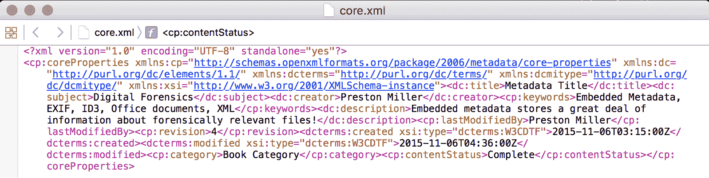

# 第八章：媒体时代

元数据，或描述数据的数据，是调查员可以利用的强大工具，帮助回答调查问题。广义来说，元数据可以通过检查文件系统和嵌入的元素来找到。文件权限、MAC 时间戳和文件大小记录在文件系统级别。然而，对于特定的文件类型，如 JPEG，额外的元数据会嵌入到文件本身中。

嵌入式元数据更特定于相关对象。这个嵌入式元数据可以提供额外的时间戳、特定文档的作者，甚至是照片的 GPS 坐标。像 Phil Harvey 的 ExifTool 这样的完整软件应用程序存在，用于从文件中提取嵌入式元数据，并将其与文件系统元数据合并。

本章将涵盖以下主题：

+   使用第一方和第三方库从文件中提取元数据

+   理解 **可交换图像文件格式**（**EXIF**）、ID3 和 Microsoft Office 嵌入式元数据

+   学习构建框架以促进脚本的快速开发和集成

本章的代码在 Python 2.7.15 和 Python 3.7.1 上开发和测试。

# 在 Python 中创建框架

框架对于大型 Python 项目非常有用。我们在第六章中曾提到过 `UserAssist` 脚本是一个框架，*从二进制文件中提取数据*；然而，它实际上并不完全符合这个模型。我们将构建的框架将有一个抽象的顶层，这个顶层将作为程序的控制器。这个控制器将负责执行插件和写入程序。

插件是包含在单独脚本中的代码，它为框架添加特定功能。开发完成后，插件应该能够通过几行代码轻松集成到现有框架中。插件还应该能够执行独立的功能，而不需要修改控制器来操作。例如，我们将编写一个插件专门处理 EXIF 元数据，另一个插件处理 Office 元数据。框架模型的一个优点是，它允许我们以有组织的方式将多个插件组合在一起，并为共同的目标执行它们，例如从文件中提取各种类型的嵌入式元数据。

构建框架需要一些前瞻性思维和规划。规划和测试你希望在框架中使用的数据结构类型是至关重要的。不同的数据结构适合不同的任务。考虑框架将处理的输入和输出类型，并以此为依据，选择合适的数据类型。发现更优的数据结构后重新编写框架可能是一个令人沮丧且耗时的任务。

如果没有这一步，框架可能会迅速变得无法控制，变成一团糟。想象一下每个插件都需要自己独特的参数，更糟糕的是，返回不同类型的数据，需要特殊处理。例如，一个插件可能返回一个字典的列表，而另一个插件可能返回一个字典中的字典。你的代码大部分会写成将这些数据类型转换为一个通用格式，以供编写器使用。为了保持理智，我们建议创建标准化的输入输出，每个插件都应遵循。这将使你的框架更容易理解，并避免不必要的转换错误，从而使其更稳定。

编写器从插件获取处理后的数据，并将其写入输出文件。我们熟悉的一种编写器是 CSV 编写器。在前面的章节中，我们的 CSV 编写器将处理后的数据输入并写入文件。在更大的项目中，比如这个项目，我们可能会有多种类型的编写器用于输出。例如，在本章中，我们将开发一个 Google Earth KML 编写器，以绘制我们从嵌入式 EXIF 元数据中提取的 GPS 数据。

# EXIF 元数据介绍

EXIF 元数据是一种标准，用于图像和音频文件标签，这些标签由设备和应用程序创建。最常见的，这种嵌入式元数据与 JPEG 文件相关联。然而，EXIF 元数据也存在于 TIFF、WAV 和其他文件中。在 JPEG 文件中，EXIF 元数据可以包含用于拍摄照片的技术相机设置，如快门速度、光圈值和 ISO 值。这些可能对检查员没有直接用处，但包含照片的制造商、型号和 GPS 位置的标签可以用于将某个人与犯罪联系起来。每个元素都与一个标签相关联。例如，制造商元数据是 EXIF 标签 271 或`0x010F`。标签的完整列表可以在[`www.exiv2.org/tags.html`](http://www.exiv2.org/tags.html)找到。

EXIF 元数据存储在 JPEG 图像的开头，如果存在，它位于字节偏移量 24 处。EXIF 头以十六进制`0x45786966`开始，这是“Exif”在 ASCII 中的表示。以下是 JPEG 图像前 52 个字节的十六进制转储：


请注意，从偏移量 24 开始的 EXIF 头。跟随其后的十六进制`0x4D4D`代表摩托罗拉或大端字节对齐。位于字节偏移 40 的`0x010F`标签 ID 是 EXIF 的`Make`元数据标签。每个标签由四个组件组成：

| **字节偏移量** | **名称** | **描述** |
| --- | --- | --- |
| 0-1 | ID | 代表特定 EXIF 元数据元素的标签 ID |
| 2-3 | 类型 | 数据类型（整数、字符串等） |
| 4-7 | 长度 | 数据的长度 |
| 8-11 | 偏移量 | 从字节对齐值的偏移量 |

在前面的表格中，`Make` 标签的数据类型为 2，对应于 ASCII 字符串，长度为 6 字节，位于字节对齐值 `0x4D4D` 之后 2206 字节的位置。第二个截图显示了从文件开始 2206 字节位置开始的 52 字节数据切片。在这里，我们可以看到 Nokia，这是拍摄该照片时使用的手机品牌，作为一个长 6 字节的 ASCII 字符串：


如果我们有兴趣，也可以使用 `struct` 解析头部并获取相关的 EXIF 元数据。幸运的是，第三方 **Python Imaging Library**（PIL）模块已经支持 EXIF 元数据，并且使得这项任务变得更加简便。

# 介绍 Pillow 模块

Pillow（版本 5.3.0）是一个活跃维护的 Python 图像库的分支，是一个功能强大的模块，可以存档、显示和处理图像文件。可以在 [`www.pillow.readthedocs.io`](https://pillow.readthedocs.io) 阅读该模块的详细说明。可以使用 `pip` 如下安装此库：

```
pip install pillow==5.3.0
```

PIL 提供一个名为 `_getexif()` 的函数，它返回一个标签及其值的字典。标签以十进制格式存储，而不是十六进制格式。将大端格式的 `0x010F` 解释为十进制值 271 对应于 `Make` 标签。我们无需通过 `struct` 繁琐地操作，只需简单地查询某个标签是否存在，如果存在，则处理其值：

```
>>> from PIL import Image 
>>> image = Image.open('img_42.jpg') 
>>> exif = image._getexif() 
>>> if 271 in exif.keys(): 
...     print('Make:', exif[271]) 
...  
Make: Nokia
```

# ID3 元数据介绍

ID3 元数据容器通常与 MP3 文件相关联。嵌入结构有两个版本：ID3v1 和 ID3v2。ID3v1 版本是文件的最后 128 字节，其结构与更新格式不同。我们将重点介绍的新版位于文件的开头，长度是可变的。

与 EXIF 标签相比，ID3 标签具有更简单的结构。前 16 字节均匀地分配在标签 ID 和元数据的长度之间。之后是元数据本身。以下截图显示了一个 MP3 文件的前 144 字节：


MP3 文件的文件签名是 ASCII ID3。紧接着签名后，我们可以看到不同的标签，如 TP1、TP2 和 TCM。这些分别是艺术家、乐队和作曲家的元数据标签。紧接在 TP1 后的 8 字节表示由十六进制 `0x0B` 或 11 表示的长度。接下来是 2 字节的缓冲区，之后是曾用名为 `The Artist` 的艺术家的数据。`The Artist` 长度为 10 字节，并且在数据前加上一个空字节（0x00），总长度为 11 字节。我们将使用名为 Mutagen 的模块来加载文件并读取任何存在的 ID3 标签。

一些 MP3 文件可能没有嵌入 ID3 元数据。在这种情况下，我们在前面截图中看到的标签可能并不存在。

# 介绍 Mutagen 模块

Mutagen（版本 1.41.1）能够读取和写入不同的音频元数据格式。Mutagen 支持多种嵌入式音频格式，如 ASF、FLAC、M4A 和 MP3（ID3）。该模块的完整文档可以在[`www.mutagen.readthedocs.io`](http://www.mutagen.readthedocs.io)找到。我们可以通过以下方式使用`pip`安装该模块：

```
pip install mutagen==1.41.1 
```

使用 Mutagen 非常简单。我们需要通过打开 MP3 文件创建一个 ID3 对象，然后像使用 PIL 一样，在字典中查找特定的标签，如下所示：

```
>>> from mutagen import id3 
>>> id = id3.ID3('music.mp3') 
>>> if 'TP1' in id.keys(): 
...     print('Artist:', id['TP1']) 
... 
Artist: The Artist 
```

# Office 元数据简介

随着 Office 2007 的发布，微软为其 Office 产品引入了一种新的专有格式，如`.docx`、`.pptx`和`.xlsx`文件。这些文档实际上是一个包含 XML 和二进制文件的压缩目录。这些文档包含大量嵌入的元数据，存储在文档中的 XML 文件中。我们将要查看的两个 XML 文件是`core.xml`和`app.xml`，它们存储不同类型的元数据。

`core.xml`文件存储与文档相关的元数据，例如作者、修订号以及最后修改文档的人。`app.xml`文件存储更具体的文件内容相关的元数据。例如，Word 文档存储页面、段落、行、单词和字符计数，而 PowerPoint 演示文稿存储与幻灯片、隐藏幻灯片和注释计数等相关的信息。

要查看这些数据，使用你选择的归档工具解压现有的 2007 或更高版本的 Office 文档。你可能需要在文件末尾添加`.zip`扩展名，以便使用你选择的工具解压该归档文件。以下是解压后的 Word 文档内容的截图：


在`docProps`文件夹中，我们可以看到两个 XML 文件，它们包含与我们特定 Word 文档相关的元数据。Word 目录包含实际的 Word 文档本身，存储在`document.xml`中，以及任何插入的媒体，存储在媒体子目录中。现在，让我们来看一下`core.xml`文件：



在第四章，*处理序列化数据结构*中，我们讨论了序列化数据，并提到 XML 是一种流行的数据序列化格式。XML 基于指令、命名空间和标签的概念，与另一种流行的标记语言 HTML 类似。大多数 XML 文件以头部指令开始，详细说明版本、编码和解析器的任何指令。

`core.xml`文件还包含五个命名空间，这些命名空间只在文件开始时声明一次，之后通过它们分配的命名空间变量进行引用。命名空间的主要目的是避免名称冲突，它们是通过`xmlns`属性创建的。

在命名空间之后，我们有各种标签，类似于 HTML，如标题、主题和创建者。我们可以使用 XML 解析器，如 `lxml`，来遍历这些标签并处理它们。

# 介绍 lxml 模块

`lxml`（版本 4.2.5）是一个第三方模块，提供了对 C 语言 `libxml2` 和 `libxslt` 库的 Python 绑定。这个模块由于其速度快，是非常流行的 XML 解析器，并且可以用来解析 HTML 文件。我们将使用该模块遍历每个 `child` 标签，并打印出我们感兴趣的内容。该库的完整文档可以在 [`www.lxml.de`](http://www.lxml.de) 找到。再次提醒，使用 `pip` 安装库非常简单：

```
pip install lxml==4.2.5 
```

让我们来看看如何在交互式提示符中遍历 `core.xml` 文件。`etree` 或元素树 API 提供了一种简单的机制来遍历 XML 文件中的子元素。首先，我们需要将 XML 文件解析为元素树。接下来，我们获取树中的根元素。通过根元素，我们可以使用 `root.iter()` 函数遍历每个子元素，并打印出标签和文本值。请注意，标签包含了完整展开的命名空间。在短短几行代码中，我们就可以轻松使用 `lxml` 解析基本的 XML 文件：

```
>>> import lxml.etree.ElementTree as ET 
>>> core = ET.parse('core.xml') 
>>> root = core.getroot() 
>>> for child in root.iter(): 
...     print(child.tag, ':', child.text) 
...  
{http://purl.org/dc/elements/1.1/}title : Metadata Title 
{http://purl.org/dc/elements/1.1/}subject : Digital Forensics 
{http://purl.org/dc/elements/1.1/}creator : Preston Miller & Chapin Bryce 
... 
```

# Metadata_Parser 框架概述

现在我们已经理解了框架的概念以及我们所处理的数据类型，我们可以详细探讨框架实现的具体内容。与流程图不同，我们使用高级图示来展示脚本之间如何相互作用：


该框架将由 `metadata_parser.py` 脚本控制。这个脚本将负责启动我们的三个插件脚本，然后将返回的数据传递给相应的写入插件。在处理过程中，插件会调用处理器来帮助验证数据或执行其他处理功能。我们有两个写入插件，一个用于 CSV 输出，另一个用于使用 Google Earth 的 KML 格式绘制带地理标记的数据。

每个插件将以一个单独的文件作为输入，并将解析后的元数据标签存储在字典中。然后，这个字典会返回到 `metadata_parser.py` 中，并附加到一个列表中。一旦所有输入文件处理完毕，我们将这些字典列表发送给写入插件。我们使用 `csv` 模块中的 `DictWriter` 来将字典输出写入到 CSV 文件中。

类似于 第六章，*从二进制文件中提取文档*，我们将有多个 Python 目录来以逻辑的方式组织我们的代码。为了使用这些包，我们需要通过 `__init__.py` 脚本使目录可搜索，然后在代码中导入该目录：

```
  |-- metadata_parser.py 
  |-- plugins 
      |-- __init__.py 
      |-- exif_parser.py 
      |-- id3_parser.py 
      |-- office_parser.py 
  |-- processors 
      |-- __init__.py 
      |-- utility.py 
  |-- writers 
      |-- __init__.py 
      |-- csv_writer.py 
      |-- kml_writer.py 
```

# 我们的主要框架控制器 – metadata_parser.py

`metadata_parser.py`脚本包含一个单独的函数`main()`，位于第 45 行，该函数负责协调我们插件和写入器之间的逻辑。在脚本顶部，我们调用了本章将要使用的导入内容。在第 8 行和第 9 行，我们特别导入了我们创建的插件和写入器目录，如下所示：

```
001 """EXIF, ID3, and Office Metadata parser."""
002 from __future__ import print_function
003 import argparse
004 import os
005 import sys
006 import logging
007 
008 import plugins
009 import writers
...
045 def main(input_dir, output_dir):
```

在第 133 行，我们为程序设置参数。此脚本接受两个位置参数，一个输入目录和一个输出目录，还有一个可选的日志参数，用于更改日志文件的目录和名称。第 142 到 154 行专注于设置日志，和前面章节一样。代码如下：

```
131 if __name__ == '__main__':
132 
133     parser = argparse.ArgumentParser(description=__description__,
134                                 epilog='Developed by ' +
135                                 __author__ + ' on ' +
136                                 __date__)
137     parser.add_argument('INPUT_DIR', help='Input Directory')
138     parser.add_argument('OUTPUT_DIR', help='Output Directory')
139     parser.add_argument('-l', help='File path of log file.')
140     args = parser.parse_args()
141 
142     if args.l:
143         if not os.path.exists(args.l):
144             os.makedirs(args.l)
145         log_path = os.path.join(args.l, 'metadata_parser.log')
146     else:
147         log_path = 'metadata_parser.log'
148     logging.basicConfig(filename=log_path, level=logging.DEBUG,
149                         format=('%(asctime)s | %(levelname)s | '
150                         '%(message)s'), filemode='a')
151 
152     logging.info('Starting Metadata_Parser')
153     logging.debug('System ' + sys.platform)
154     logging.debug('Version ' + sys.version) 
```

在第 156 行，如果提供的输出目录不存在，我们将创建该输出目录。这个输出目录是通过`makedirs()`函数创建的。该函数接受一个表示文件路径的字符串，并创建目录以及路径中不存在的任何中间目录。在第 159 行，我们检查提供的输入是否是一个目录并且是否存在。如果是的话，在第 161 行，调用`main()`函数，并传入输入和输出目录的参数。如果输入不存在或不是一个目录，我们将记录并打印错误，并以状态码 1 退出。我们有以下代码：

```
156     if not os.path.exists(args.OUTPUT_DIR):
157         os.makedirs(args.OUTPUT_DIR)
158 
159     if(os.path.exists(args.INPUT_DIR) and
160     os.path.isdir(args.INPUT_DIR)):
161         main(args.INPUT_DIR, args.OUTPUT_DIR)
162     else:
163         msg =('Supplied input directory doesn't exist or is'
164         'not a directory')
165         print('[-]', msg)
166         logging.error(msg)
167         sys.exit(1)
```

# 使用`main()`函数控制我们的框架

在第 57 到 59 行，我们创建了列表，用来存储从插件调用中返回的字典。但在我们调用插件之前，需要从用户的输入目录参数生成文件列表。我们在第 65 行使用了`os.walk()`函数，这在前面的章节中已经使用过。一个新的参数`topdown`被传递到我们的目录遍历循环中。这使我们能够控制迭代的流程，从顶级目录到最深层级逐步遍历。虽然这是默认行为，但也可以指定以确保预期行为。对于每个文件，我们需要使用`join()`函数将其与根路径连接，生成文件的完整路径：

```
045 def main(input_dir, output_dir):
046     """
047     The main function generates a file listing, sends files to be
048     processed, and output written.
049     :param input_dir: The input directory to scan for suported
050         embedded metadata containing files
051     :param output_dir: The output directory to write metadata
052         reports to
053     :return: Nothing.
054     """
055     # Create lists to store each supported embedded metadata
056     # before writing to output
057     exif_metadata = []
058     office_metadata = []
059     id3_metadata = []
060 
061     # Walk through list of files
062     msg = 'Generating file listing and running plugins.'
063     print('[+]', msg)
064     logging.info(msg)
065     for root, subdir, files in os.walk(input_dir, topdown=True):
066         for file_name in files:
067             current_file = os.path.join(root, file_name)
068             ext = os.path.splitext(current_file)[1].lower() 
```

最后，在第 68 行，我们使用`os.path.splitext()`函数将扩展名与完整路径分离。`splitext()`函数接受一个表示文件路径的字符串，并返回一个列表，列表的第一个元素是路径，第二个元素是扩展名。我们也可以使用`split()`函数，通过分割点来拆分路径，并获取新列表中的最后一个元素：

```
>>> '/path/to/metadata_image.jpg'.split('.')[-1] 
jpg 
```

在获得 `current_file` 之后，我们会在第 71、83 和 96 行查看其扩展名，以确定我们现有的插件是否合适。如果文件是 JPEG 图像，那么第 71 行的条件将评估为 `True`。在第 73 行，我们调用我们的 `exif_parser()` 函数，该函数位于插件子目录中的 `exif_parser.py` 脚本中。因为我们只匹配扩展名，所以这个函数调用被包装在 `try` 和 `except` 中，以处理由于文件签名不匹配而在 `exif_parser()` 函数中引发错误的情况：

```
070             # PLUGINS
071             if ext == '.jpeg' or ext == '.jpg':
072                 try:
073                     ex_metadata, exif_headers = plugins.exif_parser.exif_parser(
074                     current_file)
075                     exif_metadata.append(ex_metadata)
076                 except TypeError:
077                     print(('[-] File signature mismatch. '
078                         'Continuing to next file.'))
079                     logging.error((('JPG & TIFF File Signature '
080                     'check failed for ' + current_file)))
081                     continue
```

如果函数没有引发错误，它将返回该特定文件的 EXIF 元数据以及 CSV 写入器的头信息。在第 75 行，我们将 EXIF 元数据结果附加到我们的 `exif_metadata` 列表，并继续处理其他输入文件：

```
083             elif ext == '.docx' or ext == '.pptx' or ext == '.xlsx':
084                 try:
085                     of_metadata, office_headers = plugins.office_parser.office_parser(
086                     current_file)
087                     office_metadata.append(of_metadata)
088                 except TypeError:
089                     print(('[-] File signature mismatch. '
090                         'Continuing to next file.'))
091                     logging.error((('DOCX, XLSX, & PPTX File '
092                     'Signature check failed for ' + current_file))
093                     )
094                     continue
095 
096             elif ext == '.mp3':
097                 try:
098                     id_metadata, id3_headers = plugins.id3_parser.id3_parser(
099                     current_file)
100                     id3_metadata.append(id_metadata)
101                     except TypeError:
102                         print(('[-] File signature mismatch. '
103                             'Continuing to next file.'))
104                         logging.error((('MP3 File Signature check '
105                             'failed for ' + current_file)))
106                         continue
```

请注意，其他两个插件采用了相似的结构。所有插件只接受一个输入 `current_file`，并返回两个输出值：元数据字典和 CSV 头信息。仅需要八行代码来正确调用并存储每个插件的结果。还需要多写几行代码，将存储的数据写入输出文件。

一旦遍历了所有文件，我们就可以开始写入必要的输出。在第 113、119 和 123 行，我们检查元数据列表中是否包含字典。如果包含，我们会调用 `csv_writer()` 函数，该函数位于 `writers` 子目录中的 `csv_writer.py` 脚本中。对于 EXIF 元数据，我们还会在第 114 行调用 `kml_writer()` 函数以绘制 GPS 坐标：

```
108     # WRITERS
109     msg = 'Writing output to ' + output_dir
110     print('[+]', msg)
111     logging.info(msg)
112 
113     if len(exif_metadata) > 0:
114         writers.kml_writer.kml_writer(exif_metadata,
115             output_dir, 'exif_metadata.kml')
116         writers.csv_writer.csv_writer(exif_metadata, exif_headers,
117             output_dir, 'exif_metadata.csv')
118 
119     if len(office_metadata) > 0:
120         writers.csv_writer.csv_writer(office_metadata,
121             office_headers, output_dir, 'office_metadata.csv')
122 
123     if len(id3_metadata) > 0:
124         writers.csv_writer.csv_writer(id3_metadata, id3_headers,
125             output_dir, 'id3_metadata.csv')
126 
127     msg = 'Program completed successfully -- exiting..'
128     print('[*]', msg)
129     logging.info(msg)
```

这完成了我们框架的控制器逻辑。主要的处理发生在每个独立的插件文件中。现在，让我们看看第一个插件。

# 解析 EXIF 元数据 – exif_parser.py

`exif_parser` 插件是我们首先开发的插件，由于依赖 PIL 模块，它相对简单。该脚本中有三个函数：`exif_parser()`、`get_tags()` 和 `dms_to_decimal()`。第 39 行的 `exif_parser()` 函数是该插件的入口点，它唯一的输入是一个表示文件名的字符串。此函数主要充当插件的协调逻辑。

第 62 行的 `get_tags()` 函数负责解析输入文件的 EXIF 标签。最后，第 172 行的 `dms_to_decimal()` 函数是一个小助手函数，负责将 GPS 坐标转换为十进制格式。请看以下代码：

```
001 from datetime import datetime
002 import os
003 from time import gmtime, strftime
004 
005 from PIL import Image
006 
007 import processors
...
039 def exif_parser(): 
... 
062 def get_tags(): 
... 
172 def dms_to_decimal(): 
```

# 理解 `exif_parser()` 函数

该函数有三个用途：验证输入文件、提取标签并将处理后的数据返回给 `metadata_parser.py`。为了验证输入值，我们会根据已知签名评估其文件签名。我们不依赖文件的扩展名，因为它可能不正确，而是检查签名，以避免其他错误来源。

检查文件签名，有时被称为文件的魔术数字，通常是通过检查文件的前几个字节，并将其与该文件类型的已知签名进行比较。Gary Kessler 在他的网站上有一份详细的文件签名列表，网址是[`www.garykessler.net/library/file_sigs.html`](https://www.garykessler.net/library/file_sigs.html)：

```
039 def exif_parser(filename):
040     """
041     The exif_parser function confirms the file type and sends it
042     to be processed.
043     :param filename: name of the file potentially containing EXIF
044     metadata.
045     :return: A dictionary from get_tags, containing the embedded
046     EXIF metadata.
047     """
```

在第 50 行，我们创建了一个已知的 JPEG 图像文件签名列表。在第 52 行，我们调用了位于`processors`子目录下的`utility.py`脚本中的`check_header()`函数。如果文件的头部与提供的已知签名之一匹配，该函数将返回`True`：

```
049     # JPEG signatures
050     signatures = ['ffd8ffdb','ffd8ffe0', 'ffd8ffe1', 'ffd8ffe2',
051         'ffd8ffe3', 'ffd8ffe8']
052     if processors.utility.check_header(
053             filename,signatures, 4) == True:
054         return get_tags(filename)
055     else:
056         print(('File signature doesn't match known '
057             'JPEG signatures.'))
058         raise TypeError(('File signature doesn't match ' 
059             'JPEG object.'))
```

如果我们确实拥有一个合法的 JPEG 文件，我们将在第 54 行调用并返回`get_tags()`函数的结果。或者，如果`check_header()`返回`False`，则说明存在不匹配的情况，我们会向父脚本`metadata_parser.py`引发一个`TypeError`异常，以便适当处理这种情况。

# 开发`get_tags()`函数

`get_tags()`函数借助 PIL 模块，从我们的 JPEG 图像中解析 EXIF 元数据标签。在第 72 行，我们创建了一个 CSV 输出的标题列表。这个列表包含所有可能在 EXIF 字典中创建的键，并按照我们希望它们在 CSV 文件中显示的顺序排列。由于并非所有 JPEG 图像都包含相同或任何嵌入的 EXIF 标签，我们会遇到某些字典标签比其他字典更多的情况。通过向写入器提供按顺序排列的键列表，我们可以确保字段按照适当的顺序和列顺序写入：

```
062 def get_tags(filename):
063     """
064     The get_tags function extracts the EXIF metadata from the data
065     object.
066     :param filename: the path and name to the data object.
067     :return: tags and headers, tags is a dictionary containing
068     EXIF metadata and headers are the order of keys for the
069     CSV output.
070     """
071     # Set up CSV headers
072     headers = ['Path', 'Name', 'Size', 'Filesystem CTime',
073     'Filesystem MTime', 'Original Date', 'Digitized Date', 'Make',
074     'Model', 'Software', 'Latitude', 'Latitude Reference',
075     'Longitude', 'Longitude Reference', 'Exif Version', 'Height',
076     'Width', 'Flash', 'Scene Type']
```

在第 77 行，我们使用`Image.open()`函数打开 JPEG 文件。再次执行最后一步验证，使用`verify()`函数。如果文件损坏，它将引发错误。如果没有问题，在第 84 行，我们调用`_getexif()`函数，该函数返回一个 EXIF 元数据字典：

```
077     image = Image.open(filename)
078 
079     # Detects if the file is corrupt without decoding the data
080     image.verify()
081 
082     # Descriptions and values of EXIF tags
083     # http://www.exiv2.org/tags.html
084     exif = image._getexif()
```

在第 86 行，我们创建了一个字典`tags`，用于存储关于文件对象的元数据。在第 87 行到第 94 行，我们向字典中填充了一些文件系统元数据，如完整路径、名称、大小以及创建和修改时间戳。`os.path.basename()`函数获取完整路径名并返回文件名。例如，`os.path.basename('Users/LPF/Desktop/myfile.txt')`将简单地返回`myfile.txt`。

使用`getsize()`函数将返回文件的字节大小。数字越大，对人类越不直观。我们更习惯于看到带有常见前缀的大小，如 MB、GB 和 TB。`convert_size()`处理函数正是为了这个目的，使数据对人类分析师更加有用。

在第 91 行和第 93 行，我们将 `os.path.getctime()` 返回的整数值转换为表示自纪元以来以秒为单位的创建时间。纪元 `01/01/1970 00:00:00` 可以通过调用 `time.gmtime(0)` 来确认。我们使用 `gmtime()` 函数将这些秒数转换为时间结构对象（类似于 `datetime`）。我们使用 `strftime` 来将时间对象格式化为我们所需的日期字符串：

```
086     tags = {}
087     tags['Path'] = filename
088     tags['Name'] = os.path.basename(filename)
089     tags['Size'] = processors.utility.convert_size(
090         os.path.getsize(filename))
091     tags['Filesystem CTime'] = strftime('%m/%d/%Y %H:%M:%S',
092         gmtime(os.path.getctime(filename)))
093     tags['Filesystem MTime'] = strftime('%m/%d/%Y %H:%M:%S',
094         gmtime(os.path.getmtime(filename)))
```

在第 95 行，我们检查 `exif` 字典中是否存在任何键。如果存在，我们遍历每个键并检查其值。我们查询的值来自于 [`www.exiv2.org/tags.html`](http://www.exiv2.org/tags.html) 中描述的 EXIF 标签。EXIF 标签有很多，但我们只查询一些与法医分析相关的标签。

如果 `exif` 字典中确实存在某个特定标签，那么我们会将该值转移到我们的标签字典中。某些标签需要额外处理，例如时间戳、场景、闪光和 GPS 标签。时间戳标签的显示格式与我们表示其他时间戳的格式不一致。例如，第 99 行的标签 36867 所代表的时间，使用冒号分隔，并且顺序不同：

```
2015:11:11 10:32:15
```

在第 100 行，我们使用 `strptime` 函数将现有的时间字符串转换为 `datetime` 对象。在接下来的下一行，我们使用 `strftime` 函数将其转换为我们所需的日期字符串格式：

```
095     if exif:
096         for tag in exif.keys():
097             if tag == 36864:
098                 tags['Exif Version'] = exif[tag]
099             elif tag == 36867:
100                 dt = datetime.strptime(exif[tag],
101                 '%Y:%m:%d %H:%M:%S')
102                 tags['Original Date'] = dt.strftime(
103                 '%m/%d/%Y %H:%M:%S')
104             elif tag == 36868:
105                 dt = datetime.strptime(exif[tag],
106                 '%Y:%m:%d %H:%M:%S')
107                 tags['Digitized Date'] = dt.strftime(
108                 '%m/%d/%Y %H:%M:%S')
```

场景标签（`41990`）和闪光标签（`37385`）具有整数值，而不是字符串。如前所述，在线文档 ([`www.exiv2.org/tags.html`](http://www.exiv2.org/tags.html)) 解释了这些整数代表什么。在这两种情况下，我们创建一个字典，包含潜在的整数作为键，以及它们的描述作为值。我们检查标签的值是否是字典中的键。如果存在，我们将描述存储在标签字典中，而不是存储整数。同样，这样做是为了便于分析人员的分析。看到场景或闪光标签的字符串描述比看到代表该描述的数字更有价值：

```
109             elif tag == 41990:
110                 # Scene tags
111                 # http://www.awaresystems.be/imaging/tiff/tifftags/privateifd/exif/scenecapturetype.html
112                 scenes = {0: 'Standard', 1: 'Landscape',
113                 2: 'Portrait', 3: 'Night Scene'}
114                 if exif[tag] in scenes:
115                     tags['Scene Type'] = scenes[exif[tag]]
116                 else:
117                     pass
118             elif tag == 37385:
119                 # Flash tags
120                 # http://www.awaresystems.be/imaging/tiff/tifftags/privateifd/exif/flash.html
121                 flash = {0: 'Flash did not fire',
122                 1: 'Flash fired',
123                 5: 'Strobe return light not detected',
124                 7: 'Strobe return light detected',
125                 9: 'Flash fired, compulsory flash mode',
126                 13: 'Flash fired, compulsory flash mode, return light not detected',
127                 15: 'Flash fired, compulsory flash mode, return light detected',
128                 16: 'Flash did not fire, compulsory flash mode',
129                 24: 'Flash did not fire, auto mode',
130                 25: 'Flash fired, auto mode',
131                 29: 'Flash fired, auto mode, return light not detected',
132                 31: 'Flash fired, auto mode, return light detected',
133                 32: 'No flash function',
134                 65: 'Flash fired, red-eye reduction mode',
135                 69: 'Flash fired, red-eye reduction mode, return light not detected',
136                 71: 'Flash fired, red-eye reduction mode, return light detected',
137                 73: 'Flash fired, compulsory flash mode, red-eye reduction mode',
138                 77: 'Flash fired, compulsory flash mode, red-eye reduction mode, return light not detected',
139                 79: 'Flash fired, compulsory flash mode, red-eye reduction mode, return light detected',
140                 89: 'Flash fired, auto mode, red-eye reduction mode',
141                 93: 'Flash fired, auto mode, return light not detected, red-eye reduction mode',
142                 95: 'Flash fired, auto mode, return light detected, red-eye reduction mode'}
143                 if exif[tag] in flash:
144                     tags['Flash'] = flash[exif[tag]]
145             elif tag == 271:
146                 tags['Make'] = exif[tag]
147             elif tag == 272:
148                 tags['Model'] = exif[tag]
149             elif tag == 305:
150                 tags['Software'] = exif[tag]
151             elif tag == 40962:
152                 tags['Width'] = exif[tag]
153             elif tag == 40963:
154                 tags['Height'] = exif[tag]
```

最后，在第 155 行，我们查找存储在键 34853 下的 GPS 标签，这些标签是作为嵌套字典存储的。如果纬度和经度标签存在，我们将它们传递给 `dms_to_decimal()` 函数，以将其转换为更适合 KML 写入器的格式：

```
155             elif tag == 34853:
156                 for gps in exif[tag]:
157                     if gps == 1:
158                         tags['Latitude Reference'] = exif[tag][gps]
159                     elif gps == 2:
160                         tags['Latitude'] = dms_to_decimal(
161                         exif[tag][gps])
162                     elif gps == 3:
163                         tags['Longitude Reference'] = exif[tag][gps]
164                     elif gps == 4:
165                         tags['Longitude'] = dms_to_decimal(
166                         exif[tag][gps])
167                     else:
168                         pass
169     return tags, headers
```

# 添加 `dms_to_decimal()` 函数

`dms_to_decimal()` 函数将 GPS 坐标从度分秒格式转换为十进制格式。存在一个简单的公式可以在这两种格式之间进行转换。我们从 EXIF 元数据中提取的 GPS 数据包含三个元组，位于另一个元组内。每个内部元组表示度、分或秒的分子和分母。首先，我们需要将嵌套元组中的度、分、秒的分子与分母分开。下图展示了如何将提取的 GPS 数据转换为十进制格式：


在第 178 行，我们使用列表推导式创建一个包含元组中每个元素第一个元素的列表。然后，我们将这个列表解包为三个元素：`deg`、`min` 和 `sec`。我们使用的公式依赖于度数值是正数还是负数。

如果 `deg` 为正，则我们将加上分钟和秒数。我们将秒数除以 360,0000 而不是 3,600，因为最初我们没有将秒数值除以其分母。如果 `deg` 为负，我们则按如下方式减去分钟和秒数：

```
172 def dms_to_decimal(dms):
173     """
174     Converts GPS Degree Minute Seconds format to Decimal format.
175     :param dms: The GPS data in Degree Minute Seconds format.
176     :return: The decimal formatted GPS coordinate.
177     """
178     deg, min, sec = [x[0] for x in dms]
179     if deg > 0:
180         return "{0:.5f}".format(deg + (min / 60.) + (
181             sec / 3600000.))
182     else:
183         return "{0:.5f}".format(deg - (min / 60.) - (
184             sec / 3600000.))
```

# 解析 ID3 元数据 – `id3_parser.py`

`id3_parser` 与我们之前讨论的 `exif_parser` 类似。第 37 行定义的 `id3_parser()` 函数检查文件签名，然后调用 `get_tags()` 函数。`get_tags()` 函数依赖于 `mutagen` 模块来解析 MP3 和 ID3 标签：

```
001 import os
002 from time import gmtime, strftime
003 
004 from mutagen import mp3, id3
005 
006 import processors
..   
037 def id3_parser(): 
... 
059 def get_tags(): 
```

# 理解 `id3_parser()` 函数

该函数与 `exif_parser()` 函数相同，唯一的区别是用于检查文件头的签名。MP3 格式只有一个文件签名 `0x494433`，与 JPEG 格式不同。当我们调用 `check_header()` 函数时，我们需要提供文件、已知签名和要读取的头部字节数。如果签名匹配，我们就会调用并返回 `get_tags()` 函数的结果，如下所示：

```
037 def id3_parser(filename):
038     """
039     The id3_parser function confirms the file type and sends it to
040     be processed.
041     :param filename: name of the file potentially containing exif
042     metadata.
043     :return: A dictionary from get_tags, containing the embedded
044     EXIF metadata.
045     """
```

尽管每个插件中看到相同类型的逻辑可能很无聊，但这大大简化了我们框架的逻辑。在大型框架的场景中，以相同的统一方式创建内容有助于那些维护代码的人保持理智。复制和粘贴现有插件并从中进行工作，通常是一种确保开发方式一致的好方法。请查看以下代码：

```
047     # MP3 signatures
048     signatures = ['494433']
049     if processors.utility.check_header(
050     filename, signatures, 3) == True:
051         return get_tags(filename)
052     else:
053         print(('File signature doesn't match known '
054         'MP3 signatures.'))
055         raise TypeError(('File signature doesn't match ' 
056         'MP3 object.')) 
```

# 重新审视 `get_tags()` 函数

`get_tags()` 函数遵循了我们为 EXIF 插件使用的相同逻辑。像所有好的程序员一样，我们复制了那个脚本，并做了一些修改以适应 ID3 元数据。在 `get_tags()` 函数中，我们首先需要在第 69 行创建我们的 CSV 表头。这些表头代表我们的字典可能拥有的键以及我们希望它们在 CSV 输出中出现的顺序：

```
059 def get_tags(filename):
060     """
061     The get_tags function extracts the ID3 metadata from the data
062     object.
063     :param filename: the path and name to the data object.
064     :return: tags and headers, tags is a dictionary containing ID3
065     metadata and headers are the order of keys for the CSV output.
066     """
067 
068     # Set up CSV headers
069     header = ['Path', 'Name', 'Size', 'Filesystem CTime',
070     'Filesystem MTime', 'Title', 'Subtitle', 'Artist', 'Album',
071     'Album/Artist', 'Length (Sec)', 'Year', 'Category',
072     'Track Number', 'Comments', 'Publisher', 'Bitrate',
073     'Sample Rate', 'Encoding', 'Channels', 'Audio Layer']
```

在第 74 行，我们创建了我们的标签字典，并以与 EXIF 插件相同的方式填充一些文件系统元数据，如下所示：

```
074     tags = {}
075     tags['Path'] = filename
076     tags['Name'] = os.path.basename(filename)
077     tags['Size'] = processors.utility.convert_size(
078         os.path.getsize(filename))
079     tags['Filesystem CTime'] = strftime('%m/%d/%Y %H:%M:%S',
080         gmtime(os.path.getctime(filename)))
081     tags['Filesystem MTime'] = strftime('%m/%d/%Y %H:%M:%S',
082         gmtime(os.path.getmtime(filename)))
```

Mutagen 有两个类可以用来从 MP3 文件中提取元数据。第一个类 `MP3` 存储了一些常见的 MP3 文件元数据，例如比特率、声道和时长（秒）。Mutagen 提供了内置函数来访问这些信息。首先，我们需要创建一个 MP3 对象，这可以通过第 85 行使用 `mp3.MP3()` 函数来完成。接下来，我们可以使用 `info.bitrate()` 函数，例如，来返回 MP3 文件的比特率。我们将在第 88 行至第 92 行将这些值存储在我们的标签字典中，如下所示：

```
084     # MP3 Specific metadata
085     audio = mp3.MP3(filename)
086     if 'TENC' in audio.keys():
087         tags['Encoding'] = audio['TENC'][0]
088         tags['Bitrate'] = audio.info.bitrate
089         tags['Channels'] = audio.info.channels
090         tags['Audio Layer'] = audio.info.layer
091         tags['Length (Sec)'] = audio.info.length
092         tags['Sample Rate'] = audio.info.sample_rate 
```

第二个类 `ID3` 从 MP3 文件中提取 ID3 标签。我们需要首先使用 `id3.ID3()` 函数创建一个 ID3 对象。这将返回一个字典，其中 ID3 标签作为键。听起来很熟悉吧？这正是我们在前一个插件中看到的。唯一的区别是，字典中的值以稍有不同的格式存储：

```
{'TPE1': TPE1(encoding=0, text=[u'The Artist']),...} 
```

要访问 `The Artist` 的值，我们需要将其作为列表处理，并指定第零索引处的元素。

以类似的方式，我们查找每个感兴趣的标签，并将第一个元素存储在标签字典的值中。经过这一过程后，我们将标签和头信息对象返回给 `id3_parser()`，然后它再返回给 `metadata_parser.py` 脚本：

```
094     # ID3 embedded metadata tags
095     id = id3.ID3(filename)
096     if 'TPE1' in id.keys():
097         tags['Artist'] = id['TPE1'][0]
098     if 'TRCK' in id.keys():
099         tags['Track Number'] = id['TRCK'][0]
100     if 'TIT3' in id.keys():
101         tags['Subtitle'] = id['TIT3'][0]
102     if 'COMM::eng' in id.keys():
103         tags['Comments'] = id['COMM::eng'][0]
104     if 'TDRC' in id.keys():
105         tags['Year'] = id['TDRC'][0]
106     if 'TALB' in id.keys():
107         tags['Album'] = id['TALB'][0]
108     if 'TIT2' in id.keys():
109         tags['Title'] = id['TIT2'][0]
110     if 'TCON' in id.keys():
111         tags['Category'] = id['TCON'][0]
112     if 'TPE2' in id.keys():
113         tags['Album/Artist'] = id['TPE2'][0]
114     if 'TPUB' in id.keys():
115         tags['Publisher'] = id['TPUB'][0]
116 
117     return tags, header
```

# 解析 Office 元数据 – `office_parser.py`

最后一个插件 `office_parser.py` 解析 DOCX、PPTX 和 XLSX 文件，提取嵌入的元数据 XML 文件。我们使用标准库中的 `zipfile` 模块解压并访问 Office 文档的内容。此脚本有两个函数，`office_parser()` 和 `get_tags()`：

```
001 import zipfile
002 import os
003 from time import gmtime, strftime
004 
005 from lxml import etree
006 import processors
...   
037 def office_parser(): 
...
059 def get_tags(): 
```

# 评估 `office_parser()` 函数

`office_parser()` 函数首先检查输入文件是否符合已知的文件签名。所有 Office 文档共享相同的文件签名 `0x504b0304140006000`，如果输入文件匹配，则由 `get_tags()` 函数进一步处理，具体如下：

```
037 def office_parser(filename):
038     """
039     The office_parser function confirms the file type and sends it
040     to be processed.
041     :param filename: name of the file potentially containing
042     embedded metadata.
043     :return: A dictionary from get_tags, containing the embedded
044     metadata.
045     """
046 
047     # DOCX, XLSX, and PPTX signatures
048     signatures = ['504b030414000600']
049     if processors.utility.check_header(
050     filename, signatures, 8) == True:
051         return get_tags(filename)
052     else:
053         print(('File signature doesn't match known '
054         'signatures.'))
055         raise TypeError(('File signature doesn't match ' 
056         'Office objects.'))
```

# 最后一次调用 `get_tags()` 函数

在第 70 行，我们为潜在的字典创建标题列表。第 81 行是所谓的“魔法发生”的地方。内置的 `zipfile` 库用于读取、写入、追加和列出 ZIP 文件中的内容。在第 81 行，我们创建了一个 ZIP 文件对象，允许我们读取其中包含的文档。见下列代码：

```
059 def get_tags(filename):
060     """
061     The get_tags function extracts the office metadata from the
062     data object.
063     :param filename: the path and name to the data object.
064     :return: tags and headers, tags is a dictionary containing
065     office metadata and headers are the order of keys for the CSV
066     output.
067     """
068 
069     # Set up CSV headers
070     headers = ['Path', 'Name', 'Size', 'Filesystem CTime',
071     'Filesystem MTime', 'Title', 'Author(s)','Create Date',
072     'Modify Date', 'Last Modified By Date', 'Subject', 'Keywords',
073     'Description', 'Category', 'Status', 'Revision',
074     'Edit Time (Min)', 'Page Count', 'Word Count',
075     'Character Count', 'Line Count',
076     'Paragraph Count', 'Slide Count', 'Note Count',
077     'Hidden Slide Count', 'Company', 'Hyperlink Base']
078 
079     # Create a ZipFile class from the input object
080     # This allows us to read or write to the 'Zip archive'
081     zf = zipfile.ZipFile(filename)
```

具体来说，在第 86 和 87 行，我们读取核心和应用程序 XML 文件，并将其转换为 XML 元素树。`etree.fromstring()` 方法允许我们从字符串构建元素树，这是完成本章早些时候描述的相同任务的另一种方法，后者使用了 `ElementTree.parse()` 函数：

```
083     # These two XML files contain the embedded metadata of
084     # interest
085     try:
086         core = etree.fromstring(zf.read('docProps/core.xml'))
087         app = etree.fromstring(zf.read('docProps/app.xml'))
088     except KeyError as e:
089         assert Warning(e)
090         return {}, headers
```

与前面的部分一样，我们创建了标签字典，并用一些文件系统元数据填充它：

```
092     tags = {}
093     tags['Path'] = filename
094     tags['Name'] = os.path.basename(filename)
095     tags['Size'] = processors.utility.convert_size(
096         os.path.getsize(filename))
097     tags['Filesystem CTime'] = strftime('%m/%d/%Y %H:%M:%S',
098         gmtime(os.path.getctime(filename)))
099     tags['Filesystem MTime'] = strftime('%m/%d/%Y %H:%M:%S',
100         gmtime(os.path.getmtime(filename)))
```

从第 104 行开始，我们通过使用 `iterchildren()` 函数迭代核心 XML 文档的子元素。每当我们迭代一个子元素时，我们会在 `child.tag` 字符串中查找各种关键词。如果找到了，我们将 `child.text` 字符串与标签字典中的适当键关联起来。

`core.xml` 和 `app.xml` 文件中的这些标签并不总是存在，这就是为什么我们必须先检查它们是否存在才能提取它们的原因。某些标签，例如修订标签，仅存在于特定的 Office 文档中。我们将在 `app.xml` 文件中看到更多这种情况：

```
102     # Core Tags
103 
104     for child in core.iterchildren():
105 
106         if 'title' in child.tag:
107             tags['Title'] = child.text
108         if 'subject' in child.tag:
109             tags['Subject'] = child.text
110         if 'creator' in child.tag:
111             tags['Author(s)'] = child.text
112         if 'keywords' in child.tag:
113             tags['Keywords'] = child.text
114         if 'description' in child.tag:
115             tags['Description'] = child.text
116         if 'lastModifiedBy' in child.tag:
117             tags['Last Modified By Date'] = child.text
118         if 'created' in child.tag:
119             tags['Create Date'] = child.text
120         if 'modified' in child.tag:
121             tags['Modify Date'] = child.text
122         if 'category' in child.tag:
123             tags['Category'] = child.text
124         if 'contentStatus' in child.tag:
125             tags['Status'] = child.text
126 
127         if (filename.endswith('.docx') or
128         filename.endswith('.pptx')):
129             if 'revision' in child.tag:
130                 tags['Revision'] = child.text
```

`app.xml` 文件包含特定于给定应用程序的元数据。在第 133 行，当我们遍历元素树的子元素时，我们仅检查特定扩展名的标签。

例如，DOCX 文件包含页面和行数的元数据，这对 PPTX 和 XLSX 文件没有意义。因此，我们根据文件扩展名来区分我们需要查找的标签。`TotalTime` 标签特别有用，它表示编辑文档所花费的时间（以分钟为单位）。请参见以下代码：

```
132     # App Tags
133     for child in app.iterchildren():
134 
135         if filename.endswith('.docx'):
136             if 'TotalTime' in child.tag:
137                 tags['Edit Time (Min)'] = child.text
138             if 'Pages' in child.tag:
139                 tags['Page Count'] = child.text
140             if 'Words' in child.tag:
141                 tags['Word Count'] = child.text
142             if 'Characters' in child.tag:
143                 tags['Character Count'] = child.text
144             if 'Lines' in child.tag:
145                 tags['Line Count'] = child.text
146             if 'Paragraphs' in child.tag:
147                 tags['Paragraph Count'] = child.text
148             if 'Company' in child.tag:
149                 tags['Company'] = child.text
150             if 'HyperlinkBase' in child.tag:
151                 tags['Hyperlink Base'] = child.text
152 
153         elif filename.endswith('.pptx'):
154             if 'TotalTime' in child.tag:
155                 tags['Edit Time (Min)'] = child.text
156             if 'Words' in child.tag:
157                 tags['Word Count'] = child.text
158             if 'Paragraphs' in child.tag:
159                 tags['Paragraph Count'] = child.text
160             if 'Slides' in child.tag:
161                 tags['Slide Count'] = child.text
162             if 'Notes' in child.tag:
163                 tags['Note Count'] = child.text
164             if 'HiddenSlides' in child.tag:
165                 tags['Hidden Slide Count'] = child.text
166             if 'Company' in child.tag:
167                 tags['Company'] = child.text
168             if 'HyperlinkBase' in child.tag:
169                 tags['Hyperlink Base'] = child.text
170         else:
171             if 'Company' in child.tag:
172                 tags['Company'] = child.text
173             if 'HyperlinkBase' in child.tag:
174                 tags['Hyperlink Base'] = child.text
175 
176     return tags, headers
```

# 接下来是我们的写入器

在 writers 目录下，我们有两个脚本：`csv_writer.py` 和 `kml_writer.py`。这两个写入器根据在 `metadata_parser.py` 框架中处理的数据类型来调用。

# 编写电子表格 – csv_writer.py

在本章中，我们将使用 `csv.DictWriter` 代替 `csv.writer`，就像在 第五章，*Python 中的数据库* 和 第六章，*从二进制文件中提取文档* 中做的那样。提醒一下，区别在于 `DictWriter` 将字典对象写入 CSV 文件，而 `csv.writer` 函数更适合写入列表。

`csv.DictWriter` 的优点在于，在创建写入器对象时，它需要一个参数 `fieldnames`。`fieldnames` 参数应该是一个列表，表示输出列的期望顺序。此外，所有可能的键必须包含在 `fieldnames` 列表中。如果某个键存在，但不在列表中，则会引发异常。另一方面，如果某个键不在字典中，但在 `fieldnames` 列表中，那么该列将被跳过：

```
001 from __future__ import print_function
002 import sys
003 import os
004 if sys.version_info[0] == 2:
005     import unicodecsv as csv
006 elif sys.version_info[0] == 3:
007     import csv
008 import logging
...
040 def csv_writer(output_data, headers, output_dir, output_name):
041     """
042     The csv_writer function uses the csv DictWriter module to
043     write the list of dictionaries. The DictWriter can take
044     a fieldnames argument, as a list, which represents the
045     desired order of columns.
046     :param output_data: The list of dictionaries containing
047     embedded metadata.
048     :param headers: A list of keys in the dictionary that
049     represent the desired order of columns in the output.
050     :param output_dir: The folder to write the output CSV to.
051     :param output_name: The name of the output CSV.
052     :return:
053     """
054     msg = 'Writing ' + output_name + ' CSV output.'
055     print('[+]', msg)
056     logging.info(msg)
057
058     out_file = os.path.join(output_dir, output_name)
059 
060     if sys.version_info[0] == 2:
061         csvfile = open(out_file, "wb")
062     elif sys.version_info[0] == 3:
063         csvfile = open(out_file, "w", newline='',
064             encoding='utf-8')
```

在第 69 行，我们创建了 `csv.DictWriter` 函数，传入输出文件和作为 `fieldnames` 列表的头部信息，这个列表来自我们的插件函数。为了写入 CSV 文件的头部，我们可以简单地调用 `writeheader` 函数，它使用 `fieldnames` 列表作为头部信息。最后，我们需要遍历元数据容器列表中的每个字典，并使用第 76 行的 `writerow()` 函数写入它们，如下所示：

```
066     with csvfile:
067         # We use DictWriter instead of Writer to write
068         # dictionaries to CSV.
069         writer = csv.DictWriter(csvfile, fieldnames=headers)
070 
071         # Writerheader writes the header based on the supplied
072         # headers object
073         writer.writeheader()
074         for dictionary in output_data:
075             if dictionary:
076                 writer.writerow(dictionary)
```

# 使用 Google Earth 绘制 GPS 数据 – kml_writer.py

`kml_writer.py` 脚本使用 `simplekml` 模块（版本 1.3.1）快速生成我们的 KML 输出。此模块的完整文档可以在 [`simplekml.com`](https://simplekml.readthedocs.io/en/latest/) 找到。可以使用 `pip` 安装此模块：

```
pip install simplekml==1.3.1
```

使用这个模块，我们可以通过三行代码创建并添加地理标记点并保存 KML 文件：

```
001 from __future__ import print_function
002 import os
003 import logging
004 
005 import simplekml
...
036 def kml_writer(output_data, output_dir, output_name):
037     """
038     The kml_writer function writes JPEG and TIFF EXIF GPS data to
039     a Google Earth KML file. This file can be opened
040     in Google Earth and will use the GPS coordinates to create
041     'pins' on the map of the taken photo's location.
042     :param output_data: The embedded EXIF metadata to be written
043     :param output_dir: The output directory to write the KML file.
044     :param output_name: The name of the output KML file.
045     :return:
046     """
```

在第 51 行，我们使用 `simplekml.Kml()` 调用创建了 KML 对象。此函数接受一个可选的关键字参数 name，表示 KML 文件的名称。第 52-71 行检查是否存在原始的日期键，并准备将我们的 GPS 点添加到 KML 对象中：

```
047     msg = 'Writing ' + output_name + ' KML output.'
048     print('[+]', msg)
049     logging.info(msg)
050     # Instantiate a Kml object and pass along the output filename
051     kml = simplekml.Kml(name=output_name)
052     for exif in output_data:
053         if ('Latitude' in exif.keys() and
054                 'Latitude Reference' in exif.keys() and
055                 'Longitude Reference' in exif.keys() and
056                 'Longitude' in exif.keys()):
057 
058             if 'Original Date' in exif.keys():
059                 dt = exif['Original Date']
060             else:
061                 dt = 'N/A'
062 
063             if exif['Latitude Reference'] == 'S':
064                 latitude = '-' + exif['Latitude']
065             else:
066                 latitude = exif['Latitude']
067 
068             if exif['Longitude Reference'] == 'W':
069                 longitude = '-' + exif['Longitude']
070             else:
071                 longitude = exif['Longitude']
```

我们的 GPS 坐标来自`exif_parser.py`脚本，格式为十进制。然而，在这个脚本中，我们没有考虑参考点的问题。参考点决定了 GPS 坐标的符号。南纬参考会使纬度为负数，同样，西经参考会使经度为负数。

一旦这些问题解决，我们就可以创建带有地理标签的点，传入点的名称、描述和坐标。如果纬度和经度的 EXIF 标签检查返回`False`，那么第 76 行和 77 行的`else`语句会被执行。虽然这两行代码可以省略，但它们应该被保留下来，作为实现逻辑的提示。创建所有点之后，我们可以通过调用`kml.save()`函数，传入所需的输出路径和文件名，保存 KML 文件。以下是第 73 行到 78 行的代码：

```
073             kml.newpoint(name=exif['Name'],
074             description='Originally Created: ' + dt,
075             coords=[(longitude, latitude)])
076         else:
077             pass
078     kml.save(os.path.join(output_dir, output_name))
```

# 使用处理器支持我们的框架

`processors`目录包含一个脚本，`utility.py`。这个脚本包含一些辅助函数，当前所有插件都在使用这些函数。我们将这些函数集中在一个脚本中，而不是为每个插件分别编写。

# 创建框架级别的工具函数 – utility.py

这个脚本包含两个函数，`check_header()`和`convert_size()`。前者执行文件签名匹配，而后者将表示文件字节大小的整数转换为人类可读的格式，如下所示：

```
001 import binascii
002 import logging
...
033 def check_header(filename, headers, size):
034     """
035     The check_header function reads a supplied size of the file
036     and checks against known signatures to determine the file
037     type.
038     :param filename: The name of the file.
039     :param headers: A list of known file signatures for the
040     file type(s).
041     :param size: The amount of data to read from the file for
042     signature verification.
043     :return: Boolean, True if the signatures match;
044     otherwise, False.
045     """
```

`check_header()`函数定义在第 33 行，它接受文件名、已知签名的列表以及读取文件的字节数作为参数。在第 46 行，我们打开输入文件，然后根据传入的大小参数读取前几个字节。在第 48 行，我们将数据的 ASCII 表示转换为十六进制字符串。在第 49 行，我们遍历每个已知签名并将其与`hex_header`进行比较。如果匹配，我们返回`True`，否则返回`False`并记录警告，具体如下：

```
046     with open(filename, 'rb') as infile:
047         header = infile.read(size)
048         hex_header = binascii.hexlify(header).decode('utf-8')
049         for signature in headers:
050             if hex_header == signature:
051                 return True
052             else:
053                 pass
054         logging.warn(('The signature for {} ({}) doesn't match '
055             'known signatures: {}').format(
056                 filename, hex_header, headers))
057         return False
```

`convert_size()`函数是一个有用的工具函数，它将字节大小的整数转换为人类可读的格式。在第 66 行，我们创建了一个潜在前缀的列表。注意，我们假设用户在未来几年内不会遇到需要`TB`前缀的文件：

```
059 def convert_size(size):
060     """
061     The convert_size function converts an integer representing
062     bytes into a human-readable format.
063     :param size: The size in bytes of a file
064     :return: The human-readable size.
065     """
066     sizes = ['Bytes', 'KB', 'MB', 'GB', 'TB']
```

我们使用`while`循环不断将大小除以 1024，直到结果小于 1024 为止。每次除法操作后，我们将索引加一。当大小小于 1024 时，索引指向`size`列表中适当前缀的位置。

在第 71 行，我们使用字符串格式化函数`format`，以所需的方式返回浮点数和前缀。`{:.2f}`告诉格式化函数，第一个参数是浮点数，并且我们希望四舍五入到小数点后两位：

```
067     index = 0
068     while size > 1024:
069         size /= 1024.
070         index += 1
071     return '{:.2f} {}'.format(size, sizes[index])
```

如下图所示，我们可以在目录中运行框架，并生成一个输出报告供我们审查。在这个例子中，我们对一个包含地理位置信息的图像文件夹运行了代码。


我们的输出报告如下所示，尽管我们已将列进行换行，以确保其适合一页。


我们的脚本还生成了可在 Google Earth 中查看的 KML 输出，如下所示：


# 框架总结

框架在组织多个脚本集合方面非常有用，可以将它们集中在一个地方。使用框架也会面临一些挑战，主要是在项目发展过程中保持标准化的操作。我们的 `metadata_parser.py` 框架处于第一版本，如果我们继续开发它，可能会发现当前的设置只适用于较小的规模。

例如，随着我们实现越来越多的功能，我们可能会意识到框架的效率开始下降。到那时，我们需要回到设计阶段，确定是否正在使用正确的数据类型，或者是否选择了最佳的方法来编写插件和编写器。

# 额外挑战

我们在决定本章的两个主要挑战之间遇到了困难。我们可以添加额外的插件，或者完善当前已存在的功能。在实际开发中，您的时间将花费在平衡这两个目标上，随着框架的不断发展。对于本章，我们提出了一个基于递归的挑战。

请记住，在解释 Office 2007 文档格式时，我们曾确定附加的媒体文件存储在文档的媒体子目录中。在当前版本中，当遇到一个 Office 文档时，那个媒体子目录（它可能包含嵌入的元数据文件的副本）不会被处理。这里的挑战是将新发现的文件添加到当前的文件列表中。

我们可能通过将新发现的文件列表返回到 `metadata_parser.py` 来解决这个问题。另一种方法是在 `office_parser.py` 脚本中检查文件扩展名，并立即将它们传递给适当的插件。后者方法虽然更容易实现，但并不理想，因为它从 `metadata_parser.py` 脚本中移除了一些控制权。最终，开发人员需要确定完成此挑战的最有效和最合理的方法。

除此之外，还可以取得一些其他的效率成就。例如，我们不需要每次调用插件时都返回插件的头信息。由于头信息始终相同，我们只需要创建/返回一次即可。或者，该框架受到它支持的编写器类型的限制。可以考虑为 Excel 电子表格添加一个编写器，以创建更有用的报告。

# 总结

在本章中，你学习了如何处理一些流行的嵌入式元数据格式，执行基本的文件签名分析，并在 Python 中创建框架。随着程序复杂性的增加，框架成为一种常见的编程解决方案。这个项目的代码可以从 GitHub 或 Packt 下载，如在*前言*中所述。

在下一章中，你将学习如何使用 Python 中的 TkInter 模块开发一个基本的图形用户界面（GUI）。这个 GUI 将负责将各种类型的时间戳转换为人类可读的格式。
