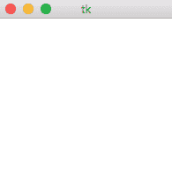
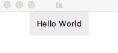
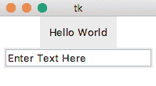
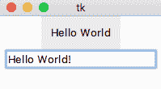
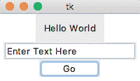
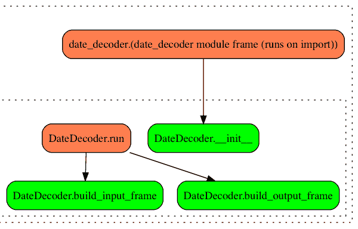
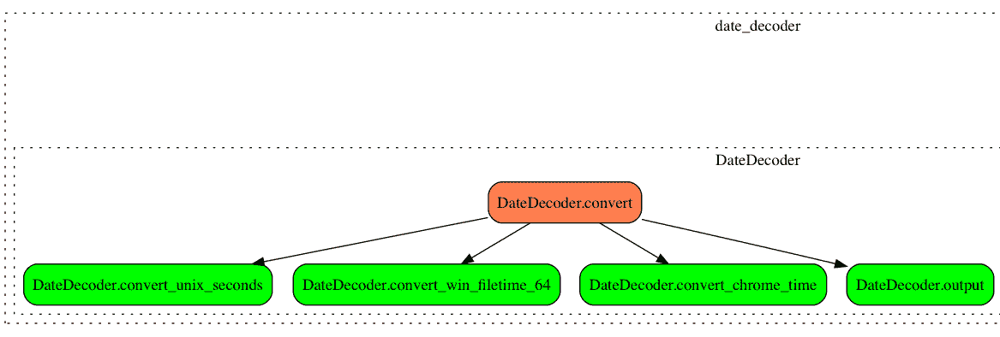
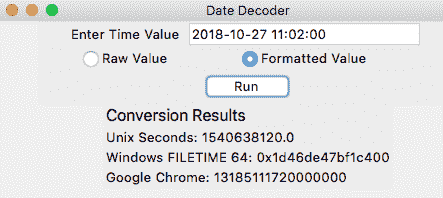
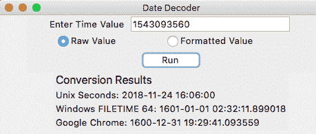

# 第九章：揭开时间的面纱

时间戳以多种格式存储，这些格式通常是由负责生成它们的操作系统或应用程序所独有的。在取证中，转换这些时间戳可能是调查的重要部分。

作为示例，我们可以汇总转换后的时间戳，创建一个综合事件时间线，确定跨平台的动作顺序。这种时间评估有助于我们判断行动是否在定义的范围内，并为我们提供关于两个事件之间关系的洞察。

为了解读这些格式化的时间戳，我们可以使用工具来解释原始值，并将其转换为人类可读的时间。大多数取证工具在解析已知的伪造数据结构时都会默默地执行此操作（类似于我们的脚本经常解析 Unix 时间戳的方式）。

在某些情况下，我们没有能够正确或统一处理特定时间戳的工具，必须依靠我们的聪明才智来解读时间值。

我们将使用常见的库来解析用户输入的时间戳，并将其转换为所需的格式。利用 TkInter 库，我们将设计一个**图形用户界面**（**GUI**），用户可以通过该界面展示日期信息。我们将使用 Python 类来更好地组织我们的 GUI，并处理诸如用户点击 GUI 上按钮等事件。

在本章中，我们将构建一个图形界面，借助以下主题将时间戳在机器可读格式和人类可读格式之间进行转换。

+   在 Python 中创建跨平台的图形用户界面

+   常见原始时间戳值在机器可读格式和人类可读格式之间的转换。

+   Python 类设计与实现的基础，允许灵活地添加更多时间格式。

本章代码在 Python 2.7.15 和 Python 3.7.1 环境下开发并测试。

# 关于时间戳

时间戳格式通常归结为两个组成部分：一个参考点和用来表示从该参考点起已过的时间量的约定或算法。大多数时间戳都有相应的文档，可以帮助我们确定将原始时间数据转换为人类可读时间戳的最佳方式。

如介绍中所述，时间戳格式种类繁多，其中一些我们已经遇到过，如 Unix 时间和 Windows FILETIME。这使得转换过程变得更加复杂，因为我们开发的取证脚本可能需要准备好处理多种时间格式。

Python 附带了几个标准库，可以帮助我们转换时间戳。我们以前使用过 `datetime` 模块来正确处理时间值并将其存储在 Python 对象中。我们将介绍两个新库——`time`（它是标准库的一部分）和第三方库 `dateutil`。

我们可以通过运行`pip install python-dateutil==2.7.5`来下载并安装`dateutil`（版本 2.7.5）。这个库将用于将字符串解析为`datetime`对象。`dateutil`库中的`parser()`方法接受一个字符串作为输入，并尝试自动将其转换为`datetime`对象。与`strptime()`方法不同，后者需要显式声明时间戳的格式，`dateutil.parser`可以将不同格式的时间戳转换为`datetime`对象，而无需开发者输入。

一个示例字符串可以是`2015 年 12 月 8 日星期二 18:04` 或 `12/08/2015 18:04`，这两者都会被`parser()`方法转换成相同的`datetime`对象。下面的代码块演示了这一功能，适用于 Python 2.7.15 和 Python 3.7.1：

```
>>> from dateutil import parser as duparser
>>> d = duparser.parse('Tuesday December 8th, 2015 at 6:04 PM')
>>> d.isoformat()
'2015-12-08T18:04:00'
>>> d2 = duparser.parse('12/08/2015 18:04')
>>> d2.isoformat()
'2015-12-08T18:04:00' 
```

在代码块的第一行，我们导入`dateutil`解析器并创建一个别名`duparser`，因为`parser`这个函数名是通用术语，可能会与其他变量或函数冲突。然后，我们调用`parse()`方法并传递一个表示时间戳的字符串。将解析后的值赋给变量`d`，我们使用`isoformat()`函数查看其 ISO 格式。接着，我们用第二个格式不同的时间戳重复这些步骤，观察到相同的结果。

请参考文档，获取有关`parse()`方法的更多细节，访问 [`dateutil.readthedocs.org/en/latest/parser.html`](http://dateutil.readthedocs.org/en/latest/parser.html)。

# 什么是纪元？

*纪元*是一个时间点，被标记为给定时间格式的起始时间，通常用作跟踪时间流逝的参考点。尽管我们在这里省略了任何与时间度量相关的哲学讨论，但我们将在本章中使用并参考纪元作为给定时间格式的起点。

大多数时间戳关联着两个主要的纪元时间：`1970-01-01 00:00:00` 和 `1601-01-01 00:00:00`。第一个纪元从 1970 年开始，传统上被称为 POSIX 时间，因为它是 Unix 及类 Unix 系统中常见的时间戳。在大多数 Unix 系统中，时间戳是从 POSIX 时间开始计算的秒数。这个概念也延伸到了某些应用中，存在使用从同一纪元起的毫秒数的变种。

第二个纪元，基于 1601 年，通常出现在基于 Windows 的系统中，之所以使用这个时间点，是因为它是格里高利历中第一个包含闰年的 400 年周期的起始点。1601 年开始的 400 年周期是第一个存在数字文件的周期，因此这个值成为另一个常见的纪元。在 Windows 系统中，常见的时间戳是从这个纪元起计算的 100 纳秒时间段的计数。这个值通常以十六进制或整数形式存储。

下一个代码块描述了将不同纪元的时间戳进行转换的过程。正如我们在前面的章节中所看到的，我们可以使用`datetime`模块的`fromtimestamp()`方法来转换 Unix 时间戳，因为它使用的是 1970 年纪元。对于基于 1601 年的时间戳，我们需要在使用`fromtimestamp()`函数之前先进行转换。

为了简化这个转换过程，我们来计算这两个日期之间的常数，并利用这个常数在两个纪元之间进行转换。在第一行，我们导入`datetime`库。接下来，我们将两个时间戳相减，以确定`1970-01-01`和`1601-01-01`之间的时间差。这个语句生成一个`datetime.timedelta`对象，存储两个值之间以天、秒和微秒计的时间差。

在这个例子中，1970 年和 1601 年时间戳之间的差值恰好是 134,774 天。我们需要将这个差值转换成微秒时间戳，以便能够在转换中准确地使用它。因此，在第三行中，我们将天数（`time_diff.days`）转换为微秒，通过将其乘以`86400000000`（*24 小时 x 60 分钟 x 60 秒 x 1,000,000 微秒*的积）并打印常数值`11644473600000000`。请查看以下代码：

```
>>> import datetime
>>> time_diff = datetime.datetime(1970,1,1) - datetime.datetime(1601,1,1)
>>> print (time_diff.days * 86400000000)
11644473600000000 
```

使用这个值，我们就可以在这两个纪元之间转换时间戳，并正确处理基于 1601 年的纪元时间戳。

# 使用 GUI

在本章中，我们将使用 GUI 将时间戳在原始格式和人类可读格式之间进行转换。时间戳转换是一个很好的借口来探索编程 GUI，因为它提供了一个解决常见调查活动的方案。通过使用 GUI，我们大大提高了脚本的可用性，尤其是对于那些被命令提示符及其各种参数和开关所吓退的用户。

Python 中有许多 GUI 开发的选项，但在本章中，我们将重点介绍 TkInter。TkInter 库是一个跨平台的 Python GUI 开发库，它与操作系统的`Tcl`/`Tk`库结合使用，支持 Windows、macOS 以及多个 Linux 平台。

这个跨平台框架允许我们构建一个平台无关的通用界面。虽然 TkInter 的 GUI 界面可能看起来不那么现代，但它们让我们能够以相对简单的方式快速构建一个功能性界面进行交互。

在这里，我们只会介绍 TkInter GUI 开发的基础知识。有关更详细的信息，可以通过在线资源或专门讲解 TkInter 开发过程和特定功能的书籍找到。在 [`www.python.org/`](https://www.python.org/) 网站上有一个详细的资源列表，可以学习和使用 TkInter，更多信息请见 [`wiki.python.org/moin/TkInter`](https://wiki.python.org/moin/TkInter)。

# TkInter 对象的基础知识

我们将使用 TkInter 的几个不同功能来展示我们的 GUI。每个 TkInter GUI 需要的第一个元素是根窗口，也叫做主窗口，它作为我们添加到 GUI 中的任何其他元素的顶级父窗口。在这个窗口中，我们将结合多个对象来允许用户与我们的界面进行互动，例如`Label`、`Entry`和`Button`等元素：

+   `Label`对象允许我们在界面上放置无法编辑的文本标签。这使得我们可以添加标题或为指示应写入或显示到字段中的对象提供描述。

+   `Entry`对象允许用户输入一行文本作为应用程序的输入。

+   `Button`对象允许我们在按下时执行命令。在我们的例子中，按钮将调用适当的函数来转换特定格式的时间戳，并使用返回值更新界面。

使用这三个功能，我们已经介绍了界面所需的所有 GUI 元素。还有更多可用的对象，详细信息可以在 TkInter 文档中找到，网址为[`docs.python.org/3/library/tkinter.html`](https://docs.python.org/3/library/tkinter.html)。

我们将以兼容 Python 2 和 Python 3 的方式编写代码。因此，在 Python 2（例如，版本 2.7.15）中，我们将按如下方式导入`Tkinter`：

```
>>> from Tkinter import *
```

对于 Python 3，例如版本 3.7.1，我们将按如下方式导入：

```
>>> from tkinter import *
```

为了简化这个过程，我们可以使用`sys`模块来检测 Python 版本并导入相应的模块，如下所示：

```
import sys
if sys.version_info[0] == 2:
    from Tkinter import *
elif sys.version_info[0] == 3:
    from tkinter import *
```

# 实现 TkInter GUI

本节展示了一个创建 TkInter GUI 的简单示例。在前七行中，我们导入了创建界面所需的两个模块。这种导入方式虽然复杂，但可以让我们以 Python 2 或 Python 3 特定的方式导入这两个模块。

第一个模块导入了所有 TkInter GUI 设计所需的默认对象。`ttk`模块导入了主题 TkInter 包，根据主机操作系统应用额外的界面格式化，是改善界面外观的简单方法。在最后一行，我们创建了根窗口。

当在 Python 解释器中输入时，执行最后一行应显示一个空白的 200 像素×200 像素的方形窗口，位于屏幕的左上角。尺寸和位置是默认设置，可以修改。请参见以下代码块：

```
>>> import sys
>>> if sys.version_info[0] == 2:
>>>     from Tkinter import *
>>>     import ttk
>>> elif sys.version_info[0] == 3:
>>>     from tkinter import *
>>>     import tkinter.ttk as ttk
>>> root = Tk() 
```

以下截图展示了在 macOS 系统上执行代码块时创建的 TkInter 根窗口：



创建根窗口后，我们可以开始向界面添加元素。一个好的开始元素是标签。在后面提到的代码块中，我们将从主题`ttk`包中添加一个标签到窗口：

```
>>> first_label = ttk.Label(root, text="Hello World")
```

`Label` 参数需要两个参数：要显示的父窗口和显示的文本。可以为标签分配其他属性，如字体和文本大小。

请注意，在执行代码块的第一行后，窗口不会更新。相反，我们必须指定如何在窗口内显示对象，使用其中一个可用的布局管理器。

TkInter 使用布局管理器来确定对象在窗口中的位置。常见的布局管理器有三种：`grid`、`pack` 和 `place`。

+   `grid` 布局管理器根据行和列的规范来放置元素。

+   `pack` 布局管理器更简单，它将元素彼此放置，无论是垂直还是水平，具体取决于指定的配置。

+   最后，`place` 布局管理器使用 *x* 和 *y* 坐标来放置元素，并且需要最多的维护和设计工作。

对于此示例，我们选择使用 `pack` 方法，如代码块的第二行所示。一旦我们描述了要使用的布局管理器，界面会更新，并显示标签：

```
>>> first_label.pack()
```

以下截图显示了将标签添加到我们的 GUI 中的效果：


如前面的截图所示，根窗口已经缩小以适应其元素的大小。此时，我们可以通过拖动边缘来调整窗口的大小，缩小或增大主窗口的尺寸。

让我们在 `Label` 对象周围添加一些空间。我们可以通过两种不同的技术来实现。第一种方法是在 `Label` 对象周围添加内边距，使用 `.config()` 方法。为了添加内边距，我们必须为 *x* 和 *y* 轴提供一个像素值的元组。

在此示例中，我们在 *x* 和 *y* 轴上都添加了 10 像素的内边距。当执行以下行时，它会在 GUI 中自动更新，因为布局管理器已经配置好：

```
>>> first_label.config(padding=(10,10)) 
```

内边距显示在以下截图中：


这仅仅是为标签本身添加了内边距，而不是整个根窗口。要更改根窗口的尺寸，我们需要调用 `geometry()` 方法，并提供宽度、高度、距离屏幕左侧的距离和距离屏幕顶部的距离。

在以下示例中，我们将设置宽度为 200 像素，高度为 100 像素，距离屏幕左侧 30 像素，距离屏幕顶部 60 像素的偏移量：

```
>>> root.geometry('200x100+30+60') 
```

新的 GUI 分辨率显示在以下截图中：



根据你的操作系统，GUI 中的默认颜色可能会因可用的主题包而有所不同。

让我们介绍一下其他两个我们将使用的 GUI 元素：`Entry`和`Button`。现在我们将初始化`Entry`对象，它允许用户输入文本，程序可以捕获并使用这些文本。在第一行中，我们初始化了一个`StringVar()`变量，它将与`Entry`对象一起使用。与之前的脚本不同，我们需要设置特定的变量，以响应 GUI 接口的事件驱动特性：

```
>>> text = StringVar()
```

TkInter 支持多种特殊变量，例如用于字符串的`StringVar()`函数、用于布尔值的`BooleanVar()`、用于浮动数值的`DoubleVar()`，以及用于整数的`IntVar()`。每个这些对象都允许通过`set()`方法设置值，并通过`get()`方法获取值。上述代码展示了`StringVar()`的初始化，将其设置为默认值，并将其分配给创建的`Entry`元素，然后将其打包到根窗口中。最后，我们可以通过`get()`方法获取用户输入：

```
>>> text.set("Enter Text Here")
>>> text_entry = ttk.Entry(root, textvariable=text)
>>> text_entry.pack()
>>> text.get()
'Hello World!' 
```

以下两个连续的截图展示了我们实现的新代码块对 GUI 的更新：



上面的截图展示了`Entry`框中的默认文本，而下面的截图展示了修改值后的样子：



请注意，我们在执行`text.get()`方法之前，将`Hello World!`写入了`Entry`对象中。

`Button`对象用于在点击按钮时触发事件。为了启动操作，我们需要调用一个函数。

在下一个示例中，我们定义了`clicked()`函数，它会打印一个字符串，如以下代码块所示。在这个函数之后，我们使用`ttk`主题包定义了按钮，将按钮文本设置为`Go`，并将函数名作为`command`参数。将按钮打包到根窗口后，我们可以点击它，并在终端中看到打印的语句，如下面代码块的最后一行所示。虽然这个功能不是非常实用，但它演示了按钮如何调用一个操作。我们的脚本将进一步展示`Button`对象及其命令参数的用途：

```
>>> def clicked(): 
...     print "The button was clicked!" 
...  
>>> go = ttk.Button(root, text="Go", command=clicked) 
>>> go.pack() 
The button was clicked! 
```

添加此按钮的效果如下截图所示：



# 使用框架对象

TkInter 提供了另一个我们将使用的对象，名为`frame`。框架是我们可以放置信息的容器，它提供了额外的组织结构。在我们的最终界面中，将有两个框架。第一个是输入框架，包含所有用户交互的对象；第二个是输出框架，显示脚本处理的所有信息。在本章的最终代码中，两个`frame`对象将是根窗口的子对象，并充当其中`Label`、`Entry`和/或`Button`对象的父对象。

`frame`对象的另一个好处是，每个框架可以使用自己的几何管理器。由于每个父对象只能使用一个几何管理器，这使得我们可以在整个 GUI 中使用多个不同的管理器。

在我们的脚本中，我们将使用`pack()`管理器来组织根窗口中的框架，并使用`grid()`管理器来组织每个框架内的元素。

# 在 TkInter 中使用类

在本书中我们尚未直接使用类；然而，类是设计 GUI 的首选方式。类允许我们构建一个可以包含函数和属性的对象。事实上，我们经常在不自觉中使用类。我们熟悉的对象，如`datetime`对象，就是包含函数和属性的类。

尽管本书中类的内容并不多，但它们可能会让新开发者感到困惑，但对于更高级的脚本来说，它们是推荐的。我们将在本章简要介绍类，并建议随着你对 Python 的理解加深，进一步研究类。本章中涉及的类内容仅限于 GUI 示例。

类的定义语法与函数类似，我们使用`class`关键字代替`def`。一旦定义类，我们将函数嵌套在`constructor`类中，以使这些函数可以通过`class`对象调用。这些嵌套的函数称为方法，与我们从库中调用的方法是同义的。方法允许我们像函数一样执行代码。到目前为止，我们主要是将方法和函数交替使用。对此我们表示歉意，这样做是为了避免让你和我们都厌烦重复相同的词汇。

到目前为止，类看起来不过是函数的集合。那么到底是什么原因呢？类的真正价值在于，我们可以创建同一个类的多个实例，并为每个实例分配不同的值。进一步来说，我们可以对每个实例单独运行预定义的方法。举个例子，假设我们有一个时间类，其中每个时间都有一个关联的`datetime`变量。我们可能决定将其中一些转换为 UTC 时间，而将其他保持在当前时区。这种隔离性使得在类中设计代码变得非常有价值。

类在 GUI 设计中非常有用，因为它们允许我们在函数之间传递值，而不需要额外的重复参数。这是通过`self`关键字实现的，它允许我们在类中指定可在类实例及其所有方法中使用的值。

在下一个示例中，我们创建了一个名为`SampleClass`的类，它继承自`object`。这是类定义的基本设置，虽然还有更多可用的参数，但我们将在本章中专注于基础内容。在第 2 行，我们定义了第一个名为`__init__()`的方法，这是一个特殊的函数。你可能会注意到，它有双前导和尾部下划线，类似于我们在脚本中创建的`if __name__ == '__main__'`语句。如果类中存在`__init__()`方法，它将在类初始化时执行。

在示例中，我们定义了`__init__()`方法，传递`self`和`init_cost`作为参数。`self`参数必须是任何方法的第一个参数，并允许我们引用存储在`self`关键字下的值。接下来，`init_cost`是一个变量，必须在类首次被用户调用时设置。在第 3 行，我们将用户提供的`init_cost`值赋给`self.cost`。将参数（除了`self`）赋值为类实例化时的类变量是一种惯例。在第 4 行，我们定义了第二个方法`number_of_nickels()`，并将`self`值作为其唯一参数。在第 5 行，我们通过返回`self.cost * 20`的整数来完成类的定义，如下所示：

```
>>> class SampleClass(object):
...     def __init__(self, init_cost):
...         self.cost = init_cost
...     def number_of_nickels(self):
...         return int(self.cost * 20)
... 
```

接下来，我们将`s1`初始化为`SampleClass`类的一个实例，并将初始值设置为`24.60`。然后，我们通过使用`s1.cost`属性来调用它的值。`s1`变量引用了`SampleClass`的一个实例，并授予我们访问类内方法和值的权限。我们在`s1`上调用`number_of_nickels()`方法，并将其存储的值更改为`15`，这会更新`number_of_nickels()`方法的结果。接着，我们定义了`s2`并为其分配了不同的值。即使我们运行相同的方法，我们也只能查看与特定类实例相关的数据：

```
>>> s1 = SampleClass(24.60)
>>> s1.cost
24.6
>>> s1.number_of_nickels()
492
>>> s1.cost = 15
>>> s1.number_of_nickels()
300
>>> s2 = SampleClass(10)
>>> s2.number_of_nickels()
200 
```

# 开发日期解码器 GUI - date_decoder.py

该脚本已在 Python 2.7.15 和 3.7.1 版本中进行了测试，并使用了`python-dateutil`（版本 2.7.5）第三方库，可以通过以下命令使用`pip`进行安装：

+   `pip install python-dateutil==2.7.5`

在介绍完时间戳、GUI 开发和 Python 类之后，让我们开始开发`date_decoder.py`脚本。我们将设计一个具有两个主要功能的 GUI，供最终用户进行交互。

首先，GUI 允许用户输入来自文物的时间戳原生格式，并将其转换为人类可读的时间。第二个功能允许用户输入人类可读的时间戳，并选择一个选项将其转换为相应的机器时间。为了构建这个功能，我们将使用一个输入框、几个标签以及不同类型的按钮供用户与界面进行交互。

所有通过此代码处理的日期都假定使用本地机器时间作为时区。请确保将所有时间戳来源转换为统一的时区，以简化分析。

与其他脚本一样，代码从导入语句开始，后跟作者信息。在导入`datetime`和`logging`之后，我们根据 Python 2 和 Python 3 的条件导入 TkInter 和主题资源模块。然后我们导入`dateutil`，正如之前讨论的，它将处理日期解析和转换操作。接着我们设置脚本的许可协议、文档和日志记录值：

```
001 """Example usage of Tkinter to convert dates."""
002 import datetime
003 import logging
004 import sys
005 if sys.version_info[0] == 2:
006     from Tkinter import *
007     import ttk
008 elif sys.version_info[0] == 3:
009     from tkinter import *
010     import tkinter.ttk as ttk
011 from dateutil import parser as duparser
...
042 __authors__ = ["Chapin Bryce", "Preston Miller"]
043 __date__ = 20181027
044 __description__ = '''This script uses a GUI to show date values
045     interpreted by common timestamp formats'''
046 logger = logging.getLogger(__name__)
```

我们首先定义了 GUI 的属性，如窗口的尺寸、背景和标题，并创建了根窗口。在配置完 GUI 的基础设置后，我们用之前讨论的控件填充 GUI。界面设计完成后，我们创建处理事件的方法，如转换时间戳并将结果显示在 GUI 中。我们没有使用通常的`main()`函数，而是创建了这个类的实例，它将在执行时启动 GUI 窗口。

代码从声明`DateDecoder`类及其`__init__()`方法开始。该方法不需要传递任何参数，因为我们将通过 GUI 接收所有输入值和设置。接下来定义的函数是第 74 行的`run()`控制器。这个控制器调用设计 GUI 的函数，并启动该 GUI：

```
049 class DateDecoder(object):
...
054     def __init__():
...
074     def run():
```

为了以结构化的方式展示 GUI，我们需要将 GUI 分成多个功能单元。在第 84 和 119 行的方法中，我们创建了组成 GUI 的输入和输出框架。这些框架包含与其功能相关的控件，并且由自己的几何布局控制：

```
084     def build_input_frame():
...
119     def build_output_frame():
```

界面设计完成后，我们可以专注于处理逻辑操作和按钮点击事件的功能。`convert()` 方法用于调用时间戳转换器，将值解析为日期。

这些转换器是针对每个受支持的时间戳定义的，定义在第 175、203 和 239 行。我们的最后一个类方法`output()`用于更新界面。这个方法可能会让人误解，因为我们脚本中的之前的`output()`函数通常会创建某种报告。在这个例子中，我们将使用这个`output()`方法来更新 GUI，向用户展示信息，以一种有组织且有帮助的方式：

```
151     def convert():
...
175     def convert_unix_seconds():
...
203     def convert_win_filetime_64():
...
239     def convert_chrome_time():
...
183     def output():
```

与前几章不同，这个函数不需要处理命令行参数。然而，我们仍然设置了日志记录，并实例化并运行我们的图形用户界面（GUI）。此外，从第 202 行开始，我们使用基本的日志记录约定初始化一个日志记录器。由于没有传递命令行参数给该脚本，我们将日志文件路径硬编码。在第 211 和 212 行，初始化类并调用`run()`方法，以便创建并显示我们的 GUI，如下所示：

```
286 if __name__ == '__main__':
287     """
288     This statement is used to initialize the GUI. No
289     arguments needed as it's a graphic interface
290     """
291     # Initialize Logging
292     log_path = 'date_decoder.log'
293 
294     logger.setLevel(logging.DEBUG)
295     msg_fmt = logging.Formatter("%(asctime)-15s %(funcName)-20s"
296         "%(levelname)-8s %(message)s")
297     fhndl = logging.FileHandler(log_path, mode='a')
298     fhndl.setFormatter(fmt=msg_fmt)
299     logger.addHandler(fhndl)
300 
301     logger.info('Starting Date Decoder v. {}'.format(__date__))
302     logger.debug('System ' + sys.platform)
303     logger.debug('Version ' + sys.version.replace("\n", " "))
304 
305     # Create Instance and run the GUI
306     dd = DateDecoder()
307     dd.run()
```

由于流程图过宽，我们将其拆分为两张截图。第一张截图展示了设置`DateDecoder`类和初始`run()`调用的流程，后者创建了我们的框架：



第二张截图显示了操作代码的流程，其中我们的转换函数调用特定的时间转换函数，然后调用我们的`output()`函数将其显示给用户：



# DateDecoder 类的设置和`__init__()`方法

我们使用`class`关键字初始化我们的类，后跟类名，并将`object`参数作为第 49 行所示的参数传递。最佳实践是使用 camelCase 约定命名类，并使用下划线命名方法以避免混淆。在第 50 行，我们定义了前面描述的`__init__()`特殊方法，只有`self`参数。此类在初始化时不需要任何用户输入，因此我们不需要考虑添加额外的参数。请看以下代码：

```
049 class DateDecoder(object):
050     """
051     The DateDecoder class handles the construction of the GUI
052     and the processing of date & time values
053     """
054     def __init__(self):
055         """
056         The __init__ method initializes the root GUI window and
057         variable used in the script
058         """
```

在第 60 行，我们创建了 GUI 的根窗口，并将其赋值给`self`对象内的一个值。这使我们能够在类中的其他方法中引用它和使用`self`创建的任何其他对象，而无需将其作为参数传递，因为`self`参数存储了整个类实例中可用的值。在第 61 行，我们定义了窗口的大小，宽度为 500 像素，高度为 180 像素，并在屏幕的顶部和左侧各偏移了 40 像素。

为了改善界面的外观，我们已经添加了背景颜色以反映 macOS 上显示的主题，尽管这可以设置为任何十六进制颜色，如第 62 行所示。最后，我们修改了根窗口的标题属性，给它一个显示在 GUI 窗口顶部的名称：

```
059         # Init root window
060         self.root = Tk()
061         self.root.geometry("500x180+40+40")
062         self.root.config(background = '#ECECEC')
063         self.root.title('Date Decoder')
```

在初始化 GUI 定义之后，我们需要为重要变量设置基础值。虽然这不是必需的，但通常最好的做法是在`__init__()`方法中创建共享值，并使用默认值定义它们。在定义将存储我们处理过的时间值的三个类变量后，我们还定义了基于 1601 年和 1970 年的时间戳的时代常量。代码如下：

```
065         # Init time values
066         self.processed_unix_seconds = None
067         self.processed_windows_filetime_64 = None
068         self.processed_chrome_time = None
069 
070         # Set Constant Epoch Offset
071         self.epoch_1601 = 11644473600000000
072         self.epoch_1970 = datetime.datetime(1970,1,1)
```

`__init__()`方法应该用于初始化类属性。在某些情况下，您可能希望该类还运行类的主要操作，但我们不会在我们的代码中实现该功能。我们将运行时操作分离到一个名为`run()`的新方法中，以允许我们启动特定于运行主代码的操作。这允许用户在启动 GUI 之前更改类配置信息。

# 执行 run() 方法

以下方法非常简短，由对我们稍后讨论的其他方法的函数调用组成。这包括为 GUI 构建输入和输出帧以及启动主事件监听器循环。由于类已经初始化了`__init__()`方法中找到的变量，我们可以安全地引用这些对象，如下所示：

```
074     def run(self):
075         """
076         The run method calls appropriate methods to build the
077         GUI and set's the event listener loop.
078         """
079         logger.info('Launching GUI')
080         self.build_input_frame()
081         self.build_output_frame()
082         self.root.mainloop() 
```

# 实现 build_input_frame() 方法

`build_input_frame()`方法是`frame`小部件的第一次实例化，定义在第 90 到 92 行。与我们在早期示例中定义此元素的方式类似，我们调用了主题化的`frame`小部件，并将`self.root`对象作为此框架的父级窗口。在第 91 行，我们在框架的*X*轴周围添加了`30`像素的填充，然后在第 92 行使用`pack()`几何管理器。由于每个窗口或框架只能使用一个几何管理器，因此我们现在必须在添加到`root`对象的任何附加框架或小部件上使用`pack()`管理器：

```
084     def build_input_frame(self):
085         """
086         The build_input_frame method builds the interface for
087         the input frame
088         """
089         # Frame Init
090         self.input_frame = ttk.Frame(self.root)
091         self.input_frame.config(padding = (30,0))
092         self.input_frame.pack()
```

创建框架后，我们开始向框架中添加小部件以供用户输入。在第 95 行，我们使用新的`input_frame`作为父级创建一个标签，文本为`Enter Time Value`。此标签被放置在网格的第一行和第一列。使用网格管理器时，第一个位置将是左上角位置，其他所有元素将围绕它布局。由于我们之后不需要调用这个标签，所以不将其分配给变量，而是可以直接调用`.grid()`方法将其添加到我们的 GUI 中：

```
094         # Input Value
095         ttk.Label(self.input_frame,
096             text="Enter Time Value").grid(row=0, column=0)
```

在第 98 行，我们初始化`StringVar()`，该变量用于存储用户输入的字符串。我们将在代码的各个地方引用此对象和信息，因此希望将其分配给对象`self.input_time`。

在第 99 行，我们创建另一个小部件，这次是`Entry`，并且同样不将其分配给变量，因为在创建后我们不需要操作该元素。我们需要从该元素获取的信息将存储在`self.input_time`变量中。为了指示`Entry`对象将值存储在此对象中，我们必须将对象名称作为`textvariable`参数传递。我们还将字段的宽度指定为 25 个字符，使用`grid()`方法将其添加到 GUI 中，并将其放置在标签的下一列：

```
098         self.input_time = StringVar()
099         ttk.Entry(self.input_frame, textvariable=self.input_time,
100             width=25).grid(row=0, column=1, padx=5)
```

在创建输入区域后，我们必须为用户提供选项，以便指定输入类型。这使得用户可以选择源是机器可读格式还是人类可读格式。我们创建另一个`StringVar()`变量来保存用户选择的值。

由于我们希望默认操作是将原始时间戳转换为格式化时间戳，我们在第 104 行调用`set()`方法，在`self.time_type`变量上自动选择第 106 行创建的`raw`单选按钮。

在第 106 行，我们创建第一个单选按钮，将输入框架作为父级，单选按钮标签设置为`Raw Value`，并将反映用户是否选择了该单选按钮的变量设置为`self.time_type`。最后，我们使用网格管理器显示此按钮。在第 110 行，我们创建第二个单选按钮，文本和值设置为反映格式化的时间戳输入。此外，我们将此单选按钮放置在与第一个单选按钮相邻的同一行的列中。请查看以下代码：

```
102         # Radiobuttons
103         self.time_type = StringVar()
104         self.time_type.set('raw')
105 
106         ttk.Radiobutton(self.input_frame, text="Raw Value",
107             variable=self.time_type, value="raw").grid(row=1,
108                 column=0, padx=5)
109 
110         ttk.Radiobutton(self.input_frame, text="Formatted Value",
111             variable=self.time_type, value="formatted").grid(
112                 row=1, column=1, padx=5)
```

最后，我们构建用于提交来自 `Entry` 字段的数据进行处理的按钮。该按钮的设置与其他小部件类似，唯一不同的是添加了 `command` 关键字，当按钮被点击时，它会执行指定的方法。然后，我们将 `convert()` 方法分配为按钮的点击动作。

该方法在没有额外参数的情况下启动，因为它们被存储在 `self` 属性中。我们通过网格管理器将此元素添加到界面中，使用 `columnspan` 属性将信息跨越两个或更多列。我们还使用 `pady`（垂直间距）属性在输入字段和按钮之间提供一些垂直空间：

```
114         # Button
115         ttk.Button(self.input_frame, text="Run",
116             command=self.convert).grid(
117                 row=2, columnspan=2, pady=5)
```

# 创建 `build_output_frame()` 方法

输出框架的设计类似于输入框架。不同之处在于，我们需要将小部件保存到变量中，以确保在处理日期值时可以更新它们。在方法和文档字符串定义之后，我们创建 `output_frame` 并配置框架的高度和宽度。因为我们在根窗口中使用了 `pack()` 管理器，所以必须继续使用它将该框架添加到 GUI 的根窗口中：

```
119     def build_output_frame(self):
120         """
121         The build_output_frame method builds the interface for
122         the output frame
123         """
124         # Output Frame Init
125         self.output_frame = ttk.Frame(self.root)
126         self.output_frame.config(height=300, width=500)
127         self.output_frame.pack()
```

初始化之后，我们向 `output_frame` 添加各种小部件。所有输出小部件都是标签，因为它们允许我们轻松地向用户显示字符串值，而不会增加额外的负担。完成此任务的另一种方法是将输出放入文本输入框中并将其标记为只读。或者，我们可以创建一个大型文本区域，方便用户复制。两者都是本章末尾指定的挑战，供您在自己的 GUI 实现中进行更多实验。

第一个标签元素名为 `转换结果`，并通过 `pack(fill=X)` 方法在第 134 行居中。此方法填充 *x* 轴的区域，并垂直堆叠所有已打包的兄弟元素。在第 131 行创建标签后，我们使用 `config()` 方法配置字体大小，并将一个元组传递给 `font` 关键字。此参数的第一个元素应该是字体名称，第二个元素是字体大小。如果省略字体名称，我们将保留默认字体，并仅修改大小：

```
129         # Output Area
130         ## Label for area
131         self.output_label = ttk.Label(self.output_frame,
132             text="Conversion Results")
133         self.output_label.config(font=("", 16))
134         self.output_label.pack(fill=X)
```

以下三个标签代表支持的每个时间戳的结果。所有三个标签都将输出框架作为它们的父窗口，并将其文本设置为反映时间戳类型以及默认的 `N/A` 值。最后，每个标签都调用 `pack(fill=X)` 方法，以便在框架内正确居中和垂直排列值。我们必须将这三个标签分配给变量，以便在处理后更新它们的值，反映转换后的时间戳。标签在此处设置：

```
136         ## For Unix Seconds Timestamps
137         self.unix_sec = ttk.Label(self.output_frame,
138             text="Unix Seconds: N/A")
139         self.unix_sec.pack(fill=X)
140 
141         ## For Windows FILETIME 64 Timestamps
142         self.win_ft_64 = ttk.Label(self.output_frame,
143             text="Windows FILETIME 64: N/A")
144         self.win_ft_64.pack(fill=X)
145 
146         ## For Chrome Timestamps
147         self.google_chrome = ttk.Label(self.output_frame,
148             text="Google Chrome: N/A")
149         self.google_chrome.pack(fill=X)
```

# 构建 `convert()` 方法

一旦用户点击输入框中的按钮，`convert()` 方法就会被调用。这个方法负责验证输入、调用转换器，并将结果写入上一节中构建的标签中。可以说，这个方法替代了通常的 `main()` 方法。在初步定义和文档字符串之后，我们记录了用户提供的时间戳和格式（原始或格式化）。这有助于跟踪活动并排查可能出现的错误：

```
151     def convert(self):
152         """
153         The convert method handles the event when the button is
154         pushed. It calls to the converters and updates the
155         labels with new output.
156         """
157         logger.info('Processing Timestamp: {}'.format(
158             self.input_time.get()))
159         logger.info('Input Time Format: {}'.format(
160             self.time_type.get()))
```

首先，在第 163 行到第 165 行之间，我们将三个时间戳变量的值重置为 `N/A`，以清除当应用程序重新运行时可能存在的任何残留值。然后，我们在第 168 行到第 170 行调用了处理时间戳转换的三个方法。这些方法是独立的，它们会更新三个时间戳参数的值，而不需要我们返回任何值或传递参数。

正如你所看到的，`self` 关键字确实帮助我们简化了类的定义，因为它提供了访问共享类变量的方式。在第 173 行，我们调用了 `output()` 方法，将新转换的格式写入到图形界面中：

```
162         # Init values every instance
163         self.processed_unix_seconds = 'N/A'
164         self.processed_windows_filetime_64 = 'N/A'
165         self.processed_chrome_time = 'N/A'
166 
167         # Use this to call converters
168         self.convert_unix_seconds()
169         self.convert_win_filetime_64()
170         self.convert_chrome_time()
171 
172         # Update labels
173         self.output()
```

# 定义 `convert_unix_seconds()` 方法

Unix 时间戳是我们在本章中转换的三种时间戳中最直接的一种。在第 175 行到第 179 行之间，我们定义了方法及其文档字符串，然后进入了一个 `if` 语句。第 180 行的 `if` 语句判断之前描述的单选按钮的值是否等于 `raw` 字符串或 `formatted`。如果设置为 `raw`，我们将解析时间戳为自 `1970-01-01 00:00:00.0000000` 以来的秒数。这相对简单，因为这是 `datetime.datetime.fromtimestamp()` 方法使用的纪元。在这种情况下，我们只需将输入转换为浮动数值，如第 182 行和第 183 行所示，再进行转换。

然后，在第 183 行和第 184 行之间，我们将新创建的 `datetime` 对象格式化为 `YYYY-MM-DD HH:MM:SS` 格式的字符串。第 182 行的逻辑被包裹在一个 try-except 语句中，以捕获任何错误并将其报告到日志文件和用户界面中，以简化的形式显示出来。这使得我们能够在输入日期时测试每个公式。第 188 行概述了当我们无法成功转换时间戳时，转换错误将被显示出来。这将提醒用户发生了错误，并让他们判断是否是预期的错误。

```
175     def convert_unix_seconds(self):
176         """
177         The convert_unix_seconds method handles the conversion of
178         timestamps per the Unix seconds format
179         """
180         if self.time_type.get() == 'raw':
181             try:
182                 dt_val = datetime.datetime.fromtimestamp(
183                     float(self.input_time.get())).strftime(
184                         '%Y-%m-%d %H:%M:%S')
185                 self.processed_unix_seconds = dt_val
186             except Exception as e:
187                 logger.error(str(type(e)) + "," + str(e))
188                 self.processed_unix_seconds = str(
189                     type(e).__name__)
```

如果时间戳是格式化值，我们首先需要解析输入，然后尝试将其转换为 Unix 时间戳，因为它可能不符合预期格式。一旦通过 `dateutil.parser` 进行转换，我们就可以使用预定义的纪元对象计算时间戳与纪元之间的秒数差异，如第 195 行到第 197 行所示。如果发生错误，它将像前面的 `if` 语句一样被捕获，记录下来并显示给用户，如下所示：

```
191         elif self.time_type.get() == 'formatted':
192             try:
193                 converted_time = duparser.parse(
194                     self.input_time.get())
195                 self.processed_unix_seconds = str(
196                         (converted_time - self.epoch_1970
197                     ).total_seconds())
198             except Exception as e:
199                 logger.error(str(type(e)) + "," + str(e))
200                 self.processed_unix_seconds = str(
201                     type(e).__name__)
```

# 使用 `convert_win_filetime_64()` 方法进行转换

Microsoft Windows 的 FILETIME 值的转换稍微复杂一些，因为它使用`1601-01-01 00:00:00`作为纪元，并从那个时间点起以 100 纳秒为单位计时。为了正确转换这个时间戳，我们需要比前面的部分多进行几个步骤。

这个方法与上一个方法相同，包含`if`-`else`语法来识别时间戳类型。如果是原始格式，我们必须将输入的十六进制字符串转换为基于 10 的十进制数，这在第 210 和 211 行通过`int(value, 16)`类型转换实现。这允许我们告诉`int()`将基数为 16 的值转换为十进制（基数为 10）。基数为 16 的值通常被称为十六进制值。

一旦转换，整数就表示自纪元以来 100 纳秒为单位的时间，因此我们所要做的就是将微秒转换为`datetime`值，然后加上纪元的`datetime`对象。在第 212 到 214 行，我们使用`datetime.timedelta()`方法生成一个可以用于添加到纪元`datetime`的对象。一旦转换完成，我们需要将`datetime`对象格式化为时间字符串，并将其赋值给相应的标签。错误处理与之前的转换器相同，转换错误将显示如下：

```
203     def convert_win_filetime_64(self):
204         """
205         The convert_win_filetime_64 method handles the
206         conversion of timestamps per the Windows FILETIME format
207         """
208         if self.time_type.get() == 'raw':
209             try:
210                 base10_microseconds = int(
211                     self.input_time.get(), 16) / 10
212                 datetime_obj = datetime.datetime(1601,1,1) + \
213                     datetime.timedelta(
214                         microseconds=base10_microseconds)
215                 dt_val = datetime_obj.strftime(
216                     '%Y-%m-%d %H:%M:%S.%f')
217                 self.processed_windows_filetime_64 = dt_val
218             except Exception as e:
219                 logger.error(str(type(e)) + "," + str(e))
220                 self.processed_windows_filetime_64 = str(
221                     type(e).__name__)
```

如果输入的时间戳是格式化的值，我们需要反向转换。我们之前在第 212 行使用`datetime.timedelta()`方法时采取了一些捷径。当反向转换时，我们需要手动计算微秒数，然后再转换为十六进制。

首先，在第 225 行，我们将数据从字符串转换为`datetime`对象，以便开始处理这些值。然后，我们从转换后的时间中减去纪元值。减法之后，我们将`datetime.timedelta`对象转换为微秒值，基于存储的三个值。我们需要将秒数乘以一百万，将天数乘以 864 亿，以将每个值转换为微秒。最后，在第 229 到 231 行，我们几乎准备好将时间戳转换，经过加和这三个值之后：

```
223         elif self.time_type.get() == 'formatted':
224             try:
225                 converted_time = duparser.parse(
226                     self.input_time.get())
227                 minus_epoch = converted_time - \
228                     datetime.datetime(1601,1,1)
229                 calculated_time = minus_epoch.microseconds + \
230                     (minus_epoch.seconds * 1000000) + \
231                     (minus_epoch.days * 86400000000)
```

在第 232 和 233 行，我们通过将最内层的`calculated_time`转换为整数来执行转换。在整数状态下，它会乘以 10，转换为 100 纳秒组数，然后通过`hex()`类型转换将其转换为十六进制。由于代码要求输出为字符串，我们将十六进制值转换为字符串，如第 232 行的外部包装所示，然后将其赋值给`self.processed_windows_filetime_64`变量。

与其他转换函数类似，我们在第 234 到 237 行将错误处理加入到转换器中：

```
232                 self.processed_windows_filetime_64 = str(
233                     hex(int(calculated_time)*10))
234             except Exception as e:
235                 logger.error(str(type(e)) + "," + str(e))
236                 self.processed_windows_filetime_64 = str(
237                 type(e).__name__)
```

# 使用 convert_chrome_time()方法进行转换

我们展示的最后一个时间戳是 Google Chrome 时间戳，它与之前提到的两个时间戳类似。这个时间戳是自`1601-01-01 00:00:00`纪元以来的微秒数。我们将利用前面定义的`self.unix_epcoh_offset`值来帮助转换。在第 248 行，我们开始通过一系列函数转换原始时间戳。

首先，我们将时间戳转换为浮动数，并减去 1601 纪元常量。接下来，我们将该值除以一百万，将微秒转换为秒，以便`datetime.datetime.fromtimestamp()`方法可以正确地解释该值。最后，在第 251 行，我们使用`strftime()`函数将`converted_time`格式化为字符串。在第 253 到 255 行，我们处理可能由于无效值而引发的异常，正如之前部分所示：

```
239     def convert_chrome_time(self):
240         """
241         The convert_chrome_time method handles the
242         conversion of timestamps per the Google Chrome
243         timestamp format
244         """
245         # Run Conversion
246         if self.time_type.get() == 'raw':
247             try:
248                 dt_val = datetime.datetime.fromtimestamp(
249                         (float(self.input_time.get()
250                     )-self.epoch_1601)/1000000)
251                 self.processed_chrome_time = dt_val.strftime(
252                     '%Y-%m-%d %H:%M:%S.%f')
253             except Exception as e:
254                 logger.error(str(type(e)) + "," + str(e))
255                 self.processed_chrome_time = str(type(e).__name__)
```

当传递一个格式化的值作为输入时，我们必须逆转该过程。与其他函数一样，我们使用`duparser.parse()`方法将输入从字符串转换为`datetime`对象。一旦转换完成，我们通过将 1601 纪元常量加到`total_seconds()`方法来计算秒数。

这些秒数会乘以一百万，转换为微秒。计算完成后，我们可以将该整数值转换为字符串，并在我们的 GUI 中显示。如果发生任何错误，我们会在第 264 到 266 行捕获它们，就像之前的方法一样：

```
257         elif self.time_type.get() == 'formatted':
258             try:
259                 converted_time = duparser.parse(
260                     self.input_time.get())
261                 chrome_time = (converted_time - self.epoch_1970
262                     ).total_seconds()*1000000 + self.epoch_1601
263                 self.processed_chrome_time = str(int(chrome_time))
264             except Exception as e:
265                 logger.error(str(type(e)) + "," + str(e))
266                 self.processed_chrome_time = str(type(e).__name__)
```

# 设计输出方法

该类的最后一个方法是`output()`方法，它更新了 GUI 底部框架上的标签。这个简单的结构允许我们评估处理后的值，并在它们是字符串类型时显示出来。正如第 273 行所见，在方法定义和文档字符串之后，我们检查`self.processed_unix_seconds`的值是否为字符串类型。

如果是字符串类型，则我们通过调用`text`属性作为字典键来更新标签，如第 274 行和 275 行所示。这也可以通过使用`config()`方法来实现，但在此实例中，使用这种方式更简单。当该属性发生变化时，标签会立即更新，因为该元素已经由几何管理器设置。这个行为会对每个需要更新的标签重复，如第 277 行到 283 行所示：

```
268     def output(self):
269         """
270         The output method updates the output frame with the
271         latest value.
272         """
273         if isinstance(self.processed_unix_seconds, str):
274             self.unix_sec['text'] = "Unix Seconds: " + \
275                 self.processed_unix_seconds
276 
277         if isinstance(self.processed_windows_filetime_64, str):
278             self.win_ft_64['text'] = "Windows FILETIME 64: " + \
279                 self.processed_windows_filetime_64
280 
281         if isinstance(self.processed_chrome_time, str):
282             self.google_chrome['text'] = "Google Chrome: " + \
283                 self.processed_chrome_time
```

# 运行脚本

使用完整代码后，我们可以执行 GUI 并开始将日期从机器格式转换为人类可读格式，反之亦然。正如下面的截图所示，完成的 GUI 反映了我们的设计目标，并允许用户轻松地交互和处理日期：



上面的截图还展示了我们输入一个格式化的时间值，并从我们的函数中获取三个转换后的原始时间戳。接下来，我们提供一个 Unix 秒格式的原始输入，并可以看到我们的 Unix 秒解析器返回了正确的日期：



# 额外挑战

本脚本介绍了 GUI 以及我们通过 TkInter 模块可用的一些时间戳转换方法。这个脚本可以通过多种方式进行扩展。我们建议那些希望更好地了解 Python 中 GUI 开发的人尝试以下挑战。

如本章所述，我们只指定了三种在法医领域常见的格式的转换，并使用几种不同的方法提供转换。尝试为 FAT 目录时间戳条目添加支持，将其转换为原始格式和从原始格式转换。该脚本的设计使得添加额外的格式化器变得非常简单，只需定义原始和格式化的处理程序，添加标签到输出框架，并将方法名添加到 `convert()` 中。

此外，可以考虑将输出标签替换为输入字段，以便用户可以复制和粘贴结果。这个挑战的提示是查看 `Entry` 小部件的 `set()` 和 `read-only` 属性。

我们展示的最后一个挑战让用户可以指定一个时区，既可以通过命令行也可以通过 GUI 界面。`pytz` 库可能在这个任务中派上大用场。

# 总结

在这一章中，我们讲解了如何在机器可读和人类可读的时间戳之间进行转换，并在 GUI 中显示这些信息。法医开发者的主要目标是能够快速设计和部署能够为调查提供洞察的工具。

然而，在这一章中，我们更多地关注了最终用户，花了一些额外的时间为用户构建了一个便于操作和互动的漂亮界面。本项目的代码可以从 GitHub 或 Packt 下载，如 *前言* 中所述。

在下一章中，我们将探讨分诊系统，以及如何使用 Python 从系统中收集重要的实时和易变数据。
